# 深入探讨指针

当程序员需要以优化方式使用内存时，指针一直是他们的首选。指针使得访问任何变量、数组或数据类型的内容成为可能。你可以使用指针进行对任何内容的低级访问，并提高应用程序的整体性能。

在本章中，我们将探讨以下关于指针的食谱：

+   使用指针反转字符串

+   使用指针在数组中找到最大值

+   对单链表进行排序

+   使用指针找到矩阵的转置

+   使用指针访问结构

在我们开始食谱之前，我想讨论一些与指针工作方式相关的事情。

# 什么是指针？

指针是一个包含另一个变量、数组或字符串内存地址的变量。当指针包含某个东西的地址时，它被称为指向那个东西。当指针指向某个东西时，它获得访问那个内存地址内容的权利。现在的问题是——我们为什么需要指针呢？

我们需要它们是因为它们执行以下操作：

+   促进内存的动态分配

+   提供一种访问数据类型的方法（除了变量名外，你还可以通过指针访问变量的内容）

+   使得函数能够返回多个值

例如，考虑一个 **i** 整数变量：

```cpp
int i;
```

当你定义一个整数变量时，内存中会为其分配两个字节。这组两个字节可以通过一个内存地址访问。变量分配的值存储在那个内存位置中，如下所示图：

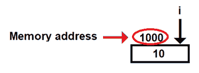

图 5.1

在前面的图中，**1000** 代表 **i** 变量的内存地址。尽管在现实中，内存地址非常大，并且是十六进制格式，但为了简单起见，我使用了一个小的整数数字，**1000**。**10** 的值存储在 **1000** 的内存地址中，如下所示图：

现在，可以定义一个如下所示的 **j** 整数指针：

```cpp
int *j;
```

通过以下语句，这个 **j** 整数指针可以指向 **i** 整数：

```cpp
j=&i;
```

`&`（与号）符号代表地址，**i** 的地址将被分配给 **j** 指针，如下所示图所示。假设 **2000** 地址是 **j** 指针的地址，而 **i** 指针的地址，即 **1000**，存储在分配给 **j** 指针的内存位置中，如下所示图：

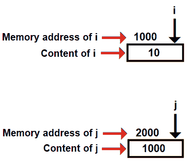

图 5.2

可以通过以下语句显示 **i** 整数的地址：

```cpp
printf("Address of i is %d\n", &i); 
printf("Address of i is %d\n", j);
```

要显示 `i` 的内容，我们可以使用以下语句：

```cpp
printf("Value of i is %d\n", i);
printf("Value of i is %d\n", *j);
```

在指针的情况下，`&`（与号）代表内存地址，`*`（星号）代表内存地址中的内容。

我们也可以通过以下语句定义一个指向整数指针的指针：

```cpp
int **k;
```

这个指向`k`整型指针的指针可以使用以下语句指向`j`整型指针：

```cpp
k=&j;
```

通过前面的语句，将`j`指针的地址分配给指向`k`整型指针的指针，如下面的图所示。假设**3000**是`k`的内存地址：

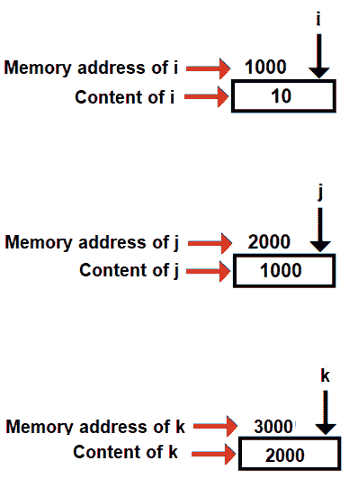

图 5.3

现在，当你显示`k`的值时，它将显示`j`的地址：

```cpp
printf("Address of j =%d %d \n",&j,k);
```

要显示`i`到`k`的地址，我们需要使用`*k`，因为`*k`表示它将显示由`k`指向的内存地址的内容。现在，`k`指向`j`，而`j`中的内容是`i`的地址：

```cpp
printf("Address of i = %d %d %d\n",&i,j,*k);
```

同样，要显示`i`到`k`的值，必须使用`**k`如下所示：

```cpp
printf("Value of i is %d %d %d %d \n",i,*(&i),*j,**k);
```

使用指针使我们能够精确地从所需的内存位置访问内容。但是，通过指针分配内存而不在任务完成后释放它可能会导致称为**内存泄漏**的问题。内存泄漏是一种资源泄漏。内存泄漏可能允许黑客未经授权访问内存内容，也可能阻止某些内容被访问，即使它们存在。

现在，让我们从这个章节的第一个菜谱开始。

# 使用指针反转字符串

在这个菜谱中，我们将学习如何使用指针反转一个字符串。最好的部分是，我们不会将字符串反转并复制到另一个字符串中，而是直接反转原始字符串本身。

# 如何做到这一点…

1.  输入一个字符串并将其分配给`str`字符串变量，如下所示：

```cpp
printf("Enter a string: ");
scanf("%s", str);
```

1.  设置一个指针指向字符串，如下面的代码所示。指针将指向字符串的第一个字符的内存地址：

```cpp
ptr1=str;
```

1.  通过初始化一个`n`变量为`1`来找到字符串的长度。设置一个`while`循环，当指针到达字符串的空字符时执行，如下所示：

```cpp
n=1;
while(*ptr1 !='\0')
{
```

1.  在`while`循环内部，将执行以下操作：

+   指针向前移动一个字符。

+   变量`n`的值增加 1：

```cpp
ptr1++;
n++;
```

1.  指针将位于空字符，因此将指针向后移动一步，使其指向字符串的最后一个字符，如下所示：

```cpp
ptr1--;
```

1.  设置另一个指针指向字符串的开头，如下所示：

```cpp
ptr2=str;
```

1.  交换等于字符串长度一半的字符。为此，设置一个`while`循环执行`n/2`次，如下面的代码片段所示：

```cpp
m=1;
while(m<=n/2)
```

1.  在`while`循环内部，首先进行交换操作；即，我们的指针指向的字符被交换：

```cpp
temp=*ptr1;
*ptr1=*ptr2;
*ptr2=temp;
```

1.  在字符交换后，将第二个指针向前移动以指向其下一个字符，即字符串的第二个字符，并将第一个指针向后移动使其指向倒数第二个字符，如下所示：

```cpp
ptr1--;
ptr2++;
```

1.  重复此过程 n/2 次，其中 n 是字符串的长度。当`while`循环结束时，我们将在屏幕上显示原始字符串的反转形式：

```cpp
printf("Reverse string is %s", str);
```

使用指针反转字符串的`reversestring.c`程序如下：

```cpp
#include <stdio.h>
void main()
{
    char str[255], *ptr1, *ptr2, temp ;
    int n,m;
    printf("Enter a string: ");
    scanf("%s", str);
    ptr1=str;
    n=1;
    while(*ptr1 !='\0')
    {
        ptr1++;
        n++;
    }
    ptr1--;
    ptr2=str;
    m=1;
    while(m<=n/2)
    {
        temp=*ptr1;
        *ptr1=*ptr2;
        *ptr2=temp;
        ptr1--;
        ptr2++;;
        m++;
    }
    printf("Reverse string is %s", str);
}
```

现在，让我们看看幕后。

# 它是如何工作的...

我们将被提示输入一个字符串，该字符串将被分配给`str`变量。字符串不过是一个字符数组。假设我们输入的名字是`manish`，名字中的每个字符将依次分配到数组的某个位置（参见*图 5.4*）。我们可以看到，字符串的第一个字符，字母**m**，被分配到**str[0]**位置，接着第二个字符串字符被分配到**str[1]**位置，以此类推。空字符，像往常一样，位于字符串的末尾，如下面的图所示：

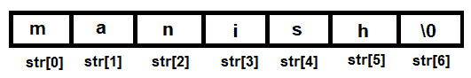

图 5.4

要反转字符串，我们将寻求两个指针的帮助：一个将被设置为指向字符串的第一个字符，另一个将被设置为指向字符串的最后一个字符。因此，第一个**ptr1**指针被设置为如下指向字符串的第一个字符：

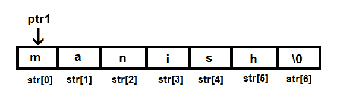

图 5.5

字符的交换必须执行到字符串长度的一半；因此，下一步将是找到字符串的长度。在找到字符串的长度后，**ptr1**指针将被设置为移动到字符串的最后一个字符。

此外，另一个**ptr2**指针被设置为指向字符串的第一个字符**m**，如下面的图所示：

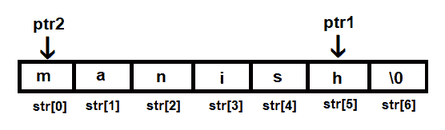

图 5.6

下一步是将**ptr1**和**ptr2**指针所指的字符串的第一个和最后一个字符进行交换（参见*图 5.7 (a)*）。在交换**ptr1**和**ptr2**指针所指的字符后，字符串将如图*图 5.7 (b)*所示：

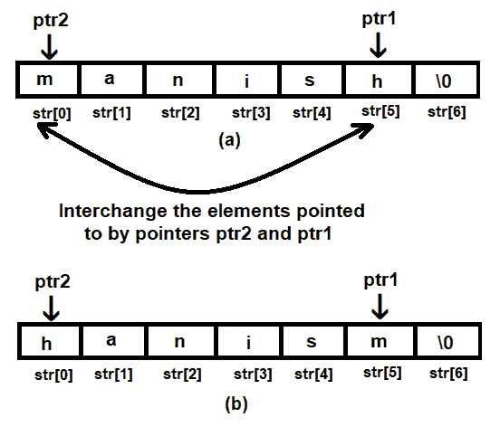

图 5.7

在交换第一个和最后一个字符之后，我们将交换字符串的第二和倒数第二个字符。为此，**ptr2**指针将被向前移动并设置为指向下一个字符，而**ptr1**指针将被向后移动并设置为指向倒数第二个字符。

你可以在下面的*图**5.8 (a)*中看到，**ptr2**和**ptr1**指针被设置为指向**a**和**s**字符。一旦这样做，**ptr2**和**ptr1**指针所指的字符将再次进行交换。交换**a**和**s**字符后，字符串将如下所示（*图 5.8 (b)*)：

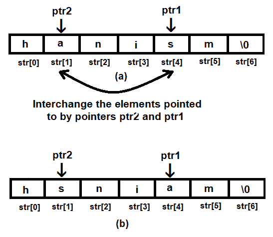

图 5.8

现在剩下的唯一任务是交换字符串中的第三个和倒数第三个字符。因此，我们将重复**ptr2**和**ptr1**指针的重新定位过程。在交换字符串中的**n**和**i**字符后，原始的**str**字符串将被反转，如下所示：

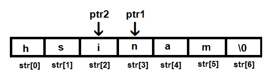

图 5.9

在应用上述步骤之后，如果我们打印`**str**`字符串，它将以相反的顺序出现。

让我们使用 GCC 编译`reversestring.c`程序，如下所示：

```cpp
D:\CBook>gcc reversestring.c -o reversestring
```

如果你没有错误或警告，这意味着`reversestring.c`程序已被编译成可执行文件，称为`reversestring.exe`。让我们按照以下方式运行此可执行文件：

```cpp
D:\CBook>./reversestring
Enter a string: manish
Reverse string is hsinam
```

哇！我们已经成功使用指针反转了一个字符串。现在，让我们继续下一个菜谱！

# 使用指针在数组中查找最大值

在这个菜谱中，将使用指针扫描数组的所有元素。

# 如何操作...

1.  使用以下方式定义一个名为`max`的宏，大小为`100`：

```cpp
#define max 100
```

1.  定义一个`p`整数数组，大小为`max`，如下所示：

```cpp
int p[max]
```

1.  指定数组中元素的数量如下：

```cpp
printf("How many elements are there? ");
scanf("%d", &n);
```

1.  按如下所示输入数组的元素：

```cpp
for(i=0;i<n;i++)
    scanf("%d",&p[i]);
```

1.  定义两个`mx`和`ptr`指针，如下所示，以指向数组的第一个元素：

```cpp
mx=p;
ptr=p;
```

1.  `mx`指针将始终指向数组的最大值，而`ptr`指针将用于比较数组剩余的值。如果`mx`指针指向的值小于`ptr`指针指向的值，则`mx`指针设置为指向`ptr`指针指向的值。然后，`ptr`指针将移动到指向下一个数组元素，如下所示：

```cpp
if (*mx < *ptr)
    mx=ptr;
```

1.  如果`mx`指针指向的值大于`ptr`指针指向的值，则`mx`指针保持不变，并继续指向相同的值，而`ptr`指针将移动到指向下一个数组元素，以便进行以下比较：

```cpp
ptr++;
```

1.  此过程会重复进行，直到数组（由`ptr`指针指向）的所有元素都与由`mx`指针指向的元素进行比较。最后，`mx`指针将指向数组中的最大值。要显示数组的最大值，只需显示由`mx`指针指向的数组元素，如下所示：

```cpp
printf("Largest value is %d\n", *mx);
```

使用指针查找数组中最大值的`largestinarray.c`程序如下：

```cpp
#include <stdio.h>
#define max 100
void main()
{
    int p[max], i, n, *ptr, *mx;
    printf("How many elements are there? ");
    scanf("%d", &n);
    printf("Enter %d elements \n", n);
    for(i=0;i<n;i++)
        scanf("%d",&p[i]);
    mx=p;
    ptr=p;
    for(i=1;i<n;i++)
    {
        if (*mx < *ptr)
            mx=ptr;
        ptr++;
    }
    printf("Largest value is %d\n", *mx);
}
```

现在，让我们看看幕后。

# 它是如何工作的...

定义一个特定大小的数组，并在其中输入一些元素。这些将是我们要找到最大值的值。输入一些元素后，数组可能如下所示：

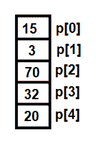

图 5.10

我们将使用两个指针来查找数组中的最大值。让我们将这两个指针命名为**mx**和**ptr**，其中**mx**指针将用于指向数组的最大值，而**ptr**指针将用于将数组的其余元素与**mx**指针指向的值进行比较。最初，两个指针都设置为指向数组的第一个元素**p[0]**，如下面的图所示：

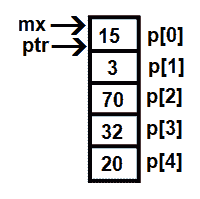

图 5.11

然后，**ptr**指针被移动到指向数组的下一个元素，**p[1]**。然后，**mx**和**ptr**指针指向的值将被比较。这个过程会一直持续到数组中的所有元素都被比较，如下所示：

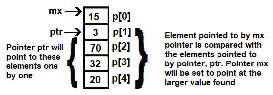

图 5.12

回想一下，我们希望**mx**指针保持指向较大的值。由于 15 大于 3（见*图 5.13*），**mx**指针的位置将保持不变，而**ptr**指针将移动到指向下一个元素，**p[2]**，如下所示：

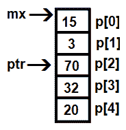

图 5.13

再次，**mx**和**ptr**指针指向的值，分别是 15 和 70，将被比较。现在，**mx**指针指向的值小于**ptr**指针指向的值。因此，**mx**指针将被设置为指向与**ptr**相同的数组元素，如下所示：

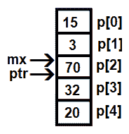

图 5.14

数组元素的比较将继续。想法是保持**mx**指针指向数组中的最大元素，如下面的图所示：

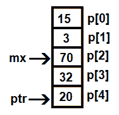

图 5.15

如*图 5.15*所示，**70**大于**20**，因此**mx**指针将保持在**p[2]**，而**ptr**指针将移动到下一个元素，**p[4]**。现在，**ptr**指针指向数组的最后一个元素。因此，程序将终止，显示**mx**指针指向的最后一个值，这恰好是数组中的最大值。

让我们使用 GCC 编译`largestinarray.c`程序，如下所示：

```cpp
D:\CBook>gcc largestinarray.c -o largestinarray
```

如果你没有错误或警告，这意味着`largestinarray.c`程序已经被编译成一个可执行文件，`largestinarray.exe`。现在，让我们按照以下方式运行这个可执行文件：

```cpp
D:\CBook>./largestinarray
How many elements are there? 5
Enter 5 elements
15
3
70
35
20
Largest value is 70
You can see that the program displays the maximum value in the array
```

哇！我们已经成功使用指针在数组中找到了最大值。现在，让我们继续下一个菜谱！

# 单链表的排序

在这个菜谱中，我们将学习如何创建一个由整数元素组成的单链表，然后我们将学习如何按升序排序这个链表。

单链表由几个通过指针连接的节点组成。单链表中的一个节点可能如下所示：

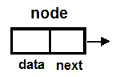

图 5.16

如你所见，单链表的一个节点是由两个部分组成的结构：

+   **数据**：这可以是一个或多个变量（也称为成员），可以是整数、浮点数、字符串或任何数据类型。为了使程序简单，我们将**data**作为一个整型变量。

+   **指针**：这个指针将指向类型节点的结构。在这个程序中，我们可以将其称为**next**指针，尽管它可以有任何一个名字。

我们将使用冒泡排序来对链表进行排序。冒泡排序是一种顺序排序技术，通过比较相邻元素进行排序。它将第一个元素与第二个元素进行比较，第二个元素与第三个元素进行比较，依此类推。如果元素不是按预期顺序排列，则交换它们的值。例如，如果你正在按升序排序元素，并且第一个元素大于第二个元素，它们的值将被交换。同样，如果第二个元素大于第三个元素，它们的值也将被交换。

这样，你会发现，在第一次迭代的结束时，最大的值会*冒泡*到列表的末尾。在第二次迭代后，第二大的值将被*冒泡*到列表的末尾。总的来说，使用冒泡排序算法对 n 个元素进行排序需要 n-1 次迭代。

让我们了解创建和排序单链表的步骤。

# 如何做到这一点...

1.  定义一个包含两个成员的节点—`data`和`next`。`data`成员用于存储整数值，而`next`成员是一个指针，用于将节点链接如下：

```cpp
struct node
{
  int data;
  struct node *next;
};
```

1.  指定链表中的元素数量。输入的值将被分配给`n`变量，如下所示：

```cpp
printf("How many elements are there in the linked list ?");
scanf("%d",&n);
```

1.  执行一个`for`循环，循环`n`次。在`for`循环内部，创建一个名为`newNode`的节点。当被要求时，输入一个整数值分配给`newNode`的数据成员，如下所示：

```cpp
newNode=(struct node *)malloc(sizeof(struct node));
scanf("%d",&newNode->data);
```

1.  设置两个指针，`startList`和`temp1`，以指向第一个节点。`startList`指针将始终指向链表的第一个节点。`temp1`指针将用于链接节点，如下所示：

```cpp
startList = newNode;
temp1=startList;
```

1.  为了连接新创建的节点，执行以下两个任务：

+   将`temp1`的下一个成员设置为指向新创建的节点。

+   `temp1`指针被移动以指向新创建的节点，如下所示：

```cpp
temp1->next = newNode;
temp1=newNode;
```

1.  当`for`循环结束时，我们将有一个单链表，其第一个节点由`startList`指向，最后一个节点的下一个指针指向 NULL。这个链表已经准备好进行排序过程。设置一个`for`循环，从`0`执行到`n-2`，即 n-1 次迭代，如下所示：

```cpp
for(i=n-2;i>=0;i--)
```

1.  在`for`循环内部，为了比较值，使用两个指针，`temp1`和`temp2`。最初，`temp1`和`temp2`将被设置为指向链表的前两个节点，如下面的代码片段所示：

```cpp
temp1=startList;
temp2=temp1->next;
```

1.  在以下代码中比较`temp1`和`temp2`所指向的节点：

```cpp
if(temp1->data > temp2->data)
```

1.  比较前两个节点后，`temp1`和`temp2`指针将被设置为指向第二个和第三个节点，依此类推：

```cpp
temp1=temp2;
temp2=temp2->next;
```

1.  链表必须按升序排列，因此`temp1`的数据成员必须小于`temp2`的数据成员。如果`temp1`的数据成员大于`temp2`的数据成员，则使用临时变量`k`交换数据成员的值，如下所示：

```cpp
k=temp1->data;
temp1->data=temp2->data;
temp2->data=k;
```

1.  经过 n-1 次迭代比较和交换连续值后，如果一对中的第一个值大于第二个值，则链表中的所有节点将按升序排列。为了遍历链表并按升序显示值，设置一个临时的`t`指针指向由`startList`指向的节点，即链表的第一节点，如下所示：

```cpp
t=startList;
```

1.  一个`while`循环执行，直到`t`指针达到`NULL`。回想一下，最后一个节点的下一个指针被设置为 NULL，因此`while`循环将执行，直到遍历链表中的所有节点，如下所示：

```cpp
while(t!=NULL)
```

1.  在`while`循环中，将执行以下两个任务：

+   指针`t`所指向的节点数据成员被显示。

+   将`t`指针进一步移动以指向其下一个节点：

```cpp
printf("%d\t",t->data);
t=t->next;
```

创建单链表并按升序排序的`sortlinkedlist.c`程序如下：

```cpp
/* Sort the linked list by bubble sort */
#include<stdio.h>
#include <stdlib.h>
struct node
{
  int data;
  struct node *next;
};
void main()
{
    struct node *temp1,*temp2, *t,*newNode, *startList;
    int n,k,i,j;
    startList=NULL;
    printf("How many elements are there in the linked list ?");
    scanf("%d",&n);
    printf("Enter elements in the linked list\n");
    for(i=1;i<=n;i++)
    {
        if(startList==NULL)
        {
            newNode=(struct node *)malloc(sizeof(struct node));
            scanf("%d",&newNode->data);
            newNode->next=NULL;
            startList = newNode;
            temp1=startList;
        }
        else
        {
            newNode=(struct node *)malloc(sizeof(struct node));
            scanf("%d",&newNode->data);
            newNode->next=NULL;
            temp1->next = newNode;
            temp1=newNode;
        }
    }
    for(i=n-2;i>=0;i--)
    {
        temp1=startList;
        temp2=temp1->next;
        for(j=0;j<=i;j++)
        {
            if(temp1->data > temp2->data)
            {
                k=temp1->data;
                temp1->data=temp2->data;
                temp2->data=k;
            }
            temp1=temp2;
            temp2=temp2->next;
        }
    }
    printf("Sorted order is: \n");
    t=startList;
    while(t!=NULL)
    {
        printf("%d\t",t->data);
        t=t->next;
    }
}
```

现在，让我们看看幕后。

# 它是如何工作的...

此程序分为两部分——第一部分是创建单链表，第二部分是排序链表。

让我们从第一部分开始。

# 创建单链表

我们将首先创建一个名为**newNode**的新节点。当提示输入时，我们将输入其数据成员的值，然后设置下一个**newNode**指针为**NULL**（如图 5.17 所示）。这个下一个指针将用于与其他节点连接（正如我们很快将看到的）：

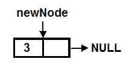

图 5.17

创建第一个节点后，我们将按照以下方式使两个指针指向它：

+   **startList**：为了遍历单链表，我们需要一个指向列表第一个节点的指针。因此，我们将定义一个名为**startList**的指针，并将其设置为指向列表的第一个节点。

+   **temp1**：为了与下一个节点连接，我们还需要一个额外的指针。我们将把这个指针称为**temp1**，并将其设置为指向**newNode**（见*图 5.18*）：

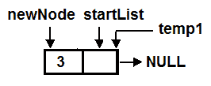

图 5.18

现在，我们将为链表创建另一个节点，并将其命名为 **newNode**。指针一次只能指向一个结构。因此，当我们创建一个新节点时，之前指向第一个节点的 **newNode** 指针现在将指向最近创建的节点。我们将被提示输入新节点数据成员的值，其下一个指针将被设置为 **NULL**。

你可以在下面的图中看到，两个指针 **startList** 和 **temp1** 指向第一个节点，而 **newNode** 指针指向新创建的节点。如前所述，**startList** 将用于遍历链表，而 **temp1** 将用于连接新创建的节点，如下所示：

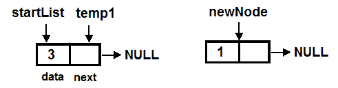

图 5.19

要将第一个节点与 **newNode** 连接，**temp1** 的下一个指针将被设置为指向 **newNode**（参见 *图 5.20（a）*）。连接 **newNode** 后，**temp**`1` 指针将被进一步移动并设置为指向 **newNode**（参见 *图 5.20（b）*），以便它可以再次用于连接未来可能添加到链表中的任何新节点：

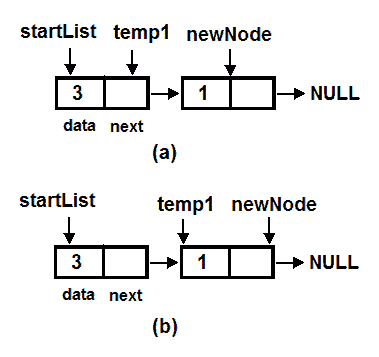

图 5.20

步骤三和四将重复应用于链表中的其余节点。最后，单链表将准备就绪，看起来可能如下所示：

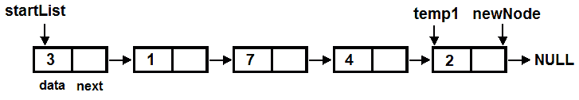

图 5.21

现在我们已经创建了单链表，下一步是将链表按升序排序。

# 对单链表进行排序

我们将使用冒泡排序算法对链表进行排序。在冒泡排序技术中，第一个值与第二个值进行比较，第二个值与第三个值进行比较，依此类推。如果我们想按升序排序我们的列表，那么在比较值时，我们需要将较小的值保持在顶部。

因此，在比较第一个和第二个值时，如果第一个值大于第二个值，则它们的顺序将被交换。如果第一个值小于第二个值，则不会发生交换，并将继续比较第二个和第三个值。

将会有 n-1 次这样的比较迭代，这意味着如果有五个值，那么将有四次这样的比较迭代；并且每次迭代后，最后一个值将被排除在外——也就是说，当它达到目的地时不会进行比较。这里的“目的地”是指当按升序排列时必须保持值的那个位置。

# 第一次迭代

为了对链表进行排序，我们将使用两个指针——**temp1** 和 **temp2**。**temp1** 指针被设置为指向第一个节点，而 **temp2** 被设置为指向下一个节点，如下所示：

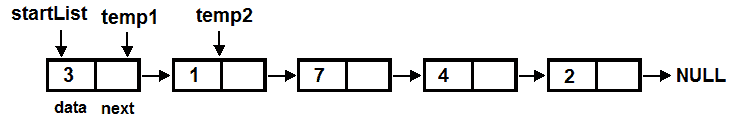

图 5.22

我们将按升序对链表进行排序，因此我们将较小的值保持在列表的起始位置。**temp1** 和 **temp2** 的数据成员将被比较。因为 `temp1->data` 大于 `temp2->data`，即 **temp1** 的数据成员大于 **temp2** 的数据成员，它们的顺序将被交换（见以下图表）。在交换 **temp1** 和 **temp2** 指向的节点数据成员之后，链表将呈现如下：

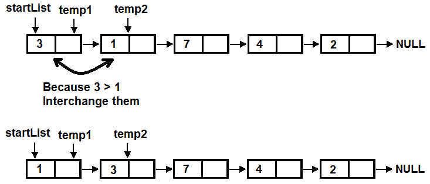

图 5.23

然后，这两个指针将进一步移动，即 **temp1** 指针将被设置为指向 **temp2**，而 **temp2** 指针将被设置为指向其下一个节点。我们可以在 *图 5.24 (a)* 中看到 **temp1** 和 **temp2** 指针分别指向值为 3 和 7 的节点。我们还可以看到 `temp1->data` 小于 `temp2->data`，即 3 < 7。由于 **temp1** 的数据成员已经小于 **temp2** 的数据成员，因此不会发生值交换，两个指针将简单地再向前移动一步（见 *图 5.24 (b)*）。

现在，因为 7 > 4，它们的顺序将被交换。**temp1** 和 **temp2** 指向的数据成员的值将按以下方式交换（*图 5.24 (c)*）：

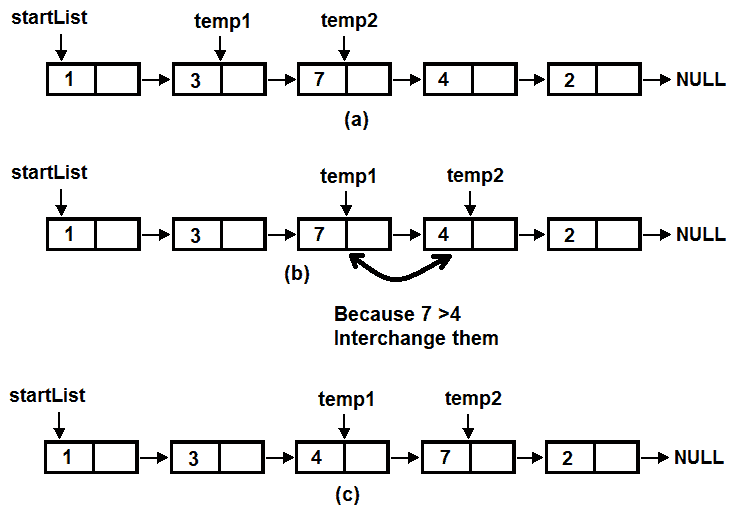

图 5.24

之后，**temp1** 和 **temp2** 指针将再向前移动一步，即 **temp1** 将指向 **temp2**，而 **temp2** 将移动到其下一个节点。我们可以在下面的 *图 5.25 (a)* 中看到 **temp1** 和 **temp2** 分别指向值为 7 和 2 的节点。再次，**temp1** 和 **temp2** 的数据成员将被比较。因为 `temp1->data` 大于 `temp2->data`，它们的顺序将被交换。*图 5.25 (b)* 显示了交换数据成员值后的链表：

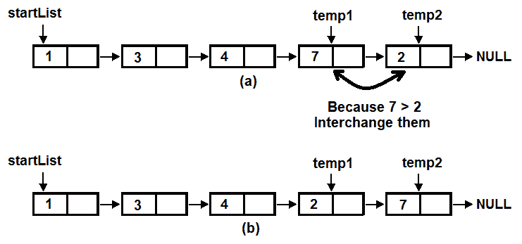

图 5.25

这是一次迭代，你可以注意到在这次迭代之后，最大的值 7 已经被设置到我们期望的位置——链表的末尾。这也意味着在第二次迭代中，我们不需要比较最后一个节点。同样，在第二次迭代之后，第二大的值将达到或被设置到其实际位置。链表中的第二大的值是 4，因此，在第二次迭代之后，四个节点将刚好到达七个节点。如何做到？让我们看看冒泡排序的第二次迭代。

# 第二次迭代

我们将从比较前两个节点开始，因此 `**temp1**` 和 `**temp2**` 指针将被设置为分别指向链表的第一个和第二个节点（参见 *图 5.26 (a)*）。将比较 `**temp1**` 和 `**temp2**` 的数据成员。如清晰可见，`temp1->data` 小于 `temp2->data`（即 1 < 7），因此它们的位置不会互换。之后，`**temp1**` 和 `**temp2**` 指针将再向前移动一步。我们可以在 *图 5.26 (b)* 中看到，`**temp1**` 和 `**temp2**` 指针被设置为分别指向值为 3 和 4 的节点：

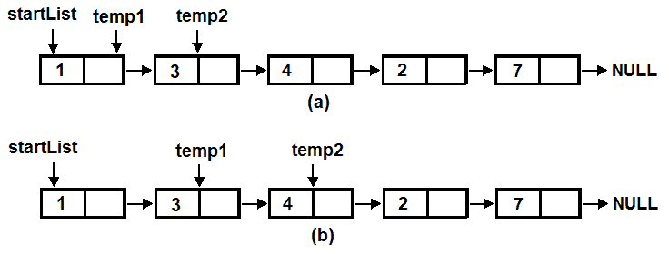

图 5.26

再次，将比较 `**temp1**` 和 `**temp2**` 指针的数据成员。因为 `temp1->data` 小于 `temp2->data`，即 3 < 4，它们的位置再次不会互换，`**temp1**` 和 `**temp2**` 指针将再次向前移动一步。也就是说，`**temp1**` 指针将被设置为指向 `**temp2**`，而 `**temp2**` 将被设置为指向它的下一个节点。您可以在 *图 5.27 (a)* 中看到，**temp1** 和 **temp2** 指针被设置为分别指向值为 4 和 2 的节点。因为 4 > 2，它们的位置将互换。在交换这些值的位置后，链表在 *图 5.27 (b)* 中将如下所示：

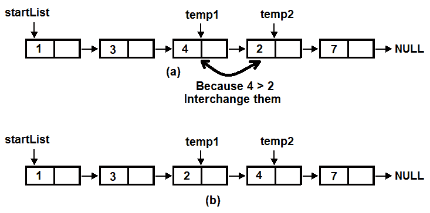

图 5.27

这是第二次迭代的结束，我们可以看到第二大值，四，按照升序被设置到我们期望的位置。因此，在每次迭代中，一个值将被设置到所需的位置。相应地，下一次迭代将需要少一次比较。

# 第三次和第四次迭代

在第三次迭代中，我们只需要进行以下比较：

1.  比较第一个和第二个节点

1.  比较第二个和第三个节点

在第三次迭代后，第三大的值，即三，将被设置在我们期望的位置，即在节点四之前。

在第四次，也是最后一次迭代中，只有第一个和第二个节点将被比较。经过第四次迭代后，链表将按升序排序如下：

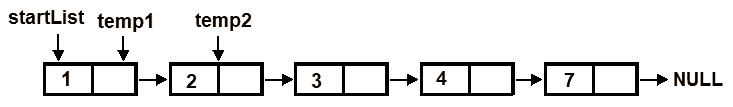

图 5.28

让我们使用 GCC 来编译 `sortlinkedlist.c` 程序，如下所示：

```cpp
D:\CBook>gcc sortlinkedlist.c -o sortlinkedlist
```

如果你没有收到任何错误或警告，这意味着 `sortlinkedlist.c` 程序已经被编译成一个可执行文件，`sortlinkedlist.exe`。让我们按照以下步骤运行这个可执行文件：

```cpp
D:\CBook>./sortlinkedlist
How many elements are there in the linked list ?5
Enter elements in the linked list
3
1
7
4
2
Sorted order is:
1       2       3       4       7
```

哇！我们已经成功创建并排序了一个单链表。现在，让我们继续下一个菜谱！

# 使用指针寻找矩阵的转置

这个菜谱最好的部分是，我们不仅将使用指针显示矩阵的转置，而且我们还将使用指针创建矩阵本身。

矩阵的转置是一个新矩阵，其行数等于原始矩阵的列数，列数等于原始矩阵的行数。以下图表显示了**2 x 3**阶矩阵及其**3 x 2**阶转置：

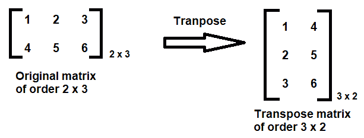

图 5.29

基本上，我们可以这样说，当将矩阵的行转换为列，列转换为行时，你得到的就是它的转置。

# 如何操作…

1.  定义一个 10 行 10 列的矩阵如下（如果你愿意，可以有一个更大的矩阵）：

```cpp
int a[10][10]
```

1.  按如下输入行和列的大小：

```cpp
    printf("Enter rows and columns of matrix: ");
    scanf("%d %d", &r, &c);
```

1.  为保持矩阵元素，分配等于`r * c`数量的内存位置如下：

```cpp
    ptr = (int *)malloc(r * c * sizeof(int));
```

1.  按如下顺序将矩阵的元素输入到每个分配的内存中：

```cpp
    for(i=0; i<r; ++i)
    {
        for(j=0; j<c; ++j)
        {
            scanf("%d", &m);
             *(ptr+ i*c + j)=m;
        }
    }
```

1.  为了通过指针访问此矩阵，将`ptr`指针设置为指向分配的内存块的第一个内存位置，如*图 5.30*所示。当`ptr`指针设置为指向第一个内存位置时，它将自动获取第一个内存位置的地址，因此`1000`将被分配给`ptr`指针：

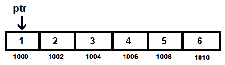

图 5.30

1.  要访问这些内存位置并显示其内容，请在嵌套循环中使用`*(ptr +i*c + j)`公式，如以下代码片段所示：

```cpp
for(i=0; i<r; ++i)
{
    for(j=0; j<c; ++j)
    {
        printf("%d\t",*(ptr +i*c + j));
    }
    printf("\n");
}
```

1.  假设行的值`r`为二，列的值`c`为三。当`i=0`和`j=0`时，公式将计算如下：

```cpp
*(ptr +i*c + j);
*(1000+0*3+0)
*1000
```

它将显示内存地址`1000`的内容。

当`i=0`和`j=1`时，公式将计算如下：

```cpp
*(ptr +i*c + j);
*(1000+0*3+1)
*(1000+1)
*(1002)
```

我们首先将`*(1000+1)`，因为`ptr`指针是一个整数指针，每次我们在每个内存位置将值`1`加到它上面时，它将自动跳过两个字节，从而得到`*(1002)`，并显示内存位置`1002`的内容。

同样，`i=0`和`j=2`的值将导致`*(1004)`；即显示内存位置`1004`的内容。使用此公式，`i=1`和`j=0`将导致`*(1006)`；`i=1`和`j=1`将导致`*(1008)`；`i=1`和`j=2`将导致`*(1010)`。因此，当在嵌套循环中应用上述公式时，原始矩阵将显示如下：

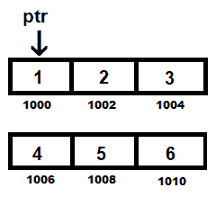

图 5.31

1.  要显示矩阵的转置，请在嵌套循环中应用以下公式：

```cpp
*(ptr +j*c + i))
```

再次假设行的值（r=2）和列的值（c=3），以下内存位置的内容将被显示：

| **i** | **j** | **内存地址** |
| --- | --- | --- |
| 0 | 0 | `1000` |
| 0 | 1 | `1006` |
| 1 | 0 | `1002` |
| 1 | 1 | `1008` |
| 2 | 0 | `1004` |
| 2 | 1 | `1010` |

因此，应用上述公式后，以下内存地址的内容将显示为*图 5.32*中的以下内容。这些内存地址的内容将构成矩阵的转置：

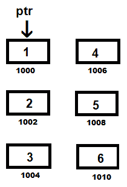

图 5.32

让我们看看这个公式如何在程序中应用。

使用指针显示矩阵转置的`transposemat.c`程序如下：

```cpp
#include <stdio.h>
#include <stdlib.h>
void main()
{
    int a[10][10],  r, c, i, j, *ptr,m;
    printf("Enter rows and columns of matrix: ");
    scanf("%d %d", &r, &c);
    ptr = (int *)malloc(r * c * sizeof(int));
    printf("\nEnter elements of matrix:\n");
    for(i=0; i<r; ++i)
    {
        for(j=0; j<c; ++j)
        {
            scanf("%d", &m);
             *(ptr+ i*c + j)=m;
        }
    }
    printf("\nMatrix using pointer is: \n");
    for(i=0; i<r; ++i)
    {
        for(j=0; j<c; ++j)
        {
           printf("%d\t",*(ptr +i*c + j));
        }
        printf("\n");
    }
    printf("\nTranspose of Matrix:\n");
    for(i=0; i<c; ++i)
    {
        for(j=0; j<r; ++j)
        {
             printf("%d\t",*(ptr +j*c + i));
        }
        printf("\n");
   }
}
```

现在，让我们看看幕后。

# 它是如何工作的...

每当定义一个数组时，它内部分配的内存是顺序内存。现在让我们定义一个 2 x 3 大小的矩阵，如图所示。在这种情况下，矩阵将被分配六个连续的内存位置，每个位置两个字节（参见*图 5.33*）。为什么是每个位置两个字节？这是因为一个整数占用两个字节。这也意味着如果我们定义一个浮点类型的矩阵，它占用四个字节，每个分配的内存位置将包含四个字节：

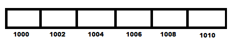

图 5.33

实际上，内存地址很长，并且是十六进制格式；但为了简单起见，我们将使用整数类型的内存地址，并使用易于记忆的数字，如**1000**，作为内存地址。在内存地址**1000**之后，下一个内存地址是**1002**（因为一个整数占用两个字节）。

现在，为了使用指针以行主序形式显示原始矩阵元素，我们需要显示内存位置的元素，**1000**、**1002**、**1004**以及如此等等：

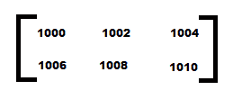

图 5.34

同样，为了使用指针显示矩阵的转置，我们需要显示内存位置的元素；**1000**、**1006**、**1002**、**1008**、**1004**和**1010**：

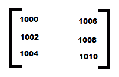

图 5.35

让我们使用 GCC 编译`transposemat.c`程序，如下所示：

```cpp
D:\CBook>gcc transposemat.c -o transposemat
```

如果你没有错误或警告，这意味着`transposemat.c`程序已经被编译成可执行文件，`transposemat.exe`。让我们用以下代码片段运行这个可执行文件：

```cpp
D:\CBook>./transposemat
Enter rows and columns of matrix: 2 3

Enter elements of matrix:
1
2
3
4
5
6

Matrix using pointer is:
1       2       3
4       5       6

Transpose of Matrix:
1       4
2       5
3       6
```

哇！我们已经成功使用指针找到了矩阵的转置。现在，让我们继续下一个菜谱！

# 使用指针访问结构

在这个菜谱中，我们将创建一个结构来存储特定客户下单的信息。结构是一种用户定义的数据类型，可以在其中存储不同数据类型的多个成员。该结构将包含用于存储订单号、电子邮件地址和密码的成员：

```cpp
struct cart
{  
    int orderno;
    char emailaddress[30];
    char password[30];
};
```

上述结构被命名为`cart`，包含三个成员——用于存储客户下单顺序号的`int`类型成员`orderno`，以及用于存储客户电子邮件地址和密码的字符串类型成员`emailaddress`和`password`。让我们开始吧！

# 如何做到这一点…

1.  定义一个名为`mycart`的`cart`结构。同时，定义两个指向`cart`结构的指针`ptrcart`和`ptrcust`，如下面的代码片段所示：

```cpp
struct cart mycart;
struct cart *ptrcart, *ptrcust;
```

1.  输入客户的订单号、电子邮件地址和密码，这些值将通过`mycart`结构变量接受。如前所述，点运算符（`.`）将用于通过结构变量访问结构成员`orderno`、`emailaddress`和`password`，如下所示：

```cpp
printf("Enter order number: ");
scanf("%d",&mycart.orderno);
printf("Enter email address: ");
scanf("%s",mycart.emailaddress);
printf("Enter password: ");
scanf("%s",mycart.password);
```

1.  使用`ptrcart=&mycart`语句将`ptrcart`结构指针设置为指向`mycart`结构。因此，`ptrcart`结构指针将能够通过使用箭头（`->`）运算符访问`mycart`结构的成员。通过使用`ptrcart->orderno`、`ptrcart->emailaddress`和`ptrcart->password`，可以访问分配给`orderno`、`emailaddress`和`password`结构成员的值并显示它们：

```cpp
printf("\nDetails of the customer are as follows:\n");
printf("Order number : %d\n", ptrcart->orderno);
printf("Email address : %s\n", ptrcart->emailaddress);
printf("Password : %s\n", ptrcart->password);
```

1.  我们还将通过让客户输入新的电子邮件地址和密码并接受通过指向`ptrcart`结构的新的详细信息来修改客户的电子邮件地址和密码。因为`ptrcart`指向`mycart`结构，新的电子邮件地址和密码将覆盖分配给`mycart`结构成员的现有值：

```cpp
printf("\nEnter new email address: ");
scanf("%s",ptrcart->emailaddress);
printf("Enter new password: ");
scanf("%s",ptrcart->password);
/*The new modified values of orderno, emailaddress and password members are displayed using structure variable, mycart using dot operator (.).*/
printf("\nModified customer's information is:\n");
printf("Order number: %d\n", mycart.orderno);
printf("Email address: %s\n", mycart.emailaddress);
printf("Password: %s\n", mycart.password);
```

1.  然后，定义一个指向`*ptrcust`结构的指针。使用以下`malloc`函数为其分配内存。`sizeof`函数将找出每个结构成员消耗的字节数，并返回整个结构消耗的总字节数：

```cpp
ptrcust=(struct cart *)malloc(sizeof(struct cart));
```

1.  输入客户的订单号、电子邮件地址和密码，所有这些值将通过指向结构的指针分配给相应的结构成员，如下所示。显然，将使用箭头运算符（`->`）通过指向结构的指针访问结构成员：

```cpp
printf("Enter order number: ");
scanf("%d",&ptrcust->orderno);
printf("Enter email address: ");
scanf("%s",ptrcust->emailaddress);
printf("Enter password: ");
scanf("%s",ptrcust->password);
```

1.  然后，通过以下方式再次通过指向`ptrcust`结构的指针显示用户输入的值：

```cpp
printf("\nDetails of the second customer are as follows:\n");
printf("Order number : %d\n", ptrcust->orderno);
printf("Email address : %s\n", ptrcust->emailaddress);
printf("Password : %s\n", ptrcust->password);
```

以下`pointertostruct.c`程序解释了如何使用指针访问结构：

```cpp
#include <stdio.h>
#include <stdlib.h>

struct cart
{
    int orderno;
    char emailaddress[30];
    char password[30];
};

void main()
{
    struct cart mycart;
    struct cart *ptrcart, *ptrcust;
    ptrcart = &mycart;
    printf("Enter order number: ");
    scanf("%d",&mycart.orderno);
    printf("Enter email address: ");
    scanf("%s",mycart.emailaddress);
    printf("Enter password: ");
    scanf("%s",mycart.password);
    printf("\nDetails of the customer are as follows:\n");
    printf("Order number : %d\n", ptrcart->orderno);
    printf("Email address : %s\n", ptrcart->emailaddress);
    printf("Password : %s\n", ptrcart->password);

    printf("\nEnter new email address: ");
    scanf("%s",ptrcart->emailaddress);
    printf("Enter new password: ");
    scanf("%s",ptrcart->password);
    printf("\nModified customer's information is:\n");
    printf("Order number: %d\n", mycart.orderno);
    printf("Email address: %s\n", mycart.emailaddress);
    printf("Password: %s\n", mycart.password);

    ptrcust=(struct cart *)malloc(sizeof(struct cart));
    printf("\nEnter information of another customer:\n");
    printf("Enter order number: ");
    scanf("%d",&ptrcust->orderno);
    printf("Enter email address: ");
    scanf("%s",ptrcust->emailaddress);
    printf("Enter password: ");
    scanf("%s",ptrcust->password);
    printf("\nDetails of the second customer are as follows:\n");
    printf("Order number : %d\n", ptrcust->orderno);
    printf("Email address : %s\n", ptrcust->emailaddress);
    printf("Password : %s\n", ptrcust->password);
}
```

现在，让我们看看幕后。

# 它是如何工作的...

当您定义一个结构类型的变量时，该变量可以以下格式访问结构成员：

```cpp
structurevariable.structuremember
```

您可以在结构变量和结构成员之间看到一个点（`.`）。这个点（`.`）也被称为点运算符，或成员访问运算符。以下示例将使其更清晰：

```cpp
struct cart mycart;
mycart.orderno
```

在前面的代码中，您可以看到`mycart`被定义为`cart`结构的结构变量。现在，`mycart`结构变量可以通过使用成员访问运算符（`.`）访问`orderno`成员。

您还可以定义一个指向结构的指针。以下语句将`ptrcart`定义为指向`cart`结构的指针。

```cpp
struct cart *ptrcart;
```

当结构体指针指向一个结构体变量时，它可以访问该结构体变量的结构体成员。在以下语句中，指向 `ptrcart` 结构体的指针指向 `mycart` 结构体变量的地址：

```cpp
ptrcart = &mycart;
```

现在，`ptrcart` 可以访问结构体成员，但将使用箭头操作符 (`->`) 而不是点操作符 (`.`)。以下语句使用指向结构体的指针访问结构体的 `orderno` 成员：

```cpp
ptrcart->orderno
```

如果你不想让结构体指针指向结构体变量，那么需要为指向结构体的指针分配内存以访问结构体成员。以下语句通过为它分配内存来定义一个指向结构体的指针：

```cpp
ptrcust=(struct cart *)malloc(sizeof(struct cart));
```

上述代码为 `cart` 结构体分配了与结构体大小相等的内存，将该内存类型转换为指向 `cart` 结构体的指针，并将分配的内存赋值给 `ptrcust`。换句话说，`ptrcust` 被定义为指向结构体的指针，它不需要指向任何结构体变量，但可以直接访问结构体成员。

让我们使用 GCC 编译 `pointertostruct.c` 程序，如下所示：

```cpp
D:\CBook>gcc pointertostruct.c -o pointertostruct
```

如果你没有收到任何错误或警告，这意味着 `pointertostruct.c` 程序已经被编译成一个可执行文件，名为 `pointertostruct.exe`。让我们按照以下方式运行这个可执行文件：

```cpp
D:\CBook>./pointertostruct
Enter order number: 1001
Enter email address: bmharwani@yahoo.com
Enter password: gold

Details of the customer are as follows:
Order number : 1001
Email address : bmharwani@yahoo.com
Password : gold

Enter new email address: harwanibm@gmail.com
Enter new password: diamond

Modified customer's information is:
Order number: 1001
Email address: harwanibm@gmail.com
Password: diamond

Enter information of another customer:
Enter order number: 1002
Enter email address: bintu@yahoo.com
Enter password: platinum

Details of the second customer are as follows:
Order number : 1002
Email address : bintu@yahoo.com
Password : platinum
```

哇！我们已经成功使用指针访问了一个结构体。
