# 排序和搜索

如其名所示，搜索是定位一组元素中特定元素的过程。搜索可以大致分为以下两种类型：

+   **线性搜索**：在列表中逐个元素顺序搜索以找到所需项。

+   **二分搜索**：假设列表已经排序，将列表的中间值与要搜索的项进行比较，以确定需要考虑搜索项的列表哪一半。列表分割的过程会持续进行，直到找到项。

另一方面，排序是将某些元素按特定顺序排列的过程。顺序可以是升序、降序或另一个特定顺序。不仅可以对单个数字和字符串进行排序，还可以对记录进行排序。记录是根据每个记录独特的键进行排序的。这些是排序的两个主要类别：

+   **内部排序**：所有要排序的元素都一起上传到主存储器

+   **外部排序**：一些要排序的元素上传到主存储器，其余的保持在辅助存储器中，例如硬盘或 U 盘

为了能够进行有效的搜索，我们需要知道如何排序数据。排序是必要的，因为它使得搜索任务变得非常容易和快速。

在本章中，你将学习以下菜谱：

+   使用二分搜索搜索项

+   使用冒泡排序按升序排列数字

+   使用插入排序按升序排列数字

+   使用快速排序按升序排列数字

+   使用堆排序按降序排列数字

让我们从第一个菜谱开始！

# 使用二分搜索搜索项

二分搜索使用**分而治之**的方法。要搜索的项与数组或文件中的中间项进行比较。这有助于确定数组的哪一半或文件可能包含要搜索的项。之后，将考虑的半个数组的中间值与要搜索的项进行比较，以确定数组的哪四分之一可能包含要搜索的项。这个过程会持续进行，直到找到要搜索的项，或者无法再对数组或文件进行分割，在这种情况下，可以理解为要搜索的项不在文件或数组中。

# 如何做到这一点...

考虑一个大小为`len`的元素数组`arr`。我们想要在这个数组中搜索一个数字`numb`。以下是使用二分搜索在`arr`数组中搜索`numb`的步骤：

1.  初始化两个变量，`lower`和`upper`。

1.  计算数组的中间位置。

1.  如果要搜索的值`numb`在位置`arr[mid]`找到，则显示`Value found`并退出（即跳转到*步骤 8*）。

1.  如果你的搜索值大于数组的中间值，将搜索范围限制在数组的下半部分。因此，将数组的下限设置为数组的中间值。

1.  如果你的搜索值小于数组的中间值，将搜索范围限制在数组的上半部分。因此，将数组的上限设置为数组的中间值。

1.  只要`upper>=lower`，就重复步骤 3 到 5。

1.  只有在找不到值的情况下，才会执行此步骤。然后显示`Value not found`并退出。

1.  退出。

使用二分搜索技术在排序数组中搜索元素的程序如下：

```cpp
//binarysearch.c

#include <stdio.h>

#define max 20
int binary_search(int[], int, int);

int main() {
  int len, found, numb, arr[max], i;
  printf("Enter the length of an array: ");
  scanf("%d", & len);
  printf("Enter %d values in sorted order \n", len);
  for (i = 0; i < len; i++)
    scanf("%d", & arr[i]);
  printf("Enter the value to search ");
  scanf("%d", & numb);
  found = binary_search(arr, numb, len);
  if (found == numb)
    printf("Value %d is found in the list\n", numb);
  else
    printf("Value %d is not found in the list \n", numb);
  return 0;
}

int binary_search(int arr[], int pnumb, int plen) {
  int lindex = 0, mid, uindex = plen - 1, nfound;
  while (uindex >= lindex) {
    mid = (uindex + lindex) / 2;
    if (pnumb == arr[mid]) {
      nfound = arr[mid];
      break;
    } else {
      if (pnumb > arr[mid])
        lindex = mid + 1;
      else
        uindex = mid - 1;
    }
  }
  return (nfound);
}
```

现在，让我们深入了解代码，以更好地理解它。

# 它是如何工作的...

让我们定义一个大小为 20 的宏`max`和一个大小为`max`的数组`arr`，即 20 个元素（你可以将`max`宏的值增加到任何更大的值）。接下来，我们将指定数组的长度。假设你输入的长度是 8，然后分配给`len`变量。当被提示时，输入指定的排序元素数量。你输入的排序元素将被分配给`arr`数组，如下所示：

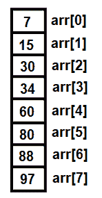

图 9.1

然后，你将被提示输入你想要在排序数组中搜索的数字。假设你选择了 45；这个数字将被分配给`numb`变量。我们将调用`binary_search`函数，并将三个项目——包含要搜索的数字的`arr`数组、包含数字的`numb`变量以及数组的长度`len`——传递给函数。`arr`、`numb`和`len`参数将分别分配给`arr`、`pnumb`和`plen`参数。

在`binary_search`函数中，我们将初始化两个变量：`lindex`设置为`0`和`uindex`设置为`7`，即等于数组的长度；这两个索引分别代表数组的下标和上标位置。因为数组是基于 0 的，所以数组的第八个元素将在索引位置 7。我们将设置一个`while`循环，只要`uindex`的值大于或等于`lindex`的值就执行。

要将搜索值与数组的中间值进行比较，我们首先计算中间值；将`lindex`和`uindex`的值相加，然后除以 2。`(0+7)/2`的结果是 3。然后，将`numb`变量的值，即 45，与计算得出的位置`arr[3]`的值进行比较，即与 34（见图 9.2）进行比较：

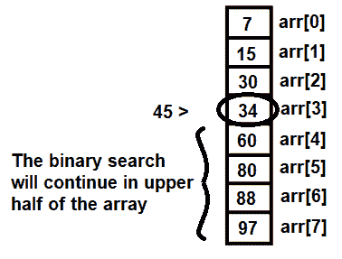

图 9.2

因为 45 大于 34，所以我们必须继续在数组的下半部分进行搜索。然而，由于我们的列表是按升序排序的，我们现在可以集中搜索数组的下半部分。

现在，将`lindex`的值设置为`mid+1`，即等于 4。再次执行`while`循环，因为`uindex`，即 7，仍然大于`lindex`。我们现在将计算数组上半部分的中值：(4+7)/2 = 5。搜索值 45 将与`arr[5]`进行比较，即与 80 进行比较。因为 45 小于 80，我们将继续在数组的下半部分进行搜索，如下所示：

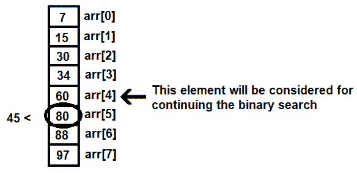

图 9.3

接下来，将`uindex`的值设置为`mid-1`，即等于 4。我们之前计算的`lindex`的值也是 4。由于 4 等于 4，我们将会再次执行`while`循环。数组的中值将被计算为(4+4)/2，即搜索值 45 将与`arr[4]`进行比较，而`arr[4]`的值是 60。

因为 45 < 60，所以`uindex`的值将被设置为`mid-1`，即等于 3。`while`循环将退出，因为我们的`uindex (3)`不再大于我们的`lindex (4)`。`binary_search`函数将`nfound`变量返回到`main`函数。`nfound`变量包含一些垃圾值，然后在`main`函数中将这些值分配给`found`变量。在`main`函数中，`found`和`numb`变量中的值将被比较。因为垃圾值不等于`numb`变量中的值 45，屏幕上将会显示消息`Value 45 is not found in the list`。

假设你现在想要搜索值 15。`lindex`和`uindex`的初始值将再次是 0 和 7。`while`循环将会执行，中值将被计算为(0+7)/2，这将得到 3。值 15 将与相应的位置`arr[3]`进行比较，即与 34 进行比较。值 15 小于 34，因此将考虑数组的上半部分以继续二分搜索，如图所示：


图 9.4

将`uindex`变量的值设置为`mid-1`，即等于 2。因为`uindex`仍然大于`lindex`，即 2 >= 0，`while`循环将再次执行。再次，中值被计算为(0+2)/2，即 1。这意味着 15 将与`arr[1]`元素进行比较。

在`arr[1]`位置上的值仅为 15；因此，在`binary_search`函数中将`nfound`变量设置为 15，并将`nfound`变量返回到`main`函数。在`main`函数中，`nfound`变量的值将被分配给`found`变量。因为`found`和`numb`变量中的值相同，屏幕上将会显示消息`Value 15 is found in the list`。

程序使用 GCC 编译，如下所示截图。因为没有错误出现在编译过程中，这意味着`binarysearch.c`程序已经成功编译成 EXE 文件，即`binarysearch.exe`文件。在执行可执行文件时，如果我们尝试搜索列表中不存在的值，我们会得到以下输出：

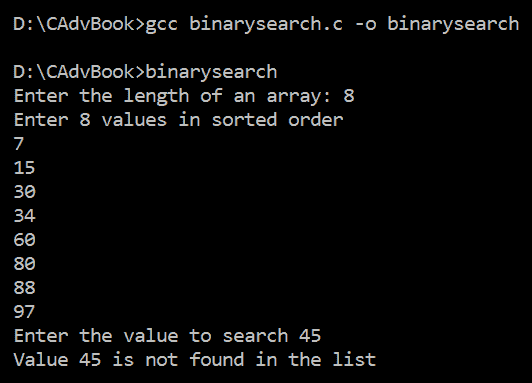

图 9.5

如果我们再次运行可执行文件并输入数组中存在的数字，我们可能会得到以下输出：

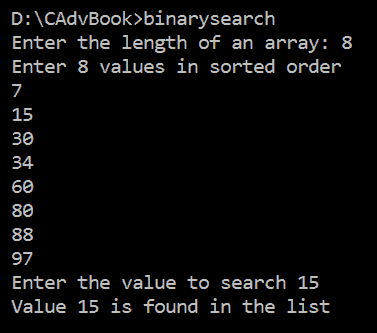

图 9.6

哇！我们已经成功使用二分搜索在有序数组中定位一个项目。现在让我们继续下一个菜谱！

# 使用冒泡排序按升序排列数字

在这个菜谱中，我们将学习如何使用冒泡排序技术按升序排列一些整数。在这个技术中，第一个元素与第二个元素进行比较，第二个元素与第三个元素进行比较，第三个元素与第四个元素进行比较，依此类推。

# 如何做到这一点...

考虑一个大小为`len`个元素的数组`arr`。我们想要按升序排列`arr`数组中的元素。以下是这样做的方法：

1.  初始化一个变量，例如`i`，为`len -2`。

1.  重复*步骤 3*到*5*，直到`i >=1`。每次迭代后，`i`的值将减 1，即`i=len-2`，`len-3`，`len-4`，……，`1`。

1.  初始化另一个变量，`j`，为`0`。

1.  重复*步骤 5*到`j<=i`。每次迭代后，`j`的值将增加，即`j=1`，`2`，……，`i`。

1.  如果`arr[j] > arr[j+1]`，则交换这两个值。

1.  退出搜索。

使用冒泡排序技术对整数数组元素进行排序的程序如下：

```cpp
//bubblesort.c

#include <stdio.h>

#define max 20
int main() {
  int arr[max], temp, len, i, j;
  printf("How many values are there? ");
  scanf("%d", & len);
  printf("Enter %d values to sort\n", len);
  for (i = 0; i < len; i++)
    scanf("%d", & arr[i]);
  for (i = len - 2; i >= 1; i--) {
    for (j = 0; j <= i; j++) {
      if (arr[j] > arr[j + 1]) {
        temp = arr[j];
        arr[j] = arr[j + 1];
        arr[j + 1] = temp;
      }
    }
  }
  printf("The sorted array is:\n");
  for (i = 0; i < len; i++)
    printf("%d\n", arr[i]);
  return 0;
}
```

现在，让我们深入了解代码，以更好地理解它。

# 它是如何工作的...

我们将首先定义一个值为 20 的宏`max`。您可以根据需要始终增加`max`的值。然后，我们将定义一个大小为`max`的数组`arr`，即大小为 20。您将被询问您想要排序多少个值。假设您想要排序七个元素，您输入的值将被分配给`len`变量。您将被提示输入要排序的值，然后这些值将被分配给`arr`数组。`arr`数组中要排序的七个值可能如下所示：

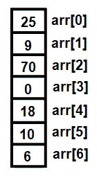

图 9.7

现在，我们将运行两个嵌套的`for`循环：外层`for`循环将从`len-2`开始执行，即从值 5 到 1 按降序执行，内层`for`循环将执行从 0 到`i`的值。这意味着，在第一次迭代中，`i`的值将是 5，所以内层`for` `j`循环将执行从 0 到 5。在内层`for`循环中，`arr`的第一个值将与第二个值进行比较，第二个值与第三个值进行比较，依此类推：

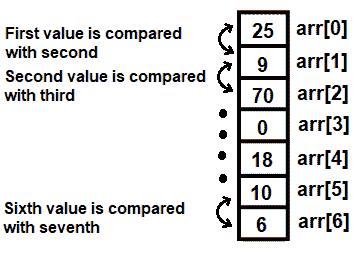

图 9.8

趋势是保持较低索引处的值小于较高索引处的值。如果第一个值大于第二个值，它们将交换位置；如果第一个值已经小于第二个值，那么接下来要考虑的是下一对值，即第二个和第三个值。同样，如果第二个值大于第三个值，它们也会交换位置；如果不是，那么接下来要比较的将是下一组值，即第三个和第四个值。这个过程将持续进行，直到最后一对值，即在我们的例子中是第六个和第七个值，进行比较。

整个第一次比较迭代过程如下所示：

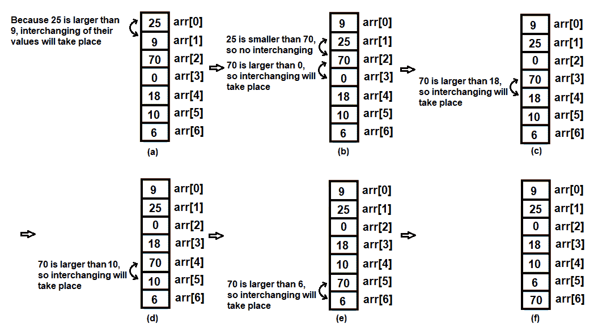

图 9.9

您可以看到，在第一次迭代后，最大的值已经冒泡到列表的底部。现在，外循环的值，即`i`的值将减 1，变为 4。因此，内循环中的`j`值将使`for`循环从值 0 运行到 4。这也意味着现在，第一个值将与第二个值进行比较，第二个值与第三个值进行比较，依此类推。最后，第五个值（即索引位置 4 的值）将与第六个值（即索引位置 5 的值）进行比较。索引位置 6 的最后元素不会进行比较，因为它已经处于正确的位置：

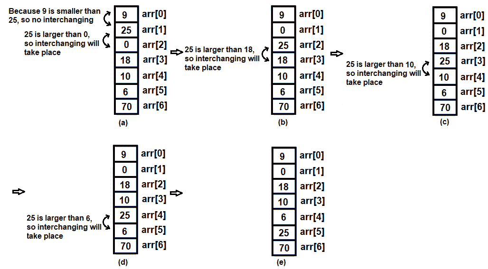

图 9.10

再次，在第二次迭代后，外循环的值将减 1，变为 3。因此，内循环中的`j`值将使`for`循环从值 0 运行到 3。最后，第四个值（即索引位置 3 的值）将与第五个值进行比较。索引位置 5 和 6 的最后两个元素不会进行比较，因为它们都处于正确的位置：

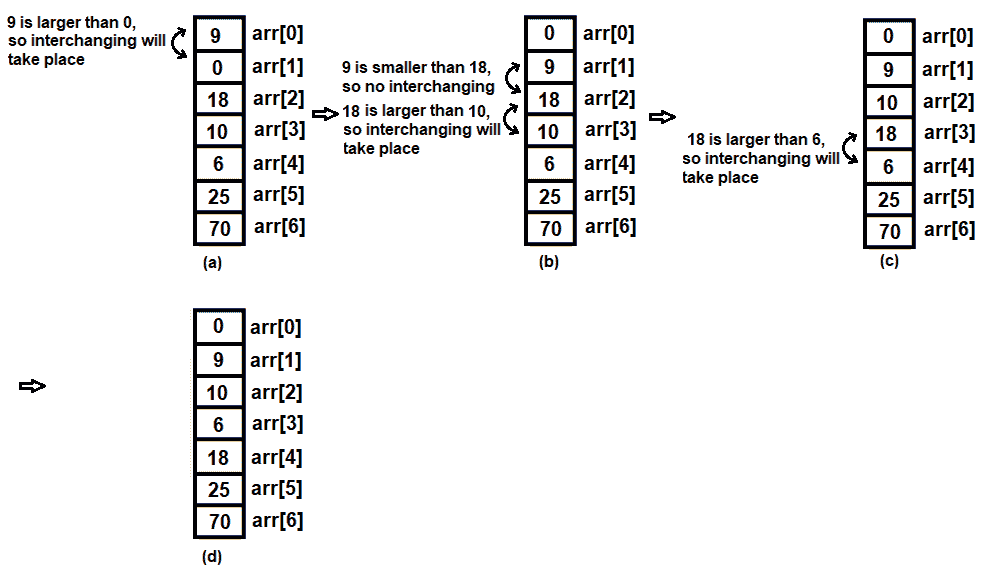

图 9.11

经过第三次迭代后，`i`的值将减 1，变为 2。因此，`j`的值将使`for`循环从值 0 运行到 2。索引位置 4、5 和 6 的最后三个元素不会进行比较，因为它们已经处于正确的位置：

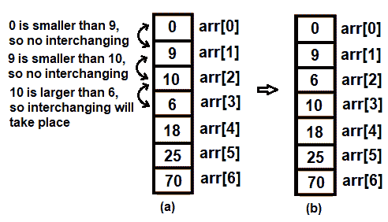

图 9.12

经过第四次迭代后，`i`的值再次减 1，变为 1。因此，内循环中的`j`值将使`for`循环从值 0 运行到 1。最后四个元素不会进行比较，因为它们已经处于最终位置：

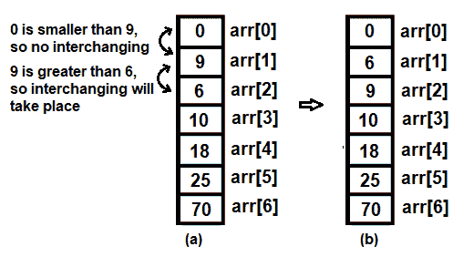

图 9.13

因此，经过五次迭代，我们已经成功将数组中的数字按升序排列。程序使用 GCC 编译，以下为编译语句：

```cpp
gcc bubblesort.c -o bubblesort
```

由于编译过程中没有出现错误，这意味着`bubblesort.c`程序已成功编译成`bubblesort.exe`文件。在执行此文件时，它会要求我们指定要排序的数字数量。然后程序会提示我们输入要排序的数字。输入数字后，它们将以升序排列，如下面的截图所示：

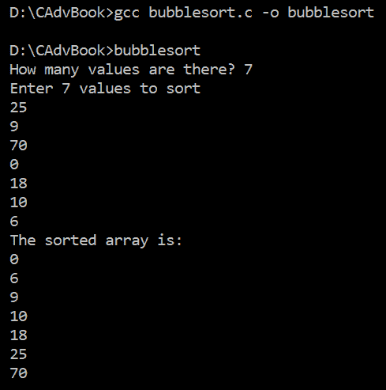

图 9.14

哇！我们已经成功使用冒泡排序技术将数字按升序排列。

现在让我们继续下一个菜谱！

# 使用插入排序按升序排列数字

在这种排序技术中，数组的一个区域，可能是下或上部分，被认为是已排序的。从排序区域外选取一个元素，并在排序区域中搜索其适当的位置（以便在插入此元素后，该区域仍然保持排序），然后将该元素插入其中，因此得名插入排序。

# 如何做到的...

我们将创建一个名为`InsertionSort`的插入排序函数，如下所示调用，其中`arr`是要排序的数组，包含`n`个元素。

在`InsertionSort`方法中遵循的步骤如下：

1.  将一个变量，比如说`i`，初始化为`1`。

1.  重复步骤 2 到 5 共`n-1`次，即当`i >= n-1`时。在每次迭代后，`i`的值增加 1，`i=1,2,3 .... n-1`。

1.  初始化一个变量，`j`，为其值`i`。

1.  重复以下步骤 5 次，对于`j=i`到`j >=0`。在每次迭代后，`j`的值减 1，即`j=i, i-1, i-2, ....0`。

1.  如果`arr[j] < arr[j-1]`，则交换这两个值。

使用插入排序技术对整数数组元素进行排序的程序如下：

```cpp
//insertionsort.c

#include <stdio.h>

#define max 20

int main() {
  int arr[max], i, j, temp, len;
  printf("How many numbers are there ? ");
  scanf("%d", & len);
  printf("Enter %d values to sort\n", len);
  for (i = 0; i < len; i++)
    scanf("%d", & arr[i]);
  for (i = 1; i < len; i++) {
    for (j = i; j > 0; j--) {
      if (arr[j] < arr[j - 1]) {
        temp = arr[j];
        arr[j] = arr[j - 1];
        arr[j - 1] = temp;
      }
    }
  }
  printf("\nThe ascending order of the values entered is:\n");
  for (i = 0; i < len; i++)
    printf("%d\n", arr[i]);
  return 0;
}
```

现在，让我们深入了解代码，以便更好地理解。

# 它是如何工作的...

假设我们需要排序的数字不超过 20；因此我们将定义一个大小为`20`的宏。你可以始终为这个宏分配任何值。接下来，我们将定义一个大小为`max`的整数数组`arr`。你将被提示输入要排序的数字数量。假设我们想要排序八个值；因此我们输入的`8`将被分配给变量`len`。然后，你将被要求输入需要排序的八个值。所以，假设我们输入了以下值，这些值被分配给`arr`数组：

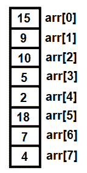

图 9.15

在这种排序方法中，我们将借助嵌套循环，外循环`i`从 1 运行到 7，内循环`j`从`i`的值开始运行，直到其值大于 0。因此，在嵌套循环的第一次迭代中，内循环只会执行一次，此时`i`的值为 1。`arr[1]`索引位置上的值将与`arr[0]`上的值进行比较。趋势是保持较低值在顶部，所以如果`arr[1]`上的值大于`arr[0]`上的值，这两个值的位将互换。因为 15 大于 9（在*图 9.16*的左侧），所以两个索引位置上的值将按照以下方式互换（在*图 9.16*的右侧）：

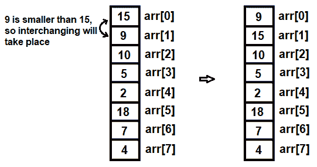

图 9.16

在第一次迭代之后，`i`的值将增加至 2，内循环`j`将从 2 的值运行到 1，即内循环将执行两次：一次是`j`的值为 2 时，然后当`j`的值减少到 1 时。在内循环中，`arr[2]`上的值将与`arr[1]`上的值进行比较。此外，`arr[1]`上的值将与`arr[0]`上的值进行比较。如果`arr[2] < arr[1]`，则将发生值的互换。同样，如果`arr[1] < arr[0]`，则它们的值将互换。

`arr[2]`上的值为 10，小于`arr[1]`上的值，即 15；因此这些值将互换位置（见*图 9.17*）。在值互换后，我们发现`arr[1]`上的值大于`arr[0]`上的值。所以，现在不会发生互换。*图 9.17*显示了第二次迭代的步骤：

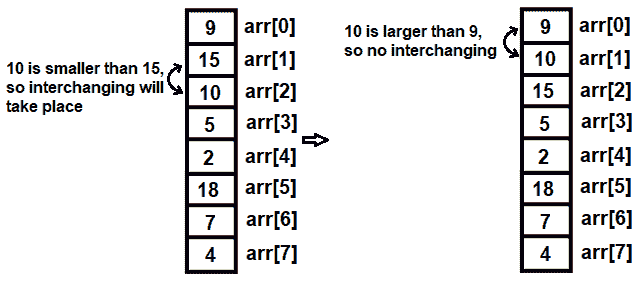

图 9.17

在第二次迭代之后，`i`的值将增加至 3，而`j`的值将从 3 开始运行，直到 1。因此，如果满足以下条件，将发生值的互换：

+   如果`arr[3] < arr[2]`

+   如果`arr[2] < arr[1]`

+   如果`arr[1] < arr[0]`

您可以在*图 9.18(a)*中看到，`arr[3]`，即 5，小于`arr[2]`，即 15，因此它们的值将会互换。同样，`arr[2]`和`arr[1]`以及`arr[1]`和`arr[0]`的值也将互换（分别见*图 9.18(b)*和*(c)*）。*图 9.18(d)*显示了所有互换操作完成后的数组：

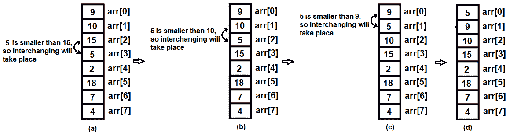

图 9.18

在第三次迭代之后，`i`的值将增加至 4，而`j`的值将从 4 开始运行，直到 1。如果满足以下条件，将发生值的互换：

+   如果`arr[4] < arr[3]`

+   如果`arr[3] < arr[2]`

+   如果`arr[2] < arr[1]`

+   如果`arr[1] < arr[0]`

您可以在*图 9.19*中看到，所有这些比较的主要趋势是将数组中的较低值移到较高值之上：


图 9.19

对于数组中的其余元素，将遵循相同的程序。

程序使用以下语句使用 GCC 编译：

```cpp
gcc insertionsort.c -o insertionsort
```

由于编译过程中没有出现错误，这意味着`insertionsort.c`程序已成功编译成`insertionsort.exe`文件。在执行时，它将要求你指定要排序的数字数量。随后，程序将提示我们输入要排序的数字。输入数字后，它们将以升序显示，如下面的截图所示：

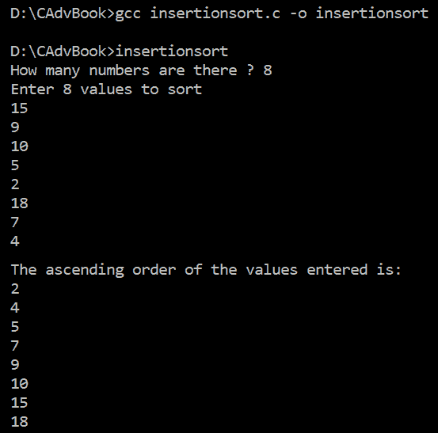

图 9.20

哇！我们已经成功使用插入排序将数字按升序排列。

现在让我们继续下一个菜谱！

# 使用快速排序按升序排列数字

快速排序是一种分而治之的算法。它根据枢轴将数组分割，其中枢轴是数组中的一个元素，以便所有小于枢轴的元素都放在枢轴之前，而所有大于枢轴的元素都放在枢轴之后。

因此，在枢轴的位置，数组被分割成两个子数组。在两个数组上重复寻找枢轴的过程。根据枢轴进一步将两个数组细分。

因此，快速排序是一个递归过程，将数组分割成子数组的递归过程会一直持续到子数组只有一个元素为止。

# 如何实现...

快速排序过程包括以下重要任务：

+   寻找枢轴

+   在枢轴位置分割数组

我们将使用两种方法：`QuickSort`和`FindingPivot`。

# 快速排序

此方法考虑一个数组或子数组。它调用方法来找到数组或子数组的枢轴，并根据枢轴分割数组或子数组。以下是其语法：

```cpp
Quick Sort (arr,n)
```

在这里，`arr`是由`n`个元素组成的数组。

这就是使用此方法的方式：

1.  令`l=1`和`u=n`，其中`l`和`u`分别代表数组的较低和较高索引位置。

1.  将`l`推入`stack1`。

1.  将`u`推入`stack2`。

1.  当`stack1`或`stack2`不为空时，重复步骤 5 至 10。

1.  将数组`stack1`的较低索引位置弹出并放入变量`s`中，即`s`变为待排序数组的较低索引位置。

1.  从`stack2`中弹出较高索引位置到变量`e`中，即`e`变量将获得数组的较高索引位置。

1.  通过以下方式调用`FindingPivot`方法来找出枢轴：

```cpp
pivot=FindingPivot(arr,s,e)
```

回想一下，枢轴点是指数组中的一个索引位置，其中小于枢轴的元素在它之前，而大于枢轴的元素在它之后。数组在枢轴点处被分割，然后对两个子数组分别递归地应用快速排序方法。

1.  一旦确定了枢轴，将数组分为两个部分。一个数组将包含从 `s`（下标位置）到 `pivot-1` 的值，另一个数组将包含从 `pivot+1` 到 `e`（上标位置）的元素。

1.  对于数组的上半部分，将 `s` 推入 `stack1`，将 `pivot-1` 推入 `stack2`。

1.  对于数组的下半部分，将 `pivot+1` 推入 `stack1`，将 `e` 推入 `stack2`。

# FindingPivot

此方法用于找到数组或子数组的枢轴。以下是它的语法：

```cpp
FindingPivot (arr,start,end)
```

在这里，`arr` 代表包含 `n` 个元素的数组，`start` 代表数组的起始索引位置，而 `end` 代表数组的结束索引位置。

这就是如何使用此方法：

1.  重复 `QuickSort` 方法的第 2 步至第 8 步。

1.  将 `start` 变量的值存储在另一个变量中，例如 `lower`。

1.  从右索引位置开始，向左移动。最初，第一个元素是枢轴。趋势是将大于枢轴的元素保持在枢轴的右侧，将小于枢轴的元素保持在枢轴的左侧。

1.  如果 `lower=end`，这意味着我们找到了枢轴。枢轴等于 `lower` 的值。将 `lower` 返回为枢轴元素的索引位置。

1.  如果 `arr[lower] > arr[end]`，则交换这两个值的顺序。现在，从左到右比较每个值与枢轴，直到我们得到一个小于枢轴值的值。

1.  当 `arr[start] <= arr[lower]` 且 `lower != start` 时，重复：

```cpp
start=start+1
```

1.  如果 `lower=start`，则枢轴是 `lower`。将 `lower` 返回为枢轴元素的索引位置。

1.  如果 `arr[start] > arr[lower]`，则交换这两个值的顺序。

使用快速排序技术对整数数组元素进行排序的程序如下：

```cpp
//quick sort.c

# include<stdio.h>
# define stacksize 10
#define arrsize 20
int top1 = -1, top2 = -1;
int stack1[stacksize];
int stack2[stacksize];
int arr[arrsize];

int quick(int, int);
void pushstk1(int);
void pushstk2(int);
int popstk1();
int popstk2();

int main() {
  int sindex, eindex, lindex, uindex, k, pivot, i, len;
  printf("How many numerical to sort? ");
  scanf("%d", & len);
  printf("Enter %d numerical:\n", len);
  for (i = 0; i <= len - 1; i++)
    scanf("%d", & arr[i]);
  lindex = 0;
  uindex = len - 1;
  pushstk1(lindex);
  pushstk2(uindex);
  while (top1 != -1) {
    sindex = popstk1();
    eindex = popstk2();
    pivot = quick(sindex, eindex);
    if (sindex < pivot - 1) {
      pushstk1(sindex);
      pushstk2(pivot - 1);
    }
    if (pivot + 1 < eindex) {
      pushstk1(pivot + 1);
      pushstk2(eindex);
    }
  }
  printf("\nAscending order using Quick Sort is:\n");
  for (i = 0; i <= len - 1; i++)
    printf("%d\n", arr[i]);
  return 0;
}

int quick(int si, int ei) {
  int li, temp;
  li = si;
  while (1) {
    while (arr[ei] >= arr[li] && li != ei)
      ei--;
    if (li == ei) return (li);
    if (arr[li] > arr[ei]) {
      temp = arr[li];
      arr[li] = arr[ei];
      arr[ei] = temp;
      li = ei;
    }
    while (arr[si] <= arr[li] && li != si)
      si++;
    if (li == si) return (li);
    if (arr[si] > arr[li]) {
      temp = arr[si];
      arr[si] = arr[li];
      arr[li] = temp;
      li = si;
    }
  }
  return 0;
}
void pushstk1(int s) {
  top1++;
  stack1[top1] = s;
}
void pushstk2(int e) {
  top2++;
  stack2[top2] = e;
}
int popstk1() {
  return (stack1[top1--]);
}
int popstk2() {
  return (stack2[top2--]);
}
```

现在，让我们深入了解代码，以更好地理解它。

# 它是如何工作的...

您将被要求指定需要排序的数字数量。假设我们想要排序 8 个数字；用户输入的值 8 将被分配给 `len` 变量。执行一个 `for` 循环，使我们能够输入要排序的数字。我们输入的值将按照 *图 9.21* 所示分配给 `arr` 数组。

两个变量，`lindex` 和 `uindex`，被初始化以表示数组所需的首个和最后一个索引，分别是 0 和 7。`lindex` 和 `uindex` 的位置应该保留数组中的最小和最大值。`lindex` 和 `uindex` 的值，即 0 和 7，将被推入栈中。在 `pushstk1` 函数中，顶部索引的值（默认为 -1）增加至 0，并将 `lindex` 的值赋给 `stack1` 数组的 `[0]` 索引位置。同样，在 `pushstk2` 函数中，`top2` 索引的值也增加至 0，并将 `uindex` 的值赋给 `stack2` 数组的 `[0]` 位置。

设置一个 while 循环，直到 `top1` 的值不等于 1。这意味着，直到 `stack1` 为空，程序将继续执行。在 while 循环内，`stack1` 和 `stack2` 中推入的值将被弹出并分配给两个变量 `sindex` 和 `eindex`，分别。这些变量代表我们想要使用快速排序对数组或数组的一部分进行排序的起始和结束索引位置。

`stack1` 和 `stack2` 分别包含 0 和 7 的值，这些值被弹出并分别分配给 `sindex` 和 `eindex`。调用 quick 函数，并将 `sindex` 和 `eindex` 的值传递给参数。在 quick 函数中，`sindex` 和 `eindex` 参数的值分别分配给 `si` 和 `ei` 这两个参数。

在 quick 函数内，`si` 的值，即 0，被分配给另一个变量 `li`。执行一个无限循环的 while 循环。在 while 循环内，设置另一个 while 循环，将使 `ei` 向左移动，即，它将使 `ei` 的值递减，直到 `arr[ei]` 位置处的元素大于 `arr[li]` 位置处的元素：

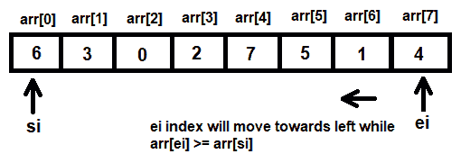

图 9.21

因为 `arr[ei] < arr[si]`，将它们的值进行交换（见 *图 9.22(a)*）。在 `arr[ei]` 和 `arr[si]` 交换值后，`arr` 数组将如图 *图 9.22(b)* 所示：

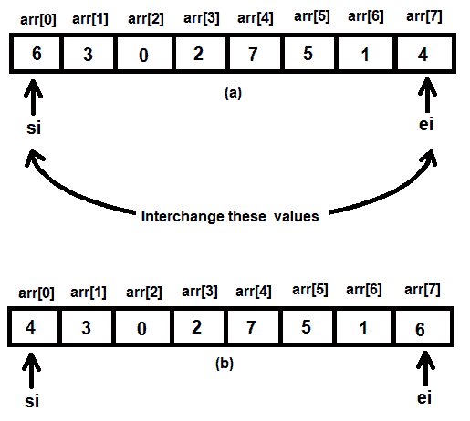

图 9.22

交换值后，`ei` 的索引位置号，即 7，将被分配给 `li`。然后设置另一个 while 循环，在 `arr[si]` 小于 `li` 时执行，其中 `li` 代表当前的 `ei` 索引；在 while 循环内，`si` 索引指针的位置增加。也就是说，`si` 索引指针向右移动到 `arr[si] < arr[li]`：

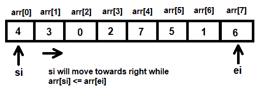

图 9.23

现在，以下事情将会发生：

+   因为 `arr[si] < arr[ei]`（即 4 < 6），`si` 将向右移动一个位置到 `arr[1]`

+   因为 `arr[si] < arr[ei]`（即现在 3 < 6），`si` 将再次向右移动一个位置到 `arr[2]`

+   因为 `arr[si] < arr[ei]`（即现在 0 < 6），`si` 将再次向右移动一个位置到 `arr[3]`

+   因为 `arr[si]  < arr[ei]`（即现在 2 < 6），`si` 将再次向右移动一个位置到 `arr[4]`

+   因为 `arr[si]  > arr[ei]`（即现在 7 > 6），将它们的值进行交换（见 *图 9.24*）：

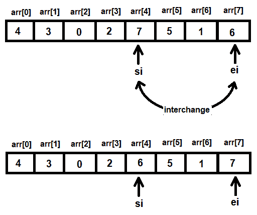

图 9.24

在 `arr[ei]` 和 `arr[si]` 交换值后，`arr[si]` 的位置号，即 4，将被分配给 `li`。过程重复；也就是说，再次设置一个 while 循环来执行，直到 `arr[ei] > arr[si]`。在 while 循环内，`ei` 的位置递减，或者它向左移动：

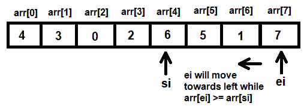

图 9.25

在比较`arr[ei]`和`arr[si]`时，我们会发现`arr[ei] > arr[si]`（7 > 6），因此`ei`将递减到值 6（参见*图 9.26(a)*）。再次，因为`arr[ei] < arr[si]`（1 < 6），这些索引位置的值将进行交换（参见*图 9.26(b)*）。现在`ei`的位置号 6 将被分配给变量`li`。

设置另一个 while 循环，在`arr[si] < arr[ei]`（记住`ei`的位置号被分配给`li`）的情况下执行。在这个 while 循环中将会发生以下事情：

+   因为`arr[si] < arr[ei]`（即 1 < 6），`si`将向右移动到`arr[5]`。

+   因为仍然`arr[si] < arr[ei]`（即 5 < 6），`si`将向右移动到`arr[6]`。

+   因为现在`ei`和`si`的位置相同，快速函数将终止并返回数字 6 到`main`函数（参见*图 9.26(c)*）。因此，数字 6 将成为`arr`数组的枢轴。


图 9.26

执行了两个`if`语句，数组被分成两部分：第一部分从`arr[0]`到`arr[5]`，另一部分从`arr[7]`到`arr[7]`，即一个单独的元素。数组的两部分的第一和最后一个索引值被推入栈中。

数组的第二部分的第一和最后一个索引位置，即 7，将被推入`stack1`和`stack2`。数组的第一部分的第一和最后一个索引位置，即 0 和 5，也将分别推入`stack1`和`stack2`（参见*图 9.27*）。

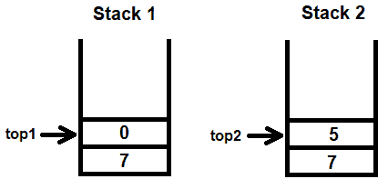

图 9.27

完整的快速排序技术在数组的两个半部分上应用。再次，这两个半部分将被进一步分割成两个更小的部分，然后再次在这些两个部分上应用快速排序技术，以此类推。

外层 while 循环重复执行，并将`popstk1()`和`popstk2()`函数调用来弹出`stack1`和`stack2`数组中的值。`top1`和`top2`索引的值都是 1，所以`stack1[1]`和`stack2[1]`索引位置的值被取出并分别分配给两个变量，`sindex`和`eindex`。再次调用`quick()`函数，并将两个变量`sindex`和`eindex`传递给它。在`quick()`函数中，`sindex`和`eindex`参数的值分别被分配给`si`和`ei`。

在 `quick()` 函数内，`si` 变量的值，即 0，被分配给另一个变量 `li`。执行一个无限循环的 while 循环。在 while 循环内，设置另一个 while 循环，将使 `ei` 索引位置向左移动，即它将使 `ei` 索引变量的值减少，直到 `arr[ei]` 位置的元素大于 `arr[si]` 位置的元素（参见 *图 9.28(a)*）。因为 `arr[ei] > arr[si]`，所以 `ei` 变量的值将减少到 4（参见 *图 9.28(b)*）。现在，我们发现 `arr[ei]`，即 1，小于 `arr[si]`，即 4，所以它们的值将交换。在交换 `arr[ei]` 和 `arr[si]` 索引位置的值后，`arr` 数组将如 *图 9.28(c)* 所示。

交换值后，`ei` 变量的值被分配给 `li` 变量，即 4 被分配给 `li` 变量。设置另一个 while 循环，在 `arr[si]` 元素小于 `arr[li]` 时执行，其中 `li` 代表当前的 `si` 索引；在 while 循环内，`si` 索引指针的值增加。以下事情将会发生：

+   因为 `arr[si]`，即 1，小于 `arr[ei]`，即 4，所以 `si` 将增加到值为 1。

+   因为 `arr[si]`，即 3，小于 `arr[ei]`，即 4，所以 `si` 将增加到值为 2。

+   因为 `arr[si]`，即 0，小于 `arr[ei]`，即 4，所以 `si` 将增加到值为 3。

+   因为 `arr[si]`，即 2，小于 `arr[ei]`，即 6，所以 `si` 将增加到值为 4。

因为 `ei` 和 `si` 变量的值已经相同，`quick()` 函数将终止，将值 `4` 返回到 `main` 函数（参见 *图 9.28(d)*）：

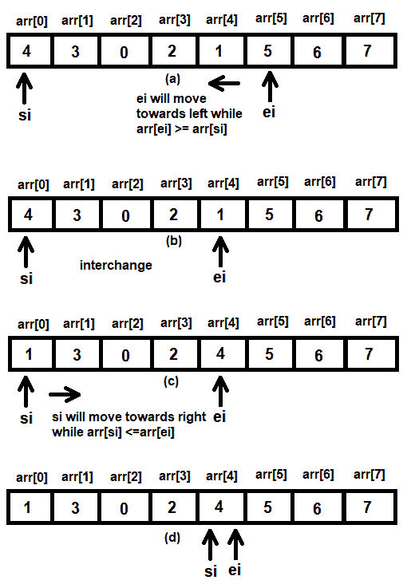

图 9.28

在返回 `main` 函数时，执行了两个 `if` 语句，并将数组分成两部分：第一部分从 `arr[0]` 到 `arr[3]` 索引位置，另一部分将从 `arr[5]` 到 `arr[5]` 索引位置，即一个单独的元素。数组的两部分起始和结束索引值被推送到栈中。数组的第二部分的起始和结束索引位置（即 5 和 5）分别推送到 `stack1` 和 `stack2`。同样，数组的第一个部分的起始和结束索引位置（即 0 和 3）分别推送到 `stack1` 和 `stack2`（参见 *图 9.29*）。

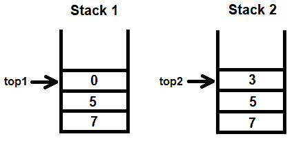

图 9.29

整个快速排序技术被应用于数组的所有分区，直到栈为空。也就是说，外层 while 循环重复，`popstk1()` 和 `popstk2()` 函数将被调用以弹出 `stack1` 和 `stack2` 数组中的值。再次调用 `quick()` 函数，并将从栈中弹出的两个变量 `sindex` 和 `eindex` 传递给它。这个过程会一直持续到整个数组被排序。

程序使用以下语句使用 GCC 编译：

```cpp
gcc quick sort.c -o quick sort
```

因为编译过程中没有出现错误，这意味着 `quick sort.c` 程序已成功编译成 `quick sort.exe` 文件。在执行文件时，它会要求您指定要排序的数字数量。随后，程序将提示您输入要排序的数字。输入数字后，它们将按升序排列，如下面的截图所示：

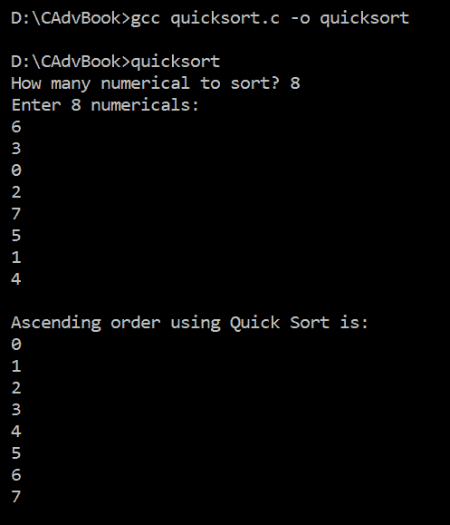

图 9.30

哇！我们已经成功使用快速排序将数组中的数字排列好了。现在让我们继续下一个菜谱！

# 使用堆排序对数字进行降序排列

在这个菜谱中，我们将学习如何使用堆排序技术将一些整数按降序排列。

# 如何做到这一点...

堆排序方法被分为以下两个任务：

1.  创建最大堆

1.  删除最大堆

让我们从创建最大堆开始。

# 创建最大堆

创建最大堆的以下步骤：

1.  用户被要求输入一个数字。该数字用于创建一个堆。用户输入的数字被分配到数组堆的索引位置 `x`，其中 `x` 的初始值为 0，并在每次插入后递增。

1.  新插入的数字与其父节点的元素进行比较。因为我们正在使用最大堆，所以需要遵循一个规则：父节点的值应该始终大于其子节点。父节点的位置通过公式 `parent=(x-1)/2` 计算，其中 `x` 代表新节点插入的索引位置。

1.  检查新节点的值是否大于其父节点的值。通过一个额外的变量交换 `heap[parent]` 和 `heap[x]` 的值。

1.  递归检查父节点的父节点的值，以查看最大堆的性质是否得到保持。

一旦堆被创建，删除最大堆的第二项任务将开始。每次从最大堆中删除一个节点时，删除的节点将被保存在另一个数组中，例如 `arr`，该数组将包含排序后的元素。删除最大堆的任务将重复执行，直到最大堆中存在多少个元素。

# 删除最大堆

三个变量 `leftchild`、`rightchild` 和 `root` 的初始化如下：

```cpp
leftchild=0
rightchild=0
root=1
```

删除最大堆的以下步骤：

1.  根节点处的元素临时分配给 `n` 变量。

1.  堆的最后一个元素放置在根节点。

1.  如果最后一个索引位置的值为 1 或 2，即堆只剩下 1 或 2 个元素，则使用`n`变量返回调用者。

1.  由于最后一个元素放置在根节点，减少堆的大小 1。

1.  为了保持最大堆的性质，在`rightchild <= last`的情况下重复执行*步骤 6*至*9*。回想一下，最大堆的性质是父节点的值应该始终大于其子节点。

1.  计算左子节点`leftchild`和右子节点`rightchild`的位置。

1.  如果`heap[root] > heap[leftchild] && heap[root] > heap[rightchild]`，则返回`n`并退出。

1.  如果左子节点的值大于右子节点的值，则交换根节点和左子节点的值。根节点将下降到左子节点以检查最大堆的性质是否得到保持。

1.  如果右子节点的值大于左子节点的值，则交换根节点和右子节点的值。根节点将下降到右子节点以检查最大堆的性质是否得到保持。

1.  当最大堆的所有元素都处理完毕时，这意味着`arr`数组将包含所有已排序的元素。因此，最后一步是打印`arr`数组，其中包含已排序的元素。

使用堆排序技术对整数数组元素进行排序的程序如下：

```cpp
//heapsort.c

# include <stdio.h>
#define max 20
int heap[max], len;

void insheap(int h);
int delsheap(int j);

int main() {
  int arr[max], numb, i, j;
  printf("How many elements to sort? ");
  scanf("%d", & len);
  printf("Enter %d values \n", len);
  for (i = 0; i < len; i++) {
    scanf("%d", & numb);
    insheap(numb);
  }
  j = len - 1;
  for (i = 0; i < len; i++) {
    arr[i] = delsheap(j);
    j--;
  }
  printf("\nThe Descending order is: \n");
  for (i = 0; i < len; i++)
    printf("%d\n", arr[i]);
  return 0;
}

void insheap(int value) {
  static int x;
  int par, cur, temp;
  if (x == 0) {
    heap[x] = value;\
    x++;
  } else {
    heap[x] = value;
    par = (x - 1) / 2;
    cur = x;
    do {
      if (heap[cur] > heap[par]) {
        temp = heap[cur];
        heap[cur] = heap[par];
        heap[par] = temp;
        cur = par;
        par = (cur - 1) / 2;
      } else break;
    } while (cur != 0);
    x++;
  }
}

int delsheap(int j) {
  int loc, n = 0, pos, lc = 0, rc = 0, temp = 0;
  loc = j;
  pos = 0;
  n = heap[pos];
  heap[pos] = heap[loc];
  if (loc == 0 || loc == 1) return (n);
  loc--;
  lc = 2 * pos + 1;
  rc = 2 * pos + 2;
  while (rc <= loc) {
    if ((heap[pos] > heap[lc] && heap[pos] > heap[rc]))
      return (n);
    else {
      if (heap[lc] > heap[rc]) {
        temp = heap[lc];
        heap[lc] = heap[pos];
        heap[pos] = temp;
        pos = lc;
      } else {
        temp = heap[rc];
        heap[rc] = heap[pos];
        heap[pos] = temp;
        pos = rc;
      }
      lc = 2 * pos + 1;
      rc = 2 * pos + 2;
    }
  }
  if (lc == loc) {
    if (heap[pos] < heap[lc]) {
      temp = heap[pos];
      heap[pos] = heap[lc];
      heap[lc] = temp;
      pos = lc;
    }
  }
  return (n);
}
```

现在，让我们深入了解代码，以更好地理解它。

# 它是如何工作的...

堆是一个完全二叉树，可以是最大堆或最小堆。最大堆具有这样的性质：任何节点的键值必须大于或等于其子节点的键值。在最小堆中，任何节点的键值必须小于或等于其子节点的值。

在这个菜谱中，我们将学习如何创建以下整数列表的最大堆：

| 5 | 2 | 9 | 3 | 1 | 4 | 6 |
| --- | --- | --- | --- | --- | --- | --- |

在这个堆排序方法中，二叉树以数组的形式构建。在堆排序中，数组中的值一个接一个地添加，保持最大堆性质为真（即任何节点的键值应该大于或等于其子节点）。在添加数组元素时，我们使用`(x-1)/2`跟踪父节点的键值，其中`x`是要找到父节点的元素。如果插入堆中的元素大于其父节点的键值，则进行交换。例如，假设第一个键值输入是`5`（它被认为是根）；它被存储为数组的第一个元素，即`heap[0]`：

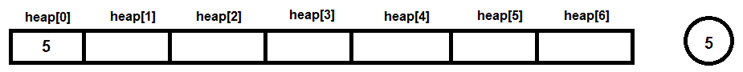

图 9.31

然后将 2 添加为其左子节点。第一个子节点总是添加到左边。当输入另一个值时，它被输入到`heap[1]`的位置。插入后，使用`(x-1)/2`计算其父节点位置，其中`x`是 1。因此，父节点是位置 0。所以，`heap[1]`与其父元素`heap[0]`进行比较。如果父元素`heap[0]`的关键元素大于`heap[1]`，则继续进行；否则，交换它们的关键值。在我们的例子中，第二个元素是 2，所以不需要交换：

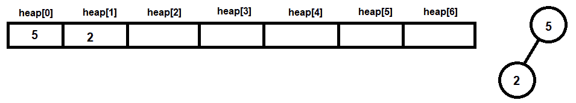

图 9.32

现在，我们进入第三个元素。第三个元素是 9，它被添加为节点 5 的右子节点（见图 9.33(a)）。在数组中，它被存储在`heap[2]`的位置。再次，使用`(x-1)/2`计算其父元素的位置，结果再次是 0。为了保持最大堆的性质（父节点的值应该大于或等于其子节点），我们比较`heap[0]`和`heap[2]`元素的关键值。因为`heap[0]`小于`heap[2]`，它违反了最大堆的性质。因此，`heap[0]`和`heap[2]`的关键值将进行交换，如图 9.33(b)所示：

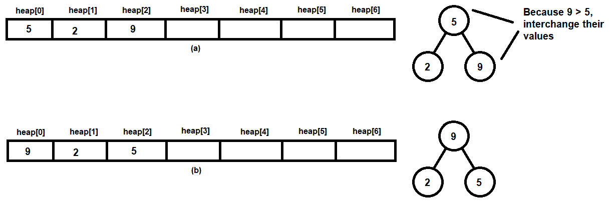

图 9.33

然后 3 被添加为节点 2 的左子节点，如图 9.34(a)所示。在数组中，新值被插入到`heap[3]`的索引位置。再次，使用公式`(x-1)/2`计算其父元素的位置，其中`x`代表新值插入的索引位置，即 3。父元素的位置计算为 1。根据最大堆的性质，`heap[1]`必须大于或等于`heap[3]`。但是因为`heap[1]`小于`heap[3]`，它违反了最大堆的性质。因此，`heap[1]`和`heap[3]`的关键值将进行交换，如图 9.34(b)所示：

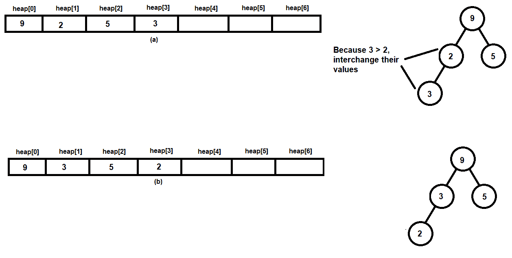

图 9.34

现在，1 被添加为节点 3 的右子节点。在数组中，新值被插入到`heap[4]`的索引位置。因为最大堆的性质仍然保持，不需要交换：

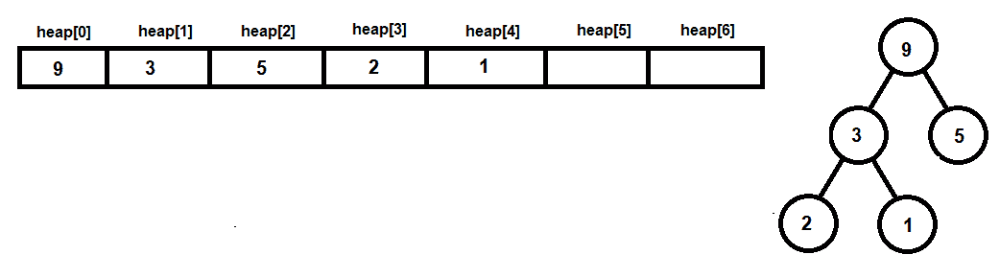

图 9.35

下一个值是 4，它被添加为节点 5 的左子节点。在数组中，新值被插入到`heap[5]`的索引位置。再次，最大堆的性质得到保持，因此不需要交换：

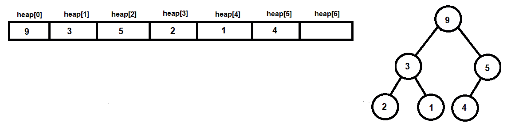

图 9.36

接下来，将 6 添加为节点 5 的右子节点（见*图 9.37(a)*）。在数组中，它被插入到`heap[6]`的索引位置。再次，使用公式`(x-1)/2`计算父元素位置。父元素位置计算为 2。根据最大堆的性质，`heap[2]`必须大于或等于`heap[6]`。但是因为`heap[2]`小于`heap[6]`，它违反了最大堆的性质；因此，`heap[2]`和`heap[6]`的键值将被交换，如图*图 9.37(b)*所示：

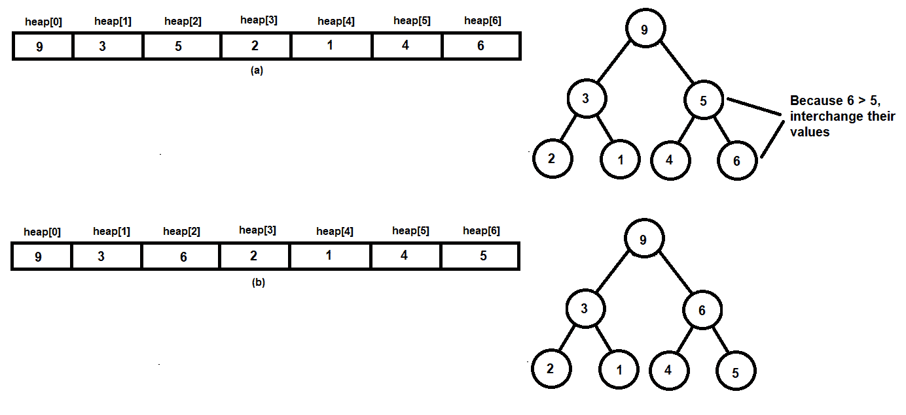

图 9.37

一旦构建了最大堆，我们就通过重复以下三个步骤进行堆排序：

1.  移除其根元素（并将其存储在排序数组中）

1.  将树的根元素（数组）替换为最后一个节点值，并移除最后一个节点（减少数组的大小）

1.  重新整理键值以保持堆的性质

在下面的*图 9.38(a)*中，你可以看到根元素，即 9，被删除并存储在另一个名为`arr`的数组中。`arr`数组将包含排序后的元素。根元素被替换为树的最后一个元素。树的最后一个元素是 5，因此它从`heap[6]`索引位置移除并分配给根，即`heap[0]`。现在，堆的性质不再成立。因此，节点元素 5 和 6 的值被交换（见*图 9.38(b)*）：


图 9.38

现在再次重复这个过程，移除根节点的键元素，并用最后一个节点的值替换它，然后重新整理堆。也就是说，移除根节点元素 6 并将其分配给排序数组`arr`。然后，根节点被替换为树的最后一个元素，即 4（见*图 9.39(a)*）。将值 4 放在根节点后，堆的性质不再成立。因此，为了保持堆的性质，将值 4 向下移动，即节点元素 4 和 5 的值被交换，如图*9.39(b)*所示）：

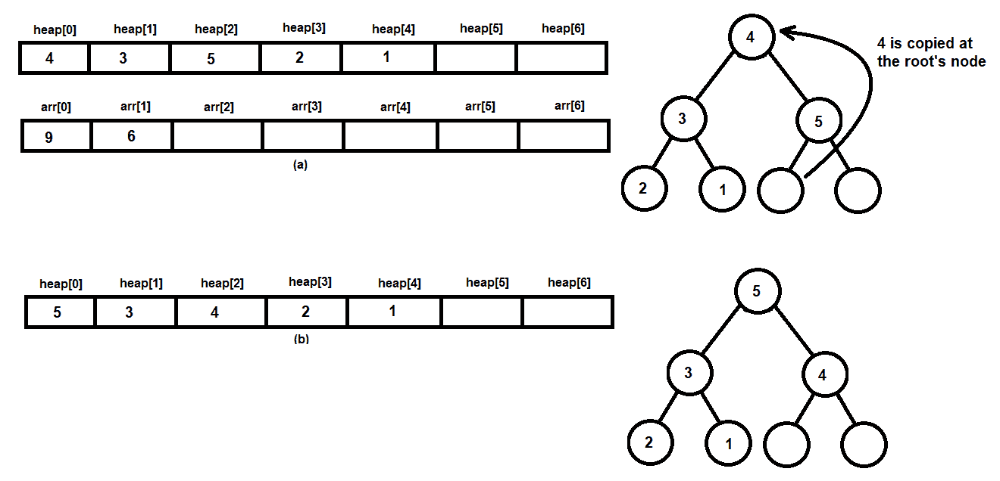

图 9.39

重复这些步骤以按降序对数组进行排序，如下所示：

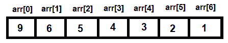

图 9.40

使用以下语句使用 GCC 编译程序：

```cpp
gcc heapsort.c -o heapsort
```

因为编译时没有出现错误，这意味着`heapsort.c`程序已成功编译成`heapsort.exe`文件。在执行文件时，它会要求我们指定要排序的数字数量。随后，程序将提示我们输入要排序的数字。输入数字后，它们将按降序排列，如下面的屏幕截图所示：

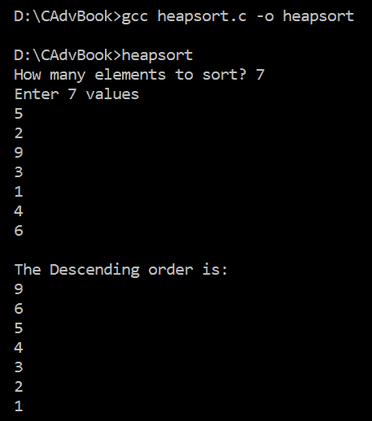

图 9.41

哇！我们已经成功使用堆排序将数字按降序排列。

# 参见

要了解更多如选择、归并、希尔和基数排序等排序方法，请访问此链接上的*附录 A*：[`github.com/PacktPublishing/Practical-C-Programming/blob/master/Appendix%20A.pdf`](https://github.com/PacktPublishing/Practical-C-Programming/blob/master/Appendix%20A.pdf).
