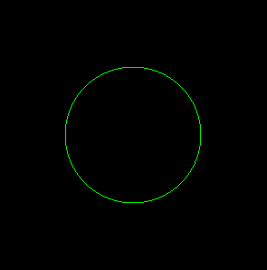

# 第十二章：利用图形进行创意

**OpenGL**（代表**Open Graphics Library**）是一个跨平台的**应用程序接口**（**API**），用于渲染二维和三维图形；它独立于操作系统工作。它提供了一些内置例程用于显示图形以及应用特殊效果、抗锯齿和不同的变换。

OpenGL 有一个名为**OpenGL Utility Toolkit**（**GLUT**）的库，但它已经不支持好几年了。FreeGLUT 是一个免费的开源软件，作为其替代品。GLUT 在图形应用中非常受欢迎，因为它高度可移植且非常简单易用。它有一个大型的函数库，用于创建窗口、不同的图形形状、事件处理等。如果你电脑上没有安装 FreeGLUT，并且你的电脑上运行的是 Windows 操作系统，你可以下载`freeglut 3.0.0`用于 MinGW 并提取它。在 Ubuntu 上，你需要输入以下命令来安装 FreeGLUT：

```cpp
sudo apt-get install freeglut3-dev
```

在本章中，我们将学习以下食谱：

+   画四个图形形状

+   画圆

+   在两个鼠标点击之间画线

+   根据提供的值制作条形图

+   制作一个动画弹跳球

# OpenGL 函数列表

在我们深入探讨食谱之前，让我们快速概述一下本章中我们将使用的一些 OpenGL 函数。以下是一些最常用的 OpenGL 函数：

| **功能** | **描述** |
| --- | --- |
| `glutInit` | 用于初始化 GLUT。 |
| `glutCreateWindow` | 用于创建顶层窗口。在创建窗口时，你可以提供窗口名称作为标签。 |
| `glutInitWindowSize` | 用于定义窗口大小。在定义窗口大小时，窗口的宽度和高度以像素为单位指定。 |
| `void glutInitWindowPosition` | 用于设置初始窗口位置。窗口的*x*和*y*位置以像素为单位指定。 |
| `glutDisplayFunc` | 用于指定要执行的回调函数以在当前窗口中显示图形。为了在窗口中重新显示内容，也会执行指定的回调函数。 |
| `glutMainLoop` | 这是 GLUT 事件处理循环的入口点。 |
| `glClearColor` | 用于指定颜色缓冲区的清除值。你需要指定在清除颜色缓冲区时使用的红色、绿色、蓝色和 alpha 值。初始值都是 0。 |
| `glClear` | 用于将缓冲区清除到预设值。可以使用某些掩码来指定要清除的缓冲区。以下是可以使用的三个掩码。 |
| `GL_COLOR_BUFFER_BIT` | 这个掩码代表当前用于应用颜色的缓冲区。 |
| `GL_DEPTH_BUFFER_BIT` | 这个掩码代表深度缓冲区。 |
| `GL_STENCIL_BUFFER_BIT` | 这个掩码代表模板缓冲区。 |
| `glBegin` | 用于分组导致特定形状的语句。您可以通过在此分组语句内分组所需的顶点来创建不同的形状，例如点、线、三角形、矩形等。您可以通过指定以下任何模式来指定要创建的形状：`GL_POINTS`、`GL_LINES`、`GL_LINE_STRIP`、`GL_LINE_LOOP`、`GL_TRIANGLES`、`GL_TRIANGLE_STRIP`、`GL_TRIANGLE_FAN`、`GL_QUADS`、`GL_QUAD_STRIP` 和 `GL_POLYGON`。 |
| `glEnd` | 用于结束语句组。 |
| `glColor3f` | 用于设置绘图时的当前颜色。可以指定红色、绿色和蓝色（按此严格顺序）的值来设置颜色。这些颜色的值介于 0 和 1 之间，其中 0 是最低强度，1 是最高强度。 |
| `glVertex` | 用于指定点、线和多边形顶点的坐标。此函数必须位于 `glBegin`/`glEnd` 对之间。`glVertex` 后可能跟有 2、3 或 4 的后缀，具体取决于定义顶点所需的坐标数量。例如，如果需要两个坐标 *x* 和 *y* 来指定顶点，则会在 `glVertex` 后添加一个值为 2 的后缀，使其变为 `glVertex2`。同样，如果需要 3 和 4 个坐标来指定顶点，则可以分别添加 3 和 4 的后缀。此外，还可以添加一个后缀，如 `s`、`i`、`f` 或 `d`，如果顶点坐标分别是 `short`、`int`、`float` 或 `double` 数据类型。例如，可以使用 `glVertex2f()` 来指定具有 *x* 和 *y* 坐标的顶点，坐标值将是 `float` 数据类型。 |
| `glLineWidth` | 用于指定要绘制的线的宽度。线的宽度可以用像素来指定。默认宽度为 1。 |
| `glPointSize` | 用于指定光栅化点的直径。默认直径为 1。 |
| `glFlush` | 命令有时会根据资源利用率和网络状况进行缓冲。`glFlush` 函数清空所有缓冲区，并确保命令尽可能早地执行。 |
| `glutSwapBuffers` | 此函数用于交换前缓冲区与后缓冲区。前缓冲区显示屏幕上的图像或帧，后缓冲区是图像（或帧）尚未渲染的地方。一旦图像或帧在后缓冲区中渲染，则此函数交换前后缓冲区，显示现在已在后缓冲区中准备好的图像。 |
| `glutReshapeFunc` | 用于指定当前窗口的 reshape 回调函数。在以下情况下自动调用该函数：当窗口被调整大小、在窗口第一次显示回调之前以及窗口创建之后。 |
| `glViewport` | 用于设置视口，即我们希望渲染图像出现的窗口附近区域。该函数接收四个参数。前两个参数表示视口矩形的左下角，以像素为单位。第三个和第四个参数表示视口的宽度和高度。视口的宽度和高度通常设置为与窗口尺寸相等或更小。 |
| `glMatrixMode` | 用于指定当前矩阵是哪个。顶点是基于矩阵的当前状态进行渲染的，因此必须选择一个矩阵以满足我们的需求。以下有两个主要选项。 |
| `GL_MODELVIEW` | 这是默认的矩阵选项。当用户想要执行平移、旋转等类似操作时使用此选项。 |
| `GL_PROJECTION` | 当用户想要执行平行投影、透视投影等操作时使用此选项。 |
| `glLoadIdentity` | 用于用单位矩阵替换当前矩阵。 |
| `gluOrtho2D` | 用于设置二维正交视图区域。该函数接收四个参数。前两个坐标表示左右垂直裁剪平面。最后两个指定底部和顶部的水平裁剪平面坐标。 |
| `glutMouseFunc` | 用于设置当前窗口的鼠标回调函数。也就是说，每当鼠标按钮被按下或释放时，每个动作都会调用鼠标回调函数。在回调函数中，以下三个参数会自动传递。 |
| `button` | 它代表三个按钮中的任何一个，`GLUT_LEFT_BUTTON`、`GLUT_MIDDLE_BUTTON` 或 `GLUT_RIGHT_BUTTON`，具体取决于哪个鼠标按钮被按下。 |
| `state` | 状态可以是 `GLUT_UP` 或 `GLUT_DOWN`，具体取决于回调是因为鼠标释放还是鼠标按下而触发的。 |
| `x` 和 `y` | 表示鼠标按钮状态改变时窗口的相对坐标。 |
| `glutIdleFunc` | 用于设置全局空闲回调，主要用于执行后台处理任务。即使没有事件发生，空闲回调也会持续调用。将 `NULL` 参数发送到该函数以禁用空闲回调的生成。 |

您需要初始化**X 窗口系统**（**X11**）以进行图形处理。X11 提供了一个 GUI 环境，即它允许显示窗口和图形，并提供了一个与鼠标和键盘交互的环境。启动 X11 的命令是 `xinit` 命令。

# 绘制四个图形形状

在本教程中，我们将学习绘制四种不同的图形：正方形、三角形、点和线。

# 如何操作...

制作不同图形形状的步骤如下：

1.  初始化 GLUT，定义窗口大小，创建窗口，并设置窗口位置。

1.  定义将在窗口显示后自动调用的回调函数。

1.  要绘制正方形，首先，定义它的颜色。

1.  通过定义其四个顶点并将它们包含在`glBegin`和`glEnd`语句中，使用`GL_QUADS`关键字绘制一个正方形。

1.  要绘制线条，设置线条的宽度和颜色。

1.  使用`GL_LINES`关键字在`glBegin`和`glEnd`之间将一对顶点分组来绘制一条线。

1.  要绘制点，设置点的大小为 3 px，并设置它们的颜色。

1.  顶点是点必须显示的位置。将它们分组为`glBegin`和`glEnd`语句对，并使用`GL_POINTS`关键字。

1.  要绘制三角形，将三个顶点分组在`glBegin`和`glEnd`语句中，并使用`GL_TRIANGLES`关键字。

1.  调用`glFlush`函数来清空所有缓冲的语句，并快速绘制形状。

绘制前面四个形状的程序如下：

```cpp
//opengldrawshapes.c

#include <GL/glut.h>

void drawshapes() {
  glClearColor(0.0 f, 0.0 f, 0.0 f, 1.0 f);
  /* Making background color black as first 
   All the 3 arguments R, G, B are 0.0 */
  glClear(GL_COLOR_BUFFER_BIT);
  glBegin(GL_QUADS);
  glColor3f(0.0 f, 0.0 f, 1.0 f);
  /* Making picture color blue (in RGB mode), as third argument is 1\. */
  glVertex2f(0.0 f, 0.0 f);
  glVertex2f(0.0 f, .75 f);
  glVertex2f(-.75 f, .75 f);
  glVertex2f(-.75 f, 0.0 f);
  glEnd();
  glLineWidth(2.0);
  glColor3f(1.0, 0.0, 0.0);
  glBegin(GL_LINES);
  glVertex2f(-0.5, -0.5);
  glVertex2f(0.5, -0.5);
  glEnd();
  glColor3f(1.0, 0.0, 0.0);
  glPointSize(3.0);
  /* Width of point size is set to 3 pixel */
  glBegin(GL_POINTS);
  glVertex2f(-.25 f, -0.25 f);
  glVertex2f(0.25 f, -0.25 f);
  glEnd();
  glBegin(GL_TRIANGLES);
  glColor3f(0, 1, 0);
  glVertex2f(0, 0);
  glVertex2f(.5, .5);
  glVertex2f(1, 0);
  glEnd();
  glFlush();
}

int main(int argc, char ** argv) {
  glutInit( & argc, argv);
  glutCreateWindow("Drawing some shapes");
  /* Giving title to the window */
  glutInitWindowSize(1500, 1500);
  /* Defining the window size that is width and height of window */
  glutInitWindowPosition(0, 0);
  glutDisplayFunc(drawshapes);
  glutMainLoop();
  return 0;
}
```

现在，让我们幕后了解代码以更好地理解它。

# 它是如何工作的...

第一步，正如预期的那样，是初始化 GLUT，然后创建一个顶层窗口，为窗口提供的标签是`绘制一些形状`。然而，你可以给它任何标签。窗口的宽度定义为 1,500 px，高度为 1,500 px。窗口的初始位置设置为 0,0，即*x=0*和*y=0*的坐标。`drawshapes`回调函数被调用来在窗口中显示不同的形状。

在`drawshapes`函数中，清除颜色缓冲区的值，然后清除缓冲区以预设值。

我们要绘制的第一个形状是一个正方形，因此绘制正方形的语句组被包含在`glBegin`和`glEnd`语句中。`GL_QUADS`关键字与`glBegin`语句一起提供，因为四边形指的是由 4 个顶点组成的任何形状。调用`glColor3f`函数创建一个填充蓝色的正方形。提供四组顶点来形成一个正方形。一个顶点由*x*和*y*坐标组成。

接下来，我们将绘制线条。调用`glLineWidth`函数来指定要绘制的线条宽度为 2 px。调用`glColor3f`函数使线条以红色显示。使用`GL_LINES`关键字在`glBegin`和`glEnd`之间将两个顶点分组来绘制一条线。

接下来，我们将绘制两个点。为了使点清晰可见，点的大小设置为 3 px，点将被绘制的颜色设置为红色（或任何颜色，除了黑色）。我们想要显示点的两个顶点在将它们分组为`glBegin`和`glEnd`语句对之后提供。使用`GL_POINTS`关键字与`glBegin`语句一起提供来绘制点。

最后，我们通过将三个三角形顶点组合到 `glBegin` 和 `glEnd` 语句中来绘制三角形。将 `GL_TRIANGLES` 关键字与 `glBegin` 一起提供，以指示组中指定的顶点是为了绘制三角形。调用 `glColor3f` 确保三角形将被填充为绿色。

最后，调用 `glFlush` 函数以清空所有缓冲语句并快速执行它们以显示所需的形状。

要编译程序，我们需要打开命令提示符，并将目录更改为程序保存的文件夹。然后，在命令提示符中执行 `xinit` 命令以启动 X 服务器（X11）。

一旦 X 服务器启动，给出以下命令来编译程序。记住，在编译程序时，程序必须与 `-lGL -lGLU -lglut` 链接。

语法如下：

```cpp
gcc filename.c -lGL -lGLU -lglut 
```

这里，`filename.c` 是文件名。

我们将使用以下命令来编译我们的程序：

```cpp
gcc opengldrawshapes.c -lGL -lGLU -lglut -lm -o opengldrawshapes
```

如果没有错误出现，这意味着 `opengldrawshapes.c` 程序已成功编译成可执行文件：`opengldrawshapes.exe`。此文件使用以下命令执行：

```cpp
$./opengldrawshapes
```

我们将得到如下截图所示的输出：


图 12.1

哇！我们已经成功绘制了四种不同的图形形状：一个正方形、一个三角形、一些点和一条线。现在让我们继续到下一个菜谱！

# 绘制圆

绘制圆的过程与其他图形形状完全不同，因此它有自己的专用菜谱。它需要一个 `for` 循环来在 0 到 360 度绘制小点或线条。所以，让我们学习如何绘制圆。

# 如何操作...

绘制圆的步骤如下：

1.  初始化 GLUT，定义顶级窗口的大小，并创建它。同时，设置窗口的初始位置以显示我们的圆。

1.  定义一个在创建窗口后自动调用的回调函数。

1.  在回调函数中，清除颜色缓冲区，并设置显示圆的颜色。

1.  绘制圆的语句被包含在 `glBegin` 和 `glEnd` 函数对中，并带有 `GL_LINE_LOOP` 关键字。

1.  使用 `for` 循环从 0 到 360 绘制小线条，以形成圆形的形状。

绘制圆的程序如下：

```cpp
//opengldrawshapes2.c

#include <GL/glut.h> 
#include<math.h> 
#define pi 3.142857 

void drawshapes() { 
    glClearColor(0.0f, 0.0f, 0.0f, 1.0f); 
    glClear(GL_COLOR_BUFFER_BIT);  
    glColor3f(0.0f, 1.0f, 0.0f); 
    glBegin(GL_LINE_LOOP); 
        for (int i=0; i <360; i++) 
        { 
            float angle = i*pi/180; 
            glVertex2f(cos(angle)*0.5,sin(angle)*0.5);                                              }
    glEnd();
    glFlush(); 
} 

int main(int argc, char** argv) {
    glutInit(&argc, argv);    
    glutCreateWindow("Drawing some shapes"); 
    glutInitWindowSize(1500, 1500);  
    glutInitWindowPosition(0, 0);
    glutDisplayFunc(drawshapes); 
    glutMainLoop();     
    return 0; 
}
```

现在，让我们深入了解代码以更好地理解它。

# 它是如何工作的...

GLUT 已初始化，并创建了一个带有标签 `Drawing some shapes` 的顶级窗口。窗口的大小定义为 1,500 像素宽和 1,500 像素高。窗口的初始位置设置为 0, 0，即 *x=0* 和 *y=0* 坐标位置。`drawshapes` 回调函数被调用来在窗口中绘制圆。

在 `drawshapes` 函数中，清除颜色缓冲区的值，然后清除缓冲区到预设值。调用 `glColor3f` 函数来设置我们想要绘制的圆的颜色。我已经将颜色设置为绿色来绘制圆，但你可以选择任何颜色。一组用于绘制圆的语句被收集在 `glBegin` 和 `glEnd` 函数之间。`glBegin` 函数被提供给 `GL_LINE_LOOP` 关键字，表示我们将要绘制的圆将由几条小线组成。

在 `glBegin` 和 `glEnd` 函数内，使用了一个从 0 到 360 的 `for` 循环来执行；也就是说，将在 0 到 360 度的每个度数处绘制一条非常小的线，以给出圆形的形状。首先将度数转换为弧度，然后在顶点位置绘制线条，*cos(角度) * 半径，sin(角度)* 半径*.当在每度处绘制这样的小线时，它将在屏幕上呈现出圆形的外观。

要编译程序，启动 X 服务器，并给出以下命令来编译程序：

```cpp
gcc opengldrawshapes2.c -lGL -lGLU -lglut -lm -o opengldrawshapes2
```

如果没有出现错误，这意味着 `opengldrawshapes2.c` 程序已成功编译成可执行文件：`opengldrawshapes2.exe`。此文件使用以下命令执行：

```cpp
$./opengldrawshapes2
```

我们将得到以下截图所示的输出：



图 12.2

哇！我们已经成功学习了如何绘制圆。现在让我们继续下一个菜谱！

# 在两个鼠标点击之间绘制线条

在这个菜谱中，我们将学习如何在两个鼠标点击之间绘制线条。鼠标点击被认为是按下鼠标按钮并释放它的过程。你可以在一对鼠标按下和释放事件之间绘制任意数量的线条。

# 如何做到这一点...

以下是在两个鼠标点击之间绘制线条的步骤：

1.  初始化 GLUT，定义顶级窗口的大小，并显示窗口。

1.  定义一个 `drawLine` 回调函数，当发生任何鼠标点击事件时绘制线条。

1.  在 `drawLine` 函数中，指定了清除缓冲区的清除值。

1.  调用 `glutSwapBuffers()` 函数以交换前后缓冲区，显示后缓冲区中渲染的任何帧，并准备显示。

1.  调用 `glutReshapeFunc` 函数来指定当窗口形状改变时将自动调用的重绘线条的回调函数。

1.  由于线条的顶点是基于矩阵的当前状态渲染的，因此设置了一个矩阵作为当前矩阵，用于视图和建模变换。

1.  还设置了一个二维正交视图区域。

1.  设置了一个名为 `mouseEvents` 的鼠标回调函数。每当鼠标按钮被按下或释放时，都会调用回调。

1.  根据鼠标按钮按下和释放的坐标，将调用 `drawLine` 函数来绘制两个坐标之间的线条。

以下是在两个鼠标点击之间绘制线条的程序：

```cpp
//openglmouseclick.c

#include <GL/glut.h> 

int noOfClicks = 0; 
int coord[2][2]; 
int leftPressed = 0; 

void drawLine(void) 
{ 
    glClearColor(0.0, 0.0, 0.0, 1.0);  
    glClear(GL_COLOR_BUFFER_BIT); 
    glBegin(GL_LINES); 
        for(int i=0; i<noOfClicks; i++) {
            glVertex2f(coord[i][0],coord[i][1]); 
        } 
    glEnd(); 
    glutSwapBuffers(); 
}  

void projection(int width, int height) 
{ 
    glViewport(0, 0, width, height); 
    glMatrixMode(GL_PROJECTION); 
    glLoadIdentity(); 
    gluOrtho2D(0, width, height, 0); 
    glMatrixMode(GL_MODELVIEW); 
} 

void mouseEvents(int button, int state, int x, int y) 
{ 
    switch (button) {
        case GLUT_LEFT_BUTTON:
            if (state == GLUT_DOWN) {
                leftPressed = 1;
            }
            if (state == GLUT_UP) { 
                if(leftPressed) {                                                                                                                        coord[noOfClicks][0]=x;                                                                                                     coord[noOfClicks][1]=y;                                                                                                     noOfClicks++;                                                                                                     leftPressed = 0;                                                                                 }                                                                                 glutIdleFunc(NULL);                                                
            }  
            break;                                 
        default:                                                 
            break;                 
    } 
    drawLine(); 
} 

int main(int argc, char **argv) 
{ 
    glutInit(&argc, argv); 
    glutInitWindowSize(1000, 1000); 
    glutCreateWindow("Displaying lines between two mouse clicks"); 
    glutDisplayFunc(drawLine); 
    glutReshapeFunc(projection); 
    glutMouseFunc(mouseEvents); 
    glutMainLoop(); 
    return 0;            
}
```

现在，让我们幕后了解代码，以便更好地理解。

# 它是如何工作的...

GLUT 被初始化，并创建了一个带有标签`Displaying lines between two mouse clicks`的顶层窗口。窗口大小被指定为 1,000 像素宽和 1,000 像素高。如果发生了任何鼠标点击事件，将调用 `drawLine` 回调函数来绘制线条。

在 `drawLine` 函数中，指定了清除缓冲区的清除值。此外，缓冲区被清除到预设值，以便可以应用颜色。由于尚未发生鼠标点击，全局变量 `noOfClicks` 的值为 0，因此目前不会绘制任何线条。

`glutSwapBuffers()` 函数被调用以交换前后缓冲区，以便显示在后台缓冲区中渲染并准备好显示的任何帧。由于尚未进行鼠标点击，此函数将不会产生任何效果。

然后，调用 `glutReshapeFunc` 函数来指定当前窗口的 reshape 回调函数。每当窗口被调整大小时，将自动调用回调函数 projection，在窗口的第一个显示回调之前和窗口创建之后。在投影回调中，设置一个视口来定义我们想要绘制线条的邻近区域。之后，设置一个矩阵作为当前矩阵，用于视图和建模变换。此外，基于矩阵的当前状态渲染顶点，因此相应地选择矩阵。

此外，还设置了一个二维正交视区。将鼠标回调函数命名为 `mouseEvents`，因此每当鼠标按钮被按下或释放时，`mouseEvents` 回调函数将自动被调用。在回调函数中，传递有关哪个鼠标按钮被按下以及鼠标按钮是被按下还是被释放的信息。同时，鼠标动作发生的 *x* 和 *y* 坐标也被传递给 `mouseEvents` 回调函数。

在 `mouseEvents` 函数中，首先检查是否按下了左鼠标按钮。如果是，则拾取鼠标按钮释放的位置，以及该位置的 *x* 和 *y* 坐标，并将它们分配给 `coord` 数组。基本上，必须先按下鼠标按钮然后释放，才能存储坐标值。当观察到两次鼠标点击和释放时，将调用 `drawLine` 函数来绘制两个坐标之间的线条。

要编译程序，启动 X 服务器，并给出以下命令来编译程序：

```cpp
gcc openglmouseclick.c -lGL -lGLU -lglut -lm -o openglmouseclick
```

如果没有出现错误，这意味着 `openglmouseclick.c` 程序已成功编译成可执行文件：`openglmouseclick.exe`。此文件使用以下命令执行：

```cpp
$./openglmouseclick
```

我们将得到以下截图所示的输出：


图 12.3

一旦实现了这个功能，你可以绘制任意多的线条。

现在让我们继续下一个教程！

# 制作条形图

在本教程中，我们将学习如何绘制条形图。假设我们有一家公司在过去三年中利润增长百分比的统计数据。我们将将该利润增长百分比分配给一个数组，然后基于数组中的值，在屏幕上绘制一个包含三个条形的条形图。

# 如何实现...

使用数组中定义的值绘制条形图的以下步骤：

1.  初始化 GLUT，定义顶级窗口的大小，设置其初始显示位置，并在屏幕上显示窗口。

1.  定义一个回调函数，该函数在创建用于绘制条形图的窗口后自动调用。

1.  在回调函数中定义了一个数组，该数组定义了条形图的高度。条形图的宽度固定为 2 像素。

1.  设置了一个二维正交视图区域，即设置了水平和垂直裁剪平面的坐标。

1.  为了显示水平和垂直的 *x* 和 *y* 轴，将两条线的顶点分组在 `glBegin` 和 `glEnd` 对配中，使用 `GL_LINES` 关键字。

1.  为了显示三个条形，设置了一个 `for` 循环以执行三次。为了显示并排的条形，计算下一个条形的 *x* 轴。每个条形的高度基于第 3 步中定义的数组计算。

1.  条形图使用与 `glBegin` 和 `glEnd` 对配的 `GL_POLYGON` 关键字分组形成的四个顶点来显示。

基于数组中的值绘制条形图的程序如下：

```cpp
//opengldrawbar.c

#include <GL/glut.h> 

void display(){ 
    float x,y,width, result[] = {10.0, 15.0, 5.0};
    int i, barCount = 3;
    x=1.0; 
    y = 0.0; 
    width = 2.0; 
    glColor3f(1.0, 0.0, 0.0); 
    glClearColor(1.0, 1.0, 1.0, 1.0); 
    gluOrtho2D(-5, 20, -5, 20); 
    glBegin(GL_LINES);
        glVertex2f(-30, 0.0);       
        glVertex2f(30, 0.0); 
        glVertex2f(0.0, -30);
        glVertex2f(0.0, 30); 
    glEnd(); 
    for(i=0; i<barCount; i++){ 
        x = (i * width) + i + 1; 
        glBegin(GL_POLYGON); 
            glVertex2f(x, y); 
            glVertex2f(x, y+result[i]); 
            glVertex2f(x+width, y+result[i]); 
            glVertex2f(x+width, y); 
        glEnd(); 
    } 
    glFlush(); 
} 

int main(int argc, char *argv[]){ 
    glutInit(&argc, argv); 
    glutInitWindowPosition(0, 0); 
    glutInitWindowSize(500, 500); 
    glutCreateWindow("Drawing Bar Chart"); 
    glutDisplayFunc(display); 
    glutMainLoop(); 
    return 0; 
}
```

现在，让我们深入了解代码以更好地理解。

# 它是如何工作的...

GLUT 已初始化，并创建了一个带有标签`Displaying Bar Chart`的顶级窗口。窗口的初始位置设置为 0,0，即 *x=0* 和 *y=0* 坐标位置。窗口的宽度指定为 500 像素，高度也为 500 像素。`display` 回调函数被调用以绘制条形图。

在显示回调中，初始化一个包含三个值的结果数组。基本上，结果数组中的值代表公司过去三年利润百分比的增长。假设公司 2019 年、2018 年和 2017 年的利润百分比增长分别为 10%、15% 和 5%。我们希望与这些数据对应的三个条形图位于 *x* 轴上，因此将 *y* 坐标设置为 0。为了使第一个条形图在一段距离后出现，将 *x* 坐标值设置为 1。每个条形图的宽度设置为 2。条形图的颜色设置为红色。

设置一个二维正交视图区域，即设置水平和垂直裁剪平面的坐标。在绘制条形图之前，必须绘制水平和垂直的 *x* 和 *y* 轴，因此将两条线的顶点组合在 `glBegin` 和 `glEnd` 对中，使用 `GL_LINES` 关键字。

在绘制 *x* 和 *y* 轴之后，设置一个 `for` 循环执行三次，因为我们需要绘制三个条形图。在 `for` 循环中，条形图被赋予固定的宽度 2 px，并且在每个条形图之后，计算下一个条形图的 *x* 轴。此外，条形图的高度——即 *y* 坐标——是基于每个结果数组中提到的利润百分比计算的。条形图使用 `glBegin` 和 `glEnd` 对中的四个顶点以及 `GL_POLYGON` 关键字显示。

要编译程序，请启动 X 服务器并输入以下命令来编译程序：

```cpp
gcc opengldrawbar.c -lGL -lGLU -lglut -lm -o opengldrawbar
```

如果没有出现错误，这意味着 `opengldrawbar.c` 程序已成功编译成可执行文件：`opengldrawbar.exe`。此文件使用以下命令执行：

```cpp
$./opengldrawbar
```

我们将得到以下截图所示的输出：


图 12.4

哇！我们已经成功使用数组中输入的数据创建了一个条形图。现在让我们继续下一个菜谱！

# 制作一个动画弹跳球

在这个菜谱中，我们将学习如何创建一个弹跳球的动画。球将看起来像是落在地板上然后弹回。为了使球看起来像是落在地板上，球被显示在特定的 *x, y* 坐标上；在绘制球之后，它从当前位置清除并重新绘制在其原始位置的下方。这种快速连续绘制球、清除它并在较低的 *y* 坐标位置重新绘制的操作将使球看起来像是落在地面上。可以使用相反的过程来显示球弹回。

# 如何实现...

制作一个小型弹跳球动画的步骤如下：

1.  GLUT 已初始化，顶层窗口被定义为特定大小，其位置被设置，最后创建了顶层窗口。

1.  调用回调函数以显示弹跳球。

1.  在回调函数中，清除颜色缓冲区，并将弹跳球的颜色设置为绿色。

1.  `glPointSize` 设置为 1 px，因为圆将通过小点或点来绘制。

1.  `GL_PROJECTION` 被设置为当前矩阵，以便启用平行和透视投影。同时，设置了一个二维正交视域区域。

1.  要制作动画的下落部分，在某个 *x, y* 坐标处画一个球。画完那个球后，清除屏幕，并在更低的位置（在更低的 *y* 坐标处）重新绘制球。

1.  前一个步骤会快速连续重复，以产生下落球体的效果。

1.  要使球体弹回，绘制球体，然后清除屏幕，并在高于 *地面* 位置的更高 *y* 坐标处重新绘制球体。

制作动画弹跳球的程序如下：

```cpp
//ballanim.c

#include<stdio.h> 
#include<GL/glut.h> 
#include<math.h> 
#define pi 3.142857 

void animball (void) 
{ 
    int x,y; 
    glClearColor(0.0, 0.0, 0.0, 1.0); 
    glColor3f(0.0, 1.0, 0.0); 
    glPointSize(1.0); 
    glMatrixMode(GL_PROJECTION); 
    glLoadIdentity(); 
    gluOrtho2D(-350, 350, -350, 350); 
    for (float j = 0; j < 1000; j += 0.01) 
    { 
        glClear(GL_COLOR_BUFFER_BIT); 
        glBegin(GL_POINTS);      
            for (int i=0; i <360; i++) 
            { 
                x = 100 * cos(i); 
                y = 100 * sin(i); 
                /* If 100 is radius of circle, then circle is defined as 
                x=100*cos(i) and y=100*sin(i) */
                glVertex2i(x / 2 - 1 * cos(j), y / 2 - 150* sin(j));
            }
        glEnd(); 
        glFlush(); 
    } 
} 

int main (int argc, char** argv) 
{ 
    glutInit(&argc, argv); 
    glutCreateWindow("Animating a ball"); 
    glutInitWindowSize(1000, 1000); 
    glutInitWindowPosition(0, 0); 
    glutDisplayFunc(animball); 
    glutMainLoop(); 
}
```

现在，让我们深入幕后，更好地理解代码。

# 它是如何工作的...

GLUT 被初始化，并创建了一个带有标签 `Animating a ball` 的顶层窗口。窗口的初始位置设置为 *0,0*，即 *x=0* 和 *y=0* 坐标位置。窗口大小指定为 1,000 px 宽和 1,000 px 高。调用回调函数 `animball` 来显示弹跳球。

在 `animball` 回调函数中，清除颜色缓冲区的值。绘制弹跳球的颜色设置为绿色。因为球体将使用小点或点绘制，所以 `glPointSize` 设置为 1 px。

`GL_PROJECTION` 被设置为当前矩阵，以便启用平行和透视投影。同时，设置了一个二维正交视域区域，定义了左右垂直裁剪平面以及底部和顶部水平裁剪平面。

要显示弹跳球，我们首先让球体落在地板上，然后弹回。为了制作下落球体，我们在某个 *x, y* 坐标处画一个球。画完那个球后，我们清除屏幕，并在原始坐标下方（即降低 *y* 坐标）重新绘制球。通过重复快速地以逐渐降低的 *y* 坐标清除和重新绘制球，球体看起来就像在下落。我们将执行相反的操作来使球体弹起。也就是说，球体被绘制，屏幕被清除，并在逐渐更高的 *y* 坐标处重新绘制球体。假设球体的半径为 100 px（但可以是任何半径）。

要编译程序，启动 X 服务器，并给出以下命令来编译程序：

```cpp
gcc ballanim.c -lGL -lGLU -lglut -lm -o ballanim
```

如果没有出现错误，这意味着 `ballanim.c` 程序已成功编译成可执行文件：`ballanim.exe`。此文件使用以下命令执行：

```cpp
$./ballanim
```

我们将得到以下截图所示的输出：


图 12.5

哇！我们已经成功创建了一个动画弹跳球。
