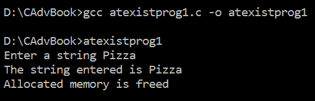
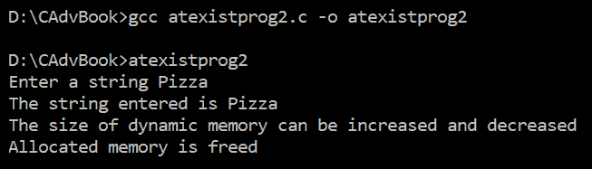
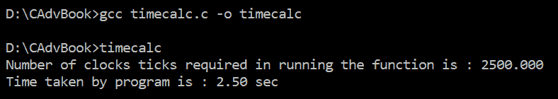
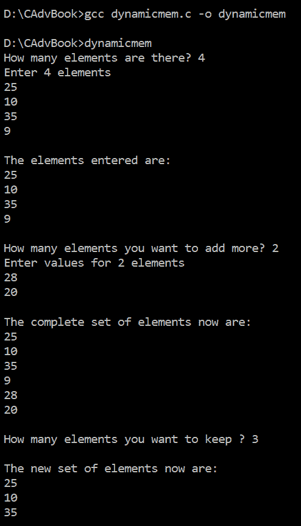
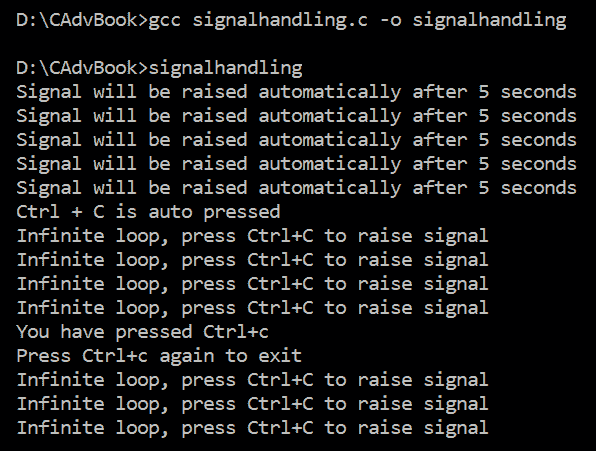

# 第十四章：通用工具

在本章中，我们将学习在执行不同任务时使用的不同函数。我们将学习如何注册在程序终止时自动执行的函数。我们将学习关于测量特定任务执行所需的时钟滴答和 CPU 秒数的函数。我们还将学习如何在运行时分配内存，并在任务完成后释放它。最后，我们将学习如何处理不同的信号。

在本章中，我们将深入以下食谱：

+   注册在程序退出时调用的函数

+   测量函数执行所需的时钟滴答和 CPU 秒数

+   执行动态内存分配

+   处理信号

然而，在我们继续之前，对动态内存分配和一些相关函数的简要介绍是必要的。

# 动态内存分配

正如其名所示，**动态内存分配**是在运行时分配内存的概念。与预定的静态内存分配不同，动态内存分配可以根据需要随时预订。静态分配的内存大小不能增加或减少，而动态分配的内存块的大小可以根据您的需求增加或减少。此外，当处理完成后，动态分配的内存可以释放，以便其他应用程序可以使用。以下小节描述了动态内存分配所需的几个函数。

# malloc()

此函数动态分配内存，即在运行时。分配给定大小的内存块（以字节为单位），并返回指向该块的指针。以下是它的语法：

```cpp
pointer = (data_type*) malloc(size_in_bytes)
```

此函数不会初始化分配的内存，因为该内存块最初包含一些垃圾值。

# calloc()

此函数分配多个内存块，并返回指向该内存块的指针。以下是它的语法：

```cpp
pointer=(data_type*) calloc( size_t num_of_blocks, size_t size_of_block )
```

此函数将分配的内存块初始化为零。

# realloc()

正如其名所示，此函数用于重新分配或调整分配的内存大小。内存重新分配不会导致现有数据的丢失。以下是它的语法：

```cpp
pointer= realloc(void *pointer, size_t new_blocksize);
```

在这里，`pointer`是指向现有分配内存块的指针。`new_blocksize`表示以字节为单位的新块大小，可以比现有分配块大小小或大。

# free()

当分配的内存块中的任务或作业完成时，该内存块需要被释放，以便其他应用程序可以使用。为了释放动态分配的内存，使用`free`函数。以下是它的语法：

```cpp
free(pointer);
```

在这里，`pointer`代表指向分配内存的指针。

让我们现在开始我们的第一个食谱！

# 注册在程序退出时调用的函数

我们的第一道菜谱将是注册一个在程序正常终止时自动执行的函数。为此菜谱，我们将使用`atexit()`函数。

`atexit`函数被设置为指向一个函数；这个函数在程序终止时将自动无参数调用。如果一个程序中定义了多个`atexit`函数，那么这些函数将以**后进先出**（**LIFO**）的顺序调用，即`atexit`函数最后指向的函数将首先执行，然后是倒数第二个，依此类推。

`atexit`函数接受一个单一强制参数：程序终止时要调用的函数的指针。此外，如果函数注册成功，即要调用的函数成功指向，则函数返回`0`。如果没有注册，则函数返回非零值。

在这个菜谱中，我们将动态分配一些内存以接受用户输入的字符串。输入的字符串将在屏幕上显示，当程序终止时，注册的函数将自动执行，从而释放动态分配的内存。

# 如何做到这一点…

按照以下步骤创建一个注册程序正常终止时自动执行的函数的菜谱：

1.  使用`atexit`函数注册一个函数。

1.  动态分配一些内存，并允许该内存通过指针指向。

1.  请求用户输入一个字符串，并将该字符串分配给动态分配的内存块。

1.  在屏幕上显示输入的字符串。

1.  当程序终止时，通过`atexit`函数注册的函数将自动调用。

1.  注册的函数简单地释放动态分配的内存，以便其他应用程序可以使用。

注册程序在程序终止时自动执行的函数的程序如下（`atexistprog1.c`）：

```cpp
#include <stdio.h> 
#include <stdlib.h> 

char *str; 
void freeup() 
{ 
    free(str); 
    printf( "Allocated memory is freed  \n"); 
} 

int main() 
{ 
    int retvalue; 
    retvalue = atexit(freeup); 
    if (retvalue != 0) { 
        printf("Registration of function for atexit () function 
          failed\n"); 
        exit(1); 
    } 
    str = malloc( 20 * sizeof(char) ); 
    if( str== NULL ) 
    { 
        printf("Some error occurred in allocating memory\n"); 
        exit(1); 
    } 
    printf("Enter a string "); 
    scanf("%s", str); 
    printf("The string entered is %s\n", str); 
}
```

现在，让我们深入了解代码，以更好地理解它。

# 它是如何工作的...

使用`atexit`函数注册一个名为`freeup`的函数，确保如果程序正常终止，则`freeup`函数将被调用。检查`atexit`函数返回的值，确保它为零。如果`atexit`函数返回的值是非零值，则表示函数未成功注册，程序将在显示错误消息后终止。

如果函数注册成功，则动态分配 20 字节，并将分配的内存块赋值给字符指针 `str`。如果 `str` 指针为 `NULL`，则表示内存块分配过程中发生了错误。如果确认 `str` 指针不为 `NULL` 并指向一个内存块，用户将被要求输入一个字符串。用户输入的字符串将被赋值给由 `str` 指针指向的内存块。然后，用户输入的字符串将在屏幕上显示，最后程序终止。然而，在程序终止之前，使用 `atexit` 函数注册的 `freeup` 函数被调用。`freeup` 函数释放了分配给 `str` 指针的内存，并显示一条消息：“已分配的内存已释放”。

程序使用 GCC 编译，如下面的截图所示。因为在编译过程中没有出现错误，所以 `atexistprog1.c` 程序已成功编译成 `.exe` 文件：`atexistprog1.exe`。执行此文件时，用户将被提示输入一个字符串，该字符串将被分配给动态分配的内存。在程序终止时，使用 `atexit` 注册的函数被执行，释放了动态分配的内存，如下面的截图中的文本消息所确认：



图 14.1

Voilà! 我们已经成功注册了一个在程序退出时调用的函数。

# 还有更多...

如果通过 `atexit` 函数注册了多个函数，那么这些函数将按照后进先出（LIFO）的顺序执行。为了理解这一点，让我们修改前面的 `atexistprog1.c` 程序，通过 `atexit` 函数注册两个函数。我们将修改后的程序保存为 `atexistprog2.c`，如下所示（`atexistprog2.c`）：

```cpp
#include <stdio.h> 
#include <stdlib.h> 

char *str; 
void freeup1() 
{
    free(str); 
    printf( "Allocated memory is freed  \n"); 
} 

void freeup2()
{ 
    printf( "The size of dynamic memory can be increased and decreased  \n"); 
} 

int main() 
{
    int retvalue; 
    retvalue = atexit(freeup1); 
    if (retvalue != 0) { 
        printf("Registration of function freeup1() for atexit () 
          function failed\n"); 
        exit(1); 
    }
    retvalue = atexit(freeup2); 
    if (retvalue != 0) { 
        printf("Registration of function freeup2() for atexit () 
          function failed\n");
        exit(1); 
    }
    str = malloc( 20 * sizeof(char));
    if( str== NULL ) 
    { 
        printf("Some error occurred in allocating memory\n"); 
        exit(1); 
    } 
    printf("Enter a string "); 
    scanf("%s", str); 
    printf("The string entered is %s\n", str); 
}
```

编译并执行程序后，我们得到以下输出：



图 14.2

这个输出确认了最后注册的函数 `freeup2` 首先执行，然后是第一个注册的函数 `freeup1`。

现在，让我们继续下一个菜谱！

# 测量函数执行所需的时钟滴答和 CPU 秒数

在这个菜谱中，我们将学习如何找出函数执行所需的时钟滴答和 CPU 秒数。我们将创建一个包含函数的程序。这个函数将简单地运行一个嵌套循环，我们将找出运行它所需的时间。为此，我们将使用 `clock()` 函数。

`clock()`函数返回程序消耗的处理器时间。本质上，这个时间取决于操作系统在分配资源给进程时使用的技巧。更精确地说，该函数返回从程序被调用时开始经过的时钟滴答数。该函数不需要任何参数，并返回运行某些语句所需的处理器时间，或者在出现任何故障时返回`-1`。

函数返回的时间以每秒`CLOCKS_PER_SEC`的`CLOCKS_PER_SEC`来衡量，其中`CLOCKS_PER_SEC`根据操作系统而变化，其值大约为 1,000,000。因此，为了找到 CPU 使用的秒数，需要将函数返回的时钟滴答数除以`CLOCKS_PER_SEC`。

`clock()`函数返回的值是`clock_t`数据类型。`clock_t`数据类型用于表示处理器时间。

# 如何操作...

按以下步骤查找运行函数所需的时钟滴答数和 CPU 秒数：

1.  定义两个`clock_t`数据类型的变量来保存处理器时间。

1.  调用`clock()`函数以确定从程序被调用时开始经过的时钟滴答数。时钟滴答数保存在其中一个变量中。

1.  调用一个需要确定其处理时间的函数。

1.  再次调用`clock()`函数，并将返回的时钟滴答数保存到另一个变量中。

1.  从两个变量中的时钟滴答数中减去，以确定执行函数所需的时钟滴答数。

1.  将前一步返回的时钟滴答数除以`CLOCKS_PER_SEC`，以确定函数使用的秒数。

    1.  屏幕上显示函数所需的时钟滴答数和 CPU 秒数。

知道执行函数所需的时钟滴答数和 CPU 秒数的程序如下（`timecalc.c`）：

```cpp
#include <time.h> 
#include <stdio.h> 

void somefunction() 
{ 
    for (int i=0; i<32000; i++) 
    { 
        for (int j=0; j<32000; j++) ; 
    } 
} 

int main() 
{ 
    clock_t clocktickstart, clocktickend; 
    double timeconsumed; 
    clocktickstart = clock();  
    somefunction(); 
    clocktickend = clock(); 
    timeconsumed = (double)(clocktickend - clocktickstart) / 
      CLOCKS_PER_SEC; 
    printf("Number of clocks ticks required in running the function is 
      : %.3f\n",  (double)(clocktickend - clocktickstart)); 
    printf("Time taken by program is : %.2f sec\n", timeconsumed); 
    return 0; 
}
```

现在，让我们深入了解幕后，以便更好地理解代码。

# 工作原理...

定义两个`clock_t`数据类型的变量，`clocktickstart`和`clocktickend`，因为它们将用于表示处理器时间。这个程序的主要思想是确定函数执行过程中消耗的时间。

调用`clock`函数是为了知道从程序被调用以来经过的时钟滴答数。将返回的时钟滴答数赋值给`clocktickstart`变量。然后，调用一个`somefunction()`函数，该函数包含一个嵌套的`for`循环。使用嵌套循环的目的是让 CPU 在执行这些循环上投入一些时间。`somefunction`函数执行完毕后，再次调用`clock()`函数，并将从程序调用以来经过的时钟滴答数赋值给`clocktickend`变量。`clocktickend`和`clocktickstart`变量之间的差值将给出执行`somefunction`函数所使用的时钟滴答数。然后，将时钟滴答数除以`CLOCKS_PER_SEC`以区分执行函数所使用的 CPU 秒数。最后，将执行`somefunction`函数所使用的时钟滴答数和它所使用的 CPU 秒数显示在屏幕上。

程序使用 GCC 编译，如下所示。由于编译过程中没有出现错误，`timecalc.c`程序成功编译成`.exe`文件：`timecalc.exe`。执行此文件后，屏幕上会显示程序中特定函数执行所需的时钟滴答数和 CPU 秒数，如下所示：



图 14.3

现在，让我们继续下一个配方！

# 执行动态内存分配

在本配方中，我们将学习如何动态分配一些内存。我们还将学习如何增加内存块的数量，如何减少已分配内存块的数量，以及如何释放内存。

# 如何操作...

我们将询问用户需要分配多少内存块，并将动态分配相应数量的内存块。然后，将要求用户将这些内存块分配整数值。之后，将询问用户还需要分配多少额外的内存块。同样，将询问用户需要减少多少内存块。以下是通过增加和减少内存块动态分配内存的步骤：

1.  用户被要求输入一个整数值，然后通过调用`calloc`函数动态分配相应数量的内存块。每个分配的内存块将能够存储整数数据类型的数值。

1.  然后将要求用户在动态分配的内存块中输入值。

1.  显示分配给内存块的整数值。

1.  询问用户还需要添加多少内存块。

1.  调用`realloc`函数来增加已分配内存块的数量。

1.  要求用户在新增的内存块中输入整数值。

1.  显示分配给内存块的整数值。

1.  询问用户需要多少可用的内存块。

1.  再次调用`realloc`函数以减少分配的内存块数量。

1.  显示现有内存块中可用的整数值。

1.  释放所有内存块，以便其他应用程序可以使用。

显示动态内存分配优势的程序，即如何在运行时分配内存，以及如何增加或减少其大小并释放它，如下所示（`dynamicmem.c`）：

```cpp
#include <stdio.h> 
#include <stdlib.h> 

int main() 
{ 
    int* ptr; 
    int m,n, i; 

    printf("How many elements are there? "); 
    scanf("%d", &n); 
    ptr = (int*)calloc(n, sizeof(int));
    if (ptr == NULL) { 
        printf("Memory could not be allocated.\n"); 
        exit(0); 
    } 
    printf("Enter %d elements \n", n); 
    for (i = 0; i < n; ++i) 
        scanf("%d",&ptr[i]); 
    printf("\nThe elements entered are: \n"); 
    for (i = 0; i < n; ++i) 
        printf("%d\n", ptr[i]); 
    printf("\nHow many elements you want to add more? "); 
    scanf("%d",&m); 
    ptr = realloc(ptr, (m+n) * sizeof(int)); 
    printf("Enter values for %d elements\n",m); 
    for (i = n; i < (m+n); ++i) 
        scanf("%d",&ptr[i]); 
    printf("\nThe complete set of elements now are: \n"); 
    for (i = 0; i < (m+n); ++i) 
        printf("%d\n", ptr[i]); 
    printf("\nHow many elements you want to keep ? "); 
    scanf("%d", &m); 
    ptr = realloc(ptr, (m) * sizeof(int)); 
    printf("\nThe new set of elements now are: \n"); 
    for (i = 0; i < m; ++i) 
        printf("%d\n", ptr[i]); 
    free(ptr);   
    return 0; 
}
```

现在，让我们深入了解代码背后的原理。

# 它是如何工作的...

将用户指定的元素数量分配给变量`n`。假设用户输入的值是`4`，然后将其分配给变量`n`。使用`calloc`函数，动态分配了`4`个内存块，每个内存块的大小等于`int`数据类型消耗的大小。换句话说，动态分配了一个可以存储四个整数值的内存块，并将指针`ptr`设置为指向它。如果`ptr`指针是`NULL`，则这意味着内存无法分配，程序将在显示错误消息后终止。

如果内存分配成功，将要求用户输入四个整数值。输入的值将被分配给由指针`ptr`指向的各个内存块。然后，在屏幕上显示用户输入的整数值。随后将询问用户是否想要添加更多元素。假设用户想要将两个额外的内存块添加到现有的已分配内存块中，用户输入的`2`值将被分配给变量`m`。

使用`realloc`函数，内存块的数量从四个增加到六个，其中每个内存块能够存储一个整数。将要求用户输入两个新添加的内存块中的整数值。为了表示内存块的大小已从四个增加到六个，将显示分配给六个内存块的所有六个整数。之后，将询问用户想要保留多少个内存块中的六个内存块。假设用户输入的值是`3`；即用户想要保留前三个内存块中的整数，并丢弃其余的。

用户输入的`3`值将被分配给变量`m`。再次调用`realloc`函数，将内存块的数量从六个减少到三个。最后，在屏幕上显示三个内存块中的整数。

程序使用 GCC 编译，如下面的截图所示。由于编译过程中没有出现错误，`dynamicmem.c` 程序已成功编译成 `.exe` 文件：`dynamicmem.exe`。执行此文件后，用户会被提示定义他们想要动态分配多少内存块。之后，用户会被问及他们想要多少额外的内存块。用户还会被问及是否希望从总数中保留一些内存块以保持活跃，从而减少分配的内存块数量，最后，所有内存块都会被释放。所有这些操作如下所示：



图 14.4

现在，让我们继续下一个食谱！

# 处理信号

在这个食谱中，我们将学习信号处理。我们将学习如何自动引发信号，用户如何通过操作引发信号，以及信号如何被引导到特定的信号处理函数。信号处理需要在信号发生时采取必要的行动。这些行动可能包括忽略信号、终止进程、阻塞或挂起进程、恢复进程等等。

在我们深入到食谱之前，让我们先快速了解一下信号。

# 信号

信号是通过软件生成的指示器，用于停止程序的常规执行，并通过 CPU 的一个分支执行一些特定任务。信号可以由进程生成，或者当用户按下 *Ctrl* + *C* 时生成。当执行操作时出现错误或发生某些错误时，信号充当进程和操作系统之间的通信媒介。信号由操作系统引发，并转发给进程以采取必要的行动。本质上，执行相应的信号处理程序作为纠正措施。

以下是一些你应该了解的重要信号：

+   **SIGABRT**（**信号终止**）：此信号报告程序的异常终止。在出现关键错误的情况下会引发此信号；例如，如果断言失败或无法分配内存，或者任何类似的内存堆错误。

+   **SIGFPE**（**信号浮点异常**）：此信号报告算术错误。任何算术错误，包括溢出或除以零，都包含在此信号中。

+   **SIGILL**（**信号非法指令**）：此信号报告非法指令。当程序尝试执行数据或可执行文件损坏时，会引发此类信号。换句话说，当程序尝试执行非可执行指令时，会引发此信号。

+   **SIGINT**（**信号中断**）：这是由用户通过按下 *Ctrl* + *C* 生成的程序中断信号。

+   **SIGSEGV**（**信号段违规**）：当程序尝试写入只读内存或没有写权限的块时，会触发此信号。当程序尝试读取或写入分配给它范围之外的内存时，也会触发此信号。

+   **SIGTERM**（**信号终止**）：这是一个发送给进程以终止它的终止信号。

要在程序中处理信号，使用 `signal()` 函数。让我们快速了解一下信号函数。

# signal()

信号函数将信号的发生指向以下任一信号处理函数：

+   `SIG_IGN`：这将导致信号被忽略。

+   `SIG_DFL`：这将导致调用与触发信号关联的默认动作。

+   `user_defined_function`：这将导致在信号被触发时调用用户定义的函数。

现在，让我们开始编写步骤。

# 如何做到这一点...

将信号关联到信号处理函数、自动触发信号以及当用户触发信号时执行所需动作的步骤如下：

1.  将一个信号中断 `(SIGINT)` 关联到一个函数。这个函数将作为信号处理函数。

1.  在信号处理函数中编写一些代码。

1.  在 `main` 函数中，创建一个执行 5 次的 `while` 循环。你可以让 `while` 循环运行任意次数。`while` 循环被设置为在延迟 1 秒后显示一条文本消息。

1.  策略是在 5 秒后自动触发信号。因此，在经过 5 次迭代后，`while` 循环结束，中断信号被自动触发。

1.  执行相关的信号处理函数。

1.  在信号处理函数中执行代码后，在 `main` 函数中，再次将信号中断 `(SIGINT)` 关联到另一个信号处理函数。

1.  设置一个无限 `while` 循环执行，每次延迟 1 秒后显示一条文本消息。

1.  如果用户按下 *Ctrl* + *C*，则信号中断被触发，并调用相关的信号处理函数。

1.  在信号处理函数中，我们将信号中断与其默认动作关联。

1.  因此，如果用户再次按下 *Ctrl* + *C*，即如果信号中断再次被触发，将执行默认动作：程序将终止。

显示信号如何自动触发、用户如何触发信号以及如何处理的程序如下（`signalhandling.c`）：

```cpp
#include <stdio.h>
#include <unistd.h>
#include <stdlib.h>
#include <signal.h>

void sighandler1(int signum) {
    printf("Ctrl + C is auto pressed \n"); 
} 

void sighandler2(int signum) { 
    printf("You have pressed Ctrl+c\n"); 
    printf("Press Ctrl+c again to exit\n"); 
    (void) signal(SIGINT, SIG_DFL); 
} 

int main () { 
    int x=1; 
    signal(SIGINT, sighandler1); 
    while(x<=5) { 
        printf("Signal will be raised automatically after 5 
          seconds\n");
        x++; 
        sleep(1); 
    }
    raise(SIGINT); 
    signal(SIGINT, sighandler2);
    while(1) {
        printf("Infinite loop, press Ctrl+C to raise signal\n"); 
        sleep(1); 
    } 
    return(0); 
}
```

现在，让我们幕后了解代码，以便更好地理解。

# 它是如何工作的...

使用 `signal` 函数，将信号中断 `(SIGINT)` 与名为 `signalhandler1` 的函数关联。也就是说，如果中断是自动生成的或是由用户生成的，`sighandler1` 函数将被调用。计数器 `x` 被初始化为 `1`，并设置一个 `while` 循环执行，直到计数器 `x` 的值大于 `5`。在 `while` 循环中，显示以下文本：“信号将在 5 秒后自动提升”。此外，在 `while` 循环中，计数器 `x` 的值增加 `1`。在 `while` 循环中插入 1 秒的延迟。简而言之，`while` 循环将在每次间隔 1 秒后显示一条文本消息。在显示文本消息 5 次后，调用 `raise` 函数提升 `SIGINT` 信号。

当提升 `SIGINT` 信号时，将调用 `signalhandler1` 函数。`signalhandler1` 函数除了显示一条文本消息：“Ctrl+C 已自动按下”外，不做任何操作。执行 `signalhandler1` 函数后，控制权恢复执行 `main` 函数中的语句。再次调用 `signal` 函数并将 `SIGINT` 信号与 `sighandler2` 函数关联。再次设置一个 `while` 循环执行；然而，这次循环将无限运行。在 `while` 循环中，显示一条文本消息：“无限循环，按 Ctrl+C 生成信号”。在显示文本消息后，插入 1 秒的延迟；也就是说，在 1 秒的间隔后，文本消息将无限期地显示。如果用户按下 *Ctrl* + *C*，将提升信号中断并调用 `sighandler2` 函数。

在 `sighandler2` 函数中，一行显示一条文本消息，“您已按下 Ctrl+C”，下一行显示“再次按 Ctrl+C 退出”。之后，调用 `signal` 函数将 `SIGINT` 信号设置为默认操作。`SIGINT` 中断的默认操作是终止并退出程序。这意味着如果用户再次按下 *Ctrl* + *C*，程序将终止。

该程序使用 GCC 进行编译，如下所示截图。由于编译过程中没有出现错误，`signalhandling.c` 程序已成功编译成 `.exe` 文件：`signalhandling.exe`。执行此文件后，通过第一个 `while` 循环在屏幕上显示五条文本消息。之后，信号自动提升，第一个信号处理器的文本消息出现在屏幕上。然后，无限 `while` 循环的文本消息出现。最后，当用户生成信号中断时，第二个信号处理器的输出出现。所有动作如下所示：



图 14.5

Voilà！我们已经成功处理了信号。
