# 在编码中应用安全性

在编码过程中，有时你可能使用不检查或约束用户输入数据的函数。用户可能输入错误的数据或内容，可能比接收变量的容量大。在这种情况下，可能会发生缓冲区溢出或段错误。因此，程序将给出错误输出。

在本章中，我们将使用以下方法来查看我们如何使程序中的数据输入无错误：

+   避免从键盘读取字符串时的缓冲区溢出

+   在复制字符串时编写安全代码

+   避免字符串格式化时的错误

+   避免在 C 中访问文件时的漏洞

# 缓冲区溢出

在 C 编程中最常见的漏洞是缓冲区溢出。缓冲区，正如其名所示，代表程序在 RAM 中使用的临时内存存储区域。通常，程序中使用的所有变量都被分配临时缓冲区存储，以保持分配给它们的值。一些函数在将较大的值（大于分配的缓冲区）赋给变量时，不限制缓冲区内的数据，导致缓冲区溢出。溢出的数据会破坏或覆盖其他缓冲区中的数据。

这些缓冲区溢出可能被黑客或恶意用户用来损坏文件或数据，或提取敏感信息。也就是说，攻击者可能会输入导致缓冲区溢出的输入。

在为数组赋值时，没有边界检查，代码可能工作，无论访问的内存是否属于你的程序。在大多数情况下，这会导致段错误，覆盖另一个内存区域中的数据。

在这个程序中，我们将反复使用一些术语和函数。让我们快速概述一下它们。

# gets()

`gets()` 函数从标准输入设备读取字符，并将它们分配到指定的字符串中。读取字符在遇到换行符时停止。此函数不检查缓冲区长度，总是导致漏洞。以下是它的语法：

```cpp
char *gets ( char *str);
```

在这里，`str` 代表指向字符串（字符数组）的指针，读入的字符将被分配到该字符串中。

在成功执行的情况下，该函数返回 `str`，如果发生任何错误则返回 `NULL`。

# fgets()

`fgets()` 函数用于从指定的源读取字符串，其中源可以是任何文件、键盘或其他输入设备。以下是它的语法：

```cpp
char *fgets(char *str, int numb, FILE *src);
```

从指定的源 `src` 读取 `numb` 个字节，并将它们分配到由 `str` 指向的字符串中。该函数要么读取 `numb-1` 个字节，要么直到遇到换行符 (`\n`) 或文件结束，以先到者为准。

该函数还会将空字符 (`\0`) 添加到读取的字符串中，以终止字符串。如果执行成功，函数返回指向 `str` 的指针；如果发生错误，则返回 `NULL`。

# fpurge(stdin)

`fpurge(stdin)` 函数用于清除或清空流的输入缓冲区。有时，在为一些变量提供数据后，数据（可能是空格或换行符的形式）会留在缓冲区中，没有被清除。在这种情况下，使用此函数。如果执行成功，函数返回零，否则返回 EOF。

这里是它的语法：

```cpp
fpurge(stdin)
```

# `sprintf()`

`sprintf()` 函数用于将格式化文本分配到字符串中。以下是它的语法：

```cpp
int sprintf(char *str, const char *format, ...)
```

在这里，`str` 是一个指向字符串的指针，格式化字符串需要被分配到这个字符串中，而 `format` 与 `printf` 语句中的用法相同，可以使用不同的格式化标签，如 `%d` 和 `%s` 来格式化内容。

# `snprintf()`

`snprintf()` 函数格式化给定内容并将其分配到指定的字符串。只有指定数量的字节将被分配到目标字符串。以下是它的语法：

```cpp
int snprintf(char *str, size_t numb, const char *format, ...);
```

下面是对前面代码的分解：

+   `*str`：表示指向字符串的指针，格式化内容将被分配到该字符串。

+   `numb`：表示可以分配到字符串的最大字节数。

+   `format`：与 `printf` 语句类似，可以使用多个格式化标签，如 `%d` 和 `%s` 来格式化内容。

注意：`snprintf` 自动将空字符追加到格式化字符串中。

# `strcpy()`

`strcpy()` 函数用于从一个字符串复制内容到另一个字符串。以下是它的语法：

```cpp
char* strcpy(char* dest, const char* src);
```

在这里，`src` 代表源字符串的指针，内容需要从该字符串复制，而 `dest` 代表目标字符串的指针，内容需要复制到该字符串。

# `strncpy( )`

`strncpy()` 函数用于从字符串复制指定数量的字节到另一个字符串。以下是它的语法：

```cpp
char * strncpy ( char * dest, const char *src, size_t numb);
```

下面是对前面代码的分解：

+   `dest`：表示复制到目标字符串的指针

+   `src`：表示从源字符串复制字节的指针

+   `numb`：表示从源字符串复制到目标字符串的字节数

如果 `numb` 参数的值大于源字符串的长度，目标字符串将以空字节填充。如果目标字符串的长度小于 `numb` 参数，则字符串将被截断以等于目标字符串的长度。

让我们现在开始我们的安全编码之旅，从第一个菜谱开始。

# 理解缓冲区溢出是如何发生的

在这个菜谱中，我们将学习如何从用户那里获取输入，并看到导致缓冲区溢出并产生模糊输出的情况。我们还将学习避免缓冲区溢出的方法。

基本上，我们将创建一个包含两个成员的结构体，并在其中一个成员中故意输入超过其容量的文本，从而导致缓冲区溢出。这将导致结构体另一个成员的内容被覆盖。

# 如何做到这一点...

这里是创建会导致缓冲区溢出的程序的步骤：

1.  定义一个包含`name`和`orderid`两个成员的结构体。

1.  定义两个类型为*步骤 1*中定义的结构体的变量。在其中一个结构体变量中，我们将故意输入大量数据以生成缓冲区溢出。

1.  提示用户为第一个结构体输入`orderid`成员的值。

1.  在调用`gets`函数之前，调用`fpurge`函数以清空输入流缓冲区。

1.  调用`gets`函数为第一个结构体的`name`成员输入数据。输入比`name`成员长度更大的文本。

1.  重复*步骤 3*到*5*以输入第二个结构体的`orderid`和`name`成员的数据。这次，请输入在`name`成员容量内的数据。

1.  显示分配给第一个结构体的`orderid`和`name`成员的数据。在第一个结构体中将会发生缓冲区溢出，您在显示`orderid`值时将得到一个模糊的输出。

1.  显示分配给第二个结构体的`orderid`和`name`成员的数据。在这个结构体中没有发生缓冲区溢出，您将得到与两个成员输入完全相同的数据。

以下程序将获取两个结构体的名称和订单号值。在结构体的一个成员中，我们将输入超过其容量的数据以生成缓冲区溢出：

```cpp
//getsproblem.c

#include <stdio.h>

struct users {
  char name[10];
  int orderid;
};
int main(void) {
  struct users user1, user2;
  printf("Enter order number ");
  scanf("%d", & user1.orderid);
  fpurge(stdin);
  printf("Enter first user name ");
  gets(user1.name);
  printf("Enter order number ");
  scanf("%d", & user2.orderid);
  fpurge(stdin);
  printf("Enter second user name ");
  gets(user2.name);
  printf("Information of first user - Name %s, Order number %d\n", 
   user1.name, user1.orderid);
  printf("Information of second user - Name %s, Order number %d\n", 
   user2.name, user2.orderid);
}
```

现在，让我们深入了解代码，以更好地理解其工作原理。

# 它是如何工作的...

程序将要求输入两对名称和订单号。在第一对中，我们将通过输入比变量大小更长的文本来故意生成缓冲区溢出，而对于第二对，我们将输入指定范围内的数据。因此，第一个用户（对）的信息将显示不正确，即数据不会与输入的完全相同，而第二个用户的信息将正确显示。

因此，我们将定义一个名为`users`的结构体，其中包含两个字段或成员，分别称为`name`和`orderid`，其中`name`被定义为大小为 10 字节的字符串，`orderid`被定义为 2 字节的 int 变量。然后，我们将定义两个`users`结构体类型的变量`user1`和`user2`；这意味着`user1`和`user2`变量都将各自获得一个`name`和`orderid`成员。

您将被提示两次输入用户名和订单号。输入的第一组名称和订单号将被分配给`user1`，第二组分配给`user2`。然后，两个用户的输入信息将在屏幕上显示。

让我们使用 GCC 编译`getsproblem.c`程序。如果你没有错误或警告，这意味着`getsproblem.c`程序已编译成可执行文件：`getsproblem.exe`。让我们运行这个文件：

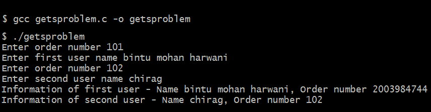

图 18.1

我们可以在前面的输出中看到，由于第一个结构体中`name`成员造成的缓冲区溢出，`orderid`成员的值`101`被覆盖。因此，我们得到第一个结构体的`orderid`的垃圾值。第二个结构体的输出是正确的，因为为其成员输入的值在其容量范围内。

为了避免在输入数据时发生溢出，我们只需将`gets`函数替换为`fgets`函数。使用`fgets`函数，我们可以指定允许在指定字符串中的最大字符数。超出部分的文本将被截断，并且不会分配给指定的字符串。

# 学习如何避免缓冲区溢出

在前面的步骤中，我们定义了两个结构体变量，因为我们想展示，如果输入的数据大小大于接收变量字段允许的大小，将导致模糊的输出；如果输入的数据在接收变量的容量范围内，将生成正确的输出。

在下面的步骤中，我们不需要两个结构体变量，因为我们将会使用`fgets`函数来解决问题。这个函数永远不会导致缓冲区溢出。

# 如何做到这一点...

下面是使用`fgets`函数避免缓冲区溢出的步骤：

1.  定义一个包含两个成员的结构体，`name`和`orderid`。

1.  定义一个类型为*步骤 1*中定义的结构体的变量。

1.  提示用户为结构体的`orderid`成员输入一个值。

1.  在调用`fgets`函数之前，调用`fpurge`函数清空输入流缓冲区。

1.  调用`fgets`函数为结构体的`name`成员输入数据。为了限制分配给`name`成员的文本的大小，通过调用`sizeof`函数计算其长度，并将该字符串长度提供给`fgets`函数。

1.  如果字符串中还没有空字符，则添加一个空字符以终止字符串。

1.  显示分配给结构体成员`orderid`和`name`的数据，以验证没有缓冲区溢出。

以下程序定义了一个包含两个成员的结构体，并解释了如何在通过键盘输入数据时避免缓冲区溢出：

```cpp
//getssolved.c

#include <stdio.h>
#include <string.h>
#include <stdlib.h>

struct users {
  char name[10];
  int orderid;
};

int main(void) {
  struct users user1;
  int n;
  printf("Enter order number ");
  scanf("%d", & user1.orderid);
  fpurge(stdin);
  printf("Enter user name ");
  fgets(user1.name, sizeof(user1.name), stdin);
  n = strlen(user1.name) - 1;
  if (user1.name[n] == '\n')
    user1.name[n] = '\0';
  printf("Information of the user is - Name %s, Order number %d\n", 
   user1.name, user1.orderid);
}
```

现在，让我们深入了解代码，以更好地理解它。

# 它是如何工作的...

在程序中，`fgets` 函数从标准输入设备获取输入，从输入设备读取的最大字符数将等于 `user1` 结构体中 `name` 变量允许的字节数。因此，即使用户输入了较长的字符串，也只会从输入中选取指定的字节数；也就是说，只会选取输入中的前 10 个字符并分配给 `user1` 结构体的 `name` 成员。

`fgets` 函数会将空字符 (`\0`) 追加到字符串中，前提是输入的字符数比函数中指定的最大长度少一个。但对于比指定长度大的字符串，我们需要在字符串的末尾插入空字符。为此，我们需要检查换行符是否作为字符串的最后一个字符存在。如果是，那么我们将字符串中的换行符替换为空字符以终止字符串。

让我们使用 GCC 编译 `getssolved.c` 程序。如果你没有错误或警告，这意味着 `getssolved.c` 程序已编译成可执行文件：`getssolved.exe`。让我们运行这个文件：

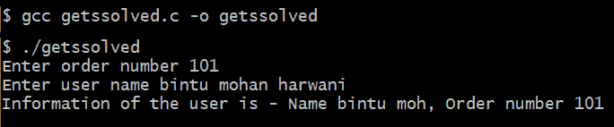

图 18.2

我们可以在前面的输出中看到，分配给结构体成员 `name` 的较长的文本被截断，按照成员的大小进行截断，因此不会发生缓冲区溢出。

# 理解在复制字符串时如何发生漏洞

在这个菜谱中，我们将看到在复制字符串时可能发生的漏洞。我们还将看到如何避免这个漏洞。我们首先定义一个由两个成员组成的结构体。在一个成员中，我们将复制一个比其容量大的文本，这将导致覆盖另一个成员的内容。

在下一个菜谱中，我们将学习如何避免这个问题。

# 如何做...

这里是理解在复制字符串时如何发生漏洞的步骤：

1.  定义一个包含两个成员的结构体，`name` 和 `orderid`。

1.  定义一个由步骤 1 中定义的结构体类型定义的变量。

1.  将任何整数值分配给结构体的 `orderid` 成员。

1.  调用 `strcpy` 函数将文本分配给结构体的 `name` 成员。为了生成缓冲区溢出，向其分配较长的文本。

1.  显示分配给结构体成员 `orderid` 和 `name` 的数据，以确认是否生成了模糊的输出，这验证了发生了缓冲区溢出。

显示在复制字符串时出现漏洞的程序如下：

```cpp
//strcpyproblem.c

#include <stdio.h>
#include <string.h>

struct users {
  char name[10];
  int orderid;
};

int main(void) {
  struct users user1;
  char userid[] = "administrator";
  user1.orderid = 101;
  strcpy(user1.name, userid);
  printf("Information of the user - Name %s, Order number %d\n", 
   user1.name, user1.orderid);
}
```

现在，让我们深入了解代码，以更好地理解它。

# 它是如何工作的...

为了输入客户的名称和订单号，定义一个名为 `users` 的结构体，包含两个成员，`name` 和 `orderid`。`name` 成员是一个长度为 10 个字节的字符数组或字符串，而 `orderid` 成员是一个由 2 个字节组成的 `int` 数据类型的变量。

定义一个名为`user1`的变量，其类型为`users`结构；因此，`user1`结构将获得两个成员，`name`和`orderid`。将整数值 101 分配给`user1`结构中`orderid`成员。同时，将字符串`administrator`分配给`user1`的`name`成员。由于字符串`administrator`的大小超过了`name`成员的大小，将发生缓冲区溢出，覆盖下一个内存位置的内存，即`orderid`成员的内存。因此，在显示用户信息时，尽管`name`成员中的数据可能显示正确，但`orderid`成员的内容将显示错误，因为其内容已被覆盖。

让我们使用 GCC 编译`strcpyproblem.c`程序。如果你没有错误或警告，这意味着`strcpyproblem.c`程序已编译成可执行文件：`strcpyproblem.exe`。让我们运行这个文件：

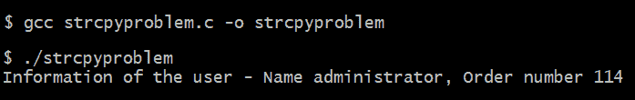

图 18.3

在前面的输出中，你可以看到，由于`name`成员被分配了一个比其大小大的字符串，这导致它覆盖了另一个成员`orderid`的内容。`name`成员的内容与用户输入的相同，而`orderid`的内容显示错误。

# 学习如何在复制字符串时编写安全的代码

为了避免使用`strcpy`函数时发生的缓冲区溢出，只需将`strcpy`函数替换为`strncpy`函数。`strncpy`将只复制指定数量的字节到目标字符串，因此在这个函数中不会发生缓冲区溢出。让我们看看它是如何完成的。

# 如何做到这一点...

在复制字符串时编写安全代码的步骤如下：

1.  定义一个包含两个成员`name`和`orderid`的结构。

1.  定义一个类型为*步骤 1*中定义的结构类型的变量。

1.  将任何整数值分配给结构的`orderid`成员。

1.  确定结构的`name`成员的长度，以找到它可以容纳的最大字符数。

1.  调用`strncpy`函数将文本复制到结构的`name`成员。同时，也将`name`成员的长度传递给`strncpy`函数，以便在文本大于`name`成员容量时截断文本。

1.  如果字符串中还没有空字符，请添加一个空字符以终止它。

1.  显示分配给结构的`orderid`和`name`成员的数据，以验证没有发生缓冲区溢出，并且显示的数据与输入的数据相同。

以下是一个足够安全的字符串复制程序：

```cpp
//strcpysolved.c

#include <stdio.h>
#include <string.h>

struct users {
  char name[10];
  int orderid;
};

int main(void) {
  int strsize;
  struct users user1;
  char userid[] = "administrator";
  user1.orderid = 101;
  strsize = sizeof(user1.name);
  strncpy(user1.name, userid, strsize);
  if (user1.name[strsize - 1] != '\0')
    user1.name[strsize - 1] = '\0';
  printf("Information of the user - Name %s, Order number %d\n", 
   user1.name, user1.orderid);
}
```

现在，让我们深入了解代码，以更好地理解它。

# 它是如何工作的...

在这个菜谱中，一切与上一个菜谱相同。不同之处在于我们调用了`strncpy`函数。当调用此函数时，只有从`administrator`文本中分配的`strsize`个字节被分配给`user1`结构体的`name`成员。因为`strsize`包含`name`成员的最大长度，所以在这种情况下不会发生缓冲区溢出。

最后，我们检查空字符`\0`是否存在于`name`成员的最后一个字符。如果没有，则在末尾添加空字符以终止字符串。在显示用户信息时，我们可以看到，由于`name`成员的长度为 10，只有文本`administrator`的前 9 个字符被分配给`name`成员，后面跟着一个空字符。因此，`orderid`成员的值也将正确显示，与输入的完全相同。

让我们使用 GCC 编译`strcpysolved.c`程序。如果你没有错误或警告，这意味着`strcpysolved.c`程序已编译成可执行文件：`strcpysolved.exe`。让我们运行这个文件：

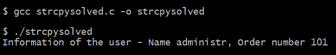

图 18.4

你可以在前面的输出中看到，无论为两个成员输入什么值，我们都会得到完全相同的输出。

# 理解字符串格式化时出现的错误

在这个菜谱中，我们将了解在格式化字符串时可能会发生什么样的错误。我们还将看到如何避免这种错误。我们将定义一个包含两个成员的结构，并将格式化字符串分配给其中一个成员。让我们看看我们会遇到什么错误。

在下一个菜谱中，我们将看到如何避免这种情况。

# 如何做...

这里是制作一个由于字符串格式化而出现错误的程序的步骤：

1.  定义一个包含两个成员`name`和`orderid`的结构。

1.  定义一个在*步骤 1*中定义的结构类型的变量。

1.  将任何整数值分配给结构体的`orderid`成员。

1.  调用`sprintf`函数将格式化文本分配给结构的`name`成员。为了生成缓冲区溢出，请分配一个较长的文本。

1.  显示分配给结构体成员`orderid`和`name`的数据，以确认是否生成了模糊的输出，以验证是否发生了缓冲区溢出。

以下是一个由于应用字符串格式化而产生错误输出的程序：

```cpp
//sprintfproblem.c

#include <stdio.h>

struct users {
  char name[10];
  int orderid;
};

int main(void) {
  struct users user1;
  user1.orderid = 101;
  sprintf(user1.name, "%s", "bintuharwani");
  printf("Information of the user - Name %s, Order number 
   %d\n", user1.name, user1.orderid);
}
```

现在，让我们深入了解代码，以更好地理解它。

# 它是如何工作的...

我们想输入关于客户名称和他们下订单的信息。因此，我们定义了一个名为`users`的结构体，包含两个成员，`name`和`orderid`，其中`name`成员定义为长度为 10 字节的字符数组，而`orderid`成员定义为 2 字节的 int 数据类型。定义了一个`users`结构体类型的变量`user1`，因此`user1`结构体会获得两个成员，`name`和`orderid`。将值`101`的整数赋值给`user1`结构体的`orderid`成员。

使用`sprintf`函数，将字符串`bintuharwani`赋值给`user1`结构体的`name`成员。由于`bintuharwani`字符串的大小超过了`name`成员，因此将发生缓冲区溢出，覆盖下一个内存位置的内存，即`orderid`成员的内存。因此，在显示用户信息时，名称将正确显示，但你将得到`orderid`成员的不同或模糊的值。

让我们使用 GCC 编译`sprintfproblem.c`程序。如果没有错误或警告，这意味着`sprintfproblem.c`程序已编译成可执行文件：`sprintfproblem.exe`。让我们运行这个文件：

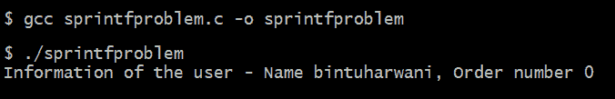

图 18.5

在输出中，你可以看到订单号显示错误；也就是说，不是显示分配的值`101`，而是显示值`0`。这是因为将`bintuharwani`字符串赋值给`name`成员时，由于字符串的大小超过了`name`成员的容量，导致缓冲区溢出，覆盖了`orderid`成员的值。

# 学习如何在格式化字符串时避免错误

在这个菜谱中，我们将使用`snprintf`函数。`snprintf`函数将格式化文本赋值给`name`成员，但会限制分配给它的字符串的大小。`sprintf`和`snprintf`函数之间的区别在于，`sprintf`无论目标字符串的容量如何，都会简单地将完整的格式化文本赋值给目标字符串，而`snprintf`允许我们指定可以分配给目标字符串的文本的最大长度。因此，不会发生缓冲区溢出，因为只将指定的文本大小分配给目标字符串。

# 如何做到这一点...

下面是创建一个由于字符串格式化而出现错误的程序的步骤：

1.  定义一个包含两个成员的结构体，`name`和`orderid`。

1.  定义一个由步骤 1 中定义的结构体类型变量。

1.  将任何整数值赋给结构体的`orderid`成员。

1.  调用`snprintf`函数将格式化文本赋值给结构体的`name`成员。同时将`name`成员的长度传递给`snprintf`函数，以便在文本大于`name`成员的容量时截断文本。

1.  显示结构体`orderid`和`name`成员分配的数据，以验证不会发生缓冲区溢出，并且显示的数据与输入的数据相同。

以下程序展示了如何避免与字符串格式化相关的错误：

```cpp
//sprintfsolved.c

#include <stdio.h>

struct users {
  char name[10];
  int orderid;
};

int main(void) {
  struct users user1;
  user1.orderid = 101;
  snprintf(user1.name, sizeof(user1.name), "%s", "bintuharwani");
  printf("Information of the user - Name %s, Order number 
   %d\n", user1.name, user1.orderid);
}
```

现在，让我们深入了解幕后，更好地理解代码。

# 它是如何工作的...

为了限制分配给`user1`结构体`name`成员的内容大小，我们将使用`snprintf`函数。你可以看到，通过`snprintf`函数，只有文本`bintuharwani`的前 10 个字符被分配给`name`成员。因为`name`成员的长度是 10，它能够存储 10 个字符，因此不会发生缓冲区溢出，分配给`orderid`成员的值将保持完整和未受干扰。在显示`orderid`和`name`成员的值时，它们的值都将正确显示。

让我们使用 GCC 编译`sprintfsolved.c`程序。如果你没有错误或警告，这意味着`sprintfsolved.c`程序已编译成可执行文件：`sprintfsolved.exe`。让我们运行这个文件：

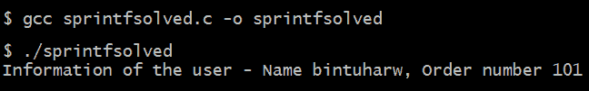

图 18.6

在前面的输出中，我们可以看到分配给`name`成员的额外格式化文本被截断，因此正确显示在屏幕上的`name`和`orderid`成员的输出。

# 理解在 C 语言访问文件时如何出现漏洞

假设你编写了一个程序来创建一个名为`file1.txt`的文本文件。在这样的程序中，恶意用户或黑客可能会在你要创建的文件中添加一些软链接到某些重要或敏感文件。结果，这会导致重要文件的覆盖。

# 如何做到这一点...

我们将首先假设一个名为`file2.txt`的重要文件已经存在于你的计算机上，并包含一些敏感信息。以下是恶意用户或黑客可以在你的程序中使用的步骤来创建一个覆盖`file2.txt`的文件：

1.  定义一个文件指针。

1.  黑客可能会创建一个软链接，并将一个敏感文件附加到我们想要创建的文件上。

1.  打开我们想要写入内容的文件。但在现实中，附加到我们的文件上的敏感文件将以只写模式打开。

1.  提示用户输入要写入文件的文本行。

1.  将用户输入的行写入文件。

1.  重复*步骤 4*和*步骤 5*，直到用户输入`stop`。

1.  关闭由文件指针`fp`指向的文件。

以下是一个恶意用户可以用来将某些重要文件链接到你要创建的文件，从而覆盖和破坏系统上该重要文件的程序：

```cpp
//fileproblem.c

#include <stdio.h>
#include <string.h>
#include <stdlib.h>
#include <unistd.h>

#define BUFFSIZE 255

void main(int argc, char * argv[]) {
  FILE * fp;
  char str[BUFFSIZE];
  if (symlink("file2.txt", "file1.txt") != 0) {
    perror("symlink() error");
    unlink("file2.txt");
    exit(1);
  } else {
    fp = fopen("file1.txt", "w");
    if (fp == NULL) {
      perror("An error occurred in creating the file\n");
      exit(1);
    }
    printf("Enter content for the file\n");
    gets(str);
    while (strcmp(str, "stop") != 0) {
      fputs(str, fp);
      gets(str);
    }
  }
  fclose(fp);
}
```

现在，让我们深入了解幕后，更好地理解代码。

# 它是如何工作的...

文件指针由名称 `fp` 定义。在这个阶段，黑客或恶意用户可能会调用 `symlink` 函数创建一个名为 `file1.txt` 的软链接指向名为 `file2.txt` 的文件。在这个程序中，`file2.txt` 可以是密码文件或其他恶意用户可能想要覆盖或破坏的敏感文件。

因为程序是用来创建新文件的，程序调用 `fopen` 函数以写入模式打开 `file1.txt`，打开的文件将由文件指针 `fp` 指向。但由于 `file1.txt` 和 `file2.txt` 是链接的，实际上会打开 `file2.txt`，并以写入模式指向，由文件指针 `fp` 指向。如果无法以写入模式打开文件或发生其他错误，程序将终止。

用户被提示输入文件的文本行。用户输入的行被分配给 `str` 字符串。调用 `fputs` 函数将分配给 `str` 字符串的内容写入由文件指针 `fp` 指向的文件。因此，敏感文件将被覆盖。用户可以输入任意多的文本行，并在完成后输入 `stop`。因此，设置了一个 `while` 循环来执行，将不断从用户那里获取文本行并将它们写入文件，直到输入 `stop`。最后，关闭由文件指针 `fp` 指向的文件。

让我们使用 GCC 编译 `fileproblem.c` 程序，如下面的截图所示。如果你没有错误或警告，这意味着 `fileproblem.c` 程序已编译成可执行文件：`fileproblem.exe`。让我们运行这个文件：

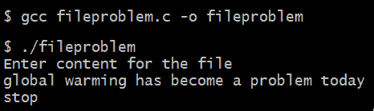

图 18.7

前面的文本不会进入期望的文件 `file1.txt`，而是会覆盖敏感文件 `file2.txt`，如果有的话，删除其早期内容。如果我们查看 `file2.txt` 文件的内容，我们将看到本应写入 `file1.txt` 的内容：

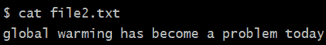

图 18.8

现在，让我们重写程序以消除文件漏洞。

# 学习如何在编写 C 语言文件时避免漏洞

在这个菜谱中，我们将特别注意：我们将解除所有（如果有）到我们要创建的文件的链接。我们还将确保如果文件已存在，我们的程序不会覆盖任何文件。

# 如何做到这一点...

编写程序以避免在 C 语言中创建文件时的漏洞的步骤如下：

1.  定义一个文件指针。

1.  黑客可能会创建一个软链接并将敏感文件附加到我们想要创建的文件上。

1.  从你想要写入的文件中删除链接。

1.  使用检查文件是否存在的标志打开文件。如果文件存在，它应该被覆盖。

1.  将文件描述符与文件流关联。

1.  提示用户输入要写入文件的文本行。

1.  将用户输入的行写入文件。

1.  重复 *步骤 5* 和 *步骤 6*，直到用户输入 `stop`。

1.  关闭由文件指针 `fp` 指向的文件。

以下是在创建文本文件时移除漏洞的程序：

```cpp
//filesolved.c

#include <stdio.h>
#include <string.h>
#include <fcntl.h>
#include <stdlib.h>
#include <unistd.h>

#define BUFFSIZE 255

void main(int argc, char * argv[]) {
  int ifp;
  FILE * fp;
  char str[BUFFSIZE];
  if (symlink("file2.txt", "file1.txt") != 0) {
    perror("symlink() error");
    unlink("file2.txt");
    exit(1);
  } else {
    unlink("file1.txt");
    ifp = open("file1.txt", O_WRONLY | O_CREAT | O_EXCL, 0600);
    if (ifp == -1) {
      perror("An error occurred in creating the file\n");
      exit(1);
    }
    fp = fdopen(ifp, "w");
    if (fp == NULL) {
      perror("Could not be linked to the stream\n");
      exit(1);
    }
    printf("Enter content for the file\n");
    gets(str);
    while (strcmp(str, "stop") != 0) {
      fputs(str, fp);
      gets(str);
    }
  }
  fclose(fp);
}
```

现在，让我们深入了解代码背后的情况。

# 它是如何工作的...

你可以在程序中看到定义了一个名为 `fp` 的文件指针。我们预计黑客或恶意用户可能已创建一个名为 `file1.txt` 的软链接到现有文件 `file2.txt`。`file2.txt` 是一个敏感文件，我们不希望它被覆盖或破坏。为了使程序无任何漏洞，调用 `unlink()` 函数来删除对 `file1.txt` 的任何链接。这将避免覆盖可能与 `file1.txt` 链接的任何敏感文件。

此外，使用的是 `open` 函数来打开文件，而不是传统的 `fopen` 函数。`open` 函数以只写模式打开 `file1.txt` 文件，并带有 `O_CREAT` 和 `O_EXCL` 标志，如果文件已存在，则 `open` 函数将失败。这将确保不会意外覆盖任何与 `file1.txt` 链接的现有敏感文件。`open` 函数将返回一个打开文件的文件描述符，该描述符将被分配给 `ifp` 变量。

要与文件一起工作，我们需要一个文件流。因此，调用 `fdopen` 函数将文件流与通过 `open` 函数生成的 `ifp` 文件描述符关联。`fdopen` 函数返回一个指向文件流的指针，该指针被分配给文件指针 `fp`。此外，在 `fdopen` 函数中使用 `w` 模式，因为尽管它以写入模式打开文件，但它永远不会导致文件截断。这使得程序更加安全，避免了意外删除任何文件。

此后，程序与之前的程序相同。它要求用户输入某些行，然后这些行被写入 `file1.txt`。最后，关闭由文件指针 `fp` 指向的文件。

让我们使用 GCC 编译 `filesolved.c` 程序，如下所示截图所示。如果你没有错误或警告，这意味着 `filesolved.c` 程序已编译成可执行文件：`filesolved.exe`。让我们运行这个文件：

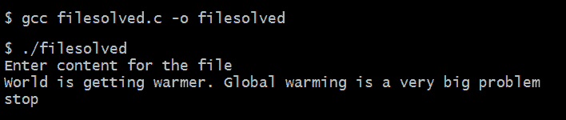

图 18.9

我们可以验证在运行程序时输入的内容是否已进入 `file1.txt`。为此，我们将打开 `file1.txt` 来查看其内容如下：

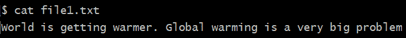

图 18.10

我们可以看到用户输入的内容已进入 `file1.txt`。

`file2.txt` 的内容如下所示：

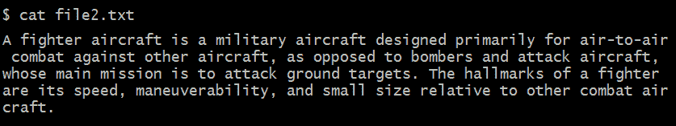

图 18.11
