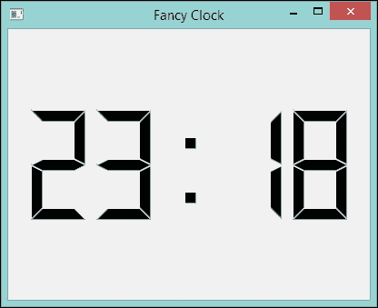
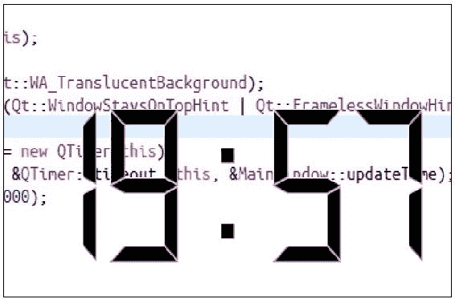
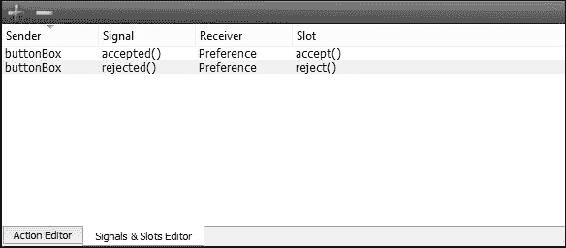
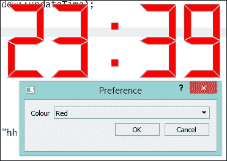
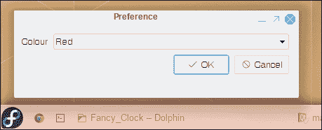

# 第二章. 构建一个美观的跨平台时钟

在本章中，你将了解到 Qt 是构建跨平台应用程序的伟大工具。这里使用 Qt/C++ 时钟示例作为演示。本章涵盖的主题，如以下列出，对于任何实际应用都是必不可少的。以下是具体内容：

+   创建基本数字时钟

+   调整数字时钟

+   保存和恢复设置

+   在 Unix 平台上构建

# 创建基本数字时钟

是时候创建一个新项目了，因此我们将创建一个名为 `Fancy_Clock` 的 Qt Widgets 应用程序。

### 注意

在本章中，我们不会使用任何 Qt Quick 知识。

现在，将窗口标题更改为 `Fancy Clock` 或你喜欢的任何其他名称。然后，需要调整主窗口 UI，因为时钟显示在桌面顶部。菜单栏、状态栏和工具栏都被移除。之后，我们需要将一个 **LCD Number** 小部件拖入 `centralWidget`。接下来，将 `MainWindow` 的布局更改为 **水平布局** 以自动调整子小部件的大小。对 UI 文件进行的最后修改是在 `QFrame` 列的属性下将 **frameShape** 更改为 **NoFrame**。如果你做得正确，你将得到一个数字时钟的原型，如图所示：


为了重复更新 LCD 数字显示，我们必须使用 `QTimer` 类设置一个重复发出信号的计时器。除此之外，我们还需要创建一个槽来接收信号并更新 LCD 数字显示到当前时间。因此，也需要 `QTime` 类。这就是 `MainWindowmainwindow.h` 的头文件现在看起来是这样的：

```cpp
#ifndef MAINWINDOW_H
#define MAINWINDOW_H

#include <QMainWindow>

namespace Ui {
  class MainWindow;
}

class MainWindow : public QMainWindow
{
  Q_OBJECT

public:
  explicit MainWindow(QWidget *parent = 0);
  ~MainWindow();

private:
  Ui::MainWindow *ui;

private slots:
  void updateTime();
};

#endif // MAINWINDOW_H
```

如你所见，这里所做的唯一修改是声明了一个私有的 `updateTime` 槽。像往常一样，我们应在 `mainwindow.cpp` 中定义此槽，其内容如下。请注意，我们需要包含 `QTimer` 和 `QTime`。

```cpp
#include <QTimer>
#include <QTime>
#include "mainwindow.h"
#include "ui_mainwindow.h"

MainWindow::MainWindow(QWidget *parent) :
  QMainWindow(parent),
  ui(new Ui::MainWindow)
{
  ui->setupUi(this);

  QTimer *timer = new QTimer(this);
  connect(timer, &QTimer::timeout, this, &MainWindow::updateTime);
  timer->start(1000);

  updateTime();
}

MainWindow::~MainWindow()
{
  delete ui;
}

void MainWindow::updateTime()
{
  QTime currentTime = QTime::currentTime();
  QString currentTimeText = currentTime.toString("hh:mm");
  if (currentTime.second() % 2 == 0) {
    currentTimeText[2] = ' ';
  }
  ui->lcdNumber->display(currentTimeText);
}
```

在 `updateTime` 槽内部，使用 `QTime` 类来处理时间，即时钟。如果底层操作系统支持，此类可以提供高达 1 毫秒的精度。然而，`QTime` 与时区或夏令时无关。至少，这对我们的小时钟来说是足够的。`currentTime()` 函数是一个静态公共函数，用于创建一个包含系统本地时间的 `QTime` 对象。

至于 `updateTime` 函数的第二行，我们使用了 `QTime` 提供的 `toString` 函数将时间转换为字符串，并将其保存在 `currentTimeText` 中。传递给 `toString` 的参数是时间字符串的格式。完整的表达式列表可以从**Qt 参考文档**中获取。时钟中间的冒号应该闪烁，就像真实数字时钟一样。因此，我们使用了一个 `if` 语句来控制这一点。当秒的值是偶数时，冒号将消失，当秒的值是奇数时，它将重新出现。在这里，在 `if` 块内部，我们使用了 `[2]` 操作符来获取第三个字符的可修改引用，因为这是在字符串内部直接修改字符的唯一方法。在这里，`currentTimeText` 字符串的计数从 `0` 开始。同时，`QString` 的 `at()` 函数返回一个常量字符，你无权更改它。最后，这个函数将让 `lcdNumber` 显示时间字符串。现在，让我们回到 `MainWindow` 的构造函数。在初始化 UI 之后，它首先做的事情是创建一个 `QTimer` 对象。为什么我们不能使用局部变量？这个问题的答案是，因为局部变量将在 `MainWindow` 构造之后被销毁。如果定时器已经消失，就没有办法重复触发 `updateTime`。我们不使用成员变量，因为没有必要在头文件中进行声明工作，因为我们不会在其他地方使用这个定时器。

`QTimer` 类用于创建重复和单次定时器。在调用 `start` 后，它将在恒定的时间间隔后发出 `timeout` 信号。在这里，我们创建了一个定时器，并将 `timeout` 信号连接到 `updateTime` 插槽，以便每秒钟调用 `updateTime`。

在 Qt 中还有一个重要的方面，称为**父子机制**。尽管它不如信号和槽那么知名，但在 Qt 应用程序的开发中起着至关重要的作用。基本上说，当我们创建一个带有父对象或通过调用 `setParent` 显式设置父对象的 `QObject` 子对象时，父对象会将这个 `QObject` 子对象添加到其子对象列表中。然后，当父对象被删除时，它会遍历其子对象列表并删除每个子对象。在大多数情况下，尤其是在 UI 设计中，父子关系是隐式设置的。父小部件或布局自动成为其子小部件或布局的父对象。在其他情况下，我们必须显式设置 `QObject` 子对象的父对象，以便父对象可以接管其所有权并管理其内存释放。因此，我们将 `QObject` 父对象，即这个 `MainWindow` 类，传递给 `QTimer` 构造函数。这确保了在 `MainWindow` 被删除后，`QTimer` 也会被删除。这就是为什么我们不需要在析构函数中显式编写 `delete` 语句的原因。

在构造函数的末尾，我们需要显式调用`updateTime`，这将允许时钟显示当前时间。如果我们不这样做，应用程序将显示一个零秒，直到`timer`发出`timeout`信号。现在，运行你的应用程序；它将类似于以下截图：



# 调整数字时钟

是时候让这个基本的数字时钟看起来更漂亮了。让我们添加一些像透明背景这样的东西，它位于无框窗口的顶部。使用透明背景可以产生惊人的视觉效果。当无框窗口隐藏窗口装饰，包括边框和标题栏时，桌面小部件，如时钟，应该是无边框的，并显示在桌面顶部。

要使我们的时钟透明，只需将以下行添加到`MainWindow`的构造函数中：

```cpp
setAttribute(Qt::WA_TranslucentBackground);
```

`WA_TranslucentBackground`属性的效果取决于 X11 平台上的合成管理器。

小部件可能有大量的属性，这个函数用于打开或关闭指定的属性。默认情况下是开启的。你需要传递一个假的布尔值作为第二个参数来禁用属性。`Qt::WidgetAttribute`的完整列表可以在 Qt 参考文档中找到。

现在，将以下行添加到构造函数中，这将使时钟看起来无边框，并使其保持在桌面顶部：

```cpp
setWindowFlags(Qt::WindowStaysOnTopHint | Qt::FramelessWindowHint);
```

类似地，`Qt::WindowFlags`用于定义小部件的类型。它控制小部件的行为，而不是其属性。因此，给出了两个提示：一个是保持在顶部，另一个是无边框。如果你想保留旧标志同时设置新标志，你需要将它们添加到组合中。

```cpp
setWindowFlags(Qt::WindowStaysOnTopHint | Qt::FramelessWindowHint | windowFlags());
```

在这里，`windowFlags`函数用于检索窗口标志。你可能感兴趣的一件事是，`setWindowFlags`将在`show`函数之后导致小部件不可见。所以，你可以在窗口或小部件的`show`函数之前调用`setWindowFlags`，或者调用`show`后再调用`setWindowFlags`。

在修改构造函数后，时钟应该看起来是这样的：



有一个有用的技巧，你可以用它来隐藏时钟从任务栏中。当然，时钟不需要在任务栏中的应用程序中显示。你不应该单独设置一个像`Qt::Tool`或`Qt::ToolTip`这样的标志来达到这个目的，因为这会导致应用程序的退出行为异常。这个技巧甚至更简单；下面是`main.cpp`的代码：

```cpp
#include "mainwindow.h"
#include <QApplication>

int main(int argc, char *argv[])
{
  QApplication a(argc, argv);

  QWidget wid;
  MainWindow w(&wid);
  w.show();

  return a.exec();
}
```

上述代码使我们的`MainWindow w`对象成为`QWidget wid`的子对象。子小部件不会显示在任务栏上，因为应该只有一个顶级父小部件。同时，我们的父小部件`wid`甚至不会显示。这很棘手，但这是唯一一个在不破坏任何其他逻辑的情况下做到这一点的方法。

嗯，一个新的问题刚刚出现。时钟无法移动，唯一的关闭方式是通过 Qt Creator 的面板或通过键盘快捷键停止它。这是因为我们将其声明为无边框窗口，导致无法通过窗口管理器控制它。由于无法与之交互，因此无法自行关闭。因此，解决这个问题的方法是编写我们自己的函数来移动和关闭时钟。

关闭此应用程序可能更为紧急。让我们看看如何重新实现一些功能以达到这个目标。首先，我们需要声明一个新的 `showContextMenu` 槽来显示上下文菜单，并重新实现 `mouseReleaseEvent`。以下代码展示了 `mainwindow.h` 的内容：

```cpp
#ifndef MAINWINDOW_H
#define MAINWINDOW_H

#include <QMainWindow>

namespace Ui {
  class MainWindow;
}

class MainWindow : public QMainWindow
{
  Q_OBJECT
public:
  explicit MainWindow(QWidget *parent = 0);
  ~MainWindow();

private:
  Ui::MainWindow *ui;

private slots:
  void updateTime();
  void showContextMenu(const QPoint &pos);

protected:
  void mouseReleaseEvent(QMouseEvent *);
};

#endif // MAINWINDOW_H
```

在前面的代码中定义了两个新的类：`QPoint` 和 `QMouseEvent`。`QPoint` 类通过使用整数精度定义平面上的一个点。相对地，还有一个名为 `QPointF` 的类，它提供浮点精度。嗯，`QMouseEvent` 类继承自 `QEvent` 和 `QInputEvent`。它包含一些描述鼠标事件的参数。让我们看看为什么在 `mainwindow.cpp` 中需要它们：

```cpp
#include <QTimer>
#include <QTime>
#include <QMouseEvent>
#include <QMenu>
#include <QAction>
#include "mainwindow.h"
#include "ui_mainwindow.h"

MainWindow::MainWindow(QWidget *parent) :
  QMainWindow(parent),
  ui(new Ui::MainWindow)
{
  ui->setupUi(this);

  setAttribute(Qt::WA_TranslucentBackground);
  setWindowFlags(Qt::WindowStaysOnTopHint | Qt::FramelessWindowHint | windowFlags());

  connect(this, &MainWindow::customContextMenuRequested, this, &MainWindow::showContextMenu);

  QTimer *timer = new QTimer(this);
  connect(timer, &QTimer::timeout, this, &MainWindow::updateTime);
  timer->start(1000);

  updateTime();
}

MainWindow::~MainWindow()
{
  delete ui;
}

void MainWindow::updateTime()
{
  QTime currentTime = QTime::currentTime();
  QString currentTimeText = currentTime.toString("hh:mm");
  if (currentTime.second() % 2 == 0) {
    currentTimeText[2] = ' ';
  }
  ui->lcdNumber->display(currentTimeText);
}

void MainWindow::showContextMenu(const QPoint &pos)
{
  QMenu contextMenu;
  contextMenu.addAction(QString("Exit"), this, SLOT(close()));
  contextMenu.exec(mapToGlobal(pos));
}

void MainWindow::mouseReleaseEvent(QMouseEvent *e)
{
  if (e->button() == Qt::RightButton) {
    emit customContextMenuRequested(e->pos());
  }
  else {
    QMainWindow::mouseReleaseEvent(e);
  }
}
```

注意，你应该包含 `QMouseEvent`、`QMenu` 和 `QAction` 以利用这些类。有一个预定义的 `customContextMenuRequested` 信号，它与新创建的 `showContextMenu` 槽相关联。为了保持一致性，我们将遵循 Qt 定义的规则，这意味着 `customContextMenuRequested` 中的 `QPoint` 参数应该是一个局部位置而不是全局位置。这就是为什么我们需要一个 `mapToGlobal` 函数将 `pos` 转换为全局位置。至于 `QMenu` 类，它提供了一个菜单栏、上下文菜单或其他弹出菜单的 `menu` 小部件。因此，我们创建了 `contextMenu` 对象，然后添加一个带有 `Exit` 文本的新的操作。这与 `MainWindow` 的 `close` 槽相关联。最后的语句用于在指定的全局位置执行 `contextMenu` 对象。换句话说，这个槽将在给定位置显示一个弹出菜单。

重新实现 `mouseReleaseEvent` 的目的是检查事件触发按钮。如果是右键，则使用鼠标的局部位置发出 `customContextMenuRequested` 信号。否则，简单地调用 `QMainWindow` 的默认 `mouseReleaseEvent` 函数。

在重新实现它时，利用基类的默认成员函数。

再次运行应用程序；你可以通过右键单击它并选择**退出**来退出。现在，我们应该继续重新实现，使时钟可移动。这次，我们需要重写两个受保护的函数：`mousePressEvent` 和 `mouseMoveEvent`。因此，这是头文件的外观：

```cpp
#ifndef MAINWINDOW_H
#define MAINWINDOW_H

#include <QMainWindow>

namespace Ui {
  class MainWindow;
}

class MainWindow : public QMainWindow
{
  Q_OBJECT

public:
  explicit MainWindow(QWidget *parent = 0);
  ~MainWindow();

private:
  Ui::MainWindow *ui;
  QPoint m_mousePos;

private slots:
  void updateTime();
  void showContextMenu(const QPoint &pos);

protected:
  void mouseReleaseEvent(QMouseEvent *);
  void mousePressEvent(QMouseEvent *);
  void mouseMoveEvent(QMouseEvent *);
};

#endif // MAINWINDOW_H
```

在前面的代码中，还声明了一个新的私有成员变量 `m_mousePos`，它是一个用于存储鼠标局部位置的 `QPoint` 对象。下面的代码定义了 `mousePressEvent` 和 `mouseMoveEvent`：

```cpp
void MainWindow::mousePressEvent(QMouseEvent *e)
{
  m_mousePos = e->pos();
}

void MainWindow::mouseMoveEvent(QMouseEvent *e)
{
  this->move(e->globalPos() - m_mousePos);
}
```

这比你想象的要简单。当鼠标按钮被按下时，鼠标的局部位置被存储为 `m_mousePos`。当鼠标移动时，我们调用 `move` 函数将 `MainWindow` 移动到新的位置。因为传递给 `move` 的位置是一个全局位置，我们需要使用事件的 `globalPos` 减去鼠标的局部位置。困惑吗？`m_mousePos` 变量是鼠标相对于父小部件（在我们的例子中是 `MainWindow`）的相对位置。`move` 函数将 `MainWindow` 的左上角移动到给定的全局位置。而 `e->globalPos()` 函数是鼠标的全局位置，而不是 `MainWindow`，我们需要减去 `m_mousePos` 的相对位置，以将鼠标的全局位置转换为 `MainWindow` 的左上角位置。经过所有这些努力，时钟应该看起来更加令人满意。

# 保存和恢复设置

尽管时钟可以被移动，但它重启后不会恢复到最后的位置。此外，我们可以为用户提供一些选项来调整时钟的外观，例如字体颜色。为了使其工作，我们需要 `QSettings` 类，它提供平台无关的持久设置。它需要一个公司或组织名称以及应用程序名称。一个典型的 `QSettings` 对象可以通过以下行构建：

```cpp
QSettings settings("Qt5 Blueprints", "Fancy Clock");
```

在这里，`Qt5 Blueprints` 是组织的名称，而 `Fancy Clock` 是应用程序的名称。

在 Windows 上，设置存储在系统注册表中，而在 Mac OS X 上存储在 XML 预设文件中，在其他 Unix 操作系统（如 Linux）上存储在 INI 文本文件中。然而，我们通常不需要担心这一点，因为 `QSettings` 提供了高级接口来操作设置。

如果我们打算在多个地方读取和/或写入设置，我们最好在继承自 `QApplication` 的 `QCoreApplication` 中设置组织和应用程序。`main.cpp` 文件的内容如下所示：

```cpp
#include "mainwindow.h"
#include <QApplication>

int main(int argc, char *argv[])
{
  QApplication a(argc, argv);

  a.setOrganizationName(QString("Qt5 Blueprints"));
  a.setApplicationName(QString("Fancy Clock"));

  QWidget wid;
  MainWindow w(&wid);
  w.show();

  return a.exec();
}
```

这使得我们可以使用默认的 `QSettings` 构造函数来访问相同的设置。为了保存 `MainWindow` 的几何形状和状态，我们需要重新实现 `closeEvent`。首先，我们需要将 `closeEvent` 声明为一个受保护的成员函数，如下所示：

```cpp
void closeEvent(QCloseEvent *);
```

然后，让我们在 `mainwindow.cpp` 中定义 `closeEvent` 函数，如下所示：

```cpp
void MainWindow::closeEvent(QCloseEvent *e)
{
  QSettings sts;
  sts.setValue("MainGeometry", saveGeometry());
  sts.setValue("MainState", saveState());
  e->accept();
}
```

记得添加 `#include <QSettings>` 以包含 `QSettings` 头文件。

多亏了`setOrganizationName`和`setApplicationName`，我们现在不需要向`QSettings`构造函数传递任何参数。相反，我们调用一个`setValue`函数来保存设置。`saveGeometry()`和`saveState()`函数分别返回`MainWindow`的几何形状和状态作为`QByteArray`对象。

下一步是读取这些设置并恢复几何形状和状态。这可以在`MainWindow`的构造函数内部完成。您只需向其中添加两个语句即可：

```cpp
QSettings sts;
restoreGeometry(sts.value("MainGeometry").toByteArray());
restoreState(sts.value("MainState").toByteArray());
```

在这里，`toByteArray()`可以将存储的值转换为`QByteArray`对象。我们如何测试它是否工作？为此，请执行以下步骤：

1.  重新构建此应用程序。

1.  运行它。

1.  移动其位置。

1.  关闭它。

1.  再次运行它。

您会看到时钟将出现在与关闭前完全相同的位置。现在，您已经相当熟悉小部件、布局、设置、信号和槽，是时候通过以下步骤制作一个首选项对话框了：

1.  在**项目**面板中右键单击`Fancy_Clock`项目。

1.  选择**添加新…**。

1.  在**文件和类**面板中选择**Qt**。

1.  在中间面板中点击**Qt Designer 表单类**。

1.  选择**带有按钮底部的对话框**。

1.  在**类名**下填写`Preference`。

1.  点击**下一步**，然后选择**完成**。

Qt Creator 将您重定向到**设计模式**。首先，让我们将`windowTitle`更改为**Preference**，然后进行一些 UI 操作。执行以下步骤来完成此操作：

1.  将**标签**拖到`QDialog`中，并将其`objectName`属性更改为`colourLabel`。接下来，将其文本更改为`颜色`。

1.  添加**QComboBox**并将其`objectName`属性更改为`colourBox`。

1.  将`Black`、`White`、`Green`和`Red`项添加到`colourBox`中。

1.  将`Preference`的布局更改为**表单布局**。

关闭此 UI 文件。返回编辑`preference.h`，添加一个私有的`onAccepted`槽。以下代码显示了此文件的内容：

```cpp
#ifndef PREFERENCE_H
#define PREFERENCE_H

#include <QDialog>

namespace Ui {
  class Preference;
}

class Preference : public QDialog
{
  Q_OBJECT

public:
  explicit Preference(QWidget *parent = 0);
  ~Preference();

private:
  Ui::Preference *ui;

private slots:
  void onAccepted();
};

#endif // PREFERENCE_H
```

如同往常，我们在源文件中定义此槽。此外，我们还需要在`Preference`的构造函数中设置一些初始化。因此，`preference.cpp`变成了以下代码：

```cpp
#include <QSettings>
#include "preference.h"
#include "ui_preference.h"

Preference::Preference(QWidget *parent) :
  QDialog(parent),
  ui(new Ui::Preference)
{
  ui->setupUi(this);

  QSettings sts;
  ui->colourBox->setCurrentIndex(sts.value("Colour").toInt());

  connect(ui->buttonBox, &QDialogButtonBox::accepted, this, &Preference::onAccepted);
}

Preference::~Preference()
{
  delete ui;
}

void Preference::onAccepted()
{
  QSettings sts;
  sts.setValue("Colour", ui->colourBox->currentIndex());
}
```

同样，我们加载设置并更改`colourBox`的当前项。然后，接下来是信号和槽的耦合。请注意，Qt Creator 已为我们自动生成了`buttonBox`和`Preference`之间的接受和拒绝连接。当点击**OK**按钮时，`buttonBox`的`accepted`信号被触发。同样，如果用户点击**取消**，则触发`rejected`信号。您可能想检查**设计模式**下的**信号与槽编辑器**，以查看那里定义了哪些连接。这在上面的屏幕截图中显示：



对于`onAccepted`槽的定义，它将`colourBox`的`currentIndex`保存到设置中，这样我们就可以在其他地方读取此设置。

现在，我们接下来要做的就是在弹出菜单中添加一个`Preference`的条目，并根据`Colour`设置值更改`lcdNumber`的颜色。因此，你首先需要在`mainwindow.h`中定义一个私有槽和一个私有成员函数。

```cpp
#ifndef MAINWINDOW_H
#define MAINWINDOW_H

#include <QMainWindow>

namespace Ui {
  class MainWindow;
}

class MainWindow : public QMainWindow
{
  Q_OBJECT

public:
  explicit MainWindow(QWidget *parent = 0);
  ~MainWindow();

private:
  Ui::MainWindow *ui;
  QPoint m_mousePos;
  void setColour();

private slots:
  void updateTime();
  void showContextMenu(const QPoint &pos);
  void showPreference();

protected:
  void mouseReleaseEvent(QMouseEvent *);
  void mousePressEvent(QMouseEvent *);
  void mouseMoveEvent(QMouseEvent *);
  void closeEvent(QCloseEvent *);
};

#endif // MAINWINDOW_H
```

`setColour`函数用于更改`lcdNumber`的颜色，而`showPreference`槽将执行一个`Preference`对象。这两个成员的定义在`mainwindow.cpp`文件中，如下所示：

```cpp
#include <QTimer>
#include <QTime>
#include <QMouseEvent>
#include <QMenu>
#include <QAction>
#include <QSettings>
#include "mainwindow.h"
#include "preference.h"
#include "ui_mainwindow.h"

MainWindow::MainWindow(QWidget *parent) :
  QMainWindow(parent),
  ui(new Ui::MainWindow)
{
  ui->setupUi(this);

  setAttribute(Qt::WA_TranslucentBackground);
  setWindowFlags(Qt::WindowStaysOnTopHint | Qt::FramelessWindowHint | windowFlags());

  QSettings sts;
  restoreGeometry(sts.value("MainGeometry").toByteArray());
  restoreState(sts.value("MainState").toByteArray());
  setColour();

  connect(this, &MainWindow::customContextMenuRequested, this, &MainWindow::showContextMenu);

  QTimer *timer = new QTimer(this);
  connect(timer, &QTimer::timeout, this, &MainWindow::updateTime);
  timer->start(1000);

  updateTime();
}

MainWindow::~MainWindow()
{
  delete ui;
}

void MainWindow::updateTime()
{
  QTime currentTime = QTime::currentTime();
  QString currentTimeText = currentTime.toString("hh:mm");
  if (currentTime.second() % 2 == 0) {
    currentTimeText[2] = ' ';
  }
  ui->lcdNumber->display(currentTimeText);
}

void MainWindow::showContextMenu(const QPoint &pos)
{
  QMenu contextMenu;
  contextMenu.addAction(QString("Preference"), this, SLOT(showPreference()));
  contextMenu.addAction(QString("Exit"), this, SLOT(close()));
  contextMenu.exec(mapToGlobal(pos));
}

void MainWindow::mouseReleaseEvent(QMouseEvent *e)
{
  if (e->button() == Qt::RightButton) {
    emit customContextMenuRequested(e->pos());
  }
  else {
    QMainWindow::mouseReleaseEvent(e);
  }
}

void MainWindow::mousePressEvent(QMouseEvent *e)
{
  m_mousePos = e->pos();
}

void MainWindow::mouseMoveEvent(QMouseEvent *e)
{
  this->move(e->globalPos() - m_mousePos);
}

void MainWindow::closeEvent(QCloseEvent *e)
{
  QSettings sts;
  sts.setValue("MainGeometry", saveGeometry());
  sts.setValue("MainState", saveState());
  e->accept();
}

void MainWindow::setColour()
{
  QSettings sts;
  int i = sts.value("Colour").toInt();
  QPalette c;
  switch (i) {
  case 0://black
    c.setColor(QPalette::Foreground, Qt::black);
    break;
  case 1://white
    c.setColor(QPalette::Foreground, Qt::white);
    break;
  case 2://green
    c.setColor(QPalette::Foreground, Qt::green);
    break;
  case 3://red
    c.setColor(QPalette::Foreground, Qt::red);
    break;
  }
  ui->lcdNumber->setPalette(c);
  this->update();
}

void MainWindow::showPreference()
{
  Preference *pre = new Preference(this);
  pre->exec();
  setColour();
}
```

我们在构造函数中调用`setColour`是为了正确设置`lcdNumber`的颜色。在`setColour`内部，我们首先从设置中读取`Colour`值，然后使用`switch`语句在调用`setPalette`更改`lcdNumber`的颜色之前获取正确的`QPalette`类。由于 Qt 没有提供直接更改`QLCDNumber`对象的前景色的方法，我们需要使用这种方法来实现。在这个成员函数的末尾，我们调用`update()`来更新`MainWindow`用户界面。

### 注意

不要忘记在`showContextMenu`内部将`Preference`动作添加到`contextMenu`中。否则，将无法打开对话框。

在相关的`showPreference`槽中，我们创建一个新的`Preference`对象，它是`MainWindow`的子对象，然后调用`exec()`来执行并显示它。最后，我们调用`setColour()`来更改`lcdNumber`的颜色。由于`Preference`是模态的，且`exec()`有自己的事件循环，它将阻塞应用程序直到`pre`完成。`pre`执行完成后，无论是通过`accepted`还是`rejected`，接下来都会调用`setColour`。当然，你可以使用信号-槽的方式来实现它，但我们必须对之前的代码进行一些修改。首先，在**设计**模式下删除`preference.ui`中的`accepted-accept`信号-槽对。然后，将`accept()`添加到`preference.cpp`中的`onAccepted`的末尾。

```cpp
void Preference::onAccepted()
{
  QSettings sts;
  sts.setValue("Colour", ui->colourBox->currentIndex());
  this->accept();
}
```

现在，`mainwindow.cpp`中的`showPreference`可以重写为以下内容：

```cpp
void MainWindow::showPreference()
{
  Preference *pre = new Preference(this);
  connect(pre, &Preference::accepted, this, &MainWindow::setColour);
  pre->exec();
}
```

### 小贴士

`connect`语句不应该放在`exec()`之后，因为它会导致绑定失败。

无论你更喜欢哪种方式，现在时钟都应该有一个**Preference**对话框。运行它，从弹出菜单中选择**Preference**，并将颜色更改为你想要的任何颜色。你应该期待的结果类似于以下截图所示：



# 在 Unix 平台上构建

到目前为止，我们仍然被困在 Windows 的应用程序中。是时候测试我们的代码是否可以在其他平台上构建了。在本章中，涉及的代码仅限于桌面操作系统，而在此书的后半部分，我们将有机会为移动平台构建应用程序。至于其他桌面操作系统，种类繁多，其中大多数是类 Unix 系统。Qt 官方支持 Linux 和 Mac OS X，以及 Windows。因此，使用其他系统（如**FreeBSD**）的用户可能需要从头编译 Qt 或从他们自己的社区获取预构建的包。在本书中，使用**Fedora 20** Linux 发行版作为演示，介绍平台跨编译。请记住，Linux 上有许多桌面环境和主题工具，所以如果用户界面有所不同，请不要感到惊讶。嗯，既然你很好奇，让我告诉你，桌面环境是带有`QtCurve`的**KDE 4**，在我的情况下，它统一了 GTK+ / Qt 4 / Qt 5。一旦你准备好了，我们就开始吧。你可以执行以下步骤来完成这个任务：

1.  将`Fancy Clock`的源代码复制到 Linux 下的一个目录中。

1.  删除`Fancy_Clock.pro.user`文件。

1.  在 Qt Creator 中打开此项目。

现在，构建并运行这个应用程序。除了任务栏图标外，一切都很正常。这种小问题在测试中是无法避免的。嗯，为了解决这个问题，只需修改`MainWindow`构造函数中的一行。更改窗口标志将修正这个问题：

```cpp
setWindowFlags(Qt::WindowStaysOnTopHint | Qt::FramelessWindowHint | Qt::Tool);
```

如果你再次运行文件，`Fancy Clock`将不再出现在任务栏中。请确保将`MainWindow`对象`w`作为`QWidget wid`的子对象；否则，点击**关闭**后应用程序不会终止。

注意，**首选项**对话框使用原生 UI 控件，而不是将其他平台的控件带到这个平台上。这是 Qt 提供的最迷人的功能之一。所有 Qt 应用程序都将跨所有平台看起来和表现得像原生应用程序。



这不是麻烦，但事实是，一旦你编写了 Qt 应用程序，你就可以在任何地方运行它。你不需要为不同的平台编写不同的 GUI。那个黑暗的时代已经过去了。然而，你可能想为特定平台编写一些函数，无论是由于特定的需求还是解决方案。首先，我想向你介绍一些针对几个平台定制的 Qt 附加模块。

以 Qt Windows 附加组件为例。Windows 提供的一些酷炫功能，如**缩略图工具栏**和**Aero Peek**，通过这个附加模块得到了 Qt 的支持。

好吧，直接将此模块添加到项目文件中，在这种情况下是 `Fancy_Clock.pro` 文件，肯定会惹恼其他平台。更好的方法是测试它是否在 Windows 上；如果是，则将此模块添加到项目中。否则，跳过此步骤。以下代码显示了 `Fancy_Clock.pro` 文件，如果它在 Windows 上构建，则会添加 `winextras` 模块：

```cpp
QT       += core gui

win32: QT += winextras

greaterThan(QT_MAJOR_VERSION, 4): QT += widgets

TARGET = Fancy_Clock
TEMPLATE = app

SOURCES += main.cpp\
    mainwindow.cpp \
    preference.cpp

HEADERS  += mainwindow.h \
    preference.h

FORMS    += mainwindow.ui \
    preference.ui
```

正如你所见，`win32` 是一个条件语句，仅在主机机器是 Windows 时才为 `true`。在为该项目重新运行 `qmake` 之后，你将能够包含并使用那些额外的类。

同样，如果你想在 Unix 平台上做些什么，只需使用关键字 `unix`，但 `unix` 只在 Linux/X11 或 Mac OS X 上为 `true`。为了区分 Mac OS X 和 Linux，这里有一个例子：

```cpp
win32 {
  message("Built on Windows")
}
else: unix: macx{
  message("Built on Mac OS X")
}
else {
  message("Built on Linux")
}
```

实际上，你可以使用 `unix: !macx` 作为条件语句在 Linux 上执行一些特定平台的工作。在项目文件（s）中包含许多特定平台语句是一种常见做法，特别是当你的项目需要与其他库链接时。你必须为这些库在不同的平台上指定不同的路径，否则编译器会抱怨缺少库或未知符号。

此外，你可能还想知道如何在保持与其他平台兼容的同时编写特定平台的代码。类似于 C++，它是一个由各种编译器处理的预定义宏。然而，这些编译器宏列表可能因编译器而异。因此，最好使用 `Global Qt Declarations`。我将使用以下简短示例进一步解释这一点：

```cpp
void MainWindow::showContextMenu(const QPoint &pos)
{
  QMenu contextMenu;
  #ifdef Q_OS_WIN
  contextMenu.addAction(QString("Options"), this, SLOT(showPreference()));
  #elif defined(Q_OS_LINUX)
  contextMenu.addAction(QString("Profile"), this, SLOT(showPreference()));
  #else
  contextMenu.addAction(QString("Preference"), this, SLOT(showPreference()));
  #endif
  contextMenu.addAction(QString("Exit"), this, SLOT(close()));
  contextMenu.exec(mapToGlobal(pos));
}
```

上述代码显示了 `showContextMenu` 的新版本。`Preference` 菜单项将在不同的平台上使用不同的文本，即 Windows、Linux 和 Mac OS X。更改你的 `showContextMenu` 函数并再次运行它。你将在 Windows 上看到 **选项**，在 Linux 上看到 **配置文件**，在 Mac OS X 上看到 **偏好设置**。以下是有关特定平台宏的列表。你可以在 `QtGlobal` 文档中找到完整的描述，包括其他宏、函数和类型。

| 宏 | 对应平台 |
| --- | --- |
| Q_OS_ANDROID | Android |
| Q_OS_FREEBSD | FreeBSD |
| Q_OS_LINUX | Linux |
| Q_OS_IOS | iOS |
| Q_OS_MAC | Mac OS X 和 iOS (基于 Darwin) |
| Q_OS_WIN | 所有 Windows 平台，包括 Windows CE |
| Q_OS_WINPHONE | Windows Phone 8 |
| Q_OS_WINRT | Windows 8 上的 Windows Runtime。Windows RT 和 Windows Phone 8 |

# 摘要

在本章中，包括一些技巧在内的 UI 设计信息。此外，还有一些基本但有用的跨平台主题。现在，你能够使用你最喜欢的，也许已经熟练掌握的 C++ 编写优雅的 Qt 应用程序。

在下一章中，我们将学习如何使用 Qt Quick 编写应用程序。然而，无需担心；Qt Quick 甚至更容易，当然，开发起来也更快。
