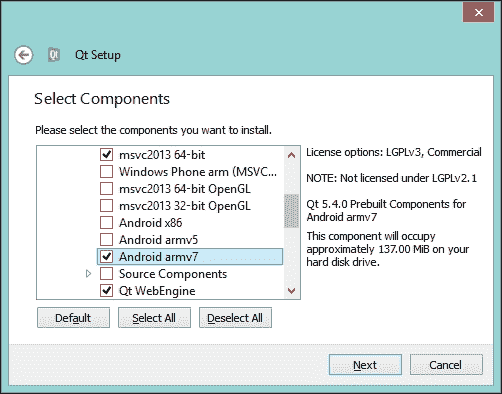
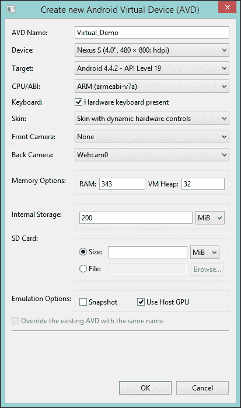
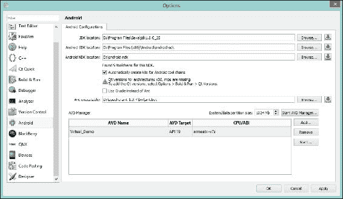
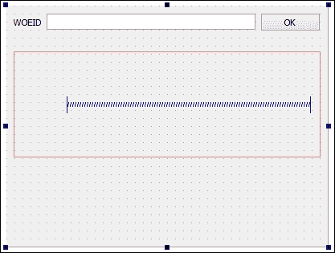
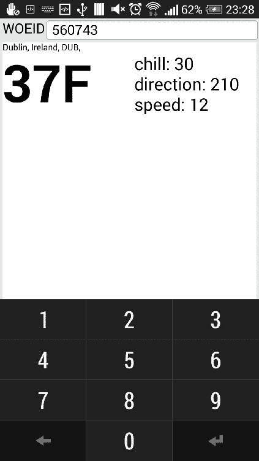

# 第七章：解析 JSON 和 XML 文档以使用在线 API

在本章中，您将找到强大的应用程序 Qt 在流行的 Android 设备上运行。在介绍 Android Qt 应用程序开发之后，它还利用在线 API，这些 API 通常返回 JSON 或 XML 文档。本章涵盖的主题如下：

+   设置 Qt for Android

+   解析 JSON 结果

+   解析 XML 结果

+   为 Android 构建 Qt 应用程序

+   在 QML 中解析 JSON

# 设置 Qt for Android

Qt for Android 至少需要 API 级别 10（适用于 Android 2.3.3 平台）。大多数 Qt 模块都得到支持，这意味着您的 Qt 应用程序可以在 Android 上部署，只需进行少量或无需修改。在 Qt Creator 中，支持基于 Qt Widget 的应用程序和 Qt Quick 应用程序的开发。然而，在 Windows PC 上设置 Qt for Android 并非非常直接。因此，在我们深入之前，让我们先设置 Android 上的 Qt 开发环境。

首先，您需要安装 Qt for Android。如果您使用的是在线安装程序，请记住选择 Android 组件，如下面的截图所示：



在这里，我们只选择了 **Android armv7**，这使得我们能够部署适用于 ARMv7 Android 设备的应用程序。如果您使用的是离线安装程序，请下载 Android 安装程序的 Qt。

现在，让我们安装一个 **Java 开发工具包**（**JDK**）。由于 Android 严重依赖它，所以无法摆脱 Java。此外，请注意，根据 [`doc.qt.io/qt-5/androidgs.html`](http://doc.qt.io/qt-5/androidgs.html)，您需要安装至少 JDK 版本 6。您可以从 [`www.oracle.com/technetwork/java/javase/downloads/index.html`](http://www.oracle.com/technetwork/java/javase/downloads/index.html) 下载 JDK。您还需要在 JDK 安装目录 `D:\Program Files\Java\jdk1.8.0_25` 中设置一个 `JAVA_HOME` 环境变量。

现在，让我们安装来自 Google 的两个工具包，Android SDK 和 Android NDK。始终记住下载最新版本；这里我们使用 Android SDK r24.0.2 和 Android NDK r10b。

在您安装 Android SDK 后，运行 SDK 管理器。安装或更新 **Android SDK 工具**、**Android SDK 平台工具**、**Android SDK 构建工具**、**Google USB 驱动程序**，至少一个 API 级别的 **SDK 平台**，以及 **ARM EABI v7a 系统镜像**，以完成我们的任务。对于本章，我们安装了 API 19 的 **SDK 平台**和 **ARM EABI v7a 系统镜像**。然后，编辑 `PATH` 环境变量。使用分号作为分隔符，将平台和 SDK 工具的路径添加到其中。如果 `D:\Program Files (x86)\Android\android-sdk` 是 **Android SDK 工具** 的路径，它将如下所示：

`D:\Program Files (x86)\Android\android-sdk\platform-tools;D:\Program Files (x86)\Android\android-sdk\tools`

### 注意

Android SDK 和 NDK 可以在 Android 开发者网站上获得，[`developer.android.com`](http://developer.android.com)。

下载 NDK 后，将`zip`文件解压到您的硬盘上，`D:\android-ndk`。然后，添加一个名为`ANDROID_NDK_ROOT`的环境变量，其值为`D:\android-ndk`。

对于 Apache Ant，也应采用类似步骤。您可以从[`ant.apache.org/bindownload.cgi`](http://ant.apache.org/bindownload.cgi)下载它。本书中使用的是 Apache Ant 1.9.4。这里不需要设置任何环境变量。现在，如果您使用的是 Windows，请重新启动计算机，以便刷新并正确加载环境变量。

打开 AVD 管理器并创建一个新的虚拟设备。对于这个练习，您最好选择一个较小的虚拟设备，如 Nexus S，如图所示。如果您想更改它，请随意更改，但请记住勾选**使用主机 GPU**，这将使虚拟设备使用 GLES 来加速图形。如果您没有开启它，您将得到一个极其缓慢的虚拟设备，甚至可能太慢以至于无法在上面测试应用程序。



现在，打开 Qt Creator；导航到**工具** | **选项**。查看**构建和运行**中的 Qt 版本是否有 Android 条目。如果没有，您必须手动添加 Qt for Android。然后，切换到**Android**选项，设置 JDK、Android SDK、Android NDK 和 Ant，如图所示：



对于缺少架构的警告可以安全忽略，因为我们不会在本章中为 MIPS 和 x86 Android 开发应用程序。但是，如果您需要在这些硬件平台上部署应用程序，请注意这一点。

点击**应用**并切换到**设备**选项。在**设备**组合框中应该有一个**在 Android 上运行**项。如果您现在导航到**构建和运行** | **套件**，应该期望自动检测到**Android for armeabi-v7a**。

现在，让我们测试一下我们是否可以在我们的虚拟 Android 设备上运行 Qt 应用程序。打开 AVD 管理器并启动虚拟设备。我们首先启动它，因为它可能需要很长时间。然后，打开 Qt Creator 并创建一个简单的应用程序。

1.  创建一个新的基于 Qt Widget 的应用程序项目。

1.  选择**Android for armeabi-v7a Kit**。

1.  编辑`mainwindow.ui`并将一个标签拖到`centralWidget`。

1.  将**主窗口**页面的布局更改为**垂直布局**（或其它）以便小部件可以自动拉伸。

1.  将标签的文本更改为`Hello Android!`或其他内容。

等待耗时的虚拟 Android 设备完全启动。如果它没有启动，请点击**运行**并等待几分钟。您将看到此应用程序在我们的虚拟 Android 设备上运行。如图所示，Qt for Android 开发环境已成功设置。因此，我们可以继续编写一个可以使用摄像头拍照的应用程序：


### 小贴士

在应用程序不完整的情况下在桌面上进行测试，然后在实际移动平台上进行测试，与始终在虚拟 Android 设备上进行测试相比，可以节省大量时间。此外，与虚拟设备相比，在真实设备上进行测试要快得多。

我们将不再忍受慢速的模拟器，而是首先在桌面上开发应用程序，然后在实际的 Android 设备上部署，看看是否有任何不适合移动设备的地方。相应地进行任何相关更改。这可以节省您大量时间。然而，即使实际的 Android 设备比虚拟设备更响应，这仍然需要更长的时间。

# 解析 JSON 结果

有许多公司为开发者提供 API，以访问他们的服务，包括字典、天气等。在本章中，我们将以 Yahoo!天气为例，向您展示如何使用其在线 API 获取天气数据。有关 Yahoo!天气 API 的更多详细信息，请参阅[`developer.yahoo.com/weather/`](https://developer.yahoo.com/weather/)。

现在，让我们创建一个名为`Weather_Demo`的新项目，这是一个基于 Qt Widget 的应用程序项目。像往常一样，让我们首先设计 UI。



我们已经移除了之前所做的菜单栏、工具栏和状态栏。然后，我们在`centralWidget`的顶部添加了一个**标签**、**行编辑**和**推送按钮**。它们的对象名称分别是`woeidLabel`、`woeidEdit`和`okButton`。之后，另一个名为`locationLabel`的标签用于显示 API 返回的位置。红色矩形是**水平布局**，由`tempLabel`和`windLabel`组成，它们都是**标签**，并通过**水平间隔**分隔。添加一个名为`attrLabel`的**标签**，然后将其对齐方式更改为`AlignRight`和`AlignBottom`。

**Where On Earth ID** (**WOEID**) 是一个唯一的 32 位标识符，且不会重复。通过使用 WOEID，我们可以避免重复。然而，这也意味着我们需要找出我们所在位置的 WOEID。幸运的是，有几个网站提供了易于使用的在线工具来获取 WOEID。其中之一是 Zourbuth 项目，**Yahoo! WOEID Lookup**，可以通过[`zourbuth.com/tools/woeid/`](http://zourbuth.com/tools/woeid/)访问。

现在，让我们继续前进，专注于 API 结果的解析。我们创建了一个新的 C++类，`Weather`，用于处理 Yahoo!天气 API。在介绍如何解析**JSON**（**JavaScript 对象表示法**）结果之前，我想先介绍 XML。然而，在我们准备`Weather`类之前，请记住在项目文件中添加网络到`QT`。在这种情况下，`Weather_Demo.pro`项目文件看起来如下：

```cpp
QT       += core gui network

greaterThan(QT_MAJOR_VERSION, 4): QT += widgets

TARGET = Weather_Demo
TEMPLATE = app

SOURCES += main.cpp\
        mainwindow.cpp \
        weather.cpp

HEADERS  += mainwindow.h \
            weather.h

FORMS    += mainwindow.ui
```

现在，我们可以编写`Weather`类。它的`weather.h`头文件如下所示：

```cpp
#ifndef WEATHER_H
#define WEATHER_H

#include <QObject>
#include <QJsonDocument>
#include <QJsonObject>
#include <QNetworkAccessManager>
#include <QNetworkReply>
#include <QImage>

class Weather : public QObject
{
    Q_OBJECT
    public:
    explicit Weather(QObject *parent = 0);

    signals:
    void updateFinished(const QString &location, const QString &temp, const QString &wind);
    void imageDownloaded(const QImage &);

    public slots:
    void updateData(const QString &woeid);
    void getAttrImg();

    private:
    QNetworkAccessManager *naManager;
    QNetworkReply *imgReply;
    QImage attrImg;

    private slots:
    void onSSLErrors(QNetworkReply *);
    void onQueryFinished(QNetworkReply *);
};

#endif // WEATHER_H
```

除了查询天气信息之外，我们还使用这个类来获取 Yahoo! 文档中提到的归属图像。在传统的 Qt/C++ 中，我们必须使用 `QNetworkAccessManager` 来访问 `QUrl` 是一件很平常的事情，因为 `QJsonDocument` 不能直接从 `QUrl` 加载。无论如何，让我们看看如何在 `weather.cpp` 文件中从 Yahoo! 天气 API 获取结果。头文件部分包括以下行：

```cpp
#include <QDebug>
#include <QNetworkRequest>
#include <QJsonArray>
#include "weather.h"
```

然后，让我们看看 `Weather` 的构造函数。在这里，我们简单地构建 `QNetworkAccessManager` 对象 `naManager` 并连接其信号：

```cpp
Weather::Weather(QObject *parent) :
    QObject(parent)
{
    naManager = new QNetworkAccessManager(this);

    connect(naManager, &QNetworkAccessManager::finished, this, &Weather::onQueryFinished);
    connect(naManager, &QNetworkAccessManager::sslErrors, this, &Weather::onSSLErrors);
}
```

`onSSLErrors` 插槽只是简单地让 `QNetworkReply` 对象忽略所有 SSL 错误。在这种情况下，这不会引起任何严重问题。然而，如果您正在处理需要验证连接的安全通信或其他任何内容，您可能希望查看错误。

```cpp
void Weather::onSSLErrors(QNetworkReply *re)
{
    re->ignoreSslErrors();
}
```

然后，让我们检查 `onQueryFinished` 之前的 `updateData` 函数。在这里，我们构建 `QUrl`，这是 Yahoo! 天气 API 的确切地址。请注意，您不需要为 `QUrl` 使用 HTML 代码。实际上，直接使用空格和其他符号会更合适。之后，类似于上一章，我们使用 `QNetworkRequest` 将此 `QUrl` 封装并通过 `QNetworkAccessManager` 分发请求。

```cpp
void Weather::updateData(const QString &woeid)
{
    QUrl url("https://query.yahooapis.com/v1/public/yql?q=select * from weather.forecast where woeid = " + woeid + "&format=json");
    QNetworkRequest req(url);
    naManager->get(req);
}
```

至于 `getAttrImg` 函数，几乎相同。唯一的区别是，这个函数用于获取归属图像而不是天气信息。我们将回复存储为 `imgReply`，这样我们就可以区分图像和天气。

```cpp
void Weather::getAttrImg()
{
    QUrl url("https://poweredby.yahoo.com/purple.png");
    QNetworkRequest req(url);
    imgReply = naManager->get(req);
}
```

如果相应的 `QNetworkReply` 对象已完成，则将执行 `onQueryFinished` 插槽函数，如下面的代码所示。在所有铺垫之后，让我们看看这个函数内部的内容。我们可以在一开始就检查回复中是否存在任何错误。然后，如果是 `imgReply`，我们将从数据中制作 `QImage` 并发出信号以发送此图像。如果这些都没有发生，我们将解析 JSON 回复中的天气信息。

```cpp
void Weather::onQueryFinished(QNetworkReply *re)
{
    if (re->error() != QNetworkReply::NoError) {
        qDebug() << re->errorString();
        re->deleteLater();
        return;
    }

    if (re == imgReply) {
        attrImg = QImage::fromData(imgReply->readAll());
        emit imageDownloaded(attrImg);
        imgReply->deleteLater();
        return;
    }

    QByteArray result = re->readAll();
    re->deleteLater();

    QJsonParseError err;
    QJsonDocument doc = QJsonDocument::fromJson(result, &err);
    if (err.error != QJsonParseError::NoError) {
        qDebug() << err.errorString();
        return;
    }
    QJsonObject obj = doc.object();
    QJsonObject res = obj.value("query").toObject().value("results").toObject().value("channel").toObject();

    QJsonObject locObj = res["location"].toObject();
    QString location;
    for(QJsonObject::ConstIterator it = locObj.constBegin(); it != locObj.constEnd(); ++it) {
        location.append((*it).toString());
        if ((it + 1) != locObj.constEnd()) {
            location.append(", ");
        }
    }

    QString temperature = res["item"].toObject()["condition"].toObject()["temp"].toString() + res["units"].toObject()["temperature"].toString();

    QJsonObject windObj = res["wind"].toObject();
    QString wind;
    for(QJsonObject::ConstIterator it = windObj.constBegin(); it != windObj.constEnd(); ++it) {
        wind.append(it.key());
        wind.append(": ");
        wind.append((*it).toString());
        wind.append("\n");
    }

    emit updateFinished(location, temperature, wind);
}
```

如我之前所述，这是很平常的。首先，我们从 `QNetworkReply` 中读取结果，然后使用 `QJsonDocument::fromJson` 将 `byte` 数组解析为 JSON 文档。如果在处理过程中出现错误，我们简单地打印错误字符串并返回。然后，我们需要获取 `QJsonDocument` 中包含的 `QJsonObject`。只有在这种情况下，我们才能解析其中的所有信息。使用 `560743` 作为 WOEID 的格式化结果如下所示：

```cpp
{
  "query":{
    "count":1,
    "created":"2014-12-05T23:19:54Z",
    "lang":"en-GB",
    "results":{
      "channel":{
        "title":"Yahoo! Weather - Dublin, IE",
        "link":"http://us.rd.yahoo.com/dailynews/rss/weather/Dublin__IE/*http://weather.yahoo.com/forecast/EIXX0014_f.html",
        "description":"Yahoo! Weather for Dublin, IE",
        "language":"en-us",
        "lastBuildDate":"Fri, 05 Dec 2014 9:59 pm GMT",
        "ttl":"60",
        "location":{
          "city":"Dublin",
          "country":"Ireland",
          "region":"DUB"
        },
        "units":{
          "distance":"mi",
          "pressure":"in",
          "speed":"mph",
          "temperature":"F"
        },
        "wind":{
          "chill":"29",
          "direction":"230",
          "speed":"8"
        },
        "atmosphere":{
          "humidity":"93",
          "pressure":"30.36",
          "rising":"1",
          "visibility":"6.21"
        },
        "astronomy":{
          "sunrise":"8:22 am",
          "sunset":"4:09 pm"
        },
        "image":{
          "title":"Yahoo! Weather",
          "width":"142",
          "height":"18",
          "link":"http://weather.yahoo.com",
          "url":"http://l.yimg.com/a/i/brand/purplelogo//uh/us/news-wea.gif"
        },
        "item":{
          "title":"Conditions for Dublin, IE at 9:59 pm GMT",
          "lat":"53.33",
          "long":"-6.29",
          "link":"http://us.rd.yahoo.com/dailynews/rss/weather/Dublin__IE/*http://weather.yahoo.com/forecast/EIXX0014_f.html",
          "pubDate":"Fri, 05 Dec 2014 9:59 pm GMT",
          "condition":{
            "code":"29",
            "date":"Fri, 05 Dec 2014 9:59 pm GMT",
            "temp":"36",
            "text":"Partly Cloudy"
          },
          "description":"\n<br />\n<b>Current Conditions:</b><br />\nPartly Cloudy, 36 F<BR />\n<BR /><b>Forecast:</b><BR />\nFri - Partly Cloudy. High: 44 Low: 39<br />\nSat - Mostly Cloudy. High: 48 Low: 41<br />\nSun - Mostly Sunny/Wind. High: 43 Low: 37<br />\nMon - Mostly Sunny/Wind. High: 43 Low: 37<br />\nTue - PM Light Rain/Wind. High: 52 Low: 38<br />\n<br />\n<a href=\"http://us.rd.yahoo.com/dailynews/rss/weather/Dublin__IE/*http://weather.yahoo.com/forecast/EIXX0014_f.html\">Full Forecast at Yahoo! Weather</a><BR/><BR/>\n(provided by <a href=\"http://www.weather.com\" >The Weather Channel</a>)<br/>\n",
          "forecast":[
          {
            "code":"29",
            "date":"5 Dec 2014",
            "day":"Fri",
            "high":"44",
            "low":"39",
            "text":"Partly Cloudy"
          },
          {
            "code":"28",
            "date":"6 Dec 2014",
            "day":"Sat",
            "high":"48",
            "low":"41",
            "text":"Mostly Cloudy"
          },
          {
            "code":"24",
            "date":"7 Dec 2014",
            "day":"Sun",
            "high":"43",
            "low":"37",
            "text":"Mostly Sunny/Wind"
          },
          {
            "code":"24",
            "date":"8 Dec 2014",
            "day":"Mon",
            "high":"43",
            "low":"37",
            "text":"Mostly Sunny/Wind"
          },
          {
            "code":"11",
            "date":"9 Dec 2014",
            "day":"Tue",
            "high":"52",
            "low":"38",
            "text":"PM Light Rain/Wind"
          }
          ],
          "guid":{
            "isPermaLink":"false",
            "content":"EIXX0014_2014_12_09_7_00_GMT"
          }
        }
      }
    }
  }
}
```

### 注意

有关 JSON 的详细信息，请访问 [`www.json.org`](http://www.json.org)。

如您所见，所有信息都存储在`query/results/channel`中。因此，我们需要逐级将其转换为`QJsonObject`。如代码所示，`QJsonObject res`是`channel`。请注意，`value`函数将返回一个`QJsonValue`对象，在您可以使用`value`函数再次解析值之前，您需要调用`toObject()`将其转换为`QJsonObject`。之后，操作就相当直接了。`locObj`对象是我们使用`for`循环将值组合在一起的位置，而`QJsonObject::ConstIterator`只是 Qt 对 STL `const_iterator`的包装。

要获取当前温度，我们需要经历与通道类似的旅程，因为温度位于 item/condition/temp，而其单位是`units/temperature`。

对于`wind`部分，我们使用一种懒惰的方式来检索数据。`windObj`行不是一个单一值语句；相反，它有几个键和值。因此，我们使用`for`循环遍历这个数组，并检索其键及其值，然后将它们简单地组合在一起。

现在，让我们回到`MainWindow`类，看看如何与`Weather`类交互。`MainWindow`的头文件`mainwindow.h`在此粘贴：

```cpp
#ifndef MAINWINDOW_H
#define MAINWINDOW_H

#include <QMainWindow>
#include "weather.h"

namespace Ui {
  class MainWindow;
}

class MainWindow : public QMainWindow
{
  Q_OBJECT

public:
  explicit MainWindow(QWidget *parent = 0);
  ~MainWindow();

private:
  Ui::MainWindow *ui;
  Weather *w;

private slots:
  void onOkButtonClicked();
  void onAttrImageDownloaded(const QImage &);
  void onWeatherUpdateFinished(const QString &location, const QString &temp, const QString &wind);
};

#endif // MAINWINDOW_H
```

我们声明一个`Weather`对象指针`w`作为`MainWindow`类的私有成员。同时，`onOkButtonClicked`是当`okButton`被点击时的处理程序。`onAttrImageDownloaded`和`onWeatherUpdateFinished`函数将与`Weather`类的信号相关联。现在，让我们看看源文件中有什么：

```cpp
#include "mainwindow.h"
#include "ui_mainwindow.h"

MainWindow::MainWindow(QWidget *parent) :
  QMainWindow(parent),
  ui(new Ui::MainWindow)
{
  ui->setupUi(this);
  w = new Weather(this);

  connect(ui->okButton, &QPushButton::clicked, this, &MainWindow::onOkButtonClicked);
  connect(w, &Weather::updateFinished, this, &MainWindow::onWeatherUpdateFinished);
  connect(w, &Weather::imageDownloaded, this, &MainWindow::onAttrImageDownloaded);
  w->getAttrImg();
}

MainWindow::~MainWindow()
{
  delete ui;
}

void MainWindow::onOkButtonClicked()
{
  w->updateData(ui->woeidEdit->text());
}

void MainWindow::onAttrImageDownloaded(const QImage &img)
{
  ui->attrLabel->setPixmap(QPixmap::fromImage(img));
}

void MainWindow::onWeatherUpdateFinished(const QString &location, const QString &temp, const QString &wind)
{
  ui->locationLabel->setText(location);
  ui->tempLabel->setText(temp);
  ui->windLabel->setText(wind);
}
```

在构造函数中，除了信号连接和`w`对象的构建外，我们调用`w`的`getAttrImg`来检索属性图像。当图像下载完成后，将执行`onAttrImageDownloaded`槽函数，其中图像将在`attrLabel`上显示。

当用户点击`okButton`时，将执行`onOkButtonClicked`槽函数，其中我们调用`Weather`类的`updateData`函数来传递 WOEID。然后，当更新完成后，将发出`updateFinished`信号并执行`onWeatherUpdateFinished`。我们仅使用这三个`QString`对象来设置相应标签的文本。

现在，测试您的应用程序，看看它是否如以下截图所示运行：


# 解析 XML 结果

尽管许多 API 都提供 XML 和 JSON 结果，但您可能仍然会发现其中一些只提供一种格式。此外，您可能会觉得在 C++/Qt 中解析 JSON 不是一个愉快的体验。您可能还记得在 QML/Qt Quick 中解析 XML 模型是多么容易。那么，让我们看看如何在 C++/Qt 中实现这一点。

要使用 `xml` 模块，我们必须在 `project` 文件中将 `xml` 添加到 QT 中，就像我们添加网络一样。这次，Qt 提供了一个名为 `QXmlStreamReader` 的 XML 读取器类，以帮助我们解析 XML 文档。我们需要做的第一件事是将 `Weather` 类中的 `updateData` 函数更改为让 Yahoo! 天气 API 返回 XML 结果。

```cpp
void Weather::updateData(const QString &woeid)
{
  QUrl url("https://query.yahooapis.com/v1/public/yql?q=select * from weather.forecast where woeid = " + woeid + "&format=xml");
    QNetworkRequest req(url);
    naManager->get(req);
}
```

将 `&format=json` 更改为 `&format=xml` 需要在这里完成。相比之下，在 `onQueryFinished` 槽函数中有很多工作要做。旧的 JSON 部分被注释掉，这样我们就可以编写 XML 解析代码。不带注释的修改后的函数如下所示：

```cpp
void Weather::onQueryFinished(QNetworkReply *re)
{
  if (re->error() != QNetworkReply::NoError) {
    qDebug() << re->errorString();
    re->deleteLater();
    return;
  }

  if (re == imgReply) {
    attrImg = QImage::fromData(imgReply->readAll());
    emit imageDownloaded(attrImg);
    imgReply->deleteLater();
    return;
  }

  QByteArray result = re->readAll();
  re->deleteLater();

  QXmlStreamReader xmlReader(result);
  while (!xmlReader.atEnd() && !xmlReader.hasError()) {
    QXmlStreamReader::TokenType token = xmlReader.readNext();
    if (token == QXmlStreamReader::StartElement) {
      QStringRef name = xmlReader.name();
      if (name == "channel") {
        parseXMLChannel(xmlReader);
      }
    }
  }
}
```

这里，`parseXMLChannel` 是一个新创建的成员函数。我们可以使用一个单独的函数来使我们的代码整洁有序。

### 注意

记得在头文件中声明 `parseXMLChannel` 函数。

其定义如下粘贴：

```cpp
void Weather::parseXMLChannel(QXmlStreamReader &xml)
{
  QString location, temperature, wind;
  QXmlStreamReader::TokenType token = xml.readNext();
  while (token != QXmlStreamReader::EndDocument) {
    if (token == QXmlStreamReader::EndElement || xml.name().isEmpty()) {
      token = xml.readNext();
      continue;
    }

    QStringRef name = xml.name();
    if (name == "location") {
      QXmlStreamAttributes locAttr = xml.attributes();
      location = locAttr.value("city").toString() + ", " + locAttr.value("country").toString() + ", " + locAttr.value("region").toString();
    }
    else if (name == "units") {
      temperature = xml.attributes().value("temperature").toString();
    }
    else if (name == "wind") {
      QXmlStreamAttributes windAttr = xml.attributes();
      for (QXmlStreamAttributes::ConstIterator it = windAttr.begin(); it != windAttr.end(); ++it) {
        wind.append(it->name().toString());
        wind.append(": ");
        wind.append(it->value());
        wind.append("\n");
      }
    }
    else if (name == "condition") {
      temperature.prepend(xml.attributes().value("temp").toString());
      break;//we got all information, exit the loop
    }
    token = xml.readNext();
  }

  emit updateFinished(location, temperature, wind);
}
```

在我们遍历 `parseXMLChannel` 函数之前，我想向你展示 XML 文档的样子，如下所示：

```cpp
<?xml version="1.0"?>
<query  yahoo:count="1" yahoo:created="2014-12-06T22:50:22Z" yahoo:lang="en-GB">
  <results>
    <channel>
      <title>Yahoo! Weather - Dublin, IE</title>
      <link>http://us.rd.yahoo.com/dailynews/rss/weather/Dublin__IE/*http://weather.yahoo.com/forecast/EIXX0014_f.html</link>
      <description>Yahoo! Weather for Dublin, IE</description>
      <language>en-us</language>
      <lastBuildDate>Sat, 06 Dec 2014 9:59 pm GMT</lastBuildDate>
      <ttl>60</ttl>
      <yweather:location  city="Dublin" country="Ireland" region="DUB"/>
      <yweather:units  distance="mi" pressure="in" speed="mph" temperature="F"/>
      <yweather:wind  chill="41" direction="230" speed="22"/>
      <yweather:atmosphere  humidity="93" pressure="30.03" rising="2" visibility="6.21"/>
      <yweather:astronomy  sunrise="8:24 am" sunset="4:07 pm"/>
      <image>
        <title>Yahoo! Weather</title>
        <width>142</width>
        <height>18</height>
        <link>http://weather.yahoo.com</link>
        <url>http://l.yimg.com/a/i/brand/purplelogo//uh/us/news-wea.gif</url>
      </image>
      <item>
        <title>Conditions for Dublin, IE at 9:59 pm GMT</title>
        <geo:lat >53.33</geo:lat>
        <geo:long >-6.29</geo:long>
        <link>http://us.rd.yahoo.com/dailynews/rss/weather/Dublin__IE/*http://weather.yahoo.com/forecast/EIXX0014_f.html</link>
        <pubDate>Sat, 06 Dec 2014 9:59 pm GMT</pubDate>
        <yweather:condition  code="27" date="Sat, 06 Dec 2014 9:59 pm GMT" temp="48" text="Mostly Cloudy"/>
        <description><![CDATA[<br /> <b>Current Conditions:</b><br /> Mostly Cloudy, 48 F<BR /> <BR /><b>Forecast:</b><BR /> Sat - Light Rain/Wind Late. High: 48 Low: 42<br /> Sun - Mostly Sunny/Wind. High: 44 Low: 37<br /> Mon - Sunny. High: 43 Low: 37<br /> Tue - Showers/Wind. High: 53 Low: 39<br /> Wed - Partly Cloudy/Wind. High: 45 Low: 39<br /> <br /> <a href="http://us.rd.yahoo.com/dailynews/rss/weather/Dublin__IE/*http://weather.yahoo.com/forecast/EIXX0014_f.html">Full Forecast at Yahoo! Weather</a><BR/><BR/> (provided by <a href="http://www.weather.com" >The Weather Channel</a>)<br/>]]></description>
        <yweather:forecast  code="11" date="6 Dec 2014" day="Sat" high="48" low="42" text="Light Rain/Wind Late"/>
        <yweather:forecast  code="24" date="7 Dec 2014" day="Sun" high="44" low="37" text="Mostly Sunny/Wind"/>
        <yweather:forecast  code="32" date="8 Dec 2014" day="Mon" high="43" low="37" text="Sunny"/>
        <yweather:forecast  code="11" date="9 Dec 2014" day="Tue" high="53" low="39" text="Showers/Wind"/>
        <yweather:forecast  code="24" date="10 Dec 2014" day="Wed" high="45" low="39" text="Partly Cloudy/Wind"/>
        <guid isPermaLink="false">EIXX0014_2014_12_10_7_00_GMT</guid>
      </item>
    </channel>
  </results>
</query>
<!--  total: 27  -->
<!--  engine4.yql.bf1.yahoo.com  -->
```

如你所推断，XML 结构与 JSON 文档有很多相似之处。例如，我们所需的所有数据仍然存储在 query/results/channel 中。然而，差异却比你想象的要大。

### 注意

如果你想要彻底学习 XML，请查看 [`www.w3schools.com/xml/`](http://www.w3schools.com/xml/) 上的 XML 教程。

在 `onQueryFinished` 槽中，我们使用一个 `while` 循环让 `xmlReader` 继续读取，直到结束或出现错误。`QXmlStreamReader` 类的 `readNext` 函数将读取下一个标记并返回其类型。`TokenType` 是一个枚举，它描述了当前正在读取的标记的类型。每次调用 `readNext` 时，`QXmlStreamReader` 将向前移动一个标记。如果我们想读取一个元素的所有数据，我们可能需要从开始读取。因此，我们使用一个 `if` 语句来确保标记处于起始位置。除此之外，我们还测试我们现在是否正在读取通道。然后，我们调用 `parseXMLChannel` 来检索我们所需的所有数据。

在 `parseXMLChannel` 函数中，基本上采用了相同的策略。我们测试 `name` 元素，以便我们知道我们处于哪个阶段。值得你注意的是，所有前缀，例如 `yweather:` 都被省略了。因此，你应该使用 `location` 而不是 `yweather:location`。其他部分与 JSON 中的对应部分类似，其中 `QStringRef` 类似于 `QJsonValue`。最后但同样重要的是，`QXmlStreamReader` 是一个流读取器，这意味着它是按顺序读取的。换句话说，我们可以在获取 `condition` 中的 `temp` 后跳出 `while` 循环，因为 `condition` 是我们感兴趣的最后一个元素。

在这些更改之后，你可以再次构建和运行此应用程序，你应该期望它以相同的方式运行。

# 构建 Android 的 Qt 应用程序

您可能想知道如何为 Android 设备构建 Qt 应用程序，因为此应用程序是为桌面 PC 构建的。嗯，这比您想象的要简单得多。

1.  切换到**项目**模式。

1.  点击**添加工具包**并选择**Android for armeabit-v7a (GCC 4.9 and Qt 5.3.2)**。请注意，文本可能略有不同。

1.  如果您使用手机作为目标 Android 设备，请将其连接到计算机。

1.  打开**命令提示符**并运行`adb devices`。确保您的设备在列表中。

现在，点击**运行**，Qt 将弹出一个对话框，提示您选择 Android 设备，如下面的截图所示：


我们选择在真实的 Android 设备上运行我们的应用程序，在这个例子中是一个 HTC One 手机。如果您没有可用的 Android 设备，您可能不得不创建一个虚拟设备，如本章开头所述。对于这两种选项，选择设备并点击**确定**按钮。

### 注意

在实际的 Android 设备上，您需要进入**设置**，然后在**开发者选项**中开启**USB 调试**。

如以下截图所示，演示运行良好。在提交之前，它确实需要持续改进和 UI 优化。然而，请记住，我们设计和构建这个应用程序是为了桌面 PC！我们只是构建了一个没有修改的移动手机版本，它按预期运行。


当您测试应用程序时，所有信息都会打印到 Qt Creator 中的**应用程序输出**面板。这可能对您的应用程序运行异常时很有用。

# QML 中的 JSON 解析

让我们用 QML 重写天气演示。您会发现用 QML 编写这样的应用程序是多么简单和优雅。由于 XML 部分在前一章已经介绍过，这次我们将专注于解析 JSON。

首先，创建一个名为`Weather_QML`的新 Qt Quick 应用程序项目。保持其他设置默认，这意味着我们使用**Qt Quick Controls**。请记住勾选 Android 工具包的复选框。

创建一个名为`Weather.qml`的新 QML 文件，以模拟之前 C++代码中的`Weather`类。此文件内容如下：

```cpp
import QtQuick 2.3
import QtQuick.Controls 1.2

Rectangle {
  Column {
    anchors.fill: parent
    spacing: 6

    Label {
      id: location
      width: parent.width
      fontSizeMode: Text.Fit
      minimumPointSize: 9
      font.pointSize: 12
    }

    Row {
      spacing: 20
      width: parent.width
      height: parent.height

      Label {
        id: temp
        width: parent.width / 2
        height: parent.height
        fontSizeMode: Text.Fit
        minimumPointSize: 12
        font.pointSize: 72
        font.bold: true
      }

      Label {
        id: wind
        width: temp.width - 20
        height: parent.height
        fontSizeMode: Text.Fit
        minimumPointSize: 9
        font.pointSize: 24
      }
    }
  }

  Image {
    id: attrImg
    anchors { right: parent.right; bottom: parent.bottom }
    fillMode: Image.PreserveAspectFit
    source: 'https://poweredby.yahoo.com/purple.png'
  }

  function query (woeid) {
    var url = 'https://query.yahooapis.com/v1/public/yql?q=select * from weather.forecast where woeid = ' + woeid + '&format=json'
    var res
    var doc = new XMLHttpRequest()
    doc.onreadystatechange = function() {
      if (doc.readyState == XMLHttpRequest.DONE) {
        res = doc.responseText
        parseJSON(res)
      }
    }
    doc.open('GET', url, true)
    doc.send()
  }

  function parseJSON(data) {
    var obj = JSON.parse(data)

    if (typeof(obj) == 'object') {
      if (obj.hasOwnProperty('query')) {
        var ch = obj.query.results.channel
        var loc = '', win = ''
        for (var lk in ch.location) {
          loc += ch.location[lk] + ', '
        }
        for (var wk in ch.wind) {
          win += wk + ': ' + ch.wind[wk] + '\n'
        }
        location.text = loc
        temp.text = ch.item.condition.temp + ch.units.temperature
        wind.text = win
      }
    }
  }
}
```

第一部分只是之前应用程序的 QML 版本 UI。您可能需要注意`Label`中的`fontSizeMode`和`minimumPointSize`属性。这些属性是 Qt 5 中新引入的，允许文本大小动态调整。通过将`Text.Fit`设置为`fontSizeMode`，如果`height`或`width`不足以容纳文本，它将缩小文本，其中`minimumPointSize`是最小点大小。如果无法以最小大小显示，文本将被截断。类似于`elide`属性，您必须显式设置`Text`或`Label`的`width`和`height`属性，以使这种动态机制生效。

属性图像的显示方式与 C++ 略有不同。我们利用 Qt Quick 的灵活性，通过仅设置 `anchors` 将 `Image` 浮动在所有项目之上。此外，我们不需要使用 `QNetworkAccessManager` 来下载图像。一切都在一个地方。

在 UI 部分之后，我们创建了两个 JavaScript 函数来完成脏活。`query` 函数用于发送 `http` 请求，并在完成后将接收到的数据传递给 `parseJSON` 函数。不要被 `XMLHttpRequest` 中的 XML 搞混；它只是一个传统的命名约定。然后，我们为 `onreadystatechanged` 创建一个 `handler` 函数，以便在请求完成后调用 `parseJSON`。请注意，`open` 函数不会发送请求，只有 `send` 函数才会。

在 `parseJSON` 函数中，代码依然简洁。`JSON.parse` 如果解析成功，将返回一个 `JSON` 对象。因此，在我们开始解析之前，我们需要测试其类型是否为 `object`。然后，我们再进行一个测试，看看它是否有 `query` 属性。如果有，我们就可以开始从 `obj` 中提取数据。与它的 C++ 对应物不同，我们可以将其所有键视为属性，并使用 `dot` 操作直接访问它们。为了缩短操作，我们首先创建一个 `ch` 变量，它是 `query/results/channel`。接下来，我们从 `ch` 对象中提取数据。最后，我们直接更改文本。

### 注意

`ch.location` 和 `ch.wind` 对象可以被视为 `QVariantMap` 对象。因此，我们可以使用 `for` 循环轻松提取值。

让我们按照以下方式编辑 `main.qml` 文件：

```cpp
import QtQuick 2.3
import QtQuick.Controls 1.2
import "qrc:/"

ApplicationWindow {
  visible: true
  width: 240
  height: 320
  title: qsTr("Weather QML")

  Row {
    id: inputField
    anchors { top: parent.top; topMargin: 10; left: parent.left; leftMargin: 10; right: parent.right; rightMargin: 10 }
    spacing: 6

    Label {
      id: woeidLabel
      text: "WOEID"
    }
    TextField {
      width: inputField.width - woeidLabel.width
      inputMethodHints: Qt.ImhDigitsOnly
      onAccepted: weather.query(text)
    }
  }

  Weather {
    anchors { top: inputField.bottom; topMargin: 10; left: parent.left; leftMargin: 10; right: parent.right; rightMargin: 10; bottom: parent.bottom; bottomMargin: 10 }
    id: weather
  }
}
```

`Row` 是相同的 WOEID 输入面板，这次我们没有创建一个 **OK** 按钮。相反，我们在 `onAccepted` 中处理接受信号，通过调用 `weather` 中的 `query` 函数，其中 `weather` 是一个 `Weather` 元素。我们将 `inputMethodHints` 属性设置为 `Qt.ImhDigitsOnly`，这在移动平台上非常有用。这个应用程序应该几乎与 C++ 版本一样运行，或者我们应该说更好。


`inputMethodHints` 属性在桌面上的可能看起来没有用；确实，您需要使用 `inputMask` 和 `validator` 来限制可接受的输入。然而，它在移动设备上展示了其力量，如下所示：



如您所见，`inputMethodHints` 不仅限制了输入，还为用户提供了更好的体验。这在 C++/Qt 开发中也是可行的；您可以找到相关的函数来实现这一点。QML 的整个要点在于解析 JSON 和 XML 文档比 C++ 更容易且更整洁。

# 摘要

在本章之后，你将预期处理常见任务并编写真实世界应用的各种类型。你将对 Qt Quick 和传统 Qt 有自己的理解。编写混合应用也是一个当前趋势，通过编写 C++ 插件来增强 QML，充分利用它们。QML 在灵活的 UI 设计方面具有无与伦比的优势，这在移动平台上尤为明显。尽管开发部分即将结束，但在下一章中，我们将讨论如何支持多种语言。
