# 第八章：使您的 Qt 应用程序支持其他语言

在这个全球化的时代，应用程序的国际化与本地化几乎是不可避免的。幸运的是，Qt 提供了相关的类，以及一些实用的工具，如**Qt Linguist**，以减轻开发者和翻译者的负担。在本章中，我们将使用两个示例应用程序来展示以下主题：

+   Qt 应用程序的国际化

+   翻译 Qt Widgets 应用程序

+   区分相同的文本

+   动态更改语言

+   翻译 Qt Quick 应用程序

# Qt 应用程序的国际化

国际化和本地化是将应用程序适应其他地区的过程，这可能包括不同的语言和区域差异。在软件开发中，国际化是指以这种方式设计应用程序，使其可以适应各种语言和地区，而无需更改代码。另一方面，本地化是指为特定语言或地区调整国际化软件。这通常涉及特定于区域的组件和翻译文本。

Qt 已经做了很多工作，让开发者摆脱了不同的书写系统。只要我们使用 Qt 的输入和显示控件或它们的子类，我们就不必担心不同语言如何显示和输入。

在大多数情况下，我们需要做的是生成翻译并在应用程序中启用它们。Qt 提供了`QTranslator`类，该类加载翻译文件并在屏幕上显示相应的语言。整个过程总结在以下图中：

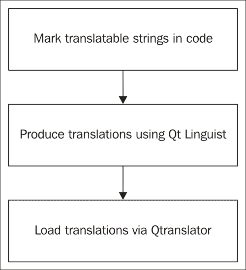

首先，Qt 不会自动将所有字符串都设置为可翻译的，因为这显然会是一场灾难。相反，您需要在代码或**设计**模式中显式设置字符串是否可翻译。在 Qt/C++代码中，使用`tr()`函数将所有可翻译的字符串括起来。在 Qt Quick/QML 代码中，我们使用`qsTr()`函数来完成这项工作。让我给您举一个例子。以下是一个字符串正常使用的演示：

```cpp
qDebug() << "Hello World";
```

这将在标准输出流中输出`Hello World`，在一般情况下，这是您的命令提示符或 shell。如果我们想使`Hello World`可翻译，我们需要使用`tr()`函数将字符串括起来，如下所示：

```cpp
qDebug() << tr("Hello World");
```

由于`tr()`是`QObject`类的静态公共成员函数，因此即使是非`QObject`类，您仍然可以使用它。

```cpp
qDebug() << QObject::tr("Hello World");
```

然后，我们需要使用`lupdate`命令，该命令位于 Qt Creator 的**工具** | **外部** | **Linguist** | **更新翻译（lupdate）**。这将更新（如果翻译源文件不存在则创建）。然后，您可以使用 Qt Linguist 翻译字符串。在您发布应用程序之前，运行**工具** | **外部** | **Linguist** | **发布翻译（lrelease）**中的`lrelease`命令，以生成应用程序可以动态加载的**Qt 消息（QM）**文件。不用担心它会让您感到困惑；我们将使用两个示例来引导您完成这些步骤。

# 翻译 Qt 小部件应用程序

首先，让我们创建一个新的 Qt Widget 项目，其名称为`Internationalization`。然后，在**设计**模式下编辑`mainwindow.ui`。

1.  如同往常，移除状态栏、菜单栏和工具栏。

1.  将**标签**添加到`centralWidget`中，并将其对象名更改为`nonTransLabel`。然后，将其文本更改为`这是一个不可翻译的标签`，并在**属性编辑器**中取消选中`text`下的`translatable`。

1.  将一个**按钮**拖到`nonTransLabel`下方，其对象名为`transButton`。将其文本更改为`这是一个可翻译的按钮`。

1.  在**MainWindow**中将**布局**更改为**垂直布局**。

1.  调整框架大小到一个舒适的大小。

返回到**编辑**模式下编辑`Internationalization.pro`项目文件。添加一行指示翻译源文件，如下所示：

```cpp
TRANSLATIONS = Internationalization_de.ts
```

`_de`后缀是一个区域设置代码，表示这是一个德语翻译源文件。区域设置代码由**互联网工程任务组**在**BCP 47**文档系列中定义。历史上，Qt 遵循 POSIX 定义，这与 BCP 47 略有不同。在这个中，它使用下划线（`_`）而不是连字符（`-`）来分隔子标签。换句话说，巴西葡萄牙语表示为`pt_BR`而不是`pt-BR`。同时，Qt 从 Qt 4.8 版本开始提供了一些 API 来使区域名称符合 BCP 47 定义。

为了确保此更改有效，保存项目文件，然后在项目上右键单击并选择**运行 qmake**。之后，我们可以通过执行`lupdate`命令生成翻译源文件，该文件正好是`Internationalization_de.ts`。结果将打印在**常规消息**面板中，其中包含添加到 TS 文件中的字符串，如下所示：

```cpp
Updating 'Internationalization_de.ts'...
Found 3 source text(s) (3 new and 0 already existing)
```

现在，在 Qt Linguist 中打开`Internationalization_de.ts`文件。以下截图显示了 Qt Linguist 的概览 UI：

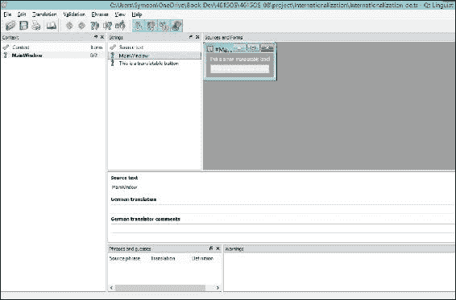

**上下文**列出源文本上下文，在大多数情况下是类名，而**字符串**包含所有可翻译的字符串。**源和形式**显示字符串的对应位置，可以是代码片段或 UI 表单。在其下方是翻译区域，允许您输入翻译和注释（如果有）。

除了概述之外，每个条目前面的图标也值得关注。一个黄色的问号（**?**）简单地表示目前没有翻译，而绿色的勾号表示已接受/正确，黄色的勾号则表示已接受/有警告。您还可能遇到红色的感叹号（**!**），这表示警告。在“来源和形式”面板中按钮文本前面的尖锐符号（**#**）表示未翻译，可能可翻译的字符串。Qt Linguist 会根据其自己的算法自动检查字符串翻译，这意味着它可能会给出错误的警告。在这种情况下，只需忽略警告并接受翻译。

您会发现标签文本不在**源文本**中。这是因为我们没有勾选`translatable`属性。现在，在翻译区域输入德语翻译，然后在工具栏中单击**完成并下一步**按钮，然后导航到**翻译** | **完成并下一步**。或者，更快的方法是按*Ctrl* + *Enter*来接受翻译。完成翻译后，单击**保存**按钮，然后退出 Qt Linguist。

虽然推荐使用 Qt Linguist 进行翻译任务，但直接使用普通文本编辑器编辑 TS 文件也是可行的。TS 文件是 XML 格式的，应该被其他编辑器很好地支持。

翻译后，返回 Qt Creator 并运行`lrelease`命令以生成`Internationalization_de.qm`文件。在当前阶段，您的项目文件夹应包含 TS 和 QM 文件，如下面的截图所示：

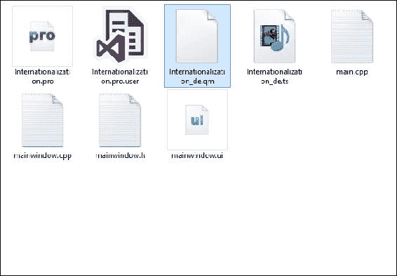

### 注意

注意，由于操作系统和（或）软件安装的不同，您的计算机上的文件图标可能会有所不同。

我们已经生成了 QM 文件；现在是时候修改`main.cpp`文件，以便将翻译加载到这个应用程序中。

```cpp
#include "mainwindow.h"
#include <QApplication>
#include <QTranslator>

int main(int argc, char *argv[])
{
  QApplication a(argc, argv);

 QTranslator translator;
 translator.load(QLocale::German, "Internationalization", "_");
 a.installTranslator(&translator);

  MainWindow w;
  w.show();

  return a.exec();
}
```

在这里，使用`QTranslator`来加载德语翻译。在我们将翻译器安装到`QApplication`之前，我们必须通过调用`load`函数来加载一个 QM 文件。这将加载一个翻译文件，其文件名由`Internationalization`后跟`_`和 UI 语言名称（在这种情况下是`de`）以及`.qm`（默认值）组成。有一个简化的重载`load`函数。我们的等效函数如下：

```cpp
translator.load("Internationalization_de");
```

通常，调用前面的`load`函数会更好，因为它使用`QLocale::uiLanguages()`，如果新区域需要，它还会格式化日期和数字。无论您选择哪种方式，都请记住，如果您在`MainWindow w;`行之后加载翻译，`MainWindow`将无法使用该翻译。

如果您现在运行应用程序，应用程序不会显示德语。为什么？这仅仅是因为`QTranslator`找不到`Internationalization_de.qm`文件。有很多方法可以解决这个问题。最干净的方法是在 Qt Creator 中运行应用程序时更改工作目录。

1.  切换到**项目**模式。

1.  切换到**运行设置**。

1.  将**工作目录**更改为包含`Internationalization_de.qm`文件的项目源目录。

再次运行它；你会在屏幕上看到德语文本，如下所示：

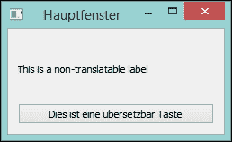

标签以我们预期的英语显示，而窗口标题和按钮文本则以德语显示。

你可能认为这个解决方案毫无意义，因为尽管系统语言环境设置已经加载，德语翻译仍然可用。然而，只需进行一项修改，应用程序就可以根据系统语言环境加载翻译；那就是，将翻译器加载行更改为以下所示：

```cpp
translator.load(QLocale::system().language(), "Internationalization", "_");
```

在这里，`system()`是`QLocale`类的静态成员函数，它返回一个用系统语言环境初始化的`QLocale`对象。然后我们调用`language()`函数来获取当前语言环境的语言。

# 区分相同文本

如果存在相同的文本，默认行为是将它们视为具有相同意义的文本。这可以有效地避免翻译员翻译相同的文本。然而，这并不总是正确的。例如，单词`open`可以用作名词或形容词，在其他语言中可能是不同的单词。幸运的是，在 Qt 中区分相同的文本是可能且容易的。

现在，让我们在`transButton`和`nonTransLabel`之间添加一个`PushButton`和`openButton`。使用`Open`作为其文本，然后编辑`mainwindow.h`。添加一个名为`onOpenButtonClicked()`的新私有槽，用于处理`openButton`被点击的事件。相关的源文件`mainwindow.cpp`如下所示：

```cpp
#include <QMessageBox>
#include "mainwindow.h"
#include "ui_mainwindow.h"

MainWindow::MainWindow(QWidget *parent) :
  QMainWindow(parent),
  ui(new Ui::MainWindow)
{
  ui->setupUi(this);

 connect(ui->openButton, &QPushButton::clicked, this, &MainWindow::onOpenButtonClicked);
}

MainWindow::~MainWindow()
{
  delete ui;
}

void MainWindow::onOpenButtonClicked()
{
 QMessageBox::information(this, tr("Dialog"), tr("Open"));
}

```

首先，我们在`MainWindow`的构造函数中将`openButton`的点击信号连接到`MainWindow`的`onOpenButtonClicked`槽。然后，我们简单地使用`QMessageBox`的静态成员函数`information`弹出信息对话框，使用`Dialog`作为标题，`Open`作为上下文。别忘了使用`tr()`函数使这些字符串可翻译。

现在，运行`lupdate`并打开 Qt Linguist 中的 TS 文件。在**字符串**面板中只有一个**Open**字符串，如图所示：

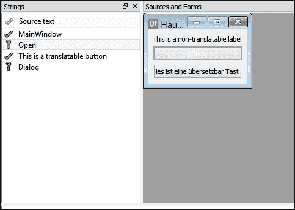

然而，信息对话框中的**Open**应该有一个形容词，它不应该与`openButton`中的文本混淆。这是一个我们需要将这个**Open**与其他`Open`区分开来的注释。修改`mainwindow.cpp`中的`onOpenButtonClicked`函数：

```cpp
void MainWindow::onOpenButtonClicked()
{
  QMessageBox::information(this, tr("Dialog"), tr("Open", "adj."));
}
```

在这里，`tr()`函数的第二个参数是注释。不同的注释代表不同的文本。这样，`lupdate`会将它们视为非相同文本。重新运行`lupdate`，你就能在 Qt Linguist 中翻译两个`Open`字符串。翻译区域中的**开发者注释**列如图所示。Qt Linguist 也会显示两个可翻译的**Open**字符串。

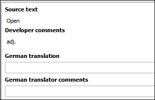

在 **设计** 模式下，`openButton` 的等效属性是在 `text` 属性下的 `text` 属性的区分。翻译后执行 `lrelease`，然后重新运行应用程序，两个 `Open` 字符串应该有两个不同的翻译，如下所示演示：

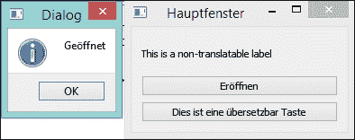

# 动态更改语言

有时，人们想使用除系统区域设置指定的语言之外的语言。这是一个应用自定义设置的问题。这通常意味着重新启动应用程序以加载相应的翻译文件。这部分的理由是动态更改语言需要额外的工作。然而，这是可行的，并且可以通过几行代码实现。更重要的是，它提供了更好的用户体验！

让我们在 `MainWindow` 中添加一个新的 `push` 按钮。将其命名为 `loadButton` 并更改其文本为 `Load/Unload Translation`。然后，以 **编辑** 模式编辑 `main.cpp` 文件。删除所有与 `QTranslator` 相关的行，因为我们将在 `MainWindow` 类中实现这种动态语言切换。`main.cpp` 文件应看起来与最初生成的文件一样，如下所示：

```cpp
#include "mainwindow.h"
#include <QApplication>

int main(int argc, char *argv[])
{
  QApplication a(argc, argv);
  MainWindow w;
  w.show();

  return a.exec();
}
```

现在，编辑 `mainwindow.h`，因为我们需要在这里声明一些成员：

```cpp
#ifndef MAINWINDOW_H
#define MAINWINDOW_H

#include <QMainWindow>
#include <QTranslator>

namespace Ui {
class MainWindow;
}

class MainWindow : public QMainWindow
{
  Q_OBJECT

public:
  explicit MainWindow(QWidget *parent = 0);
  ~MainWindow();

private:
  Ui::MainWindow *ui;
 QTranslator *deTranslator;
 bool deLoaded;

private slots:
  void onOpenButtonClicked();
 void onLoadButtonClicked();

protected:
 void changeEvent(QEvent *);
};

#endif // MAINWINDOW_H
```

如您所知，我们将 `QTranslator` 移到这里，命名为 `deTranslator`，并将其用作 `deLoaded` 变量的指针，以表示我们是否已经加载了德语翻译。下面的 `onLoadButtonClicked` 是一个 `private` 插槽函数，它将被连接到 `loadButton` 的点击信号。最后但同样重要的是，我们重写了 `changeEvent`，这样我们就可以在飞行中翻译整个用户界面。它将在 `mainwindow.cpp` 源文件中变得清晰，如下所示粘贴：

```cpp
#include <QMessageBox>
#include "mainwindow.h"
#include "ui_mainwindow.h"

MainWindow::MainWindow(QWidget *parent) :
  QMainWindow(parent),
  ui(new Ui::MainWindow)
{
  ui->setupUi(this);

  deTranslator = new QTranslator(this);
  deTranslator->load(QLocale::German, "Internationalization", "_");
  deLoaded = false;

  connect(ui->openButton, &QPushButton::clicked, this, &MainWindow::onOpenButtonClicked);
  connect(ui->loadButton, &QPushButton::clicked, this, &MainWindow::onLoadButtonClicked);
}

MainWindow::~MainWindow()
{
  delete ui;
}

void MainWindow::onOpenButtonClicked()
{
  QMessageBox::information(this, tr("Dialog"), tr("Open", "adj."));
}

void MainWindow::onLoadButtonClicked()
{
 if (deLoaded) {
 deLoaded = false;
 qApp->removeTranslator(deTranslator);
 }
 else {
 deLoaded = true;
 qApp->installTranslator(deTranslator);
 }
}

void MainWindow::changeEvent(QEvent *e)
{
 if (e->type() == QEvent::LanguageChange) {
 ui->retranslateUi(this);
 }
 else {
 QMainWindow::changeEvent(e);
 }
}

```

在构造函数中，我们初始化 `deTranslator` 并加载德语翻译，这与我们在之前的 `main.cpp` 中所做几乎相同。然后，我们将 `deLoaded` 设置为 `false`，表示德语翻译尚未安装。接下来，这是一个 `connect` 语句。

现在，让我们看看 `onLoadButtonClicked` 函数，看看如果点击 `loadButton` 会发生什么。我们将 `deLoaded` 设置为 `false` 并删除已加载的 `deTranslator`。否则，我们安装 `deTranslator` 并将 `deLoaded` 设置为 `true`。请记住，`qApp` 是一个预定义的宏，它简单地指向当前的 `QCoreApplication` 实例。`installTranslator` 和 `removeTranslator` 都会将事件传播到所有顶级窗口，也就是说，在这种情况下将触发 `MainWindow` 的 `changeEvent`。

为了根据翻译器更新所有文本，我们必须 `重写` `changeEvent`。在这个 `重写` 的函数中，如果事件是 `languageChange`，我们调用 `retranslateUi` 函数来重新翻译 `MainWindow`。否则，我们简单地调用继承的默认 `QMainWindow::changeEvent` 函数。

当你第一次启动应用程序时，它将显示英文文本。

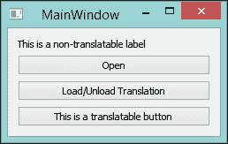

一旦你点击 **加载/卸载翻译** 按钮，所有可翻译和已翻译的文本将显示为德语。

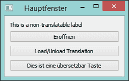

如果你再次点击按钮，它将显示英文。除了不可翻译的标签外，`loadButton` 也不会被翻译。这是因为我们根本就没有翻译按钮。然而，正如你所看到的，缺少一些翻译不会阻止应用程序加载其他翻译文本。

# 翻译 Qt Quick 应用程序

翻译 Qt Quick 应用程序的过程与 Qt Widgets 应用程序类似。我们将通过另一个示例应用程序来介绍这个过程。

创建一个新的 Qt Quick 应用程序项目，并将其命名为 `Internationalization_QML`。生成的 `main.qml` 文件已经为我们添加了 `qsTr()` 函数。在 Qt Creator 和（或）Qt 库的后续版本中，内容可能会有所不同。然而，它应该看起来与这个类似：

```cpp
import QtQuick 2.3
import QtQuick.Controls 1.2

ApplicationWindow {
  visible: true
  width: 640
  height: 480
  title: qsTr("Hello World")

  menuBar: MenuBar {
    Menu {
      title: qsTr("File")
      MenuItem {
        text: qsTr("&Open")
        onTriggered: console.log("Open action triggered");
      }
      MenuItem {
        text: qsTr("Exit")
        onTriggered: Qt.quit();
      }
    }
  }

  Text {
    text: qsTr("Hello World")
    anchors.centerIn: parent
  }
}
```

现在，让我们编辑 `Internationalization_QML.pro` 项目文件，其修改后的版本如下粘贴：

```cpp
TEMPLATE = app

QT += qml quick widgets

SOURCES += main.cpp

RESOURCES += qml.qrc

lupdate_only {
 SOURCES += main.qml
}

TRANSLATIONS = Internationalization_QML_de.ts

# Additional import path used to resolve QML modules in Qt 
# Creator's code model
QML_IMPORT_PATH =

# Default rules for deployment.
include(deployment.pri)
```

除了 `TRANSLATIONS` 行之外，我们还添加了一个 `lupdate_only` 块。在这种情况下，这是至关重要的。

### 注意

我们可能不需要在 Qt/C++ 项目中此块，因为 `lupdate` 工具从 `SOURCES`、`HEADERS` 和 `FORMS` 中提取可翻译的字符串。

然而，这意味着所有位于其他位置的字串都不会被找到，更不用说翻译了。另一方面，`qml` 文件不是将被 C++ 编译器编译的 C++ 源文件。在这种情况下，我们使用 `lupdate_only` 来限制那些仅对 `lupdate` 可用的 `SOURCES`。

现在，执行 `lupdate` 可以为我们生成翻译源文件。同样，我们使用 Qt Linguist 来翻译 `Internationalization_QML_de.ts` 文件。然后，执行 `lrelease` 来生成 QM 文件。

要加载翻译，我们需要将 `main.cpp` 修改为以下所示：

```cpp
#include <QApplication>
#include <QQmlApplicationEngine>
#include <QTranslator>

int main(int argc, char *argv[])
{
  QApplication app(argc, argv);

 QTranslator translator;
 translator.load(QLocale::German, "Internationalization_QML", "_");
 app.installTranslator(&translator);

  QQmlApplicationEngine engine;
  engine.load(QUrl(QStringLiteral("qrc:/main.qml")));

  return app.exec();
}
```

此外，我们还需要将**工作目录**在**项目**模式下的**运行设置**中更改为该项目的目录。现在，再次运行应用程序；我们应该能够在屏幕上看到德语文本，就像以下截图所示：

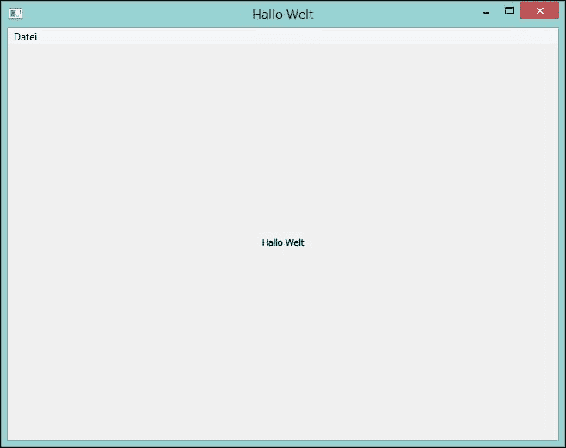

有一种加载翻译文件的方法，不需要更改**工作目录**。首先，将 `main.cpp` 中的 `translator.load` 行更改为以下内容：

```cpp
translator.load(QLocale::German, "Internationalization_QML", "_", ":/");
```

我们指定了翻译者应该搜索的目录。在这种情况下，它是 `":/"`，这是 **Resources** 中的顶级目录。请勿在目录字符串前添加 `qrc`；这将导致 `translator` 无法找到 QM 文件。在这里，一个冒号（`:`）就足够了，以表示 **Resources** 中有一个 `qrc` 路径。

您可以创建一个新的 `qrc` 文件，或者类似我们这样做，将 `Internationalization_QML_de.qm` 添加到当前的 `qml.qrc` 文件中。

1.  在 **项目编辑器** 下的 **资源** 中的 `qml.qrc` 文件上右键单击。

1.  在 **编辑器** 中选择 **打开**。

1.  在右下角的面板上导航到 **添加** | **添加文件**。

1.  选择 `Internationalization_QML_de.qm` 文件，并单击 **打开**。

现在，`Internationalization_QML_de.qm` 文件应该在 **编辑器** 和 **项目** 树中同时显示，如下面的截图所示：

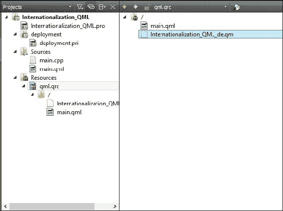

切换到 **项目** 模式，并在 **运行设置** 中重置 **工作目录**。然后再次运行应用程序；德语翻译应该仍然可以成功加载。

到目前为止，Qt 和 Qt Quick 之间没有太大的区别。然而，在 Qt Quick 中实现动态翻译的安装和删除是繁琐的。您必须编写一个 C++ 类来安装和删除翻译器，然后它发出一个信号，指示文本有变化。因此，Qt Quick 应用程序的最佳实践是将语言作为一个设置。用户可以加载不同的翻译。尽管如此，这需要重新启动应用程序。

# 摘要

现在，您可以通过添加对其他语言的支持来使您的应用程序更具竞争力。此外，Qt Linguist，这是一个由 Qt 提供的跨平台工具，也非常易于使用，也包含在本章中。除了您学到的技能外，您还可以看出 Qt/C++ 在 API 和功能方面仍然比 Qt Quick/QML 具有巨大优势。

在下一章中，我们将使我们的 Qt 应用程序可重新分发，并将它们部署到其他设备上。
