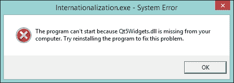
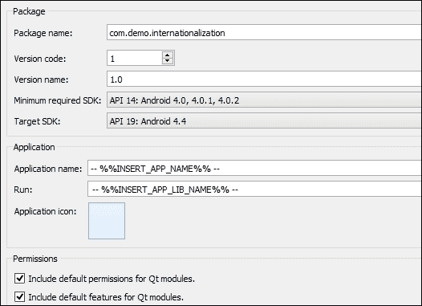

# 第九章：部署到其他设备上的应用程序

在开发完成后，是时候分发你的应用程序了。我们将使用上一章中的示例应用程序`Internationalization`来演示如何将 Qt 应用程序推广到 Windows、Linux 和 Android。本章将涵盖以下主题：

+   在 Windows 上发布 Qt 应用程序

+   创建安装程序

+   在 Linux 上打包 Qt 应用程序

+   在 Android 上部署 Qt 应用程序

# 在 Windows 上发布 Qt 应用程序

在开发阶段之后，你可以使用`release`作为构建配置来构建你的应用程序。在`release`配置中，编译器会对代码进行优化，并且不会产生调试符号，这反过来又减少了大小。请确保项目处于`release`配置。

在我们深入包装过程之前，我想谈谈静态链接和动态链接之间的区别。你可能在这本书的整个过程中一直在使用 Qt 库的动态链接。如果你从 Qt 网站上下载**社区版**，这可以得到证实。

那么，动态链接是什么意思呢？嗯，这意味着当可执行文件执行时，操作系统将在运行时加载和链接必要的共享库。换句话说，你将在 Windows 上看到很多`.dll`文件，在 Unix 平台上看到很多`.so`文件。这种技术允许开发者分别更新这些共享库和可执行文件，这意味着如果你更改共享库，只要它们的 ABIs 兼容，你不需要重新构建可执行文件。尽管这种方法更灵活，但开发者被警告要小心避免**DLL 地狱**。

在 Windows 上解决 DLL 地狱最常用的解决方案是选择静态链接。相比之下，静态链接将在编译时解析所有函数调用和变量，并将它们复制到目标中，以生成独立的可执行文件。优势是显而易见的。首先，你不需要分发所有必要的共享库。在这种情况下不会出现 DLL 地狱。在 Windows 上，根据你使用的编译器，静态库可能具有`.lib`或`.a`扩展名，而在 Unix 平台上通常具有`.a`扩展名。

为了进行清晰的比较，为你制作了一个表格，以查看动态链接和静态链接之间的差异：

|   | 动态链接 | 静态链接 |
| --- | --- | --- |
| **库类型** | 共享库 | 静态库 |
| **可执行文件大小** | 相对较小 | 大于动态链接 |
| **库更新** | 只有库本身 | 可执行文件需要重新构建 |
| **不兼容的库** | 需要小心避免这种情况 | 不会发生 |

然而，如果与动态链接的可执行文件一起分发的共享库被视为包的一部分，那么动态链接风格的包将比静态链接的独立可执行文件大。

现在，回到主题！由于 Windows 没有标准的 Qt 运行时库安装程序，最好的做法是生成一个静态链接的目标，因为要发布的包会更小，并且可执行文件不会受到 DLL 地狱的影响。

然而，如前所述，你下载的 Qt 库只能用于动态链接应用程序，因为它们是共享库。将 Qt 编译为静态库是可行的。但在你继续之前，你需要了解 Qt 的许可证。

目前，除了 Qt 开源许可证外，还有 Qt 商业许可证。对于开源许可证，大多数 Qt 库都根据**GNU Lesser General Public License**（LPGL）授权。在这种情况下，如果你使用 Qt 库静态链接构建应用程序，你的应用程序必须根据 LPGL 向用户提供应用程序的源代码。如果你的应用程序与 Qt 库动态链接，则可以保持专有和闭源。换句话说，如果你想静态链接应用程序并保持其专有性，你必须购买 Qt 商业许可证。有关 Qt 许可的详细信息，请参阅[`www.qt.io/licensing/`](http://www.qt.io/licensing/)。

如果你决定使用静态链接，你可能需要在构建应用程序之前将 Qt 库静态编译。在这种情况下，可执行目标是需要打包和发布的唯一东西。如果你的应用程序具有多语言支持，不要忘记之前提到的 QM 文件。

另一方面，如果你想走动态方式，则需要额外努力。首先，有一些核心 DLL 必须存在，而且根据编译器的不同，列表也不同。以下表格包括 MSVC 和 MinGW/GCC 场景：

| MSVC 2013 | MinGW/GCC |
| --- | --- |
| `msvcp120.dll` | `libgcc_s_dw2-1.dll` |
| `msvcr120.dll` | `libstdc++-6.dll` |
|   | `libwinpthread-1.dll` |

需要包含一些常见的 DLL，例如`icudt53.dll`、`icuin53.dll`和`icuuc53.dll`。你可以在 Qt 库目录中找到这些文件。以 MinGW/GCC 为例；它们位于`QT_DIR\5.4\mingw491_32\bin`，其中`QT_DIR`是 Qt 安装路径，例如`D:\Qt`。请注意，Qt 的后续版本可能具有略微不同的文件名。

此外，如果目标用户已经安装了 Visual Studio 2013 的**Visual C++ Redistributable Packages**，则不需要分发`msvcp120.dll`和`msvcr120.dll`，这些可以从[`www.microsoft.com/en-ie/download/details.aspx?id=40784`](http://www.microsoft.com/en-ie/download/details.aspx?id=40784)下载。

在此之后，你可能想通过查看项目文件来检查你需要的其他 DLL。以`Internationalization`项目为例。其项目文件`Internationalization.pro`为我们提供了线索。有两行与 QT 配置相关，如下所示：

```cpp
QT       += core gui

greaterThan(QT_MAJOR_VERSION, 4): QT += widgets
```

`QT`变量包括`core gui`小部件。实际上，所有 Qt 应用程序至少都会包含`core`，而其他则是依赖的。在这种情况下，我们必须将`Qt5Core.dll`、`Qt5Gui.dll`和`Qt5Widgets.dll`与可执行目标一起分发。

现在，使用 MinGW/GCC 构建`Internationalization`项目。可执行目标`Internationalization.exe`应位于构建目录的`release`文件夹中，这可以在**项目**模式下读取。接下来，我们创建一个名为`package`的新文件夹，并将可执行文件复制到那里。然后，我们将所需的 DLL 文件也复制到`package`中。现在，这个文件夹应该包含所有必要的 DLL 文件，如下所示：


在大多数情况下，如果缺少所需的库，应用程序将无法运行，操作系统将提示缺少的库名称。例如，如果缺少`Qt5Widgets.dll`，当您尝试运行`Internationalizationi.exe`时，将显示以下系统错误对话框：



基本上，常规操作是将缺失的库复制到应用程序所在的同一文件夹中。此外，您还可以使用一些工具，例如`Dependency Walker`来获取库依赖项。

请不要使用`Qt 编辑器`文件夹中的 DLL 文件。这个版本通常与您使用的 Qt 库不同。除了这些库之外，您可能还需要包含应用程序将要使用到的所有资源。例如，用于翻译的 QM 文件，即复制`Internationalization_de.qm`文件以加载德语翻译。

文件列表如下：

+   `icudt53.dll`

+   `icuin53.dll`

+   `icuuc53.dll`

+   `Internationalization.exe`

+   `Internationalization_de.qm`

+   `libgcc_s_dw2-1.dll`

+   `libstdc++-6.dll`

+   `libwinpthread-1.dll`

+   `Qt5Core.dll`

+   `Qt5Gui.dll`

+   `Qt5Widgets.dll`

不要忘记，这是 Qt 5.4.0 中 MinGW/GCC 的情况，而不同版本和编译器可能会有略微不同的列表，正如我们之前讨论的那样。

在这次首次准备之后，在某种程度上这个列表是固定的。您只需要更改可执行目标，如果 QM 文件有变化，也需要更改。一种简单的方法是将它们全部压缩成`tarball`。

# 创建安装程序

虽然使用存档文件分发您的应用程序很快捷，但如果您提供安装程序，看起来会更专业。Qt 提供了**Qt 安装框架**，目前最新的开源版本是 1.5.0，可以从[`download.qt.io/official_releases/qt-installer-framework/1.5.0/`](http://download.qt.io/official_releases/qt-installer-framework/1.5.0/)获取。

为了方便起见，让我们在 Qt 安装框架的安装路径`D:\Qt\QtIFW-1.5.0`下创建一个名为`dist`的文件夹。这个文件夹用于存储所有需要打包的应用程序项目。

然后，在`dist`下创建一个名为`internationalization`的文件夹。在`internationalization`中，创建两个文件夹，`config`和`packages`。

`packages`目录内目录的名称充当类似域名或 Java 风格的标识符。在这个例子中，我们有两个包，一个是应用程序，另一个是翻译。因此，它们分别添加到`packages`目录下的两个文件夹中，`com.demo.internationalization`和`com.demo.internationalization.translation`。每个文件夹内都将存在`meta`和`data`目录，所以整体目录结构如下所示：


让我们编辑全局配置文件，`config.xml`，它首先位于`config`目录中。您需要创建一个名为`config.xml`的文件。

### 注意

总是记住不要使用 Windows 内置的记事本编辑此文件，或者实际上任何文件。您可以使用 Qt Creator 或其他高级编辑器，如 Notepad++来编辑它。这仅仅是因为记事本作为一个代码编辑器缺少很多功能。

在这个例子中，`config.xml`文件的内容粘贴在这里：

```cpp
<?xml version="1.0" encoding="UTF-8"?>
<Installer>
  <Name>Internationalization</Name>
  <Version>1.0.0</Version>
  <Title>Internationalization Installer</Title>
  <Publisher>Packt</Publisher>
  <TargetDir>@homeDir@/Internationalization</TargetDir>
  <AdminTargetDir>@rootDir@/Internationalization</AdminTargetDir>
</Installer>
```

对于一个最小的`config.xml`文件，`<Installer>`中必须存在`<Name>`和`<Version>`元素。所有其他元素都是可选的，但如果需要，您应该指定它们。同时，`<TargetDir>`和`<AdminTargetDir>`可能有点令人困惑。它们都指定默认的安装路径，其中`<AdminTargetDir>`用于指定获得管理员权限时的安装路径。其他元素基本上是自我解释的。您还可以设置其他元素来自定义安装程序。有关更多详细信息，请参阅[`doc.qt.io/qtinstallerframework/ifw-globalconfig.html`](http://doc.qt.io/qtinstallerframework/ifw-globalconfig.html)。

让我们导航到`com.demo.internationalization`内的`meta`文件夹。此目录包含指定部署和安装设置的文件。此目录中的所有文件（除许可证外）都不会被安装程序提取，也不会被安装。必须至少有一个包信息文件，例如`package.xml`。以下位于`com.demo.internationalization/meta`的`package.xml`示例如下：

```cpp
<?xml version="1.0" encoding="UTF-8"?>
<Package>
  <DisplayName>Core Application</DisplayName>
  <Description>Essential part of Internationalization</Description>
  <Version>1.0.0</Version>
  <ReleaseDate>2014-12-27</ReleaseDate>
  <Name>com.demo.internationalization</Name>
  <Licenses>
    <License name="License Agreement" file="license.txt" />
  </Licenses>
  <Default>true</Default>
  <ForcedInstallation>true</ForcedInstallation>
</Package>
```

`<Default>`元素指定此包是否应默认选中。同时，我们将`<ForcedInstallation>`设置为`true`，表示最终用户不能取消选择此包。而`<Licenses>`元素可以有多个子元素`<License>`，在这种情况下我们只有一个。我们必须提供`license.txt`文件，其内容仅是一行演示，如下所示：

```cpp
This is the content of license.txt.
```

位于`com.demo.internationalization.translation/meta`的以下`package.xml`文件行数较少：

```cpp
<?xml version="1.0" encoding="UTF-8"?>
<Package>
  <DisplayName>German Translation</DisplayName>
  <Description>German translation file</Description>
  <Version>1.0.0</Version>
  <ReleaseDate>2014-12-27</ReleaseDate>
  <Name>com.demo.internationalization.translation</Name>
  <Default>false</Default>
</Package>
```

`<DisplayName>`和`<Description>`之间的区别通过以下截图演示：


`<Description>`元素是在包被选中时在右侧显示的文本。它也是当鼠标悬停在条目上时弹出的文本提示。您还可以看到这两个包之间的关系。正如名称`com.demo.internationalization.translation`所暗示的，它是一个`com.demo.internationalization`的子包。

此步骤之后将显示许可证，如下面的截图所示。如果您设置了多个许可证，对话框将有一个面板来分别查看这些许可证，类似于您在安装 Qt 本身时看到的。


关于`package.xml`文件中的更多设置，请参阅[`doc.qt.io/qtinstallerframework/ifw-component-description.html#package-information-file-syntax`](http://doc.qt.io/qtinstallerframework/ifw-component-description.html#package-information-file-syntax)。

相比之下，`data`目录存储了所有需要安装的文件。在这个例子中，我们将之前准备的所有文件保存在`com.demo.internationalization`的`data`文件夹中，除了 QM 文件。QM 文件`Internationalization_de.qm`保存在`com.demo.internationalization.translation`内部的`data`文件夹中。

在完成所有初始准备后，我们来到生成此项目安装程序的最终步骤。根据您的操作系统，打开**命令提示符**或**终端**，将当前目录更改为`dist/internationalization`。在这种情况下，它是`D:\Qt\QtIFW-1.5.0\dist\internationalization`。然后，执行以下命令以生成`internationalization_installer.exe`安装程序文件：

```cpp
..\..\bin\binarycreator.exe -c config\config.xml -p packages internationalization_installer.exe

```

### 注意

在 Unix 平台（包括 Linux 和 Mac OS X）上，您必须使用斜杠（/）而不是反斜杠（\），并删除`.exe`后缀，这使得命令略有不同，如下所示：

```cpp
../../bin/binarycreator -c config/config.xml -p packages internationalization_installer
```

您需要等待一段时间，因为`binarycreator`工具会将`data`目录中的文件打包成`7zip`存档，这是一个耗时的过程。之后，您应该会在当前目录中看到`internationalization_installer.exe`（或没有`.exe`后缀）。

安装程序更加方便，尤其是对于包含多个可选包的大型应用程序项目。此外，它会在**控制面板**中注册并允许最终用户卸载。

# 在 Linux 上打包 Qt 应用程序

在 Linux 上比在 Windows 上更复杂。有两种流行的包格式：**RPM 包管理器**（**RPM**）和**Debian 二进制包**（**DEB**）。RPM 最初是为**Red Hat Linux**开发的，它是**Linux 标准基**的基本包格式。它主要用于**Fedora**、**OpenSUSE**、**Red Hat Enterprise Linux**及其衍生版本；而后者因在**Debian**及其知名且流行的衍生版**Ubuntu**中使用而闻名。

除了这些格式，还有其他 Linux 发行版使用不同的软件包格式，例如 **Arch Linux** 和 **Gentoo**。为不同的 Linux 发行版打包你的应用程序将需要额外的时间。

然而，这不会太耗费时间，尤其是对于开源应用程序。如果你的应用程序是开源的，你可以参考文档来编写一个格式化的脚本，用于编译和打包你的应用程序。有关创建 RPM 软件包的详细信息，请参阅[`fedoraproject.org/wiki/How_to_create_an_RPM_package`](https://fedoraproject.org/wiki/How_to_create_an_RPM_package)，而对于 DEB 打包，请参阅[`www.debian.org/doc/manuals/maint-guide/index.en.html`](https://www.debian.org/doc/manuals/maint-guide/index.en.html)。稍后会有一个示例演示如何打包 DEB。

尽管打包专有应用程序，如 RPM 和 DEB 软件包是可行的，但它们不会进入官方仓库。在这种情况下，你可能会想在你的服务器上设置一个仓库，或者只是通过文件托管发布这些软件包。

或者，你可以将你的应用程序存档，类似于我们在 Windows 上所做的那样，并为安装和卸载编写一个 shell 脚本。这样，你可以使用一个 tarball 或 Qt 安装器框架为各种发行版制作安装程序。但是，永远不要忘记适当地处理依赖关系。在 Linux 上，不兼容的共享库问题更为严重，因为几乎所有的库和应用程序都是动态链接的。最糟糕的是不同发行版之间的不兼容性，因为它们可能使用不同的库版本。因此，要么注意这些陷阱，要么选择静态链接的方式。

正如我们之前提到的，除非你购买了 Qt 商业许可证，否则静态链接的软件必须是开源的。这种困境使得静态链接的开源应用程序变得毫无意义。这不仅是因为动态链接是标准方式，而且因为静态链接的 Qt 应用程序将无法使用系统主题，也无法从系统升级中受益，这在涉及安全更新时是不合适的。无论如何，如果你的应用程序是专有的并且你获得了商业许可证，你可以使用静态链接来编译你的应用程序。在这种情况下，就像 Windows 上的静态链接一样，你只需要发布带有必要资源的目标可执行文件，例如图标和翻译。值得注意的是，即使你构建了静态链接的 Qt 应用程序，也无法在任何 Linux 发行版上运行它们。

因此，推荐的方式是在虚拟机上安装几个主流的 Linux 发行版，然后使用这些虚拟机来打包你的动态链接应用程序，并使用它们自己的软件包格式。二进制软件包不包含源代码，并且从二进制软件包中剥离符号也是常见的做法。这样，你的专有软件的源代码就不会通过这些软件包泄露。

在这里我们仍然以 `Internationalization` 为例。让我们看看如何创建一个 DEB 软件包。以下操作是在最新的 **Debian Wheezy** 上测试过的；后续版本或不同的 Linux 发行版可能会有所不同。

在我们打包应用程序之前，我们必须编辑项目文件 `Internationalization.pro`，使其可安装，如下所示：

```cpp
QT       += core gui

greaterThan(QT_MAJOR_VERSION, 4): QT += widgets

TARGET = Internationalization
TEMPLATE = app

SOURCES += main.cpp \
           mainwindow.cpp

HEADERS  += mainwindow.h

FORMS    += mainwindow.ui

TRANSLATIONS = Internationalization_de.ts

unix: {
 target.path  = /opt/internationalization_demo
 qmfile.path  = $$target.path
 qmfile.files = Internationalization_de.qm

 INSTALLS += target \
 qmfile
}

```

在 `qmake` 中有一个称为 **安装集** 的概念。每个安装集有三个成员：`path`、`files` 和 `extra`。`path` 成员定义了目标位置，而 `files` 告诉 `qmake` 应该复制哪些文件。你可以在 `extra` 中指定一些在执行其他指令之前需要执行的命令。

`TARGET` 是一个有点特殊的概念。首先，它是目标可执行文件（或库），另一方面，它也暗示了 `target.files`。因此，我们只需要指定 `target` 的路径。我们同样使用相同的路径为 `qmfile`，它包括 QM 文件。不要忘记使用双美元符号 `$$` 来使用变量。最后，我们设置了 `INSTALLS` 变量，它定义了在调用 `make install` 时要安装的内容。`unix` 括号用于限制仅在 Unix 平台上由 `qmake` 读取的行。

现在，我们可以通过执行以下步骤进入 DEB 打包的部分：

1.  将你的工作目录（当前目录）更改为项目的根目录，即 `~/Internationalization`。

1.  创建一个名为 `debian` 的新文件夹。

1.  在 `debian` 文件夹中创建四个必需的文件：`control`、`copyright`、`changelog` 和 `rules`，分别。然后，在 `debian` 文件夹中还可以创建一个可选的 `compat` 文件。

`control` 文件定义了最基本同时也是最关键的内容。这个文件全部关于源软件包和二进制软件包。我们示例中的 `control` 文件如下所示：

```cpp
Source: internationalization
Section: misc
Priority: extra
Maintainer: Symeon Huang <hzwhuang@gmail.com>
Build-Depends: debhelper (>=9),
               qt5-qmake,
               qtbase5-dev,
               qtbase5-private-dev
Standards-Version: 3.9.6

Package: internationalization
Architecture: any
Depends: ${shlibs:Depends}, ${misc:Depends}
Description: An example of Qt5 Blueprints
```

第一段是用于控制源信息，而接下来的每一部分描述的是源树构建的各个二进制软件包。换句话说，一个源软件包可以构建多个二进制软件包。在这种情况下，我们只构建一个二进制软件包，其名称与 `Source` 和 `internationalization` 相同。

在`Source`段落中，`Source`和`Maintainer`是必填项，而`Section`、`Priority`和`Standards-Version`是推荐填写的。`Source`用于标识源包名，其中不能包含大写字母。同时，`Maintainer`包含维护者包的名称和按照 RFC822 格式的电子邮件地址。`Section`字段指定了包被分类的应用领域。`Priority`是一个解释性的字段，表示这个包的重要性。最后，`Standards-Version`描述了与包兼容的最新标准版本。在大多数情况下，你应该使用最新的标准版本，目前是 3.9.6。还有一些可能有用但不是必须的字段。更多详情，请参考[`www.debian.org/doc/debian-policy/ch-controlfields.html`](https://www.debian.org/doc/debian-policy/ch-controlfields.html)。

你可以在`Build-Depends`中指定构建所需的某些包，类似于我们示例中的`qt5-qmake`和`qtbase5-dev`。它们仅用于构建过程，不会包含在二进制包的依赖项中。

二进制段落与源代码类似，只是没有`Maintainer`，但现在`Architecture`和`Description`是必填项。对于二进制包，`Architecture`可以是任何特定的架构，也可以简单地是`any`或`all`。指定`any`表示源包不依赖于任何特定的架构，因此可以在任何架构上构建。相比之下，`all`表示源包将只产生架构无关的包，例如文档和脚本。

在二进制段落的`Depends`中，我们使用`${shlibs:Depends}, ${misc:Depends}`代替特定的包。`${shlibs:Depends}`行可以用来让`dpkg-shlibdeps`自动生成共享库依赖。另一方面，根据`debhepler`的建议，你被鼓励在字段中放置`${misc:Depends}`以补充`${shlibs:Depends}`。这样，我们就不需要手动指定依赖项，这对打包者来说是一种缓解。

第二个必需的文件是`copyright`，用于描述源代码以及 DEB 包的许可证。在`copyright`文件中，格式字段是必需的，而其他字段是可选的。有关版权格式的更多详情，请参考[`www.debian.org/doc/packaging-manuals/copyright-format/1.0/`](https://www.debian.org/doc/packaging-manuals/copyright-format/1.0/)。本例中的`copyright`文件如下所示：

```cpp
Format: http://www.debian.org/doc/packaging-manuals/copyright-format/1.0/
Upstream-Contact: Symeon Huang <hzwhuang@gmail.com>

File: *
Copyright: 2014, 2015 Symeon Huang
License: Packt

License: Packt
  This package is released under Packt license.
```

第一段被称为**标题段落**，它只需要填写一次。在这个段落中，`Format`行是唯一必填的字段，在大多数情况下，这一行是相同的。`Upstream-Contact`字段的语法与`control`文件中的`Maintainer`相同。

文件中的第二段是**文件段落**，这是强制性的且可重复的。在这些段落中，`File`、`Copyright`和`License`是必需的。我们使用一个星号（`*`）表示这个段落适用于所有文件。`Copyright`字段可能包含从文件中复制来的原始声明或简短文本。`Files`段落中的`License`字段描述了由`File`定义的文件的许可条款。

在文件段落之后，**独立许可段落**是可选的且可重复的。如果 Debian 没有提供许可，我们必须提供完整的许可文本。一般来说，只有常见的开源许可才提供。第一行必须是一个单独的许可简称，然后是许可文本。对于许可文本，每行的开头必须有两个空格缩进。

不要被`changelog`文件名误导。这个文件也有一个特殊的格式，并且被`dpkg`用来获取你的软件包的版本号、修订、发行版和紧急程度。记录在这个文件中你所做的所有更改是一个好的做法。然而，如果你有一个版本控制系统，你只需列出最重要的更改即可。我们示例中的`changelog`文件包含以下内容：

```cpp
internationalization (1.0.0-1) unstable; urgency=low

  * Initial release

 -- Symeon Huang <hzwhuang@gmail.com>  Mon, 29 Dec 2014 18:45:31 +0000
```

第一行是软件包名称、版本、发行版和紧急程度。名称必须与源软件包名称匹配。在这个例子中，`internationalization`是名称，`1.0.0-1`是版本，`unstable`代表发行版，`urgency`是`low`。然后，使用一个空行来分隔第一行和日志条目。在日志条目中，你应该列出所有想要记录的更改。对于每个条目，标题部分有两个空格和一个星号（`*`）。段落结尾的部分是一个维护者行，以空格开头。有关此文件及其格式的更多详细信息，请参阅[`www.debian.org/doc/debian-policy/ch-source.html#s-dpkgchangelog`](https://www.debian.org/doc/debian-policy/ch-source.html#s-dpkgchangelog)。

现在，我们需要看看`dpkg-buildpackage`将如何创建软件包。这个过程由`rules`文件控制；示例内容如下：

```cpp
#!/usr/bin/make -f

export QT_SELECT := qt5

%:
  dh $@

override_dh_auto_configure:
  qmake
```

这个文件，类似于`Makefile`，由几个规则组成。同时，每个规则都以目标声明开始，而配方则是以下以 TAB 代码（不是四个空格）开始的行。我们明确地将 Qt 5 设置为 Qt 版本，这可以避免 Qt 5 与 Qt 4 共存时的一些问题。百分号（`%`）是一个特殊的目标，表示任何目标，它只是调用带有目标名称的`dh`程序，而`dh`只是一个包装脚本，根据其参数运行适当的程序，真正的目标是。

剩余的行是对`dh`命令的定制。例如，`dh_auto_configure`默认会调用`./configure`。在我们的例子中，我们使用`qmake`来生成`Makefile`而不是配置脚本。因此，我们通过添加带有`qmake`作为脚本的`override_dh_auto_configure`目标来覆盖`dh_auto_configure`。

虽然`compat`文件是可选的，但如果你不指定它，你会收到大量的警告。目前，你应该将其内容设置为`9`，可以通过以下单行命令完成：

```cpp
echo 9 > debian/compat

```

现在我们可以生成二进制 DEB 包了。`-uc`参数表示不检查，而`-us`表示不签名。如果你有一个 PKG 密钥，你可能需要签名包，以便用户可以信任你发布的包。我们不需要源包，所以最后一个参数`-b`表示只构建二进制包。

```cpp
dpkg-buildpackage -uc -us -b

```

可以在`debian/`文件中的`internationalization.substvars`中查看自动检测到的依赖项。此文件的内容如下：

```cpp
shlibs:Depends=libc6 (>= 2.13-28), libc6 (>= 2.4), libgcc1 (>= 1:4.4.0), libqt5core5a (>= 5.0.2), libqt5gui5 (>= 5.0.2), libqt5widgets5 (>= 5.0.2), libstdc++6 (>= 4.3.0)
misc:Depends=
```

如我们之前讨论的，依赖项是由`shlibs`和`misc`生成的。最大的优点是这些生成的版本号往往是最小的，这意味着最大的向后兼容性。正如你所看到的，我们的`Internationalization`示例可以在 Qt 5.0.2 上运行。

如果一切顺利，你会在上级目录中期望看到一个 DEB 文件。然而，你只能构建当前架构的二进制包`amd64`。如果你想为`i386`原生构建，你需要安装 32 位 x86 Debian。对于交叉编译，请参阅[`wiki.debian.org/CrossBuildPackagingGuidelines`](https://wiki.debian.org/CrossBuildPackagingGuidelines)和[`wiki.ubuntu.com/CrossBuilding`](https://wiki.ubuntu.com/CrossBuilding)。

使用以下单行命令可以轻松安装本地 DEB 文件：

```cpp
sudo dpkg -i internationalization_1.0.0-1_amd64.deb

```

安装后，我们可以通过运行`/opt/internationalization_demo/Internationalization`来运行我们的应用程序。它应该按预期运行，并且行为与 Windows 上完全相同，如下面的截图所示：


# 在 Android 上部署 Qt 应用程序

`internationalization`应用程序需要一个 QM 文件才能正确加载。在 Windows 和 Linux 上，我们选择将它们与目标可执行文件一起安装。然而，这并不总是一个好的方法，尤其是在 Android 上。路径比桌面操作系统更复杂。此外，我们正在构建 Qt 应用程序而不是 Java 应用程序。本地化与纯 Java 应用程序肯定不同，正如 Android 文档中所述。因此，我们将所有资源打包到`qrc`文件中，该文件将被构建到二进制目标中：

1.  通过在项目上右键单击并选择**添加新文件…**来向项目中添加新文件。

1.  在**新建文件**对话框中导航到**Qt** | **Qt 资源文件**。

1.  将其命名为 `res` 并点击**确定**；Qt Creator 将带您编辑 `res.qrc`。

1.  导航到**添加** | **添加前缀**，并将**前缀**更改为`/`。

1.  导航到**添加** | **添加文件**，并在对话框中选择 `.Internationalization_de.qm` 文件。

现在，我们需要编辑 `mainwindow.cpp` 以使其从 `Resources` 加载翻译文件。我们只需要更改 `MainWindow` 构造函数中加载翻译的部分，如下所示：

```cpp
MainWindow::MainWindow(QWidget *parent) :
  QMainWindow(parent),
  ui(new Ui::MainWindow)
{
  ui->setupUi(this);

  deTranslator = new QTranslator(this);
 deTranslator->load(QLocale::German, "Internationalization", "_", ":/");
  deLoaded = false;

  connect(ui->openButton, &QPushButton::clicked, this, &MainWindow::onOpenButtonClicked);
  connect(ui->loadButton, &QPushButton::clicked, this, &MainWindow::onLoadButtonClicked);
}
```

上述代码是为了指定 `QTranslator::load` 函数的目录。正如我们在上一章中提到的，`:/` 表示这是一个 `qrc` 路径。除非它是一个 `QUrl` 对象，否则不要添加 `qrc` 前缀。

现在我们可以从项目文件中移除 `qmfile` 安装集，因为我们已经打包了 QM 文件。换句话说，在此更改之后，您不再需要在 Windows 或 Linux 上发送 QM 文件。编辑项目文件，`Internationalization.pro`，如下面的代码所示：

```cpp
QT       += core gui

greaterThan(QT_MAJOR_VERSION, 4): QT += widgets

TARGET = Internationalization
TEMPLATE = app

SOURCES += main.cpp \
           mainwindow.cpp

HEADERS  += mainwindow.h

FORMS    += mainwindow.ui

TRANSLATIONS = Internationalization_de.ts

unix: {
    target.path  = /opt/internationalization_demo

    INSTALLS += target
}

RESOURCES += \
    res.qrc
```

现在，切换到**项目**模式并添加**Android**工具包。别忘了将构建切换到`发布`。在**项目**模式下，您可以修改 Qt Creator 应如何构建 Android APK 包。在**构建步骤**中有一个名为**构建 Android APK**的条目，如下面的截图所示：


在这里，您可以指定 Android API 级别和您的证书。默认情况下，**Qt 部署**设置为**将 Qt 库打包到 APK 中**，这会创建一个可重新分发的 APK 文件。让我们点击**创建模板**按钮来生成一个清单文件，`AndroidManifest.xml`。通常，您只需在弹出对话框中点击**完成**按钮，然后 Qt Creator 将带您回到**编辑**模式，在编辑区域打开 `AndroidManifest.xml`，如图所示：



让我们通过以下步骤对清单文件进行一些修改：

1.  将**包名**更改为`com.demo.internationalization`。

1.  将**最小所需 SDK**更改为`API 14: Android 4.0, 4.0.1, 4.0.2`。

1.  将**目标 SDK**更改为`API 19: Android 4.4`。

1.  保存更改。

不同的 API 级别会影响兼容性和 UI；您必须仔细决定级别。在这种情况下，我们需要至少 Android 4.0 来运行此应用程序，我们将针对 Android 4.4 进行此操作。一般来说，API 级别越高，整体性能越好。`Internationalization.pro` 项目文件也会自动更改。

```cpp
QT       += core gui

greaterThan(QT_MAJOR_VERSION, 4): QT += widgets

TARGET = Internationalization
TEMPLATE = app

SOURCES += main.cpp \
           mainwindow.cpp

HEADERS  += mainwindow.h

FORMS    += mainwindow.ui

TRANSLATIONS = Internationalization_de.ts

unix: {
    target.path  = /opt/internationalization_demo

    INSTALLS += target
}

RESOURCES += \
res.qrc

DISTFILES += \
 android/gradle/wrapper/gradle-wrapper.jar \
 android/AndroidManifest.xml \
 android/res/values/libs.xml \
 android/build.gradle \
 android/gradle/wrapper/gradle-wrapper.properties \
 android/gradlew \
 android/gradlew.bat

ANDROID_PACKAGE_SOURCE_DIR = $$PWD/android

```

现在，构建一个`发布版`。APK 文件位于项目构建目录中的`android-build/bin`目录内。APK 文件名为`QtApp-release.apk`，如果您没有设置您的证书，则为`QtApp-debug.apk`。如果您打算将您的应用程序提交到 Google Play 或任何其他 Android 市场，您必须设置您的证书并上传`QtApp-release.apk`而不是`QtApp-debug.apk`。同时，`QtApp-debug.apk`可用于您自己的设备上测试应用程序的功能。

下面是 HTC One 上运行`国际化`功能的截图：


如您所见，德语翻译已按预期加载，而弹出对话框具有本地化的外观和感觉。

# 摘要

在本章中，我们比较了静态链接和动态链接的优缺点。稍后，我们通过一个示例应用程序，向您展示了如何在 Windows 上创建安装程序，以及如何在 Debian Linux 上将其打包为 DEB 包。最后但同样重要的是，我们还学习了如何为 Android 创建可重新分发的 APK 文件。口号“代码更少，创造更多，部署到任何地方”现在得到了实现。

在下一章，也是本书的最后一章，除了如何调试应用程序外，我们还将探讨一些常见问题和解决方案。
