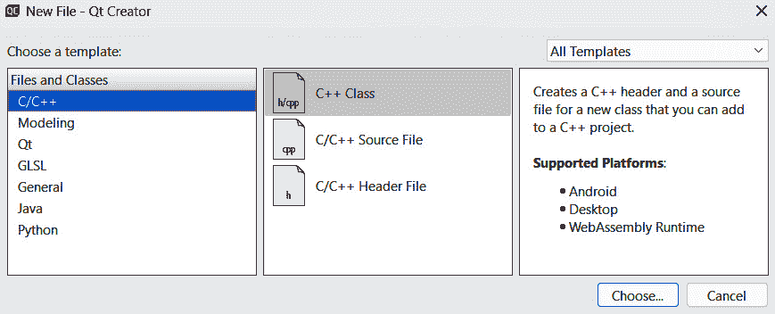

# 事件处理 – 信号和槽

Qt 6 中的信号和槽机制是其最重要的特性之一。这是一种允许对象之间通信的方法，这是程序图形用户界面的重要组成部分。任何 `QObject` 对象或其子类都可以发出信号，然后触发连接到该信号的任何对象的任何槽函数。

在本章中，我们将涵盖以下主要主题：

+   信号和槽概述

+   使用信号和槽处理 UI 事件

+   异步编程变得更容易

+   函数回调

# 技术要求

本章的技术要求包括 **Qt 6.6.1 MinGW 64-bit** 和 **Qt Creator 12.0.2**。本章中使用的所有代码都可以从以下 GitHub 仓库下载：[`github.com/PacktPublishing/QT6-C-GUI-Programming-Cookbook---Third-Edition-/tree/main/Chapter02`](https://github.com/PacktPublishing/QT6-C-GUI-Programming-Cookbook---Third-Edition-/tree/main/Chapter02)。

# 信号和槽概述

与 **回调**（Qt 6 也支持）相比，**信号和槽**机制对程序员来说更加流畅和灵活。它既类型安全，又没有与处理函数强耦合，这使得它比回调实现更好。

## 如何操作…

让我们按照以下步骤开始：

1.  让我们创建一个 `mainwindow.ui`。

1.  从 **小部件框** 将 **PushButton** 小部件拖放到 UI 画布上：


图 2.1 – 将推按钮拖放到 UI 画布上

1.  右键单击 **PushButton** 小部件并选择 **转到槽**。会出现一个窗口：


图 2.2 – 选择 clicked() 信号并按确定

1.  你将看到可用于推按钮的内置槽函数列表。让我们选择 `on_pushButton_clicked()`，它现在将出现在 `mainwindow.h` 和 `mainwindow.cpp` 中。在按下 `mainwindow.h` 后，Qt Creator 会自动将槽函数添加到你的源代码中，现在你应该能够在 `private` `slots` 关键字下看到一个额外的函数：

    ```cpp
    class MainWindow : public QMainWindow {
        Q_OBJECT
    public:
        explicit MainWindow(QWidget *parent = 0);
        ~MainWindow();
    private slots:
        void on_pushButton_clicked();
    private:
        Ui::MainWindow *ui;
    };
    ```

1.  同样，对于 `mainwindow.cpp`，其中已经为你添加了 `on_pushButton_clicked()` 函数：

    ```cpp
    void MainWindow::on_pushButton_clicked()
    {
    }
    ```

1.  现在，让我们将 `QMessageBox` 头文件添加到源文件的顶部：

    ```cpp
    #include <QMessageBox>
    ```

1.  然后，在 `on_pushButton_clicked()` 函数内添加以下代码：

    ```cpp
    void MainWindow::on_pushButton_clicked() {
        QMessageBox::information(this, «Hello», «Button has been clicked!»);
    }
    ```

1.  现在，构建并运行项目。然后，单击 **Push** 按钮；你应该能看到一个消息框弹出：


图 2.3 – 按下推按钮后弹出消息框

1.  接下来，我们想要创建自己的信号和槽函数。转到 **文件** | **新建文件或项目**，然后在 **文件和类** 类别下创建一个新的 C++ 类：



图 2.4 – 创建一个新的 C++ 类

1.  然后，我们需要将我们的类命名为 `MyClass` 并确保基类是 **QObject**：


图 2.5 – 定义你的自定义类，该类继承自 QObject 类

1.  一旦创建了类，打开 `myclass.h` 并添加以下代码，这里为了清晰起见进行了高亮：

    ```cpp
    #include <QObject>
    #include <QMainWindow>
    #include <QMessageBox>
    class MyClass : public QObject {
        Q_OBJECT
    public:
        explicit MyClass(QObject *parent = nullptr);
    public slots:
        void doSomething();
    };
    ```

1.  然后，打开 `myclass.cpp` 并实现 `doSomething()` 槽函数。我们将从上一个示例中复制消息框函数：

    ```cpp
    #include "myclass.h"
    MyClass::MyClass(QObject *parent) : QObject(parent) {}
    void MyClass::doSomething() {
        QMessageBox::information(this, «Hello», «Button has been clicked!»);
    }
    ```

1.  现在，打开 `mainwindow.h` 并在顶部包含 `myclass.h` 头文件：

    ```cpp
    #ifndef MAINWINDOW_H
    #define MAINWINDOW_H
    #include "myclass.h"
    namespace Ui {
    class MainWindow;
    }
    ```

1.  此外，在 `myclass.h` 中声明一个 `doNow()` 信号：

    ```cpp
    signals:
        void doNow();
    private slots:
        void on_pushButton_clicked();
    ```

1.  之后，打开 `mainwindow.cpp` 并定义一个 `MyClass` 对象。然后，我们将之前步骤中创建的 `doNow()` 信号与我们的 `doSomething()` 槽函数连接起来：

    ```cpp
    MainWindow::MainWindow(QWidget *parent) : QMainWindow(parent),
    ui(new Ui::MainWindow){
        ui->setupUi(this);
        MyClass* myclass = new MyClass;
        connect(this, &MainWindow::doNow, myclass, &MyClass::doSomething);
    }
    ```

1.  然后，我们必须将 `on_pushButton_clicked()` 函数的代码更改为如下所示：

    ```cpp
    void MainWindow::on_pushButton_clicked() {
        emit doNow();
    }
    ```

1.  如果现在构建并运行程序，您将得到一个类似于上一个示例的结果。然而，我们将消息框代码放置在了 `MyClass` 对象中，而不是在 `MainWindow` 中。

前面的步骤展示了我们如何利用 Qt 6 中的槽和信号功能，轻松地将小部件动作链接到事件函数。这真的非常简单。

## 它是如何工作的...

在 Qt 的最新版本中，信号和槽机制经历了一些变化，最显著的是其编码语法。Qt 6 不再支持旧语法；因此，如果您正在尝试将旧的 Qt 5 项目移植到 Qt 6，您必须更改代码以符合新的语法。

在那个美好的旧时光里，我们通常会像这样将一个信号连接到一个槽上：

```cpp
connect(
    sender, SIGNAL(valueChanged(QString)),
    receiver, SLOT(updateValue(QString))
);
```

然而，从那时起，事情发生了一些变化。在新语法中，`SIGNAL` 和 `SLOT` 宏已经不再使用，您必须指定您对象的数据类型，如下面的代码所示：

```cpp
connect(
    sender, &Sender::valueChanged,
    receiver, &Receiver::updateValue
);
```

新语法还允许您直接将信号连接到一个函数，而不是 `QObject`：

```cpp
connect(
    sender, &Sender::valueChanged, myFunction
);
```

此外，您还可以将信号连接到一个 **lambda 表达式**。我们将在 *Asynchronous programming made* *easier* 菜谱中更多地讨论这一点。

注意

一个 `任意` 类的信号可以触发一个与之无关的类的任何私有槽，这在回调中是不可能的。

## 还有更多...

所有 Qt 项目都附带一个以 `.pro` 扩展名的项目文件。这个项目文件专门用于 Qt 自身的 **qmake** 构建系统，它通过使用直接的声明性风格，定义标准变量来指示项目中使用的源文件和头文件，从而帮助简化了大多数复杂的构建过程。

有一个名为`CMakeLists.txt`的替代构建系统，与 Qt Creator 一起使用，它将以使用 Qt 项目文件相同的方式打开项目。然而，不建议初学者在用 Qt 开发他们的第一个应用程序时使用 CMake，因为 CMake 更加手动，并且需要更长的时间来掌握其功能。

注意

要了解更多关于 CMake 的信息，请访问[`doc.qt.io/qt-6/cmake-get-started.html`](https://doc.qt.io/qt-6/cmake-get-started.html)。

Qt 将它的特性和功能以模块和类的形式进行分类。每个模块都包含一组相关的功能，可以在需要时单独添加到您的项目中。这允许程序员保持他们的程序在最佳大小和性能。Qt 核心和 Qt GUI 模块默认包含在每一个 Qt 项目中。要添加额外的模块，您只需将模块关键字添加到您的 Qt 项目文件中，或者如果您使用 CMake 进行项目，则在`CMakeLists.txt`中添加包并链接其库。

例如，如果我想将 Qt 的`Network`模块添加到我的项目中，我将在我的 Qt 项目文件中添加以下关键字：

```cpp
QT += network
```

然而，在 CMake 中，这会稍微长一些：

```cpp
find_package(Qt6 REQUIRED COMPONENTS Network)
target_link_libraries(mytarget PRIVATE Qt6::Network)
```

在您添加了 Qt 的`Network`模块之后，现在您可以访问其 C++类，如`QNetworkAccessManager`、`QNetworkInterface`、`QNetworkRequest`等。这种模块化方法为 Qt 创建了一个可扩展的生态系统，同时允许开发者轻松地维护这个复杂而强大的框架。

注意

要了解更多关于所有不同的 Qt 模块的信息，请访问[`doc.qt.io/qt.html`](https://doc.qt.io/qt.html)。

# 使用信号和槽的 UI 事件

在上一个示例中，我们演示了在按钮上使用信号和槽的方法。现在，让我们探索其他常见小部件类型中可用的信号和槽。

## 如何做到这一点...

要学习如何使用信号和槽处理 UI 事件，请按照以下步骤操作：

1.  让我们创建一个新的**Qt Widgets** **应用程序**项目。

1.  从**小部件框**中将**按钮**、**组合框**、**行编辑**、**微调框**和**滑块**小部件拖放到您的 UI 画布上：


图 2.6 – 在 UI 画布上放置多个小部件

1.  然后，右键单击按钮，选择**clicked()**，然后按**确定**按钮继续。Qt Creator 将为您创建一个槽函数：


图 2.7 – 选择 clicked()信号并按确定

1.  重复前面的步骤，但这次选择下一个选择，直到将`QAbstractButton`中的每个函数都添加到源代码中：

    ```cpp
    void on_pushButton_clicked();
    void on_pushButton_clicked(bool checked);
    void on_pushButton_pressed();
    void on_pushButton_released();
    void on_pushButton_toggled(bool checked);
    ```

1.  接下来，在组合框上重复相同的步骤，直到将`QComboBox`类下的所有槽函数都添加到源代码中：

    ```cpp
    void on_comboBox_activated(const QString &arg1);
    void on_comboBox_activated(int index);
    void on_comboBox_currentIndexChanged(const QString &arg1);
    void on_comboBox_currentIndexChanged(int index);
    void on_comboBox_currentTextChanged(const QString &arg1);
    void on_comboBox_editTextChanged(const QString &arg1);
    void on_comboBox_highlighted(const QString &arg1);
    void on_comboBox_highlighted(int index);
    ```

1.  对于`lineEdit`也是如此，它们都属于`QLineEdit`类：

    ```cpp
    void on_lineEdit_cursorPositionChanged(int arg1, int arg2);
    void on_lineEdit_editingFinished();
    void on_lineEdit_returnPressed();
    void on_lineEdit_selectionChanged();
    void on_lineEdit_textChanged(const QString &arg1);
    void on_lineEdit_textEdited(const QString &arg1);
    ```

1.  之后，为我们的`spin box`小部件也添加来自`QSpinBox`类的槽函数，它相对较短：

    ```cpp
    void on_spinBox_valueChanged(const QString &arg1);
    void on_spinBox_valueChanged(int arg1);
    ```

1.  最后，对我们的`slider`小部件重复相同的步骤，得到类似的结果：

    ```cpp
    void on_horizontalSlider_actionTriggered(int action);
    void on_horizontalSlider_rangeChanged(int min, int max);
    void on_horizontalSlider_sliderMoved(int position);
    void on_horizontalSlider_sliderPressed();
    void on_horizontalSlider_sliderReleased();
    void on_horizontalSlider_valueChanged(int value);
    ```

1.  完成这些后，打开`mainwindow.h`并添加`QDebug`头文件，如下代码所示：

    ```cpp
    #ifndef MAINWINDOW_H
    #define MAINWINDOW_H
    #include <QMainWindow>
    #include <QDebug>
    namespace Ui {
    class MainWindow;
    }
    ```

1.  让我们实现我们的按钮的槽函数：

    ```cpp
    void MainWindow::on_pushButton_clicked() {
        qDebug() << «Push button clicked»;
    }
    void MainWindow::on_pushButton_clicked(bool checked) {
        qDebug() << «Push button clicked: « << checked;
    }
    void MainWindow::on_pushButton_pressed() {
        qDebug() << «Push button pressed»;
    }
    void MainWindow::on_pushButton_released() {
        qDebug() << «Push button released»;
    }
    void MainWindow::on_pushButton_toggled(bool checked) {
        qDebug() << «Push button toggled: « << checked;
    }
    ```

1.  如果你现在构建并运行项目，然后点击按钮，你会看到打印出不同的状态，但时间略有不同。这是由于在整个点击过程中不同动作发出不同信号造成的：

```cpp
Push button pressed
Push button released
Push button clicked
Push button clicked: false
```

1.  接下来，我们将转向组合框。由于默认的组合框是空的，让我们通过在`mainwindow.ui`中双击它并添加弹出窗口中显示的选项来向其中添加一些选项：


图 2.8 – 向组合框添加更多选项

1.  然后，让我们在`mainwindow.cpp`中实现组合框的槽函数：

    ```cpp
    void MainWindow::on_comboBox_activated(const QString &arg1) {
        qDebug() << «Combo box activated: « << arg1;
    }
    void MainWindow::on_comboBox_activated(int index) {
        qDebug() << «Combo box activated: « << index;
    }
    void MainWindow::on_comboBox_currentIndexChanged(const QString &arg1) {
        qDebug() << «Combo box current index changed: « << arg1;
    }
    void MainWindow::on_comboBox_currentIndexChanged(int index) {
        qDebug() << «Combo box current index changed: « << index;
    }
    ```

1.  我们将继续实现组合框的其余槽函数：

    ```cpp
    void MainWindow::on_comboBox_currentTextChanged(const QString &arg1) {
        qDebug() << «Combo box current text changed: « << arg1;
    }
    void MainWindow::on_comboBox_editTextChanged(const QString
    &arg1) {
        qDebug() << «Combo box edit text changed: « << arg1;
    }
    void MainWindow::on_comboBox_highlighted(const QString &arg1) {
        qDebug() << «Combo box highlighted: « << arg1;
    }
    void MainWindow::on_comboBox_highlighted(int index) {
        qDebug() << «Combo box highlighted: « << index;
    }
    ```

1.  构建并运行项目。然后，尝试点击组合框，悬停在其他选项上，并通过点击选择一个选项。你应该在你的调试输出中看到类似以下的结果：

    ```cpp
    Combo box highlighted: 0
    Combo box highlighted: "Option One"
    Combo box highlighted: 1
    Combo box highlighted: "Option Two"
    Combo box highlighted: 2
    Combo box highlighted: "Option Three"
    Combo box current index changed: 2
    Combo box current index changed: "Option Three"
    Combo box current text changed: "Option Three"
    Combo box activated: 2
    Combo box activated: "Option Three"
    ```

1.  接下来，我们将转向行编辑并实现其槽函数，如下代码所示：

    ```cpp
    void MainWindow::on_lineEdit_cursorPositionChanged(int arg1, int arg2) {
        qDebug() << «Line edit cursor position changed: « << arg1 << arg2;
    }
    void MainWindow::on_lineEdit_editingFinished() {
        qDebug() << «Line edit editing finished»;
    }
    void MainWindow::on_lineEdit_returnPressed() {
        qDebug() << «Line edit return pressed»;
    }
    ```

1.  我们将继续实现行编辑的其余槽函数：

    ```cpp
    void MainWindow::on_lineEdit_selectionChanged() {
        qDebug() << «Line edit selection changed»;
    }
    void MainWindow::on_lineEdit_textChanged(const QString &arg1) {
        qDebug() << «Line edit text changed: « << arg1;
    }
    void MainWindow::on_lineEdit_textEdited(const QString &arg1) {
        qDebug() << «Line edit text edited: « << arg1;
    }
    ```

1.  构建并运行项目。然后，点击行编辑并输入`Hey`。你应该在调试输出面板中看到类似以下的结果：

    ```cpp
    Line edit cursor position changed: -1 0
    Line edit text edited: "H"
    Line edit text changed: "H"
    Line edit cursor position changed: 0 1
    Line edit text edited: "He"
    Line edit text changed: "He"
    Line edit cursor position changed: 1 2
    Line edit text edited: "Hey"
    Line edit text changed: "Hey"
    Line edit cursor position changed: 2 3
    Line edit editing finished
    ```

1.  之后，我们需要实现滑块小部件的槽函数，如下代码所示：

    ```cpp
    void MainWindow::on_spinBox_valueChanged(const QString &arg1){
        qDebug() << «Spin box value changed: « << arg1;
    }
    void MainWindow::on_spinBox_valueChanged(int arg1) {
        qDebug() << «Spin box value changed: « << arg1;
    }
    ```

1.  尝试构建并运行程序。然后，点击滑块上的箭头按钮，或直接在框中编辑值 - 你应该得到类似以下的结果：

    ```cpp
    Spin box value changed: "1"
    Spin box value changed: 1
    Spin box value changed: "2"
    Spin box value changed: 2
    Spin box value changed: "3"
    Spin box value changed: 3
    Spin box value changed: "2"
    Spin box value changed: 2
    Spin box value changed: "20"
    Spin box value changed: 20
    ```

1.  最后，我们将实现水平滑块小部件的槽函数：

    ```cpp
    void MainWindow::on_horizontalSlider_actionTriggered(int
    action) {
        qDebug() << «Slider action triggered» << action;
    }
    void MainWindow::on_horizontalSlider_rangeChanged(int min, int max) {
        qDebug() << «Slider range changed: « << min << max;
    }
    void MainWindow::on_horizontalSlider_sliderMoved(int position)
    {
        qDebug() << «Slider moved: « << position;
    }
    ```

1.  继续实现滑块的槽函数，如下代码所示：

    ```cpp
    void MainWindow::on_horizontalSlider_sliderPressed() {
        qDebug() << «Slider pressed»;
    }
    void MainWindow::on_horizontalSlider_sliderReleased() {
        qDebug() << «Slider released»;
    }
    void MainWindow::on_horizontalSlider_valueChanged(int value) {
        qDebug() << «Slider value changed: « << value;
    }
    ```

1.  构建并运行程序。然后，点击并拖动滑块向左或向右 - 你应该看到类似以下的结果：

    ```cpp
    Slider pressed
    Slider moved: 1
    Slider action triggered 7
    Slider value changed: 1
    Slider moved: 2
    Slider action triggered 7
    Slider value changed: 2
    Slider moved: 3
    Slider action triggered 7
    Slider value changed: 3
    Slider moved: 4
    Slider action triggered 7
    Slider value changed: 4
    Slider released
    ```

几乎每个小部件都有一组与其使用或目的相关的槽函数。例如，一个按钮在被按下或释放时将开始发出触发其相关槽函数的信号。这些定义小部件的预期行为具有在用户触发动作时被调用的槽函数。作为程序员，我们只需要实现槽函数并告诉 Qt 当这些槽函数被触发时应该做什么。

# 异步编程变得更容易

由于信号和槽机制本质上是**异步的**，我们可以用它来做除了用户界面之外的事情。在编程术语中，**异步操作**是一个独立工作的过程，允许程序在不需要等待该过程完成的情况下继续其操作，这可能会使整个程序停滞。Qt 6 允许你利用其信号和槽机制轻松实现异步过程，而不需要付出太多努力。在 Qt 6 强制实施信号和槽的新语法之后，这一点更是如此，它允许信号触发一个普通函数，而不是从 `Qobject` 对象的槽函数。

在以下示例中，我们将进一步探索这个机会，并学习我们如何通过使用 Qt 6 提供的信号和槽机制中的异步操作来提高我们程序的功效。

## 如何做到这一点...

要了解如何使用信号和槽机制实现异步操作，请遵循以下示例：

1.  创建一个 **Qt 控制台应用程序** 项目：


图 2.9 – 创建新的 Qt 控制台应用程序项目

1.  这种类型的项目只会为你提供一个 `main.cpp` 文件，而不是像我们之前的示例项目那样提供 `mainwindow.h` 和 `mainwindow.cpp`。让我们打开 `main.cpp` 并向其中添加以下头文件：

    ```cpp
    #include <QNetworkAccessManager>
    #include <QNetworkReply>
    #include <QDebug>
    ```

1.  然后，将以下代码添加到我们的 `main()` 函数中。我们将使用 `QNetworkAccessManager` 类来向以下网页 URL 发起 `GET` 请求：

    ```cpp
    int main(int argc, char *argv[]) {
        QCoreApplication a(argc, argv);
        QString *html = new QString;
        qDebug() << "Start";
        QNetworkAccessManager manager;
        QNetworkRequest req(QUrl("http://www.dustyfeet.com"));
        QNetworkReply* reply = manager.get(req);
    ```

1.  然后，我们使用 C++11 的 `QNetworkReply` 信号内联函数：

    ```cpp
    QObject::connect(reply, &QNetworkReply::readyRead,
     [reply, html]() {
             html->append(QString(reply->readAll()));
         });
         QObject::connect(reply, &QNetworkReply::downloadProgress, reply {
             qDebug() << "Progress: " << bytesReceived << "bytes /" << bytesTotal << "bytes";
         });
    ```

1.  我们还可以使用 lambda 表达式与 `connect()` 一起调用不在 `QObject` 类下的函数：

    ```cpp
    QObject::connect(reply, &QNetworkReply::finished, [=]() {
            printHTML(*html);
        });
        return a.exec();
    }
    ```

1.  最后，我们定义 `printHTML()` 函数，如下所示：

    ```cpp
    void printHTML(QString html) {
        qDebug() << "Done";
        qDebug() << html;
    }
    ```

1.  如果你现在构建并运行程序，你会看到即使没有声明任何槽函数，它也是可用的。**Lambda 表达式**使声明槽函数成为可选的，但只有在你的代码真的很短的情况下才推荐这样做：


图 2.10 – 在终端窗口中打印 HTML 源代码

1.  如果你在构建并运行你的 Qt 控制台应用程序项目后终端窗口没有出现，请转到 **编辑** | **首选项** | **构建和运行** 并选择 **启用** 选项的 **默认“运行在”终端**。


图 2.11 – 从首选项设置中启用终端窗口

上述示例演示了如何在网络回复槽函数中运行 lambda 函数。这样，我们可以确保我们的代码更短，更容易调试，但 lambda 函数仅适用于函数只打算调用一次的情况。

## 它是如何工作的...

上述示例是一个非常简单的应用程序，展示了使用 lambda 表达式连接信号与 lambda 函数或普通函数，而不需要声明任何槽函数，因此不需要从 `QObject` 类继承。

这对于调用不在 UI 对象下的异步过程特别有用。Lambda 表达式是在另一个函数内部匿名定义的函数，这与 **JavaScript** 中的匿名函数非常相似。Lambda 函数的格式如下：

```cpp
captured variables {
    lambda code
}
```

你可以通过将它们放入 `捕获变量` 部分来将变量插入 lambda 表达式，就像我们在本食谱的示例项目中做的那样。我们捕获了名为 `reply` 的 `QNetworkReply` 对象和名为 `html` 的 `QString` 对象，并将它们放入我们的 lambda 表达式中。

然后，我们可以在我们的 lambda 代码中使用这些变量，如下面的代码所示：

```cpp
[reply, html]() {
    html->append(QString(reply->readAll()));
}
```

参数部分类似于一个普通函数，其中你输入值到参数中，并在你的 lambda 代码中使用它们。在这种情况下，`bytesReceived` 和 `bytesTotal` 的值来自 `downloadProgress` 信号：

```cpp
QObject::connect(reply, &QNetworkReply::downloadProgress,
reply {
    qDebug() << "Progress: " << bytesReceived << "bytes /" << bytesTotal << "bytes";
});
```

你也可以使用 `=` 符号捕获你函数中使用的所有变量。在这种情况下，我们捕获了 `html` 变量，而没有在 `捕获变量` 区域中指定它：

```cpp
[=]() {
    printHTML(*html);
}
```

# 函数回调

尽管 Qt 6 支持信号和槽机制，但 Qt 6 中的一些功能仍然使用 **函数回调**，例如键盘输入、窗口调整大小、图形绘制等。由于这些事件只需要实现一次，因此不需要使用信号和槽机制。

## 如何做到这一点…

让我们从以下示例开始：

1.  创建一个 `mainwindow.h` 文件，并添加以下头文件：

    ```cpp
    #include <QDebug>
    #include <QResizeEvent>
    #include <QKeyEvent>
    #include <QMouseEvent>
    ```

1.  然后，在 `mainwindow.h` 中声明这些函数：

    ```cpp
    public:
        explicit MainWindow(QWidget *parent = 0);
        ~MainWindow();
        void resizeEvent(QResizeEvent *event);
        void keyPressEvent(QKeyEvent *event);
        void keyReleaseEvent(QKeyEvent *event);
        void mouseMoveEvent(QMouseEvent *event);
        void mousePressEvent(QMouseEvent *event);
    mainwindow.cpp and add the following code to the class constructor:

    ```

    MainWindow::MainWindow(QWidget *parent) : QMainWindow(parent),

    ui(new Ui::MainWindow) {

    ui->setupUi(this);

    this->setMouseTracking(true);

    ui->centralWidget->setMouseTracking(true);

    }

    ```cpp

    ```

1.  然后，定义 `resizeEvent()` 和 `keyPressedEvent()` 函数：

    ```cpp
    void MainWindow::resizeEvent(QResizeEvent *event) {
        qDebug() << "Old size:" << event->oldSize() << ", New size:" << event->size();
    }
    void MainWindow::keyPressEvent(QKeyEvent *event) {
        if (event->key() == Qt::Key_Escape) {
            this->close();
        }
        qDebug() << event->text() << "has been pressed";
    }
    ```

1.  继续实现其余的函数：

    ```cpp
    void MainWindow::keyReleaseEvent(QKeyEvent *event) {
        qDebug() << event->text() << "has been released";
    }
    void MainWindow::mouseMoveEvent(QMouseEvent *event) {
        qDebug() << "Position: " << event->pos();
    }
    void MainWindow::mousePressEvent(QMouseEvent *event) {
        qDebug() << "Mouse pressed:" << event->button();
    }
    void MainWindow::mouseReleaseEvent(QMouseEvent *event) {
        qDebug() << "Mouse released:" << event->button();
    }
    ```

1.  编译并运行程序。然后，尝试移动鼠标，调整主窗口的大小，按下键盘上的随机键，最后按下键盘上的 *Esc* 键来关闭程序。

你应该能看到类似于在应用程序输出窗口中打印出的调试文本：

```cpp
Old size: QSize(-1, -1) , New size: QSize(400, 300)
Old size: QSize(400, 300) , New size: QSize(401, 300)
Old size: QSize(401, 300) , New size: QSize(402, 300)
Position: QPoint(465,348)
Position: QPoint(438,323)
Position: QPoint(433,317)
"a" has been pressed
"a" has been released
"r" has been pressed
"r" has been released
"d" has been pressed
"d" has been released
"\u001B" has been pressed
```

## 它是如何工作的…

Qt 6 对象，尤其是主窗口，有十几个内置的回调函数，它们作为 **虚函数** 存在。这些函数可以在被调用时覆盖以执行你期望的行为。Qt 6 可能在其预期条件满足时调用这些 **回调函数**，例如键盘按钮被按下、鼠标光标被移动、窗口被调整大小等。

我们在 `mainwindow.h` 文件中声明的函数是 `QWidget` 类中内置的虚函数。我们只是用我们自己的代码覆盖它们，以定义它们被调用时的新行为。

注意

请务必注意，为了使 `mouseMoveEvent()` 回调正常工作，您必须对 `MainWindow` 和 `centralWidget` 都调用 `setMouseTracking(true)`。

没有诸如函数回调、信号和槽等特性，我们作为程序员将更难开发出响应迅速且易于使用的应用程序。Qt 6 缩短了我们的开发周期，并允许我们更多地专注于设计用户友好的应用程序。
