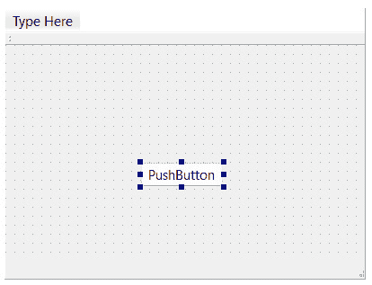
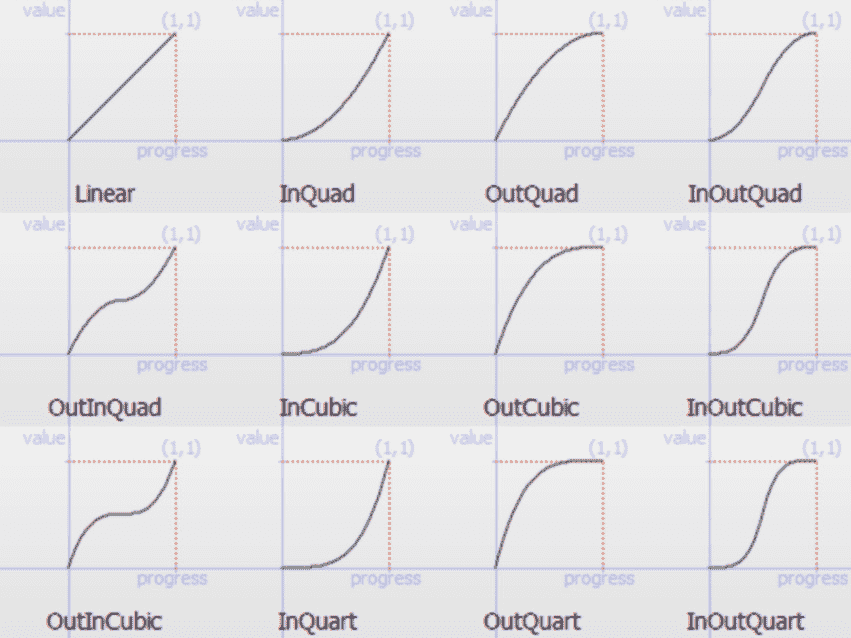
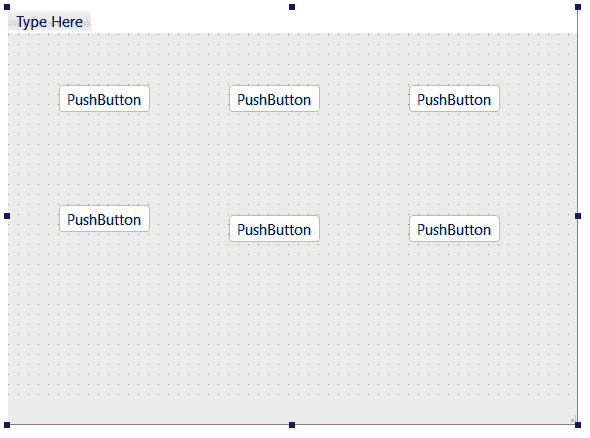
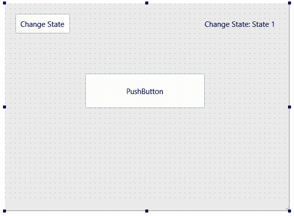
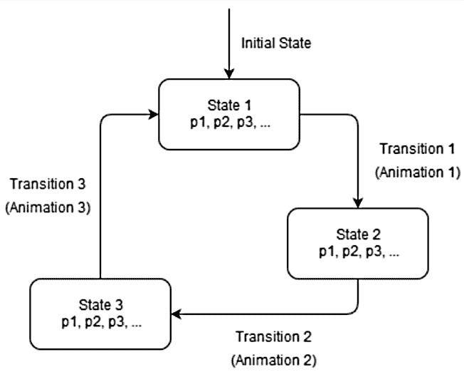
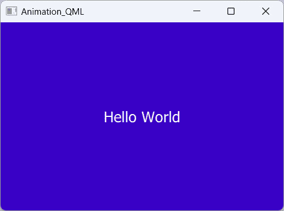
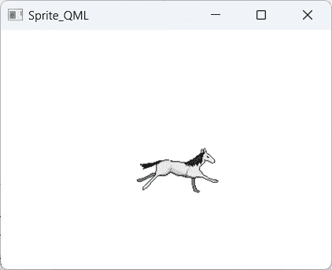

# 使用 Qt 和 QML 的状态和动画

Qt 通过其强大的动画框架提供了一个简单的方法来动画化小部件或任何继承自 `QObject` 类的其他对象。动画可以单独使用，也可以与 **状态机框架** 一起使用，这允许根据小部件的当前活动状态播放不同的动画。Qt 的动画框架还支持分组动画，允许您同时移动多个图形项或按顺序依次移动它们。

在本章中，我们将涵盖以下主要主题：

+   Qt 中的属性动画

+   使用缓动曲线控制属性动画

+   创建动画组

+   创建嵌套动画组

+   Qt 中的状态机

+   QML 中的状态、转换和动画

+   使用动画器动画化小部件属性

+   精灵动画

# 技术要求

本章的技术要求包括 **Qt 6.6.1 MinGW 64-bit**、**Qt Creator 12.0.2** 和 Windows 11。本章中使用的所有代码都可以从以下 GitHub 仓库下载：[`github.com/PacktPublishing/QT6-C-GUI-Programming-Cookbook---Third-Edition-/tree/main/Chapter03`](https://github.com/PacktPublishing/QT6-C-GUI-Programming-Cookbook---Third-Edition-/tree/main/Chapter03)。

# Qt 中的属性动画

在本例中，我们将学习如何动画化我们的 `属性动画` 类，这是其强大的动画框架的一部分，允许我们以最小的努力创建流畅的动画。

## 如何做到这一点...

在以下示例中，我们将创建一个新的小部件项目，并通过更改其属性来动画化按钮：

1.  让我们使用 Qt Designer 创建一个新的 `mainwindow.ui`，并在主窗口上放置一个按钮，如图所示：



图 3.1 – 将按钮拖放到 UI 画布上

1.  打开 `mainwindow.cpp` 并在源代码开头添加以下代码行：

    ```cpp
    #include <QPropertyAnimation>
    ```

1.  然后，打开 `mainwindow.cpp` 并在构造函数中添加以下代码：

    ```cpp
    QPropertyAnimation *animation = new
    QPropertyAnimation(ui->pushButton, "geometry");
    animation->setDuration(10000);
    animation->setStartValue(ui->pushButton->geometry());
    animation->setEndValue(QRect(200, 200, 100, 50));
    animation->start();
    ```

## 它是如何工作的...

动画化 GUI 元素的一种更常见的方法是通过 Qt 提供的属性动画类，称为 `QPropertyAnimation` 类。这个类是动画框架的一部分，它利用 Qt 中的计时器系统来改变 GUI 元素的属性。

我们在这里试图实现的是在动画按钮从一个位置移动到另一个位置的同时，沿着路径扩大按钮的大小。通过在 *步骤 2* 中的源代码中包含 `QPropertyAnimation` 头文件，我们将能够访问 Qt 提供的 `QPropertyAnimation` 类并利用其功能。

*步骤 3* 中的代码基本上创建了一个新的 *属性动画* 并将其应用于 `属性动画` 类，它更改了 *按钮* 的几何属性，并将其持续时间设置为 3,000 毫秒（3 秒）。

然后，动画的起始值被设置为*按钮*的初始几何形状，因为显然我们希望它从我们在 Qt Designer 中最初放置按钮的位置开始。然后，`end`值被设置为我们希望它变成的样子；在这种情况下，我们将按钮移动到新的位置`x: 200`和`y: 200`，并在移动过程中改变其大小为`width: 100`和`height: 50`。

之后，调用`animation` | `start()`来开始动画。编译并运行项目。你应该看到按钮开始缓慢地在主窗口中移动，同时每次稍微扩大一点，直到到达目的地。你可以通过更改前面代码中的值来改变动画持续时间、目标位置和缩放。使用 Qt 的属性动画系统来动画化 GUI 元素真的非常简单！

## 还有更多...

Qt 为我们提供了几个不同的子系统来为我们的 GUI 创建动画，包括计时器、时间线、动画框架、状态机框架和图形视图框架：

+   `事件回调`函数将通过 Qt 的*信号-槽*机制被触发。你可以使用计时器在给定的时间间隔内改变 GUI 元素的属性（颜色、位置、缩放等）以创建动画。

+   **时间线**：*时间线*定期调用槽来动画化一个 GUI 元素。它与*重复计时器*非常相似，但当槽被触发时，它不会一直做同样的事情，而是向槽提供一个值来指示其当前帧索引，这样你就可以根据给定的值做不同的事情（例如，偏移到精灵图的另一个空间）。

+   **动画框架**：*动画框架*通过允许其属性动画化，使动画化 GUI 元素变得简单。动画是通过使用*缓动曲线*来控制的。缓动曲线描述了一个函数，它控制动画的速度应该是什么，从而产生不同的加速和减速模式。Qt 支持的缓动曲线类型包括线性、二次、三次、四次、正弦、指数、圆形和弹性。

+   **状态机框架**：Qt 为我们提供了创建和执行状态图的类，允许每个 GUI 元素在由信号触发时从一个状态移动到另一个状态。*状态机框架*中的*状态图*是分层的，这意味着每个状态也可以嵌套在其他状态内部。

+   **图形视图框架**：*图形视图框架*是一个强大的图形引擎，用于可视化与大量自定义的 2D 图形元素交互。如果你是一个经验丰富的程序员，你可以使用图形视图框架来绘制你的 GUI，并以完全手动的方式使它们动画化。

通过利用我们在这里提到的所有强大功能，我们可以轻松地创建直观且现代的 GUI。在本章中，我们将探讨使用 Qt 动画化 GUI 元素的实际方法。

# 使用缓动曲线控制属性动画

在这个例子中，我们将学习如何通过利用**缓动曲线**使我们的动画更有趣。我们仍然会使用之前的源代码，该代码使用属性动画来动画化一个按钮。

## 如何实现...

在以下示例中，我们将学习如何将一个**缓动曲线**添加到我们的动画中：

1.  在调用`start()`函数之前，定义一个缓动曲线并将其添加到属性动画中：

    ```cpp
    QPropertyAnimation *animation = new
    QPropertyAnimation(ui->pushButton, "geometry");
    animation->setDuration(3000);
    animation->setStartValue(ui->pushButton->geometry());
    animation->setEndValue(QRect(200, 200, 100, 50));
    QEasingCurve curve;
    curve.setType(QEasingCurve::OutBounce);
    animation->setEasingCurve(curve);
    animation->start();
    ```

1.  调用`setLoopCount()`函数来设置它重复的次数：

    ```cpp
    QPropertyAnimation *animation = new
    QPropertyAnimation(ui->pushButton, "geometry");
    animation->setDuration(3000);
    animation->setStartValue(ui->pushButton->geometry());
    animation->setEndValue(QRect(200, 200, 100, 50));
    QEasingCurve curve;
    curve.setType(EasingCurve::OutBounce);
    animation->setEasingCurve(curve);
    animation->setLoopCount(2);
    animation->start();
    ```

1.  在应用缓动曲线到动画之前，调用`setAmplitude()`、`setOvershoot()`和`setPeriod()`：

    ```cpp
    QEasingCurve curve;
    curve.setType(QEasingCurve::OutBounce);
    curve.setAmplitude(1.00);
    curve.setOvershoot(1.70);
    curve.setPeriod(0.30);
    animation->setEasingCurve(curve);
    animation->start();
    ```

在 Qt 6 中使用内置的缓动曲线来动画化小部件或任何对象真的非常简单。

## 它是如何工作的...

要让缓动曲线控制动画，你只需要定义一个缓动曲线并将其添加到属性动画中，在调用`start()`函数之前。你也可以尝试几种其他类型的缓动曲线，看看哪一种最适合你。以下是一个示例：

```cpp
animation->setEasingCurve(QEasingCurve::OutBounce);
```

如果你希望动画在播放完毕后循环，你可以调用`setLoopCount()`函数来设置它重复的次数，或者将值设置为`-1`以实现无限循环：

```cpp
animation->setLoopCount(-1);
```

在应用属性动画之前，你可以设置几个参数来细化缓动曲线。这些参数包括**振幅**、**超调**和**周期**：

+   **振幅**：振幅越高，动画中应用的弹跳或弹性弹簧效果就越明显。

+   **超调**：由于阻尼效应，某些曲线函数会产生**超调**（超过其最终值）曲线。通过调整超调值，我们可以增加或减少这种效果。

+   **周期**：设置较小的周期值会给曲线带来高频率。较大的**周期**会给它带来低频率。

然而，这些参数并不适用于所有曲线类型。请参阅 Qt 文档以了解哪些参数适用于哪些曲线类型。

## 更多内容...

虽然属性动画工作得很好，但有时看着一个 GUI 元素以恒定速度动画化会显得有点无聊。我们可以通过添加一个**缓动曲线**来控制运动，使动画看起来更有趣。Qt 中有许多类型的缓动曲线可供使用，以下是一些：



图 3.2 – Qt 6 支持的缓动曲线类型

如前图所示，每种缓动曲线都会产生不同的**加速**和**减速**效果。

注意

有关 Qt 中可用的完整缓动曲线列表，请参阅 Qt 文档中的[`doc.qt.io/qt-6/qeasingcurve.html#Type-enum`](http://doc.qt.io/qt-6/qeasingcurve.html#Type-enum)。

# 创建动画组

在本例中，我们将学习如何使用**动画组**来管理组内包含的动画的状态。

## 如何做到这一点…

让我们按照以下步骤创建一个**动画组**：

1.  我们将使用之前的示例，但这次，我们将向主窗口添加两个更多的推送按钮，如下面的截图所示：


图 3.3 – 向主窗口添加三个推送按钮

1.  在主窗口的构造函数中为每个推送按钮定义**动画**：

    ```cpp
    QPropertyAnimation *animation1 = new
    QPropertyAnimation(ui->pushButton, "geometry");
    animation1->setDuration(3000);
    animation1->setStartValue(ui->pushButton->geometry());
    animation1->setEndValue(QRect(50, 200, 100, 50));
    QPropertyAnimation *animation2 = new
    QPropertyAnimation(ui->pushButton_2, "geometry");
    animation2->setDuration(3000);
    animation2->setStartValue(ui->pushButton_2->geometry());
    animation2->setEndValue(QRect(150, 200, 100, 50));
    QPropertyAnimation *animation3 = new
    QPropertyAnimation(ui->pushButton_3, "geometry");
    animation3->setDuration(3000);
    animation3->setStartValue(ui->pushButton_3->geometry());
    animation3->setEndValue(QRect(250, 200, 100, 50));
    ```

1.  创建一个**缓动曲线**并将相同的曲线应用于所有三个动画：

    ```cpp
    QEasingCurve curve;
    curve.setType(QEasingCurve::OutBounce);
    curve.setAmplitude(1.00);
    curve.setOvershoot(1.70);
    curve.setPeriod(0.30);
    animation1->setEasingCurve(curve);
    animation2->setEasingCurve(curve);
    animation3->setEasingCurve(curve);
    ```

1.  在将缓动曲线应用于所有三个动画后，我们将创建一个**动画组**并将所有三个动画添加到组中：

    ```cpp
    QParallelAnimationGroup *group = new QParallelAnimationGroup;
    group->addAnimation(animation1);
    group->addAnimation(animation2);
    group->addAnimation(animation3);
    ```

1.  从我们刚刚创建的动画组中调用`start()`函数：

    ```cpp
    group->start();
    ```

## 它是如何工作的…

Qt 允许我们创建多个动画并将它们组合成一个动画组。组通常负责管理其动画的状态（即，它决定何时开始、停止、恢复和暂停它们）。目前，Qt 为动画组提供了两种类型的类：`QParallelAnimationGroup`和`QSequentialAnimationGroup`：

+   `QParallelAnimationGroup`：正如其名称所暗示的，一个**并行动画组**同时运行其组中的所有动画。当持续时间最长的动画完成后，组被认为是完成的。

+   `QSequentialAnimationGroup`：一个**顺序动画组**按顺序运行其动画，这意味着它一次只运行一个动画，并且只有当前动画完成后才会播放下一个动画。

## 还有更多…

由于我们现在正在使用动画组，我们不再从单个动画中调用`start()`函数。相反，我们将从我们刚刚创建的动画组中调用`start()`函数。如果您现在编译并运行示例，您将看到所有三个按钮同时播放。这是因为我们正在使用**并行**动画组。您可以用**顺序**动画组替换它，并再次运行示例：

```cpp
QSequentialAnimationGroup *group = new QSequentialAnimationGroup;
```

这次，只有单个按钮会播放其动画，而其他按钮将耐心等待它们的轮到。优先级是根据哪个动画首先添加到动画组中而设置的。您可以通过简单地重新排列要添加到组中的动画的顺序来更改动画顺序。例如，如果我们想按钮`3`首先开始动画，然后是按钮`2`，最后是按钮`1`，代码将如下所示：

```cpp
group->addAnimation(animation3);
group->addAnimation(animation2);
group->addAnimation(animation1);
```

由于属性动画和动画组都继承自`QAbstractAnimator`类，这意味着你还可以将一个动画组添加到另一个动画组中，以形成一个更复杂、嵌套的动画组。

# 创建嵌套动画组

使用**嵌套动画组**的一个好例子是当你有几个**并行**动画组，并且你想按顺序播放这些组时。

## 如何做到这一点…

让我们按照以下步骤创建一个**嵌套动画组**，以顺序播放不同的动画组：

1.  我们将使用前一个示例中的 UI，并在主窗口中添加更多按钮，如下所示：



图 3.4 – 这次我们需要更多的按钮

1.  为按钮创建所有动画，然后创建一个缓动曲线并将其应用于所有动画：

    ```cpp
    QPropertyAnimation *animation1 = new
    QPropertyAnimation(ui->pushButton, "geometry");
    animation1->setDuration(3000);
    animation1->setStartValue(ui->pushButton->geometry());
    animation1->setEndValue(QRect(50, 50, 100, 50));
    QPropertyAnimation *animation2 = new
    QPropertyAnimation(ui->pushButton_2, "geometry");
    animation2->setDuration(3000);
    animation2->setStartValue(ui->pushButton_2->geometry());
    animation2->setEndValue(QRect(150, 50, 100, 50));
    QPropertyAnimation *animation3 = new
    QPropertyAnimation(ui->pushButton_3, "geometry");
    animation3->setDuration(3000);
    animation3->setStartValue(ui->pushButton_3->geometry());
    animation3->setEndValue(QRect(250, 50, 100, 50));
    ```

1.  接下来，应用以下代码：

    ```cpp
    QPropertyAnimation *animation4 = new
    QPropertyAnimation(ui->pushButton_4, "geometry");
    animation4->setDuration(3000);
    animation4->setStartValue(ui->pushButton_4->geometry());
    animation4->setEndValue(QRect(50, 200, 100, 50));
    QPropertyAnimation *animation5 = new
    QPropertyAnimation(ui->pushButton_5, "geometry");
    animation5->setDuration(3000);
    animation5->setStartValue(ui->pushButton_5->geometry());
    animation5->setEndValue(QRect(150, 200, 100, 50));
    QPropertyAnimation *animation6 = new
    QPropertyAnimation(ui->pushButton_6, "geometry");
    animation6->setDuration(3000);
    animation6->setStartValue(ui->pushButton_6->geometry());
    animation6->setEndValue(QRect(250, 200, 100, 50));
    ```

1.  然后，应用以下代码：

    ```cpp
    QEasingCurve curve;
    curve.setType(QEasingCurve::OutBounce);
    curve.setAmplitude(1.00);
    curve.setOvershoot(1.70);
    curve.setPeriod(0.30);
    animation1->setEasingCurve(curve);
    animation2->setEasingCurve(curve);
    animation3->setEasingCurve(curve);
    animation4->setEasingCurve(curve);
    animation5->setEasingCurve(curve);
    animation6->setEasingCurve(curve);
    ```

1.  创建两个**动画组**，一个用于上列的按钮，另一个用于下列：

    ```cpp
    QParallelAnimationGroup *group1 = new QParallelAnimationGroup;
    group1->addAnimation(animation1);
    group1->addAnimation(animation2);
    group1->addAnimation(animation3);
    QParallelAnimationGroup *group2 = new QParallelAnimationGroup;
    group2->addAnimation(animation4);
    group2->addAnimation(animation5);
    group2->addAnimation(animation6);
    ```

1.  我们将创建另一个**动画组**，它将用于存储我们之前创建的两个动画组：

    ```cpp
    QSequentialAnimationGroup *groupAll = new
    QSequentialAnimationGroup;
    groupAll->addAnimation(group1);
    groupAll->addAnimation(group2);
    groupAll->start();
    ```

嵌套动画组允许你通过组合不同类型的动画并按你希望的顺序执行它们来设置更复杂的窗口小部件动画。

## 它是如何工作的…

我们在这里试图做的是首先播放上列按钮的动画，然后是下列按钮。由于两个动画组都是`start()`函数被调用。

这次，然而，这个组是一个**顺序动画组**，这意味着一次只能播放一个并行动画组，当第一个完成时再播放其他。动画组是一个非常方便的系统，它允许我们通过简单的编码创建非常复杂的 GUI 动画。Qt 会为我们处理困难的部分，所以我们不需要。

# Qt 6 中的状态机

**状态机**可以用于许多目的，但在这个章节中，我们只会涵盖与动画相关的主题。

## 如何做到这一点…

在 Qt 中实现**状态机**并不困难。让我们按照以下步骤开始：

1.  我们将为我们的示例程序设置一个新的用户界面，看起来像这样：



图 3.5 – 为我们的状态机实验设置 GUI

1.  我们将在我们的源代码中包含一些头文件：

    ```cpp
    #include <QStateMachine>
    #include <QPropertyAnimation>
    #include <QEventTransition>
    ```

1.  在我们的主窗口构造函数中，添加以下代码以创建一个新的**状态机**和两个**状态**，我们将在以后使用：

    ```cpp
    QStateMachine *machine = new QStateMachine(this);
    QState *s1 = new QState();
    QState *s2 = new QState();
    ```

1.  我们将定义在每种状态下我们应该做什么，在这种情况下，这将是通过更改标签的**文本**和按钮的**位置**和**大小**：

    ```cpp
    QState *s1 = new QState();
    s1->assignProperty(ui->stateLabel, "text", "Current state: 1");
    s1->assignProperty(ui->pushButton, "geometry", QRect(50, 200,
    100, 50));
    QState *s2 = new QState();
    s2->assignProperty(ui->stateLabel, "text", "Current state: 2");
    s2->assignProperty(ui->pushButton, "geometry", QRect(200, 50,
    140, 100));
    ```

1.  完成这些后，让我们继续通过向源代码中添加`事件转换`类来操作：

    ```cpp
    QEventTransition *t1 = new QEventTransition(ui->changeState,
    QEvent::MouseButtonPress);
    t1->setTargetState(s2);
    s1->addTransition(t1);
    QEventTransition *t2 = new QEventTransition(ui->changeState,
    QEvent::MouseButtonPress);
    t2->setTargetState(s1);
    s2->addTransition(t2);
    ```

1.  将我们刚刚创建的所有状态添加到状态机中，并将状态 1 定义为`machine->start()`以运行状态机：

    ```cpp
    machine->addState(s1);
    machine->addState(s2);
    machine->setInitialState(s1);
    machine->start();
    ```

1.  如果现在运行示例程序，您会注意到一切正常，除了按钮没有经过平滑的转换，它只是瞬间跳到了我们之前设置的位子和大小。这是因为我们没有使用**属性动画**来创建平滑的转换。

1.  返回事件转换步骤并添加以下代码行：

    ```cpp
    QEventTransition *t1 = new QEventTransition(ui->changeState,
    QEvent::MouseButtonPress);
    t1->setTargetState(s2);
    t1->addAnimation(new QPropertyAnimation(ui->pushButton,
    "geometry"));
    s1->addTransition(t1);
    QEventTransition *t2 = new QEventTransition(ui->changeState,
    QEvent::MouseButtonPress);
    t2->setTargetState(s1);
    t2->addAnimation(new QPropertyAnimation(ui->pushButton,
    "geometry"));
    s2->addTransition(t2);
    ```

1.  您还可以向动画添加一个缓动曲线，使其看起来更有趣：

    ```cpp
    QPropertyAnimation *animation = new
    QPropertyAnimation(ui->pushButton, "geometry");
    animation->setEasingCurve(QEasingCurve::OutBounce);
    QEventTransition *t1 = new QEventTransition(ui->changeState,
    QEvent::MouseButtonPress);
    t1->setTargetState(s2);
    t1->addAnimation(animation);
    s1->addTransition(t1);
    QEventTransition *t2 = new QEventTransition(ui->changeState,
    QEvent::MouseButtonPress);
    t2->setTargetState(s1);
    t2->addAnimation(animation);
    s2->addTransition(t2);
    ```

## 它是如何工作的...

主窗口布局中有两个按钮和一个标签。左上角的按钮在被按下时会触发状态转换，而右上角的标签会更改其文本以显示我们当前处于哪个状态。下面的按钮将根据当前状态进行动画处理。《QEventTransition》类定义了从一个状态到另一个状态的转换将触发什么。

在我们的情况下，我们希望当`assignProperty()`函数自动分配了结束值时，状态从状态 1 转换为状态 2。

## 还有更多...

Qt 中的**状态机框架**提供了用于创建和执行状态图的类。Qt 的事件系统用于驱动状态机，状态之间的转换可以通过使用*信号*来触发，然后另一端的*槽*将被信号调用以执行动作，例如播放动画。

一旦您理解了状态机的基础知识，您也可以用它们做其他事情。状态机框架中的状态图是分层的。就像上一节中的动画组一样，状态也可以嵌套在其他状态内部：



图 3.6 – 以视觉方式解释嵌套状态机

您可以将嵌套状态机和动画结合起来，为您的应用程序创建一个非常复杂的 GUI。

# QML 中的状态、转换和动画

如果您更喜欢使用 QML 而不是 C++，Qt 还提供了 Qt Quick 中的类似功能，允许您使用最少的代码轻松地对 GUI 元素进行动画处理。在本例中，我们将学习如何使用 QML 实现这一点。

## 如何做到这一点...

让我们按照以下步骤开始创建一个不断改变其背景颜色的窗口：

1.  我们将创建一个新的**Qt Quick 应用程序**项目并设置我们的用户界面，如下所示：



图 3.7 – 一个不断改变其背景颜色的快乐应用程序

1.  这就是我的`main.qml`文件看起来像：

    ```cpp
    import QtQuick
    import QtQuick.Window
    Window {
        visible: true
        width: 480;
        height: 320;
        Rectangle {
            id: background;
            anchors.fill: parent;
            color: "blue";
        }
        Text {
            text: qsTr("Hello World");
            anchors.centerIn: parent;
            color: "white";
            font.pointSize: 15;
        }
    }
    ```

1.  向`Rectangle`对象添加*颜色动画*：

    ```cpp
    Rectangle {
        id: background;
        anchors.fill: parent;
        color: "blue";
        SequentialAnimation on color {
            ColorAnimation { to: "yellow"; duration: 1000 }
            ColorAnimation { to: "red"; duration: 1000 }
            ColorAnimation { to: "blue"; duration: 1000 }
            loops: Animation.Infinite;
        }
    }
    ```

1.  向`text`对象添加一个*数字动画*：

    ```cpp
    Text {
        text: qsTr("Hello World");
        anchors.centerIn: parent;
        color: "white";
        font.pointSize: 15;
        SequentialAnimation on opacity {
            NumberAnimation { to: 0.0; duration: 200}
            NumberAnimation { to: 1.0; duration: 200}
            loops: Animation.Infinite;
        }
    }
    ```

1.  向其中添加另一个*数字动画*：

    ```cpp
    Text {
        text: qsTr("Hello World");
        anchors.centerIn: parent;
        color: "white";
        font.pointSize: 15;
        SequentialAnimation on opacity {
            NumberAnimation { to: 0.0; duration: 200}
            NumberAnimation { to: 1.0; duration: 200}
            loops: Animation.Infinite;
        }
        NumberAnimation on rotation {
            from: 0;
            to: 360;
            duration: 2000;
            loops: Animation.Infinite;
        }
    }
    ```

1.  定义两个*状态*，一个称为`PRESSED`状态，另一个称为`RELEASED`状态。然后，将默认状态设置为`RELEASED`：

    ```cpp
    Rectangle {
        id: background;
        anchors.fill: parent;
        state: "RELEASED";
        states: [
        State {
            name: "PRESSED"
            PropertyChanges { target: background; color: "blue"}
        },
        State {
            name: "RELEASED"
            PropertyChanges { target: background; color: "red"}
        }
        ]
    }
    ```

1.  之后，在`Rectangle`对象内部创建一个鼠标区域，以便我们可以点击它：

    ```cpp
    MouseArea {
        anchors.fill: parent;
        onPressed: background.state = "PRESSED";
        onReleased: background.state = "RELEASED";
    }
    ```

1.  向`Rectangle`对象添加一些过渡效果：

    ```cpp
    transitions: [
        Transition {
            from: "PRESSED"
            to: "RELEASED"
            ColorAnimation { target: background; duration: 200}
        },
        Transition {
            from: "RELEASED"
            to: "PRESSED"
            ColorAnimation { target: background; duration: 200}
    }
    ]
    ```

## 它是如何工作的…

主窗口由一个蓝色矩形和显示`Rectangle`对象的静态文本组成，然后在组内创建三个不同的*颜色动画*，每 1000 毫秒（1 秒）改变一次对象的颜色。我们还设置了动画为无限循环。

在*步骤 4*中，我们想要使用*数字动画*来动画化静态文本的 alpha 值。我们在`Text`对象内部创建了一个另一个*顺序动画组*，并创建了两个*数字动画*来动画化 alpha 值从`0`到`1`再返回。然后，我们将动画设置为无限循环。

然后，在*步骤 5*中，我们通过添加另一个`Rectangle`对象来旋转`Hello World`文本，当点击时从一种颜色变为另一种颜色。当鼠标释放时，`Rectangle`对象将变回其初始颜色。为了实现这一点，我们首先需要定义两个状态，一个称为`PRESSED`状态，另一个称为`RELEASED`状态。然后，我们将默认状态设置为`RELEASED`。

现在，当你编译并运行示例时，按下时背景会立即变为蓝色，当鼠标释放时变回红色。这效果很好，我们可以通过在切换颜色时添加一些过渡效果来进一步增强它。这可以通过向`Rectangle`对象添加过渡来实现。

## 更多内容…

在 QML 中，你可以使用八种不同的属性动画类型，具体如下：

+   **锚点动画**：动画化锚点值的变化

+   **颜色动画**：动画化颜色值的变化

+   **数字动画**：动画化 qreal 类型值的变化

+   **父级动画**：动画化父级值的变化

+   **路径动画**：动画化一个项目沿着路径

+   **属性动画**：动画化属性值的变化

+   **旋转动画**：动画化旋转值的变化

+   **三维向量动画**：动画化 QVector3D 值的变化

就像 C++版本一样，这些动画也可以在动画组中分组在一起，以顺序或并行播放动画。你还可以使用缓动曲线来控制动画，并使用状态机来确定何时播放这些动画，就像我们在前面的部分中所做的那样。

# 使用动画器动画化小部件属性

在这个菜谱中，我们将学习如何使用 QML 提供的动画器功能来动画化我们的 GUI 小部件的属性。

## 如何做到这一点…

如果你执行以下步骤，动画化 QML 对象将变得非常简单：

1.  创建一个`Rectangle`对象并将其添加一个*缩放动画器*：

    ```cpp
    Rectangle {
        id: myBox;
        width: 50;
        height: 50;
        anchors.horizontalCenter: parent.horizontalCenter;
        anchors.verticalCenter: parent.verticalCenter;
        color: "blue";
        ScaleAnimator {
            target: myBox;
            from: 5;
            to: 1;
            duration: 2000;
            running: true;
        }
    }
    ```

1.  添加一个*旋转动画器*并设置并行动画组中的`running`值，但不在任何单个动画器中：

    ```cpp
    ParallelAnimation {
        ScaleAnimator {
            target: myBox;
            from: 5;
            to: 1;
            duration: 2000;
        }
        RotationAnimator {
            target: myBox;
            from: 0;
            to: 360;
            duration: 1000;
        }
        running: true;
    }
    ```

1.  向**缩放动画师**添加一个*缓动曲线*：

    ```cpp
    ScaleAnimator {
        target: myBox;
        from: 5;
        to: 1;
        duration: 2000;
        easing.type: Easing.InOutElastic;
        easing.amplitude: 2.0;
        easing.period: 1.5;
        running: true;
    }
    ```

## 它是如何工作的...

*动画师*类型可以像任何其他*动画*类型一样使用。我们想要在 2,000 毫秒（2 秒）内将一个矩形的尺寸从`5`缩放到`1`。我们创建了一个蓝色的`Rectangle`对象，并向它添加了一个*缩放动画师*。我们将`initial`值设置为`5`，将`final`值设置为`1`。然后，我们将动画的`duration`设置为`2000`，并将`running`值设置为`true`，以便它在程序启动时播放。

就像动画类型一样，动画师也可以被放入组中（即**并行动画组**或**顺序动画组**）。动画组也将被 QtQuick 视为动画师，并在尽可能的情况下在场景图的渲染线程上运行。在步骤 2 中，我们想要将两个不同的动画师组合成一个**并行动画组**，以便它们同时运行。

我们将在并行动画组中保留`running`值，但不会在任何单个动画师中保留。

就像 C++版本一样，QML 也支持**缓动曲线**，并且可以轻松地应用于任何动画或动画师类型。

## 还有更多...

在 QML 中有一个叫做*动画师*的东西，它与通常的*动画*类型不同，尽管它们之间有一些相似之处。与常规动画类型不同，动画师类型直接在 Qt Quick 的**场景图**上操作，而不是在 QML 对象及其属性上。在动画运行期间，QML 属性的值不会改变，因为它只会在动画完成后改变。使用动画师类型的优点是它直接在场景图的渲染线程上操作，这意味着它的性能将略好于在**UI 线程**上运行。

# 精灵动画

在这个例子中，我们将学习如何在 QML 中创建一个**精灵动画**。

## 如何做到这一点...

让我们按照以下步骤让一匹马在我们的应用程序窗口中奔跑：

1.  我们需要将我们的精灵图集添加到 Qt 的*资源系统*中，以便它可以在程序中使用。打开`qml.qrc`并点击**添加** | **添加文件**按钮。选择你的精灵图集图像，然后按*Ctrl* + *S*保存资源文件。

1.  在`main.qml`中创建一个新的空窗口：

    ```cpp
    import QtQuick 2.9
    import QtQuick.Window 2.3
    Window {
        visible: true
        width: 420
        height: 380
        Rectangle {
            anchors.fill: parent
            color: "white"
        }
    }
    ```

1.  完成之后，我们将在 QML 中开始创建一个`AnimatedSprite`对象：

    ```cpp
    import QtQuick 2.9
    import QtQuick.Window 2.3
    Window {
        visible: true;
        width: 420;
        height: 380;
        Rectangle {
            anchors.fill: parent;
            color: "white";
         }
    ```

1.  然后，设置以下内容：

    ```cpp
         AnimatedSprite {
             id: sprite;
            width: 128;
            height: 128;
            anchors.centerIn: parent;
             source: "qrc:///horse_1.png";
             frameCount: 11;
             frameWidth: 128;
             frameHeight: 128;
             frameRate: 25;
             loops: Animation.Infinite;
             running: true;
         }
    }
    ```

1.  向窗口添加一个*鼠标区域*并检查`onClicked`事件：

    ```cpp
    MouseArea {
        anchors.fill: parent;
        onClicked: {
            if (sprite.paused)
                sprite.resume();
            else
                sprite.pause();
        }
    }
    ```

1.  如果你现在编译并运行示例程序，你将看到一个小马在窗口中间奔跑。多么有趣：



图 3.8 – 一匹马在应用程序窗口中奔跑

1.  接下来，我们想要尝试做一些酷的事情。我们将让马在窗口中奔跑，并无限循环播放其奔跑动画！首先，我们需要从 QML 中移除`anchors.centerIn: parent`并将其替换为`x`和`y`值：

    ```cpp
    AnimatedSprite {
        id: sprite;
         width: 128;
         height: 128;
         x: -128;
         y: parent.height / 2;
         source: "qrc:///horse_1.png";
         frameCount: 11;
         frameWidth: 128;
         frameHeight: 128;
         frameRate: 25;
         loops: Animation.Infinite;
         running: true;
    }
    ```

1.  向精灵对象添加一个*数字动画*并设置其属性，如下所示：

    ```cpp
    NumberAnimation {
        target: sprite;
        property: "x";
         from: -128;
         to: 512;
         duration: 3000;
         loops: Animation.Infinite;
         running: true;
    }
    ```

1.  如果你现在编译并运行示例程序，你会看到小马变得疯狂，开始在窗口上奔跑！

## 它是如何工作的...

在这个菜谱中，我们将动画精灵对象放置在窗口中间，并将其图像源设置为刚刚添加到项目资源中的精灵图集。然后，我们计算精灵图集中属于奔跑动画的帧数，在这个例子中是 11 帧。我们还通知 Qt 动画每一帧的尺寸，在这个例子中是`128 x 128`。之后，我们将帧率设置为`25`以获得合理的速度，然后将其设置为无限循环。然后，我们将`running`值设置为`true`，以便程序启动时默认播放动画。

然后，在*步骤 4*中，我们希望能够通过点击窗口来暂停动画并恢复播放。我们简单地检查在鼠标区域点击时精灵是否处于暂停状态。如果精灵动画被暂停，则动画恢复；否则，动画被暂停。

在*步骤 6*中，我们将`anchors.centerIn`替换为`x`和`y`值，这样动画精灵对象就不会锚定在窗口的中心，这将使其无法移动。然后，我们在动画精灵内部创建一个*数字动画*来动画化其`x`属性。我们将`start`值设置为窗口左侧的外部某个位置，并将`end`值设置为窗口右侧的外部某个位置。之后，我们将`duration`设置为 3,000 毫秒（3 秒）并使其无限循环。

最后，我们也将`running`值设置为`true`，以便程序启动时默认播放动画。

## 还有更多...

精灵动画被广泛使用，尤其是在游戏开发中。精灵用于角色动画、粒子动画，甚至 GUI 动画。精灵图集由许多图像组合成一张，然后可以切割并逐个显示在屏幕上。从精灵图集中不同图像（或精灵）之间的转换产生了动画的错觉，我们通常称之为精灵动画。在 QML 中使用`AnimatedSprite`类型可以轻松实现精灵动画。

注意

在这个示例程序中，我使用了一个由**bluecarrot16**创建的免费开源图像，该图像遵循*CC-BY 3.0/GPL 3.0/GPL 2.0/OGA-BY 3.0*许可协议。该图像可以在[`opengameart.org/content/lpc-horse`](http://opengameart.org/content/lpc-horse)合法获取。
