# 第四章：QPainter 和 2D 图形

在本章中，我们将学习如何使用 Qt 在屏幕上渲染 2D 图形。内部，Qt 使用一个名为 `QPainter` 的低级类来在主窗口上渲染其小部件。Qt 允许我们访问和使用 `QPainter` 类来绘制矢量图形、文本、2D 图像，甚至 3D 图形。

您可以使用 `QPainter` 类创建自己的自定义小部件，或者创建依赖于渲染计算机图形的程序，如视频游戏、照片编辑器和 3D 建模工具。

在本章中，我们将涵盖以下主要主题：

+   在屏幕上绘制基本形状

+   将形状导出为 **可缩放矢量图形** (**SVG**) 文件

+   **坐标变换**

+   在屏幕上显示图像

+   将图像效果应用于图形

+   创建基本的绘图程序

+   在 QML 中渲染 2D 画布

# 技术要求

本章的技术要求包括 **Qt 6.6.1 MinGW 64 位** 和 **Qt Creator 12.0.2**。本章中使用的所有代码都可以从以下 GitHub 仓库下载：[`github.com/PacktPublishing/QT6-C-GUI-Programming-Cookbook---Third-Edition-/tree/main/Chapter04`](https://github.com/PacktPublishing/QT6-C-GUI-Programming-Cookbook---Third-Edition-/tree/main/Chapter04)。

# 在屏幕上绘制基本形状

在本节中，我们将学习如何使用 `QPainter` 类在主窗口上绘制简单的矢量形状（一条线、一个矩形、一个圆等）并显示文本。我们还将学习如何使用 `QPen` 类更改这些矢量形状的绘图样式。

## 如何做到这一点…

让我们按照这里列出的步骤来显示我们 Qt 窗口中的基本形状：

1.  首先，让我们创建一个新的 **Qt Widgets** **应用程序** 项目。

1.  打开 `mainwindow.ui` 并移除 `menuBar`、`mainToolBar` 和 `statusBar` 对象，以便我们得到一个干净、空的主窗口。右键单击栏小部件，从弹出菜单中选择 **移除菜单栏**：

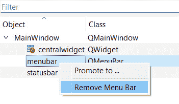

图 4.1 – 从主窗口中移除菜单栏

1.  然后，打开 `mainwindow.h` 文件并添加以下代码以包含 `QPainter` 头文件：

    ```cpp
    #include <QMainWindow>
    #include <QPainter>
    ```

1.  然后，在类析构函数下方声明 `paintEvent()` 事件处理程序：

    ```cpp
    public:
    explicit MainWindow(QWidget *parent = 0);
    ~MainWindow();
    mainwindow.cpp file and define the paintEvent() event handler:

    ```

    void MainWindow::paintEvent(QPaintEvent *event) {}

    ```cpp

    ```

1.  之后，我们将使用 `QPainter` 类在 `paintEvent()` 事件处理程序中向屏幕添加文本。我们在屏幕上 `(``20, 30)` 位置绘制文本之前设置文本字体设置：

    ```cpp
    QPainter textPainter;
    textPainter.begin(this);
    textPainter.setFont(QFont("Times", 14, QFont::Bold));
    textPainter.drawText(QPoint(20, 30), "Testing");
    textPainter.end();
    ```

1.  然后，我们将绘制一条从 `(50, 60)` 开始到 `(``100, 100)` 结束的直线：

    ```cpp
    QPainter linePainter;
    linePainter.begin(this);
    linePainter.drawLine(QPoint(50, 60), QPoint(100, 100));
    linePainter.end();
    ```

1.  我们也可以通过调用 `drawRect()` 函数并使用 `QPainter` 类轻松地绘制一个矩形。然而，这次我们在绘制形状之前还应用了一个背景图案：

    ```cpp
    QPainter rectPainter;
    rectPainter.begin(this);
    rectPainter.setBrush(Qt::BDiagPattern);
    rectPainter.drawRect(QRect(40, 120, 80, 30));
    rectPainter.end();
    ```

1.  接下来，声明一个 `QPen` 类，将其颜色设置为 `red`，并将绘制样式设置为 `Qt::DashDotLine`。然后，将 `QPen` 类应用于 `QPainter` 并在 `(80, 200)` 位置绘制一个椭圆形状，水平半径为 `50`，垂直半径为 `20`：

    ```cpp
    QPen ellipsePen;
    ellipsePen.setColor(Qt::red);
    ellipsePen.setStyle(Qt::DashDotLine);
    QPainter ellipsePainter;
    ellipsePainter.begin(this);
    ellipsePainter.setPen(ellipsePen);
    ellipsePainter.drawEllipse(QPoint(80, 200), 50, 20);
    ellipsePainter.end();
    ```

1.  我们还可以使用 `QPainterPath` 类在传递给 `QPainter` 类进行渲染之前定义一个形状：

    ```cpp
    QPainterPath rectPath;
    rectPath.addRect(QRect(150, 20, 100, 50));
    QPainter pathPainter;
    pathPainter.begin(this);
    pathPainter.setPen(QPen(Qt::red, 1, Qt::DashDotLine,
    Qt::FlatCap, Qt::MiterJoin));
    pathPainter.setBrush(Qt::yellow);
    pathPainter.drawPath(rectPath);
    pathPainter.end();
    ```

1.  您还可以使用 `QPainterPath` 绘制任何其他形状，例如椭圆：

    ```cpp
    QPainterPath ellipsePath;
    ellipsePath.addEllipse(QPoint(200, 120), 50, 20);
    QPainter ellipsePathPainter;
    ellipsePathPainter.begin(this);
    ellipsePathPainter.setPen(QPen(QColor(79, 106, 25), 5,
    Qt::SolidLine, Qt::FlatCap, Qt::MiterJoin));
    ellipsePathPainter.setBrush(QColor(122, 163, 39));
    ellipsePathPainter.drawPath(ellipsePath);
    ellipsePathPainter.end();
    ```

1.  `QPainter` 也可以用来在屏幕上绘制图像文件。在以下示例中，我们加载了一个名为 `tux.png` 的图像文件，并在屏幕上的 `(100,` `150)` 位置绘制它：

    ```cpp
    QImage image;
    image.load("tux.png");
    QPainter imagePainter(this);
    imagePainter.begin(this);
    imagePainter.drawImage(QPoint(100, 150), image);
    imagePainter.end();
    ```

1.  最终结果应该看起来像这样：

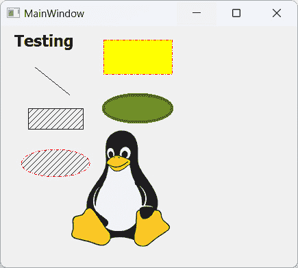

图 4.2 – 图形和线条让企鹅图克斯感到不知所措

## 它是如何工作的...

如果您想使用 `QPainter` 在屏幕上绘制某些内容，您只需要告诉它应该绘制什么类型的图形（如文本、矢量形状、图像、多边形）以及所需的尺寸和位置。`QPen` 类决定了图形轮廓的外观，例如其颜色、线宽、线型（实线、虚线或点线）、端点样式、连接样式等。另一方面，`QBrush` 设置图形背景的样式，例如背景颜色、图案（纯色、渐变、密集刷和交叉对角线）和位图。

在调用 `draw` 函数（如 `drawLine()`、`drawRect()` 或 `drawEllipse()`）之前应设置图形选项。如果您的图形没有显示在屏幕上，并且在 Qt Creator 的应用程序输出窗口中看到诸如 `QPainter::setPen: Painter not active` 和 `QPainter::setBrush: Painter not active` 的警告，这意味着 `QPainter` 类当前未激活，并且您的程序将不会触发其绘制事件。要解决这个问题，请将主窗口设置为 `QPainter` 类的父类。通常，如果您在 `mainwindow.cpp` 文件中编写代码，您只需要在初始化 `QPainter` 时在括号中放置 `this`。例如，注意以下内容：

```cpp
QPainter linePainter(this);
```

`QImage` 可以从计算机目录和程序资源中加载图像。

## 还有更多...

将 `QPainter` 想象为一个带有笔和空画布的机器人。您只需要告诉机器人应该绘制什么类型的形状以及它在画布上的位置，然后机器人将根据您的描述完成工作。

为了使你的生活更轻松，`QPainter` 类还提供了许多函数，例如 `drawArc()`、`drawEllipse()`、`drawLine()`、`drawRect()` 和 `drawPie()`，这些函数允许你轻松渲染预定义的形状。在 Qt 中，所有的小部件类（包括主窗口）都有一个事件处理程序，称为 `QWidget::paintEvent()`。当操作系统认为主窗口应该重新绘制其小部件时，此事件处理程序将被触发。许多事情可能导致这个决定，例如主窗口被缩放、小部件改变其状态（即按钮被按下），或者代码中手动调用 `repaint()` 或 `update()` 函数。不同的操作系统在决定是否在相同条件下触发更新事件时可能会有不同的行为。如果你正在制作一个需要持续和一致图形更新的程序，请使用定时器手动调用 `repaint()` 或 `update()`。

# 将形状导出为 SVG 文件

SVG 是一种基于 XML 的语言，用于描述 2D 向量图形。Qt 提供了将向量形状保存为 SVG 文件的类。这个功能可以用来创建一个类似于 Adobe Illustrator 和 Inkscape 的简单向量图形编辑器。在下一个示例中，我们将继续使用之前示例中的相同项目文件。

## 如何操作…

让我们学习如何创建一个简单的程序，该程序可以在屏幕上显示 SVG 图形：

1.  首先，让我们通过在层次窗口中右键单击主窗口小部件并从弹出菜单中选择 **创建菜单栏** 选项来创建一个菜单栏。之后，将 **文件** 选项添加到菜单栏中，并在其下添加 **另存为 SVG** 动作：


图 4.3 – 在菜单栏上创建“另存为 SVG”选项

1.  之后，你会看到一个名为 `triggered()` 的项，然后点击 **确定** 按钮：

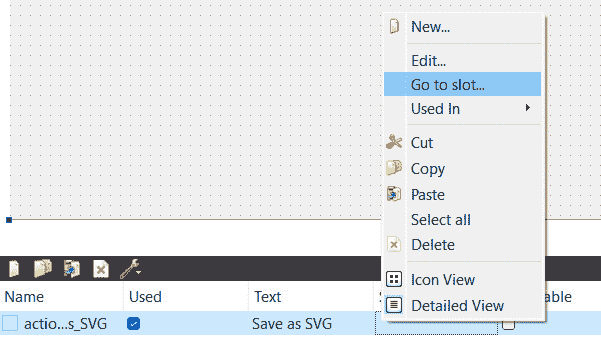

图 4.4 – 为 triggered() 信号创建槽函数

1.  一旦你点击了 `on_actionSave_as_SVG_triggered()`，它就会自动添加到你的主窗口类中。在你的 `mainwindow.h` 文件底部，你会看到类似以下内容：

    ```cpp
    void MainWindow::on_actionSave_as_SVG_triggered() {}
    ```

1.  当你点击源文件顶部的 `QSvgGenerator` 时，会调用前面的函数。这个头文件非常重要，因为它是生成 SVG 文件所必需的。然后，我们还需要包含另一个类头文件 `QFileDialog`，它将被用来打开保存对话框：

    ```cpp
    #include <QtSvg/QSvgGenerator>
    #include <QFileDialog>
    ```

1.  我们还需要将 `svg` 模块添加到我们的项目文件中，如下所示：

    ```cpp
    QT += core gui paintAll() within the mainwindow.h file, as shown in the following code:

    ```

    public:

    explicit MainWindow(QWidget *parent = 0);

    ~MainWindow();

    virtual void paintEvent(QPaintEvent *event);

    将 mainwindow.cpp 文件中的所有代码从 paintEvent()函数移动到 paintAll()函数中。然后，将所有单独的 QPainter 对象替换为用于绘制所有图形的单个统一 QPainter 对象。此外，在绘制任何内容之前调用 begin()函数，在完成绘制后调用 end()函数。代码应如下所示：

    ```cpp
    void MainWindow::paintAll(QSvgGenerator *generator) {
        QPainter painter;
         if (engine)
             painter.begin(engine);
         else
             painter.begin(this);
         painter.setFont(QFont("Times", 14, QFont::Bold));
         painter.drawText(QPoint(20, 30), "Testing");
         painter.drawLine(QPoint(50, 60), QPoint(100, 100));
         painter.setBrush(Qt::BDiagPattern);
         painter.drawRect(QRect(40, 120, 80, 30));
    ```

    ```cpp

    ```

1.  我们继续创建**ellipsePen**和**rectPath**：

    ```cpp
        QPen ellipsePen;
        ellipsePen.setColor(Qt::red);
    ellipsePen.setStyle(Qt::DashDotLine);
        painter.setPen(ellipsePen);
        painter.drawEllipse(QPoint(80, 200), 50, 20);
        QPainterPath rectPath;
        rectPath.addRect(QRect(150, 20, 100, 50));
        painter.setPen(QPen(Qt::red, 1, Qt::DashDotLine, Qt::FlatCap, Qt::MiterJoin));
        painter.setBrush(Qt::yellow);
        painter.drawPath(rectPath);
    ```

1.  然后，我们继续创建`ellipsePath`和`image`：

    ```cpp
        QPainterPath ellipsePath;
        ellipsePath.addEllipse(QPoint(200, 120), 50, 20);
        painter.setPen(QPen(QColor(79, 106, 25), 5, Qt::SolidLine, Qt::FlatCap, Qt::MiterJoin));
        painter.setBrush(QColor(122, 163, 39));
        painter.drawPath(ellipsePath);
        QImage image;
        image.load("tux.png");
        painter.drawImage(QPoint(100, 150), image);
        painter.end();
    }
    ```

1.  由于我们已经将所有代码从`paintEvent()`移动到`paintAll()`，我们现在需要在`paintEvent()`中调用`paintAll()`函数，如下所示：

    ```cpp
    void MainWindow::paintEvent(QPaintEvent *event) {
        paintAll();
    }
    ```

1.  然后，我们将编写将图形导出为 SVG 文件的代码。该代码将编写在由 Qt 生成的名为`on_actionSave_as_SVG_triggered()`的槽函数中。我们首先调用保存文件对话框，并从用户那里获取带有所需文件名的目录路径：

    ```cpp
    void MainWindow::on_actionSave_as_SVG_triggered() {
        QString filePath = QFileDialog::getSaveFileName(this, «Save SVG», «», «SVG files (*.svg)»);
        if (filePath == "")
            return;
    }
    ```

1.  之后，创建一个`QSvgGenerator`对象，并通过将`QSvgGenerator`对象传递给`paintAll()`函数将图形保存到 SVG 文件中：

    ```cpp
    void MainWindow::on_actionSave_as_SVG_triggered() {
        QString filePath = QFileDialog::getSaveFileName(this, "Save
    SVG", "", "SVG files (*.svg)");
        if (filePath == "")
            return;
        QSvgGenerator generator;
        generator.setFileName(filePath);
        generator.setSize(QSize(this->width(), this->height()));
        generator.setViewBox(QRect(0, 0, this->width(), this->height()));
        generator.setTitle("SVG Example");
        generator.setDescription("This SVG file is generated by Qt.");
        paintAll(&generator);
    }
    ```

1.  现在，编译并运行程序，你应该能够通过转到**文件** | **另存为 SVG**来导出图形：


图 4.5 – 在网页浏览器中比较我们的程序和 SVG 文件的结果

## 它是如何工作的...

默认情况下，`QPainter`将使用其父对象的绘图引擎来绘制分配给它的图形。如果您没有为`QPainter`分配任何父对象，您可以手动为其分配一个绘图引擎，这正是我们在本例中所做的。

我们将代码放入`paintAll()`中的原因是我们希望相同的代码用于两个不同的目的：在窗口上显示图形和将图形导出为 SVG 文件。您可以看到，`paintAll()`函数中生成器变量的默认值设置为`0`，这意味着除非指定，否则不需要`QSvgGenerator`对象来运行该函数。稍后，在`paintAll()`函数中，我们检查生成器对象是否存在。如果它存在，则使用它作为画家的绘图引擎，如下面的代码所示：

```cpp
if (engine)
    painter.begin(engine);
else
    painter.begin(this);
```

否则，将主窗口传递给`begin()`函数（由于我们在`mainwindow.cpp`文件中编写代码，我们可以直接使用它来引用主窗口的指针），这样它将使用主窗口本身的绘图引擎，这意味着图形将被绘制在主窗口的表面上。在本例中，需要使用单个`QPainter`对象将图形保存到 SVG 文件中。如果您使用多个`QPainter`对象，生成的 SVG 文件将包含多个 XML 头定义，因此任何图形编辑软件都会认为该文件无效。

`QFileDialog::getSaveFileName()`将为用户打开原生的保存文件对话框，以便用户选择保存目录并设置一个期望的文件名。一旦用户完成操作，完整的路径将作为字符串返回，然后我们可以将此信息传递给`QSvgGenerator`对象以导出图形。

注意，在前面的屏幕截图中，SVG 文件中的企鹅已经被裁剪。这是因为 SVG 的画布大小被设置为跟随主窗口的大小。为了帮助可怜的企鹅找回身体，在导出 SVG 文件之前将窗口放大。

## 更多内容...

SVG 以 XML 格式定义图形。由于它是一种矢量图形，如果放大或调整大小，SVG 文件不会丢失任何质量。SVG 格式不仅允许你在工作文件中存储矢量图形，还允许你存储位图图形和文本，这在一定程度上类似于 Adobe Illustrator 的格式。SVG 还允许你将图形对象分组、样式化、变换和组合到之前渲染的对象中。

注意

你可以在[`www.w3.org/TR/SVG`](https://www.w3.org/TR/SVG)查看 SVG 图形的完整规范。

# 坐标变换

在这个例子中，我们将学习如何使用坐标变换和计时器来创建实时时钟显示。

## 如何做到这一点...

要创建我们的第一个图形时钟显示，让我们按照以下步骤进行：

1.  首先，创建一个新的`mainwindow.ui`并移除我们之前所做的`menuBar`、`mainToolBar`和`statusBar`。

1.  之后，打开`mainwindow.h`文件并包含以下头文件：

    ```cpp
    #include <QTime>
    #include <QTimer>
    #include <QPainter>
    ```

1.  然后，声明`paintEvent()`函数，如下所示：

    ```cpp
    public:
        explicit MainWindow(QWidget *parent = 0);
        ~MainWindow();
        mainwindow.cpp file, create three arrays to store the shapes of the hour hand, minute hand, and second hand, where each of the arrays contains three sets of coordinates:

    ```

    void MainWindow::paintEvent(QPaintEvent *event) {

    static const QPoint hourHand[3] = {

    QPoint(4, 4),

    QPoint(-4, 4),

    QPoint(0, -40)

    };

    static const QPoint minuteHand[3] = {

    QPoint(4, 4),

    QPoint(-4, 4),

    QPoint(0, -70)

    };

    static const QPoint secondHand[3] = {

    QPoint(2, 2),

    QPoint(-2, 2),

    QPoint(0, -90)

    };

    }

    ```cpp

    ```

1.  之后，在数组下方添加以下代码以创建绘图器和将其移动到主窗口的中心。同时，我们调整绘图器的大小，使其在窗口调整大小时也能很好地适应主窗口：

    ```cpp
    int side = qMin(width(), height());
    QPainter painter(this);
    painter.setRenderHint(QPainter::Antialiasing);
    painter.translate(width() / 2, height() / 2);
    painter.scale(side / 250.0, side / 250.0);
    ```

1.  完成这些后，我们将使用循环开始绘制表盘。每个表盘旋转增加 6 度，因此 60 个表盘将完成一个完整的圆圈。此外，每过五分钟，表盘看起来会略微变长：

    ```cpp
    for (int i = 0; i < 60; ++i) {
        if ((i % 5) != 0)
            painter.drawLine(92, 0, 96, 0);
        else
            painter.drawLine(86, 0, 96, 0);
        painter.rotate(6.0);
    }
    ```

1.  然后，我们继续绘制时钟的指针。每个指针的旋转是根据当前时间和它在 360 度中的相应位置来计算的：

    ```cpp
    QTime time = QTime::currentTime();
    // Draw hour hand
    painter.save();
    painter.rotate((time.hour() * 360) / 12);
    painter.setPen(Qt::NoPen);
    painter.setBrush(Qt::black);
    painter.drawConvexPolygon(hourHand, 3);
    painter.restore();
    ```

1.  让我们绘制时钟的时针：

    ```cpp
    // Draw minute hand
    painter.save();
    painter.rotate((time.minute() * 360) / 60);
    painter.setPen(Qt::NoPen);
    painter.setBrush(Qt::black);
    painter.drawConvexPolygon(minuteHand, 3);
    painter.restore();
    ```

1.  然后，我们也绘制秒针：

    ```cpp
    // Draw second hand
    painter.save();
    painter.rotate((time.second() * 360) / 60);
    painter.setPen(Qt::NoPen);
    painter.setBrush(Qt::black);
    painter.drawConvexPolygon(secondHand, 3);
    painter.restore();
    ```

1.  最后但同样重要的是，创建一个计时器每秒刷新一次图形，这样程序就能像真正的时钟一样工作：

    ```cpp
    MainWindow::MainWindow(QWidget *parent) : QMainWindow(parent),
    ui(new Ui::MainWindow) {
        ui->setupUi(this);
        QTimer* timer = new QTimer(this);
        timer->start(1000);
        connect(timer, QTimer::timeout, this, MainWindow::update);
    }
    ```

1.  现在编译并运行程序，你应该会看到如下所示的内容：

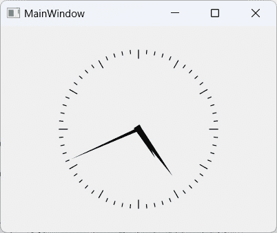

图 4.6 – 在 Qt 应用程序上显示的实时模拟时钟

## 它是如何工作的...

每个数组包含三个 `QPoint` 数据实例，这些实例形成一个细长的三角形。然后，这些数组被传递给画家，并使用 `drawConvexPolygon()` 函数渲染为一个凸多边形。在绘制每个时钟指针之前，我们使用 `painter.save()` 保存 `QPainter` 对象的状态，然后使用坐标变换继续绘制指针。

一旦完成绘图，我们通过调用 `painter.restore()` 将画家恢复到其之前的状态。这个函数将撤销 `painter.restore()` 之前所有的变换，这样下一个时钟指针就不会继承上一个指针的变换。如果不使用 `painter.save()` 和 `painter.restore()`，我们将在绘制下一个指针之前手动更改位置、旋转和缩放。

不使用 `painter.save()` 和 `painter.restore()` 的一个好例子是在绘制表盘时。由于每个表盘的旋转是前一个表盘的六度增量，我们根本不需要保存画家的状态。我们只需要在循环中调用 `painter.rotate(6.0)`，每个表盘都会继承前一个表盘的旋转。我们还使用模运算符 (`%`) 来检查表盘所代表的单位是否能被五整除。如果可以，我们就绘制它稍微长一点。

如果不使用定时器不断调用 `update()` 槽，时钟将无法正常工作。这是因为当父窗口（在这种情况下是主窗口）的状态没有变化时，Qt 不会调用 `paintEvent()`。因此，我们需要手动告诉 Qt 我们需要每秒刷新一次图形，通过调用 `update()`。

我们使用 `painter.setRenderHint(QPainter::Antialiasing)` 函数在渲染时钟时启用反走样。没有反走样，图形看起来会非常锯齿和像素化：

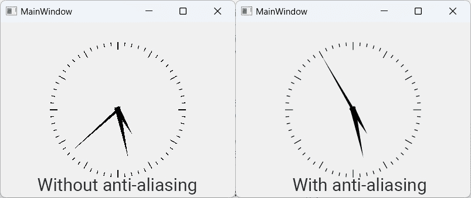

图 4.7 – 反走样产生更平滑的结果

## 还有更多...

`QPainter` 类使用坐标系来确定图形在屏幕上渲染之前的位置和大小。这些信息可以被更改，使图形出现在不同的位置、旋转和大小。改变图形坐标信息的过程就是我们所说的坐标变换。有多种类型的变换：其中包含**平移**、**旋转**、**缩放**和**剪切**：

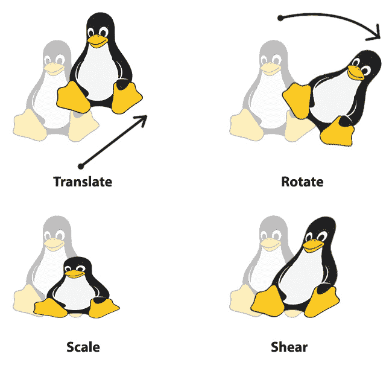

图 4.8 – 不同类型的变换

Qt 使用一个以左上角为原点的坐标系，这意味着 *x* 值向右增加，*y* 值向下增加。这个坐标系可能与物理设备（如计算机屏幕）使用的坐标系不同。Qt 通过使用 `QPaintDevice` 类自动处理这个问题，它将 Qt 的逻辑坐标映射到物理坐标。

`QPainter` 提供了四种变换操作以执行不同类型的变换：

+   `QPainter::translate()`: 这将图形的位置偏移给定的一组单位

+   `QPainter::rotate()`: 这将图形按顺时针方向围绕原点旋转

+   `QPainter::scale()`: 这将图形的大小偏移给定的一个因子

+   `QPainter::shear()`: 这将图形的坐标系围绕原点扭曲

# 在屏幕上显示图像

Qt 不仅允许我们在屏幕上绘制形状和图像，还允许我们将多个图像叠加在一起，并使用不同类型的算法结合所有层的像素信息，从而创建非常有趣的结果。在本例中，我们将学习如何将图像叠加在一起并应用不同的合成效果。

## 如何做到这一点...

让我们通过以下步骤创建一个简单的演示，展示不同图像合成效果：

1.  首先，设置一个新的 `menuBar`、`mainToolBar` 和 `statusBar`，就像我们在第一个菜谱中所做的那样。

1.  接下来，将 `QPainter` 类头文件添加到 `mainwindow.h` 文件中：

    ```cpp
    #include <QPainter>
    ```

1.  之后，声明 `paintEvent()` 虚拟函数，如下所示：

    ```cpp
    virtual void paintEvent(QPaintEvent* event);
    ```

1.  在 `mainwindow.cpp` 中，我们将首先使用 `QImage` 类加载几个图像文件：

    ```cpp
    void MainWindow::paintEvent(QPaintEvent* event) {
        QImage image;
        image.load("checker.png");
        QImage image2;
        image2.load("tux.png");
        QImage image3;
        image3.load("butterfly.png");
    }
    ```

1.  然后，创建一个 `QPainter` 对象并使用它来绘制两对图像，其中一对图像位于另一对图像之上：

    ```cpp
    QPainter painter(this);
    painter.drawImage(QPoint(10, 10), image);
    painter.drawImage(QPoint(10, 10), image2);
    painter.drawImage(QPoint(300, 10), image);
    painter.drawImage(QPoint(300, 40), image3);
    ```

1.  现在，编译并运行程序，你应该会看到类似这样的内容：

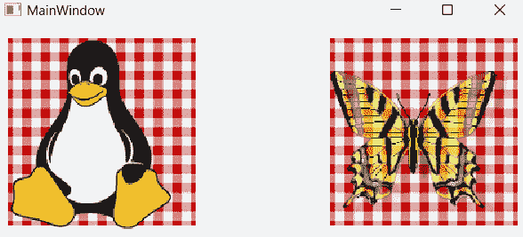

图 4.9 – 正常显示图像

1.  接下来，我们在屏幕上绘制每个图像之前设置合成模式：

    ```cpp
    QPainter painter(this);
    painter.setCompositionMode(QPainter::CompositionMode_Difference);
    painter.drawImage(QPoint(10, 10), image);
    painter.setCompositionMode(QPainter::CompositionMode_Multiply);
    painter.drawImage(QPoint(10, 10), image2);
    painter.setCompositionMode(QPainter::CompositionMode_Xor);
    painter.drawImage(QPoint(300, 10), image);
    painter.setCompositionMode(QPainter::CompositionMode_SoftLight);
    painter.drawImage(QPoint(300, 40), image3);
    ```

1.  再次编译并运行程序，你现在将看到类似这样的内容：

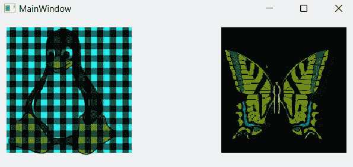

图 4.10 – 将不同的合成模式应用于图像

## 它是如何工作的...

当使用 Qt 绘制图像时，调用 `drawImage()` 函数的顺序将决定哪个图像先被渲染，哪个图像后被渲染。这将影响图像的深度顺序并产生不同的结果。

在上一个示例中，我们四次调用`drawImage()`函数来在屏幕上绘制四个不同的图像。第一个`drawImage()`函数渲染`checker.png`，第二个`drawImage()`函数渲染`tux.png`（企鹅）。稍后渲染的图像将始终出现在其他图像之前，这就是为什么企鹅出现在棋盘格图案之前。对于蝴蝶和右侧的棋盘格图案也是如此。尽管蝴蝶被渲染在它前面，但你仍然可以看到棋盘格图案的原因是蝴蝶图像不是完全不透明的。

现在，让我们反转渲染顺序，看看会发生什么。我们将尝试首先渲染企鹅，然后是棋盘格方框。对于右侧的其他图像对也是如此：蝴蝶首先被渲染，然后是棋盘格方框：

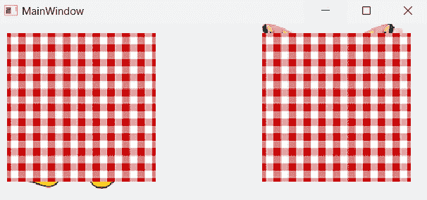

图 4.11 – 企鹅和蝴蝶都被棋盘格方框覆盖

要将合成效果应用到图像上，我们必须在绘制图像之前设置画家的合成模式，通过调用`painter.setCompositionMode()`函数。您可以通过输入`QPainter::CompositionMode`从自动完成菜单中选择所需的合成模式。

在上一个示例中，我们将`QPainter::CompositionMode_Difference`应用于左侧的棋盘格方框，这反转了其颜色。接下来，我们将`QPainter::CompositionMode_Overlay`应用于企鹅，使其与棋盘格图案混合，从而能够看到两个图像重叠。在右侧，我们将`QPainter::CompositionMode_Xor`应用于棋盘格方框，如果源和目标之间存在差异，则显示颜色；否则，将渲染为黑色。

由于它是与白色背景比较差异，所以棋盘格方框的不透明部分变成了完全黑色。我们还对蝴蝶图像应用了`QPainter::CompositionMode_SoftLight`。这会以降低对比度的方式将像素与背景混合。如果您想在继续进行下一渲染之前禁用之前设置的合成模式，只需将其设置回默认模式，即`QPainter::CompositionMode_SourceOver`。

## 还有更多...

例如，我们可以在多个图像上方叠加，并使用 Qt 的**图像合成**功能将它们合并在一起，并根据我们使用的合成模式计算屏幕上的结果像素。这在像 Photoshop 和 GIMP 这样的图像编辑软件中经常用于合成图像图层。

Qt 中提供了超过 30 种合成模式。以下是一些最常用的模式：

+   `清除`：目标像素设置为完全透明，与源无关。

+   `源`：输出是源像素。此模式是`CompositionMode_Destination`的逆模式。

+   `目标`: 输出是目标像素。这意味着混合没有效果。此模式是`CompositionMode_Source`的逆模式。

+   `源覆盖`: 这通常被称为`QPainter`。

+   `目标覆盖`: 输出是覆盖在源像素上的目标 alpha 值的混合。此模式的相反是`CompositionMode_SourceOver`。

+   `源输入`: 输出是源，其中 alpha 值通过目标 alpha 值进行减少。

+   `目标输入`: 输出是目标，其中 alpha 值通过源 alpha 值进行减少。此模式是`CompositionMode_SourceIn`的逆模式。

+   `源输出`: 输出是源，其中 alpha 值通过目标值的倒数进行减少。

+   `目标输出`: 输出是目标，其中 alpha 值通过源 alpha 值的倒数进行减少。此模式是`CompositionMode_SourceOut`的逆模式。

+   `源叠加`: 源像素在目标像素上方进行混合，源像素的 alpha 值通过目标像素的 alpha 值进行减少。

+   `目标叠加`: 目标像素在源像素上方进行混合，源像素的 alpha 值通过目标像素的 alpha 值进行减少。此模式是`CompositionMode_SourceAtop`的逆模式。

+   `Xor`: 这是“排他或”的缩写，这是一种主要用于图像分析的先进混合模式。使用此模式与这种合成模式相比要复杂得多。首先，通过目标 alpha 值的倒数减少源 alpha 值。然后，通过源 alpha 值的倒数减少目标 alpha 值。最后，将源和目标合并以产生输出。

注意

更多信息，您可以访问此链接：[`pyside.github.io`](https://pyside.github.io)。

以下图显示了使用不同合成模式叠加两个图像的结果：

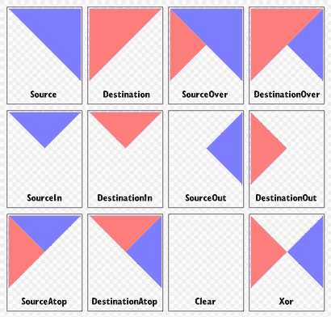

图 4.12 – 不同类型的合成模式

# 将图像效果应用于图形

Qt 提供了一种简单的方法，可以将图像效果添加到使用`QPainter`类绘制的任何图形中。在本例中，我们将学习如何将不同的图像效果，如阴影、模糊、着色和透明度效果，应用于图形，然后再将其显示在屏幕上。

## 如何做到这一点…

让我们通过以下步骤学习如何将图像效果应用于文本和图形：

1.  创建一个新的`menuBar`、`mainToolBar`和`StatusBar`。

1.  通过访问**文件** | **新建文件或项目**来创建一个新的资源文件，并将项目所需的所有图像添加进去：


图 4.13 – 创建新的 Qt 资源文件

1.  接下来，打开`mainwindow.ui`文件，并在窗口中添加四个标签。其中两个标签将是文本，另外两个我们将加载到资源文件中我们刚刚添加的图像：

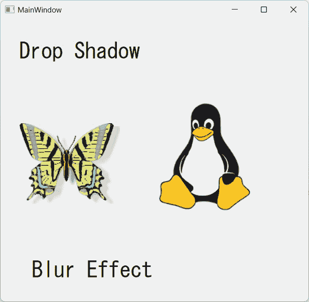

图 4.14 – 填满文本和图像的应用程序

1.  你可能已经注意到字体大小比默认大小大得多。这可以通过向标签小部件添加样式表来实现，例如，如下所示：

    ```cpp
    font: 26pt "MS Gothic";
    ```

1.  之后，打开`mainwindow.cpp`并在源代码顶部包含以下头文件：

    ```cpp
    #include <QGraphicsBlurEffect>
    #include <QGraphicsDropShadowEffect>
    #include <QGraphicsColorizeEffect>
    #include <QGraphicsOpacityEffect>
    ```

1.  然后，在`MainWindow`类的构造函数中，添加以下代码来创建一个`DropShadowEffect`并将其应用于一个标签：

    ```cpp
    MainWindow::MainWindow(QWidget *parent) : QMainWindow(parent),
    ui(new Ui::MainWindow) {
    ui->setupUi(this);
    QGraphicsDropShadowEffect* shadow = new QGraphicsDropShadowEffect();
    shadow->setXOffset(4);
    shadow->setYOffset(4);
    ui->label->setGraphicsEffect(shadow);
    }
    ```

1.  接下来，我们将创建`ColorizedEffect`并将其应用于其中一张图片，在这种情况下，是蝴蝶。我们还设置了效果颜色为红色：

    ```cpp
    QGraphicsColorizeEffect* colorize = new
    QGraphicsColorizeEffect();
    colorize->setColor(QColor(255, 0, 0));
    ui->butterfly->setGraphicsEffect(colorize);
    ```

1.  完成这些后，创建`BlurEffect`并将其半径设置为`12`。然后，将图形效果应用于其他标签：

    ```cpp
    QGraphicsBlurEffect* blur = new QGraphicsBlurEffect();
    blur->setBlurRadius(12);
    ui->label2->setGraphicsEffect(blur);
    ```

1.  最后，创建一个 alpha 效果并将其应用于企鹅图片。我们将不透明度值设置为`0.2`，这意味着 20%的不透明度：

    ```cpp
    QGraphicsOpacityEffect* alpha = new QGraphicsOpacityEffect();
    alpha->setOpacity(0.2);
    ui->penguin->setGraphicsEffect(alpha);
    ```

1.  现在，编译并运行程序，你应该能看到类似这样的效果：


图 4.15 – 将不同类型的图形效果应用于文本和图像

## 它是如何工作的...

每个图形效果都是一个继承自`QGraphicsEffect`父类的类。你可以通过创建一个新的继承自`QGraphicsEffect`的类并重新实现其中的一些函数来创建自己的自定义效果。

每个效果都有自己的一组变量，这些变量专门为它创建。例如，你可以设置着色效果的色彩，但在模糊效果中没有这样的变量。这是因为每个效果与其他效果大不相同，这也是为什么它需要成为一个单独的类，而不是使用相同的类来处理所有不同的效果。

在同一时间只能向小部件添加一个图形效果。如果你添加了多个效果，只有最后一个效果会被应用于小部件，因为它会替换前面的一个。除此之外，请注意，如果你创建了一个图形效果，例如，阴影效果，你不能将其分配给两个不同的小部件，因为它只会分配到最后一个应用了它的小部件。如果你需要将相同类型的效应应用于多个不同的小部件，请创建几个相同类型的图形效果，并将每个效果应用于相应的小部件。

## 还有更多...

目前，Qt 支持模糊、阴影、着色和不透明度效果。这些效果可以通过调用以下类来使用：`QGraphicsBlurEffect`、`QGraphicsDropShadowEffect`、`QGraphicsColorizeEffect`和`QGraphicsOpacityEffect`。所有这些类都是继承自`QGraphicsEffect`类的。你也可以通过创建`QGrapicsEffect`（或任何其他现有效果）的子类并重新实现其中的`draw()`函数来创建自己的自定义图像效果。

图形效果只改变源矩形的边界框。如果你想增加边界框的边距，重新实现虚拟函数`boundingRectFor()`，并调用`updateBoundingRect()`来通知框架每次此矩形变化时：

# 创建一个基本的绘图程序

由于我们已经学到了很多关于`QPainter`类及其如何在屏幕上显示图形的知识，我想现在是时候让我们做一些有趣的事情，将我们的知识付诸实践了。

在这个菜谱中，我们将学习如何制作一个基本的绘图程序，允许我们使用不同的画笔大小和颜色在画布上绘制线条。我们还将学习如何使用`QImage`类和鼠标事件来构建绘图程序。

## 如何做到这一点...

让我们按照以下步骤开始我们的有趣项目：

1.  再次，我们首先创建一个新的**Qt Widgets Application**项目，并移除工具栏和状态栏。这次我们将保留菜单栏。

1.  之后，按照如下设置菜单栏：

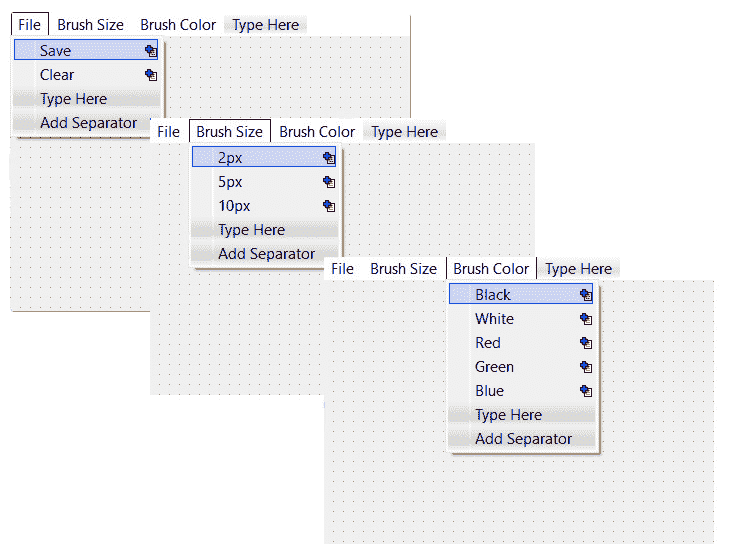

图 4.16 – 设置菜单栏

1.  我们暂时保持菜单栏不变，所以让我们继续到`mainwindow.h`文件。首先，包含以下头文件，因为它们是项目所需的：

    ```cpp
    #include <QPainter>
    #include <QMouseEvent>
    #include <QFileDialog>
    ```

1.  接下来，声明我们将在这个项目中使用的变量，如下所示：

    ```cpp
    private:
        Ui::MainWindow *ui;
        QImage image;
        bool drawing;
        QPoint lastPoint;
        int brushSize;
    QWidget class. These functions will be triggered by Qt when the respective event happens. We will override these functions and tell Qt what to do when these events get called:

    ```

    public:

    explicit MainWindow(QWidget *parent = 0);

    ~MainWindow();

    virtual void mousePressEvent(QMouseEvent *event);

    virtual void mouseMoveEvent(QMouseEvent *event);

    virtual void mouseReleaseEvent(QMouseEvent *event);

    virtual void paintEvent(QPaintEvent *event);

    在`mainwindow.cpp`文件中添加以下代码到类构造函数中，以设置一些变量：

    ```cpp
    MainWindow::MainWindow(QWidget *parent) : QMainWindow(parent),
    ui(new Ui::MainWindow) {
        ui->setupUi(this);
        image = QImage(this->size(), QImage::Format_RGB32);
    image.fill(Qt::white);
        drawing = false;
        brushColor = Qt::black;
        brushSize = 2;
    }
    ```

    ```cpp

    ```

1.  接下来，我们将构建`mousePressEvent()`事件，并告诉 Qt 当左键被按下时应该做什么：

    ```cpp
    void MainWindow::mousePressEvent(QMouseEvent *event) {
        if (event->button() == Qt::LeftButton) {
            drawing = true;
            lastPoint = event->pos();
        }
    }
    ```

1.  然后，我们将构建`mouseMoveEvent()`事件，并告诉 Qt 当鼠标移动时应该做什么。在这种情况下，如果左键被按下，我们想在画布上绘制线条：

    ```cpp
    void MainWindow::mouseMoveEvent(QMouseEvent *event) {
        if ((event->buttons() & Qt::LeftButton) && drawing) {
            QPainter painter(&image);
            painter.setPen(QPen(brushColor, brushSize, Qt::SolidLine, Qt::RoundCap, Qt::RoundJoin));
            painter.drawLine(lastPoint, event->pos());
    lastPoint = event->pos();
             this->update();
        }
    }
    ```

1.  之后，我们还将构建`mouseReleaseEvent()`事件，该事件将在鼠标按钮释放时触发：

    ```cpp
    void MainWindow::mouseReleaseEvent(QMouseEvent *event) {
        if (event->button() == Qt::LeftButton) {
            drawing = false;
        }
    }
    ```

1.  完成这些后，我们将继续到`paintEvent()`事件，与之前章节中看到的其他示例相比，这个事件非常简单：

    ```cpp
    void MainWindow::paintEvent(QPaintEvent *event) {
        QPainter canvasPainter(this);
        canvasPainter.drawImage(this->rect(), image, image.rect());
    }
    ```

1.  记得我们有一个菜单栏在那里无所事事吗？让我们在 GUI 编辑器下面的每个动作上右键单击，并在弹出菜单中选择**转到槽函数…**。我们想要告诉 Qt 当菜单栏上的每个选项被选中时应该做什么：

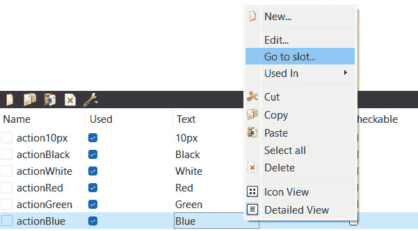

图 4.17 – 为每个菜单动作创建槽函数

1.  然后，选择默认的槽函数`triggered()`，并按`mainwindow.h`和`mainwindow.cpp`文件。完成所有操作后，你应该能在你的`mainwindow.h`文件中看到如下内容：

    ```cpp
    private slots:
        void on_actionSave_triggered();
        void on_actionClear_triggered();
        void on_action2px_triggered();
        void on_action5px_triggered();
        void on_action10px_triggered();
        void on_actionBlack_triggered();
        void on_actionWhite_triggered();
        void on_actionRed_triggered();
        void on_actionGreen_triggered();
        void on_actionBlue_triggered();
    ```

1.  接下来，我们将告诉 Qt 在这些槽被触发时应该做什么：

    ```cpp
    void MainWindow::on_actionSave_triggered() {
        QString filePath = QFileDialog::getSaveFileName(this, «Save Image», «», «PNG (*.png);;JPEG (*.jpg *.jpeg);;All files
    (*.*)»);
        if (filePath == "")
    return;
        image.save(filePath);
    }
    void MainWindow::on_actionClear_triggered() {
        image.fill(Qt::white);
        this->update();
    }
    ```

1.  然后，我们继续实现其他槽：

    ```cpp
    void MainWindow::on_action2px_triggered() {
        brushSize = 2;
    }
    void MainWindow::on_action5px_triggered() {
        brushSize = 5;
    }
    void MainWindow::on_action10px_triggered() {
        brushSize = 10;
    }
    void MainWindow::on_actionBlack_triggered() {
        brushColor = Qt::black;
    }
    ```

1.  最后，我们实现其余的槽函数：

    ```cpp
    void MainWindow::on_actionWhite_triggered() {
        brushColor = Qt::white;
    }
    void MainWindow::on_actionRed_triggered() {
        brushColor = Qt::red;
    }
    void MainWindow::on_actionGreen_triggered() {
        brushColor = Qt::green;
    }
    void MainWindow::on_actionBlue_triggered() {
        brushColor = Qt::blue;
    }
    ```

1.  如果我们现在编译并运行程序，我们将得到一个简单但可用的绘图程序：

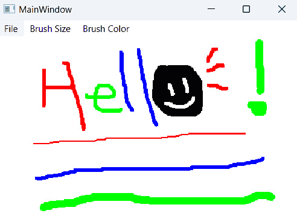

图 4.18 – 我们可爱的绘图程序正在运行！

## 它是如何工作的...

在这个例子中，我们在程序启动时创建了一个 `QImage` 小部件。这个小部件充当画布，并且每当窗口大小改变时都会跟随窗口的大小。为了在画布上绘制东西，我们需要使用 Qt 提供的鼠标事件。这些事件会告诉我们光标的位置，我们可以使用这些信息来改变画布上的像素。

我们使用一个名为 `drawing` 的布尔变量来让程序知道当鼠标按钮被按下时是否应该开始绘图。在这种情况下，当左键被按下时，`drawing` 变量将被设置为 `true`。我们还在左键被按下时将当前光标位置保存到 `lastPoint` 变量中，这样 Qt 就会知道它应该从哪里开始绘图。当鼠标移动时，Qt 将触发 `mouseMoveEvent()` 事件。这就是我们需要检查绘图变量是否被设置为 `true` 的地方。如果是，那么 `QPainter` 可以根据我们提供的画笔设置开始在 `QImage` 小部件上绘制线条。画笔设置包括 `brushColor` 和 `brushSize`。这些设置被保存为变量，并且可以通过从菜单栏选择不同的设置来更改。

请记住，当用户在画布上绘图时调用 `update()` 函数。否则，即使我们改变了画布的像素信息，画布也将保持空白。我们还需要在从菜单栏选择 **文件** | **清除** 时调用 `update()` 函数来重置我们的画布。

在这个例子中，我们使用 `QImage::save()` 来保存图像文件，这非常直接。我们使用文件对话框让用户决定保存图像的位置和期望的文件名。然后，我们将信息传递给 `QImage`，它将自行完成剩余的工作。如果我们没有指定 `QImage::save()` 函数的文件格式，`QImage` 将通过查看期望文件名的扩展名来尝试自己找出它。

# 在 QML 中渲染 2D 画布

在本章的所有前例中，我们讨论了使用 Qt 的 C++ API 渲染 2D 图形的方法和技术。然而，我们还没有学习如何使用强大的 QML 脚本达到类似的效果。

## 如何做到这一点…

在这个项目中，我们将做一些相当不同的事情：

1.  如同往常，第一步是创建一个新的项目，通过访问 **文件** | **新建文件或项目** 并选择 **Qt 快速应用程序** 作为项目模板：


图 4.19 – 创建新的 Qt Quick 应用程序项目

1.  创建完新项目后，打开`main.qml`，它在项目面板下的`qml.qrc`中列出。之后，为窗口设置一个 ID，并将它的`width`和`height`值调整到更大的值，如下所示：

    ```cpp
    import QtQuick
    import QtQuick.Window
    Window {
        id: myWindow
        visible: true
        width: 640
        height: 480
        title: qsTr("Hello World")
    }
    ```

1.  然后，在`myWindow`下添加一个`Canvas`对象，并将其命名为`myCanvas`。之后，我们将它的`width`和`height`值设置为与`myWindow`相同：

    ```cpp
    Window {
        id: myWindow
        visible: true
        width: 640
        height: 480
        Canvas {
            id: myCanvas
            width: myWindow.width
            height: myWindow.height
        }
    }
    ```

1.  接下来，我们定义当`onPaint`事件被触发时会发生什么；在这种情况下，我们将在窗口上绘制一个十字：

    ```cpp
    Canvas {
        id: myCanvas
        width: myWindow.width
        height: myWindow.height
        onPaint: {
            var context = getContext('2d')
    context.fillStyle = 'white'
            context.fillRect(0, 0, width, height)
            context.lineWidth = 2
            context.strokeStyle = 'black'
    ```

1.  让我们继续编写代码，如下所示：

    ```cpp
    // Draw cross
    context.beginPath()
    context.moveTo(50, 50)
    context.lineTo(100, 100)
    context.closePath()
    context.stroke()
    context.beginPath()
    context.moveTo(100, 50)
    context.lineTo(50, 100)
    context.closePath()
    context.stroke()
    }
    }
    ```

1.  然后，我们添加以下代码在十字交叉处绘制一个勾号：

    ```cpp
    // Draw tick
    context.beginPath()
    context.moveTo(150, 90)
    context.lineTo(158, 100)
    context.closePath()
    context.stroke()
    context.beginPath()
    context.moveTo(180, 100)
    context.lineTo(210, 50)
    context.closePath()
    context.stroke()
    ```

1.  然后，通过添加以下代码绘制一个三角形形状：

    ```cpp
    // Draw triangle
    context.lineWidth = 4
    context.strokeStyle = "red"
    context.fillStyle = "salmon"
    context.beginPath()
    context.moveTo(50,150)
    context.lineTo(150,150)
    context.lineTo(50,250)
    context.closePath()
    context.fill()
    context.stroke()
    ```

1.  之后，使用以下代码绘制一个半圆和一个完整圆：

    ```cpp
    // Draw circle
    context.lineWidth = 4
    context.strokeStyle = "blue"
    context.fillStyle = "steelblue"
    var pi = 3.141592653589793
    context.beginPath()
    context.arc(220, 200, 60, 0, pi, true)
    context.closePath()
    context.fill()
    context.stroke()
    ```

1.  然后，我们绘制一个圆弧：

    ```cpp
    context.beginPath()
    context.arc(220, 280, 60, 0, 2 * pi, true)
    context.closePath()
    context.fill()
    context.stroke()
    ```

1.  最后，我们从文件中绘制一个 2D 图像：

    ```cpp
    // Draw image
    context.drawImage("tux.png", 280, 10, 150, 174)
    ```

1.  然而，仅凭前面的代码无法在屏幕上成功渲染图像，因为你必须先加载图像文件。在`Canvas`对象中添加以下代码，以便在程序启动时让 QML 加载图像文件，然后在图像加载后调用`requestPaint()`信号，以便触发`onPaint()`事件槽：

    ```cpp
    onImageLoaded: requestPaint();
    onPaint: {
        // The code we added previously
    }
    ```

1.  然后，通过在项目面板中右键单击`qml.qrc`并选择将`tux.png`图像文件添加到我们的项目资源中打开它：

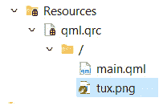

图 4.20 – tux.png 图像文件现在在 qml.qrc 下列出

1.  现在，构建并运行程序，你应该会得到以下结果：

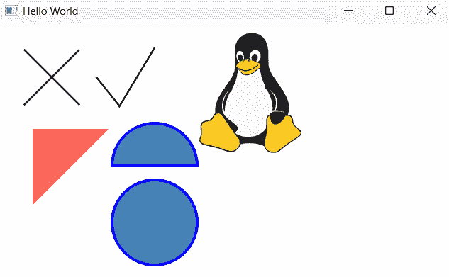

图 4.21 – 图形形状让企鹅图克斯感到有趣

在前面的例子中，我们学习了如何使用`Canvas`元素在我们的屏幕上绘制简单的矢量形状。Qt 的内置模块使程序员对复杂渲染过程的处理更加简单。
