# 5

# OpenGL 实现

在本章中，我们将学习如何使用 **开放图形库** (**OpenGL**)，一个强大的渲染 **应用程序程序接口** (**API**)，并将其与 **Qt** 结合使用。OpenGL 是一个跨语言、跨平台的 API，它通过我们计算机图形芯片内的 **图形处理单元** (**GPU**) 在屏幕上绘制 2D 和 3D 图形。在本章中，我们将学习 OpenGL 3 而不是 2，因为尽管与较新的可编程管道相比，固定功能管道对初学者来说更容易理解，但它被认为是遗留代码，并且已被大多数现代 3D 渲染软件弃用。Qt 6 支持这两个版本，因此如果你需要软件的向后兼容性，切换到 OpenGL 2 应该没有问题。

在本章中，我们将涵盖以下主要主题：

+   在 Qt 中设置 OpenGL

+   Hello World!

+   渲染 2D 形状

+   渲染 3D 形状

+   OpenGL 中的纹理

+   OpenGL 中的基本光照

+   使用键盘控制移动对象

+   Qt Quick 3D 在 QML 中

# 技术要求

本章的技术要求包括 Qt 6.6.1 MinGW 64 位和 Qt Creator 12.0.2。本章中使用的所有代码都可以从以下 GitHub 仓库下载：[`github.com/PacktPublishing/QT6-C-GUI-Programming-Cookbook---Third-Edition-/tree/main/Chapter05`](https://github.com/PacktPublishing/QT6-C-GUI-Programming-Cookbook---Third-Edition-/tree/main/Chapter05)。

# 在 Qt 中设置 OpenGL

在这个菜谱中，我们将学习如何在 Qt 6 中设置 OpenGL。

## 如何做…

按照以下步骤学习如何在 Qt 中设置 OpenGL：

1.  创建一个新的 `mainwindow.ui`、`mainwindow.h` 和 `mainwindow.cpp` 文件。

1.  打开你的项目文件（`.pro`）并在 `QT +=` 后面添加 `opengl` 关键字，然后运行 `qmake` 重新加载项目模块：

    ```cpp
    QT += core gui opengl
    ```

1.  你还需要在项目文件中添加另一行，以便在启动时加载 OpenGL 和 **OpenGL 实用工具** (**GLU**) 库。没有这两个库，你的程序将无法运行：

    ```cpp
    LIBS += -lopengl32 -lglu32
    ```

1.  打开 `main.cpp` 并将 `mainwindow.h` 替换为 `QtOpenGL` 头文件：

    ```cpp
    #include <QtOpenGL>
    ```

1.  从你的 `main.cpp` 文件中删除所有与 `MainWindow` 类相关的代码，并用以下片段中突出显示的代码替换：

    ```cpp
    #include <QApplication>
    #include <QtOpenGL>
    int main(int argc, char *argv[])
    {
        QApplication app(argc, argv);
        QOpenGLWindow window;
        window.setTitle("Hello World!");
        window.resize(640, 480);
        window.show();
        return app.exec();
    }
    ```

1.  如果你现在编译并运行项目，你将看到一个背景为黑色的空窗口。不要担心——你的程序现在正在 OpenGL 上运行：

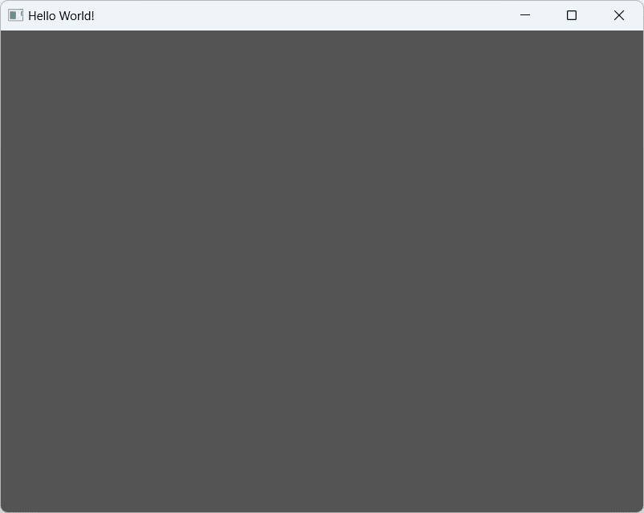

图 5.1 - 一个空的 OpenGL 窗口

## 它是如何工作的…

为了访问与 OpenGL 相关的头文件，例如`QtOpenGL`和`QOpenGLFunctions`，必须在项目文件（`.pro`）中添加`OpenGL`模块。我们使用`QOpenGLWindow`类而不是`QMainWindow`作为主窗口，因为它旨在轻松创建执行 OpenGL 渲染的窗口，并且由于它在其小部件模块中没有依赖项，因此与`QOpenGLWidget`相比提供了更好的性能。

我们必须调用`setSurfaceType(QWindow::OpenGLSurface)`来告诉 Qt 我们更愿意使用 OpenGL 将图像渲染到屏幕上而不是使用`QPainter`。`QOpenGLWindow`类提供了几个虚拟函数（`initializeGL()`、`resizeGL()`、`paintGL()`等），使我们能够方便地设置 OpenGL 并执行图形渲染。我们将在下面的示例中学习如何使用这些函数。

## 还有更多...

OpenGL 是我们计算机图形芯片内通过 GPU 绘制 2D 和 3D 图形的跨语言、跨平台 API。计算机图形技术多年来一直在快速发展——发展如此之快，以至于软件行业几乎跟不上其步伐。

在 2008 年，维护和开发 OpenGL 的 Khronos Group 公司宣布发布了 OpenGL 3.0 规范，这在整个行业中引起了巨大的骚动和争议。这主要是因为 OpenGL 3.0 本应从 OpenGL API 中废弃整个固定功能管道，对于大玩家来说，从固定功能管道突然一夜之间切换到可编程管道几乎是不可能的任务。这导致了维护两个不同主要版本的 OpenGL。

在本章中，我们将使用较新的 OpenGL 3 而不是较旧的已废弃的 OpenGL 2。这两个版本之间的编码风格和语法非常不同，这使得切换非常麻烦。然而，性能提升将使切换到 OpenGL 3 所花费的时间变得值得。

# Hello World!

在本章中，我们将学习如何使用 Qt 6 的 OpenGL 3。常见的 OpenGL 函数，如`glBegin`、`glVertex2f`、`glColor3f`、`glMatrixMode`和`glLoadIdentity`，都已从 OpenGL 3 中删除。OpenGL 3 使用`glVertex2f()`，这会减慢渲染速度，因为需要等待 CPU 逐个提交数据。因此，我们将所有数据打包到 VBO 中，一次性发送给 GPU，并指导 GPU 通过着色器编程计算结果像素。我们还将学习如何通过类似于 C 的编程语言**OpenGL 着色器语言**（**GLSL**）创建简单的**着色器程序**。

## 如何做到这一点...

让我们按照以下步骤开始：

1.  我们将创建一个新的类`RenderWindow`，它继承自`QOpenGLWindow`类。转到`RenderWindow`并设置其基类为`QOpenGLWindow`。然后，继续创建 C++类：

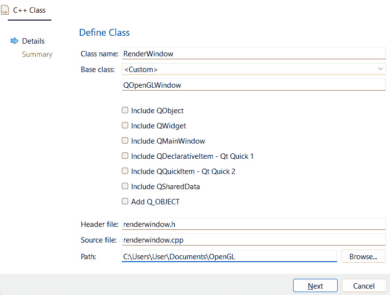

图 5.2 – 定义你的自定义渲染窗口类

1.  前往我们刚刚创建的`renderwindow.h`文件，并在源代码顶部添加以下头文件：

    ```cpp
    #include <GL/glu.h>
    #include <QtOpenGL>
    #include <QSurfaceFormat>
    #include <QOpenGLFunctions>
    #include <QOpenGLWindow>
    #include <QOpenGLBuffer>
    #include <QOpenGLVertexArrayObject>
    #include <QOpenGLShader>
    #include <QOpenGLShaderProgram>
    ```

1.  我们需要创建几个看起来像这样的函数和变量：

    ```cpp
    class RenderWindow : public QOpenGLWindow {
    public:
        RenderWindow();
    protected:
        void initializeGL();
        void paintGL();
        void paintEvent(QPaintEvent *event);
        void resizeEvent(QResizeEvent *event);
    ```

1.  我们将继续并添加一些私有变量：

    ```cpp
    private:
        QOpenGLContext* openGLContext;
        QOpenGLFunctions* openGLFunctions;
        QOpenGLShaderProgram* shaderProgram;
        QOpenGLVertexArrayObject* vao;
        QOpenGLBuffer* vbo_vertices;
    };
    ```

1.  打开`renderwindow.cpp`文件，并按如下定义类构造函数。我们必须告诉渲染窗口使用 OpenGL 表面类型；启用**核心配置文件**（而不是**兼容性配置文件**），运行 3.2 版本；创建 OpenGL 上下文；最后，将我们刚刚创建的配置文件应用到上下文中：

    ```cpp
    RenderWindow::RenderWindow() {
        setSurfaceType(QWindow::OpenGLSurface);
        QSurfaceFormat format;
        format.setProfile(QSurfaceFormat::CoreProfile);
        format.setVersion(3, 2);
        setFormat(format);
        openGLContext = new QOpenGLContext();
        openGLContext->setFormat(format);
        openGLContext->create();
        openGLContext->makeCurrent(this);
    }
    ```

1.  我们需要按如下定义`initializeGL()`函数。这个函数将在渲染开始之前被调用。首先，我们定义**顶点着色器**和**片段着色器**：

    ```cpp
    void RenderWindow::initializeGL() {
        openGLFunctions = openGLContext->functions();
        static const char *vertexShaderSource =
        "#version 330 core\n"
        "layout(location = 0) in vec2 posAttr;\n"
        "void main() {\n"
        "gl_Position = vec4(posAttr, 0.0, 1.0); }";
        static const char *fragmentShaderSource =
        "#version 330 core\n"
        "out vec4 col;\n"
        "void main() {\n"
        "col = vec4(1.0, 0.0, 0.0, 1.0); }";
    ```

1.  我们初始化`shaderProgram`并声明一个顶点数组。然后，我们创建一个`QOpenGLVertexArrayObject`对象：

    ```cpp
        shaderProgram = new QOpenGLShaderProgram(this);
        shaderProgram->addShaderFromSourceCode(QOpenGLShader::Vertex, vertexShaderSource);
        shaderProgram->addShaderFromSourceCode(QOpenGLShader::Fragment, fragmentShaderSource);
        shaderProgram->link();
    // The vertex coordinates of our triangle
        GLfloat vertices[] = {
        -1.0f, -1.0f,
        1.0f, -1.0f,
        0.0f, 1.0f };
        vao = new QOpenGLVertexArrayObject();
        vao->create();
        vao->bind();
    ```

1.  让我们继续编写我们的代码，通过定义`vbo_vertices`：

    ```cpp
        vbo_vertices = new QOpenGLBuffer(QOpenGLBuffer::VertexBuffer);
        vbo_vertices->create();
        vbo_vertices->setUsagePattern(QOpenGLBuffer::StaticDraw);
        vbo_vertices->bind();
        vbo_vertices->allocate(vertices, sizeof(vertices) *
        sizeof(GLfloat));
        vao->release();
    }
    ```

1.  我们将首先向`paintEvent()`函数添加一些代码：

    ```cpp
    void RenderWindow::paintEvent(QPaintEvent *event) {
        Q_UNUSED(event);
        glViewport(0, 0, width(), height());
        // Clear our screen with corn flower blue color
        glClearColor(0.39f, 0.58f, 0.93f, 1.f);
        glClear(GL_COLOR_BUFFER_BIT);
    ```

1.  然后我们在调用`glDrawArrays()`之前绑定 VAO 和着色器程序：

    ```cpp
        vao->bind();
        shaderProgram->bind();
        shaderProgram->bindAttributeLocation("posAttr", 0);
        shaderProgram->enableAttributeArray(0);
        shaderProgram->setAttributeBuffer(0, GL_FLOAT, 0, 2);
        glDrawArrays(GL_TRIANGLES, 0, 3);
        shaderProgram->release();
        vao->release();
    }
    ```

1.  你可以通过添加以下代码在渲染窗口被调整大小时刷新视口：

    ```cpp
    void RenderWindow::resizeEvent(QResizeEvent *event) {
        Q_UNUSED(event);
        glViewport(0, 0, this->width(), this->height());
        this->update();
    }
    ```

1.  如果你现在编译并运行项目，你应该能够看到在蓝色背景前绘制的一个红色矩形：

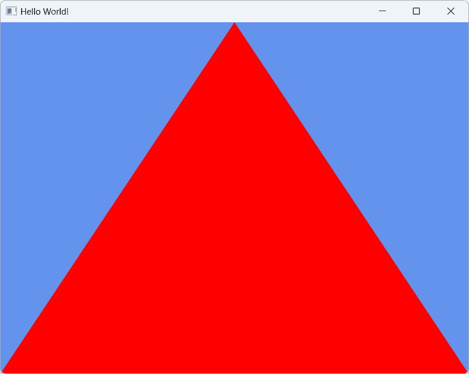

图 5.3 - 使用 OpenGL 渲染的第一个三角形

## 它是如何工作的...

我们必须将 OpenGL 版本设置为 3.x，并将表面格式设置为核心配置文件，以便我们可以访问全新的着色器管道，这与旧的、已弃用的兼容性配置文件完全不同。OpenGL 2.x 仍然存在于兼容性配置文件中，仅为了允许 OpenGL 程序在旧硬件上运行。创建的配置文件必须在它生效之前应用到 OpenGL 上下文中。

在 OpenGL 3 及其后续版本中，大多数计算都是在 GPU 通过着色器程序完成的，因为所有常见的固定功能函数现在都已完全弃用。因此，我们在前面的例子中创建了一个非常简单的顶点着色器和片段着色器。

着色器程序由三个不同的部分组成：**几何着色器**（可选）、顶点着色器和片段着色器。几何着色器在将数据传递给顶点着色器之前计算几何体的创建；顶点着色器在将数据传递给片段着色器之前处理顶点的位置和运动；最后，片段着色器计算并显示屏幕上的最终像素。

在前面的例子中，我们只使用了顶点和片段着色器，并排除了几何着色器，因为它是可选的。你可以将 GLSL 代码保存到文本文件中，并通过调用`addShaderFromFile()`将其加载到你的 Qt 6 程序中，但由于我们的着色器非常简单且简短，我们只是在 C++源代码中直接定义它。

之后，我们使用 VBO 批量存储顶点位置，然后将其发送到 GPU。我们还可以使用 VBO 存储其他信息，例如法线、纹理坐标和顶点颜色。只要它与你的着色器代码中的输入匹配，你就可以将任何东西发送到 GPU。然后，我们将 VBO 添加到**顶点数组对象**（**VAO**）中，并将整个 VAO 发送到 GPU 进行处理。由于 VAO 就像任何普通的 C++数组一样，你可以将许多不同的 VBO 添加到 VAO 中。

就像我们在前面的章节中学到的，所有的绘图都发生在`paintEvent()`函数中，并且只有当 Qt 认为有必要刷新屏幕时，它才会被调用。要强制 Qt 更新屏幕，请手动调用`update()`。此外，每次窗口屏幕被调整大小时，我们必须通过调用`glViewport(x, y, width, height)`来更新视口。

# 渲染 2D 形状

由于我们已经学会了如何在屏幕上绘制第一个矩形，我们将在本节中进一步改进它。我们将从上一个例子继续进行。

## 如何做到这一点...

让我们通过以下示例开始：

1.  打开`renderwindow.h`并添加两个额外的 VBO，一个称为`vbo_vertices2`，另一个称为`vbo_colors`，如下面的代码所示：

    ```cpp
    private:
        QOpenGLContext* openGLContext;
        QOpenGLFunctions* openGLFunctions;
        QOpenGLShaderProgram* shaderProgram;
        QOpenGLVertexArrayObject* vao;
        QOpenGLBuffer* vbo_vertices;
        QOpenGLBuffer* vbo_vertices2;
        renderwindow.cpp and add the following code to the shader code, as highlighted in the following snippet:

    ```

    static const char *vertexShaderSource =

    "#version 330 core\n"

    "layout(location = 0) in vec2 posAttr;\n"

    "layout(location = 1) in vec3 colAttr;\n"

    "out vec3 fragCol;\n"

    "void main() {\n"

    "fragCol = colAttr;\n"

    "gl_Position = vec4(posAttr, 1.0, 1.0); }";

    ```cpp

    ```

1.  将高亮显示的代码添加到片段着色器中，如下所示：

    ```cpp
        static const char *fragmentShaderSource =
        "#version 330 core\n"
        "in vec3 fragCol;\n"
        "out vec4 col;\n"
        "void main() {\n"
        "col = vec4(fragCol, 1.0); }";
    ```

1.  将顶点数组更改为以下代码类似的内容。我们在这里做的是创建三个数组，它们保存两个三角形的顶点和它们的颜色，以便我们可以在稍后的阶段将它们传递给片段着色器：

    ```cpp
        GLfloat vertices[] = {
        -0.3f, -0.5f,
        0.8f, -0.4f,
        0.2f, 0.6f };
        GLfloat vertices2[] = {
        0.5f, 0.3f,
        0.4f, -0.8f,
        -0.6f, -0.2f };
        GLfloat colors[] = {
        1.0f, 0.0f, 0.0f,
        0.0f, 1.0f, 0.0f,
        0.0f, 0.0f, 1.0f };
    ```

1.  由于我们在前面的例子中已经初始化了`vbo_vertices`，这次我们只需要初始化另外两个 VBO，即`vbo_vertices`和`vbo_colors`：

    ```cpp
        vbo_vertices2 = new QOpenGLBuffer(QOpenGLBuffer::VertexBuffer);
        vbo_vertices2->create();
        vbo_vertices2->setUsagePattern(QOpenGLBuffer::StaticDraw);
        vbo_vertices2->bind();
        vbo_vertices2->allocate(vertices2, sizeof(vertices2) *
        sizeof(GLfloat));
        vbo_colors = new QOpenGLBuffer(QOpenGLBuffer::VertexBuffer);
        vbo_colors->create();
        vbo_colors->setUsagePattern(QOpenGLBuffer::StaticDraw);
        vbo_colors->bind();
        vbo_colors->allocate(colors, sizeof(colors) * sizeof(GLfloat));
    ```

1.  在我们开始使用`glDrawArrays()`绘制三角形之前，我们还必须将`vbo_colors`的数据添加到我们的着色器的`colAttr`属性中。确保在将数据发送到着色器之前调用`bind()`来设置 VBO 为当前活动 VBO。位置 ID（在这种情况下，`0`和`1`）必须与你的着色器中使用的位置 ID 匹配：

    ```cpp
        vbo_vertices->bind();
        shaderProgram->bindAttributeLocation("posAttr", 0);
        shaderProgram->enableAttributeArray(0);
        shaderProgram->setAttributeBuffer(0, GL_FLOAT, 0, 2);
        vbo_colors->bind();
        shaderProgram->bindAttributeLocation("colAttr", 1);
        shaderProgram->enableAttributeArray(1);
        shaderProgram->setAttributeBuffer(1, GL_FLOAT, 0, 3);
        glDrawArrays(GL_TRIANGLES, 0, 3);
    ```

1.  在前面的代码之后，我们将发送`vbo_vertices2`和`vbo_colors`到着色器属性，并再次调用`glDrawArrays()`来绘制第二个三角形：

    ```cpp
        vbo_vertices2->bind();
        shaderProgram->bindAttributeLocation("posAttr", 0);
        shaderProgram->enableAttributeArray(0);
        shaderProgram->setAttributeBuffer(0, GL_FLOAT, 0, 2);
        vbo_colors->bind();
        shaderProgram->bindAttributeLocation("colAttr", 1);
        shaderProgram->enableAttributeArray(1);
        shaderProgram->setAttributeBuffer(1, GL_FLOAT, 0, 3);
        glDrawArrays(GL_TRIANGLES, 0, 3);
    ```

1.  如果你现在构建程序，你应该能在屏幕上看到两个三角形，其中一个三角形位于另一个三角形之上：

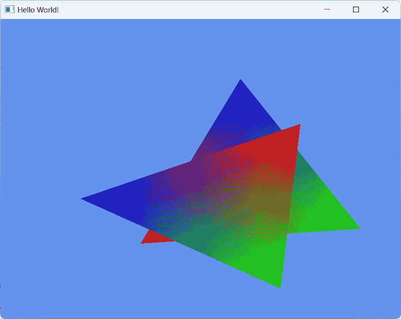

图 5.4 – 两个相互重叠的有色三角形

## 它是如何工作的...

OpenGL 支持的几何原语类型包括点、线、线段、线环、多边形、四边形、四边形带、三角形、三角形带和三角形扇。在这个例子中，我们画了两个三角形，每个形状都提供了一组顶点和颜色，这样 OpenGL 就知道如何渲染这些形状。

彩虹色效果是通过给每个顶点赋予不同的颜色来创建的。OpenGL 将自动在每两个顶点之间插值颜色，并在屏幕上显示。目前，首先渲染的形状将出现在后来渲染的其他形状的后面。这是因为我们正在 2D 空间中渲染形状，没有涉及深度信息来检查哪个形状位于前面等等。我们将在下面的例子中学习如何进行深度检查。

# 渲染 3D 形状

在上一节中，我们学习了如何在屏幕上绘制简单的 2D 形状。然而，为了充分利用 OpenGL API，我们还需要学习如何使用它来渲染 3D 图像。简而言之，3D 图像只是使用 2D 形状创建的幻觉，这些形状堆叠在一起，使得它们看起来像是 3D 的。

## 如何做到这一点...

这里的主要成分是深度值，它决定了哪些形状应该出现在其他形状的前面或后面。位于另一个表面后面（深度比另一个形状浅）的原始形状将不会被渲染（或只会部分渲染）。OpenGL 提供了一种简单的方法来实现这一点：

1.  让我们继续我们的上一个 2D 示例项目。通过在 `renderwindow.cpp` 中的 `initializeGL()` 函数中添加 `glEnable(GL_DEPTH_TEST)` 来启用深度测试：

    ```cpp
    void RenderWindow::initializeGL() {
        openGLFunctions = openGLContext->functions();
        GL_DEPTH_TEST in the preceding step, we must also set the depth buffer size when setting the OpenGL profile:

    ```

    QSurfaceFormat format;

    format.setProfile(QSurfaceFormat::CoreProfile);

    format.setVersion(3, 2);

    vbo_colors VBO 同样的原因：

    ```cpp
        GLfloat vertices[] = {
         -1.0f,-1.0f,-1.0f,1.0f,-1.0f,-1.0f,-1.0f,-1.0f, 1.0f,
         1.0f,-1.0f,-1.0f,1.0f,-1.0f, 1.0f,-1.0f,-1.0f, 1.0f,
         -1.0f, 1.0f,-1.0f,-1.0f, 1.0f, 1.0f,1.0f, 1.0f,-1.0f,
         1.0f, 1.0f,-1.0f,-1.0f, 1.0f, 1.0f,1.0f, 1.0f, 1.0f,
         -1.0f,-1.0f, 1.0f,1.0f,-1.0f, 1.0f,-1.0f, 1.0f, 1.0f,
         1.0f,-1.0f, 1.0f,1.0f, 1.0f, 1.0f,-1.0f, 1.0f, 1.0f,
         -1.0f,-1.0f,-1.0f,-1.0f, 1.0f,-1.0f,1.0f,-1.0f,-1.0f,
         1.0f,-1.0f,-1.0f,-1.0f, 1.0f,-1.0f,1.0f, 1.0f,-1.0f,
         -1.0f,-1.0f, 1.0f,-1.0f, 1.0f,-1.0f,-1.0f,-1.0f,-1.0f,
         -1.0f,-1.0f, 1.0f,-1.0f, 1.0f, 1.0f,-1.0f, 1.0f,-1.0f,
         1.0f,-1.0f, 1.0f,1.0f,-1.0f,-1.0f,1.0f, 1.0f,-1.0f,
         1.0f,-1.0f, 1.0f,1.0f, 1.0f,-1.0f,1.0f, 1.0f, 1.0f
     };
    ```

    ```cpp

    ```

1.  在 `paintEvent()` 函数中，我们必须在 `glClear()` 函数中添加 `GL_DEPTH_BUFFER_BIT`，因为我们已经在上一步骤中的 `initializeGL()` 中启用了深度测试：

    ```cpp
    glClear(GL_COLOR_BUFFER_BIT | GL_DEPTH_BUFFER_BIT);
    ```

1.  之后，我们需要向一个称为 **模型视图-投影** (**MVP**) 的着色器发送一段矩阵信息，这样 GPU 就知道如何在 2D 屏幕上渲染 3D 形状。MVP 矩阵是投影矩阵、视图矩阵和模型矩阵相乘的结果。乘法顺序非常重要，以确保你得到正确的结果：

    ```cpp
        QMatrix4x4 matrixMVP;
        QMatrix4x4 model, view, projection;
        model.translate(0, 1, 0);
        model.rotate(45, 0, 1, 0);
        view.lookAt(QVector3D(4, 4, 0), QVector3D(0, 0, 0),
        QVector3D(0, 1, 0));
        projection.perspective(60.0f,
         ((float)this->width()/(float)this->height()), 0.1f, 100.0f);
        matrixMVP = projection * view * model;
        shaderProgram->setUniformValue("matrix", matrixMVP);
    ```

1.  将 `glDrawArrays()` 中的最后一个值更改为 `36`，因为我们现在在立方体形状中有 36 个三角形：

    ```cpp
        glDrawArrays(GL_TRIANGLES, 0, 36);
    ```

1.  我们必须回到我们的着色器代码，并更改其中的一些部分，如下面的代码所示：

    ```cpp
        static const char *vertexShaderSource =
        "#version 330 core\n"
        "layout(location = 0) in vec3 posAttr;\n"
        "uniform mat4 matrix;\n"
        "out vec3 fragPos;\n"
        "void main() {\n"
        "fragPos = posAttr;\n"
        "gl_Position = matrix * vec4(posAttr, 1.0); }";
        static const char *fragmentShaderSource =
        "#version 330 core\n"
        "in vec3 fragPos;\n"
        "out vec4 col;\n"
        "void main() {\n"
        "col = vec4(fragPos, 1.0); }";
    ```

1.  如果你现在构建并运行项目，你应该在屏幕上看到一个多彩的立方体出现。我们使用相同的顶点数组来着色，这给出了这个多彩的结果：

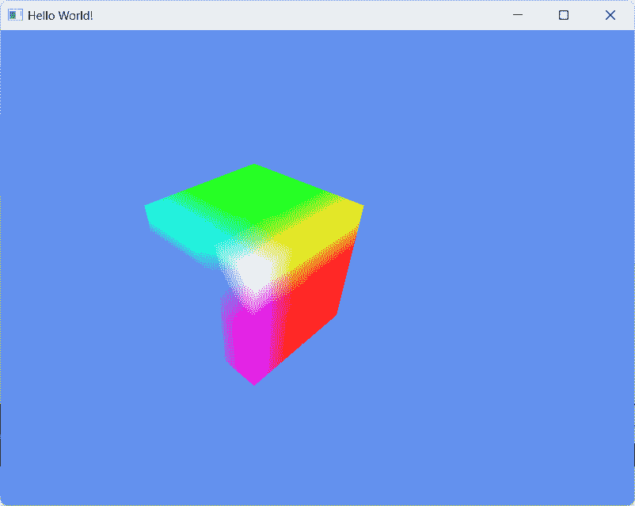

图 5.5 – 使用 OpenGL 渲染的彩色 3D 立方体

1.  即使结果看起来相当不错，如果我们真的想展示 3D 效果，那就需要通过动画化立方体来实现。要做到这一点，首先，我们需要打开`renderwindow.h`并将其包含以下头文件：

    ```cpp
    #include <QElapsedTimer>
    ```

1.  然后，将以下变量添加到`renderwindow.h`中。请注意，在现代 C++标准中，您可以在头文件中初始化变量，这在旧的 C++标准中是不允许的：

    ```cpp
        QElapsedTimer* time;
        int currentTime = 0;
        int oldTime = 0;
        float deltaTime = 0;
        float rotation = 0;
    ```

1.  打开`renderwindow.cpp`并将以下高亮代码添加到类构造函数中：

    ```cpp
        openGLContext = new QOpenGLContext();
        openGLContext->setFormat(format);
        openGLContext->create();
        openGLContext->makeCurrent(this);
        time = new QElapsedTimer();
        paintEvent() function. deltaTime is the value of the elapsed time of each frame, which is used to make animation speed consistent, regardless of frame rate performance:

    ```

    `void RenderWindow::paintEvent(QPaintEvent *event) {`

    `Q_UNUSED(event);`

    // 每帧的 Delta 时间

    `currentTime = time->elapsed();`

    `deltaTime = (float)(currentTime - oldTime) / 1000.0f;`

    将旋转变量传递给 rotate()函数，如下所示：

    ```cpp
        rotation += deltaTime * 50;
        QMatrix4x4 matrixMVP;
        QMatrix4x4 model, view, projection;
        model.translate(0, 1, 0);
        model.rotate(rotation, 0, 1, 0);
    ```

    ```cpp

    ```

1.  在`paintEvent()`函数的末尾调用`update()`函数，这样`paintEvent()`就会在每次绘制调用的末尾被反复调用。由于我们在`paintEvent()`函数中改变了旋转值，我们可以给观众一个旋转立方体的错觉：

    ```cpp
        glDrawArrays(GL_TRIANGLES, 0, 36);
        shaderProgram->release();
        vao->release();
        this->update();
    }
    ```

1.  如果现在编译并运行程序，你应该能在渲染窗口中看到一个旋转的立方体！

## 它是如何工作的...

在任何 3D 渲染中，深度都非常重要，因此我们需要通过调用`glEnable(GL_DEPTH_TEST)`在 OpenGL 中启用深度测试功能。当我们清除缓冲区时，还必须指定`GL_DEPTH_BUFFER_BIT`，以便深度信息也被清除，以便正确渲染下一个图像。

我们使用 OpenGL 中的 MVP 矩阵，这样 GPU 就知道如何正确渲染 3D 图形。在 OpenGL 3 及更高版本中，OpenGL 不再通过固定函数自动处理这一点。程序员被赋予了根据他们的用例定义自己的矩阵的自由和灵活性，然后只需通过着色器将其提供给 GPU 以渲染最终图像。模型矩阵包含 3D 对象的变换数据，即对象的位置、旋转和缩放。另一方面，视图矩阵是相机或视图信息。最后，投影矩阵告诉 GPU 在将 3D 世界投影到 2D 屏幕时使用哪种投影方法。

在我们的例子中，我们使用了透视投影方法，这能更好地感知距离和深度。与透视投影相反的是**正交投影**，它使一切看起来都扁平且平行：

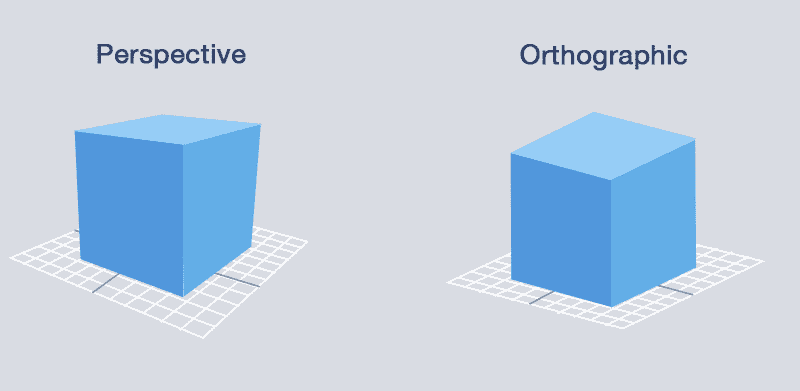

图 5.6 – 透视视图和正交视图之间的差异

在这个例子中，我们使用计时器通过将`deltaTime`值乘以 50 来增加旋转值。`deltaTime`值会根据您的渲染帧率而变化。然而，它使得不同硬件在不同帧率渲染时的动画速度保持一致。

记得手动调用 `update()` 以刷新屏幕，否则立方体将不会动画化。

# OpenGL 中的纹理化

OpenGL 允许我们将图像（也称为 `BMP`、`JPEG`、`PNG`、`TARGA`、`TIFF` 等）映射到纹理上，而且你不必自己实现它。我们将使用之前的旋转立方体示例，并尝试使用纹理来映射它！

## 如何操作…

让我们按照以下步骤学习如何在 OpenGL 中使用纹理：

1.  打开 `renderwindow.h` 并添加以下代码块中突出显示的变量：

    ```cpp
        QOpenGLContext* openGLContext;
        QOpenGLFunctions* openGLFunctions;
        QOpenGLShaderProgram* shaderProgram;
        QOpenGLVertexArrayObject* vao;
        QOpenGLBuffer* vbo_vertices;
        QOpenGLBuffer* vbo_uvs;
        glEnable(GL_TEXTURE_2D) in the initializeGL() function to enable the texture mapping feature:

    ```

    void RenderWindow::initializeGL()

    {

    openGLFunctions = openGLContext->functions();

    glEnable(GL_DEPTH_TEST);

    在 QOpenGLTexture 类下的纹理变量。我们将从应用程序文件夹中加载一个名为 brick.jpg 的纹理，并通过调用 mirrored() 来翻转图像。OpenGL 使用不同的坐标系，因此我们需要在将纹理传递给着色器之前翻转我们的纹理。我们还将设置最小和最大过滤器为最近邻和线性，如下所示：

    ```cpp
        texture = new QOpenGLTexture(QImage(qApp->applicationDirPath() + "/brick.jpg").mirrored());
        texture->setMinificationFilter(QOpenGLTexture::Nearest);
        texture->setMagnificationFilter(QOpenGLTexture::Linear);
    ```

    ```cpp

    ```

1.  添加另一个名为 `uvs` 的数组。这是我们保存 `cube` 对象纹理坐标的地方：

    ```cpp
        GLfloat uvs[] = {
         0.0f, 0.0f, 1.0f, 0.0f, 0.0f, 1.0f,
         1.0f, 0.0f, 1.0f, 1.0f, 0.0f, 1.0f,
         0.0f, 0.0f, 0.0f, 1.0f, 1.0f, 0.0f,
         1.0f, 0.0f, 0.0f, 1.0f, 1.0f, 1.0f,
         1.0f, 0.0f, 0.0f, 0.0f, 1.0f, 1.0f,
         0.0f, 0.0f, 0.0f, 1.0f, 1.0f, 1.0f,
         0.0f, 0.0f, 0.0f, 1.0f, 1.0f, 0.0f,
         1.0f, 0.0f, 0.0f, 1.0f, 1.0f, 1.0f,
         0.0f, 1.0f, 1.0f, 0.0f, 0.0f, 0.0f,
         0.0f, 1.0f, 1.0f, 1.0f, 1.0f, 0.0f,
         1.0f, 1.0f, 1.0f, 0.0f, 0.0f, 0.0f,
         1.0f, 1.0f, 0.0f, 0.0f, 0.0f, 1.0f
    };
    ```

1.  我们必须修改我们的顶点着色器，以便它接受纹理坐标来计算纹理将应用到对象表面的位置。在这里，我们只是将纹理坐标传递到片段着色器而不进行修改：

    ```cpp
        static const char *vertexShaderSource =
        "#version 330 core\n"
        "layout(location = 0) in vec3 posAttr;\n"
        "layout(location = 1) in vec2 uvAttr;\n"
        "uniform mat4 matrix;\n"
        "out vec3 fragPos;\n"
        "out vec2 fragUV;\n"
        "void main() {\n"
        "fragPos = posAttr;\n"
        "fragUV = uvAttr;\n"
        "gl_Position = matrix * vec4(posAttr, 1.0); }";
    ```

1.  在片段着色器中，我们通过调用 `texture()` 函数创建一个纹理，该函数接收来自 `fragUV` 的纹理坐标信息和来自 `tex` 的图像采样器：

    ```cpp
        static const char *fragmentShaderSource =
        "#version 330 core\n"
        "in vec3 fragPos;\n"
        "in vec2 fragUV;\n"
        "uniform sampler2D tex;\n"
        "out vec4 col;\n"
        "void main() {\n"
        "vec4 texCol = texture(tex, fragUV);\n"
        "col = texCol; }";
    ```

1.  我们还必须初始化纹理坐标的 VBO：

    ```cpp
        vbo_uvs = new QOpenGLBuffer(QOpenGLBuffer::VertexBuffer);
        vbo_uvs->create();
        vbo_uvs->setUsagePattern(QOpenGLBuffer::StaticDraw);
        vbo_uvs->bind();
        vbo_uvs->allocate(uvs, sizeof(uvs) * sizeof(GLfloat));
    ```

1.  在 `paintEvent()` 函数中，我们必须将纹理坐标信息发送到着色器，然后在调用 `glDrawArrays()` 之前绑定纹理：

    ```cpp
        vbo_uvs->bind();
        shaderProgram->bindAttributeLocation("uvAttr", 1);
        shaderProgram->enableAttributeArray(1);
        shaderProgram->setAttributeBuffer(1, GL_FLOAT, 0, 2);
        texture->bind();
        glDrawArrays(GL_TRIANGLES, 0, 36);
    ```

1.  如果你现在编译并运行程序，你应该会在屏幕上看到一个旋转的砖块立方体：

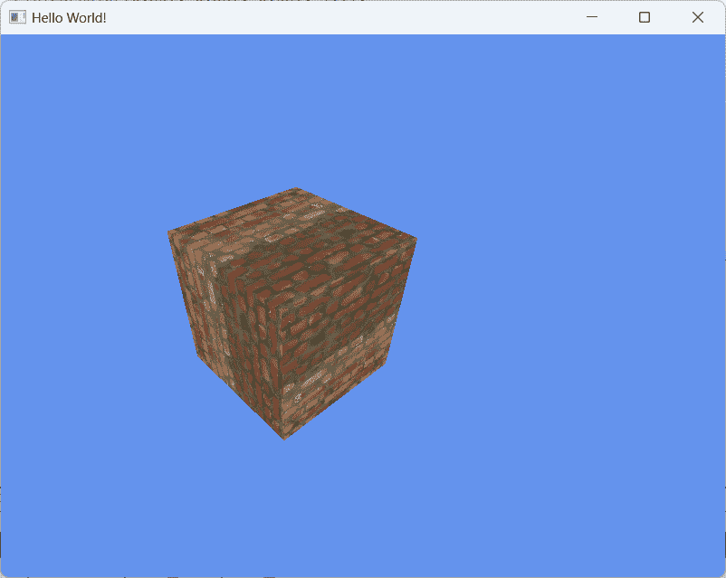

图 5.7 – 我们的三维立方体现在看起来像是用砖块创建的

## 它是如何工作的…

Qt 6 使得加载纹理变得非常简单。只需一行代码就可以加载图像文件，翻转它，并将其转换为 OpenGL 兼容的纹理。纹理坐标是让 OpenGL 知道在屏幕上显示之前如何将纹理粘贴到对象表面的信息。

`min` 和 `max` 过滤器是当纹理应用于其分辨率无法覆盖的表面时使纹理看起来更好的过滤器。此设置的默认值为 `GL_NEAREST`，代表 `GL_LINEAR`，代表 `GL_NEAREST`：

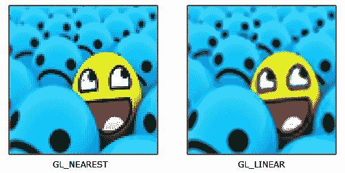

图 5.8 - GL_NEAREST 和 GL_LINEAR 之间的差异

# OpenGL 中的基本光照

在这个例子中，我们将学习如何通过使用 OpenGL 和 Qt 6 在我们的 3D 场景中添加一个简单的点光源。

## 如何操作…

让我们按照以下步骤开始：

1.  再次，我们将使用之前的示例，并在旋转的立方体附近添加一个点光源。打开 `renderwindow.h` 文件，并向文件中添加一个名为 `vbo_normals` 的变量：

    ```cpp
        QOpenGLBuffer* vbo_uvs;
        QOpenGLBuffer* vbo_normals;
        QOpenGLTexture* texture;
    ```

1.  打开 `renderwindow.cpp` 文件，并在 `initializeGL()` 函数中添加一个名为 `normals` 的数组：

    ```cpp
        GLfloat normals[] = {
         0.0f, -1.0f, 0.0f, 0.0f, -1.0f, 0.0f, 0.0f, -1.0f, 0.0f,
         0.0f, -1.0f, 0.0f, 0.0f, -1.0f, 0.0f, 0.0f, -1.0f, 0.0f,
         0.0f, 1.0f, 0.0f, 0.0f, 1.0f, 0.0f, 0.0f, 1.0f, 0.0f,
         0.0f, 1.0f, 0.0f, 0.0f, 1.0f, 0.0f, 0.0f, 1.0f, 0.0f,
         1.0f, 0.0f, 0.0f, 1.0f, 0.0f, 0.0f, 1.0f, 0.0f, 0.0f,
         1.0f, 0.0f, 0.0f, 1.0f, 0.0f, 0.0f, 1.0f, 0.0f, 0.0f,
         0.0f, 0.0f, 1.0f, 0.0f, 0.0f, 1.0f, 0.0f, 0.0f, 1.0f,
         0.0f, 0.0f, 1.0f, 0.0f, 0.0f, 1.0f, 0.0f, 0.0f, 1.0f,
         -1.0f, 0.0f, 0.0f, -1.0f, 0.0f, 0.0f, -1.0f, 0.0f, 0.0f,
         -1.0f, 0.0f, 0.0f, -1.0f, 0.0f, 0.0f, -1.0f, 0.0f, 0.0f,
         0.0f, 0.0f, -1.0f, 0.0f, 0.0f, -1.0f, 0.0f, 0.0f, -1.0f,
         0.0f, 0.0f, -1.0f, 0.0f, 0.0f, -1.0f, 0.0f, 0.0f, -1.0f
    };
    ```

1.  在 `initializeGL()` 中初始化 `vbo_normals` VBO，添加以下代码：

    ```cpp
        vbo_normals = new QOpenGLBuffer(QOpenGLBuffer::VertexBuffer);
        vbo_normals->create();
        vbo_normals->setUsagePattern(QOpenGLBuffer::StaticDraw);
        vbo_normals->bind();
        vbo_normals->allocate(normals, sizeof(normals) * sizeof(GLfloat));
    ```

1.  由于这次我们将编写的着色器将比之前示例中的更长，让我们将着色器代码移动到文本文件中，并通过调用 `addShaderFromSourceFile()` 将它们加载到程序中：

    ```cpp
        shaderProgram = new QOpenGLShaderProgram(this);
        shaderProgram->addShaderFromSourceFile(QOpenGLShader::Vertex,
        qApp->applicationDirPath() + "/vertex.txt");
        shaderProgram->addShaderFromSourceFile(QOpenGLShader::Fragment,
        qApp->applicationDirPath() + "/fragment.txt");
    shaderProgram->link();
    ```

1.  完成这些后，将以下代码添加到 `paintEvent()` 函数中，将 `normals` VBO 传递给着色器：

    ```cpp
        vbo_normals->bind();
        shaderProgram->bindAttributeLocation("normalAttr", 2);
        shaderProgram->enableAttributeArray(2);
        shaderProgram->setAttributeBuffer(2, GL_FLOAT, 0, 3);
    ```

1.  让我们打开我们刚刚创建的两个包含着色器代码的文本文件。首先，我们需要对顶点着色器进行一些修改，如下所示：

    ```cpp
        #version 330 core
        layout(location = 0) in vec3 posAttr;
        layout(location = 1) in vec2 uvAttr;
        layout(location = 2) in vec3 normalAttr;
        uniform mat4 matrix;
        out vec3 fragPos;
        out vec2 fragUV;
        out vec3 fragNormal;
    void main() {
        fragPos = posAttr;
        fragUV = uvAttr;
        fragNormal = normalAttr;
        gl_Position = matrix * vec4(posAttr, 1.0);
    }
    ```

1.  我们还将对片段着色器进行一些修改。在着色器代码中，我们将创建一个名为 `calcPointLight()` 的函数：

    ```cpp
        #version 330 core
        in vec3 fragPos;
        in vec2 fragUV;
        in vec3 fragNormal;
        uniform sampler2D tex;
        out vec4 col;
        vec4 calcPointLight() {
        vec4 texCol = texture(tex, fragUV);
        vec3 lightPos = vec3(1.0, 2.0, 1.5);
        vec3 lightDir = normalize(lightPos - fragPos);
        vec4 lightColor = vec4(1.0, 1.0, 1.0, 1.0);
        calcPointLight() and output the resulting fragment to the col variable, as follows:

    ```

    // 漫反射

    float diffuseStrength = 1.0;

    float diff = clamp(dot(fragNormal, lightDir), 0.0, 1.0);

    vec4 diffuse = diffuseStrength * diff * texCol * lightColor * lightIntensity;

    return diffuse;

    }

    void main() {

    vec4 finalColor = calcPointLight();

    col = finalColor;

    }

    ```cpp

    ```

1.  如果现在编译并运行程序，您应该能看到光照效果：

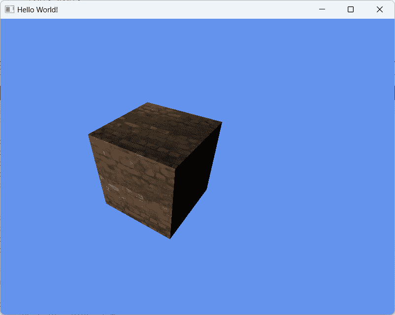

图 5.9 – 我们的三维立方体现在有了着色

## 它是如何工作的...

在 OpenGL 3 及更高版本中，固定功能光照已不再存在。您不能再通过调用 `glEnable(GL_LIGHT1)` 来向您的 3D 场景添加光照。添加光照的新方法是自己在着色器中计算光照。这为您提供了根据需要创建所有类型光照的灵活性。旧方法在大多数硬件中最多只能支持 16 个光照，但使用新的可编程管道，您可以在场景中拥有任意数量的光照；然而，光照模型将需要您在着色器中完全编码，这并非易事。

此外，我们还需要为立方体的每个表面添加一个表面法线值。表面法线指示表面朝向何处，并用于光照计算。前面的示例非常简化，以便您了解 OpenGL 中光照的工作原理。在实际应用中，您可能需要从 C++传递一些变量，如光照强度、光照颜色和光照位置，或者从材质文件中加载它们，而不是在着色器代码中硬编码。

# 使用键盘控制移动对象

在本节中，我们将探讨如何使用键盘控制移动 OpenGL 中的对象。Qt 通过使用虚拟函数，如 `keyPressEvent()` 和 `keyReleaseEvent()`，提供了一个简单的方法来检测键盘事件。我们将使用之前的示例并在此基础上进行添加。

## 如何操作…

使用键盘控制移动对象，请按照以下步骤操作：

1.  打开 `renderwindow.h` 并声明两个名为 `moveX` 和 `moveZ` 的浮点数。然后，声明一个名为 `movement` 的 `QVector3D` 变量：

    ```cpp
        QElapsedTimer* time;
        int currentTime = 0;
        int oldTime = 0;
        float deltaTime = 0;
        float rotation = 0;
        float moveX = 0;
        float moveZ = 0;
        keyPressEvent() and keyReleaseEvent():

    ```

    protected:

    void initializeGL();

    void paintEvent(QPaintEvent *event);

    void resizeEvent(QResizeEvent *event);

    void keyPressEvent(QKeyEvent *event);

    void keyReleaseEvent(QKeyEvent *event);

    ```cpp

    ```

1.  我们将在 `renderwindow.cpp` 中实现 `keyPressEvent()` 函数：

    ```cpp
    void RenderWindow::keyPressEvent(QKeyEvent *event) {
        if (event->key() == Qt::Key_W) { moveZ = -10; }
        if (event->key() == Qt::Key_S) { moveZ = 10; }
        if (event->key() == Qt::Key_A) { moveX = -10; }
        if (event->key() == Qt::Key_D) { moveX = 10; }
    }
    ```

1.  我们还将实现 `keyReleaseEvent()` 函数：

    ```cpp
    void RenderWindow::keyReleaseEvent(QKeyEvent *event) {
        if (event->key() == Qt::Key_W) { moveZ = 0; }
        if (event->key() == Qt::Key_S) { moveZ = 0; }
        if (event->key() == Qt::Key_A) { moveX = 0; }
        if (event->key() == Qt::Key_D) { moveX = 0; }
    }
    ```

1.  之后，我们将注释掉 `paintEvent()` 中的旋转代码，并添加运动代码，如下面的片段所示。我们不想被旋转分散注意力，只想专注于运动：

    ```cpp
        //rotation += deltaTime * 50;
        movement.setX(movement.x() + moveX * deltaTime);
        movement.setZ(movement.z() + moveZ * deltaTime);
        QMatrix4x4 matrixMVP;
        QMatrix4x4 model, view, projection;
        model.translate(movement.x(), 1, movement.z());
    ```

1.  如果你现在编译并运行程序，你应该能够通过按*W*、*A*、*S*和*D*来移动立方体。

## 它是如何工作的...

我们在这里所做的就是不断向 `moveX` 和 `moveZ` 的 `movement` 向量的 `x` 和 `z` 值添加。当按键被按下时，`moveX` 和 `moveZ` 将成为正数或负数，具体取决于哪个按钮被按下；否则，它将是零。在 `keyPressEvent()` 函数中，我们检查按下的键盘按钮是否是 *W*、*A*、*S* 或 *D*；然后相应地设置变量。要获取 Qt 使用的所有键名的完整列表，请访问 [`doc.qt.io/qt-6/qt.html#Key-enum`](http://doc.qt.io/qt-6/qt.html#Key-enum)。

一种创建运动输入的方法是按住相同的键而不释放它。Qt 6 将在间隔后重复按键事件，但这并不流畅，因为现代操作系统限制按键事件以防止双击。键盘输入间隔在不同操作系统之间有所不同。你可以通过调用 `QApplication::setKeyboardInterval()` 来设置间隔，但这可能不是每个操作系统都有效。因此，我们没有采用这种方法。

相反，我们只在按键按下或释放时设置一次 `moveX` 和 `moveZ`，然后在游戏循环中持续应用这个值到运动向量，这样它就可以连续移动而不会受到输入间隔的影响。

# QML 中的 Qt Quick 3D

在这个菜谱中，我们将学习如何使用 Qt 6 渲染 3D 图像。

## 如何做到这一点…

让我们通过以下示例学习如何在 QML 中使用 3D 画布：

1.  让我们从在 Qt Creator 中创建一个新项目开始这个示例。这次，我们将选择**Qt Quick 应用程序**而不是之前示例中选择的其它选项：


图 5.10 – 创建新的 Qt Quick 应用程序项目

1.  一旦创建项目，你需要通过访问 `resource.qrc` 来创建一个资源文件：


图 5.11 – 创建 Qt 资源文件

1.  将图像文件添加到我们的项目资源中——我们将在本例中使用它。通过在`brick.jpg`图像上右键单击，使用 Qt Creator 打开`resource.qrc`，该图像将被用作我们 3D 对象的表面纹理：

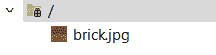

图 5.12 – 将砖纹理添加到资源文件中

1.  之后，使用 Qt Creator 打开`main.qml`。你会看到文件中已经写了几行代码。它的基本功能是打开一个空窗口，没有其他功能。让我们开始向`Window`对象添加我们自己的代码。

1.  首先，将`QtQuick3D`模块导入到我们的项目中，并在`Window`对象下创建一个`View3D`对象，我们将使用它来在 3D 场景上渲染：

    ```cpp
    import QtQuick
    import QtQuick3D
    Window {
        width: 640
        height: 480
        visible: true
        title: qsTr("Hello World")
        View3D {
            id: view
            anchors.fill: parent
        }
    }
    ```

1.  之后，将`View3D`对象的`environment`变量设置为一个新的`SceneEnvironment`对象。我们使用它来设置 3D 视图的背景颜色为天蓝色：

    ```cpp
    environment: SceneEnvironment {
        clearColor: "skyblue"
        backgroundMode: SceneEnvironment.Color
    }
    ```

1.  之后，我们通过在 3D 视图中声明一个`Model`对象并设置其源为`Cube`来重新创建我们之前的 OpenGL 示例中的 3D 立方体。然后我们沿 y 轴旋转它`-30`单位，并给它应用一个材质。之后，我们将材质的纹理设置为`brick.jpg`。这里的`qrc:`关键字意味着我们从我们之前创建的资源文件中获取纹理：

    ```cpp
    Model {
        position: Qt.vector3d(0, 0, 0)
        source: "#Cube"
        eulerRotation.y: -30
        materials: PrincipledMaterial {
            baseColorMap: Texture {
                source: "qrc:/brick.jpg"
            }
        }
    }
    ```

1.  在我们能够清楚地看到我们的 3D 立方体之前，我们必须创建一个光源以及一个相机，这有助于渲染我们的场景：

    ```cpp
    PerspectiveCamera {
        position: Qt.vector3d(0, 200, 300)
        eulerRotation.x: -30
    }
    DirectionalLight {
        eulerRotation.x: -10
        eulerRotation.y: -20
    }
    ```

1.  完成后，构建并运行项目。你应该能在屏幕上看到一个带有砖纹理的 3D 立方体：

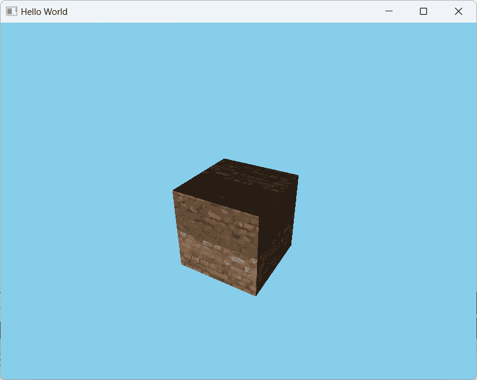

图 5.13 – 在 QtQuick3D 中重新创建 3D 演示

1.  要重新创建旋转动画，让我们在我们的立方体模型中添加`NumberAnimation`：

    ```cpp
    Model {
        position: Qt.vector3d(0, 0, 0)
        source: "#Cube"
        eulerRotation.y: -30
        materials: PrincipledMaterial {
            baseColorMap: Texture {
                source: "qrc:/brick.jpg"
            }
        }
        NumberAnimation on eulerRotation.y {
            duration: 3000
            to: 360
            from: 0
            easing.type:Easing.Linear
            loops: Animation.Infinite
        }
    }
    ```

## 它是如何工作的...

最初，Qt 5 使用一个名为`three.js`库/API 的东西，它使用 WebGL 技术来在 Qt Quick 窗口中显示动画 3D 计算机图形。然而，这个特性在 Qt 6 中已被完全弃用，并已被另一个名为**Qt Quick 3D**的模块所取代。

Qt Quick 3D 比 Qt Canvas 3D 工作得更好，因为它使用本地方法来渲染 3D 场景，而不依赖于第三方库如`three.js`。它还产生更好的性能，并与任何现有的 Qt Quick 组件很好地集成。
