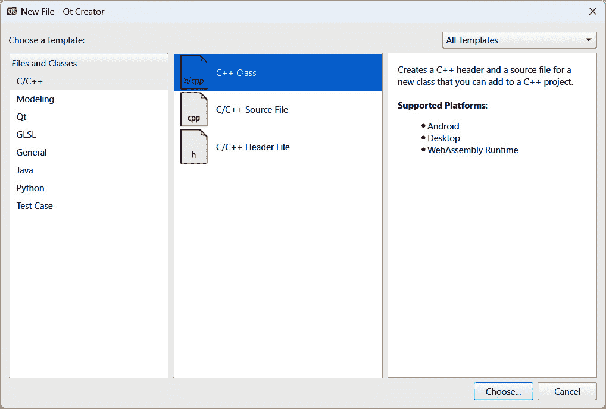
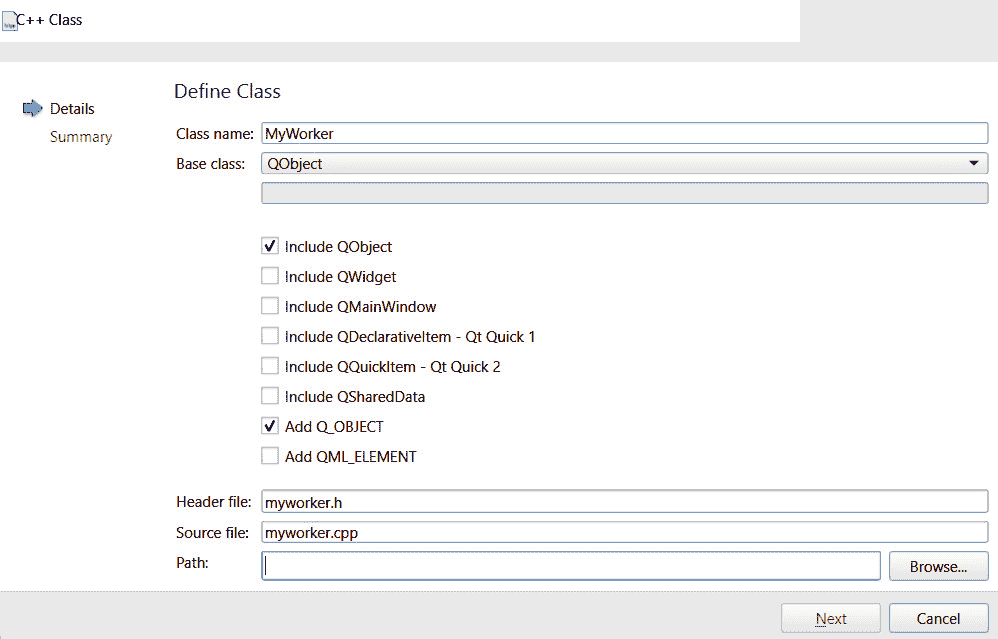

# 第八章：线程基础 – 异步编程

大多数现代软件都并行运行其进程，并将任务卸载到不同的线程，以利用现代 CPU 多核架构。这样，软件可以通过同时运行多个进程来提高效率，而不会影响性能。在本章中，我们将学习如何利用 **线程** 来提高我们的 Qt 6 应用程序的性能和效率。

本章将涵盖以下食谱：

+   使用线程

+   `QObject` 和 `QThread`

+   数据保护和线程间数据共享

+   与 `QRunnable` 进程一起工作

# 技术要求

本章的技术要求包括 Qt 6.6.1 和 Qt Creator 12.0.2。本章使用的所有代码都可以从以下 GitHub 仓库下载：[`github.com/PacktPublishing/QT6-C-GUI-Programming-Cookbook---Third-Edition-/tree/main/Chapter08`](https://github.com/PacktPublishing/QT6-C-GUI-Programming-Cookbook---Third-Edition-/tree/main/Chapter08)。

# 使用线程

Qt 6 提供了多种创建和使用线程的方法。你可以选择高级方法或低级方法。高级方法更容易上手，但功能有限。相反，低级方法更灵活，但不适合初学者。在本食谱中，我们将学习如何使用一种高级方法轻松创建多线程 Qt 6 应用程序。

## 如何做到这一点…

让我们按照以下步骤学习如何创建多线程应用程序：

1.  创建一个 `main.cpp` 文件。然后，在文件顶部添加以下头文件：

    ```cpp
    #include <QFuture>
    #include <QtConcurrent/QtConcurrent>
    #include <QFutureWatcher>
    #include <QThread>
    #include <QDebug>
    ```

1.  然后，在 `main()` 函数之前创建一个名为 `printText()` 的函数：

    ```cpp
    void printText(QString text, int count) {
        for (int i = 0; i < count; ++i)
            qDebug() << text << QThread::currentThreadId();
        qDebug() << text << "Done";
    }
    ```

1.  然后，在 `main()` 函数之前添加以下代码：

    ```cpp
    int main(int argc, char *argv[]) {
        QApplication a(argc, argv);
        MainWindow w;
        w.show();
        printText("A", 100);
        printText("B", 100);
        return a.exec();
    }
    ```

1.  如果你现在构建并运行程序，你应该会看到 `A` 在 `B` 之前被打印出来。请注意，它们的线程 ID 都是一样的。这是因为我们正在主线程中运行 `printText()` 函数：

    ```cpp
    ...
    "A" 0x2b82c
    "A" 0x2b82c
    "A" 0x2b82c
    "A" Done
    ...
    "B" 0x2b82c
    "B" 0x2b82c
    "B" 0x2b82c
    "B" Done
    ```

1.  为了将它们分离到不同的线程中，让我们使用 Qt 6 提供的一个高级类 `QFuture`。在 `main()` 中注释掉两个 `printText()` 函数，并使用以下代码代替：

    ```cpp
        QFuture<void> f1 = QtConcurrent::run(printText, QString("A"), 100);
        QFuture<void> f2 = QtConcurrent::run(printText, QString("B"), 100);
        QFuture<void> f3 = QtConcurrent::run(printText, QString("C"), 100);
        f1.waitForFinished();
        f2.waitForFinished();
        f3.waitForFinished();
    ```

1.  如果你再次构建并运行程序，你应该在调试窗口中看到以下类似内容被打印出来，这意味着三个 `printText()` 函数现在并行运行：

    ```cpp
    ...
    "A" 0x271ec
    "C" 0x26808
    "B" 0x27a40
    "A" 0x271ec
    "C" Done
    "B" 0x27a40
    "A" Done
    "B" Done
    ```

1.  我们还可以使用 `QFutureWatcher` 类通过信号和槽机制通知一个 `QObject` 类。`QFutureWatcher` 类允许我们使用信号和槽来监控 `QFuture`：

    ```cpp
        QFuture<void> f1 = QtConcurrent::run(printText, QString("A"), 100);
        QFuture<void> f2 = QtConcurrent::run(printText, QString("B"), 100);
        QFuture<void> f3 = QtConcurrent::run(printText, QString("C"), 100);
        QFutureWatcher<void> futureWatcher;
        QObject::connect(&futureWatcher,
        QFutureWatcher<void>::finished, &w, MainWindow::mySlot);
        futureWatcher.setFuture(f1);
        f1.waitForFinished();
        f2.waitForFinished();
        f3.waitForFinished();
    ```

1.  然后，打开 `mainwindow.h` 并声明槽函数：

    ```cpp
    public slots:
        void mySlot();
    ```

1.  `mySlot()` 函数在 `mainwindow.cpp` 中的样子如下：

    ```cpp
    void MainWindow::mySlot() {
        qDebug() << "Done!" << QThread::currentThreadId();
    }
    ```

1.  如果你再次构建并运行程序，这次，你会看到以下结果：

    ```cpp
    ...
    "A" 0x271ec
    "C" 0x26808
    "B" 0x27a40
    "A" 0x271ec
    "C" Done
    "B" 0x27a40
    "A" Done
    "B" Done
    QFutureWatcher is linked to f1, the Done! message only gets printed after all of the threads have finished executing. This is because mySlot() runs in the main thread, proven by the thread ID shown in the debug window alongside the Done! message.
    ```

## 它是如何工作的…

默认情况下，任何 Qt 6 应用程序中都有一个主线程（也称为 GUI 线程）。你创建的其他线程被称为 **工作线程**。

与 GUI 相关的类，如`QWidget`和`QPixmap`，只能存在于主线程中，因此处理这些类时必须格外小心。

`QFuture`是一个处理**异步计算**的高级类。

我们使用`QFutureWatcher`类让`QFuture`与信号和槽交互。你甚至可以使用它来在进度条上显示操作的进度。

# QObject 和 QThread

接下来，我们想要探索一些其他方法，以便我们可以在 Qt 6 应用程序中使用线程。Qt 6 提供了一个名为`QThread`的类，它允许你更灵活地创建和执行线程。一个`QThread`对象通过调用`run()`函数开始在一个线程中执行其事件循环。在这个例子中，我们将学习如何通过`Qthread`类使`QObject`类异步工作。

## 如何做到这一点...

让我们通过以下步骤开始：

1.  创建一个新的 Qt 小部件应用程序项目。然后，转到**文件** | **新建文件或项目...**并创建一个**C++** **类**文件：



图 8.1 – 创建一个新的 C++类

1.  之后，将新类命名为`MyWorker`并使其继承自`QObject`类。别忘了默认包含`QObject`类：



图 8.2 – 定义 MyWorker C++类

1.  一旦创建了`MyWorker`类，打开`myworker.h`并在顶部添加以下头文件：

    ```cpp
    #include <QObject>
    #include <QDebug>
    ```

1.  之后，将以下信号和槽函数也添加到文件中：

    ```cpp
    signals:
        void showResults(int res);
        void doneProcess();
    public slots:
        void process();
    ```

1.  接下来，打开`myworker.cpp`并实现`process()`函数：

    ```cpp
    void MyWorker::process() {
        int result = 0;
        for (int i = 0; i < 2000000000; ++i) {
        result += 1;
        }
        emit showResults(result);
        emit doneProcess();
    }
    ```

1.  之后，打开`mainwindow.h`并在顶部添加以下头文件：

    ```cpp
    #include <QDebug>
    #include <QThread>
    #include "myworker.h"
    ```

1.  然后，声明一个槽函数，如下面的代码所示：

    ```cpp
    public slots:
        void handleResults(int res);
    ```

1.  完成后，打开`mainwindow.cpp`并实现`handResults()`函数：

    ```cpp
    void MainWindow::handleResults(int res) {
        qDebug() << "Handle results" << res;
    }
    ```

1.  最后，我们将以下代码添加到`MainWindow`类的构造函数中：

    ```cpp
    MainWindow::MainWindow(QWidget *parent) :     QMainWindow(parent), ui(new Ui::MainWindow){
        ui->setupUi(this);
        QThread* workerThread = new QThread;
        MyWorker *workerObject = new MyWorker;
        workerObject->moveToThread(workerThread);
        connect(workerThread, &QThread::started,  workerObject, &MyWorker::process);
        connect(workerObject, &MyWorker::doneProcess,  workerThread, &QThread::quit);
        connect(workerObject, &MyWorker::doneProcess, workerObject, &MyWorker::deleteLater);
        connect(workerObject, &MyWorker::showResults, this, &MainWindow::handleResults);
        connect(workerThread, &QThread::finished, workerObject, &MyWorker::deleteLater);
        workerThread->start();
    }
    ```

1.  现在构建并运行程序。你应该会看到主窗口弹出，几秒钟内没有任何动作，然后会在调试窗口中打印出一行消息：

    ```cpp
    Final result: 2000000000
    ```

1.  结果是在一个单独的线程中计算的，这就是为什么主窗口可以在计算过程中平滑显示，甚至可以通过鼠标在计算过程中移动。为了看到在主线程上运行计算时的差异，让我们注释掉一些代码并直接调用`process()`函数：

    ```cpp
        //QThread* workerThread = new QThread;
        MyWorker *workerObject = new MyWorker;
        //workerObject->moveToThread(workerThread);
        //connect(workerThread, &QThread::started, workerObject, &MyWorker::process);
        //connect(workerObject, &MyWorker::doneProcess, workerThread, &QThread::quit);
        connect(workerObject, &MyWorker::doneProcess, workerObject, &MyWorker::deleteLater);
        connect(workerObject, &MyWorker::showResults, this, &MainWindow::handleResults);
        //connect(workerThread, &QThread::finished, workerObject, &MyWorker::deleteLater);
        //workerThread->start();
        workerObject->process();
    ```

1.  现在构建并运行项目。这次，主窗口只有在计算完成后才会出现在屏幕上。这是因为计算阻塞了主线程（或 GUI 线程），阻止了主窗口的显示。

## 它是如何工作的...

`QThread`是除了使用`QFuture`类之外运行异步过程的一个替代方法。与`QFuture`相比，它提供了更多的控制，我们将在下面的菜谱中演示。

请注意，被移动到工作线程的`QObject`类不能有任何父类，因为 Qt 的设计方式是整个对象树必须存在于同一个线程中。因此，当你调用`moveToThread()`时，`QObject`类的所有子类也将被移动到工作线程。

如果你想让你的工作线程与主线程通信，请使用信号和槽机制。我们使用`QThread`类提供的`started`信号来通知我们的工作对象开始计算，因为工作线程已经创建。

然后，当计算完成后，我们发出`showResult`和`doneProcess`信号来通知线程退出，同时将最终结果传递给主线程以便打印。

最后，我们也使用信号和槽机制在一切完成后安全地删除工作线程和工作对象。

# 数据保护和线程间数据共享

尽管多线程使进程异步运行，但有时线程必须停止并等待其他线程。这通常发生在两个线程同时修改同一个变量时。通常，强制线程相互等待以保护共享资源，如数据。Qt 6 还提供了低级方法和高级机制来同步线程。

## 如何做到这一点...

我们将继续使用前一个示例项目中的代码，因为我们已经建立了一个具有多线程的运行程序：

1.  打开`myworker.h`并添加以下头文件：

    ```cpp
    #include <QObject>
    #include <QDebug>
    #include <QMutex>
    ```

1.  然后，我们将添加两个新变量并对类构造函数进行一些修改：

    ```cpp
    public:
        explicit MyWorker(QMutex *mutex);
        int* myInputNumber;
        QMutex* myMutex;
    signals:
        void showResults(int res);
        void doneProcess();
    ```

1.  之后，打开`myworker.cpp`并将类构造函数更改为以下代码。由于对象将没有父类，我们不再需要父类输入：

    ```cpp
    MyWorker::MyWorker(QMutex *mutex) {
        myMutex = mutex;
    }
    ```

1.  我们还将更改`process()`函数，使其看起来像这样：

    ```cpp
    void MyWorker::process() {
        myMutex->lock();
        for (int i = 1; i < 100000; ++i){
        *myInputNumber += i * i + 2 * i + 3 * i;
        }
        myMutex->unlock();
        emit showResults(*myInputNumber);
        emit doneProcess();
    }
    ```

1.  完成后，打开`mainwindow.cpp`并对代码进行一些修改：

    ```cpp
    MainWindow::MainWindow(QWidget *parent) : QMainWindow(parent),
        ui(new Ui::MainWindow) {
        ui->setupUi(this);
        int myNumber = 5;
        QMutex* newMutex = new QMutex;
        QThread* workerThread = new QThread;
        QThread* workerThread2 = new QThread;
        QThread* workerThread3 = new QThread;
        MyWorker *workerObject = new MyWorker(newMutex);
        MyWorker *workerObject2 = new MyWorker(newMutex);
        MyWorker *workerObject3 = new MyWorker(newMutex);
    ```

1.  之后，我们将工作对象的`myInputNumber`变量设置为`myNumber`。请注意，我们引用的是其指针而不是值：

    ```cpp
        workerObject->myInputNumber = &myNumber;
        workerObject->moveToThread(workerThread);
        connect(workerThread, &QThread::started, workerObject, &MyWorker::process);
        connect(workerObject, &MyWorker::doneProcess, workerThread, &QThread::quit);
        connect(workerObject, &MyWorker::doneProcess, workerObject, &MyWorker::deleteLater);
        connect(workerObject, &MyWorker::showResults, this, &MainWindow::handleResults);
        connect(workerThread, &QThread::finished, workerObject, &MyWorker::deleteLater);
    ```

1.  重复执行前面的步骤两次，以设置`workerObject2`、`workerThread2`、`workerObject3`和`workerThread3`：

    ```cpp
        workerObject2->myInputNumber = &myNumber;
        workerObject2->moveToThread(workerThread2);
        connect(workerThread2, &QThread::started, workerObject2, &MyWorker::process);
        connect(workerObject2, &MyWorker::doneProcess, workerThread2, &QThread::quit);
        connect(workerObject2, &MyWorker::doneProcess, workerObject2, &MyWorker::deleteLater);
        connect(workerObject2, &MyWorker::showResults, this, &MainWindow::handleResults);
        connect(workerThread2, &QThread::finished, workerObject2, &MyWorker::deleteLater);
        workerObject3->myInputNumber = &myNumber;
        workerObject3->moveToThread(workerThread3);
        connect(workerThread3, &QThread::started, workerObject3, &MyWorker::process);
        connect(workerObject3, &MyWorker::doneProcess, workerThread3, &QThread::quit);
        connect(workerObject3, &MyWorker::doneProcess, workerObject3, &MyWorker::deleteLater);
        connect(workerObject3, &MyWorker::showResults, this, &MainWindow::handleResults);
        connect(workerThread3, &QThread::finished, workerObject3, &MyWorker::deleteLater);
    ```

1.  最后，我们将通过调用`start()`来启动这些线程：

    ```cpp
        workerThread->start();
        workerThread2->start();
        workerThread3->start();
    ```

1.  如果你现在构建并运行程序，你应该看到一致的结果，无论你运行多少次：

    ```cpp
    Final result: -553579035
    Final result: -1107158075
    Final result: -1660737115
    ```

1.  每次运行程序时我们都会得到结果，因为互斥锁确保只有一条线程可以修改数据，而其他线程则等待其完成。为了看到没有互斥锁的差异，让我们注释掉代码：

    ```cpp
    void MyWorker::process() {
        //myMutex->lock();
        for (int i = 1; i < 100000; ++i) {
            *myInputNumber += i * i + 2 * i + 3 * i;
            }
        //myMutex->unlock();
        emit showResults(*myInputNumber);
        emit doneProcess();
    }
    ```

1.  再次构建和运行程序。这次，当你运行程序时，你会得到一个非常不同的结果。例如，我在运行它三次时获得了以下结果：

    ```cpp
    1st time:
    Final result: -589341102
    Final result: 403417142
    Final result: -978935318
    2nd time:
    Final result: 699389030
    Final result: -175723048
    Final result: 1293365532
    3rd time:
    Final result: 1072831160
    Final result: 472989964
    Final result: -534842088
    ```

1.  这是因为 `myNumber` 数据由于并行计算的性质，所有线程同时以随机顺序进行操作。通过锁定互斥锁，我们确保数据只能由单个线程修改，从而消除这个问题。

## 它是如何工作的…

Qt 6 提供了两个类，即 `QMutex` 和 `QReadWriteLock`，用于在多个线程访问和修改相同数据时的数据保护。我们之前只使用了 `QMutex`，但这两个类在本质上非常相似。唯一的区别是 `QReadWriteLock` 允许其他线程在数据写入时同时读取数据。与 `QMutex` 不同，它将读取和写入状态分开，但一次只能发生一个（要么锁定以读取，要么锁定以写入），不能同时发生。对于复杂函数和语句，请使用高级的 `QMutexLocker` 类来简化代码并更容易调试。

这种方法的缺点是，当单个线程修改数据时，其他所有线程都将处于空闲状态。除非没有其他方法，否则最好不要在多个线程之间共享数据，因为这会阻止其他线程并违背并行计算的目的。

# 与 QRunnable 进程一起工作

在这个菜谱中，我们将学习如何使用另一种高级方法轻松创建多线程 Qt 6 应用程序。我们将在这个菜谱中使用 `QRunnable` 和 `QThreadPool` 类。

## 如何做到这一点…

1.  创建一个新的 Qt 小部件应用程序项目，然后创建一个新的名为 `MyProcess` 的 C++ 类，该类继承自 `QRunnable` 类。

1.  接下来，打开 `myprocess.h` 并添加以下头文件：

    ```cpp
    #include <QRunnable>
    #include <QDebug>
    ```

1.  然后，声明 `run()` 函数，如下所示：

    ```cpp
    class MyProcess : public QRunnable {
        public:
                MyProcess();
                void run();
    };
    ```

1.  之后，打开 `myprocess.cpp` 并定义 `run()` 函数：

    ```cpp
    void MyProcess::run() {
        int myNumber = 0;
        for (int i = 0; i < 100000000; ++i) {
        myNumber += i;
        }
        qDebug() << myNumber;
    }
    ```

1.  完成后，将以下头文件添加到 `mainwindow.h` 中：

    ```cpp
    #include <QMainWindow>
    #include <QThreadPool>
    #include "myprocess.h"
    ```

1.  之后，我们将通过添加以下代码来实现类构造函数：

    ```cpp
    MainWindow::MainWindow(QWidget *parent) : QMainWindow(parent),
        ui(new Ui::MainWindow) {
        ui->setupUi(this);
        MyProcess* process = new MyProcess;
        MyProcess* process2 = new MyProcess;
        MyProcess* process3 = new MyProcess;
        MyProcess* process4 = new MyProcess;
        QThreadPool::globalInstance()->start(process);
        QThreadPool::globalInstance()->start(process2);
        QThreadPool::globalInstance()->start(process3);
        QThreadPool::globalInstance()->start(process4);
        qDebug() << QThreadPool::globalInstance()-       >activeThreadCount();
    }
    ```

1.  现在，构建并运行项目。你应该会看到进程在不同的线程中成功运行，其中活动线程数为四个。

1.  `QThreadPool` 类在其最后一个进程执行完毕后会自动停用线程。让我们通过暂停程序三秒并再次打印活动线程数来尝试并证明这一点：

    ```cpp
        qDebug() << QThreadPool::globalInstance()->activeThreadCount();
        this->thread()->sleep(3);
        qDebug() << QThreadPool::globalInstance()->activeThreadCount();
    ```

1.  再次构建并运行程序。这次，你应该会看到活动线程数为四个，然后，在经过三秒后，活动线程数变为零。这是因为所有进程都已执行完毕。

## 它是如何工作的…

`QRunnable` 类与 `QThreadPool` 类紧密协作，后者管理线程集合。`QThreadPool` 类自动管理和回收单个 `QThreads` 对象，以避免频繁创建和销毁线程，这有助于降低计算成本。

要使用 `QThreadPool`，您必须对 `QRunnable` 对象进行子类化并实现名为 `run()` 的虚拟函数。默认情况下，`QThreadPool` 将在最后一个线程退出 `run` 函数时自动删除 `QRunnable` 对象。您可以通过调用 `setAutoDelete()` 来改变 `autoDelete` 变量设置为 `false` 来改变这种行为。

默认情况下，超过 30 秒未被使用的线程将过期。您可以在线程运行之前调用 `setExpiryTimeout()` 来改变这个持续时间。否则，超时设置将不会产生任何效果。

您也可以通过调用 `setMaxThreadCount()` 来设置可使用的最大线程数。要获取当前活动线程的总数，只需调用 `activeThreadCount()`。
