# 9

# 使用 Qt 6 构建触摸屏应用程序

Qt 不仅是一个适用于 PC 平台的跨平台软件开发工具包；它还支持移动平台，如 iOS 和 Android。Qt 的开发者在 2010 年引入了**Qt Quick**，它提供了一种简单的方式来构建高度动态的自定义用户界面，用户可以通过仅使用最少的编码轻松创建流畅的过渡和效果。

Qt Quick 使用一种名为**QML**的声明性脚本语言，这与在 Web 开发中使用的**JavaScript**语言类似。高级用户还可以在 C++中创建自定义函数并将它们移植到 Qt Quick 中，以增强其功能。目前，Qt Quick 支持多个平台，如 Windows、Linux、macOS、iOS 和 Android。

本章将涵盖以下食谱：

+   为移动应用程序设置 Qt

+   使用 QML 设计基本用户界面

+   触摸事件

+   QML 中的动画

+   使用模型/视图显示信息

+   集成 QML 和 C++

# 技术要求

本章的技术要求包括 Qt 6.6.1、Qt Creator 12.0.2、Android **软件开发工具包**（**SDK**）、Android **本地开发工具包**（**NDK**）、**Java 开发工具包**（**JDK**）和 Apache Ant。本章使用的所有代码都可以从以下 GitHub 仓库下载：[`github.com/PacktPublishing/QT6-C-GUI-Programming-Cookbook---Third-Edition-/tree/main/Chapter09`](https://github.com/PacktPublishing/QT6-C-GUI-Programming-Cookbook---Third-Edition-/tree/main/Chapter09)。

# 为移动应用程序设置 Qt

在本例中，我们将学习如何在 Qt Quick 中设置我们的 Qt 项目，并使其能够构建并导出到移动设备。

## 如何操作…

让我们开始学习如何使用 Qt 6 创建我们的第一个移动应用程序：

1.  首先，让我们通过访问**文件** | **新建项目…**来创建一个新的项目。然后，将弹出一个窗口供您选择项目模板。选择**Qt Quick 应用程序**并点击**选择...**按钮，如图下截图所示：

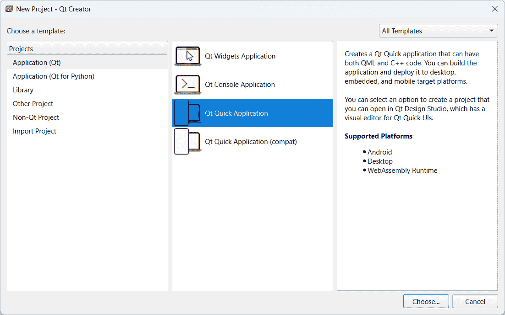

图 9.1 – 创建 Qt Quick 应用程序项目

1.  之后，输入项目名称并选择项目位置。点击**下一步**按钮，系统将要求您选择项目所需的最低 Qt 版本。

重要提示

请确保您选择的是您计算机上存在的版本。否则，您将无法正确运行它。

1.  完成这些操作后，通过点击**下一步**按钮继续。

1.  然后，Qt Creator 将询问您希望为项目使用哪个套件。这些**套件**基本上是不同的编译器，您可以使用它们为不同的平台编译项目。由于我们正在为移动平台制作应用程序，我们将启用 Android 套件（如果您正在运行 Mac，则为 iOS 套件）以构建和导出您的应用到移动设备，如下面的截图所示。您还可以启用桌面套件之一，以便您可以在桌面平台上事先测试您的程序。请注意，如果您是第一次使用 Android 套件，则需要配置它，以便 Qt 可以找到 Android SDK 的目录。完成配置后，点击**下一步**：

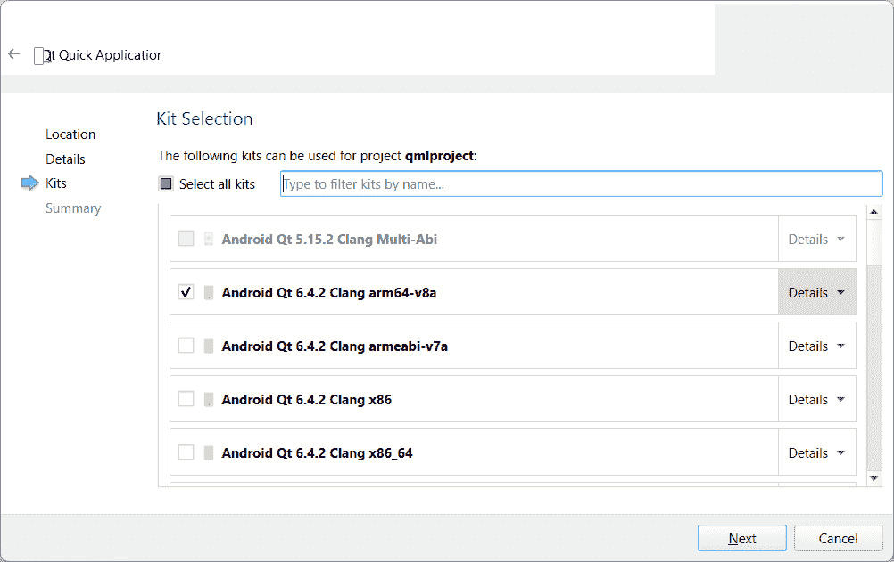

图 9.2 – 为此项目创建 Android 套件

1.  一旦项目创建完成，Qt Creator 将自动打开一个名为`Main.qml`的项目文件。您将看到与您通常的 C/C++项目非常不同类型的脚本，如下面的代码所示：

    ```cpp
    import QtQuick
    import QtQuick.Window
    Window {
        visible: true
        width: 640
        height: 480
        title: qsTr("Hello World")
    }
    ```

1.  现在通过点击 Qt Creator 左下角的绿色箭头按钮来构建和运行项目，如图*图 9.3*所示。如果您将默认套件设置为桌面套件之一，则在项目编译完成后将弹出一个空窗口：

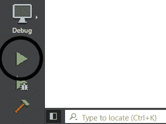

图 9.3 – 点击三角形按钮进行构建和运行

1.  如下一张截图所示，我们可以通过转到项目界面并选择您希望项目使用的套件来在不同的套件之间切换。您还可以从**项目**界面管理您计算机上可用的所有套件或向项目添加新的套件：

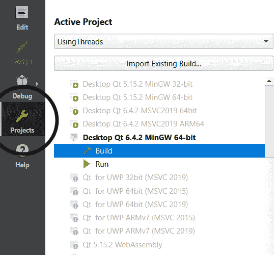

图 9.4 – 在项目界面更改任何套件

1.  如果这是您第一次构建和运行项目，您需要在**构建**设置下为 Android 套件创建一个模板。一旦您在**构建 Android APK**标签页下点击了**创建模板**按钮，如图*图 9.5*所示，Qt 将生成运行您的应用所需的全部文件。如果您不打算在项目中使用 Gradle，请禁用**将 Gradle 文件复制到 Android 目录**选项。否则，在尝试编译和部署您的应用到移动设备时可能会遇到问题：

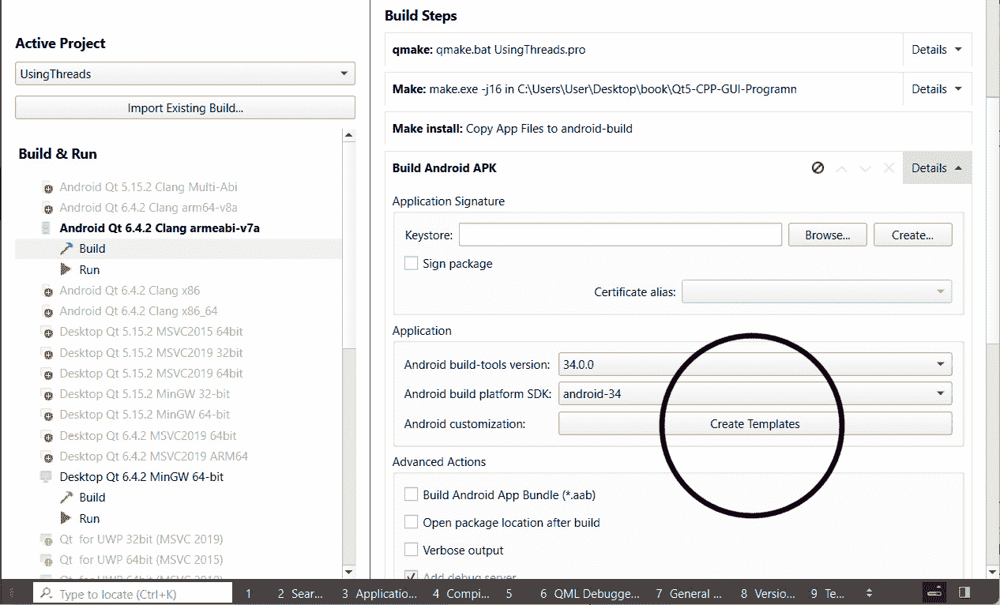

图 9.5 – 点击创建模板按钮以创建 Android 模板文件

1.  一旦点击`AndroidManifest.xml`、与 Gradle 相关的文件以及 Android 平台所需的其它资源。让我们打开`AndroidManifest.xml`文件：

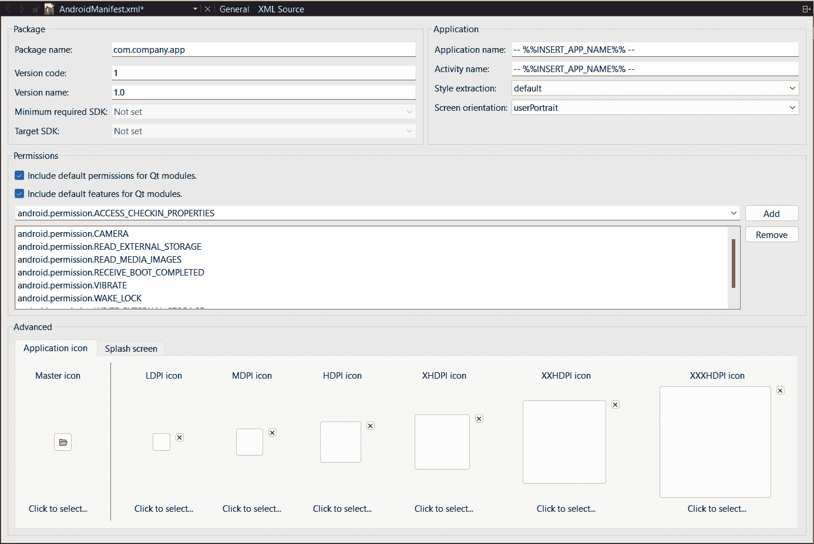

图 9.6 – 在 AndroidManifest.xml 中设置您的应用设置

1.  一旦您打开了`AndroidManifest.xml`，您可以在导出应用程序之前设置您的应用程序包名、版本代码、应用程序图标和权限。要构建和测试您的 Android 应用程序，请点击 Qt Creator 上的**运行**按钮。现在您应该会看到一个窗口弹出，询问它应该导出到哪个设备。

1.  选择当前连接到您电脑的设备，并按下**确定**按钮。等待片刻，让它构建项目，您应该能够在您的移动设备上运行一个空白的应用程序。

## 它是如何工作的...

Qt Quick 应用程序项目与窗口应用程序项目有很大不同。您大部分时间将编写 QML 脚本而不是 C/C++代码。**Android 软件开发工具包**（**SDK**）、**Android 本地开发工具包**（**NDK**）、**Java 开发工具包**（**JDK**）和**Apache Ant**是构建并将您的应用程序导出到 Android 平台所必需的。

或者，您也可以使用 Gradle 而不是 Apache Ant 来构建您的 Android 套件。您需要做的只是启用**使用 Gradle**而不是 Ant 选项，并给 Qt 提供 Gradle 的安装路径。请注意，截至本书编写时，Android Studio 目前不支持 Qt Creator：

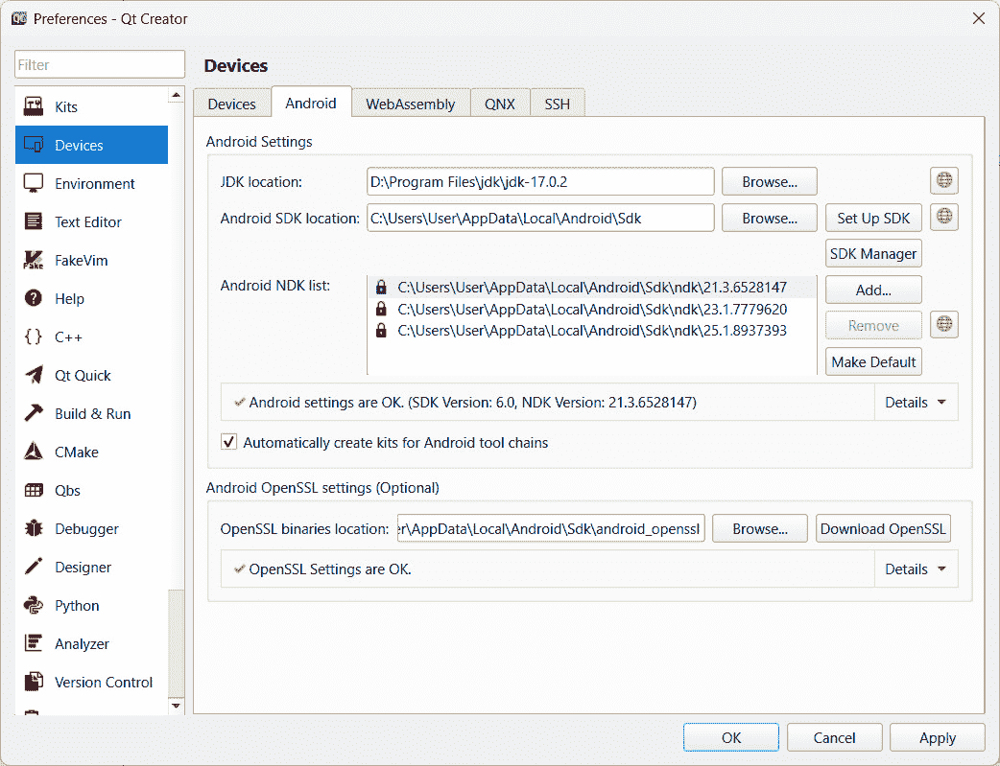

图 9.7 – 在首选项窗口的 Android 选项卡中设置您的 Android 设置

如果您在 Android 设备上运行应用程序，请确保您已启用**USB 调试模式**。要启用 USB 调试模式，您需要首先通过转到**设置 | 关于手机**并点击**构建号**七次来启用您的 Android 设备上的开发者选项。之后，转到**设置 | 开发者选项**，您将在菜单中看到**USB 调试**选项。启用该选项，您现在可以将应用程序导出到您的设备进行测试。

要为 iOS 平台构建，您需要在 Mac 上运行 Qt Creator，并确保您的 Mac 上已安装最新的**Xcode**。要在 iOS 设备上测试您的应用程序，您需要向 Apple 注册一个开发者账户，在开发者门户注册您的设备，并将配置文件安装到您的**Xcode**中，这比 Android 复杂得多。一旦您从 Apple 获得开发者账户，您将获得对开发者门户的访问权限。

# 使用 QML 设计基本用户界面

本例将教会我们如何使用 Qt Design Studio 来设计我们程序的用户界面。

## 如何操作...

让我们按照以下步骤开始：

1.  首先，创建一个新的**Qt Quick 应用程序**项目，就像我们在前面的食谱中所做的那样。然而，这次，请确保您还勾选了**创建一个可以在 Qt Design Studio 中打开的项目**选项：

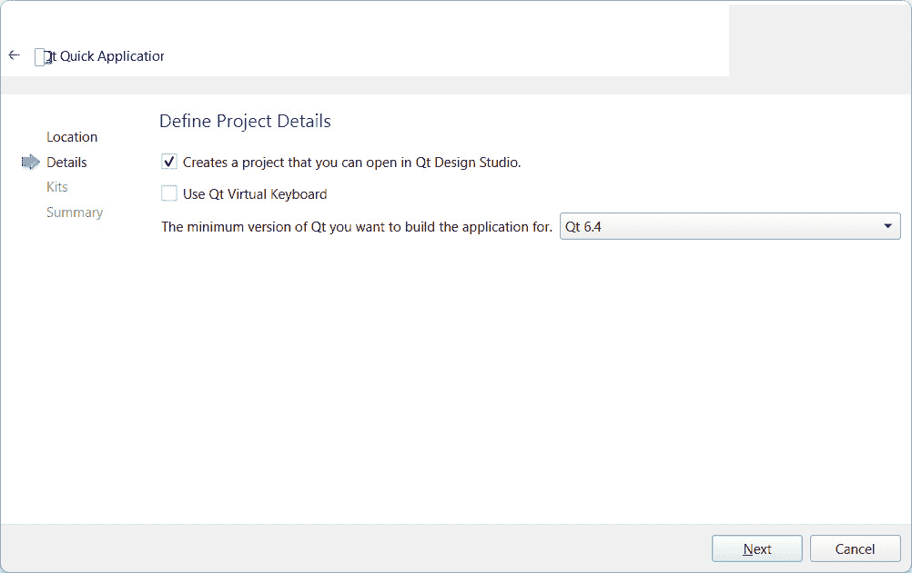

图 9.8 – 确保您的项目可以被 Qt Design Studio 打开

1.  您将在项目资源中看到一个名为`main.qml`的 QML 文件。这是我们实现应用程序逻辑的地方，但我们还需要另一个 QML 文件来定义我们的用户界面。

1.  在我们继续设计程序的用户界面之前，让我们从 Qt 的官方网站下载并安装**Qt Design Studio**：[`www.qt.io/product/ui-design-tools`](https://www.qt.io/product/ui-design-tools)。这是一个 Qt 为 UI/UX 设计师创建的新编辑器，用于设计他们的 Qt Quick 项目的用户界面。

1.  一旦您通过按下**打开项目…**按钮将`.qmlproject`文件安装到项目目录中：

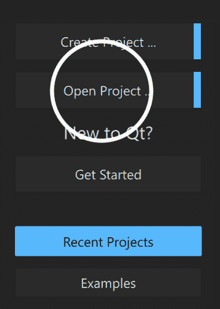

图 9.9 – 点击“打开项目…”按钮

1.  之后，**Qt Design Studio**将打开一个默认的 QML UI 文件，名为`Sreen01.ui.qml`。您将看到一个与之前章节中使用的完全不同的用户界面编辑器。

1.  自从 Qt 6 以来，Qt 团队发布了**Qt Design Studio**，这是一个专门用于为 Qt Quick 项目设计用户界面的新编辑器。该编辑器的组件描述如下：

    +   **组件**：**组件**窗口显示您可以添加到用户界面画布上的所有预定义 QML 类型。您还可以从创建组件按钮创建自定义 Qt Quick 组件，并将它们显示在这里。

    +   **导航器**：**导航器**窗口以树状结构显示当前 QML 文件中的项目。

    +   **连接**：您可以使用**连接**窗口中提供的工具将对象连接到信号，指定对象的动态属性，并在两个对象的属性之间创建绑定。

    +   **状态**：**状态**窗口显示项目的不同状态。您可以通过点击**状态**窗口右侧的**+**按钮为项目添加一个新状态。

    +   **2D/3D 画布**：画布是您设计程序用户界面的地方。您可以从“组件”窗口中将一个**Qt Quick**组件拖放到画布上，并立即看到它在程序中的样子。您可以为不同类型的应用程序创建 2D 或 3D 画布。

    +   **属性**：这是您更改所选项目属性的地方。

1.  您还可以通过在右上角的下拉框中选择来为您的**Qt Design Studio**编辑器选择预定义的工作空间：

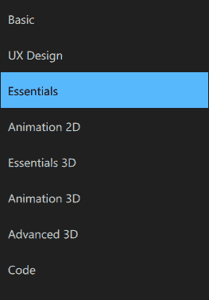

图 9.10 – 选择预定义的工作空间

1.  我们即将制作一个简单的登录屏幕。首先，从 2D 画布中删除编辑组件。然后，从“组件”窗口中拖动两个文本小部件到画布上。

1.  设置`用户名:`和`密码:`：

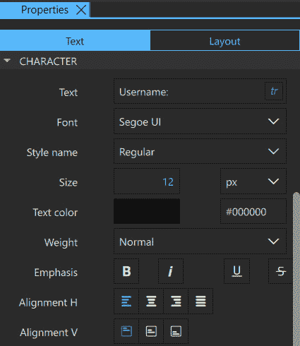

图 9.11 – 设置文本属性

1.  从`1`和`5`拖动两个矩形。然后，将其中一个文本字段的回显模式设置为**密码**。

1.  现在，我们将通过将鼠标区域小部件与矩形和文本小部件组合来手动创建一个按钮小部件。将鼠标区域小部件拖放到画布上，然后拖动矩形和文本小部件到画布上，并将它们都设置为鼠标区域的小部件。将矩形的颜色设置为`#bdbdbd`，然后设置其`1`和`5`。然后，设置`Login`并确保鼠标区域的大小与矩形相同。

1.  之后，将另一个矩形拖放到画布上，作为登录表单的容器，使其看起来整洁。将其颜色设置为`#5e5858`，然后设置其`2`。然后，设置其`5`以使其角落看起来稍微圆润一些。

1.  确保我们在上一步中添加的矩形在**导航器**窗口的层次结构顶部定位，这样它就会出现在所有其他小部件的后面。你可以通过按下**导航器**窗口顶部的箭头按钮来安排层次结构内的小部件位置，如下所示：

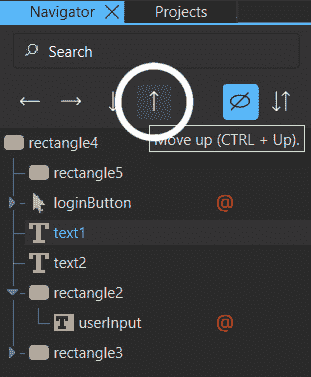

图 9.12 – 点击向上移动按钮

1.  接下来，我们将导出三个小部件：鼠标区域和两个文本输入小部件作为根项的别名属性，这样我们就可以在以后从`App.qml`文件中访问这些小部件。可以通过点击小部件名称后面的图标来导出小部件，并确保图标变为**开启**状态。

1.  到目前为止，你的用户界面应该看起来像这样：

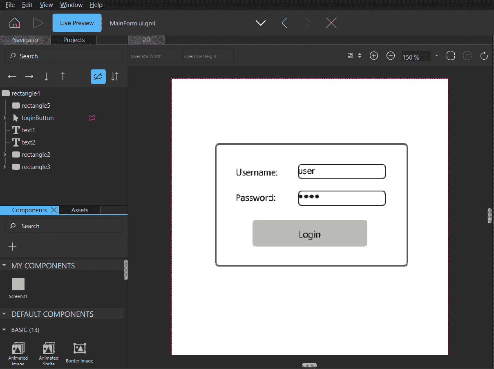

图 9.13 – 一个简单的登录屏幕

1.  现在，让我们打开`App.qml`。Qt Creator 不会在`Screen01.ui.qml`中打开这个文件，`App.qml`仅用于定义将应用于 UI 的逻辑和函数。然而，你可以通过点击编辑器左侧侧边栏上的**设计**按钮，使用 Qt Design Studio 打开它来预览用户界面。

1.  在脚本顶部，将第三行添加到`App.qml`中导入对话框模块，如下面的代码所示：

    ```cpp
    import QtQuick
    import QtQuick.Dialogs
    import yourprojectname
    ```

1.  之后，将以下代码替换为这个：

    ```cpp
    Window {
        visible: true
        title: "Hello World"
        width: 360
        height: 360
        Screen01 {
            anchors.fill: parent
            loginButton.onClicked: {
            messageDialog.text = "Username is " +
            userInput.text + " and password is " + passInput.text
            messageDialog.visible = true
            }
        }
    ```

1.  我们继续定义`messageDialog`如下：

    ```cpp
        MessageDialog {
            id: messageDialog
            title: "Fake login"
            text: ""
            onAccepted: {
            console.log("You have clicked the login button")
            Qt.quit()
            }
        }
    }
    ```

1.  在你的 PC 上构建并运行这个程序，你应该得到一个简单的程序，当你点击**登录**按钮时会显示一个消息框：

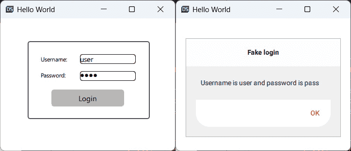

图 9.14 – 点击登录按钮后显示的消息框

## 它是如何工作的…

自从 Qt 5.4 以来，引入了一个新的文件扩展名`.ui.qml`。QML 引擎像处理正常的`.qml`文件一样处理它，但禁止在其中编写任何逻辑实现。它作为用户界面定义模板，可以在不同的`.qml`文件中重用。UI 定义和逻辑实现的分离提高了 QML 代码的可维护性，并创建了一个更好的工作流程。

自从 Qt 6 以来，`.ui.qml`文件不再由 Qt Creator 处理。相反，Qt 为您提供了一个名为 Qt Design Studio 的程序来编辑您的 Qt Quick UI。他们打算为程序员和设计师提供适合他们工作流程的独立工具。

**基本**下的所有小部件是我们可以用以混合匹配并创建新类型小部件的最基本小部件，如下所示：

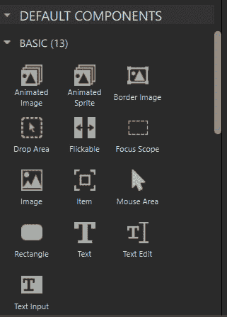

图 9.15 – 从这里拖放小部件

在上一个示例中，我们学习了如何将三个小部件组合在一起——一个文本、一个鼠标区域和一个矩形——以形成一个按钮小部件。您也可以通过点击右上角的**创建组件**按钮来创建自己的自定义组件：

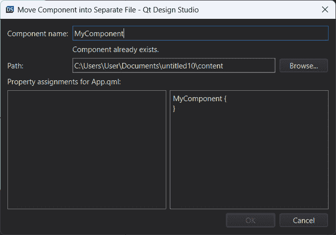

图 9.16 – 您也可以创建自己的自定义组件

我们在`App.qml`中导入了`QtQuick.Dialogs`模块，并创建了一个显示用户在`Screen01.ui.qml`中填写的用户名和密码的消息框。当我们在`App.qml`中无法访问它们的属性。

到目前为止，我们可以将程序导出到 iOS 和 Android，但用户界面在某些具有更高分辨率或更高**每像素密度**（DPI）单位的设备上可能看起来不准确。我们将在本章后面讨论这个问题。

# 触摸事件

在本节中，我们将学习如何使用 Qt Quick 开发一个在移动设备上运行的触摸驱动应用程序。

## 如何操作...

让我们按照以下步骤一步步开始：

1.  创建一个新的**Qt Quick** **应用程序**项目。

1.  在 Qt Design Studio 中，点击`tux.png`并将其按照以下方式添加到项目中：

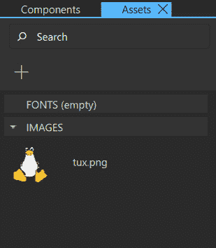

图 9.17 – 将 tux.png 导入到您的项目中

1.  接下来，打开`Screen01.ui.qml`。从`tux.png`拖动一个图像小部件，并设置其`200`和`20`。

1.  确保通过点击它们各自小部件名称旁边的小图标，将鼠标区域小部件和图像小部件都导出为根项的别名属性。

1.  之后，通过点击位于编辑器左侧侧边栏上的**编辑**按钮，切换到脚本编辑器。我们需要将鼠标区域小部件更改为多点触摸区域小部件，如下面的代码所示：

    ```cpp
    MultiPointTouchArea {
        id: touchArea
        anchors.fill: parent
        touchPoints: [
            TouchPoint { id: point1 },
            TouchPoint { id: point2 }
        ]
    }
    ```

1.  我们还设置了**图像**小部件默认自动放置在窗口中心，如下所示：

    ```cpp
    Image {
        id: tux
        x: (window.width / 2) - (tux.width / 2)
        y: (window.height / 2) - (tux.height / 2)
        width: 200
        height: 220
        fillMode: Image.PreserveAspectFit
        source: "tux.png"
    }
    ```

1.  最终用户界面应该看起来像这样：

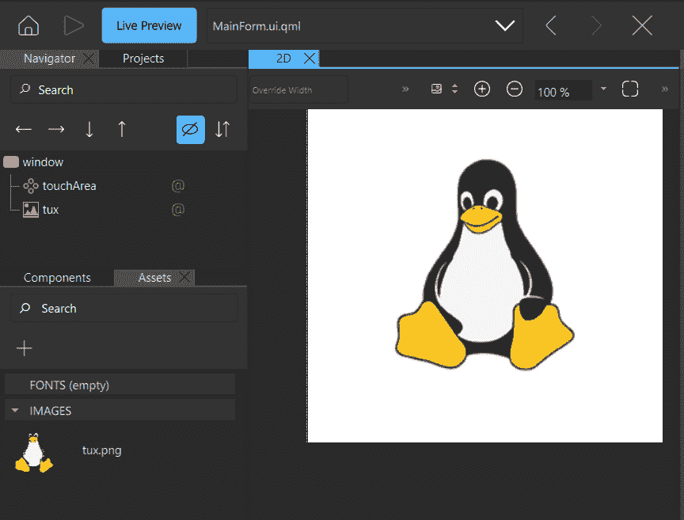

图 9.18 – 将企鹅放置到您的应用程序窗口中

1.  完成这些操作后，让我们打开`App.qml`。首先，清除`anchors.fill: parent`内的所有内容，如下面的代码所示：

    ```cpp
    import QtQuick
    import QtQuick.Window
    Window {
        visible: true
        Screen01 {
            anchors.fill: parent
        }
    }
    ```

1.  之后，在**MainForm**对象中声明几个变量，这些变量将用于重新缩放图像小部件。如果您想了解更多关于以下代码中使用的属性关键字的信息，请查看本例末尾的**更多内容**部分：

    ```cpp
    property int prevPointX: 0
    property int prevPointY: 0
    property int curPointX: 0
    property int curPointY: 0
    property int prevDistX: 0
    property int prevDistY: 0
    property int curDistX: 0
    property int curDistY: 0
    property int tuxWidth: tux.width
    property int tuxHeight: tux.height
    ```

1.  使用以下代码，我们将定义当我们的手指触摸多点区域小部件时会发生什么。在这种情况下，如果多于一个手指触摸多点触摸区域，我们将保存第一个和第二个触摸点的位置。我们还保存了图像小部件的宽度和高度，以便稍后我们可以使用这些变量来计算手指开始移动时图像的缩放比例：

    ```cpp
    touchArea.onPressed: {
        if (touchArea.touchPoints[1].pressed) {
            if (touchArea.touchPoints[1].x < touchArea.touchPoints[0].x)
                prevDistX = touchArea.touchPoints[1].x -    touchArea.touchPoints[0].x
            else
                prevDistX = touchArea.touchPoints[0].x -
                touchArea.touchPoints[1].x
            if (touchArea.touchPoints[1].y < touchArea.touchPoints[0].y)
                prevDistY = touchArea.touchPoints[1].y -
                touchArea.touchPoints[0].y
            else
                prevDistY = touchArea.touchPoints[0].y -
                touchArea.touchPoints[1].y
                tuxWidth = tux.width
                tuxHeight = tux.height
            }
        }
    ```

1.  以下图表显示了当两个手指在`touchArea`边界内触摸屏幕时注册的触摸点示例。`touchArea.touchPoints[0]`是第一个注册的触摸点，`touchArea.touchPoints[1]`是第二个。然后我们计算两个触摸点之间的 X 和 Y 距离，并将它们保存为`prevDistX`和`prevDistY`，如下所示：

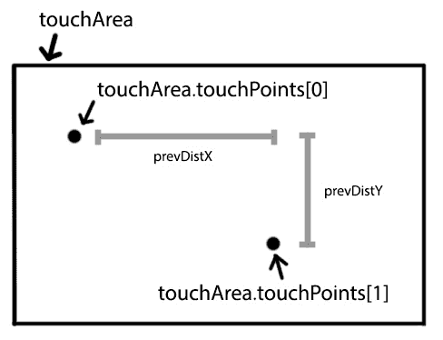

图 9.19 – 计算两个触摸点之间的距离

1.  之后，我们将使用以下代码定义当我们的手指在保持与屏幕接触并仍在触摸区域边界内移动时会发生什么。在此点，我们将通过使用之前步骤中保存的变量来计算图像的缩放比例。同时，如果我们检测到只有一个触摸，那么我们将移动图像而不是改变其缩放比例：

    ```cpp
            touchArea.onUpdated: {
                if (!touchArea.touchPoints[1].pressed) {
                    tux.x += touchArea.touchPoints[0].x -
            touchArea.touchPoints[0].previousX
                    tux.y += touchArea.touchPoints[0].y -
            touchArea.touchPoints[0].previousY
                }
                else {
                    if (touchArea.touchPoints[1].x <
                    touchArea.touchPoints[0].x)
                        curDistX = touchArea.touchPoints[1].x - touchArea.touchPoints[0].x
                    else
                        curDistX = touchArea.touchPoints[0].x - touchArea.touchPoints[1].x
                    if (touchArea.touchPoints[1].y <
                    touchArea.touchPoints[0].y)
                        curDistY = touchArea.touchPoints[1].y - touchArea.touchPoints[0].y
                    else
                        curDistY = touchArea.touchPoints[0].y - touchArea.touchPoints[1].y
                    tux.width = tuxWidth + prevDistX - curDistX
                    tux.height = tuxHeight + prevDistY - curDistY
                }
            }
    ```

1.  以下图表显示了移动触摸点的示例；`touchArea.touchPoints[0]`从点 A 移动到点 B，`touchArea.touchPoints[1]`从点 C 移动到点 D。然后我们可以通过查看先前 X 和 Y 变量与当前变量的差异来确定触摸点移动了多少单位：

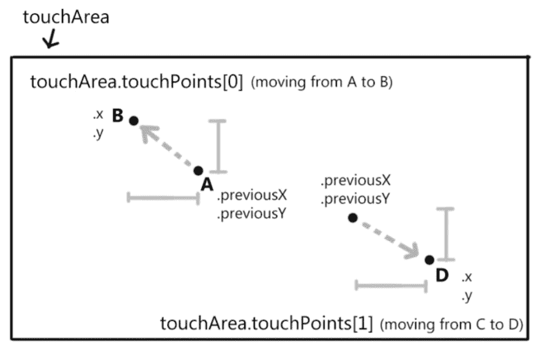

图 9.20 – 比较两组触摸点以确定移动

1.  您现在可以构建并将程序导出到您的移动设备上。您将无法在不支持多点触控的平台测试此程序。

1.  一旦程序在移动设备（或支持多点触控的桌面/笔记本电脑）上运行，尝试两件事——只将一个手指放在屏幕上并移动它，以及将两个手指放在屏幕上并朝相反方向移动。你应该看到，如果你只使用一个手指，企鹅将被移动到另一个地方，如果你使用两个手指，它将放大或缩小，如以下截图所示：

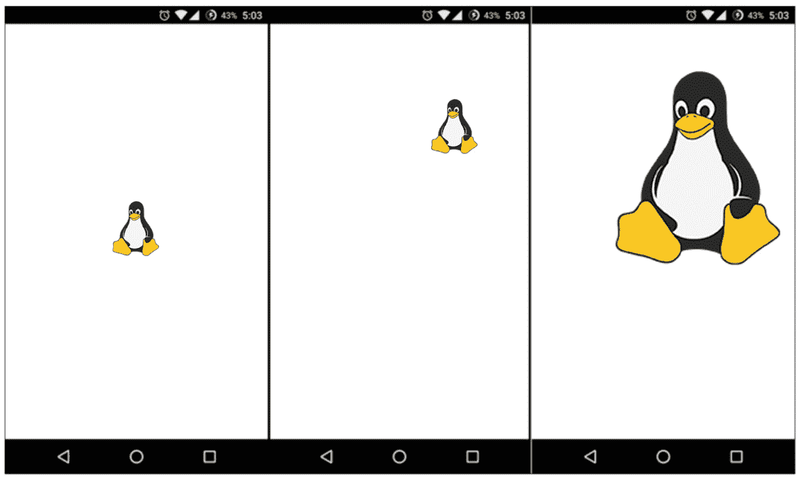

图 9.21 – 使用手指放大和缩小

## 它是如何工作的……

当手指触摸设备的屏幕时，多点触控区域小部件将触发`onPressed`事件并记录每个触摸点的位置在一个内部数组中。我们可以通过告诉 Qt 我们想要获取哪个触摸点来获取这些数据。第一个触摸点将具有索引号 0，第二个触摸点将是 1，依此类推。然后我们将这些数据保存到变量中，以便我们可以在以后检索它们来计算企鹅图像的缩放。除了`onPressed`之外，如果您想在用户从触摸区域释放手指时触发事件，也可以使用`onReleased`。

当一个或多个手指在移动时保持与屏幕接触，多点触控区域将触发`onUpdated`事件。然后我们将检查有多少个触摸点；如果只找到一个触摸点，我们只需根据我们的手指移动的距离移动企鹅图像。如果有多个触摸点，我们将比较两个触摸点之间的距离，并将其与我们之前保存的变量进行比较，以确定我们应该重新缩放图像多少。 

图表显示，在屏幕上轻触手指将触发`onPressed`事件，而在屏幕上滑动手指将触发`onUpdated`事件：

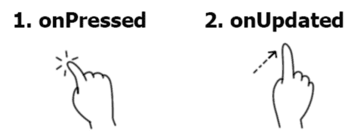

图 9.22 – onPressed 和 onUpdated 之间的区别

我们还必须检查第一个触摸点是否在左侧，或者第二个触摸点是否在右侧。这样，我们可以防止图像以手指移动的反方向缩放并产生不准确的结果。至于企鹅的移动，我们只需获取当前触摸位置与上一个位置之间的差异，并将其添加到企鹅的坐标中；然后，就完成了。单点触摸事件通常比多点触摸事件更直接。

## 还有更多...

在 Qt Quick 中，所有组件都内置了属性，例如`int`、`float`等关键字；以下是一个示例：

```cpp
property int myValue;
```

您还可以通过在值之前使用冒号（`:`）将自定义`property`绑定到值，如下面的代码所示：

```cpp
property int myValue: 100;
```

重要提示

要了解 Qt Quick 支持的属性类型，请查看此链接：[`doc.qt.io/qt-6/qtqml-typesystem-basictypes.html`](http://doc.qt.io/qt-6/qtqml-typesystem-basictypes.html)。

# QML 中的动画

Qt 允许我们轻松地通过编写大量代码来对用户界面组件进行动画处理。在本例中，我们将学习如何通过应用动画使我们的程序用户界面更加有趣。

## 如何操作...

让我们按照以下步骤学习如何为我们的 Qt Quick 应用程序添加动画：

1.  再次，我们将从头开始。因此，创建一个新的`Screen01.ui.qml`文件。

1.  打开`Screen01.ui.qml`文件并转到您的项目中的`QtQuick.Controls`。

1.  之后，你将在 **QML Types** 选项卡中看到一个新类别，称为 **QtQuick Controls**，其中包含许多可以放置在画布上的新小部件。

1.  接下来，将三个按钮小部件拖到画布上，并设置它们的 `45`。然后，转到 `0`。这将使按钮根据主窗口的宽度水平调整大小。之后，将第一个按钮的 y 值设置为 `0`，第二个设置为 `45`，第三个设置为 `90`。现在，用户界面应该看起来像这样：

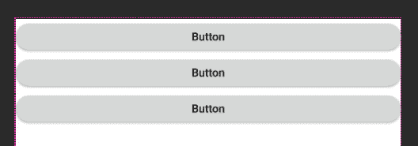

图 9.23 – 在布局中添加三个按钮

1.  现在，将 `fan.png` 打开到项目中，如下所示：

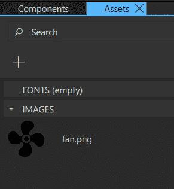

图 9.24 – 将 fan.png 添加到你的项目中

1.  然后，在画布上添加两个鼠标区域小部件。之后，将一个 **Rectangle** 小部件和一个 **Image** 小部件拖到画布上。将矩形和图像设置为之前添加的鼠标区域的父级。

1.  设置 `#0000ff` 并将 `fan.png` 应用到图像小部件上。现在，你的用户界面应该看起来像这样：

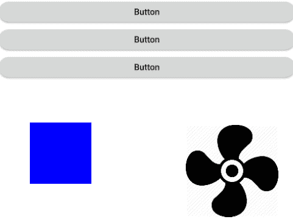

图 9.25 – 在布局中放置矩形和风扇图像

1.  之后，通过单击小部件名称右侧的图标，将你的 `Screen01.ui.qml` 中的所有小部件导出为根项的别名属性，如下所示：

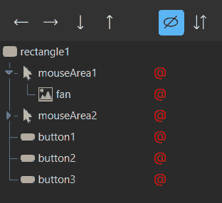

图 9.26 – 向小部件添加别名

1.  接下来，我们将应用动画和逻辑到用户界面，但不会在 `Screen01.ui.qml` 中进行。相反，我们将在 `App.qml` 中完成所有操作。

1.  在 `App.qml` 中，移除鼠标区域的默认代码，并添加窗口的 **width** 和 **height**，以便我们获得更多空间进行预览，如下所示：

    ```cpp
    import QtQuick
    import QtQuick.Window
    Window {
        visible: true
        width: 480
        height: 550
        Screen01 {
            anchors.fill: parent
        }
    }
    ```

1.  之后，添加以下代码，该代码定义了 `Screen01` 小部件中按钮的行为：

    ```cpp
            button1 {
                Behavior on y { SpringAnimation { spring: 2; damping: 0.2 } }
                onClicked: {
                    button1.y = button1.y + (45 * 3)
                }
            }
            button2 {
                    Behavior on y { SpringAnimation { spring: 2; damping: 0.2 } }
                onClicked: {
                    button2.y = button2.y + (45 * 3)
                }
            }
    ```

1.  在以下代码中，我们继续定义 `button3`：

    ```cpp
            button3 {
                Behavior on y { SpringAnimation { spring: 2; damping: 0.2 } }
                onClicked: {
                    button3.y = button3.y + (45 * 3)
                }
            }
    ```

1.  然后，按照以下方式继续添加风扇图像及其附加的鼠标区域小部件的行为：

    ```cpp
            fan {
                RotationAnimation on rotation {
                    id: anim01
                    loops: Animation.Infinite
                    from: 0
                    to: -360
                    duration: 1000
                }
            }
    ```

1.  在以下代码中，我们接着定义 `mouseArea1`：

    ```cpp
            mouseArea1 {
                onPressed: {
                    if (anim01.paused)
                        anim01.resume()
                    else
                        anim01.pause()
                }
            }
    ```

1.  最后但同样重要的是，按照以下方式添加矩形及其附加的鼠标区域小部件的行为：

    ```cpp
            rectangle2 {
                id: rect2
                state: "BLUE"
                states: [
                    State {
                        name: "BLUE"
                        PropertyChanges {
                            target: rect2
                            color: "blue"
                }
            },
    ```

1.  在以下代码中，我们继续添加 `RED` 状态：

    ```cpp
                    State {
                        name: "RED"
                        PropertyChanges {
                            target: rect2
                            color: "red"
                        }
                    }
                ]
            }
    ```

1.  我们接着通过如下定义 `mouseArea2` 来完成代码：

    ```cpp
            mouseArea2 {
                SequentialAnimation on x {
                    loops: Animation.Infinite
                    PropertyAnimation { to: 150; duration: 1500 }
                    PropertyAnimation { to: 50; duration: 500 }
                }
                onClicked: {
                    if (rect2.state == "BLUE")
                        rect2.state = "RED"
                    else
                        rect2.state = "BLUE"
                }
            }
    ```

1.  如果你现在编译并运行程序，你应该在窗口顶部看到三个按钮，在左下角看到一个移动的矩形，在右下角看到一个旋转的风扇，如下面的截图所示。如果你点击任何按钮，它们将稍微向下移动，并带有流畅的动画。如果你点击矩形，它将从 **蓝色** 变为 **红色**。

1.  同时，如果你在风扇图像动画时点击它，它将暂停动画；如果你再次点击，它将恢复动画：

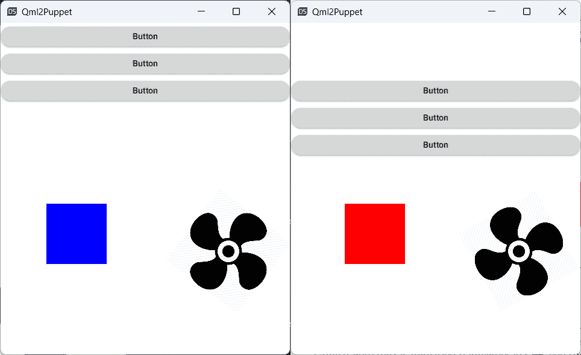

图 9.27 – 现在您可以控制小部件的动画和颜色

## 它是如何工作的…

大多数 C++版本的 Qt 支持的动画元素，如过渡、顺序动画和并行动画，在 Qt Quick 中也是可用的。如果您熟悉 C++中的 Qt 动画框架，您应该能够很容易地掌握这一点。

在这个例子中，我们为所有三个按钮添加了一个弹簧动画元素，该元素专门跟踪各自的 y 轴。如果 Qt 检测到 y 值已更改，小部件不会立即弹跳到新位置；相反，它将被插值，在画布上移动，并在到达目的地时执行轻微的震动动画，以模拟弹簧效果。我们只需写一行代码，其余的交给 Qt 处理。

至于风扇图像，我们为其添加了一个旋转动画元素，并将其持续时间设置为`1000 毫秒`，这意味着它将在一秒内完成一次完整旋转。我们还将其设置为无限循环动画。当我们点击它所附加的鼠标区域小部件时，我们只需调用`pause()`或`resume()`来启用或禁用动画。

接下来，对于矩形小部件，我们为其添加了两个状态，一个称为**蓝色**，另一个称为**红色**，每个状态都携带一个**颜色**属性，该属性将在状态改变时应用于矩形。同时，我们在矩形所附加的鼠标区域小部件中添加了**顺序动画组**，然后向该组添加了两个**属性动画**元素。您还可以混合不同类型的组动画；Qt 可以很好地处理这一点。

# 使用模型/视图显示信息

Qt 包含一个**模型/视图框架**，它保持了数据组织和管理方式与它们向用户展示方式之间的分离。在本节中，我们将学习如何使用模型/视图；特别是通过使用列表视图来显示信息，同时，应用我们的自定义使其看起来更精致。

## 如何做到这一点…

让我们按照以下步骤开始：

1.  将新的`home.png`、`map.png`、`profile.png`、`search.png`、`settings.png`和`arrow.png`添加到项目中，如下所示：

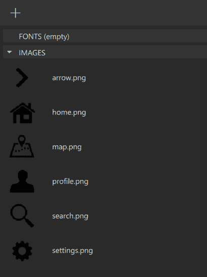

图 9.28 – 向项目中添加更多图像

1.  然后，创建并打开`Screen01.ui.qml`，就像我们在所有之前的例子中所做的那样。从**组件**窗口的**Qt Quick – 视图**类别下拖动一个**列表视图**小部件到画布上。然后，通过点击**布局**窗口中间的按钮将其**锚点**设置设置为填充父大小，如图下所示：

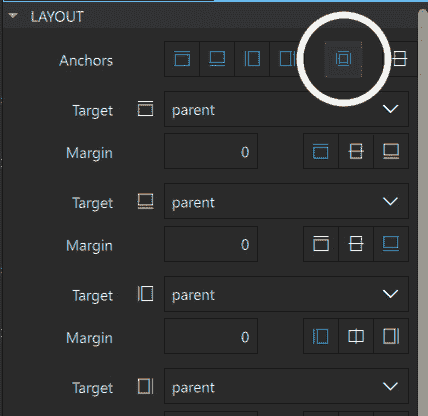

图 9.29 – 将布局锚点设置为填充父容器

1.  接下来，切换到脚本编辑器，我们将定义列表视图的外观如下：

    ```cpp
    import QtQuick
    Rectangle {
        id: rectangle1
        property alias listView1: listView1
        property double sizeMultiplier: width / 480
    ```

1.  我们将通过添加以下列表视图来继续编写代码：

    ```cpp
        ListView {
            id: listView1
            y: 0
            height: 160
            orientation: ListView.Vertical
            boundsBehavior: Flickable.StopAtBounds
            anchors.fill: parent
            delegate: Item {
                width: 80 * sizeMultiplier
                height: 55 * sizeMultiplier
    ```

1.  我们将继续向列表视图中添加行，如下所示：

    ```cpp
                Row {
                    id: row1
                    Rectangle {
                        width: listView1.width
                        height: 55 * sizeMultiplier
                        gradient: Gradient {
                            GradientStop { position: 0.0; color: "#ffffff" }
                            GradientStop { position: 1.0; color: "#f0f0f0" }
                        }
                        opacity: 1.0
    ```

1.  然后，我们添加了一个鼠标区域和一个图像，如下所示代码片段：

    ```cpp
                        MouseArea {
                            id: mouseArea
                            anchors.fill: parent
                        }
                        Image {
                            anchors.verticalCenter: parent.verticalCenter
                            x: 15 * sizeMultiplier
                            width: 30 * sizeMultiplier
                            height: 30 * sizeMultiplier
                            source: icon
                        }
    ```

1.  然后，继续添加两个文本对象，如下所示：

    ```cpp
                        Text {
                            text: title
                            font.family: "Courier"
                            font.pixelSize: 17 * sizeMultiplier
                            x: 55 * sizeMultiplier
                            y: 10 * sizeMultiplier
                        }
                        Text {
                            text: subtitle
                            font.family: "Verdana"
                            font.pixelSize: 9 * sizeMultiplier
                            x: 55 * sizeMultiplier
                            y: 30 * sizeMultiplier
                        }
    ```

1.  之后，添加一个图像对象，如下所示：

    ```cpp
                        Image {
                            anchors.verticalCenter: parent.verticalCenter
                            x: parent.width - 35 * sizeMultiplier
                            width: 30 * sizeMultiplier
                            height: 30 * sizeMultiplier
                            source: "images/arrow.png"
                        }
                    }
                }
            }
    ```

1.  使用以下代码，我们将定义列表模型：

    ```cpp
            model: ListModel {
                ListElement {
                    title: "Home"
                    subtitle: "Go back to dashboard"
                    icon: "images/home.png"
                }
                ListElement {
                    title: "Map"
                    subtitle: "Help navigate to your destination"
                    icon: "images/map.png"
                }
    ```

1.  我们将继续编写代码：

    ```cpp
                ListElement {
                    title: "Profile"
                    subtitle: "Customize your profile picture"
                    icon: "images/profile.png"
                }
                ListElement {
                    title: "Search"
                    subtitle: "Search for nearby places"
                    icon: "images/search.png"
                }
    ```

1.  我们现在将添加最终的列表元素，如下所示代码所示：

    ```cpp
                ListElement {
                    title: "Settings"
                    subtitle: "Customize your app settings"
                    icon: "images/settings.png"
                }
            }
        }
    }
    ```

1.  之后，打开 `App.qml` 并将代码替换为以下内容：

    ```cpp
    import QtQuick
    import QtQuick.Window
    Window {
        visible: true
        width: 480
        height: 480
        Screen01 {
            anchors.fill: parent
                MouseArea {
                    onPressed: row1.opacity = 0.5
                    onReleased: row1.opacity = 1.0
                }
            }
    }
    ```

1.  编译并运行程序，现在您的程序应该看起来像这样：

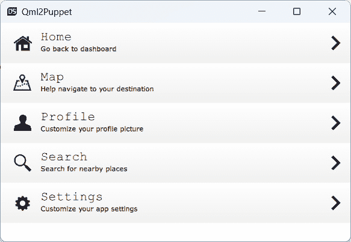

图 9.30 – 带有不同字体和图标的导航菜单

## 它是如何工作的…

Qt Quick 允许我们轻松自定义列表视图中每一行的外观。委托定义了每一行将看起来是什么样子，而模型是您存储将在列表视图中显示的数据的地方。

在这个例子中，我们在每一行添加了带有渐变的背景，然后我们还在每个项目的两侧添加了图标，一个标题，一个描述，以及一个鼠标区域小部件，使得列表视图的每一行都可以点击。委托不是静态的，因为我们允许模型更改标题、描述和图标，使每一行看起来独特。

在 `App.qml` 中，我们定义了鼠标区域小部件的行为，当按下时会将其自身的透明度值减半，并在释放时恢复到完全不透明。由于所有其他元素，如标题和图标，都是鼠标区域小部件的子元素，因此它们也会自动遵循其父小部件的行为并变为半透明。

此外，我们最终解决了高分辨率和 DPI 的移动设备上的显示问题。这是一个非常简单的技巧；首先，我们定义了一个名为 `sizeMultiplier` 的变量。`sizeMultiplier` 的值是窗口宽度除以一个预定义值的结果，比如说 480，这是我们用于 PC 的当前窗口宽度。然后，将 `sizeMultiplier` 乘以所有与大小和位置相关的变量，包括字体大小。请注意，在这种情况下，您应该使用 `pixelSize` 属性来代替 `pointSize`，这样在乘以 `sizeMultiplier` 时您将得到正确的显示。以下截图显示了带有和不带有 `sizeMultiplier` 的应用程序在移动设备上的外观：

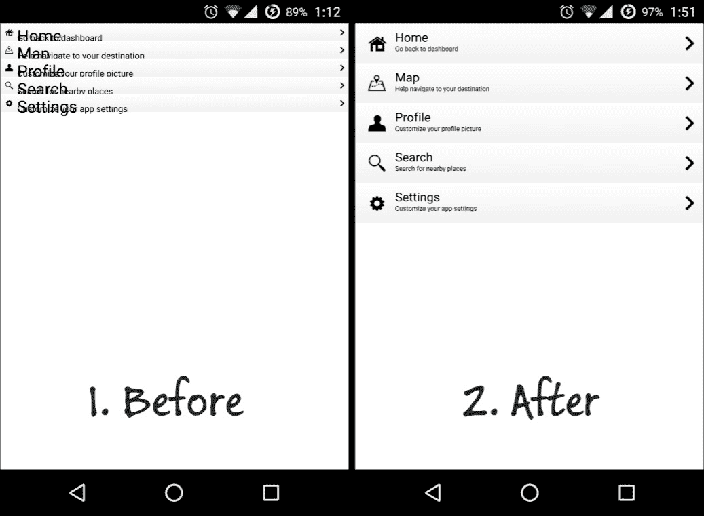

图 9.31 – 使用大小乘数校正大小

注意，一旦你将所有内容乘以`sizeMultiplier`变量，编辑器中的用户界面可能会变得混乱。这是因为宽度变量在编辑器中可能返回`0`。因此，将`0`乘以`480`，你可能会得到结果`0`，这使得整个用户界面看起来很奇怪。然而，当运行实际程序时，它看起来会很好。如果你想预览编辑器上的用户界面，暂时将其设置为`1`。

# 集成 QML 和 C++

Qt 支持通过 QML 引擎在 C++类之间进行桥接。这种组合允许开发者利用 QML 的简单性和 C++的灵活性。你甚至可以集成外部组件不支持的功能，然后将结果数据传递给 Qt Quick 以在 UI 中显示。在本例中，我们将学习如何将我们的用户界面组件从 QML 导出到 C++框架，并在它们显示在屏幕上之前操作它们的属性。

## 如何做到这一点…

让我们按以下步骤进行：

1.  再次，我们将从头开始。因此，使用 Qt Design Studio 创建一个新的`Screen01.ui.qml`。然后，打开`Screen01.ui.qml`。

1.  我们可以保留鼠标区域和文本小部件，但将文本小部件放置在窗口底部。将文本小部件的`Text`属性更改为`18`。之后，转到`120`，如下面的屏幕截图所示：

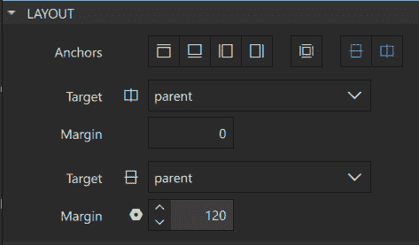

图 9.32 – 将其放置在布局的中心

1.  接下来，从`#ff0d0d`拖动一个矩形小部件。设置其`200`并启用垂直和水平中心锚点。之后，设置`-14`。你的 UI 现在应该看起来像这样：

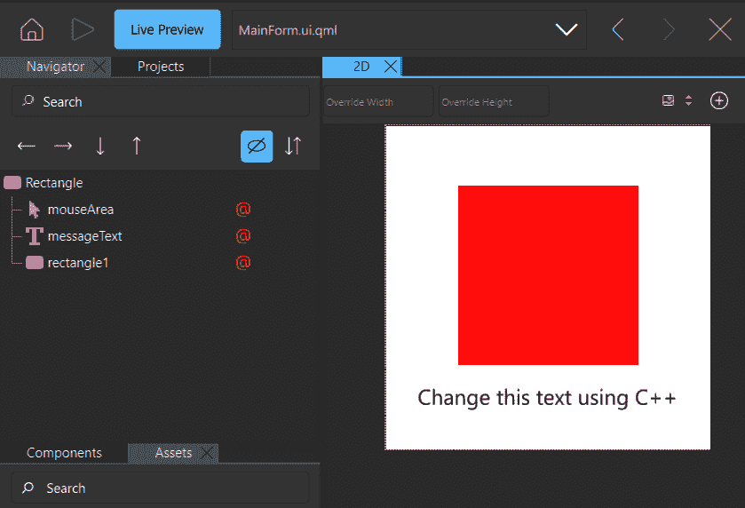

图 9.33 – 将正方形和文本放置如图所示的图像中

1.  完成后，在`myclass.h`和`myclass.cpp`中的项目目录上右键单击——现在将创建并添加到你的项目中：

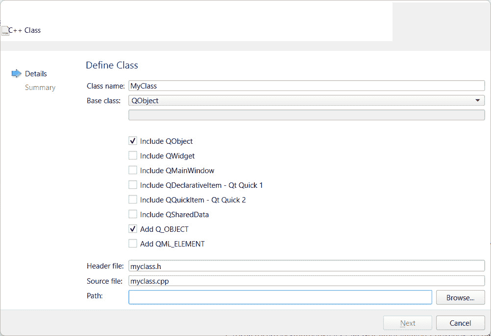

图 9.34 – 创建一个新的自定义类

1.  现在，打开`myclass.h`并在类构造函数下添加一个变量和函数，如下面的代码所示：

    ```cpp
    #ifndef MYCLASS_H
    #define MYCLASS_H
    #include <QObject>
    class MyClass : public QObject
    {
        Q_OBJECT
    public:
        explicit MyClass(QObject *parent = 0);
        // Object pointer
        QObject* my Object;
        // Must call Q_INVOKABLE so that this function can be used in QML
        Q_INVOKABLE void setMyObject(QObject* obj);
    };
    #endif // MYCLASS_H
    ```

1.  之后，打开`myclass.cpp`并定义`setMyObject()`函数，如下所示：

    ```cpp
    #include "myclass.h"
    MyClass::MyClass(QObject *parent) : Qobject(parent)
    {
    }
    void MyClass::setMyObject(Qobject* obj)
    {
        // Set the object pointer
        my Object = obj;
    }
    ```

1.  现在，我们可以关闭`myclass.cpp`并打开`App.qml`。在文件顶部，导入我们在 C++中刚刚创建的`MyClassLib`组件：

    ```cpp
    import QtQuick
    import QtQuick.Window
    MyClass in the Window object and call its setMyObject() function within the MainForm object, as shown in the following code:

    ```

    Window {

    visible: true

    width: 480

    height: 320

    MyClass {

    id: myclass

    }

    Screen01 {

    anchors.fill: parent

    mouseArea.onClicked: {

    Qt.quit();

    }

    Component.onCompleted:

    myclass.setMyObject(messageText);

    }

    }

    ```cpp

    ```

1.  最后，打开`main.cpp`并将自定义类注册到 QML 引擎。我们还将使用 C++代码更改文本小部件和矩形的属性，如下所示：

    ```cpp
    #include <QGuiApplication>
    #include <QQmlApplicationEngine>
    #include <QtQml>
    #include <QQuickView>
    #include <QQuickItem>
    #include <QQuickView>
    #include "myclass.h"
    int main(int argc, char *argv[])
    {
        // Register your class to QML
        qmlRegisterType<MyClass>("MyClassLib", 1, 0, "MyClass");
    ```

1.  然后，继续创建对象，就像以下代码中突出显示的部分一样：

    ```cpp
        QGuiApplication app(argc, argv);
        QQmlApplicationEngine engine;
        engine.load(QUrl(QStringLiteral("qrc:/content/App.qml")));
        QObject* root = engine.rootObjects().value(0);
        QObject* messageText =
    root->findChild<QObject*>("messageText");
        messageText->setProperty("text", QVariant("C++ is now in control!"));
        messageText->setProperty("color", QVariant("green"));
        QObject* square = root->findChild<QObject*>("square");
        square->setProperty("color", QVariant("blue"));
        return app.exec();
    }
    ```

1.  现在，构建并运行程序，你应该会看到矩形的颜色和文本的颜色与你在 Qt Quick 中之前定义的完全不同，如下面的截图所示。这是因为它们的属性已经被 C++ 代码所改变：

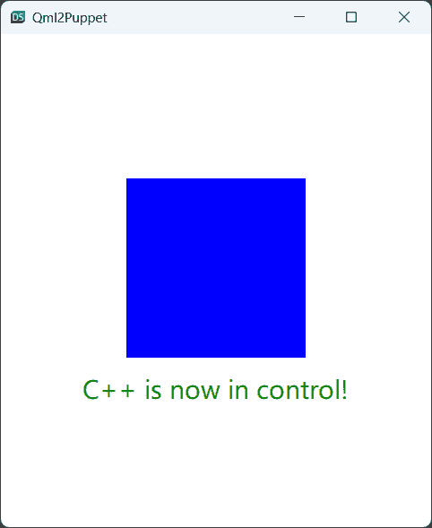

图 9.35 – 现在可以通过 C++ 改变文本和颜色

## 它是如何工作的...

QML 被设计成可以通过 C++ 代码轻松扩展。Qt QML 模块中的类使 QML 对象能够从 C++ 中加载和处理。

只有继承自 `QObject` 基类 的类才能与 QML 集成，因为它是 Qt 生态系统的一部分。一旦类被 QML 引擎注册，我们就从 QML 引擎获取根项，并使用它来找到我们想要操作的对象。

之后，使用 `setProperty()` 函数来更改属于小部件的任何属性。除了 `setProperty()` 之外，你还可以在继承自 `QObject` 的类中使用 `Q_PROPERTY()` 宏来声明属性。以下是一个示例：

```cpp
Q_PROPERTY(QString text MEMBER m_text NOTIFY textChanged)
```

注意，`Q_INVOKABLE` 宏需要放在你打算在 QML 中调用的函数之前。如果没有它，Qt 不会将函数暴露给 Qt Quick，你将无法调用它。
