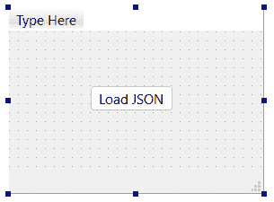
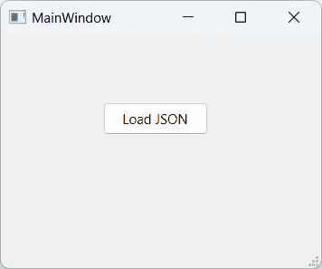
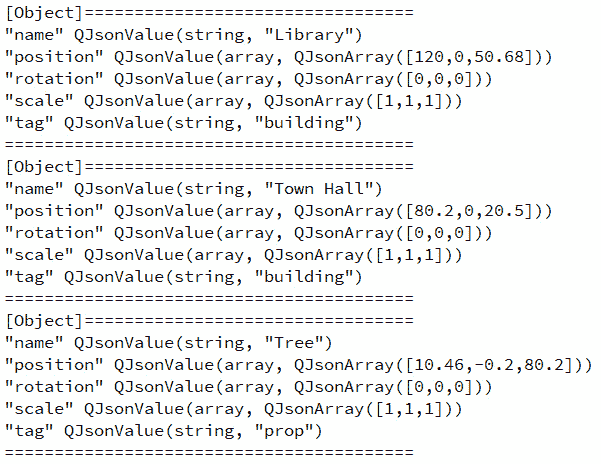
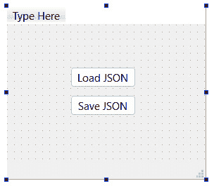
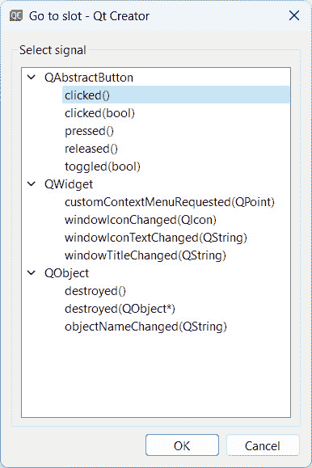
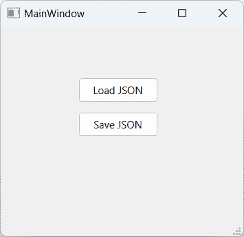
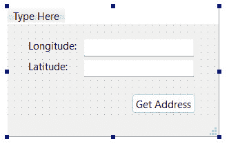
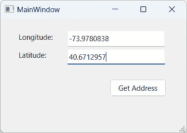

# 简化 JSON 解析

JSON 是一种名为 **JavaScript Object Notation** 的数据格式的文件扩展名，用于以结构化格式存储和传输信息。JSON 格式在网络上被广泛使用。大多数现代网络 **应用程序编程接口** （**API**） 使用 JSON 格式将数据传输给其网络客户端。

本章将涵盖以下食谱：

+   JSON 格式概述

+   从文本文件处理 JSON 数据

+   将 JSON 数据写入文本文件

+   使用 Google 的 Geocoding API

# 技术要求

本章的技术要求包括 Qt 6.6.1 MinGW 64 位和 Qt Creator 12.0.2。本章中使用的所有代码都可以从以下 GitHub 仓库下载：[`github.com/PacktPublishing/QT6-C-GUI-Programming-Cookbook---Third-Edition-/tree/main/Chapter10`](https://github.com/PacktPublishing/QT6-C-GUI-Programming-Cookbook---Third-Edition-/tree/main/Chapter10)。

# JSON 格式概述

JSON 是一种常用于网络应用程序中数据传输的易读文本格式，尤其是在 **JavaScript** 应用程序中。然而，它也被用于许多其他目的，因此它独立于 JavaScript，可以用于任何编程语言或平台，尽管它的名字如此。

在这个例子中，我们将了解 JSON 格式以及如何验证您的 JSON 数据是否为有效格式。

## 如何操作…

让我们开始学习如何编写自己的 JSON 数据并验证其格式：

1.  打开您的网络浏览器并转到 [`jsonlint.com`](https://jsonlint.com) 上的 **JSONLint Online Validator and Formatter** 网站。

1.  在网站上的文本编辑器中编写以下 JSON 数据：

    ```cpp
    {
        "members": [
            {
                "name": "John",
                "age": 29,
                "gender": "male"
            },
            {
                "name": "Alice",
                "age": 24,
                "gender": "female"
            },
            {
                "name": "",
                "age": 26,
                "gender": "male"
            }
        ]
    }
    ```

1.  之后，按下 **Validate JSON** 按钮。你应该会得到以下结果：

    ```cpp
    JSON is valid!
    ```

1.  现在，尝试从 `members` 变量中移除双引号符号：

    ```cpp
    {
        members: [
            {
                "name": "John",
                "age": 29,
                "gender": "male"
            },
    ```

1.  再次按下 **Validate JSON** 按钮，你应该会得到一个如下错误：

    ```cpp
    Invalid JSON!
    Error: Parse error on line 1:
    {    members: [        {
    -----^
    Expecting 'STRING', '}', got 'undefined'
    ```

1.  现在，通过将双引号符号添加回 `members` 变量来恢复有效的 JSON 格式。然后，按下 **Compress** 按钮。你应该会得到以下结果，其中没有空格和换行符：

    ```cpp
    {"members":[{"name":"John","age":29,"gender":"male"},
    {"name":"Alice","age":24,"gender":"female"},
    {"name":"","age":26,"gender":"male"}]}
    ```

1.  你现在可以按下 **Prettify** 按钮将其恢复到之前的结构。

## 它是如何工作的…

大括号 `{` 和 `}` 包含一组数据作为对象。一个 **对象** 是一个包含其自身属性或变量的独立数据结构，这些属性或变量以 **键值对** 的形式存在。键是作为人类可读变量名的唯一字符串，而值由字符串、整数、浮点数、布尔值表示，甚至可以是一个完整的对象或数组。JSON 支持递归对象，这对于许多不同的用例非常有用。

方括号 `[` 和 `]` 表示数据包含在数组中。**数组**简单地存储相同类型的值列表，可以通过在您用于项目的任何编程语言中使用标准迭代器模式遍历其内容来操作、排序或从数组中删除。

在之前的示例中，我们首先创建了一个无名的对象作为数据的主对象。你必须创建一个主对象或主数组作为起点。然后，我们添加了一个名为 `members` 的数组，其中包含具有 `name`、`age` 和 `gender` 等变量的单个对象。请注意，如果你在整数或浮点数周围添加双引号 (`"`)，变量将被视为字符串而不是数字。

之前的示例演示了可以通过网络发送并由任何现代编程语言处理的 JSON 数据的最简单形式。

# 处理文本文件中的 JSON 数据

在本食谱中，我们将学习如何处理从文本文件中获取的 JSON 数据并使用流读取器提取它。

## 如何做到这一点…

让我们创建一个简单的程序，通过以下步骤读取和处理 XML 文件：

1.  在你希望的位置创建一个新的 **Qt Widgets 应用程序** 项目。

1.  打开任何文本编辑器并创建一个看起来像下面的 JSON 文件，然后将其保存为 `scene.json`：

    ```cpp
    [
        {
            "name": "Library",
            "tag": "building",
            "position": [120.0, 0.0, 50.68],
            "rotation": [0.0, 0.0, 0.0],
            "scale": [1.0, 1.0, 1.0]
        }
    ]
    ```

1.  继续编写 JSON 代码，在 `Library` 对象之后添加更多对象，如下面的代码所示：

    ```cpp
    {
        "name": "Town Hall",
        "tag": "building",
        "position": [80.2, 0.0, 20.5],
        "rotation": [0.0, 0.0, 0.0],
        "scale": [1.0, 1.0, 1.0]
    },
    {
        "name": "Tree",
        "tag": "prop",
        "position": [10.46, -0.2, 80.2],
        "rotation": [0.0, 0.0, 0.0],
        "scale": [1.0, 1.0, 1.0]
    }
    ```

1.  返回 Qt Creator 并打开 `mainwindow.h`。在脚本顶部 `#include <QMainWindow>` 之后添加以下头文件：

    ```cpp
    #include <QJsonDocument>
    #include <QJsonArray>
    #include <QJsonObject>
    #include <QDebug>
    #include <QFile>
    #include <QFileDialog>
    ```

1.  打开 `mainwindow.ui` 并从左侧的部件框中拖动一个按钮到 UI 编辑器。将按钮的对象名称更改为 `loadJsonButton` 并将其显示文本更改为 `Load JSON`：



图 10.1 – 添加 Load JSON 按钮图

1.  右键单击按钮并选择 **转到槽…**。将弹出一个窗口，其中包含可供选择的信号列表。

1.  选择默认的 `clicked()` 选项并按 `on_loadJsonButton_clicked()`。

1.  将以下代码添加到 `on_loadJsonButton_clicked()` 函数中：

    ```cpp
    void MainWindow::on_loadJsonButton_clicked()
    {
        QString filename = QFileDialog::getOpenFileName(this, "Open JSON", ".", "JSON files (*.json)");
        QFile file(filename);
        if (!file.open(QFile::ReadOnly | QFile::Text))
            qDebug() << "Error loading JSON file.";
        QByteArray data = file.readAll();
        file.close();
        QJsonDocument json = QJsonDocument::fromJson(data);
    ```

1.  我们继续编写代码。以下代码遍历 JSON 文件并打印出每个属性的名称和值：

    ```cpp
    if (json.isArray())
    {
        QJsonArray array = json.array();
        if (array.size() > 0)
        {
            for (int i = 0; i < array.size(); ++i)
            {
                qDebug() << "[Object]=================================";
                QJsonObject object = json[i].toObject();
                QStringList keys = object.keys();
                for (int j = 0; j < keys.size(); ++j)
                {
                    qDebug() << keys.at(j) << object.value(keys.at(j));
                }
                qDebug() << "=========================================";
            }
        }
    }
    ```

1.  构建并运行项目，你将看到一个弹出窗口，其外观类似于你在 *步骤 5* 中创建的：



图 10.2 – 构建和启动程序

1.  点击 **加载 JSON** 按钮，你应该会在屏幕上弹出 *文件选择器* 窗口。选择你在 *步骤 2* 中创建的 JSON 文件并按 **选择** 按钮。你应该会在 Qt Creator 的 *应用程序输出* 窗口中看到以下调试文本出现，这表明程序已成功加载你刚刚选择的 JSON 文件中的数据：



图 10.3 – 应用输出窗口中打印的结果

## 它是如何工作的…

在本例中，我们正在尝试使用`QJsonDocument`类从 JSON 文件中提取和处理数据。想象一下你正在制作一个电脑游戏，你正在使用 JSON 文件来存储游戏场景中所有对象的属性。在这种情况下，JSON 格式在以结构化方式存储数据方面发挥着重要作用，这使得数据提取变得容易。

我们需要将相关的 JSON 类头添加到我们的源文件中，在这种情况下，是`QJsonDocument`类。`QJsonDocument`类是 Qt 核心库的一部分，因此不需要包含任何额外的模块，这也意味着它是推荐用于在 Qt 中处理 JSON 数据的类。一旦我们点击`on_loadJsonButton_clicked()`槽，就会调用；这就是我们编写代码来处理 JSON 数据的地方。

我们使用文件对话框来选择我们想要处理的 JSON 文件。然后，我们将所选文件的文件名及其路径发送到`QFile`类以打开和读取 JSON 文件的文本数据。之后，文件的数据被发送到`QJsonDocument`类进行处理。

我们首先检查主 JSON 结构是否为数组。如果是数组，我们接着检查数组中是否有数据。之后，使用`for`循环遍历整个数组，并提取存储在数组中的单个对象。

然后，我们从对象中提取键值对数据，并打印出键和值。

## 还有更多…

除了网络应用之外，许多商业游戏引擎和交互式应用也使用 JSON 格式来存储用于其产品中的游戏场景、网格以及其他形式资产的信息。这是因为 JSON 格式相较于其他文件格式提供了许多优势，例如紧凑的文件大小、高度的灵活性和可扩展性、易于文件恢复，以及允许其用于高度高效和性能关键的应用程序，如搜索引擎、智能数据挖掘服务器和科学模拟。

注意

要了解更多关于 XML 格式的信息，请访问[`www.w3schools.com/js/js_json_intro.asp`](https://www.w3schools.com/js/js_json_intro.asp)。

# 将 JSON 数据写入文本文件

由于我们已经在前一个菜谱中学习了如何处理从 JSON 文件中获得的数据，我们将继续学习如何将数据保存到 JSON 文件中。我们将继续使用前一个示例并对其进行扩展。

## 如何做…

我们将通过以下步骤学习如何在 JSON 文件中保存数据：

1.  在`mainwindow.ui`中添加另一个按钮，然后将其对象名称设置为`saveJsonButton`，标签设置为`保存 JSON`：



图 10.4 – 添加保存 JSON 按钮

1.  右键单击按钮并选择 `clicked()` 选项，然后点击 `on_saveJsonButton_clicked()` 将自动添加到你的 `mainwindow.h` 和 `mainwindow.cpp` 文件中，由 Qt 完成：



图 10.5 – 选择 clicked() 信号并按 OK

1.  将以下代码添加到 `on_saveJsonButton_clicked()` 函数中：

    ```cpp
    QQString filename = QFileDialog::getSaveFileName(this, "Save JSON", ".", "JSON files (*.json)");
    QFile file(filename);
    if (!file.open(QFile::WriteOnly | QFile::Text))
        qDebug() << "Error saving JSON file.";
    QJsonDocument json;
    QJsonArray array;
    ```

1.  让我们也编写第一个 `contact` 元素：

    ```cpp
    QJsonObject contact1;
    contact1["category"] = "Friend";
    contact1["name"] = "John Doe";
    contact1["age"] = 32;
    contact1["address"] = "114B, 2nd Floor, Sterling Apartment, Morrison Town";
    contact1["phone"] = "0221743566";
    array.append(contact1);
    ```

1.  按照以下方式编写第二个 `contact` 元素：

    ```cpp
    QJsonObject contact2;
    contact2["category"] = "Family";
    contact2["name"] = "Jane Smith";
    contact2["age"] = 24;
    contact2["address"] = "13, Ave Park, Alexandria";
    contact2["phone"] = "0025728396";
    array.append(contact2);
    ```

1.  最后，将数据保存到文本文件中：

    ```cpp
    json.setArray(array);
        file.write(json.toJson());
        file.close();
    }
    ```

1.  构建并运行程序，你应该在程序 UI 中看到额外的按钮：



图 10.6 – 你的应用程序现在应该看起来像这样

1.  点击 **保存 JSON** 按钮，屏幕上会出现一个保存文件对话框。输入所需的文件名，然后点击 **保存** 按钮。

1.  使用任何文本编辑器打开你刚刚保存的 JSON 文件。文件的前一部分应该看起来像这样：

    ```cpp
    [
        {
            "address": "114B, 2nd Floor, Sterling Apartment, Morrison Town",
            "age": 32,
            "category": "Friend",
            "name": "John Doe",
            "phone": "0221743566"
        },
        {
            "address": "13, Ave Park, Alexandria",
            "age": 24,
            "category": "Family",
            "name": "Jane Smith",
            "phone": "0025728396"
        }
    ]
    ```

## 它是如何工作的…

保存过程与上一个示例中加载 JSON 文件的过程类似。唯一的区别是，我们不是使用 `QJsonDocument::fromJson()` 函数，而是切换到使用 `QJsonDocument::toJson()` 函数。我们仍然使用了文件对话框和 `QFile` 类来保存 XML 文件。这次，在将字节数据传递给 `QFile` 类之前，我们必须将打开模式从 `QFile::ReadOnly` 更改为 `QFile::WriteOnly`。

接下来，我们开始编写 JSON 文件，通过创建 `QJsonDocument` 和 `QJsonArray` 变量，然后为每个联系人创建一个 `QJsonObject` 对象。然后，我们填写每个联系人的信息，并将其追加到 `QJsonArray` 数组中。

最后，我们使用 `QJsonDocument::setArray()` 将我们之前创建的 `QJsonArray` 数组应用于 JSON 数据的主数组，在将其作为字节数据使用 `QJsonDocument::toJson()` 函数传递给 `QFile` 类之前。

# 使用 Google 的 Geocoding API

在这个例子中，我们将学习如何使用 Google 的 Geocoding API 通过地址获取特定位置的完整地址。

## 如何做到这一点…

让我们按照以下步骤创建一个利用 Geocoding API 的程序：

1.  创建一个新的 **Qt Widgets 应用程序** 项目。

1.  打开 `mainwindow.ui` 并添加几个文本标签、输入字段和一个按钮，使你的 UI 看起来类似于以下内容：



图 10.7 – 设置你的 UI

1.  打开你的项目（`.pro`）文件，并将网络模块添加到你的项目中。你可以通过在 `core` 和 `gui` 之后简单地添加单词 `network` 来做到这一点，如下面的代码所示：

    ```cpp
    QT += core gui mainwindow.h and add the following headers to the source code:

    ```

    `#include <QMainWindow>`

    `#include <QDebug>`

    `#include <QtNetwork/QNetworkAccessManager>`

    `#include <QtNetwork/QNetworkReply>`

    `#include <QJsonDocument>`

    `#include <QJsonArray>`

    `#include <QJsonObject>`

    ```cpp

    ```

1.  手动声明一个槽函数并调用它 `getAddressFinished()`：

    ```cpp
    private slots:
    void getAddressFinished(QNetworkReply* reply);
    ```

1.  声明一个名为 `addressRequest` 的 `private` 变量：

    ```cpp
    private:
    QNetworkAccessManager* addressRequest;
    ```

1.  再次打开`mainwindow.ui`，在`clicked()`选项上右键单击，然后按`mainwindow.h`和`mainwindow.cpp`源文件。

1.  打开`mainwindow.cpp`，并将以下代码添加到类构造函数中：

    ```cpp
    MainWindow::MainWindow(QWidget *parent) :
    QMainWindow(parent),
    ui(new Ui::MainWindow) {
    ui->setupUi(this);
    addressRequest = new QNetworkAccessManager();
    connect(addressRequest, &QNetworkAccessManager::finished, this, &MainWindow::getAddressFinished);
    }
    ```

1.  将以下代码添加到我们刚刚手动声明的`getAddressFinished()`槽函数中：

    ```cpp
    void MainWindow::getAddressFinished(QNetworkReply* reply) {
    QByteArray bytes = reply->readAll();
    //qDebug() << QString::fromUtf8(bytes.data(), bytes.size());
    QJsonDocument json = QJsonDocument::fromJson(bytes);
    ```

1.  继续从 JSON 数组中获取第一组结果以获取格式化地址：

    ```cpp
    QJsonObject object = json.object();
    QJsonArray results = object["results"].toArray();
    QJsonObject first = results.at(0).toObject();
    QString address = first["formatted_address"].toString();
    qDebug() << "Address:" << address;
    }
    ```

1.  将以下代码添加到 Qt 创建的`clicked()`槽函数中：

    ```cpp
    void MainWindow::on_getAddressButton_clicked() {
    QString latitude = ui->latitude->text();
    QString longitude = ui->longitude->text();
    QNetworkRequest request;
    request.setUrl(QUrl("https://maps.googleapis.com/maps/api/geocode/json?latlng=" + latitude + "," + longitude + "&key=YOUR_KEY"));
    addressRequest->get(request);
    }
    ```

1.  编译并运行程序，你应该能够通过插入**经度**和**纬度**值并点击**获取** **地址**按钮来获取地址：



图 10.8 – 插入坐标并点击获取地址按钮

1.  让我们尝试使用经度为`-73.9780838`和纬度为`40.6712957`。点击**获取地址**按钮，你将在应用程序输出窗口中看到以下结果：

    ```cpp
    Address: "185 7th Ave, Brooklyn, NY 11215, USA"
    ```

## 它是如何工作的…

我不能确切地告诉你 Google 是如何从其后端系统中获取地址的，但我可以教你如何使用`QNetworkRequest`请求 Google 的数据。你需要做的只是将网络请求的 URL 设置为我在前面的源代码中使用的 URL，并将纬度和经度信息附加到 URL 上。

之后，我们所能做的就是等待来自 Google API 服务器的响应。在向 Google 发送请求时，我们需要指定 JSON 作为期望的格式；否则，它可能会以 JSON 格式返回结果。这可以通过在网络请求 URL 中添加`json`关键字来实现，如下所示：

```cpp
request.setUrl(QUrl("https://maps.googleapis.com/maps/api/geocode/xml?keylatlng=" + latitude + "," + longitude + "&key=YOUR_CODE"));
```

当程序收到 Google 的响应时，`getAddressFinished()`槽函数将被调用，我们就能通过`QNetworkReply`获取 Google 发送的数据。

Google 通常以 JSON 格式回复一段长文本，其中包含我们不需要的大量数据。我们只需要 JSON 数据中存储在`formatted_address`元素中的文本。由于存在多个名为`formatted_address`的元素，我们只需找到第一个并忽略其余的。你也可以通过向 Google 提供一个地址，并从其网络响应中获取位置坐标来实现相反的操作。

## 更多内容…

Google 的**地理编码 API**是**Google Maps APIs**网络服务的一部分，为你的地图应用程序提供地理数据。除了地理编码 API 之外，你还可以使用他们的**位置 API**、**地理位置 API**和**时区 API**来实现你想要的结果。

注意

有关 Google Maps APIs 网络服务的更多信息，请访问[`developers.google.com/maps/web-services`](https://developers.google.com/maps/web-services)。
