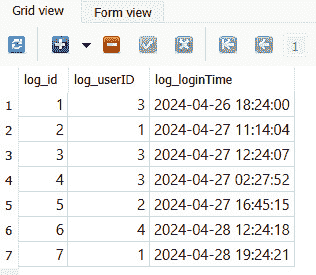

# 使用 SQL 驱动器和 Qt 访问数据库

**结构化查询语言**（**SQL**）是一种特殊的编程语言，用于管理关系数据库管理系统中的数据。SQL 服务器是一个数据库系统，旨在使用多种 SQL 编程语言之一来管理其数据。

在本章中，我们将介绍以下食谱：

+   设置数据库

+   连接到数据库

+   编写基本的 SQL 查询

+   使用 Qt 创建登录界面

+   在模型视图中显示数据库信息

+   高级 SQL 查询

# 技术要求

本章的技术要求包括 Qt 6.6.1 MinGW 64 位和 Qt Creator 12.0.2。本章中使用的所有代码都可以从以下 GitHub 仓库下载：[`github.com/PacktPublishing/QT6-C-GUI-Programming-Cookbook---Third-Edition-/tree/main/Chapter12`](https://github.com/PacktPublishing/QT6-C-GUI-Programming-Cookbook---Third-Edition-/tree/main/Chapter12)。

# 设置数据库

Qt 支持多种不同类型的 SQL 驱动程序，以插件/附加组件的形式存在，例如**SQLite**、**ODBC**、**PostgreSQL**、**MySQL**等。然而，将这些驱动程序集成到 Qt 项目中非常容易。我们将在下面的示例中学习如何做到这一点。

## 如何操作…

在本例中，我们将学习如何使用 Qt 与**SQLite**。在我们深入 Qt 之前，让我们设置我们的 SQLite 编辑器：

1.  从[`sqlitestudio.pl`](https://sqlitestudio.pl)下载**SQLiteStudio**并安装它以管理您的 SQLite 数据库：


1.  打开**SQLiteStudio**，您应该看到类似以下内容：


1.  在我们开始之前，我们需要创建一个新的数据库；转到**数据库** | **添加数据库**。选择您的数据库类型为**SQLite 3**，然后选择您的文件名并设置数据库名称。然后，点击**测试连接**按钮。您应该在按钮旁边看到一个绿色的勾号。之后，点击**确定**按钮：


图 12.3 – 创建新的 SQLite 3 数据库

1.  数据库创建完成后，您应该在**数据库**窗口中看到数据库出现。然后，右键单击**表**，从弹出的菜单中选择**创建表**选项：


图 12.4 – 从菜单中选择创建表选项

1.  将表名设置为`employee`。然后，点击位于表名输入字段上方的**添加列（lns）**按钮。此时，**列**窗口将弹出：


图 12.5 – 创建一个名为 emp_id 的新列

1.  将列名设置为`emp_id`，将数据类型设置为**整数**，并勾选**主键**复选框。然后，点击**主键**复选框右侧的**配置**按钮。现在将弹出**编辑约束**窗口。勾选**自动递增**复选框并点击**应用**：


图 12.6 – 启用自动递增复选框

1.  之后，按`emp_id`。让我们重复上述步骤（不启用主键）来创建其他列。您可以遵循此处看到的相同设置：


图 12.7 – 创建所有五个列

1.  列实际上在此点并未创建。点击位于表名上方的带绿色勾选图标按钮。将弹出一个窗口以确认列的创建。按**确定**继续：


图 12.8 – 点击“确定”按钮进行确认

1.  现在，我们已经创建了`employee`表。让我们从当前为空的`employee`表继续。通过点击带绿色加号图标的**插入行（Ins）**按钮将虚拟数据插入到`employee`表中。然后，简单地插入一些虚拟数据如下：


图 12.9 – 将虚拟数据插入到员工表中

1.  让我们为我们的 Qt 项目设置 SQL 驱动程序。只需转到您的 Qt 安装文件夹，并查找`sqldrivers`文件夹。例如，我的位于`C:\Qt\6.4.2\mingw_64\plugins\sqldrivers`。

1.  将整个`sqldrivers`文件夹复制到您的项目构建目录中。您可以删除与您运行的 SQL 服务器不相关的 DLL 文件。在我们的例子中，因为我们使用`qsqlite.dll`。

1.  上一步中提到的 DLL 文件是使 Qt 能够与不同类型的 SQL 架构通信的驱动程序。您可能还需要 SQL 客户端库的 DLL 文件，以便驱动程序能够工作。在我们的例子中，我们需要`sqlite3.dll`位于我们的程序可执行文件相同的目录中。您可以从**SQLiteStudio**的安装目录或**SQLite**的官方网站[`www.sqlite.org/download.html`](https://www.sqlite.org/download.html)获取它。

## 它是如何工作的…

Qt 为我们提供了 SQL 驱动程序，这样我们就可以轻松地连接到不同类型的 SQL 服务器，而无需自己实现它们。

目前，Qt 正式支持 SQLite、ODBC 和 PostgreSQL。如果你需要直接连接到 MySQL，你需要自己重新编译 Qt 驱动程序，这超出了本书的范围。出于安全原因，不建议你直接从你的应用程序连接到 MySQL。相反，你的应用程序应该通过使用 `QNetworkAccessManager` 发送 HTTP 请求到你的后端脚本（如 PHP、ASP 和 JSP）来间接与 MySQL 数据库（或任何其他 Qt 未官方支持的 SQL 服务器）交互，然后该脚本可以与数据库通信。

如果你只需要一个简单的基于文件的数据库，并且不打算使用基于服务器的数据库，**SQLite** 是你的一个不错的选择，这也是我们本章所选择的方法。

在 *连接到数据库* 菜谱中，我们将学习如何使用 Qt 的 SQL 模块连接到我们的 SQL 数据库。

# 连接到数据库

在这个菜谱中，我们将学习如何将我们的 Qt 6 应用程序连接到 SQL 服务器。

## 如何做到这一点…

在 Qt 中连接到 SQL 服务器非常简单：

1.  打开 Qt Creator 并创建一个新的 **Qt Widgets** **应用程序**项目。

1.  打开你的项目文件（`.pro`），将 `sql` 模块添加到你的项目中，并像这样运行 `qmake`：

    ```cpp
    QT += core gui mainwindow.ui and drag seven label widgets, a combo box, and a checkbox to the canvas. Set the text properties of four of the labels to Name:, Age:, Gender:, and Married:. Then, set the objectName properties of the rest to name, age, gender, and married. There is no need to set the object name for the previous four labels because they’re for display purposes only:
    ```


图 12.10 – 设置文本属性

1.  打开 `mainwindow.h` 并在 `QMainWindow` 头部下方添加以下头文件：

    ```cpp
    #include <QMainWindow>
    #include <QtSql>
    #include <QSqlDatabase>
    #include <QSqlQuery>
    mainwindow.cpp and insert the following code into the class constructor:

    ```

    MainWindow::MainWindow(QWidget *parent) :

    QMainWindow(parent), ui(new Ui::MainWindow) {

    ui->setupUi(this);

    QSqlDatabase db = QSqlDatabase::addDatabase("QSQLITE");

    db.setDatabaseName("database.db3");

    ```cpp

    ```

1.  在数据库连接打开后开始 SQL 查询：

    ```cpp
         if (db.open()) {
               QSqlQuery query;
               if (query.exec("SELECT emp_name, emp_age, emp_gender, emp_married FROM employee")) {
                     while (query.next()) {
                           qDebug() << query.value(0) << query.value(1) <<
    query.value(2) << query.value(3);
                           ui->name->setText(query.value(0).toString());
                           ui->age->setText(query.value(1).toString());
                           ui->gender->setCurrentIndex(query.value(2).toInt());
                           ui->married->setChecked(query.value(3).toBool());
                     }
               }
    ```

1.  打印出任何错误文本：

    ```cpp
               else {
                     qDebug() << query.lastError().text();
               }
               db.close();
         }
         else {
               qDebug() << "Failed to connect to database.";
         }
    }
    ```

1.  如果你现在编译并运行你的项目，你应该会得到类似这样的结果：


图 12.11 – 我们数据库的数据现在显示在 Qt 程序中

## 它是如何工作的…

之前的例子展示了如何使用从 SQL 模块派生的 `QSqlDatabase` 类连接到你的 SQL 数据库。如果不将模块添加到你的 Qt 项目中，你将无法访问任何与 SQL 相关的类。

我们必须在调用 `addDatabase()` 函数时提到我们正在运行的 SQL 架构，Qt 支持的选项包括 `QSqlDatabase: QMYSQL driver not loaded`，你应该检查 DLL 文件是否放置在正确的目录中。

我们可以通过 `QSqlQuery` 类将我们的 SQL 语句发送到数据库，并等待它返回结果，这些结果通常是请求的数据或由于无效语句而产生的错误信息。如果有任何数据来自数据库服务器，它们都将存储在 `QSqlQuery` 类中。你只需要在 `QSqlQuery` 类上执行一个“while”循环来检查所有现有记录并通过调用 `value()` 函数来检索它们。

由于我们在前面的示例中使用了 SQLite，因此连接到数据库时我们不需要设置服务器主机、用户名和密码。SQLite 是一个基于文件的 SQL 数据库；因此，我们只需要在调用 `QSqlDatabase::setDatabaseName()` 时设置文件名。

重要提示

Qt 6 不再官方支持 QMYSQL 或 QMYSQL3。你可以通过从源代码重新编译 Qt 来添加 MySQL 支持。然而，这种方法不建议初学者使用。更多信息，请查看 [`doc.qt.io/qt-6/sql-driver.html#compile-qt-with-a-specific-driver`](https://doc.qt.io/qt-6/sql-driver.html#compile-qt-with-a-specific-driver)。

# 编写基本的 SQL 查询

在上一个示例中，我们编写了我们非常第一个 SQL 查询，它涉及 `SELECT` 语句。这次，我们将学习如何使用一些其他的 SQL 语句，例如 `INSERT`、`UPDATE` 和 `DELETE`。

## 如何做到这一点…

让我们按照以下步骤创建一个简单的程序，通过它演示基本的 SQL 查询命令：

1.  我们可以使用我们之前的项目文件，但有一些事情我们需要更改。打开 `mainwindow.ui` 并替换 `UPDATE`、`INSERT` 和 `DELETE` 的标签：


图 12.12 – 将 UI 修改为这样

1.  打开 `mainwindow.h` 并在私有继承下添加以下变量：

    ```cpp
    private:
         Ui::MainWindow *ui;
         QSqlDatabase db;
         bool connected;
         mainwindow.cpp and go to the class constructor. It is still pretty much the same as the previous example, except we store the database connection status in a Boolean variable called connected, and we also obtain the ID of the data from the database and store it in an integer variable called currentID:

    ```

    MainWindow::MainWindow(QWidget *parent) :

    QMainWindow(parent), ui(new Ui::MainWindow) {

    ui->setupUi(this);

    db = QSqlDatabase::addDatabase("QSQLITE");

    db.setDatabaseName("database.db3");

    connected = db.open();

    ```cpp

    ```

1.  让我们在连接到数据库后执行一个查询：

    ```cpp
         if (connected) {
               QSqlQuery query;
               if (query.exec("SELECT emp_id, emp_name, emp_age, emp_gender, emp_married FROM employee")) {
                     while (query.next()) {
                           currentID = query.value(0).toInt();
                           ui->name->setText(query.value(1).toString());
                           ui->age->setText(query.value(2).toString());
                           ui->gender->setCurrentIndex(query.value(3).toInt());
                           ui->married->setChecked(query.value(4).toBool());
                     }
               }
    ```

1.  打印出任何错误信息：

    ```cpp
               else {
                     qDebug() << query.lastError().text();
               }
         }
         else {
               qDebug() << "Failed to connect to database.";
         }
    }
    ```

1.  前往 `mainwindow.ui` 并在步骤 1 中添加到画布上的一个按钮上右键单击。选择 `mainwindow.h` 和 `mainwindow.cpp`：

    ```cpp
    private slots:
         void on_updateButton_clicked();
         void on_insertButton_clicked();
         void on_deleteButton_clicked();
    ```

1.  打开 `mainwindow.cpp` 并声明当我们点击 **更新** 按钮时程序将执行的操作：

    ```cpp
    void MainWindow::on_updateButton_clicked() {
         if (connected) {
               if (currentID == 0) {
                     qDebug() << "Nothing to update.";
               }
               else {
                     QString id = QString::number(currentID);
                     QString name = ui->name->text();
                     QString age = ui->age->text();
                     QString gender =
    QString::number(ui->gender->currentIndex());
                     QString married =
    QString::number(ui->married->isChecked());
    ```

1.  创建一个类似的 `UPDATE` 查询：

    ```cpp
                     qDebug() << "UPDATE employee SET emp_name = '" + name + "', emp_age = '" + age + "', emp_gender = " + gender + ", emp_married = " + married + " WHERE emp_id = " + id;
                     QSqlQuery query;
                     if (query.exec("UPDATE employee SET emp_name = '" + name + "', emp_age = '" + age + "', emp_gender = " + gender + ", emp_married = " + married + " WHERE emp_id = " + id)) {
                           qDebug() << "Update success.";
                     }
    ```

1.  如果有的话，打印出最后的错误信息：

    ```cpp
                     else {
                           qDebug() << query.lastError().text();
                     }
               }
         }
         else {
               qDebug() << "Failed to connect to database.";
         }
    }
    ```

1.  声明当点击 **INSERT** 按钮时将发生什么：

    ```cpp
    void MainWindow::on_insertButton_clicked() {
         if (connected) {
               QString name = ui->name->text();
               QString age = ui->age->text();
               QString gender =
    QString::number(ui->gender->currentIndex());
               QString married =
    QString::number(ui->married->isChecked());
               qDebug() << "INSERT INTO employee (emp_name, emp_age, emp_gender, emp_married) VALUES ('" + name + "','" + age + "', " + gender + "," + married + ")";
    ```

1.  创建一个类似的 `INSERT` 查询：

    ```cpp
               QSqlQuery query;
               if (query.exec("INSERT INTO employee (emp_name, emp_age, emp_gender, emp_married) VALUES ('" + name + "','" + age + "', " + gender + "," + married + ")")) {
                     currentID = query.lastInsertId().toInt();
                     qDebug() << "Insert success.";
               } else {
                     qDebug() << query.lastError().text();
               }
         }
         else {
               qDebug() << "Failed to connect to database.";
         }
    }
    ```

1.  声明当点击 **Delete** 按钮时将发生什么：

    ```cpp
    void MainWindow::on_deleteButton_clicked() {
         if (connected) {
               if (currentID == 0) {
                     qDebug() << "Nothing to delete.";
               } else {
                     QString id = QString::number(currentID);
                     qDebug() << "DELETE FROM employee WHERE emp_id = " + id;
                     QSqlQuery query;
                     if (query.exec("DELETE FROM employee WHERE emp_id = " + id)) {
                           currentID = 0;
                           qDebug() << "Delete success.";
                     } else {
                           qDebug() << query.lastError().text();
                     }
               }
         }
         else {
               qDebug() << "Failed to connect to database.";
         }
    }
    ```

1.  在类析构函数中调用 `QSqlDatabase::close()` 以在退出程序之前正确终止 SQL 连接：

    ```cpp
    MainWindow::~MainWindow() {
         db.close();
         delete ui;
    }
    ```

1.  如果你现在编译并运行程序，你应该能够从数据库中选择默认数据。然后，你可以选择更新它或从数据库中删除它。你也可以通过点击插入按钮将新数据插入到数据库中。你可以使用 **SQLiteStudio** 来检查数据是否被正确修改：


图 12.13 – SQLite 中数据成功修改

## 它是如何工作的…

在我们向数据库发送 SQL 查询之前，检查数据库是否连接是非常重要的。因此，我们将该状态保存在一个变量中，并在发送任何查询之前使用它进行检查。然而，对于长时间保持打开的复杂程序，这并不推荐，因为在这些期间数据库可能会断开连接，而固定的变量可能不准确。在这种情况下，最好通过调用 `QSqlDatabase::isOpen()` 来检查实际状态。

`currentID` 变量用于保存从数据库中获取的当前数据的 ID。当你想要更新数据或从数据库中删除它们时，这个变量对于让数据库知道你正在尝试更新或删除什么数据至关重要。如果你正确设置了数据库表，SQLite 将将每条数据视为一个唯一的条目，因此你可以确信在保存新数据时数据库中不会产生重复的 ID。

在将新数据插入数据库后，我们调用 `QSqlQuery::lastInsertId()` 来获取新数据的 ID 并将其保存为 `currentID` 变量，以便它成为我们可以更新或从数据库中删除的当前数据。在将 SQL 查询用于 Qt 之前在 `SQLiteStudio` 上测试你的 SQL 查询是一个好习惯。你可以立即发现你的 SQL 语句是否正确，而不是等待你的项目构建，尝试它，然后重新构建它。作为程序员，我们必须以最有效的方式工作。

努力工作，聪明工作。

# 使用 Qt 创建登录界面

在本教程中，我们将学习如何将我们的知识付诸实践，并使用 Qt 和 SQLite 创建一个功能性的登录界面。

## 如何做到这一点...

按照以下步骤创建你的第一个功能性的登录界面：

1.  打开一个网络浏览器并转到 `user`，看起来像这样：


图 12.14 – 创建新的用户表

1.  让我们将第一条数据插入到新创建的表中，并将 `user_employeeID` 设置为现有员工的 ID。这样，我们创建的用户账户将与其中一位员工的资料相链接：


图 12.15 – user_employeeID 列与员工的 emp_id 列相链接

1.  打开 `mainwindow.ui`。在画布上放置一个堆叠小部件，并确保它包含两页。然后，按照以下方式设置堆叠小部件中的两页：


图 12.16 – 在堆叠小部件内创建两页 UI

1.  在堆叠小部件的第一页上，点击小部件顶部的 **编辑标签顺序** 图标，这样你就可以调整程序中小部件的顺序：


图 12.17 – 通过按此按钮更改小部件的顺序

1.  一旦你点击了**编辑标签顺序**图标，你会在画布中每个小部件的上方看到一些数字。确保这些数字与下面的截图中的数字相同。如果不是，请点击数字以更改它们的顺序。我们只为堆叠小部件的第一页做这件事；第二页保持原样即可：


图 12.18 – 每个小部件的顺序显示

1.  右键单击**clicked()**选项并按**确定**。Qt 将随后在你的项目源文件中为你创建一个槽函数。同样，为**注销**按钮重复此步骤。

1.  打开 `mainwindow.h` 并在 `#include <QMainWindow>` 行之后添加以下头文件：

    ```cpp
    #include <QMainWindow>
    #include <QtSql>
    #include <QSqlDatabase>
    #include <QSqlQuery>
    #include <QMessageBox>
    mainwindow.h:

    ```

    private:

    Ui::MainWindow *ui;

    QSqlDatabase db;

    ```cpp

    ```

1.  打开 `mainwindow.cpp` 并在类构造函数中放入以下代码：

    ```cpp
    MainWindow::MainWindow(QWidget *parent) :
         QMainWindow(parent),
         ui(new Ui::MainWindow) {
         ui->setupUi(this);
         ui->stackedWidget->setCurrentIndex(0);
         db = QSqlDatabase::addDatabase("QSQLITE");
         db.setDatabaseName("database.db3");
         if (!db.open()) {
               qDebug() << "Failed to connect to database.";
         }
    }
    ```

1.  定义如果点击**登录**按钮会发生什么：

    ```cpp
    void MainWindow::on_loginButton_clicked() {
         QString username = ui->username->text();
         QString password = ui->password->text();
         QSqlQuery query;
         if (query.exec("SELECT user_employeeID from user WHERE user_username = '" + username + "' AND user_password = '" + password + "'")) {
               int resultSize = 0;
               while (query.next()) {
                     QString employeeID = query.value(0).toString();
                     QSqlQuery query2;
    ```

1.  编写一个 SQL 查询：

    ```cpp
                     if (query2.exec("SELECT emp_name, emp_age, emp_gender, emp_married FROM employee WHERE emp_id = " + employeeID)) {
                           while (query2.next()) {
                                 QString name = query2.value(0).toString();
                                 QString age = query2.value(1).toString();
                                 int gender = query2.value(2).toInt();
                                 bool married = query2.value(3).toBool();
                                 ui->name->setText(name);
                                 ui->age->setText(age);
    ```

1.  我们继续使用前面的代码，并在切换到堆叠小部件的第二页之前设置性别和已婚文本：

    ```cpp
                                 if (gender == 0)
                                       ui->gender->setText("Male");
                                 else
                                       ui->gender->setText("Female");
                                 if (married)
                                       ui->married->setText("Yes");
                                 else
                                       ui->married->setText("No");
                                 ui->stackedWidget->setCurrentIndex(1);
                           }
                     }
                     resultSize++;
               }
    ```

1.  如果登录失败，打印错误信息：

    ```cpp
               if (resultSize == 0)
               {
                     QMessageBox::warning(this, "Login failed", "Invalid username or password.");
               }
         }
         else
         {
               qDebug() << query.lastError().text();
         }
    }
    ```

1.  定义如果点击**注销**按钮会发生什么：

    ```cpp
    void MainWindow::on_logoutButton_clicked() {
         ui->stackedWidget->setCurrentIndex(0);
    }
    ```

1.  当主窗口关闭时关闭数据库：

    ```cpp
    MainWindow::~MainWindow() {
         db.close();
         delete ui;
    }
    ```

1.  编译并运行程序，你应该能够使用虚拟账户登录。登录后，你应该能够看到与用户账户关联的虚拟员工信息。你也可以通过点击**注销**按钮来注销：


图 12.19 – 一个简单、可用的登录界面

## 它是如何工作的…

在这个例子中，我们从用户表中选择与我们在文本字段中插入的用户名和密码匹配的数据。如果没有找到任何内容，这意味着我们提供了无效的用户名或密码。否则，从用户账户中获取 `user_employeeID` 数据，并对 `employee` 表执行另一个 SQL 查询以查找与 `user_employeeID` 变量匹配的信息。然后，根据你的程序界面显示数据。

我们必须在**编辑标签顺序**模式下设置小部件顺序，以便程序启动时，第一个获得焦点的小部件是用户名行编辑小部件。如果用户按下键盘上的**Tab**键，焦点应切换到第二个小部件，即密码行编辑。不正确的小部件顺序会破坏用户体验并驱赶任何潜在用户。请确保密码行编辑的**echoMode**选项设置为**密码**。该设置将隐藏实际插入到行编辑中的密码，并用点符号替换以实现安全目的。

由于 SQLite 不支持返回查询大小，我们无法使用 `QSqlQuery::size()` 函数来确定返回多少结果；结果始终为 -`1`。因此，我们在 while 循环操作中声明了一个 `resultSize` 变量来计数结果。

# 在模型视图中显示数据库信息

按照以下步骤在模型视图小部件上显示数据库信息：

## 如何操作…

在本食谱中，我们将学习如何在程序中的模型视图中显示从我们的 SQL 数据库中获取的多组数据：

1.  我们将使用名为 `employee` 的数据库表，这是我们之前在 *使用 Qt 创建登录界面* 的示例中使用的。这次，我们需要在员工表中添加更多的数据。打开你的 **SQLiteStudio** 控制面板。为几个更多的员工添加数据，以便我们可以在程序中稍后显示：


图 12.20 – 向员工表添加更多虚拟数据

1.  打开 Qt Creator，创建一个新的 **Qt Widgets Application** 项目，然后向你的项目添加 **SQL** 模块。

1.  打开 `mainwindow.ui` 并从 **Widget**（基于项）下的 **Item Widget** 中添加一个表格小部件（不是表格视图）。在画布上选择主窗口，然后点击 **Lay Out Vertically** 或 **Lay Out Horizontally** 按钮使表格小部件粘附到主窗口的大小，即使它被调整大小：


图 12.21 – 点击“垂直布局”按钮

1.  双击表格小部件，将出现一个窗口。在 **列** 选项卡下，通过点击左上角的 **+** 按钮添加五个项目。将项目命名为 **ID**、**Name**、**Age**、**Gender** 和 **Married**。完成后点击 **OK**：


图 12.22 – 我们还设置了文本居中对齐

1.  右键单击表格小部件，在弹出窗口中选择 `itemChanged(QTableWidgetItem*)` 选项，然后按 **OK**。将在两个源文件中创建一个槽函数。

1.  打开 `mainwindow.h` 并将这些私有变量添加到 `MainWindow` 类中：

    ```cpp
    private:
         Ui::MainWindow *ui;
         bool hasInit;
         mainwindow.h:

    ```

    #include <QtSql>

    #include <QSqlDatabase>

    #include <QSqlQuery>

    #include <QMessageBox>

    #include <QDebug>

    #include <QTableWidgetItem>

    ```cpp

    ```

1.  打开 `mainwindow.cpp`；我们将在那里写大量的代码。我们需要声明程序启动时会发生什么。将以下代码添加到 `MainWindow` 类的构造函数中：

    ```cpp
    MainWindow::MainWindow(QWidget *parent) :
         QMainWindow(parent),
         ui(new Ui::MainWindow)
    {
         hasInit = false;
         ui->setupUi(this);
         db = QSqlDatabase::addDatabase("QSQLITE");
         db.setDatabaseName("database.db3");
         ui->tableWidget->setColumnHidden(0, true);
    ```

1.  SQL 查询代码看起来像这样：

    ```cpp
         if (db.open()) {
               QSqlQuery query;
               if (query.exec("SELECT emp_id, emp_name, emp_age, emp_gender, emp_married FROM employee")) {
                     while (query.next()) {
                           qDebug() << query.value(0) << query.value(1) << query.value(2) << query.value(3) << query.value(4);
                           QString id = query.value(0).toString();
                           QString name = query.value(1).toString();
                           QString age = query.value(2).toString();
                           int gender = query.value(3).toInt();
                           bool married = query.value(4).toBool();
    ```

1.  创建几个 `QTableWidgetItem` 对象：

    ```cpp
                           ui->tableWidget->setRowCount(ui->tableWidget->rowCount() + 1);
                           QTableWidgetItem* idItem = new QTableWidgetItem(id);
                           QTableWidgetItem* nameItem = new QTableWidgetItem(name);
                           QTableWidgetItem* ageItem = new QTableWidgetItem(age);
                           QTableWidgetItem* genderItem = new QTableWidgetItem();
                           if (gender == 0)
                                 genderItem->setData(0, "Male");
                           else
                                 genderItem->setData(0, "Female");
                           QTableWidgetItem* marriedItem = new QTableWidgetItem();
                           if (married)
                                 marriedItem->setData(0, "Yes");
                           else
                                 marriedItem->setData(0, "No");
    ```

1.  将这些对象移动到表格小部件中：

    ```cpp
                           ui->tableWidget->setItem(ui->tableWidget->rowCount() - 1, 0, idItem);
                           ui->tableWidget->setItem(ui->tableWidget->rowCount() - 1, 1, nameItem);
                           ui->tableWidget->setItem(ui->tableWidget->rowCount() - 1, 2, ageItem);
                           ui->tableWidget->setItem(ui->tableWidget->rowCount() - 1, 3, genderItem);
                           ui->tableWidget->setItem(ui->tableWidget->rowCount() - 1, 4, marriedItem);
                     }
                     hasInit = true;
               }
               else {
                     qDebug() << query.lastError().text();
               }
         }
         else {
               qDebug() << "Failed to connect to database.";
         }
    }
    ```

1.  声明当表格小部件的项被编辑时会发生什么。将以下代码添加到 `on_tableWidget_itemChanged()` 槽函数中：

    ```cpp
    void MainWindow::on_tableWidget_itemChanged(QTableWidgetItem *item) {
         if (hasInit) {
               QString id = ui->tableWidget->item(item->row(), 0)->data(0).toString();
               QString name = ui->tableWidget->item(item->row(), 1)->data(0).toString();
               QString age = QString::number(ui->tableWidget->item(item->row(), 2)->data(0).toInt());
               ui->tableWidget->item(item->row(), 2)->setData(0, age);
               QString gender;
               if (ui->tableWidget->item(item->row(), 3)->data(0).toString() == "Male") {
                     gender = "0";
               } else {
                     ui->tableWidget->item(item->row(), 3)->setData(0,"Female");
                     gender = "1";
               }
               QString married;
               if (ui->tableWidget->item(item->row(), 4)->data(0).toString() == "No") {
                     married = "0";
               } else {
                     ui->tableWidget->item(item->row(), 4)->setData(0, "Yes");
                     married = "1";
               }
               qDebug() << id << name << age << gender << married;
               QSqlQuery query;
               if (query.exec("UPDATE employee SET emp_name = '" + name + "', emp_age = '" + age + "', emp_gender = '" + gender + "', emp_married = '" + married + "' WHERE emp_id = " + id)) {
                     QMessageBox::information(this, "Update Success", "Data updated to database.");
               } else {
                     qDebug() << query.lastError().text();
               }
         }
    }
    ```

1.  在类析构函数中关闭数据库：

    ```cpp
    MainWindow::~MainWindow() {
         db.close();
         delete ui;
    }
    ```

1.  如果你现在编译并运行示例，你应该会得到类似这样的结果：


图 12.23 – 我们已经创建了自己的 SQL 编辑器

## 它是如何工作的…

表小部件与你在类似 **Microsoft Excel** 和 **OpenOffice Calc** 这样的电子表格应用中看到的小部件类似。与其他类型的模型查看器，如列表视图或树形视图相比，表格视图（或表小部件）是一个二维模型查看器，它以行和列的形式显示数据。

在 Qt 中，表格视图与表格小部件的主要区别在于，表格小部件是建立在表格视图类之上的，这意味着表格小部件更容易使用，更适合初学者。然而，表格小部件不如表格视图灵活，并且往往不如表格视图可扩展，如果你想要自定义表格，这并不是最佳选择。在从 SQLite 中检索数据后，我们为每个数据项创建了一个 `QTableWidgetItem` 项目，并设置了应该添加到表格小部件中的列和行。在将项目添加到表格小部件之前，我们必须通过调用 `QTableWidget::setRowCount()` 来增加表格的行数。我们也可以通过简单地调用 `QTableWidget::rowCount()` 来获取表格小部件的当前行数。

最左侧的列被隐藏起来，因为我们只使用它来保存数据的 ID，以便在行中的某个数据项发生变化时，我们可以用它来更新数据库。当其中一个单元格中的数据发生变化时，将调用 `on_tableWidget_itemChanged()` 插槽函数。它不仅会在你编辑单元格中的数据时被调用，也会在从数据库检索后首次将数据添加到表格中时被调用。为了确保这个函数只在我们编辑数据时被触发，我们使用一个名为 `hasInit` 的布尔变量来检查我们是否已经完成了初始化过程（将第一批数据添加到表格中）。如果 `hasInit` 为假，则忽略函数调用。

为了防止用户输入完全无关的数据类型，例如在只允许数字的数据单元格中插入字母，我们手动检查在它们被编辑时数据是否接近我们期望的任何有效内容。如果不符合任何有效内容，则将其还原为默认值。这当然是一个简单的技巧，虽然它能完成任务，但不是最专业的方法。或者，你可以尝试创建一个新的类，该类继承自 `QItemDelegate` 类，并定义你的模型视图应该如何行为。然后，通过调用 `QTableWidget::setItemDelegate()` 将该类应用到你的表格小部件上。

# 高级 SQL 查询

通过遵循这个食谱，你将学习如何使用高级 SQL 语句，例如 `INNER` `JOIN`、`COUNT`、`LIKE` 和 `DISTINCT`。

## 如何做到这一点…

你可以在 SQL 数据库上执行的操作远不止简单的查询。让我们遵循以下步骤来学习如何：

1.  在我们可以进入编程部分之前，我们需要在我们的数据库中添加几个表。打开你的 **SQLiteStudio**。为了使这个示例正常工作，我们需要几个表：


图 12.24 – 我们需要为这个例子创建的附加表

1.  我将向您展示本项目中所需每个表的架构以及为测试插入到表中的虚构数据。第一个表称为 `branch`，用于存储虚构公司不同分支的 ID 和名称：


图 12.25 – 分支表

1.  其次，我们有 `department` 表，它存储了虚构公司不同部门的 ID 和名称，这些部门通过分支 ID 与 `branch` 数据相链接：


图 12.26 – 部门表，它与分支表相链接

1.  我们还有一个 `employee` 表，它存储了虚构公司中所有员工的信息。这个表与我们在前面的例子中使用过的表类似，但它有两个额外的列，`emp_birthday` 和 `emp_departmentID`：


图 12.27 – 员工表，它与部门表相链接

1.  我们还有一个名为 `log` 的表，其中包含每个员工登录时间的虚构记录。`log_loginTime` 将被设置为日期时间变量类型：



图 12.28 – 日志表，它与用户表相链接

1.  我们有 `user` 表，我们也在前面的例子中使用过：


图 12.29 – 用户表

1.  打开 Qt Creator。这次，我们不是选择 **Qt Widgets Application**，而是选择 **Qt** **Console Application**：


图 12.30 – 创建 Qt 控制台应用程序项目

1.  打开你的项目文件 (.pro) 并将 `sql` 模块添加到你的项目中：

    ```cpp
    QT += core sql
    main.cpp and add the following header files to the top of the source file:

    ```

    `#include <QSqlDatabase>`

    `#include <QSqlQuery>`

    `#include <QSqlError>`

    `#include <QDate>`

    `#include <QDebug>`

    ```cpp

    ```

1.  添加以下函数以显示年龄超过 30 岁的员工：

    ```cpp
    void filterAge() {
         qDebug() << "== Employees above 40 year old =============";
         QSqlQuery query;
         if (query.exec("SELECT emp_name, emp_age FROM employee WHERE emp_age > 40")) {
               while (query.next()) {
                     qDebug() << query.value(0).toString() << query.value(1).toString();
               }
         }
         else {
         qDebug() << query.lastError().text();
         }
    }
    ```

1.  添加以下函数以显示每个员工的 `department` 和 `branch` 信息：

    ```cpp
    void getDepartmentAndBranch() {
         qDebug() << "== Get employees' department and branch =============";
         QSqlQuery query;
         if (query.exec("SELECT emp_name, dep_name, brh_name FROM (SELECT emp_name, emp_departmentID FROM employee) AS myEmployee INNER JOIN department ON department.dep_id = myEmployee.emp_departmentID INNER JOIN branch ON branch.brh_id = department.dep_branchID")) {
               while (query.next()) {
                     qDebug() << query.value(0).toString() << query.value(1).toString() << query.value(2).toString();
               }
         }
         else {
               qDebug() << query.lastError().text();
         }
    }
    ```

1.  添加以下函数，用于显示在纽约分支工作且年龄低于 40 岁的员工：

    ```cpp
    void filterBranchAndAge() {
         qDebug() << "== Employees from New York and age below 40 =============";
         QSqlQuery query;
         if (query.exec("SELECT emp_name, emp_age, dep_name, brh_name FROM (SELECT emp_name, emp_age, emp_departmentID FROM employee) AS myEmployee INNER JOIN department ON department.dep_id = myEmployee.emp_departmentID INNER JOIN branch ON branch.brh_id = department.dep_branchID WHERE branch.brh_name = 'New York' AND myEmployee.emp_age < 40")) {
               while (query.next()) {
                     qDebug() << query.value(0).toString() << query.value(1).toString() << query.value(2).toString() << query.value(3).toString();
               }
         }
         else {
         qDebug() << query.lastError().text();
         }
    }
    ```

1.  添加以下函数，用于计算虚构公司中女性员工的总数：

    ```cpp
    void countFemale() {
         qDebug() << "== Count female employees =============";
         QSqlQuery query;
         if (query.exec("SELECT COUNT(emp_gender) FROM employee WHERE emp_gender = 1")) {
               while (query.next()) {
                     qDebug() << query.value(0).toString();
               }
         }
         else {
               qDebug() << query.lastError().text();
         }
    }
    ```

1.  添加以下函数，用于过滤员工列表并仅显示以 `Ja` 开头的名字：

    ```cpp
    void filterName() {
         qDebug() << "== Employees name start with 'Ja' =============";
         QSqlQuery query;
         if (query.exec("SELECT emp_name FROM employee WHERE emp_name LIKE '%Ja%'")) {
               while (query.next()) {
                     qDebug() << query.value(0).toString();
               }
         }
         else {
               qDebug() << query.lastError().text();
         }
    }
    ```

1.  添加以下函数，用于显示八月份生日的员工：

    ```cpp
    void filterBirthday() {
         qDebug() << "== Employees birthday in August =============";
         QSqlQuery query;
         if (query.exec("SELECT emp_name, emp_birthday FROM employee WHERE strftime('%m', emp_birthday) = '08'")) {
               while (query.next()) {
                     qDebug() << query.value(0).toString() << query.value(1).toDate().toString("d-MMMM-yyyy");
               }
         }
         else {
               qDebug() << query.lastError().text();
         }
    }
    ```

1.  添加以下函数，用于检查谁在 2024 年 4 月 27 日登录了虚构系统，并在终端上显示他们的名字：

    ```cpp
    void checkLog() {
         qDebug() << "== Employees who logged in on 27 April 2024 =============";
         QSqlQuery query;
         if (query.exec("SELECT DISTINCT emp_name FROM (SELECT emp_id, emp_name FROM employee) AS myEmployee INNER JOIN user ON user.user_employeeID = myEmployee.emp_id INNER JOIN log ON log.log_userID = user.user_id WHERE DATE(log.log_loginTime) = '2024-04-27'")) {
               while (query.next()) {
                     qDebug() << query.value(0).toString();
               }
         }
         else {
               qDebug() << query.lastError().text();
         }
    }
    ```

1.  在 `main()` 函数中，将程序连接到 SQLite 数据库并调用我们在前面步骤中定义的所有函数。关闭数据库连接，任务完成：

    ```cpp
    int main(int argc, char *argv[]) {
         QCoreApplication a(argc, argv);
         QSqlDatabase db = QSqlDatabase::addDatabase("QSQLITE");
         db.setDatabaseName("database.db3");
         if (db.open()) {
               filterAge();
               getDepartmentAndBranch();
               filterBranchAndAge();
               countFemale();
               filterName();
               filterBirthday();
               checkLog();
               db.close();
         }
         else {
               qDebug() << "Failed to connect to database.";
         }
         return a.exec();
    }
    ```

1.  如果你现在编译并运行项目，你应该会看到一个显示过滤结果的终端窗口：


图 12.31 – 在应用程序输出窗口中打印结果

## 它是如何工作的…

控制台应用程序没有 GUI，只在一个终端窗口中显示文本显示。这通常用于后端系统，因为它与使用小部件的应用程序相比，使用的资源更少。我们在这个例子中使用它是因为它更快地显示结果，无需在程序中放置任何小部件，而这在本例中是不需要的。

我们将 SQL 查询分成了不同的函数，这样更容易维护代码，并且不会变得过于杂乱。请注意，在 C++ 中，函数必须位于 `main()` 函数之前；否则，它们将无法被 `main()` 函数调用。

## 还有更多…

在前面的示例中使用的 `INNER JOIN` 语句将两个表连接起来，并选择两个表中的所有行，只要两个表中的列之间存在匹配即可。在 SQLite（以及一些其他类型的 SQL 架构）中，你可以使用许多其他类型的 `JOIN` 语句，例如 `LEFT JOIN`、`RIGHT JOIN` 和 `FULL OUTER JOIN`。

以下图表显示了不同类型的 `JOIN` 语句及其效果：


图 12.32 – 不同类型的 JOIN 语句

以下项目符号解释了我们在本食谱示例代码中使用的 `LIKE` 和 `DISTINCT` 语句：

+   `LIKE` 语句通常用于在数据库中搜索不包含完整单词的字符串变量。请注意，在搜索关键字前后各有一个 % 符号。

+   在前面的示例中使用的 `DISTINCT` 语句过滤掉了具有完全相同变量的结果。例如，如果没有使用 `DISTINCT` 语句，你将在终端中看到两个版本的拉里·金，因为他在同一天登录系统的记录有两条。通过添加 `DISTINCT` 语句，SQLite 将消除其中一个结果，并确保每个结果都是唯一的。

+   你可能想知道 `d-MMMM-yyyy` 代表什么，以及为什么我们在前面的示例中使用它。这实际上是一个提供给 Qt 中的 `QDateTime` 类的表达式，用于使用给定格式显示日期时间结果。在这种情况下，它将我们从 SQLite 获取的日期时间数据，2024-08-06，转换为指定的格式，结果为 6-August-2024。

更多信息，请参阅 Qt 的文档[`doc.qt.io/qt-6/qdatetime.html#toString`](http://doc.qt.io/qt-6/qdatetime.html#toString)，其中包含可以用来确定日期时间字符串格式的完整表达式列表。

SQL 提供了一种简单高效的方法来保存和加载用户数据，无需重新发明轮子。Qt 为您提供了一个现成的解决方案，用于将您的应用程序与 SQL 数据库连接；在本章中，我们通过逐步的方法学习了如何实现这一点，并且能够将我们的用户数据加载和保存到 SQL 数据库中。
