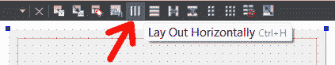
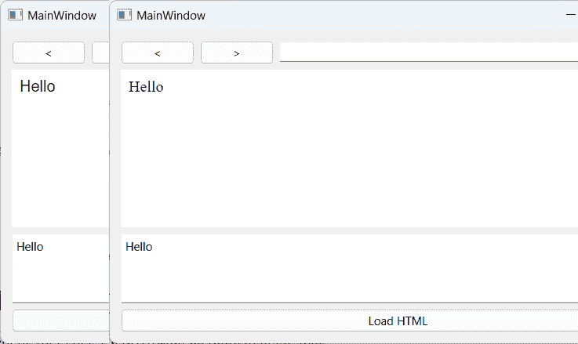

# 使用 Qt WebEngine 开发 Web 应用程序

Qt 包含一个名为 **Qt WebEngine** 的模块，它允许我们将网页浏览器小部件嵌入到我们的程序中，并使用它来显示网页或本地 HTML 内容。在版本 5.6 之前，Qt 使用另一个类似的模块，名为 **Qt WebKit**，该模块现已弃用，并已被基于 Chromium 的 **WebEngine** 模块所取代。Qt 还允许通过 **Qt WebChannel** 在 JavaScript 和 C++ 代码之间进行通信，这使得我们能够更有效地使用此模块。

在本章中，我们将介绍以下食谱：

+   介绍 **Qt WebEngine**

+   使用 `webview` 和网页设置

+   在你的项目中嵌入 Google 地图

+   从 JavaScript 调用 C++ 函数

+   从 C++ 调用 JavaScript 函数

# 技术要求

本章的技术要求包括 Qt 6.6.1 MSVC 2019 64 位、Qt Creator 12.0.2 和 Microsoft Visual Studio。本章中使用的所有代码都可以从以下 GitHub 仓库下载：[`github.com/PacktPublishing/QT6-C-GUI-Programming-Cookbook---Third-Edition-/tree/main/Chapter13`](https://github.com/PacktPublishing/QT6-C-GUI-Programming-Cookbook---Third-Edition-/tree/main/Chapter13)。

# 介绍 Qt WebEngine

在此示例项目中，我们将探索 Qt 中 **WebEngine** 模块的基本功能，并尝试构建一个简单的可工作的网页浏览器。由于 Qt 5.6，Qt 的 **WebKit** 模块已被弃用，并由基于 Google Chromium 引擎的 **WebEngine** 模块所取代。

## 如何做到这一点…

首先，让我们设置我们的 **WebEngine** 项目：

1.  目前，Qt 的 **WebEngine** 模块仅与 Visual C++ 编译器兼容，而不与其他编译器兼容，例如 **MinGW** 或 **Cygwin**。这可能在将来改变，但这完全取决于 Qt 开发者是否希望将其移植到其他编译器。确保你电脑上安装的 Qt 版本支持 Visual C++ 编译器。你可以使用 Qt 的维护工具将 **MSVC 2019 64-bit** 组件添加到你的 Qt 安装中。此外，确保你在 Qt 版本中已安装 **Qt WebEngine** 组件：


图 13.1 – 确保已安装 MSVC 2019 和 Qt WebEngine

1.  打开 Qt Creator 并创建一个新的 **Qt Widgets 应用程序** 项目。选择使用 Visual C++ 编译器的工具包：


图 13.2 – 只有 MSVC 被 Qt WebEngine 官方支持

1.  打开你的项目文件（`.pro`）并将以下模块添加到你的项目中。之后，你必须运行 `qmake` 以应用更改：

    ```cpp
    QT += core gui mainwindow.ui and remove the menuBar, mainToolBar, and statusBar objects, as we don’t need those in this project:
    ```


图 13.3 – 移除菜单栏、主工具栏和状态栏

1.  在画布上放置两个水平布局，然后在布局顶部放置一个 **Line Edit** 小部件和一个按钮：


图 13.4 – 将行编辑小部件和按钮放置在布局中

1.  选择画布并单击位于编辑器顶部的**垂直布局**按钮：



图 13.5 – 点击“垂直布局”按钮

1.  布局将扩展并跟随主窗口的大小。行编辑也会根据水平布局的宽度水平扩展：


图 13.6 – 行编辑现在正在水平扩展

1.  在行编辑的左侧添加两个按钮。我们将使用这两个按钮在页面历史记录之间移动。稍后使用 C++代码将其添加到*步骤 15*，并将占用空间：


图 13.7 – 向 UI 添加两个按钮和一个进度条

1.  右键单击其中一个按钮并选择`clicked()`，然后点击`mainwindow.h`和`mainwindow.cpp`。对其他所有按钮重复此步骤。

1.  右键单击行编辑并选择`returnPressed()`，然后点击`mainwindow.h`和`mainwindow.cpp`。

1.  让我们跳转到`mainwindow.h`。我们需要做的第一件事是将以下头文件添加到`mainwindow.h`中：

    ```cpp
    #include <QtWebEngineWidgets/QtWebEngineWidgets>
    ```

1.  在类析构函数下声明一个`loadUrl()`函数：

    ```cpp
    public:
        explicit MainWindow(QWidget *parent = 0);
        ~MainWindow();
        loading() to mainwindow.h:

    ```

    private slots:

    void on_goButton_clicked();

    void on_address_returnPressed();

    void on_backButton_clicked();

    void on_forwardButton_clicked();

    void loading(int progress);

    ```cpp

    ```

1.  声明一个`QWebEngineView`对象并命名为`webview`：

    ```cpp
    private:
        Ui::MainWindow *ui;
        QWebEngineView* webview;
    ```

1.  打开`mainwindow.cpp`文件并初始化`WebEngine`视图。将其添加到第二个水平布局中，并将其`loadProgress()`信号连接到我们刚刚添加到`mainwindow.h`中的`loading()`槽函数：

    ```cpp
    MainWindow::MainWindow(QWidget *parent) :
        QMainWindow(parent),
        ui(new Ui::MainWindow)
    {
        ui->setupUi(this);
        webview = new QWebEngineView;
        ui->horizontalLayout_2->addWidget(webview);
        connect(webview, &QWebEngineView::loadProgress, this,
    &MainWindow::loading);
    }
    ```

1.  声明当`loadUrl()`函数被调用时会发生什么：

    ```cpp
    void MainWindow::loadUrl() {
        QUrl url = QUrl(ui->address->text());
        url.setScheme("http");
        webview->page()->load(url);
    }
    ```

1.  当**Go**按钮被点击或当**Enter**键被按下时调用`loadUrl()`函数：

    ```cpp
    void MainWindow::on_goButton_clicked() {
        loadUrl();
    }
    MainWindow::on_address_returnPressed() {
        loadUrl();
    }
    ```

1.  至于其他两个按钮，我们将要求`webview`加载历史记录堆栈中可用的上一页或下一页：

    ```cpp
    void MainWindow::on_backButton_clicked() {
        webview->back();
    }
    void MainWindow::on_forwardButton_clicked() {
        webview->forward();
    }
    ```

1.  在网页加载时更改`progressBar`的值：

    ```cpp
    void MainWindow::loading(int progress) {
        ui->progressBar->setValue(progress);
    }
    ```

1.  现在构建并运行程序，你将得到一个非常基础但功能齐全的网页浏览器：


## 它是如何工作的…

旧的 `webview` 系统基于苹果的 **WebKit** 引擎，并且仅在 Qt 5.5 及其之前的版本中可用。从 5.6 版本开始，Qt 完全放弃了 **WebKit**，并替换为谷歌的 **Chromium** 引擎。API 已经完全改变，因此一旦迁移到 5.6，所有与 **Qt WebKit** 相关的代码将无法正确工作。如果你是 Qt 的新手，建议你跳过 **WebKit**，学习 **WebEngine** API，因为它正在成为 Qt 的新标准。

注意

如果你以前使用过 Qt 的 **WebKit**，这个网页会教你如何将你的旧代码迁移到 **WebEngine**：[`wiki.qt.io/Porting_from_QtWebKit_to_QtWebEngine`](https://wiki.qt.io/Porting_from_QtWebKit_to_QtWebEngine)

在上一节的 *步骤 15* 中，我们将属于 `webview` 小部件的 `loadProgress()` 信号连接到了 `loading()` 插槽函数。当在 *步骤 17* 中通过调用 `QWebEnginePage::load()` 加载你请求的网页时，信号将自动被调用。如果你需要，你也可以连接 `loadStarted()` 和 `loadFinished()` 信号。

在 *步骤 17* 中，我们使用了 `QUrl` 类将来自行编辑器的文本转换为 URL 格式。默认情况下，如果我们没有指定 URL 方案（HTTP、HTTPS、FTP 等），我们插入的地址将指向本地路径。如果我们给出的是 `google.com` 而不是 `http://google.com`，我们可能无法加载页面。因此，我们通过调用 `QUrl::setScheme()` 手动指定了一个 URL 方案，以确保在传递给 `webview` 之前地址格式正确。

## 还有更多…

如果出于某种原因你需要你的项目中使用 **WebKit** 模块而不是 **WebEngine**，你可以从 GitHub 获取模块代码并自行构建：[`github.com/qt/qtwebkit`](https://github.com/qt/qtwebkit)

# 使用 webview 和 web 设置

在这个菜谱中，我们将更深入地探讨 Qt 的 `webview` 中可用的功能。我们将使用前一个示例中的源文件，并为其添加更多代码。

## 如何操作…

让我们探索一下 **Qt** **WebEngine** 模块的一些基本功能：

1.  打开 `mainwindow.ui` 并在进度条下方添加一个垂直布局。将 **纯文本编辑** 小部件的 `plaintext` 属性添加到以下内容：

    ```cpp
    </img>
    <h1>Hello World!</h1>
    <h3>This is our custom HTML page.</h3>
    <script>alert("Hello!");</script>
    ```

    这是在你向 **纯文本** **编辑** 小部件上方添加代码后的样子：


图 13.9 – 向底部添加纯文本编辑小部件和按钮

1.  前往 **文件** | **新建文件**。一个窗口将会弹出，并要求你选择一个文件模板。在 **Qt** 类别下选择 **Qt 资源文件**，然后点击 **选择…** 按钮。输入你想要的文件名，点击 **下一步**，然后点击 **完成**：


图 13.10 – 创建 Qt 资源文件

1.  通过在`/`上右键单击我们刚刚创建的资源文件并点击`.exe`图像文件来打开它（一旦编译完成）：


![图 13.11 – 将 tux.png 图像文件添加到我们的资源文件中]

1.  打开`mainwindow.h`并在其中添加以下头文件：

    ```cpp
    #include <QMainWindow>
    #include <QtWebEngineWidgets/QtWebEngineWidgets>
    #include <QDebug>
    mainwindow.h:

    ```

    public:

    explicit MainWindow(QWidget *parent = 0);

    ~MainWindow();

    void loadUrl();

    private slots:

    void on_goButton_clicked();

    void on_address_returnPressed();

    void on_backButton_clicked();

    void on_forwardButton_clicked();

    void startLoading();

    void loading(int progress);

    void loaded(bool ok);

    void on_loadHtml_clicked();

    private:

    Ui::MainWindow *ui;

    在 mainwindow.cpp 中添加以下代码到类构造函数中：

    ```cpp
    MainWindow::MainWindow(QWidget *parent) :
        QMainWindow(parent),
        ui(new Ui::MainWindow)
    {
        ui->setupUi(this);
        webview = new QWebEngineView;
        ui->horizontalLayout_2->addWidget(webview);
       //webview->page()->settings()->setAttribute(QWebEngineSettings::JavascriptEnabled, false);
       //webview->page()->settings()->setAttribute(QWebEngineSettings::AutoLoadImages, false);
       //QString fontFamily = webview->page()->settings()->fontFamily(QWebEngineSettings::SerifFont);
        QString fontFamily = webview->page()->settings()->fontFamily(QWebEngineSettings::SansSerifFont);
        int fontSize = webview->page()->settings()->fontSize(QWebEngineSettings::MinimumFontSize);
        QFont myFont = QFont(fontFamily, fontSize);
        webview:

    ```

    QFile file("://tux.png");

    if (file.open(QFile::ReadOnly)) {

    QByteArray data = file.readAll();

    webview->page()->setContent(data, "image/png");

    }

    else {

    qDebug() << "文件无法打开。";

    }

    connect(webview, &QWebEngineView::loadStarted, this, &MainWindow::startLoading()));

    connect(webview, &QWebEngineView::loadProgress, this, &MainWindow::loading(int)));

    connect(webview, &QWebEngineView::loadFinished, this, &MainWindow::loaded(bool)));

    }

    ```cpp

    ```

    ```cpp

    ```

1.  在*Qt WebEngine 入门*中的前一个示例中，`MainWindow::loadUrl()`函数保持不变，它在加载页面之前将 URL 方案设置为 HTTP：

    ```cpp
    void MainWindow::loadUrl() {
        QUrl url = QUrl(ui->address->text());
        url.setScheme("http");
        webview->page()->load(url);
    }
    ```

1.  以下函数也是如此，它们与*Qt WebEngine 入门*中的前一个示例保持一致：

    ```cpp
    void MainWindow::on_goButton_clicked() {
        loadUrl();
    }
    void MainWindow::on_address_returnPressed() {
        loadUrl();
    }
    void MainWindow::on_backButton_clicked() {
        webview->back();
    }
    void MainWindow::on_forwardButton_clicked() {
        webview->forward();
    }
    ```

1.  添加`MainWindow::startLoading()`和`MainWindow::loaded()`槽函数，这两个函数将由`loadStarted()`和`loadFinished()`信号调用。这两个函数基本上在页面开始加载时显示进度条，在页面加载完成后隐藏进度条：

    ```cpp
    void MainWindow::startLoading() {
        ui->progressBar->show();
    }
    void MainWindow::loading(int progress) {
        ui->progressBar->setValue(progress);
    }
    void MainWindow::loaded(bool ok) {
        ui->progressBar->hide();
    }
    ```

1.  当点击**加载 HTML**按钮时，调用`webview->loadHtml()`将纯文本转换为 HTML 内容：

    ```cpp
    void MainWindow::on_loadHtml_clicked() {
        webview->setHtml(ui->source->toPlainText());
    }
    ```

1.  构建并运行程序，你应该会看到以下内容：


图 13.12 – webview 将显示由您的 HTML 代码生成的结果

## 它是如何工作的...

在这个例子中，我们使用 C++加载了一个图像文件并将其设置为`webview`的默认内容（而不是空白页面）。我们也可以通过在启动时加载包含图像的默认 HTML 文件来实现相同的结果。

类构造函数中的部分代码已被注释掉。你可以移除双斜杠(`//`)并查看它带来的差异 – JavaScript 警告将不再出现（因为 JavaScript 已被禁用），图像将不再在`webview`中显示。

你还可以尝试将字体家族从`QWebEngineSettings::SansSerifFont`更改为`QWebEngineSettings::SerifFont`。你将注意到`webview`中字体显示的细微差别：



图 13.13 – 在 webview 中显示不同类型的字体

通过点击`webview`将**纯文本编辑**小部件的内容视为 HTML 代码并加载为 HTML 页面。你可以使用这个功能创建一个由 Qt 驱动的简单 HTML 编辑器！

# 在你的项目中嵌入谷歌地图

在这个菜谱中，我们将学习如何通过 Qt 的**WebEngine**模块将谷歌地图嵌入到我们的项目中。这个示例并不侧重于 Qt 和 C++，而是侧重于 HTML 代码中的**谷歌地图**API。

## 如何做到这一点…

让我们按照以下步骤创建一个显示谷歌地图的程序：

1.  创建一个新的**Qt Widgets 应用程序**项目，并移除**状态栏**、**菜单栏**和**主工具栏**对象。

1.  打开你的项目文件（`.pro`)并添加以下模块到你的项目中：

    ```cpp
    QT += core gui webenginewidgets
    ```

1.  打开`mainwindow.ui`并在画布上添加一个垂直布局。然后，选择画布并点击画布顶部的**垂直布局**按钮。你会得到以下内容：


图 13.14 – 向中央小部件添加垂直布局

1.  打开`mainwindow.cpp`并在源代码顶部添加以下头文件：

    ```cpp
    #include <QtWebEngineWidgets/QWebEngineView>
    ```

1.  在`MainWindow`构造函数中添加以下代码：

    ```cpp
    MainWindow::MainWindow(QWidget *parent) :
        QMainWindow(parent),
        ui(new Ui::MainWindow)
    {
        ui->setupUi(this);
        QWebEngineView* webview = new QWebEngineView;
        QUrl url = QUrl("qrc:/map.html");
        webview->page()->load(url);
        ui->verticalLayout->addWidget(webview);
    }
    ```

1.  前往`.qrc`)。我们将向项目中添加一个 HTML 文件，命名为`map.html`：


图 13.15 – 将 map.html 添加到资源文件

1.  使用你喜欢的文本编辑器打开`map.html`。不建议使用 Qt Creator 打开 HTML 文件，因为它不提供 HTML 语法的颜色编码。

1.  开始编写 HTML 代码，声明重要的标签，如`<html>`、`<head>`和`<body>`：

    ```cpp
    <!DOCTYPE html>
    <html>
      <head>
      </head>
      <body ondragstart="return false">
      </body>
    </html>
    ```

1.  在`<body>`中添加一个`<div>`标签并设置其 ID 为`map-canvas`：

    ```cpp
      <body ondragstart="return false">
        <div id="map-canvas" />
      </body>
    ```

1.  将以下代码添加到 HTML 文档的头部：

    ```cpp
        <meta name="viewport" content="initial-scale=1.0, userscalable=no" />
        <style type="text/css">
        html { height: 100% }
        body { height: 100%; margin: 0; padding: 0 }
        #map-canvas { height: 100% }
        </style>
        <script type="text/javascript" src="img/js?key=YOUR_KEY_HERE&libraries=drawing"></script>
    ```

1.  将以下代码也添加到 HTML 文档的头部，在之前步骤中插入的代码下方：

    ```cpp
        <script type="text/javascript">
            var map;
            function initialize() {
    // Add map
                var mapOptions =
                {
                    center: new google.maps.LatLng(40.705311, -74.2581939), zoom: 6
                };
                map = new google.maps.Map(document.getElementById("mapcanvas"),mapOptions);
    // Add event listener
                google.maps.event.addListener(map, 'zoom_changed',
       function() {
           //alert(map.getZoom());
                });
    ```

1.  创建一个标记并将其放置在地图上：

    ```cpp
    // Add marker
                var marker = new google.maps.Marker({
                    position: new google.maps.LatLng(40.705311, -74.2581939),
                    map: map,
                    title: "Marker A",
    });
                google.maps.event.addListener (marker, 'click', function()
                {
                    map.panTo(marker.getPosition());
                });
                marker.setMap(map);
    ```

1.  向地图添加一条折线：

    ```cpp
    // Add polyline
                var points = [ new google.maps.LatLng(39.8543, -73.2183), new google.maps.LatLng(41.705311, -75.2581939), new google.maps.LatLng(40.62388, -75.5483) ];
                var polyOptions = {
                path: points,
                strokeColor: '#FF0000',
                strokeOpacity: 1.0,
                strokeWeight: 2
                };
                historyPolyline = new google.maps.Polyline(polyOptions);
                historyPolyline.setMap(map);
    ```

1.  添加一个多边形形状：

    ```cpp
    // Add polygon
                var points = [ new google.maps.LatLng(37.314166, -75.432), new google.maps.LatLng(40.2653, -74.4325), new google.maps.LatLng(38.8288, -76.5483) ];
                    var polygon = new google.maps.Polygon({
                    paths: points,
                    fillColor: '#000000',
                    fillOpacity: 0.2,
                    strokeWeight: 3,
                    strokeColor: '#fff000',
                });
                polygon.setMap(map);
    ```

1.  创建一个绘图管理器并将其应用到地图上：

    ```cpp
    // Setup drawing manager
                var drawingManager = new google.maps.drawing.DrawingManager();
                drawingManager.setMap(map);
            }
            google.maps.event.addDomListener(window, 'load', initialize);
        </script>
    ```

1.  编译并运行项目。你应该看到以下内容：


图 13.16 – 你应该在谷歌地图上看到一个标记、一条折线和三角形

## 它是如何工作的…

谷歌允许你使用其 JavaScript 库（称为`webview`小部件）将谷歌地图嵌入到网页中，该小部件使用**谷歌地图**API。这种方法唯一的缺点是我们无法在没有互联网连接的情况下加载地图。

**谷歌地图**API 可以通过你的网站调用，因为谷歌允许这样做。如果你的计划是处理大量流量，请选择[免费 API](https://console.developers.google.com)。

前往[`console.developers.google.com`](https://console.developers.google.com)获取一个免费密钥，并将 JavaScript 源路径中的`YOUR_KEY_HERE`替换为你从谷歌获得的 API 密钥。

我们必须定义一个`<div>`对象，它作为地图的容器。然后，当我们初始化地图时，我们指定`<div>`对象的 ID，这样**Google Maps** API 就知道在嵌入地图时查找哪个 HTML 元素。默认情况下，我们将地图中心设置为纽约的坐标，并将默认缩放级别设置为 6。然后，我们添加一个事件监听器，当地图的缩放级别发生变化时，它会触发。

从代码中移除双斜杠（`//`）以查看其效果。之后，我们通过 JavaScript 在地图上添加一个标记。该标记还附加了一个事件监听器，当标记被点击时，将触发`panTo()`函数。

它基本上将地图视图平移到被点击的标记。尽管我们已经将绘图管理器添加到地图中（位于**地图**和**卫星**按钮旁边的图标按钮），允许用户在地图上绘制任何类型的形状，但也可以使用 JavaScript 手动添加形状，类似于我们在**步骤 12**中在**如何做** *it...* 部分添加标记的方式。

最后，你可能已经注意到，头文件被添加到`mainwindow.cpp`而不是`mainwindow.h`。这完全没问题，除非你在`mainwindow.h`中声明类指针——那么，你必须将这些头文件包含在内。

# 从 JavaScript 调用 C++函数

在这个菜谱中，我们将学习如何将我们的知识付诸实践，并使用 Qt 和 SQLite 创建一个功能性的登录屏幕。

## 如何做…

让我们学习如何使用以下步骤从 JavaScript 调用 C++函数：

1.  创建一个`.pro`)并将以下模块添加到项目中：

    ```cpp
    QT += core gui mainwindow.ui and delete the mainToolBar, menuBar, and statusBar objects, as we don’t need any of these in this example program.
    ```

1.  将垂直布局添加到画布中，然后选择画布并点击`Hello!`。通过以下方式设置其`styleSheet`属性来使其字体更大：

    ```cpp
    font: 75 26pt "MS Shell Dlg 2";
    ```

    这就是我们应用了字体属性后的样子：


图 13.17 – 将字体属性应用于“Hello!”文本

1.  前往**文件** | **新建文件…**并创建一个资源文件。将属于**jQuery**、**Bootstrap**和**Font Awesome**的空 HTML 文件、所有 JavaScript 文件、CSS 文件、字体文件等添加到项目资源中：


图 13.18 – 将所有文件添加到项目的资源中

1.  打开你的 HTML 文件，在这个例子中称为`test.html`。将所有必要的 JavaScript 和 CSS 文件链接到 HTML 源代码，位于`<head>`标签之间：

    ```cpp
    <!DOCTYPE html>
    <html>
    <head>
        <script src="img/qwebchannel.js"></script>
        <script src="img/jquery.min.js"></script>
        <script src="img/bootstrap.js"></script>
        <link rel="stylesheet" type="text/css" href="css/bootstrap.css">
        <link rel="stylesheet" type="text/css" href="css/fontawesome.css">
    </head>
    <body>
    </body>
    </html>
    ```

1.  将以下 JavaScript 添加到`<head>`元素中，位于`<script>`标签之间：

    ```cpp
    <script>
        $(document).ready(function()
        {
            new QWebChannel(qt.webChannelTransport,
    function(channel)
            {
                mainWindow = channel.objects.mainWindow;
            });
            $("#login").click(function(e) {
                e.preventDefault();
                var user = $("#username").val();
                var pass = $("#password").val();
                mainWindow.showLoginInfo(user, pass);
            });
    ```

1.  当点击**changeText**按钮并使用以下代码时，打印**再见**：

    ```cpp
            $("#changeText").click(function(e)
            {
                e.preventDefault();
                mainWindow.changeQtText("Good bye!");
            });
        });
    </script>
    ```

1.  将以下代码添加到`<body>`元素中：

    ```cpp
        <div class="container-fluid">
            <form id="example-form" action="#" class="container-fluid">
                <div class="form-group">
                    <div class="col-md-12"><h3>Call C++ Function from Javascript</h3></div>
                    <div class="col-md-12">
                    <div class="alert alert-info" role="alert"><i class="fa fa-info-circle"></i>
                <span id="infotext">Click "Login" to send username and password variables to C++. Click "Change Cpp Text" to change the text label on Qt GUI.</span>
                </div>
                </div>
    ```

1.  从前面的代码继续，这次我们创建用户名和密码的输入字段，底部有两个按钮，分别称为**登录**和**更改** **Cpp 文本**：

    ```cpp
                <div class="col-md-12"><label>Username:</label><input id="username" type="text"><p />
                </div>
                <div class="col-md-12">
                <label>Password:</label> <input id="password" type="password"><p />
                </div>
                <div class="col-md-12">
                <button id="login" class="btn btn-success" type="button"><i class="fa fa-check"></i> Login</button>
                <button id="changeText" class="btn btn-primary" type="button">
                <i class="fa fa-pencil"></i> Change Cpp Text</button>
                </div>
            </div>
        </form>
    </div>
    ```

1.  打开`mainwindow.h`文件，并将以下公共函数添加到`MainWindow`类中：

    ```cpp
    public:
        explicit MainWindow(QWidget *parent = 0);
        ~MainWindow();
        Q_INVOKABLE void changeQtText(QString newText);
        mainwindow.cpp and add the following headers to the top of the source code:

    ```

    包含 `<QtWebEngineWidgets/QWebEngineView>`

    包含 `<QtWebChannel/QWebChannel>`

    包含 `<QMessageBox>`

    ```cpp

    ```

1.  将以下代码添加到`MainWindow`构造函数中：

    ```cpp
    MainWindow::MainWindow(QWidget *parent) :
        QMainWindow(parent),
        ui(new Ui::MainWindow)
    {
        qputenv("QTWEBENGINE_REMOTE_DEBUGGING", "1234");
        ui->setupUi(this);
        QWebEngineView* webview = new QWebEngineView();
        ui->verticalLayout->addWidget(webview);
        QWebChannel* webChannel = new QWebChannel();
        webChannel->registerObject("mainWindow", this);
        webview->page()->setWebChannel(webChannel);
        webview->page()->load(QUrl("qrc:///html/test.html"));
    }
    ```

1.  声明当`changeQtText()`和`showLoginInfo()`被调用时会发生什么：

    ```cpp
    void MainWindow::changeQtText(QString newText) {
        ui->label->setText(newText);
    }
    void MainWindow::showLoginInfo(QString user, QString pass) {
        QMessageBox::information(this, "Login info", "Username is " + user + " and password is " + pass);
    }
    ```

1.  编译并运行程序；你应该会看到以下截图类似的内容。如果你点击**更改 Cpp 文本**按钮，顶部的单词**Hello!**将变为**Goodbye!**如果你点击**登录**按钮，将弹出一个消息框，显示你输入的**用户名**和**密码**输入字段中的确切内容：


图 13.19 – 点击按钮以调用 C++函数

## 它是如何工作的...

在这个例子中，我们使用了两个 JavaScript 库：**jQuery**和**Bootstrap**。我们还使用了一个名为**Font Awesome**的图标字体包。这些第三方插件被用来使 HTML 用户界面更加有趣，并且能够对不同屏幕分辨率做出响应。

我们还使用了**jQuery**来检测文档的就绪状态，以及[获取输入字段的值](https://jquery.com/download)。

注意

您可以从[`jquery.com/download`](https://jquery.com/download)下载**jQuery**，从[`getbootstrap.com/getting-started/#download`](http://getbootstrap.com/getting-started/#download)下载**Bootstrap**，以及从[`fontawesome.io`](http://fontawesome.io)下载**Font Awesome**。

Qt 的**WebEngine**模块使用一种称为**WebChannel**的机制，它使得 C++程序和 HTML 页面之间的**点对点**（**P2P**）通信成为可能。**WebEngine**模块提供了一个 JavaScript 库，使得集成变得更加容易。JavaScript 默认嵌入到你的项目资源中，因此你不需要手动将其导入到你的项目中。你只需要通过调用以下代码将其包含在你的 HTML 页面中：

```cpp
<script src="img/qwebchannel.js"></script>
```

一旦你包含了`qwebchannel.js`，你可以初始化`QWebChannel`类，并将我们之前在 C++中注册的 Qt 对象分配给一个 JavaScript 变量。

在 C++中，这样做如下：

```cpp
QWebChannel* webChannel = new QWebChannel();
webChannel->registerObject("mainWindow", this);
webview->page()->setWebChannel(webChannel);
```

然后，在 JavaScript 中，这样做如下：

```cpp
new QWebChannel(qt.webChannelTransport, function(channel) {
mainWindow = channel.objects.mainWindow;
});
```

你可能想知道这一行代表什么：

```cpp
qputenv("QTWEBENGINE_REMOTE_DEBUGGING", "1234");
```

Qt 的`1234`定义了你想要用于远程调试的端口号。

一旦你启用了远程调试，你可以通过打开一个基于 Chromium 的网页浏览器，例如 Google Chrome（这不会在 Firefox 和其他浏览器中工作），并输入`http://127.0.0.1:1234`来访问调试页面。你将看到一个看起来像这样的页面：


图 13.20 – 可检查的页面使调试更加容易

第一页将显示您程序中当前运行的所有 HTML 页面，在本例中是 `test.html`。点击页面链接，它将带您到另一个页面进行检查。您可以使用此功能检查 CSS 错误、JavaScript 错误和缺失的文件。

注意，一旦您的程序无错误且准备部署，应禁用远程调试。这是因为远程调试需要时间来初始化，并将增加您程序的启动时间。

如果您想从 JavaScript 调用一个 C++ 函数，必须在函数声明前放置 `Q_INVOKABLE` 宏；否则，它将不起作用：

```cpp
Q_INVOKABLE void changeQtText(QString newText);
```

# 从 C++ 调用 JavaScript 函数

在前面的配方中，我们学习了如何通过 Qt 的 **WebChannel** 系统从 JavaScript 调用 C++ 函数。在本例中，我们将尝试做相反的事情：从 C++ 代码调用 JavaScript 函数。

## 如何做到这一点…

我们可以通过以下步骤从 C++ 调用 JavaScript 函数：

1.  为您的项目创建一个新的 `webenginewidgets` 模块。

1.  打开 `mainwindow.ui` 并删除 **mainToolBar**、**menuBar** 和 **statusBar** 对象。

1.  将一个垂直布局和一个水平布局添加到画布上。选择画布并点击 **垂直布局**。确保水平布局位于垂直布局的底部。

1.  向水平布局添加两个按钮；一个称为 `clicked()` 选项并点击 **确定**。Qt 将自动将槽函数添加到您的源代码中。对另一个按钮重复此步骤：


图 13.21 – 将按钮放置在底部布局中

1.  打开 `mainwindow.h` 并向其中添加以下头文件：

    ```cpp
    #include <QtWebEngineWidgets/QWebEngineView>
    #include <QtWebChannel/QWebChannel>
    #include <QMessageBox>
    ```

1.  声明 `QWebEngineView` 对象的类指针，称为 `webview`：

    ```cpp
    public:
        explicit MainWindow(QWidget *parent = 0);
        ~MainWindow();
        mainwindow.cpp and add the following code to the MainWindow constructor:

    ```

    MainWindow::MainWindow(QWidget *parent) :

    QMainWindow(parent),

    ui(new Ui::MainWindow)

    {

    //qputenv("QTWEBENGINE_REMOTE_DEBUGGING", "1234");

    ui->setupUi(this);

    webview = new QWebEngineView();

    ui->verticalLayout->addWidget(webview);

    QWebChannel* webChannel = new QWebChannel();

    webChannel->registerObject("mainWindow", this);

    webview->page()->setWebChannel(webChannel);

    webview->page()->load(QUrl("qrc:///html/test.html"));

    }

    ```cpp

    ```

1.  定义当点击 `changeHtmlText` 按钮和 `playUIAnimation` 按钮时会发生什么：

    ```cpp
    void MainWindow::on_changeHtmlTextButton_clicked() {
        webview->page()->runJavaScript("changeHtmlText('Text has been replaced by C++!');");
    }
    void MainWindow::on_playUIAnimationButton_clicked() {
        webview->page()->runJavaScript("startAnim();");
    }
    ```

1.  让我们通过转到 **文件** | **新建文件...** 来为我们的项目创建一个资源文件。在 **Qt** 类别下选择 **Qt 资源文件** 并点击 **选择...**。插入您想要的文件名并点击 **下一步**，然后点击 **完成**。

1.  添加一个空的 HTML 文件以及所有必需的附加组件（`tux.png` 图像文件也添加到资源文件中，因为我们将在 *步骤 14* 中使用它）。

1.  打开我们刚刚创建的 HTML 文件并将其添加到项目资源中；在我们的例子中，它被称为 `test.html`。向文件中添加以下 HTML 代码：

    ```cpp
    <!DOCTYPE html>
    <html>
      <head>
        <script src="img/qwebchannel.js"></script>
        <script src="img/jquery.min.js"></script>
        <script src="img/bootstrap.js"></script>
        <link rel="stylesheet" type="text/css" href="css/bootstrap.css">
        <link rel="stylesheet" type="text/css" href="css/fontawesome.css">
      </head>
    <body>
    </body>
    </html>
    ```

1.  将以下 JavaScript 代码（包含在 `<script>` 标签内）添加到我们 HTML 文件的 `<head>` 元素中：

    ```cpp
        <script>
          $(document).ready(function()
          {
            $("#tux").css({ opacity:0, width:"0%", height:"0%" });
            $("#listgroup").hide();
            $("#listgroup2").hide();
            new QWebChannel(qt.webChannelTransport,
      function(channel)
            {
              mainWindow = channel.objects.mainWindow;
            });
          });
          function changeHtmlText(newText)
          {
            $("#infotext").html(newText);
          }
    ```

1.  定义一个 `startAnim()` 函数：

    ```cpp
          function startAnim() {
          // Reset
            $("#tux").css({ opacity:0, width:"0%", height:"0%" });
            $("#listgroup").hide();
            $("#listgroup2").hide();
            $("#tux").animate({ opacity:1.0, width:"100%",
    height:"100%" }, 1000, function()
            {
    // tux animation complete
              $("#listgroup").slideDown(1000, function() {
              // listgroup animation complete
                $("#listgroup2").fadeIn(1500);
              });
            });
        }
    </script>
    ```

1.  将以下代码添加到我们的 HTML 文件的 `<body>` 元素中：

    ```cpp
      <div class="container-fluid">
        <form id="example-form" action="#" class="container-fluid">
          <div class="form-group">
          <div class="col-md-12"><h3>Call Javascript Function from C++</h3></div>
          <div class="col-md-12">
          <div class="alert alert-info" role="alert"><i class="fa fa-info-circle"></i> <span id="infotext"> Change this text using C++.</span></div>
          </div>
          <div class="col-md-2">
            </img>
          </div>
    ```

1.  继续编写以下代码，我们已添加了一个列表：

    ```cpp
          <div class="col-md-5">
            <ul id="listgroup" class="list-group">
            <li class="list-group-item">Cras justoodio</li>
            <li class="list-group-item">Dapibus acfacilisis in</li>
            <li class="list-group-item">Morbi leorisus</li>
            <li class="list-group-item">Porta acconsectetur ac</li>
            <li class="list-group-item">Vestibulum ateros</li>
            </ul>
          </div>
          <div id="listgroup2" class="col-md-5">
            <a href="#" class="list-group-item active">
            <h4 class="list-group-item-heading">Item heading</h4>
            <p class="list-group-item-text">Cras justo odio</p>
            </a>
    ```

1.  代码继续，当我们向第二个列表添加剩余的项目时：

    ```cpp
            <a href="#" class="list-group-item">
              <h4 class="list-group-item-heading">Item heading</h4>
              <p class="list-group-item-text">Dapibus ac facilisis in</p>
            </a>
            <a href="#" class="list-group-item">
              <h4 class="list-group-item-heading">Item heading</h4>
              <p class="list-group-item-text">Morbi leo risus</p>
            </a>
          </div>
        </div>
      </form>
    </div>
    ```

1.  编译并运行程序；你应该会得到以下屏幕截图中的类似结果。当你点击 **更改 HTML 文本** 按钮时，信息文本位于顶部面板中。如果你点击 **播放 UI 动画** 按钮，企鹅图像以及两组小部件将依次出现，并带有不同的动画：


图 13.22 – 点击底部的按钮查看结果

## 它是如何工作的…

此示例与 *从 JavaScript 调用 C++ 函数* 菜单中的上一个示例类似。一旦我们包含了 `QWebChannel` 类，我们就可以通过调用 `webview->page()->runJavascript("jsFunctionNameHere();")` 来从 C++ 调用任何 JavaScript 函数。别忘了将 C++ 中创建的 Web 频道应用到 `webview` 页面上；否则，它将无法与你的 HTML 文件中的 `QWebChannel` 类进行通信。

默认情况下，我们更改企鹅图像的 CSS 属性，将其不透明度设置为 0，宽度设置为 0%，高度设置为 0%。我们还通过调用 `hide()` **jQuery** 函数隐藏了两个列表组。当点击 **播放 UI 动画** 按钮时，我们重复这些步骤，以防动画已经播放过（即，之前已经点击过相同的按钮），然后再次隐藏列表组，以便重新播放动画。

**jQuery** 的一个强大功能是，你可以定义动画完成后发生的事情，这允许我们按顺序播放动画。在这个例子中，我们首先从企鹅图像开始，并在一秒（1,000 毫秒）内将其 CSS 属性插值到目标设置。一旦完成，我们开始另一个动画，使第一个列表组在 1 秒内从顶部滑动到底部。之后，我们运行第三个动画，使第二个列表组在 1.5 秒内从无到有淡入。

为了替换顶部面板中的信息文本，我们在函数内部创建了一个名为 `changeHtmlText()` 的 JavaScript 函数，并通过引用其 ID 并调用 `html()` 来更改其内容。
