# 14

# 性能优化

Qt 6 以其优化的性能而闻名。然而，如果您的代码编写得不好，性能问题仍然可能发生。有许多方法可以帮助我们识别这些问题并在发布软件给用户之前修复它们。

在本章中，我们将介绍以下食谱：

+   优化表单和 C++

+   分析和优化 QML

+   渲染和动画

# 技术要求

本章的技术要求包括 Qt 6.6.1 MinGW 64 位、Qt Creator 12.0.2 和 Windows 11。本章中使用的所有代码都可以从以下 GitHub 仓库下载：[`github.com/PacktPublishing/QT6-C-GUI-Programming-Cookbook---Third-Edition-/tree/main/Chapter14`](https://github.com/PacktPublishing/QT6-C-GUI-Programming-Cookbook---Third-Edition-/tree/main/Chapter14)。

# 优化表单和 C++

学习如何优化使用 C++ 构建的基于表单的 Qt 6 应用程序非常重要。做到这一点最好的方法就是学习如何衡量和比较所使用的方法，并决定哪一种最适合您。

## 如何做到这一点……

让我们按照以下步骤开始：

1.  让我们创建一个 `mainwindow.cpp` 文件。之后，将以下头文件添加到源代码的顶部：

    ```cpp
    #include <QPushButton>
    #include <QGridLayout>
    #include <QMessageBox>
    #include <QElapsedTimer>
    #include <QDebug>
    ```

1.  创建一个 `QGridLayout` 对象并将其父对象设置为 `centralWidget`：

    ```cpp
    MainWindow::MainWindow(QWidget *parent) : QMainWindow(parent), ui(new Ui::MainWindow)
    {
        ui->setupUi(this);
        QElapsedTimer object. We will be using this to measure the performance of our next operation:

    ```

    QElapsedTimer* time = new QElapsedTimer;

    time->start();

    ```cpp

    ```

1.  我们将使用两个循环将 600 个按钮添加到我们的网格布局中，并在点击时将它们连接到一个 lambda 函数。然后我们将测量经过的时间并打印出结果，如下所示：

    ```cpp
        for (int i = 0; i < 40; ++i) {
            for (int j = 0; j < 15; ++j) {
                QPushButton* newWidget = new QPushButton();
                newWidget->setText("Button");
                layout->addWidget(newWidget, i, j);
                connect(newWidget, QPushButton::clicked, [this]() {
                QMessageBox::information(this, "Clicked", "Button has been clicked!");
                });
            }
        }
        qDebug() << "Test GUI:" << time->elapsed() << "msec";
    ```

1.  如果我们现在构建并运行项目，我们会看到一个窗口充满了许多按钮。当我们点击其中一个时，屏幕上会弹出一个消息框。在我的电脑上，创建和布局主窗口中的所有 600 个按钮只花了大约九毫秒。当我们移动窗口或调整其大小时，也没有性能问题，这相当令人印象深刻。这证明了 Qt 6 可以很好地处理这种情况。然而，请注意，您的用户可能在使用较旧的机器，因此在设计用户界面时，您可能需要格外小心：

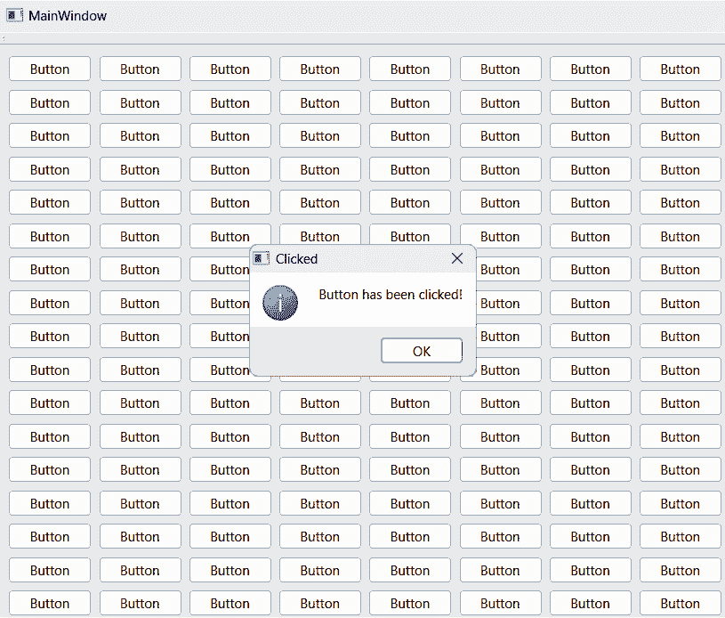

图 14.1 – 在 Qt 窗口中生成 600 个按钮

1.  让我们给每个按钮添加一个样式表，如下所示：

    ```cpp
    QPushButton* newWidget = new QPushButton();
    newWidget->setText("Button");
    newWidget->setStyleSheet("background-color: blue; color: white;");
    layout->addWidget(newWidget, i, j);
    ```

1.  再次构建并运行程序。这次，设置 GUI 大约花了 75 毫秒。这意味着样式表确实对您程序的性能有一定影响：

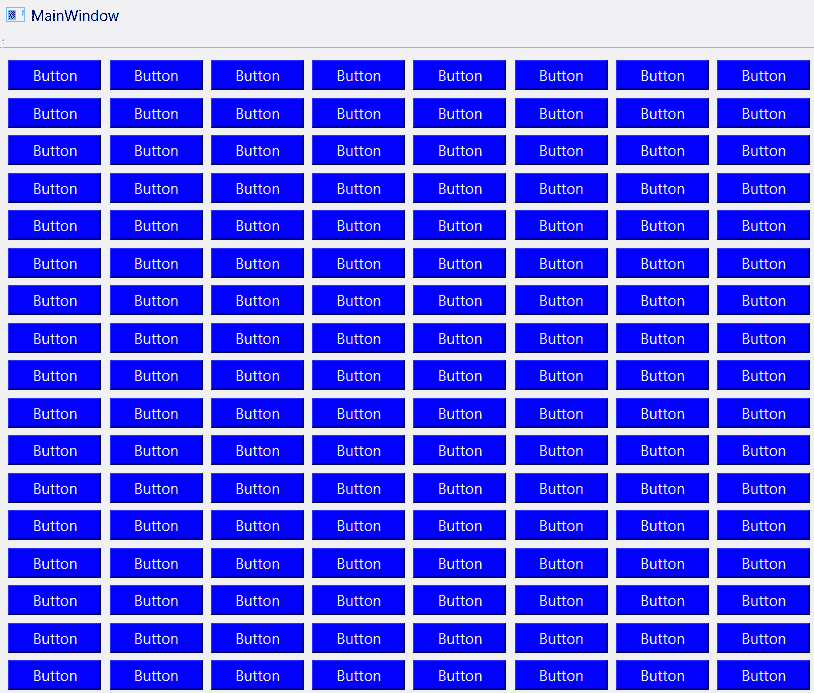

图 14.2 – 将样式表应用于所有 600 个按钮

1.  完成这些后，让我们对不同类型的 C++ 容器进行一些性能测试。打开 `main.cpp` 并添加以下头文件：

    ```cpp
    #include "mainwindow.h"
    #include <QApplication>
    #include <QDebug>
    #include <QElapsedTimer>
    #include <vector>
    #include <QVector>
    ```

1.  在 `main()` 函数之前创建一个 `testArray()` 函数：

    ```cpp
    int testArray(int count) {
        int sum = 0;
        int *myarray = new int[count];
        for (int i = 0; i < count; ++i)
            myarray[i] = i;
        for (int j = 0; j < count; ++j)
            sum += myarray[j];
        delete [] myarray;
        return sum;
    }
    ```

1.  创建一个名为 `testVector()` 的函数，如下所示：

    ```cpp
    int testVector(int count) {
        int sum = 0;
        std::vector<int> myarray;
        for (int i = 0; i < count; ++i)
            myarray.push_back(i);
        for (int j = 0; j < count; ++j)
            sum += myarray.at(j);
        return sum;
    }
    ```

1.  完成这些后，继续创建另一个名为`testQtVector()`的函数：

    ```cpp
    int testQtVector(int count) {
        int sum = 0;
        QVector<int> myarray;
        for (int i = 0; i < count; ++i)
            myarray.push_back(i);
        for (int j = 0; j < count; ++j)
            sum += myarray.at(j);
        return sum;
    }
    ```

1.  在`main()`函数中，定义一个`QElapsedTimer`对象和一个名为`lastElapse`的整型变量：

    ```cpp
    int main(int argc, char *argv[]) {
        QApplication a(argc, argv);
        MainWindow w;
        w.show();
        QElapsedTimer* time = new QElapsedTimer;
        time->start();
        int lastElapse = 0;
    ```

1.  我们将调用之前步骤中创建的三个函数来测试它们的性能：

    ```cpp
        int result = testArray(100000000);
        qDebug() << "Array:" << (time->elapsed() - lastElapse) << "msec";
        lastElapse = time->elapsed();
        int result2 = testVector(100000000);
        qDebug() << "STL vector:" << (time->elapsed() - lastElapse) << "msec";
        lastElapse = time->elapsed();
        int result3 = testQtVector(100000000);
        qDebug() << "Qt vector:" << (time->elapsed() - lastElapse) << "msec";
        lastElapse = time->elapsed();
    ```

1.  现在构建并运行程序；我们将看到这些容器之间的性能差异。在我的电脑上，数组执行耗时 650 毫秒，而 STL 向量大约耗时 3,830 毫秒，Qt 向量执行耗时约为 5,400 毫秒。

注意

因此，尽管与另外两个相比缺少一些功能，数组仍然是性能最佳的容器。令人惊讶的是，Qt 自己的向量类比 C++标准库提供的向量容器运行得略慢。

## 它是如何工作的…

当创建**Qt Widgets 应用程序**项目时，尝试以下操作以提高性能：

+   避免向堆叠小部件添加太多页面并将它们填满小部件，因为 Qt 需要在渲染过程和事件处理中递归地找到所有这些，这将极大地影响程序的性能。

+   请注意，`QWidget`类使用光栅引擎，一个软件渲染器，来渲染小部件，而不是使用 GPU。然而，它足够轻量，足以在大多数时候保持良好的性能。或者，你也可以考虑为程序的 GUI 使用 QML，因为它完全硬件加速。

+   如果你的小部件不需要，请关闭**mouseTracking**、**tabletTracking**和其他事件捕获。这种跟踪和捕获会增加程序 CPU 使用成本：

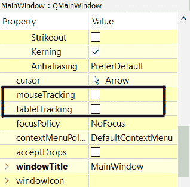

图 14.3 – 为优化禁用 mouseTracking 和 tabletTracking

+   尽可能保持样式表简单。一个大的样式表需要更长的时间让 Qt 将信息解析到渲染系统中，这也会影响性能。

+   不同的 C++容器产生不同的速度，正如我们在前面的例子中所展示的。令人惊讶的是，Qt 的向量容器比 STL（C++标准库）的向量容器略慢。总的来说，古老的 C++数组仍然是最快的，但它不提供排序功能。使用最适合你需求的方法。

+   对于大型操作，尽可能使用*异步*方法，因为它不会阻塞主进程，并保持程序平稳运行。

+   *多线程*对于在并行事件循环中运行不同的操作非常好。然而，如果操作不当，它也可能变得相当丑陋，例如，频繁创建和销毁线程，或者线程间通信没有计划好。

+   如果不是绝对必要，请尽量避免使用网络引擎。这是因为将完整的网络浏览器嵌入到您的程序中是非常沉重的，尤其是对于小型应用程序。如果您想创建以用户界面为中心的软件，可以考虑使用 QML 而不是创建混合应用程序。

+   通过像前一个示例项目中所做的那样进行性能测试，您可以轻松地确定哪种方法最适合您的项目，以及如何使您的程序表现更佳。

注意

在 Qt 5 中，我们可以使用 `QTime` 类进行测试，如本节所示。然而，`start()` 和 `elapsed()` 等函数已被从 Qt 6 中的 `QTime` 类中弃用。从 Qt 6 开始，玩家必须使用 `QElapsedTimer` 来处理此功能。

# 分析和优化 QML

Qt 6 中的 QML 引擎利用了硬件加速，使其渲染能力和性能优于旧的 widgets 用户界面。但这并不意味着您不需要担心优化，因为小的性能问题可能会随着时间的推移而累积成更大的问题，并损害您产品的声誉。

## 如何操作…

按照以下步骤开始分析并优化 QML 应用程序：

1.  让我们创建一个 **Qt Quick 应用程序** 项目：

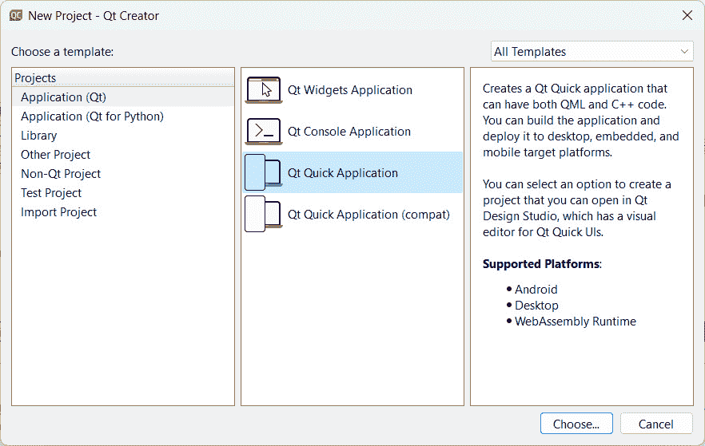

图 14.4 – 创建 Qt Quick 应用程序项目

1.  然后，转到 **分析 | QML 分析器** 并运行 **QML 分析器** 工具：

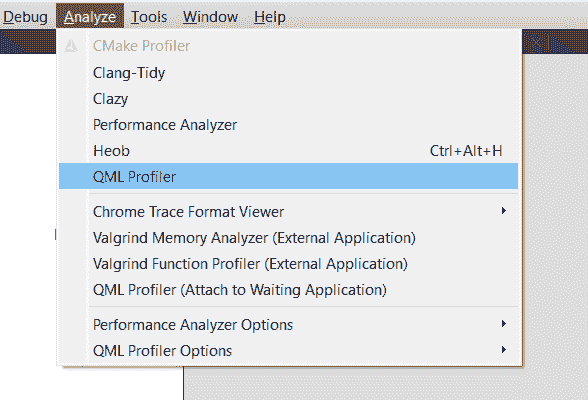

图 14.5 – 运行 QML 分析器以检查 QML 性能

1.  然后，您的 Qt Quick 项目将由 QML 分析器运行。在代码编辑器下也会出现 **QML 分析器** 窗口。在程序通过测试点（在这种情况下意味着成功创建空窗口）后，点击位于 **QML 分析器** 窗口顶部栏的 **停止** 按钮：

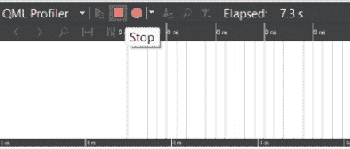

图 14.6 – 通过按下带有红色矩形图标的按钮停止 QML 分析器

1.  在停止分析器分析后，在 **QML 分析器** 窗口下的 **时间线** 标签将显示一个时间线。您可以在以下四个标签之间切换，即 **时间线**、**火焰图**、**Quick3D 帧** 和 **统计信息**，位于 **QML 分析器** 窗口的底部：

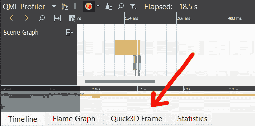

图 14.7 – 您可以在不同的标签页上查看不同的数据

1.  让我们检查一下 **Timeline** 标签页。在时间线显示下，我们可以看到六个不同的类别：**Scene Graph**、**Memory Usage**、**Input Events**、**Compiling**、**Creating** 和 **Binding**。这些类别为我们提供了程序在整个执行过程中的不同阶段和过程的概述。我们还可以在时间线上看到一些彩色条形。让我们点击 **Creating** 类别下名为 **QtQuick/Window** 的一个条形。一旦点击，我们将在 QML Profiler 窗口顶部的矩形窗口中看到此操作的持续时间以及代码的位置：

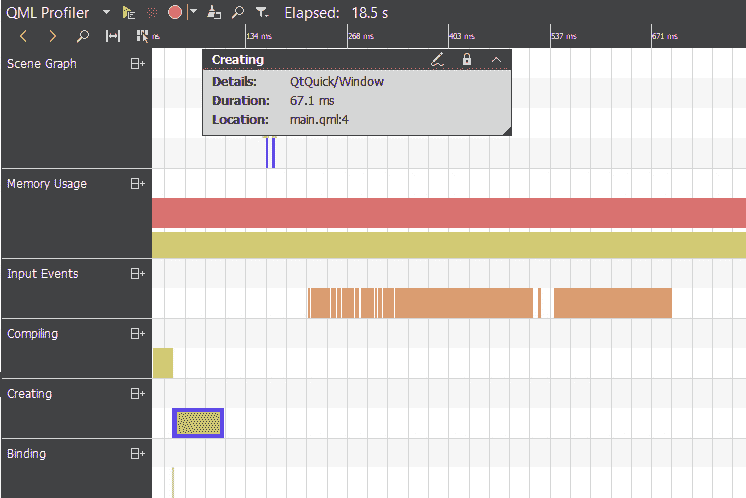

图 14.8 – 时间线标签页

1.  完成这些后，让我们继续并打开 **Flame Graph** 标签页。在 **Flame Graph** 标签页下，你会看到以百分比形式显示的应用程序的总时间、内存和分配的视觉化。你可以通过点击位于 **QML** **Profiler** 窗口右上角的选项框来在总时间、内存和分配之间切换：

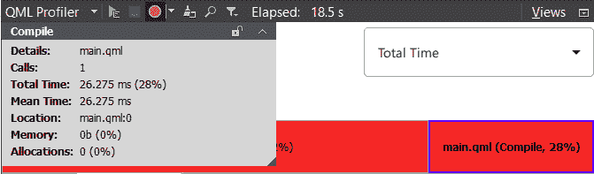

图 14.9 – 火焰图标签页

1.  不仅如此，你还会在 QML 代码编辑器上看到显示的百分比值：

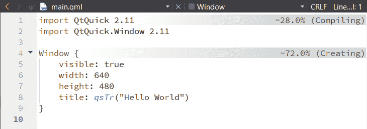

图 14.10 – 百分比值显示在右侧

1.  在 **QML Profiler** 窗口下打开 **Quick3D Frame** 类别。这个标签页是检查 3D 渲染性能的地方。目前它是空的，因为我们没有进行任何 3D 渲染。

1.  接下来，让我们打开 **Statistics** 类别。这个标签页基本上以表格形式显示关于进程的信息：

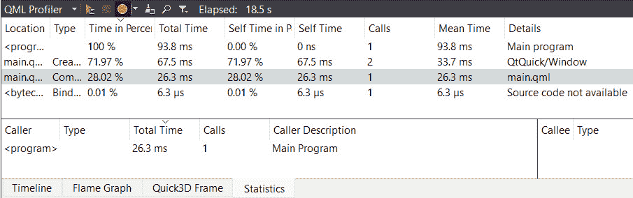

图 14.11 – 统计标签页

## 它是如何工作的…

这与我们在之前使用 C++ 和小部件的示例项目中做的是类似的，只是这次它是通过 Qt 6 提供的 **QML Profiler** 工具自动分析的。

QML Profiler 不仅生成特定进程运行的总时间，还显示内存分配、应用程序的执行时间线以及其他能让你深入了解软件性能的信息。

通过查看 QML Profiler 分析的数据，你将能够找出代码中哪个部分减慢了程序，让你能够快速修复任何问题。

当你编写 QML 时，有一些规则你需要注意，以避免性能瓶颈。例如，类型转换有时可能很昂贵，尤其是在不紧密匹配的类型之间（例如字符串到数字）。随着项目随时间增长而变大，这类小问题很可能会演变成瓶颈。

除了这些，尽量避免在经常运行的代码块中多次使用`id`进行项目查找，如下例所示：

```cpp
Item {
    width: 400
    height: 400
    Rectangle {
    id: rect
    anchors.fill: parent
    color: "green"
    }
    Component.onCompleted: {
        for (var i = 0; i < 1000; ++i) {
            console.log("red", rect.color.r);
            console.log("green", rect.color.g);
            console.log("blue", rect.color.b);
            console.log("alpha", rect.color.a);
        }
    }
```

相反，我们可以使用一个变量来缓存数据，避免在同一个项目上重复多次查找：

```cpp
Component.onCompleted: {
    var rectColor = rect.color;
    for (var i = 0; i < 1000; ++i) {
        console.log("red", rectColor.r);
        console.log("green", rectColor.g);
        console.log("blue", rectColor.b);
        console.log("alpha", rectColor.a);
    }
}
```

此外，如果你更改绑定表达式的属性，尤其是在循环中，Qt 将被迫反复重新评估它。这将导致一些性能问题。而不是这样做，用户应该遵循以下代码片段：

```cpp
Item {
    id: myItem
    width: 400
    height: 400
    property int myValue: 0
    Text {
        anchors.fill: parent
        text: myItem.myValue.toString()
    }
    Component.onCompleted: {
        for (var i = 0; i < 1000; ++i) {
            myValue += 1;
        }
    }
}
```

相反，我们可以使用一个临时变量来存储`myValue`的数据，然后在循环完成后将最终结果重新应用到`myValue`上：

```cpp
Component.onCompleted: {
    var temp = myValue;
    for (var i = 0; i < 1000; ++i) {
        temp += 1;
    }
    myValue = temp;
}
```

考虑使用锚点来定位你的 UI 项目，而不是使用绑定。使用绑定进行项目定位非常慢且效率低下，尽管它提供了最大的灵活性。

# 渲染和动画

当涉及到渲染图形和动画的应用程序时，良好的性能至关重要。当图形在屏幕上没有平滑动画时，用户很容易注意到性能问题。在以下示例中，我们将探讨如何进一步优化一个图形密集型的 Qt Quick 应用程序。

## 如何做到这一点…

要了解如何在 QML 中渲染动画，请参考以下示例：

1.  创建一个`tux.png`并将其添加到项目的资源中：

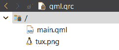

图 14.12 – 将 main.qml 和 tux.png 包含到你的项目资源中

1.  打开`650` x `650`。我们还将向`window`项目添加`id`并将其命名为`window`：

    ```cpp
    Window {
        id: window
        visible: true
        width: 650
        height: 650
    ```

1.  在`window`项目内部添加以下代码：

    ```cpp
        property int frame: 0;
        onAfterRendering: { frame++; }
        Timer {
        id: timer
        interval: 1000
        running: true
        repeat: true
        onTriggered: { frame = 0; }
    }
    ```

1.  紧接着，在下面添加`Repeater`和`Image`：

    ```cpp
        Repeater {
            model: 10
            delegate:
            Image {
            id: tux
            source: "tux.png"
            sourceSize.width: 50
            sourceSize.height: 60
            width: 50
            height: 60
            smooth: false
            antialiasing: false
            asynchronous: true
    ```

1.  我们将继续添加以下代码：

    ```cpp
            property double startX: Math.random() * 600;
            property double startY: Math.random() * 600;
            property double endX: Math.random() * 600;
            property double endY: Math.random() * 600;
            property double speed: Math.random() * 3000 + 1000;
            RotationAnimation on rotation{
            loops: Animation.Infinite
            from: 0
            to: 360
            duration: Math.random() * 3000 + 1000;
    }
    ```

1.  完成上述操作后，在之前的代码下面添加以下代码：

    ```cpp
        SequentialAnimation {
            running: true
            loops: Animation.Infinite
            ParallelAnimation {
            NumberAnimation {
            target: tux
            property: "x"
            from: startX
            to: endX
            duration: speed
            easing.type: Easing.InOutQuad
        }
    ```

1.  上一段代码动画化了图像的`x`属性。我们需要另一个`NumberAnimation`属性来动画化`y`属性：

    ```cpp
        NumberAnimation {
            target: tux
            property: "y"
            from: startY
            to: endY
            duration: speed
            easing.type: Easing.InOutQuad
        }
    }
    ```

1.  之后，我们重复整个`ParallelAnimation`的代码，但这次我们将`from`和`to`的值交换，如下所示：

    ```cpp
        ParallelAnimation {
            NumberAnimation {
                target: tux
                property: "x"
                from: endX
                to: startX
                duration: speed
                easing.type: Easing.InOutQuad
            }
    ```

1.  对于`y`属性的`NumberAnimation`也是如此：

    ```cpp
            NumberAnimation {
                target: tux
                property: "y"
                from: endY
                to: startY
                duration: speed
                easing.type: Easing.InOutQuad
            }
        }
    ```

1.  然后，我们添加一个`Text`项目来显示我们应用程序的帧率：

    ```cpp
    Text {
        property int frame: 0
        color: "red"
        text: "FPS: 0 fps"
        x: 20
        y: 20
        font.pointSize: 20
    ```

1.  让我们在`Text`下面添加`Timer`并更新帧率以每秒显示一次：

    ```cpp
        Timer {
            id: fpsTimer
            repeat: true
            interval: 1000
            running: true
            onTriggered: {
            parent.text = "FPS: " + frame + " fps"
            }
        }
    }
    ```

1.  如果我们现在构建并运行程序，我们将能够看到几只企鹅在屏幕上以稳定的 60 fps 移动：

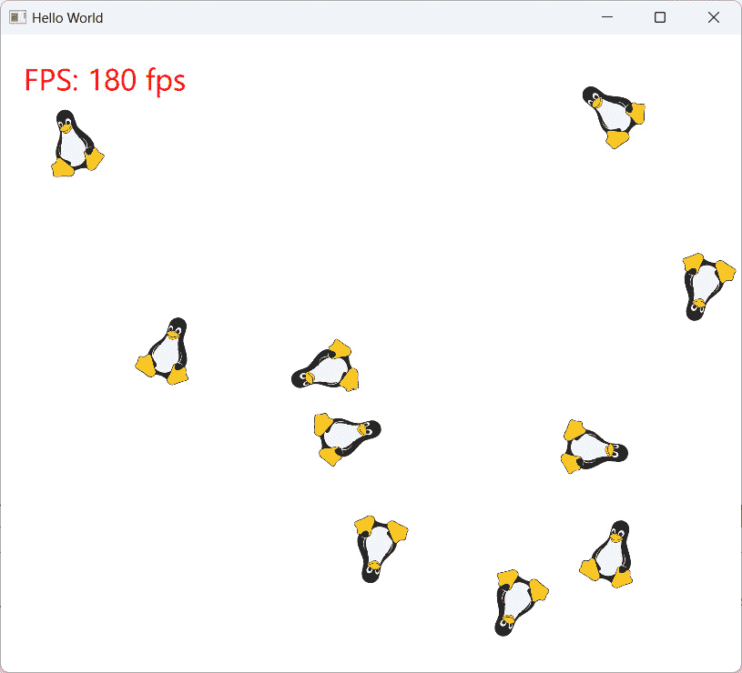

图 14.13 – 10 只企鹅在窗口周围漂浮

1.  让我们回到我们的代码，将`Repeater`项目的`model`属性更改为`10000`。重新构建并运行程序；你应该会看到你的窗口充满了移动的企鹅，并且帧率显著下降到大约 39 fps，考虑到企鹅的数量，这并不太糟糕：

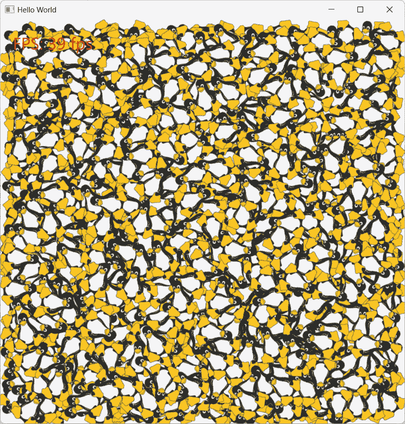

图 14.14 – 10,000 只企鹅在窗口周围漂浮

1.  接下来，让我们回到我们的源代码，并注释掉两个`sourceSize`属性。我们还设置了`平滑`和`抗锯齿`属性为`false`，同时将`异步`属性设置为`false`：

    ```cpp
    Image {
        id: tux
        source: "tux.png"
        //sourceSize.width: 50
        //sourceSize.height: 60
        width: 50
        height: 60
        smooth: true
        antialiasing: false
        asynchronous: false
    ```

1.  让我们再次构建并运行程序。这次，帧率略有下降至 32 fps，但企鹅看起来更加平滑，质量也更好，即使在移动时也是如此：

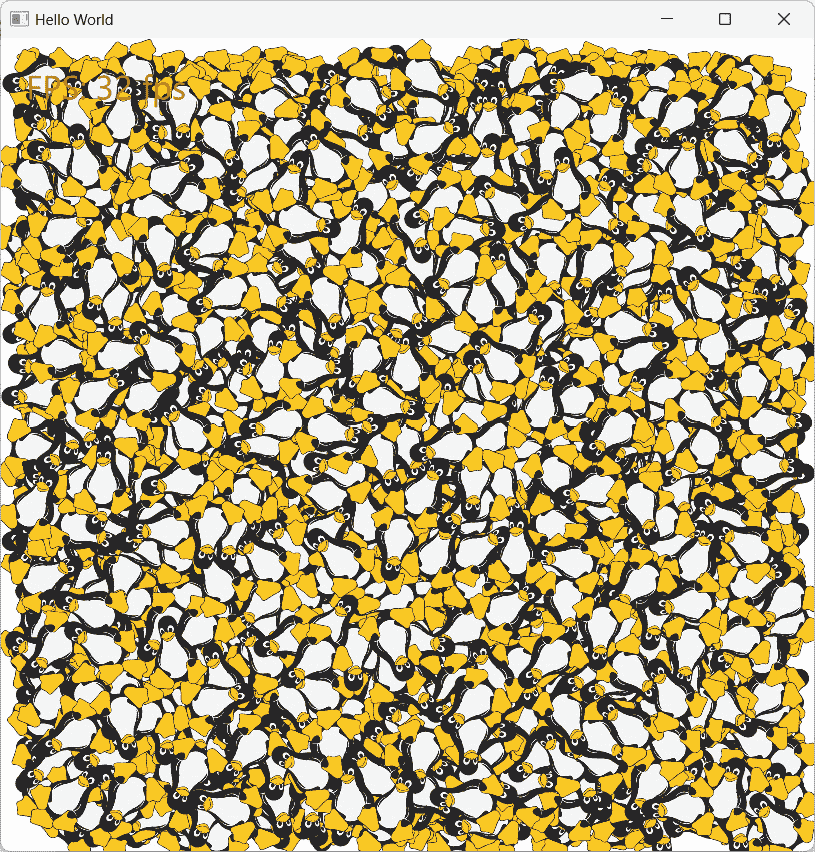

图 14.15 – 现在我们的企鹅看起来更加平滑，而且没有减慢太多

## 它是如何工作的...

驱动 Qt Quick 应用程序的 QML 引擎在屏幕上渲染动画图形时非常优化且强大。然而，我们仍然可以遵循一些提示来使其更快。

尝试使用 Qt 6 提供的内置功能，而不是实现自己的功能，例如`Repeater`、`NumberAnimation`和`SequentialAnimation`。这是因为 Qt 6 开发者已经投入了大量努力来优化这些功能，以便你不必这样做。

`sourceSize`属性告诉 Qt 在将其加载到内存之前调整图像大小，这样大图像就不会使用比必要的更多内存。

当启用时，`平滑`属性告诉 Qt 在缩放或从其自然大小转换图像时过滤图像，使其看起来更平滑。如果图像以与`sourceSize`值相同的分辨率渲染，则此属性不会产生任何差异。此属性将影响某些较旧硬件上应用程序的性能。

`抗锯齿`属性告诉 Qt 移除图像边缘的锯齿状伪影，使其看起来更平滑。此属性也会影响程序的性能。

`异步`属性告诉 Qt 在一个低优先级的线程中加载图像，这意味着当加载大图像文件时，你的程序不会停滞。

我们使用帧率来表示我们程序的性能。由于`onAfterRendering`总是在每一帧被调用，因此我们可以在每一帧渲染时累积帧变量。然后，我们使用`Timer`每秒重置帧值。

最后，我们使用`Text`项目在屏幕上显示值。
