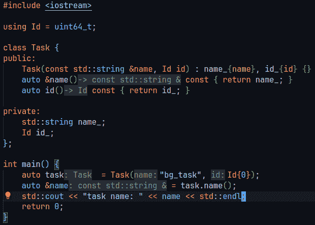

# 5

# 命名的意义

随着你深入探索 C++ 的世界，或者任何其他编程语言，一个越来越清晰的事实是——名称的力量。在本章中，我们将探讨命名约定在编写干净、可维护和高效的 C++ 代码中的深远重要性。

在计算机编程中，名称被赋予变量、函数、类以及众多其他实体。这些名称作为标识符，在我们作为程序员与代码组件交互中扮演着关键角色。虽然对一些人来说这可能是一件微不足道的事情，但选择正确的名称可以对软件项目的可理解性和可维护性产生深远的影响。我们选择的名称来表示程序的不同元素是我们代码的第一层文档，包括我们未来的自己，当他们接近我们的代码时。

想象一个名叫 Mia 的开发者，她使用一个名为 `WeatherData` 的类。这个类有两个获取方法——`get_temperature()` 和 `get_humidity()`。前者方法只是简单地返回存储在成员变量中的当前温度值。这是一个 O(1) 操作，因为它只涉及返回一个已存储的值。后者不仅仅返回一个值。它实际上启动了一个与远程天气服务的连接，检索最新的湿度数据，然后返回它。这个操作相当昂贵，涉及到网络通信和数据处理，远非 O(1) 操作。Mia 专注于优化项目中的一个函数，看到这两个获取方法，并假设它们在效率上相似，因为它们的命名。她在循环中使用 `get_humidity()`，期望它是一个简单的、高效的存储值检索，类似于 `get_temperature()`。由于重复调用 `get_humidity()`，函数的性能急剧下降。每次调用中涉及的网络请求和数据处理显著减慢了执行速度，导致资源使用效率低下，并减缓了应用程序的性能。如果方法被命名为 `fetch_humidity()` 而不是 `get_humidity()`，这种情况本可以避免。`fetch_humidity()` 这个名称会清楚地表明该方法不是一个简单的获取器，而是一个更昂贵的操作，它涉及到从远程服务获取数据。

命名的艺术需要仔细的考虑和对问题域以及编程语言的深入了解。本章提供了对创建和命名变量、类成员、方法和函数在 C++ 中的通用方法的全面讨论。我们将辩论长名称与短名称之间的权衡，以及注释在阐明我们的意图中的作用。

我们将探讨编码约定的重要性以及它们为个人开发者和团队带来的好处。一致地应用经过深思熟虑的命名约定可以简化编码过程，减少错误，并极大地提高代码库的可读性。

到本章结束时，你将理解良好的命名习惯不仅是一个事后考虑，而且是良好软件开发的一个基本组成部分。我们将为你提供策略和约定，帮助你编写其他人（以及你自己，当你几个月或几年后再次查看自己的代码时）都能轻松阅读、理解和维护的代码。

# 命名的一般原则

无论你使用的是哪种具体的**面向对象编程**（**OOP**）语言，某些通用的命名原则可以帮助提高代码的清晰性和可维护性。这些原则旨在确保代码中的名称提供了足够的信息关于它们的使用和功能。

## 描述性

名称应准确描述变量、函数、类或方法的目的或值。例如，对于函数 `getSalary()` 比简单地 `getS()` 更有信息量。

## 一致性

在命名约定上的一致性是编写清晰且可维护代码的最重要原则之一。当你在整个代码库中保持命名的一致性时，阅读、理解和调试你的代码会变得容易得多。原因在于一旦开发者学会了你的命名模式，他们就可以在整个代码库中应用他们的理解，而无需单独弄清楚每个名称的含义。

一致性适用于许多领域，包括以下内容：

+   使用 `snake_case`（例如，`employee_salary`），在整个代码库中坚持这种风格。不要在 snake_case、camelCase（例如，`employeeSalary`）和 PascalCase（例如，`EmployeeSalary`）之间切换。

+   `m_` 用于成员变量（例如，`m_value`），确保在所有地方遵循此规则。

+   使用 `num` 来表示 `number`（例如，`numEmployees`），然后始终在表示 `number` 时使用 `num`。

+   类名（例如，`Employee`），方法名是动词（`calculateSalary`），布尔变量或方法通常以 `is`、`has`、`can` 或类似的词缀开头（例如 `isAvailable` 和 `hasCompleted`）。始终一致地遵循这些约定。

假设你正在处理一个大型代码库，其中类代表公司中的各种员工类型。你已经决定使用 PascalCase 为类命名，使用 snake_case 为方法命名，以及使用 snake_case 为变量命名。

这种命名约定的一个一致实现可能看起来像这样：

```cpp
class SoftwareEngineer {
public:
    void assign_task(std::string task_name) {
        current_task_ = std::move(task_name);
    }
private:
    std::string current_task_;
};
```

让我们分解这个代码片段：

+   `SoftwareEngineer` 类是一个单数名词，并使用 PascalCase

+   `assign_task` 方法是一个动词，并使用 snake_case

+   变量 `current_task` 使用 snake_case

与此约定保持一致将有助于任何阅读你代码的人立即识别每个名称所代表的内容。这样，认知负担就会减轻，开发者可以专注于实际的逻辑，而不是被不一致或混淆的名称所分散注意力。

## 明确性

明确性意味着名称不应具有误导性。避免使用可能被解释为多种方式或与既定约定或期望相矛盾的名字。例如，假设你有一个`Document`类和一个名为`process`的方法。在没有更多上下文的情况下，该方法名称是模糊的：

```cpp
class Document {
public:
    void process();
};
```

在这种情况下，`process`可能意味着许多事情。我们是解析文档吗？我们要渲染它吗？我们要将其保存到文件中吗？还是我们要执行所有这些操作？这并不明确。

一个更具体的方法名称可以帮助阐明其目的。根据该方法预期要执行的操作，它可以命名为`parse`、`render`、`save`等：

```cpp
class Document {
public:
    void parse(const std::string& content);
    void render();
    void save(const std::string& file_path);
};
```

这些方法名称的每个都提供了对方法所做工作的更清晰指示，消除了原始`process`方法名称的歧义。

## 发音性

名称应该易于发音。这有助于开发者之间就代码进行口头交流。

## 范围和生命周期

范围更大、生命周期更长的变量通常对系统有更大的影响，因此需要更深思熟虑、清晰和描述性的名称。这有助于确保它们在所有使用它们的上下文中都能被理解。以下是一个更详细的分解。

全局变量可以在程序的任何地方访问，并且其生命周期持续整个程序。因此，在命名时需要特别小心。名称应该足够描述性，以清楚地表明其在系统中的作用。此外，全局变量可能会创建意外的依赖关系，这使得程序更难以理解和维护。因此，应尽量减少全局变量的使用：

```cpp
// Global variable
constexpr double GRAVITATIONAL_ACCELERATION = 9.8; // Clear and descriptive
```

类成员变量可以从类中的任何方法访问，并且它们的生命周期与类实例的生命周期绑定。它们应该有清晰且描述性的名称，反映其在类中的角色。通常，遵循一个命名约定来区分它们与局部变量是有用的（例如，使用`m_`前缀或`_`后缀）：

```cpp
class PhysicsObject {
    double mass_;  // Descriptive and follows naming convention
    // ...
};
```

局部变量仅限于特定的函数或代码块，并且只存在于该函数或代码块执行期间。与全局变量或类成员变量相比，这些变量通常需要更简洁的命名，但它们仍然应该清楚地传达其用途：

```cpp
double compute_force(double mass, double acceleration) {
    double force = mass * acceleration;  // 'force' is clear in this context
    return force;
}
```

循环变量和临时变量具有最短的范围和生命周期，通常局限于一个小循环或一小段代码。因此，它们通常具有最简单的名称（如`i`、`j`和`temp`）：

```cpp
for (int i = 0; i < num; ++i) {  // 'i' is clear in this context
    // ...
}
```

这里的关键思想是，变量的作用域越广，生命周期越长，对其用途的混淆可能性就越大，因此其名称应该越具有描述性。目标是使代码尽可能清晰易懂。

## 避免编码类型或作用域信息

在现代编程语言中，将类型或作用域信息编码到名称中（通常称为匈牙利符号法）通常是多余的，并且可能导致混淆或错误，尤其是在重构时。虽然这偶尔可能有所帮助，尤其是在弱类型语言中，但它有几个缺点，使得它不太适合用于像 C++这样的强类型语言：

+   变量的类型可能会在未来改变，但它的名字通常不会。这导致了一些误导性的情况，其中变量的名字暗示了一种类型，但实际上它具有另一种类型。例如，你可能从一个 ID 向量（`std::vector<Id> id_array`）开始，后来将其更改为 `set<Id>` 以避免重复，但变量名仍然暗示它是一个数组或向量。

+   现代开发环境提供了诸如类型推断、显示类型的悬停工具提示和强大的重构工具等功能，这些都使得手动将类型编码到名称中变得几乎不再必要。例如，安装了 clangd 插件并开启了“内联提示”功能的 VS Code 会动态推断类型，包括 `auto`：



图 5.1 – VS Code 中的内联提示

这也适用于 JetBrains 的 CLion：

+   匈牙利符号法中的前缀可能会使变量名更难以阅读，尤其是对于那些不熟悉这种符号的人来说。对于新开发者来说，`dwCount`（一个 `DWORD`，或双字，通常用来表示无符号长整数）的含义可能并不立即明显。

+   强类型语言，如 C++，已经在编译时检查类型安全，减少了在变量名中编码类型信息的需要。在下面的示例中，`integers` 被声明为 `std::vector<int>`，而 `sentence` 被声明为 `std::string`。C++ 编译器知道这些类型，并将确保对这些变量的操作是类型安全的：

```cpp
#include <vector>
#include <string>
int main() {
    std::vector<int> integers;
    std::string sentence;
    // The following will cause a compile-time error because
    // the type of 'sentence' is string, not vector<int>.
    integers = sentence;
    return 0;
}
```

当代码尝试将 `sentence` 赋值给 `integers` 时，会产生编译时错误，因为 `sentence` 的类型不正确（`std::vector<int>`）。尽管这两个变量名都没有编码类型信息，这种情况仍然会发生。

编译器的类型检查消除了在变量名中包含类型信息（如 `strSentence` 或 `vecIntegers`）的需要，这在没有执行此类强编译时类型检查的语言中是一种常见的做法。`integers` 和 `sentence` 变量名已经足够描述性，无需编码类型信息。

在编程中，你经常会遇到多个逻辑概念使用相同的底层类型来表示的情况。例如，在你的系统中，你可能既有`Users`的标识符，也有`Products`的标识符，它们都表示为整数。虽然 C++的静态类型检查提供了一定程度的安全性，但它不会区分`UserId`和`ProductId`——对编译器来说，它们只是整数。

然而，使用相同的类型来表示这些不同的概念可能会导致错误。例如，错误地传递`UserId`而不是预期的`ProductId`是完全可能的，编译器不会捕获这个错误。

为了解决这个问题，你可以利用 C++丰富的类型系统引入代表这些不同概念的新类型，即使它们具有相同的底层表示。这样，编译器可以在编译时捕获这些错误，增强你软件的健壮性：

```cpp
// Define new types for User and Product IDs.
struct UserId {
    explicit UserId(int id): value(id) {}
    int value;
};
struct ProductId {
    explicit ProductId(int id): value(id) {}
    int value;
};
void process_user(UserId id) {
    // Processing user...
}
void process_product(ProductId id) {
    // Processing product...
}
int main() {
    UserId user_id(1);
    ProductId product_id(2);
    // The following line would cause a compile-time error because
    // a ProductId is being passed to process_user.
    process_user(product_id);
    return 0;
}
```

在前面的例子中，`UserId`和`ProductId`是不同的类型。尽管它们的底层表示相同（`int`），但将`ProductId`传递给期望`UserId`的函数会导致编译时错误。这为你代码增加了额外的类型安全性。

这只是展示了如何利用 C++丰富的静态类型系统来创建更健壮和更安全的代码。我们将在*第六章*“在 C++中利用丰富的静态类型系统”中更详细地探讨这个话题。

## 类和方法命名

在面向对象的语言中，类代表概念或事物，它们的实例（对象）是这些事物的具体表现。因此，类名及其实例最恰当地使用名词或名词短语来命名。它们代表系统中的实体，无论是有形的（如`Employee`和`Invoice`）还是概念性的（如`Transaction`和`DatabaseConnection`）。

另一方面，类中的方法通常代表该类对象可以执行的动作，或者可以发送给它的消息。因此，它们最有效地使用动词或动词短语来命名。它们作为可以被对象执行的操作指令，允许它以有意义的方式与其他对象进行交互。

考虑一个具有`print`方法的`Document`类。我们可以说“document, print”或“print the document”，这是一个符合我们日常语言中传达动作方式的清晰、祈使性陈述。

下面是一个例子：

```cpp
class Document {
public:
    void print();
};
Document report;
report.print();  // "report, print!"
```

在命名类和方法时，名词-动词的一致性与我们自然理解和交流现实世界中的对象和动作的方式非常吻合，有助于提高我们代码的可读性和可理解性。此外，它很好地符合面向对象中的封装原则，其中对象管理自己的行为（方法）和状态（成员变量）。

维持这个约定可以让开发者编写更直观、自文档化和易于维护的代码。它为开发者之间创造了一种共同的语言和理解，减少了阅读代码时的认知负荷，并使代码库更容易导航和推理。因此，在面向对象编程中，建议遵守这些约定。

## 变量命名

变量名应该反映它们所持有的数据。一个好的变量名描述了变量包含的值的类型，而不仅仅是它在算法中的作用。

避免魔法数字，源代码中具有未解释含义的数值。它们可能导致难以阅读、理解和维护的代码。让我们考虑一个`MessageSender`类，它发送消息，如果消息大小超过某个限制，它将消息分割成块：

```cpp
class MessageSender {
public:
    void send_message(const std::string& message) {
        if (message.size() > 1024) {
            // Split the message into chunks and send
        } else {
            // Send the message
        }
    }
};
```

在前面的代码中，`1024`是一个魔法数字。它可能代表一个最大消息大小，但并不立即清楚。它可能会使阅读你代码的人（或未来的你）感到困惑。以下是一个使用命名常量的重构示例：

```cpp
class MessageSender {
    constexpr size_t MAX_MESSAGE_SIZE = 1024;
public:
    void send_message(const std::string& message) {
        if (message.size() > MAX_MESSAGE_SIZE) {
            // Split the message into chunks and send
        } else {
            // Send the message
        }
    }
};
```

在这个重构版本中，我们将魔法数字`1024`替换为命名常量`MAX_MESSAGE_SIZE`。现在很清楚，`1024`是最大消息大小。以这种方式使用命名常量使你的代码更易于阅读和维护。如果将来需要更改最大消息大小，你只需在一个地方更新即可。

## 利用命名空间

C++中的命名空间在防止命名冲突和正确组织代码方面极其宝贵。命名冲突，或称碰撞，发生在程序中的两个或多个标识符具有相同名称时。例如，你可能在应用程序的两个子系统（网络表示连接 ID 和用户管理中的用户 ID）中都有一个名为`Id`的类。如果不使用命名空间使用它们，就会导致命名冲突，编译器将不知道在代码中你指的是哪个`Id`。

为了缓解这个问题，C++提供了`namespace`关键字来封装一个具有独特名称的功能。命名空间旨在解决名称冲突的问题。通过将你的代码包裹在一个命名空间内，你可以防止它与代码其他部分或第三方库中具有相同名称的标识符发生冲突。

下面是一个示例：

```cpp
namespace product_name {
    class Router {
        // class implementation
    };
}
// To use it elsewhere in the code
product_name::Router myRouter;
```

在这种情况下，`product_name::Router`不会与你的产品代码或第三方库中的任何其他`Router`类冲突。如果你开发库代码，强烈建议将所有实体（如类、函数和变量）都包裹在一个命名空间中。这将防止与其他库或用户代码发生名称冲突。

在 C++中，将项目的目录结构映射到命名空间中是很常见的，这使得理解代码库的不同部分所在的位置变得更容易。例如，如果你有一个位于`ProductRepo/Networking/Router.cpp`路径的文件，你可能会这样声明`Router`类：

```cpp
namespace product_name {
    namespace networking {
        class Router {
            // class implementation
        };
    }
}
```

然后，您可以使用完全限定名称 `product_name::networking::Router` 来引用该类。

然而，值得注意的是，直到 C++20 之前，该语言并没有原生支持一个可以替代或增强命名空间提供的功能的模块系统。随着 C++20 中模块的到来，一些实践可能会发生变化，但理解命名空间及其在命名中的使用仍然至关重要。

使用命名空间的另一种方式是表达代码的复杂程度。例如，库代码可能包含预期由库消费者使用的实体和内部实体。以下代码片段展示了这种方法：

```cpp
// communication/client.hpp
namespace communication {
class Client {
public:
    // public high-level methods
private:
    using HttpClient = communication::advanced::HttpClient;
    HttpClient inner_client_;
};
} // namespace communication
// communication/http/client.hpp
namespace communication::advanced::http {
class Client {
    // Lower-level implementation
};
} // namespace communication::advanced
```

在这个扩展示例中，`communication::Client` 类提供了一个用于发送和接收消息的高级接口。它使用 `advanced::http::Client` 类进行实际实现，但这个细节对库的用户来说是隐藏的。除非他们对默认客户端提供的功能不满意并需要更多控制，否则他们不需要了解高级类。

在 `communication::http::advanced` 命名空间中的 `Client` 类提供了更多低级功能，使用户能够更多地控制通信的细节。

这种组织方式清楚地说明了大多数用户（`Client`）期望的功能以及为更高级使用（`HttpClient`）提供的功能。以这种方式使用命名空间也有助于避免名称冲突并保持代码库井然有序。这种方法被许多库和框架所采用——例如，Boost 库通常有一个 `detail` 命名空间用于内部实现。

## 使用特定领域的语言

如果问题域中有公认的术语，请在您的代码中使用它们。这可以使熟悉该领域的人更容易理解您的代码。例如，在金融领域，术语“投资组合”、“资产”、“债券”、“股票”、“股票代码”和“股息”是常用的。如果您正在编写与金融相关的应用程序，使用这些术语作为类和变量名称是有益的，因为它们清楚地传达了它们在金融背景下的角色。

考虑以下代码片段：

```cpp
class Portfolio {
public:
    void add_asset(std::unique_ptr<Asset> asset) {
        // add the asset to the portfolio
    }
    double total_dividend() const {
        // calculate the total dividends of the portfolio
    }
private:
    std::vector<std::unique_ptr<Asset>> assets_;
};
using Ticker = std::string;
class Asset {
public:
    Asset(const Ticker& ticker, int64_t quantity) :
        ticker_{ticker},
        quantity_{quantity} {}
    virtual Asset() = default;
    virtual double total_dividend() const = 0;
    auto& ticker() const { return ticker_; }
    int64_t quantity() const { return quantity_; }
private:
    Ticker ticker_;
    int64_t quantity_;
};
class Bond : public Asset {
public:
    Bond(const Ticker& ticker, int64_t quantity) :
        Asset{ticker, quantity} {}
    double total_dividend() const override {
        // calculate bond dividend
    }
};
class Equity : public Asset {
public:
    Equity(const Ticker& ticker, int64_t quantity) :
        Asset{ticker, quantity} {}
    double total_dividend() const override {
        // calculate equity dividend
    }
};
```

在这个示例中，`Portfolio`、`Asset`、`Bond`、`Equity`、`Ticker` 和 `total_dividend()` 都是直接从金融领域借用的术语。熟悉金融的开发者或利益相关者只需通过它们的名称就能理解这些类和方法的目的。这有助于在开发者、利益相关者和领域专家之间建立共同语言，从而极大地促进沟通和理解。请注意，在现实世界的金融应用中不推荐使用 `double`，因为它不足以精确表示货币值进行算术运算时防止舍入误差累积。

记住，这些原则的目标是使代码尽可能清晰易懂。编写代码不仅仅是与计算机交流；它也是与其他开发者交流，包括你未来的自己。

## 在代码中平衡长名称和注释

合理的命名规范在代码的清晰性和可读性中起着至关重要的作用。类、方法和变量的名称应该足够描述性，以便传达其目的和功能。理想情况下，一个精心挑选的名称可以替代额外的注释，使代码易于理解。

然而，需要找到一个微妙的平衡点。虽然长而描述性的名称可能有所帮助，但过长的名称也可能变得繁琐，并降低代码的可读性。另一方面，过短的名称可能含糊不清，并使代码更难以理解。关键是找到正确的平衡——名称应该足够长以传达其目的，但又不至于过长而难以驾驭。

考虑以下一个假设的网络应用程序的例子：

```cpp
class Router {
public:
    void route(const Message& message, Id receiver) {
        auto message_content = message.get_content();
        // Code to route the 'message_content' to the appropriate 'receiver'
    }
private:
    // Router's private members
};
```

在这种情况下，`route` 方法名称以及 `message`、`receiver` 和 `message_content` 变量名称都足够描述性，可以理解方法的作用以及每个变量的含义。不需要额外的注释来解释它们的作用。

话虽如此，有些情况下，语言结构无法完全表达代码的意图或细微差别，例如当依赖于第三方库的特定行为或编写复杂算法时。在这些情况下，需要额外的注释来提供上下文或解释为什么做出了某些决定。

以此为例：

```cpp
void route(const Message& message, Id receiver) {
    auto message_content = message.get_content();
    // Note: The routing_library has an idiosyncratic behavior where
    // it treats receiver id as one-indexed. Hence we need to increment by 1.
    receiver++;
    // Code to route the 'message_content' to the appropriate 'receiver'
}
```

在这种情况下，注释是必要的，以突出第三方路由库的特定行为，这些行为仅从语言结构本身来看并不立即明显。

作为一般规则，应努力通过良好的命名实践使代码尽可能具有自解释性，但在需要提供重要上下文或阐明复杂逻辑时，不要犹豫使用注释。记住，最终目标是创建易于阅读、理解和维护的代码。

# 探索流行的 C++编码规范——谷歌、LLVM 和 Mozilla

在 C++编程领域，遵循一致的编码规范对于确保代码清晰性和可维护性至关重要。在众多可用的风格中，三种突出的规范因其广泛的使用和独特的做法而脱颖而出——谷歌的 C++风格指南、LLVM 编码标准和 Mozilla 的编码风格。本概述深入探讨了每个规范的关键方面，突出了它们的独特实践和哲学：

+   `.cc` 和 `.h` 扩展名分别用于实现文件和头文件

+   `kCamelCase`

+   `CamelCase` 用于类名

+   `*` 或 `&` 与变量名一起使用（`int* ptr`，而不是 `int *ptr`）

+   **限制**：避免使用非 const 全局变量，并在可能的情况下优先使用算法而不是循环

+   `.cpp` 扩展名，以及头文件使用 `.h`。*   `camelBack` 风格。成员变量有一个尾随下划线。*   `CamelCase`。*   `*` 或 `&` 靠近类型（`int *ptr`，而不是 `int* ptr`）。*   **现代 C++用法**：鼓励使用现代 C++特性和模式。*   `.cpp` 和 `.h` 扩展名*   变量和函数使用 `camelCase`，类使用 `CamelCase`，常量使用 `SCREAMING_SNAKE_CASE`。*   类名使用 `CamelCase`。*   `*` 或 `&` 靠近类型*   **强调性能**：鼓励编写注重浏览器性能的效率代码

每个这些约定都有其自身的哲学和理由。谷歌的风格指南强调在庞大的代码库和众多开发者之间保持一致性。LLVM 的标准侧重于编写干净、高效的代码，利用现代 C++特性。Mozilla 的风格在可读性和性能之间取得平衡，反映了其在网络技术发展中的起源。选择与你的项目目标、团队规模以及你工作的具体技术相一致的风格是很重要的。

# 摘要

在本章中，我们探讨了命名在编程中的关键作用。我们认识到，良好的、一致的命名实践可以提高代码的可读性和可维护性，同时也有助于其自我文档化。

我们思考了使用长描述性名称和较短名称并辅以注释之间的平衡，理解到在不同的上下文中两者都有其位置。建议在命名中使用领域特定语言以提高清晰度，同时由于它们的不可透明性而警告不要使用“魔法数字”。

变量的作用域和生命周期对其命名的影响也得到了讨论，强调了为那些作用域较大、生命周期较长的变量使用更具描述性的名称的必要性。

本章以强调遵循命名编码规范的价值结束，这可以在代码库中建立一致性，从而简化代码的阅读和理解过程。

从本章中获得的认识为即将讨论如何有效地利用 C++丰富的静态类型系统以编写更安全、更干净、更清晰的代码奠定了基础。在下一章中，我们将把重点转移到有效地利用 C++丰富的静态类型系统上。
