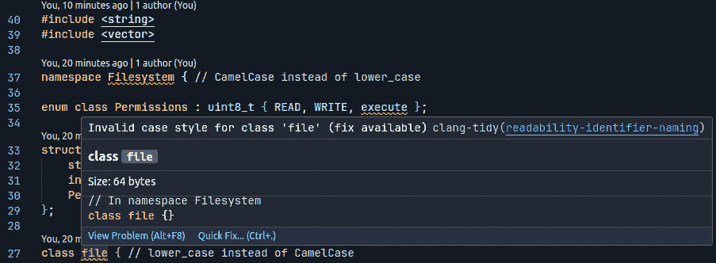
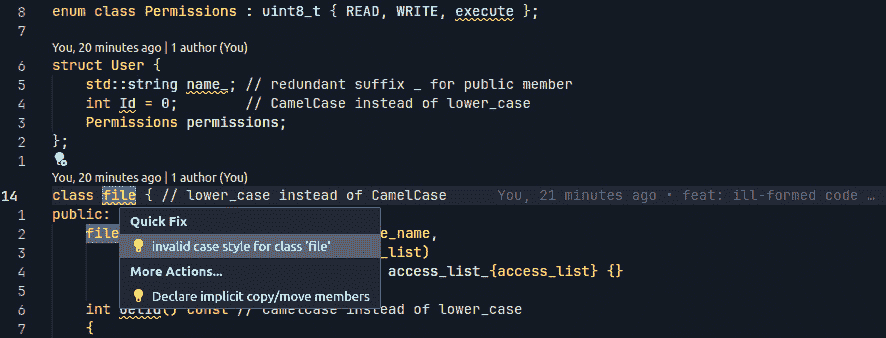

# 9

# 代码格式化和命名约定

在软件开发的广阔而复杂的领域中，一些主题在第一眼看来可能不那么重要，然而，在创建健壮和可维护的软件的更广泛背景下考虑时，它们却具有巨大的价值。代码格式化就是这样一种主题。虽然它可能看起来只是美学上的关注点，但它对提高代码可读性、简化维护以及促进团队成员之间有效协作起着至关重要的作用。这些方面的意义在 C++等语言中更为突出，在这些语言中，结构和语法可以很容易地变得复杂。

在本章中，我们将深入探讨代码格式的细微差别，为你提供对其重要性的全面理解。但理解“为什么”只是第一步；同样重要的是要知道“如何”。因此，我们还将探讨可用于自动格式化你的 C++代码的各种工具，仔细研究它们的功能和可能性，以及如何配置它们以满足你项目的特定需求。从行业标准工具如 Clang-Format 到特定编辑器的插件，我们将探讨如何让这些强大的实用工具为你所用。

到本章结束时，你不仅将深入理解代码格式化为什么是必要的，还将获得在 C++项目中实施一致和有效格式化的实际知识。因此，让我们翻到下一页，开始这段启发性的旅程。

# 代码格式化为什么重要？

代码格式化在软件开发中的重要性，尤其是在 C++等语言中，不容小觑。让我们从可读性开始，这是至关重要的，因为代码通常被阅读的次数比被编写的次数多。适当的缩进和间距为代码提供了视觉结构，有助于快速理解其流程和逻辑。在一个格式良好的代码库中，更容易扫描代码以识别关键元素，如循环、条件和部分。这反过来又减少了过度注释的需求，因为代码往往变得自我解释。

当谈到可维护性时，一致的代码格式化是一大福音。结构良好的代码更容易调试。例如，一致的缩进可以迅速突出未关闭的大括号或作用域问题，使错误更容易被发现。格式良好的代码还使开发者能够更有效地隔离代码部分，这对于调试和重构都是至关重要的。此外，可维护性不仅仅是关于现在和未来；它关乎代码的未来保障。随着代码库的发展，一致的格式化风格确保了新添加的内容更容易集成。

协作是另一个领域，其中一致的代码格式化发挥着重要作用。在团队环境中，统一的代码风格可以减少每个团队成员的认知负荷。它允许开发者更多地关注代码的逻辑和实现，而不是被风格上的不一致所分散。这在代码审查期间尤其有益，统一的风格使得审查者可以专注于核心逻辑和潜在问题，而不是被不同的格式化风格所干扰。对于新团队成员来说，一致的代码库更容易理解，有助于他们更快地熟悉情况。

此外，代码格式化在质量保证中发挥着作用，并且在某种程度上可以自动化。许多团队利用自动化格式化工具来确保代码库保持一致的风格，这不仅降低了人为错误的可能性，还可以成为代码质量指标的一个因素。代码格式的自动化检查可以集成到 CI/CD 管道中，使其成为项目整体最佳实践的一部分。

最后，我们不要忘记代码格式化对版本控制的影响。一致的编码风格确保版本历史和 diff 准确反映了代码逻辑的变化，而不仅仅是风格调整。这使得使用如`git blame`和`git history`等工具跟踪更改、识别问题以及理解代码库随时间演变变得更加容易。

总之，适当的代码格式化既具有功能性又具有美学性。它提高了可读性，简化了维护，并促进了协作，所有这些都对开发健壮和可维护的软件的有效和高效发展做出了贡献。

# 现有工具概述，以促进遵守编码规范

C++开发的世界一直在不断加强对编写干净、可维护代码的关注。这种方法的一个基石是遵守定义良好的编码规范。幸运的是，有几个工具可以帮助自动化这个过程，使开发者能够更多地关注解决实际问题，而不是担心代码的美观。在本节中，我们将广泛探讨一些在 C++项目中强制执行编码规范的最受欢迎和最广泛使用的工具。

## cpplint

cpplint 是一个基于 Python 的工具，旨在检查您的 C++代码是否符合谷歌的风格指南，提供了一个不太灵活但高度集中的工具集，用于维护编码规范。如果您或您的团队欣赏谷歌的 C++编码标准，cpplint 提供了一个简单的方法来确保项目中的合规性。

cpplint 附带了一组基于 Google C++风格指南的预定义检查。这些检查涵盖了从文件头到缩进，从变量命名到包含不必要的头文件等多个方面。该工具从命令行执行，其输出提供了关于哪些代码部分违反了指南的明确指导，通常还提供了如何纠正这些问题的提示。

由于基于 Python，cpplint 享有跨平台的优点。你可以轻松地将它集成到 Windows、macOS 和 Linux 等开发环境中，使其成为多团队便捷的选择。

cpplint 的命令行特性使其能够轻松集成到各种开发流程中。它可以包含在预提交钩子中，作为 CI 系统的一部分，甚至可以在开发过程中设定特定的时间间隔运行。几个 IDE 和文本编辑器也提供了插件，可以在文件保存或构建过程中自动运行 cpplint。

虽然它不像一些其他工具那样提供相同级别的定制化，但 cpplint 的优势在于它由 Google 支持，并遵循一个广受尊敬的风格指南。该工具具有广泛的文档，不仅解释了如何使用 cpplint，还深入探讨了特定编码约定的推理，为编写清晰、可维护的 C++代码提供了宝贵的见解。

cpplint 的主要局限性在于其缺乏灵活性。该工具旨在强制执行 Google 的编码标准，并提供有限的定制范围。如果你的项目有独特的格式化要求，或者你在一个已经采用不同约定集的团队中工作，这可能会成为一个缺点。

总之，cpplint 是 C++开发者希望在其项目中采用 Google C++风格指南的专注工具。虽然它可能不像一些其他工具那样提供广泛的定制化功能，但其简单性、易于集成和遵循广受尊敬的编码标准使其成为许多开发团队的宝贵资产。

更多关于 cpplint 的信息可以在官方页面（[`github.com/google/styleguide/tree/gh-pages/cpplint`](https://github.com/google/styleguide/tree/gh-pages/cpplint)）和由爱好者维护的 GitHub 仓库（[`github.com/cpplint/cpplint`](https://github.com/cpplint/cpplint)）中找到。

## Artistic Style

在代码格式化工具领域，**Artistic Style**（**Astyle**）占据着独特的位置。它被设计成一个快速、小巧且最重要的是简单的工具，支持包括 C++在内的多种编程语言。Astyle 的突出特点之一是易于使用，这使得它特别适合小型项目或初次尝试自动化代码格式化的团队。

Astyle 提供了一系列预定义的样式，如 ANSI、GNU 和 Google 等，这些可以作为你项目编码约定的良好起点。此外，它还提供了调整缩进、对齐变量和指针，甚至排序修饰符等选项。这些可以通过命令行选项或配置文件来控制。

Astyle 的一个主要优点是其跨平台性。它可以在 Windows、macOS 和 Linux 上使用，使其成为具有多样化开发环境的团队的多功能选择。

Astyle 的一个显著优点是它易于集成到各种开发流程中。它可以轻松地集成到预提交脚本中，集成到最流行的文本编辑器中，甚至添加到你的持续集成过程中。

尽管 Astyle 可能没有一些其他工具那样广泛的社区，但它已经存在了相当长的时间，并建立了一个稳固的用户基础。它的文档易于理解，即使对于刚开始接触自动化代码格式化概念的人来说，也能提供清晰的指导。

虽然 Astyle 功能丰富，但值得注意的是，它可能不是最适合需要高度专业化格式化规则的超大型或复杂项目的最佳选择。与其他一些工具相比，它提供的定制选项较少，如果你的项目有非常具体的格式化要求，这可能会成为一个限制。

总结来说，Astyle 是一个强大且易于使用的工具，用于自动化 C++项目的代码格式化。它的简单性、易于集成和跨平台支持使其成为许多开发者的吸引选项。无论你是自动代码格式化的新手还是寻找更简单的替代方案，Astyle 都提供了一种简单直接的方式来确保你的代码库遵循一致的编码约定。有关更多信息，请参阅项目的官方页面：[`astyle.sourceforge.net/astyle.html`](https://astyle.sourceforge.net/astyle.html)。

## Uncrustify

当谈到 C++代码格式化的领域时，Uncrustify 因其令人难以置信的定制选项而脱颖而出。这个强大的工具提供了一种粒度，这是其他格式化工具难以匹敌的，使其成为具有高度特定格式化需求的大型和复杂项目的理想选择。如果你喜欢精细调整代码外观的每一方面，那么 Uncrustify 值得你仔细看看。

Uncrustify 支持广泛的格式化选项，允许开发者从缩进级别和括号样式到注释和代码结构的对齐进行自定义。所有这些选项都可以在配置文件中设置，然后可以在开发团队之间共享，以确保格式的一致性。

Uncrustify 是跨平台兼容的，可以轻松用于 Windows、macOS 和 Linux 上的开发环境。它不受任何特定开发环境的限制，并提供多种集成路径。它可以设置为版本控制系统中的预提交钩子，通过插件集成到流行的 IDE 中，甚至可以作为 CI 管道中的一步。由于其命令行特性，将 Uncrustify 集成到各种工具和工作流程中通常很简单。

Uncrustify 有一个活跃的社区，其文档尽管有时被认为内容密集，但非常全面。这为开发者提供了丰富的信息来源，以了解工具的广泛功能。虽然由于其选项数量庞大，配置可能具有挑战性，但众多在线资源和论坛提供了指导、技巧和最佳实践，以充分利用 Uncrustify 的功能。

Uncrustify 最显著的局限性是其复杂性。这个工具的优势——其众多的定制选项——也可能成为一种劣势，尤其是对于不需要如此高配置级别的较小项目或团队来说。此外，陡峭的学习曲线可能成为寻求快速解决方案以实现一致代码格式的团队的障碍。

总结来说，Uncrustify 为那些希望将 C++代码格式调整到极致的人提供了无与伦比的定制水平。其广泛的功能，加上详尽的文档和活跃的社区，使其成为寻求强制执行非常具体编码标准的团队的稳健选择。如果你愿意接受掌握其众多选项的挑战，Uncrustify 可以作为一个无价的工具，用于维护干净和一致的代码库。如需更详细的信息，请参阅官方 GitHub 页面：[`github.com/uncrustify/uncrustify`](https://github.com/uncrustify/uncrustify)。

## 编辑器插件

在一个开发团队比以往任何时候都更加多样化的时代，依赖单一 IDE 进行代码格式化可能会出现问题。这不仅迫使开发者适应特定的工作环境——可能阻碍他们的表现——而且还在维护不同 IDE 之间的一致代码风格上造成挑战。此外，这种依赖性在将代码格式化集成到 CI/CD 管道中也会引起复杂性。这就是编辑器插件发挥作用的地方，作为一个更灵活和通用的解决方案。

编辑器插件的一个关键优势是它们在多个文本编辑器和 IDE 中的广泛可用性。无论你的团队更喜欢 Visual Studio Code、Sublime Text、Vim 还是 Emacs，很可能有一个插件可以与你的所选代码格式化工具集成。这意味着每个团队成员都可以在他们最舒适的开发环境中工作，而不会牺牲代码的一致性。

编辑器插件通常作为 Clang-Format、Astyle 和 Uncrustify 等独立格式化工具的包装器。这促进了轻松的过渡，特别是如果您的团队已经在使用这些工具之一。这些工具的配置文件可以共享，确保无论使用哪种编辑器，都应用相同的格式化规则。

由于许多编辑器插件利用独立的命令行工具进行代码格式化，它们自然适合 CI/CD 管道。这消除了依赖于 IDE 特定工具的需要，这些工具可能不易适应 CI/CD 系统。使用独立工具，相同的格式化检查可以在本地由开发者执行，也可以在 CI/CD 管道中自动执行，确保全面的一致性。

虽然编辑器插件提供了代码格式化的灵活方法，但它们也带来了一组自己的限制。首先，并非所有编辑器都支持所有可用的格式化工具的全范围，尽管大多数流行的编辑器都有广泛的插件。其次，尽管安装和配置插件通常很简单，但它确实需要团队中的每个开发者进行初始设置。

编辑器插件提供了一种可访问且通用的解决方案，用于在多样化的开发环境中实现代码格式化。它们的灵活性允许团队成员选择他们偏好的编辑器，而不会牺牲代码的一致性，并且它们与独立格式化工具的兼容性使它们非常适合包含在 CI/CD 管道中。对于既重视开发者自主权又重视代码一致性的团队来说，编辑器插件提供了一种平衡且有效的方法。

## Clang-Format

当讨论在 C++社区中获得显著关注的代码格式化工具时，Clang-Format 无疑占据了首位。通常被认为是代码格式化的瑞士军刀，这个工具结合了稳健性和丰富的自定义选项。作为本章的宠儿，我们将深入探讨其复杂性，在后续章节中探索其广泛的功能和配置。

在其核心，Clang-Format 旨在自动重新格式化代码，使其符合一组指定的规则。这些规则可以从处理空白和缩进到更复杂的方面，如代码块对齐和注释重新格式化。配置通常通过`.clang-format`文件完成，开发者可以以结构化的方式定义他们的样式偏好。

Clang-Format 提供了出色的跨平台支持，在 Windows、macOS 和 Linux 上无缝运行。这确保了无论开发环境如何，您的团队都可以从一致的代码格式化中受益。

Clang-Format 因其易于集成而备受赞誉。它可以直接从命令行调用，包含在脚本中，或通过几乎任何主要文本编辑器或 IDE 的插件使用。这种灵活性确保每个开发者都可以根据自己的选择将其集成到他们的工作流程中。

Clang-Format 的命令行特性也使其能够轻松地融入 CI/CD 流水线。通过将配置文件存储在代码库旁边并进行版本控制，它确保 CI/CD 系统应用与任何本地开发者相同的格式化规则。

在广泛的开发者社区和丰富的文档支持下，Clang-Format 为新用户和经验丰富的用户都提供了丰富的资源。当您寻求解决问题时，这种社区支持尤其有益，或者当您想要自定义复杂的格式化规则时。

考虑到其功能和我对这个工具的个人偏好，本章的后半部分将更深入地探讨 Clang-Format 的世界。从设置您的第一个 `.clang-format` 文件到探索其一些更高级的功能，我们将介绍如何充分利用这个强大工具所能提供的一切。

# Clang-Format 配置 – 深入了解自定义格式化规则

当涉及到配置 Clang-Format 时，可能性几乎是无限的，允许您调整代码外观的每一个最细微的细节。然而，对于新接触这个工具或希望快速采用广泛接受的规则集的人来说，Clang-Format 允许您从现有预设中派生配置。这些预设作为坚实的基石，您可以在其基础上构建适合项目特定需求的定制格式化风格。

## 利用现有预设

Clang-Format 提供了几个内置预设，这些预设遵循流行的编码标准。以下是一些：

+   `LLVM`: 遵循 LLVM 编码标准

+   `Google`: 遵循 Google 的 C++ 风格指南

+   `Chromium`: 基于 Chromium 的风格指南，是 Google 风格指南的一个变体

+   `Mozilla`: 遵循 Mozilla 编码标准

+   `WebKit`: 遵循 WebKit 编码标准

要使用这些预设之一，只需在您的 `.clang-format` 配置文件中设置 `BasedOnStyle` 选项，如下所示：

```cpp
BasedOnStyle: Google
```

这告诉 Clang-Format 以 Google C++ 风格指南为基础，然后应用您指定的任何附加自定义设置。

## 扩展和覆盖预设

在选择与您团队编码哲学最接近的预设之后，您可以开始自定义特定规则。`.clang-format` 文件允许您通过在 `BasedOnStyle` 选项下列出它们来覆盖或扩展预设的规则。例如，一个扩展的 `.clang-format` 示例可以展示如何微调代码格式的各个方面。以下是一个示例配置文件，它以 Google 风格为基础，然后自定义了几个特定方面，例如缩进宽度、花括号包装和连续赋值的对齐：

```cpp
---
BasedOnStyle: Google
# Indentation
IndentWidth: 4
TabWidth: 4
UseTab: Never
# Braces
BreakBeforeBraces: Custom
BraceWrapping:
  AfterClass: true
  AfterControlStatement: false
  AfterEnum: true
  AfterFunction: true
  AfterNamespace: true
  AfterStruct: true
  AfterUnion: true
  BeforeCatch: false
  BeforeElse: false
# Alignment
AlignAfterOpenBracket: Align
AlignConsecutiveAssignments: true
AlignConsecutiveDeclarations: true
AlignOperands: true
AlignTrailingComments: true
# Spaces and empty lines
SpaceBeforeParens: ControlStatements
SpaceInEmptyParentheses: false
SpacesInCStyleCastParentheses: false
SpacesInContainerLiterals: true
SpacesInSquareBrackets: false
MaxEmptyLinesToKeep: 2
# Column limit
ColumnLimit: 80
```

让我们更详细地看看我们在这里选择的一些选项：

1.  `IndentWidth` 和 `TabWidth`：这些分别设置缩进和制表符的空格数。在这里，`UseTab: Never` 指定不使用制表符进行缩进。

1.  `BreakBeforeBraces` 和 `BraceWrapping`：这些选项自定义在类、函数和命名空间等不同情况下在打开花括号之前何时断行。

1.  `AlignAfterOpenBracket`、`AlignConsecutiveAssignments` 等等：这些控制各种代码元素（如开括号和连续赋值）的对齐方式。

1.  `SpaceBeforeParens`、`SpaceInEmptyParentheses` 等等：这些管理在不同场景中的空格，例如在控制语句中的括号之前或空括号内。

1.  `MaxEmptyLinesToKeep`：此选项限制要保留的最大连续空行数。

1.  `ColumnLimit`：此选项设置每行的列限制，以确保代码不超过指定的限制，从而提高可读性。

`.clang-format` 文件应放置在您项目的根目录中，并提交到您的版本控制系统，以便每个团队成员和您的 CI/CD 管道可以使用相同的配置进行一致的代码格式化。

## 使用 Clang-Format 忽略特定行

虽然 Clang-Format 是一个在项目内保持一致编码风格的优秀工具，但有时您可能希望保留某些行或代码块不变。幸运的是，Clang-Format 提供了排除特定行或代码块以进行格式化的功能。这对于原始格式对于可读性至关重要或包含不应更改的生成代码的行尤其有用。

要忽略特定的行或代码块，您可以使用特殊的注释标记。在您想要忽略的行或代码块之前放置 `// clang-format off`，然后在行或代码块之后使用 `// clang-format on` 以恢复正常格式化。以下是一个示例：

```cpp
int main() {
    // clang-format off
    int  variableNameNotFormatted=42;
    // clang-format on
    int properlyFormattedVariable = 43;
}
```

在此示例中，Clang-Format 不会修改 `int  variableNameNotFormatted=42;`，但会应用指定的格式化规则到 `int properlyFormattedVariable =` `43;`。

这个功能提供了对格式化过程的精细控制，允许你结合自动格式化的好处和特定编码情况下可能需要的细微差别。请随意将此内容包含在你的章节中，以提供一个完整的 Clang-Format 在代码风格管理方面提供的视图。

## 无尽的配置选项

由于 Clang-Format 基于 Clang 编译器的代码解析器，它可以提供对源代码的最精确分析，因此提供了最无尽的配置选项。可能的设置完整列表可以在官方页面找到：[`clang.llvm.org/docs/ClangFormatStyleOptions.html`](https://clang.llvm.org/docs/ClangFormatStyleOptions.html)。

## 版本控制和共享

通常，将你的 `.clang-format` 文件包含在你的项目的版本控制系统是一个好的做法。这确保了你的团队每个成员以及你的 CI/CD 系统都使用相同的格式化规则集，从而使得代码库更加一致和易于维护。

# 将 Clang-Format 集成到构建系统中

在今天的软件开发环境中，CMake 作为构建系统的行业事实标准。它提供了一种强大且灵活的方式来管理不同平台和编译器的构建。将 Clang-Format（一个用于自动格式化 C++ 代码的工具）集成到你的 CMake 构建过程中可以帮助确保项目中的代码格式一致性。在本节中，我们将深入探讨如何有效地实现这一点。

首先，你必须使用 CMake 的 `find_program()` 函数在你的系统上识别 Clang-Format 可执行文件：

```cpp
# Find clang-format
find_program(CLANG_FORMAT_EXECUTABLE NAMES clang-format)
```

接下来，你必须收集你希望格式化的所有源文件。`file(GLOB_RECURSE ...)` 函数对此很有用：

```cpp
# Gather all source files from the root directory recursively
file(GLOB_RECURSE ALL_SOURCE_FILES
    *.cpp
    *.cc
    *.c++
    *.c
    *.C
    *.h
    *.hpp
    *.hxx
)
```

然而，这里有一个小插曲：这种方法也会包括你的构建目录中的文件，你很可能不希望格式化这些文件。这通常也适用于第三方目录。幸运的是，你可以使用 CMake 的 `list(FILTER ...)` 函数来过滤掉这些文件：

```cpp
# Exclude files in the build directory
list(FILTER ALL_SOURCE_FILES EXCLUDE REGEX “^${CMAKE_BINARY_DIR}.*”)
```

最后，你必须创建一个自定义的 CMake 目标，当构建时，它会运行 Clang-Format 对你的源文件进行格式化：

```cpp
# Create custom target to run clang-format
if(CLANG_FORMAT_EXECUTABLE)
    add_custom_target(
        clang-format
        COMMAND ${CLANG_FORMAT_EXECUTABLE} -i -style=file ${ALL_SOURCE_FILES}
        COMMENT “Running clang-format”
    )
else()
    message(“clang-format not found! Target ‘clang-format’ will not be available.”)
endif()
```

通过这样做，你可以创建一个名为 `clang-format` 的自定义目标，开发者可以运行它来自动格式化项目中的所有源文件，同时忽略构建目录中的任何文件。执行此目标可以通过简单的 `make clang-format` 或 `cmake --build . --target clang-format` 命令来完成，确保轻松地保持格式的一致性。

在你的构建过程中包含 Clang-Format 和 CMake 的集成不仅有助于保持一致的编码风格，还便于代码审查和协作开发。请随意将这些见解和代码片段纳入你的项目或你正在工作的任何技术文档中。

# Clang-Format 报告示例

让我们准备一个简单的例子来演示 Clang-Format 工具的实际应用。我们将创建一个名为 `main.cpp` 的基本 C++ 源文件，其中包含一些格式问题。然后，我们将对这个文件运行 Clang-Format 以自动纠正格式并生成更改报告：

```cpp
#include <iostream>
class Sender {
public:
    void send(const std::string& message) {
        std::cout << “Sending: “ << message << std::endl;
    }
};
class Receiver {
public:
    void receive(const std::string& message) {
        std::cout << “Receiving: “ << message << std::endl;
    }
};
class Mediator {
public:
    Mediator(Sender sender, Receiver receiver)
        : sender_{std::move(sender)}, receiver_{std::move(receiver)} {}
    void send(const std::string& message) {
        sender_.send(message);
    }
    void receive(const std::string& message) {
        receiver_.receive(message);
    }
private:
    Sender sender_;
    Receiver receiver_;
};
```

我们将尝试使用 Clang-Format 工具和我们在 `.clang-format` 中定义的规则集来分析它：

```cpp
make check-clang-format
[100%] Checking code format with clang-format
/home/user/clang-format/clang_format.cpp:4:2: error: code should be clang-formatted [-Wclang-format-violations]
{
 ^
/home/user/clang-format/clang_format.cpp:6:42: error: code should be clang-formatted [-Wclang-format-violations]
    void send(const std::string& message){
                                         ^
/home/user/clang-format/clang_format.cpp:7:18: error: code should be clang-formatted [-Wclang-format-violations]
        std::cout<< “Sending: “ <<message<< std::endl;
                 ^
/home/user/clang-format/clang_format.cpp:7:35: error: code should be clang-formatted [-Wclang-format-violations]
        std::cout<< “Sending: “ <<message<< std::endl;
                                  ^
/home/user/clang-format/clang_format.cpp:7:42: error: code should be clang-formatted [-Wclang-format-violations]
        std::cout<< “Sending: “ <<message<< std::endl;
                                         ^
/home/user/clang-format/clang_format.cpp:11:6: error: code should be clang-formatted [-Wclang-format-violations]
class
     ^
/home/user/clang-format/clang_format.cpp:12:9: error: code should be clang-formatted [-Wclang-format-violations]
Receiver {
        ^
/home/user/clang-format/clang_format.cpp:12:11: error: code should be clang-formatted [-Wclang-format-violations]
Receiver {
          ^
/home/user/clang-format/clang_format.cpp:14:36: error: code should be clang-formatted [-Wclang-format-violations]
    void receive(const std::string&message){
                                   ^
/home/user/clang-format/clang_format.cpp:14:44: error: code should be clang-formatted [-Wclang-format-violations]
    void receive(const std::string&message){
                                           ^
/home/user/clang-format/clang_format.cpp:14:45: error: code should be clang-formatted [-Wclang-format-violations]
    void receive(const std::string&message){
                                            ^
/home/user/clang-format/clang_format.cpp:16:6: error: code should be clang-formatted [-Wclang-format-violations]
    }};
     ^
/home/user/clang-format/clang_format.cpp:18:15: error: code should be clang-formatted [-Wclang-format-violations]
class Mediator{
              ^
/home/user/clang-format/clang_format.cpp:18:16: error: code should be clang-formatted [-Wclang-format-violations]
class Mediator{
               ^
/home/user/clang-format/clang_format.cpp:20:28: error: code should be clang-formatted [-Wclang-format-violations]
    Mediator(Sender sender,Receiver receiver)
                           ^
/home/user/clang-format/clang_format.cpp:21:69: error: code should be clang-formatted [-Wclang-format-violations]
        : sender_{std::move(sender)}, receiver_{std::move(receiver)} {}
                                                                    ^
/home/user/clang-format/clang_format.cpp:21:71: error: code should be clang-formatted [-Wclang-format-violations]
        : sender_{std::move(sender)}, receiver_{std::move(receiver)} {}
                                                                      ^
/home/user/clang-format/clang_format.cpp:22:44: error: code should be clang-formatted [-Wclang-format-violations]
    void send(const std::string& message) {sender_.send(message);}
                                           ^
/home/user/clang-format/clang_format.cpp:22:66: error: code should be clang-formatted [-Wclang-format-violations]
    void send(const std::string& message) {sender_.send(message);}
                                                                 ^
/home/user/clang-format/clang_format.cpp:24:47: error: code should be clang-formatted [-Wclang-format-violations]
    void receive(const std::string& message) {
                                              ^
/home/user/clang-format/clang_format.cpp:25:36: error: code should be clang-formatted [-Wclang-format-violations]
        receiver_.receive(message);
                                   ^
/home/user/clang-format/clang_format.cpp:26:6: error: code should be clang-formatted [-Wclang-format-violations]
    }
     ^
/home/user/clang-format/clang_format.cpp:28:11: error: code should be clang-formatted [-Wclang-format-violations]
    Sender sender_;
          ^
make[3]: *** [CMakeFiles/check-clang-format.dir/build.make:71: CMakeFiles/check-clang-format] Error 1
make[2]: *** [CMakeFiles/Makefile2:139: CMakeFiles/check-clang-format.dir/all] Error 2
make[1]: *** [CMakeFiles/Makefile2:146: CMakeFiles/check-clang-format.dir/rule] Error 2
make: *** [Makefile:150: check-clang-format] Error 2
```

如您所见，错误描述并不详细。然而，大多数时候，开发者可以理解代码中的问题。该工具不仅能够检测问题，还能修复它们。让我们运行工具来修复格式问题 `make clang-format` 并查看结果：

```cpp
#include <iostream>
class Sender
{
   public:
    void send(const std::string& message)
    {
        std::cout << “Sending: “ << message << std::endl;
    }
};
class Receiver
{
   public:
    void receive(const std::string& message)
    {
        std::cout << “Receiving: “ << message << std::endl;
    }
};
class Mediator
{
   public:
    Mediator(Sender sender, Receiver receiver)
        : sender_{std::move(sender)}, receiver_{std::move(receiver)}
    {
    }
    void send(const std::string& message) { sender_.send(message); }
    void receive(const std::string& message) { receiver_.receive(message); }
   private:
    Sender   sender_;
    Receiver receiver_;
};
```

代码现在格式正确，可以用于项目。这个例子可以包含在你的章节中，以展示 Clang-Format 在实际场景中的实际应用。将来，开发者可能会向 `.clang-format` 文件添加更多格式规则，并通过运行 `make clang-format` 命令重新格式化整个项目。

# 扩展 CI 代码格式检查

在设置 CI 管道时，通常只检查代码是否遵守既定的格式规则，而不是自动修改源文件，这样做往往是有益的。这确保了任何不符合风格指南的代码都会被标记出来，提示开发者手动修复。Clang-Format 通过 `--dry-run` 和 `--Werror` 选项支持这种用法，当这两个选项结合使用时，如果任何文件被重新格式化，工具将以非零状态码退出。

您可以扩展现有的 CMake 设置，使其包括一个新自定义目标，该目标仅检查代码格式。以下是这样做的方法：

```cpp
# Create custom target to check clang-format
if(CLANG_FORMAT_EXECUTABLE)
    add_custom_target(
        check-clang-format
        COMMAND ${CLANG_FORMAT_EXECUTABLE} -style=file -Werror --dry-run ${ALL_SOURCE_FILES}
        COMMENT “Checking code format with clang-format”
    )
else()
    message(“clang-format not found! Target ‘check-clang-format’ will not be available.”)
endif()
```

在这个扩展设置中，已添加一个名为 `check-clang-format` 的新自定义目标。`--dry-run` 选项确保没有文件被修改，而 `-Werror` 会导致 Clang-Format 在发现任何格式差异时以错误代码退出。此目标可以通过 `make check-clang-format` 或 `cmake --build . --target check-clang-format` 运行。

现在，在您的 CI 管道脚本中，您可以调用此自定义目标来强制执行代码风格检查。如果代码没有按照指定的指南进行格式化，构建将失败，提醒团队存在需要解决的格式问题。

例如，在我们的 `.clang-format` 文件中，我们将缩进宽度设置为四个空格，但 `main.cpp` 文件只使用了两个：

```cpp
int main() {
  return 0;
}
```

一旦运行检查器，它会显示有问题的代码，但不会更改它：

```cpp
make check-clang-format
-- Configuring done
-- Generating done
-- Build files have been written to: /home/user/clang-format-tidy/build
[100%] Checking code format with clang-format
/home/user/clang-format-tidy/main.cpp:2:13: error: code should be clang-formatted [-Wclang-format-violations]
int main() {
            ^
make[3]: *** [CMakeFiles/check-clang-format.dir/build.make:71: CMakeFiles/check-clang-format] Error 1
make[2]: *** [CMakeFiles/Makefile2:137: CMakeFiles/check-clang-format.dir/all] Error 2
make[1]: *** [CMakeFiles/Makefile2:144: CMakeFiles/check-clang-format.dir/rule] Error 2
make: *** [Makefile:150: check-clang-format] Error 2
```

通过将此自定义目标添加到您的 CMake 设置中，您为项目添加了一个额外的质量保证层。这确保了任何违反既定格式指南的代码都无法未经注意地进入代码库。这在多个开发者可能共同参与同一项目的协作环境中尤其有用。请随意将此高级示例及其理由包含在您的技术内容中。

# Clang-Format 在各种编辑器中的支持

Clang-Format 在众多文本编辑器和 IDE 中得到了广泛的支持，简化了代码格式化过程，无论你的开发环境如何。将 Clang-Format 直接集成到你的 IDE 或文本编辑器中的一个显著优势是能够轻松调用它，直接从你的开发环境中调用。更好的是，许多编辑器支持在保存文件时自动触发 Clang-Format。这个功能可以极大地提高生产力和代码质量，因为它确保了每个保存的源文件都遵循项目的编码标准，而无需人工干预。

在 Visual Studio Code 中，有一些插件提供了与 Clang-Format 的集成：

+   **C/C++**, by Microsoft: [`marketplace.visualstudio.com/items?itemName=ms-vscode.cpptools`](https://marketplace.visualstudio.com/items?itemName=ms-vscode.cpptools)

+   **Clang-Format**, by Xaver Hellauer: [`marketplace.visualstudio.com/items?itemName=xaver.clang-format`](https://marketplace.visualstudio.com/items?itemName=xaver.clang-format)

+   **ClangD**, by the LLVM (the creators of Clang, Clang-Format, and other tools): [`marketplace.visualstudio.com/items?itemName=llvm-vs-code-extensions.vscode-clangd`](https://marketplace.visualstudio.com/items?itemName=llvm-vs-code-extensions.vscode-clangd)

Vim 和 NeoVim 用户可以利用如 `vim-clang-format` 的插件来集成 Clang-Format，甚至将其映射到特定的键盘快捷键以实现快速格式化。此外，通常可以通过 LSP 提供器插件或功能来启用它。

对于使用完整版 Visual Studio 的开发者，Clang-Format 集成是内置的；你可以轻松指定一个 `.clang-format` 配置文件，IDE 将在格式化代码时使用它。

类似地，JetBrains 的 CLion 默认支持 Clang-Format，允许用户直接将 `.clang-format` 配置文件导入到项目设置中。这种广泛的编辑器支持使得在多样化的开发团队中保持一致的代码格式变得轻而易举，因为每个团队成员都可以使用他们偏好的工具，而不会影响代码质量。

# 检查命名风格

在仔细格式化我们的代码以确保空格、星号、对齐和括号位置都正确之后，还剩下最后一个要统一的前沿领域——命名风格。确保类、变量、函数和其他标识符的命名约定一致性通常是一个费力的过程，通常被委派给警觉的同行评审。然而，有一种自动化的方法可以实现这一点，从而减少人工努力和错误。

Clang-Tidy 为此目的提供了帮助。虽然我们将在下一章深入探讨 Clang-Tidy 的各种功能，但值得注意的是，它不仅仅是一个代码检查器。它提供了大量的检查，不仅包括语法糖，还包括语义分析和可读性。在命名约定方面，它最有用的功能之一是标识符命名检查。通过配置这个检查，你可以强制执行项目中各种实体的命名规则。

假设你想让你的类、结构体和枚举的名称使用`CamelCase`格式，你的命名空间、变量、函数和方法使用`lower_case`格式，而你的常量使用`UPPER_CASE`格式。此外，你更喜欢私有和受保护的变量后面有一个尾随下划线`_`，而公共变量则没有。所有这些要求都可以在一个简单的`.clang-tidy`文件中配置，Clang-Tidy 会读取这个文件来强制执行你的命名规则：

```cpp
---
Checks:          ‘readability-identifier-naming’
FormatStyle:     file
CheckOptions:
  - key: readability-identifier-naming.NamespaceCase
    value: ‘lower_case’
  - key: readability-identifier-naming.InlineNamespaceCase
    value: ‘lower_case’
  - key: readability-identifier-naming.EnumCase
    value: ‘CamelCase’
  - key: readability-identifier-naming.EnumConstantCase
    value: ‘UPPER_CASE’
  - key: readability-identifier-naming.ClassCase
    value: ‘CamelCase’
  - key: readability-identifier-naming.StructCase
    value: ‘CamelCase’
  - key: readability-identifier-naming.ClassMethodCase
    value: ‘lower_case’
  - key: readability-identifier-naming.FunctionCase
    value: ‘lower_case’
  - key: readability-identifier-naming.VariableCase
    value: ‘lower_case’
  - key: readability-identifier-naming.GlobalVariableCase
    value: ‘lower_case’
  - key: readability-identifier-naming.StaticConstantCase
    value: ‘UPPER_CASE’
  - key: readability-identifier-naming.PublicMemberCase
    value: ‘lower_case’
  - key: readability-identifier-naming.ProtectedMemberCase
    value: ‘lower_case’
  - key: readability-identifier-naming.PrivateMemberCase
    value: ‘lower_case’
  - key: readability-identifier-naming.PrivateMemberSuffix
    value: ‘_’
  - key: readability-identifier-naming.ClassMemberCase
    value: ‘lower_case’
```

这些规则可以无限扩展到最高分辨率。现有检查的完整文档可在[`clang.llvm.org/extra/clang-tidy/checks/readability/identifier-naming.html`](https://clang.llvm.org/extra/clang-tidy/checks/readability/identifier-naming.html)找到。

通过将 Clang-Tidy 集成到你的构建过程和 CI 管道中，你可以自动化这些命名约定的强制执行，使代码库更容易阅读、维护和协作。我们将在下一章深入探讨配置和使用 Clang-Tidy 进行各种其他检查。

# 将 Clang-Tidy 集成到构建系统中

我们可以调整现有的 CMake 设置，使其包括 Clang-Tidy 检查，类似于我们处理 Clang-Format 的方式。以下是一个示例 CMake 脚本，它为在 C++项目上运行 Clang-Tidy 设置了自定义目标：

```cpp
# Generate compilation database in the build directory
set(CMAKE_EXPORT_COMPILE_COMMANDS ON)
# Find clang-tidy
find_program(CLANG_TIDY_EXECUTABLE NAMES clang-tidy)
# Gather all source files from the root directory recursively
file(GLOB_RECURSE ALL_SOURCE_FILES
    *.cpp
    *.cc
    *.c++
    *.c
    *.C
    *.h
    *.hpp
    *.hxx
)
# Exclude files in the build directory
list(FILTER ALL_SOURCE_FILES EXCLUDE REGEX “^${CMAKE_BINARY_DIR}.*”)
# Create custom target to run clang-tidy
if(CLANG_TIDY_EXECUTABLE)
    add_custom_target(
        clang-tidy
        COMMAND ${CLANG_TIDY_EXECUTABLE} -p=${CMAKE_BINARY_DIR} ${ALL_SOURCE_FILES}
        COMMENT “Running clang-tidy”
    )
else()
    message(“clang-tidy not found! Target ‘clang-tidy’ will not be available.”)
endif()
# Create custom target to check clang-tidy
if(CLANG_TIDY_EXECUTABLE)
    add_custom_target(
        check-clang-tidy
        COMMAND ${CLANG_TIDY_EXECUTABLE} -p=${CMAKE_BINARY_DIR} --warnings-as-errors=* ${ALL_SOURCE_FILES}
        COMMENT “Checking code quality with clang-tidy”
    )
else()
    message(“clang-tidy not found! Target ‘check-clang-tidy’ will not be available.”)
endif()
```

在这个脚本中，我们使用`find_program`定位`clang-tidy`可执行文件。类似于 Clang-Format 的设置，然后我们递归地收集根目录下的所有源文件，确保排除构建目录中的文件。

在这里添加了两个自定义目标：

+   `clang-tidy`：这个目标会在所有收集到的源文件上运行 Clang-Tidy。`-p=${CMAKE_BINARY_DIR}`标志指定包含`compile_commands.json`文件的构建目录，Clang-Tidy 使用这个文件进行检查。这个 JSON 文件由 CMake 生成，包含有关项目中每个源文件如何编译的信息。它包括编译器选项、包含目录、定义等信息。Clang-Tidy 使用这些信息来理解每个源文件的构建上下文，从而允许它执行更准确和有意义的检查。

+   `check-clang-tidy`：这个目标执行相同的操作，但带有`--warnings-as-errors=*`标志。这将把所有警告视为错误，这对于 CI/CD 管道确保代码质量特别有用。

与您之前的设置一样，运行这些自定义目标可以通过 `make clang-tidy` 或 `make check-clang-tidy` 或其等效的 `cmake --build . --target clang-tidy` 和 `cmake --build . --target check-clang-tidy` 来完成。

通过将 Clang-Tidy 集成到您的 CMake 构建过程中，您将提供另一层自动代码质量检查，就像您使用 Clang-Format 所做的那样。请随意将其包含在您的章节中，以全面了解自动代码质量保证。

# 使用 Clang-Tidy 检查源代码命名风格

现在我们已经成功配置了 Clang-Tidy 的规则并将工具集成到我们的 CMake 构建系统中，是时候进行实际测试了。为此，我们将使用一段故意违反我们已建立的命名约定的 C++ 代码：

```cpp
#include <string>
#include <vector>
namespace Filesystem { // CamelCase instead of lower_case
enum class Permissions : uint8_t { READ, WRITE, execute };
struct User {
    std::string name_; // redundant suffix _ for public member
    int Id = 0;        // CamelCase instead of lower_case
    Permissions permissions;
};
class file { // lower_case instead of CamelCase
public:
    file(int id, const std::string &file_name,
         const std::vector<User> access_list)
        : id{id}, FileName_{file_name}, access_list_{access_list} {}
    int GetId() const // CamelCase instead of lower_case
    {
        return id;
    }
    auto &getName() const // camelBack instead of lower_case
    {
        return FileName_;
    }
    const std::vector<User> &access_list() const { return access_list_; }
private:
    int id;                // missing suffix _
    std::string FileName_; // CamelCase instead of lower_case
    std::vector<User> access_list_;
};
} // namespace Filesystem
int main() {
    auto user        = Filesystem::User{};
    user.name_       = “user”;
    user.permissions = Filesystem::Permissions::execute;
    auto file = Filesystem::file{0, “~/home/user/file”, {user}};
    return 0;
}
```

当我们运行 `make clang-tidy` 时，Clang-Tidy 将迅速行动，扫描违规代码，并在终端输出中直接标记任何命名问题。这里只提供了部分输出以节省空间：

```cpp
make check-clang-tidy
[100%] Checking code quality with clang-tidy
9 warnings generated.
/home/user/clang-format-tidy/main.cpp:4:11: error: invalid case style for namespace ‘Filesystem’ [readability-identifier-naming,-warnings-as-errors]
    4 | namespace Filesystem { // CamelCase instead of lower_case
      |           ^~~~~~~~~~
      |           filesystem
/home/user/clang-format-tidy/main.cpp:6:49: error: invalid case style for enum constant ‘execute’ [readability-identifier-naming,-warnings-as-errors]
    6 | enum class Permissions : uint8_t { READ, WRITE, execute };
      |                                                 ^~~~~~~
      |                                                 EXECUTE
/home/user/clang-format-tidy/main.cpp:9:17: error: invalid case style for public member ‘name_’ [readability-identifier-naming,-warnings-as-errors]
    9 |     std::string name_; // redundant suffix _ for public member
      |                 ^~~~~
      |                 name
/home/user/clang-format-tidy/main.cpp:10:9: error: invalid case style for public member ‘Id’ [readability-identifier-naming,-warnings-as-errors]
   10 |     int Id = 0;        // CamelCase instead of lower_case
      |         ^~
      |         id
/home/user/clang-format-tidy/main.cpp:14:7: error: invalid case style for class ‘file’ [readability-identifier-naming,-warnings-as-errors]
   14 | class file { // lower_case instead of CamelCase
      |       ^~~~
      |       File
   15 | public:
   16 |     file(int id, const std::string &file_name,
      |     ~~~~
      |     File
/home/user/clang-format-tidy/main.cpp:20:9: error: invalid case style for function ‘GetId’ [readability-identifier-naming,-warnings-as-errors]
   20 |     int GetId() const // CamelCase instead of lower_case
      |         ^~~~~
      |         get_id
9 warnings treated as errors
```

这个练习展示了将 Clang-Tidy 集成到构建过程中的实际好处。它不仅识别了代码中与既定命名约定的偏差，而且还提供了立即纠正的机会。这是维护一个不仅功能性强而且结构一致的代码库的宝贵步骤。建议将 `make clang-tidy` 命令包含到您的 CI 流程中。通过这样做，您可以自动验证提交到您的存储库的每个提交的命名约定和其他代码风格规则。这将有助于确保任何对代码库的新贡献都符合既定指南。如果提交未通过 Clang-Tidy 检查，CI 流程可以将其标记为待审阅，从而更容易维护一致、高质量的代码库。这一额外的自动化层消除了对这些问题的手动检查需求，从而简化了代码审查过程，并使您的开发工作流程更加高效。

# 自动修复命名问题

Clang-Tidy 的真正力量在于它不仅能够识别问题，还能够自动修复它们。手动修复可能耗时且容易出错，在快节奏的开发环境中，自动化变得极其宝贵。幸运的是，Clang-Tidy 在这个领域表现出色。工具建议的大多数修复都可以自动应用，为您节省了大量手动劳动和潜在的错误。要应用这些自动修复，只需在您的终端中运行 `make clang-tidy`。该工具将扫描代码中的违规行为，并在可能的情况下自动纠正代码，使其与您配置的指南保持一致：

```cpp
#include <string>
#include <vector>
namespace filesystem { // CamelCase instead of lower_case
enum class Permissions : uint8_t { READ, WRITE, EXECUTE };
struct User {
    std::string name; // redundant suffix _ for public member
    int id = 0;       // CamelCase instead of lower_case
    Permissions permissions;
};
class File { // lower_case instead of CamelCase
public:
    File(int id, const std::string &file_name,
         const std::vector<User> access_list)
        : id_{id}, file_name_{file_name}, access_list_{access_list} {}
    int get_id() const // CamelCase instead of lower_case
    {
        return id_;
    }
    auto &get_name() const // camelBack instead of lower_case
    {
        return file_name_;
    }
    const std::vector<User> &access_list() const { return access_list_; }
private:
    int id_;                // missing suffix _
    std::string file_name_; // CamelCase instead of lower_case
    std::vector<User> access_list_;
};
} // namespace filesystem
int main() {
    auto user        = filesystem::User{};
    user.name        = “user”;
    user.permissions = filesystem::Permissions::EXECUTE;
    auto file = filesystem::File{0, “~/home/user/file”, {user}};
    return 0;
}
```

注意，不仅类、方法和变量的定义已更新，而且对它们的引用也已更新。这一功能使 Clang-Tidy 不仅是一个诊断工具，而且在维护代码库的整体质量方面也是一个宝贵的助手。

## 重要注意事项

使用 Clang-Tidy 时有一些重要的注意事项需要考虑。让我们看看：

+   **单个实例与多个实例**: 我们讨论的 CMake 配置运行单个 Clang-Tidy 实例来检查和修复所有源文件。虽然这可能对较小的项目足够，但对于具有众多检查的大型代码库来说，可能会成为瓶颈。在这种情况下，将源代码划分为逻辑组并并行运行多个 Clang-Tidy 实例可能更有效率。这种策略可以显著减少扫描整个代码库所需的时间。

+   **在修复前提交**: 虽然 Clang-Tidy 自动修复问题的能力非常有价值，但建议仅在已提交到您的版本控制系统的代码上使用此功能。Clang-Tidy 提供的一些检查可能不稳定，而且在极少数情况下甚至可能引入错误。提前提交您的代码可以确保您有一个稳定的点可以回退，以防事情出错。

+   `User` 结构体使用 C++20 指定初始化列表进行初始化，如下例所示：

    ```cpp
    auto user = Filesystem::User{
    ```

    ```cpp
        .name_ = “user”, .permissions = Filesystem::Permissions::execute};
    ```

    Clang-Tidy 将修复 `name_` 变量和 `execute` 常量在其定义中，但将完全忽略初始化器，这最终会导致编译错误。

了解这些注意事项可以使您更有效地使用 Clang-Tidy，并利用其优势同时减轻潜在风险。

# 示例项目

对于那些希望深入了解细节并亲身体验 Clang-Tidy 和 Clang-Format 的配置和使用的人来说，GitHub 上有一个包含 CMake 设置和代码片段的示例项目（[`github.com/f-squirrel/clang-format-tidy`](https://github.com/f-squirrel/clang-format-tidy)）。这将使您更好地理解将这些工具集成到您的 C++ 项目中的细微差别和实际应用。您可以自由地克隆存储库，实验代码，甚至进一步贡献以增强它。

# Clang-Tidy 在各种编辑器中的支持

Clang-Tidy 和 Clang-Format 的 IDE 和编辑器支持大致相似，这使得它同样易于访问并集成到您的开发工作流程中。这种集成支持的优点是它提供的即时反馈循环。当您编码时，Clang-Tidy 的警告和错误将直接在您的 IDE 中显示，让您无需离开开发环境就能发现潜在的问题。这对于实时维护代码质量而不是作为单独的步骤来说非常有价值。

此外，许多 IDE 也提供了从编辑器内部直接应用 Clang-Tidy 自动修复的界面，这使得遵守您的编码标准比以往任何时候都更容易。例如，以下 Visual Studio Code 的截图显示了内联警告：



图 9.1 – 警告

以下截图显示了可以应用于它们的修复：



图 9.2 – 可应用修复

这种实时、在编辑器中的反馈机制可以显著提高你的生产力和代码质量，使 Clang-Tidy 不仅仅是一个静态代码分析工具，而是你编码过程中的一个重要组成部分。

# 摘要

在本章中，我们探讨了自动化代码质量维护的基本领域，特别关注代码格式和命名约定。我们首先概述了现有的可以帮助强制执行编码标准的工具，然后聚焦于 Clang-Format 和 Clang-Tidy 作为这些问题的全面解决方案。我们不仅学习了如何使用这些工具自动检查和修复我们的代码，还学习了如何无缝地将它们集成到我们的构建系统、CI 管道和代码编辑器中。

通过这样做，我们为确保我们的代码保持一致并遵循最佳实践奠定了坚实的基础，这一切都只需最少的手动干预。这为下一章的深入探讨静态代码分析领域做好了完美的铺垫，进一步巩固了我们致力于高质量、可维护代码的承诺。
