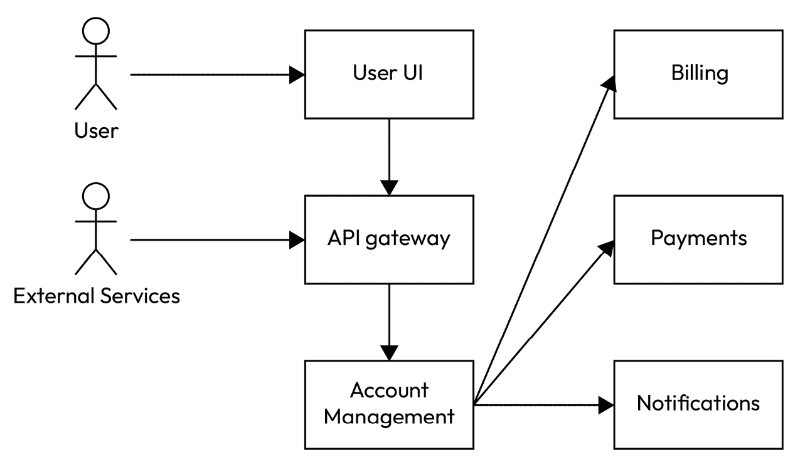

# 12

# 测试

软件测试在软件开发的大厦中占据基石地位，在确保软件质量、可靠性和可维护性方面具有至关重要的意义。正是通过细致的测试过程，开发者可以确保他们的作品达到功能性和用户满意度最高的标准。任何软件项目的起点总是与潜在的错误和未预见到的问题交织在一起；正是测试揭示了这些隐藏的陷阱，使开发者能够积极应对，从而增强软件的整体完整性和性能。

软件测试的核心在于一系列多样化的方法论，每种方法都针对软件的不同方面进行定制。在这些方法中，单元测试作为基础层，专注于软件中最小的可测试部分，以确保其正确的行为。这种细粒度方法有助于早期发现错误，通过允许立即纠正来简化开发过程。从微观视角上升到宏观视角，集成测试占据主导地位，其中对集成单元之间的交互进行审查。这种方法在识别组件接口问题中至关重要，确保软件内部通信和功能的顺畅。

进一步推进，系统测试成为对完整和集成软件系统的全面审查。这种方法深入到软件对指定要求的遵守情况，对其行为和性能进行总体评估。这是一个关键阶段，验证软件的部署准备情况，确保它在预期环境中正确运行。最后，验收测试标志着测试过程的完成，其中软件被评估以确定其是否满足交付给最终用户的标准。这一最终阶段对于确保软件与用户需求和期望的一致性至关重要，是软件质量和有效性的最终证明。

开始这一章节，您将引导进入软件测试错综复杂的领域，深入了解它在开发生命周期中扮演的关键角色。探索将涵盖测试方法之间的细微差别，阐明它们的独特目标和应用范围。通过这次旅程，您将获得对如何通过测试支撑创建强大、可靠和以用户为中心的软件的全面理解，为后续章节深入探讨单元测试以及 C++领域的其他具体内容奠定基础。

# 测试驱动开发

**测试驱动开发**，通常缩写为**TDD**，是一种现代软件开发方法，它彻底改变了代码的编写和测试方式。在其核心，TDD 通过提倡在开发实际功能代码之前创建测试来颠覆传统的开发方法。这种范式转变体现在被称为“红-绿-重构”的循环过程中。最初，开发者编写一个测试来定义期望的改进或新功能，这个测试在第一次运行时必然会失败——这是“红”阶段，表示缺少相应的功能。随后，在“绿”阶段，开发者编写必要的最少代码以通过测试，从而确保功能满足指定的要求。这个周期以“重构”阶段结束，在这个阶段，新代码被精炼和优化，而不改变其行为，从而保持测试的成功结果。

采用 TDD（测试驱动开发）带来了众多优势，这些优势有助于构建更健壮和可靠的代码库。其中最显著的益处是代码质量的显著提升。由于 TDD 要求事先定义测试，因此它本质上鼓励更深思熟虑和审慎的设计过程，减少了错误和缺陷的可能性。此外，在 TDD 过程中编写的测试同时起到详细文档的作用。这些测试提供了对代码预期功能和用法的清晰洞察，为当前和未来的开发者提供了宝贵的指导。此外，TDD 通过确保更改不会意外地破坏现有功能，从而促进了既灵活又易于维护的代码库的设计和重构。

尽管 TDD 具有许多益处，但它并非没有挑战和潜在的缺点。采用 TDD 时最初遇到的初步障碍之一是感觉开发过程会减慢。在功能开发之前编写测试可能感觉不合逻辑，可能会延长交付功能的时间，尤其是在采用初期。此外，TDD 需要陡峭的学习曲线，要求开发者掌握新技能并适应不同的思维方式，这可能会在时间和资源上投入巨大。还值得注意的是，TDD 可能并不适用于所有场景，也不是所有情况下都是理想的。某些类型的项目，如涉及复杂用户界面或需要与外部系统进行广泛交互的项目，可能会对 TDD 方法构成挑战，需要更细致或混合的测试方法。

总结来说，虽然 TDD（测试驱动开发）通过强调测试优先的方法为软件开发提供了一种变革性的方法，但在权衡其潜在挑战的同时，其益处也是至关重要的。TDD 的有效性取决于其应用的上下文、开发团队的熟练程度以及手头项目的性质。随着我们深入到后续章节，单元测试的细微差别、与测试框架的集成以及实际考虑因素将进一步阐明 TDD 在塑造高质量、可维护的 C++代码库中的作用。

# C++中的单元测试

单元测试是软件工程中 TDD 的基础性方面，在 C++开发过程中发挥着关键作用。它们专注于验证代码的最小部分，称为单元，通常是单个函数、方法或类。通过单独测试这些组件，单元测试确保软件的每个部分都按预期运行，这对于系统的整体功能至关重要。

在 TDD 框架中，单元测试承担着更加重要的角色。它们通常在实际代码编写之前编写，指导开发过程，并确保软件从一开始就考虑到可测试性和正确性。在实现之前编写单元测试的方法有助于在开发周期早期发现错误，从而及时纠正，防止错误变得更加复杂或影响系统的其他部分。这种主动的错误检测不仅节省了时间和资源，而且有助于提高软件的稳定性。

此外，单元测试作为开发者的安全网，使他们能够自信地重构代码，而不用担心破坏现有的功能。这在 TDD 中尤其有价值，因为在 TDD 中，重构是编写测试、使其通过并改进代码的循环中的关键步骤。除了在错误检测和促进重构中的作用外，单元测试还充当有效的文档，提供对系统预期行为的清晰见解。这使得它们成为开发者的宝贵资源，尤其是对于新加入代码库的开发者来说。此外，在 TDD 方法中编写单元测试的过程通常突出了设计改进，从而导致了更健壮和可维护的代码。

# C++单元测试框架

C++生态系统拥有丰富的单元测试框架，旨在促进测试的创建、执行和维护。在这些框架中，Google Test 和 Google Mock 因其全面的功能集、易用性和与 C++项目的集成能力而脱颖而出。在本节中，我们将深入探讨 Google Test 和 Google Mock，突出它们的关键功能和语法，并演示如何将它们集成到 CMake 项目中。

# Google Test 和 Google Mock

使用 `EXPECT_EQ` 和 `ASSERT_NE` 来比较预期结果与实际结果，确保测试条件的精确验证。此外，Google Test 通过测试夹具简化了常见测试配置的管理，夹具定义了设置和清理操作，为每个测试提供一个一致的环境。

另一个重要特性是对参数化测试的支持，允许开发者编写单个测试并在多个输入上运行它。这种方法大大增强了测试覆盖率，而无需重复代码。与此相辅相成的是，Google Test 还支持类型参数化测试，允许在不同数据类型上执行相同的测试逻辑，进一步扩大测试覆盖范围。

Google Test 最用户友好的特性之一是其自动测试发现机制。此功能消除了手动测试注册的需要，因为 Google Test 自动识别并执行项目中的测试，简化了测试过程并节省了宝贵的发展时间。

**Google Mock**，也称为 **gMock**，通过提供强大的模拟框架来补充 Google Test，该框架可以无缝集成以模拟复杂对象行为。这种能力在创建模拟真实世界场景的条件时非常有价值，允许更彻底地测试代码交互。使用 Google Mock，开发者可以灵活地设置模拟对象期望，根据特定需求定制，例如函数被调用的次数、接收的参数以及调用顺序。这种控制水平确保测试不仅可以验证结果，还可以验证代码不同部分之间的交互。

此外，Google Mock 特别设计用于与 Google Test 协同工作，简化了创建可以同时利用实际对象及其模拟对应物的全面测试的过程。这种集成简化了编写既广泛又反映真实应用程序行为的测试的过程，从而增强了代码库的可靠性和可维护性。

# 将 Google Test 集成到 C++ 项目中

我们将演示如何将 Google Test 集成到 CMake 项目中，提供配置 CMake 以与 Google Test 一起进行 C++ 项目的单元测试的逐步指南。

首先，确保 Google Test 包含在您的项目中。这可以通过将 Google Test 添加为项目存储库中的子模块或通过 CMake 下载来实现。一旦 Google Test 成为项目的一部分，下一步就是配置您的 `CMakeLists.txt` 文件以在构建过程中包含 Google Test。

以下是如何配置您的 `CMakeLists.txt` 文件以通过子模块集成 Google Test 的示例：

```cpp
git submodule add https://github.com/google/googletest.git external/googletest
```

更新 `CMakeLists.txt` 以在构建中包含 Google Test 和 Google Mock：

```cpp
# Minimum version of CMake
cmake_minimum_required(VERSION 3.14)
project(MyProject)
# GoogleTest requires at least C++14
set(CMAKE_CXX_STANDARD 14)
set(CMAKE_CXX_STANDARD_REQUIRED ON)
# Enable testing capabilities
enable_testing()
# Add GoogleTest to the project
add_subdirectory(external/googletest)
# Include GoogleTest and GoogleMock headers
include_directories(${gtest_SOURCE_DIR}/include ${gmock_SOURCE_DIR}/include)
# Define your test executable
add_executable(my_tests test1.cpp test2.cpp)
# Link GoogleTest and GoogleMock to your test executable
target_link_libraries(my_tests gtest gtest_main gmock gmock_main)
```

在此配置中，`add_subdirectory(external/googletest)` 告诉 CMake 将 Google Test 包含在构建中。`include_directories` 确保 Google Test 的头文件对您的测试文件是可访问的。`add_executable` 定义了一个新的可执行文件用于您的测试，而 `target_link_libraries` 将 Google Test 库链接到您的测试可执行文件。

在配置 `CMakeLists.txt` 之后，您可以使用 CMake 和 make 命令构建和运行您的测试。此设置不仅将 Google Test 集成到您的项目中，而且还利用 CMake 的测试功能来自动运行测试。

以下代码片段演示了另一种配置 CMake 以使用 Google Test 的方法，即通过 CMake 的 `FetchContent` 模块下载 Google Test。这种方法允许 CMake 在构建过程中下载 Google Test，确保项目的依赖项自动管理：

```cpp
cmake_minimum_required(VERSION 3.14)
project(MyProject)
# GoogleTest requires at least C++14
set(CMAKE_CXX_STANDARD 14)
set(CMAKE_CXX_STANDARD_REQUIRED ON)
include(FetchContent)
FetchContent_Declare(
  googletest
  URL https://github.com/google/googletest/archive/03597a01ee50ed33e9dfd640b249b4be3799d395.zip
)
# For Windows: Prevent overriding the parent project’s compiler/linker settings
set(gtest_force_shared_crt ON CACHE BOOL “” FORCE)
FetchContent_MakeAvailable(googletest)
```

虽然这个例子侧重于将 Google Test 与 CMake 集成，但值得注意的是 Google Test 是灵活的，也可以集成到其他构建系统中，例如 Google 自己的 Bazel。对于使用不同构建系统或更复杂配置的项目，请参考官方 Google Test 文档以获取全面指导和建议最佳实践。此文档提供了关于在各个环境和构建系统中利用 Google Test 的宝贵见解，确保您可以在任何开发设置中有效地在您的 C++ 项目中实施单元测试。

# 在 C++ 项目中使用 Google Test

Google Test 提供了一套全面的函数，以支持 C++ 开发中的各种测试需求。了解如何有效地利用这些功能可以显著提高您的测试实践。让我们通过简单的示例和解释来探讨 Google Test 的使用。

# 编写一个简单的测试

在 Google Test 中编写一个简单的测试可以使用 `TEST` 宏，它定义了一个测试函数。在这个函数内部，您可以使用各种断言来验证您代码的行为。以下是一个基本示例：

```cpp
#include <gtest/gtest.h>
int add(int a, int b) {
    return a + b;
}
TEST(AdditionTest, HandlesPositiveNumbers) {
    EXPECT_EQ(5, add(2, 3));
}
```

在此示例中，使用 `EXPECT_EQ` 断言 `add` 函数返回两个正数的预期和。Google Test 提供了各种断言，如 `EXPECT_GT`（大于）、`EXPECT_TRUE`（布尔 `true`）等，以适应不同的测试场景。

`EXPECT_*` 断言和 `ASSERT_*` 断言之间的关键区别在于它们在失败时的行为。虽然 `EXPECT_*` 断言允许测试在失败后继续运行，但 `ASSERT_*` 断言将在失败时立即停止当前测试函数。当测试的后续行不依赖于当前断言的成功时，使用 `EXPECT_*`；当断言的失败会使测试的继续进行没有意义或可能引起错误时，使用 `ASSERT_*`。

# 使用测试夹具

对于需要为多个测试用例提供共同设置和清理的测试，Google Test 提供了测试夹具的概念。这是通过定义一个从 `::testing::Test` 派生的类，然后使用 `TEST_F` 宏来编写使用此夹具的测试来实现的：

```cpp
class CalculatorTest : public ::testing::Test {
protected:
    void SetUp() override {
        // Code here will be called immediately before each test
        calculator.reset(new Calculator());
    }
    void TearDown() override {
        // Code here will be called immediately after each test
        calculator.reset();
    }
    std::unique_ptr<Calculator> calculator;
};
TEST_F(CalculatorTest, CanAddPositiveNumbers) {
    EXPECT_EQ(5, calculator->add(2, 3));
}
TEST_F(CalculatorTest, CanAddNegativeNumbers) {
    EXPECT_EQ(-5, calculator->add(-2, -3));
}
```

在这个示例中，`SetUp` 和 `TearDown` 被覆盖以提供每个测试用例的共同设置（初始化一个 `Calculator` 对象）和清理（清理 `Calculator` 对象）。使用 `TEST_F` 来定义自动使用此设置和清理的测试函数，确保每个测试从一个全新的 `Calculator` 实例开始。

# 主函数

要运行测试，Google Test 需要一个主函数来初始化 Google Test 框架并运行所有测试。以下是一个示例：

```cpp
#include <gtest/gtest.h>
int main(int argc, char **argv) {
    ::testing::InitGoogleTest(&argc, argv);
    return RUN_ALL_TESTS();
}
```

这个主函数初始化 Google Test，将命令行参数传递给它，这允许从命令行控制测试执行。`RUN_ALL_TESTS()` 运行所有已定义的测试，如果所有测试都通过则返回 `0`，否则返回 `1`。

通过遵循这些示例和解释，你可以开始使用 Google Test 为你的 C++ 项目编写全面的测试，确保你的代码在各种场景下都能按预期行为。

# 运行 Google Test 测试

在将 Google Test 与你的 CMake 项目设置好并编译了测试之后，运行测试非常直接。你通过在构建目录中使用 `ctest` 命令来执行测试，CMake 使用这个命令来运行你在 `CMakeLists.txt` 文件中定义的测试。

当你直接执行测试二进制文件时，为 `Calculator` 类运行测试，你的终端的标准输出可能看起来像这样：

```cpp
$ cd path/to/build
[==========] Running 4 tests from 2 test suites.
[----------] Global test environment set-up.
[----------] 2 tests from AdditionTests
[ RUN      ] AdditionTests.HandlesZeroInput
[       OK ] AdditionTests.HandlesZeroInput (0 ms)
[ RUN      ] AdditionTests.HandlesPositiveInput
[       OK ] AdditionTests.HandlesPositiveInput (0 ms)
[----------] 2 tests from AdditionTests (0 ms total)
[----------] 2 tests from SubtractionTests
[ RUN      ] SubtractionTests.HandlesZeroInput
[       OK ] SubtractionTests.HandlesZeroInput (0 ms)
[ RUN      ] SubtractionTests.HandlesPositiveInput
[       OK ] SubtractionTests.HandlesPositiveInput (0 ms)
[----------] 2 tests from SubtractionTests (0 ms total)
[----------] Global test environment tear-down
[==========] 4 tests from 2 test suites ran. (1 ms total)
[  PASSED  ] 4 tests.
```

这个输出详细说明了每个测试套件和测试用例，显示哪些测试被执行了（`[ RUN      ]`）以及它们的结果（通过测试的 `[       OK ]`）。它提供了测试过程的清晰分解，包括设置和清理阶段，并在最后汇总结果。

如果你使用 `ctest` 运行测试，默认情况下输出更简洁：

```cpp
$ ctest
Test project /path/to/build
    Start 1: AdditionTests.HandlesZeroInput
1/4 Test #1: AdditionTests.HandlesZeroInput ......   Passed    0.01 sec
    Start 2: AdditionTests.HandlesPositiveInput
2/4 Test #2: AdditionTests.HandlesPositiveInput ...   Passed    0.01 sec
    Start 3: SubtractionTests.HandlesZeroInput
3/4 Test #3: SubtractionTests.HandlesZeroInput .....   Passed    0.01 sec
    Start 4: SubtractionTests.HandlesPositiveInput
4/4 Test #4: SubtractionTests.HandlesPositiveInput ..   Passed    0.01 sec
100% tests passed, 0 tests failed out of 4
```

在这个 `ctest` 输出中，每一行对应一个测试用例，显示其开始顺序、名称和结果。最后的总结提供了一个快速概览，包括测试总数、通过的数量和失败的数量。这种格式对于快速评估你的测试套件的健康状况非常有用，而不需要 Google Test 输出提供的详细分解。

# Google Test 的高级功能

Google Test 提供了一系列旨在处理复杂测试场景的高级功能，为开发者提供了强大的工具，以确保其代码的健壮性。在这些功能中，一个值得注意的能力是支持 *死亡测试*。死亡测试在验证代码在遇到致命条件（如失败的断言或显式调用 `abort()`）时表现出预期的行为特别有用。在需要确保应用程序能够适当地响应不可恢复的错误的情况下，这一点至关重要，从而增强了其可靠性和安全性。

以下是一个死亡测试的简要示例：

```cpp
void risky_function(bool trigger) {
    if (trigger) {
        assert(false && “Triggered a fatal error”);
    }
}
TEST(RiskyFunctionTest, TriggersAssertOnCondition) {
    EXPECT_DEATH_IF_SUPPORTED(risky_function(true), “Triggered a fatal error”);
}
```

在这个例子中，`EXPECT_DEATH_IF_SUPPORTED` 检查 `risky_function(true)` 是否确实导致程序退出（由于失败的断言），并且它与指定的错误消息相匹配。这确保了函数在致命条件下表现出预期的行为。

Google Test 的其他高级功能包括用于模拟复杂对象交互的 *mocking*，用于使用各种输入运行相同测试逻辑的 *参数化测试*，以及用于在不同数据类型上应用相同测试逻辑的 *类型参数化测试*。这些功能使得可以实施全面的测试策略，覆盖广泛的场景和输入，确保对代码进行彻底的验证。

对于寻求充分利用 Google Test 的全部潜力，包括死亡测试等高级功能的开发者来说，官方 Google Test 文档是一个无价资源。它提供了详细的解释、示例和最佳实践，指导你了解 C++ 项目中有效编写和执行测试的细微差别。通过参考此文档，你可以加深对 Google Test 功能的理解，并有效地将其集成到测试工作流程中。

# 在 C++ 项目中使用 gMock

在软件测试的世界中，尤其是在 TDD 方法论中，模拟对象扮演着至关重要的角色。它通过实现相同的接口来模拟真实对象的行为，允许它在测试中代替实际对象。然而，模拟对象的力量在于其灵活性；开发者可以在运行时指定其行为，包括调用的方法、调用顺序、频率、参数指定和返回值。这种程度的控制使模拟对象成为测试代码中交互和集成的强大工具。

模拟对象解决了测试复杂或相互关联的系统中的几个挑战。在开发原型或测试时，由于外部依赖、执行时间或与真实操作相关的成本等限制，仅依赖真实对象可能不可行或不切实际。在这种情况下，模拟对象提供了一个轻量级、可控制的替代品，它复制了必要的交互，而没有真实实现的开销或副作用。这使得开发者能够专注于组件的行为和集成，而不是其底层实现，从而促进更专注和高效的测试。

伪造对象与模拟对象之间的区别对于理解它们的适当用例至关重要。虽然两者都充当真实对象的替代品用于测试，但它们具有不同的特性和目的：

+   **伪造对象**：这些是简化实现，模仿真实对象，但通常为了测试效率而采取捷径。一个例子是内存数据库，它复制了真实数据库系统的功能，但没有持久存储。伪造对象适用于那些对真实对象的精确工作原理不是审查重点的测试。

+   **模拟对象**：与伪造对象不同，模拟对象预先编程了特定的期望，形成了一种如何使用的契约。它们非常适合测试被测试系统及其依赖项之间的交互。例如，当测试一个依赖于服务的类时，可以使用服务的模拟对象来确保该类以预期的方式与服务交互，而无需实际调用服务的真实实现。

gMock 是 Google 为 C++创建模拟类的框架，它提供了一个类似于 jMock 和 EasyMock 为 Java 提供的全面解决方案。使用 gMock，开发者首先使用宏描述要模拟的对象的接口，然后生成模拟类实现。然后，开发者可以实例化模拟对象，使用 gMock 直观的语法设置它们的预期行为和交互。在测试执行期间，gMock 监控这些模拟对象，确保所有指定的交互都符合定义的期望，并将任何偏差标记为错误。这种即时反馈对于识别组件与其依赖项交互中的问题非常有价值。

# gMock 的使用示例

在单元测试中，尤其是在与网络操作接口时，模拟是一种非常有价值的技巧。这以`Socket`类为例，它是网络通信的基础元素。`Socket`类抽象了在网络中发送和接收原始字节数组的功能，提供了`send`和`recv`等方法。具体的类如`TcpSocket`、`UdpSocket`和`WebSocket`扩展了这个基类以实现特定的网络协议。以下代码显示了`Socket`类的定义：

```cpp
class Socket {
public:
    // sends raw byte array of given size, returns number of bytes sent
    // or -1 in case of error
    virtual ssize_t send(void* data, size_t size) = 0;
    // receives raw byte array of given size, returns number of bytes received
    // or -1 in case of error
    virtual ssize_t recv(void* data, size_t size) = 0;
};
```

例如，`DataSender`类依赖于一个`Socket`实例来发送数据。这个类精心设计以管理数据传输，必要时尝试重试，并处理各种场景，如部分数据发送、对等方发起的连接关闭和连接错误。在单元测试`DataSender`时的目标是验证它在这些不同场景中的行为，而不进行实际的网络通信。`DataSender`类的定义如下：

```cpp
struct DataSentParitally {};
struct ConnectionClosedByPeer {};
struct ConnectionError {};
// Class under test
class DataSender {
    static constexpr size_t RETRY_NUM = 2;
public:
    DataSender(Socket* socket) : _socket{socket} {}
    void send() {
        auto data = std::array<int, 32>{};
        auto bytesSent = 0;
        for (size_t i = 0; i < RETRY_NUM && bytesSent != sizeof(data); ++i) {
            bytesSent = _socket->send(&data, sizeof(data));
            if (bytesSent < 0) {
                throw ConnectionError{};
            }
            if (bytesSent == 0) {
                throw ConnectionClosedByPeer{};
            }
        }
        if (bytesSent != sizeof(data)) {
            throw DataSentParitally{};
        }
    }
private:
    Socket* _socket;
};
```

这个要求引导我们使用一个从`Socket`派生的`MockSocket`类来模拟网络交互。以下是`MockSocket`的定义：

```cpp
class MockSocket : public Socket {
public:
    MOCK_METHOD(ssize_t, send, (void* data, size_t size), (override));
    MOCK_METHOD(ssize_t, recv, (void* data, size_t size), (override));
};
```

`MockSocket`类使用 gMock 的`MOCK_METHOD`宏来模拟`Socket`类的`send`和`recv`方法，允许在测试期间指定预期的行为。`override`关键字确保这些模拟方法正确地覆盖了`Socket`类中的对应方法。

在 gMock 中设置期望使用诸如`WillOnce`和`WillRepeatedly`之类的构造，这些构造定义了当调用模拟方法时它们的行为：

```cpp
TEST(DataSender, HappyPath) {
    auto socket = MockSocket{};
    EXPECT_CALL(socket, send(_, _)).Times(1).WillOnce(Return(32 * sizeof(int)));
    auto sender = DataSender(&socket);
    sender.send();
}
```

在这个`HappyPath`测试中，`EXPECT_CALL`设置了一个期望，即`send`将被调用一次，成功地在单次尝试中传输所有数据。

```cpp
TEST(DataSender, SendSuccessfullyOnSecondAttempt) {
    auto socket = MockSocket{};
    EXPECT_CALL(socket, send(_, _)).Times(2)
                                   .WillOnce(Return(2 * sizeof(int)))
                                   .WillOnce(Return(32 * sizeof(int)));
    auto sender = DataSender(&socket);
    sender.send();
}
```

这个测试期望对`send`进行两次调用：第一次只传输部分数据，而第二次完成传输，模拟第二次尝试成功的`send`。

其余的测试检查各种错误场景，例如部分数据传输、由对等方关闭连接以及连接错误。以下是一个测试数据部分发送场景的示例：

```cpp
 TEST(DataSender, DataSentParitally) {
     auto socket = MockSocket{};
     EXPECT_CALL(socket, send(_, _)).Times(2)
                                    .WillRepeatedly(Return(2 * sizeof(int)));
     auto sender = DataSender(&socket);
     EXPECT_THROW(sender.send(), DataSentParitally);
 }
 TEST(DataSender, ConnectionClosedByPeer) {
     auto socket = MockSocket{};
     EXPECT_CALL(socket, send(_, _)).Times(1)
                                    .WillRepeatedly(Return(0 * sizeof(int)));
     auto sender = DataSender(&socket);
     EXPECT_THROW(sender.send(), ConnectionClosedByPeer);
 }
 TEST(DataSender, ConnectionError) {
     auto socket = MockSocket{};
     EXPECT_CALL(socket, send(_, _)).Times(1)
                                    .WillRepeatedly(Return(-1 * sizeof(int)));
     auto sender = DataSender(&socket);
     EXPECT_THROW(sender.send(), ConnectionError);
 }
```

使用 gMock 运行这些测试并观察输出，使我们能够确认`DataSender`类在各种条件下的行为：

```cpp
[==========] Running 5 tests from 1 test suite.
[----------] Global test environment set-up.
[----------] 5 tests from DataSender
[ RUN      ] DataSender.HappyPath
[       OK ] DataSender.HappyPath (0 ms)
[ RUN      ] DataSender.SendSuccessfullyOnSecondAttempt
[       OK ] DataSender.SendSuccessfullyOnSecondAttempt (0 ms)
[ RUN      ] DataSender.DataSentPartially
[       OK ] DataSender.DataSentPartially (1 ms)
[ RUN      ] DataSender.ConnectionClosedByPeer
[       OK ] DataSender.ConnectionClosedByPeer (0 ms)
[ RUN      ] DataSender.ConnectionError
[       OK ] DataSender.ConnectionError (0 ms)
[----------] 5 tests from DataSender (1 ms total)
[----------] Global test environment tear-down
[==========] 5 tests from 1 test suite ran. (1 ms total)
[  PASSED  ] 5 tests.
```

输出简洁地报告了每个测试的执行和结果，表明`DataSender`类成功处理了不同的网络通信场景。有关利用 gMock 的更全面细节，包括其完整功能套件，官方 gMock 文档是一个基本资源，指导开发者通过有效的模拟策略进行 C++单元测试。

## 通过依赖注入模拟非虚拟方法

在某些场景下，你可能需要模拟非虚拟方法进行单元测试。这可能具有挑战性，因为传统的模拟框架如 gMock 主要针对虚拟方法，这是由于 C++的多态性要求。然而，一种克服这种限制的有效策略是通过依赖注入，结合模板的使用。这种方法通过解耦类依赖来增强可测试性和灵活性。

### 为了可测试性进行重构

为了说明这一点，让我们重构`Socket`类接口和`DataSender`类以适应非虚拟方法的模拟。我们将在`DataSender`中引入模板，允许注入真实的`Socket`类或其模拟版本。

首先，考虑一个没有虚拟方法的`Socket`类的简化版本：

```cpp
class Socket {
public:
    // sends raw byte array of given size, returns number of bytes sent
    // or -1 in case of error
    ssize_t send(void* data, size_t size);
    // receives raw byte array of given size, returns number of bytes received
    // or -1 in case of error
    ssize_t recv(void* data, size_t size);
};
```

接下来，我们修改`DataSender`类以接受一个用于 socket 类型的`template`参数，允许在编译时注入真实 socket 或模拟 socket：

```cpp
template<typename SocketType>
class DataSender {
    static constexpr size_t RETRY_NUM = 2;
public:
    DataSender(SocketType* socket) : _socket{socket} {}
    void send() {
        auto data = std::array<int, 32>{};
        auto bytesSent = 0;
        for (size_t i = 0; i < RETRY_NUM && bytesSent != sizeof(data); ++i) {
            bytesSent = _socket->send(&data, sizeof(data));
            if (bytesSent < 0) {
                throw ConnectionError{};
            }
            if (bytesSent == 0) {
                throw ConnectionClosedByPeer{};
            }
        }
        if (bytesSent != sizeof(data)) {
            throw DataSentPartially{};
        }
    }
private:
    SocketType* _socket;
};
```

使用这种基于模板的设计，`DataSender`现在可以用符合`Socket`接口的任何类型实例化，包括模拟类型。

## 使用模板进行模拟

对于`Socket`的模拟版本，我们可以定义一个`MockSocket`类如下：

```cpp
class MockSocket {
public:
    MOCK_METHOD(ssize_t, send, (void* data, size_t size), ());
    MOCK_METHOD(ssize_t, recv, (void* data, size_t size), ());
};
```

这个`MockSocket`类模仿了`Socket`接口，但使用 gMock 的`MOCK_METHOD`来定义模拟方法。

### 基于依赖注入的单元测试

当为`DataSender`编写测试时，我们现在可以使用模板注入`MockSocket`：

```cpp
TEST(DataSender, HappyPath) {
    MockSocket socket;
    EXPECT_CALL(socket, send(_, _)).Times(1).WillOnce(Return(32 * sizeof(int)));
    DataSender<MockSocket> sender(&socket);
    sender.send();
}
```

在这个测试中，使用`MockSocket`实例化`DataSender`，允许按需模拟`send`方法。这展示了模板和依赖注入如何使非虚拟方法的模拟成为可能，为 C++中的单元测试提供了一种灵活且强大的方法。

这种技术虽然强大，但需要仔细的设计考虑，以确保代码保持整洁和可维护。对于复杂场景或对模拟策略的进一步探索，官方 gMock 文档仍然是一个无价资源，提供了关于高级模拟技术和最佳实践的丰富信息。

#### 模拟 Singleton

尽管由于其可能引入全局状态和软件设计中的紧密耦合而被视为反模式，但 Singleton 模式在许多代码库中仍然很普遍。它确保类只有一个实例的便利性通常导致其在数据库连接等场景中使用，在这些场景中，一个共享资源在逻辑上是合适的。

Singleton 模式限制类实例化和提供全局访问点的特性为单元测试带来了挑战，尤其是在需要模拟单例行为时。

考虑一个实现为单例的`Database`类的示例：

```cpp
class Database {
public:
    std::vector<std::string> query(uint32_t id) const {
        return {};
    }
    static Database& getInstance() {
        static Database db;
        return db;
    }
private:
    Database() = default;
};
```

在这种情况下，`DataHandler`类与`Database`单例交互以执行操作，例如查询数据：

```cpp
class DataHandler {
public:
    DataHandler() {}
    void doSomething() {
        auto& db = Database::getInstance();
        auto result = db.query(42);
    }
};
```

为了便于测试`DataHandler`类而不依赖于真实的`Database`实例，我们可以引入一个模板变体`DataHandler1`，允许注入模拟数据库实例：

```cpp
template<typename Db>
class DataHandler1 {
public:
    DataHandler1() {}
    std::vector<std::string> doSomething() {
        auto& db = Db::getInstance();
        auto result = db.query(42);
        return result;
    }
};
```

这种方法利用模板将`DataHandler1`与具体的`Database`单例解耦，允许在测试期间用`MockDatabase`替换：

```cpp
class MockDatabase {
public:
    std::vector<std::string> query(uint32_t id) const {
        return {“AAA”};
    }
    static MockDatabase& getInstance() {
        static MockDatabase db;
        return db;
    }
};
```

在`MockDatabase`就位后，单元测试现在可以模拟数据库交互而不实际接触数据库，如下面的测试用例所示：

```cpp
TEST(DataHandler, check) {
    auto dh = DataHandler1<MockDatabase>{};
    EXPECT_EQ(dh.doSomething(), std::vector<std::string>{“AAA”});
}
```

这个测试实例化了`DataHandler1`与`MockDatabase`，确保`doSomething`方法与模拟对象而不是真实数据库交互。预期的结果是预定义的模拟响应，使测试可预测且与外部依赖隔离。

这个模板解决方案是之前讨论过的依赖注入技术的变体，展示了 C++模板的灵活性和强大功能。它优雅地解决了模拟单例的挑战，从而增强了依赖于单例实例的组件的可测试性。对于更复杂的场景或对模拟策略的进一步探索，建议参考官方 gMock 文档，因为它提供了对高级模拟技术和最佳实践的全面见解。

## 和善的、严格的和挑剔的

在使用 gMock 进行单元测试的世界中，管理模拟对象的行为及其与被测试系统的交互至关重要。gMock 引入了三种模式来控制这种行为：挑剔的、和善的和严格的。这些模式决定了 gMock 如何处理不感兴趣的调用——那些与任何`EXPECT_CALL`不匹配的调用。

### 挑剔的模拟

默认情况下，gMock 中的模拟对象是“挑剔”的。这意味着虽然它们会警告不感兴趣的调用，但这些调用不会导致测试失败。警告的作用是提醒可能存在与模拟对象的意外交互，但这并不足以引起测试失败。这种行为确保测试专注于预期的期望，而不会对偶然的交互过于宽容或过于严格。

考虑以下测试场景：

```cpp
TEST(DataSender, Naggy) {
    auto socket = MockSocket{};
    EXPECT_CALL(socket, send(_, _)).Times(1).WillOnce(Return(32 * sizeof(int)));
    auto sender = DataSender(&socket);
    sender.send();
}
```

在这种情况下，如果有一个对`recv`的不感兴趣调用，gMock 会发出警告，但测试会通过，标记出未预料的交互而不使测试失败。

### 和善的模拟

`NiceMock`对象通过抑制不感兴趣调用的警告更进一步。这种模式在测试的重点严格限于特定交互时很有用，其他对模拟的偶然调用应该被忽略，而不会在测试输出中添加警告。

在测试中使用`NiceMock`的示例如下：

```cpp
TEST(DataSender, Nice) {
    auto socket = NiceMock<MockSocket>{};
    EXPECT_CALL(socket, send(_, _)).Times(1).WillOnce(Return(32 * sizeof(int)));
    auto sender = DataSender(&socket);
    sender.send();
}
```

在这个`和善`模式下，即使有对`recv`的不感兴趣调用，gMock 也会默默地忽略它们，保持测试输出干净并专注于定义的期望。

### 严格的模拟

在光谱的另一端，`StrictMock`对象将不感兴趣的调用视为错误。这种严格性确保了与模拟对象的每次交互都通过`EXPECT_CALL`得到记录。这种模式在需要精确控制模拟交互的测试中特别有用，任何与预期调用不符的偏差都应导致测试失败。

使用`StrictMock`的测试可能看起来像这样：

```cpp
TEST(DataSender, Strict) {
    auto socket = StrictMock<MockSocket>{};
    EXPECT_CALL(socket, send(_, _)).Times(1).WillOnce(Return(32 * sizeof(int)));
    auto sender = DataSender(&socket);
    sender.send();
}
```

在`严格`模式下，任何不感兴趣的调用，例如对`recv`的调用，都会导致测试失败，强制遵守定义的期望。

### 测试输出和推荐设置

这些模拟模式的行为反映在测试输出中：

```cpp
Program returned: 1
Program stdout
[==========] Running 3 tests from 1 test suite.
[----------] Global test environment set-up.
[----------] 3 tests from DataSender
[ RUN      ] DataSender.Naggy
GMOCK WARNING:
Uninteresting mock function call - returning default value.
    Function call: recv(0x7ffd4aae23f0, 128)
          Returns: 0
NOTE: You can safely ignore the above warning unless this call should not happen.  Do not suppress it by blindly adding an EXPECT_CALL() if you don’t mean to enforce the call.  See https://github.com/google/googletest/blob/master/googlemock/docs/cook_book.md#knowing-when-to-expect for details.
[       OK ] DataSender.Naggy (0 ms)
[ RUN      ] DataSender.Nice
[       OK ] DataSender.Nice (0 ms)
[ RUN      ] DataSender.Strict
unknown file: Failure
Uninteresting mock function call - returning default value.
    Function call: recv(0x7ffd4aae23f0, 128)
          Returns: 0
[  FAILED  ] DataSender.Strict (0 ms)
[----------] 3 tests from DataSender (0 ms total)
[----------] Global test environment tear-down
[==========] 3 tests from 1 test suite ran. (0 ms total)
[  PASSED  ] 2 tests.
[  FAILED  ] 1 test, listed below:
[  FAILED  ] DataSender.Strict
 1 FAILED TEST
```

在 `Naggy` 模式下，测试通过时会有关于不感兴趣调用的警告。`Nice` 模式同样通过测试，但没有警告。然而，`Strict` 模式如果存在不感兴趣的调用，则会失败测试。

建议从 `StrickMock` 开始，根据需要逐步放宽模式。这种方法确保测试最初对与模拟对象的交互非常严格，为意外的调用提供安全网。随着测试套件的成熟和预期交互的日益清晰，模式可以放宽到 `Naggy` 或 `Nice`，以减少测试输出中的噪音。

为了进一步探索这些模式和高级模拟技术，官方 gMock 文档提供了全面的见解和示例，指导开发者通过有效的模拟对象管理进行单元测试。

在本节中，我们深入探讨了 Google Test (GTest) 和 Google Mock (GMock) 的功能及其在 C++ 项目测试框架和开发工作流程中的应用。GTest 提供了一个强大的环境，用于创建、管理和执行单元测试，包括用于共享设置和清理例程的测试固定装置，用于不同输入测试的参数化测试，以及用于在不同数据类型上应用相同测试的类型参数化测试。其全面的断言库确保了对代码行为的彻底验证，从而有助于提高软件的稳定性和耐用性。

作为 GTest 的补充，GMock 允许无缝创建和使用模拟对象，通过模拟依赖项的行为来实现隔离组件测试。这在复杂系统中非常有价值，因为直接使用真实依赖项进行测试要么不切实际，要么适得其反。使用 GMock，开发者可以访问一系列功能，包括自动模拟生成、灵活的期望设置和详细的行为验证，从而实现组件交互的深入测试。

通过将 GTest 和 GMock 集成到 C++ 开发生命周期中，开发者可以采用稳健的测试驱动方法，确保代码质量，并促进持续测试和集成实践，最终导致更可靠、更易于维护的软件项目。

# 其他值得注意的 C++ 单元测试框架

除了 Google Test 和 Google Mock，C++ 生态系统还拥有丰富的单元测试框架，每个框架都提供独特的特性和哲学。这些框架满足各种测试需求和偏好，为开发者提供将单元测试集成到项目中的多种选择。

## Catch2

Catch2 以其简洁性和易用性而突出，启动时需要最少的样板代码。它采用头文件只读分发，使得将其集成到项目中变得简单。Catch2 支持多种测试范式，包括 BDD 风格的测试用例，并提供增强测试可读性和意图的表达式断言宏。其突出特点是“部分”机制，它以灵活和分层的方式为测试之间的设置和清理代码提供了一种自然共享方式。

## Boost.Test

作为 Boost 库的一部分，Boost.Test 为 C++的单元测试提供了稳健的支持。它提供了一个全面的断言框架、测试组织设施，并与 Boost 构建系统集成。Boost.Test 可以以头文件只读模式或编译模式使用，提供了部署的灵活性。它以其详细的测试结果报告和广泛的内置测试用例管理工具而闻名，使其适用于小型和大型项目。

## Doctest

Doctest 的设计重点是简单性和速度，定位为最轻量级的特性丰富 C++测试框架。由于其快速的编译时间，它特别适合 TDD。受到 Catch2 的启发，Doctest 提供类似的语法，但旨在更轻量级和更快地编译，使其非常适合在日常开发中包含测试，而不会显著影响构建时间。

## Google Test 与 Catch2 与 Boost.Test 与 Doctest 的比较

+   **简单性**：Catch2 和 Doctest 在简单性和易用性方面表现出色，Catch2 提供 BDD 风格的语法，而 Doctest 则非常轻量级

+   **集成**：Google Test 和 Boost.Test 将提供更广泛的集成功能，特别适合具有复杂测试需求的大型项目

+   **性能**：Doctest 在编译时间和运行时性能方面突出，使其非常适合快速开发周期

+   **特性**：Boost.Test 和 Google Test 自带更全面的特性集，包括高级测试用例管理和详细报告

选择正确的框架通常取决于项目特定的需求、开发者的偏好以及简单性、性能和特性丰富性之间的期望平衡。鼓励开发者进一步探索这些框架，以确定哪个最适合他们的单元测试需求，从而有助于构建更可靠、可维护和高质量的 C++软件。

# 适合单元测试的候选者

确定单元测试的最佳候选者对于建立稳健的测试策略至关重要。当应用于适合隔离和细粒度验证的代码库部分时，单元测试表现卓越。以下是一些关键示例和建议：

边界清晰且职责定义明确的类和函数是单元测试的理想候选者。这些组件理想情况下应体现单一职责原则，处理应用程序功能的一个特定方面。测试这些隔离的单元可以精确验证其行为，确保它们在各种条件下正确执行其预期任务。

依赖于其输入参数且不产生任何副作用的无副效应函数是单元测试的绝佳目标。它们的确定性——即给定的输入总是产生相同的输出——使得它们易于测试和验证。无副效应函数通常出现在实用库、数学计算和数据转换操作中。

通过定义良好的接口与依赖项交互的组件更容易进行测试，尤其是当这些依赖项可以轻松模拟或存根时。这有助于在隔离的情况下测试组件，专注于其逻辑而不是其依赖项的实现细节。

封装应用程序核心功能和规则的业务逻辑层通常非常适合单元测试。这一层通常涉及计算、数据处理和决策，这些可以在与用户界面和外部系统隔离的情况下进行测试。

虽然应用程序的许多方面都适合进行单元测试，但认识到具有挑战性的场景是明智的。需要与数据库、文件系统、网络服务等外部资源进行复杂交互的组件可能难以有效地模拟，或者可能由于对外部状态或行为的依赖而导致测试不稳定。虽然模拟可以模拟这些交互的一部分，但复杂性和开销可能并不总是证明在单元测试的背景下付出努力是合理的。

尽管单元测试对于验证单个组件非常有价值，但它们也有其局限性，尤其是在集成和端到端交互方面。对于本质难以隔离或需要复杂外部交互的代码，**端到端**（**E2E**）测试变得至关重要。端到端测试模拟真实世界的使用场景，涵盖了从用户界面到后端系统和外部集成的流程。在下一节中，我们将深入探讨端到端测试，探讨其在补充单元测试和提供应用程序功能全面覆盖方面的作用。

# 软件开发中的端到端测试

E2E 测试是一种全面的测试方法，它从开始到结束评估应用程序的功能和性能。与单元测试不同，单元测试是隔离和测试单个组件或代码单元，E2E 测试则将应用程序作为一个整体进行考察，模拟现实世界的用户场景。这种方法确保了应用程序的所有各种组件，包括其接口、数据库、网络和其他服务，能够和谐地工作，以提供预期的用户体验。

## E2E 测试框架

由于 E2E 测试通常涉及从外部与应用程序交互，它并不局限于应用程序所使用的语言。对于可能是更大生态系统的一部分或作为后端系统的 C++ 应用程序，可以使用不同语言的多种框架进行 E2E 测试。以下是一些流行的 E2E 测试框架：

+   **Selenium**：主要用于 Web 应用程序，Selenium 可以自动化浏览器来模拟用户与 Web 界面的交互，使其成为 E2E 测试的多功能工具

+   **Cypress**：另一个强大的 Web 应用程序工具，Cypress 提供了一种更现代、更友好的 E2E 测试方法，具有丰富的调试功能和强大的 API

+   **Postman**：对于暴露 RESTful API 的应用程序，Postman 允许进行全面的 API 测试，确保应用程序的端点在各种条件下都能按预期执行

## 何时使用 E2E 测试

在应用程序的组件必须以复杂的工作流程进行交互的场景中，E2E 测试尤其有价值，这通常涉及多个系统和外部依赖。对于以下方面至关重要：

+   **测试复杂的用户工作流程**：E2E 测试在验证跨越多个应用程序组件的用户旅程方面表现出色，确保从用户的角度来看体验无缝

+   **集成场景**：当应用程序与外部系统或服务交互时，E2E 测试验证这些集成是否按预期工作，捕捉到在隔离情况下可能不明显的问题

+   **关键路径测试**：对于对应用程序核心功能至关重要的功能和路径，E2E 测试确保在现实使用条件下可靠性和性能

# 适合进行 E2E 测试的情况

## 复杂交互

在应用程序的组件进行复杂交互的情况下，可能跨越不同的技术和平台，单元测试可能不足以满足需求。E2E 测试对于确保这些组件的集体行为与预期结果一致至关重要，尤其是在以下情况下：

图表中概述的架构代表了一个典型的 Web 应用程序，其中包含几个相互连接的服务，每个服务在系统中都扮演着独特的角色。



图 12.1 – E2E 测试

在前端，有一个**用户界面（UI**），这是用户与应用程序交互的图形界面。它设计用来通过**API 网关**向和从后端服务发送和接收数据。API 网关充当一个中介，将用户 UI 的请求路由到适当的后端服务，并将响应聚合后发送回 UI。

几个后端服务如下所示：

+   **账户管理**：这项服务处理用户账户，包括身份验证、资料管理以及其他与用户相关的数据。

+   **计费**：负责管理计费信息、订阅和发票。

+   **支付**：处理金融交易，例如信用卡处理或与支付网关接口。

+   **通知**：向用户发送警报或消息，可能由账户管理或计费服务中的某些事件触发。

外部服务，可能是第三方应用程序或数据提供者，也可以与 API 网关交互，提供支持主应用程序的附加功能或数据。

对于该系统的端到端测试，测试将模拟用户在用户 UI 上的操作，例如注册账户或进行支付。然后，测试将验证 UI 是否正确通过 API 网关向后端服务发送适当的请求。随后，测试将确认用户 UI 对从后端接收的数据做出正确响应，确保从用户 UI 到通知的整个工作流程按预期运行。这种全面的测试方法确保每个组件单独以及与系统其他部分协同工作，为用户提供无缝体验。

总结来说，在应用程序的组件进行复杂交互的场景中，尤其是在这些交互跨越不同技术和平台时，考虑端到端测试是至关重要的。端到端测试确保这些组件的整体行为与预期结果一致，从而对应用程序的功能和性能进行全面评估。以下是一些端到端测试有益的常见情况：

+   **多层应用**：具有多个层或级别的应用，例如客户端-服务器架构，通过端到端测试（E2E testing）可以确保各层之间有效沟通。

+   **分布式系统**：对于分布在不同环境或服务中的应用程序，端到端测试可以验证这些分布式组件之间的数据流和功能。

## 真实环境测试

端到端测试的主要优势之一是它能够复制接近生产环境的条件。这包括在实际硬件上测试应用程序，与真实数据库交互，并通过真正的网络基础设施导航。这种测试级别对于以下方面至关重要：

+   **性能验证**：确保应用程序在预期的负载条件和用户流量下表现最优

+   **安全保证**：验证应用程序的安全措施在现实环境中是否有效，以防止潜在的安全漏洞

端到端测试（E2E testing）作为软件发布前的最终检查点，提供对应用程序部署准备情况的全面评估。通过模拟真实世界场景，端到端测试确保应用程序不仅满足其技术规范，而且提供可靠且用户友好的体验，使其成为软件开发生命周期的一个基本组成部分。

# 自动测试覆盖率跟踪工具

在确保软件项目全面测试的探索中，自动测试覆盖率跟踪工具扮演着关键角色。这些工具提供了宝贵的见解，了解应用程序源代码在测试期间执行的程度，突出了测试良好的区域以及可能需要额外注意的区域。

## 自动测试覆盖率跟踪工具及示例

确保全面的测试覆盖率是可靠软件开发的基础。例如，`gcov` 和 `llvm-cov` 等工具自动化了测试覆盖率的跟踪，提供了关于测试如何彻底执行代码的关键见解。

### 工具概述及示例

在 C++ 项目中用于自动测试覆盖率跟踪的两个主要工具：

+   `gcov` 分析在测试运行期间代码中采取的执行路径。例如，使用 `g++ -fprofile-arcs -ftest-coverage example.cpp` 编译 C++ `example.cpp` 文件后，运行相应的测试套件会生成覆盖率数据。随后运行 `gcov example.cpp` 会生成一份报告，详细说明每行代码被执行的次数。

+   `llvm-cov` 与 Clang 合作提供详细的覆盖率报告。使用 `clang++ -fprofile-instr-generate -fcoverage-mapping example.cpp` 进行编译，然后使用 `LLVM_PROFILE_FILE="example.profraw" ./example` 执行测试二进制文件以准备覆盖率数据。接着使用 `llvm-profdata merge -sparse example.profraw -o example.profdata`，然后使用 `llvm-cov show ./example -instr-profile=example.profdata` 为 `example.cpp` 生成覆盖率报告。

### 与 C++ 项目集成

将这些工具集成到 C++ 项目中涉及使用覆盖率标志编译源代码，执行测试以生成覆盖率数据，然后分析这些数据以生成报告。

对于包含多个文件的工程，你可能需要使用以下方式进行编译：

```cpp
g++ -fprofile-arcs -ftest-coverage file1.cpp file2.cpp -o testExecutable
```

在运行 `./testExecutable` 执行测试后，使用 `gcov file1.cpp file2.cpp` 为每个源文件生成覆盖率报告。

使用 `llvm-cov`，过程类似，但针对 Clang 进行了优化。在编译和测试执行后，使用 `llvm-profdata` 合并配置文件数据，并用 `llvm-cov` 生成报告，可以提供一个全面的测试覆盖率视图。

### 解释覆盖率报告

这些工具生成的覆盖率报告提供了几个指标：

+   `gcov` 报告可能声明 `Lines executed:90.00% of 100`，意味着在测试中运行了 90 行中的 100 行。

+   `gcov` 报告如 `Branches executed:85.00% of 40` 显示了 85% 的所有分支都被测试了。

+   `gcov` 报告中的 `Functions executed:95.00% of 20` 指示在测试中调用了 95% 的函数。

例如，简化的 `gcov` 报告可能看起来像这样：

```cpp
File ‘example.cpp’
Lines executed:90.00% of 100
Branches executed:85.00% of 40
Functions executed:95.00% of 20
```

类似地，`llvm-cov` 报告提供了详细的覆盖率指标，包括具体的行和分支覆盖情况，增强了定位需要额外测试区域的能力。

这些报告通过突出未测试的代码路径和函数，指导开发者提高测试覆盖率，但它们不应是测试质量的唯一指标。高覆盖率但设计不佳的测试可能会给人一种虚假的安全感。有效使用这些工具不仅需要追求高覆盖率百分比，还需要确保测试是有意义且反映真实世界使用场景的。

## 利用命中图进行增强的测试覆盖率分析

由 `gcov` 和 `llvm-cov` 等测试覆盖率跟踪工具生成的命中图，提供了对测试如何执行代码的细粒度视图，为旨在提高测试覆盖率的开发者提供了详细的指南。这些命中图超越了简单的百分比指标，精确地显示了测试期间执行了哪些代码行以及执行了多少次，从而使得增强测试套件的方法更加明智。

### 理解命中图

命中图本质上是对源代码的详细注释，每行都伴随着执行次数，表明测试运行了该特定行的次数。这种详细程度有助于识别代码中未测试的部分，以及可能过度测试或需要更多测试场景的区域。

由 `gcov` 生成的 `.gcov` 文件和由 `llvm-cov` 生成的带注释的源代码提供了这些命中图，清晰地展示了行级别的测试覆盖率。

```cpp
-:    0:Source:example.cpp
-:    0:Graph:example.gcno
-:    0:Data:example.gcda
-:    0:Runs:3
-:    0:Programs:1
3:    1:int main() {
-:    2:  // Some comment
2:    3:  bool condition = checkCondition();
1:    4:  if (condition) {
1:    5:    performAction();
    ...
```

在这个例子中，第 3 行 (`bool condition = checkCondition();`) 执行了两次，而 `if` 语句内的 `performAction();` 行只执行了一次，表明在某个测试运行中条件为 `true`。

与 `gcov` 类似，在用 `-fprofile-instr-generate -fcoverage-mapping` 标志编译 `clang++` 并执行测试后，`llvm-cov` 可以使用带有 `-instr-profile` 标志的 `llvm-cov show` 命令生成命中图，指向生成的配置文件数据。例如，`llvm-cov show ./example -instr-profile=example.profdata example.cpp` 输出带有执行次数的带注释的源代码。

输出将类似于以下内容：

```cpp
example.cpp:
int main() {
    |  3|  // Some comment
    |  2|  bool condition = checkCondition();
    |  1|  if (condition) {
    |  1|    performAction();
    ...
```

在这里，执行次数作为每行的前缀，提供了一目了然地测试覆盖率图。

### 利用命中图进行测试改进

通过检查击中图，开发者可以识别出没有任何测试用例覆盖的代码部分，这由零执行次数指示。这些区域代表未检测到的潜在风险，应优先考虑进行额外的测试。相反，执行次数异常高的行可能表明测试是冗余的或过度集中的，这表明有机会多样化测试场景或重新聚焦测试努力，以覆盖代码库中覆盖较少的部分。

将击中图分析纳入常规开发工作流程鼓励了一种积极主动的方法来维护和增强测试覆盖率，确保测试保持有效并与不断发展的代码库保持一致。与所有测试策略一样，目标不仅仅是实现高覆盖率数字，而是确保测试套件在各种场景下全面验证软件的功能性和可靠性。

将击中图（hit maps）集成到开发工作流程中，随着集成开发环境（**IDE**）插件的推出变得更加容易，这些插件将覆盖率可视化直接集成到编码环境中。一个显著的例子是 Markis Taylor 为**Visual Studio Code**（**VSCode**）开发的“Code Coverage”插件。此插件将击中图叠加到 VSCode 编辑器中的源代码上，提供关于测试覆盖率的即时视觉反馈。

“Code Coverage”插件处理由`gcov`或`llvm-cov`等工具生成的覆盖率报告，并在 VSCode 中可视化地注释源代码。被测试覆盖的代码行通常以绿色突出显示，而未覆盖的行则以红色标记。这种即时的视觉表示允许开发者快速识别未测试的代码区域，而无需离开编辑器或通过外部覆盖率报告进行导航。

## 代码覆盖率建议

代码覆盖率是软件测试领域的一个关键指标，它提供了关于测试套件对代码库执行程度的见解。对于 C++项目，利用`gcov`（用于 GCC）和`llvm-cov`（用于 LLVM 项目）等工具可以提供详细的覆盖率分析。这些工具不仅擅长跟踪单元测试的覆盖率，还擅长跟踪端到端测试的覆盖率，从而允许对不同测试级别的测试覆盖率进行全面评估。

一个稳健的测试策略涉及集中单元测试的组合，这些测试在隔离的情况下验证单个组件，以及更广泛的端到端（E2E）测试，这些测试评估系统的整体功能。通过使用`gcov`或`llvm-cov`，团队可以聚合这两种测试类型的覆盖率数据，提供项目测试覆盖率的整体视图。这种结合的方法有助于识别代码中测试不足或根本未测试的区域，指导努力提高测试套件的有效性。

建议密切关注代码覆盖率指标，并努力防止覆盖率百分比下降。覆盖率下降可能表明添加了新代码但没有进行充分的测试，可能会将未检测到的错误引入系统中。为了减轻这种风险，团队应将覆盖率检查集成到他们的**持续集成**（**CI**）管道中，确保任何减少覆盖率的更改都能及时识别并解决。

定期分配时间专门用于增加测试覆盖率是有益的，尤其是在被识别为关键或风险区域。这可能涉及为复杂的逻辑、边缘情况或之前被忽视的错误处理路径编写额外的测试。投资于覆盖率改进措施不仅提高了软件的可靠性，而且从长远来看有助于创建更易于维护和健壮的代码库。

# 摘要

本章全面概述了 C++中的测试，涵盖了从单元测试基础到高级端到端测试的必要主题。你了解了单元测试在确保各个组件正确工作中的作用，以及像 Google Test 和 Google Mock 这样的工具如何帮助有效地编写和管理这些测试。本章还简要介绍了测试中模拟复杂行为的模拟技术。

此外，讨论了使用`gcov`和`llvm-cov`等工具跟踪测试覆盖率的重要性，强调了随着时间的推移保持和改进覆盖率的需求。端到端测试被强调为检查整个应用程序功能的关键，它补充了更专注的单元测试。

通过探索不同的 C++测试框架，本章为开发者提供了各种工具的见解，帮助他们为项目选择正确的工具。本质上，本章为你提供了在 C++开发中实施全面和有效测试策略的知识，有助于创建可靠和健壮的软件。

在下一章中，我们将探讨 C++中第三方管理的现代方法，包括基于 Docker 的解决方案和可用的包管理器。
