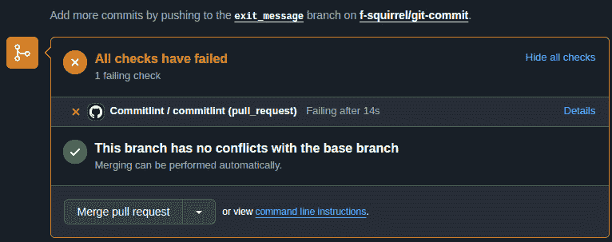
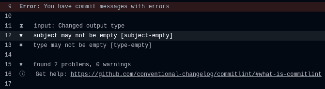
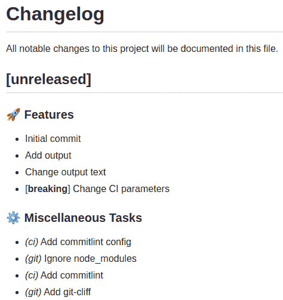
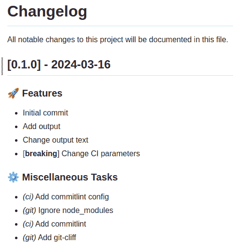
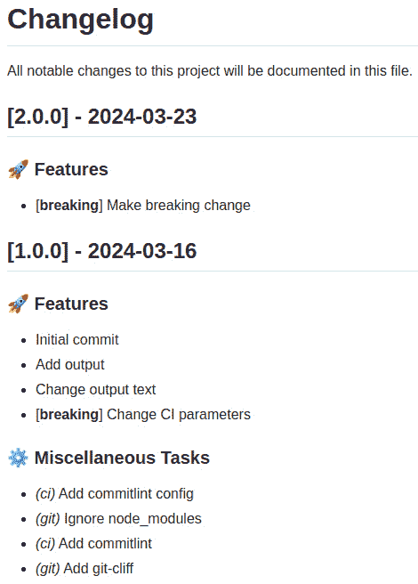

# 版本控制

在软件开发中，保持清晰的提交历史对于生产持久且连贯的代码至关重要。本章强调，一个良好的提交历史对于稳健的软件工程是基础性的。通过关注版本控制，特别是通过清晰的提交摘要和消息，我们将探讨实现清晰和精确所需的技术和有意为之的实践。

提交代码就像向项目开发的整体叙事中添加个别线索。每个提交，包括其摘要和消息，都为理解项目的历史和未来方向做出了贡献。保持清晰的提交历史不仅仅是组织上的整洁；它体现了开发者之间有效的沟通，促进了无缝的协作，并使快速导航项目开发历史成为可能。

在接下来的章节中，我们将探讨“良好的”提交的特点，重点关注为提交消息带来清晰性、目的性和实用性的属性。这一探索超越了基础层面，深入到代码变更的战略性文档和通过 Git 等工具获得的见解。通过示例，我们将看到精心构建的提交历史如何改变理解，帮助调试，并通过清晰地传达代码变更背后的理由来简化审查流程。

进一步推进，我们将解码常规提交规范，这是一个旨在标准化提交消息的结构化框架，从而赋予它们可预测性和机器可解析的清晰度。本节阐明了提交消息结构与自动化工具之间的共生关系，展示了遵守此类规范如何显著提高项目的可维护性。

随着我们前进，叙事展开，揭示了通过提交 linting 的视角来实施这些最佳实践的实际性。在这里，我们深入探讨自动化工具在**持续集成**（**CI**）工作流程中的集成，展示了这些机制如何作为提交质量的警觉守护者，确保一致性和符合既定规范。

本章不仅解释了版本控制的机制；它还邀请你将构建清晰的提交历史视为软件工艺的重要组成部分。通过遵循这里讨论的原则和实践，开发者和团队能够提高代码库的质量，并创造一个促进创新、协作和效率的环境。在我们探索本章时，请记住，清晰的提交历史反映了我们在软件开发中追求卓越的承诺。

# 什么是良好的提交？

有效的版本控制实践的核心在于“良好的提交”这一概念，它是变化的基本单元，体现了代码库中的清晰性、原子性和目的性原则。理解构成良好提交的要素对于力求保持项目历史清晰、可导航和富有信息性的开发者至关重要。本节深入探讨了定义提交质量的关键属性，并提供了开发者如何提升其版本控制实践的见解。

## 单一焦点原则

良好的提交遵循原子性原则，意味着它封装了代码库中的单个逻辑变更。这种单一焦点确保每个提交都具有独立的意义，并且可以通过回滚或调整单个提交来安全且轻松地回滚或修改项目。原子提交简化了代码审查过程，使团队成员更容易理解和评估每个变更，而无需处理无关的修改。例如，不应将新功能实现与单独的 bug 修复合并到一个提交中，而应将它们分成两个不同的提交，每个提交都有其明确的目的和范围。

## 沟通的艺术

良好提交的本质也在于其清晰性，尤其是在提交信息中表现得尤为明显。清晰的提交信息简洁地描述了变更的内容和原因，作为未来参考的简要文档。这种清晰性不仅限于团队内部，还帮助任何与代码库互动的人，包括新团队成员、外部合作者和未来的自己。当在长时间后重新访问代码库时，提交信息作为项目演变的记录尤为重要。这种方法对于开源项目至关重要，因为它允许贡献者理解变更的背景和理由，从而营造一个协作和包容的环境。

结构良好的提交信息通常包括一个简洁的标题行，总结变更内容，随后是一个空行，如果需要，可以是一个更详细的解释。解释可以深入到变更背后的理由，可能产生的影响，以及有助于理解提交目的的任何附加背景信息。建议将主题行控制在 50 个字符以内。这确保信息适合大多数终端的标准宽度，不会被 GitHub 或其他平台截断，并且易于扫描。GitHub 截断小于 72 个字符的主题行，因此 72 将是硬性限制，50 将是软性限制。例如，提交信息`feat: added a lots of needed include directives to make things compile properly`将被 GitHub 截断如下：


图 14.1 – 截断的提交信息

GitHub 会截断最后一个单词`properly`，为了阅读它，开发者必须点击提交消息。这并不是什么大问题，但这是一个可以通过保持主题行简短来避免的小不便。

更重要的是，这迫使作者简洁并直截了当。

其他有用的实践包括在主题行中使用祈使语气，这是提交消息中的常见约定。这意味着主题行应该以命令或指示的形式表达，例如“修复 bug”或“添加功能”。这种写作风格更直接，与提交代表对代码库应用更改的想法相一致。

不建议在主题行末尾使用句号，因为它不是一个完整的句子，并且不会有助于保持消息简短。提交消息的正文可以提供额外的上下文，例如变更的动机、解决的问题以及与实现相关的任何相关细节。

建议将正文包裹在 72 个字符以内，因为 Git 不会为你自动换行文本。这是一个常见的约定，它使得消息在各种环境中（如终端窗口、文本编辑器和版本控制工具）更易于阅读。这可以通过配置你的代码编辑器轻松实现。

因此，在最终确定提交之前花时间进行反思，不仅是为了确保消息的清晰性，而且是为了重申更改本身的价值和意图。这是一个确保代码库的每个贡献都是深思熟虑、有意义的并与项目目标一致的机会。从这个角度来看，花时间编写精确且信息丰富的提交消息不仅是一种良好的实践，也是开发者对质量和协作承诺的证明。

## 精益求精的艺术

在将功能分支合并到`main`分支之前，开发者考虑提交历史的整洁性和清晰性是明智的。合并中间提交是一个深思熟虑的实践，它简化了提交日志，使其对探索项目历史的任何人来说都更易于阅读和有意义。

当你即将集成你的工作成果时，花点时间反思一下开发过程中积累的提交消息。问问自己，每个提交消息是否为理解项目演变过程增加了价值，或者它只是用冗余或过于详细的细节使历史记录变得杂乱。在许多情况下，你为了达到最终解决方案所采取的迭代步骤（如微小的错误修复、对代码审查的响应调整或单元测试的纠正）可能对其他贡献者或未来的你并没有太大的价值。

考虑一个提交历史，其中包含诸如`修复错误`、`修复单元测试`或多个`修复 cr`条目之类的消息。虽然这些消息表明了开发过程，但并不一定提供对更改或它们对项目影响的深刻见解。将这些中间提交压缩成一个精心制作的单个提交不仅整理了提交日志，还确保历史记录中的每个条目都传达了项目开发中的一个重要步骤。

通过压缩提交，您可以将这些迭代更改整合成一个连贯的故事，突出新功能的引入、重大错误的解决或关键重构的实施。这种精心编排的历史记录有助于当前贡献者和未来的维护者导航和理解项目的进展，提高协作和效率。

总结来说，在合并之前，考虑项目提交历史的更广泛视角。压缩中间提交是一种正念的实践，确保提交日志始终是所有贡献者宝贵的可导航资源，以清晰简洁的方式封装每个更改的精髓。

# 传统的提交规范

在项目中的提交信息和结构上保持一致性，可以提高可读性和可预测性，使团队成员更容易导航项目历史。遵循预定义的格式或一组约定，如传统的提交规范，确保提交信息结构统一且信息丰富。这些可能包括以祈使语气开始的提交信息，指定更改类型（例如，`fix`、`feat`或`refactor`），以及可选地包括范围以阐明受影响的项目的哪个部分。

## 将代码与上下文联系起来

一个好的提交通过将代码更改与其更广泛的上下文联系起来，如项目问题跟踪系统中的票据或相关文档，从而增强了可追溯性。在提交信息中包含引用，在技术实现与其解决的问题或需求之间建立了有形的联系，有助于更好地理解和跟踪项目进度。

在提交信息中包含问题跟踪器 ID、票据编号或其他相关标识符可以显著提高更改的可追溯性和它们与项目目标或报告问题相关联的便捷性。它通常看起来类似于`fix(FP-1234)：修复了用户身份验证流程`，其中`FP-1234`是问题跟踪系统中的票据编号。

从本质上讲，一个好的提交在项目开发历史的更广泛叙事中充当一个连贯的、自包含的故事。通过遵循这些原则，开发者不仅有助于提高代码库的可维护性和可读性，而且促进了版本控制实践中严谨性和责任感的文化。通过有纪律地创建良好的提交，项目的历史成为协作、审查和理解软件演变的有价值资产。

创建良好的提交信息的一种最佳方式是遵循常规提交规范。常规提交规范作为一个结构化框架，用于提交信息格式化，旨在简化创建可读提交日志的过程，并使自动化工具能够促进版本管理和发布说明的生成。本规范定义了提交信息的标准化格式，旨在在版本控制系统（如 Git）中清楚地传达变更的性质和意图。

## 概述和意图

在其核心，常规提交规范规定了包括类型、可选范围和简洁描述的格式。格式通常遵循以下结构：

```cpp
<type>[optional scope]: <description>
[optional body]
[optional footer(s)]
```

类型根据引入变更的性质对提交进行分类，例如`feat`表示新功能或`fix`表示错误修复。范围虽然可选，但提供了额外的上下文信息，通常指示受变更影响的代码库部分。描述提供了变更的简洁总结，以祈使语气编写。

## 选项和用法

提交检查，尤其是在遵循常规提交规范时，确保提交以清晰、可预测和有用的方式结构化。以下是一些符合提交检查规则的提交示例，展示了在软件项目中可能发生的各种类型的变化：

+   添加新功能：

    ```cpp
    feat(authentication): add biometric authentication support
    ```

    此提交信息表明已添加新功能（具体为生物识别认证支持），并且该功能的范围在应用程序的认证模块内。

+   修复错误：

    ```cpp
    fix(database): resolve race condition in user data retrieval
    ```

    在这里，一个错误修复（`fix`）正在提交，解决`database`模块中的竞争条件问题，特别是在用户数据检索过程中。

+   改进文档：

    ```cpp
    docs(readme): update installation instructions
    ```

    此示例展示了文档更新（`docs`），包括对项目 README 文件的更改，以更新安装说明。

+   代码重构：

    ```cpp
    refactor(ui): simplify button component logic
    ```

    在这次提交中，现有代码已被重构（`refactor`），但没有添加任何新功能或修复任何错误。重构的范围是用户界面（UI），具体是简化了`button`组件中使用的逻辑。

+   样式调整：

    ```cpp
    style(css): remove unused CSS classes
    ```

    此提交信息表示一个样式变更（`style`），其中正在删除未使用的 CSS 类。值得注意的是，此类提交不会影响代码的功能。

+   添加测试：

    ```cpp
    test(api): add tests for new user endpoint
    ```

    在这里，为 API 中的新用户端点添加了新的测试（`test`），这表明项目测试覆盖率有所提升。

+   任务：

    ```cpp
    chore(build): update build script for deployment
    ```

    此提交代表一个任务（`chore`），通常是一个维护或设置任务，它不会直接修改源代码或添加功能，例如更新部署的构建脚本。

+   破坏性变更：

    ```cpp
    feat(database): change database schema for users table
    ```

    ```cpp
    BREAKING CHANGE: The database schema modification requires resetting the database. This change will affect all services interacting with the users table.
    ```

    另一种表示破坏性变更的方法是在提交信息中的类型和作用域之后但冒号之前添加一个感叹号（`!`）。这种方法简洁且视觉上明显：

    ```cpp
    feat!(api): overhaul authentication system
    ```

    此提交引入了一个与用户表数据库模式相关的新功能（`feat`），但也包括一个破坏性变更。

这些示例说明了由 Conventional Commits 规范指导的提交清理如何促进清晰、结构化和信息丰富的提交信息，从而增强项目的可维护性和协作。

## 源起和采用

Conventional Commits 规范的灵感来源于简化可读和自动化的变更日志的需求。它建立在 AngularJS 团队早期实践的基础上，并已被寻求标准化提交信息以改善项目可维护性和协作的多个开源和企业项目采用。

## Conventional Commits 的优势

遵循 Conventional Commits 规范提供了许多好处：

+   **自动化 Semver 处理**：通过分类提交，工具可以根据变化的语义意义自动确定版本升级，遵循 **语义版本控制**（**Semver**）原则。

+   **简化版发布说明**：通过解析结构化提交信息，自动化工具可以生成全面且清晰的发布说明和变更日志，显著减少手动工作并增强发布文档。

+   **增强可读性**：标准化的格式提高了提交历史记录的可读性，使开发者更容易导航和理解项目演变。

+   **促进代码审查**：清晰的分类和描述有助于代码审查过程，使审查者能够快速掌握变更的范围和意图。

# Commitlint – 强制执行提交信息标准

Commitlint 是一个强大且可配置的工具，旨在强制执行提交信息约定，确保项目提交历史的一致性和清晰性。它在维护一个干净、易读且富有意义的提交日志中起着至关重要的作用，尤其是在与如 Conventional Commits 规范等约定一起使用时。本节提供了如何安装、配置和使用 commitlint 检查本地提交信息的全面指南，从而培养对版本控制和协作的纪律性方法。

## 安装

Commitlint 通常通过 npm 安装，这是 Node.js 的包管理器。要开始，你需要在你的开发机器上安装 Node.js 和 npm。一旦设置好，你可以在项目根目录中运行以下命令来安装 commitlint 和其常规 `config` 包：

```cpp
npm install --save-dev @commitlint/{cli,config-conventional,prompt-cli}
```

此命令将 commitlint 和常规提交配置作为开发依赖项安装到你的项目中，使它们在本地开发环境中可用。

## 配置

安装后，commitlint 需要一个配置文件来定义它将强制执行的规则。配置 commitlint 最直接的方法是使用常规提交配置，这与常规提交规范相一致。在你的项目根目录中创建一个名为 `commitlint.config.js` 的文件，并添加以下内容：

```cpp
module.exports = {extends: ['@commitlint/config-conventional']};
```

此配置指示 commitlint 使用由常规提交配置提供的标准规则，包括对提交信息结构、类型和作用域的检查。

## 本地使用

要在本地检查提交信息，你可以使用与 Husky 结合的 commitlint，Husky 是一个用于管理 Git 钩子的工具。Husky 可以配置为在提交之前触发 commitlint 来评估提交信息，为开发者提供即时反馈。

首先，将 Husky 作为开发依赖项安装：

```cpp
npm install --save-dev husky
```

让我们使用 commitlint 检查本地提交：

```cpp
npx commitlint --from HEAD~1 --to HEAD --verbose
⧗   input: feat: add output
✔   found 0 problems, 0 warnings
```

在此示例中，`--from HEAD~1` 和 `--to HEAD` 指定了要检查的提交范围，而 `--verbose` 提供了详细的输出。如果提交信息不符合指定的规范，commitlint 将输出错误信息，指出需要解决的问题。

让我们添加一个糟糕的提交信息并使用 commitlint 检查它：

```cpp
git commit -m"Changed output type"
npx commitlint --from HEAD~1 --to HEAD --verbose
⧗   input: Changed output type
✖   subject may not be empty [subject-empty]
✖   type may not be empty [type-empty]
✖   found 2 problems, 0 warnings
ⓘ   Get help: https://github.com/conventional-changelog/commitlint/#what-is-commitlint
```

可以通过将以下配置添加到你的 `package.json` 文件中或创建一个包含相同内容的 `.huskyrc` 文件来将 commitlint 集成为 Git 钩子：

```cpp
"husky": {
  "hooks": {
    "commit-msg": "commitlint -E HUSKY_GIT_PARAMS"
  }
}
```

此配置设置了一个预提交钩子，它会在提交即将被提交时调用 commitlint。如果提交信息不符合指定的标准，commitlint 将拒绝提交，开发者需要相应地修改信息。

## 自定义规则

Commitlint 提供了广泛的配置和自定义选项，允许团队根据他们的特定项目需求和工作流程定制提交信息验证规则。这种灵活性确保了 commitlint 可以适应支持各种提交规范，而不仅仅是标准的常规提交格式，为在多样化的开发环境中强制执行一致且有意义的提交信息提供了一个强大的框架。

## 基本配置

Commitlint 的基本配置涉及在项目的根目录中设置一个 `commitlint.config.js` 文件。该文件作为定义 commitlint 将强制执行的规则和约定的中心点。在最简单的情况下，配置可能扩展一个预定义的规则集，例如由 `@commitlint/config-conventional` 提供的规则，如下所示：

```cpp
module.exports = {
  extends: ['@commitlint/config-conventional'],
};
```

此配置指示 commitlint 使用常规提交消息规则，强制执行提交消息的标准结构和类型集。

## 自定义规则配置

Commitlint 的真正力量在于其能够自定义规则以匹配特定项目需求的能力。commitlint 中的每个规则都由一个字符串键标识，并且可以使用一个数组进行配置，指定规则的级别、适用性和在某些情况下，附加选项或值。规则配置数组通常遵循以下格式 `[级别,` `适用性, 值]`：

+   `0` = 禁用，`1` = 警告，和 `2` = 错误）

+   `'always'` 或 `'never'`)

+   **值**：规则的附加参数或选项，根据规则而异

例如，为了强制提交消息必须以类型后跟冒号和空格开始，您可以按如下方式配置 `type-enum` 规则：

```cpp
module.exports = {
  rules: {
    'type-enum': [2, 'always', ['feat', 'fix', 'docs', 'style', 'refactor', 'test', 'chore']],
  },
};
```

此配置将规则级别设置为错误（`2`），指定规则应始终应用，并定义了提交消息的可接受类型列表。

## 作用域和主题配置

Commitlint 允许对提交消息的作用域和主题进行详细配置。例如，您可以强制执行特定的作用域或要求提交消息的主题不以句号结尾：

```cpp
module.exports = {
  rules: {
    'scope-enum': [2, 'always', ['ui', 'backend', 'api', 'docs']],
    'subject-full-stop': [2, 'never', '.'],
  },
};
```

此设置强制要求提交必须使用预定义的作用域之一，并且主题行不得以句号结尾。

## 自定义和共享配置

对于具有独特提交消息约定的项目或组织，可以定义自定义配置，并在需要时跨多个项目共享。您可以为您的 commitlint 配置创建一个专门的 npm 包，使团队能够轻松扩展此共享配置：

```cpp
// commitlint-config-myorg.js
module.exports = {
  rules: {
    // Custom rules here
  },
};
// In a project's commitlint.config.js
module.exports = {
  extends: ['commitlint-config-myorg'],
};
```

这种方法促进了项目之间的连贯性，并简化了组织内部提交消息规则的管理。

## 与 CI 集成

通过 CI 确保执行 Commitlint 是维护项目内高质量提交消息的关键实践。虽然本地 Git 钩子，如由 Husky 管理的钩子，通过在开发者的机器上检查提交消息提供了一道防线，但它们并非万无一失。开发者可能有意或无意地禁用 Git 钩子，**集成开发环境**（**IDEs**）或文本编辑器可能没有正确配置以强制执行这些钩子，或者可能遇到导致其故障的问题。

考虑到这些本地执行中的潜在差距，CI 充当了权威的真实来源，提供了一个集中、一致的平台，用于验证提交信息是否符合项目标准。通过将 commitlint 集成到 CI 管道中，项目确保每个提交，无论其来源或提交它的方法如何，在合并到主代码库之前都遵循定义的提交信息约定。这种基于 CI 的执行促进了纪律和责任感的氛围，确保所有贡献，无论其来源如何，都符合项目的质量标准。

### 使用 GitHub Actions 将 commitlint 集成到 CI 中

GitHub Actions 提供了一个简单而强大的平台，用于将 commitlint 集成到您的 CI 工作流程中。以下示例演示了如何设置 GitHub 操作，以使用 commitlint 在每次推送或针对`main`分支的 pull request 时强制执行提交信息标准。

首先，在您的仓库中的`.github/workflows/commitlint.yml`下创建一个新文件，内容如下：

```cpp
name: Commitlint
on:
  push:
    branches: [ main ]
  pull_request:
    branches: [ main ]
jobs:
  commitlint:
    runs-on: ubuntu-latest
    steps:
    - name: Check out code
      uses: actions/checkout@v3
      with:
        # Fetch at least the immediate parents so that if this is
        # a pull request then we can checkout the head.
        fetch-depth: 0
    - name: Check Commit Message
      uses: wagoid/commitlint-github-action@v5
      with:
        failOnWarnings: true
```

此工作流程定义了一个名为`commitlint`的作业，它在推送和 pull request 到`main`分支时触发。我想强调的唯一配置是`failOnWarnings: true`，它配置操作在遇到任何 commitlint 警告时失败。这确保了通过将警告视为与错误相同的严重性来严格遵循提交信息标准。

让我们创建一个糟糕的提交信息并打开一个 PR 来查看操作是如何工作的：

```cpp
git commit -m"Changed output type"
git checkout -b exit_message
git push origin exit_message
```

在我们打开一个 PR 之后，我们会看到操作失败了：



图 14.2 – Commitlint 操作失败

日志将以与本地检查相同的格式显示失败原因：



图 14.3 – Commitlint 操作日志失败

通过将此工作流程集成到您的项目中，您确保每个提交在成为`main`分支的一部分之前都会被仔细检查是否符合您的提交信息标准。这个基于 CI 的检查充当最后的守门人，强化了良好结构化提交信息的重要性，并维护了项目提交历史的完整性。

Commitlint 的可配置性和定制选项提供了一个强大的平台，用于执行针对项目或组织特定需求的提交信息标准。通过利用这些功能，团队可以确保他们的提交日志保持清晰、一致和有意义，从而提高项目的可维护性和协作性。无论是遵循广泛接受的约定，如常规提交规范，还是定义一组自定义规则，commitlint 都提供了维护高质量提交历史所需的灵活性和控制力。

# 生成变更日志

自动生成变更日志是一种方法，其中软件工具自动创建项目更改的日志，对更新、修复和功能进行分类和列出。这个过程因其效率和一致性而受到青睐，确保所有重大修改都得到系统性的记录。我们将通过 GitCliff 来探讨这个概念，GitCliff 是一个解析结构化提交消息以生成详细变更日志的工具，有助于透明的项目管理与沟通。GitCliff 在这个过程中所发挥的作用体现了其在自动化和简化项目文档任务中的作用。

## 安装

GitCliff 是用 Rust 编写的，可以使用 Rust 包管理器 Cargo 进行安装。要安装 GitCliff，请确保您的系统已安装 Rust 和 Cargo，然后运行以下命令：

```cpp
curl https://sh.rustup.rs -sSf | sh
```

安装 Rust 后，您可以使用 Cargo 安装 GitCliff：

```cpp
cargo install git-cliff
```

最后一步配置是将 GitCliff 初始化到您的项目中：

```cpp
git cliff --init
```

这将在您项目的根目录中生成一个默认配置文件，`.cliff.toml`。

## GitCliff 使用

安装并初始化 GitCliff 后，您可以在项目根目录中运行以下命令来生成变更日志：

```cpp
git cliff -o CHANGELOG.md
```

工具会生成一个包含变更日志的 Markdown 文件，如下所示：



图 14.4 – 生成变更日志

日志包含按类型分类的更改列表，并突出显示破坏性更改。

让我们添加一个发布标签并生成发布变更日志：

```cpp
git tag v1.0.0 HEAD
git cliff
```

现在的变更日志将包含发布标签和自上次发布以来的更改：



图 14.5 – 包含发布标签的生成变更日志

我们可以引入破坏性更改并提升版本：

```cpp
git commit -m"feat!: make breaking change"
git cliff --bump
```

如您所见，GitCliff 已经检测到破坏性更改并将版本提升到 2.0.0：



图 14.6 – 包含破坏性更改的生成变更日志

在前面的章节中，我们已经全面探讨了`git-cliff`的重要功能，揭示了它在自动化变更日志生成方面的巨大效用。这个工具不仅因其能够简化文档流程而脱颖而出，还因其与 CI 平台的无缝集成而著称，包括但不限于 GitHub。这种集成确保了变更日志与最新的项目发展保持一致，从而保持了项目文档的准确性和相关性。

git-cliff 的另一个同样值得注意的特性是它在生成变更日志方面提供的广泛定制功能。用户可以灵活地调整变更日志的格式、内容和展示方式，以满足特定项目需求或个人偏好。这种高度的可定制性确保了输出不仅与项目文档标准保持一致，而且还能提升项目文档标准。

考虑到 git-cliff 提供的功能深度和潜在好处，那些希望充分利用此工具的人被鼓励查阅官方文档。这个资源是一个信息宝库，涵盖了与 git-cliff 相关的所有功能、配置和最佳实践的广泛内容。与官方文档的互动不仅将巩固你对工具的理解，还将为你提供在项目中有效实施它的知识。

总结来说，在深入了解了 git-cliff 的主要功能和优势之后，那些希望将此工具集成到他们的开发工作流程中的人，应该通过彻底研究官方文档来继续前进。这次探索承诺将扩展你在使用 git-cliff 方面的熟练度，确保你能够充分利用其功能来增强你项目的变更日志生成和文档流程。

# 利用 git-bisect 进行错误查找

在软件开发的过程中，识别和修复错误的任务对于确保应用程序的稳定性和可靠性至关重要。在开发者可用的工具中，`git-bisect`因其专门用于隔离将错误引入代码库的提交的强大功能而脱颖而出。

Git 版本控制系统内嵌的`git-bisect`是一个基于二分搜索算法的实用工具。它帮助开发者筛选大量的提交历史，以确定导致回归或引入错误的精确变更。通过采用分而治之的策略，`git-bisect`显著简化了调试过程，使其成为故障排除的高效方法。

使用`git-bisect`的旅程从确定项目时间线中的两个关键点开始：一个已知没有错误的提交（称为`good`）和一个已知存在错误的提交（称为`bad`）。设置这些标记后，`git-bisect`将检查出位于`good`和`bad`提交之间的一个提交。这一步需要开发者测试当前应用程序的状态，以确定是否存在错误。

迭代过程涉及`git-bisect`根据开发者的反馈选择一个新的提交，并通过每次将搜索区域减半来不断缩小搜索范围。测试和反馈的循环继续进行，直到`git-bisect`成功隔离出引入错误的提交，有效地将注意力集中在根本原因上，并最小化手动审查。

`git-bisect`的效率在于其减少需要手动审查的提交数量的能力，从而节省宝贵的发展时间。其系统性的方法确保在识别有问题的提交时精确无误，这对于理解错误的上下文和制定有效的修复方案至关重要。作为 Git 生态系统的一部分，`git-bisect`无缝地融入开发者的现有工作流程，提供了一个熟悉且直观的调试界面。

为了优化`git-bisect`的有效性，使用一个可靠且准确的测试用例来评估每个提交至关重要。这确保了提供给`git-bisect`的反馈正确反映了错误的存不存在，从而防止误识别。保持干净且逻辑清晰的提交历史，其中每个提交封装一个单一的变化，可以增强工具的效率。此外，在可行的情况下，在`git-bisect`会话中自动化测试过程，可以加快错误搜索的进程。

考虑这样一个场景，一个之前运行正常的功能检测到回归。这种情况通常发生在某些测试只在夜间运行时发生。任务是使用`git-bisect`识别出导致这种回归的提交：

1.  使用`git` `bisect start`开始`bisect`会话。

1.  将存在错误的提交标记为`git bisect bad <commit hash>`（通常为`HEAD`）。

1.  确定一个过去功能正常的工作提交，并使用`git bisect good <commit-hash>`将其标记为`good`。

1.  然后`git-bisect`将检查位于`good`和`bad`提交中间的提交。测试这个提交以查看是否存在错误。

1.  根据测试结果，将提交标记为`good`或`bad`。`git-bisect`使用此反馈来缩小搜索范围，并选择一个新的提交进行测试。

1.  重复测试和标记过程，直到`git-bisect`识别出引入错误的提交。

一旦确定了有问题的提交，开发者可以检查该提交中引入的变化，以了解错误的起因，并继续开发修复方案。

为了演示其工作原理，我克隆了`rapidjson`库的 master 分支，引入了一个错误并将其放在本地仓库的中间。Git 日志如下，其中`Bad commit (6 hours ago) <f-squirrel>`是错误的提交：

```cpp
a85e2979 - (HEAD -> master) Add RAPIDJSON_BUILD_CXX20 option (6 hours ago) <Brian Rogers>
2cd6149d - fix Visual Studio 2022 (using /std:c++20) warning warning C5232: in C++20 this comparison ...
478cd636 - Bad commit (6 hours ago) <f-squirrel>
25edb27a - tests: Only run valgrind tests if valgrind was found (23 hours ago) <Richard W.M. Jones>
606791f6 - Fix static_cast in regex.h (23 hours ago) <Dylan Burr>
5f071d72 - Fix comparision of two doubles (23 hours ago) <Esther Wang>
060a09a1 - Fix schema regex preprocessor include logic (6 weeks ago) <Bryant Ferguson>
6089180e - Use correct format for printf (4 months ago) <Esther Wang>
...
```

让我们通过标记`good`和`bad`提交开始二分查找：

```cpp
$ git bisect start
$ git bisect bad HEAD
$ git bisect good 6089180e
Bisecting: 3 revisions left to test after this (roughly 2 steps)
[606791f6662c136ba34f842313b807114580852d] Fix static_cast in regex.h
```

我准备了一个脚本，用于检查当前提交中是否存在错误。该脚本名为`test.sh`，如下所示：

```cpp
cmake --build ./build -j $(nproc) || exit 1
./build/bin/unittest || exit 1
```

每次运行脚本时，我都会将提交标记为`good`或`bad`。经过几次迭代后，我找到了引入错误的提交：

```cpp
[  PASSED  ] 468 tests.
$ git bisect good
Bisecting: 1 revision left to test after this (roughly 1 step)
[478cd636a813abe76e32154544b0ec793fdc5566] Bad commit
```

如果我们再次运行测试脚本，我们会看到错误存在于以下提交中：

```cpp
[  FAILED  ] 2 tests, listed below:
[  FAILED  ] BigInteger.Constructor
[  FAILED  ] BigInteger.LeftShift
 2 FAILED TESTS
```

一旦我们完成错误搜索，可以使用`git` `bisect reset`重置`bisect`会话。

对于用户来说，在提交之间跳转是一个有用的功能，但并非唯一的功能。可以使用脚本自动化`git-bisect`，该脚本将运行测试并根据测试结果将提交标记为良好或不良。请注意，如果提交良好，脚本应返回`0`；如果提交不良，则返回`1`。脚本将一直运行，直到找到错误并将`bisect`会话重置。对于我们的仓库，它将如下所示：

```cpp
$ git bisect start
$ git bisect bad HEAD
$ git bisect good 6089180e
Bisecting: 3 revisions left to test after this (roughly 2 steps)
[606791f6662c136ba34f842313b807114580852d] Fix static_cast in regex.h
$ git bisect run ./test.sh
running  './test.sh'
... build and test output ...
[==========] 468 tests from 34 test suites ran. (321 ms total)
[  PASSED  ] 468 tests.
478cd636a813abe76e32154544b0ec793fdc5566 is the first bad commit
commit 478cd636a813abe76e32154544b0ec793fdc5566
Author: f-squirrel <dmitry.b.danilov@gmail.com>
Date:   Mon Mar 25 15:18:18 2024 +0200
    Bad commit
 include/rapidjson/internal/biginteger.h | 2 +-
 1 file changed, 1 insertion(+), 1 deletion(-)
bisect found first bad commit
```

`git-bisect`是 Git 套件中不可或缺的调试工具，提供了一种系统化和高效的识别导致错误提交的方法。将其集成到开发工作流程中，结合维护清晰的提交历史和采用自动化测试的实践，使其成为维护代码质量和稳定性的高度有效解决方案。

# 摘要

在本章关于版本控制的探讨中，我们深入了解了支撑有效软件版本管理的基本原则和实践。我们探索的核心是采用传统提交，这是一种结构化的提交信息方法，它提高了可读性并促进了提交日志的自动化处理。这种基于提交信息标准化格式的实践，使团队能够清晰、精确地传达变更的性质和意图。

我们还深入探讨了 SemVer，这是一种旨在以有意义的方式管理版本号的方法。基于代码库中变更的重要性，SemVer 的系统化版本管理方法提供了关于何时以及如何递增版本号的明确指南。这种方法为版本控制提供了一个透明的框架，确保了项目内和项目间的兼容性，并促进了有效的依赖关系管理。

本章还介绍了变更日志创建工具，特别关注 git-cliff，这是一个多功能的工具，可以从 Git 历史中自动生成详细和可定制的变更日志。这些工具简化了文档过程，确保项目利益相关者充分了解每个新版本引入的变化、功能和修复。

本章的大部分内容都致力于调试技术，突出了`git-bisect`在隔离错误过程中的实用性。通过其二分搜索算法，`git-bisect`使开发者能够高效地定位引入错误的提交，从而显著减少故障排除所需的时间和精力。

总结来说，本章全面概述了版本控制实践，强调了结构化提交信息、策略性版本管理、自动生成变更日志和高效调试技术的重要性。通过采用这些实践，开发团队能够增强协作，维护代码库的完整性，并确保交付高质量的软件。

在下一章中，我们将关注开发过程中的一个关键方面：代码审查。我们将探讨代码审查在确保代码质量、促进团队协作和提升整体生产力方面的重要性。通过了解进行彻底和建设性代码审查的最佳实践和有效策略，你将充分准备好提升你的代码库标准，并更有效地为团队的成功做出贡献。敬请期待，我们将开始这段探索代码审查艺术与科学的精彩旅程。
