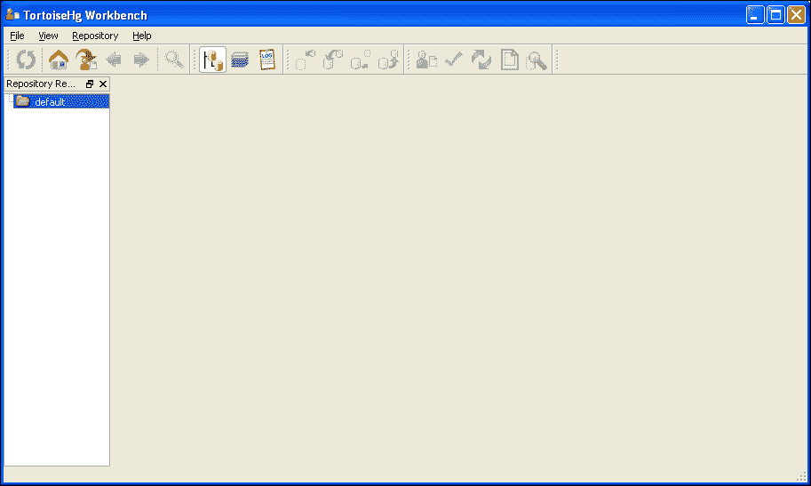
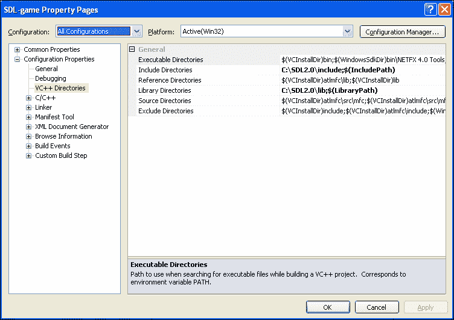
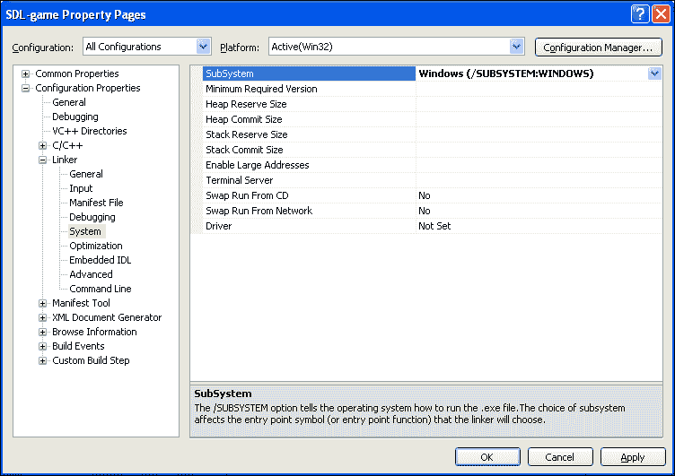
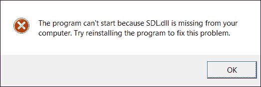
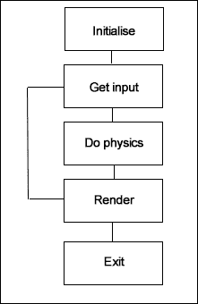

# 第一章. SDL 入门

**简单直接媒体层**（**SDL**）是一个由 Sam Oscar Latinga 创建的跨平台多媒体库。它提供了对输入（通过鼠标、键盘和游戏手柄/摇杆）、3D 硬件和 2D 视频帧缓冲区的低级访问。SDL 使用 C 编程语言编写，但具有对 C++ 的原生支持。该库还对 Pascal、Objective-C、Python、Ruby 和 Java 等几种其他语言提供了绑定；支持的语言完整列表可在 [`www.libsdl.org/languages.php`](http://www.libsdl.org/languages.php) 上找到。

SDL 已被用于许多商业游戏，包括《World of Goo》、《Neverwinter Nights》和《Second Life》。它也被用于诸如 ZSNES、Mupen64 和 VisualBoyAdvance 这样的模拟器。一些流行的游戏，如移植到 Linux 平台上的《Quake 4》、《Soldier of Fortune》和《Civilization: Call to Power》，以某种形式使用了 SDL。

SDL 不仅用于游戏。它对各种应用程序都很有用。如果你的软件需要访问图形和输入，那么 SDL 可能会非常有帮助。SDL 官方网站列出了使用该库创建的应用程序列表（[`www.libsdl.org/applications.php`](http://www.libsdl.org/applications.php)）。

在本章中，我们将涵盖以下内容：

+   从 Mercurial 仓库获取最新的 SDL 构建

+   在 Visual C++ 2010 Express 中构建和设置 SDL

+   使用 SDL 创建窗口

+   实现一个基本的游戏类

# 为什么使用 SDL？

每个平台都有其创建和显示窗口、处理用户输入以及访问任何底层硬件的独特方式；每种方式都有其复杂性以及语法。SDL 提供了一种统一的方式来访问这些特定平台的特性。这种一致性使得你花更多的时间调整游戏，而不是担心特定平台如何让你渲染或获取用户输入等问题。游戏编程可能相当困难，而拥有像 SDL 这样的库可以使你的游戏相对快速地启动和运行。

能够在 Windows 上编写游戏，然后将其编译到 OSX 或 Linux 上，而代码几乎不需要任何修改，这种能力非常强大，非常适合希望针对尽可能多的平台进行开发的开发者；SDL 使得这种跨平台开发变得轻而易举。虽然 SDL 对于跨平台开发非常有效，但它也是一个创建仅针对一个平台的游戏的绝佳选择，因为它易于使用且功能丰富。

SDL 拥有庞大的用户群体，并且正在积极地进行更新和维护。同时，还有一个响应迅速的社区以及一个有帮助的邮件列表。SDL 2.0 的文档是最新的，并且持续得到维护。访问 SDL 网站 [libsdl.org](http://libsdl.org)，可以找到大量的文章和信息，包括对文档、邮件列表和论坛的链接。

总体而言，SDL 为游戏开发提供了一个很好的起点，让你能够专注于游戏本身，而忽略你正在为哪个平台开发，直到完全必要。现在，随着 SDL 2.0 及其带来的新特性，SDL 已经成为使用 C++ 进行游戏开发的一个更强大的库。

### 注意

要了解 SDL 及其各种功能可以做什么，最好的方法是使用在 [`wiki.libsdl.org/moin.cgi/CategoryAPI`](http://wiki.libsdl.org/moin.cgi/CategoryAPI) 找到的文档。在那里，你可以看到 SDL 2.0 所有功能的列表以及各种代码示例。

## SDL 2.0 的新特性是什么？

本书将要介绍的 SDL 和 SDL 2.0 的最新版本仍在开发中。它为现有的 SDL 1.2 框架添加了许多新特性。SDL 2.0 路线图 ([wiki.libsdl.org/moin.cgi/Roadmap](http://wiki.libsdl.org/moin.cgi/Roadmap)) 列出了以下特性：

+   一个基于纹理的 3D 加速渲染 API

+   硬件加速 2D 图形

+   支持渲染目标

+   多窗口支持

+   支持剪贴板访问的 API

+   多输入设备支持

+   支持 7.1 音频

+   多音频设备支持

+   游戏手柄的力反馈 API

+   水平鼠标滚轮支持

+   多点触控输入 API 支持

+   音频捕获支持

+   多线程改进

虽然我们游戏编程冒险中不会使用所有这些特性，但其中一些是非常宝贵的，使得 SDL 成为开发游戏时更好的框架。我们将利用新的硬件加速 2D 图形，确保我们的游戏有出色的性能。

## 迁移 SDL 1.2 扩展

SDL 有独立的扩展，可以用来向库添加新功能。这些扩展最初没有被包含在内，是为了使 SDL 尽可能保持轻量级，扩展的作用是在必要时添加功能。下表展示了某些有用的扩展及其用途。这些扩展已经从 SDL1.2/3 版本更新，以支持 SDL 2.0，本书将介绍如何从各自的仓库克隆和构建它们，当需要时。

| 名称 | 描述 |
| --- | --- |
| `SDL_image` | 这是一个支持 BMP、GIF、PNG、TGA、PCX 等图像文件加载的库。 |
| `SDL_net` | 这是一个跨平台网络库。 |
| `SDL_mixer` | 这是一个音频混音库。它支持 MP3、MIDI 和 OGG。 |
| `SDL_ttf` | 这是一个支持在 SDL 应用中使用 `TrueType` 字体的库。 |
| `SDL_rtf` | 这是一个支持渲染富文本格式（**RTF**）的库。 |

# 在 Visual C++ Express 2010 中设置 SDL

本书将介绍在微软的 Visual C++ Express 2010 IDE 中设置 SDL 2.0。选择这个 IDE 是因为它可以在网上免费使用，并且在游戏行业中是一个广泛使用的开发环境。应用程序可在 [`www.microsoft.com/visualstudio/en-gb/express`](https://www.microsoft.com/visualstudio/en-gb/express) 获取。一旦安装了 IDE，我们就可以继续下载 SDL 2.0。如果您不是在 Windows 上开发游戏，则可以修改这些说明以适应您选择的 IDE，使用其特定的步骤来链接库和包含文件。

SDL 2.0 仍在开发中，因此目前还没有官方发布版本。库可以通过两种不同的方式检索：

+   一种方法是下载正在构建的快照；然后您可以将它链接起来构建您的游戏（最快的选择）

+   第二种方法是使用 mercurial 分布式源控制克隆最新源并从头开始构建（跟踪库最新发展的好方法）

这两个选项均可在 [`www.libsdl.org/hg.php`](http://www.libsdl.org/hg.php) 找到。

在 Windows 上构建 SDL 2.0 还需要最新的 DirectX SDK，它可在 [`www.microsoft.com/en-gb/download/details.aspx?id=6812`](http://www.microsoft.com/en-gb/download/details.aspx?id=6812) 获取，因此请确保首先安装它。

## 使用 Mercurial 在 Windows 上获取 SDL 2.0

直接从不断更新的仓库获取 SDL 2.0 是确保您拥有 SDL 2.0 的最新构建版本并利用任何当前错误修复的最佳方式。要在 Windows 上下载和构建 SDL 2.0 的最新版本，我们必须首先安装一个 mercurial 版本控制客户端，以便我们可以镜像最新的源代码并从中构建。有各种命令行工具和 GUI 可用于与 mercurial 一起使用。我们将使用 TortoiseHg，这是一个免费且用户友好的 mercurial 应用程序；它可在 [tortoisehg.bitbucket.org](http://tortoisehg.bitbucket.org) 获取。一旦安装了应用程序，我们就可以继续获取最新的构建。

### 从仓库克隆和构建最新的 SDL 2.0 仓库

按照以下步骤从仓库直接克隆和构建 SDL 的最新版本相对简单：

1.  打开 **TortoiseHg 工作台** 窗口。

1.  按 *Ctrl* + *Shift* + *N* 将打开克隆对话框。

1.  输入仓库的源；在这个例子中，它列在 SDL 2.0 网站上，网址为 [`hg.libsdl.org/SDL`](http://hg.libsdl.org/SDL)。

1.  输入或浏览以选择克隆仓库的目的地——本书将假设 `C:\SDL2` 被设置为位置。

1.  点击 **克隆** 并允许仓库复制到所选位置。

1.  在`C:\SDL2`目录下将有一个`VisualC`文件夹；在文件夹内部有一个 Visual C++ 2010 解决方案，我们必须使用 Visual C++ Express 2010 打开它。

1.  Visual C++ Express 可能会抛出一些关于 Express 版本不支持解决方案文件夹的错误，但可以安全忽略，而不会影响我们构建库的能力。

1.  将当前构建配置更改为发布，并根据您的操作系统选择 32 位或 64 位。

1.  右键单击**解决方案资源管理器**列表中名为**SDL**的项目，并选择**构建**。

1.  现在我们有了 SDL 2.0 库的构建版本可以使用。它将位于`C:\SDL2\VisualC\SDL\Win32(or x64)\Release\SDL.lib`。

1.  我们还需要构建 SDL 主库文件，因此在**解决方案资源管理器**列表中选择它并构建它。此文件将构建到`C:\SDL2\VisualC\SDLmain\Win32(or x64)\Release\SDLmain.lib`。

1.  在`C:\SDL2`中创建一个名为`lib`的文件夹，并将`SDL.lib`和`SDLmain.lib`复制到这个新创建的文件夹中。

## 我已经有了库；现在该做什么？

现在可以创建一个 Visual C++ 2010 项目，并将其链接到 SDL 库。以下是涉及的步骤：

1.  在 Visual C++ express 中创建一个新的空项目，并给它起一个名字，例如`SDL-game`。

1.  创建完成后，右键单击**解决方案资源管理器**列表中的项目，并选择**属性**。

1.  将配置下拉列表更改为**所有配置**。

1.  在**VC++目录**下，点击**包含目录**。一个小箭头将允许下拉菜单；点击**<编辑…**>。

1.  双击框内创建一个新位置。您可以在其中键入或浏览到`C:\SDL2.0\include`，然后点击**确定**。

1.  接下来，在库目录下做同样的事情，这次传递你创建的`lib`文件夹（`C:\SDL2\lib`）。

1.  接下来，导航到**链接器**标题；在标题内部将有一个**输入**选项。在**附加依赖项**中输入`SDL.lib SDLmain.lib`：

1.  导航到**系统**标题，并将**子系统**标题设置为**Windows(/SUBSYSTEM:WINDOWS)**。

1.  点击**确定**，我们就完成了。

# Hello SDL

现在我们有一个空的项目，它链接到了 SDL 库，所以是时候开始我们的 SDL 开发了。点击**源文件**，并使用键盘快捷键*Ctrl* + *Shift* + *A*添加一个新项。创建一个名为`main.cpp`的 C++文件。创建此文件后，将以下代码复制到源文件中：

```cpp
#include<SDL.h>

SDL_Window* g_pWindow = 0;
SDL_Renderer* g_pRenderer = 0;

int main(int argc, char* args[])
{
  // initialize SDL
  if(SDL_Init(SDL_INIT_EVERYTHING) >= 0)
  {
    // if succeeded create our window
    g_pWindow = SDL_CreateWindow("Chapter 1: Setting up SDL", 
    SDL_WINDOWPOS_CENTERED, SDL_WINDOWPOS_CENTERED,
    640, 480, 
    SDL_WINDOW_SHOWN);

    // if the window creation succeeded create our renderer
    if(g_pWindow != 0)
    {
      g_pRenderer = SDL_CreateRenderer(g_pWindow, -1, 0);
    }
  }
  else
  {
    return 1; // sdl could not initialize
  }

  // everything succeeded lets draw the window

  // set to black // This function expects Red, Green, Blue and 
  //  Alpha as color values
  SDL_SetRenderDrawColor(g_pRenderer, 0, 0, 0, 255);

  // clear the window to black
  SDL_RenderClear(g_pRenderer);

  // show the window
  SDL_RenderPresent(g_pRenderer);

  // set a delay before quitting
  SDL_Delay(5000);

  // clean up SDL
  SDL_Quit();

  return 0;
}
```

我们现在可以尝试构建我们的第一个 SDL 应用程序。右键单击项目并选择**构建**。将会有一个关于找不到`SDL.dll`文件的错误：



尝试构建应该在项目目录内创建一个`Debug`或`Release`文件夹（通常位于 Visual Studio 下的`Documents`文件夹中）。这个文件夹包含我们尝试构建的`.exe`文件；我们需要将`SDL.dll`文件添加到这个文件夹中。`SDL.dll`文件位于`C:\SDL2\VisualC\SDL\Win32`（或`x64`）\Release\SDL.dll。当你想要将你的游戏分发到另一台计算机时，你将不得不分享这个文件以及可执行文件。在你将`SDL.dll`文件添加到可执行文件文件夹后，项目现在将编译并显示一个 SDL 窗口；等待 5 秒钟然后关闭。

## Hello SDL 的概述

让我们来看一下`Hello SDL`的代码：

1.  首先，我们包含了`SDL.h`头文件，以便我们可以访问 SDL 的所有函数：

    ```cpp
    #include<SDL.h>
    ```

1.  下一步是创建一些全局变量。一个是`SDL_Window`函数的指针，它将通过`SDL_CreateWindow`函数来设置。另一个是`SDL_Renderer`对象的指针；通过`SDL_CreateRenderer`函数来设置：

    ```cpp
    SDL_Window* g_pWindow = 0;
    SDL_Renderer* g_pRenderer = 0;
    ```

1.  我们现在可以初始化 SDL。这个例子使用`SDL_INIT_EVERYTHING`标志初始化了 SDL 的所有子系统，但这并不总是必须的（见 SDL 初始化标志）：

    ```cpp
    int main(int argc, char* argv[])
    {
      // initialize SDL
      if(SDL_Init(SDL_INIT_EVERYTHING) >= 0)
       {
    ```

1.  如果 SDL 初始化成功，我们可以创建指向我们的窗口的指针。`SDL_CreateWindow`返回一个指向匹配传递参数的窗口的指针。参数是窗口标题、窗口的*x*位置、窗口的*y*位置、宽度、高度以及任何所需的`SDL_flags`（我们将在本章后面介绍这些）。`SDL_WINDOWPOS_CENTERED`将使窗口相对于屏幕居中：

    ```cpp
    // if succeeded create our window
    g_pWindow = SDL_CreateWindow("Chapter 1: Setting up SDL", SDL_WINDOWPOS_CENTERED, SDL_WINDOWPOS_CENTERED, 640, 480, SDL_WINDOW_SHOWN);
    ```

1.  现在我们可以检查窗口创建是否成功，如果是的话，继续设置指向我们的渲染器的指针，传递我们想要渲染器使用的窗口作为参数；在我们的例子中，是新建的`g_pWindow`指针。传递的第二个参数是初始化的渲染驱动程序的索引；在这种情况下，我们使用`-1`来使用第一个可用的驱动程序。最后一个参数是`SDL_RendererFlag`（见 SDL 渲染器标志）：

    ```cpp
    // if the window creation succeeded create our renderer
    if(g_pWindow != 0)
    {
      g_pRenderer = SDL_CreateRenderer(g_pWindow, -1, 0);
    }
    else
    {
      return 1; // sdl could not initialize
    }
    ```

1.  如果一切顺利，我们现在可以创建并显示我们的窗口：

    ```cpp
    // everything succeeded lets draw the window

      // set to black
    SDL_SetRenderDrawColor(g_pRenderer, 0, 0, 0, 255);

       // clear the window to black
    SDL_RenderClear(g_pRenderer);

       // show the window
    SDL_RenderPresent(g_pRenderer);

       // set a delay before quitting
    SDL_Delay(5000);

       // clean up SDL
    SDL_Quit();
    ```

## SDL 初始化标志

事件处理、文件 I/O 和线程子系统在 SDL 中默认初始化。其他子系统可以使用以下标志进行初始化：

| 标志 | 初始化的子系统 |
| --- | --- |
| `SDL_INIT_HAPTIC` | 力反馈子系统 |
| `SDL_INIT_AUDIO` | 音频子系统 |
| `SDL_INIT_VIDEO` | 视频子系统 |
| `SDL_INIT_TIMER` | 计时器子系统 |
| `SDL_INIT_JOYSTICK` | 游戏手柄子系统 |
| `SDL_INIT_EVERYTHING` | 所有子系统 |
| `SDL_INIT_NOPARACHUTE` | 不捕获致命信号 |

我们也可以使用位运算符（`|`）来初始化多个子系统。要仅初始化音频和视频子系统，我们可以使用对`SDL_Init`的调用，例如：

```cpp
SDL_Init(SDL_INIT_AUDIO | SDL_INIT_VIDEO);
```

检查一个子系统是否已初始化可以通过调用`SDL_WasInit()`函数来完成：

```cpp
if(SDL_WasInit(SDL_INIT_VIDEO) != 0)
{
  cout << "video was initialized";
}
```

## SDL 渲染器标志

当初始化 `SDL_Renderer` 标志时，我们可以传递一个标志来决定其行为。以下表格描述了每个标志的目的：

| 标志 | 目的 |
| --- | --- |
| `SDL_RENDERER_SOFTWARE` | 使用软件渲染 |
| `SDL_RENDERER_ACCELERATED` | 使用硬件加速 |
| `SDL_RENDERER_PRESENTVSYNC` | 将渲染器更新与屏幕刷新率同步 |
| `SDL_RENDERER_TARGETTEXTURE` | 支持渲染到纹理 |

# 构成游戏的因素

除了游戏的设计和玩法之外，底层机制基本上是各种子系统的交互，如图形、游戏逻辑和用户输入。图形子系统不应该知道游戏逻辑是如何实现的，反之亦然。我们可以将游戏的结构想象如下：



一旦游戏初始化，它就会进入一个循环，检查用户输入，根据游戏物理更新任何值，然后渲染到屏幕上。一旦用户选择退出，循环就会中断，游戏就会进入清理一切并退出的阶段。这是游戏的基本框架，也是本书中将使用的内容。

我们将构建一个可重用的框架，它将消除在 SDL 2.0 中创建游戏的所有繁琐工作。当涉及到样板代码和设置代码时，我们真的只想写一次，然后在新的项目中重用它。绘图代码、事件处理、地图加载、游戏状态以及所有游戏可能需要的其他内容也是如此。我们将从将 Hello SDL 2.0 示例分解成单独的部分开始。这将帮助我们开始思考如何将代码分解成可重用的独立块，而不是将所有内容都打包到一个大文件中。

## 分解 Hello SDL 代码

我们可以将 Hello SDL 分解成单独的函数：

```cpp
bool g_bRunning = false; // this will create a loop
```

按照以下步骤分解 `Hello SDL` 代码：

1.  在两个全局变量之后创建一个 `init` 函数，它接受任何必要的值作为参数并将它们传递给 `SDL_CreateWindow` 函数：

    ```cpp
    bool init(const char* title, int xpos, int ypos, int 
    height, int width, int flags)
    {
      // initialize SDL
      if(SDL_Init(SDL_INIT_EVERYTHING) >= 0)
      {
        // if succeeded create our window
        g_pWindow = SDL_CreateWindow(title, xpos, ypos, 
        height, width, flags);

        // if the window creation succeeded create our 
        renderer
        if(g_pWindow != 0)
        {
          g_pRenderer = SDL_CreateRenderer(g_pWindow, -1, 0);
        }
      }
      else
      {
        return false; // sdl could not initialize
      }

      return true;
    }

    void render()
    {
      // set to black
      SDL_SetRenderDrawColor(g_pRenderer, 0, 0, 0, 255);

      // clear the window to black
      SDL_RenderClear(g_pRenderer);

      // show the window
      SDL_RenderPresent(g_pRenderer);
    }
    ```

1.  我们的主函数现在可以使用这些函数来初始化 SDL：

    ```cpp
    int main(int argc, char* argv[])
    {
      if(init("Chapter 1: Setting up SDL", 
      SDL_WINDOWPOS_CENTERED, SDL_WINDOWPOS_CENTERED, 640, 
      480, SDL_WINDOW_SHOWN))
      {
        g_bRunning = true;
      }
      else
      {
        return 1; // something's wrong
      }

      while(g_bRunning)
      {
        render();
      }

      // clean up SDL
      SDL_Quit();

      return 0;
    }
    ```

如您所见，我们已经将代码分解成单独的部分：一个函数为我们执行初始化，另一个执行渲染代码。我们添加了一种方式来保持程序运行，即一个持续运行的 `while` 循环，渲染我们的窗口。

让我们更进一步，尝试确定一个完整游戏可能包含哪些单独的部分以及我们的主循环可能看起来像什么。参考第一张截图，我们可以看到我们需要的功能是 `initialize`、`get input`、`do physics`、`render` 和 `exit`。我们将稍微泛化这些函数并将它们重命名为 `init()`、`handleEvents()`、`update()`、`render()` 和 `clean()`。让我们将这些函数放入 `main.cpp`：

```cpp
void init(){}
void render(){}
void update(){}
void handleEvents(){}
void clean(){}

bool g_bRunning = true;

int main()
{
  init();

  while(g_bRunning)
  {
    handleEvents();
    update();
    render();
  }

  clean();
}
```

## 这段代码做了什么？

这段代码目前并没有做太多，但它展示了游戏的基本结构和主循环可能被拆分的方式。我们声明了一些可以用来运行我们的游戏的功能：首先，`init()` 函数，它将初始化 SDL 并创建我们的窗口；其次，我们声明了核心循环函数 `render`、`update` 和 `handle events`。我们还声明了一个 `clean` 函数，它将在游戏结束时清理代码。我们希望这个循环持续运行，所以我们设置了一个布尔值，将其设置为 `true`，这样我们就可以连续调用我们的核心循环函数。

# 游戏类

因此，现在我们已经了解了构成游戏的基本要素，我们可以按照以下步骤将这些函数分离到它们自己的类中：

1.  在项目中创建一个名为 `Game.h` 的新文件：

    ```cpp
    #ifndef __Game__
    #define __Game__

    class Game
    {
    };

    #endif /* defined(__Game__) */
    ```

1.  接下来，我们可以将我们的函数从 `main.cpp` 文件移动到 `Game.h` 头文件中：

    ```cpp
    class Game
    {
    public:

      Game() {}
      ~Game() {}

      // simply set the running variable to true
      void init() { m_bRunning = true; }    

      void render(){}
      void update(){}
      void handleEvents(){}
      void clean(){}

      // a function to access the private running variable 
      bool running() { return m_bRunning; }

    private:

      bool m_bRunning;
    };
    ```

1.  现在，我们可以修改 `main.cpp` 文件以使用这个新的 `Game` 类：

    ```cpp
    #include "Game.h"

    // our Game object
    Game* g_game = 0;

    int main(int argc, char* argv[])
    {
      g_game = new Game();

      g_game->init("Chapter 1", 100, 100, 640, 480, 0);

      while(g_game->running())
      {
        g_game->handleEvents();
        g_game->update();
        g_game->render();
      }
      g_game->clean();

      return 0;
    }
    ```

    我们的 `main.cpp` 文件现在不声明或定义这些函数；它只是创建 `Game` 的一个实例并调用所需的方法。

1.  现在我们有了这个骨架代码，我们可以继续将其与 SDL 集成以创建窗口；我们还将添加一个小的事件处理器，以便我们可以退出应用程序而不是强制它退出。我们将稍微修改我们的 `Game.h` 文件，以便我们可以添加一些 SDL 特定内容，并允许我们使用实现文件而不是在头文件中定义函数：

    ```cpp
    #include "SDL.h"

    class Game
    {
    public:

      Game();
      ~Game();

      void init();

      void render();
      void update();
      void handleEvents();
      void clean();

      bool running() { return m_bRunning; }

    private:

      SDL_Window* m_pWindow;
      SDL_Renderer* m_pRenderer;

      bool m_bRunning;
    };
    ```

回顾本章的第一部分（我们创建了一个 SDL 窗口），我们知道我们需要一个指向 `SDL_Window` 对象的指针，该对象在调用 `SDL_CreateWindow` 时设置，以及一个指向由将窗口传递给 `SDL_CreateRenderer` 创建的 `SDL_Renderer` 对象的指针。`init` 函数可以扩展以使用与初始示例相同的参数。这个函数现在将返回一个布尔值，这样我们就可以检查 SDL 是否正确初始化：

```cpp
bool init(const char* title, int xpos, int ypos, int width, int height, int flags);
```

我们现在可以在项目中创建一个新的实现文件 `Game.cpp`，以便我们可以为这些函数创建定义。我们可以从 *Hello SDL* 部分取代码并添加到我们新的 `Game` 类中。

打开 `Game.cpp` 文件，我们可以开始添加一些功能：

1.  首先，我们必须包含我们的 `Game.h` 头文件：

    ```cpp
    #include "Game.h"
    ```

1.  接下来，我们可以定义我们的 `init` 函数；它基本上与我们在 `main.cpp` 文件中之前编写的 `init` 函数相同：

    ```cpp
    bool Game::init(const char* title, int xpos, int ypos, int width, int height, int flags)
    {
      // attempt to initialize SDL
      if(SDL_Init(SDL_INIT_EVERYTHING) == 0)
      {
        std::cout << "SDL init success\n";
        // init the window
        m_pWindow = SDL_CreateWindow(title, xpos, ypos, 
        width, height, flags);

        if(m_pWindow != 0) // window init success
        {
          std::cout << "window creation success\n";
          m_pRenderer = SDL_CreateRenderer(m_pWindow, -1, 0);

          if(m_pRenderer != 0) // renderer init success
          {
            std::cout << "renderer creation success\n";
            SDL_SetRenderDrawColor(m_pRenderer, 
            255,255,255,255);
          }
          else
          {
            std::cout << "renderer init fail\n";
            return false; // renderer init fail
          }
        }
        else
        {
          std::cout << "window init fail\n";
          return false; // window init fail
        }
      }
      else
      {
        std::cout << "SDL init fail\n";
        return false; // SDL init fail
      }

      std::cout << "init success\n";
      m_bRunning = true; // everything inited successfully, 
      start the main loop

      return true;
    }
    ```

1.  我们还将定义 `render` 函数。它清除渲染器，然后使用清除颜色重新渲染：

    ```cpp
    void Game::render()
    {
      SDL_RenderClear(m_pRenderer); // clear the renderer to 
      the draw color

      SDL_RenderPresent(m_pRenderer); // draw to the screen
    }
    ```

1.  最后，我们可以进行清理。我们销毁窗口和渲染器，并调用 `SDL_Quit` 函数来关闭所有子系统：

    ```cpp
    {
      std::cout << "cleaning game\n";
      SDL_DestroyWindow(m_pWindow);
      SDL_DestroyRenderer(m_pRenderer);
      SDL_Quit();
    }
    ```

因此，我们将 `Hello SDL 2.0` 代码从 `main.cpp` 文件移动到了一个名为 `Game` 的类中。我们使 `main.cpp` 文件空闲出来，只处理 `Game` 类；它对 SDL 或 `Game` 类的实现一无所知。让我们给这个类添加一个功能，以便我们能够以常规方式关闭应用程序：

```cpp
void Game::handleEvents()
{
  SDL_Event event;
  if(SDL_PollEvent(&event))
  {
    switch (event.type)
    {
      case SDL_QUIT:
        m_bRunning = false;
      break;

      default:
      break;
    }
  }
}
```

我们将在后续章节中更详细地介绍事件处理。现在这个函数所做的就是检查是否有事件需要处理，如果有，就检查它是否是 `SDL_QUIT` 事件（通过点击窗口上的叉号来关闭窗口）。如果事件是 `SDL_QUIT`，我们将 `Game` 类的 `m_bRunning` 成员变量设置为 `false`。将此变量设置为 `false` 使得主循环停止，应用程序进入清理和退出阶段：

```cpp
void Game::clean()
{
  std::cout << "cleaning game\n";
  SDL_DestroyWindow(m_pWindow);
  SDL_DestroyRenderer(m_pRenderer);
  SDL_Quit();
}
```

`clean()` 函数销毁窗口和渲染器，然后调用 `SDL_Quit()` 函数，关闭所有初始化的 SDL 子系统。

### 注意

为了能够查看我们的 `std::cout` 消息，我们首先必须包含 `Windows.h`，然后调用 `AllocConsole();` 和 `freopen("CON", "w", stdout);`。你可以在 `main.cpp` 文件中这样做。只需记住在分享你的游戏时将其移除。

## 全屏 SDL

`SDL_CreateWindow` 函数接受一个类型为 `SDL_WindowFlags` 的枚举值。这些值决定了窗口的行为。我们在 `Game` 类中创建了一个 `init` 函数：

```cpp
bool init(const char* title, int xpos, int ypos, int width, int height, int flags);
```

最后一个参数是一个 `SDL_WindowFlags` 值，然后在初始化时传递给 `SDL_CreateWindow` 函数：

```cpp
// init the window
m_pWindow = SDL_CreateWindow(title, xpos, ypos, width, height, flags);
```

这里是 `SDL_WindowFlags` 函数的表格：

| 标志 | 目的 |
| --- | --- |
| `SDL_WINDOW_FULLSCREEN` | 使窗口全屏 |
| `SDL_WINDOW_OPENGL` | 窗口可以作为 OpenGL 上下文使用 |
| `SDL_WINDOW_SHOWN` | 窗口是可见的 |
| `SDL_WINDOW_HIDDEN` | 隐藏窗口 |
| `SDL_WINDOW_BORDERLESS` | 窗口无边框 |
| `SDL_WINDOW_RESIZABLE` | 允许调整窗口大小 |
| `SDL_WINDOW_MINIMIZED` | 最小化窗口 |
| `SDL_WINDOW_MAXIMIZED` | 最大化窗口 |
| `SDL_WINDOW_INPUT_GRABBED` | 窗口已捕获输入焦点 |
| `SDL_WINDOW_INPUT_FOCUS` | 窗口拥有输入焦点 |
| `SDL_WINDOW_MOUSE_FOCUS` | 窗口拥有鼠标焦点 |
| `SDL_WINDOW_FOREIGN` | 窗口不是使用 SDL 创建的 |

让我们将 `SDL_WINDOW_FULLSCREEN` 传递给 `init` 函数，并测试一下全屏的 SDL。打开 `main.cpp` 文件并添加此标志：

```cpp
g_game->init("Chapter 1", 100, 100, 640, 580, SDL_WINDOW_FULLSCREEN))
```

再次构建应用程序，你应该会看到窗口已全屏。要退出应用程序，必须强制退出（Windows 上的 *Alt* + *F4*）；我们将在后续章节中能够使用键盘退出应用程序，但现在我们不需要全屏。我们在这里遇到的一个问题是，我们已经将一些 SDL 特定的内容添加到了 `main.cpp` 文件中。虽然我们在这本书中不会使用任何其他框架，但在将来我们可能想使用另一个。我们可以移除这个 SDL 特定的标志，并用一个布尔值替换，以表示我们是否想要全屏。

将我们 `Game init` 函数中的 `int flags` 参数替换为 `boolfullscreen` 参数：

+   `Game.h` 的代码片段：

    ```cpp
    bool init(const char* title, int xpos, int ypos, int width, int height, bool fullscreen);
    ```

+   `Game.cpp` 的代码片段：

    ```cpp
    bool Game::init(const char* title, int xpos, int ypos, int width, int height, bool fullscreen)
    {
      int flags = 0;

      if(fullscreen)
      {
        flags = SDL_WINDOW_FULLSCREEN;
      }
    }
    ```

我们创建一个 `int` 类型的 `flags` 变量，将其传递给 `SDL_CreateWindow` 函数；如果我们已将 `fullscreen` 设置为 `true`，则此值将被设置为 `SDL_WINDOW_FULLSCREEN` 标志，否则它将保持为 `0`，表示没有使用任何标志。现在让我们在我们的 `main.cpp` 文件中测试一下：

```cpp
if(g_game->init("Chapter 1", 100, 100, 640, 480, true))
```

这将再次将我们的窗口设置为全屏，但我们不会使用 SDL 特定的标志来完成它。再次将其设置为 `false`，因为我们暂时不需要全屏。您可以自由尝试其他标志，看看它们会产生什么效果。

# 摘要

本章涵盖了大量的内容。我们学习了 SDL 是什么以及为什么它是游戏开发的伟大工具。我们探讨了游戏的整体结构以及如何将其分解成单独的部分，并通过创建一个可以用来初始化 SDL 并将内容渲染到屏幕上的 `Game` 类来开始构建我们框架的骨架。我们还简要地了解了 SDL 通过监听 `quit` 事件来处理事件的方式，以关闭我们的应用程序。在下一章中，我们将探讨在 SDL 中绘图以及构建 `SDL_image` 扩展。
