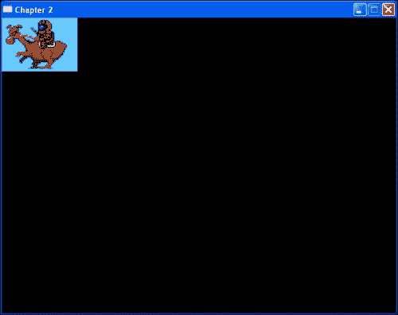
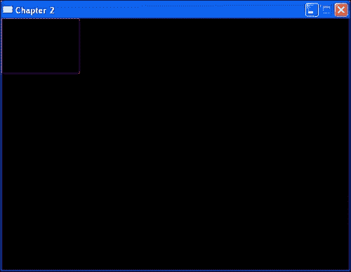
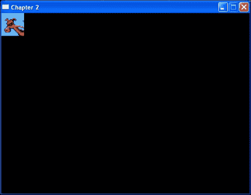
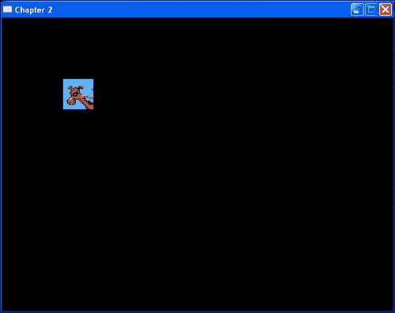
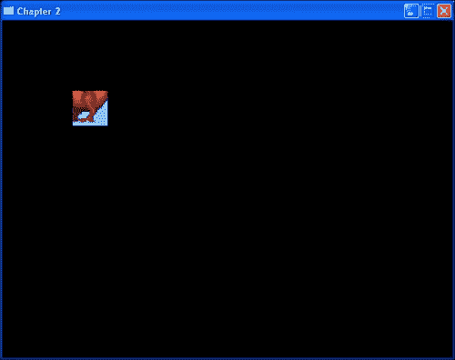
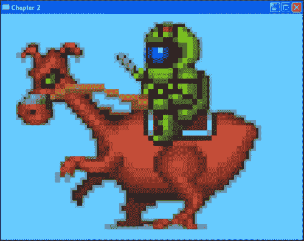
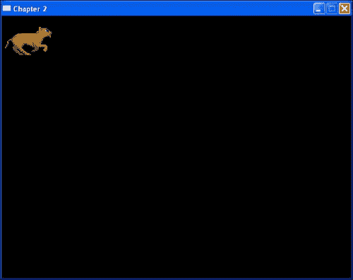
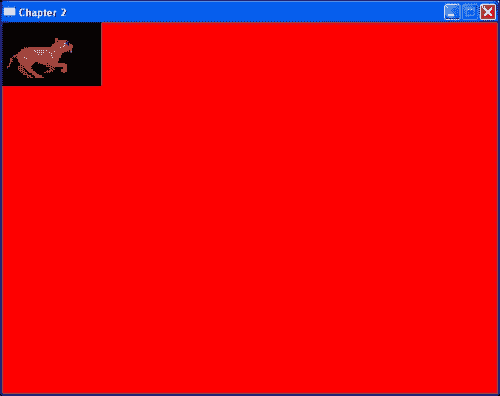
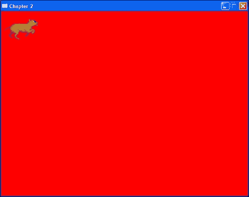

# 第二章 SDL 中的绘图

图形对游戏非常重要，如果处理不当，它们也可能成为主要的性能瓶颈。使用 SDL 2.0，我们可以在渲染时真正利用 GPU，这为我们提供了渲染速度的实际提升。

在本章中，我们将涵盖：

+   SDL 绘图的基础

+   源和目标矩形

+   加载和显示纹理

+   使用`SDL_image`扩展

# 基本的 SDL 绘图

在上一章中，我们创建了一个 SDL 窗口，但我们还没有将任何内容渲染到屏幕上。SDL 可以使用两种结构来绘制到屏幕上。一个是`SDL_Surface`结构，它包含一组像素，并使用软件渲染过程（而不是 GPU）进行渲染。另一个是`SDL_Texture`；这可以用于硬件加速渲染。我们希望我们的游戏尽可能高效，所以我们将专注于使用`SDL_Texture`。

## 获取一些图像

在本章中，我们需要一些图像来加载。我们不想在这个阶段花费任何时间来为我们的游戏创建艺术资产；我们希望完全专注于编程方面。在这本书中，我们将使用来自[`www.widgetworx.com/widgetworx/portfolio/spritelib.html`](http://www.widgetworx.com/widgetworx/portfolio/spritelib.html)的`SpriteLib`集合中的资产。

我已经修改了一些文件，以便我们可以在接下来的章节中轻松使用它们。这些图像可以在本书的源代码下载中找到。我们将使用的第一张是`rider.bmp`图像文件：


## 创建 SDL 纹理

首先，我们将在我们的`Game.h`头文件中创建一个指向`SDL_Texture`对象的指针作为成员变量。我们还将创建一些矩形，用于绘制纹理。

```cpp
SDL_Window* m_pWindow;
SDL_Renderer* m_pRenderer;

SDL_Texture* m_pTexture; // the new SDL_Texture variable
SDL_Rect m_sourceRectangle; // the first rectangle
SDL_Rect m_destinationRectangle; // another rectangle
```

我们现在可以在游戏的`init`函数中加载这个纹理。打开`Game.cpp`，按照以下步骤加载和绘制`SDL_Texture`：

1.  首先，我们将创建一个资产文件夹来存放我们的图像，将其放置在与您的源代码相同的文件夹中（不是可执行代码）。当您想要分发游戏时，您将复制此资产文件夹以及您的可执行文件。但为了开发目的，我们将将其保留在源代码的同一文件夹中。将`rider.bmp`文件放入此资产文件夹。

1.  在我们的游戏的`init`函数中，我们可以加载我们的图像。我们将使用`SDL_LoadBMP`函数，它返回一个`SDL_Surface*`。从这个`SDL_Surface*`，我们可以使用`SDL_CreateTextureFromSurface`函数创建`SDL_Texture`结构。然后我们释放临时表面，释放任何使用的内存。

    ```cpp
    SDL_Surface* pTempSurface = SDL_LoadBMP("assets/rider.bmp");

    m_pTexture = SDL_CreateTextureFromSurface(m_pRenderer, pTempSurface);

    SDL_FreeSurface(pTempSurface);
    ```

1.  现在，我们已经有了`SDL_Texture`准备绘制到屏幕上。我们将首先获取我们刚刚加载的纹理的尺寸，并使用这些尺寸来设置`m_sourceRectangle`的宽度和高度，以便我们可以正确地绘制它。

    ```cpp
    SDL_QueryTexture(m_pTexture, NULL, NULL, &m_sourceRectangle.w, &m_sourceRectangle.h);
    ```

1.  查询纹理将允许我们将源矩形的宽度和高度设置为所需的精确尺寸。因此，现在我们已经将纹理的正确宽度和高度存储在 `m_sourceRectangle` 中，我们还必须设置目标矩形的宽度和高度。这样做是为了让渲染器知道要将图像绘制到窗口的哪个部分，以及我们想要渲染的图像的宽度和高度。我们将 x 和 y 坐标都设置为 `0`（左上角）。窗口坐标可以用 `x` 和 `y` 值表示，其中 `x` 是水平位置，`y` 是垂直位置。因此，SDL 中窗口左上角的坐标是 (0,0)，中心点对于 `x` 是窗口宽度的一半，对于 `y` 是窗口高度的一半。

    ```cpp
    m_destinationRectangle.x = m_sourceRectangle.x = 0;
    m_destinationRectangle.y = m_sourceRectangle.y = 0;
    m_destinationRectangle.w = m_sourceRectangle.w;
    m_destinationRectangle.h = m_sourceRectangle.h;
    ```

1.  现在我们已经加载了纹理及其尺寸，我们可以继续将其渲染到屏幕上。移动到我们的游戏的 `render` 函数，我们将添加代码来绘制我们的纹理。将此函数放置在 `SDL_RenderClear` 和 `SDL_RenderPresent` 调用之间。

    ```cpp
    SDL_RenderCopy(m_pRenderer, m_pTexture, &m_sourceRectangle, &m_destinationRectangle);
    ```

1.  构建项目，你会看到我们加载的纹理。

# 源和目标矩形

现在我们已经在屏幕上绘制了一些内容，解释源矩形和目标矩形的作用是个好主意，因为它们对于诸如瓦片地图加载和绘制等主题将极为重要。它们对于精灵表动画也很重要，我们将在本章后面讨论。

我们可以将源矩形视为定义从纹理复制到窗口的区域的区域：

1.  在前面的示例中，我们使用了整个图像，因此我们可以简单地使用与加载的纹理相同的尺寸来定义源矩形的尺寸。

1.  前一个屏幕截图中的红色框是我们绘制到屏幕时所使用的源矩形的视觉表示。我们希望从源矩形内部复制像素到渲染器的特定区域，即目标矩形（以下屏幕截图中的红色框）。

1.  如您所预期，这些矩形可以按照您的意愿定义。例如，让我们再次打开我们的 `Game.cpp` 文件，看看如何更改源矩形的尺寸。将此代码放置在 `SDL_QueryTexture` 函数之后。

    ```cpp
    m_sourceRectangle.w = 50;
    m_sourceRectangle.h = 50;
    ```

    现在再次构建项目，你应该会看到只有图像的 50 x 50 平方区域被复制到了渲染器中。

    

1.  现在让我们通过更改其 `x` 和 `y` 值来移动目标矩形。

    ```cpp
    m_destinationRectangle.x = 100;
    m_destinationRectangle.y = 100;
    ```

    再次构建项目，你会看到我们的源矩形位置保持不变，但目标矩形已经移动。我们所做的只是移动了我们要将源矩形内的像素复制到的位置。

    

1.  到目前为止，我们已将源矩形的`x`和`y`坐标保持在 0，但它们也可以移动，以仅绘制所需的图像部分。我们可以移动源矩形的`x`和`y`坐标，以绘制图像的右下角部分而不是左上角。将此代码放置在设置目标矩形位置的代码之前。

    ```cpp
    m_sourceRectangle.x = 50;
    m_sourceRectangle.y = 50;
    ```

    您可以看到，我们仍在绘制到相同的目标位置，但我们正在复制图像的不同 50 x 50 部分。

    

1.  我们还可以将`null`传递给任一矩形的渲染复制。

    ```cpp
    SDL_RenderCopy(m_pRenderer, m_pTexture, 0, 0);
    ```

    将`null`传递给源矩形参数将使渲染器使用整个纹理。同样，将`null`传递给目标矩形参数将使用整个渲染器进行显示。

    

我们已经介绍了几种我们可以使用矩形来定义我们想要绘制的图像区域的方法。现在，我们将通过显示动画精灵图来将这些知识付诸实践。

## 精灵图动画

我们可以将我们对源矩形和目标矩形的理解应用到精灵图动画中。精灵图是一系列动画帧组合成的一张图片。单独的帧需要具有非常特定的宽度和高度，以便它们能够创建出无缝的运动。如果精灵图的一部分不正确，将会使整个动画看起来不协调或完全错误。以下是我们将用于此演示的示例精灵图：


1.  这个动画由六个帧组成，每个帧的大小为 128 x 82 像素。根据前面的章节，我们知道我们可以使用源矩形来获取图像的某个部分。因此，我们可以首先定义一个源矩形，仅包含动画的第一帧。

1.  由于我们知道精灵图上帧的宽度、高度和位置，我们可以将这些值硬编码到我们的源矩形中。首先，我们必须加载新的`animate.bmp`文件。将其放入您的资产文件夹中，并修改加载代码。

    ```cpp
    SDL_Surface* pTempSurface = SDL_LoadBMP("assets/animate.bmp");
    ```

1.  这将现在加载我们新的精灵图 BMP。我们可以删除`SDL_QueryTexture`函数，因为我们现在正在定义自己的尺寸。调整源矩形的大小，以仅获取图的第一帧。

    ```cpp
    m_sourceRectangle.w = 128;
    m_sourceRectangle.h = 82;
    ```

1.  我们将保持两个矩形的`x`和`y`位置为`0`，这样我们就可以从左上角绘制图像，并将其复制到渲染器的左上角。我们还将保持目标矩形的尺寸不变，因为我们希望它保持与源矩形相同。将两个矩形传递给`SDL_RenderCopy`函数：

    ```cpp
    SDL_RenderCopy(m_pRenderer, m_pTexture, &m_sourceRectangle, &m_destinationRectangle);
    ```

    现在我们构建时，将得到动画的第一帧。

    

1.  现在我们有了第一帧，我们可以继续动画精灵图。每一帧都有完全相同的尺寸。这对于正确动画此图非常重要。我们只想移动源矩形的定位，而不是其尺寸。

1.  每次我们想要移动另一帧时，我们只需移动源矩形的定位并将其复制到渲染器中。为此，我们将使用我们的`update`函数。

    ```cpp
    void Game::update()
    {
      m_sourceRectangle.x = 128 * int(((SDL_GetTicks() / 100) % 6));
    }
    ```

1.  在这里，我们使用了`SDL_GetTicks()`来找出自 SDL 初始化以来经过的毫秒数。然后我们将其除以我们希望在帧之间想要的时间（以毫秒为单位），然后使用取模运算符来保持它在我们的动画中帧的数量范围内。此代码（每 100 毫秒）将我们的源矩形的`x`值移动 128 像素（帧的宽度），乘以我们想要的当前帧，从而给出正确的位置。构建项目后，你应该会看到动画正在显示。

## 翻转图像

在大多数游戏中，玩家、敌人等等都会在多个方向上移动。为了使精灵面向移动的方向，我们必须翻转我们的精灵图。当然，我们可以在精灵图中创建一个新的行来包含翻转的帧，但这会使用更多的内存，而我们不想这样做。SDL 2.0 有一个允许我们传入我们想要图像如何翻转或旋转的渲染函数。我们将使用的函数是`SDL_RenderCopyEx`。此函数与`SDL_RenderCopy`具有相同的参数，但还包含特定于旋转和翻转的参数。第四个参数是我们想要图像显示的角度，第五个参数是我们想要旋转的中心点。最后一个参数是一个名为`SDL_RendererFlip`的枚举类型。

以下表格显示了`SDL_RendererFlip`枚举类型可用的值：

| SDL_RendererFlip 值 | 目的 |
| --- | --- |
| `SDL_FLIP_NONE` | 不翻转 |
| `SDL_FLIP_HORIZONTAL` | 水平翻转纹理 |
| `SDL_FLIP_VERTICAL` | 垂直翻转纹理 |

我们可以使用此参数来翻转我们的图像。以下是修改后的渲染函数：

```cpp
void Game::render()
{
  SDL_RenderClear(m_pRenderer);

  SDL_RenderCopyEx(m_pRenderer, m_pTexture,
  &m_sourceRectangle, &m_destinationRectangle,
  0, 0, SDL_FLIP_HORIZONTAL); // pass in the horizontal flip

  SDL_RenderPresent(m_pRenderer);
}
```

构建项目后，你会看到图像已经被翻转，现在面向左侧。我们的角色和敌人也将有专门用于动画的帧，例如攻击和跳跃。这些可以添加到精灵图的不同的行中，并且源矩形的`y`值相应增加。（我们将在创建游戏对象时更详细地介绍这一点。）

# 安装 SDL_image

到目前为止，我们只加载了 BMP 图像文件。这是 SDL 在不使用任何扩展的情况下支持的所有内容。我们可以使用`SDL_image`来使我们能够加载许多不同的图像文件类型，如 BMP、GIF、JPEG、LBM、PCX、PNG、PNM、TGA、TIFF、WEBP、XCF、XPM 和 XV。首先，我们需要克隆`SDL_image`的最新构建版本，以确保它与 SDL 2.0 兼容：

1.  打开 `TortoiseHg` 工作台，使用 *Ctrl* + *Shift* + *N* 克隆一个新的仓库。

1.  SDL_image 的仓库列在 [`www.libsdl.org/projects/SDL_image/`](http://www.libsdl.org/projects/SDL_image/) 和 [`hg.libsdl.org/SDL_image/`](http://hg.libsdl.org/SDL_image/) 上。所以让我们继续在 **源** 框中输入这些内容。

1.  我们的目标将是一个新的目录，`C:\SDL2_image`。在 **目标** 框中输入此内容后，点击 **克隆** 并等待其完成。

1.  一旦创建了此文件夹，导航到我们的 `C:\SDL2_image` 克隆仓库。打开 `VisualC` 文件夹，然后使用 Visual Studio 2010 express 打开 `SDL_image_VS2010` VC++ 项目。

1.  右键单击 `SDL2_image` 项目，然后点击 **属性**。在这里，我们需要包含 `SDL.h` 头文件。将配置更改为 **所有配置**，导航到 **VC++ 目录**，点击 **包含目录** 下拉菜单，然后点击 **<编辑…**>。在这里，我们可以输入我们的 `C:\SDL2\include\` 目录。

1.  接下来，转到 **库目录** 并添加我们的 `C:\SDL2\lib\` 文件夹。现在导航到 **链接器** | **输入** | **附加依赖项**，并添加 `SDL2.lib`。

1.  点击 **确定**，我们几乎准备好构建了。我们现在使用 `SDL2.lib`，所以我们可以从 `SDL_image` 项目中删除 `SDL.lib` 和 `SDLmain.lib` 文件。在解决方案资源管理器中定位文件，右键单击然后删除文件。将构建配置更改为 **发布**，然后构建。

1.  可能会出现一个无法启动程序的错误。只需点击 **确定**，然后我们可以关闭项目并继续。

1.  现在，在 `C:\SDL2_image\VisualC\` 文件夹中会有一个 `Release` 文件夹。打开它，将 `SDL_image.dll` 复制到我们的游戏可执行文件文件夹中。

1.  接下来，将 `SDL2_image.lib` 文件复制到我们原始的 `C:\SDL2\lib\` 目录中。也将 `SDL_image` 头文件从 `C:\SDL2_image\` 复制到 `C:\SDL2\include\` 目录中。

1.  我们只需要再获取几个库，然后就可以完成了。从 [`www.libsdl.org/projects/SDL_image/`](http://www.libsdl.org/projects/SDL_image/) 下载 `SDL_image-1.2.12-win32.zip` 文件（或者如果你是针对 64 位平台，则下载 x64）。解压所有内容，然后将所有 `.dll` 文件（除了 `SDL_image.dll`）复制到我们的游戏可执行文件文件夹中。

1.  打开我们的游戏项目，进入其属性。导航到 **链接器** | **输入** | **附加依赖项**，并添加 `SDL2_image.lib`。安装 SDL_image

1.  我们现在已经安装了 `SDL_image`，可以开始加载各种不同的图像文件了。将 `animate.png` 和 `animate-alpha.png` 图像从源下载复制到我们的游戏资源文件夹中，然后我们可以开始加载 PNG 文件。

## 使用 SDL_image

因此，我们已经安装了库，现在该如何使用它呢？使用 SDL_image 替代常规的 SDL 图像加载很简单。在我们的例子中，我们只需要替换一个函数，并添加 `#include <SDL_image.h>`。

```cpp
SDL_Surface* pTempSurface = SDL_LoadBMP("assets/animate.bmp");
```

上述代码将按如下方式更改：

```cpp
SDL_Surface* pTempSurface = IMG_Load("assets/animate.png");
```

我们现在正在加载 `.png` 图像。PNG 文件非常适合使用，它们具有较小的文件大小并支持 alpha 通道。让我们进行一次测试。将我们的渲染器清除颜色更改为红色。

```cpp
SDL_SetRenderDrawColor(m_pRenderer, 255,0,0,255);
```

你会看到我们仍然在使用图像时的黑色背景；这绝对不是我们目的的理想选择。



当使用 PNG 文件时，我们可以通过使用 alpha 通道来解决这个问题。我们移除图像的背景，然后在加载时，SDL 不会从 alpha 通道绘制任何内容。


让我们加载此图像并看看它的样子：

```cpp
SDL_Surface* pTempSurface = IMG_Load("assets/animate-alpha.png");
```

这正是我们想要的：



# 将其整合到框架中

我们已经对使用 SDL 绘制图像的主题进行了很多介绍，但我们还没有将所有内容整合到我们的框架中，以便在整个游戏中重用。我们现在要介绍的是创建一个纹理管理器类，它将包含我们轻松加载和绘制纹理所需的所有函数。

## 创建纹理管理器

纹理管理器将具有允许我们从图像文件加载和创建 `SDL_Texture` 结构的函数，绘制纹理（静态或动画），并保持 `SDL_Texture*` 的列表，这样我们就可以在需要时使用它们。让我们继续创建 `TextureManager.h` 文件：

1.  首先，我们声明我们的 `load` 函数。作为参数，该函数接受我们想要使用的图像文件名、我们想要使用的用于引用纹理的 ID，以及我们想要使用的渲染器。

    ```cpp
    bool load(std::string fileName,std::string id, SDL_Renderer* pRenderer);
    ```

1.  我们将创建两个绘制函数，`draw` 和 `drawFrame`。它们都将接受我们想要绘制的纹理的 ID、我们想要绘制的 `x` 和 `y` 位置、框架或我们使用的图像的高度和宽度、我们将复制的渲染器，以及一个 `SDL_RendererFlip` 值来描述我们想要如何显示图像（默认为 `SDL_FLIP_NONE`）。`drawFrame` 函数将接受两个额外的参数，即我们想要绘制的当前帧和它在精灵图中的行。

    ```cpp
    // draw
    void draw(std::string id, int x, int y, int width, int height, SDL_Renderer* pRenderer, SDL_RendererFlip flip = SDL_FLIP_NONE);

    // drawframe

    void drawFrame(std::string id, int x, int y, int width, int height, int currentRow, int currentFrame, SDL_Renderer* pRenderer, SDL_RendererFlip flip = SDL_FLIP_NONE);
    ```

1.  `TextureManager` 类还将包含指向 `SDL_Texture` 对象的指针的 `std::map`，使用 `std::strings` 作为键。

    ```cpp
    std::map<std::string, SDL_Texture*> m_textureMap;
    ```

1.  我们现在必须在 `TextureManager.cpp` 文件中定义这些函数。让我们从 `load` 函数开始。我们将从之前的纹理加载代码中提取代码，并在 `load` 方法中使用它。

    ```cpp
    bool TextureManager::load(std::string fileName, std::string id, SDL_Renderer* pRenderer)
    {
      SDL_Surface* pTempSurface = IMG_Load(fileName.c_str());

      if(pTempSurface == 0)
      {
        return false;
      }

      SDL_Texture* pTexture = 
      SDL_CreateTextureFromSurface(pRenderer, pTempSurface);

      SDL_FreeSurface(pTempSurface);

      // everything went ok, add the texture to our list
      if(pTexture != 0)
      {
        m_textureMap[id] = pTexture;
        return true;
      }

      // reaching here means something went wrong
      return false;
    }
    ```

1.  当我们调用此函数时，我们将拥有可以使用的 `SDL_Texture`，我们可以通过使用其 ID 从映射中访问它；我们将在我们的 `draw` 函数中使用它。`draw` 函数可以定义如下：

    ```cpp
    void TextureManager::draw(std::string id, int x, int y, int width, int height, SDL_Renderer* pRenderer, SDL_RendererFlip flip)
    {
      SDL_Rect srcRect;
      SDL_Rect destRect;

      srcRect.x = 0;
      srcRect.y = 0;
      srcRect.w = destRect.w = width;
      srcRect.h = destRect.h = height;
      destRect.x = x;
      destRect.y = y;

      SDL_RenderCopyEx(pRenderer, m_textureMap[id], &srcRect, 
      &destRect, 0, 0, flip);
    }
    ```

1.  我们再次使用 `SDL_RenderCopyEx`，通过传入的 ID 变量获取我们想要绘制的 `SDL_Texture` 对象。我们还使用传入的 `x`、`y`、`width` 和 `height` 值构建我们的源和目标变量。现在我们可以继续到 `drawFrame`：

    ```cpp
    void TextureManager::drawFrame(std::string id, int x, int y, int width, int height, int currentRow, int currentFrame, SDL_Renderer *pRenderer, SDL_RendererFlip flip)
    {
      SDL_Rect srcRect;
      SDL_Rect destRect;
      srcRect.x = width * currentFrame;
      srcRect.y = height * (currentRow - 1);
      srcRect.w = destRect.w = width;
      srcRect.h = destRect.h = height;
      destRect.x = x;
      destRect.y = y;

      SDL_RenderCopyEx(pRenderer, m_textureMap[id], &srcRect, 
      &destRect, 0, 0, flip);
    }
    ```

    在这个函数中，我们创建一个源矩形来使用动画的适当帧，使用 `currentFrame` 和 `currentRow` 变量。当前帧的源矩形 `x` 位置是源矩形宽度乘以 `currentFrame` 值（在 *动画精灵表* 部分中介绍过）。它的 `y` 值是矩形高度乘以 `currentRow – 1`（使用第一行而不是零行听起来更自然）。

1.  现在我们已经拥有了在游戏中轻松加载和绘制纹理所需的一切。让我们继续测试它，使用 `animated.png` 图像。打开 `Game.h` 文件。我们不再需要纹理成员变量或矩形，所以请从 `Game.h` 和 `Game.cpp` 文件中删除任何处理它们的代码。然而，我们将创建两个新的成员变量。

    ```cpp
    int m_currentFrame;
    TextureManager m_textureManager;
    ```

1.  我们将使用 `m_currentFrame` 变量来允许我们动画化精灵表，并且我们还需要一个我们新的 `TextureManager` 类的实例（确保你包含了 `TextureManager.h`）。我们可以在游戏的 `init` 函数中加载纹理。

    ```cpp
    m_textureManager.load("assets/animate-alpha.png", "animate", m_pRenderer);
    ```

1.  我们已经给这个纹理分配了一个名为 `"animate"` 的 ID，我们可以在我们的 `draw` 函数中使用它。我们将首先在 0,0 位置绘制一个静态图像，并在 100,100 位置绘制一个动画图像。以下是渲染函数：

    ```cpp
    void Game::render()
    {

      SDL_RenderClear(m_pRenderer);

      m_textureManager.draw("animate", 0,0, 128, 82, 
      m_pRenderer);

      m_textureManager.drawFrame("animate", 100,100, 128, 82, 
      1, m_currentFrame, m_pRenderer);

      SDL_RenderPresent(m_pRenderer);

    }
    ```

1.  `drawFrame` 函数使用我们的 `m_currentFrame` 成员变量。我们可以在 `update` 函数中增加这个值，就像我们之前做的那样，但现在我们在 `draw` 函数内部进行源矩形的计算。

    ```cpp
    void Game::update()
    {
      m_currentFrame = int(((SDL_GetTicks() / 100) % 6));
    }
    ```

    现在我们可以构建并看到我们的辛勤工作付诸实践了。


## 使用纹理管理器作为单例

现在我们已经设置了纹理管理器，但我们仍然有一个问题。我们希望在整个游戏中重用这个 `TextureManager`，因此我们不希望它是 `Game` 类的成员，因为那样我们就必须将它传递给我们的绘制函数。对我们来说，将 `TextureManager` 实现为单例是一个好选择。单例是一个只能有一个实例的类。这对我们来说很适用，因为我们希望在游戏中重用相同的 `TextureManager`。我们可以通过首先将构造函数设为私有来使我们的 `TextureManager` 成为单例。

```cpp
private:

TextureManager() {}
```

这是为了确保它不能像其他对象那样被创建。它只能通过使用 `Instance` 函数来创建和访问，我们将声明和定义它。

```cpp
static TextureManager* Instance()
{
  if(s_pInstance == 0)
  {
    s_pInstance = new TextureManager();
    return s_pInstance;
  }

  return s_pInstance;
}
```

这个函数检查我们是否已经有了 `TextureManager` 的实例。如果没有，则构建它，否则简单地返回静态实例。我们还将 `typedef` `TextureManager`。

```cpp
typedef TextureManager TheTextureManager;
```

我们还必须在 `TextureManager.cpp` 中定义静态实例。

```cpp
TextureManager* TextureManager::s_pInstance = 0;
```

我们现在可以将我们的 `TextureManager` 作为单例使用。我们不再需要在 `Game` 类中有一个 `TextureManager` 的实例，我们只需包含头文件并按以下方式使用它：

```cpp
// to load
if(!TheTextureManager::Instance()->load("assets/animate-alpha.png", "animate", m_pRenderer))
{
   return false;
}
// to draw
TheTextureManager::Instance()->draw("animate", 0,0, 128, 82, m_pRenderer);
```

当我们在 `Game`（或任何其他）类中加载纹理时，我们可以在整个代码中访问它。

# 摘要

本章主要讲述了将图像渲染到屏幕上的过程。我们涵盖了源矩形和目标矩形以及精灵表的动画处理。我们将所学知识应用于创建一个可重用的纹理管理器类，使我们能够轻松地在整个游戏中加载和绘制图像。在下一章中，我们将介绍如何使用继承和多态来创建一个基础游戏对象类，并在我们的游戏框架中使用它。
