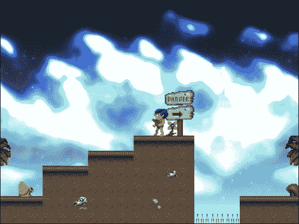
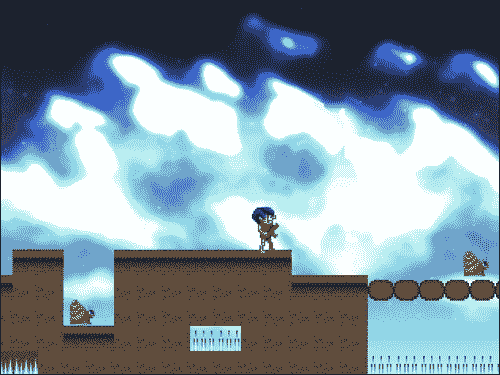
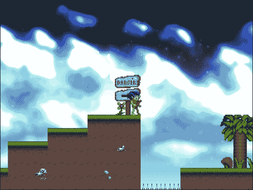

# 第九章 创建康纳洞穴人

在上一章中，外星人攻击的创建演示了框架现在已达到可以快速创建 2D 横版射击游戏的程度。其他类型也简单易制作，大多数更改仍然包含在对象类中。

在本章中，我们将介绍：

+   为新游戏调整之前的代码库

+   更精确的瓦片碰撞检测

+   处理跳跃

+   框架可能的添加

本章将使用框架创建一个平台游戏，康纳洞穴人。以下是完成的游戏关卡截图：



这是另一个带有更多敌人的截图：



与上一章一样，本章不是创建康纳洞穴人的逐步指南，而是对游戏最重要的方面的概述。游戏的项目可以在源代码下载中找到。

# 设置基本游戏对象

在某些方面，这个游戏比外星人攻击更复杂，而在其他方面则更简单。本节将介绍对外星人攻击源代码所做的更改：什么被修改了，什么被移除了，什么被添加了。

## 没有更多子弹或子弹碰撞

康纳洞穴人没有使用投射武器，因此不再有`Bullet`类，`CollisonManager`类也不再需要检查它们之间的碰撞功能；它只检查`Player`和`Enemy`的碰撞：

```cpp
class CollisionManager
{
public:

  void checkPlayerEnemyCollision(Player* pPlayer, const 
  std::vector<GameObject*>&objects);
};
```

## 游戏对象和地图碰撞

几乎所有对象都需要与瓦片地图发生碰撞并相应地反应。`GameObject`类现在有一个私有成员，是一个指向碰撞层的指针；之前只有`Player`类有这个变量：

```cpp
std::vector<TileLayer*>* m_pCollisionLayers;
```

`GameObject`现在也有一个设置此变量的函数：

```cpp
void setCollisionLayers(std::vector<TileLayer*>* layers) { m_pCollisionLayers = layers; }
```

`Player`类之前会在`LevelParser::parseLevel`函数的末尾设置这个值，如下所示：

```cpp
pLevel->getPlayer()->setCollisionLayers(pLevel->getCollisionLayers());
```

这不再需要，因为每个`GameObject`在对象层解析时都会在创建时设置其`m_pCollisionLayers`变量：

```cpp
// load the object
pGameObject->load(std::unique_ptr<LoaderParams>(new LoaderParams(x, y, width, height, textureID, numFrames,callbackID, animSpeed)));
// set the collision layers
pGameObject->setCollisionLayers(pLevel->getCollisionLayers());
```

## ShooterObject 现在是 PlatformerObject

外星人攻击的特定代码已被从`ShooterObject`中移除，并将类重命名为`PlatformerObject`。任何这个游戏的所有游戏对象都将使用的内容都包含在这个类中：

```cpp
class PlatformerObject : public GameObject
{
public:

  virtual ~PlatformerObject() {}

  virtual void load(std::unique_ptr<LoaderParams> const &pParams);

  virtual void draw();
  virtual void update();

  virtual void clean() {}
  virtual void collision() {}

  virtual std::string type() { return "SDLGameObject"; }

protected:

  PlatformerObject();

  bool checkCollideTile(Vector2D newPos);

  void doDyingAnimation();

  int m_bulletFiringSpeed;
  int m_bulletCounter;
  int m_moveSpeed;

  // how long the death animation takes, along with a counter
  int m_dyingTime;
  int m_dyingCounter;

  // has the explosion sound played?
  bool m_bPlayedDeathSound;

  bool m_bFlipped;

  bool m_bMoveLeft;
  bool m_bMoveRight;
  bool m_bRunning;

  bool m_bFalling;
  bool m_bJumping;
  bool m_bCanJump;

  Vector2D m_lastSafePos;

  int m_jumpHeight;
};
```

仍然有一些来自外星人攻击的有用变量和函数，还有一些新函数。其中最重要的新增功能是`checkCollideTile`函数，它接受`Vector2D`作为参数，并检查它是否会导致碰撞：

```cpp
bool PlatformerObject::checkCollideTile(Vector2D newPos)
{
  if(newPos.m_y + m_height>= TheGame::Instance()->getGameHeight() 
  - 32)
  {
    return false;
  }
  else
  {
    for(std::vector<TileLayer*>::iterator it = m_pCollisionLayers
    ->begin(); it != m_pCollisionLayers->end(); ++it)
    {
      TileLayer* pTileLayer = (*it);
      std::vector<std::vector<int>> tiles = pTileLayer
      ->getTileIDs();

      Vector2D layerPos = pTileLayer->getPosition();

      int x, y, tileColumn, tileRow, tileid = 0;

      x = layerPos.getX() / pTileLayer->getTileSize();
      y = layerPos.getY() / pTileLayer->getTileSize();

      Vector2D startPos = newPos;
      startPos.m_x += 15;
      startPos.m_y += 20;
      Vector2D endPos(newPos.m_x + (m_width - 15), (newPos.m_y) + 
      m_height - 4);

      for(int i = startPos.m_x; i < endPos.m_x; i++)
      {
        for(int j = startPos.m_y; j < endPos.m_y; j++)
        {
          tileColumn = i / pTileLayer->getTileSize();
          tileRow = j / pTileLayer->getTileSize();

          tileid = tiles[tileRow + y][tileColumn + x];

          if(tileid != 0)
          {
            return true;
          }
        }
      }
    }

    return false; 
  }
}
```

这是一个相当大的函数，但本质上与外星人攻击检查瓦片碰撞的方式相同。一个区别是 y 位置的检查：

```cpp
if(newPos.m_y + m_height >= TheGame::Instance()->getGameHeight() - 32)
{
  return false;
}
```

这是为了确保我们可以在地图边缘掉落（或掉入坑中）而不会尝试访问不存在的瓦片。例如，如果对象的位置在地图之外，以下代码将尝试访问不存在的瓦片，因此会失败：

```cpp
tileid = tiles[tileRow + y][tileColumn + x];
```

y 值检查可以防止这种情况发生。

## 相机类

在像《外星攻击》这样的游戏中，精确的地图碰撞检测并不是特别重要；更重要的是有精确的子弹、玩家和敌人碰撞。然而，平台游戏需要非常精确的地图碰撞，这要求以稍微不同的方式移动地图，以便在滚动时不会丢失精度。

在《外星攻击》中，地图实际上并没有移动；一些变量被用来确定绘制地图的哪个点，这产生了地图滚动的错觉。在《康纳原始人》中，地图将移动，以便任何碰撞检测例程都与地图的实际位置相关。为此，创建了一个`Camera`类：

```cpp
class Camera
{
public:

  static Camera* Instance()
  {
    if(s_pCamera == 0)
    {
      s_pCamera = new Camera();
    }

    return s_pCamera;
  }

  void update(Vector2D velocity);

  void setTarget(Vector2D* target) { m_pTarget = target; }
  void setPosition(const Vector2D& position) { m_position = 
  position; }

  const Vector2D getPosition() const;

private:

  Camera();
  ~Camera();

  // the camera's target
  Vector2D* m_pTarget;

  // the camera's position
  Vector2D m_position;

  static Camera* s_pCamera;
};

typedef Camera TheCamera;
```

这个类非常简单，因为它仅仅保存一个位置，并使用目标的位置更新它，该目标被称为指针`m_pTarget`：

```cpp
const Vector2DCamera::getPosition() const
{
{
  if(m_pTarget != 0)
  {
    Vector2D pos(m_pTarget->m_x - (TheGame::Instance()
    ->getGameWidth() / 2), 0);

    if(pos.m_x< 0)
    {
      pos.m_x = 0;
    }

    return pos;
  }

  return m_position;
}
```

这也可以更新以包括 y 值，但由于这是一个水平滚动游戏，这里不需要，因此 y 值返回为`0`。这个相机位置用于移动地图并决定绘制哪些瓦片。

## 相机控制的地图

`TileLayer`类现在需要知道地图的完整大小，而不仅仅是其中的一部分；这是通过构造函数传入的：

```cpp
TileLayer(int tileSize, int mapWidth, int mapHeight, const std::vector<Tileset>& tilesets);
```

`LevelParser`在创建每个`TileLayer`时传入高度和宽度：

```cpp
void LevelParser::parseTileLayer(TiXmlElement* pTileElement, std::vector<Layer*> *pLayers, const std::vector<Tileset>* pTilesets, std::vector<TileLayer*> *pCollisionLayers)
{
TileLayer* pTileLayer = new TileLayer(m_tileSize, m_width, m_height, *pTilesets);
```

`TileLayer`类使用这些值来设置其行和列变量：

```cpp
TileLayer::TileLayer(int tileSize, int mapWidth, int mapHeight, const std::vector<Tileset>& tilesets) : m_tileSize(tileSize), m_tilesets(tilesets), m_position(0,0), m_velocity(0,0)
{
  m_numColumns = mapWidth;
  m_numRows = mapHeight;

  m_mapWidth = mapWidth;
}
```

通过这些更改，瓦片地图现在根据相机的位置移动，并跳过任何在可视区域之外的瓦片：

```cpp
void TileLayer::render()
{
  int x, y, x2, y2 = 0;

  x = m_position.getX() / m_tileSize;
  y = m_position.getY() / m_tileSize;

  x2 = int(m_position.getX()) % m_tileSize;
  y2 = int(m_position.getY()) % m_tileSize;

  for(int i = 0; i < m_numRows; i++)
  {
    for(int j = 0; j < m_numColumns; j++)
    {
      int id = m_tileIDs[i + y][j + x];

      if(id == 0)
      {
        continue;
      }

      // if outside the viewable area then skip the tile
      if(((j * m_tileSize) - x2) - TheCamera::Instance()
      ->getPosition().m_x < -m_tileSize || ((j * m_tileSize) - x2) 
      - TheCamera::Instance()->getPosition()
      .m_x > TheGame::Instance()->getGameWidth())
      {
        continue;
      }

      Tileset tileset = getTilesetByID(id);

      id--;

      // draw the tile into position while offsetting its x 
      position by 
      // subtracting the camera position
      TheTextureManager::Instance()->drawTile(tileset.name, 
      tileset.margin, tileset.spacing, ((j * m_tileSize) - x2) - 
      TheCamera::Instance()->getPosition().m_x, ((i * m_tileSize) 
      - y2), m_tileSize, m_tileSize, (id - (tileset.firstGridID - 
      1)) / tileset.numColumns, (id - (tileset.firstGridID - 1)) % 
      tileset.numColumns, TheGame::Instance()->getRenderer());
    }
  }

```

## 玩家类

`Player`类现在必须应对跳跃以及移动，同时检查地图碰撞。`Player::update`函数已经发生了相当大的变化：

```cpp
void Player::update()
{
  if(!m_bDying)
  {
    // fell off the edge
    if(m_position.m_y + m_height >= 470)
    {
      collision();
    }

    // get the player input
    handleInput();

    if(m_bMoveLeft)
    {
      if(m_bRunning)
      {
        m_velocity.m_x = -5;
      }
      else
      {
        m_velocity.m_x = -2;
      }
    }
    else if(m_bMoveRight)
    {
      if(m_bRunning)
      {
        m_velocity.m_x = 5;
      }
      else
      {
        m_velocity.m_x = 2;
      }
    }
    else
    {
      m_velocity.m_x = 0;
    }

    // if we are higher than the jump height set jumping to false
    if(m_position.m_y < m_lastSafePos.m_y - m_jumpHeight)
    {
      m_bJumping = false;
    }

    if(!m_bJumping)
    {
      m_velocity.m_y = 5;
    }
    else
    {
      m_velocity.m_y = -5;
    }

    handleMovement(m_velocity);
  }
  else
  {
    m_velocity.m_x = 0;
    if(m_dyingCounter == m_dyingTime)
    {
      ressurect();
    }
    m_dyingCounter++;

    m_velocity.m_y = 5;
  }
  handleAnimation();
}
```

由于移动是这个类中如此重要的部分，因此有一个专门处理它的函数：

```cpp
void Player::handleMovement(Vector2D velocity)
{
  // get the current position
  Vector2D newPos = m_position;

  // add velocity to the x position
  newPos.m_x  = m_position.m_x + velocity.m_x;

  // check if the new x position would collide with a tile
  if(!checkCollideTile(newPos))
  {
    // no collision, add to the actual x position
    m_position.m_x = newPos.m_x;
  }
  else
  {
    // collision, stop x movement
    m_velocity.m_x = 0;
  }

  // get the current position after x movement
  newPos = m_position;

  // add velocity to y position
  newPos.m_y += velocity.m_y;

  // check if new y position would collide with a tile
  if(!checkCollideTile(newPos))
  {
    // no collision, add to the actual x position
    m_position.m_y = newPos.m_y;
  }
  else
  {
    // collision, stop y movement
    m_velocity.m_y = 0;

    //  we collided with the map which means we are safe on the 
    ground,
    //  make this the last safe position
    m_lastSafePos = m_position;

    // move the safe pos slightly back or forward so when 
    resurrected we are safely on the ground after a fall
    if(velocity.m_x > 0)
    {
      m_lastSafePos.m_x -= 32;
    }
    else if(velocity.m_x < 0)
    {
      m_lastSafePos.m_x += 32;

    }

    // allow the player to jump again
    m_bCanJump = true;

    // jumping is now false
    m_bJumping = false;
  }
```

### 小贴士

注意到 x 和 y 检查已经被分成两个不同的部分；这对于确保 x 碰撞不会停止 y 移动，反之亦然，非常重要。

`m_lastSafePos`变量用于在玩家重生后将玩家放回一个安全的位置。例如，如果玩家在以下截图中的平台边缘掉落，并因此落在下面的尖刺上，他将在与截图几乎相同的位置重生：



最后，处理输入函数现在为向右移动、向左移动或跳跃设置了布尔变量：

```cpp
void Player::handleInput()
{
  if(TheInputHandler::Instance()->isKeyDown(SDL_SCANCODE_RIGHT) && 
  m_position.m_x < ((*m_pCollisionLayers->begin())->getMapWidth() 
  * 32))
  {
    if(TheInputHandler::Instance()->isKeyDown(SDL_SCANCODE_A))
    {
      m_bRunning = true;
    }
    else
    {
      m_bRunning = false;
    }

    m_bMoveRight = true;
    m_bMoveLeft = false;
  }
  else if(TheInputHandler::Instance()
  ->isKeyDown(SDL_SCANCODE_LEFT) && m_position.m_x > 32)
  {
    if(TheInputHandler::Instance()->isKeyDown(SDL_SCANCODE_A))
    {
      m_bRunning = true;
    }
    else
    {
      m_bRunning = false;
    }

    m_bMoveRight = false;
    m_bMoveLeft = true;
  }
  else
  {
    m_bMoveRight = false;
    m_bMoveLeft = false;
  }

  if(TheInputHandler::Instance()->isKeyDown(SDL_SCANCODE_SPACE) 
  && m_bCanJump && !m_bPressedJump)
  {
    TheSoundManager::Instance()->playSound("jump", 0);
    if(!m_bPressedJump)
    {
      m_bJumping = true;
      m_bCanJump = false;
      m_lastSafePos = m_position;
      m_bPressedJump = true;
    }
  }

  if(!TheInputHandler::Instance()->isKeyDown(SDL_SCANCODE_SPACE) 
  && m_bCanJump)
  {
    m_bPressedJump = false;
  }
}
```

所有这些都很直观，除了跳跃。当玩家跳跃时，它会将`m_bCanJump`变量设置为`false`，因此在下一个循环中，由于跳跃只能在`m_bCanJump`变量为`true`时发生，所以不会再次调用跳跃；（跳跃后落地会将此变量重新设置为`true`）。

# 可能的添加

改进康纳洞穴人的游戏玩法并不难；增加敌人和陷阱的数量会使游戏玩起来更加刺激。游戏还可以通过增加关卡的高度来受益，这样玩家就可以真正地探索地图（类似《银河战士》风格）。其他游戏玩法改进可能包括移动平台、梯子和 Boss。

# 摘要

我们的可重复使用框架已经证明了自己的价值；通过最小化代码重复，已经创建了两个游戏。

本章探讨了使用玩家的位置进行滚动地图以及碰撞检测。还涵盖了瓦片地图碰撞，以及将 x 和 y 移动分开以在平台游戏中有效移动的重要点。康纳洞穴人是一个很好的起点，对于任何其他 2D 游戏，如滚动打斗游戏，甚至可以将本章和上一章结合来创建平台射击游戏。

我希望到现在为止，你已经很好地理解了如何使用 SDL2.0 和 C++来创建游戏，以及如何有效地拆分游戏代码以创建可重复使用的框架。这只是一个开始，还有更多游戏编程的冒险等着你。祝你好运！
