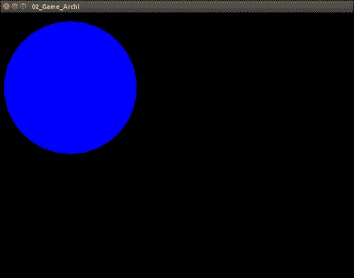
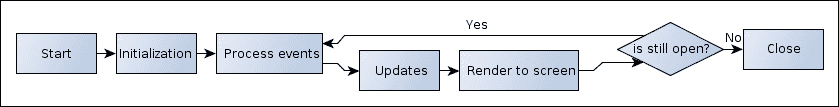
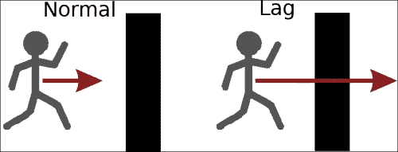
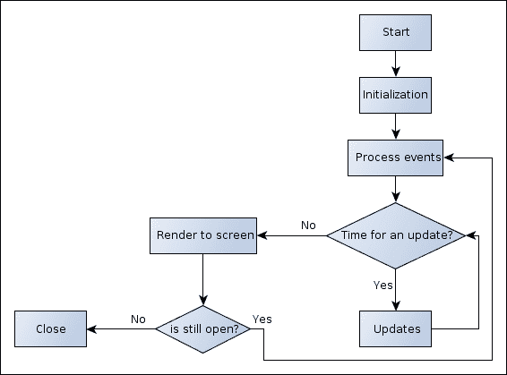
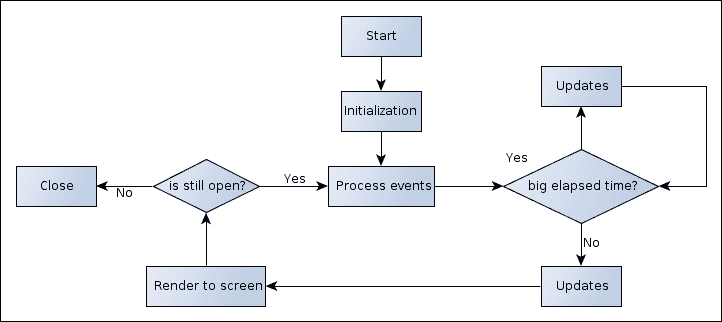
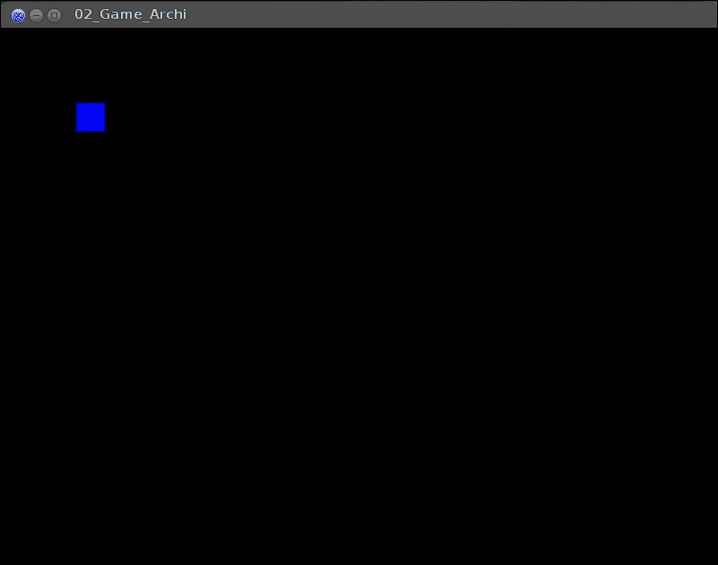
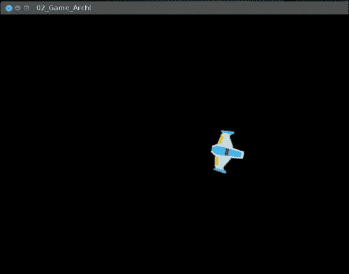

# 第二章.通用游戏架构、用户输入和资源管理

现在无聊的部分已经结束，让我们开始使用 SFML。在本章中，我们不会构建一个完整的游戏，而是学习构建游戏所需的一些基本技能。这些技能如下：

+   理解基本游戏架构

+   管理用户输入

+   跟踪外部资源

这些点对于任何类型的游戏都至关重要。但这些点具体意味着什么呢？这就是我在本章中要向您解释的内容。

# 游戏的一般结构

在开始无计划地随机构建之前，我们需要一些信息：你想要构建什么类型的游戏（RPG、FPS 或动作冒险），将使用哪些元素，等等。本章的目的是理解通用游戏结构，这可以用于任何类型的游戏。通过这部分，我们将研究：

+   游戏类

+   帧率

+   玩家类

+   事件管理

## 游戏类

在上一章中，我们看到了构建游戏所需的最小代码，它包含：

+   创建窗口

+   创建图形显示

+   处理用户输入

+   处理用户输入

+   在屏幕上显示游戏对象

而不是让一个函数完成所有工作，我们将利用面向对象实践，并在不同的函数中定义各种状态。此外，我们将方法封装在一个名为 `Game` 的新类中，并最小化 `main` 函数。这个 `Game` 类将成为我们所有未来游戏的起点：

```cpp
class Game
{
    public:
        Game(const Game&) = delete;
        Game& operator=(const Game&) = delete;
        Game();
        void run();

    private:
        void processEvents();
        void update();
        void render();

        sf::RenderWindow _window;
        sf::CircleShape  _player;
};

int main(int argc,char* argv[])
{
    Game game;
    game.run();

    return 0;
}
```

### 注意

`= delete` 是 C++11 中的一个特性，允许我们显式地删除特殊成员函数，如构造函数、移动构造函数、拷贝构造函数、拷贝赋值运算符、移动拷贝赋值运算符和析构函数。它告诉编译器不要构建默认函数。在这种情况下，它使得类不可拷贝。另一种解决方案是从 `sf::NonCopyable` 继承类。

`= default` 也可以显式地告诉编译器构建这个成员函数的默认版本。例如，它可以用来定义自定义构造函数和默认构造函数。

现在我们有了基本的 `Game` 类结构，其中函数根据其功能进行分离。此外，主函数中不再有循环，因为我们将在 `Game::run()` 函数中存在。现在，我们只需调用 `Game::run()` 函数。

我们现在可以将所有代码从主函数移动到函数中——`processEvents()`、`update()` 或 `render()`——取决于我们想要实现什么：

+   `processEvents()`: 这将管理所有来自用户的事件

+   `update()`: 这将更新整个游戏

+   `render()`: 这将管理游戏的所有渲染

所有未来的功能也将被放入这些私有函数之一。

现在，让我们看看实现方式：

1.  构造函数初始化窗口和玩家：

    ```cpp
    Game::Game() : _window(sf::VideoMode(800, 600),"02_Game_Archi"), _player(150)
    {
            _player.setFillColor(sf::Color::Blue);
            _player.setPosition(10, 20);
    }
    ```

1.  `Game::run()` 方法隐藏主 `game` 循环：

    ```cpp
    void Game::run()
    {
        while (_window.isOpen())
        {
            processEvents();
            update();
            render();
        }
    }
    ```

1.  `Game::processEvents()` 方法处理用户输入。它简单地轮询自上一帧以来从窗口接收到的所有事件，例如窗口标题栏中的按钮或按下的键盘键。在下面的代码中，我们检查用户是否按下了窗口的关闭按钮和键盘的 Esc 键。作为回应，我们关闭窗口：

    ```cpp
    void Game::processEvents() {
      sf::Event event;
      while(_window.pollEvent(event)) {
        if ((event.type == sf::Event::Closed)
        or ((event.type == sf::Event::KeyPressed) and (event.key.code == sf::Keyboard::Escape))) {
          _window.close();
        }
      }
    }
    ```

1.  `update()` 方法更新我们的游戏逻辑。目前，我们还没有任何逻辑，但不久的将来，我们将看到如何修改我们游戏中的逻辑：

    ```cpp
    void Game::update(){}
    ```

1.  `Game::render()` 方法将游戏渲染到屏幕上。首先，我们使用颜色清除窗口，通常是 `sf::Color::Black`，这是默认颜色，然后我们渲染帧的对象，最后，我们在屏幕上显示它：

    ```cpp
    void Game::render() {
      _window.clear();
      _window.draw(_player);
      _window.display();
    }
    ```

### 注意

**下载本书的颜色图像**

我们还为您提供了一个包含本书中使用的截图/图表的颜色图像的 PDF 文件。这些颜色图像将帮助您更好地理解输出的变化。您可以从 [`www.packtpub.com/sites/default/files/downloads/B03963_8477OS_Graphics.pdf`](https://www.packtpub.com/sites/default/files/downloads/B03963_8477OS_Graphics.pdf) 下载此文件。

与上一章的最小示例相比，场景的最终渲染没有变化，除了标题和大小。即使代码更多，由于函数已被简化到最小，使用新的架构维护应用程序更容易，因为更容易找到你想要的内容：



## 游戏循环

现在已经介绍了 `Game` 类，让我们来谈谈 `Game::run()` 函数内部的循环。这个循环被称为 `game` 循环或 `main` 循环。在游戏过程中持续运行，并在每次循环迭代中执行多个操作。这个循环的每次迭代被称为一帧。术语 **每秒帧数** （**FPS**） 是一个衡量指标，用于确定游戏在 1 秒内完成的迭代次数。我稍后会回到这个话题。

在这个循环内部的操作相当简单。首先，我们处理事件。然后，我们更新游戏状态。最后，我们将游戏渲染到屏幕上。

如您可能已经注意到的，这听起来很像 `Game` 类的 `run` 方法。为了更直观地解释，这个循环是一个表示逻辑的流程图：



目前，循环被简化到最小。例如，我们在这里不深入详细说明 `Game::processEvents()` 方法。目前，游戏循环被保持简单，这样你可以先学习基础知识。稍后，我们将回到 `Game::run()` 方法中的每个方法，例如 `Game::processEvents()` 方法，并增加更多的复杂性。

### 帧率

我们现在回到帧上。正如我之前所说的，帧是 `game` 循环的完整迭代。最终结果是可以在屏幕上显示的新 `game` 状态。

人类每秒无法看到无限数量的图像。我们的大脑在感知到的每一张图像之间进行一些插值。结果是，我们不需要每秒显示大量的图像。但是显示的图像越多，最终结果的质量就越高。例如，在电影院，每秒只显示 24 张图像。

在视频游戏中，大多数时候，我们试图使循环尽可能快。每秒显示的图像数量达到 30 到 60。低于 30 FPS 时，可能会有延迟效应，这可能是由游戏引起的，我们需要处理它以避免问题。

由延迟效应引起的最常见问题之一是实体的位移。大多数情况下，每个实体都有自己的速度和方向。速度通常以每秒像素数来衡量。现在想象一下你的游戏，由于任何原因，有一些延迟，FPS 下降到像 5 这样的小数字，那么图形效果就是所有的实体都会瞬间移动。但这不是主要问题。主要问题是碰撞。以一个在延迟发生时向墙壁方向行走的实体为例，该实体将实际上穿过墙壁。以下是表示该问题的图示：



为了解决这个问题，有三种不同的方法。第一种是可变步长，第二种是固定步长，第三种是将它们混合在一起。

#### 固定步长

固定步长方法，正如其名所示，是一种每次调用 `Game::update()` 函数都使用相同时间间隔的方法。例如，用于移动的单位相对于帧。因为每个帧与其他相同时间的帧是分开的，所以我们不需要更多的复杂性。我们唯一需要关注的是选择基本值，以确保没有问题。

这是 `game` 循环的新流程图：



现在我们将在以下代码片段中实现新的 `Game` 类：

```cpp
void Game::run(int frame_per_seconds)
{
    sf::Clock clock;
    sf::Time timeSinceLastUpdate = sf::Time::Zero;
    sf::Time TimePerFrame = sf::seconds(1.f/frame_per_seconds);

    while (_window.isOpen())
    {
        processEvents();
        bool repaint = false;

        timeSinceLastUpdate += clock.restart();
        while (timeSinceLastUpdate > TimePerFrame)
        {
            timeSinceLastUpdate -= TimePerFrame;
            repaint = true;
            update(TimePerFrame);
        }
        if(repaint)
            render();
    }
}
```

这段代码确保每次调用 `Game::update()` 函数时都会花费与参数值相同的时间。与代码的先前版本没有太大区别。我们只是在 `Game::update()` 函数的最后一次调用后跟踪时间，然后只有在时间超过帧率时才再次调用它。可以通过在循环中暂停 `sf::sleep` 剩余的自由时间来改进代码。这有点困难（因为需要测量前一个更新+渲染所花费的时间），但不会浪费 CPU 时间。

在 `Game::update()` 函数上做了一点小的改动，给它添加了一个参数。它的新签名现在是：

```cpp
void update(sf::Time deltaTime);
```

此参数使我们能够知道自上次调用`Game::update()`以来经过的时间。目前，对此没有太大兴趣，但以后会有。

由于游戏状态仅在调用`Game::update()`时改变，因此当至少进行一次更新时，才会调用`Game::render()`。

#### 可变时间步长

可变时间步长方法与固定时间步长方法不同，正如其名称所暗示的。这里的主要思想是尽可能快地执行`game`循环，没有任何延迟。这使得游戏更加反应灵敏。这里的单位必须是每时间单位（大多数情况下，时间指的是一秒）。因为我们无法预测循环将运行多少次，所以我们将它作为`Game::update()`函数中的一个参数，并将其与基本单位相乘。

我们对`game`循环的实际实现对应于可变时间步长方法；我们只需要添加一个系统来跟踪自上次循环以来经过的时间：

```cpp
void Game::run()
{
    sf::Clock clock;

    while (_window.isOpen())
    {
        processEvents();
        update(clock.restart());
        render();
    }
}
```

这里唯一的新事物是`sf::Clock`和传递给`Game::update()`方法的参数。但这种方法仍然存在问题：当游戏运行得太慢（两个步骤之间的时间很重要）时。

#### 最小时间步长

另有一种解决方案，即合并最后两种方法。想法是通过确保传递给`Game::update()`方法的时间参数不是太高，尽可能快地运行游戏。结果是，我们确保帧率最小，但没有最大值。总之，我们想要两件事：

+   为了让游戏尽可能快地运行

+   如果由于任何原因，两个循环之间的时间超过，比如说，30 FPS，我们将根据需要分割这段时间，以确保传递给`Game::update()`函数的 delta 时间不超过 30 FPS。

这里是表示此解决方案的流程图：



现在我们将在以下代码片段中实现新的`run`函数：

```cpp
void Game::run(int minimum_frame_per_seconds)) { 
    sf::Clock clock; 
   sf::Time timeSinceLastUpdate; 
    sf::Time TimePerFrame = sf::seconds(1.f/minimum_frame_per_seconds); 

   while (_window.isOpen()) { 
       processEvents(); 
      timeSinceLastUpdate = clock.restart(); 

      while (timeSinceLastUpdate > TimePerFrame) { 
           timeSinceLastUpdate -= TimePerFrame; 
           update(TimePerFrame); 
      } 
     update(timeSinceLastUpdate); 
     render(); 
   } 
} 
```

在每一帧上，都会调用`Game::update()`和`Game::render()`方法，但当两帧之间的时间差比我们想要的更重要时，`Game::update()`方法会以允许的最大值调用，所需次数。

所有这些方法都有其优点和缺点。根据具体情况，一种方法可能比另一种方法更好。但从现在开始，我们将使用最小时间步长方法。

所有这些解决方案都不太适合使用物理引擎。我们将在第四章 *玩转物理*中回到这个特定点。但要知道它将需要两个循环：一个用于物理，另一个用于游戏逻辑。每个循环都可以有不同的帧率。

### 注意

管理应用程序帧率的方法还有很多。其中最常见的是 `sleep()` 函数，它在指定时间内中断应用程序，并给处理器机会去处理其他任务。但这对游戏和所有需要精确时间调度的应用程序来说不是一个好的解决方案。SFML 为我们提供了一个 `sf::RenderWindow::setFramerateLimit()` 函数，它通过内部调用 `sf::sleep()` 来尝试固定运行应用程序的帧率。这是一个好的解决方案，但仅适用于测试。

另一种解决方案是使用通过调用 `void sf::Window::setVerticalSyncEnabled(bool)` 的垂直同步。它将限制显示的帧数以匹配显示器的刷新率（大多数情况下是 60 Hz，但无法保证）。这有助于避免一些视觉伪影，并将帧率限制在一个良好的值（但不是在不同计算机上恒定）。V-Sync 有时在某些系统上锁定得太低。这就是为什么在完整生产游戏中，它可以被打开和关闭。

## 移动我们的玩家

现在我们有一个干净的 `game` 循环，让我们移动我们的 `Player` 对象。目前，让我们向前移动它，并让它向右和向左转。我们将以不依赖于帧率的方式来实现它。首先，让我们考虑玩家。

### 玩家类

`Player` 是任何类型游戏中非常重要的一个类，并且随着游戏类型的改变而有很多变化。我们的目标只是能够移动和旋转它。所以所需的信息如下：

+   它的形状、大小和颜色

+   它的方向

+   它的速度

让我们使用 SFML 类 `sf::RectangleShape` 将 `Player` 形状更改为正方形。方向和速度可以合并成一个单一的对象：一个数学向量（我们将在下一节中讨论这个）。SFML 提供了一个很好的类来处理这个：`sf::Vector2f`。我们还需要添加速度和旋转，并设置玩家的位置，但我们还将更新它，最后在屏幕上显示它。

最后，我们得到这个类：

```cpp
class Player : public sf::Drawable {
  public:
    Player(const Player&) = delete;
    Player& operator=(const Player&) = delete;
    Player();

    template<typename ... Args>
    void setPosition(Args&& ... args) {
      _shape.setPosition(std::forward<Args>(args)...);
    }

    void update(sf::Time deltaTime);
    bool isMoving;
    int rotation;

  private:
     virtual void draw(sf::RenderTarget& target, sf::RenderStates states) const override;
     sf::RectangleShape  _shape;
     sf::Vector2f        _velocity;
}
```

如前所述，玩家需要在屏幕上显示，所以我们从 `sf::Drawable` 扩展它。这个类简单地给我们需要重写的类添加了 `draw()` 虚拟方法。为了确保我们重写了它，我们使用了 C++11 的新关键字：`override`。

### 注意

使用 `override`，我们确保我们进行的是重写而不是重载。这是 C++11 中的一个新关键字。

此外，就像在 `Game` 类中一样，我们通过显式删除方法的默认实现来使玩家不可复制。

现在，让我们谈谈 `Player::setPosition()` 方法。正如你所见，它的签名非常奇怪。在这里，我使用了 C++11 的另一个特性：可变模板。正如你所知，`sf::Transformable` 有两个版本的 `setPosition()` 方法。第一个接受两个浮点数，第二个接受 `sf::Vector2f` 作为参数。由于我不想构建两个版本，我使用了 C++ 的新特性。我只是将参数前向传递给 `sf::Transformable::setPosition()` 而不知道它们。通过这种方式，我们可以使用 `sf::Transformable::setPosition()` 的两个函数。

首先，我们将函数的参数类型声明为以下模板：

```cpp
template<typename Arg> void setPosition(Arg arg);
```

然而，我们还想有一个可变数量的参数，所以我们使用椭圆操作符。结果如下：

```cpp
template<typename … Args> void setPosition(Args ... args);
```

由于我们不想固定参数的类型（常量、左引用或右引用），我们使用了 C++11 的另一个特性：右值引用，或者在这个上下文中，是前向/通用引用。这允许我们通过简单地添加 `&&` 来捕获任何类型的值。函数的最终签名现在如下：

```cpp
template<typename … Args> void setPosition(Args&& ... args);
```

现在，为了完美地前向传递参数到 `sf::Transformable::setPosition()`，我们只需使用椭圆操作符解包参数包，并对每个参数调用 `std::forward`：

```cpp
_shape.setPosition(std::forward<Args>(args)...);
```

就这样！我们现在可以使用 `sf::Transformable::setPosition()` 的任何方法。这种方法在创建通用代码时非常强大，所以请尽量理解它。

`Player` 类还有两个公共属性：`isMoving` 和 `rotation`。这些属性将简单地存储输入的状态。

现在看看函数的实现：

```cpp
Player::Player() : _shape(sf::Vector2f(32,32))
 {
     _shape.setFillColor(sf::Color::Blue);
     _shape.setOrigin(16,16);
 }
```

在这里，我们只需将 `_shape` 构造函数更改为与 `sf::RectangleShape` 构造函数兼容，并将形状的原点中心对准其重力中心：

```cpp
void Player::update(sf::Time deltaTime)
{
    float seconds = deltaTime.asSeconds();
    if(rotation != 0)
    {
        float angle = (rotation>0?1:-1)*180*seconds;
        _shape.rotate(angle);
    }
    if(isMoving)
    {
        float angle = _shape.getRotation() / 180 * M_PI - M_PI / 2;
        _velocity += sf::Vector2f(std::cos(angle),std::sin(angle)) * 60.f * seconds;
    }
    _shape.move(seconds * _velocity);
}
```

这里是重要的部分。这个函数以以下方式更新我们的玩家：

+   首先，如果需要，我们旋转它。

+   然后，如果玩家正在移动，我们简单地获取形状的旋转角度以了解其方向，然后将其现有速度加上一些根据其方向的速度。注意，目前我们还没有限制最大速度。

+   最后，我们只需移动它；这非常简单。我们只需在 `shape` 上调用 `move` 方法，并将 `velocity` 作为参数。

由于每一帧的执行时间并不相同，我们需要将所有值（旋转速度、加速度和速度）乘以自上次调用以来经过的时间。在这里，我选择使用每秒像素作为单位，因此我们需要将值乘以自上次调用以来经过的秒数；`sf::Time` 提供了这个能力：

```cpp
void Player::draw(sf::RenderTarget& target, sf::RenderStates states) const
{
    target.draw(_shape,states);
}
```

这个函数并不难，不应该让你感到惊讶。

现在，我们需要更新 `Game::processEvents()` 函数来设置 `isMoving` 和 `rotation` 的值：

```cpp
void Game::processEvents()
{
    sf::Event event;

    while(_window.pollEvent(event))
    {
        if (event.type == sf::Event::Closed)
            _window.close();
        else if (event.type == sf::Event::KeyPressed)
        {
            if (event.key.code == sf::Keyboard::Escape)
                _window.close();
            else if(event.key.code == sf::Keyboard::Up)
                _player.isMoving = true;
            else if (event.key.code == sf::Keyboard::Left)
                _player.rotation = -1;
            else if (event.key.code == sf::Keyboard::Right)
                _player.rotation = 1;
        }
        else if (event.type == sf::Event::KeyReleased)
        {
            if(event.key.code == sf::Keyboard::Up)
                _player.isMoving = false;
            else if (event.key.code == sf::Keyboard::Left)
                _player.rotation = 0;
            else if (event.key.code == sf::Keyboard::Right)
                _player.rotation = 0;
        }
    }
}
```

使用此代码，当按下上箭头键时，我们将`isMoving`的值设置为`true`，当释放时设置为`false`。同样的技巧用于根据左右箭头设置旋转，但在这里我们设置旋转方向，`1`表示顺时针，`-1`表示逆时针，`0`表示无旋转。所有计算已经在`Player::update()`中完成。

# 管理用户输入

管理从用户接收的事件是一个非常重要的主题。SFML 为我们提供了两种不同的方法。第一种是通过轮询从`sf::Window`实例接收的事件，另一种是实时检查条目的状态。

首先，什么是事件？

通常，事件是在某些变化/发生时被触发的对象。它们是操作系统相关的，但 SFML 为我们提供了一个很好的对象，以操作系统无关的方式处理它们。这是`sf::Event`类。这个类处理大量的事件，如下所示：

+   窗口包含四种不同类型的事件。如下所示：

    +   关闭

    +   调整大小

    +   获得或失去焦点

    +   鼠标指针进入/离开窗口

+   鼠标有三个事件。如下所示：

    +   移动

    +   按键/释放

    +   滚轮按下、释放或移动

+   键盘包含两个事件。如下所示：

    +   键盘按键/释放

    +   输入文本

+   游戏手柄也通过四个事件进行管理。如下所示：

    +   连接/断开

    +   移动

    +   按键/释放键

    +   输入文本

我建议您查看[`www.sfml-dev.org/tutorials/2.2/window-events.php`](http://www.sfml-dev.org/tutorials/2.2/window-events.php)上的 SFML 文档，了解这个类的信息。需要记住的一个重要事情是`sf::Event`不过是一个大的联合体，所以你必须注意根据事件类型访问正确的属性。

## 轮询事件

这些类型的事件由`sf::Window`实例存储在队列中。要处理它们，我们只需使用`sf::Window::pollEvent()`方法逐个提取它们。其签名如下：

```cpp
bool sf::Window::pollEvent(sf::Event& event);
```

这个签名有点有趣。如果从队列中提取了事件，则返回值设置为`true`，在其他情况下设置为`false`。当事件被提取时，事件参数被设置为对应正确的值。换句话说，事件参数是我们当函数返回`true`时得到的事件。这种典型用法如下：

```cpp
sf::Event event;
while(_window.pollEvent(event))
{
    // do something with the event
}
```

这正是我们在实际应用中所做的。目前，我们使用事件轮询来处理用户输入。

这些事件类型用于特定情况（例如关闭窗口、使用 Esc 键退出、暂停游戏等），而不是移动玩家，因为在非实时中事件感知是如此不连贯。结果的运动也将是不连贯的。

## 实时事件

SFML 为我们提供了在任何时候检查实体状态的可能性。这个实体可以是鼠标、键盘或游戏手柄。在这里，我们不使用事件，而是简单地检查鼠标的位置以及是否按下了特定的按钮或键。这与事件非常不同，特别适合玩家的动作，如移动、射击等。

如您可能已经注意到的，我们在`Player`类中对事件的实际使用是错误的。因此，我们需要将其更改为使用实时事件，同时不改变控制键。为此，我们将在`Player`类中添加一个`processEvents()`方法，该方法将设置`isMoving`和`rotation`的值。我们还将更改我们的`Game::processEvents()`函数，以调用新创建的`Player::processEvents()`方法。此外，因为`isMoving`和`rotation`将在`Player`类内部设置，我们将它们移动为私有属性。

这里是新方法的签名：

```cpp
void processEvents();
```

如您所见，这与`Game::processEvents()`的签名完全相同。其实现如下：

```cpp
void Player::processEvents()
{
    isMoving = sf::Keyboard::isKeyPressed(sf::Keyboard::Up);
    rotation = 0;
    rotation-= sf::Keyboard::isKeyPressed(sf::Keyboard::Left);
    rotation+= sf::Keyboard::isKeyPressed(sf::Keyboard::Right);
}
```

首先，我们根据向上箭头的状态设置`isMoving`的值。为此，我们使用`sf::Keyboard::isKeyPressed()`函数。因为这个函数是一个静态函数，我们可以直接使用它而不需要任何对象。看看它的签名：

```cpp
static bool sf::Keyboard::isKeyPressed(sf::Keyboard::Key);
```

如果按键被按下，此函数返回`true`，如果没有按下，则返回`false`。真的很简单，不是吗？

现在，让我们来谈谈旋转。旋转取决于两个不同的输入。因此，我们需要思考“如果用户同时按下这两个键会发生什么？”。这听起来可能有点奇怪，但确实，一些玩家会这样做，所以我们需要考虑这一点。在这里，我使用了一个非常简单的解决方案：

+   首先，我重置了`rotation`的值

+   然后，我根据两个键的输入状态添加`rotation`

通过这样做，如果没有按键被按下，`rotation`将保持其初始值，即`0`。如果按下其中一个输入，则`rotation`将取`1`或`-1`的值，如果同时按下两个，则两个输入将相互抵消，所以一切正常，我们得到了预期的结果。

现在，让我们专注于`Player::update()`方法。这个方法并没有太大的不同。我们唯一需要更改的是以下行：

```cpp
float angle = (rotation>0?1:-1)*180*seconds;
```

由于我们现在在`Player`类内部设置`rotation`，我们可以确保其值始终是准确的，因此我们不再需要验证它，可以将其删除。新行简化为以下内容：

```cpp
float angle = rotation*180*seconds;
```

现在，让我们看看更新的`Game::processEvents()`方法：

```cpp
void Game::processEvents()
{
    sf::Event event;
    while(_window.pollEvent(event))
    {
        if (event.type == sf::Event::Closed)//Close window
            _window.close();
        else if (event.type == sf::Event::KeyPressed) //keyboard input
        {
            if (event.key.code == sf::Keyboard::Escape)
                _window.close();
        }
    }                      
    _player.processEvents();
}
```

在这里，我们通过删除任何针对玩家的特定事件来大大减少了代码的大小。我们唯一要做的就是调用`Player::processEvents()`方法而不是管理玩家控制。

## 处理用户输入

现在我们对事件有了更深入的了解，能够将它们绑定到当它们发生时的某些回调函数可能会很有趣。这个想法背后的主要目的是允许我们动态地添加功能。在游戏中，有时你有升级某些武器或使用新武器的可能性；一个选项是在执行之前确保使用是允许的，另一个选项是在玩家能够使用时将其添加到玩家。通过这样做，我们移除了代码中的许多 if 语句，并提高了代码的可读性。

要做到这一点，我们需要一个系统，允许我们向实体添加功能，并且可以通过事件触发。这个事件可以是实时的，或者是由轮询`sf::Window`实例生成的。

## 使用 Action 类

我们将创建一个新的类，该类包含一个需要执行的`sf::Event`实例。这个类将实现检查内部`sf::Event`实例是否被执行的功能。比较运算符是做这件事的好方法，但对于实时事件来说则不行，因为我们没有可以与之比较的东西，因为我们没有对它们进行池化。所以，我们还需要`Action::test()`来检查实时事件是否满足条件。我们还需要知道事件是否需要通过按下或释放输入来触发，或者两者都需要。

`Action`类的代码如下：

```cpp
class Action
{
    public:

        enum Type
        {
            RealTime=1,
            Pressed=1<<1,
            Released=1<<2
        };

        Action(const sf::Keyboard::Key& key,int type=Type::RealTime|Type::Pressed);
        Action(const sf::Mouse::Button& button,int type=Type::RealTime|Type::Pressed);                                                          

        bool test()const;                                                                                        

        bool operator==(const sf::Event& event)const;
        bool operator==(const Action& other)const;

    private:
        friend class ActionTarget;
        sf::Event _event;
        int _type;
};
```

让我们一步一步地跟踪这段代码：

+   首先，我们定义一个枚举，它将被构造函数用作标志。

+   然后，我们创建了复制构造函数和复制运算符。

+   接下来是构造函数。目前，我们需要管理来自鼠标和键盘的输入。因此，我们创建了两个构造函数，一个用于每种类型的事件。

+   `test()`函数将允许我们测试事件是否在实时满足，比较运算符将允许我们比较事件与其他事件。

现在，让我们看看实现：

```cpp
Action::Action(const Action& other) : _type(other._type)
{
    std::memcpy(&_event,&other._event,sizeof(sf::Event));
}
Action& Action::operator=(const Action& other)
{
    std::memcpy(&_event,&other._event,sizeof(sf::Event));
    _type = other._type;
    return *this;
}
```

这两个函数只是简单地复制`Action`的内容到另一个`Action`实例。因为`sf::Event`类没有实现复制运算符/构造函数，我们使用了 C 字符串模块中的`std::memcpy()`函数。这允许我们通过知道其大小来简单地复制`sf::Event`的全部内容，这可以通过`sizeof()`运算符来实现。请注意，在这种情况下，这从技术上讲是正确的，因为`sf::Event`不包含任何指针：

```cpp
Action::Action(const sf::Keyboard::Key& key,int type) : _type(type)
{
    _event.type = sf::Event::EventType::KeyPressed;
    _event.key.code = key;
}
```

这里是键盘事件的构造函数。`key`参数定义了要绑定的键，而`type`参数定义了输入的状态：实时、按下、释放，或者它们的组合。因为`type`值是一个标志，它可以同时具有`Pressed`和`Released`的值；这会引发一个问题，因为事件类型不能同时是`sf::Event::EventType::KeyPressed`和`sf::Event::EventType::KeyReleased`。我们需要绕过这个限制。

为了做到这一点，无论类型的值是什么，都将事件类型设置为 `sf::Event::EventType::KeyPressed`，我们将在稍后处理一些特殊情况（在 `test()` 和比较操作符中）：

```cpp
Action::Action(const sf::Mouse::Button& button,int type) : _type(type)
{
    _event.type = sf::Event::EventType::MouseButtonPressed;
    _event.mouseButton.button = button;
}
```

这与之前的构造函数是同样的想法。唯一的区别是 `event.mouseButton` 不能被复制。所以这里我们需要再次使用 `std::memcpy()`：

```cpp
bool Action::operator==(const sf::Event& event)const
{
    bool res = false;                                                                                                       
    switch(event.type)
    {
        case sf::Event::EventType::KeyPressed:
        {
            if(_type & Type::Pressed and _event.type == sf::Event::EventType::KeyPressed)
                res = event.key.code == _event.key.code;
        }break;
        case sf::Event::EventType::KeyReleased:
        {
            if(_type & Type::Released and _event.type == sf::Event::EventType::KeyPressed)
                res = event.key.code == _event.key.code;
        }break;
        case sf::Event::EventType::MouseButtonPressed:
        {
            if(_type & Type::Pressed and _event.type == sf::Event::EventType::MouseButtonPressed)
                res = event.mouseButton.button == _event.mouseButton.button;
        }break;
        case sf::Event::EventType::MouseButtonReleased:
        {
            if(_type & Type::Released and _event.type == sf::Event::EventType::MouseButtonPressed)
                res = event.mouseButton.button == _event.mouseButton.button;
        }break;
        default: break;
    }
    return res;
}
```

`Action::operator==()` 是一个有趣的函数。这个函数将测试两个事件是否等效。但是，因为我们之前已经将键盘和鼠标的值固定为 `sf::Event::EventType::[Key/Button]Pressed`，我们需要检查这些特殊情况。这些情况由 `if` 语句表示：

```cpp
bool Action::operator==(const Action& other)const
{
    return _type == other._type and other == _event;
}
```

这个函数相当简单，首先我们检查类型，然后，我们将比较操作转发到之前定义的比较操作符：

```cpp
bool Action::test()const
{
    bool res = false;
    if(_event.type == sf::Event::EventType::KeyPressed)
    {
        if(_type & Type::Pressed)
            res = sf::Keyboard::isKeyPressed(_event.key.code);
    }
    else if (_event.type == sf::Event::EventType::MouseButtonPressed)
    {
        if(_type & Type::Pressed)
            res = sf::Mouse::isButtonPressed(_event.mouseButton.button);
    }
    return res;
}
```

这个函数是为了检查实时事件。正如我已经提到的，我们只需要鼠标和键盘事件。为了检查它们，我们使用静态函数 `sf::Keyboard::isKeyPressed()` 和 `sf::Mouse::isButtonPressed()`。这里我们只需要检查事件类型和所需的状态，就是这样。

现在已经创建了 `Action` 类，让我们继续下一步：将它们绑定到功能上。

## 动作目标

现在，我们需要一个系统将功能绑定到事件。那么，让我们思考一下什么是功能。

功能是一段代码，当满足某个条件时必须执行。在这里，条件是一个动作，多亏了我们刚刚定义的类，我们现在可以知道事件是否满足条件。但是，关于这段代码呢？如果我们稍微思考一下，功能可以被放入一个函数或方法中，所以这里就是：功能不过是一个函数。因此，为了存储代码，并在运行时绑定它，我们将使用 C++11 的泛型函数包装器：模板类 `std::function`。

### 注意

`std::function` 是任何类型函数、方法和 lambda 的泛型包装器。它是一个非常强大的对象，用于存储回调。为此，我们将使用 C++11 的另一个新类：模板类 `std::pair` 和一个容器。由于我们的需求，一个 `std::` 列表将完全合适。

现在我们已经掌握了所有必要的工具来构建我们需要的。我们将构建一个容器来存储尽可能多的与 `std::function` 配对的动作：

```cpp
class ActionTarget
{
    public:
        using FuncType = std::function<void(const sf::Event&)>;

        ActionTarget();

        bool processEvent(const sf::Event& event)const;
        void processEvents()const;

        void bind(const Action& action,const FuncType& callback);
        void unbind(const Action& action);

    private:
        std::list<std::pair<Action,FuncType>> _eventsRealTime;
        std::list<std::pair<Action,FuncType>> _eventsPoll;
};
```

让我们一步一步地看看会发生什么：

+   首先，我们使用新的 C++11 `using` 关键字定义将要管理的函数类型。这种语法与 `typedef` 相当，但更加明确。

+   其次，我们定义一个默认构造函数和验证内部事件的方法。我们创建了两个：第一个用于非实时事件（轮询），另一个用于实时事件。

+   然后我们添加一个方法将事件绑定到函数，另一个方法用于移除任何现有的事件。

在内部，你可以选择将实时事件和非实时事件分开，以避免一些`if`语句。目标是提高可读性和计算能力。

现在来看看实现：

```cpp
ActionTarget::ActionTarget()
{
}

bool ActionTarget::processEvent(const sf::Event& event)const
{
    bool res = false;
    for(auto& action : _eventsPoll)
    {
        if(action.first == event)
        {
            action.second(event);
            res = true;
            break;
        }
    }
    return res;
}

void ActionTarget::processEvents()const
{
    for(auto& action : _eventsRealTime)
    {
        if(action.first.test())
            action.second(action.first._event);
    }
}
```

两个`ActionTarget::processEvent[s]()`方法并不复杂，它们简单地通过使用在`Action`类中创建的函数来检查事件的有效性。如果事件满足条件，我们调用与`sf::Event`作为参数的关联函数。

这里使用了新的`for`循环语法。这是 C++11 的`for`循环的`foreach`风格，结合了`auto`关键字。这是一种非常强大且简洁的语法：

```cpp
void ActionTarget::bind(const book::Action& action,const FuncType& callback)
{
    if(action._type & Action::Type::RealTime)
        _eventsRealTime.emplace_back(action,callback);
    else
        _eventsPoll.emplace_back(action,callback)
}
```

这个方法向内部容器添加了一个新事件及其回调。为了避免在`processEvent[s]()`方法中的一些`if`语句，我选择将实时事件与其他事件分开：

```cpp
void ActionTarget::unbind(const book::Action& action)
{
    auto remove_func = &action -> bool
    {
        return pair.first == action;
    };

    if(action._type & Action::Type::RealTime)
        _eventsRealTime.remove_if(remove_func);
    else
        _eventsPoll.remove_if(remove_func);
}
```

在运行时，能够移除一些动作可能会有用。这正是这个函数的思路。我在这里使用了`std::list::remove_if()`方法来移除所有与参数匹配的内部列表中的动作。它接受一个函数作为参数，因此我们创建了一个 lambda。lambda 函数是 C++11 的一个新特性。它们的语法有一点特别，如下所示：

```cpp
captured, variables -> returnType { definition };
```

让我们详细地看一下前面的语法：

+   lambda 就像任何其他函数一样，除了它没有名字（也称为匿名函数）。正因为如此，lambda 不知道上下文，有时，就像这里，你需要从调用上下文中获取一些变量。这些变量必须在`[]`部分中指定。你可以根据是否想通过复制还是通过引用来访问它们，在它们前面加上`=`或`&`符号。

+   第二部分是参数部分。这部分没有新的内容。参数类型由`std::list::remove_if()`函数固定为`std::list`使用的相同模板参数类型。

+   然后是返回类型。这不是强制性的，因为这个类型可以从返回语句中推断出来，但在这里我选择显式地写出它，作为一个完整的示例。返回类型也由`std::list::remove_if()`方法固定为`bool`。

+   最后，在`{`和`}`之间是 lambda 的实现。这个实现非常简单，因为所有的工作已经在`Action`类中完成了。

现在到了这里。我们已经有了完整的新的`ActionTarget`类，准备使用。在这个部分使用了某些新的 C++特性（`using`、`foreach`、`auto`和`lambda`）。如果你不理解它们，我建议你通过阅读这个网站上的 C++11 来学习：[`en.cppreference.com/w/cpp/language`](http://en.cppreference.com/w/cpp/language)。在继续阅读之前，真正理解这里使用的内容是非常必要的。所以如果需要，请花尽可能多的时间。

现在我们已经构建了管理事件的系统，让我们使用它。我们将更改我们的玩家，并从`ActionTarget`扩展它。我们需要稍微更改`.hpp`文件中的代码。由于 C++允许我们使用多重继承，让我们使用它，并将类从：

```cpp
class Player : public sf::Drawable {…};
```

to

```cpp
class Player : public sf::Drawable , public ActionTarget {…};.
```

通过这样做，`ActionTarget`类的功能被添加到`Player`类中。现在，我们需要更新两个函数：`Player::Player()`和`Player::processEvents()`。注意，这个更改意味着对`isMoving`和`rotation`属性进行了修改，这些属性现在是`Player`类的私有成员。

```cpp
Player::Player() : _shape(sf::Vector2f(32,32))
                   ,_isMoving(false)
                   _rotation(0)
{
    _shape.setFillColor(sf::Color::Blue);
    _shape.setOrigin(16,16);

    bind(Action(sf::Keyboard::Up),this{
         _isMoving = true;
    });

    bind(Action(sf::Keyboard::Left),this{
         _rotation-= 1;
     });

    bind(Action(sf::Keyboard::Right),this{
         _rotation+= 1;
     });
}
```

在这里，我们使用 lambda 函数将键盘键绑定到一些回调。正如你所看到的，我们不需要在函数中检查输入的状态，因为这已经在`ActionTarget::processEvents()`方法中完成了。回调仅在事件满足时被调用，在这种情况下，当按键被按下时。因此，我们可以直接设置值，因为我们知道按键已被按下。

这里的想法是能够在不更改回调的情况下更改输入。这将非常有兴趣在将来构建一个自定义输入配置：

```cpp
void Player::processEvents()
{
    _isMoving = false;
    _rotation = 0;
    ActionTarget::processEvents();
}
```

在这个方法中，我们移除了所有检查输入状态的代码，并将此委托给`ActionTaget::processEvents()`方法。唯一需要做的事情是重置可以由事件更改的变量。

我们的应用程序的最终结果没有区别，但现在我们有一个很好的起点来管理我们的事件，并且它简化了我们的工作。

## 事件映射

现在我们已经定义了一个系统来检查我们的事件，那么在运行时更改与功能关联的输入将会非常棒。这将使我们能够创建一个系统，用户可以选择他想要与特定动作关联的哪个键/按钮。目前，我们硬编码了输入。

要做到这一点，我们需要能够将一个键与一个动作关联的东西。这正是`std::map`和`std::unordered_map`类所做的事情。因为`std::unordered_map`在运行时比`std::map`更快，所以我们更喜欢使用它。这个类来自 C++ 11。

如前所述，我们需要将一个键与一个动作关联，因此我们将创建一个新的类名为`ActionMap`，它将包含关联映射并提供在运行时添加动作或通过其键获取一个动作的可能性：

```cpp
template<typename T = int>
class ActionMap
{
    public:
        ActionMap(const ActionMap<T>&) = delete;
        ActionMap<T>& operator=(const ActionMap<T>&) = delete;

        ActionMap() = default;

        void map(const T& key,const Action& action);
        const Action& get(const T& key)const;

    private:
        std::unordered_map<T,Action> _map;
};
```

这里没有什么复杂的，我们只是围绕容器创建了一个包装器，并使类以这种方式无法通过默认空构造函数进行复制。我们还使类成为模板，以便能够选择任何类型的键。实际上，我们通常会使用整数，但有时，使用字符串作为键可能很有趣。这就是为什么模板类型默认为`int`的原因。现在，让我们看看它的实现：

```cpp
template<typename T>
void ActionMap<T>::map(const T& key,const Action& action)
{
    _map.emplace(key,action);
}

template<typename T>
const Action& ActionMap<T>::get(const T& key)const
{
    return _map.at(key);
}
```

实现非常简单易懂。我们只需将我们想要执行的操作转发到内部容器。由于`std::unordered_map`在尝试进行无效访问时抛出异常，例如，我们不需要任何测试。

### 注意

注意，由于该类是模板，实现必须在头文件中完成。但是，为了不在头文件中失去可读性，还有一种方法；将代码放在一个`.tpl`文件（`tpl`是模板词的简称）中，并在头文件的末尾包含它。通过这样做，我们将声明与实现分开。这是一个好的做法，我建议你应用它。`.inl`文件扩展名也很常见（inline 词的缩写）而不是`.tpl`。

如果你注意的话，这个类不是静态的，可以实例化。这样，它将允许我们在项目中使用多个`ActionMap`类，例如，一个用于存储玩家输入，另一个用于存储系统输入。但是，这种方法与我们的实际`ActionTarget`类冲突，因此我们需要对其进行一点修改。

## 返回到动作目标

由于我想在事件系统中尽可能通用，我们需要对我们的`ActionTarget`类进行一点修改：

+   首先，`ActionTaget`类需要与`ActionMap`链接。这将允许我们在单个项目中使用多个`ActionMap`，这可以非常有趣。

+   此外，因为动作现在存储在`ActionMap`中，`ActionTarget`不再需要存储它们，而是需要存储获取它们的键。

+   最后，因为`ActionMap`是一个模板类，所以我们需要将`ActionTaget`也转换为模板类。

新的头文件看起来像这样：

```cpp
template<typename T = int>
class ActionTarget
{
    public:
        ActionTarget(const ActionTarget<T>&) = delete;
        ActionTarget<T>& operator=(const ActionTarget<T>&) = delete;

        using FuncType = std::function<void(const sf::Event&)>;

        ActionTarget(const ActionMap<T>& map);

        bool processEvent(const sf::Event& event)const;
        void processEvents()const;

        void bind(const T& key,const FuncType& callback);
        void unbind(const T& key);

    private:
        std::list<std::pair<T,FuncType>> _eventsRealTime;
        std::list<std::pair<T,FuncType>> _eventsPoll;                                                                  

        const ActionMap<T>& _actionMap;
};
```

主要的改变是将所有对`Action`类的引用转换为模板类型。现在，动作将通过其键来识别。由于我们需要在运行时访问`Action`实例，我们需要有一种方法来访问它们。

这里，我使用 SFML 逻辑：一个大对象和一个用于使用它的前端类。大对象是`ActionMap`，前端是`ActionTarget`。因此，我们内部存储一个用于存储事件的`ActionMap`的引用，并且由于我们不需要修改它，我们将其设置为常量。

所有这些更改都影响我们的类实现。我们不再直接访问`Action`实例，而是需要通过调用`ActionMap::get()`来获取它，但这并不比这更困难。真正重要的更改是在`Player`类中进行的，因为现在，我们有在运行时更改输入的可能性，但我们还需要一些默认输入，因此我们需要添加一个初始化输入的函数。

由于玩家没有无限的可能的控制，我们可以创建一个`enum`来存储代码中将使用的所有键。目前我们只有一个玩家，所以我们可以将这个函数作为静态的来展示。这意味着`ActionMap`内部使用的也必须是静态的。这个`ActionMap`将被添加为`Player`类的静态属性。这是类的新头文件：

```cpp
class Player : public sf::Drawable , public ActionTarget<int>
{
    public:
        Player(const Player&) = delete;
        Player& operator=(const Player&) = delete;

        Player();

        template<typename ... Args>
        void setPosition(Args&& ... args);

        void processEvents();

        void update(sf::Time deltaTime);

        enum PlayerInputs {Up,Left,Right};
        static void setDefaultsInputs();

    private:
         virtual void draw(sf::RenderTarget& target, sf::RenderStates states) const override;

        sf::RectangleShape  _shape;
        sf::Vector2f        _velocity;

        bool _isMoving;
        int _rotation;

        static ActionMap<int> _playeInputs;
};
```

如您所见，已经添加了`Player::PlayerInputs`枚举、`Player::setDefaultsInputs()`函数和`Player::_playerInputs`属性。我们还更改了`ActionMap`的类型为`ActionMap<int>`，因为我们将使用新创建的`enum`作为键；`enum`的默认类型是`int`。玩家类的实现没有变化，除了在构造函数中。我们不是直接创建一个动作并绑定它，而是首先初始化`ActionMap`（在`Player::setDefaultsInputs`中），然后使用存储在`enum`中的键来引用动作。

因此，这里是新的构造函数：

```cpp
Player::Player() : ActionTarget(_playerInputs)
                   ,_shape(sf::Vector2f(32,32))
                   ,_isMoving(false)
                   ,_rotation(0)
{
    _shape.setFillColor(sf::Color::Blue);
    _shape.setOrigin(16,16);

    bind(PlayerInputs::Up,this{
         _isMoving = true;
    });

    bind(PlayerInputs::Left,this{
         _rotation-= 1;
     });

    bind(PlayerInputs::Right,this{
         _rotation+= 1;
     });
}
```

如您所见，我们还需要指定`ActionTarget`构造函数的`_playerInputs`参数，并将所有的`Action`构造转换为它们关联的键：

```cpp
void Player::setDefaultsInputs()
{
    _playerInputs.map(PlayerInputs::Up,Action(sf::Keyboard::Up));
    _playerInputs.map(PlayerInputs::Right,Action(sf::Keyboard::Right));
    _playerInputs.map(PlayerInputs::Left,Action(sf::Keyboard::Left));
}
```

在这里，我们只是用一些默认键初始化了`_playerInputs`。这些键与之前的类似，但因为在`Player`类中`_playerInputs`是一个静态成员，它必须创建在某个地方。一个好的做法是在`.cpp`文件中定义它。所以`Player.cpp`文件中的最后一个更改就是这一行：

```cpp
ActionMap<int> Player::_playerInputs;
```

这将创建一个预期的对象。

我们还需要通过调用`Player::setDefaultsInputs()`来初始化`ActionMap`。为此，只需在游戏创建之前将此调用添加到`main`中。现在`main`应该看起来像这样：

```cpp
int main(int argc,char* argv[])
{
    book::Player::setDefaultsInputs();

    book::Game game;
    game.run();

    return 0;
}
```

最终结果没有变化，但我认为您可以理解所创建的事件系统的强大之处。它允许我们在运行时绑定功能并更改键绑定，这将在未来非常有用。

实际应用的结果应该看起来像这样：



您还应该能够使用键盘的左右箭头旋转方块，并通过按上箭头移动它。下一步将是将这个愚蠢的方块变成一个漂亮的宇宙飞船。

# 跟踪资源

在一般游戏开发中，术语**资源**定义了一个将在应用程序运行时加载的外部组件。大多数情况下，资源是一个多媒体文件，如音乐和图像，但它也可以是一个脚本或配置文件。在这本书中，术语资源将主要指多媒体资源。

资源需要更多的内存，这其中的一个后果是所有对其的操作都运行得比较慢，例如复制操作。还有一点是，我们不希望相同的资源在内存中加载多次。为了避免所有这些，我们将以特定的方式使用它们，借助资源管理器。大多数时候，资源是从文件加载到硬盘上的，但还有其他方法可以加载它们，例如从内存或网络加载。

## SFML 中的资源

SFML 库处理大量不同类型的资源：

| 图形模块 | 音频模块 |
| --- | --- |
| 纹理 | 声音缓冲区 |
| 图像 | 音乐 |
| 字体 |   |
| 着色器 |   |

所有这些资源都有一些共同点。首先，我们不能直接将它们用作屏幕或扬声器的输出。我们必须使用一个前端类，该类不持有数据，而是持有对数据的引用。其中一个影响是复制对象更快。其次，所有这些资源类都共享相同的 SFML API（应用程序编程接口），有时会有一些偏差。一个典型的例子是从硬盘加载资源，其签名如下：

```cpp
bool loadFomFile(const std::string &filename);
```

此函数接受要加载的文件的完整路径（相对或绝对），如果加载成功则返回 `true`，如果出错则返回 `false`。检查返回值非常重要，以处理可能出现的错误，大多数情况下是无效路径。

此类成员函数还有其他版本，允许我们从不同类型的媒体中加载资源。函数 `bool loadFromMemory(const void *data, std::size_t size);` 允许用户从 RAM 中加载资源。此函数的一个典型用途是从硬编码的数据中加载资源。SFML 的另一个选项是从自定义流中加载资源：

```cpp
bool loadFromStream(sf::InputStream& stream);
```

这允许用户完全定义加载过程。它可以用来从压缩或加密的文件、从网络或从您想要的任何设备加载数据。但就目前而言，我们将关注文件方式（`loadFromFile()`）来设计我们的未来资源管理器。在开始创建它之前，先看看每个 SFML 资源类。

### 纹理类

`sf::Texture` 类将图像表示为一个像素数组。每个像素是一个 **RGBA**（红色、绿色、蓝色、透明度）值，它定义了图像特定位置的颜色。这个像素数组存储在图形卡上，在视频内存中，因此不使用任何 RAM。由于 `sf::Texture` 存储在视频内存中，图形卡可以快速访问它进行每次绘制，但 `sf::Texture` 的操作（更改）不如 `sf::Image` 自由。每次我们想要更改它时，都需要使用 `sf::Texture::upload()` 函数将其重新上传到视频内存。这些操作相当慢，所以使用时要小心。SFML 支持几种常见的图像格式：`.bmp`、`.png`、`.tga`、`.jpg`、`.gif`、`.psd`、`.hdr` 和 `.pic`。请注意，`.png` 图像可以是透明的，并且可以具有 alpha 通道以平滑透明背景的边缘。

用于显示 `sf::Texture` 的前端类是 `sf::Sprite`。它是具有自己变换、颜色和位置的纹理表示。重要的是，只要使用它的 `sf::Sprite` 存活，`sf::Texture` 就必须存活，以避免未定义的行为。这是因为 `sf::Sprite` 不复制纹理数据，而是保持对其的引用。

### 图像类

`sf::Image` 类的行为类似于 `sf::Texture` 类，但由于其存储方式，存在一些重要差异。像素数组存储在 RAM 中，而不是图形卡上。这带来了多重影响。首先，可以无需任何传输修改图像的每个像素。其次，可以将图像保存回硬盘上的文件。最后，无法直接在屏幕上显示图像。我们需要执行以下步骤：

1.  首先，将其转换为 `sf::Texture`

1.  然后，创建一个指向纹理的 `sf::Sprite`

1.  最后，显示这个精灵。

即使整个图像不需要显示，也可以只使用其中的一部分。因此，在图形卡上不会浪费内存。`sf::Texture` 和 `sf::Image` 支持的文件格式完全相同。

重要的是仅在真正需要时才限制使用 `sf::Image`，例如，在运行时修改加载的图像，访问其任何像素，或将它分割成多个 `sf::Texture` 类。在其他情况下，建议直接使用 `sf::Texture` 以解决性能问题。

### 字体类

`sf::Font` 类允许我们加载和操作字符字体。大多数常见的字体类型都受支持，例如 `TrueType`，`Type 1`，`CFF`，`OpenType`，`SFNT`，`X11 PCF`，`Windows FNT`，`BDF`，`PFR` 和 `Type 42`。`sf::Font` 类持有数据，但无法直接使用。您需要使用前端类 `sf::Text`，就像 `sf::Sprite` 用于 `sf::Texture` 一样。这个类有一些属性，如字体大小、颜色、位置、旋转等。只要所有引用它的 `sf::Text` 都存在，`sf::Font` 类必须保持可访问。

### 注意

在 SFML 2.1 中，`sf::Text` 没有默认字体，因此您至少需要一个字体文件来在您的应用程序中显示它们。默认系统字体将完全不被使用。此外，`sf:Text` 实际上是一个继承自 `sf::Drawable` 的对象，并且由 OpenGL 纹理物理表示。您必须注意，每帧更新文本都有处理成本，并且只有在文本更改时才需要更新文本。

### 着色器类

着色器是一个将在图形卡上直接执行的程序，它使用一种特定的语言编写，GLSL，这与 C 语言非常相似。有两种类型：

+   **片段着色器**：这会修改一个对象的几何形状

+   **像素着色器**：这会修改场景中像素的值

着色器非常强大，允许我们对场景应用一些实时操作，例如光照。要使用它们，您只需在 `RenderTarget.draw(sf::drawable&, sf::shader)` 函数中指定即可。

我建议您在使用之前先阅读 `sf::Shader` 的整个描述文档。

### 音频缓冲区类

`sf::SoundBuffer` 类用于存储音效。这个类特别设计用来在内存中以 16 位有符号整数数组的形式存储整个音频样本。用于需要无延迟且可以适应内存的短音频样本，例如脚步声或枪声。

支持多种音频格式，例如 `.ogg`, `.wav`, `.flac`, `.aiff`, `.au`, `.raw`, `.paf`, `.svx`, `.nist`, `.voc`, `.ircam`, `.w64`, `.mat4`, `.mat5 pvf`, `.htk`, `.sds`, `.avr`, `.sd2`, `.caf`, `.wve`, `.mpc2k`, 和 `.rf64`。请注意，`.mp3` 格式由于其限制性许可而不受支持。

与 `sf::Texture` 类似，`sf::SoundBuffer` 持有数据，但无法直接播放。我们需要使用 `sf::Sound` 类来完成这个任务。`sf::Sound` 类提供了一些常见功能，如播放、停止和暂停，但我们也可以更改其音量、音调和位置。一个 `sf::Sound` 类引用 `ssf::SoundBuffer`，它必须保持有效，只要 `sf::Sound` 在播放。

### 音乐类

`sf::Music`类是用来播放音乐的类。与适合短效果音的`sf::SoundBuffer`不同，`sf::Music`旨在处理长音乐主题。主题通常比效果长得多，需要大量内存来完全存储它们。为了克服这一点，`sf::Music`不会一次性加载整个资源，而是流式传输。这对于需要数百 MB 内存的大型音乐文件来说非常有用，可以避免内存饱和。此外，`sf::Music`几乎没有加载延迟。

与其他资源不同，`sf::Music`没有轻量级类。你可以直接使用它。它允许我们使用与`sf::SoundBuffer`和`sf::Sound`配对相同的特性，例如播放、暂停、停止、请求其参数（通道和采样率），以及更改其播放方式（音调、音量和 3D 位置）。

作为音频流，音乐文件会在自己的线程中播放，以避免阻塞程序的其余部分。这意味着在调用`play()`之后，你可以单独处理音乐文件，它会很好地管理自己。

## 用例

在本章的早期，我解释过我们将把蓝色方块变成一艘漂亮的宇宙飞船。现在是时候这么做啦。以下是将会得到的结果：



这不是很大的变化，但它是我们未来游戏的起点。

要做到这一点，我们需要将代表`Player`类的`sf::RectangleShape`转换为`sf::Sprite`。我们还将把`_shape`属性名称改为`_ship`；但是有一个问题：存储飞船图像的纹理在哪里？为了使玩家的属性可以是一个解决方案，因为只有一个玩家，但我们将采用另一种方法：资源管理器。

在开始创建管理器之前，让我们先来谈谈**资源获取即初始化（Resource Acquisition Is Initialization，RAII**）惯用法。

## RAII 惯用法

RAII 是一种原则，其中资源通过类的构造和析构来获取和释放，因为这些两个函数会自动调用。它比手动管理每次执行都有优势，即使在发生某些异常的情况下也是如此。它在 C++11 中与智能指针类一起使用，并且可以用于任何类型的资源，例如文件，或者在我们的情况下，SFML 资源。

## 构建资源管理器

资源管理器的目标是管理资源，并确保所有资源只加载一次，以避免任何更多的副本。

如前所述，我们关注从硬盘加载的资源，因此避免任何重复的一个好方法就是使用资源标识符。

我们将再次使用 `std::unordered_map`，并围绕它构建一个包装器，作为 `ActionMap` 类。因为 SFML 提供了多种不同类型的资源，我不想为每一种都创建一个，所以我将资源管理器再次构建为一个模板类。但这次，模板类型将是资源和键类型。我们将使用 RAII 习语来自动加载和释放资源。

这个类看起来是这样的：

```cpp
template<typename RESOURCE,typename IDENTIFIER = int>
class ResourceManager
{
    public:
        ResourceManager(const ResourceManager&) = delete;
        ResourceManager& operator=(const ResourceManager&) = delete;

        ResourceManager() = default;

        template<typename ... Args>
        void load(const IDENTIFIER& id,Args&& ... args);

        RESOURCE& get(const IDENTIFIER& id)const;

    private:
        std::unordered_map<IDENTIFIER,std::unique_ptr<RESOURCE>> _map;
};
```

我们以这种方式创建类，使其不能被复制，并创建一些函数来加载资源，另一个函数来获取它。因为所有 SFML 资源类对 `loadFromFile()` 函数的参数并不完全相同（`sf::Shader`），我决定使用一个模板，它将参数精确地转发，就像 `Player::setPosition()`。

此外，一些类不能被复制，因此我们需要使用指针将它们存储在容器中。由于 RAII 习语，我们选择了使用 `std::unique_ptr` 模板类。

### 注意

C++11 新增的一个类是 `std::unique_ptr`，它是一种智能指针。它的内部使用 RAII 习语，因此我们不需要管理内存的释放。

现在的实现如下：

```cpp
template<typename RESOURCE,typename IDENTIFIER>
template<typename ... Args>
void ResourceManager<RESOURCE,IDENTIFIER>::load(const IDENTIFIER& id,Args&& ... args)
{
    std::unique_ptr<RESOURCE> ptr(new RESOURCE);
    if(not ptr->loadFromFile(std::forward<Args>(args)...))
        throw std::runtime_error("Impossible to load file");
    _map.emplace(id,std::move(ptr));
}
```

C++11 的一个特性是 `std::move`，它允许我们使用移动构造函数而不是复制构造函数。`std::unique_ptr` 模板类支持这种构造函数类型，因此使用它似乎是个好主意。移动语义背后的想法是通过获取其内容而不是复制它来丢弃临时对象。结果是性能的提升。

在这里，我们使用模板参数 `RESOURCE` 创建一个新的资源，然后使用参数包 `args` 从硬盘加载资源。最后，我们将它内部存储。

注意，如果加载失败，会抛出异常而不是返回 `false` 值：

```cpp
template<typename RESOURCE,typename IDENTIFIER>
RESOURCE& ResourceManager<RESOURCE,IDENTIFIER>::get(const IDENTIFIER& id)const
{
    return *_map.at(id);
}
```

这个函数简单地通过传递 `id` 参数将任务委托给 `std::unordered_map::at()` 函数。当找不到对象时，`::at()` 方法会抛出异常。

由于我们的实际 `ResourceManager` 类在 `load()` 方法中使用 `loadFromFile()`，我们遇到了 `sf::Music` 类的问题。`LoadFromFile()` 在 `sf::Music` 类中不存在，被 `openFromFile()` 替换。因此，我们需要修复这个问题。

要做到这一点，我们将使用 `partial` 特化。部分特化是模板编程中用于创建特殊情况的技巧，就像这个例子一样。我们需要在 `RESOURCE` 设置为 `sf::Music` 时特化 `load()` 方法。问题是，我们无法直接这样做，因为 `ResourceManager` 类有两个模板参数，另一个不需要修复。因此，我们必须通过创建一个新的类来特化整个类：

```cpp
template<typename IDENTIFIER>
class ResourceManager<sf::Music,IDENTIFIER>
{
    public:
        ResourceManager(const ResourceManager&) = delete;
        ResourceManager& operator=(const ResourceManager&) = delete;

        ResourceManager() = default;

        template<typename ... Args>
        void load(const IDENTIFIER& id,Args&& ... args);

        sf::Music& get(const IDENTIFIER& id)const;

    private:
        std::unordered_map<IDENTIFIER,std::unique_ptr<sf::Music>> _map;
};
```

这个类是前一个类的副本，除了我们移除了一个模板参数以将其固定为 `sf::Music`。以下是实现：

```cpp
template<typename IDENTIFIER>
template<typename ... Args>
void ResourceManager<sf::Music,IDENTIFIER>::load(const IDENTIFIER& id,Args&& ... args)
{
    std::unique_ptr<sf::Music> ptr(new sf::Music);

    if(not ptr->openFromFile(std::forward<Args>(args)...))
        throw std::runtime_error("Impossible to load file");
    _map.emplace(id,std::move(ptr));
};

template<typename IDENTIFIER>
sf::Music& ResourceManager<sf::Music,IDENTIFIER>::get(const IDENTIFIER& id) const
{
    return *_map.at(id);
}
```

在这里，这完全一样，只是我们将 `loadFromFile()` 改为了 `openFromFile()`。

最后，我们构建了一个具有特化的类来处理所有 SFML 资源类型，并在需要时使用 RAII 习语来释放内存。

下一步是使用这个类来改变玩家的外观。

## 改变玩家的皮肤

现在我们已经建立了一个很好的系统来管理任何类型的资源，让我们使用它们。如前所述，要将玩家的方块变成一艘船，我们需要改变 `sf::RectangleShape that`，代表 `Player` 类在 `sf::Sprite` 中的表示，然后设置由纹理管理器加载的 `sf::Sprite` 的纹理源。因此，我们需要一个纹理管理器。

如果我们仔细想想，所有管理器都将对我们应用程序是全局的，所以我们将它们组合成一个名为 `Configuration` 的静态类。这个类将包含所有游戏配置和管理器。`ActionMap` 也可以存储在这个类中，所以我们将 `ActionMap` 从玩家移动到这个新类中，并创建一个 `initialize()` 方法来初始化所有输入和纹理。

这个类非常简单，不能实例化，所以所有属性和方法都将设置为静态：

```cpp
class Configuration
{
    public:
        Configuration() = delete;
        Configuration(const Configuration&) = delete;
        Configuration& operator=(const Configuration&) = delete;

        enum Textures : int {Player};
        static ResourceManager<sf::Texture,int> textures;

        enum PlayerInputs : int {Up,Left,Right};
        static ActionMap<int> player_inputs;

        static void initialize();

    private:

        static void initTextures();       
        static void initPlayerInputs();
};
```

如你所见，这个类并不真正困难。我们只是将 `_playerInputs` 和 `enum` 从 `Player` 类中移出，并为纹理添加了 `ResourceManager`。以下是实现方式：

```cpp
ResourceManager<sf::Texture,int> Configuration::textures;
ActionMap<int> Configuration::player_inputs;

void Configuration::initialize()
{
    initTextures();
    initPlayerInputs();
}

void Configuration::initTextures()
{
    textures.load(Textures::Player,"media/Player/Ship.png");
}

void Configuration::initPlayerInputs()
{
    player_inputs.map(PlayerInputs::Up,Action(sf::Keyboard::Up));
    player_inputs.map(PlayerInputs::Right,Action(sf::Keyboard::Right));
    player_inputs.map(PlayerInputs::Left,Action(sf::Keyboard::Left));
}
```

在这里，代码很简单。我们现在只需要在玩家类中做一些更改，就可以将其绘制成一艘太空船。我们需要将 `sf::RectangleShape _shape` 替换为 `sf::Sprite _ship;`。

在构造函数中，我们需要按照以下方式设置精灵的纹理和原点：

```cpp
_ship.setTexture(Configuration::textures.get(Configuration::Textures::Player));
_ship.setOrigin(49.5,37.5);
```

在做其他任何事情之前，不要忘记从 `main()` 中调用 `Configuration::initialize()`。我们现在有一个很棒的太空船作为玩家。

虽然为了得到这个结果有很多代码和不同的类，但如果仔细思考，这真的会帮助我们，并减少我们最终应用程序中的代码行数。

# 概述

在本章中，我们介绍了通用游戏架构、输入管理和资源。你还学习了 RAII 习语以及一些 C++11 特性，如 lambda、变长模板、智能指针、移动语法和完美转发。

所有基本构建块现在都已设置好，所以在下章中，我们将通过完成当前应用程序将其提升为小行星游戏来制作完整的游戏，我们还将构建一个俄罗斯方块游戏。
