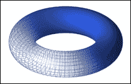
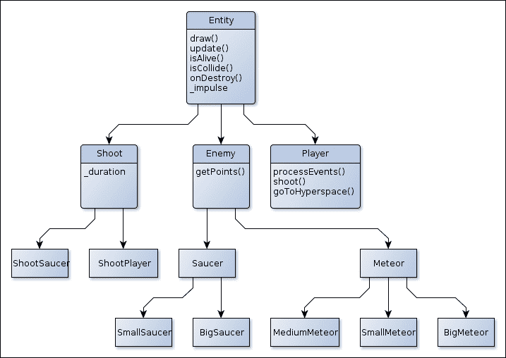
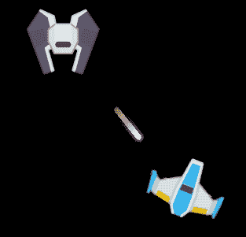
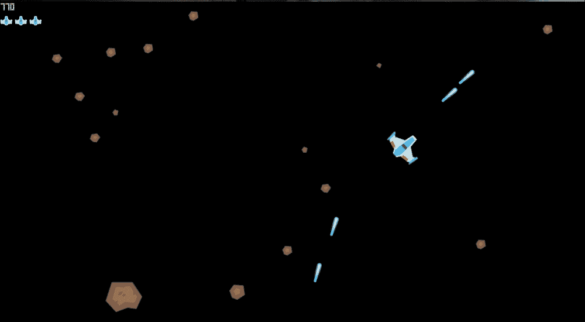
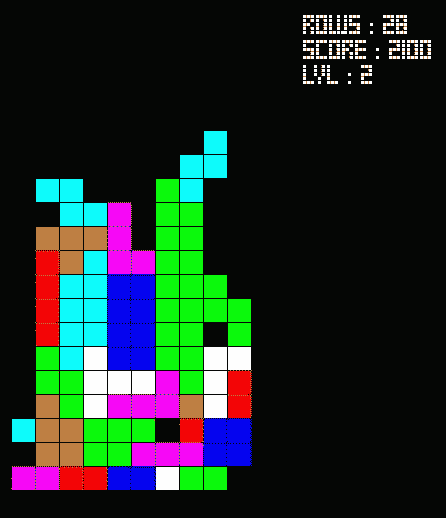

# 第三章. 制作完整的 2D 游戏

在这一章中，我们将最终制作我们的第一个游戏。实际上，我们将构建两个游戏，如下所示：

+   我们将通过提高我们对 SFML 的实际应用来构建我们的第一个游戏，一个类似小行星的游戏。

+   我们接下来的游戏将是一个类似俄罗斯方块的克隆游戏

我们还将学习一些技能，例如：

+   实体模型

+   板块管理

我们都是复古游戏的粉丝，所以让我们立即开始创建一些游戏。此外，这两个游戏的结构完全不同。从学习过程的角度来看，这真的很有趣。

# 将我们的应用程序转换为小行星克隆

**小行星**是由 Atari Inc.于 1979 年创建的街机“射击”游戏，被认为是经典之作。玩家控制一艘宇宙飞船在星云中，有时屏幕上会出现飞碟攻击它。这个游戏的目标是通过射击摧毁所有的星云和飞碟。每个关卡都会增加星云的数量，游戏难度也会逐渐增加。

要构建这个游戏，我们将以我们的实际应用为基础，但我们需要添加很多东西。

## 玩家类

玩家被表示为一艘宇宙飞船。宇宙飞船可以左右旋转，射击，并且宇宙飞船还可以给自己加速。玩家还可以将飞船送入超空间，使其消失并在屏幕上的随机位置重新出现，但存在自我毁灭或出现在小行星上的风险。

玩家开始时有三条生命，每获得 10,000 分，就会赢得一条新生命。如果玩家撞到某个东西，它将被摧毁，玩家将失去一条生命。它将在起点重新出现，即屏幕的中间。

## 关卡

每个关卡开始时，在随机位置有一些大流星，它们以各种方向漂移。每个关卡都会增加流星的数量。这个数量对于第一关是四个，从第五关开始是十一个。

板块有点特殊，因为它是一个欧几里得环面（更多细节请参考维基百科的定义：[`en.wikipedia.org/wiki/Torus`](http://en.wikipedia.org/wiki/Torus)）。屏幕的顶部和底部会相互包裹，左右两侧也是如此，除了右上角与左下角相遇，反之亦然。当屏幕上没有流星时，关卡结束。

## 敌人

有两种敌人：流星和飞碟。如果你撞到它们，它们都会摧毁你，并且当你射击摧毁它们时，它们都会增加一些分数。

## 流星

有三种类型的流星。每种流星都有其自己的大小、速度和与其它不同的分数。以下是一个总结不同流星特性的表格：

| 大小 | 大 | 中等 | 小 |
| --- | --- | --- | --- |
| 速度 | 慢 | 中等 | 快 |
| 分割 | 2~3 中型 | 2~3 小型 | - |
| 基础分数 | 20 | 60 | 100 |

每当流星撞击时，它会被分裂成更小的流星，除了那些小的流星。大流星也是代表每个等级起始流星场的那些流星。

## 飞碟

不时地！一个飞碟出现并试图干扰玩家。有两种飞碟，一个大飞碟，除了移动外什么都不做，还有一个小飞碟，它会向玩家射击。玩家的分数越高，小飞碟出现而不是大飞碟的机会就越高。从 40,000 分开始，只有小飞碟出现。此外，玩家拥有的分数越高，飞碟的精度就越高。

# 修改我们的应用程序

现在我们已经拥有了构建游戏所需的所有信息，让我们开始对其进行修改。第一步是将我们的世界改变为一个具有固定大小的欧几里得环面。以下是从维基百科页面中获取的环面的表示：



要做到这一点，我们需要从游戏内部获取一些信息，例如世界大小。我们将在`Game`类内部添加两个整数值，`height`和`width`：

```cpp
const int _x, const _y;
```

我们将使用构造函数来初始化它们。所以现在，我们需要为这个类提供参数：

```cpp
Game(int x=800, int y=600);
```

我们需要稍微修改我们的构造函数实现，如下面的代码片段所示：

```cpp
Game::Game(int x, int y) : _window(sf::VideoMode(x,y),"03_Asteroid"),x(x),y(y){
     _player.setPosition(100,100);
}
```

好吧，现在我们可以选择世界的大小，但如何将其变成一个环面呢？在现实中，这并不复杂。我们只需要在移动每个实体后检查它们的位置；如果它们超出了世界范围，我们就纠正它们的位置。

让我们用下面的代码片段尝试一下玩家：

```cpp
void Game::update(sf::Time deltaTime)
{
  _player.update(deltaTime);
  sf::Vector2f player_pos = _player.getPosition();
  if(player_pos.x < 0){
    player_pos.x = _x;
    player_pos.y = _y - player_pos.y;
  } else if (player_pos.x > _x){
    player_pos.x = 0;
    player_pos.y = _y - player_pos.y;
  }
  if(player_pos.y < 0)
  player_pos.y = _y;
  else if(player_pos.y > _y)
  player_pos.y = 0;
  _player.setPosition(player_pos);
}
```

如您所见，首先，我们在玩家上调用`update()`方法，然后如果它超出了世界范围，我们就纠正其位置。我们现在有一个无限的世界。

使用的`Player::getPosition()`方法如下：

```cpp
const sf::Vector2f& Player::getPosition()const{return _ship.getPosition();}
```

唯一令人难过的是，我们在`Game`类中修改了玩家的位置。如果玩家能自己管理其位置会更好，不是吗？错误！如果你稍微思考一下，你会理解玩家并不关心世界的形状。适应其实体位置的工作是世界的责任，而不是相反。

这里我们有两个选择：保持我们的代码不变或者建立一个更灵活的系统。如果我们快速思考一下管理流星和飞碟所需的要素，第二个选择似乎最好。所以让我们构建一个更灵活的系统。

在游戏开发中，有两种主要的设计模式可以回答这个问题。它们如下：

+   层次实体系统

+   实体组件系统

这些模式中的每一个都以不同的方式回答了这个问题。我们将在世界类之后看到它们。

## 世界类

我们所有的逻辑实际上都是在 `Game` 类中实现的。这是一个好方法，但我们还可以做得更好。如果我们仔细想想，`Game` 类不仅要处理事件、创建窗口并将其他类委托给暂停和菜单系统，还要执行所有的实体管理。

为了更明确，游戏不需要管理任何实体，但它可以创建一个世界并填充它。然后，所有的工作都由世界类来完成。

世界是一个实体的容器，同时也是音效的容器。它具有特定的尺寸、形状和规则（如物理规则）。它还可以在屏幕上显示。最后，这个类的代码片段看起来如下：

```cpp
class World : public sf::Drawable
{
  public:
  World(const World&) = delete;
  World& operator=(const World&) = delete;
  World(float x,float y);
  ~World();
  void add(Entity* entity);
  void clear();
  bool isCollide(const Entity& other);
  int size();

  void add(Configuration::Sounds sound_id);

  const std::list<Entity*> getEntities()const;
  int getX()const;
  int getY()const;
  void update(sf::Time deltaTime);
  private:
  std::list<Entity*>  _entities; 
  std::list<Entity*>  _entities_tmp;

  std::list<std::unique_ptr<sf::Sound>> _sounds;
  virtual void draw(sf::RenderTarget& target, sf::RenderStates 
  states) const override;

  const int _x;
  const int _y;
};
```

与其他类一样，我们使 `World` 类不可复制。我们添加了一些函数来向世界添加实体，以及一些函数来移除它们。因为世界上可能有一些音效，所以我们还添加了一个方法来添加它们。它需要一个来自 `Configuration` 类的 ID，这与 `Textures` 的 ID 完全一样。我们还添加了一些函数来获取信息，例如实体的数量、世界的尺寸等等。

现在，如果我们查看属性，我们可以看到两个用于实体的容器。这是一个会使我们的生活更简单的技巧。我将在实现中解释它。另一个容器用于可以添加到世界中的 `sf::Sound`。我将在实现中解释它。

现在，让我们看看实现。这个类有点长，并且在这个章节中一些函数被简化以节省空间：

```cpp
World::World(float x,float y): _x(x),_y(y){}
World::~World(){clear();}
```

这些函数没有难度。构造函数只是设置世界的尺寸，析构函数则清除它；如下代码片段所示：

```cpp
void World::add(Entity* entity) {
    _entities_tmp.push_back(entity);
}
```

这是一个简单的函数，但我们并没有直接将实体添加到 `_entites` 容器中。相反，我们将其添加到一个临时容器中，该容器只包含在特定时间段内创建的实体。这样做的原因将在 `update()` 函数中解释：

```cpp
void World::clear()
{
  for(Entity* entity :_entities)
  delete entity;
  _entities.clear();
  for(Entity* entity :_entities_tmp)
  delete entity;
  _entities_tmp.clear();
  _sounds.clear();
}
```

在这里，我们通过删除所有实体和音效来清理整个世界。因为我们使用原始指针来处理实体，所以我们需要显式地删除它们，与 `sf::Sound` 不同：

```cpp
void World::add(Configuration::Sounds sound_id)
{
  std::unique_ptr<sf::Sound> sound(new sf::Sound(Configuration::sounds.get(sound_id)));
  sound->setAttenuation(0);
  sound->play();
  _sounds.emplace_back(std::move(sound));
}
```

这个函数从 `Configuration` 类中包含的 `sf::SoundBuffer` 参数创建一个 `sf::Sound` 参数，初始化它并播放。因为每个 `sf::Sound` 都有自己的线程，所以 `sf::Sound::play()` 参数不会中断我们的主线程。然后，我们将它存储在适当的容器中：

```cpp
bool World::isCollide(const Entity& other)
{
    for(Entity* entity_ptr : _entities)
        if(other.isCollide(*entity_ptr))
            return true;
    return false;
}
```

`World::isCollide()` 函数是一个辅助函数，用于检查一个实体是否与另一个实体发生碰撞。这将在游戏开始时用于放置流星：

```cpp
int World::size(){return _entities.size() + _entities_tmp.size();}
int World::getX()const{return _x;}
int World::getY()const {return _y;}
const std::list<Entity*> World::getEntities()const {return _entities;}
```

这些函数相当简单。它们只是包含一些获取器。唯一特别的是 `size()` 函数，因为它返回实体的总数：

```cpp
void World::update(sf::Time deltaTime)
{
  if(_entities_tmp.size() > 0)
  _entities.merge(_entities_tmp);
  for(Entity* entity_ptr : _entities)
  {
    Entity& entity = *entity_ptr; 
    entity.update(deltaTime);    
    sf::Vector2f pos = entity.getPosition();
    if(pos.x < 0)
    {
      pos.x = _x;
      pos.y = _y - pos.y;
    } else if (pos.x > _x) {
      pos.x = 0;
      pos.y = _y - pos.y;
    }
    if(pos.y < 0)
    pos.y = _y;
    else if(pos.y > _y)
    pos.y = 0;
    entity.setPosition(pos);
  }
  const auto end = _entities.end();
  for(auto it_i = _entities.begin(); it_i != end; ++it_i)
  {
    Entity& entity_i = **it_i;
    auto it_j = it_i;
    it_j++;
    for(; it_j != end;++it_j)
    {
      Entity& entity_j = **it_j;
      if(entity_i.isAlive() and entity_i.isCollide(entity_j))
      entity_i.onDestroy();
      if(entity_j.isAlive() and entity_j.isCollide(entity_i))
      entity_j.onDestroy();
    }
  }
  for(auto it = _entities.begin(); it != _entities.end();)
  {
    if(not (*it)->isAlive())
    {
      delete *it;
      it = _entities.erase(it);
    }
    else
    ++it;
  }
  _sounds.remove_if([](const std::unique_ptr<sf::Sound>& sound) -> bool {
    return sound->getStatus() != sf::SoundSource::Status::Playing;
  });
}
```

这个函数比之前的版本要复杂一些。让我们详细解释一下：

1.  我们将实体的容器合并到主容器中。

1.  我们更新所有实体，然后验证它们的位置是否正确。如果不正确，我们会纠正它们。

1.  我们检查所有实体和已死亡实体的碰撞，并移除已死亡的实体。

1.  已播放的声音从容器中移除。

在更新和碰撞循环中，一些实体可以创建其他实体。这就是 `_entities_tmp` 容器存在的原因。这样我们就能确保我们的迭代器在任何时候都不会损坏，并且我们不会更新/碰撞那些还没有经历过一个帧的实体，如下面的代码片段所示：

```cpp
void World::draw(sf::RenderTarget& target, sf::RenderStates states) const
{
  for(Entity* entity : _entities)
  target.draw(*entity,states);
}
```

这个函数很简单，并将它的任务转发给所有实体。如您所见，`World`类并不复杂，管理任何类型的实体和所有声音。通过这样做，我们可以从`Game`类中移除很多任务，并将其委托给`World`类。

## 分层实体系统

这个系统是最直观的。每种实体在您的代码中都是一个不同的类，并且它们都扩展自一个共同的虚拟类，通常称为**Entity**。所有的逻辑都在`Entity::update()`函数内部完成。对于我们的项目，层次树可能类似于以下图示：



如您所见，有几个抽象层。对于这个项目，因为我们没有很多不同种类的实体，我们将使用这个解决方案。

## 实体组件系统

这是一个完全不同的方法。不是将每种类型的实体表示为一个类，而只有一个类：实体。我们给这个实体附加一些属性，如位置、可绘制的能力、一把枪，以及您想要的任何东西。这个系统非常强大，是视频游戏中的一个很好的解决方案，但构建起来也很困难。我不会对这个系统进行更详细的介绍，因为我在下一章会回到它。所以即使我们现在不使用它，也不要沮丧，我们将在下一个项目中构建并使用它。

# 设计我们的游戏

既然我们已经选择了实体组件系统方法并创建了一个将由它们填充的世界，让我们考虑一下需求。以下表格总结了需求：

| Entity | Parent | 特性 |
| --- | --- | --- |
| `Entity` |   | 这个可以移动，可以被绘制，可以与其他实体相撞 |
| `Player` | Entity | 这个可以射击，由输入控制，可以与除了它射击的目标之外的所有东西相撞 |
| `Enemy` | Entity | 这个可以通过射击被摧毁，当被射击摧毁时，会给玩家一些分数 |
| `Saucer` | Enemy | 当分数增加时，这个有更大的几率生成一个小飞碟，这可以与除了飞碟射击之外的所有东西相撞 |
| `BigSaucer` | Saucer | 这有一个特殊的皮肤 |
| `SmallSaucer` | Saucer | 这个可以射击`Player`实体，它有一个特殊的皮肤 |
| `Meteors` | Enemy | 这个可以与除了其他陨石之外的所有东西相撞 |
| `BigMeteor` | 流星 | 在被摧毁时分裂成一些 `MediumMeteor`，并且具有特殊皮肤 |
| `MediumMeteor` | 流星 | 在被摧毁时分裂成 `SmallMeteor`，并且具有特殊皮肤 |
| `SmallMeteor` | 流星 | 具有特殊皮肤 |
| `Shoot` | 实体 | 这存在特定的时间 |
| `ShootPlayer` | 射击 | 这只能与敌人发生碰撞，并且具有特定皮肤 |
| `ShootSaucer` | 射击飞碟 | 这可以与 `Meteor` 和 `Player` 发生碰撞，并且具有特殊皮肤 |

现在我们已经拥有了每个类所需的所有信息，让我们开始构建它们。最终结果将类似于以下内容：


## 准备碰撞

在这个项目中，我们将使用简单的碰撞检测：圆形之间的碰撞。正如刚才所说的，这非常基础，可以大幅改进，但就目前而言是足够的。看看这个类：

```cpp
class Collision
{
  public:
    Collision() = delete;
    Collision(const Collision&) = delete;
    Collision& operator=(const Collision&) = delete;
    static bool circleTest(const sf::Sprite& first, const sf::Sprite& second);
};
```

这里没有成员，该类不能被实例化。该类旨在将其他类使用的某些辅助函数分组。因此，这里只描述了一个碰撞测试，它接受两个 `sf::Sprite` 作为参数。看看实现。

```cpp
bool Collision::circleTest(const sf::Sprite& first, const sf::Sprite& second)
{
  sf::Vector2f first_rect(first.getTextureRect().width,
  first.getTextureRect().height);
  first_rect.x *= first.getScale().x;
  first_rect.y *= first.getScale().y;

  sf::Vector2f second_rect(second.getTextureRect().width, 
  second.getTextureRect().height);
  second_rect.x *= second.getScale().x;
  second_rect.y *= second.getScale().y;

  float radius1 = (first_rect.x + first_rect.y) / 4;
  float radius2 = (second_rect.x + second_rect.y) / 4;
  float xd = first.getPosition().x - second.getPosition().x;
  float yd = first.getPosition().y - second.getPosition().y;

  return std::sqrt(xd * xd + yd * yd) <= radius1 + radius2;
}
```

函数首先计算每个精灵的半径。然后它检查两个精灵之间的距离（使用勾股定理计算）是否小于两个半径之和。如果是的话，则没有碰撞，否则，存在碰撞，即使我们不知道确切的碰撞点。

## 实体类

为了构建我们的系统，我们需要基类，所以让我们从 `Entity` 类开始：

```cpp
class Entity :  public sf::Drawable
{
  public:
//Constructors
  Entity(const Entity&) = delete;
  Entity& operator=(const Entity&) = delete;
  Entity(Configuration::Textures tex_id,World& world);
  virtual ~Entity();

//Helpers
  virtual bool isAlive()const;

  const sf::Vector2f& getPosition()const;
  template<typename ... Args>
  void setPosition(Args&& ... args);
  virtual bool isCollide(const Entity& other)const = 0;

//Updates
  virtual void update(sf::Time deltaTime) = 0;
  virtual void onDestroy();

  protected:
  sf::Sprite _sprite;
  sf::Vector2f _impulse;
  World& _world;
  bool _alive;

  private :
  virtual void draw(sf::RenderTarget& target, sf::RenderStates 
  states) const override;
};
```

让我们一步一步地讨论这个类：

1.  首先，我们使该类不可复制。

1.  然后我们将析构函数设置为虚拟。这是一个非常重要的点，因为 `Entity` 类将被用作多态类。因此，我们需要将析构函数设置为虚拟，以便能够销毁真实对象，而不仅仅是它的 `Entity` 基类。

1.  我们还定义了一些辅助函数，以确定实体是否存活，以及设置/获取其实体位置。代码与我们在 `Player` 类中使用的代码相同。我们还定义了一些将在其他类中重写的虚拟方法。

1.  虚拟函数 `onDestroy()` 非常重要。它的目的是在实体被销毁之前执行一些代码，例如通过射击或其他方式。例如，`Meteor` 实体的分裂能力将被放入这个函数中，以及所有由对象摧毁引起的各种声音。

现在看看 `Entity` 类的实现：

```cpp
Entity::Entity(Configuration::Textures tex_id,World& world) : _world(world),_alive(true)
{
  sf::Texture& texture = Configuration::textures.get(tex_id);
  _sprite.setTexture(texture);
  _sprite.setOrigin(texture.getSize().x/2.f,texture.getSize().y/2.f);
}
```

构造函数将纹理设置为内部的 `sf::Sprite` 函数，然后将其原点居中。我们还设置了实体的世界和存活值：

```cpp
const sf::Vector2f& Entity::getPosition()const {return _sprite.getPosition();}
void Entity::draw(sf::RenderTarget& target, sf::RenderStates states) const {target.draw(_sprite,states);}
```

这两个函数与 `Player` 类中的函数完全相同。所以这里没有惊喜：

```cpp
bool Entity::isAlive()const {return _alive;}
void Entity::onDestroy(){_alive = false;}
```

这两个函数是新的。它只是一个辅助函数。`IsAlive()`用于确定实体是否需要从世界中移除，而`onDestroy()`函数是在检测到与其他`Entity`的碰撞时将被调用的方法。目前还没有什么复杂的事情。

## 玩家类

现在我们有了`Entity`类，让我们将`Player`类更改为从`Entity`扩展：

```cpp
class Player : public Entity , public ActionTarget<int>
{
  public:
  Player(const Player&) = delete;
  Player& operator=(const Player&) = delete;
  Player(World& world);

  virtual bool isCollide(const Entity& other)const;
  virtual void update(sf::Time deltaTime);
  void processEvents();
  void shoot();
  void goToHyperspace();
  virtual void onDestroy();

  private:
  bool _isMoving;
  int _rotation;
  sf::Time _timeSinceLastShoot;
}
```

如您所见，我们移除了所有与位置和显示相关的函数和属性。`Entity`类已经为我们做了这些。现在这个类的实现如下：

```cpp
Player::Player(World& world) : Entity(Configuration::Textures::Player,world),ActionTarget(Configuration::player_inputs),_isMoving(false),_rotation(0)
{
  //bind ..     
  bind(Configuration::PlayerInputs::Shoot,this{
    shoot();
  });
  bind(Configuration::PlayerInputs::Hyperspace,this{
    goToHyperspace();
  });
}
```

现在，我们移除了初始化`_sprite`函数的所有代码，并将任务委托给`Entity`构造函数。我们还添加了两个新能力，射击和进入超空间：

```cpp
bool Player::isCollide(const Entity& other)const
{
  if(dynamic_cast<const ShootPlayer*>(&other) == nullptr) {
    return Collision::circleTest(_sprite,other._sprite);
  }
  return false;
}
```

我们设置了碰撞的默认行为。我们需要知道`Entity`的实际类型作为参数。为此，我们使用虚拟表查找，尝试将`Entity`类转换为特定的指针类型。如果这不可能，`dynamic_cast()`将返回`nullptr`。还有其他方法可以做到这一点，例如双重分派。但这里使用的是最简单、最容易理解的方法，但操作较慢。一旦知道了实体的实际类型，就会进行碰撞测试。在这个项目中，每个实体的碰撞框是其精灵内切圆。这是一个相当好的近似：

```cpp
void Player::shoot()
{
  if(_timeSinceLastShoot > sf::seconds(0.3))
  {
    _world.add(new ShootPlayer(*this));
    _timeSinceLastShoot = sf::Time::Zero;
  }
}
```

这个函数创建一个`ShootPlayer`实例并将其添加到世界中。因为我们不希望玩家在每一帧都创建射击，所以我们添加了一个计时器，它在`Player::update()`方法中更新，如下所示：

```cpp
void Player::goToHyperspace()
{
  _impulse = sf::Vector2f(0,0);
  setPosition(random(0,_world.getX()),random(0,_world.getY()));
  _world.add(Configuration::Sounds::Jump);
}
```

这个方法将玩家传送到世界中的随机位置。它还移除了所有推力，因此玩家在传送后不会继续以之前的方向移动：

```cpp
void Player::update(sf::Time deltaTime)
{
  float seconds = deltaTime.asSeconds();
  _timeSinceLastShoot += deltaTime;
  if(_rotation != 0)
  {
    float angle = _rotation*250*seconds;
    _sprite.rotate(angle);
  }

  if(_isMoving)
  {
    float angle = _sprite.getRotation() / 180 * M_PI - M_PI / 2;
    _impulse += sf::Vector2f(std::cos(angle),std::sin(angle)) * 300.f * 
    seconds;
  }
  _sprite.move(seconds * _impulse);
}
```

这个方法根据用户的不同操作更新`Player`的位置和旋转。它还更新自上次射击以来的时间，以便能够再次射击。

```cpp
void Player::onDestroy()
{
  Entity::onDestroy();
  Configuration::lives--;
  _world.add(Configuration::Sounds::Boom);
}
```

为了更好地理解`Entity::onDestroy()`方法，请记住，当发生碰撞时，这个函数在`Entity`实例的销毁（以及析构函数的调用）之前被调用。因此，在这里我们调用类的`Entity`基类的`onDestroy()`函数，然后执行玩家的特殊操作，例如减少生命值、将玩家值设置为`nullptr`，最后，向世界中添加爆炸声音。`Player`类的其他方法没有改变。

## 敌人类

我们现在将创建敌人类，正如我们在`设计我们的游戏部分`开头的表中已经描述的那样：

```cpp
class Enemy : public Entity
{
  public:
  Enemy(const Enemy&) = delete;
  Enemy& operator=(const Enemy&) = delete;
  Enemy(Configuration::Textures tex_id,World& world);

  virtual int getPoints()const = 0;
  virtual void onDestroy();
};
```

与`Player`类相比，这个类相当小，因为它不需要很多新的逻辑。我们只需要简要指定`onDestroy()`方法，通过向游戏的全球得分添加分数来实现。因此，我们创建了一个`getPoints()`方法，它将简单地返回敌人的分数。

```cpp
Enemy::Enemy(Configuration::Textures tex_id,World& world) : 
  Entity(tex_id,world)
{
  float angle = random(0.f,2.f*M_PI);
  _impulse = sf::Vector2f(std::cos(angle),std::sin(angle));
}
```

构造函数简单地初始化`_impulse`向量到一个随机的值，但长度为`1`。这个向量将在它们各自的构造函数中乘以`Saucers`/`Meteor`实体的速度：

```cpp
void Enemy::onDestroy()
{
  Entity::onDestroy();
  Configuration::addScore(getPoints());
}
```

这个方法简单地从对象的`Entity`基类中调用`onDestroy()`函数，然后添加摧毁对象所获得的分数。

## 飞盘类

现在我们已经创建了`Enemy`类，我们可以构建符合我们预期的`Saucer`基类：

```cpp
class Saucer : public Enemy
{
  public:
  Saucer(const Saucer&) = delete;
  Saucer& operator=(const Saucer&) = delete;
  using Enemy::Enemy;

  virtual bool isCollide(const Entity& other)const;
  virtual void update(sf::Time deltaTime);
  virtual void onDestroy();
  static void newSaucer(World& world);
};
```

这个类相当简单；我们只需指定已经构建在`Entity`和`Enemy`类中的方法。因为类没有指定构造函数，所以我们使用 using-declaration 来引用`Enemy`中的那个。在这里，我们引入了一个新函数，`newSaucer()`。这个函数将根据玩家的分数随机创建一个飞盘并将其添加到世界中。

现在，看看这个类的实现：

```cpp
bool Saucer::isCollide(const Entity& other)const
{
  if(dynamic_cast<const ShootSaucer*>(&other) == nullptr) {
    return Collision::circleTest(_sprite,other._sprite);
  }
  return false;
}
```

这里使用了与`Player::isCollide()`相同的技巧，所以没有惊喜。我们在`Saucer`基类中指定这个函数，因为任何飞盘的碰撞都是相同的。这避免了代码重复，如下所示：

```cpp
void Saucer::update(sf::Time deltaTime)
{
  float seconds = deltaTime.asSeconds();
  Entity* near = nullptr;
  float near_distance = 300;
  for(Entity* entity_ptr : _world.getEntities())
  {
    if(entity_ptr != this and(dynamic_cast<const 
      Meteor*>(entity_ptr) or dynamic_cast<const 
        ShootPlayer*>(entity_ptr)))
    {
      float x = getPosition().x - entity_ptr->getPosition().x;
      float y = getPosition().y - entity_ptr->getPosition().y;
      float dist = std::sqrt(x*x + y*y);
      if(dist < near_distance) {

           near_distance = dist;
           near = entity_ptr;
     }
  }
}
if(near != nullptr) 
{
  sf::Vector2f pos = near->getPosition() - getPosition();
  float angle_rad = std::atan2(pos.y,pos.x);
  _impulse -= 
    sf::Vector2f(std::cos(angle_rad),std::sin(angle_rad)) * 300.f 
      * seconds;
} else {
  sf::Vector2f pos = Configuration::player->getPosition() - 
    getPosition();
  float angle_rad = std::atan2(pos.y,pos.x);
  _impulse += 
    sf::Vector2f(std::cos(angle_rad),std::sin(angle_rad)) * 100.f 
      * seconds;
  }
_sprite.move(seconds * _impulse);
}
```

这个函数相当长，但并不复杂。它管理着飞盘的运动。让我们一步一步地解释它：

1.  我们寻找飞盘可能与之碰撞的最近的对象。

1.  如果发现一个太靠近的对象，我们向飞盘添加一个与该对象相反方向的推力。目的是避免碰撞。

1.  现在我们继续其他函数。

    ```cpp
    void Saucer::onDestroy()
    {
        Enemy::onDestroy();
        _world.add(Configuration::Sounds::Boom2);
    }
    ```

1.  这个函数很简单。我们只是从类的`Enemy`基类中调用`onDestroy()`方法，然后向世界添加一个爆炸声：

    ```cpp
    void Saucer::newSaucer(World& world)
    {
      Saucer* res = nullptr;
      if(book::random(0.f,1.f) > Configuration::getScore()/ 40000.f)
      res = new BigSaucer(world);
      else
      res = new SmallSaucer(world);
      res->setPosition(random(0,1)*world.getX(),random(0.f,(float)world.getY()));
      world.add(res);
    }
    ```

1.  如前所述，这个函数随机创建一个飞盘并将其添加到世界中。玩家拥有的分数越高，创建`SmallSaucer`实体的机会就越大。当分数达到 40,000 时，就像游戏描述中解释的那样创建`SmallSaucer`。

现在我们已经创建了`Saucer`基类，让我们创建`SmallSaucer`类。我不会解释`BigSaucer`类，因为这个类与`SmallSaucer`类相同，但更简单（没有射击），如下面的代码片段所示：

```cpp
class SmallSaucer : public Saucer
{
  public :
  SmallSaucer(World& world);
  virtual int getPoints()const;
  virtual void update(sf::Time deltaTime);
  private:
  sf::Time_timeSinceLastShoot;
};
```

因为我们知道`SmallSaucer`实体的皮肤，所以我们不需要将纹理 ID 作为参数，所以我们将其从构造函数参数中删除。我们还添加了一个属性，用于存储自上次射击以来经过的时间，就像在`Player`实体中一样。

现在看看实现：

```cpp
SmallSaucer::SmallSaucer(World& world) : Saucer(Configuration::Textures::SmallSaucer,world)
{
  _timeSinceLastShoot = sf::Time::Zero;
  _world.add(Configuration::Sounds::SaucerSpawn2);
  _impulse *= 400.f;
}
```

这个构造函数很简单，因为大部分工作已经在类的基类中完成了。我们只需初始化推力，并在飞盘出现时向世界添加一个声音。这将警告玩家敌人，并为游戏增添一些乐趣：

```cpp
int SmallSaucer::getPoints()const {return 200;}
```

这个函数简单地设置了当`SmallSaucer`实体被摧毁时获得的分数：

```cpp
void SmallSaucer::update(sf::Time deltaTime)
{
  Saucer::update(deltaTime);
  _timeSinceLastShoot += deltaTime;
  if(_timeSinceLastShoot > sf::seconds(1.5))
  {
    if(Configuration::player != nullptr)
    _world.add(new ShootSaucer(*this));
    _timeSinceLastShoot = sf::Time::Zero;
  }
}
```

这个函数相当简单。首先，我们通过从`Saucer`基类调用`update()`函数来移动碟子，然后尽可能快地射击玩家，这就是全部。

下面是碟子行为的截图：



## **流星类**

现在是时候构建游戏的主要敌人：流星了。我们将从虚拟的`Meteor`类开始。以下是它的定义：

```cpp
class Meteor : public Enemy
{
  public:
  Meteor(const Meteor&) = delete;
  Meteor& operator=(const Meteor&) = delete;
  using Enemy::Enemy;

  virtual bool isCollide(const Entity& other)const;
  virtual void update(sf::Time deltaTime);
};
```

如您所见，这个类非常短。我们只指定碰撞规则和将管理其移动的更新函数。现在，看看它的实现：

```cpp
bool Meteor::isCollide(const Entity& other)const
{
  if(dynamic_cast<const Meteor*>(&other) == nullptr) {
    return Collision::circleTest(_sprite,other._sprite);
  }
  return false;
}
```

根据指定，碰撞测试是用所有`Entity`对象进行的，除了`Meteors`。在这里，我们再次使用`circleTest()`函数来测试与其他对象的碰撞：

```cpp
void Meteor::update(sf::Time deltaTime)
{
  float seconds = deltaTime.asSeconds();
  _sprite.move(seconds * _impulse);
}
```

这个函数非常简单。我们只通过计算自上一帧以来移动的距离来移动`meteor`实体。这里没有复杂的事情要做，因为流星始终是直的，所以它的方向没有变化。

现在我们有了所有流星的基础，让我们来制作大流星。我不会解释其他的，因为逻辑是相同的。下面的代码片段解释了它：

```cpp
class BigMeteor : public Meteor
{
  public :
  BigMeteor(World& world);
  virtual int getPoints()const;
  virtual void onDestroy();
};
```

您可以看到这个类也非常简洁。我们只需要定义构造函数、得分数量和破坏。现在，这个类的实现如下：

```cpp
BigMeteor::BigMeteor(World& world) : Meteor((Configuration::Textures)random(Configuration::Textures::BigMeteor1,Configuration::Textures::BigMeteor4),world)
{
  _impulse *= 100.f;
}
```

构造函数不难，但纹理 ID 的选择是。因为对于`BigMeteor`有几种可能的纹理，我们随机选择其中之一，如下面的代码片段所示：

```cpp
int BigMeteor::getPoints()const {return 20;h}
void BigMeteor::onDestroy()
{
  Meteor::onDestroy();
  int nb = book::random(2,3);
  for(int i=0;i<nb;++i)
  {
    MediumMeteor* meteor = new MediumMeteor(_world);
    meteor->setPosition(getPosition());
    _world.add(meteor);
  }
  _world.add(Configuration::Sounds::Explosion1);
}
```

这个方法是最重要的一个。当一个大流星被摧毁时，它会创建一些其他流星并将它们添加到世界中。我们还添加了一个爆炸声，以增加游戏中的趣味性。

## **射击类**

现在所有敌人都已经制作好了，让我们构建最后一个实体类，`Shoot`。射击非常简单。它只是一个直线移动的实体，并且只在特定时间内存在：

```cpp
class Shoot : public Entity
{
  public:
  Shoot(const Shoot&) = delete;
  Shoot& operator=(const Shoot&) = delete;
  using Entity::Entity;
  virtual void update(sf::Time deltaTime);
  protected:
  sf::Time _duration;
};
```

这里没有什么令人惊讶的，我们只添加了一个`_duration`属性，它将存储自`Shoot`类创建以来的经过时间。现在，更新函数的实现如下：

```cpp
void Shoot::update(sf::Time deltaTime)
{
  float seconds = deltaTime.asSeconds();
  _sprite.move(seconds * _impulse);
  _duration -= deltaTime;
  if(_duration < sf::Time::Zero)
  _alive = false;
}
```

这个函数移动射击并调整`_duration`属性，通过减去经过的时间。如果射击的生命时间达到零，我们将其设置为死亡，世界将完成剩余的工作。

现在，让我们构建`ShootPlayer`类：

```cpp
class ShootPlayer : public Shoot
{
  public :
  ShootPlayer(const ShootPlayer&) = delete;
  ShootPlayer& operator=(const ShootPlayer&) = delete;
  ShootPlayer(Player& from);

  virtual bool isCollide(const Entity& other)const;
};
```

如您所见，这里的构造函数已经改变。除了创建射击的源之外，不再有`World`实例作为参数。让我们看看实现，以便更好地理解原因：

```cpp
ShootPlayer::ShootPlayer(Player& from) : Shoot(Configuration::Textures::ShootPlayer,from._world)
{
  _duration = sf::seconds(5);
  float angle = from._sprite.getRotation() / 180 * M_PI - M_PI / 2;
  _impulse = sf::Vector2f(std::cos(angle),std::sin(angle)) * 500.f;
  setPosition(from.getPosition());
  _sprite.setRotation(from._sprite.getRotation());
  _world.add(Configuration::Sounds::LaserPlayer);
}
```

如您所见，世界实例是从源复制的。此外，子弹的初始位置设置为创建`Player`类时的位置。我们还需要根据需要旋转子弹，并设置其方向。我不会解释碰撞函数，因为没有与之前解释的函数相比的新内容。

`ShootSaucer`类使用与`ShootPlayer`类相同的逻辑，但有一个变化。飞碟的准确性会随着玩家得分的增加而变化。所以我们需要添加一点随机性。让我们看看构造函数：

```cpp
ShootSaucer::ShootSaucer(SmallSaucer& from) : Shoot(Configuration::Textures::ShootSaucer,from._world)
{
  _duration = sf::seconds(5); 
  sf::Vector2f pos = Configuration::player->getPosition() - from.getPosition();
  float accuracy_lost = book::random(-1.f,1.f)*M_PI/((200+Configuration::getScore())/100.f);
  float angle_rad = std::atan2(pos.y,pos.x) + accuracy_lost;
  float angle_deg = angle_rad * 180 / M_PI;

  _impulse = sf::Vector2f(std::cos(angle_rad),std::sin(angle_rad)) * 500.f;
  setPosition(from.getPosition());
  _sprite.setRotation(angle_deg + 90);
  _world.add(Configuration::Sounds::LaserEnemy);
}
```

让我们一步一步地解释这个函数：

1.  我们计算子弹的方向向量。

1.  我们根据当前得分添加一点精度损失。

1.  我们根据计算出的方向设置`_impulsion`向量。

1.  我们根据需要设置精灵的位置和旋转。

1.  最后，我们将它发布到世界上。

现在所有类都已经创建，你将能够玩游戏。最终结果应该看起来像这样：



很不错，不是吗？

# 构建俄罗斯方块克隆

现在我们已经创建了一个完整的游戏，让我们再创建另一个，一个**俄罗斯方块**克隆。这个游戏比之前的游戏简单，并且构建时间会更短，但仍然非常有趣。实际上，这个游戏的内部架构与其他游戏真的很不同。这是因为这种游戏类型：一个拼图。游戏的目标是用由四个方块组成的拼图填满网格的行。每次完成一行，它就会被销毁，并且会给玩家加分。因为这是一种不同类型的游戏，所以有一些影响，因为在这个游戏中没有玩家或敌人，只有拼图和棋盘（网格）。对于这个游戏，我将只关注游戏逻辑。所以，我将不会重用之前制作的类，如`Action`、`ActionMap`、`ActionTarget`、`Configuration`和`ResourceManager`，以使代码更简洁。当然，你可以使用它们来改进提出的源代码。

因此，为了构建这个游戏，我们需要构建一些类：

+   `Game`：这个类将与之前项目的`Game`类非常相似，并将管理渲染。

+   `Board`：这个类将管理游戏的所有逻辑

+   `Piece`：这个类将代表所有不同类型的四联体（由四个方块组成的拼图）

+   `Stats`：这个类将用于向玩家显示不同的信息

最终的游戏将看起来像以下截图：



现在我们知道了如何构建一个游戏，我们将直接考虑每个类的需求。

## 统计类

这个类将用于向玩家显示游戏信息，如关卡、行数和得分。我们还将使用这个类来显示**游戏结束**信息，如果需要的话。因为这个类将在屏幕上显示一些信息，并且可以被放置在渲染空间的任何位置，我们将从`sf::Drawable`和`sf::Transformable`扩展它。以下是这个类的头文件：

```cpp
class Stats : public sf::Transformable,public sf::Drawable
{
  public:
  Stats();
  void addLines(int lines);
  unsigned int getLvl()const;
  void gameOver();

  private:
  virtual void draw(sf::RenderTarget& target,sf::RenderStates states=sf::RenderStates::Default) const override;

  unsigned int _nbRows;
  unsigned int _nbScore;
  unsigned int _nbLvl;
  bool _isGameOver;

  sf::Text _textRows;
  sf::Text _textScore;
  sf::Text _textLvl;
  sf::Text _textGameOver;
  sf::Font _font;
};
```

这个类没有真正的惊喜。我们有一些`sf::Text`将用于显示信息，以及它们的数值。我们还添加了点计算到这个类中，使用`addLines()`函数。

如前所述，对于俄罗斯方块游戏，我们需要关注游戏逻辑，因此我们不会使用任何字体管理器。

现在看看这个类的实现：

```cpp
constexpr int  FONT_SIZE 24;
Stats::Stats() : _nbRows(0), _nbScore(0), _nbLvl(0), _isGameOver(false)
{
  _font.loadFromFile("media/fonts/trs-million.ttf");
  _textRows.setFont(_font);
  _textRows.setString("rows : 0");
  _textRows.setCharacterSize(FONT_SIZE);
  _textRows.setPosition(0,0);

  _textScore.setFont(_font);
  _textScore.setString("score : 0");
  _textScore.setCharacterSize(FONT_SIZE);
  _textScore.setPosition(0,FONT_SIZE + 1);

  _textLvl.setFont(_font);
  _textLvl.setString("lvl : 0");
  _textLvl.setCharacterSize(FONT_SIZE);
  _textLvl.setPosition(0,(FONT_SIZE + 1)*2);

  _textGameOver.setFont(_font);
  _textGameOver.setString("Game Over");
  _textGameOver.setCharacterSize(72);
  _textGameOver.setPosition(0,0);
}
```

类的构造函数将所有属性设置为默认值：

```cpp
void Stats::gameOver(){_isGameOver = true;}
```

这里同样没有惊喜。我们只是将 `_isGameOver` 的值设置为 true：

```cpp
void Stats::addLines(int lines)
{
  if(lines > 0)
  {
    _nbRows += lines;
    _textRows.setString("rows : "+std::to_string(_nbRows));
    _textScore.setString("score : "+std::to_string(_nbScore));
    switch (lines)
    {
      case 1 : _nbScore += 40 * (_nbLvl+1);break;
      case 2 : _nbScore += 100 * (_nbLvl+1);break;
      case 3 : _nbScore += 300 * (_nbLvl+1);break;
      case 4 : _nbScore += 1200 * (_nbLvl+1);break;
      default :break;
    }
    _nbLvl = _nbRows / 10;
    _textLvl.setString("lvl : "+std::to_string(_nbLvl));
  }
}
```

这个函数有点意思。它的目的是根据完成的行数数量向全局得分添加分数。它还会纠正可绘制文本值和关卡。因为一个方块由四个方块组成，所以一个方块最多可以消除的行数是四行。所以在 switch 语句中，我们只需要检查这四种可能性：

```cpp
unsigned int Stats::getLvl()const{return _nbLvl;}
void Stats::draw(sf::RenderTarget& target, sf::RenderStates states) const
{
  if(not _isGameOver)
  {
    states.transform *= getTransform();
    target.draw(_textRows,states);
    target.draw(_textScore,states);
    target.draw(_textLvl,states);
  }
  else
  target.draw(_textGameOver,states);
}
```

正如所有其他的 `sf::Drawable::draw()` 函数一样，这个函数会在屏幕上绘制对象。如果游戏结束，我们会打印出**游戏结束**的信息；在其他情况下，我们会打印游戏得分、完成行数和当前关卡。

总之，这个类非常简单，它的任务是显示屏幕上的所有游戏信息。

## 方块类

现在，让我们构建这个游戏中的第一个重要类，即 `Piece` 类。在俄罗斯方块中，有七种不同的 tetrimino。我不会构建七个不同的类，而只构建一个。目的是展示另一种创建实体的方法。

但是，方块究竟是什么呢？如果你这么想，你会发现方块可以用数字数组来表示。此外，方块可以旋转。有三种方法来做这件事：在运行时计算旋转、在启动时预先计算旋转或在代码中预先定义它们。因为在我们游戏中，每个方块在创建游戏时都是已知的，所以我们将选择最后一种方法：硬编码所有旋转。这看起来可能不好，但实际上并非如此，它将大大简化我们后面的实现，但请记住，在每款游戏中硬编码项目并不是一个好主意。

现在让我们看看这个类：

```cpp
class Piece
{
  public:
  static const unsigned short int NB_ROTATIONS = 4; //< number of rotations
  static const unsigned short int MATRIX_SIZE = 4; //< size of the matrix
  static const unsigned int PIVOT_Y = 1;
  static const unsigned int PIVOT_X = 2;
  enum TetriminoTypes {O=0,I,S,Z,L,J,T,SIZE}; //< different kind of pieces
  static const sf::Color TetriminoColors[TetriminoTypes::SIZE]; //< different colors for each kind of piece
  static const char TetriminoPieces[TetriminoTypes::SIZE][NB_ROTATIONS][MATRIX_SIZE][MATRIX_SIZE];//< store all the different shapes

  Piece(const Piece&) = delete;
  Piece& operator=(const Piece&) = delete;
  Piece(TetriminoTypes type,short int rotation); 
  TetriminoTypes getType()const;
  void setRotation(short int rotation); //< set the rotation
  short int getRotation()const;
  void setPosition(int x,int y);//< set the position in the
  //board

  int getPosX()const;
  int getPosY()const;
  sf::Time getTimeSinceLastMove()const;

  private:
  const TetriminoTypes _type; //< the piece type
  short int _rotation; //< the piece rotation
  int _positionX; //< position in the board
  int _positionY;//< position in the board
  sf::Clock _clockSinceLastMove;
};
```

这个类有点长。让我们一步一步地解释它：

1.  我们将定义一些常量变量，这些变量将用于配置目的。

1.  我们将定义一个包含所有不同 tetrimino 方块的 `enum` 函数。

1.  我们将定义一个颜色数组。每个单元格将代表在 `enum` 函数中先前定义的 tetrimino 的颜色。

1.  下一行是特别的。它定义了所有不同的 tetrimino 旋转。因为每个方块是一个二维数组，我们还需要这些信息。

1.  其他函数更常见：构造函数、获取器和设置器。

1.  我们将定义一些私有属性来存储方块的状态。

现在是这部分有趣的地方，所有这些功能的实现。由于做出的选择不同，与**小行星**游戏中的前一个实体相比，实现方式会有很大差异：

```cpp
const sf::Color Piece::TetriminoColors[Piece::TetriminoTypes::SIZE]= {
  sf::Color::Blue,
  sf::Color::Red,
  sf::Color::Green,
  sf::Color::Cyan,
  sf::Color::Magenta,
  sf::Color::White,
  sf::Color(195,132,58)
}
```

这个数组存储了所有由 `TetriminoTypes` 枚举定义的 tetrimino 的不同颜色：

```cpp
const char Piece::TetriminoPieces[Piece::TetriminoTypes::SIZE][Piece::NB_ROTATIONS][Piece::MATRIX_SIZE][Piece::MATRIX_SIZE] = {
    { // O
        {
            {0,0,0,0},
            {0,1,2,0},
            {0,1,1,0},
            {0,0,0,0}
        },
        //...
        {
            {0,0,0,0},
            {0,1,2,0},
            {0,1,1,0},
            {0,0,0,0}
        }
    },
    {//I
        {
            {0,0,0,0},
            {1,1,2,1},
            {0,0,0,0},
            {0,0,0,0}
        },
        {
            {0,0,1,0},
            {0,0,2,0},
            {0,0,1,0},
            {0,0,1,0}
        },
        {
            {0,0,0,0},
            {1,1,2,1},
            {0,0,0,0},
            {0,0,0,0}
        },
        {
            {0,0,1,0},
            {0,0,2,0},
            {0,0,1,0},
            {0,0,1,0}
        } 
    },
    //...
};
```

乍一看，这似乎是一个非常特殊的数组，但结果并非如此。实际上，每个不同的棋子在数组的第一个单元格中定义，第二个单元格表示这个棋子的所有不同旋转，其余的是棋子旋转的二维数组表示。`0` 值表示空白，`2` 表示棋子的中心，`1` 表示四连珠的另一个棋子。我没有放所有代码，因为代码相当长，但如果需要，您可以在 `03_Simple_2D_game/Tetris/src/SFML-Book/Piece.cpp` 中查看它。

```cpp
Piece::Piece(TetriminoTypes type,short int rotation) : _type(type), _rotation(rotation), _positionX(0), _positionY(0) {assert(rotation >= 0 and rotation < NB_ROTATIONS);}
```

### 注意

`assert` 函数是一个宏，如果表达式（如参数）为假，它将引发错误并退出程序。您可以通过在代码/编译器选项中添加 `#define NDEBUG` 来删除它，以禁用此功能。

`assert()` 函数仅在调试模式下有用。当您想要确保在运行时遵循特定情况时使用它。

`Piece` 类的构造函数很简单，但我们很容易向它发送错误的参数值。因此，我决定向您展示断言功能，如下所示：

```cpp
Piece::TetriminoTypes Piece::getType()const {return _type;}

short int Piece::getRotation()const {return _rotation;}

int Piece::getPosX()const {return _positionX;}

int Piece::getPosY()const {return _positionY;}
sf::Time Piece::getTimeSinceLastMove()const {return _clockSinceLastMove.getElapsedTime();}

void Piece::setRotation(short int rotation)
{
  assert(rotation >= 0 and rotation < NB_ROTATIONS);
  _rotation = rotation;
  _clockSinceLastMove.restart();
}

void Piece::setPosition(int x,int y)
{
  _positionX = x;
  _positionY = y;
  _clockSinceLastMove.restart();
}
```

所有这些函数都是获取器和设置器，它们很简单。唯一特别的是 `setPosition`/`Rotation()` 函数，因为它们还会重置内部时钟。由于时钟存储自上次移动棋子以来的时间，实际上它不应该让您感到惊讶。

## `Board` 类

现在，所有的棋子都制作好了，让我们构建一个将管理它们的类，即 **Board**。

这个类将表示为一个存储颜色的网格（数组）。因此，从内部来看，这个类只是一个整数数组。每个单元格将存储棋子的类型，因为棋子的类型决定了它的颜色（参见 `Piece` 类）。现在看看这个类的头文件：

```cpp
class Board : public sf::Transformable,public sf::Drawable
{
  public:
  static const int DEFAULT_BOARD_COLUMNS = 10; 
  static const int DEFAULT_BOARD_LINE = 20;
  static const int DEFAULT_CELL_X = 24;
  static const int DEFAULT_CELL_Y = 24;

  Board(int columns=DEFAULT_BOARD_COLUMNS,int 
    line=DEFAULT_BOARD_LINE,int cell_x=DEFAULT_CELL_X,int 
      cell_y=DEFAULT_CELL_Y);
  ~Board();

  void spawn(Piece& piece);
  bool move(Piece& piece, int delta_x,int delta_y);
  bool isFallen(const Piece& piece);
  void drop(Piece& piece);
  bool rotateLeft(Piece& piece);
  bool rotateRight(Piece& piece);
  bool isGameOver();
  int clearLines(const Piece& piece); //< clear all possible lines

  private:
  bool rotate(Piece& piece,int rotation);
  void draw(const Piece& piece);
  void clear(const Piece& piece);
  virtual void draw(sf::RenderTarget& target,sf::RenderStates 
    states=sf::RenderStates::Default) const override; 
  void flood(const Piece& piece,int value);

        void flood(int grid_x,int grid_y,int piece_x,int piece_y,Piece::Tetrimino_Types type,int rotation,bool visited[][Piece::MATRIX_SIZE],int value);
        void flood(int grid_x,int grid_y,int piece_x,int piece_y,Piece::Tetrimino_Types type,int rotation,bool visited[][Piece::MATRIX_SIZE],bool& flag);

        void clearLine(int y); //< clear a line

        const int _columns;
        const int _lines;
        const int _cellX;
        const int _cellY;

        bool _isGameOver;

        sf::VertexArray _grid;//< grid borders
        int* _gridContent;//< lines * columns
};
```

在 `Board` 类中，我们首先定义了一些配置变量。这个类是可绘制的和可变换的，所以我们从相应的 SFML 类扩展它。然后我们创建了一个构造函数，它接受棋板的大小作为参数，以及一些添加、移动和管理棋子的方法。我们还添加了一些私有方法，这些方法将帮助我们实现公共方法，并且我们在内部存储棋板的大小，例如网格。因为大小在编译时是未知的，我们需要在运行时构建网格，所以网格是一个指向数组的指针。我们还添加了一个 `sf::VertexArray`，它将包含要在屏幕上显示的图形网格。

现在已经解释了类，让我们来实现它。

```cpp
constexpr int  CELL_EMPTY -1;
Board::Board(int columns,int lines,int cell_x,int cell_y): _columns(columns),_lines(lines),_cellX(cell_x),_cellY(cell_y), _gridContent(nullptr),_isGameOver(false)
{
    _gridContent = new int[_lines*_columns];
    std::memset(_gridContent,CELL_EMPTY,_lines*_columns*sizeof(int));

    sf::Color gridColor(55,55,55);
    _grid = sf::VertexArray(sf::Lines,(_lines+1+_columns+1)*2);
    for(int i=0;i<=_lines;++i)
    {
        _grid[i*2] = sf::Vertex(sf::Vector2f(0,i*_cellY));
        _grid[i*2+1] = sf::Vertex(sf::Vector2f(_columns*_cellX,i*_cellY));

        _grid[i*2].color = gridColor;
        _grid[i*2+1].color = gridColor;
    }

    for(int i=0;i<=columns;++i)
    {
        _grid[(_lines+1)*2 + i*2] = sf::Vertex(sf::Vector2f(i*_cellX,0));
        _grid[(_lines+1)*2 + i*2+1] = sf::Vertex(sf::Vector2f(i*_cellX,_lines*_cellY));

        _grid[(_lines+1)*2 + i*2].color = gridColor;
        _grid[(_lines+1)*2 + i*2+1].color = gridColor;
    }
}
```

构造函数初始化所有属性，但还创建网格内容和边框。因为网格内容和边框是一维数组，我们需要一些技巧来访问正确的单元格，而不是使用常规的 "[][]" 操作符。

```cpp
Board::~Board() {delete _gridContent;}

void Board::draw(sf::RenderTarget& target, sf::RenderStates states) const
{
    states.transform *= getTransform();

    for(int y=0; y<_lines; ++y)
        for(int x=0; x<_columns; ++x) {
            if(_gridContent[y*_columns + x] != CELL_EMPTY) {
                sf::RectangleShape rectangle(sf::Vector2f(_cellX,_cellY));
                rectangle.setFillColor(Piece::TetriminoColors[_gridContent[y*_columns + x]]);
                rectangle.setPosition(x*_cellX,y*_cellY);
                target.draw(rectangle,states);
            }
        }
    target.draw(_grid,states);
}
```

绘图方法并不复杂。对于每个单元格，其中有一些数据，我们在正确的位置构造一个正确大小的矩形，用正确的颜色显示它，然后显示网格边框。

```cpp
void Board::spawn(Piece& piece)
{
    piece.setPosition(_columns/2,0);
    for(int x=0;x<_columns;++x)
        if(_gridContent[x] != CELL_EMPTY) {
            _isGameOver = true;
            break;
        }
    draw(piece);
}
```

这个函数简单地设置棋子在板上的初始位置，并将其添加到网格中。它还通过以下代码片段检查游戏是否结束：

```cpp
bool Board::move(Piece& piece, int delta_x, int delta_y)
{
  delta_x += piece.getPosX();
  delta_y + piece.getPosY();
  clear(piece);
  bool visited[Piece::MATRIX_SIZE][Piece::MATRIX_SIZE] = {{false}};
  bool movable = true
  flood(delta_x,delta_y, (int)Piece::PIVOT_X,(int)Piece::PIVOT_Y,
  piece.getType(),piece.getRotation(),
  visisted, movable);
  if (movable)
  piece.setPosition(delta_x,delta_y);
  draw(piece);
  return movable;
}
```

这个函数稍微复杂一些，所以让我们一步一步地解释它：

1.  我们将从板上删除 `Piece` 类，以防止它与自己碰撞。

1.  我们将检查是否可以移动棋子，并在可以的情况下设置其新位置。

1.  我们将读取棋子到板上。

洪水算法将在后面解释：

```cpp
bool Board::isFallen(const Piece& piece)
{
  clear(piece);
  bool vision[Piece::MATRIX_SIZE][Piece::MATRIX_SIZE] = {{false}};
  bool fallen = true;
  flood(piece.getPosX(),piece.getPosY()+1
  (int)Piece::PIVOT_X,(int)Piece::PIVOT_Y,
  piece.getType(),piece.getRotation(),
  visited,fallen);
  draw(piece)
  return fallen;
}
```

这个功能与之前提到的功能类似，只有一个例外。它只检查棋子是否可以向下移动，而不是所有方向，如下面的代码片段所示：

```cpp
void Board::drop(Piece& piece) {while(move(piece,0,1));}
```

这个函数是一个特殊动作，将棋子尽可能向下移动。这是俄罗斯方块游戏中的一个特殊动作，称为“硬降”。

```cpp
bool Board::rotateLeft(Piece& piece)
{
  int rotation = piece.getRotation();
  if(rotation > 0)
  --rotation;
  else
  rotation = Piece::NB_ROTATIONS - 1;
  return rotate(piece,rotation);
}

bool Board::rotateRight(Piece& piece)
{
  int rotation = piece.getRotation();
  if(rotation < Piece::NB_ROTATIONS -1)
  ++rotation;
  else
  rotation = 0;
  return rotate(piece,rotation);
}
```

这两个函数将棋子旋转到特定的方向。由于只有四种不同的旋转（`NB_ROTATIONS`），我们需要使用循环检查来调整新的旋转值：

```cpp
bool Board::isGameOver(){return _isGameOver;}
bool Board::rotate(Piece& piece,int rotation)
{
  assert(rotation >= 0 and rotation < Piece::NB_ROTATIONS);
  clear(piece);
  bool visited[Piece::MATRIX_SIZE][Piece::MATRIX_SIZE] = {{false}};
  bool rotable = true;
  flood((int)piece.getPosX(),(int)piece.getPosY(),
  (int)Piece::PIVOT_X,(int)Piece::PIVOT_Y,
  piece.getType(),rotation,
  visited,rotable);
  if(rotable)
  piece.setRotation(rotation);
  draw(piece);
  return rotable;
}
```

就像其他函数一样，这个函数检查是否可以旋转棋子，并返回值。这个函数不会改变网格的内容：

```cpp
void Board::draw(const Piece& piece){flood(piece,piece.getType());}
void Board::clear(const Piece& piece){flood(piece,CELL_EMPTY);}
```

这两个函数非常相似。每个函数都使用特定值修改网格，以设置或从内部网格中移除一个棋子：

```cpp
void Board::flood(const Piece& piece,int value)
{
  bool visited[Piece::MATRIX_SIZE][Piece::MATRIX_SIZE] = {{false}};
  flood((int)piece.getPosX(),
  (int)piece.getPosY(),(int)Piece::PIVOT_X,
  (int)Piece::PIVOT_Y,
  piece.getType(),piece.getRotation(),
  visited,value);
}

void Board::flood(int grid_x,int grid_y,int piece_x,int piece_y,Piece::TetriminoTypes type,int rotation,bool visited[][Piece::MATRIX_SIZE],int value)
{
  if(piece_x < 0 or piece_x >= Piece::MATRIX_SIZE
  or piece_y < 0 or piece_y > Piece::MATRRIX_SIZE Pieces[type][rotation][piece_y][piece_x] == 0)
  return;
visited[piece_y][piece_x] = true;
  _gridContent[grid_y*_columns + grid_x] = value;
  flood(grid_x, grid_y-1, piece_x, piece_y-1, type, rotation, visited, value);
  flood(grid_x+1, grid_y, piece_x+1, piece_y, type, rotation, visited, value);
  flood(grid_x, grid_y+1, piece_x, piece_y+1, type, rotation, visited, value);
  flood(grid_x-1, grid_y, piece_x-1, piece_y, type, rotation, visited, value);
}

void Board::flood(int grid_x,int grid_y,int piece_x,int piece_y,Piece::TetriminoTypes type,int rotation,bool visited[][Piece::MATRIX_SIZE],bool& flag)
{
  if(piece_x < 0 or piece_x >= Piece::MATRIX_SIZE
  or piece_y < 0 or piece_y >= Piece::MATRIX_SIZE
  or visited[piece_y][piece_x] == true
  or Piece::TetriminoPieces[type][rotation][piece_y][piece_x] == 0)
  return;
  visited[piece_y][piece_x] = true;
  if(grid_x < 0 or grid_x >= (int)_columns
  or grid_y < 0 or grid_y >= (int)_lines
  or _gridContent[grid_y*_columns + grid_x] != CELL_EMPTY) {
    flag = false;
    return;
  }
  flood(grid_x, grid_y-1, piece_x, piece_y-1, type, rotation, visited, flag);
  flood(grid_x+1, grid_y, piece_x+1, piece_y, type, rotation, visited, flag);
  flood(grid_x, grid_y+1, piece_x, piece_y+1, type, rotation, visited, flag);
  flood(grid_x-1, grid_y, piece_x-1, piece_y, type, rotation, visited, flag);
}
```

这个 `flood` 函数是 `flood` 算法的实现。它允许我们根据另一个数组填充数组中的值。第二个数组是要填充的第一个数组的形状。在我们的例子中，第一个数组是网格，第二个是棋子，如下面的代码片段所示：

```cpp
void Board::clearLine(int yy)
{
  assert(yy < _lines);
  for(int y=yy; y>0; --y)
  for(int x=0; x<_columns; ++x)
  _gridContent[y*_columns + x] = _gridContent[(y-1)*_columns + x];
}
int Board::clearLines(const Piece& piece)
{
  int nb_delete = 0;
  clear(piece);
  for(int y=0; y<_lines; ++y)
  {
    int x =0;
    for(;_gridContent[y*_columns + x] != CELL_EMPTY and x<_columns; ++x);
    if(x == _columns) {
      clearLine(y);
      ++nb_delete;
    }
  }
  draw(piece);
  return nb_delete;
}
```

这个函数简单地移除所有完成的行，并将所有上方的行降低以模拟重力。

现在，`board` 类已经创建，我们拥有了构建游戏所需的一切。所以，让我们开始吧。

## `Game` 类

`Game` 类与 Asteroid 中的 `Game` 类非常相似。它的目的是相同的，所有内部逻辑也相似，如下面的代码片段所示：

```cpp
class Game
{
  public:
  Game(); //< constructor
  void run(int minimum_frame_per_seconds);

  private:
  void processEvents();//< Process events
  void update(sf::Time deltaTime); //< do some updates
  void render();//< draw all the stuff
  void newPiece();

  sf::RenderWindow _window; //< the window used to display the game
  std::unique_ptr<Piece> _currentPiece; //< the current piece
  Board _board; //< the game board
  Stats _stats; //< stats printer
  sf::Time _nextFall;
};
```

如您所见，我们没有改变 `Game` 类的逻辑，但添加了一些私有函数和属性来对应不同的游戏类型。仍然需要一个窗口，但我们添加了当前棋子引用、板（取代世界）和状态打印器。我们还需要一种方式来存储下一个棋子的落下。

现在看看这个类的实现：

```cpp
Game::Game() : _window(sf::VideoMode(800, 600),"SFML Tetris"),_board()
{
  rand_init()
  _board.setPosition(10,10);
  _stats.setPosition(300,10);
  newPiece();
}
```

构造函数初始化类的不同属性，并设置不同可绘制对象的位置。它还创建了第一块来开始游戏。在这里我们不管理任何菜单：

```cpp
void Game::run(int minimum_frame_per_seconds)
{
  sf::Clock clock;
  sf::Time timeSinceLastUpdate;
  sf::Time TimePerFrame = sf::seconds(1.f/minimum_frame_per_seconds);
  while (_window.isOpen())
  {
    processEvents();
    timeSinceLastUpdate = clock.restart();
    while (timeSinceLastUpdate > TimePerFrame)
    {
      timeSinceLastUpdate -= TimePerFrame;
      update(TimePerFrame);
    }
    update(timeSinceLastUpdate);
    render();
  }
}
void Game::processEvents()
{
  sf::Event event;
  while(_window.pollEvent(event))
  {
    if (event.type == sf::Event::Closed)//Close window
    _window.close();
    else if (event.type == sf::Event::KeyPressed) //keyboard input
    {
      if (event.key.code == sf::Keyboard::Escape) {
        _window.close();
      } else if (event.key.code == sf::Keyboard::Down) {
        _board.move(*_currentPiece,0,1);
      } else if (event.key.code == sf::Keyboard::Up) {
        _board.move(*_currentPiece,0,-1);
      } else if (event.key.code == sf::Keyboard::Left) {
        _board.move(*_currentPiece,-1,0);
      } else if (event.key.code == sf::Keyboard::Right) {
        _board.move(*_currentPiece,1,0);
      } else if (event.key.code == sf::Keyboard::Space) {
        _board.drop(*_currentPiece);
        newPiece();
      } else if (event.key.code == sf::Keyboard::S) {
        _board.rotateRight(*_currentPiece);
      } else if (event.key.code == sf::Keyboard::D) {
        _board.rotateLeft(*_currentPiece);
      }
    }
  }
}
void Game::update(sf::Time deltaTime)
{
  if(not _board.isGameOver())
  {
  _stats.addLines(_board.clearLines(*_currentPiece));
  _nextFall += deltaTime;
  if((not _board.isFallen(*_currentPiece)) and (_currentPiece->getTimeSinceLastMove() > sf::seconds(1.f)))
  newPiece();
  sf::Time max_time = sf::seconds(std::max(0.1,0.6-0.005*_stats.getLvl()));
  while(_nextFall > max_time)
  {
    _nextFall -= max_time;
    _board.move(*_currentPiece,0,1);
  }
    } else {
      _stats.gameOver();
    }
}
```

这个函数并不复杂，但很有趣，因为所有游戏逻辑都在这里。让我们在以下步骤中看看：

1.  第一步是清除行并更新分数。

1.  然后，我们将检查是否需要生成另一个棋子。

1.  我们将计算当前级别需要的时间来强制向下移动，并在必要时应用它。

1.  当然，如果游戏结束了，我们就不做所有这些事情，而是告诉状态打印器游戏已经结束：

    ```cpp
    void Game::render()
    {
      _window.clear();
      if(not _board.isGameOver())
      _window.draw(_board);
      _window.draw(_stats);
      _window.display();
    }
    ```

1.  在这里，同样没有什么新东西。我们只是根据情况画出所有能画的东西：

    ```cpp
    void Game::newPiece()
    {
      _currentPiece.reset(new Piece((Piece::TetriminoTypes)random(0,Piece::TetriminoTypes::SIZE-1),0));
      _board.spawn(*_currentPiece);
    }
    ```

1.  这个最后的函数会随机创建一个方块，并将其添加到网格中，这将设置其默认位置。

现在我们到了这里。游戏完成了！

# 摘要

如你肯定注意到的，与之前我们制作的那个游戏有一些共同点，但并不多。展示这个游戏的主要想法是，没有一种“超级技巧”能在所有类型的游戏中都有效。你必须根据你想要构建的游戏类型来调整你的内部架构和逻辑。我希望你能理解这一点。

在下一章，你将学习如何使用物理引擎，并将其添加到俄罗斯方块游戏中，以构建一种新的游戏。
