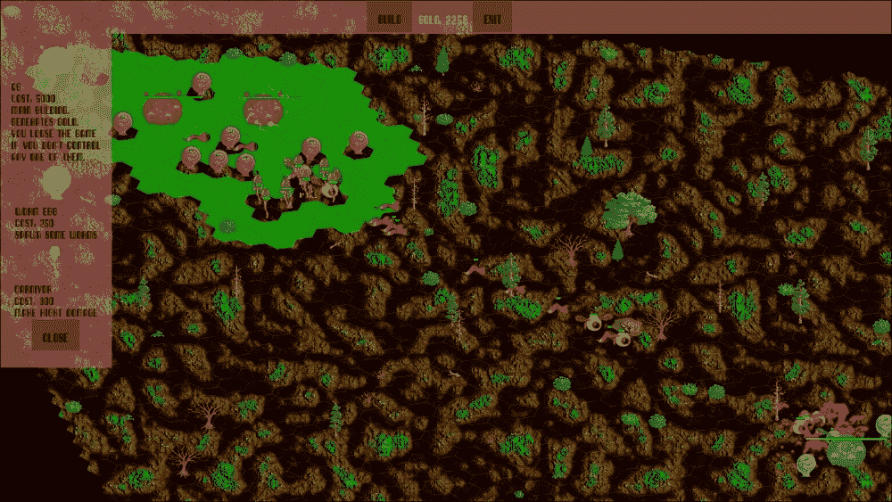
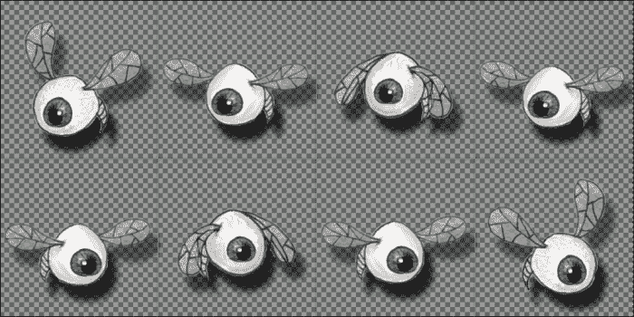
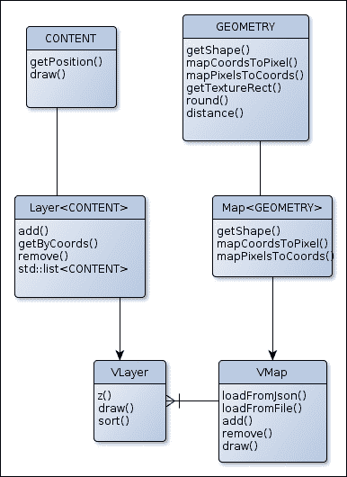
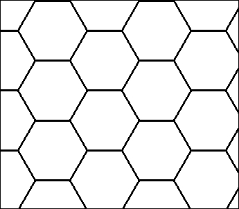
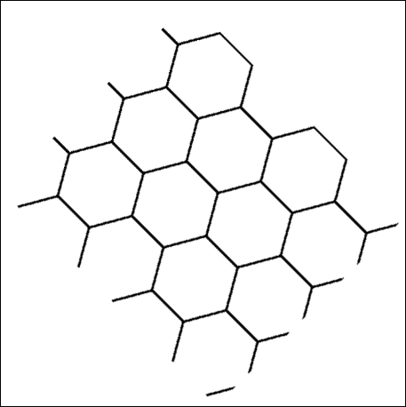
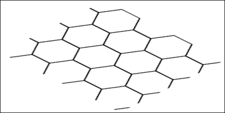
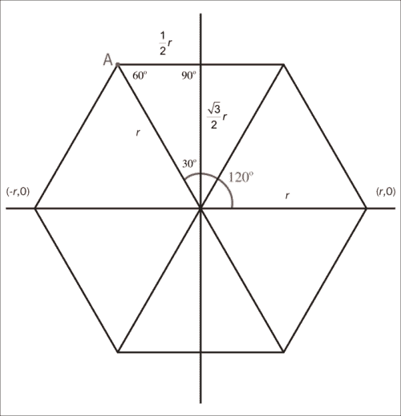
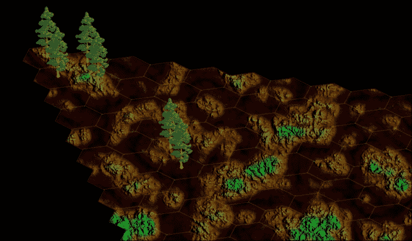
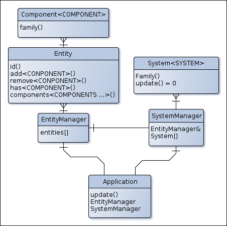
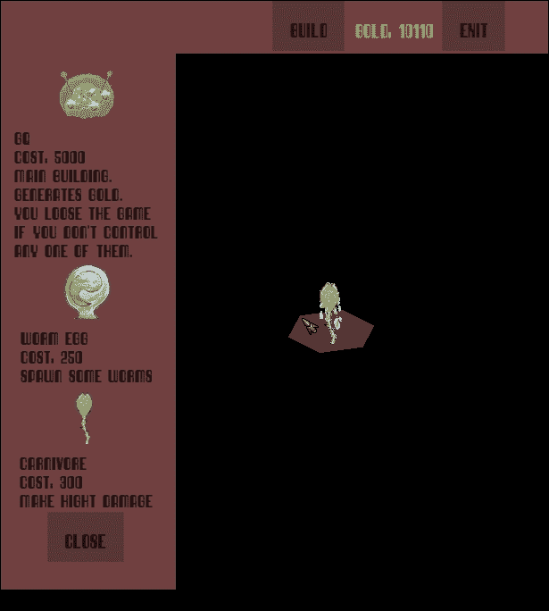

# 第七章。从零开始构建实时塔防游戏 - 第一部分

现在你已经拥有了所有基本工具，是时候我们来构建一些新的东西了。比如，一个结合了**实时策略**（**RTS**）和塔防的游戏怎么样？再考虑一下让它成为一个多人游戏？你喜欢这些想法吗？太好了！这正是我们将开始构建的内容。

由于这个项目比其他所有项目都要复杂得多，它将被分为两部分。第一部分将专注于游戏机制和逻辑，第二部分将专注于多人层。因此，在本章中，我们将做以下事情：

+   创建动画

+   构建并使用具有瓦片模型和动态加载的通用地图系统

+   构建实体系统

+   制定游戏逻辑

这个项目将重用之前制作的许多组件，例如`ActionTarget`、`ResourceManager`、我们的 GUI 和游戏循环。为了让你能够轻松地将这些组件用于未来的项目，它们已经被收集到一个单独的框架（`SFML-utils`）中，这个框架已经从本书的代码中分离出来。这个框架可以在 GitHub 网站上找到，网址为[`github.com/Krozark/SFML-utils`](https://github.com/Krozark/SFML-utils)，因此这些组件已经从本书的命名空间移动到了`SFML-utils`。此外，本章将解释的地图和实体系统也是这个框架的一部分。

本章的最终结果将如下所示：



# 游戏的目标

首先，让我们解释我们的目标。正如我们之前所说的，我们将构建一个新游戏，它将是一个实时策略游戏和塔防的结合。

想法是每个队伍开始时都有一笔钱/金币和一个名为 GQ 的主要建筑。当一个队伍的所有 GQ 都被摧毁时，它就输了游戏。这些钱可以用来建造具有不同能力的其他建筑，或者升级它们。例如，一些建筑将产生战士来攻击敌人；其他建筑只会防御周围区域。还有关于可以建造新建筑区域的限制。事实上，你只能在你的队伍现有建筑周围放置新建筑。这防止你在游戏开始时在敌人营地中央放置一个大塔。同样重要的是要注意，一旦建造了建筑，你就不能控制它的行为，就像你不能控制由它产生的不同战士的行为一样。

此外，每次摧毁一个敌人，你都会获得一些金币，这让你能够建造更多的塔，从而增强你击败敌人的能力。

现在游戏已经介绍完毕，让我们列出我们的需求：

+   **资源和事件管理**：这两个特性之前已经创建，所以我们将直接重用它们。

+   **GUI**：这个特性已经在第五章中开发完成，即“玩转用户界面”。我们将直接重用它。

+   **动画**：在 SFML 中，没有类来管理动画精灵，但对我们来说，我们需要这个功能。因此，我们将构建它并将其添加到我们的框架中。

+   **瓦片地图**：这个功能非常重要，必须尽可能灵活，以便我们可以在许多其他项目中重用它。

+   **实体管理器**：如果您还记得，这是在 第三章 中引入的，*制作一个完整的 2D 游戏*。现在是时候真正看到它了。这个系统将避免复杂的继承树。

如您所见，这个项目由于其复杂性，比之前的更具挑战性，但它也会更有趣。

# 构建动画

在我们之前的所有游戏中，屏幕上显示的所有不同实体都是静态的；至少它们没有动画。为了使游戏更具吸引力，最简单的事情就是给玩家添加一些动画和不同的实体。对我们来说，这将被应用于不同的建筑和战士。

由于我们使用基于精灵的游戏，而不是基于骨骼运动的实时动画，我们需要一些已经准备好的动画纹理。因此，我们的纹理将看起来如下所示：



### 注意

注意，绿色网格不是图像的一部分，这里仅为了信息展示；实际上背景是透明的。

这种类型的纹理被称为精灵图。在这个例子中，图像可以被分成两行四列。每一行代表一个移动方向，即左和右。这些行的每个单元格代表未来动画的一个步骤。

本部分工作的目标是能够使用这张图作为动画帧来显示精灵。

我们将遵循 SFML 的设计，构建两个类。第一个类将存储动画，第二个类将用于显示如 `sf::Texture` 和 `sf::Sprite` 的工作。这两个类被命名为 `Animation` 和 `AnimatedSprite`。

## Animation 类

`Animation` 类只存储所有所需的数据，例如纹理和不同的帧。

由于这个类是一种资源，我们将通过我们的 `ResourceManager` 类来使用它。

这是类的头文件：

```cpp
class Animation
{
  public:
  Animation(sf::Texture* texture=nullptr);
  ~Animation();

  void setTexture(sf::Texture* texture);
  sf::Texture* getTexture()const;

  Animation& addFrame(const sf::IntRect& rect);
  Animation& addFramesLine(int number_x,int number_y,int line);
  Animation& addFramesColumn(int number_x,int number_y,int column);
  size_t size()const;
  const sf::IntRect& getRect(size_t index)const;

  private:
  friend class AnimatedSprite;
  std::vector<sf::IntRect> _frames;
  sf::Texture* _texture;
};
```

如您所见，这个类只是一个纹理和一些矩形的容器。为了简化这个类的使用，创建了一些辅助函数，即 `addFramesLines()` 和 `addFramesColumn()`。这些函数中的每一个都会向内部的 `_frames` 列表添加一个完整的行或列。这个类的实现也非常简单，如下所示：

```cpp
Animation::Animation(sf::Texture* texture) : _texture(texture){}

Animation::~Animation(){}

void Animation::setTexture(sf::Texture* texture){ _texture = 
  texture;}

sf::Texture* Animation::getTexture() const {return _texture;}

size_t Animation::size() const {return _frames.size();}

const sf::IntRect& Animation::getRect(size_t index) const {return 
  _frames[index];}

Animation& Animation::addFrame(const sf::IntRect& rect)
{
  _frames.emplace_back(rect);
  return *this;
}

Animation& Animation::addFramesLine(int number_x,int number_y,int 
  line)
{
  const sf::Vector2u size = _texture->getSize();
  const float delta_x = size.x / float(number_x);
  const float delta_y = size.y / float(number_y);

  for(int i = 0;i<number_x;++i)
      addFrame(sf::IntRect(i*delta_x,line*delta_y,delta_x,delta_y));
  return *this;
}
Animation& Animation::addFramesColumn(int number_x,int 
  number_y,int column)
{
  const sf::Vector2u size = _texture->getSize();
  const float delta_x = size.x / float(number_x);
  const float delta_y = size.y / float(number_y);
  for(int i = 0;i<number_y;++i)
      addFrame(sf::IntRect(column*delta_x,i*delta_y,delta_x,delta_y));
  return *this;
}
```

三个 `addFrameXXX()` 函数允许我们向我们的动画添加帧。最后两个是添加整个行或列的快捷方式。其余的方法允许我们访问内部数据。

我们的帧容器不再需要其他东西。现在是时候构建 `AnimatedSprite` 类了。

## AnimatedSprite 类

`AnimatedSprite` 类负责屏幕上显示的动画。因此，它将保留对 `Animation` 类的引用，并定期更改纹理的子矩形，就像 `sf::Sprite`。我们还将复制 `sf::Music`/`sf::Sound` API 中的播放/暂停/停止功能。`AnimatedSprite` 实例也应该能够在屏幕上显示并且可变换，因此该类将继承自 `sf::Drawable` 和 `sf::Transformable`。我们还将添加一个当动画完成时被触发的回调。这可能会很有趣。

标头如下所示：

```cpp
class AnimatedSprite : public sf::Drawable, public sf::Transformable
{
  public:
  AnimatedSprite(const AnimatedSprite&) = default;
  AnimatedSprite& operator=(const AnimatedSprite&) = default;
  AnimatedSprite(AnimatedSprite&&) = default;
  AnimatedSprite& operator=(AnimatedSprite&&) = default;

  using FuncType = std::function<void()>;
  static FuncType defaultFunc;
  FuncType onFinished;
  enum Status {Stopped,Paused,Playing};

  AnimatedSprite(Animation* animation = nullptr,Status status= Playing,const sf::Time& deltaTime = sf::seconds(0.15),bool loop = true,int repeat=0);

  void setAnimation(Animation* animation);
  Animation* getAnimation()const;

  void setFrameTime(sf::Time deltaTime);
  sf::Time getFrameTime()const;

  void setLoop(bool loop);
  bool getLoop()const;
  void setRepeat(int nb);
  int getRepeat()const;

  void play();
  void pause();
  void stop();
  Status getStatus()const;

  void setFrame(size_t index);
  void setColor(const sf::Color& color);
  void update(const sf::Time& deltaTime);

  private:
  Animation* _animation;
  sf::Time _delta;
  sf::Time _elapsed;
  bool _loop;
  int _repeat;
  Status _status;
  size_t _currentFrame;
  sf::Vertex _vertices[4];

  void setFrame(size_t index,bool resetTime);
  virtual void draw(sf::RenderTarget& target,sf::RenderStates states) const override;
};
```

如您所见，此类比之前的大。其主要功能是存储一个代表从相关动画中取出的帧的四个顶点的数组。我们还需要一些其他信息，例如两个帧之间的时间，如果动画是循环的。这就是为什么我们需要这么多小函数的原因。现在，让我们看看所有这些是如何实现的：

```cpp
AnimatedSprite::AnimatedSprite(Animation* animation,Status status,const sf::Time& deltaTime,bool loop,int repeat) : onFinished(defaultFunc),_delta(deltaTime),_loop(loop), _repeat(repeat),_status(status)
{
  setAnimation(animation); 
}
```

构造函数仅将所有不同的属性初始化为其正确的值：

```cpp
void AnimatedSprite::setAnimation(Animation* animation)
{
  if(_animation != animation){
    _animation = animation;
    _elapsed = sf::Time::Zero;
    _currentFrame = 0;
    setFrame(0,true);
  }
}
```

此函数仅在当前纹理与新纹理不同时更改当前纹理，并将帧重置为新动画的第一个帧。请注意，新动画作为参数接收时至少必须存储一个帧。

```cpp
Animation* AnimatedSprite::getAnimation()const {return _animation;}

void AnimatedSprite::setFrameTime(sf::Time deltaTime){_delta = deltaTime;}

sf::Time AnimatedSprite::getFrameTime()const {return _delta;}

void AnimatedSprite::setLoop(bool loop){_loop = loop;}

bool AnimatedSprite::getLoop()const {  return _loop;}

void AnimatedSprite::setRepeate(int nb) {_repeat = nb;}

int AnimatedSprite::getRepeate()const{  return _repeat;}

void AnimatedSprite::play() {_status = Playing;}

void AnimatedSprite::pause() {_status = Paused;}

void AnimatedSprite::stop()
{
  _status = Stopped;
  _currentFrame = 0;
  setFrame(0,true);
}

AnimatedSprite::Status AnimatedSprite::getStatus()const {return _status;}
```

所有这些函数都是简单的获取器和设置器。它们允许我们管理 `AnimatedSprite` 类的基本元素，如前一个代码片段所示。

```cpp
void AnimatedSprite::setFrame(size_t index)
{
  assert(_animation);
  _currentFrame = index % _animation->size();
  setFrame(_currentFrame,true);
}
```

此函数将当前帧更改为从内部 `Animation` 类中取出的新帧。

```cpp
void AnimatedSprite::setColor(const sf::Color& color)
{
  _vertices[0].color = color;
  _vertices[1].color = color;
  _vertices[2].color = color;
  _vertices[3].color = color;
}
```

此函数更改显示图像的颜色遮罩。为此，我们将每个内部顶点的颜色设置为作为参数接收的新颜色：

```cpp
void AnimatedSprite::update(const sf::Time& deltaTime)
{
  if(_status == Playing and _animation)
  {
    _elapsed += deltaTime;

    if(_elapsed > _delta)
    {//need to change frame
      _elapsed -= _delta;
      if(_currentFrame + 1 < _animation->size())
          ++_currentFrame;
      else
      {//end of frame list
        _currentFrame = 0;

        if(not _loop)
        {//can we make another loop an the frames?
          --_repeat;
          if(_repeat<=0)
          { //no, so we stop
                _status = Stopped;
                onFinished();
          }
        }
      }
    }
    //update the frame
    setFrame(_currentFrame,false);
  }
}
```

此函数是主要的。其任务是当时间限制达到时，从当前帧更改为下一帧。一旦我们达到动画的最后一帧，你可以做以下操作：

+   根据 `_loop` 值重置动画到第一个

+   如果 `_repeat` 值允许，则从第一个动画重置动画

+   在所有其他情况下，我们通过调用内部回调触发“完成”事件

现在，看看更新帧皮肤的函数：

```cpp
void AnimatedSprite::setFrame(size_t index,bool resetTime)
{
  if(_animation)
  {
    sf::IntRect rect = _animation->getRect(index);
    //update vertice position
    _vertices[0].position = sf::Vector2f(0.f, 0.f);
    _vertices[1].position = sf::Vector2f(0.f, static_cast<float>(rect.height));
    _vertices[2].position = sf::Vector2f(static_cast<float>(rect.width), static_cast<float>(rect.height));
    _vertices[3].position = sf::Vector2f(static_cast<float>(rect.width), 0.f);

    //compute the texture coords
    float left = static_cast<float>(rect.left);
    float right = left + static_cast<float>(rect.width);
    float top = static_cast<float>(rect.top);
    float bottom = top + static_cast<float>(rect.height);

    //set the texture coords
    _vertices[0].texCoords = sf::Vector2f(left, top);
    _vertices[1].texCoords = sf::Vector2f(left, bottom);
    _vertices[2].texCoords = sf::Vector2f(right, bottom);
    _vertices[3].texCoords = sf::Vector2f(right, top);
  }
  if(resetTime)
  _elapsed = sf::Time::Zero;
}
```

此函数也是一个重要的函数。其目的是将不同顶点的属性更新为从内部 `Animation` 类中取出的属性，即位置和纹理坐标：

```cpp
void AnimatedSprite::draw(sf::RenderTarget& target,sf::RenderStates states) const
{
  if (_animation and _animation->_texture)è
  {
    states.transform *= getTransform();
    states.texture = _animation->_texture;
    target.draw(_vertices, 4, sf::Quads, states);
  }
}
```

此类中的最终功能负责显示。因为我们从 `sf::Transformable` 继承，所以我们需要考虑可能的变换。然后，我们设置我们使用的纹理，最后绘制内部顶点数组。

## 使用示例

现在我们有了显示动画所需的类，让我们构建一个小型的使用示例。

现在，这里是实现：

```cpp
int main(int argc,char* argv[])
{
  //Creation of the window
  sf::RenderWindow window(sf::VideoMode(600,800),"Example 
    animation");

  //load of the texture image
  ResourceManager<sf::Texture,int> textures;
  textures.load(0,"media/img/eye.png");

  //Creation of the different animations
  Animation walkLeft(&textures.get(0));
  walkLeft.addFramesLine(4,2,0);
  Animation walkRight(&textures.get(0));
  walkRight.addFramesLine(4,2,1);

  //Creation of the animates sprite
  AnimatedSprite sprite(&walkLeft,AnimatedSprite::Playing,sf::seconds(0.1));
  //game loop
  sf::Clock clock;
  while (window.isOpen())
  {
    sf::Time delta = clock.restart();
    sf::Event event;
    while (window.pollEvent(event))
    {
      if (event.type == sf::Event::Closed) //close event
      window.close();
    }
    float speed = 50; // the movement speed of the entity
    if(sf::Keyboard::isKeyPressed(sf::Keyboard::Left)) //move left
    {
      sprite.setAnimation(&walkLeft);
      sprite.play();
      sprite.move(-speed*delta.asSeconds(),0);
    }
    else if(sf::Keyboard::isKeyPressed(sf::Keyboard::Right)) 
      //move right
    {
      sprite.setAnimation(&walkRight);
      sprite.play();
      sprite.move(speed*delta.asSeconds(),0);
    }
    window.clear();
    sprite.update(delta); //update the animate sprite for possible 
      frame change
    window.draw(sprite); //display the animation
    window.display();
  }
  return 0;
}
```

为了更好地理解这段代码，我在代码中添加了一些注释。

这个简短程序在屏幕上显示动画。您也可以通过使用键盘上的箭头移动它来改变其位置。动画也会根据移动方向而改变。

现在已经解释了本章的第一个要点，让我们继续第二个要点，构建地图。

# 构建通用的瓦片地图

对于我们的项目，我们需要一个可以管理地图的东西。实际上，地图不过是一个大网格。单元格可以是任何形状（方形、六边形等）。唯一的限制是，单个地图的所有单元格应该具有相同的几何形状。

此外，每个单元格可以包含多个对象，可能是不同类型的。例如，一个单元格可以包含一些用于地面的背景纹理、一棵树和一只鸟。由于 SFML 不使用精灵的`z`缓冲区（也称为深度缓冲区），我们需要手动模拟它。这被称为画家算法。其原理非常简单；按照深度顺序绘制所有内容，从最远的开始。这就是传统艺术画家作画的方式。

所有这些信息都带我们来到了以下结构：

+   `Map`类必须具有特定的几何形状，并且必须包含按其`z`缓冲区排序的任意数量的层。

+   `Layer`只包含特定类型。它也有一个`z`缓冲区，并存储一个按位置排序的内容列表。

+   `CONTENT`和`GEOMETRY`类是模板参数，但它们需要具有特定的 API。

这里是表示之前解释的结构类层次的流程图：



下面是流程图的说明：

+   `CONTENT`模板类可以是任何继承自`sf::Drawable`和`sf::Transformable`的类。

+   `GEOMETRY`类是一个新类，我们将在稍后了解它。它只定义了几何形状和一些用于操作坐标的帮助函数。

+   `VLayer`类定义了一个适用于所有不同类型层的通用类。

+   `Layer`类只是一个具有深度变量的特定类型容器，该变量定义了其在画家算法中的绘制顺序。

+   `VMap`类定义了整个地图的通用 API。它还包含一个`VLayer`列表，该列表使用画家算法显示。

+   `Map`类从`VMap`继承，并具有特定的几何形状。

## 等距六边形的几何类

对于我们的项目，我选择了以瓦片为六边形的等距视图。等距视图非常简单获得，但需要很好地理解。以下是我们需要遵循的步骤：

1.  首先，从俯视图查看你的瓦片：

1.  然后，顺时针旋转 45 度：

1.  最后，将其高度除以 2：

1.  现在，你有一个很好的等距视图。现在，让我们看看六边形：

如你所知，我们需要使用三角学计算每条边的坐标，特别是毕达哥拉斯定理。这是不考虑旋转和高度调整的情况。我们需要遵循两个步骤来找到正确的坐标：

1.  从旋转的形状（添加 45 度）计算坐标。

1.  将总高度值除以二。通过这样做，你最终将能够构建`sf::Shape`：

    ```cpp
    shape.setPointCount(6);
    shape.setPoint(0,sf::Vector2f(0,(sin_15+sin_75)/2));
    shape.setPoint(1,sf::Vector2f(sin_15,sin_15/2));
    shape.setPoint(2,sf::Vector2f(sin_15+sin_75,0));
    shape.setPoint(3,sf::Vector2f(sin_15+sin_75+sin_45,sin_45/2));
    shape.setPoint(4,sf::Vector2f(sin_75+sin_45,(sin_75+sin_45)/2));
    shape.setPoint(5,sf::Vector2f(sin_45,(sin_15+sin_75+sin_45)/2));
    shape.setOrigin(height/2,height/4);
    ```

1.  `GEOMETRY`类的大部分已经完成。剩下的是从世界坐标到像素坐标的转换，以及反向转换。如果你对此感兴趣，可以查看`SFML-utils/src/SFML-utils/map/HexaIso.cpp`文件中的类实现。

现在主几何已经定义，让我们在此基础上构建一个`Tile<GEOMETRY>`类。这个类将简单地封装由几何初始化的`sf::Shape`，并且具有不同的要求，以便能够使用`COMPONENT`参数为地图使用。由于这个类不是很重要，我将不会通过这本书来解释它，但你可以在`SFML-utils/include/SFML-utils/map/Tile.tpl`文件中查看它的实现。

## VLayer 和 Layer 类

层的目标是管理同一深度的任意数量的组件。为此，每个层都包含其深度和组件容器。它还具有重新排序容器的能力，以尊重绘图算法。`VLayer`类是一个接口，它只定义了层的 API，允许地图存储任何类型的层，这得益于多态性。

这里是`Layer`类的标题：

```cpp
template<typename CONTENT>
class Layer : public VLayer
{
  public:
  Layer(const Layer&) = delete;
  Layer& operator=(const Layer&) = delete;
  Layer(const std::string& type,int z=0,bool isStatic=false);
  virtual ~Layer(){};

  CONTENT* add(const CONTENT& content,bool resort=true);
  std::list<CONTENT*> getByCoords(const sf::Vector2i& coords,const VMap& map);
  bool remove(const CONTENT* content_ptr,bool resort=true);
  virtual void sort() override;

  private:
  virtual void draw(sf::RenderTarget& target, sf::RenderStates states,const sf::FloatRect& viewport) override;
  std::list<CONTENT> _content;
};
```

如前所述，这个类不仅将存储其`template`类参数的容器，还将存储其深度（`z`）和一个包含在`Vlayer`类中的静态布尔成员，以优化显示。这个参数背后的想法是，如果层内的内容根本不移动，那么每次场景移动时就不需要重新绘制场景。结果存储在一个内部的`sf::RenderTexture`参数中，并且只有在场景移动时才会刷新。例如，地面永远不会移动，也没有动画。因此，我们可以将其显示在一个大纹理上，并在屏幕上显示这个纹理。这个纹理将在视图移动/调整大小时刷新。

为了进一步阐述这个想法，我们只需要显示屏幕上出现的内容。我们不需要绘制屏幕外的任何东西。这就是为什么我们有`draw()`方法的`viewport`属性。

所有其他函数管理层的内容。现在，让我们看看它的实现：

```cpp
template<typename CONTENT>
Layer<CONTENT>::Layer(const std::string& type,int z,bool isStatic) 
  : Vlayer(type,z,isStatic) {}

template<typename CONTENT>
CONTENT* Layer<CONTENT>::add(const CONTENT& content,bool resort)
{
  _content.emplace_back(content);
  CONTENT* res = &_content.back();
  if(resort)
      sort();
  return res;
}
```

这个函数向层添加新内容，如果需要则对其进行排序，并最终返回对新对象的引用：

```cpp
template<typename CONTENT>
std::list<CONTENT*> Layer<CONTENT>::getByCoords(const sf::Vector2i& coords,const VMap& map)
{
  std::list<CONTENT*> res;
  const auto end = _content.end();
  for(auto it = _content.begin();it != end;++it)
  {
    auto pos = it->getPosition();
    sf::Vector2i c = map.mapPixelToCoords(pos.x,pos.y);
    if(c == coords)
        res.emplace_back(&(*it));
  }
  return res;
}
```

这个函数将所有不同的对象返回到同一个地方。这对于拾取对象很有用，例如，拾取光标下的对象：

```cpp
template<typename CONTENT>
bool Layer<CONTENT>::remove(const CONTENT* content_ptr,bool resort)
{
  auto it = std::find_if(_content.begin(),_content.end(),content_ptr->bool
  {
    return &content == content_ptr;
  });
  if(it != _content.end()) {
    _content.erase(it);
    if(resort)
    sort();
    return true;
  }
  return false;
}
```

这是`add()`函数的反函数。使用其地址，它从容器中移除一个组件：

```cpp
template<typename CONTENT>
void Layer<CONTENT>::sort()
{
  _content.sort([](const CONTENT& a,const CONTENT& b)->bool{
    auto pos_a = a.getPosition();
    auto pos_b = b.getPosition();
    return (pos_a.y < pos_b.y) or (pos_a.y == pos_b.y and pos_a.x < pos_b.x);
    });
  }
}
```

此函数根据画家算法顺序对所有内容进行排序：

```cpp
template<typename CONTENT>
void Layer<CONTENT>::draw(sf::RenderTarget& target, sf::RenderStates states,const sf::FloatRect& viewport)
{
  if(_isStatic)
  {//a static layer
    if(_lastViewport != viewport)
    { //the view has change
      sf::Vector2u size(viewport.width+0.5,viewport.height+0.5);
      if(_renderTexture.getSize() != size)
      {//the zoom has change
        _renderTexture.create(size.x,size.y);
        _sprite.setTexture(_renderTexture.getTexture(),true);
      }
      _renderTexture.setView(sf::View(viewport));
      _renderTexture.clear();

      auto end = _content.end();
      for(auto it = _content.begin();it != end;++it)
      {//loop on content
      CONTENT& content = *it;
      auto pos = content.getPosition();
      if(viewport.contains(pos.x,pos.y))
      {//content is visible on screen, so draw it
        _renderTexture.draw(content);
      }
    }
    _renderTexture.display();
    _lastViewport = viewport;
    _sprite.setPosition(viewport.left,viewport.top);
  }
  target.draw(_sprite,states);
}
else
{ //dynamic layer
  auto end = _content.end();
  for(auto it = _content.begin();it != end;++it)
  {//loop on content
    const CONTENT& content = *it;
    auto pos = content.getPosition();
    if(viewport.contains(pos.x,pos.y))
    {//content is visible on screen, so draw it
      target.draw(content,states);
    }
  }
}
```

由于一些优化，这个函数比我们预期的要复杂得多。让我们一步一步地解释它：

+   首先，我们区分两种情况。在静态地图的情况下，我们这样做：

    +   检查视口是否已更改

    +   如有必要，调整内部纹理的大小

    +   重置纹理

+   将视口内的每个对象的位置绘制到`textureDisplay`纹理中，作为`RenderTarget`参数。

+   如果层包含动态对象（非静态），则将视口内的每个对象的位置绘制到`RenderTarget`参数的`textureDisplay`中。

正如你所见，`draw()`函数在动态内容的情况下使用了一种朴素算法，并优化了静态内容。为了给你一个概念，当有一层 10000 个对象时，帧率大约是 20。通过位置优化，它达到 400，通过静态优化，达到 2000。所以，我认为这个函数的复杂性是由巨大的性能收益所证明的。

现在已经向你介绍了`layer`类，让我们继续介绍`map`类。

## VMap 和 Map 类

地图是`VLayer`的容器。它将实现常用的`add()`/`remove()`函数。此类还可以从文件（在*动态板加载*部分描述）中构建并处理单位转换（坐标到像素和反之亦然）。

内部，`VMap`类存储有如下层：

```cpp
std::vector<VLayer*> _layers;
```

这个类中只有两个有趣的功能。其他的是简单的快捷方式，所以我不打算解释整个类。让我们看看相关的函数：

```cpp
void VMap::sortLayers()
{
  std::sort(_layers.begin(),_layers.end(),[](const VLayer* a, const VLayer* b)->bool{
    return a->z() < b->z();
  });
  const size_t size = _layers.size();
  for(size_t i=0;i<size;++i)
    _layers[i]->sort();
}
```

此函数根据画家算法对不同的层进行排序。实际上，这个函数很简单但非常重要。每次向地图添加一个层时，我们都需要调用它。

```cpp
void VMap::draw(sf::RenderTarget& target, sf::RenderStates states,const sf::FloatRect& viewport) const
{
  sf::FloatRect delta_viewport(viewport.left - _tile_size,
  viewport.top - _tile_size,
  viewport.width + _tile_size*2,
  viewport.height + _tile_size*2);
  const size_t size = _layers.size();
  for(size_t i=0;i<size;++i)
    _layers[i]->draw(target,states,delta_viewport);
}
```

函数通过调用其绘制方法来绘制每个层；但首先，我们在其每个边框上添加一个小增量来调整屏幕视口。这样做是为了显示屏幕上出现的所有瓦片，即使它们只部分显示（当其位置在屏幕外时）。

## 动态板加载

现在地图结构已经完成，我们需要一种加载它的方法。为此，我选择了`JSON`格式。选择这个格式的有两个原因：

+   可以被人类阅读

+   格式不是冗长的，所以即使是对于大地图，最终的文件也相当小。

我们需要一些信息来构建地图。这包括以下内容：

+   地图的几何形状

+   每个瓦片（单元格）的大小

+   按照以下方式定义层：

    +   `z`缓冲区

    +   它是静态的还是动态的

    +   内容类型

根据层的内 容类型，可能需要指定一些其他信息来构建此内容。最常见的情况如下：

+   纹理

+   坐标

+   大小

因此，`JSON`文件将如下所示：

```cpp
{
  "geometry" : {
    "name" :"HexaIso", "size" : 50.0
  },
  "layers" : [{
    "content" : "tile", "z" : 1, "static" : true,
    "data" : [{"img" :"media/img/ground.png", "x" : 0, "y" : 0, "width" : 100, "height" : 100}]
  },{
    "content" : "sprite", "z" : 3,
    "data" : [
    {"x" : 44, "y" : 49, "img" : "media/img/tree/bush4.png"},
    {"x" : 7, "y" : 91, "img" : "media/img/tree/tree3.png"},
    {"x" : 65, "y" : 58, "img" : "media/img/tree/tree1.png"}
    ]
  }]
}
```

如你所见，不同的数据集存在以创建具有等距六边形几何形状的地图，并具有两层。第一层包含带有地面纹理的网格，第二层包含一些用于装饰的精灵。

要使用此文件，我们需要一个 `JSON` 解析器。你可以使用任何现有的，构建自己的，或者使用本项目构建的。接下来，我们需要一种从文件创建整个地图或从文件更新其内容的方法。在第二种情况下，几何形状将被忽略，因为我们不能在运行时更改模板的值。

因此，我们将向 `VMap` 类添加一个静态方法来创建一个新的 `Map`，并添加另一个方法来更新其内容。签名如下：

```cpp
static VMap* createMapFromFile(const std::string& filename);
virtual void loadFromJson(const utils::json::Object& root) = 0;
```

由于 `Tile` 类需要的 `GEOMETRY` 参数，`loadFromJson()` 函数必须是虚拟的，并在 `Map` 类中实现。`createMapFromFile()` 函数将用于国际使用。让我们看看它的实现：

```cpp
VMap* VMap::createMapFromFile(const std::string& filename)
{
  VMap* res = nullptr;
  utils::json::Value* value = utils::json::Driver::parse_file(filename);
  if(value)
  {
    utils::json::Object& root = *value;
    utils::json::Object& geometry = root["geometry"];
    std::string geometry_name = geometry["name"].as_string();
    float size = geometry["size"].as_float();
    if(geometry_name == "HexaIso")
    {
      res = new Map<geometry::HexaIso>(size);
      res->loadFromJson(root);
    }
    delete value;
  }
  return res;
}
```

这个函数的目标非常简单；根据几何参数构建适当的地图，并将剩余的工作传递出去。

```cpp
void Map<GEOMETRY>::loadFromJson(const utils::json::Object& root)
{
    const utils::json::Array& layers = root["layers"];
    for(const utils::json::Value& value : layers) //loop through the 
rs
    {
        const utils::json::Object& layer = value;
        std::string content = layer["content"].as_string(); //get the content type

        int z = 0; //default value
        try{
            z = layer["z"].as_int(); //load value
        } catch(...){}

        bool isStatic = false; //default value
        try {
            isStatic = layer["static"].as_bool(); //load value
        }catch(...){}

        if(content == "tile") //is a layer or tile?
        {
            auto current_layer = new Layer<Tile<GEOMETRY>>(content,z,isStatic); //create the layer
            const utils::json::Array& textures = layer["data"];
            for(const utils::json::Object& texture : textures) //loop through the textures
            {
                int tex_x = texture["x"]; //get the tile position
                int tex_y = texture["y"];
                int height = std::max<int>(0,texture["height"].as_int()); //get the square size
                int width = std::max<int>(0,texture["width"].as_int());
                std::string img = texture["img"]; //get texture path

                sf::Texture& tex = _textures.getOrLoad(img,img); //load the texture
                tex.setRepeated(true);

                for(int y=tex_y;y< tex_y + height;++y)//create the tiles
                {
                    for(int x=tex_x;x<tex_x + width;++x)
                    {
                        Tile<GEOMETRY> tile(x,y,_tileSize);
                        tile.setTexture(&tex);
                        tile.setTextureRect(GEOMETRY::getTextureRect(x,y,_tileSize));

                        current_layer->add(std::move(tile),false);//add the new tile to the layer
                    }
                }
            }
            add(current_layer,false);//if it's a layer of images
        }
        else if(content == "sprite")
        {
            auto current_layer = new Layer<sf::Sprite>(content,z,isStatic);//create the layer
            const utils::json::Array& data = layer["data"].as_array();//loop on data

            for(const utils::json::Value& value : data)
            {
                const utils::json::Object& obj = value;
                int x = obj["x"];//get the position
                int y = obj["y"];
                float ox = 0.5;//default center value (bottom center)
                float oy = 1;

                try{//get value
                    ox = obj["ox"].as_float();
                }catch(...){}

                try{
                    oy = obj["oy"].as_float();
                }catch(...){}

                std::string img = obj["img"];//get texture path

                sf::Sprite spr(_textures.getOrLoad(img,img));//load texture
                spr.setPosition(GEOMETRY::mapCoordsToPixel(x,y,_tileSize));

                sf::FloatRect rec = spr.getLocalBounds();
                spr.setOrigin(rec.width*ox,rec.height*oy);

                current_layer->add(std::move(spr),false);//add the sprite

            }
            add(current_layer,false); //add the new layer to the map
        }
    }
    sortLayers(); //finally sort the layers (recuively)
}
```

为了更好地理解，前面的函数是用原始注释解释的。它的目的是构建层并将从 `JSON` 文件中挑选的数据填充到层中。

现在我们能够从文件构建地图并填充其内容，我们需要做的最后一件事是将它显示在屏幕上。这将通过 `MapViewer` 类来完成。

## MapViewer 类

这个类封装了一个 `Map` 类，并管理一些事件，如鼠标移动、移动视图、缩放等。这是一个非常简单的类，没有新内容。这就是为什么我不会详细介绍任何内容，除了 `draw()` 方法（因为视口）。如果你对完整的实现感兴趣，请查看 `SFML-utils/src/SFML-utils/map/MapViewer.cpp` 文件。

所以这里是 draw 方法：

```cpp
void MapViewer::draw(sf::RenderTarget& target, sf::RenderStates states) const
{
  sf::View view = target.getView();
  target.setView(_view);
  _map.draw(target,states,sf::FloatRect(target.mapPixelToCoords(sf::Vector2i(0,0),_view),_view.getSize());
  target.setView(view);
}
```

如同往常，我们接收 `sf::RenderTarget` 和 `sf::RenderStates` 作为参数。然而，在这里我们不想与目标当前视图交互，因此我们备份了它并将我们的本地视图附加到渲染的目标上。然后，我们调用内部地图的 draw 方法，传递目标和状态，但添加了视口。这个参数非常重要，因为它被我们的层用于优化。因此，我们需要构建一个与渲染目标大小相同的视口，多亏了 SFML，这非常简单。我们将左上角坐标转换为相对于我们视图的世界坐标。结果是显示区域左上角的坐标。现在，我们只需要大小。在这里，SFML 也提供了我们所需的一切：`sf::View::getSize()`。有了这些信息，我们现在能够构建正确的视口并将其传递给地图 `draw()` 函数。

一旦渲染完成，我们将初始视图恢复到渲染目标。

## 使用示例

现在我们已经具备了加载和显示地图到屏幕上的所有要求。以下代码片段显示了最小步骤：

```cpp
int main(int argc,char* argv[])
{
  sf::RenderWindow window(sf::VideoMode(1600,900),"Example Tile");
  sfutils::VMap* map = sfutils::VMap::createMapFromFile("./map.json");
  sfutils::MapViewer viewer(window,*map);
  sf::Clock clock;
  while (window.isOpen())
  {
    sf::Event event;
    while (window.pollEvent(event))
    {
      if (event.type == sf::Event::Closed)   // Close window : exit
      window.close();
    }
    window.clear();
    viewer.processEvents();
    viewer.update(clock.restart().asSeconds());
    viewer.draw();
    window.display();
  }
  return 0;
}
```

该函数的不同步骤如下：

1.  创建窗口

1.  从文件创建映射

1.  处理事件并在请求时退出

1.  更新查看器

1.  在屏幕上显示查看器

结果将如下所示：



现在我们已经完成了映射，我们需要用一些实体填充它。

# 构建实体系统

首先是什么是实体系统？

**实体系统**是一种关注数据的设计模式。它不是创建所有可能实体的复杂层次树，而是构建一个系统，允许我们在运行时向实体添加组件。这些组件可以是任何东西，如生命值、人工智能、皮肤、武器，以及除了数据之外的一切。

然而，如果实体和组件都不包含功能，它们存储在哪里呢？答案是系统。每个系统管理至少一个组件，所有逻辑都包含在这些系统中。此外，无法直接构建实体。您必须使用实体管理器创建或更新它。它将负责一组实体，管理它们的组件、创建和销毁。

结构由以下图表表示：



实现这种结构有许多方法。我的选择是使用模板和多态。

## 实体系统的使用

不深入内部结构，我们创建一个新的组件，将其作为结构，没有方法，除了构造函数/析构函数，并从`Component`继承如下：

```cpp
struct CompHp : Component<CompHp>
{
  explicit Hp(int hp) : _hp(hp){};
  int _hp;
};
```

继承对于在所有组件之间有一个公共基类很重要。同样的想法用于创建`System`：

```cpp
struct SysHp : sfutils::System<SysHp>
{
  virtual void update(sfutils::EntityManager& manager,const sf::Time& dt) override;
};
```

继承的原因是为了有一个公共父类和 API（`update`函数）。最后，要创建实体，您必须执行以下操作：

```cpp
EntityManager entities;
std::uint32_t id = entities.create();
entities.addComponent<CompHp>(id,42); //the first argument is always the entity id
```

如果我们继续这个例子，当一个实体没有`hp`时，我们必须将其从板上删除。这部分逻辑是在`SysHp::update()`函数中实现的：

```cpp
void SysHp::update(sfutils::EntityManager& manager,const sf::Time& dt)
{
  CompHp::Handle hp; //Handler is a kind of smart pointer which ensure access to valid data
  auto view = manager.getByComponents(hp); //this object is a filter on all our entities by there components
  auto end = view.end();
  for(auto current = view.begin(); current != end;++current)
  {
    if(hp->_hp <= 0)
    manager.remove(current->id());
  }
}
```

这个`SysHp::update()`函数用于创建特定的功能。其目的是删除所有`hp`值小于或等于零的实体。为此，我们使用`CompHp::Handle`快捷方式（在`Component`类中定义）初始化`ComponentHandler<CompHp>`。然后我们在世界上创建我们的查询。在我们的例子中，我们需要获取所有带有`CompHp`的实体。对于更复杂的系统，也可以进行多标准查询。

一旦我们有了我们的视图，我们就迭代它。每次迭代都给我们访问`Entity`并更新处理程序值的权限到实体组件。因此，创建对`hp`处理程序的访问相当于以下：

```cpp
manager.getComponent<CompHp>(current->id())
```

然后，我们检查`_hp`值，并在需要时删除实体。

重要的是要注意，实体实际上只有在调用`EntityManager::update()`函数以保持系统循环内部数据一致性时才会被删除。

现在由于`SysHp`参数已经完成，我们需要将其注册到与`EntityManager`相连的`SystemManager`：

```cpp
EntityManager entities;
SystemManager systems(entities);
systems.add<SysHp>();
```

我们现在已经构建了一个实体管理器、一个组件、一个系统和一个实体。将它们全部组合在一起将得到以下代码：

```cpp
int main()
{
  EntityManager entities;
  SystemManager systems(entities);
  systems.add<SysHp>();

  for(int i =0; i<10; ++i)
  {//create entities
    std::uint32_t id = entities.create();
    entities.addComponent<CompHp>(id,i*10);
  }
  sf::Clock clock;
  while(/* some criterion*/)
  {//game loop
    systems.updateAll(clock.restart());
    entities.update();
  }
  return 0;
}
```

这段小代码将创建一个实体和系统管理器。然后，我们创建 10 个实体并将它们添加到`CompHp`组件中。最后，我们进入游戏循环。

如前所述，不要详细说明实体系统的实现；关注其使用。如果你对实现感兴趣，它有点复杂，请查看`SFML-utils/include/SFML-utils/es`目录下的文件。这是一个仅包含头文件的库。

## 实体系统方法的优点

使用组件系统，每个实体都表示为一个唯一的整数（其 ID）。这些组件不过是数据。因此，创建一个保存整个世界的序列化函数实际上非常简单。使用这种方法，数据库保存变得非常简单，但这不是唯一的好处。

要使用经典分层树创建一个飞行汽车，你必须从两个不同的类中继承它，即汽车和飞行器。这些类中的每一个都可以从另一个继承。事实上，当实体数量变得很大时，分层树就太多了。对于相同的例子，使用实体系统创建一个实体，将其附加到一些轮子和翅膀上。就这样！我同意创建实体系统可能很困难，但它的使用大大简化了游戏的复杂性。

# 构建游戏逻辑

我们现在已经拥有了启动游戏的所有要求：资源管理、事件管理、GUI、动画、地图和实体系统。是时候将它们组合成一个单一的项目了。

首先，我们需要创建我们的实体。多亏了之前描述的实体系统，我们只需要构建一些组件及其系统。我们可以构建很多，但项目的主要组件如下：

| 组件 | 实体 |
| --- | --- |
| 皮肤 | 动画 |
| 健康点 | 当前健康值 |
| 最大健康值 |
| 队伍 | 队伍的标识符 |
| 构建区域 | 实体周围的授权范围 |
| 移动 | 速度 |
| 目标 |
| 战士的人工智能 | Δ时间 |
| 伤害 |
| 击中长度 |

最有趣的是人工智能（用于伤害）和移动。其他的是相当简单的。当然，你可以创建自己的组件，作为那些提议的补充或替代。

## 构建我们的组件

我们知道我们的组件需要所有数据，因此让我们构建两个有趣的组件，即`walker AI`和`warrior AI`：

```cpp
struct CompAIWalker : Component<CompAIWalker>
{
  explicit CompAIWalker(float speed);
  const float _speed;
  sf::Vector2i _pathToTake;
};
```

此组件处理速度和目的地。目的地可以通过任何东西更新（例如，当检测到近距离的敌人时）：

```cpp
struct CompAIWarrior : Component<CompAIWarrior>
{
  explicit CompAIWarrior(int hitPoint,const sf::Time& timeDelta,int range);
  const int _hitPoint;
  const sf::Time _delta;
  sf::Time _elapsed;
  const int _range;
};
```

此组件存储实体的攻击性，包括其受损情况、攻击速度和攻击范围。

由于我们将在系统部分使用此组件，我还会解释`CompSkin`组件。此组件存储一个`AnimatedSkin`和可以应用于它的不同可能的`Animation`：

```cpp
struct CompSkin : sfutils::Component<CompSkin,Entity>
{
  enum AnimationId : int{ Stand,Spawn, MoveLeft, MoveRight, HitLeft, HitRight};
  sfutils::AnimatedSprite _sprite;
  std::unordered_map<int,sfutils::Animation*> _animations;
};
```

现在组件已经构建完成，让我们看看系统。

## 创建不同的系统

我们需要的系统数量与组件数量相同。皮肤系统简单地调用动画的更新函数。我们已经为健康构建了相关的系统。对于团队组件，我们不需要任何系统，因为这个组件仅由人工智能使用。剩下的两个系统更复杂。

让我们从移动开始：

```cpp
struct SysAIWalker : sfutils::System<SysAIWalker,Entity>
{
  explicit SysAIWalker(Level& level);
  virtual void update(sfutils::EntityManager<Entity>& manager,const sf::Time& dt) override;
  Level& _level;
};
```

注意，`Level`类尚未介绍。此类将`EntityManager`和`SystemManager`类分组，并为我们提供访问有关地图几何形状的一些函数，而无需了解它。我稍后会解释它。在我们的情况下，我们需要有关组件实际位置与其目的地之间距离的一些信息。这就是为什么我们需要保留对等级的引用。

这里是步行者系统的实现：

```cpp
SysAIWalker::SysAIWalker(Level& level) :_level(level) {}
void SysAIWalker::update(EntityManager& manager,const sf::Time& 
  dt)
{
  CompAIWalker::Handle AI;
  CompSkin::Handle skin;
  auto view = manager.getByComponents(AI,skin);
  auto end = view.end();
  const float seconds = dt.asSeconds();

  for(auto begin = view.begin();begin != end;++begin)
  {
    sf::Vector2f PosCurrent = skin->_sprite.getPosition();
    sf::Vector2i CoordCurrent = 
      _level.mapPixelToCoords(PosCurrent);
    sf::Vector2i CoordDest = AI->_pathToTake;
    if(CoordDest != CoordCurrent) //need to move
    {
      sf::Vector2f PosDest = _level.mapCoordsToPixel(CoordDest);
      //calculation of the direction to take
      sf::Vector2f directon = PosDest - PosCurrent;
      //calculation of the distance
      const float distance = 
        std::sqrt((directon.x*directon.x)+(directon.y*directon.y));
      const float frameDistance = AI->_speed * seconds;
      if(distance > frameDistance)
          skin->_sprite.setPosition(PosCurrent + 
        directon*(frameDistance/distance));
      else
      {
        skin->_sprite.setPosition(PosDest);
        AI->_pathToTake = CoordCurrent;
      }

      if(directon.x >0) //update skin direction
          skin->_sprite.setAnimation(skin-
        >_animations.at(CompSkin::MoveRight));
      else
          skin->_sprite.setAnimation(skin-
        >_animations.at(CompSkin::MoveLeft));
    }
  }
}
```

此系统不仅移动实体，还执行不同的操作。位置存储在`CompSkin`组件中，因此我们需要通过获取附加到实体上的`CompAIWalker`和`CompSkin`组件来迭代实体。然后，我们计算实体在世界坐标系中的位置并检查是否需要移动。如果我们需要移动，我们计算对应于总位移（方向）的向量。这个向量告诉我们实体需要跟随的方向。然后，我们计算终点和当前位置之间的距离。根据速度，我们将当前位置更改为新位置。

一旦移动完成，我们还将当前动画更改为与实体采取的移动方向相匹配的动画。

现在，让我们关注一下`战士 AI`：

```cpp
SysAIWarrior::SysAIWarrior(Level& level) : _level(level){}
void SysAIWarrior::update(sfutils::EntityManager<Entity>& manager,const sf::Time& dt)
{
  CompAIWarrior::Handle AI;
  CompTeam::Handle team;
  CompSkin::Handle skin;
  auto view = manager.getByComponents(AI,team,skin);
  auto end = view.end();
  for(auto begin = view.begin();begin != end;++begin)
  {
    AI->_elapsed += dt;
    std::vector<Team*> teamEnemies = team->_team->getEnemies();

    //if no enemies
    if(teamEnemies.size() <=0)
        continue;
    std::uint32_t id = std::uint32_t(-1);

    /* ….set id to the nearest enemy ... */

    if(not manager.isValid(id))
        continue;

    //update path
    Entity& enemy = manager.get(id);
    const sf::Vector2f pos = enemy.component<CompSkin>()->_sprite.getPosition();
    const sf::Vector2i coord = _level.mapPixelToCoords(pos);
    const int distance = _level.getDistance(myPosition,coord);
    if(distance <= range) //next me
    {
      //shoot it
      if(AI->_elapsed >= AI->_delta)
      {
        AI->_elapsed = sf::Time::Zero;
        CompHp::Handle hp = enemy.component<CompHp>();
        hp->_hp -= AI->_hitPoint;
        Entity& me = **begin;
        if(enemy.onHitted != nullptr)
        enemy.onHitted(enemy,coord,me,myPosition,_level);
        if(me.onHit != nullptr)
        me.onHit(me,myPosition,enemy,coord,_level);
        //win some gold
        if(hp->_hp <=0){
            team->_team->addGold(hp->_maxHp/50);
        }
      }

      //no need to move more
      if(begin->has<CompAIWalker>())
      begin->component<CompAIWalker>()->_pathToTake = myPosition;
    }
    else
    {//too far
        sf::Vector2i path = _level.getPath1(myPosition,coord);
        //move closer
        if(begin->has<CompAIWalker>())
            begin->component<CompAIWalker>()->_pathToTake = path;
  }
}
```

此系统需要三个组件，即`CompSkin`（用于位置）、`CompTeam`（用于检测敌人）和`CompAIWarrior`。首先，我们需要更新 delta 时间。然后，我们检查是否有敌人需要击败。接下来，我们寻找一个更近的敌人（我不会详细说明这部分，因为你可以使用自己的算法）。如果找到敌人，我们检查我们与敌人之间的距离。如果我们能够射击敌人，我们就这样做，并将 delta 时间重置以避免每帧都击中。我们还触发一些事件（例如，创建声音）并在我们刚刚击败敌人时为团队添加金币。如果可能，我们还将`CompAIWarrior`的目的地设置为当前位置（以保持战斗状态），或者移动到下一个敌人更近的位置。

我们现在已经拥有了所有组件和系统来管理它们。因此，我们将继续进行游戏架构。

## 等级类

如往常一样，我们将游戏分成几个部分。`level`类代表一个地图。这个类存储了所有实体、系统、查看器、地图、声音等。正如之前解释的，它还在地图几何之上实现了一个抽象层。

实际上，一个关卡是一个非常简单的对象；它只是连接其他对象的粘合剂。它注册所有系统，构建地图，初始化一个`MapViewer`，事件，并将所有不同的更新调用组合到一个方法中。这个类还允许用户通过创建内部的`EntityManager`来创建新的实体，并将它们添加到地图层中。在这个过程中，地图始终与`EntityManager`保持同步。

如果你对这个实现感兴趣，请查看`SFML-book/07_2D_iso_game/src/SFML-Book/Level.cpp`文件。

## 游戏类

现在，让我们看看`game`类！你现在应该熟悉这个类。它的全局行为没有改变，仍然包含相同的函数（`update()`、`processEvents()`和`render()`）。

这里的重大变化是，游戏类将初始化一个`Level`和`Team`。其中之一将是玩家控制的，GUI 依赖于它。这也是为什么这个项目的 GUI 被附加到一个团队而不是整个游戏的原因。我不会说这是最好的方法，但这是最简单的方法，并允许我们从一个团队跳到另一个团队。

如果你对这个实现感兴趣，请查看`SFML-book/07_2D_iso_game/src/SFML-Book/Game.cpp`文件。

## 团队 GUI 类

这个类处理不同的信息，是游戏和玩家之间的接口。它应该允许玩家构建一些实体并与它们交互。

以下屏幕显示了**构建**菜单。此菜单向玩家展示了可以创建的不同实体以及当前的金币数量：



当然，我们可以进一步完善这个菜单，但这是我们游戏所需的最基本信息。使用我们之前制作的 GUI 将大大简化这项任务。

一旦选择了一个实体，我们只需将其放置到游戏中，同时考虑到以下标准：

+   金币数量

+   构建区域

在此之后，一切都将顺利运行。不要犹豫，创建一些辅助函数，通过添加具有特定值的组件来创建不同的实体。

# 摘要

在本章中，我们介绍了不同的事情，例如创建动画。这个类使我们能够在屏幕上显示动画角色。然后，我们构建了一个`Map`类，其中包含了一些实体。我们还学习了如何通过创建一些组件和系统来使用实体系统构建我们的游戏逻辑。最后，我们将所有积累的知识结合起来，构建了一个包含一些人工智能、用户界面、声音和动画的完整游戏。

拥有所有这些知识，你现在可以轻松地基于拼图系统构建任何类型的游戏。

在下一章中，我们将通过使用网络将这个游戏转变为多人游戏。
