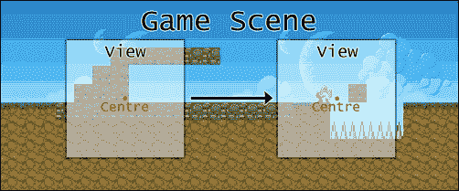
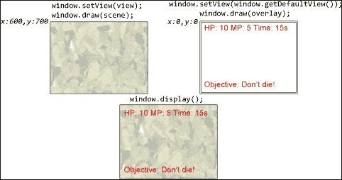
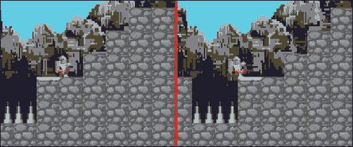
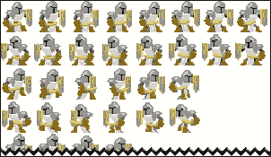
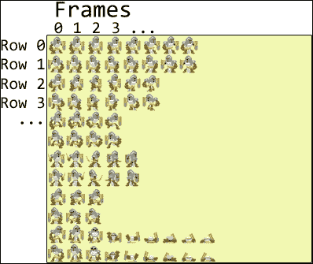

# 第六章：启动！ – 在你的世界中动画和移动

我们的第一款游戏虽然功能齐全，但视觉上肯定不够吸引人，至少在这个世纪是这样。首先，图形几乎不能代表它们应有的样子。将一串方块称为蛇是唯一能让玩家了解他们控制的是什么的方法。较老的设计的第二个基本点是静态摄像机位置。虽然在像 *Snake* 这样的游戏中这是一个设计选择，但更复杂的游戏类型会受到这种限制的阻碍。像 *Super Mario Bros* 这样的游戏依赖于游戏世界超出屏幕边界的事实，这不仅因为视觉吸引力，也因为能够构建一个更大的游戏世界，而这个世界不需要适应某个预先指定的矩形。简单地用图像而不是基本形状来表示游戏角色，以及提供屏幕移动的手段，打开了很多可能性。

在本章中，我们将涵盖：

+   SFML 视图和屏幕滚动

+   自动资源管理和处理

+   精灵表单的创建和应用

+   精灵表单动画

有很多东西要学习，所以我们不要浪费时间，直接深入吧！

# 版权资源的使用

在继续前进之前，我们想要向那些为我们游戏创建纹理、精灵和其他艺术作品的艺术家表示敬意。这些资产包括：

+   richtaur 的 *Lemcraft*，根据 CC0 1.0 许可证：[`opengameart.org/content/lemcraft`](http://opengameart.org/content/lemcraft)

+   由 [`www.robotality.com`](http://www.robotality.com) 提供的 *Prototyping 2D Pixelart Tilesets*，根据 CC-BY-SA 3.0 许可证：[`opengameart.org/content/prototyping-2d-pixelart-tilesets`](http://opengameart.org/content/prototyping-2d-pixelart-tilesets)

+   etqws3 的 *Generic Platformer Tileset (16x16) + Background*，根据 CC0 1.0 许可证：[`opengameart.org/content/generic-platformer-tileset-16x16-background`](http://opengameart.org/content/generic-platformer-tileset-16x16-background)

+   backyardninja 的 *Knight* 和 *Rat* 精灵：[`www.dumbmanex.com/bynd_freestuff.html`](http://www.dumbmanex.com/bynd_freestuff.html)

以上所有资源的许可允许任何形式的材料使用，包括商业用途。有关这两个具体许可的更多信息，请访问以下链接：

+   [`creativecommons.org/publicdomain/zero/1.0/`](http://creativecommons.org/publicdomain/zero/1.0/)

+   [`creativecommons.org/licenses/by-sa/3.0/`](http://creativecommons.org/licenses/by-sa/3.0/)

# 查找和使用当前目录

毫无疑问，编程一段时间后，读取或写入文件的麻烦开始迅速积累。当在编译器外运行程序时，这也许不是那么糟糕，但在调试时使用相对路径可能会很痛苦，因为它们不再相对于可执行文件的目录，而是相对于`.obj`文件的位置。在这本书的其余部分，我们将使用一个函数来获取可执行文件的完整路径，无论它在哪里或如何启动。让我们看看一个将包含此函数的新头文件，称为`Utilities.h`：

```cpp
#pragma once
#define RUNNING_WINDOWS
#include <iostream>
#include <string>
#include <algorithm>

namespace Utils{
  #ifdef RUNNING_WINDOWS
  #define WIN32_LEAN_AND_MEAN
  #include <windows.h>
  #include <Shlwapi.h>
  inline std::string GetWorkingDirectory(){
    HMODULE hModule = GetModuleHandle(nullptr);
    if(hModule){
      char path[256];
      GetModuleFileName(hModule,path,sizeof(path));
      PathRemoveFileSpec(path);
      strcat_s(path,"\\"); // new
      return std::string(path); // new
    }
    return "";
  }
  #elif defined RUNNING_LINUX
  #include <unistd.h>
  inline std::string GetWorkingDirectory(){
    char cwd[1024];
    if(getcwd(cwd, sizeof(cwd)) != nullptr){
      return std::string(cwd) + std::string("/");
    }
    return "";
  }
  #endif
}
```

### 小贴士

`#pragma once`被广泛支持，但不是标准。如果代码是在较旧的编译器中处理的，它可以被典型的包含保护符所替代。

如果设置了`RUNNING_WINDOWS`宏，它定义了一个方法，该方法首先获取包括可执行文件及其扩展名的完整路径，然后仅获取可执行文件的名字和扩展名，最后在返回字符串之前从完整路径中删除它，现在这个字符串包含了可执行文件所在目录的完整“地址”。这些函数是针对 Windows 的特定函数，在其他操作系统上无法工作，因此这个头文件需要为每个操作系统定义不同的相同方法。

### 注意

使用这些函数获取当前目录需要包含`Shlwapi.h`头文件，以及将`shlwapi.lib`文件列在链接器的附加依赖项中，在*所有*配置中。忘记满足这些要求将导致链接器错误。

如您所见，我们在这里涵盖了 Windows 和 Linux 操作系统。如果您希望应用程序能够正常运行，您需要为其他平台实现相同函数的版本。

# 使用 SFML 视图

到目前为止，我们只处理过在打开的窗口边界内渲染内容的代码。还没有需要屏幕移动的实例，如果我们生活在 80 年代初期，那倒也无可厚非，但即使是十年后的游戏也更为先进。以*超级马里奥兄弟*为例，这是一款经典的*横版卷轴游戏*。仅从其类型就可以看出，我们的第一款游戏没有的东西：滚动。如果需要滚动效果或任何屏幕的移动、调整大小或旋转，使用`sf::View`是必要的。

`sf::View`是什么？它是一个矩形。仅此而已。如果您曾经用手指做出矩形形状来“框”您观察的世界，您就用双手创建了一个视图。通过移动它，您实际上是在通过窗口的截止点移动场景。如果您仍然“不理解”，这里有一个插图来引导您走向正确的方向：



`sf::View`是一个非常轻量级的对象，本质上只包含一些浮点变量和一些用于检索其值的方法。它的构造函数可以接受一个`sf::FloatRect`类型，该类型定义了屏幕上的矩形区域，或者它可以接受两个`sf::Vector2f`类型，第一个是视图的中心，第二个是大小：

```cpp
// Top-left corner at 500:500, bottom-right at 1000:1000.
sf::View first(sf::FloatRect(500,500,1000,1000));
// Center at 250:250, size is 800:600.
sf::View second(sf::Vector2f(250,250), sf::Vector2f(800,600));
```

如你所见，视图主要是由其中心而不是其左上角来操纵的，这与大多数其他形状不同。

通过操纵其中心，可以移动视图，如下所示：

```cpp
// Top-left corner at 0:0, bottom-right at 800:600.
sf::View view(sf::FloatRect(0,0,800,600));
view.setCenter(100,100); // Move center to 100:100.
```

它也可以通过`move`方法移动偏移量：

```cpp
view.move(100,100); // Move by 100x100 offset.
```

通过使用`setSize`方法或通过`zoom`方法按比例缩放，可以调整视图的大小：

```cpp
view.setSize(640, 480); // Creates a smaller view space.
view.zoom(0.5f); // Also creates a smaller view space.
```

在第一种情况下，它将 800x600 像素的视图大小调整为 640x480 像素。在第二种情况下，将`0.5f`的因子应用于其当前大小，将其减半，使屏幕上的所有内容都变大。

为了使用特定的视图，你必须调用你正在使用的窗口实例的`setView`方法：

```cpp
window.setView(view); // Applies view to window.
```

### 小贴士

`setView`方法不通过引用接收值。它只是从视图中复制值并将它们存储在窗口对象中。如果在你的代码中的任何一点改变了视图，你必须再次调用`setView`方法，以便应用这些更改并使其反映出来。

值得一提的是，还可以从窗口对象中获取两个视图。第一种视图是当前正在使用的视图，第二种视图是窗口启动时的默认视图。它与窗口大小相同，其左上角位于坐标（0;0）。获取这些视图的方法如下：

```cpp
sf::View view = window.getView();
sf::View defaultView = window.getDefaultView();
```

## 准备应用程序状态以供视图使用

为了支持在世界上进行平移，我们必须调整状态系统。这里的主要思想是每个状态都有自己的视图。例如，主菜单很可能永远不会需要移动到窗口提供的默认视图之外，而游戏状态则会在每一帧都聚焦于角色。一个简单而优雅的方法是将视图与每个状态一起存储，以便在需要时调整屏幕视图空间。让我们从修改`BaseState.h`文件开始：

```cpp
class BaseState{
public:
    ...
    sf::View& GetView(){ return m_view; }
protected:
    ...
    sf::View m_view;
};
```

与我们即将修改的大多数类一样，这里我们只展示相关的部分，在这个例子中，这些部分在尺寸上相当保守。我们添加的只是一个视图数据成员和获取它的方法。让我们继续将这个视图应用到我们的状态管理器中：

```cpp
void StateManager::CreateState(const StateType& l_type){
  ...
  BaseState* state = newState->second();
  state->m_view = m_shared->m_wind->
 GetRenderWindow()->getDefaultView();
  ...
}
```

由于我们不希望`sf::View`的默认构造函数将我们的视图成员初始化为其默认值，因此在创建状态时必须设置视图。我们到目前为止的大多数状态都依赖于视图从不移动的事实，这就是为什么它首先被设置为默认值。如果一个状态希望定义自己的视图，它可以在`OnCreate`方法中这样做，正如你很快就会看到的。让我们继续到状态切换：

```cpp
void StateManager::SwitchTo(const StateType& l_type){
  ...
  for(...)
  {
    if(itr->first == l_type){
      ...
      m_shared->m_wind->GetRenderWindow()->
 setView(tmp_state->GetView());
      return;
    }
  }
  ...
  m_states.back().second->Activate();
  m_shared->m_wind->GetRenderWindow()->setView(    m_states.back().second->GetView());
}
```

这相当直接。当切换到不同的状态时，我们希望将窗口的视图空间更改为与我们要切换到的状态相匹配。如果没有完成这一点，并且游戏状态移动了视图，切换到另一个状态将简单地留下一个空白屏幕，因为新状态的内容被渲染在窗口的视图空间之外。

现在引入了不同的视图后，同时绘制多个状态可能会引起一些问题。这可能会有些难以理解，所以让我们用一个例子来说明这个问题。假设游戏处于暂停状态。因为暂停状态是透明的，它需要首先绘制它前面的状态，以便将它们混合在一起。立刻就出现了问题，因为暂停状态将其元素定位在窗口坐标中，并且它永远不需要视图移动。如果窗口的视图移动了，顶部状态所绘制的任何内容都将位于其视图空间之外，因此可能只会部分可见或根本不可见。我们可以将窗口坐标转换为世界坐标，并每帧更新这些元素的坐标以“跟随”屏幕，但这不是一个优雅或高效的解决方案。因此，我们必须在渲染之前将窗口视图设置为状态视图，如下所示：

```cpp
void StateManager::Draw(){
  ...
  for(; itr != m_states.end(); ++itr){
    m_shared->m_wind->GetRenderWindow()->
 setView(itr->second->GetView());
    itr->second->Draw();
  }
  ...
}
```

由于视图和渲染的方式，上述问题得到了解决。考虑以下说明：



首先，将窗口视图设置为游戏视图以渲染场景。假设它的左上角位于位置（600;700）。然后应用窗口的默认视图。这将窗口视图空间的左上角移动回（0;0），这与本地窗口坐标相匹配。因为即将绘制的元素是基于这些坐标定位的，所以它们现在又回到了窗口的视图空间，并绘制在帧缓冲区上。透明部分被混合，不透明像素被覆盖。最后，调用`window.display();`并在屏幕上绘制帧缓冲区。结果是场景和元素都被混合在一起。

在继续前进之前，我们想在现有的代码库中添加一个新方法到 Window 类中，用于获取一个定义窗口视图空间的`sf::FloatRect`类型：

```cpp
sf::FloatRect Window::GetViewSpace(){
    sf::Vector2f viewCenter = m_window.getView().getCenter();
    sf::Vector2f viewSize = m_window.getView().getSize();
    sf::Vector2f viewSizeHalf(viewSize.x / 2, viewSize.y / 2);
    sf::FloatRect viewSpace(viewCenter - viewSizeHalf, viewSize);
    return viewSpace;
}
```

首先，这种方法获取当前视图的中心和大小。然后它计算大小的一半并从视图中心的坐标中减去，以获得其左上角。最后，它通过传入视图的左上角和大小来构建视图空间的矩形。这将在以后很有用。

# 自动资源管理

让我们谈谈纹理以及我们迄今为止使用它们的方式。在 SFML 中，纹理是一种你只想有一个的东西，因为它在内存方面并不便宜。我们迄今为止的方法只是简单地将纹理存储为相关类的数据成员。以下是一个说明这种策略多么糟糕的场景：你需要在其他地方使用相同的纹理。就是这样。这根本不像是你能轻易放下的事情，因为它毕竟不是经常发生。创建多个包含相同数据的纹理是资源的巨大浪费，为使用它们的类添加获取纹理的方法也是一场灾难。这不仅会弄乱类的轮廓，还意味着其他类必须能够访问持有这个纹理的类。没有人应该让自己承受这样的折磨。

那么，我们如何解决这个问题呢？通过创建一个类，它将所有我们的纹理放在同一个地方，并跟踪它们的使用次数，以便以智能的方式管理其资源。我们还希望给它们唯一的标识符，以便快速引用，这可以通过从将名称映射到路径的文件中加载它们来实现。我们可以将其命名为`Textures.cfg`，它看起来可能像这样：

```cpp
Intro media/Textures/intro.png
PlayerSprite media/Textures/PlayerSheet.png
RatSprite media/Textures/RatSheet.png
TileSheet media/Textures/tilesheet.png
Bg1 media/Textures/bg1.png
Bg2 media/Textures/bg2.png
Bg3 media/Textures/bg3.png
```

当然，这种方法可以用于其他类型的资源，而不仅仅是纹理。稍后，我们还将处理字体和声音文件，所以让我们设计一个抽象基类，首先处理所有常见的任务，然后再专门处理纹理。

## 设计资源管理器

我们将要处理的所有资源都将被计数和记录，换句话说。每当我们要使用一个纹理，例如，它需要被请求。如果它不再需要，资源就会被释放。这听起来很简单，所以让我们写下来：

```cpp
template<typename Derived, typename T>
class ResourceManager{
public:
    ResourceManager(const std::string& l_pathsFile){
        LoadPaths(l_pathsFile);
    }

    virtual ~ResourceManager(){ PurgeResources(); }
    ...
private:
    std::unordered_map<std::string, std::pair<T*, unsigned int>> m_resources;
    std::unordered_map<std::string, std::string> m_paths;
};
```

当处理使用模板的类时，方法的实现必须在头文件中，因为编译器需要访问实现才能使用模板参数实例化方法。话虽如此，让我们谈谈`m_resources`数据成员。它使用一个映射，将字符串句柄绑定到一对元素，其中第一个是资源的模板参数，第二个是用于计数当前使用此特定资源的位置的未签名整数类型。

我们还有一个数据成员，是一个用于资源路径的两个字符串的映射。构造函数调用一个内部方法来从特定位置加载路径，而析构函数则调用另一个内部方法来清除和重新分配其所有资源。

让我们开始实现我们将需要使用此类的其他方法，从公共方法开始：

```cpp
T* GetResource(const std::string& l_id){
    auto res = Find(l_id);
    return(res ? res->first : nullptr);
}
```

这是一个获取由管理器保存的资源的方法。它使用字符串参数作为句柄，并在映射中查找它，使用我们稍后定义的内部`Find`方法。如果找到，它返回映射中元素对的指针，如果没有找到，则返回`nullptr`。

我们可能还感兴趣的是检索特定资源的路径之一：

```cpp
std::string GetPath(const std::string& l_id){
    auto path = m_paths.find(l_id);
    return(path != m_paths.end() ? path->second : "");
}
```

如果没有某种方式来保证资源在使用过程中不会被重新分配，这个系统将毫无用处。为了防止这种情况，让我们实现一种方法来注册资源的使用：

```cpp
bool RequireResource(const std::string& l_id){
  auto res = Find(l_id);
  if(res){
    ++res->second;
    return true;
  }
  auto path = m_paths.find(l_id);
  if (path == m_paths.end()){ return false; }
  T* resource = Load(path->second);
  if (!resource){ return false; }
  m_resources.emplace(l_id, std::make_pair(resource, 1));
  return true;
}
```

此方法有两个目的。一个是在需要时简单地增加资源使用实例计数器。它的第二个目的是在资源容器中找不到句柄时创建资源。它首先检查路径容器，以确认资源句柄有效。如果找到匹配项，它尝试获取新分配内存的指针，该指针由`Load`方法返回。如果没有返回`nullptr`值，则将资源插入，计数器设置为`1`。

正如阴阳必须相互对应一样，对于每个所需资源，都必须有一个不再需要它的时刻：

```cpp
bool ReleaseResource(const std::string& l_id){
    auto res = Find(l_id);
    if (!res){ return false; }
    --res->second;
    if (!res->second){ Unload(l_id); }
    return true;
}
```

此方法尝试使用字符串句柄在容器中查找资源。如果找到，则减少其使用计数器。如果计数器现在是`0`，则此资源不再需要，可以通过调用`Unload`方法来释放其内存。

在某个时刻，一切都必须结束。这是清除方法：

```cpp
void PurgeResources(){
  while(m_resources.begin() != m_resources.end()){
    delete m_resources.begin()->second.first;
    m_resources.erase(m_resources.begin());
  }
}
```

这是一个相当直接的方法。它循环直到容器中没有更多元素。每次它通过传递迭代器删除资源内存并擦除容器条目。

由于某些资源的独特性质，某些方法并不是通用的。为了将这个基类扩展到支持我们想要的任何资源，每个派生管理器都将使用`Load`方法。为了避免运行时多态，可以使用**Curiously Recurring Template Pattern**（奇特重复模板模式）如下：

```cpp
T* Load(const std::string& l_path){
  return static_cast<Derived*>(this)->Load(l_path);
}
```

派生类将实现自己的`Load`版本，但不会在运行时解析虚拟指针到函数。

现在我们已经完成了表面的工作，让我们深入探讨使这种功能成为可能的私有方法，从`Find`方法开始：

```cpp
std::pair<T*,unsigned int>* Find(const std::string& l_id){
  auto itr = m_resources.find(l_id);
  return (itr != m_resources.end() ? &itr->second : nullptr);
}
```

此方法返回一个指向包含实际资源和正在使用它的实例数的 pair 结构的指针。如果提供的字符串句柄在资源容器中未找到，则返回`nullptr`。

卸载资源并没有带来任何新的东西：

```cpp
bool Unload(const std::string& l_id){
  auto itr = m_resources.find(l_id);
  if (itr == m_resources.end()){ return false; }
  delete itr->second.first;
  m_resources.erase(itr);
  return true;
}
```

和往常一样，我们首先通过字符串句柄在容器中查找元素。如果找到，我们释放分配的内存，从容器中擦除元素并从方法中返回。

最后，如果没有映射到路径的字符串句柄，我们无法使用它们。让我们将它们加载进来：

```cpp
void LoadPaths(const std::string& l_pathFile){
  std::ifstream paths;
  paths.open(Utils::GetWorkingDirectory() + l_pathFile);
  if(paths.is_open()){
    std::string line;
    while(std::getline(paths,line)){
      std::stringstream keystream(line);
      std::string pathName;
      std::string path;
      keystream >> pathName;
      keystream >> path;
      m_paths.emplace(pathName,path);
    }
    paths.close();
    return;
  }
  std::cerr << 
    "! Failed loading the path file: " 
    << l_pathFile << std::endl;
}
```

如果你了解 C++中的文件加载，这应该不会让你感到惊讶。它所做的只是设置一个名为`paths`的输入流。然后它尝试打开它，通过传递文件的完整路径，归功于之前提到的`GetWorkingDirectory`函数。如果文件已打开，这意味着它已被找到并且可以读取。定义了一个字符串类型，用作在读取它们时按顺序存储当前文件行的手段。该方法在解析的文件中仍有新行时循环，并将该新行传递给`line`变量。然后设置了一个`stringstream`变量，它专为字符串操作设计。定义了两个`string`变量，一个用于路径标识符，一个用于实际路径。它们通过使用其重载的`>>`操作符从`keystream`变量中填充，该操作符本质上只是抓取直到遇到空格分隔符的所有内容。然后我们将此信息插入路径容器中，并在循环结束后关闭文件。

## 实现纹理管理器

在完成资源管理部分后，我们现在可以在自己的类中实现实际的纹理加载。因为我们只想实现一个方法，所以它也可以在头文件中完成：

```cpp
class TextureManager: 
  public ResourceManager<TextureManager, sf::Texture>
{
public:
  TextureManager(): ResourceManager("textures.cfg"){}

  sf::Texture* Load(const std::string& l_path){
    sf::Texture* texture = new sf::Texture();
    if(!texture->loadFromFile(
      Utils::GetWorkingDirectory() + l_path))
    {
      delete texture;
      texture = nullptr;
      std::cerr << "! Failed to load texture: "
        << l_path << std::endl;
    }
    return texture;
  }
};
```

我们创建了`TextureManager`类，并从`ResourceManager`继承，同时指定了该管理类处理的数据类型以及模板所使用的资源，当然，这是一个`sf::Texture`。纹理管理器的构造函数仅用于在初始化列表中调用基类构造函数，以传递包含句柄和路径绑定的文件名。

在`Load`方法中，我们为纹理分配新的内存，并尝试从提供的路径加载它。如果加载失败，我们将删除分配的内存，并打印出控制台消息来通知用户失败。这就是纹理管理器类的全部内容。现在是时候将其投入使用！

# 介绍精灵图集

首先，让我们通过查看使用精灵图集的未来来激发你的兴趣，这允许你创建看起来像这样的动画：



从我们之前使用 SFML 的经验中，我们知道精灵基本上是一个可以移动、裁剪、缩放和旋转的图像，仅举几个选项。另一方面，精灵图集是一个包含多个精灵的纹理。从上面的图像中，你可以看到玩家正在向左移动，他的动画正在进展。玩家动画的每一帧都存储在精灵图集中，该图集被访问和裁剪以表示单个精灵。这就是它作为纹理看起来的一部分：



精灵的布局方式可能因游戏而异。它取决于特定项目的尺寸限制以及游戏玩法的具体情况。上面精灵图的格式只是在这里效果最好，绝对不是“完美的设计”。

我们为什么要使用精灵图呢？最大的优势是它使得访问精灵更加容易和快速，而且更节省内存。在精灵图上实现动画也更加容易。加载多个不同精灵的纹理比加载单个可裁剪的纹理要昂贵得多。在某些情况下，精心打包的精灵图可以节省大量资源。如果您追求效率，使用精灵图而不是为每个精灵加载不同的纹理无疑是一个明智的选择。

## 实现精灵图类

因为我们希望能够即时修改与精灵图相关的任何内容，从文件中加载它们是最有意义的。让我们先通过创建一个 `Player.sheet` 文件来看看玩家精灵图的样貌：

```cpp
Texture PlayerSprite
Size 32 32
Scale 1.0 1.0
|Type|Name|StartFrame|EndFrame|Row|FrameTime|FrameActionStart|End|
AnimationType Directional
Animation Idle 0 7 0 0.2 -1 -1
Animation Walk 0 5 2 0.1 -1 -1
Animation Jump 0 3 4 0.2 -1 -1
Animation Attack 0 4 6 0.08 2 3
Animation Hurt 0 2 8 0.2 -1 -1
Animation Death 0 8 10 0.15 -1 -1
```

它首先指定将要使用的纹理句柄。还定义了一些关于精灵本身的附加数据，例如单个精灵的大小和缩放。然后跳转到一条注释掉的行。它描述了文件其余部分中值的顺序和含义，这部分用于在精灵图中定义动画序列。在定义动画类型之后，它继续定义所有这些关于动画的不同参数。现在不需要关注这部分，因为稍后会有更深入的讲解。

文件格式的问题解决之后，让我们开始编写精灵图类！首先，定义一个容器类型来保存动画。使用无序映射是因为它比其有序对应物提供更快的查找速度：

```cpp
using Animations = std::unordered_map<std::string,Anim_Base*>;
```

再次提醒，尽量不要过多地纠结于此，因为稍后会有更深入的讲解。现在我们来为精灵图类编写标题：

```cpp
class SpriteSheet{
public:
  SpriteSheet(TextureManager* l_textMgr);
  ~SpriteSheet();

  void CropSprite(const sf::IntRect& l_rect);
  ... // Basic setters/getters.
  bool LoadSheet(const std::string& l_file);
  void ReleaseSheet();

  Anim_Base* GetCurrentAnim();
  bool SetAnimation(const std::string& l_name,
    const bool& l_play = false, 
    const bool& l_loop = false);

  void Update(const float& l_dT);
  void Draw(sf::RenderWindow* l_wnd);
private:
  std::string m_texture;
  sf::Sprite m_sprite;
  sf::Vector2i m_spriteSize;
  sf::Vector2f m_spriteScale;
  Direction m_direction;
  std::string m_animType;
  Animations m_animations;
  Anim_Base* m_animationCurrent;
  TextureManager* m_textureManager;
};
```

如您所见，它提供了裁剪纹理、更新和绘制精灵图的方法。该类保留对纹理管理器的指针，以便获取和释放资源。关于这个类还有一点需要说明，那就是它持有一个 `Direction` 类型的数据成员。它只是一个枚举，定义在 `Directions.h` 文件中：

```cpp
enum class Direction{ Right = 0, Left };
```

它甚至不值得有自己的标题。然而，相当多的类实际上依赖于这个方法，所以需要一个单独的标题来放置它。

让我们开始实现精灵图类的实际方法，从构造函数和析构函数开始：

```cpp
SpriteSheet::SpriteSheet(TextureManager* l_textMgr) 
  :m_textureManager(l_textMgr), m_animationCurrent(nullptr), 
  m_spriteScale(1.f, 1.f), m_direction(Direction::Right){}
```

除了将数据成员初始化为默认值之外，这里没有其他有趣的内容。析构函数简单地调用另一个方法来清理，就像很多其他类一样：

```cpp
SpriteSheet::~SpriteSheet(){ ReleaseSheet(); }

void SpriteSheet::ReleaseSheet(){
    m_textureManager->ReleaseResource(m_texture);
    m_animationCurrent = nullptr;
    while(m_animations.begin() != m_animations.end()){
        delete m_animations.begin()->second;
        m_animations.erase(m_animations.begin());
    }
}
```

`ReleaseSheet` 方法使用纹理管理器来释放它所使用的资源，以及删除它当前分配的所有动画。

当设置精灵大小时，重要的是也要重置原点，使其始终位于精灵的*x*轴中间和*y*轴的底部：

```cpp
void SpriteSheet::SetSpriteSize(const sf::Vector2i& l_size){
    m_spriteSize = l_size;
    m_sprite.setOrigin(m_spriteSize.x / 2, m_spriteSize.y);
}
```

自然地，我们还需要一个设置精灵位置的方法：

```cpp
void SpriteSheet::SetSpritePosition(const sf::Vector2f& l_pos){
    m_sprite.setPosition(l_pos);
}
```

设置精灵的不同方向将改变其精灵，因此我们需要在之后重新裁剪它：

```cpp
void SpriteSheet::SetDirection(const Direction& l_dir){
  if (l_dir == m_direction){ return; }
  m_direction = l_dir;
  m_animationCurrent->CropSprite();
}
```

实际的裁剪是通过精灵类的`setTextureRect`方法完成的：

```cpp
void SpriteSheet::CropSprite(const sf::IntRect& l_rect){
    m_sprite.setTextureRect(l_rect);
}
```

它接受一个`sf::IntRect`类型，该类型定义了其左上角的位置以及矩形的尺寸。左上角坐标是裁剪纹理的局部坐标。假设我们想要获取精灵图中的第一个精灵。如果我们知道每个精灵的大小是 32px x 32px，我们只需要传递左上角的位置（0;0）以及尺寸（32;32）来获取精灵。

尽管我们还没有涉及动画，但让我们先了解一下`SetAnimation`方法，因为它即使不了解即将使用的动画类的具体细节，也不难理解：

```cpp
bool SpriteSheet::SetAnimation(const std::string& l_name, 
  const bool& l_play, const bool& l_loop)
{
  auto itr = m_animations.find(l_name);
  if (itr == m_animations.end()){ return false; }
  if (itr->second == m_animationCurrent){ return false; }
  if (m_animationCurrent){ m_animationCurrent->Stop(); }
  m_animationCurrent = itr->second;
  m_animationCurrent->SetLooping(l_loop);
  if(l_play){ m_animationCurrent->Play(); }
  m_animationCurrent->CropSprite();
  return true;
}
```

它接受三个参数：一个字符串句柄和两个布尔标志，用于立即播放动画以及是否循环。该方法本身会遍历动画容器以查找与字符串句柄匹配的动画。如果找到了，它会检查是否有任何当前动画被设置，因为需要停止它。一旦完成，它只需将当前动画的指针更改为容器中找到的动画，并调用相应的方法以循环和播放动画。并没有什么太复杂的。

然后，我们用最普通的更新和绘制方法来完善这个类：

```cpp
void SpriteSheet::Update(const float& l_dT){
    m_animationCurrent->Update(l_dT);
}

void SpriteSheet::Draw(sf::RenderWindow* l_wnd){
    l_wnd->draw(m_sprite);
}
```

这是最简单不过了。然而，它确实留下了一个未解释的方法：`LoadSheet`。在我们能够实现它之前，我们需要更多地了解我们将要使用的动画类。

## 基础动画类

就像资源管理器一样，我们希望将所有非特定于更具体类的功能卸载到基类中。这就是基础动画类发挥作用的地方。让我们看看`Anim_Base.h`头文件：

```cpp
class SpriteSheet;
using Frame = unsigned int;

class Anim_Base{
  friend class SpriteSheet;
public:
  Anim_Base();
  virtual ~Anim_Base();
  ... // Setters/getters.
  void Play();
  void Pause();
  void Stop();
  void Reset();

  virtual void Update(const float& l_dT);

  friend std::stringstream& operator >>(
    std::stringstream& l_stream, Anim_Base& a)
  {
    a.ReadIn(l_stream);
    return l_stream;
  }
protected:
  virtual void FrameStep() = 0;
  virtual void CropSprite() = 0;
  virtual void ReadIn(std::stringstream& l_stream) = 0;

  Frame m_frameCurrent;
  Frame m_frameStart;
  Frame m_frameEnd;
  Frame m_frameRow;
  int m_frameActionStart; // Frame when a specific "action" begins
  int m_frameActionEnd; // Frame when a specific "action" ends
  float m_frameTime;
  float m_elapsedTime;
  bool m_loop;
  bool m_playing;
  std::string m_name;
  SpriteSheet* m_spriteSheet;
};
```

首先，注意类`SpriteSheet`的前向声明。因为这个类需要包含`SpriteSheet`，而`SpriteSheet`也需要包含这个类，所以需要前向声明以防止交叉包含。我们还将使用无符号整型的一个别名，简单地命名为`Frame`。

大多数数据成员以及方法名称都是相当直观的。一些术语可能令人困惑，例如帧时间和动作。帧时间是每个帧完成所需的时间。动作定义了一个帧的范围，在这个范围内可以执行特定于该动画的行为。如果设置为负一，则在整个动画中都可以执行这种行为。这些都是我们想要跟踪以使游戏更具交互性和响应性的东西。注意，我们正在重载 `>>` 操作符，以便简化从文件中加载动画。关于这一点，稍后会有更多说明。

最后要指出的是三个纯虚方法：`FrameStep`、`CropSprite` 和 `ReadIn`。`FrameStep` 是不同类型动画特有的更新部分。`CropSprite` 是不同类型动画从精灵表中获取精灵的独特方式。最后，`ReadIn` 是定义在从文件加载数据时如何使用 stringstream 对象的方法。这三个方法只会在派生类中定义。

### 实现基本动画类

由于前向声明，我们需要包含在 `.cpp` 文件中声明的类的实际头文件：

```cpp
#include "Anim_Base.h"
#include "SpriteSheet.h"
```

现在我们不再有交叉包含，我们可以使用 `SpriteSheet` 类了。是时候实现实际的类了：

```cpp
Anim_Base::Anim_Base(): m_frameCurrent(0), m_frameStart(0), 
  m_frameEnd(0), m_frameRow(0), m_frameTime(0.f), 
  m_elapsedTime(0.f), m_frameActionStart(-1),
  m_frameActionEnd(-1), m_loop(false), m_playing(false){}
Anim_Base::~Anim_Base(){}
```

构造函数正在执行其预期的初始化默认值的工作，而析构函数在这个类中根本不会被使用。

当然，我们需要一种方法来设置我们的精灵表数据成员：

```cpp
void Anim_Base::SetSpriteSheet(SpriteSheet* l_sheet){
    m_spriteSheet = l_sheet;
}
```

设置动画帧的情况也是一样，尽管这个方法稍微复杂一些：

```cpp
void Anim_Base::SetFrame(const unsigned int& l_frame){
    if((l_frame >= m_frameStart && l_frame <= m_frameEnd)||(l_frame >= m_frameEnd && l_frame <= m_frameStart))
    {
        m_frameCurrent = l_frame;
    }
}
```

传递给此方法的参数将被检查是否在两个特定的范围内，这是为了支持未来可以向后播放的动画类型。

这是一个检查此动画当前是否能够执行其自定义行为的方法：

```cpp
bool Anim_Base::IsInAction(){
    if(m_frameActionStart == -1 || m_frameActionEnd == -1){
        return true;
    }

    return (m_frameCurrent >= m_frameActionStart && m_frameCurrent <= m_frameActionEnd); 
}
```

如果任何值是 `-1`，则“动作”总是执行。否则，当前帧将检查是否在从精灵表文件加载的指定范围内。

如果不控制这些动画，我们将无法走得更远。提供一个简单的接口来做这件事是个好主意：

```cpp
void Anim_Base::Play(){ m_playing = true; }
void Anim_Base::Pause(){ m_playing = false; }
void Anim_Base::Stop(){ m_playing = false; Reset(); }
```

`Play` 和 `Pause` 方法只是简单地操作一个布尔标志，而 `Stop` 方法也会重置动画：

```cpp
void Anim_Base::Reset(){
    m_frameCurrent = m_frameStart;
    m_elapsedTime = 0.0f;
    CropSprite();
}
```

在将帧移回开始并重置计时器后，由于帧的变化，它裁剪了精灵。我们几乎完成了这个类的实现。现在唯一缺少的是更新它的方法：

```cpp
void Anim_Base::Update(const float& l_dT){
  if (!m_playing){ return; }
  m_elapsedTime += l_dT;
  if (m_elapsedTime < m_frameTime){ return; }
  FrameStep();
  CropSprite();
  m_elapsedTime = 0;
}
```

`Update` 方法，像往常一样，接收一个参数，表示帧之间的经过时间。然后它简单地将其添加到动画的经过时间中，如果动画正在播放，并检查是否超过了帧时间。如果超过了，我们调用两个虚拟方法，并将计时器重置回 `0`。

## 方向动画

根据实现细节，不同类型的动画之间并不总是存在清晰的二分法。为了使本章内容不因特定主题而拖延，我们将只实现一种类型的动画，即方向动画。这种类型的动画通常用于任何具有特定方向动画的移动实体。与其他类型的动画不同，增加帧数可能导致行数跳跃，而方向动画将始终保持在表示正确方向正确类型的动画所在的行上。考虑以下插图：



在我们的情况下，每一行包含特定动画的左侧或右侧版本。了解这一点后，让我们创建方向动画类的标题：

```cpp
class Anim_Directional : public Anim_Base{
protected:
    void FrameStep();
    void CropSprite();
    void ReadIn(std::stringstream& l_stream);
};
```

这个类甚至不需要构造函数或析构函数，只需要实现基类中的三个方法。再次注意，由于`Anim_Base`类的头文件中存在前向声明，因此包含了`SpriteSheet.h`文件：

```cpp
#include "Anim_Directional.h"
#include "SpriteSheet.h"
```

现在让我们将纹理切割成我们的精灵：

```cpp
void Anim_Directional::CropSprite(){
  sf::IntRect rect(m_spriteSheet->GetSpriteSize().x * m_frameCurrent,m_spriteSheet->GetSpriteSize().y * (m_frameRow + (short)m_spriteSheet->GetDirection()),m_spriteSheet->GetSpriteSize().x,m_spriteSheet->GetSpriteSize().y);
  m_spriteSheet->CropSprite(rect);
}
```

首先，我们构造一个矩形。其左上角位置是精灵大小乘以当前帧在*x*轴上的值，以及精灵大小乘以当前动画行和精灵表方向在*y*轴上的总和。由于方向枚举将方向映射到`0`或`1`的数值，这使得获取正确方向的行变得非常容易，如上图所示。设置好左上角后，我们传入像素单位的精灵大小，并根据构造的矩形裁剪精灵表。这样就得到了一个精灵！

动画领域的最后一部分是实现`FrameStep`方法：

```cpp
void Anim_Directional::FrameStep(){
  if (m_frameStart < m_frameEnd){ ++m_frameCurrent; }
  else { --m_frameCurrent; }

  if ((m_frameStart < m_frameEnd && m_frameCurrent > m_frameEnd)||
    (m_frameStart > m_frameEnd && m_frameCurrent < m_frameEnd))
  {
    if (m_loop){ m_frameCurrent = m_frameStart; return; }
    m_frameCurrent = m_frameEnd;
    Pause();
  }
}
```

首先，我们检查应该滚动帧的方向，因为将来可能需要定义反向移动的动画。如果起始帧号低于结束帧号，我们正在向正方向移动。然后我们检查帧是否超出范围，并根据它是循环还是非循环，我们将当前帧重置为起始帧，或者将其设置为动画的末尾并暂停它。如果动画是反向播放的，则应用相同的逻辑，只是方向相反。

最后，负责从文件中读取数据的`readFile`方法：

```cpp
void Anim_Directional::ReadIn(std::stringstream& l_stream){
  l_stream >> m_frameStart >> m_frameEnd >> m_frameRow
    >> m_frameTime >> m_frameActionStart >> m_frameActionEnd;
}
```

随着最后一段代码的完成，动画部分就结束了！为了实现加载精灵表文件，我们现在已经拥有了所有需要的东西。

## 加载精灵表文件

加载方法通常从设置文件、读取文件和获取当前行开始。从该行中加载的第一个标识符被存入`type`变量。其余部分相当典型：

```cpp
bool SpriteSheet::LoadSheet(const std::string& l_file){
  std::ifstream sheet;
  sheet.open(Utils::GetWorkingDirectory() + l_file);
  if(sheet.is_open()){
    ReleaseSheet(); // Release current sheet resources.
    std::string line;
    while(std::getline(sheet,line)){
      if (line[0] == '|'){ continue; }
      std::stringstream keystream(line);
      std::string type;
      keystream >> type;
      ...
    }
    sheet.close();
    return true;
  }
  std::cerr << "! Failed loading spritesheet: "
    << l_file << std::endl;
  return false;
}
```

为了避免混淆，该文件中不同类型条目的解析已被分成单独的部分。让我们从纹理加载开始：

```cpp
if(type == "Texture"){
  if (m_texture != ""){
    std::cerr << "! Duplicate texture entries in: "
      << l_file << std::endl;
    continue;
  }
  std::string texture;
  keystream >> texture;
  if (!m_textureManager->RequireResource(texture)){
    std::cerr << "! Could not set up the texture: "
      << texture << std::endl;
    continue;
  }
  m_texture = texture;
  m_sprite.setTexture(*m_textureManager->GetResource(m_texture));
} else if ...
```

首先，我们检查纹理是否已经被初始化，以避免重复条目。如果没有，`keystream`变量输出纹理句柄，该句柄在`if`语句中传递给纹理管理器。这样做是为了捕获无效句柄的错误。如果句柄有效，纹理名称被保留以供稍后释放资源，我们将用于绘制的精灵设置为指向纹理。

现在是阅读更小的信息块的时候了：

```cpp
} else if(type == "Size"){
    keystream >> m_spriteSize.x >> m_spriteSize.y;
    SetSpriteSize(m_spriteSize);
} else if(type == "Scale"){
    keystream >> m_spriteScale.x >> m_spriteScale.y;
    m_sprite.setScale(m_spriteScale);
} else if(type == "AnimationType"){
    keystream >> m_animType;
} else if ...
```

最引人注目的条目留到最后。此刻，我们解析动画：

```cpp
} else if(type == "Animation"){
  std::string name;
  keystream >> name;
  if (m_animations.find(name) != m_animations.end()){
    std::cerr << "! Duplicate animation(" << name 
      << ") in: " << l_file << std::endl;
    continue;
  }
  Anim_Base* anim  = nullptr;
  if(m_animType == "Directional"){
    anim = new Anim_Directional();
  } else {
    std::cerr << "! Unknown animation type: " 
      << m_animType << std::endl;
    continue;
  }

  keystream >> *anim;
  anim->SetSpriteSheet(this);
  anim->SetName(name);
  anim->Reset();
  m_animations.emplace(name,anim);

  if (m_animationCurrent){ continue; }
  m_animationCurrent = anim;
  m_animationCurrent->Play();
}
```

首先，加载动画名称并检查动画容器以避免重复。然后检查之前加载的动画类型，以便构建正确的动画类型。我们可以使用工厂方法来做这件事，但由于我们目前只有一种类型的动画，所以现在似乎没有必要。然后，动画结构从我们的`stringstream`对象中接收数据流，初始化它。此外，动画被重置以将其值归零。一旦它被插入到动画容器中，我们最后检查的是当前动画成员是否已经分配了值。如果没有，这是精灵图文件中的第一个动画，我们假设它是默认的。它被分配给当前动画成员并设置为播放。

# 摘要

虽然良好的图形不是游戏最重要的方面，但从基本形状到屏幕上实际动画的精灵可以给玩家带来巨大的差异。当然，美化产品并不能修复它可能存在的任何缺陷，这似乎是现在的流行心态。然而，将玩家沉浸到游戏世界中，以及让看起来像是一堆方块的东西栩栩如生，这是我们追求的效果，而随着本章的完成，你现在可以使用一些基本技巧实现这一点。

在下一章中，我们将介绍常见的游戏开发元素，这些元素将把我们在游戏中构建的所有图形元素统一成一个具有平台元素、敌人和多个级别的完整游戏。那里见！
