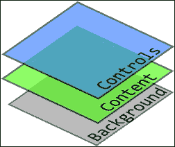
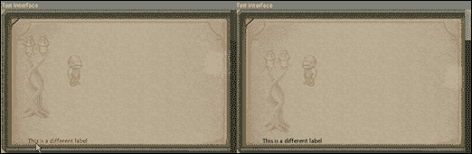
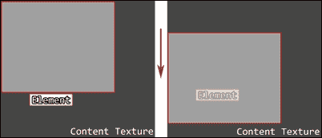
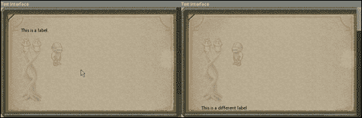

# 第十章.我能点击这个吗？——GUI 基础

在非图灵意义上，人类和机器真正有什么共同之处？如今，普通人的日常生活几乎与操作我们物种创造的大量装置同义，然而，我们中的大多数人甚至不说我们使用的设备的语言，这产生了对某种翻译的需求。现在并不是我们不能学会如何直接与机器交流，但鉴于我们的大脑与通用处理器完全不同的工作方式，这太繁琐、太耗时了。存在一个灰色区域，其中人类执行的相对直观的动作也可以被机器理解和解释，而无需涉及任何底层复杂性——即接口的方式。

在本章中，我们将涵盖以下主题：

+   实现所有 GUI 元素的核心数据类型

+   利用 SFML 的渲染纹理实现 GUI 分层

+   通过使用风格属性来奠定平滑和响应式 GUI 交互的基础

我们有很多内容要覆盖，让我们开始吧！

# 版权资源的使用

在我们开始之前，公正起见，我们应该感谢下一两章中使用的字体和图像的真正创作者：

由*Ravenmore*在[`dycha.net/`](http://dycha.net/)提供的*Fantasy UI Elements*，根据 CC-BY 3.0 许可：

[`opengameart.org/content/fantasy-ui-elements-by-ravenmore`](http://opengameart.org/content/fantasy-ui-elements-by-ravenmore)

由*Arro*设计的*Vegur 字体*，根据 CC0 许可（公共领域）：

[`www.fontspace.com/arro/vegur`](http://www.fontspace.com/arro/vegur)

关于这些资源所适用的所有许可证的更多信息，请在此处查找：

[`creativecommons.org/publicdomain/zero/1.0/`](http://creativecommons.org/publicdomain/zero/1.0/)

[`creativecommons.org/licenses/by/3.0/`](http://creativecommons.org/licenses/by/3.0/)

# 什么是 GUI？

GUI，即**图形用户界面**，是用户与软件之间的视觉中介，它作为数字设备或计算机程序的控制系统。使用此类界面比依赖基于文本的控制（如输入命令）更快、更简单。

在编写任何代码之前，我们需要概述我们 GUI 系统的预期功能，该系统将包括三个主要组件：

+   **元素**：绘制到屏幕上的每个 GUI 表面

+   **接口**：一种特殊类型的元素，用作其他元素的容器，并且可以移动以及滚动

+   **管理器**：负责保持 GUI 界面一致性和行为的类

系统中的所有元素都需要能够适应不同的状态，当鼠标悬停或点击时。样式集也需要应用于不同的状态，从而使界面变得响应。最后，你必须能够在运行时从文件中加载界面，并根据它们内部发生的事件或一系列事件将它们与代码绑定。

## GUI 样式

统一在 GUI 表面上应用和使用的样式方式对于需要定制和灵活性至关重要。简单来说，手动修改和应用每种可能类型元素的所有样式属性将是一场噩梦，任何代码重用都将变得不可能。这需要一种可以在整个系统中使用的自定义数据类型：`GUI_Style`结构。

首先，任何和所有的 GUI 元素都应该能够支持以下三种状态：

```cpp
enum class GUI_ElementState{ Neutral, Focused, Clicked };
```

虽然这些状态不仅用于图形目的，但每个状态也被定义为一系列视觉属性，以模拟交互和流畅性，这些属性由一系列样式属性表示：

```cpp
struct GUI_Style{
    ...
    sf::Vector2f m_size; // Element size.
    // Background properties.
    sf::Color m_backgroundColor;
    sf::Color m_elementColor;
    std::string m_backgroundImage;
    sf::Color m_backgroundImageColor;
    // Text properties.
    sf::Color m_textColor;
    std::string m_textFont;
    sf::Vector2f m_textPadding;
    unsigned int m_textSize;
    bool m_textCenterOrigin;
    // Glyph properties.
    std::string m_glyph;
    sf::Vector2f m_glyphPadding;
};
```

一个元素或界面可以改变这些属性中的每一个，并根据其状态调整自身以看起来完全不同。如果没有定义，构造函数中设置的默认值将优先，如下所示：

```cpp
GUI_Style(): m_textSize(12), m_textCenterOrigin(false),
  m_backgroundImageColor(255,255,255,255)
{
  sf::Color none    = sf::Color(0, 0, 0, 0);
  m_backgroundColor = none;
  m_elementColor    = none;
  m_textColor       = none;
}
```

如果我们没有可绘制对象来修改，所有这一切都是无用的，所以让我们解决这个问题：

```cpp
struct GUI_Visual{
    sf::RectangleShape m_backgroundSolid;
    sf::Sprite m_backgroundImage;
    sf::Sprite m_glyph;
    sf::Text m_text;
};
```

这种基本结构将成为每个单独的元素和界面的组成部分，使它们能够通过这四种可绘制元素的任意组合来表示。

# 扩展实用函数

为了使事情简单易读，总是从将被频繁使用的任何代码中创建实用类型函数是一个好主意。在处理界面反序列化时，许多元素必须读取包含空格的参数。我们解决这个问题的方法是将字符串放在双引号中并定义一个内联函数来读取数据。这个完美的位置是在`Utilities.h`文件中：

```cpp
inline void ReadQuotedString(std::stringstream& l_stream, 
  std::string& l_string)
{
  l_stream >> l_string;
  if (l_string.at(0) == '"'){
    while (l_string.at(l_string.length() - 1) != '"' ||
      !l_stream.eof())
    {
      std::string str;
      l_stream >> str;
      l_string.append(" " + str);
    }
  }
  l_string.erase(std::remove(l_string.begin(),
    l_string.end(), '"'), l_string.end());
}
```

一个单词从字符串流对象加载到提供的字符串参数中。检查其第一个字符是否为双引号。如果是，则使用`while`循环继续读取单词并将它们追加到参数字符串中，直到其最后一个字符是双引号或达到流末尾。

之后，字符串中的所有双引号都被删除。

# 字体管理

在我们开始构建图形用户界面的结构之前，我们需要一种方法来自动管理和处理字体的加载和卸载，就像我们处理纹理一样。我们在第六章中编写的资源管理器的努力，*启动！ – 动画和移动你的世界*，即将得到回报。为了管理字体，我们只需要创建一个`FontManager.h`文件并编写以下代码：

```cpp
class FontManager : public ResourceManager<FontManager, sf::Font>{
public:
  FontManager() : ResourceManager("fonts.cfg"){}

  sf::Font* Load(const std::string& l_path){
    sf::Font* font = new sf::Font();
    if (!font->loadFromFile(
      Utils::GetWorkingDirectory() + l_path))
    {
      delete font;
      font = nullptr;
      std::cerr << "! Failed to load font: "
        << l_path << std::endl;
    }
    return font;
  }
};
```

这在构造函数中定义了字体资源配置文件，以及使用`Load`方法加载字体文件的具体方式。我们之前实现的资源管理器使这个过程非常简单，所以让我们继续吧！

# 所有元素的核心

`GUI_Element`类是每个元素和界面的核心。它提供了高层对象所依赖的关键功能，并强制实现必要的方法，这导致了几个独特的元素类型。

定义不同元素类型的好地方是：

```cpp
enum class GUI_ElementType{ Window, Label, Button, Scrollbar,
  Textfield };
```

每个元素必须持有它可以根据其状态切换的不同样式。`unordered_map`数据结构非常适合我们的目的：

```cpp
using ElementStyles = std::unordered_map<
  GUI_ElementState, GUI_Style>;
```

为了防止交叉包含，对拥有者类的向前声明也是必要的：

```cpp
class GUI_Interface;
```

接下来，我们可以开始塑造`GUI_Element`类：

```cpp
class GUI_Element{
  friend class GUI_Interface;
public:
  GUI_Element(const std::string& l_name, 
    const GUI_ElementType& l_type, GUI_Interface* l_owner);
  virtual ~GUI_Element();

  // Event methods.
  virtual void ReadIn(std::stringstream& l_stream) = 0;
  virtual void OnClick(const sf::Vector2f& l_mousePos) = 0;
  virtual void OnRelease() = 0;
  virtual void OnHover(const sf::Vector2f& l_mousePos) = 0;
  virtual void OnLeave() = 0;
  virtual void Update(float l_dT) = 0;
  virtual void Draw(sf::RenderTarget* l_target) = 0;

  virtual void UpdateStyle(const GUI_ElementState& l_state,
    const GUI_Style& l_style);
  virtual void ApplyStyle();
  ... // Getters/setters
  friend std::stringstream& operator >>(
    std::stringstream& l_stream, GUI_Element& b)
  {
    b.ReadIn(l_stream);
    return l_stream;
  }
protected:
  void ApplyTextStyle();
  void ApplyBgStyle();
  void ApplyGlyphStyle();

  void RequireTexture(const std::string& l_name);
  void RequireFont(const std::string& l_name);
  void ReleaseTexture(const std::string& l_name);
  void ReleaseFont(const std::string& l_name);
  void ReleaseResources();
  std::string m_name;
  sf::Vector2f m_position;
  ElementStyles m_style; // Style of drawables.
  GUI_Visual m_visual; // Drawable bits.
  GUI_ElementType m_type;
  GUI_ElementState m_state;
  GUI_Interface* m_owner;

  bool m_needsRedraw;
  bool m_active;
  bool m_isControl;
};
```

任何 GUI 元素最基本的部分是它如何响应用件。这就是纯虚方法的魔力所在。然而，样式应用方法并不是纯虚的。元素在处理其样式时并不比默认元素有所不同。

每个元素也需要一个名称、一个位置、每个可能状态的一组样式、一个可以绘制的视觉组件、一个类型和状态标识符，以及指向一个拥有者类的指针。它还需要跟踪是否需要重新绘制、其活动状态以及一个表示它是否是控件的标志。这些属性由`GUI_Element`类的私有数据成员集合表示。

在这个结构的大致想法已经确定之后，让我们塑造元素类的更详细细节。

## 实现 GUI 元素类

我们即将开始实现的类是每个界面和元素的基础。它将定义我们的 GUI 系统如何行为。考虑到这一点，让我们首先看看构造函数，因为我们有很多东西需要初始化：

```cpp
GUI_Element::GUI_Element(const std::string& l_name,
  const GUI_ElementType& l_type, GUI_Interface* l_owner)
  : m_name(l_name), m_type(l_type), m_owner(l_owner),
  m_state(GUI_ElementState::Neutral), m_needsRedraw(false),
  m_active(true), m_isControl(false){}
```

元素名称、类型以及指向拥有者类的指针被接收并传递到适当的数据成员。其他附加标志也被初始化为默认值。到目前为止，没有什么异常之处。让我们看看这个类是如何被销毁的：

```cpp
GUI_Element::~GUI_Element(){ ReleaseResources(); }
```

由于这个类中没有任何动态内存分配，因此释放资源也很简单。为此目的的方法只是在这里简单调用。它看起来有点像这样：

```cpp
void GUI_Element::ReleaseResources(){
  for (auto &itr : m_style){
    ReleaseTexture(itr.second.m_backgroundImage);
    ReleaseTexture(itr.second.m_glyph);
    ReleaseFont(itr.second.m_textFont);
  }
}
```

我们只需要关注元素本身所需的那些纹理和字体，因此每个样式都会被迭代，并且通过相应的方法释放其资源，这些方法看起来都与展示的类似：

```cpp
void GUI_Element::ReleaseTexture(const std::string& l_name){
  if (l_name == ""){ return; }
  m_owner->GetManager()->GetContext()->
    m_textureManager->ReleaseResource(l_name);
}
```

如果释放了字体，唯一的不同之处在于所使用的管理器。

说到样式，我们需要有一种规范的方式来修改它们。`UpdateStyle`方法负责这项工作：

```cpp
void GUI_Element::UpdateStyle(const GUI_ElementState& l_state, 
  const GUI_Style& l_style)
{
  // Resource management.
  if (l_style.m_backgroundImage !=
    m_style[l_state].m_backgroundImage)
  {
    ReleaseTexture(m_style[l_state].m_backgroundImage);
    RequireTexture(l_style.m_backgroundImage);
  }

  if (l_style.m_glyph != m_style[l_state].m_glyph){
    ReleaseTexture(m_style[l_state].m_glyph);
    RequireTexture(l_style.m_glyph);
  }

  if (l_style.m_textFont != m_style[l_state].m_textFont){
    ReleaseFont(m_style[l_state].m_textFont);
    RequireFont(l_style.m_textFont);
  }
  // Style application.
  m_style[l_state] = l_style;
  if (l_state == m_state){ SetRedraw(true); ApplyStyle(); }
}
```

此方法期望两个参数：正在修改的状态和一个将用于替换现有结构的样式结构。虽然使用赋值运算符覆盖相关样式很简单，但在那之前必须进行一些资源管理。我们需要知道被替换的样式是否需要与其他样式不同的资源。如果是，则释放旧的纹理和字体，而新的则通过使用两个看起来类似的辅助方法进行预留：

```cpp
void GUI_Element::RequireTexture(const std::string& l_name){
  if (l_name == ""){ return; }
  m_owner->GetManager()->GetContext()->
    m_textureManager->RequireResource(l_name);
}
```

此方法的字体等效使用不同的管理器，但其他方面相同。

一旦样式被覆盖，我们会检查正在修改的状态是否与元素的状态相同。如果是，这个特定的元素将通过`SetRedraw`方法标记为需要重新绘制，并且其样式将通过`ApplyStyle`方法应用，这是我们接下来要查看的内容：

```cpp
void GUI_Element::ApplyStyle(){
  ApplyTextStyle();
  ApplyBgStyle();
  ApplyGlyphStyle();
  if (m_owner != this && !IsControl()){
    m_owner->AdjustContentSize(this);
  }
}
```

这段代码负责将元素的样式与其视觉表示连接起来。它首先调用几个辅助方法，帮助我们将代码分解成更小、更易于管理的块。之后，需要通知所有者接口，因为任何元素样式的修改可能会导致尺寸变化。如果元素不是接口控件并且不是它自己的所有者，则调用`GUI_Interface`类的`AdjustContentSize`方法，并将`this`关键字作为参数传递。我们很快就会实现它。

让我们看看第一个辅助方法，它处理文本样式：

```cpp
void GUI_Element::ApplyTextStyle(){
  FontManager* fonts = m_owner->GetManager()->
    GetContext()->m_fontManager;
  const GUI_Style& CurrentStyle = m_style[m_state];
  if (CurrentStyle.m_textFont != ""){
    m_visual.m_text.setFont(
      *fonts->GetResource(CurrentStyle.m_textFont));
    m_visual.m_text.setColor(CurrentStyle.m_textColor);
    m_visual.m_text.setCharacterSize(CurrentStyle.m_textSize);
    if (CurrentStyle.m_textCenterOrigin){
      sf::FloatRect rect = m_visual.m_text.getLocalBounds();
      m_visual.m_text.setOrigin(rect.left + rect.width / 2.0f,
        rect.top + rect.height / 2.0f);
    } else {
      m_visual.m_text.setOrigin(0.f, 0.f);
    }
  }
  m_visual.m_text.setPosition(m_position +
    CurrentStyle.m_textPadding);
}
```

可以为元素具有的每种不同样式应用不同的字体、颜色和字符大小。每次这些属性被操作时，文本的原始位置也需要重新计算，因为这些属性可以在任何点上被操作。然后，文本的位置会根据当前样式的填充值进行更新。

背景样式应用遵循相同的基本思想：

```cpp
void GUI_Element::ApplyBgStyle(){
  TextureManager* textures = m_owner->GetManager()->
    GetContext()->m_textureManager;
  const GUI_Style& CurrentStyle = m_style[m_state];
  if (CurrentStyle.m_backgroundImage != ""){
    m_visual.m_backgroundImage.setTexture(
      *textures->GetResource(CurrentStyle.m_backgroundImage));
    m_visual.m_backgroundImage.setColor(
      CurrentStyle.m_backgroundImageColor);
  }
  m_visual.m_backgroundImage.setPosition(m_position);
  m_visual.m_backgroundSolid.setSize(
    sf::Vector2f(CurrentStyle.m_size));
  m_visual.m_backgroundSolid.setFillColor(
    CurrentStyle.m_backgroundColor);
  m_visual.m_backgroundSolid.setPosition(m_position);
}
```

这展示了我们如何添加对背景图像和实心元素的支持。这两个元素都通过应用当前样式的视觉属性并重新设置其位置进行调整。

最后，元素的符号以相同的方式被改变：

```cpp
void GUI_Element::ApplyGlyphStyle(){
  const GUI_Style& CurrentStyle = m_style[m_state];
  TextureManager* textures = m_owner->GetManager()->
    GetContext()->m_textureManager;
  if (CurrentStyle.m_glyph != ""){
    m_visual.m_glyph.setTexture(
      *textures->GetResource(CurrentStyle.m_glyph));
  }
  m_visual.m_glyph.setPosition(m_position +
    CurrentStyle.m_glyphPadding);
}
```

接下来，让我们看看元素状态的变化：

```cpp
void GUI_Element::SetState(const GUI_ElementState& l_state){
  if (m_state == l_state){ return; }
  m_state = l_state;
  SetRedraw(true);
}
```

如果元素的状态发生变化，必须将其标记为重新绘制，因为不同的状态可能具有不同的样式元素。然而，这只有在提供的状态参数与当前状态不匹配时才会进行，这样做是为了节省资源。

设置元素位置也值得注意：

```cpp
void GUI_Element::SetPosition(const sf::Vector2f& l_pos){
  m_position = l_pos;
  if (m_owner == nullptr || m_owner == this){ return; }
  const auto& padding = m_owner->GetPadding();
  if (m_position.x < padding.x){ m_position.x = padding.x; }
  if (m_position.y < padding.y){ m_position.y = padding.y; }
}
```

由于所有元素都属于一个容器结构，因此它们的定位也必须尊重这些容器的填充。一旦元素的定位被设置，容器接口的填充就会被获取。如果元素在任一轴上的定位小于该填充，则定位将被设置为至少与边缘一样远，这是接口允许的最小距离。

这里有一段重要的代码，它可以决定与任何 GUI 表面的交互是否成功：

```cpp
bool GUI_Element::IsInside(const sf::Vector2f& l_point) const{
   sf::Vector2f position = GetGlobalPosition();
   return(l_point.x >= position.x &&
      l_point.y >= position.y &&
      l_point.x <= position.x + m_style.at(m_state).m_size.x &&
      l_point.y <= position.y + m_style.at(m_state).m_size.y);
}
```

`IsInside` 方法用于确定空间中的某个点是否在元素内部。由于它与所有者的相对位置，使用其正常位置计算交集会产生错误的结果。相反，它使用 `GetGlobalPosition` 方法从所有者接口的渲染纹理中获取元素的位置，而不是局部空间。然后，通过一点基本的边界框碰撞魔法，它根据元素当前样式的尺寸确定提供的点是否在元素内部。

获取元素的全局位置可以这样做：

```cpp
sf::Vector2f GUI_Element::GetGlobalPosition() const{
  sf::Vector2f position = GetPosition();
  if (m_owner == nullptr || m_owner == this){ return position; }
  position += m_owner->GetGlobalPosition();
  if (IsControl()){ return position; }
  position.x -= m_owner->m_scrollHorizontal;
  position.y -= m_owner->m_scrollVertical;
  return position;
}
```

首先，获取元素的局部位置。然后，该方法确定该元素是否有所有者以及它是否不属于自己。如果有，获取的位置就是最终结果并返回。否则，通过使用此方法获取所有者的全局位置，并将其添加到局部位置。此外，如果元素不是控件类型，则从其位置中减去水平和垂直滚动值，以尊重接口滚动。

最后，这里有一些不是那么直接的设置器和获取器：

```cpp
Const sf::Vector2f& GUI_Element::GetSize() const{ 
    return m_style.at(m_state).m_size;
}
void GUI_Element::SetActive(const bool& l_active){ 
    if (l_active != m_active){
     m_active = l_active; 
        SetRedraw(true);
    }
}
std::string GUI_Element::GetText() const{ 
    return m_visual.m_text.getString();
}
void GUI_Element::SetText(const std::string& l_text){ 
    m_visual.m_text.setString(l_text);
    SetRedraw(true);
}
```

### 注意

注意 `SetActive` 和 `SetText` 方法。每当元素被修改时，我们必须将其重绘标志设置为 `true`，否则它将不会更新，直到另一个事件需要它。

# 定义 GUI 事件

与接口提供流畅的交互以及将更改与应用程序内部的操作关联起来的简便方式可能是区分良好 GUI 系统和不良 GUI 系统的最重要的标准。既然我们已经在学习 SFML，我们可以使用 SFML 方法并省略事件。

首先，我们必须定义在接口中可能发生的所有可能的事件。创建一个 `GUI_Event.h` 文件并构建一个枚举，如下所示：

```cpp
enum class GUI_EventType{ None, Click, Release, Hover, Leave };
```

我们还必须在同一个文件中定义一个自定义结构，用于存储事件信息：

```cpp
struct ClickCoordinates{
    float x, y;
};

struct GUI_Event{
    GUI_EventType m_type;
    const char* m_element;
    const char* m_interface;
    union{
        ClickCoordinates m_clickCoords;
    };
};
```

这里首先要讨论的是结构。在这里仅仅使用`sf::Vector2f`应该是可能的。在大多数情况下，这会工作得很好，但在那几行下面，你会看到`ClickCoordinates`的重要性。根据我们将要处理的事件类型，它需要在`GUI_Event`结构中存储不同的数据。通过在这个结构内部使用一个*联合*，我们将避免分配额外的内存，但这也有代价。联合不能有成员函数、虚函数或派生自其他类的成员。正是因为这个限制，我们被迫定义自己的`struct`，它包含两个*浮点数*并代表一个点。

### 提示

在这种情况下，boost 库可能是有用的，因为它提供了`boost::variant`，这是一个类型安全的联合容器，没有这些限制。它还有很少或没有开销。

实际的事件结构包含一个事件类型，用于确定联合中哪个成员是活动的，以及事件起源的元素和接口的名称。如果你对细节有很好的洞察力，你现在可能已经问过自己为什么我们使用`const char*`数据类型而不是`std::string`。简化数据成员的数据类型是另一个迹象，表明这个结构将被纳入联合。不幸的是，`std::string`陷入了与`sf::Vector2f`相同的陷阱，不能在没有额外工作的前提下用于联合。

# 接口类

接口，在最简单的意义上，是一个元素的容器。它是一个可以移动和滚动的窗口，具有与常规元素相同的特性和事件钩子。效率也是一个很大的关注点，因为在单个窗口中处理大量元素是肯定可能发生的。这些问题可以通过精心设计在适当时间绘制元素的方式来解决。

我们希望接口绘制内容的方式是使用三个不同的纹理，用于不同的目的，如下所示：



+   **背景**层用于绘制背景元素

+   **内容**层是绘制接口所有元素的地方

+   **控件**层托管如滚动条等元素，这些元素操作内容层且不需要滚动

设计细节确定后，元素存储值得注意。碰巧的是，`std::unordered_map`结构很好地服务于这个目的：

```cpp
using Elements = std::unordered_map<std::string,GUI_Element*>;
```

接下来，需要一个所有者类的声明来防止交叉包含：

```cpp
class GUI_Manager;
```

所有这些都带我们来到了`GUI_Interface`类：

```cpp
class GUI_Interface : public GUI_Element{
  friend class GUI_Element;
  friend class GUI_Manager;
public:
  ...
private:
  void DefocusTextfields();
  Elements m_elements;
  sf::Vector2f m_elementPadding;

  GUI_Interface* m_parent;
  GUI_Manager* m_guiManager;

  sf::RenderTexture* m_backdropTexture;
  sf::Sprite m_backdrop;

  // Movement.
  sf::RectangleShape m_titleBar;
  sf::Vector2f m_moveMouseLast;
  bool m_showTitleBar;
  bool m_movable;
  bool m_beingMoved;
  bool m_focused;

  // Variable size.
  void AdjustContentSize(const GUI_Element* l_reference= nullptr);
  void SetContentSize(const sf::Vector2f& l_vec);
  sf::RenderTexture* m_contentTexture;
  sf::Sprite m_content;
  sf::Vector2f m_contentSize;
  int m_scrollHorizontal;
  int m_scrollVertical;
  bool m_contentRedraw;

  // Control layer.
  sf::RenderTexture* m_controlTexture;
  sf::Sprite m_control;
  bool m_controlRedraw;
};
```

### 注意

注意`friend`类的声明。`GUI_Element`和`GUI_Manager`都需要访问这个类的私有和受保护成员。

现在，让我们只关注私有成员，并将公共成员留给本章的实现部分。

除了拥有元素容器外，界面还定义了元素必须遵守的填充量，如果有的话，指向其父类的一个指针，以及管理类和一组代表其不同层的纹理。除非我们讨论实现细节，否则无法完全理解其余的数据成员以及省略的方法，所以让我们直接进入正题！

## 实现界面类

像往常一样，一个不错的起点是类构造函数：

```cpp
GUI_Interface::GUI_Interface(const std::string& l_name,
  GUI_Manager* l_guiManager)
  : GUI_Element(l_name, GUI_ElementType::Window, this),
  m_parent(nullptr), m_guiManager(l_guiManager), m_movable(false),
  m_beingMoved(false), m_showTitleBar(false), m_focused(false),
  m_scrollHorizontal(0),m_scrollVertical(0),m_contentRedraw(true),
  m_controlRedraw(true)
{
  m_backdropTexture = new sf::RenderTexture();
  m_contentTexture = new sf::RenderTexture();
  m_controlTexture = new sf::RenderTexture();
}
```

在这里，通过初始化列表初始化了很多数据成员。首先，父类 `GUI_Element` 需要知道界面的名字、类型和所有者。`GUI_Interface` 的一个参数是其名字，它被传递给 `GUI_Element` 构造函数。类型当然设置为 `Window`，而 `this` 关键字作为界面的所有者传递。此外，界面的父类被初始化为其默认值 `nullptr`，并将指向 `GUI_Manager` 类的指针存储在 `m_guiManager` 数据成员中。

在数据成员初始化之后，我们进入构造函数的主体，其中动态分配了三个 `sf::RenderTexture` 对象。这些是用于渲染界面背景、内容和控制层的纹理。

接下来，让我们看看在析构函数中释放所有这些资源：

```cpp
GUI_Interface::~GUI_Interface(){
  delete m_backdropTexture;
  delete m_contentTexture;
  delete m_controlTexture;
  for (auto &itr : m_elements){
    delete itr.second;
  }
}
```

当然，这三个纹理实例也必须被删除，以及所有在销毁时仍然存在于元素容器中的单个元素。之后，元素容器被清空。

设置界面的位置稍微复杂一些，所以让我们来看看：

```cpp
void GUI_Interface::SetPosition(const sf::Vector2f& l_pos){
    GUI_Element::SetPosition(l_pos);
    m_backdrop.setPosition(l_pos);
    m_content.setPosition(l_pos);
    m_control.setPosition(l_pos);
    m_titleBar.setPosition(m_position.x, m_position.y - m_titleBar.getSize().y);
    m_visual.m_text.setPosition(m_titleBar.getPosition() + m_style[m_state].m_textPadding);
}
```

首先，调用父类的 `SetPosition` 方法来调整实际位置。没有必要修复没有损坏的东西。接下来，调整代表背景、内容和控制层的三个精灵的位置。最后，你设置标题栏。实心背景形状的位置被设置为在界面之上，而视觉组件的文本用作标题，并调整到与标题栏背景相同的位置，只是增加了文本填充。

空的窗口并不很有用或有趣，所以让我们提供一种方法，通过这种方法可以将元素添加到它们中：

```cpp
bool GUI_Interface::AddElement(const GUI_ElementType& l_type, 
  const std::string& l_name)
{
  if (m_elements.find(l_name) != m_elements.end()){return false;}
  GUI_Element* element = nullptr;
  element = m_guiManager->CreateElement(l_type, this);
  if (!element){ return false; }
  element->SetName(l_name);
  element->SetOwner(this);
  m_elements.emplace(l_name, element);
  m_contentRedraw = true;
  m_controlRedraw = true;
  return true;
}
```

避免名称冲突很重要，所以需要将提供的第二个参数中的名称与元素容器进行核对，以防止重复。如果没有找到任何重复项，就使用 `GUI_Manager` 类的 `CreateElement` 方法在堆上创建相关类型的元素，并返回其内存地址。在确认确实创建之后，设置元素的名字和所有者属性，然后将其插入到元素容器中。然后界面设置两个标志以重新绘制内容和控制层。

任何界面都需要一种提供对其元素访问的方法。这就是 `GetElement` 方法的作用所在：

```cpp
GUI_Element* GUI_Interface::GetElement(const std::string& l_name)
const{
  auto itr = m_elements.find(l_name);
  return(itr != m_elements.end() ? itr->second : nullptr);
}
```

它只是使用其查找方法在 `std::unordered_map` 中定位元素并返回它。如果找不到元素，则返回 `nullptr`。很简单。

接下来，我们需要一种方法从界面中移除元素：

```cpp
bool GUI_Interface::RemoveElement(const std::string& l_name){
  auto itr = m_elements.find(l_name);
  if (itr == m_elements.end()){ return false; }
  delete itr->second;
  m_elements.erase(itr);
  m_contentRedraw = true;
  m_controlRedraw = true;
  AdjustContentSize();
  return true;
}
```

按照与 `GetElement` 方法相同的示例，首先在容器内定位元素。然后使用 `delete` 操作符释放动态内存，并将元素本身从容器中移除。界面被标记为重新绘制其内容和控制层，如果需要，调用 `AdjustContentSize` 方法来调整内容纹理的大小。

我们需要覆盖原始的 `IsInside` 方法，因为界面由于标题栏的存在而占用额外的空间，如下所示：

```cpp
bool GUI_Interface::IsInside(const sf::Vector2f& l_point) const{
    if (GUI_Element::IsInside(l_point)){ return true; }
    return m_titleBar.getGlobalBounds().contains(l_point);
}
```

首先调用父类方法以确定 `l_point` 是否在界面占用的空间内。如果不是，则返回标题栏边界框的 `contains` 方法的结果以确定 `l_point` 是否在该区域内。

接下来展示的是代码的反序列化部分：

```cpp
void GUI_Interface::ReadIn(std::stringstream& l_stream){
    std::string movableState;
    std::string titleShow;
    std::string title;
    l_stream >> m_elementPadding.x >> m_elementPadding.y >> movableState >> titleShow;
    Utils::ReadQuotedString(l_stream, title);
    m_visual.m_text.setString(title);
    if (movableState == "Movable"){ m_movable = true; }
    if (titleShow == "Title"){ m_showTitleBar = true; }
}
```

所有界面首先读取元素的填充 *x* 和 *y* 值，以及状态和标题参数。然后使用我们之前定义的 `ReadQuotedText` 工具函数来读取界面的实际标题。根据读取的字符串，它随后设置 `m_movable` 和 `m_showTitleBar` 标志以反映这些值。

现在是有趣的部分。让我们定义当界面被点击时会发生什么：

```cpp
void GUI_Interface::OnClick(const sf::Vector2f& l_mousePos){
  DefocusTextfields();
  if (m_titleBar.getGlobalBounds().contains(l_mousePos) &&
    m_movable && m_showTitleBar)
  {
    m_beingMoved = true;
  } else {
    GUI_Event event;
    event.m_type = GUI_EventType::Click;
    event.m_interface = m_name.c_str();
    event.m_element = "";
    event.m_clickCoords.x = l_mousePos.x;
    event.m_clickCoords.y = l_mousePos.y;
    m_guiManager->AddEvent(event);
    for (auto &itr : m_elements){
      if (!itr.second->IsInside(l_mousePos)){ continue; }
      itr.second->OnClick(l_mousePos);
      event.m_element = itr.second->m_name.c_str();
      m_guiManager->AddEvent(event);
    }
    SetState(GUI_ElementState::Clicked);
  }
}
```

首先，我们调用负责从所有 `Textfield` GUI 元素中移除焦点的私有辅助方法之一。这将在稍后进行更深入的讨论。另一个问题是当在界面中检测到点击时发生的拖动。如果鼠标位置在标题栏区域，并且界面本身是可移动的，我们将 `m_beingMoved` 标志设置为 `true` 以指示界面拖动。

如果只是界面边界内的常规点击，我们首先设置一个将要分发的事件，表示发生了点击。类型设置为 `Click`，界面名称被复制为 *c 字符串*，并且也设置了鼠标坐标。使用我们新创建的事件作为参数调用 `GUI_Manager` 类的 `AddEvent` 方法。这个第一个事件表明点击发生在界面本身，而不是任何特定的元素中。

这很快就会跟着一个循环，该循环遍历界面中的每一个单独的元素。它们的`IsInside`方法被调用以确定发生的点击是否也位于任何元素内部。如果是这样，那个特定元素的`OnClick`方法就会调用，并将鼠标位置作为参数传入。然后，在循环之前设置的同一次事件被稍微修改，包含元素的名称，并再次触发，表示点击也影响了它。随后，界面的状态被更改为`CLICKED`。这种结果看起来相当吸引人：



接下来，让我们看看点击的相反面——`OnRelease`方法：

```cpp
void GUI_Interface::OnRelease(){
  GUI_Event event;
  event.m_type = GUI_EventType::Release;
  event.m_interface = m_name.c_str();
  event.m_element = "";
  m_guiManager->AddEvent(event);
  for (auto &itr : m_elements){
    if (itr.second->GetState() != GUI_ElementState::Clicked)
    {
      continue;
    }
    itr.second->OnRelease();
    event.m_element = itr.second->m_name.c_str();
    m_guiManager->AddEvent(event);
  }
  SetState(GUI_ElementState::Neutral);
}
```

就像之前一样，设置了一个事件并触发，表示在这个特定界面内发生了释放。然后，每个元素都会被迭代，并检查它们的状态。如果元素处于`Clicked`状态，它的`OnRelease`方法会被调用，并再次触发一个事件，表示在该元素内释放了左鼠标按钮。随后，界面的状态被设置为`Neutral`。

界面还需要处理输入的文本：

```cpp
void GUI_Interface::OnTextEntered(const char& l_char){
  for (auto &itr : m_elements){
    if (itr.second->GetType() != GUI_ElementType::Textfield){
      continue;
    }
    if (itr.second->GetState() != GUI_ElementState::Clicked){
      continue;
    }
    if (l_char == 8){
      // Backspace.
      const auto& text = itr.second->GetText();
      itr.second->SetText(text.substr(0, text.length() -1));
      return;
    }
    if (l_char < 32 || l_char > 126){ return; }
    std::string text = itr.second->GetText();
    text.push_back(l_char);
    itr.second->SetText(text);
    return;
  }
}
```

当我们的窗口接收到 SFML 事件`sf::Event::TextEntered`时，这个方法将会被调用。每个元素都会被迭代，直到我们找到一个类型为`Textfield`且当前处于`Clicked`状态的元素。按下的退格键通过从我们元素文本属性中剪除最后一个字符来处理。请注意，我们在方法中的多个地方返回，以避免多个`Textfield`元素接收到相同的输入文本。

最后，我们需要检查接收到的字符值的边界。任何低于 ID `32`或高于`126`的字符都保留用于其他目的，我们对此不感兴趣。如果输入的是常规字母或数字，我们希望通过将这个字符添加到它来更新我们的文本属性。

### 提示

ASCII 字符的完整表可以在这里找到：[`www.asciitable.com/`](http://www.asciitable.com/)

既然我们正在处理文本字段元素的处理，让我们看看在处理`Click`事件时我们之前使用过的一个方法：

```cpp
void GUI_Interface::DefocusTextfields(){
  GUI_Event event;
  event.m_type = GUI_EventType::Release;
  event.m_interface = m_name.c_str();
  event.m_element = "";
  for (auto &itr : m_elements){
    if (itr.second->GetType() != GUI_ElementType::Textfield){
      continue;
    }
    itr.second->SetState(GUI_ElementState::Neutral);
    event.m_element = itr.second->m_name.c_str();
    m_guiManager->AddEvent(event);
  }
}
```

在处理文本字段时，重要的是要记住，每次鼠标左键被点击时，它们都会失去焦点。如果不是这样，我们最终会在多个文本框中输入文本，这是不可取的。使文本字段失去焦点就像构造一个`Release`事件并将其发送到界面拥有的每个`Textfield`元素一样简单。

下两个方法因为它们的相似性而被组合在一起：

```cpp
void GUI_Interface::OnHover(const sf::Vector2f& l_mousePos){
  GUI_Event event;
  event.m_type = GUI_EventType::Hover;
  event.m_interface = m_name.c_str();
  event.m_element = "";
  event.m_clickCoords.x = l_mousePos.x;
  event.m_clickCoords.y = l_mousePos.y;
  m_guiManager->AddEvent(event);

  SetState(GUI_ElementState::Focused);
}
void GUI_Interface::OnLeave(){
  GUI_Event event;
  event.m_type = GUI_EventType::Leave;
  event.m_interface = m_name.c_str();
  event.m_element = "";
  m_guiManager->AddEvent(event);

  SetState(GUI_ElementState::Neutral);
}
```

当鼠标悬停在界面上时，构建一个包含鼠标坐标的事件，而不是在`OnLeave`方法中鼠标离开界面区域时。`OnHover`和`OnLeave`在每个事件中只调用一次，因为它们不处理元素。这项工作留给了`Update`方法：

```cpp
void GUI_Interface::Update(float l_dT){
   sf::Vector2f mousePos = sf::Vector2f(
      m_guiManager->GetContext()->m_eventManager->GetMousePos(
      m_guiManager->GetContext()->m_wind->GetRenderWindow()));

   if (m_beingMoved && m_moveMouseLast != mousePos){
      sf::Vector2f difference = mousePos - m_moveMouseLast;
      m_moveMouseLast = mousePos;
      sf::Vector2f newPosition = m_position + difference;
      SetPosition(newPosition);
   }
   ...
}
```

在获得鼠标位置后，检查`m_beingMoved`标志以确定界面是否当前正在拖动。如果是，并且保存的鼠标位置与当前鼠标位置不同，则计算这个差异并根据它调整界面的位置。处理完这些后，让我们看看省略的代码块：

```cpp
for (auto &itr : m_elements){
  if (itr.second->NeedsRedraw()){
    if (itr.second->IsControl()){ m_controlRedraw = true; } 
    else { m_contentRedraw = true; }
  }
  if (!itr.second->IsActive()){ continue; }
  itr.second->Update(l_dT);
  if (m_beingMoved){ continue; }
  GUI_Event event;
  event.m_interface = m_name.c_str();
  event.m_element = itr.second->m_name.c_str();
  event.m_clickCoords.x = mousePos.x;
  event.m_clickCoords.y = mousePos.y;
  if (IsInside(mousePos) && itr.second->IsInside(mousePos) 
    && !m_titleBar.getGlobalBounds().contains(mousePos))
  {
    if (itr.second->GetState() != GUI_ElementState::Neutral){
      continue;
    }
    itr.second->OnHover(mousePos);
    event.m_type = GUI_EventType::Hover;
  } else if (itr.second->GetState() == GUI_ElementState::Focused){
    itr.second->OnLeave();
    event.m_type = GUI_EventType::Leave;
  }
  m_guiManager->AddEvent(event);
}
```

我们首先检查当前元素是否需要重新绘制。如果遇到一个需要重新绘制整个界面的相关标志被设置为`true`，同时考虑到它是否是一个控制元素。

当遍历所有元素的列表时，会检查它们的活动状态。如果一个元素处于活动状态，它将被更新。如果当前界面没有被移动，并且鼠标在界面和元素内部，但不在标题栏上，则检查元素当前的状态。如果元素当前状态为`Neutral`，则需要分发一个`Hover`事件并调用`OnHover`方法。然而，如果鼠标不在元素上，或者当前界面的状态是`Focused`，则创建一个`Leave`事件并将其提交，同时调用`OnLeave`方法。

现在，让我们将所有这些辛勤工作带到屏幕上并渲染界面：

```cpp
void GUI_Interface::Draw(sf::RenderTarget* l_target){
  l_target->draw(m_backdrop);
  l_target->draw(m_content);
  l_target->draw(m_control);

  if (!m_showTitleBar){ return; }
  l_target->draw(m_titleBar);
  l_target->draw(m_visual.m_text);
}
```

这相当简单，多亏了我们的设计涉及三个不同的渲染纹理。为了成功绘制界面，背景、内容和控制层的精灵必须按照特定的顺序绘制。如果`m_showTitleBar`标志设置为`true`，则标题背景也必须与文本一起绘制。

虽然`Update`方法做了大部分工作，但移动界面需要更多的准备。让我们从定义两个用于移动的辅助方法开始，首先是用于启动过程的那个：

```cpp
void GUI_Interface::BeginMoving(){
  if (!m_showTitleBar || !m_movable){ return; }
  m_beingMoved = true;
  SharedContext* context = m_guiManager->GetContext();
  m_moveMouseLast = sf::Vector2f(context->m_eventManager->
    GetMousePos(context->m_wind->GetRenderWindow()));
}
```

如果满足移动界面的条件，则调用此方法以在拖动开始时保存鼠标位置。

我们还有一个简单的代码行来停止界面移动：

```cpp
void GUI_Interface::StopMoving(){ m_beingMoved = false; }
```

由于界面与普通 GUI 元素有很大不同，它们必须定义自己的方式来获取它们的全局位置，如下所示：

```cpp
sf::Vector2f GUI_Interface::GetGlobalPosition() const{
    sf::Vector2f pos = m_position;
    GUI_Interface* i = m_parent;
    while (i){
        pos += i->GetPosition();
        i = i->m_parent;
    }
    return pos;
}
```

当它获得其实际位置时，它需要遍历父界面的链并求和它们的所有位置。一个`while`循环是一个很好的做法；当循环结束时返回最终位置。

界面的样式应用也不同于常规元素类型。让我们看看：

```cpp
void GUI_Interface::ApplyStyle(){
    GUI_Element::ApplyStyle(); // Call base method.
    m_visual.m_backgroundSolid.setPosition(0.f,0.f);
    m_visual.m_backgroundImage.setPosition(0.f,0.f);
    m_titleBar.setSize(sf::Vector2f(m_style[m_state].m_size.x, 16.f));
    m_titleBar.setPosition(m_position.x,m_position.y - m_titleBar.getSize().y);
    m_titleBar.setFillColor(m_style[m_state].m_elementColor);
    m_visual.m_text.setPosition(m_titleBar.getPosition() + m_style[m_state].m_textPadding);
    m_visual.m_glyph.setPosition(m_titleBar.getPosition() + m_style[m_state].m_glyphPadding);
}
```

首先调用`ApplyStyle`方法，因为父类在正确设置大多数视觉组件方面做得很好。然后需要将背景元素的位置更改为绝对零值，因为界面将这些可绘制元素渲染到纹理上而不是屏幕上。无论界面的位置如何，这些元素的位置都不会改变。

接下来，设置标题栏背景以匹配界面在*x*轴上的大小，并且在*y*轴上应有 16 像素的高度。这个硬编码的值可以在任何时候进行调整。其位置被设置为正好位于界面之上。标题背景的填充颜色由其样式的元素颜色属性定义。

最后四行设置了标题栏文本和图标的定位。标题栏背景的定位与相关填充量相加，以获得这两个属性的最终位置。

渲染时间！让我们将这些视觉元素绘制到它们各自的纹理上，从背景层开始：

```cpp
void GUI_Interface::Redraw(){
  if (m_backdropTexture->getSize().x!=m_style[m_state].m_size.x ||
    m_backdropTexture->getSize().y != m_style[m_state].m_size.y)
  {
    m_backdropTexture->create(m_style[m_state].m_size.x,
      m_style[m_state].m_size.y);
  }
  m_backdropTexture->clear(sf::Color(0, 0, 0, 0));
  ApplyStyle();
  m_backdropTexture->draw(m_visual.m_backgroundSolid);

  if (m_style[m_state].m_backgroundImage != ""){
    m_backdropTexture->draw(m_visual.m_backgroundImage);
  }

  m_backdropTexture->display();
  m_backdrop.setTexture(m_backdropTexture->getTexture());
  m_backdrop.setTextureRect(sf::IntRect(0, 0,
    m_style[m_state].m_size.x, m_style[m_state].m_size.y));
  SetRedraw(false);
}
```

首先，进行一次检查以确保背景纹理的大小与当前样式规定的大小相同。如果不相同，则使用正确的大小重新创建纹理。

下一行对于获得良好外观的结果至关重要。乍一看，它只是将纹理清除为黑色。然而，如果你仔细观察，你会发现它有四个参数而不是三个。最后一个参数是**alpha 通道**，或颜色的透明度值。清除为黑色的纹理看起来像一个大黑方块，这并不是我们想要的。相反，我们希望它在绘制元素之前完全为空，这正是*0*的 alpha 值所做到的。

接下来，调用`ApplyStyle`方法以调整界面的视觉部分以匹配当前样式。然后，将背景固体和背景图像绘制到背景纹理上。为了显示对其所做的所有更改，必须调用纹理的`display`方法，就像渲染窗口一样。

最后，将背景精灵绑定到背景纹理上，并将其可视区域裁剪到界面大小，以防止溢出。重绘标志被设置为`false`以指示此过程已完成。

对于内容层也需要发生一个非常类似的过程：

```cpp
void GUI_Interface::RedrawContent(){
  if (m_contentTexture->getSize().x != m_contentSize.x ||
    m_contentTexture->getSize().y != m_contentSize.y)
  {
    m_contentTexture->create(m_contentSize.x, m_contentSize.y);
  }

  m_contentTexture->clear(sf::Color(0, 0, 0, 0));

  for (auto &itr : m_elements){
    GUI_Element* element = itr.second;
    if (!element->IsActive() || element->IsControl()){ continue; }
    element->ApplyStyle();
    element->Draw(m_contentTexture);
    element->SetRedraw(false);
  }

  m_contentTexture->display();
  m_content.setTexture(m_contentTexture->getTexture());

  m_content.setTextureRect(sf::IntRect(
    m_scrollHorizontal, m_scrollVertical,
    m_style[m_state].m_size.x, m_style[m_state].m_size.y));
  m_contentRedraw = false;
}
```

检查内容纹理的尺寸。这里唯一的区别是我们正在手动跟踪其大小在`m_contentSize`浮点向量中，这将在稍后介绍。

在清除纹理之后，我们遍历界面内的所有元素，检查它们是否处于活动状态或是一个控件元素。如果所有这些条件都满足，元素的样式就会被应用，并将其渲染到传入`Draw`方法的内容纹理上，其重绘标志随后被设置为`false`。

在显示纹理并将其绑定到相关精灵之后，它也会被裁剪，但这次，我们使用`m_scrollHorizontal`和`m_scrollVertical`数据成员作为前两个参数，以便考虑滚动。请考虑以下插图：



滚动界面意味着将裁剪的矩形在内容纹理上移动。然后`m_contentRedraw`标志被设置为`false`，以表示重绘过程已结束。这让我们得到了如下结果：



界面的最后一层遵循几乎相同的路径：

```cpp
void GUI_Interface::RedrawControls(){
  if (m_controlTexture->getSize().x!=m_style[m_state].m_size.x ||
    m_controlTexture->getSize().y != m_style[m_state].m_size.y)
  {
    m_controlTexture->create(m_style[m_state].m_size.x,
      m_style[m_state].m_size.y);
  }
  m_controlTexture->clear(sf::Color(0, 0, 0, 0));

  for (auto &itr : m_elements){
    GUI_Element* element = itr.second;
    if (!element->IsActive() || !element->IsControl()){ continue; }
    element->ApplyStyle();
    element->Draw(m_controlTexture);
    element->SetRedraw(false);
  }

  m_controlTexture->display();
  m_control.setTexture(m_controlTexture->getTexture());
  m_control.setTextureRect(sf::IntRect(0, 0,
    m_style[m_state].m_size.x, m_style[m_state].m_size.y));
  m_controlRedraw = false;
}
```

这里的主要区别在于纹理旨在匹配当前样式的大小，就像背景层一样。这次只绘制了控制元素。

界面滚动的主题不断出现，所以让我们看看它是如何实现的：

```cpp
void GUI_Interface::UpdateScrollHorizontal(
unsigned int l_percent)
{
  if (l_percent > 100){ return; }
  m_scrollHorizontal = ((m_contentSize.x - GetSize().x) / 100) *
    l_percent;
  sf::IntRect rect = m_content.getTextureRect();
  m_content.setTextureRect(sf::IntRect(
    m_scrollHorizontal, m_scrollVertical,rect.width,rect.height));
}

void GUI_Interface::UpdateScrollVertical(unsigned int l_percent){
  if (l_percent > 100){ return; }
  m_scrollVertical = ((m_contentSize.y - GetSize().y) / 100) *
    l_percent;
  sf::IntRect rect = m_content.getTextureRect();
  m_content.setTextureRect(sf::IntRect(
    m_scrollHorizontal, m_scrollVertical,rect.width,rect.height));
}
```

水平和垂直调整方法都接受一个百分比值，告诉界面它应该滚动多少。界面应该偏移的实际像素量是通过首先将相关轴上内容大小与其自身大小的差值除以一百，然后将结果乘以百分比参数来计算的。然后获取纹理矩形以保持内容区域的适当宽度和高度，然后使用滚动值作为前两个参数重新设置。这有效地模拟了界面的滚动感觉。

在界面内部添加、删除或操作不同的元素可能会改变其大小。这里有一个解决这些问题的方法：

```cpp
void GUI_Interface::AdjustContentSize(
  const GUI_Element* l_reference)
{
  if (l_reference){
    sf::Vector2f bottomRight = 
      l_reference->GetPosition() + l_reference->GetSize();
    if (bottomRight.x > m_contentSize.x){
      m_contentSize.x = bottomRight.x;
      m_controlRedraw = true;
    }
    if (bottomRight.y > m_contentSize.y){
      m_contentSize.y = bottomRight.y;
      m_controlRedraw = true;
    }
    return;
  }

  sf::Vector2f farthest = GetSize();

  for (auto &itr : m_elements){
    GUI_Element* element = itr.second;
    if (!element->IsActive() || element->IsControl()){ continue; }
    sf::Vector2f bottomRight =
      element->GetPosition() + element->GetSize();
    if (bottomRight.x > farthest.x){
      farthest.x = bottomRight.x;
      m_controlRedraw = true;
    }
    if (bottomRight.y > farthest.y){
      farthest.y = bottomRight.y;
      m_controlRedraw = true;
    }
  }
  SetContentSize(farthest);
}
```

在深入探讨它之前，我可以向你展示，在类定义内部，这个方法看起来是这样的：

```cpp
void AdjustContentSize(const GUI_Element* l_reference = nullptr);
```

它的唯一参数有一个默认值`nullptr`，这使得方法能够在有或没有引用元素的情况下检测大小变化。

如果提供了一个元素作为参数，这通常发生在将其添加到界面中时，其右下角坐标将使用其位置和大小来计算。如果这些坐标位于内容大小边界之外，则内容大小将被调整以更大，并且控制重绘标志被设置为`true`，因为滑动条的物理尺寸将会改变。然后方法返回，以防止执行其余逻辑。

没有参考元素，浮点向量被设置来跟踪界面纹理内的最远点，其原始值是界面大小。然后，遍历每个活动的非控件元素，检查它是否超过了纹理中的最远点，这只是在相关轴上简单地被覆盖。如果找到一个超出这些边界的元素，它的右下角位置将被存储，并且控件层将被标记为需要重绘。在检查所有元素之后，内容大小被设置为界面的最远角。

这个最后的代码片段结束了界面类的编写。

# 摘要

正如没有装订的书只是一摞纸张一样，我们编写的代码如果不被正确地整合和管理，就不会成为它需要成为的样子。我们在本章中打下的基础将极大地帮助我们实现一个完全功能的 GUI 系统，但它只代表了所有部件的布局。

到目前为止，我们已经涵盖了 GUI 元素和窗口的基本设计，以及实现了许多不同类型元素可以使用的有用功能。虽然代码量已经不少，但我们还没有完成。在下一章中，我们将把所有我们已经工作的部分整合在一起，以及创建实际的 GUI 元素。那里见！
