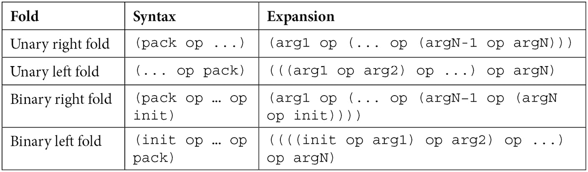
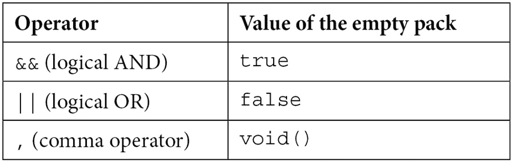

# *第三章*：变长模板

变长模板是一个具有可变数量参数的模板。这是 C++11 中引入的特性。它结合了泛型代码和具有可变数量参数的函数，这是从 C 语言继承来的特性。尽管语法和一些细节可能看起来有些繁琐，但变长模板帮助我们以前无法通过编译时评估和类型安全的方式编写具有可变数量参数的函数模板或具有可变数量数据成员的类模板。

在本章中，我们将学习以下主题：

+   理解变长模板的需求

+   变长函数模板

+   参数包

+   变长类模板

+   折叠表达式

+   变长别名模板

+   变长变量模板

到本章结束时，你将很好地理解如何编写变长模板以及它们是如何工作的。

然而，我们将首先尝试理解为什么具有可变数量参数的模板是有帮助的。

# 理解变长模板的需求

最著名的 C 和 C++ 函数之一是 `printf`，它将格式化输出写入 `stdout` 标准输出流。实际上，I/O 库中有一系列用于写入格式化输出的函数，包括 `fprintf`（写入文件流）、`sprintf` 和 `snprintf`（写入字符缓冲区）。这些函数之所以相似，是因为它们接受一个定义输出格式的字符串和可变数量的参数。然而，语言为我们提供了编写具有可变数量参数的函数的手段。以下是一个接受一个或多个参数并返回最小值的函数示例：

```cpp
#include<stdarg.h>
```

```cpp
int min(int count, ...)
```

```cpp
{
```

```cpp
   va_list args;
```

```cpp
   va_start(args, count);
```

```cpp
   int val = va_arg(args, int);
```

```cpp
   for (int i = 1; i < count; i++)
```

```cpp
   {
```

```cpp
      int n = va_arg(args, int);
```

```cpp
      if (n < val)
```

```cpp
         val = n;
```

```cpp
   }
```

```cpp
   va_end(args);
```

```cpp
   return val;
```

```cpp
}
```

```cpp
int main()
```

```cpp
{
```

```cpp
   std::cout << "min(42, 7)=" << min(2, 42, 7) << '\n';
```

```cpp
   std::cout << "min(1,5,3,-4,9)=" << 
```

```cpp
                 min(5, 1, 5, 3, -4, 
```

```cpp
              9) << '\n';
```

```cpp
}
```

此实现特定于 `int` 类型的值。然而，可以编写一个类似的函数模板。这种转换需要最小的更改，结果如下：

```cpp
template <typename T>
```

```cpp
T min(int count, ...)
```

```cpp
{
```

```cpp
   va_list args;
```

```cpp
   va_start(args, count);
```

```cpp
   T val = va_arg(args, T);
```

```cpp
   for (int i = 1; i < count; i++)
```

```cpp
   {
```

```cpp
      T n = va_arg(args, T);
```

```cpp
      if (n < val)
```

```cpp
         val = n;
```

```cpp
   }
```

```cpp
   va_end(args);
```

```cpp
   return val;
```

```cpp
}
```

```cpp
int main()
```

```cpp
{
```

```cpp
   std::cout << "min(42.0, 7.5)="
```

```cpp
             << min<double>(2, 42.0, 7.5) << '\n';
```

```cpp
   std::cout << "min(1,5,3,-4,9)=" 
```

```cpp
             << min<int>(5, 1, 5, 3, -4, 9) << '\n';
```

```cpp
}
```

编写这样的代码，无论是泛型还是非泛型，都有几个重要的缺点：

+   它需要使用几个宏：`va_list`（为其他宏提供所需的信息）、`va_start`（开始迭代参数）、`va_arg`（提供访问下一个参数的方法）和 `va_end`（停止迭代参数）。

+   评估发生在运行时，尽管传递给函数的参数数量和类型在编译时是已知的。

+   以这种方式实现的变长函数不是类型安全的。`va_` 宏执行低内存操作，并且在运行时 `va_arg` 中进行类型转换。这可能导致运行时异常。

+   这些可变参数函数需要以某种方式指定可变参数的数量。在早期 `min` 函数的实现中，有一个参数表示参数的数量。类似于 `printf` 的函数从格式化字符串中获取一个格式化字符串，从而确定期望的参数数量。例如，`printf` 函数会评估并忽略额外的参数（如果提供的参数多于格式化字符串中指定的数量），但如果提供的参数少于格式化字符串中指定的数量，则具有未定义的行为。

除了所有这些之外，在 C++11 之前，只有函数可以是可变的。然而，有一些类也可以从能够有可变数量的数据成员中受益。典型的例子是 `tuple` 类，它表示一组固定大小的异构值集合，以及 `variant`，它是一个类型安全的联合体。

可变模板有助于解决所有这些问题。它们在编译时评估，是类型安全的，不需要宏，不需要显式指定参数数量，并且我们可以编写可变函数模板和可变类模板。此外，我们还有可变变量模板和可变别名模板。

在下一节中，我们将开始探讨可变参数模板函数。

# 可变参数模板函数

可变参数模板函数是具有可变数量参数的模板函数。它们借用省略号（`...`）的使用来指定参数包，其语法可能因性质不同而不同。

为了理解可变参数模板函数的基本原理，让我们从一个重写之前 `min` 函数的例子开始：

```cpp
template <typename T>
```

```cpp
T min(T a, T b)
```

```cpp
{
```

```cpp
   return a < b ? a : b;
```

```cpp
}
```

```cpp
template <typename T, typename... Args>
```

```cpp
T min(T a, Args... args)
```

```cpp
{
```

```cpp
   return min(a, min(args...));
```

```cpp
}
```

```cpp
int main()
```

```cpp
{
```

```cpp
   std::cout << "min(42.0, 7.5)=" << min(42.0, 7.5) 
```

```cpp
             << '\n';
```

```cpp
   std::cout << "min(1,5,3,-4,9)=" << min(1, 5, 3, -4, 9)
```

```cpp
             << '\n';
```

```cpp
}
```

这里有两个 `min` 函数的重载。第一个是一个有两个参数的函数模板，返回两个参数中最小的一个。第二个是一个具有可变数量参数的函数模板，它递归地调用自身，并扩展参数包。尽管可变参数模板函数的实现看起来像使用了某种编译时递归机制（在这种情况下，两个参数的重载作为结束情况），但实际上，它们只是依赖于重载函数，这些函数是从模板和提供的参数集合实例化的。

在可变参数模板函数的实现中，省略号（`...`）被用于三个不同的地方，具有不同的含义，如我们的示例所示：

+   在模板参数列表中指定一组参数，例如 `typename... Args`。这被称为**模板参数包**。模板参数包可以用于类型模板、非类型模板和模板模板参数。

+   在函数参数列表中指定一组参数，例如 `Args... args`。这被称为**函数参数包**。

+   在函数体中展开一个包，如`args…`在`min(args…)`调用中看到的那样。这被称为**参数包展开**。这种展开的结果是一个由逗号分隔的零个或多个值（或表达式）的列表。这个主题将在下一节中更详细地介绍。

从调用`min(1, 5, 3, -4, 9)`开始，编译器实例化了一组具有 5、4、3 和 2 个参数的重载函数。从概念上讲，它等同于以下一组重载函数：

```cpp
int min(int a, int b)
```

```cpp
{
```

```cpp
   return a < b ? a : b;
```

```cpp
}
```

```cpp
int min(int a, int b, int c)
```

```cpp
{
```

```cpp
   return min(a, min(b, c));
```

```cpp
}
```

```cpp
int min(int a, int b, int c, int d)
```

```cpp
{
```

```cpp
   return min(a, min(b, min(c, d)));
```

```cpp
}
```

```cpp
int min(int a, int b, int c, int d, int e)
```

```cpp
{
```

```cpp
   return min(a, min(b, min(c, min(d, e))));
```

```cpp
}
```

因此，`min(1, 5, 3, -4, 9)`展开为`min(1, min(5, min(3, min(-4, 9))))`。这可能会引发关于变长模板性能的问题。然而，在实践中，编译器会执行大量的优化，例如尽可能地进行内联。结果是，当启用优化时，实际上将不会有函数调用。您可以使用在线资源，例如`min`是具有前面所示实现的变长函数模板）：

```cpp
int main()
```

```cpp
{    
```

```cpp
   std::cout << min(1, 5, 3, -4, 9);
```

```cpp
}
```

使用 GCC 11.2 编译器，带有`-O`标志进行优化编译，会产生以下汇编代码：

```cpp
sub     rsp, 8
```

```cpp
mov     esi, -4
```

```cpp
mov     edi, OFFSET FLAT:_ZSt4cout
```

```cpp
call    std::basic_ostream<char, std::char_traits<char>>
```

```cpp
           ::operator<<(int)
```

```cpp
mov     eax, 0
```

```cpp
add     rsp, 8
```

```cpp
ret
```

您不需要是汇编语言专家就能理解这里发生的事情。对`min(1, 5, 3, -4, 9)`的调用是在编译时评估的，结果`-4`直接加载到 ESI 寄存器。在这个特定的情况下，没有运行时调用或计算，因为所有内容都是在编译时已知的。当然，这并不一定总是如此。

以下代码片段展示了`min`函数模板的一个调用，由于它的参数仅在运行时才知道，因此无法在编译时评估：

```cpp
int main()
```

```cpp
{    
```

```cpp
    int a, b, c, d, e;
```

```cpp
    std::cin >> a >> b >> c >> d >> e;
```

```cpp
    std::cout << min(a, b, c, d, e);
```

```cpp
}
```

这次，生成的汇编代码如下（这里只展示了调用`min`函数的代码）：

```cpp
mov     esi, DWORD PTR [rsp+12]
```

```cpp
mov     eax, DWORD PTR [rsp+16]
```

```cpp
cmp     esi, eax
```

```cpp
cmovg   esi, eax
```

```cpp
mov     eax, DWORD PTR [rsp+20]
```

```cpp
cmp     esi, eax
```

```cpp
cmovg   esi, eax
```

```cpp
mov     eax, DWORD PTR [rsp+24]
```

```cpp
cmp     esi, eax
```

```cpp
cmovg   esi, eax
```

```cpp
mov     eax, DWORD PTR [rsp+28]
```

```cpp
cmp     esi, eax
```

```cpp
cmovg   esi, eax
```

```cpp
mov     edi, OFFSET FLAT:_ZSt4cout
```

```cpp
call    std::basic_ostream<char, std::char_traits<char>> 
```

```cpp
             ::operator<<(int)
```

从这个列表中我们可以看到，编译器已经内联了所有对`min`重载的调用。这里只有一系列将值加载到寄存器中的指令、比较寄存器值以及基于比较结果的跳转，但没有函数调用。

当禁用优化时，函数调用仍然会发生。我们可以通过使用编译器特定的宏来追踪在调用`min`函数期间发生的这些调用。GCC 和 Clang 提供了一个名为`__PRETTY_FUNCTION__`的宏，其中包含函数的签名和名称。同样，Visual C++提供了一个名为`__FUNCSIG__`的宏，它执行相同的功能。这些可以在函数体内部使用来打印其名称和签名。我们可以如下使用它们：

```cpp
template <typename T>
```

```cpp
T min(T a, T b)
```

```cpp
{
```

```cpp
#if defined(__clang__) || defined(__GNUC__) || defined(__GNUG__)
```

```cpp
   std::cout << __PRETTY_FUNCTION__ << "\n";
```

```cpp
#elif defined(_MSC_VER)
```

```cpp
   std::cout << __FUNCSIG__ << "\n";
```

```cpp
#endif
```

```cpp
   return a < b ? a : b;
```

```cpp
}
```

```cpp
template <typename T, typename... Args>
```

```cpp
T min(T a, Args... args)
```

```cpp
{
```

```cpp
#if defined(__clang__) || defined(__GNUC__) || defined(__GNUG__)
```

```cpp
   std::cout << __PRETTY_FUNCTION__ << "\n";
```

```cpp
#elif defined(_MSC_VER)
```

```cpp
   std::cout << __FUNCSIG__ << "\n";
```

```cpp
#endif
```

```cpp
   return min(a, min(args...));
```

```cpp
}
```

```cpp
int main()
```

```cpp
{
```

```cpp
   min(1, 5, 3, -4, 9);
```

```cpp
}
```

当使用 Clang 编译此程序时，执行结果如下：

```cpp
T min(T, Args...) [T = int, Args = <int, int, int, int>]
T min(T, Args...) [T = int, Args = <int, int, int>]
T min(T, Args...) [T = int, Args = <int, int>]
T min(T, T) [T = int]
T min(T, T) [T = int]
T min(T, T) [T = int]
T min(T, T) [T = int]
```

另一方面，当使用 Visual C++编译时，输出如下：

```cpp
int __cdecl min<int,int,int,int,int>(int,int,int,int,int)
int __cdecl min<int,int,int,int>(int,int,int,int)
int __cdecl min<int,int,int>(int,int,int)
int __cdecl min<int>(int,int)
int __cdecl min<int>(int,int)
int __cdecl min<int>(int,int)
int __cdecl min<int>(int,int)
```

尽管签名格式在 Clang/GCC 和 VC++之间有显著差异，但它们都显示了相同的情况：首先调用具有五个参数的重载函数，然后是四个参数的函数，然后是三个参数的函数，最后有四个调用具有两个参数的重载函数（这标志着展开的结束）。

理解参数包的展开是理解变长模板的关键。因此，我们将在下一节详细探讨这个主题。

# 参数包

模板或函数参数包可以接受零个、一个或多个参数。标准没有指定参数数量的上限，但在实践中，编译器可能有一些限制。标准所做的是推荐这些限制的最小值，但不要求对这些限制有任何遵守。这些限制如下：

+   对于函数参数包，最大参数数量取决于函数调用参数的限制，建议至少为 256。

+   对于模板参数包，最大参数数量取决于模板参数的限制，建议至少为 1,024。

参数包中的参数数量可以在编译时使用`sizeof...`运算符检索。此运算符返回`std::size_t`类型的`constexpr`值。让我们通过几个示例来看看它是如何工作的。

在第一个示例中，`sizeof...`运算符用于通过`constexpr if`语句帮助实现变长函数模板`sum`的递归模式结束。如果参数包中的参数数量为零（意味着函数只有一个参数），那么我们正在处理最后一个参数，所以我们只需返回值。否则，我们将第一个参数添加到剩余参数的总和中。实现如下：

```cpp
template <typename T, typename... Args>
```

```cpp
T sum(T a, Args... args)
```

```cpp
{
```

```cpp
   if constexpr (sizeof...(args) == 0)
```

```cpp
      return a;
```

```cpp
   else
```

```cpp
      return a + sum(args...);
```

```cpp
}
```

这与以下经典方法在语义上是等价的，但另一方面更简洁，用于变长函数模板的实现：

```cpp
template <typename T>
```

```cpp
T sum(T a)
```

```cpp
{
```

```cpp
   return a;
```

```cpp
}
```

```cpp
template <typename T, typename... Args>
```

```cpp
T sum(T a, Args... args)
```

```cpp
{
```

```cpp
   return a + sum(args...);
```

```cpp
}
```

注意到`sizeof…(args)`（函数参数包）和`sizeof…(Args)`（模板参数包）返回相同的值。另一方面，`sizeof…(args)`和`sizeof(args)...`不是同一回事。前者是应用于参数包`args`的`sizeof`运算符。后者是在`sizeof`运算符上展开的参数包`args`。这两个都在以下示例中展示：

```cpp
template<typename... Ts>
```

```cpp
constexpr auto get_type_sizes()
```

```cpp
{
```

```cpp
   return std::array<std::size_t, 
```

```cpp
                     sizeof...(Ts)>{sizeof(Ts)...};
```

```cpp
}
```

```cpp
auto sizes = get_type_sizes<short, int, long, long long>();
```

在这个片段中，`sizeof…(Ts)`在编译时评估为`4`，而`sizeof(Ts)...`展开为以下逗号分隔的参数包：`sizeof(short), sizeof(int), sizeof(long), sizeof(long long)`。从概念上讲，前面的函数模板`get_type_sizes`等同于以下具有四个模板参数的函数模板：

```cpp
template<typename T1, typename T2, 
```

```cpp
         typename T3, typename T4>
```

```cpp
constexpr auto get_type_sizes()
```

```cpp
{
```

```cpp
   return std::array<std::size_t, 4> {
```

```cpp
      sizeof(T1), sizeof(T2), sizeof(T3), sizeof(T4)
```

```cpp
   };
```

```cpp
}
```

通常，参数包是函数或模板的尾随参数。然而，如果编译器可以推断出参数，那么参数包后面可以跟有其他参数，包括更多的参数包。让我们考虑以下示例：

```cpp
template <typename... Ts, typename... Us>
```

```cpp
constexpr auto multipacks(Ts... args1, Us... args2)
```

```cpp
{
```

```cpp
   std::cout << sizeof...(args1) << ','
```

```cpp
             << sizeof...(args2) << '\n';
```

```cpp
}
```

这个函数应该接受两组可能不同类型的元素，并对它们进行一些操作。它可以像以下示例那样调用：

```cpp
multipacks<int>(1, 2, 3, 4, 5, 6);
```

```cpp
                 // 1,5
```

```cpp
multipacks<int, int, int>(1, 2, 3, 4, 5, 6);
```

```cpp
                // 3,3
```

```cpp
multipacks<int, int, int, int>(1, 2, 3, 4, 5, 6);
```

```cpp
               // 4,2
```

```cpp
multipacks<int, int, int, int, int, int>(1, 2, 3, 4, 5, 6); 
```

```cpp
               // 6,0
```

对于第一次调用，`args1`包在函数调用时指定（如`multipacks<int>`所示），包含`1`，而`args2`被推断出包含`2, 3, 4, 5, 6`。同样，对于第二次调用，两个包将具有相同数量的参数，更确切地说，是`1, 2, 3`和`3, 4, 6`。对于最后一次调用，第一个包包含所有元素，而第二个包为空。在这些所有示例中，所有元素都是`int`类型。然而，在以下示例中，两个包包含不同类型的元素：

```cpp
multipacks<int, int>(1, 2, 4.0, 5.0, 6.0);         // 2,3
```

```cpp
multipacks<int, int, int>(1, 2, 3, 4.0, 5.0, 6.0); // 3,3
```

对于第一次调用，`args1`包将包含整数`1, 2`，而`args2`将被推断出包含双精度值`4.0, 5.0, 6.0`。同样，对于第二次调用，`args1`包将是`1, 2, 3`，而`args2`将包含`4.0, 5.0, 6.0`。

然而，如果我们稍微修改函数模板`multipacks`，要求包的大小相等，那么只有之前显示的一些调用仍然可能。这将在以下示例中显示：

```cpp
template <typename... Ts, typename... Us>
```

```cpp
constexpr auto multipacks(Ts... args1, Us... args2)
```

```cpp
{
```

```cpp
   static_assert(
```

```cpp
      sizeof...(args1) == sizeof...(args2),
```

```cpp
      "Packs must be of equal sizes.");
```

```cpp
}
```

```cpp
multipacks<int>(1, 2, 3, 4, 5, 6);                   // error
```

```cpp
multipacks<int, int, int>(1, 2, 3, 4, 5, 6);         // OK
```

```cpp
multipacks<int, int, int, int>(1, 2, 3, 4, 5, 6);    // error
```

```cpp
multipacks<int, int, int, int, int, int>(1, 2, 3, 4, 5, 6); 
```

```cpp
                                                     // error
```

```cpp
multipacks<int, int>(1, 2, 4.0, 5.0, 6.0);           // error
```

```cpp
multipacks<int, int, int>(1, 2, 3, 4.0, 5.0, 6.0);   // OK
```

在这个代码片段中，只有第二个和第六个调用是有效的。在这两种情况下，两个推断出的包各有三个元素。在其他所有情况下，如前一个示例所示，包的大小不同，`static_assert`语句将在编译时生成错误。

多个参数包不仅限于变长函数模板。它们也可以用于部分特化的变长类模板，前提是编译器可以推断出模板参数。为了举例说明，我们将考虑一个表示函数指针对的类模板的情况。实现应该允许存储任何函数的指针。为此，我们定义了一个主模板，称为`func_pair`，以及一个具有四个模板参数的部分特化：

+   第一个函数返回类型的类型模板参数

+   第一个函数的参数类型的模板参数包

+   第二个函数返回类型的第二个类型模板参数

+   第二个函数的参数类型的第二个模板参数包

`func_pair`类模板在下一列表中显示：

```cpp
template<typename, typename>
```

```cpp
struct func_pair;
```

```cpp
template<typename R1, typename... A1, 
```

```cpp
         typename R2, typename... A2>
```

```cpp
struct func_pair<R1(A1...), R2(A2...)>
```

```cpp
{
```

```cpp
   std::function<R1(A1...)> f;
```

```cpp
   std::function<R2(A2...)> g;
```

```cpp
};
```

为了演示这个类模板的使用，让我们也考虑以下两个函数：

```cpp
bool twice_as(int a, int b)
```

```cpp
{
```

```cpp
   return a >= b*2;
```

```cpp
}
```

```cpp
double sum_and_div(int a, int b, double c)
```

```cpp
{
```

```cpp
   return (a + b) / c;
```

```cpp
}
```

我们可以实例化`func_pair`类模板，并使用它来调用以下代码片段中所示的两个函数：

```cpp
func_pair<bool(int, int), double(int, int, double)> funcs{
```

```cpp
   twice_as, sum_and_div };
```

```cpp
funcs.f(42, 12);
```

```cpp
funcs.g(42, 12, 10.0);
```

参数包可以在各种上下文中展开，这将使下一节的主题。

## 理解参数包展开

参数包可以出现在多种上下文中。它们的展开形式可能取决于此上下文。以下列出了可能的上下文及其示例：

+   **模板参数列表**：这是在指定模板参数时使用的：

    ```cpp
    template <typename... T>
    struct outer
    {
       template <T... args>
       struct inner {};
    };
    outer<int, double, char[5]> a;
    ```

+   **模板参数列表**：这是在指定模板参数时使用的：

    ```cpp
    template <typename... T>
    struct tag {};
    template <typename T, typename U, typename ... Args>
    void tagger()
    {
       tag<T, U, Args...> t1;
       tag<T, Args..., U> t2;
       tag<Args..., T, U> t3;
       tag<U, T, Args...> t4;
    }
    ```

+   **函数参数列表**：这是在指定函数模板的参数时使用的：

    ```cpp
    template <typename... Args>
    void make_it(Args... args)
    {
    }
    make_it(42);
    make_it(42, 'a');
    ```

+   **函数参数列表**：当扩展包出现在函数调用括号内时，省略号左侧的最大表达式或花括号初始化列表是展开的模式：

    ```cpp
    template <typename T>
    T step_it(T value)
    {
       return value+1;
    }
    template <typename... T>
    int sum(T... args)
    {
       return (... + args);
    }
    template <typename... T>
    void do_sums(T... args)
    {
       auto s1 = sum(args...);
       // sum(1, 2, 3, 4)
       auto s2 = sum(42, args...);
       // sum(42, 1, 2, 3, 4)
       auto s3 = sum(step_it(args)...); 
       // sum(step_it(1), step_it(2),... step_it(4))
    }
    do_sums(1, 2, 3, 4);
    ```

+   **括号初始化器**：当扩展包出现在直接初始化器、函数样式转换、成员初始化器、new 表达式和其他类似上下文的括号内时，规则与函数参数列表的上下文相同：

    ```cpp
    template <typename... T>
    struct sum_wrapper
    {
       sum_wrapper(T... args)
       {
          value = (... + args);
       }
       std::common_type_t<T...> value;
    };
    template <typename... T>
    void parenthesized(T... args)
    {
       std::array<std::common_type_t<T...>, 
                  sizeof...(T)> arr {args...};
       // std::array<int, 4> {1, 2, 3, 4}
       sum_wrapper sw1(args...);
       // value = 1 + 2 + 3 + 4
       sum_wrapper sw2(++args...);
       // value = 2 + 3 + 4 + 5
    }
    parenthesized(1, 2, 3, 4);
    ```

+   **花括号包围的初始化器**：这是使用花括号符号执行初始化的情况：

    ```cpp
    template <typename... T>
    void brace_enclosed(T... args)
    {
       int arr1[sizeof...(args) + 1] = {args..., 0};     
       // arr1: {1,2,3,4,0}
       int arr2[sizeof...(args)] = { step_it(args)... };
       // arr2: {2,3,4,5}
    }
    brace_enclosed(1, 2, 3, 4);
    ```

+   **基指定符和成员初始化器列表**：包展开可以指定类声明中的基类列表。此外，它还可以出现在成员初始化器列表中，因为这可能是调用基类构造函数所必需的：

    ```cpp
    struct A {};
    struct B {};
    struct C {};
    template<typename... Bases>
    struct X : public Bases...
    {
       X(Bases const & ... args) : Bases(args)...
       { }
    };
    A a;
    B b;
    C c;
    X x(a, b, c);
    ```

+   `using` 声明。这基于前面的示例进行演示：

    ```cpp
    struct A 
    {
       void execute() { std::cout << "A::execute\n"; }
    };
    struct B 
    {
       void execute() { std::cout << "B::execute\n"; }
    };
    struct C 
    {
       void execute() { std::cout << "C::execute\n"; }
    };
    template<typename... Bases>
    struct X : public Bases...
    {
       X(Bases const & ... args) : Bases(args)...
       {}
       using Bases::execute...;
    };
    A a;
    B b;
    C c;
    X x(a, b, c);
    x.A::execute();
    x.B::execute();
    x.C::execute();
    ```

+   **Lambda 捕获**：Lambda 表达式的捕获子句可以包含一个包展开，如下例所示：

    ```cpp
    template <typename... T>
    void captures(T... args)
    {
       auto l = [args...]{ 
                   return sum(step_it(args)...); };
       auto s = l();
    }
    captures(1, 2, 3, 4);
    ```

+   **折叠表达式**：这些将在本章接下来的部分中详细讨论：

    ```cpp
    template <typename... T>
    int sum(T... args)
    {
       return (... + args);
    }
    ```

+   `sizeof…` 操作符：本节前面已经展示了示例。这里再次展示一个：

    ```cpp
    template <typename... T>
    auto make_array(T... args)
    {
       return std::array<std::common_type_t<T...>, 
                         sizeof...(T)> {args...};
    };
    auto arr = make_array(1, 2, 3, 4);
    ```

+   应用到相同声明的 `alignas` 指定符。参数包可以是类型包或非类型包。以下列出了两种情况下的示例：

    ```cpp
    template <typename... T>
    struct alignment1
    {
       alignas(T...) char a;
    };
    template <int... args>
    struct alignment2
    {
       alignas(args...) char a;
    };
    alignment1<int, double> al1;
    alignment2<1, 4, 8> al2;
    ```

+   **属性列表**：目前没有任何编译器支持。

现在我们已经对参数包及其展开有了更多的了解，我们可以继续前进，探索可变参数类模板。

# 可变参数类模板

类模板也可以有可变数量的模板参数。这是构建某些类型类别（如标准库中可用的 `tuple` 和 `variant`）的关键。在本节中，我们将看到如何编写一个简单的 `tuple` 类实现。元组是一种表示固定大小异构值集合的类型。

在实现可变函数模板时，我们使用了具有两个重载的递归模式，一个用于通用情况，另一个用于结束递归。对于可变参数类模板，也需要采取相同的方法，但我们需要为此目的使用特化。接下来，你可以看到对元组的最小实现：

```cpp
template <typename T, typename... Ts>
```

```cpp
struct tuple
```

```cpp
{
```

```cpp
   tuple(T const& t, Ts const &... ts)
```

```cpp
      : value(t), rest(ts...)
```

```cpp
   {
```

```cpp
   }
```

```cpp
   constexpr int size() const { return 1 + rest.size(); }
```

```cpp
   T            value;
```

```cpp
   tuple<Ts...> rest;
```

```cpp
};
```

```cpp
template <typename T>
```

```cpp
struct tuple<T>
```

```cpp
{
```

```cpp
   tuple(const T& t)
```

```cpp
      : value(t)
```

```cpp
   {
```

```cpp
   }
```

```cpp
   constexpr int size() const { return 1; }
```

```cpp
   T value;
```

```cpp
};
```

第一个类是基本模板。它有两个模板参数：一个类型模板和一个参数包。这意味着，至少必须指定一个类型来实例化此模板。基本模板的元组有两个成员变量：`value`，类型为 `T`，和 `rest`，类型为 `tuple<Ts…>`。这是模板参数剩余部分的展开。这意味着一个包含 `N` 个元素的元组将包含第一个元素和另一个元组；这个第二个元组反过来又包含第二个元素和另一个元组；这个第三个嵌套元组包含剩余部分。这种模式一直持续到我们最终得到一个只有一个元素的元组。这是由部分特化 `tuple<T>` 定义的。与基本模板不同，这个特化不聚合另一个元组对象。

我们可以使用这个简单的实现来编写如下代码：

```cpp
tuple<int> one(42);
```

```cpp
tuple<int, double> two(42, 42.0);
```

```cpp
tuple<int, double, char> three(42, 42.0, 'a');
```

```cpp
std::cout << one.value << '\n';
```

```cpp
std::cout << two.value << ',' 
```

```cpp
          << two.rest.value << '\n';
```

```cpp
std::cout << three.value << ',' 
```

```cpp
          << three.rest.value << ','
```

```cpp
          << three.rest.rest.value << '\n';
```

虽然这可行，但通过 `rest` 成员访问元素，例如在 `three.rest.rest.value` 中，非常繁琐。元组中的元素越多，以这种方式编写代码就越困难。因此，我们希望使用一些辅助函数来简化访问元组元素。以下是如何将之前的代码转换的片段：

```cpp
std::cout << get<0>(one) << '\n';
```

```cpp
std::cout << get<0>(two) << ','
```

```cpp
          << get<1>(two) << '\n';
```

```cpp
std::cout << get<0>(three) << ','
```

```cpp
          << get<1>(three) << ','
```

```cpp
          << get<2>(three) << '\n';
```

在这里，`get<N>` 是一个变长函数模板，它接受一个元组作为参数，并返回元组中 `N` 索引处的元素引用。其原型可能如下所示：

```cpp
template <size_t N, typename... Ts>
```

```cpp
typename nth_type<N, Ts...>::value_type & get(tuple<Ts...>& t);
```

模板参数是元组类型的索引和参数包。然而，其实施需要一些辅助类型。首先，我们需要知道元组中 `N` 索引处的元素类型。这可以通过以下 `nth_type` 变长类模板来检索：

```cpp
template <size_t N, typename T, typename... Ts>
```

```cpp
struct nth_type : nth_type<N - 1, Ts...>
```

```cpp
{
```

```cpp
   static_assert(N < sizeof...(Ts) + 1,
```

```cpp
                 "index out of bounds");
```

```cpp
};
```

```cpp
template <typename T, typename... Ts>
```

```cpp
struct nth_type<0, T, Ts...>
```

```cpp
{
```

```cpp
   using value_type = T;
```

```cpp
};
```

再次，我们有一个使用递归继承的基本模板，以及针对索引 0 的特化。特化定义了一个名为 `value_type` 的别名，用于第一个类型模板（这是模板参数列表的头部）。这个类型仅用作确定元组元素类型的机制。我们需要另一个变长类模板来检索值。这将在下面的列表中展示：

```cpp
template <size_t N>
```

```cpp
struct getter
```

```cpp
{
```

```cpp
   template <typename... Ts>
```

```cpp
   static typename nth_type<N, Ts...>::value_type& 
```

```cpp
   get(tuple<Ts...>& t)
```

```cpp
   {
```

```cpp
      return getter<N - 1>::get(t.rest);
```

```cpp
   }
```

```cpp
};
```

```cpp
template <>
```

```cpp
struct getter<0>
```

```cpp
{
```

```cpp
   template <typename T, typename... Ts>
```

```cpp
   static T& get(tuple<T, Ts...>& t)
```

```cpp
   {
```

```cpp
      return t.value;
```

```cpp
   }
```

```cpp
};
```

我们可以看到这里相同的递归模式，有一个基本模板和一个显式特化。类模板被称为 `getter`，它有一个单一的模板参数，这是一个非类型模板参数。这代表我们想要访问的元组元素的索引。这个类模板有一个名为 `get` 的静态成员函数。这是一个变长函数模板。基本模板中的实现使用元组的 `rest` 成员作为参数调用 `get` 函数。另一方面，显式特化的实现返回元组成员值的引用。

在定义了所有这些之后，我们现在可以提供一个实际的实现来为辅助的可变参数函数模板`get`。这个实现依赖于`getter`类模板，并调用其`get`可变参数函数模板：

```cpp
template <size_t N, typename... Ts>
```

```cpp
typename nth_type<N, Ts...>::value_type & 
```

```cpp
get(tuple<Ts...>& t)
```

```cpp
{
```

```cpp
   return getter<N>::get(t);
```

```cpp
}
```

如果这个例子看起来有点复杂，也许逐步分析它将有助于你更好地理解它是如何工作的。因此，让我们从以下片段开始：

```cpp
tuple<int, double, char> three(42, 42.0, 'a');
```

```cpp
get<2>(three);
```

我们将使用`cppinsights.io`网络工具来检查从这个片段中发生的模板实例化。首先查看的是类模板`tuple`。我们有一个主模板和几个特化，如下所示：

```cpp
template <typename T, typename... Ts>
```

```cpp
struct tuple
```

```cpp
{
```

```cpp
   tuple(T const& t, Ts const &... ts)
```

```cpp
      : value(t), rest(ts...)
```

```cpp
   { }
```

```cpp
   constexpr int size() const { return 1 + rest.size(); }
```

```cpp
   T value;
```

```cpp
   tuple<Ts...> rest;
```

```cpp
};
```

```cpp
template<> struct tuple<int, double, char>
```

```cpp
{
```

```cpp
  inline tuple(const int & t, 
```

```cpp
               const double & __ts1, const char & __ts2)
```

```cpp
  : value{t}, rest{tuple<double, char>(__ts1, __ts2)}
```

```cpp
  {}
```

```cpp
  inline constexpr int size() const;
```

```cpp
  int value;
```

```cpp
  tuple<double, char> rest;
```

```cpp
};
```

```cpp
template<> struct tuple<double, char>
```

```cpp
{
```

```cpp
  inline tuple(const double & t, const char & __ts1)
```

```cpp
  : value{t}, rest{tuple<char>(__ts1)}
```

```cpp
  {}
```

```cpp
  inline constexpr int size() const;
```

```cpp
  double value;
```

```cpp
  tuple<char> rest;
```

```cpp
};
```

```cpp
template<> struct tuple<char>
```

```cpp
{
```

```cpp
  inline tuple(const char & t)
```

```cpp
  : value{t}
```

```cpp
  {}
```

```cpp
  inline constexpr int size() const;
```

```cpp
  char value;
```

```cpp
};
```

```cpp
template<typename T>
```

```cpp
struct tuple<T>
```

```cpp
{
```

```cpp
   inline tuple(const T & t) : value{t}
```

```cpp
   { }
```

```cpp
   inline constexpr int size() const
```

```cpp
   { return 1; }
```

```cpp
   T value;
```

```cpp
};
```

`tuple<int, double, char>`结构包含一个`int`和一个`tuple<double, char>`，它包含一个`double`和一个`tuple<char>`，后者又包含一个`char`值。这个最后的类代表了元组递归定义的末尾。这可以概念性地用以下图形表示：

![图 3.1 – 一个示例元组![图 3.1 – 一个示例元组图 3.1 – 一个示例元组接下来，我们有`nth_type`类模板，对于它，我们再次有一个主模板和几个特化，如下所示：```cpptemplate <size_t N, typename T, typename... Ts>``````cppstruct nth_type : nth_type<N - 1, Ts...>``````cpp{``````cpp   static_assert(N < sizeof...(Ts) + 1,``````cpp                 "index out of bounds");``````cpp};``````cpptemplate<>``````cppstruct nth_type<2, int, double, char> : ``````cpp   public nth_type<1, double, char>``````cpp{ };``````cpptemplate<>``````cppstruct nth_type<1, double, char> : public nth_type<0, char>``````cpp{ };``````cpptemplate<>``````cppstruct nth_type<0, char>``````cpp{``````cpp   using value_type = char;``````cpp};``````cpptemplate<typename T, typename ... Ts>``````cppstruct nth_type<0, T, Ts...>``````cpp{``````cpp   using value_type = T;``````cpp};````nth_type<2, int, double, char>`特化是从`nth_type<1, double, char>`派生的，后者又从`nth_type<0, char>`派生，它是层次结构中的最后一个基类（递归层次结构的末尾）。`nth_type`结构在`getter`辅助类模板中用作返回类型，其实例化如下：```cpptemplate <size_t N>``````cppstruct getter``````cpp{``````cpp   template <typename... Ts>``````cpp   static typename nth_type<N, Ts...>::value_type& ``````cpp   get(tuple<Ts...>& t)``````cpp   {``````cpp      return getter<N - 1>::get(t.rest);``````cpp   }``````cpp};``````cpptemplate<>``````cppstruct getter<2>``````cpp{``````cpp   template<>``````cpp   static inline typename ``````cpp   nth_type<2UL, int, double, char>::value_type & ``````cpp   get<int, double, char>(tuple<int, double,  char> & t)``````cpp   {``````cpp      return getter<1>::get(t.rest);``````cpp   } ``````cpp};``````cpptemplate<>``````cppstruct getter<1>``````cpp{``````cpp   template<>``````cpp   static inline typename nth_type<1UL, double,``````cpp                                   char>::value_type &``````cpp   get<double, char>(tuple<double, char> & t)``````cpp   {``````cpp      return getter<0>::get(t.rest);``````cpp   }``````cpp};``````cpptemplate<>``````cppstruct getter<0>``````cpp{``````cpp   template<typename T, typename ... Ts>``````cpp   static inline T & get(tuple<T, Ts...> & t)``````cpp   {``````cpp      return t.value;``````cpp   }``````cpp   template<>``````cpp   static inline char & get<char>(tuple<char> & t)``````cpp   {``````cpp      return t.value;``````cpp   }``````cpp};```最后，我们使用的`get`函数模板，用于检索`tuple`元素的值，定义如下：```cpptemplate <size_t N, typename... Ts>``````cpptypename nth_type<N, Ts...>::value_type & ``````cppget(tuple<Ts...>& t)``````cpp{``````cpp   return getter<N>::get(t);``````cpp}``````cpptemplate<>``````cpptypename nth_type<2UL, int, double, char>::value_type & ``````cppget<2, int, double, char>(tuple<int, double, char> & t)``````cpp{``````cpp  return getter<2>::get(t);``````cpp}```如果对`get`函数的调用更多，将存在更多的`get`特化。例如，对于`get<1>(three)`，将添加以下特化：```cpptemplate<>``````cpptypename nth_type<1UL, int, double, char>::value_type & ``````cppget<1, int, double, char>(tuple<int, double, char> & t)``````cpp{``````cpp  return getter<1>::get(t);``````cpp}```这个例子帮助我们展示了如何实现具有主模板和变体递归的末尾特化的可变参数类模板。你可能已经注意到了使用关键字`typename`作为前缀来修饰`nth_type<N, Ts...>::value_type`类型，这是一个**依赖类型**。在 C++20 中，这不再是必要的。然而，这个主题将在*第四章*中详细讨论，*高级模板概念*。由于实现可变参数模板通常很冗长且可能很繁琐，C++17 标准添加了**折叠表达式**来简化这项任务。我们将在下一节探讨这个主题。# 折叠表达式一个返回所有传入参数总和的`sum`函数。为了方便，我们在这里再次展示它：```cpptemplate <typename T>``````cppT sum(T a)``````cpp{``````cpp   return a;``````cpp}``````cpptemplate <typename T, typename... Args>``````cppT sum(T a, Args... args)``````cpp{``````cpp   return a + sum(args...);``````cpp}```使用折叠表达式，这个需要两个重载的实现可以简化为以下形式：```cpptemplate <typename... T>``````cppint sum(T... args)``````cpp{``````cpp    return (... + args);``````cpp}```不再需要重载函数。表达式`(... + args)`代表折叠表达式，在评估时变为`((((arg0 + arg1) + arg2) + … ) + argN)`。括号是折叠表达式的一部分。我们可以像使用初始实现一样使用这个新实现，如下所示：```cppint main()``````cpp{``````cpp    std::cout << sum(1) << '\n';``````cpp    std::cout << sum(1,2) << '\n';``````cpp    std::cout << sum(1,2,3,4,5) << '\n';``````cpp}```有四种不同的折叠类型，如下列出：


Table 3.1

在这个表格中，使用了以下名称：

+   `pack`是一个包含未展开参数包的表达式，而`arg1`、`arg2`、`argN-1`和`argN`是这个包中包含的参数。

+   `op`是以下二元运算符之一：`+ - * / % ^ & | = < > << >> += -= *= /= %= ^= &= |= <<= >>= == != <= >= && || , .* ->*.`

+   `init`是一个不包含未展开参数包的表达式。

在一元折叠中，如果包不包含任何元素，则只允许一些运算符。以下表格列出了这些运算符，以及空包的值：




Table 3.2

一元折叠和二元折叠在初始化值的使用上有所不同，后者才需要初始化值。二元折叠中二元运算符重复两次（必须是相同的运算符）。我们可以通过包含一个初始化值将可变参数函数模板`sum`从使用一元右折叠表达式转换为使用二元右折叠。以下是一个示例：

```cpp
template <typename... T>
```

```cpp
int sum_from_zero(T... args)
```

```cpp
{
```

```cpp
   return (0 + ... + args);
```

```cpp
}
```

有人说`sum`和`sum_from_zero`函数模板之间没有区别。这实际上并不正确。让我们考虑以下调用：

```cpp
int s1 = sum();           // error
```

```cpp
int s2 = sum_from_zero(); // OK
```

不带参数调用`sum`将产生编译器错误，因为一元折叠表达式（在这种情况下是运算符`+`）必须有非空展开。然而，二元折叠表达式没有这个问题，所以不带参数调用`sum_from_zero`是有效的，并且函数将返回`0`。

在这两个使用`sum`和`sum_from_zero`的示例中，参数包`args`直接出现在折叠表达式中。然而，它可以是表达式的一部分，只要它没有被展开。以下是一个示例：

```cpp
template <typename... T>
```

```cpp
void printl(T... args)
```

```cpp
{
```

```cpp
   (..., (std::cout << args)) << '\n';
```

```cpp
}
```

```cpp
template <typename... T>
```

```cpp
void printr(T... args)
```

```cpp
{
```

```cpp
   ((std::cout << args), ...) << '\n';
```

```cpp
}
```

这里，参数包`args`是`(std::cout << args)`表达式的一部分。这不是一个折叠表达式。折叠表达式是`((std::cout << args), ...)`。这是一个以逗号运算符为操作符的一元左折叠。可以使用`printl`和`printr`函数，如下所示：

```cpp
printl('d', 'o', 'g');  // dog
```

```cpp
printr('d', 'o', 'g');  // dog
```

在这两种情况下，打印到控制台的文字是 `dog`。这是因为一元左折叠展开为 `(((std::cout << 'd'), std::cout << 'o'), << std::cout << 'g')`，而一元右折叠展开为 `(std::cout << 'd', (std::cout << 'o', (std::cout << 'g')))`，并且这两个表达式以相同的方式评估。这是因为由逗号分隔的表达式是按从左到右的顺序评估的。这对于内置的逗号运算符来说是正确的。对于重载逗号运算符的类型，其行为取决于运算符是如何重载的。然而，重载逗号运算符的角落案例非常少（例如简化多维数组的索引）。例如，`Boost.Assign` 和 `SOCI` 库重载了逗号运算符，但通常，这是一个你应该避免重载的运算符。

让我们考虑另一个例子，在折叠表达式内部的表达式中使用参数包。以下可变参数函数模板将多个值插入到 `std::vector` 的末尾：

```cpp
template<typename T, typename... Args>
```

```cpp
void push_back_many(std::vector<T>& v, Args&&... args)
```

```cpp
{
```

```cpp
   (v.push_back(args), ...);
```

```cpp
}
```

```cpp
push_back_many(v, 1, 2, 3, 4, 5); // v = {1, 2, 3, 4, 5}
```

参数包 `args` 与 `v.push_back(args)` 表达式一起使用，该表达式通过逗号运算符展开。一元左折叠表达式是 `(v.push_back(args), ...)`。

与使用递归实现可变参数模板相比，折叠表达式有几个优点。这些优点如下：

+   更少且更简单的代码要编写。

+   更少的模板实例化，这导致编译时间更快。

+   由于将多个函数调用替换为单个表达式，代码可能更快。然而，在实际上，至少在启用优化时，这一点可能并不成立。我们已经看到编译器通过删除这些函数调用来优化代码。

现在我们已经看到了如何创建可变函数模板、可变类模板以及如何使用折叠表达式，我们接下来要讨论的是其他可以变元的模板类型：别名模板和变量模板。我们将从前者开始。

# 可变参数别名模板

可以模板化的任何内容也可以使其可变。别名模板是一系列类型的别名（另一个名称）。可变参数别名模板是一系列具有可变数量模板参数的类型名称。根据到目前为止积累的知识，编写别名模板应该是相当简单的。让我们看一个例子：

```cpp
template <typename T, typename... Args>
```

```cpp
struct foo 
```

```cpp
{
```

```cpp
};
```

```cpp
template <typename... Args>
```

```cpp
using int_foo = foo<int, Args...>;
```

类模板 `foo` 是可变的，并且至少接受一个类型模板参数。另一方面，`int_foo` 只是 `foo` 类型的一个家族的实例的另一个名称，其中 `int` 作为第一个类型模板参数。它们可以这样使用：

```cpp
foo<double, char, int> f1;
```

```cpp
foo<int, char, double> f2;
```

```cpp
int_foo<char, double> f3;
```

```cpp
static_assert(std::is_same_v<decltype(f2), decltype(f3)>);
```

在这个片段中，`f1` 一方面和 `f2` 和 `f3` 另一方面是不同 `foo` 类型的实例，因为它们是从不同的 `foo` 模板参数集合中实例化的。然而，`f2` 和 `f3` 是同一类型的实例，即 `foo<int, char, double>`，因为 `int_foo<char, double>` 只是这个类型的别名。

前面将给出一个类似的例子，虽然稍微复杂一些。标准库中包含一个名为 `std::integer_sequence` 的类模板，它表示一个整数编译时序列，以及一些别名模板，以帮助创建各种这样的整数序列。尽管这里展示的代码是一个简化的片段，但它们的实现至少在概念上可以如下所示：

```cpp
template<typename T, T... Ints>
```

```cpp
struct integer_sequence
```

```cpp
{};
```

```cpp
template<std::size_t... Ints>
```

```cpp
using index_sequence = integer_sequence<std::size_t,
```

```cpp
                                        Ints...>;
```

```cpp
template<typename T, std::size_t N, T... Is>
```

```cpp
struct make_integer_sequence : 
```

```cpp
  make_integer_sequence<T, N - 1, N - 1, Is...> 
```

```cpp
{};
```

```cpp
template<typename T, T... Is>
```

```cpp
struct make_integer_sequence<T, 0, Is...> : 
```

```cpp
  integer_sequence<T, Is...> 
```

```cpp
{};
```

```cpp
template<std::size_t N>
```

```cpp
using make_index_sequence = make_integer_sequence<std::size_t, 
```

```cpp
                                                  N>;
```

```cpp
template<typename... T>
```

```cpp
using index_sequence_for = 
```

```cpp
   make_index_sequence<sizeof...(T)>;
```

这里有三个别名模板：

+   `index_sequence`，它为 `size_t` 类型创建一个 `integer_sequence`；这是一个可变别名模板。

+   `index_sequence_for`，它从一个参数包中创建一个 `integer_sequence`；这也是一个可变别名模板。

+   `make_index_sequence`，它为 `size_t` 类型创建一个包含值 0, 1, 2, …, *N-1* 的 `integer_sequence`。与之前的例子不同，这不是一个可变模板的别名。

本章最后要讨论的主题是可变参数变量模板。

# 可变参数变量模板

如前所述，变量模板也可以是可变的。然而，变量不能递归定义，也不能像类模板那样进行特化。折叠表达式，它简化了从变量数量的参数生成表达式的过程，对于创建可变参数变量模板非常有用。

在下面的例子中，我们定义了一个名为 `Sum` 的可变参数变量模板，它在编译时初始化为所有提供的非类型模板参数的整数之和：

```cpp
template <int... R>
```

```cpp
constexpr int Sum = (... + R);
```

```cpp
int main()
```

```cpp
{
```

```cpp
    std::cout << Sum<1> << '\n';
```

```cpp
    std::cout << Sum<1,2> << '\n';
```

```cpp
    std::cout << Sum<1,2,3,4,5> << '\n';
```

```cpp
}
```

这与使用折叠表达式编写的 `sum` 函数类似。然而，在这种情况下，要加的数字是作为函数参数提供的。在这里，它们是作为变量模板的模板参数提供的。区别主要在于语法；在启用优化的情况下，生成的汇编代码的最终结果可能相同，因此性能也相似。

可变参数变量模板遵循与其他所有模板相同的模式，尽管它们不像其他模板那样常用。然而，通过结束这个主题，我们现在已经完成了 C++中可变参数模板的学习。

# 概述

在本章中，我们探索了一个重要的模板类别，即可变参数模板，它们是具有可变数量模板参数的模板。我们可以创建可变函数模板、类模板、变量模板和别名模板。创建可变函数模板和可变类模板的技术不同，但都涉及一种编译时递归。对于后者，这是通过模板特化来完成的，而对于前者，则是通过函数重载。折叠表达式有助于将变量数量的参数展开成一个单一的表达式，避免了使用函数重载的需要，并使得创建一些可变变量模板类别成为可能，如我们之前所见到的。

在下一章中，我们将探讨一系列更高级的功能，这将有助于巩固你对模板知识的理解。

# 问题

1.  可变参数模板是什么？为什么它们有用？

1.  什么是参数包？

1.  在哪些上下文中可以展开参数包？

1.  折叠表达式是什么？

1.  使用折叠表达式有哪些好处？

# 进一步阅读

+   *C++折叠表达式 101*，Jonathan Boccara，[`www.fluentcpp.com/2021/03/12/cpp-fold-expressions/`](https://www.fluentcpp.com/2021/03/12/cpp-fold-expressions/)

+   *C++ 17 中的折叠表达式*，Vaibhav，[`mainfunda.com/fold-expressions-in-cpp17/`](https://mainfunda.com/fold-expressions-in-cpp17/)

+   *巧妙的折叠表达式技巧*，Jonathan Müller，[`www.foonathan.net/2020/05/fold-tricks/`](https://www.foonathan.net/2020/05/fold-tricks/)
