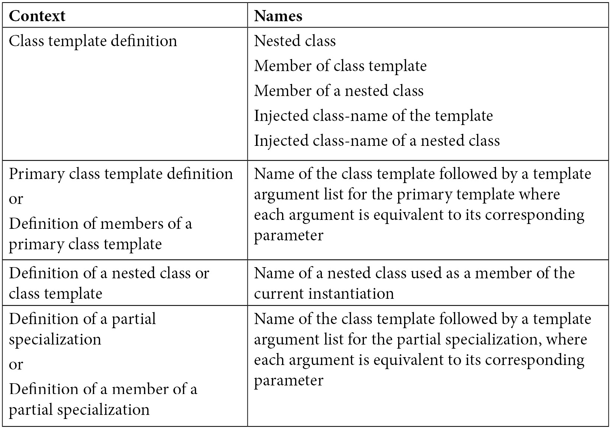
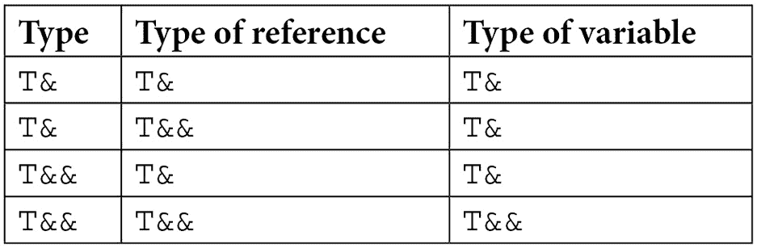
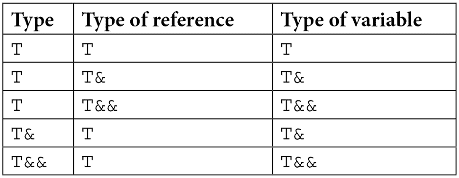

# 第四章：*第四章*：高级模板概念

在前面的章节中，我们学习了 C++模板的核心基础。到这一点，你应该能够编写可能不是非常复杂的模板。然而，关于模板还有很多细节，本章专门讨论这些更高级的话题。接下来我们将讨论以下主题：

+   理解名称绑定和依赖名称

+   探索模板递归

+   理解模板参数推导

+   学习前向引用和完美前向

+   使用`decltype`指定符和`std::declval`类型操作符

+   理解模板中的友谊

完成这一章后，你将获得对这些高级模板概念的更深入理解，并能够理解和编写更复杂的模板代码。

我们将从这个章节开始学习名称绑定和依赖名称。

# 理解名称绑定和依赖名称

术语**名称绑定**指的是在模板中使用每个名称的声明查找过程。在模板中使用两种类型的名称：**依赖名称**和**非依赖名称**。前者是依赖于模板参数类型或值的名称，该参数可以是类型、非类型或模板参数。不依赖于模板参数的名称称为*非依赖*。对于依赖和非依赖名称，名称查找的方式不同：

+   对于依赖名称，它在**模板实例化的点**进行。

+   对于非依赖名称，它在**模板定义的点**进行。

我们首先将查看非依赖名称。如前所述，名称查找发生在模板定义的点。这位于模板定义之前立即。为了理解它是如何工作的，让我们考虑以下示例：

```cpp
template <typename T>
```

```cpp
struct processor;          // [1] template declaration
```

```cpp
void handle(double value)  // [2] handle(double) definition
```

```cpp
{
```

```cpp
   std::cout << "processing a double: " << value << '\n';
```

```cpp
}
```

```cpp
template <typename T>
```

```cpp
struct parser              // [3] template definition
```

```cpp
{
```

```cpp
   void parse()
```

```cpp
   {
```

```cpp
      handle(42);          // [4] non-dependent name
```

```cpp
   }
```

```cpp
};
```

```cpp
void handle(int value)     // [5] handle(int) definition
```

```cpp
{
```

```cpp
   std::cout << "processing an int: " << value << '\n';
```

```cpp
}
```

```cpp
int main()
```

```cpp
{
```

```cpp
   parser<int> p;          // [6] template instantiation
```

```cpp
   p.parse();
```

```cpp
}
```

在右侧的注释中有几个标记的参考点。在点 `[1]`，我们有一个名为 `parser` 的类模板的声明。在点 `[2]` 后，定义了一个名为 `handle` 的函数，它接受一个 `double` 类型的参数。类模板的定义在点 `[3]`。这个类包含一个名为 `run` 的单一方法，该方法使用值 `42` 作为参数调用 `handle` 函数，在点 `[4]`。

名称 `handle` 是一个非依赖名称，因为它不依赖于任何模板参数。因此，名称查找和绑定在此处进行。`handle` 必须是在点 `[3]` 处已知的函数，并且 `[2]` 处定义的函数是唯一的匹配项。在类模板定义之后，在点 `[5]` 我们有 `handle` 函数的重载定义，它接受一个整数作为其参数。这对于 `handle(42)` 是一个更好的匹配，但它是在名称绑定之后进行的，因此将被忽略。在 `main` 函数中，在点 `[6]`，我们为 `int` 类型实例化了 `parser` 类模板。在调用 `run` 函数时，文本 `处理一个双精度数：42` 将被打印到控制台输出。

下一个例子旨在向您介绍依赖名称的概念。让我们首先看看代码：

```cpp
template <typename T>
```

```cpp
struct handler          // [1] template definition
```

```cpp
{
```

```cpp
   void handle(T value)
```

```cpp
   {
```

```cpp
      std::cout << "handler<T>: " << value << '\n';
```

```cpp
   }
```

```cpp
};
```

```cpp
template <typename T>
```

```cpp
struct parser           // [2] template definition
```

```cpp
{
```

```cpp
   void parse(T arg)
```

```cpp
   {
```

```cpp
      arg.handle(42);   // [3] dependent name
```

```cpp
   }
```

```cpp
};
```

```cpp
template <>
```

```cpp
struct handler<int>     // [4] template specialization
```

```cpp
{
```

```cpp
   void handle(int value)
```

```cpp
   {
```

```cpp
      std::cout << "handler<int>: " << value << '\n';
```

```cpp
   }
```

```cpp
};
```

```cpp
int main()
```

```cpp
{
```

```cpp
   handler<int> h;         // [5] template instantiation
```

```cpp
   parser<handler<int>> p; // [6] template instantiation
```

```cpp
   p.parse(h);
```

```cpp
}
```

这个例子与上一个例子略有不同。`parser` 类模板非常相似，但 `handle` 函数已成为另一个类模板的成员。让我们一点一点地分析它。

在注释中标记的 `[1]` 点处，我们有名为 `handler` 的类模板的定义。它包含一个名为 `handle` 的单个公共方法，该方法接受 `T` 类型的参数并将它的值打印到控制台。接下来，在点 `[2]`，我们有名为 `parser` 的类模板的定义。这与上一个例子相似，但有一个关键方面：在点 `[3]`，它在其参数上调用名为 `handle` 的方法。因为参数的类型是模板参数 `T`，这使得 `handle` 成为一个依赖名称。依赖名称在模板实例化点进行查找，因此 `handle` 在此点未绑定。继续代码，在点 `[4]`，有一个 `handler` 类模板针对 `int` 类型的模板特化。作为一个特化，这是对依赖名称的一个更好的匹配。因此，当模板在点 `[6]` 实例化时，`handler<int>::handle` 是绑定到 `[3]` 处使用的依赖名称的名称。运行此程序将在控制台打印 `handler<int>: 42`。

现在我们已经了解了名称绑定是如何发生的，让我们学习一下这与模板实例化有何关联。

## 两阶段名称查找

上一个章节的关键要点是，对于依赖名称（依赖于模板参数的名称）和非依赖名称（不依赖于模板参数的名称，以及当前模板实例化中定义的名称），名称查找的方式不同。当编译器通过模板的定义时，它需要确定一个名称是依赖的还是非依赖的。进一步的名字查找依赖于这种分类，并且要么在模板定义点（对于非依赖名称）要么在模板实例化点（对于依赖名称）发生。因此，模板的实例化发生在两个阶段：

+   第一阶段发生在定义点，当模板语法被检查并且名称被分类为依赖或非依赖时。

+   第二阶段发生在实例化点，当模板参数被替换为模板参数时。依赖名称的名称绑定发生在这一点。

这个两步过程被称为**两阶段名称查找**。为了更好地理解它，让我们考虑另一个例子：

```cpp
template <typename T>
```

```cpp
struct base_parser
```

```cpp
{
```

```cpp
   void init()
```

```cpp
   {
```

```cpp
      std::cout << "init\n";
```

```cpp
   }
```

```cpp
};
```

```cpp
template <typename T>
```

```cpp
struct parser : base_parser<T>
```

```cpp
{
```

```cpp
   void parse()
```

```cpp
   {
```

```cpp
      init();        // error: identifier not found
```

```cpp
      std::cout << "parse\n";
```

```cpp
   }
```

```cpp
};
```

```cpp
int main()
```

```cpp
{
```

```cpp
   parser<int> p;
```

```cpp
   p.parse();
```

```cpp
}
```

在这个片段中，我们有两个类模板：`base_parser`，它包含一个名为`init`的公共方法，以及`parser`，它从`base_parser`派生并包含一个名为`parse`的公共方法。`parse`成员函数调用一个名为`init`的函数，并且意图是调用这里的基类方法`init`。然而，编译器将发出错误，因为它找不到`init`。这种情况发生的原因是`init`是一个非依赖名称（因为它不依赖于模板参数）。因此，它必须在`parser`模板的定义点已知。尽管存在`base_parser<T>::init`，但编译器不能假设这就是我们想要调用的，因为主模板`base_parser`可以稍后特化，`init`可以定义为其他内容（例如类型、变量、另一个函数，或者它可能完全不存在）。因此，名称查找不会在基类中发生，而是在其封装作用域中发生，并且在`parser`中没有名为`init`的函数。

这个问题可以通过将`init`改为依赖名称来解决。这可以通过在前面加上`this->`或`base_parser<T>::`来实现。通过将`init`变成依赖名称，其名称绑定从模板定义点移动到模板实例化点。在下面的片段中，这个问题通过通过`this`指针调用`init`来解决：

```cpp
template <typename T>
```

```cpp
struct parser : base_parser<T>
```

```cpp
{
```

```cpp
   void parse()
```

```cpp
   {
```

```cpp
      this->init();        // OK
```

```cpp
      std::cout << "parse\n";
```

```cpp
   }
```

```cpp
};
```

继续这个例子，让我们考虑在定义`parser`类模板之后，为`int`类型提供了一个`base_parser`的特化。这可以看起来如下所示：

```cpp
template <>
```

```cpp
struct base_parser<int>
```

```cpp
{
```

```cpp
   void init()
```

```cpp
   {
```

```cpp
      std::cout << "specialized init\n";
```

```cpp
   }
```

```cpp
};
```

此外，让我们考虑以下`parser`类模板的使用：

```cpp
int main()
```

```cpp
{
```

```cpp
   parser<int> p1;
```

```cpp
   p1.parse();
```

```cpp
   parser<double> p2;
```

```cpp
   p2.parse();
```

```cpp
}
```

当你运行这个程序时，以下文本将被打印到控制台：

```cpp
specialized init
```

```cpp
parse
```

```cpp
init
```

```cpp
parse
```

这种行为的原因是`p1`是`parser<int>`的一个实例，并且它的基类`base_parser<int>`有一个特化实现了`init`函数，并将`specialized init`打印到控制台。另一方面，`p2`是`parser<double>`的一个实例。由于没有为`double`类型提供`base_parser`的特化，因此正在调用主模板中的`init`函数，这只会将`init`打印到控制台。

这个更广泛主题的下一个主题是使用类型依赖的名称。让我们学习它是如何工作的。

## 依赖类型名称

在迄今为止看到的示例中，依赖名称是一个函数或成员函数。然而，也存在依赖名称是类型的情况。以下示例展示了这一点：

```cpp
template <typename T>
```

```cpp
struct base_parser
```

```cpp
{
```

```cpp
   using value_type = T;
```

```cpp
};
```

```cpp
template <typename T>
```

```cpp
struct parser : base_parser<T>
```

```cpp
{
```

```cpp
   void parse()
```

```cpp
   {
```

```cpp
      value_type v{};                       // [1] error
```

```cpp
      // or
```

```cpp
      base_parser<T>::value_type v{};       // [2] error
```

```cpp
      std::cout << "parse\n";
```

```cpp
   }
```

```cpp
};
```

在此代码片段中，`base_parser` 是一个定义了 `T` 的类型别名 `value_type` 的类模板。从 `base_parser` 派生的 `parser` 类模板需要在它的 `parse` 方法中使用此类型。然而，`value_type` 和 `base_parser<T>::value_type` 都不起作用，编译器正在发出错误。`value_type` 不起作用，因为它是一个非依赖名称，因此它不会在基类中查找，只会在封装作用域中查找。`base_parser<T>::value_type` 也不起作用，因为编译器无法假设这实际上是一个类型。`base_parser` 的一个特化可能随后出现，`value_type` 可能被定义为不是类型的东西。

为了解决这个问题，我们需要告诉编译器该名称指的是一个类型。否则，默认情况下，编译器假设它不是一个类型。这是通过 `typename` 关键字在定义点完成的，如下所示：

```cpp
template <typename T>
```

```cpp
struct parser : base_parser<T>
```

```cpp
{
```

```cpp
   void parse()
```

```cpp
   {
```

```cpp
      typename base_parser<T>::value_type v{}; // [3] OK
```

```cpp
      std::cout << "parse\n";
```

```cpp
   }
```

```cpp
};
```

实际上，这个规则有两个例外：

+   在指定基类时

+   在初始化类成员时

让我们看看这两个异常的示例：

```cpp
struct dictionary_traits
```

```cpp
{
```

```cpp
    using key_type = int;
```

```cpp
    using map_type = std::map<key_type, std::string>;
```

```cpp
    static constexpr int identity = 1;
```

```cpp
};
```

```cpp
template <typename T>
```

```cpp
struct dictionary : T::map_type      // [1]
```

```cpp
{
```

```cpp
    int start_key { T::identity };   // [2]
```

```cpp
    typename T::key_type next_key;   // [3]
```

```cpp
};
```

```cpp
int main()
```

```cpp
{
```

```cpp
    dictionary<dictionary_traits> d;
```

```cpp
}
```

`dictionay_traits` 是一个用作 `dictionary` 类模板模板参数的类。这个类从 `T::map_type` 派生（见行 `[1]`），但在这里不需要使用 `typename` 关键字。字典类定义了一个名为 `start_key` 的成员，它是一个初始化为 `T::identity` 值的 `int`（见行 `[2]`）。同样，这里也不需要 `typename` 关键字。然而，如果我们想定义类型 `T::key_type`（见行 `[3]`）的另一个成员，我们确实需要使用 `typename`。

在 `[3]` 中使用 `typename` 的要求已经放宽，之前不再需要使用 `typename` 关键字作为前缀。

在 C++20 中，`typename` 在以下上下文中是隐式的（可以由编译器推导）：

+   在使用声明中

+   在数据成员的声明中

+   在函数参数的声明或定义中

+   在尾随返回类型中

+   在模板的泛型参数的默认参数中

+   在 `static_cast`、`const_cast`、`reinterpret_cast` 或 `dynamic_cast` 语句的类型标识符中

以下代码片段中展示了这些上下文的一些示例：

```cpp
template <typename T>
```

```cpp
struct dictionary : T::map_type
```

```cpp
{
```

```cpp
   int start_key{ T::identity };
```

```cpp
   T::key_type next_key;                              // [1]
```

```cpp
   using value_type = T::map_type::mapped_type;       // [2]
```

```cpp
   void add(T::key_type const&, value_type const&) {} // [3]
```

```cpp
};.
```

在此代码片段中所有标记为 `[1]`、`[2]` 和 `[3]` 的行上，在 C++20 之前，需要使用 `typename` 关键字来指示类型名称（如 `T::key_type` 或 `T::map_type::mapped_type`）。当用 C++20 编译时，这不再是必要的。

注意

在 *第二章*，*模板基础* 中，我们了解到 `typename` 和 `class` 关键字可以用来引入类型模板参数，并且它们是可以互换的。这里的 `typename` 虽然有类似的目的，但不能用 `class` 关键字替换。

不仅类型可以是依赖名称，其他模板也可以。我们将在下一小节中探讨这个主题。

## 依赖模板名称

在某些情况下，依赖名称是一个模板，例如函数模板或类模板。然而，编译器的默认行为是将依赖名称解释为非类型，这会导致与比较运算符 `<` 的使用相关的错误。让我们用一个例子来演示这一点：

```cpp
template <typename T>
```

```cpp
struct base_parser
```

```cpp
{
```

```cpp
   template <typename U>
```

```cpp
   void init()
```

```cpp
   {
```

```cpp
      std::cout << "init\n";
```

```cpp
   }
```

```cpp
};
```

```cpp
template <typename T>
```

```cpp
struct parser : base_parser<T>
```

```cpp
{
```

```cpp
   void parse()
```

```cpp
   {
```

```cpp
      // base_parser<T>::init<int>();        // [1] error
```

```cpp
      base_parser<T>::template init<int>();  // [2] OK
```

```cpp
      std::cout << "parse\n";
```

```cpp
   }
```

```cpp
};
```

这与前面的代码片段类似，但 `base_parser` 中的 `init` 函数也是一个模板。尝试使用 `base_parser<T>::init<int>()` 语法调用它，如点 `[1]` 所见，会导致编译器错误。因此，我们必须使用 `template` 关键字来告诉编译器依赖名称是一个模板。这如点 `[2]` 所示进行。

请记住，`template` 关键字只能跟在作用域解析运算符 (`::`)、通过指针的成员访问 (`->`) 和成员访问 (`.`) 之后。正确使用的例子有 `X::template foo<T>()`、`this->template foo<T>()` 和 `obj.template foo<T>()`。

依赖名称不一定是函数模板。它也可以是类模板，如下所示：

```cpp
template <typename T>
```

```cpp
struct base_parser
```

```cpp
{
```

```cpp
   template <typename U>
```

```cpp
   struct token {};
```

```cpp
};
```

```cpp
template <typename T>
```

```cpp
struct parser : base_parser<T>
```

```cpp
{
```

```cpp
   void parse()
```

```cpp
   {
```

```cpp
      using token_type = 
```

```cpp
         base_parser<T>::template token<int>; // [1]
```

```cpp
      token_type t1{};
```

```cpp
      typename base_parser<T>::template token<int> t2{}; 
```

```cpp
                                                     // [2]
```

```cpp
      std::cout << "parse\n";
```

```cpp
   }
```

```cpp
};
```

`token` 类是 `base_parser` 类模板的内联类模板。它可以像在标记为 `[1]` 的行中那样使用，其中定义了一个类型别名（然后用于实例化一个对象），或者像在行 `[2]` 中那样直接使用来声明一个变量。请注意，在 `[1]` 处不需要 `typename` 关键字，因为使用声明表明我们正在处理一个类型，但在 `[2]` 处是必需的，因为否则编译器会假设它是一个非类型名称。

在观察当前模板实例化的某些上下文中，不需要使用 `typename` 和 `template` 关键字。这将是下一小节的主题。

## 当前实例化

在类模板定义的上下文中，可能避免使用 `typename` 和 `template` 关键字来区分依赖名称，因为编译器能够推断出一些依赖名称（例如嵌套类的名称）来引用当前实例化。这意味着一些错误可以在定义点而不是实例化点更早地识别出来。

根据 C++ *标准，§13.8.2.1 - 依赖类型*，以下表格展示了可以引用当前实例化的名称的完整列表：



表 4.1

以下规则用于考虑一个名称是否是当前实例化的一部分：

+   在当前实例化或其非依赖基中找到的无限定名称（不在作用域解析运算符 `::` 的右侧出现）

+   如果其限定符（位于作用域解析运算符 `::` 左侧的部分）命名了当前实例化，并且在该实例化或其非依赖基中找到，则该限定符为作用域解析运算符右侧出现的作用域限定名称

+   在类成员访问表达式中使用的名称，其中对象表达式是当前实例化，且该名称在当前实例化或其非依赖基中找到

    注意

    据说，如果一个基类是一个依赖于模板参数的依赖类型（依赖于模板参数）并且不在当前实例化中，则该基类是一个**依赖类**。否则，称基类为**非依赖类**。

这些规则可能听起来有点难以理解；因此，让我们通过几个示例来尝试理解它们，如下所示：

```cpp
template <typename T>
```

```cpp
struct parser
```

```cpp
{
```

```cpp
   parser* p1;          // parser is the CI
```

```cpp
   parser<T>* p2;       // parser<T> is the CI
```

```cpp
   ::parser<T>* p3;     // ::parser<T> is the CI
```

```cpp
   parser<T*> p4;       // parser<T*> is not the CI
```

```cpp
   struct token
```

```cpp
   {
```

```cpp
      token* t1;                  // token is the CI
```

```cpp
      parser<T>::token* t2;       // parser<T>::token is the CI
```

```cpp
      typename parser<T*>::token* t3; 
```

```cpp
                         // parser<T*>::token is not the CI
```

```cpp
   };
```

```cpp
};
```

```cpp
template <typename T>
```

```cpp
struct parser<T*>
```

```cpp
{
```

```cpp
   parser<T*>* p1;   // parser<T*> is the CI
```

```cpp
   parser<T>*  p2;   // parser<T> is not the CI
```

```cpp
};
```

在主模板 `parser` 中，名称 `parser`、`parser<T>` 和 `::parser<T>` 都指向当前实例化。然而，`parser<T*>` 并不是。类 `token` 是主模板 `parser` 的嵌套类。在这个类的范围内，`token` 和 `parser<T>::token` 都表示当前实例化。对于 `parser<T*>::token` 并不适用。这个片段还包含了对指针类型 `T*` 的主模板的部分特化。在这个部分特化的上下文中，`parser<T*>` 是当前实例化，但 `parser<T>` 不是。

依赖名称是模板编程的一个重要方面。本节的关键要点是，名称被分类为依赖（依赖于模板参数）和非依赖（不依赖于模板参数）。非依赖类型的名称绑定发生在定义点，依赖类型的名称绑定发生在实例化点。在某些情况下，需要关键字 `typename` 和 `template` 来消除歧义，并告诉编译器一个名称指的是类型或模板。然而，在类模板定义的上下文中，编译器能够确定一些依赖名称指的是当前实例化，这使得它能够更快地识别错误。

在下一节中，我们将注意力转向一个我们已经简要涉及过的主题，即模板递归。

# 探索模板递归

在*第三章* *可变模板*中，我们讨论了可变模板，并看到它们是通过类似于递归的机制实现的。实际上，这是重载函数和类模板特化分别实现的。然而，可以创建递归模板。为了展示这是如何工作的，我们将查看实现阶乘函数的编译时版本。这通常以递归方式实现，一个可能的实现如下：

```cpp
constexpr unsigned int factorial(unsigned int const n)
```

```cpp
{
```

```cpp
   return n > 1 ? n * factorial(n - 1) : 1;
```

```cpp
}
```

这应该很容易理解：返回函数参数与递归调用递减参数的函数返回值相乘的结果，或者如果参数是`0`或`1`，则返回值`1`。参数的类型（以及返回值）是`unsigned int`，以避免对负整数进行调用。

要在编译时计算阶乘函数的值，我们需要定义一个包含持有函数值的成员数据的类模板。其实现如下：

```cpp
template <unsigned int N>
```

```cpp
struct factorial
```

```cpp
{
```

```cpp
   static constexpr unsigned int value = 
```

```cpp
      N * factorial<N - 1>::value;
```

```cpp
};
```

```cpp
template <>
```

```cpp
struct factorial<0>
```

```cpp
{
```

```cpp
   static constexpr unsigned int value = 1;
```

```cpp
};
```

```cpp
int main()
```

```cpp
{
```

```cpp
   std::cout << factorial<4>::value << '\n';
```

```cpp
}
```

第一个定义是主要模板。它有一个非类型模板参数，表示需要计算阶乘的值。这个类包含一个静态`constexpr`数据成员`value`，其初始化为将参数`N`与使用递减参数实例化的阶乘类模板的值相乘的结果。递归需要一个结束条件，这由非类型模板参数的显式特化提供，即值为`0`时，成员值初始化为`1`。

当在`main`函数中遇到实例化`factorial<4>::value`时，编译器会生成从`factorial<4>`到`factorial<0>`的所有递归实例化。这些实例化看起来如下：

```cpp
template<>
```

```cpp
struct factorial<4>
```

```cpp
{
```

```cpp
   inline static constexpr const unsigned int value = 
```

```cpp
      4U * factorial<3>::value;
```

```cpp
};
```

```cpp
template<>
```

```cpp
struct factorial<3>
```

```cpp
{
```

```cpp
   inline static constexpr const unsigned int value = 
```

```cpp
      3U * factorial<2>::value;
```

```cpp
};
```

```cpp
template<>
```

```cpp
struct factorial<2>
```

```cpp
{
```

```cpp
   inline static constexpr const unsigned int value = 
```

```cpp
      2U * factorial<1>::value;
```

```cpp
};
```

```cpp
template<>
```

```cpp
struct factorial<1>
```

```cpp
{
```

```cpp
   inline static constexpr const unsigned int value = 
```

```cpp
      1U * factorial<0>::value;
```

```cpp
};
```

```cpp
template<>
```

```cpp
struct factorial<0>
```

```cpp
{
```

```cpp
   inline static constexpr const unsigned int value = 1;
```

```cpp
};
```

从这些实例化中，编译器能够计算出数据成员`factorial<N>::value`的值。再次提到，当启用优化时，此代码甚至不会被生成，但结果常量会直接用于生成的汇编代码中。

阶乘类模板的实现相对简单，类模板基本上只是静态数据成员`value`的包装。实际上，我们可以通过使用变量模板来避免它。这可以定义如下：

```cpp
template <unsigned int N>
```

```cpp
inline constexpr unsigned int factorial = N * factorial<N - 1>;
```

```cpp
template <>
```

```cpp
inline constexpr unsigned int factorial<0> = 1;
```

```cpp
int main()
```

```cpp
{
```

```cpp
   std::cout << factorial<4> << '\n';
```

```cpp
}
```

`factorial`类模板的实现与`factorial`变量模板的实现之间有显著的相似性。对于后者，我们基本上取出了数据成员值并称之为`factorial`。另一方面，这也许更方便使用，因为它不需要像`factorial<4>::value`那样访问数据成员值。

计算编译时阶乘的第三种方法是使用函数模板。以下是一个可能的实现：

```cpp
template <unsigned int n>
```

```cpp
constexpr unsigned int factorial()
```

```cpp
{
```

```cpp
   return n * factorial<n - 1>();
```

```cpp
}
```

```cpp
template<> constexpr unsigned int factorial<1>() { 
```

```cpp
                                               return 1; }
```

```cpp
template<> constexpr unsigned int factorial<0>() { 
```

```cpp
                                               return 1; }
```

```cpp
int main()
```

```cpp
{
```

```cpp
   std::cout << factorial<4>() << '\n';
```

```cpp
}
```

您可以看到有一个主要模板递归调用`factorial`函数模板，并且我们有两个完全特化，针对值`1`和`0`，都返回`1`。

这三种不同方法中哪一种最好可能是有争议的。然而，阶乘模板的递归实例化的复杂性保持不变。然而，这取决于模板的性质。以下代码片段显示了复杂性增加的例子：

```cpp
template <typename T>
```

```cpp
struct wrapper {};
```

```cpp
template <int N>
```

```cpp
struct manyfold_wrapper
```

```cpp
{
```

```cpp
   using value_type = 
```

```cpp
      wrapper<
```

```cpp
             typename manyfold_wrapper<N - 1>::value_type>;
```

```cpp
};
```

```cpp
template <>
```

```cpp
struct manyfold_wrapper<0>
```

```cpp
{
```

```cpp
   using value_type = unsigned int;
```

```cpp
};
```

```cpp
int main()
```

```cpp
{
```

```cpp
   std::cout << 
```

```cpp
    typeid(manyfold_wrapper<0>::value_type).name() << '\n';
```

```cpp
   std::cout << 
```

```cpp
    typeid(manyfold_wrapper<1>::value_type).name() << '\n';
```

```cpp
   std::cout << 
```

```cpp
    typeid(manyfold_wrapper<2>::value_type).name() << '\n';
```

```cpp
   std::cout << 
```

```cpp
    typeid(manyfold_wrapper<3>::value_type).name() << '\n';
```

```cpp
}
```

在这个例子中有两个类模板。第一个被称为`wrapper`，它有一个空实现（实际上它包含的内容并不重要），但它代表了一个类型（或更精确地说，某个类型的值）的包装类。第二个模板被称为`manyfold_wrapper`。这代表了一个类型多次包装的包装器，因此得名`manyfold_wrapper`。这个数字的包装上限没有终点，但有一个下限的起点。值为`0`的全特化定义了一个名为`value_type`的成员类型，用于`unsigned int`类型。因此，`manyfold_wrapper<1>`定义了一个名为`value_type`的成员类型，用于`wrapper<unsigned int>`，`manyfold_wrapper<2>`定义了一个名为`value_type`的成员类型，用于`wrapper<wrapper<unsigned int>>`，依此类推。因此，执行`main`函数将在控制台打印以下内容：

```cpp
unsigned int
```

```cpp
struct wrapper<unsigned int>
```

```cpp
struct wrapper<struct wrapper<unsigned int> >
```

```cpp
struct wrapper<struct wrapper<struct wrapper<unsigned int> > >
```

C++标准没有指定递归嵌套模板实例化的限制，但建议一个最小限制为 1,024。然而，这只是一个建议，而不是要求。因此，不同的编译器实现了不同的限制。**VC++ 16.11**编译器的限制设置为 500，**GCC 12**为 900，**Clang 13**为 1,024。当超过这个限制时，会生成编译器错误。这里展示了几个例子：

对于 VC++：

```cpp
fatal error C1202: recursive type or function dependency context too complex
```

对于 GCC：

```cpp
fatal error: template instantiation depth exceeds maximum of 900 (use '-ftemplate-depth=' to increase the maximum)
```

对于 Clang：

```cpp
fatal error: recursive template instantiation exceeded maximum depth of 1024
use -ftemplate-depth=N to increase recursive template instantiation depth
```

对于 GCC 和 Clang，可以使用编译器选项`-ftemplate-depth=N`来增加嵌套模板实例化的最大值。这个选项对于 Visual C++编译器不可用。

递归模板帮助我们以递归方式在编译时解决一些问题。你使用递归函数模板、变量模板还是类模板取决于你试图解决的问题或可能你的偏好。然而，你应该记住模板递归的深度是有限制的。尽管如此，还是要谨慎使用模板递归。

本章接下来要讨论的下一个高级主题是模板参数推断，包括函数和类。我们接下来从前者开始。

# 函数模板参数推断

在本书的早期，我们简要地讨论了编译器有时可以从函数调用的上下文中推断出模板参数的事实，这允许你避免显式指定它们。模板参数推断的规则更为复杂，我们将在本节中探讨这个主题。

让我们从查看一个简单的例子开始讨论：

```cpp
template <typename T>
```

```cpp
void process(T arg)
```

```cpp
{
```

```cpp
   std::cout << "process " << arg << '\n';
```

```cpp
}
```

```cpp
int main()
```

```cpp
{
```

```cpp
   process(42);          // [1] T is int
```

```cpp
   process<int>(42);     // [2] T is int, redundant
```

```cpp
   process<short>(42);   // [3] T is short
```

```cpp
}
```

在这个片段中，`process`是一个具有单个类型模板参数的函数模板。调用`process(42)`和`process<int>(42)`是相同的，因为在第一种情况下，编译器能够从传递给函数的参数的值推断出类型模板参数`T`的类型为`int`。

当编译器尝试推断模板参数时，它会将模板参数的类型与调用函数时使用的参数类型进行匹配。有一些规则控制着这种匹配。编译器可以匹配以下类型：

+   形式为 `T`、`T const`、`T volatile` 的类型（既包括 cv-限定类型也包括非限定类型）：

    ```cpp
    struct account_t
    {
       int number;
    };
    template <typename T>
    void process01(T) { std::cout << "T\n"; }
    template <typename T>
    void process02(T const) { std::cout << "T const\n"; }
    template <typename T>
    void process03(T volatile) { std::cout << "T volatile\n"; }
    int main()
    {
       account_t ac{ 42 };
       process01(ac);  // T
       process02(ac);  // T const
       process03(ac);  // T volatile
    }
    ```

+   指针 (`T*`)、左值引用 (`T&`) 和右值引用 (`T&&`)：

    ```cpp
    template <typename T>
    void process04(T*) { std::cout << "T*\n"; }
    template <typename T>
    void process04(T&) { std::cout << "T&\n"; }
    template <typename T>
    void process05(T&&) { std::cout << "T&&\n"; }
    int main()
    {
       account_t ac{ 42 };
       process04(&ac);  // T*
       process04(ac);  // T&
       process05(ac);  // T&&
    }
    ```

+   数组，如 `T[5]` 或 `C[5][n]`，其中 `C` 是类类型，`n` 是非类型模板参数：

    ```cpp
    template <typename T>
    void process06(T[5]) { std::cout << "T[5]\n"; }
    template <size_t n>
    void process07(account_t[5][n]) 
    { std::cout << "C[5][n]\n"; }
    int main()
    {
       account_t arr1[5] {};
       process06(arr1);  // T[5]
       account_t ac{ 42 };
       process06(&ac);   // T[5]
       account_t arr2[5][3];
       process07(arr2);  // C[5][n]
    }
    ```

+   函数指针，形式为 `T(*)()`, `C(*)(T)`, 和 `T(*)(U)`，其中 `C` 是类类型，`T` 和 `U` 是类型模板参数：

    ```cpp
    template<typename T>
    void process08(T(*)()) { std::cout << "T (*)()\n"; }
    template<typename T>
    void process08(account_t(*)(T)) 
    { std::cout << "C (*) (T)\n"; }
    template<typename T, typename U>
    void process08(T(*)(U)) { std::cout << "T (*)(U)\n"; }
    int main()
    {
       account_t (*pf1)() = nullptr;
       account_t (*pf2)(int) = nullptr;
       double    (*pf3)(int) = nullptr;
       process08(pf1);    // T (*)()
       process08(pf2);    // C (*)(T)
       process08(pf3);    // T (*)(U)
    }
    ```

+   成员函数指针，具有以下形式之一，`T (C::*)()`, `T (C::*)(U)`, `T (U::*)()`, `T (U::*)(V)`, `C (T::*)()`, `C (T::*)(U)`, 和 `D (C::*)(T)`，其中 `C` 和 `D` 是类类型，`T`、`U` 和 `V` 是类型模板参数：

    ```cpp
    struct account_t
    {
       int number;
       int get_number() { return number; }
       int from_string(std::string text) { 
          return std::atoi(text.c_str()); }
    };
    struct transaction_t
    {
       double amount;
    };
    struct balance_report_t {};
    struct balance_t
    {
       account_t account;
       double    amount;
       account_t get_account()  { return account; }
       int get_account_number() { return account.number; }
       bool can_withdraw(double const value)  
          {return amount >= value; };
       transaction_t withdraw(double const value) { 
          amount -= value; return transaction_t{ -value }; }
       balance_report_t make_report(int const type) 
       {return {}; }
    };
    template<typename T>
    void process09(T(account_t::*)())
    { std::cout << "T (C::*)()\n"; }
    template<typename T, typename U>
    void process09(T(account_t::*)(U))
    { std::cout << "T (C::*)(U)\n"; }
    template<typename T, typename U>
    void process09(T(U::*)())
    { std::cout << "T (U::*)()\n"; }
    template<typename T, typename U, typename V>
    void process09(T(U::*)(V))
    { std::cout << "T (U::*)(V)\n"; }
    template<typename T>
    void process09(account_t(T::*)())
    { std::cout << "C (T::*)()\n"; }
    template<typename T, typename U>
    void process09(transaction_t(T::*)(U))
    { std::cout << "C (T::*)(U)\n"; }
    template<typename T>
    void process09(balance_report_t(balance_t::*)(T))
    { std::cout << "D (C::*)(T)\n"; }
    int main()
    {
       int (account_t::* pfm1)() = &account_t::get_number;
       int (account_t::* pfm2)(std::string) = 
          &account_t::from_string;
       int (balance_t::* pfm3)() =
          &balance_t::get_account_number;
       bool (balance_t::* pfm4)(double) =
          &balance_t::can_withdraw;
       account_t (balance_t::* pfm5)() = 
          &balance_t::get_account;
       transaction_t(balance_t::* pfm6)(double) = 
          &balance_t::withdraw;
       balance_report_t(balance_t::* pfm7)(int) = 
          &balance_t::make_report;
       process09(pfm1);    // T (C::*)()
       process09(pfm2);    // T (C::*)(U)
       process09(pfm3);    // T (U::*)()
       process09(pfm4);    // T (U::*)(V)
       process09(pfm5);    // C (T::*)()
       process09(pfm6);    // C (T::*)(U)
       process09(pfm7);    // D (C::*)(T)
    }
    ```

+   数据成员指针，如 `T C::*`、`C T::*` 和 `T U::*`，其中 `C` 是类类型，`T` 和 `U` 是类型模板参数：

    ```cpp
    template<typename T>
    void process10(T account_t::*) 
    { std::cout << "T C::*\n"; }
    template<typename T>
    void process10(account_t T::*) 
    { std::cout << "C T::*\n"; }
    template<typename T, typename U>
    void process10(T U::*) { std::cout << "T U::*\n"; }
    int main()
    {
       process10(&account_t::number);   // T C::*
       process10(&balance_t::account);  // C T::*
       process10(&balance_t::amount);   // T U::*
    }
    ```

+   参数列表至少包含一个类型模板参数的模板；一般形式为 `C<T>`，其中 `C` 是类类型，`T` 是类型模板参数：

    ```cpp
    template <typename T>
    struct wrapper
    {
       T data;
    };
    template<typename T>
    void process11(wrapper<T>) { std::cout << "C<T>\n"; }
    int main()
    {
       wrapper<double> wd{ 42.0 };
       process11(wd); // C<T>
    }
    ```

+   参数列表至少包含一个非类型模板参数的模板；一般形式为 `C<i>`，其中 `C` 是类类型，`i` 是非类型模板参数：

    ```cpp
    template <size_t i>
    struct int_array
    {
       int data[i];
    };
    template<size_t i>
    void process12(int_array<i>) { std::cout << "C<i>\n"; }
    int main()
    {
       int_array<5> ia{};
       process12(ia); // C<i>
    }
    ```

+   模板模板参数的参数列表至少包含一个类型模板参数；一般形式为 `TT<T>`，其中 `TT` 是模板模板参数，`T` 是类型模板：

    ```cpp
    template<template<typename> class TT, typename T>
    void process13(TT<T>) { std::cout << "TT<T>\n"; }
    int main()
    {
       wrapper<double> wd{ 42.0 };
       process13(wd);    // TT<U>
    }
    ```

+   模板模板参数的参数列表至少包含一个非类型模板参数；一般形式为 `TT<i>`，其中 `TT` 是模板模板参数，`i` 是非类型模板参数：

    ```cpp
    template<template<size_t> typename TT, size_t i>
    void process14(TT<i>) { std::cout << "TT<i>\n"; }
    int main()
    {
       int_array<5> ia{};
       process14(ia);    // TT<i>
    }
    ```

+   参数列表没有依赖于模板参数的模板参数的模板模板参数；形式为 `TT<C>`，其中 `TT` 是模板模板参数，`C` 是类类型：

    ```cpp
    template<template<typename> typename TT>
    void process15(TT<account_t>) { std::cout << "TT<C>\n"; }
    int main()
    {
       wrapper<account_t> wa{ {42} };
       process15(wa);    // TT<C>
    }
    ```

尽管编译器能够推断许多模板参数的类型，如前所述，但它所能做的也有局限性。以下列表举例说明了这些限制：

+   编译器不能从非类型模板参数的类型推断类型模板参数的类型。在以下示例中，`process` 是一个有两个模板参数的函数模板：一个名为 `T` 的类型模板和一个类型为 `T` 的非类型模板 `i`。使用包含五个双精度浮点数的数组调用函数不允许编译器确定 `T` 的类型，尽管这是指定数组大小的值的类型：

    ```cpp
    template <typename T, T i>
    void process(double arr[i])
    {
       using index_type = T;
       std::cout << "processing " << i 
                 << " doubles" << '\n';

    std::cout << "index type is " 
              << typeid(T).name() << '\n';
    }
    int main()
    {
       double arr[5]{};
       process(arr);         // error
       process<int, 5>(arr); // OK
    }
    ```

+   编译器无法从默认值的类型推导出模板参数的类型。这一点在下面的代码中通过具有单个类型模板参数但有两个函数参数（都是类型`T`且都有默认值）的函数模板`process`进行说明。

没有参数的`process()`调用失败，因为编译器无法从函数参数的默认值推导出类型模板参数`T`的类型。`process<int>()`调用是正确的，因为模板参数是显式提供的。`process(6)`调用也是正确的，因为第一个函数参数的类型可以从提供的参数推导出来，因此类型模板参数也可以推导出来：

```cpp
template <typename T>
void process(T a = 0, T b = 42)
{
   std::cout << a << "," << b << '\n';
}
int main()
{
   process();        // [1] error
   process<int>();   // [2] OK
   process(10);      // [3] OK
}
```

+   尽管编译器可以从函数指针或成员函数指针推导出函数模板参数，如我们之前所看到的，但这个能力有一些限制：它不能从函数模板的指针推导出参数，也不能从具有多个重载函数匹配所需类型的函数的指针推导出参数。

在下面的代码中，函数模板`invoke`接受一个指向具有两个参数的函数的指针，第一个参数是类型模板参数`T`，第二个是`int`，并返回`void`。这个函数模板不能传递指向`alpha`（见`[1]`）的指针，因为这是一个函数模板，也不能传递指向`beta`（见`[2]`）的指针，因为`beta`有多个重载可以匹配类型`T`。然而，可以传递指向`gamma`（见`[3]`）的指针，并且它将正确推导出第二个重载的类型：

```cpp
template <typename T>
void invoke(void(*pfun)(T, int))
{
   pfun(T{}, 42);
}
template <typename T>
void alpha(T, int)
{ std::cout << "alpha(T,int)" << '\n'; }
void beta(int, int)
{ std::cout << "beta(int,int)" << '\n'; }
void beta(short, int)
{ std::cout << "beta(short,int)" << '\n'; }
void gamma(short, int, long long)
{ std::cout << "gamma(short,int,long long)" << '\n'; }
void gamma(double, int) 
{ std::cout << "gamma(double,int)" << '\n'; }
int main()
{
   invoke(&alpha);  // [1] error
   invoke(&beta);   // [2] error
   invoke(&gamma);  // [3] OK
}
```

+   编译器的另一个限制是数组主维度的参数推导。原因是这并非函数参数类型的一部分。这个限制的例外情况是维度指向引用或指针类型。以下代码片段展示了这些限制：

    +   在`[1]`处的`process1()`调用产生错误，因为编译器无法推导出非类型模板参数`Size`的值，因为`Size`指向数组的主体维度。

    +   在标记为`[2]`的点处的`process2()`调用是正确的，因为非类型模板参数`Size`指向数组的第二维度。

    +   另一方面，对`process3()`（在`[3]`处）和`process4()`（在`[4]`处）的调用都是成功的，因为函数参数要么是单个维度的数组的引用或指针：

        ```cpp
        template <size_t Size>
        void process1(int a[Size])
        { std::cout << "process(int[Size])" << '\n'; };
        template <size_t Size>
        void process2(int a[5][Size])
        { std::cout << "process(int[5][Size])" << '\n'; };
        template <size_t Size>
        void process3(int(&a)[Size])
        { std::cout << "process(int[Size]&)" << '\n'; };
        template <size_t Size>
        void process4(int(*a)[Size])
        { std::cout << "process(int[Size]*)" << '\n'; };
        int main()
        {
           int arr1[10];
           int arr2[5][10];
           process1(arr1);   // [1] error
           process2(arr2);   // [2] OK
           process3(arr1);   // [3] OK
           process4(&arr1);  // [4] OK
        }
        ```

+   如果在函数模板参数列表中的表达式中使用了非类型模板参数，则编译器无法推导其值。

在下面的代码片段中，`ncube`是一个具有非类型模板参数`N`的类模板，`N`代表维度数。函数模板`process`也具有非类型模板参数`N`，但它在模板参数列表中的类型表达式中被用作表达式的一部分。因此，编译器不能从函数参数的类型中推断出`N`的值（如[1]所示），这必须显式指定（如[2]所示）：

```cpp
template <size_t N>
struct ncube 
{
   static constexpr size_t dimensions = N;
};
template <size_t N>
void process(ncube<N - 1> cube)
{
   std::cout << cube.dimensions << '\n';
}
int main()
{
   ncube<5> cube;
   process(cube);    // [1] error
   process<6>(cube); // [2] OK
}
```

本节中讨论的所有模板参数推断规则也适用于变长函数模板。然而，所有讨论都是在函数模板的上下文中进行的。模板参数推断也适用于类模板，我们将在下一节中探讨这个主题。

# 类模板参数推断

在**C++17**之前，模板参数推断仅适用于函数，而不适用于类。这意味着当一个类模板需要实例化时，必须提供所有的模板参数。下面的代码片段展示了几个例子：

```cpp
template <typename T>
```

```cpp
struct wrapper
```

```cpp
{
```

```cpp
   T data;
```

```cpp
};
```

```cpp
std::pair<int, double> p{ 42, 42.0 };
```

```cpp
std::vector<int>       v{ 1,2,3,4,5 };
```

```cpp
wrapper<int>           w{ 42 };
```

通过利用函数模板的模板参数推断，一些标准类型具有创建该类型实例的辅助函数，无需显式指定模板参数。例如，`std::make_pair`用于`std::pair`，`std::make_unique`用于`std::unique_ptr`。这些辅助函数模板与`auto`关键字一起使用，避免了为类模板指定模板参数的需要。以下是一个示例：

```cpp
auto p = std::make_pair(42, 42.0);
```

虽然并非所有标准类模板都有创建实例的辅助函数，但编写自己的并不困难。在下面的代码片段中，我们可以看到一个用于创建`std::vector<T>`实例的`make_vector`函数模板，以及一个用于创建`wrapper<T>`实例的`make_wrapper`函数模板：

```cpp
template <typename T, typename... Ts, 
```

```cpp
          typename Allocator = std::allocator<T>>
```

```cpp
auto make_vector(T&& first, Ts&&... args)
```

```cpp
{
```

```cpp
   return std::vector<std::decay_t<T>, Allocator> {
```

```cpp
      std::forward<T>(first),
```

```cpp
      std::forward<Ts>(args)... 
```

```cpp
   };
```

```cpp
}
```

```cpp
template <typename T>
```

```cpp
constexpr wrapper<T> make_wrapper(T&& data)
```

```cpp
{
```

```cpp
   return wrapper{ data };
```

```cpp
}
```

```cpp
auto v = make_vector(1, 2, 3, 4, 5);
```

```cpp
auto w = make_wrapper(42);
```

C++17 标准通过为类模板提供模板参数推断来简化了它们的使用。因此，从 C++17 开始，本节中展示的第一个代码片段可以简化如下：

```cpp
std::pair   p{ 42, 42.0 };   // std::pair<int, double>
```

```cpp
std::vector v{ 1,2,3,4,5 };  // std::vector<int>
```

```cpp
wrapper     w{ 42 };         // wrapper<int>
```

这是因为编译器能够从初始化器的类型中推断出模板参数。在这个例子中，编译器是从变量的初始化表达式中推断出来的。但是编译器也能够从`new`表达式和函数式转换表达式中推断出模板参数。下面将举例说明：

```cpp
template <typename T>
```

```cpp
struct point_t
```

```cpp
{
```

```cpp
   point_t(T vx, T vy) : x(vx), y(vy) {}
```

```cpp
private:
```

```cpp
   T x;
```

```cpp
   T y;
```

```cpp
};
```

```cpp
auto p = new point_t(1, 2);   // [1] point<int>
```

```cpp
                              // new expression
```

```cpp
std::mutex mt;
```

```cpp
auto l = std::lock_guard(mt); // [2] 
```

```cpp
// std::lock_guard<std::mutex>
```

```cpp
// function-style cast expression
```

类模板的模板参数推断方式与函数模板不同，但它依赖于后者。当在变量声明或函数式转换中遇到类模板的名称时，编译器会继续构建一组所谓的**推断指南**。

有代表虚构类类型构造函数签名的虚构函数模板。用户也可以提供推导指南，这些将被添加到编译器生成的指南列表中。如果在虚构函数模板的构造集合上解析重载失败（返回类型不是匹配过程的一部分，因为这些函数代表构造函数），则程序是不良形式，并生成错误。否则，所选函数模板特化的返回类型成为推导出的类模板特化。

为了更好地理解这一点，让我们看看推导指南实际上看起来是什么样子。在下面的代码片段中，你可以看到编译器为 `std::pair` 类生成的部分指南。实际的列表更长，为了简洁，这里只展示了部分：

```cpp
template <typename T1, typename T2>
```

```cpp
std::pair<T1, T2> F();
```

```cpp
template <typename T1, typename T2>
```

```cpp
std::pair<T1, T2> F(T1 const& x, T2 const& y);
```

```cpp
template <typename T1, typename T2, typename U1, 
```

```cpp
          typename U2>
```

```cpp
std::pair<T1, T2> F(U1&& x, U2&& y);
```

这组隐式推导指南是从类模板的构造函数生成的。这包括默认构造函数、拷贝构造函数、移动构造函数以及所有转换构造函数，参数以精确的顺序复制。如果构造函数是显式的，那么推导指南也是显式的。然而，如果类模板没有用户定义的构造函数，则会为假设的默认构造函数创建一个推导指南。假设的拷贝构造函数的推导指南总是被创建。

用户可以在源代码中提供自定义推导指南。其语法类似于具有尾随返回类型的函数，但没有 `auto` 关键字。推导指南可以是函数或函数模板。重要的是要记住，这些必须在应用于类模板的同一命名空间中提供。因此，如果我们想为 `std::pair` 类添加一个用户定义的推导指南，它必须在 `std` 命名空间中完成。以下是一个示例：

```cpp
namespace std
```

```cpp
{
```

```cpp
   template <typename T1, typename T2>
```

```cpp
   pair(T1&& v1, T2&& v2) -> pair<T1, T2>;
```

```cpp
}
```

到目前为止显示的推导指南都是函数模板。但如前所述，它们不必是函数模板。它们也可以是普通函数。为了演示这一点，让我们考虑以下示例：

```cpp
std::pair  p1{1, "one"};    // std::pair<int, const char*>
```

```cpp
std::pair  p2{"two", 2};    // std::pair<const char*, int>
```

```cpp
std::pair  p3{"3", "three"};
```

```cpp
                    // std::pair<const char*, const char*>
```

对于 `std::pair` 类的编译器生成的推导指南，推导出的类型分别是 `p1` 的 `std::pair<int, const char*>`、`p2` 的 `std::pair<const char*, int>` 和 `p3` 的 `std::pair<const char*, const char*>`。换句话说，编译器推导出的类型，在用到字面字符串时是 `const char*`（正如预期的那样）。我们可以通过提供几个用户定义的推导指南来告诉编译器推导出 `std::string` 而不是 `const char*`。这些将在下面的列表中展示：

```cpp
namespace std
```

```cpp
{
```

```cpp
   template <typename T>
```

```cpp
   pair(T&&, char const*) -> pair<T, std::string>;
```

```cpp
   template <typename T>
```

```cpp
   pair(char const*, T&&) -> pair<std::string, T>;
```

```cpp
   pair(char const*, char const*) -> 
```

```cpp
      pair<std::string, std::string>;
```

```cpp
}
```

注意，前两个是函数模板，但第三个是一个普通函数。有了这些指南，从上一个例子中推导出的 `p1`、`p2` 和 `p3` 的类型分别是 `std::pair<int, std::string>`、`std::pair<std::string, int>` 和 `std::pair<std::string, std::string>`。

让我们再来看一个用户定义引导的例子，这次是一个用户定义的类。让我们考虑以下表示范围的类模板：

```cpp
template <typename T>
```

```cpp
struct range_t
```

```cpp
{
```

```cpp
   template <typename Iter>
```

```cpp
   range_t(Iter first, Iter last)
```

```cpp
   {
```

```cpp
      std::copy(first, last, std::back_inserter(data));
```

```cpp
   }
```

```cpp
private:
```

```cpp
   std::vector<T> data;
```

```cpp
};
```

这个实现并没有太多内容，但实际上，它已经足够满足我们的需求了。让我们考虑你想要从一个整数数组构造一个范围对象：

```cpp
int arr[] = { 1,2,3,4,5 };
```

```cpp
range_t r(std::begin(arr), std::end(arr));
```

运行此代码将生成错误。不同的编译器会生成不同的错误信息。也许 Clang 提供的错误信息最能描述问题：

```cpp
error: no viable constructor or deduction guide for deduction of template arguments of 'range_t'
   range_t r(std::begin(arr), std::end(arr));
           ^
note: candidate template ignored: couldn't infer template argument 'T'
      range_t(Iter first, Iter last)
      ^
note: candidate function template not viable: requires 1 argument, but 2 were provided
   struct range_t
```

然而，无论实际的错误信息是什么，意义都是相同的：`range_t`的模板参数推导失败。为了使推导工作，需要提供一个用户定义的推导引导，并且它需要看起来如下：

```cpp
template <typename Iter>
```

```cpp
range_t(Iter first, Iter last) -> 
```

```cpp
   range_t<
```

```cpp
      typename std::iterator_traits<Iter>::value_type>;
```

这个推导引导所指示的是，当遇到带有两个迭代器参数的构造函数调用时，模板参数`T`的值应该被推导为迭代器特质的值类型。迭代器特质是一个将在*第五章*中讨论的主题，即类型特质和条件编译。然而，有了这个，之前的代码片段可以正常运行，并且编译器推导出`r`变量的类型为`range_t<int>`，正如预期的那样。

在本节的开始部分，提供了一个示例，其中提到`w`的类型被推导为`wrapper<int>`：

```cpp
wrapper w{ 42 }; // wrapper<int>
```

在 C++17 中，没有用户定义的推导引导，这实际上是不正确的。原因是`wrapper<T>`是一个聚合类型，并且在 C++17 中，类模板参数推导不能从聚合初始化中工作。因此，为了使前面的代码行工作，需要提供以下推导引导：

```cpp
template <typename T>
```

```cpp
wrapper(T) -> wrapper<T>;
```

幸运的是，在 C++20 中不再需要这样的用户定义的推导引导。这个标准版本提供了对聚合类型的支持（只要任何依赖的基类没有虚拟函数或虚拟基类，并且变量是从一个非空初始化器列表中初始化的）。

类模板参数推导仅在**没有提供模板参数**的情况下才有效。因此，以下对`p1`和`p2`的声明都是有效的，并且发生了类模板参数推导；对于`p2`，推导出的类型是`std::pair<int, std::string>`（假设之前定义的引导可用）。然而，`p3`和`p4`的声明会产生错误，因为类模板参数推导没有发生，因为存在一个模板参数列表（`<>`和`<int>`），但它不包含所有必需的参数：

```cpp
std::pair<int, std::string> p1{ 1, "one" };  // OK
```

```cpp
std::pair p2{ 2, "two" };                    // OK
```

```cpp
std::pair<> p3{ 3, "three" };                // error
```

```cpp
std::pair<int> p4{ 4, "four" };              // error
```

类模板参数推导可能不会总是产生预期的结果。让我们考虑以下示例：

```cpp
std::vector v1{ 42 };
```

```cpp
std::vector v2{ v1, v1 };
```

```cpp
std::vector v3{ v1 };
```

`v1`的推导类型是`std::vector<int>`，而`v2`的推导类型是`std::vector<std::vector<int>>`。然而，编译器应该推导出`v3`的类型是什么？有两种选择：`std::vector<std::vector<int>>`和`std::vector<int>`。如果你的预期是前者，你可能会失望地发现编译器实际上推导出后者。这是因为推导依赖于**参数的数量和类型**。

当参数数量大于一个时，它将使用接受初始化列表的构造函数。对于`v2`变量，那就是`std::initializer_list<std::vector<int>>`。当参数数量为一个时，则考虑参数的类型。如果参数的类型是`std::vector`（考虑这个显式情况）的类型，那么将使用复制构造函数，推导出的类型是参数的声明类型。这是变量`v3`的情况，推导出的类型是`std::vector<int>`。否则，将使用接受初始化列表（单个元素）的构造函数，就像变量`v1`的情况一样，其推导出的类型是`std::vector<int>`。这些可以用 cppinsights.io 工具更好地可视化，该工具显示了以下生成的代码（对于前面的片段）。注意，为了简洁起见，已经移除了分配器参数：

```cpp
std::vector<int> v1 = 
```

```cpp
   std::vector<int>{std::initializer_list<int>{42}};
```

```cpp
std::vector<vector<int>> v2 = 
```

```cpp
   std::vector<vector<int>>{
```

```cpp
      std::initializer_list<std::vector<int>>{
```

```cpp
         std::vector<int>(v1), 
```

```cpp
         std::vector<int>(v1)
```

```cpp
      }
```

```cpp
   };
```

```cpp
std::vector<int> v3 = std::vector<int>{v1};
```

类模板参数推导是 C++17 的一个有用特性，在 C++20 中对聚合类型进行了改进。它有助于避免在编译器能够推导出它们时编写不必要的显式模板参数，尽管在某些情况下，编译器可能需要用户定义的推导指南才能使推导工作。它还避免了创建工厂函数的需求，例如`std::make_pair`或`std::make_tuple`，这些函数是模板参数推导可用之前从类模板中受益的解决方案。

模板参数推导的内容比我们之前讨论的要多。有一个特殊的情况是函数模板参数推导，称为前向引用。这将在下一部分讨论。

# 前向引用

在 C++11 中添加到语言中的最重要的特性之一是**移动语义**，它通过避免不必要的复制来提高性能。移动语义由另一个称为**右值引用**的 C++11 特性支持。在讨论这些之前，值得提到的是，在 C++中，我们有两种类型的值：

+   `&`运算符。左值可以出现在赋值表达式的左侧和右侧。

+   `&`运算符。右值是字面量和临时对象，并且只能出现在赋值表达式的右侧。

    注意

    在 C++11 中，还有一些其他的值类别，如 glvalue、prvalue 和 xvalue。在这里讨论它们不会对当前主题有所帮助。然而，你可以在 [`en.cppreference.com/w/cpp/language/value_category`](https://en.cppreference.com/w/cpp/language/value_category) 上了解更多关于它们的信息。

引用是已存在对象或函数的别名。正如我们有两种类型的值一样，在 C++11 中，我们有两种类型的引用：

+   `&`，例如在 `&x` 中，是左值的引用。

+   `&&`，例如在 `&&x` 中，是右值的引用。

让我们通过一些示例来更好地理解这些概念：

```cpp
struct foo
```

```cpp
{
```

```cpp
   int data;
```

```cpp
};
```

```cpp
void f(foo& v)
```

```cpp
{ std::cout << "f(foo&)\n"; }
```

```cpp
void g(foo& v)
```

```cpp
{ std::cout << "g(foo&)\n"; }
```

```cpp
void g(foo&& v)
```

```cpp
{ std::cout << "g(foo&&)\n"; }
```

```cpp
void h(foo&& v)
```

```cpp
{ std::cout << "h(foo&&)\n"; }
```

```cpp
foo x = { 42 };   //  x is lvalue
```

```cpp
foo& rx = x;      // rx is lvalue
```

在这里我们有三个函数：`f`，它接受一个左值引用（即 `int&`）；`g`，它有两个重载，一个用于左值引用，另一个用于右值引用（即 `int&&`）；以及 `h`，它接受一个右值引用。我们还有两个变量，`x` 和 `rx`。在这里，`x` 是一个左值，其类型是 `foo`。我们可以用 `&x` 来获取它的地址。左值还包括 `rx`，它是一个左值引用，其类型是 `foo&`。现在，让我们看看我们如何调用每个 `f`、`g` 和 `h` 函数：

```cpp
f(x);       // f(foo&)
```

```cpp
f(rx);      // f(foo&)
```

```cpp
f(foo{42}); // error: a non-const reference
```

```cpp
            // may only be bound to an lvalue
```

因为 `x` 和 `rx` 都是左值，所以将它们传递给 `f` 是可以的，因为这个函数接受左值引用。然而，`foo{42}` 是一个临时对象，因为它在 `f` 的调用上下文之外不存在。这意味着它是一个右值，将 `foo{42}` 传递给 `f` 将导致编译器错误，因为函数的参数类型是 `foo&`，并且非常量引用只能绑定到左值。如果函数 `f` 的签名改为 `f(int const &v)`，则可以解决这个问题。接下来，让我们讨论一下 `g` 函数：

```cpp
g(x);             // g(foo&)
```

```cpp
g(rx);            // g(foo&)
```

```cpp
g(foo{ 42 });     // g(foo&&)
```

在前面的代码片段中，使用 `x` 或 `rx` 调用 `g` 将解析为第一个重载，它接受左值引用。然而，使用 `foo{42}`（这是一个临时对象，因此是右值）调用它将解析为第二个重载，它接受右值引用。让我们看看当我们想要对 `h` 函数进行相同的调用时会发生什么：

```cpp
h(x);      // error, cannot bind an lvalue to an rvalue ref
```

```cpp
h(rx);           // error
```

```cpp
h(foo{ 42 });    // h(foo&&)
```

```cpp
h(std::move(x)); // h(foo&&)
```

这个函数接受一个右值引用。尝试将 `x` 或 `rx` 传递给它会导致编译器错误，因为左值不能绑定到右值引用。表达式 `foo{42}` 是一个右值，可以作为参数传递。我们还可以通过将 `h` 函数的语义从左值改为右值，将左值 `x` 传递给该函数。这是通过 `std::move` 实现的。这个函数实际上并没有移动任何东西；它只是进行了一种从左值到右值的类型转换。

然而，重要的是要理解将右值传递给函数有两个目的：要么对象是临时的，不存在于调用之外，函数可以对其做任何操作，要么函数应该接收并拥有该对象。这就是移动构造函数和移动赋值运算符的目的，而且你很少会看到其他函数接受右值引用。在我们最后的例子中，在函数 `h` 内部，参数 `v` 是一个左值，但它绑定到一个右值上。变量 `x` 在调用 `h` 之前存在，但传递给 `std::move` 后将其转换成了右值。在 `h` 的调用返回后，它仍然作为一个左值存在，但你应该假设函数 `h` 对其做了某些操作，其状态可以是任何东西。

因此，右值引用的一个目的是启用移动语义。但它还有一个目的，那就是启用 `g` 和 `h`：

```cpp
void g(foo& v)  { std::cout << "g(foo&)\n"; }
```

```cpp
void g(foo&& v) { std::cout << "g(foo&&)\n"; }
```

```cpp
void h(foo& v)  { g(v); }
```

```cpp
void h(foo&& v) { g(v); }
```

在这个片段中，`g` 的实现与之前看到的相同。然而，`h` 也有两个重载，一个接受左值引用并调用 `g`，另一个接受右值引用并也调用 `g`。换句话说，函数 `h` 只是将参数转发给 `g`。现在，让我们考虑以下调用：

```cpp
foo x{ 42 };
```

```cpp
h(x);          // g(foo&)
```

```cpp
h(foo{ 42 });  // g(foo&)
```

从这个角度来看，你可能会预期 `h(x)` 的调用将导致调用接受左值引用的重载 `g`，而 `h(foo{42})` 的调用将导致调用接受右值引用的重载 `g`。然而，实际上，它们都会调用 `g` 的第一个重载，因此会在控制台上打印 `g(foo&)`。一旦你理解了引用的工作原理，这个解释实际上很简单：在 `h(foo&& v)` 的上下文中，参数 `v` 实际上是一个左值（它有一个名称，你可以获取它的地址），因此用 `v` 调用 `g` 将会调用接受左值引用的重载。为了让它按预期工作，我们需要按照以下方式更改 `h` 函数的实现：

```cpp
void h(foo& v)  { g(std::forward<foo&>(v)); }
```

```cpp
void h(foo&& v) { g(std::forward<foo&&>(v)); }
```

`std::forward` 是一个函数，它能够正确地转发值。该函数的作用如下：

+   如果参数是一个左值引用，那么函数的行为就像是对 `std::move` 的调用（将语义从左值转换为右值）。

+   如果参数是一个右值引用，那么它不做任何事情。

我们到目前为止讨论的所有内容都与模板无关，模板是本书的主题。然而，函数模板也可以用来接受左值和右值引用，并且首先理解它们在非模板场景中的工作方式是很重要的。这是因为，在模板中，右值引用的工作方式略有不同，有时它们是右值引用，但有时它们实际上是左值引用。

表现出这种行为的引用被称为**转发引用**。然而，它们通常被称为**通用引用**。这是 Scott Meyers 在 C++11 之后不久提出的术语，因为在标准中没有这个类型的引用的术语。为了解决这个不足，并且因为它觉得“通用引用”这个术语并不能很好地描述它们的语义，C++标准委员会在 C++14 中将这些转发引用称为转发引用。然而，这两个术语在文献中都是同样存在的。为了忠实于标准术语，我们将在本书中称它们为转发引用。

为了开始讨论转发引用，让我们考虑以下重载的函数模板和类模板：

```cpp
template <typename T>
```

```cpp
void f(T&& arg)               // forwarding reference
```

```cpp
{ std::cout << "f(T&&)\n"; }
```

```cpp
template <typename T>
```

```cpp
void f(T const&& arg)         // rvalue reference
```

```cpp
{ std::cout << "f(T const&&)\n"; }
```

```cpp
template <typename T>
```

```cpp
void f(std::vector<T>&& arg)  // rvalue reference
```

```cpp
{ std::cout << "f(vector<T>&&)\n"; }
```

```cpp
template <typename T>
```

```cpp
struct S
```

```cpp
{
```

```cpp
   void f(T&& arg)            // rvalue reference
```

```cpp
   { std::cout << "S.f(T&&)\n"; }
```

```cpp
};
```

我们可以这样调用这些函数：

```cpp
int x = 42;
```

```cpp
f(x);                   // [1] f(T&&)
```

```cpp
f(42);                  // [2] f(T&&)
```

```cpp
int const cx = 100;
```

```cpp
f(cx);                  // [3] f(T&&)
```

```cpp
f(std::move(cx));       // [4] f(T const&&)
```

```cpp
std::vector<int> v{ 42 };
```

```cpp
f(v);                   // [5] f(T&&)
```

```cpp
f(std::vector<int>{42});// [6] f(vector<T>&&)
```

```cpp
S<int> s;
```

```cpp
s.f(x);                 // [7] error
```

```cpp
s.f(42);                // [8] S.f(T&&)
```

从这个片段中，我们可以注意到：

+   在 `[1]` 和 `[2]` 处用左值或右值调用 `f` 会解析为第一个重载，`f(T&&)`。

+   在 `[3]` 处用常量左值调用 `f` 也会解析为第一个重载，但用 `[4]` 处的常量右值调用 `f` 会解析为第二个重载，`f(T const&&)`，因为它是一个更好的匹配。

+   在 `[5]` 处用左值 `std::vector` 对象调用 `f` 会解析为第一个重载，但用 `[6]` 处的右值 `std::vector` 对象调用 `f` 会解析为第三个重载，`f(vector<T>&&)`，因为它是一个更好的匹配。

+   在 `[7]` 处用左值调用 `S::f` 是一个错误，因为左值不能绑定到右值引用，但用 `[8]` 处的右值调用它是正确的。

在这个例子中，所有的 `f` 函数重载都接受一个右值引用。然而，第一个重载中的 `&&` 并不必然意味着一个右值引用。它意味着 *如果传递了一个右值，则是一个右值引用；如果传递了一个左值，则是一个左值引用*。这样的引用被称为 `T&&`，没有其他。`T const&&` 或 `std::vector<T>&&` 不是转发引用，而是普通的右值引用。同样，类模板 `S` 的 `f` 函数成员中的 `T&&` 也是一个右值引用，因为 `f` 不是一个模板，而是类模板的非模板成员函数，因此这个转发引用的规则不适用。

转发引用是函数模板参数推导的一个特例，我们之前在本章中讨论过这个话题。它们的目的在于通过模板启用完美转发，并且它们是由 C++11 中的一个新特性**引用折叠**所实现的。让我们先看看这个，然后再展示它们是如何解决完美转发问题的。

在 C++11 之前，不可能取一个引用的引用。然而，现在在 C++11 中，对于 `typedef`s 和模板来说这是可能的。以下是一个例子：

```cpp
using lrefint = int&;
```

```cpp
using rrefint = int&&;
```

```cpp
int x = 42;
```

```cpp
lrefint&  r1 = x; // type of r1 is int&
```

```cpp
lrefint&& r2 = x; // type of r2 is int&
```

```cpp
rrefint&  r3 = x; // type of r3 is int&
```

```cpp
rrefint&& r4 = 1; // type of r4 is int&&
```

规则相当简单：一个右值引用的右值引用会折叠为一个右值引用；所有其他组合都会折叠为一个左值引用。这可以用以下表格形式表示：



表 4.2

以下表格中显示的任何其他组合都不涉及引用折叠规则。这些规则仅适用于两种类型都是引用的情况：



表 4.3

前向引用不仅适用于模板，也适用于自动推导规则。当发现`auto&&`时，意味着一个前向引用。这同样不适用于其他任何东西，例如`auto const&&`这样的 cv-限定形式。以下是一些示例：

```cpp
int x = 42;
```

```cpp
auto&& rx = x;          // [1] int&
```

```cpp
auto&& rc = 42;         // [2] int&&
```

```cpp
auto const&& rcx = x;   // [3] error
```

```cpp
std::vector<int> v{ 42 };
```

```cpp
auto&& rv = v[0];       // [4] int&
```

在前两个示例中，`rx`和`rc`都是前向引用，分别绑定到一个左值和一个右值。然而，`rcx`是一个右值引用，因为`auto const&&`并不表示一个前向引用。因此，尝试将其绑定到一个左值是一个错误。同样，`rv`是一个前向引用，绑定到一个左值。

如前所述，前向引用的目的是实现完美前向传递。我们之前已经看到了完美前向传递的概念，但是在非模板上下文中。然而，它在模板中也以类似的方式工作。为了演示这一点，让我们将函数`h`重新定义为模板函数。它看起来如下：

```cpp
void g(foo& v)  { std::cout << "g(foo&)\n"; }
```

```cpp
void g(foo&& v) { std::cout << "g(foo&&)\n"; }
```

```cpp
template <typename T> void h(T& v)  { g(v); }
```

```cpp
template <typename T> void h(T&& v) { g(v); }
```

```cpp
foo x{ 42 };
```

```cpp
h(x);          // g(foo&)
```

```cpp
h(foo{ 42 });  // g(foo&)
```

`g`重载的实现是相同的，但`h`重载现在是函数模板。然而，用左值和右值调用`h`实际上解析为对`g`的相同调用，第一个重载接受一个左值。这是因为函数`h`的上下文中，`v`是一个左值，所以将其传递给`g`将调用接受左值的重载。这是因为函数`h`的上下文中，`v`是一个左值，所以将其传递给`g`将调用接受左值的重载。

解决这个问题的方法与我们之前在讨论模板时看到的方法相同。然而，有一个区别：我们不再需要两个重载，而是一个接受前向引用的单个重载：

```cpp
template <typename T>
```

```cpp
void h(T&& v)
```

```cpp
{
```

```cpp
   g(std::forward<T>(v));
```

```cpp
}
```

此实现使用`std::forward`将左值作为左值和右值作为右值传递。它对变长函数模板也以类似的方式工作。以下是对`std::make_unique`函数的概念性实现，该函数创建一个`std::unique_ptr`对象：

```cpp
template<typename T, typename... Args>
```

```cpp
std::unique_ptr<T> make_unique(Args&&... args)
```

```cpp
{
```

```cpp
   return std::unique_ptr<T>(
```

```cpp
           new T(std::forward<Args>(args)...));
```

```cpp
}
```

总结本节内容，请记住，前向引用（也称为**通用引用**）基本上是函数模板参数的一个特殊推导规则。它们基于引用折叠的规则工作，其目的是实现完美前向传递。也就是说，通过保留其值语义将引用传递给另一个函数：右值应该作为右值传递，左值应该作为左值传递。

本章接下来我们将讨论的主题是`decltype`说明符。

# `decltype`说明符

这个说明符是在 C++11 中引入的，它返回一个表达式的类型。它通常与`auto`说明符一起在模板中使用。一起使用时，它们可以用来声明一个函数模板的返回类型，该模板的返回类型依赖于其模板参数，或者声明一个封装另一个函数并从封装的函数执行返回结果的函数的返回类型。

`decltype` 指示符不限于在模板代码中使用。它可以与不同的表达式一起使用，并根据表达式产生不同的结果。规则如下：

1.  如果表达式是一个标识符或类成员访问，则结果是表达式所命名的实体的类型。如果实体不存在，或者是一个具有重载集（存在多个具有相同名称的函数）的函数，则编译器将生成错误。

1.  如果表达式是函数调用或重载运算符函数，则结果是函数的返回类型。如果重载运算符被括号包围，则忽略这些括号。

1.  如果表达式是左值，则结果类型是表达式类型的左值引用。

1.  如果表达式是其他内容，则结果类型是表达式的类型。

为了更好地理解这些规则，我们将通过一系列示例来探讨。对于这些示例，我们将考虑以下在 `decltype` 表达式中使用的函数和变量：

```cpp
int f() { return 42; }
```

```cpp
int g() { return 0; }
```

```cpp
int g(int a) { return a; }
```

```cpp
struct wrapper
```

```cpp
{
```

```cpp
   int val;
```

```cpp
   int get() const { return val; }
```

```cpp
};
```

```cpp
int a = 42;
```

```cpp
int& ra = a;
```

```cpp
const double d = 42.99;
```

```cpp
long arr[10];
```

```cpp
long l = 0;
```

```cpp
char* p = nullptr;
```

```cpp
char c = 'x';
```

```cpp
wrapper w1{ 1 };
```

```cpp
wrapper* w2 = new wrapper{ 2 };
```

下面的列表展示了 `decltype` 指示符的多种用法。每种情况下适用的规则以及推导出的类型，都在每行的注释中指定：

```cpp
decltype(a) e1;             // R1, int
```

```cpp
decltype(ra) e2 = a;        // R1, int&
```

```cpp
decltype(f) e3;             // R1, int()
```

```cpp
decltype(f()) e4;           // R2, int
```

```cpp
decltype(g) e5;             // R1, error
```

```cpp
decltype(g(1)) e6;          // R2, int
```

```cpp
decltype(&f) e7 = nullptr;  // R4, int(*)()
```

```cpp
decltype(d) e8 = 1;         // R1, const double
```

```cpp
decltype(arr) e9;           // R1, long[10]
```

```cpp
decltype(arr[1]) e10 = l;   // R3, long&
```

```cpp
decltype(w1.val) e11;       // R1, int
```

```cpp
decltype(w1.get()) e12;     // R1, int
```

```cpp
decltype(w2->val) e13;      // R1, int
```

```cpp
decltype(w2->get()) e14;    // R1, int
```

```cpp
decltype(42) e15 = 1;       // R4, int
```

```cpp
decltype(1 + 2) e16;        // R4, int
```

```cpp
decltype(a + 1) e17;        // R4, int
```

```cpp
decltype(a = 0) e18 = a;    // R3, int&
```

```cpp
decltype(p) e19 = nullptr;  // R1, char*
```

```cpp
decltype(*p) e20 = c;       // R3, char&
```

```cpp
decltype(p[0]) e21 = c;     // R3, char&
```

我们不会详细解释所有这些声明。大多数这些声明根据指定的规则相对容易理解。然而，以下几点值得考虑，以澄清一些推导出的类型：

+   `decltype(f)` 只命名了一个具有重载集的函数，因此适用规则 1。`decltype(g)` 也命名了一个函数，但它有一个重载集。因此，适用规则 1，编译器生成错误。

+   `decltype(f())` 和 `decltype(g(1))` 都使用了函数调用作为表达式，因此适用第二条规则，即使 `g` 有重载集，声明也是正确的。

+   `decltype(&f)` 使用了函数 `f` 的地址，因此适用第四条规则，得到 `int(*)()`。

+   `decltype(1+2)` 和 `decltype(a+1)` 使用了返回右值的重载运算符 `+`，因此适用第四条规则。结果是 `int`。然而，`decltype(a = 1)` 使用了返回左值的赋值运算符，因此适用第三条规则，得到左值引用 `int&`。

使用 `decltype` 指示符的 `a=1` 声明变量 `e`，但在声明之后，`a` 的值是它被初始化时的值：

```cpp
int a = 42;
```

```cpp
decltype(a = 1) e = a;
```

```cpp
std::cout << a << '\n';  // prints 42
```

关于模板实例化的这个规则有一个例外。当与 `decltype` 指示符一起使用的表达式包含模板时，模板在编译时评估表达式之前被实例化：

```cpp
template <typename T>
```

```cpp
struct wrapper
```

```cpp
{
```

```cpp
   T data;
```

```cpp
};
```

```cpp
decltype(wrapper<double>::data) e1;  // double
```

```cpp
int a = 42;
```

```cpp
decltype(wrapper<char>::data, a) e2; // int&
```

`e1` 的类型是 `double`，因此为推导出此类型实例化了 `wrapper<double>`。另一方面，`e2` 的类型是 `int&`（因为变量 `a` 是左值）。然而，即使类型仅从变量 `a` 推导出来（由于使用了逗号运算符），这里也实例化了 `wrapper<char>`。

之前提到的规则不是用于确定类型的唯一规则。还有几个用于数据成员访问的规则。这些如下所示：

+   在 `decltype` 表达式中使用的对象的 `const` 或 `volatile` 指定符不会对推导出的类型产生影响。

+   对象或指针表达式是左值还是右值不会影响推导出的类型。

+   如果数据成员访问表达式被括号括起来，例如 `decltype((expression))`，则前两条规则不适用。对象的 `const` 或 `volatile` 修饰符会影响推导出的类型，包括对象的值的有效性。

列表中的前两条规则可以通过以下片段来证明：

```cpp
struct foo
```

```cpp
{
```

```cpp
   int          a = 0;
```

```cpp
   volatile int b = 0;
```

```cpp
   const int    c = 42;
```

```cpp
};
```

```cpp
foo f;
```

```cpp
foo const cf;
```

```cpp
volatile foo* pf = &f;
```

```cpp
decltype(f.a) e1 = 0;       // int
```

```cpp
decltype(f.b) e2 = 0;       // int volatile
```

```cpp
decltype(f.c) e3 = 0;       // int const
```

```cpp
decltype(cf.a) e4 = 0;      // int
```

```cpp
decltype(cf.b) e5 = 0;      // int volatile
```

```cpp
decltype(cf.c) e6 = 0;      // int const
```

```cpp
decltype(pf->a) e7 = 0;     // int
```

```cpp
decltype(pf->b) e8 = 0;     // int volatile
```

```cpp
decltype(pf->c) e9 = 0;     // int const
```

```cpp
decltype(foo{}.a) e10 = 0;  // int
```

```cpp
decltype(foo{}.b) e11 = 0;  // int volatile
```

```cpp
decltype(foo{}.c) e12 = 0;  // int const
```

每个情况的推导类型在右侧的注释中提到。当表达式被括号括起来时，这两个规则会颠倒。让我们看一下以下片段：

```cpp
foo f;
```

```cpp
foo const cf;
```

```cpp
volatile foo* pf = &f;
```

```cpp
int x = 1;
```

```cpp
int volatile y = 2;
```

```cpp
int const z = 3;
```

```cpp
decltype((f.a)) e1 = x;       // int&
```

```cpp
decltype((f.b)) e2 = y;       // int volatile&
```

```cpp
decltype((f.c)) e3 = z;       // int const&
```

```cpp
decltype((cf.a)) e4 = x;      // int const&
```

```cpp
decltype((cf.b)) e5 = y;      // int const volatile&
```

```cpp
decltype((cf.c)) e6 = z;      // int const&
```

```cpp
decltype((pf->a)) e7 = x;     // int volatile&
```

```cpp
decltype((pf->b)) e8 = y;     // int volatile&
```

```cpp
decltype((pf->c)) e9 = z;     // int const volatile&
```

```cpp
decltype((foo{}.a)) e10 = 0;  // int&&
```

```cpp
decltype((foo{}.b)) e11 = 0;  // int volatile&&
```

```cpp
decltype((foo{}.c)) e12 = 0;  // int const&&
```

在这里，所有用于声明变量 `e1` 到 `e9` 的 `decltype` 表达式都是左值，所以推导出的类型是左值引用。另一方面，用于声明变量 `e10`、`e11` 和 `e12` 的表达式是一个右值；因此，推导出的类型是右值引用。此外，`cf` 是一个常量对象，`foo::a` 的类型是 `int`。因此，结果类型是 `const int&`。同样，`foo::b` 的类型是 `volatile int`；因此，结果类型是 `const volatile int&`。这只是这个片段中的几个例子，但其他例子遵循相同的推导规则。

因为 `decltype` 是一个类型指定符，所以多余的 `const` 和 `volatile` 修饰符以及引用指定符会被忽略。这可以通过以下示例来证明：

```cpp
int a = 0;
```

```cpp
int& ra = a;
```

```cpp
int const c = 42;
```

```cpp
int volatile d = 99;
```

```cpp
decltype(ra)& e1 = a;          // int&
```

```cpp
decltype(c) const e2 = 1;      // int const
```

```cpp
decltype(d) volatile e3 = 1;   // int volatile
```

到目前为止，在本节中，我们已经学习了 `decltype` 指定符的工作方式。然而，它的真正目的是在模板中使用，其中函数的返回值取决于其模板参数，并且在实例化之前是未知的。为了理解这种情况，让我们从以下函数模板的示例开始，该模板返回两个值中的较小值：

```cpp
template <typename T>
```

```cpp
T minimum(T&& a, T&& b)
```

```cpp
{
```

```cpp
   return a < b ? a : b;
```

```cpp
}
```

我们可以这样使用它：

```cpp
auto m1 = minimum(1, 5);       // OK
```

```cpp
auto m2 = minimum(18.49, 9.99);// OK
```

```cpp
auto m3 = minimum(1, 9.99);    
```

```cpp
                     // error, arguments of different type
```

前两次调用都是正确的，因为提供的参数类型相同。然而，第三次调用将产生编译器错误，因为参数类型不同。为了使其工作，我们需要将整数值转换为 `double` 类型。然而，有一个替代方案：我们可以编写一个函数模板，它接受两个可能不同类型的参数并返回两个中的较小值。这可以看起来如下所示：

```cpp
template <typename T, typename U>
```

```cpp
??? minimum(T&& a, U&& b)
```

```cpp
{
```

```cpp
   return a < b ? a : b;
```

```cpp
}
```

问题是，这个函数的返回类型是什么？这可以有不同的实现方式，具体取决于你使用的标准版本。

在 C++11 中，我们可以使用带尾随返回类型的 `auto` 指定符，其中我们使用 `decltype` 指定符从表达式中推导出返回类型。这看起来如下所示：

```cpp
template <typename T, typename U>
```

```cpp
auto minimum(T&& a, U&& b) -> decltype(a < b ? a : b)
```

```cpp
{
```

```cpp
   return a < b ? a : b;
```

```cpp
}
```

如果您使用的是 C++14 或更新的标准版本，这种语法可以简化。尾随返回类型不再是必需的。您可以像下面这样编写相同的函数：

```cpp
template <typename T, typename U>
```

```cpp
decltype(auto) minimum(T&& a, U&& b)
```

```cpp
{
```

```cpp
   return a < b ? a : b;
```

```cpp
}
```

可以进一步简化，简单地使用 `auto` 作为返回类型，如下所示：

```cpp
template <typename T, typename U>
```

```cpp
auto minimum(T&& a, U&& b)
```

```cpp
{
```

```cpp
   return a < b ? a : b;
```

```cpp
}
```

尽管在这个例子中 `decltype(auto)` 和 `auto` 有相同的效果，但这并不总是如此。让我们考虑以下例子，其中有一个返回引用的函数，另一个函数完美转发参数调用它：

```cpp
template <typename T>
```

```cpp
T const& func(T const& ref)
```

```cpp
{
```

```cpp
   return ref;
```

```cpp
}
```

```cpp
template <typename T>
```

```cpp
auto func_caller(T&& ref)
```

```cpp
{
```

```cpp
   return func(std::forward<T>(ref));
```

```cpp
}
```

```cpp
int a = 42;
```

```cpp
decltype(func(a))        r1 = func(a);        // int const&
```

```cpp
decltype(func_caller(a)) r2 = func_caller(a); // int
```

函数 `func` 返回一个引用，而 `func_caller` 应该完美转发到这个函数。通过使用 `auto` 作为返回类型，它在上面的代码片段中被推断为 `int`（参见变量 `r2`）。为了完美转发返回类型，我们必须使用 `decltype(auto)`，如下所示：

```cpp
template <typename T>
```

```cpp
decltype(auto) func_caller(T&& ref)
```

```cpp
{
```

```cpp
   return func(std::forward<T>(ref));
```

```cpp
}
```

```cpp
int a = 42;
```

```cpp
decltype(func(a))        r1 = func(a);        // int const&
```

```cpp
decltype(func_caller(a)) r2 = func_caller(a); // int const&
```

这次，结果正如预期的那样，这个代码片段中 `r1` 和 `r2` 的类型都是 `int const&`。

正如我们在本节中看到的，`decltype` 是一个类型指定符，用于推导表达式的类型。它可以在不同的上下文中使用，但其目的是为了模板确定函数的返回类型并确保其完美转发。与 `decltype` 一起出现的另一个特性是 `std::declval`，我们将在下一节中探讨。

# std::declval 类型操作符

`std::declval` 是一个实用类型操作函数，它包含在 `<utility>` 头文件中。它与我们已经看到的 `std::move` 和 `std::forward` 等函数属于同一类别。它所做的是非常简单的：它为其类型模板参数添加一个右值引用。这个函数的声明如下所示：

```cpp
template<class T>
```

```cpp
typename std::add_rvalue_reference<T>::type declval() noexcept;
```

这个函数没有定义，因此不能直接调用。它只能用于 `decltype`、`sizeof`、`typeid` 和 `noexcept`。这些是仅在编译时评估的上下文，不在运行时评估。`std::declval` 的目的是帮助对没有默认构造函数或虽然有但无法访问（因为它私有或受保护）的类型进行依赖类型评估。

为了理解它是如何工作的，让我们考虑一个类模板，它将不同类型的两个值组合在一起，并且我们想要为将这些类型的两个值相加的结果创建一个类型别名。这样的类型别名应该如何定义？让我们从以下形式开始：

```cpp
template <typename T, typename U>
```

```cpp
struct composition
```

```cpp
{
```

```cpp
   using result_type = decltype(???);
```

```cpp
};
```

我们可以使用 `decltype` 指示符，但我们需要提供一个表达式。我们不能说 `decltype(T + U)`，因为这些是类型，而不是值。我们可以调用默认构造函数，因此可以使用表达式 `decltype(T{} + U{})`。这对于内置类型如 `int` 和 `double` 来说可以正常工作，如下面的代码片段所示：

```cpp
static_assert(
```

```cpp
  std::is_same_v<double, 
```

```cpp
                 composition<int, double>::result_type>);
```

它也可以适用于具有（可访问的）默认构造函数的类型。但它不能适用于没有默认构造函数的类型。以下是一个这样的类型包装器示例：

```cpp
struct wrapper
```

```cpp
{
```

```cpp
   wrapper(int const v) : value(v){}
```

```cpp
   int value;
```

```cpp
   friend wrapper operator+(int const a, wrapper const& w)
```

```cpp
   {
```

```cpp
      return wrapper(a + w.value);
```

```cpp
   }
```

```cpp
   friend wrapper operator+(wrapper const& w, int const a)
```

```cpp
   {
```

```cpp
      return wrapper(a + w.value);
```

```cpp
   }
```

```cpp
};
```

```cpp
// error, no appropriate default constructor available
```

```cpp
static_assert(
```

```cpp
  std::is_same_v<wrapper, 
```

```cpp
                 composition<int,wrapper>::result_type>);
```

这里的解决方案是使用 `std::declval()`。类模板组合的实现将如下所示更改：

```cpp
template <typename T, typename U>
```

```cpp
struct composition
```

```cpp
{
```

```cpp
   using result_type = decltype(std::declval<T>() + 
```

```cpp
                                std::declval<U>());
```

```cpp
};
```

通过这个更改，之前显示的静态断言编译时没有任何错误。这个函数避免了使用特定值来确定表达式类型的需要。它产生一个类型为 `T` 的值，而不涉及默认构造函数。它返回右值引用的原因是使我们能够处理不能从函数返回的类型，例如数组和抽象类型。

之前 `wrapper` 类的定义中包含了两个友元运算符。当涉及到模板时，友元关系有一些特定的特性。我们将在下一节中讨论这个问题。

# 在模板中理解友元关系

当你定义一个类时，你可以使用 `protected` 和 `private` 访问说明符来限制对其成员数据和成员函数的访问。如果一个成员是私有的，它只能在类内部访问。如果一个成员是受保护的，它可以通过派生类使用公共或受保护的访问来访问。然而，一个类可以通过使用 `friend` 关键字将对其私有或受保护成员的访问权限授予其他函数或类。这些被授予特殊访问权限的函数或类被称为**友元**。让我们看看一个简单的例子：

```cpp
struct wrapper
```

```cpp
{   
```

```cpp
   wrapper(int const v) :value(v) {}
```

```cpp
private:
```

```cpp
   int value;
```

```cpp
   friend void print(wrapper const & w);
```

```cpp
};
```

```cpp
void print(wrapper const& w)
```

```cpp
{ std::cout << w.value << '\n'; }
```

```cpp
wrapper w{ 42 };
```

```cpp
print(w);
```

`wrapper` 类有一个名为 `value` 的私有数据成员。存在一个名为 `print` 的自由函数，它接受一个 `wrapper` 类型的参数，并将包装的值打印到控制台。然而，为了能够访问它，该函数被声明为 `wrapper` 类的一个友元。

我们将不会关注非模板中友元关系的工作方式。你应该熟悉这个特性，以便在模板的上下文中讨论它。当涉及到模板时，事情会变得有些复杂。我们将通过几个示例来探讨这个问题。让我们从以下内容开始：

```cpp
struct wrapper
```

```cpp
{
```

```cpp
   wrapper(int const v) :value(v) {}
```

```cpp
private:
```

```cpp
   int value;
```

```cpp
   template <typename T>
```

```cpp
   friend void print(wrapper const&);
```

```cpp
   template <typename T>
```

```cpp
   friend struct printer;
```

```cpp
};   
```

```cpp
template <typename T>
```

```cpp
void print(wrapper const& w)
```

```cpp
{ std::cout << w.value << '\n'; }
```

```cpp
template <typename T>
```

```cpp
struct printer
```

```cpp
{
```

```cpp
   void operator()(wrapper const& w)
```

```cpp
   { std::cout << w.value << '\n'; }
```

```cpp
};
```

```cpp
wrapper w{ 42 };
```

```cpp
print<int>(w);
```

```cpp
print<char>(w);
```

```cpp
printer<int>()(w);
```

```cpp
printer<double>()(w);
```

`print` 函数现在是一个函数模板。它有一个类型模板参数，但实际上并没有在某个地方使用。这看起来可能有点奇怪，但它是一个有效的代码，我们需要通过指定模板参数来调用它。然而，它有助于我们提出一个观点：无论模板参数如何，任何 `print` 的模板实例化都可以访问 `wrapper` 类的私有成员。注意声明它为 `wrapper` 类友元时使用的语法：它使用了模板语法。同样适用于类模板 `printer`。它被声明为 `wrapper` 类和任何模板实例的友元，无论模板参数如何，都可以访问其私有部分。

如果我们只想限制对某些模板实例的访问怎么办？比如只对 `int` 类型的特殊化进行限制？那么，我们可以将这些特殊化声明为友元，如下所示：

```cpp
struct wrapper;
```

```cpp
template <typename T>
```

```cpp
void print(wrapper const& w);
```

```cpp
template <typename T>
```

```cpp
struct printer;
```

```cpp
struct wrapper
```

```cpp
{
```

```cpp
   wrapper(int const v) :value(v) {}
```

```cpp
private:
```

```cpp
   int value;
```

```cpp
   friend void print<int>(wrapper const&);
```

```cpp
   friend struct printer<int>;
```

```cpp
};
```

```cpp
template <typename T>
```

```cpp
void print(wrapper const& w)
```

```cpp
{ std::cout << w.value << '\n'; /* error */ }
```

```cpp
template <>
```

```cpp
void print<int>(wrapper const& w)
```

```cpp
{ std::cout << w.value << '\n'; }
```

```cpp
template <typename T>
```

```cpp
struct printer
```

```cpp
{
```

```cpp
   void operator()(wrapper const& w)
```

```cpp
   { std::cout << w.value << '\n'; /* error*/ }
```

```cpp
};
```

```cpp
template <>
```

```cpp
struct printer<int>
```

```cpp
{
```

```cpp
   void operator()(wrapper const& w)
```

```cpp
   { std::cout << w.value << '\n'; }
```

```cpp
};
```

```cpp
wrapper w{ 43 };
```

```cpp
print<int>(w);
```

```cpp
print<char>(w);
```

```cpp
printer<int>()(w);
```

```cpp
printer<double>()(w);
```

在此片段中，`wrapper`类与之前相同。对于`print`函数模板和`printer`类模板，我们都有一个主模板和针对`int`类型的完全特化。只有`int`实例被声明为`wrapper`类的友元。尝试在主模板中访问`wrapper`类的私有部分将生成编译器错误。

在这些示例中，授予其私有部分友元权限的是非模板类。但类模板也可以声明友元。让我们看看在这种情况下它是如何工作的。我们将从类模板和非模板函数的情况开始：

```cpp
template <typename T>
```

```cpp
struct wrapper
```

```cpp
{
```

```cpp
   wrapper(T const v) :value(v) {}
```

```cpp
private:
```

```cpp
   T value;
```

```cpp
   friend void print(wrapper<int> const&);
```

```cpp
};
```

```cpp
void print(wrapper<int> const& w)
```

```cpp
{ std::cout << w.value << '\n'; }
```

```cpp
void print(wrapper<char> const& w)
```

```cpp
{ std::cout << w.value << '\n'; /* error */ }
```

在此实现中，`wrapper`类模板将接受`wrapper<int>`作为参数的打印重载声明为友元。因此，在此重载函数中，我们可以访问私有数据成员`value`，但在任何其他重载中则不行。当友元函数或类是模板且我们只想让一个特化访问私有部分时，也会发生类似的情况。让我们看看以下片段：

```cpp
template <typename T>
```

```cpp
struct printer;
```

```cpp
template <typename T>
```

```cpp
struct wrapper
```

```cpp
{
```

```cpp
   wrapper(T const v) :value(v) {}
```

```cpp
private:
```

```cpp
   T value;
```

```cpp
   friend void print<int>(wrapper<int> const&);
```

```cpp
   friend struct printer<int>;
```

```cpp
};
```

```cpp
template <typename T>
```

```cpp
void print(wrapper<T> const& w)
```

```cpp
{ std::cout << w.value << '\n'; /* error */ }
```

```cpp
template<>
```

```cpp
void print(wrapper<int> const& w)
```

```cpp
{ std::cout << w.value << '\n'; }
```

```cpp
template <typename T>
```

```cpp
struct printer
```

```cpp
{
```

```cpp
   void operator()(wrapper<T> const& w)
```

```cpp
   { std::cout << w.value << '\n'; /* error */ }
```

```cpp
};
```

```cpp
template <>
```

```cpp
struct printer<int>
```

```cpp
{
```

```cpp
   void operator()(wrapper<int> const& w)
```

```cpp
   { std::cout << w.value << '\n'; }
```

```cpp
};
```

此`wrapper`类模板的实现将`print`函数模板和`printer`类模板的`int`特化授予了友元权限。尝试在主模板（或任何其他特化）中访问私有数据成员`value`将生成编译器错误。

如果意图是让`wrapper`类模板允许对`print`函数模板或`printer`类模板的任何实例化提供友元访问，那么实现这一点的语法如下：

```cpp
template <typename T>
```

```cpp
struct printer;
```

```cpp
template <typename T>
```

```cpp
struct wrapper
```

```cpp
{
```

```cpp
   wrapper(T const v) :value(v) {}
```

```cpp
private:
```

```cpp
   T value;
```

```cpp
   template <typename U>
```

```cpp
   friend void print(wrapper<U> const&);
```

```cpp
   template <typename U>
```

```cpp
   friend struct printer;
```

```cpp
};
```

```cpp
template <typename T>
```

```cpp
void print(wrapper<T> const& w)
```

```cpp
{  std::cout << w.value << '\n'; }
```

```cpp
template <typename T>
```

```cpp
struct printer
```

```cpp
{
```

```cpp
   void operator()(wrapper<T> const& w)
```

```cpp
   {  std::cout << w.value << '\n';  }
```

```cpp
};
```

注意，在声明友元时，语法是`template <typename U>`而不是`template <typename T>`。模板参数的名称`U`可以是任何名称，但不能是`T`。这会遮蔽`wrapper`类模板的模板参数名称，这是错误的。但请记住，使用这种语法，`print`或`printer`的任何特化都可以访问`wrapper`类模板任何特化的私有成员。如果你想只有满足`wrapper`类模板模板参数的友元特化可以访问其私有部分，那么你必须使用以下语法：

```cpp
template <typename T>
```

```cpp
struct wrapper
```

```cpp
{
```

```cpp
   wrapper(T const v) :value(v) {}
```

```cpp
private:
```

```cpp
   T value;
```

```cpp
   friend void print<T>(wrapper<T> const&);
```

```cpp
   friend struct printer<T>;
```

```cpp
};
```

这与我们之前看到的类似，当时只有对`int`特化提供了访问权限，但现在是对任何匹配`T`的特化。

除了这些情况之外，类模板还可以将友元权限授予类型模板参数。以下示例展示了这一点：

```cpp
template <typename T>
```

```cpp
struct connection
```

```cpp
{
```

```cpp
   connection(std::string const& host, int const port) 
```

```cpp
      :ConnectionString(host + ":" + std::to_string(port)) 
```

```cpp
   {}
```

```cpp
private:
```

```cpp
   std::string ConnectionString;
```

```cpp
   friend T;
```

```cpp
};
```

```cpp
struct executor
```

```cpp
{
```

```cpp
   void run()
```

```cpp
   {
```

```cpp
      connection<executor> c("localhost", 1234);
```

```cpp
      std::cout << c.ConnectionString << '\n';
```

```cpp
   }
```

```cpp
};
```

`connection`类模板有一个名为`ConnectionString`的私有数据成员。类型模板参数`T`是类的友元。`executor`类使用`connection<executor>`实例化，这意味着`executor`类型是模板参数，并从与`connection`类的友元关系中受益，因此它可以访问私有数据成员`ConnectionString`。

如所有这些示例所示，模板的友谊与非模板实体之间的友谊略有不同。请记住，朋友可以访问类的所有非公开成员。因此，友谊应该谨慎授予。另一方面，如果您需要授予对某些私有成员的访问权限，但不授予所有成员，这可以通过**客户-律师模式**实现。这种模式允许您控制对类私有部分的访问粒度。您可以在以下网址了解更多关于此模式的信息：[`en.wikibooks.org/wiki/More_C%2B%2B_Idioms/Friendship_and_the_Attorney-Client`](https://en.wikibooks.org/wiki/More_C%2B%2B_Idioms/Friendship_and_the_Attorney-Client)。

# 摘要

在本章中，我们学习了一系列高级主题。我们首先从名称绑定和依赖名称开始，学习了如何使用`typename`和`template`关键字来告诉编译器我们正在引用哪种依赖名称。然后，我们学习了递归模板以及如何使用不同的方法实现递归函数的编译时版本。

我们还学习了函数模板和类模板的参数推导，以及如何通过用户定义的推导指南帮助编译器完成后者。本章的一个重要主题是转发引用以及它们如何帮助我们实现完美转发。在章节的末尾，我们学习了`decltype`类型说明符、`std::declvalue`类型实用工具，以及最后，在类模板的上下文中友谊是如何工作的。

在下一章中，我们将开始利用到目前为止积累的关于模板的知识来进行模板元编程，这基本上是在编译时评估的代码。

# 问题

1.  名称查找何时执行？

1.  什么是推导指南？

1.  转发引用是什么？

1.  `decltype`做什么？

1.  `std::declval`做什么？

# 进一步阅读

+   *C++模板的依赖名称查找* – Eli Bendersky，[`eli.thegreenplace.net/2012/02/06/dependent-name-lookup-for-c-templates`](https://eli.thegreenplace.net/2012/02/06/dependent-name-lookup-for-c-templates)

+   *C++11 中的通用引用* – Scott Meyers，[`isocpp.org/blog/2012/11/universal-references-in-c11-scott-meyers`](https://isocpp.org/blog/2012/11/universal-references-in-c11-scott-meyers)

+   *C++右值引用解释* – Thomas Becker，[`thbecker.net/articles/rvalue_references/section_01.html`](http://thbecker.net/articles/rvalue_references/section_01.html)

+   *C++中的通用引用与转发引用* – Petr Zemek，[`blog.petrzemek.net/2016/09/17/universal-vs-forwarding-references-in-cpp/`](https://blog.petrzemek.net/2016/09/17/universal-vs-forwarding-references-in-cpp/)
