# *第五章*：类型特性和条件编译

**类型特性**是一种重要的元编程技术，它使我们能够在编译时检查类型的属性或对类型进行转换。类型特性本身是模板，你可以将其视为元类型。了解诸如类型的本质、其支持的操作以及其各种属性等信息对于执行模板代码的条件编译至关重要。在编写模板库时也非常有用。

在本章中，你将学习以下内容：

+   理解和定义类型特性

+   理解 SFINAE 及其目的

+   使用`enable_if`类型特性启用 SFINAE

+   使用`constexpr if`

+   探索标准类型特性

+   看看使用类型特性的真实世界示例

到本章结束时，你将很好地理解类型特性是什么，它们如何有用，以及 C++标准库中可用的类型特性。

我们将首先探讨类型特性是什么以及它们如何帮助我们。

# 理解和定义类型特性

简而言之，**类型特性**是包含一个常量值的类模板，该值代表我们对类型提出的问题的答案。这样一个问题的例子是：这个类型是浮点类型吗？构建提供此类类型信息类型特性的技术依赖于模板特化：我们定义了一个主模板以及一个或多个特化。

让我们看看我们如何构建一个类型特性，它可以在编译时告诉我们一个类型是否是浮点类型：

```cpp
template <typename T>
```

```cpp
struct is_floating_point
```

```cpp
{
```

```cpp
   static const bool value = false;
```

```cpp
};
```

```cpp
template <>
```

```cpp
struct is_floating_point<float>
```

```cpp
{
```

```cpp
   static const bool value = true;
```

```cpp
};
```

```cpp
template <>
```

```cpp
struct is_floating_point<double>
```

```cpp
{
```

```cpp
   static const bool value = true;
```

```cpp
};
```

```cpp
template <>
```

```cpp
struct is_floating_point<long double>
```

```cpp
{
```

```cpp
   static const bool value = true;
```

```cpp
};
```

这里有两个需要注意的地方：

+   我们已经定义了一个主模板以及几个完整的特化，每个特化对应一个浮点类型。

+   主模板有一个初始化为`false`值的`static const`布尔成员；完整的特化将此成员的值设置为`true`。

构建类型特性没有比这更多的东西了。`is_floating_point<T>`是一个类型特性，它告诉我们一个类型是否是浮点类型。我们可以如下使用它：

```cpp
int main()
```

```cpp
{
```

```cpp
   static_assert(is_floating_point<float>::value);
```

```cpp
   static_assert(is_floating_point<double>::value);
```

```cpp
   static_assert(is_floating_point<long double>::value);
```

```cpp
   static_assert(!is_floating_point<int>::value);
```

```cpp
   static_assert(!is_floating_point<bool>::value);
```

```cpp
}
```

这证明了我们已经正确构建了类型特性。但这并不显示一个真正的用例场景。为了使这个类型特性真正有用，我们需要在编译时使用它来对它提供的信息进行一些操作。

假设我们想要构建一个对浮点值进行操作的函数。存在多种浮点类型，如`float`、`double`和`long double`。为了我们避免编写多个实现，我们将构建一个模板函数。然而，这意味着我们实际上可以将其他类型作为模板参数传递，因此我们需要一种方法来防止这种情况。一个简单的解决方案是使用我们之前看到的`static_assert()`语句，并在用户提供的值不是浮点值时产生错误。这可以看起来如下：

```cpp
template <typename T>
```

```cpp
void process_real_number(T const value)
```

```cpp
{
```

```cpp
   static_assert(is_floating_point<T>::value);
```

```cpp
   std::cout << "processing a real number: " << value 
```

```cpp
             << '\n';
```

```cpp
}
```

```cpp
int main()
```

```cpp
{
```

```cpp
   process_real_number(42.0);
```

```cpp
   process_real_number(42); // error: 
```

```cpp
                            // static assertion failed
```

```cpp
}
```

这是一个非常简单的例子，但它展示了如何使用类型特性进行条件编译。除了使用 `static_assert()` 之外，还有其他方法，我们将在本章中探讨它们。目前，让我们看看第二个例子。

假设我们有一些类，这些类定义了向输出流写入操作的函数。这基本上是一种序列化的形式。然而，一些类通过重载的 `operator<<` 来支持这一功能，而另一些类则通过一个名为 `write` 的成员函数来实现。下面的列表展示了两个这样的类：

```cpp
struct widget
```

```cpp
{
```

```cpp
   int         id;
```

```cpp
   std::string name;
```

```cpp
   std::ostream& write(std::ostream& os) const
```

```cpp
   {
```

```cpp
      os << id << ',' << name << '\n';
```

```cpp
      return os;
```

```cpp
   }
```

```cpp
};
```

```cpp
struct gadget
```

```cpp
{
```

```cpp
   int         id;
```

```cpp
   std::string name;
```

```cpp
   friend std::ostream& operator <<(std::ostream& os, 
```

```cpp
                                    gadget const& o);
```

```cpp
};
```

```cpp
std::ostream& operator <<(std::ostream& os, 
```

```cpp
                          gadget const& o)
```

```cpp
{
```

```cpp
   os << o.id << ',' << o.name << '\n';
```

```cpp
   return os;
```

```cpp
}
```

在这个例子中，`widget` 类包含一个名为 `write` 的成员函数。然而，对于 `gadget` 类，为了达到相同的目的，流操作符 `<<` 被重载。我们可以使用以下代码来使用这些类：

```cpp
widget w{ 1, "one" };
```

```cpp
w.write(std::cout);
```

```cpp
gadget g{ 2, "two" };
```

```cpp
std::cout << g;
```

然而，我们的目标是为这些类定义一个函数模板，使我们能够以相同的方式对待它们。换句话说，我们不应该使用 `write` 或 `<<` 操作符，而应该能够编写以下代码：

```cpp
serialize(std::cout, w);
```

```cpp
serialize(std::cout, g);
```

这引发了一些问题。首先，这样的函数模板看起来会是什么样子，其次，我们如何知道一个类型是否提供了 `write` 方法或重载了 `<<` 操作符？第二个问题的答案是类型特性。我们可以在编译时构建一个类型特性来帮助我们回答这个问题。这样的类型特性可能看起来如下所示：

```cpp
template <typename T>
```

```cpp
struct uses_write
```

```cpp
{
```

```cpp
   static constexpr bool value = false;
```

```cpp
};
```

```cpp
template <>
```

```cpp
struct uses_write<widget>
```

```cpp
{
```

```cpp
   static constexpr bool value = true;
```

```cpp
};
```

这与我们之前定义的类型特性非常相似。`uses_write` 告诉我们一个类型是否定义了 `write` 成员函数。主要模板将名为 `value` 的数据成员设置为 `false`，但 `widget` 类的全特化将此设置为 `true`。为了避免使用冗长的语法 `uses_write<T>::value`，我们还可以定义一个变量模板，将语法简化为 `uses_write_v<T>` 的形式。这个变量模板看起来如下所示：

```cpp
template <typename T>
```

```cpp
inline constexpr bool uses_write_v = uses_write<T>::value;
```

为了使练习简单，我们假设那些没有提供 `write` 成员函数重载的类型会使用输出流操作符。实际上，情况可能并非如此，但为了简化，我们将基于这个假设进行构建。

定义提供统一序列化 API 的函数模板 `serialize` 的下一步是定义更多的类模板。然而，这些模板将遵循相同的路径——一个主要模板提供一种序列化形式，一个全特化提供不同的序列化形式。以下是相应的代码：

```cpp
template <bool>
```

```cpp
struct serializer
```

```cpp
{
```

```cpp
   template <typename T>
```

```cpp
   static void serialize(std::ostream& os, T const& value)
```

```cpp
   {
```

```cpp
      os << value;
```

```cpp
   }
```

```cpp
};
```

```cpp
template<>
```

```cpp
struct serializer<true>
```

```cpp
{
```

```cpp
   template <typename T>
```

```cpp
   static void serialize(std::ostream& os, T const& value)
```

```cpp
   {
```

```cpp
      value.write(os);
```

```cpp
   }
```

```cpp
};
```

`serializer`类模板有一个单独的模板参数，它是一个非类型模板参数。它也是一个匿名模板参数，因为我们没有在实现中使用它。这个类模板包含一个成员函数。实际上，它是一个具有单个类型模板参数的成员函数模板。这个参数定义了我们将要序列化的值的类型。主模板使用`<<`运算符将值输出到提供的流中。另一方面，`serializer`类模板的完全特化使用成员函数`write`来完成同样的任务。请注意，我们完全特化了`serializer`类模板，而不是`serialize`成员函数模板。

现在剩下的唯一事情是实现所需的自由函数`serialize`。它的实现将基于`serializer<T>::serialize`函数。让我们看看它是如何实现的：

```cpp
template <typename T>
```

```cpp
void serialize(std::ostream& os, T const& value)
```

```cpp
{
```

```cpp
   serializer<uses_write_v<T>>::serialize(os, value);
```

```cpp
}
```

这个函数模板的签名与`serializer`类模板中的`serialize`成员函数的签名相同。在主模板和完全特化之间的选择是通过变量模板`uses_write_v`来完成的，它提供了一个方便的方式来访问`uses_write`类型特质的值数据成员。

在这些示例中，我们看到了如何实现类型特质并在编译时使用它们提供的信息来对类型施加限制或选择一个实现或另一个实现。具有类似目的的另一种元编程技术称为**SFINAE**，我们将在下一章中介绍。

# 探索 SFINAE 及其目的

当我们编写模板时，我们有时需要限制模板参数。例如，我们有一个函数模板，它应该适用于任何数值类型，因此是整数和浮点数，但不应该与任何其他类型一起工作。或者我们可能有一个类模板，它应该只接受平凡类型作为参数。

也有可能存在重载的函数模板，每个都应该只与某些类型一起工作。例如，一个重载应该适用于整数类型，另一个只适用于浮点数类型。有几种不同的方法可以实现这个目标，我们将在本章和下一章中探讨它们。

然而，类型特质以某种方式涉及到所有这些。本章将要讨论的第一个特性是称为 SFINAE 的功能。另一种优于 SFINAE 的方法是由概念表示的，我们将在下一章中讨论。

**SFINAE**代表**Substitution Failure Is Not An Error**。当编译器遇到函数模板的使用时，它会替换参数以实例化模板。如果在此处发生错误，它不被视为错误代码，而只是推导失败。函数将从重载集中移除，而不是引发错误。只有在重载集中没有匹配项时才会发生错误。

没有具体的例子，很难真正理解 SFINAE。因此，我们将通过几个例子来解释这个概念。

每个标准容器，如`std::vector`、`std::array`和`std::map`，不仅具有使我们能够访问其元素的迭代器，而且还可以修改容器（例如，在迭代器指向的元素之后插入）。因此，这些容器有成员函数来返回容器的第一个和最后一个元素之后的迭代器。这些方法被称为`begin`和`end`。

除了`cbegin`和`cend`、`rbegin`和`rend`、`crbegin`和`crend`等其他方法之外，但这些超出了本主题的目的。在 C++11 中，还有自由函数`std::begin`和`std::end`，它们执行相同的操作。然而，这些函数不仅与标准容器一起工作，也与数组一起工作。这些函数的一个好处是使数组能够使用基于范围的`for`循环。问题是这个非成员函数如何实现以同时与容器和数组一起工作？当然，我们需要两个函数模板的重载。一个可能的实现如下：

```cpp
template <typename T>
```

```cpp
auto begin(T& c) { return c.begin(); }   // [1]
```

```cpp
template <typename T, size_t N>
```

```cpp
T* begin(T(&arr)[N]) {return arr; }      // [2]
```

第一个重载调用成员函数`begin`并返回值。因此，这个重载仅限于具有成员函数`begin`的类型；否则，将发生编译器错误。第二个重载简单地返回数组的第一个元素的指针。这仅限于数组类型；其他任何类型都会产生编译器错误。我们可以如下使用这些重载：

```cpp
std::array<int, 5> arr1{ 1,2,3,4,5 };
```

```cpp
std::cout << *begin(arr1) << '\n';       // [3] prints 1
```

```cpp
int arr2[]{ 5,4,3,2,1 };
```

```cpp
std::cout << *begin(arr2) << '\n';       // [4] prints 5
```

如果你编译这段代码，不会出现错误，甚至没有警告。原因是 SFINAE。当解析对`begin(arr1)`的调用时，将`std::array<int, 5>`替换到第一个重载（在`[1]`处）成功，但第二个（在`[2]`处）的替换失败。而不是在这个点发出错误，编译器只是忽略它，因此它构建了一个只有一个实例化的重载集，因此它可以成功找到调用的匹配。同样，当解析对`begin(arr2)`的调用时，第一个重载对`int[5]`的替换失败并被忽略，但第二个成功并被添加到重载集中，最终找到对调用的良好匹配。因此，这两个调用都可以成功执行。如果两个重载中的任何一个不存在，`begin(arr1)`或`begin(arr2)`将无法匹配函数模板，并发生编译器错误。

SFINAE 仅在函数所谓的**直接上下文**中适用。直接上下文基本上是模板声明（包括模板参数列表、函数返回类型和函数参数列表）。因此，它不适用于函数体。让我们考虑以下例子：

```cpp
template <typename T>
```

```cpp
void increment(T& val) { val++; }
```

```cpp
int a = 42;
```

```cpp
increment(a);  // OK
```

```cpp
std::string s{ "42" };
```

```cpp
increment(s);  // error
```

在`increment`函数模板的直接上下文中对类型`T`没有限制。然而，在函数体中，参数`val`使用后缀`operator++`进行递增。这意味着，对于任何未实现后缀`operator++`的类型，用`T`替换都是失败的。然而，这种失败是一个错误，并且编译器不会忽略它。

C++标准（许可使用链接：[`creativecommons.org/licenses/by-sa/3.0/`](http://creativecommons.org/licenses/by-sa/3.0/））定义了被认为是 SFINAE 错误的错误列表（在段落*§13.10.2*，*模板参数推导*，**C++20**标准版本）。这些 SFINAE 错误包括以下尝试：

+   创建一个`void`类型的数组、一个引用类型的数组、一个函数类型的数组、一个负大小的数组、一个大小为零的数组和一个非整型大小的数组

+   在作用域解析运算符`::`的左侧使用不是类或枚举的类型（例如，在`T::value_type`中，其中`T`是一个数值类型）

+   创建一个指向引用的指针

+   创建一个指向`void`的引用

+   创建一个指向`T`成员的指针，其中`T`不是一个类类型

+   在类型不包含该成员的情况下使用类型成员

+   在需要类型而成员不是类型的情况下使用类型成员

+   在需要模板而成员不是模板的情况下使用类型成员

+   在需要非类型成员而成员不是非类型的情况下使用类型成员

+   创建一个具有`void`类型参数的函数类型

+   创建一个返回数组类型或另一个函数类型的函数类型

+   在模板参数表达式或函数声明中执行无效的类型转换

+   向非类型模板参数提供一个无效的类型

+   实例化包含多个不同长度包的包展开

此列表中的最后一个错误是在 C++11 中与变长模板一起引入的。其他错误是在 C++11 之前定义的。我们不会继续举例说明所有这些错误，但我们可以看看几个更多例子。第一个例子是尝试创建一个大小为零的数组。假设我们想要有两个函数模板重载，一个处理偶数大小的数组，另一个处理奇数大小的数组。这个问题的解决方案如下：

```cpp
template <typename T, size_t N>
```

```cpp
void handle(T(&arr)[N], char(*)[N % 2 == 0] = 0)
```

```cpp
{
```

```cpp
   std::cout << "handle even array\n";
```

```cpp
}
```

```cpp
template <typename T, size_t N>
```

```cpp
void handle(T(&arr)[N], char(*)[N % 2 == 1] = 0)
```

```cpp
{
```

```cpp
   std::cout << "handle odd array\n";
```

```cpp
}
```

```cpp
int arr1[]{ 1,2,3,4,5 };
```

```cpp
handle(arr1);
```

```cpp
int arr2[]{ 1,2,3,4 };
```

```cpp
handle(arr2);
```

模板参数和第一个函数参数与我们看到的数组 `begin` 重载类似。然而，这些 `handle` 的重载有一个带有默认值 `0` 的第二个匿名参数。此参数的类型是指向类型为 `char` 的数组的指针，以及由表达式 `N%2==0` 和 `N%2==1` 指定的大小。对于每个可能的数组，这两个中的一个是 `true`，另一个是 `false`。因此，第二个参数是 `char(*)[1]` 或 `char(*)[0]`，后者是一个 SFINAE 错误（尝试创建大小为零的数组）。因此，我们能够调用其他重载之一而不生成编译器错误，这要归功于 SFINAE。

在本节中，我们将要查看的最后一个示例将展示尝试使用一个不存在的类的成员的 SFINAE。让我们从以下代码片段开始：

```cpp
template <typename T>
```

```cpp
struct foo
```

```cpp
{
```

```cpp
   using foo_type = T;
```

```cpp
};
```

```cpp
template <typename T>
```

```cpp
struct bar
```

```cpp
{
```

```cpp
   using bar_type = T;
```

```cpp
};
```

```cpp
struct int_foo : foo<int> {};
```

```cpp
struct int_bar : bar<int> {};
```

在这里，我们有两个类，`foo`，它有一个名为 `foo_type` 的成员类型，以及 `bar`，它有一个名为 `bar_type` 的成员类型。还有从这两个类派生出来的类。目标是编写两个函数模板，一个用于处理 `foo` 类的层次结构，另一个用于处理 `bar` 类的层次结构。一个可能的实现如下：

```cpp
template <typename T>
```

```cpp
decltype(typename T::foo_type(), void()) handle(T const& v)
```

```cpp
{
```

```cpp
   std::cout << "handle a foo\n";
```

```cpp
}
```

```cpp
template <typename T>
```

```cpp
decltype(typename T::bar_type(), void()) handle(T const& v)
```

```cpp
{
```

```cpp
   std::cout << "handle a bar\n";
```

```cpp
}
```

两个重载都有一个模板参数和一个类型为 `T const&` 的函数参数。它们还返回相同的类型，该类型是 `void`。表达式 `decltype(typename T::foo_type(), void())` 可能需要一点考虑才能更好地理解。我们已经在 *第四章* 中讨论了 `decltype`，*高级模板概念*。记住，这是一个类型指定器，用于推导表达式的类型。我们使用逗号运算符，因此第一个参数将被评估然后丢弃，所以 `decltype` 将只从 `void()` 推导类型，推导出的类型是 `void`。然而，参数 `typename T::foo_type()` 和 `typename T::bar_type()` 确实使用了内部类型，并且这仅存在于 `foo` 或 `bar` 中。这就是 SFINAE 表现出来的地方，如下面的代码片段所示：

```cpp
int_foo fi;
```

```cpp
int_bar bi;
```

```cpp
int x = 0;
```

```cpp
handle(fi); // OK
```

```cpp
handle(bi); // OK
```

```cpp
handle(x);  // error
```

使用 `int_foo` 值调用 `handle` 将匹配第一个重载，而第二个由于替换失败而被丢弃。同样，使用 `int_bar` 值调用 `handle` 将匹配第二个重载，而第一个由于替换失败而被丢弃。然而，使用 `int` 调用 `handle` 将导致两个重载都发生替换失败，因此用于替换 `int` 的最终重载集将为空，这意味着没有匹配的调用。因此，将发生编译器错误。

SFINAE 不是实现条件编译的最佳方式。然而，在现代 C++ 中，它可能最好与一个名为 `enable_if` 的类型特性一起使用。这就是我们接下来要讨论的。

# 使用 enable_if 类型特性启用 SFINAE

C++标准库是一系列子库的集合。其中之一是类型支持库。这个库定义了诸如`std::size_t`、`std::nullptr_t`和`std::byte`等类型，以及使用`std::type_info`等类提供的运行时类型识别支持，还包括一系列类型特性。类型特性分为两类：

+   允许我们在编译时查询类型属性的类型特性。

+   允许我们在编译时执行类型转换的类型特性（例如添加或删除`const`限定符，或添加或删除指针或引用从类型）。这些类型特性也称为**元函数**。

第二类类型特性之一是`std::enable_if`。它用于启用 SFINAE 并从函数的重载集中删除候选者。一个可能的实现如下：

```cpp
template<bool B, typename T = void>
```

```cpp
struct enable_if {};
```

```cpp
template<typename T>
```

```cpp
struct enable_if<true, T> { using type = T; };
```

有一个主要模板，包含两个模板参数，一个布尔非类型模板参数和一个默认参数为`void`的类型参数。这个主要模板是一个空类。还有一个针对非类型模板参数`true`值的局部特化。然而，这仅仅定义了一个简单地称为`type`的成员类型，它是一个模板参数`T`的别名模板。

`enable_if`元函数旨在与布尔表达式一起使用。当这个布尔表达式评估为`true`时，它定义一个名为`type`的成员类型。如果布尔表达式为`false`，则不定义这个成员类型。让我们看看它是如何工作的。

记得本章开头“理解和定义类型特性”部分中的例子，其中我们定义了提供`write`方法将内容写入输出流的类，以及为相同目的重载了`operator<<`运算符的类。在那个部分，我们定义了一个名为`uses_write`的类型特性，并编写了一个`serialize`函数模板，允许我们以统一的方式序列化这两种类型的对象（`widget`和`gadget`）。然而，实现相当复杂。使用`enable_if`，我们可以以简单的方式实现该函数。一个可能的实现如下所示：

```cpp
template <typename T, 
```

```cpp
          typename std::enable_if<
```

```cpp
             uses_write_v<T>>::type* = nullptr>
```

```cpp
void serialize(std::ostream& os, T const& value)
```

```cpp
{
```

```cpp
   value.write(os);
```

```cpp
}
```

```cpp
template <typename T,
```

```cpp
          typename std::enable_if<
```

```cpp
             !uses_write_v<T>>::type*=nullptr>
```

```cpp
void serialize(std::ostream& os, T const& value)
```

```cpp
{
```

```cpp
   os << value;
```

```cpp
}
```

在这个实现中，有两个重载的函数模板。它们都有两个模板参数。第一个参数是一个类型模板参数，称为`T`。第二个是一个具有默认值`nullptr`的匿名非类型模板参数的指针类型。我们使用`enable_if`来定义名为`type`的成员，只有当`uses_write_v`变量评估为`true`时。因此，对于具有成员函数`write`的类，第一个重载的替换成功，但第二个重载失败，因为`typename * = nullptr`不是一个有效的参数。对于重载了`operator<<`运算符的类，我们有相反的情况。

`enable_if`元函数可以在以下几种场景中使用：

+   定义一个具有默认参数的模板参数，这是我们之前看到的

+   定义具有默认参数的函数参数

+   指定函数的返回类型

因此，我之前提到，提供的 `serialize` 重载的实现只是众多可能性中的一种。下面展示的是一种类似的实现，它使用 `enable_if` 来定义具有默认参数的函数参数：

```cpp
template <typename T>
```

```cpp
void serialize(
```

```cpp
   std::ostream& os, T const& value, 
```

```cpp
   typename std::enable_if<
```

```cpp
               uses_write_v<T>>::type* = nullptr)
```

```cpp
{
```

```cpp
   value.write(os);
```

```cpp
}
```

```cpp
template <typename T>
```

```cpp
void serialize(
```

```cpp
   std::ostream& os, T const& value,
```

```cpp
   typename std::enable_if<
```

```cpp
               !uses_write_v<T>>::type* = nullptr)
```

```cpp
{
```

```cpp
   os << value;
```

```cpp
}
```

你会注意到，我们基本上将参数从模板参数列表移动到了函数参数列表中。没有其他变化，用法相同，如下所示：

```cpp
widget w{ 1, "one" };
```

```cpp
gadget g{ 2, "two" };
```

```cpp
serialize(std::cout, w);
```

```cpp
serialize(std::cout, g);
```

第三个选择是使用 `enable_if` 来包装函数的返回类型。这种实现方式与之前略有不同（默认参数对于返回类型来说没有意义）。以下是它的样子：

```cpp
template <typename T>
```

```cpp
typename std::enable_if<uses_write_v<T>>::type serialize(
```

```cpp
   std::ostream& os, T const& value)
```

```cpp
{
```

```cpp
   value.write(os);
```

```cpp
}
```

```cpp
template <typename T>
```

```cpp
typename std::enable_if<!uses_write_v<T>>::type serialize(
```

```cpp
   std::ostream& os, T const& value)
```

```cpp
{
```

```cpp
   os << value;
```

```cpp
}
```

在这个实现中，如果 `uses_write_v<T>` 是 `true`，则定义返回类型。否则，会发生替换失败，并执行 SFINAE。

尽管在这些所有示例中，`enable_if` 类型特性被用来在函数模板的重载解析期间启用 SFINAE，但这种类型特性也可以用来限制类模板的实例化。以下示例中，我们有一个名为 `integral_wrapper` 的类，它应该仅用整型类型实例化，还有一个名为 `floating_wrapper` 的类，它应该仅用浮点型类型实例化：

```cpp
template <
```

```cpp
   typename T,
```

```cpp
   typename=typenamestd::enable_if_t<
```

```cpp
                        std::is_integral_v<T>>>
```

```cpp
struct integral_wrapper
```

```cpp
{
```

```cpp
   T value;
```

```cpp
};
```

```cpp
template <
```

```cpp
   typename T,
```

```cpp
   typename=typename std::enable_if_t<
```

```cpp
                        std::is_floating_point_v<T>>>
```

```cpp
struct floating_wrapper
```

```cpp
{
```

```cpp
   T value;
```

```cpp
};
```

这两个类模板都有两个类型模板参数。第一个被称为 `T`，但第二个是匿名的，并有一个默认参数。这个参数的值是否定义，是通过 `enable_if` 类型特性根据布尔表达式的值来确定的。

在这个实现中，我们可以看到：

+   一个名为 `std::enable_if_t` 的别名模板，这是一种方便访问 `std::enable_if<B, T>::type` 成员类型的途径。它定义如下：

    ```cpp
    template <bool B, typename T = void>
    using enable_if_t = typename enable_if<B,T>::type;
    ```

+   两个变量模板 `std::is_integral_v` 和 `std::is_floating_point_v`，它们是方便访问数据成员 `std::is_integral<T>::value` 和 `std::is_floating_point<T>::value` 的途径。`std::is_integral` 和 `std::is_floating_point` 类是标准类型特性，分别检查一个类型是否是整型或浮点型。

之前展示的两个包装类模板可以这样使用：

```cpp
integral_wrapper w1{ 42 };   // OK
```

```cpp
integral_wrapper w2{ 42.0 }; // error
```

```cpp
integral_wrapper w3{ "42" }; // error
```

```cpp
floating_wrapper w4{ 42 };   // error
```

```cpp
floating_wrapper w5{ 42.0 }; // OK
```

```cpp
floating_wrapper w6{ "42" }; // error
```

只有这两种实例化是有效的，`w1` 因为 `integral_wrapper` 是用 `int` 类型实例化的，以及 `w5` 因为 `floating_wrapper` 是用 `double` 类型实例化的。所有其他实例化都会生成编译器错误。

应该指出的是，这些代码示例仅在 C++20 提供的 `integral_wrapper` 和 `floating_wrapper` 定义下工作。对于标准的前版本，即使是 `w1` 和 `w5` 的定义也会生成编译器错误，因为编译器无法推断模板参数。为了使它们工作，我们必须将类模板更改为包含构造函数，如下所示：

```cpp
template <
```

```cpp
   typename T,
```

```cpp
   typename=typenamestd::enable_if_t<
```

```cpp
                        std::is_integral_v<T>>>
```

```cpp
struct integral_wrapper
```

```cpp
{
```

```cpp
   T value;
```

```cpp
   integral_wrapper(T v) : value(v) {}
```

```cpp
};
```

```cpp
template <
```

```cpp
   typename T,
```

```cpp
   typename=typename std::enable_if_t<
```

```cpp
                        std::is_floating_point_v<T>>>
```

```cpp
struct floating_wrapper
```

```cpp
{
```

```cpp
   T value;
```

```cpp
   floating_wrapper(T v) : value(v) {}
```

```cpp
};
```

虽然 `enable_if` 有助于以更简单、更易读的代码实现 SFINAE，但它仍然相当复杂。幸运的是，在 `constexpr if` 语句中。让我们接下来探索这个替代方案。

# 使用 `constexpr if`

C++17 的一个特性使得 SFINAE 变得更加容易。它被称为 `constexpr if`，它是 `if` 语句的编译时版本。它有助于将复杂的模板代码替换为更简单的版本。让我们先看看 C++17 对 `serialize` 函数的实现，这个函数可以统一序列化小工具和设备：

```cpp
template <typename T>
```

```cpp
void serialize(std::ostream& os, T const& value)
```

```cpp
{
```

```cpp
   if constexpr (uses_write_v<T>)
```

```cpp
      value.write(os);
```

```cpp
   else
```

```cpp
      os << value;
```

```cpp
}
```

`constexpr if` 的语法是 `if constexpr(condition)`。条件必须是一个编译时表达式。在评估表达式时不会执行短路逻辑。这意味着如果表达式的形式是 `a && b` 或 `a || b`，那么 `a` 和 `b` 都必须是正确形成的。

`constexpr if` 允许我们在编译时根据表达式的值丢弃一个分支。在我们的例子中，当 `uses_write_v` 变量是 `true` 时，`else` 分支被丢弃，并保留第一个分支的主体。否则，情况相反。因此，我们最终得到以下针对 `widget` 和 `gadget` 类的特殊化：

```cpp
template<>
```

```cpp
void serialize<widget>(std::ostream & os,
```

```cpp
                      widget const & value)
```

```cpp
{
```

```cpp
   if constexpr(true)
```

```cpp
   {
```

```cpp
      value.write(os);
```

```cpp
   }
```

```cpp
}
```

```cpp
template<>
```

```cpp
void serialize<gadget>(std::ostream & os,
```

```cpp
                       gadget const & value)
```

```cpp
{
```

```cpp
   if constexpr(false) 
```

```cpp
   {
```

```cpp
   } 
```

```cpp
   else
```

```cpp
   {
```

```cpp
      os << value;
```

```cpp
   } 
```

```cpp
}
```

当然，这段代码很可能会被编译器进一步简化。因此，最终这些特化可能看起来就像下面这样：

```cpp
template<>
```

```cpp
void serialize<widget>(std::ostream & os,
```

```cpp
                       widget const & value)
```

```cpp
{
```

```cpp
   value.write(os);
```

```cpp
}
```

```cpp
template<>
```

```cpp
void serialize<gadget>(std::ostream & os,
```

```cpp
                       gadget const & value)
```

```cpp
{
```

```cpp
   os << value;
```

```cpp
}
```

最终结果是和我们在 SFINAE 和 `enable_if` 中实现的结果相同，但这里我们编写的实际代码更简单，更容易理解。

`constexpr if` 是简化代码的强大工具，我们实际上在 *第三章*，*可变参数模板*，*参数包* 段落中，当我们实现一个名为 `sum` 的函数时，就看到了它。这在这里再次展示：

```cpp
template <typename T, typename... Args>
```

```cpp
T sum(T a, Args... args)
```

```cpp
{
```

```cpp
   if constexpr (sizeof...(args) == 0)
```

```cpp
      return a;
```

```cpp
   else
```

```cpp
      return a + sum(args...);
```

```cpp
}
```

在这个例子中，`constexpr if` 帮助我们避免有两个重载，一个用于通用情况，另一个用于结束递归。这本书中已经提出的一个例子，其中 `constexpr if` 可以简化实现的是来自 *第四章*，*高级模板概念*，*探索模板递归* 部分的 `factorial` 函数模板。该函数看起来如下：

```cpp
template <unsigned int n>
```

```cpp
constexpr unsigned int factorial()
```

```cpp
{
```

```cpp
   return n * factorial<n - 1>();
```

```cpp
}
```

```cpp
template<> 
```

```cpp
constexpr unsigned int factorial<1>() { return 1; }
```

```cpp
template<> 
```

```cpp
constexpr unsigned int factorial<0>() { return 1; }
```

使用 `constexpr if`，我们可以用单个模板替换所有这些，让编译器负责提供正确的特化。这个函数的 C++17 版本可能看起来如下所示：

```cpp
template <unsigned int n>
```

```cpp
constexpr unsigned int factorial()
```

```cpp
{
```

```cpp
   if constexpr (n > 1)
```

```cpp
      return n * factorial<n - 1>();
```

```cpp
   else
```

```cpp
      return 1;
```

```cpp
}
```

`constexpr if` 语句在许多情况下都很有用。本节最后给出的示例是一个名为 `are_equal` 的函数模板，它确定提供的两个参数是否相等。通常，你会认为使用 `operator==` 就足以确定两个值是否相等。这在大多数情况下是正确的，除了浮点值。因为只有一些浮点数可以无精度损失地存储（如 1、1.25、1.5 以及任何分数部分是 2 的逆幂精确和的数），在比较浮点数时我们需要特别注意。通常，这是通过确保两个浮点值之间的差小于某个阈值来解决的。因此，此类函数的一个可能的实现如下：

```cpp
template <typename T>
```

```cpp
bool are_equal(T const& a, T const& b)
```

```cpp
{
```

```cpp
   if constexpr (std::is_floating_point_v<T>)
```

```cpp
      return std::abs(a - b) < 0.001;
```

```cpp
   else
```

```cpp
      return a == b;
```

```cpp
}
```

当 `T` 类型是浮点类型时，我们比较两个数字差值的绝对值与所选阈值。否则，我们回退到使用 `operator==`。这使得我们不仅可以在算术类型上使用此函数，还可以在重载了相等操作符的任何其他类型上使用。

```cpp
are_equal(1, 1);                                   // OK
```

```cpp
are_equal(1.999998, 1.999997);                     // OK
```

```cpp
are_equal(std::string{ "1" }, std::string{ "1" }); // OK
```

```cpp
are_equal(widget{ 1, "one" }, widget{ 1, "two" }); // error
```

我们能够使用类型 `int`、`double` 和 `std::string` 作为参数调用 `are_equal` 函数模板。然而，尝试使用 `widget` 类型的值进行相同的操作将触发编译器错误，因为 `==` 操作符没有为此类型重载。

到目前为止，在本章中，我们已经了解了类型特性是什么以及执行条件编译的不同方法。我们还看到了标准库中的一些类型特性。在本章的第二部分，我们将探讨标准在类型特性方面能提供什么。

# 探索标准类型特性

标准库提供了一系列类型特性，用于查询类型的属性以及在对类型进行转换。这些类型特性作为类型支持库的一部分，在 `<type_traits>` 头文件中可用。类型特性包括以下几类：

+   查询类型类别（基本或复合）

+   查询类型属性

+   查询支持的操作

+   查询类型关系

+   修改 cv 说明符、引用、指针或符号

+   杂项转换

虽然查看每个单独的类型特性超出了本书的范围，但我们将探索所有这些类别，以了解它们包含的内容。在以下小节中，我们将列出构成每个这些类别的类型特性（或其中大部分）。这些列表以及每个类型特性的详细信息可以在 C++ 标准中找到（请参阅章节末尾的 *进一步阅读* 部分，以获取免费可用的草案版本链接）或 [cppreference.com](http://cppreference.com) 网站上的 [`en.cppreference.com/w/cpp/header/type_traits`](https://en.cppreference.com/w/cpp/header/type_traits)（许可使用链接：[`creativecommons.org/licenses/by-sa/3.0/`](http://creativecommons.org/licenses/by-sa/3.0/))。

我们将首先从查询类型类别的类型特性开始。

## 查询类型类别

到目前为止，在这本书中，我们已经使用了几个类型特性，例如 `std::is_integral`、`std::is_floating_point` 和 `std::is_arithmetic`。这些只是用于查询基本和复合类型类别的一些标准类型特性。以下表格列出了此类类型特性的完整集合：

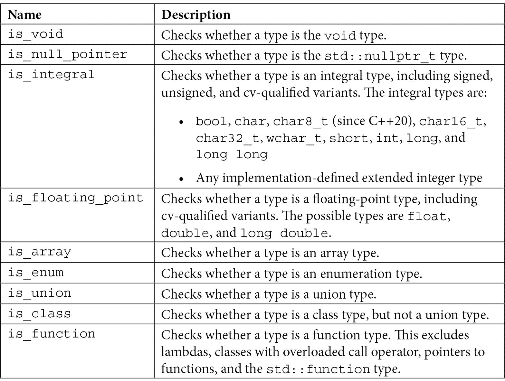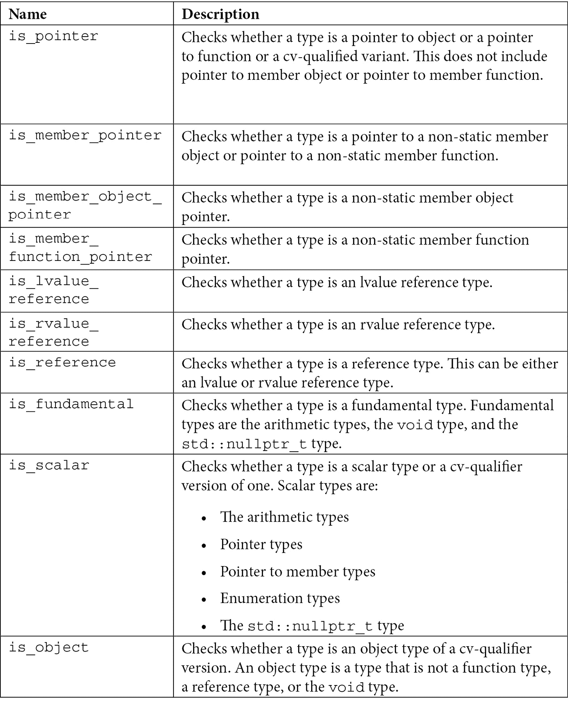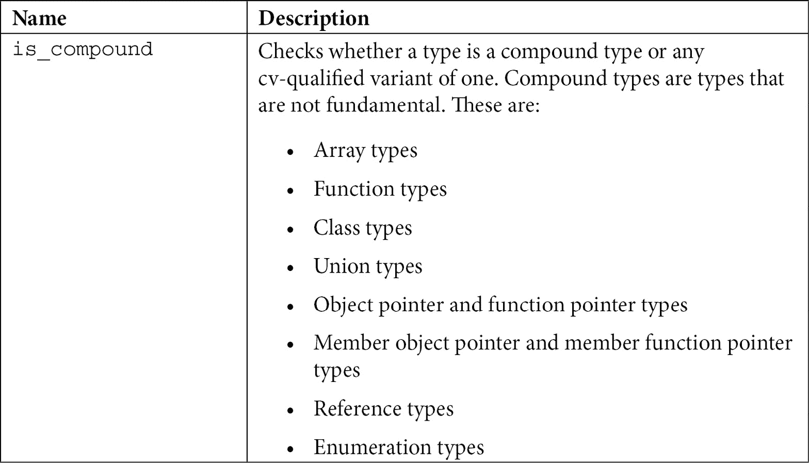

表 5.1

所有这些类型特性都在 C++11 中可用。从 C++17 开始，对于每个类型特性，都有一个变量模板可用于简化对名为 `value` 的布尔成员的访问。对于名为 `is_abc` 的类型特性，存在一个名为 `is_abc_v` 的变量模板。这对于所有具有名为 `value` 的布尔成员的类型特性都适用。这些变量的定义非常简单。下面的代码片段显示了 `is_arithmentic_v` 变量模板的定义：

```cpp
template< class T >
```

```cpp
inline constexpr bool is_arithmetic_v =
```

```cpp
   is_arithmetic<T>::value;
```

这里是使用一些这些类型特性的示例：

```cpp
template <typename T>
```

```cpp
std::string as_string(T value)
```

```cpp
{
```

```cpp
   if constexpr (std::is_null_pointer_v<T>)
```

```cpp
      return "null";
```

```cpp
   else if constexpr (std::is_arithmetic_v<T>)
```

```cpp
      return std::to_string(value);
```

```cpp
   else
```

```cpp
      static_assert(always_false<T>);
```

```cpp
}
```

```cpp
std::cout << as_string(nullptr) << '\n'; // prints null
```

```cpp
std::cout << as_string(true) << '\n';    // prints 1
```

```cpp
std::cout << as_string('a') << '\n';     // prints a
```

```cpp
std::cout << as_string(42) << '\n';      // prints 42
```

```cpp
std::cout << as_string(42.0) << '\n';   // prints 42.000000
```

```cpp
std::cout << as_string("42") << '\n';    // error
```

函数模板 `as_string` 返回一个包含作为参数传递的值的字符串。它仅适用于算术类型，对于 `nullptr_t`，它返回值 `"null"`。

你一定注意到了语句 `static_assert(always_false<T>)`，并想知道这个 `always_false<T>` 表达式实际上是什么。它是一个评估为 `false` 的 `bool` 类型的变量模板。其定义与以下内容一样简单：

```cpp
template<class T> 
```

```cpp
constexpr bool always_false = std::false_type::value;
```

这是因为语句 `static_assert(false)` 会使程序无效。原因是其条件不会依赖于模板参数，而是评估为 `false`。当无法为模板内的 `constexpr if` 语句的子语句生成有效特化时，程序是无效的（且不需要诊断）。为了避免这种情况，`static_assert` 语句的条件必须依赖于模板参数。使用 `static_assert(always_false<T>)`，编译器不知道这会评估为 `true` 还是 `false`，直到模板实例化。

我们将要探索的类型特性的下一类别允许我们查询类型的属性。

## 查询类型属性

能够查询类型属性的类型特性如下：

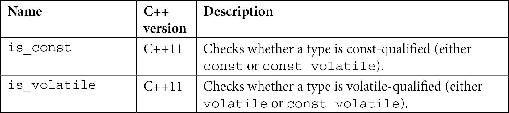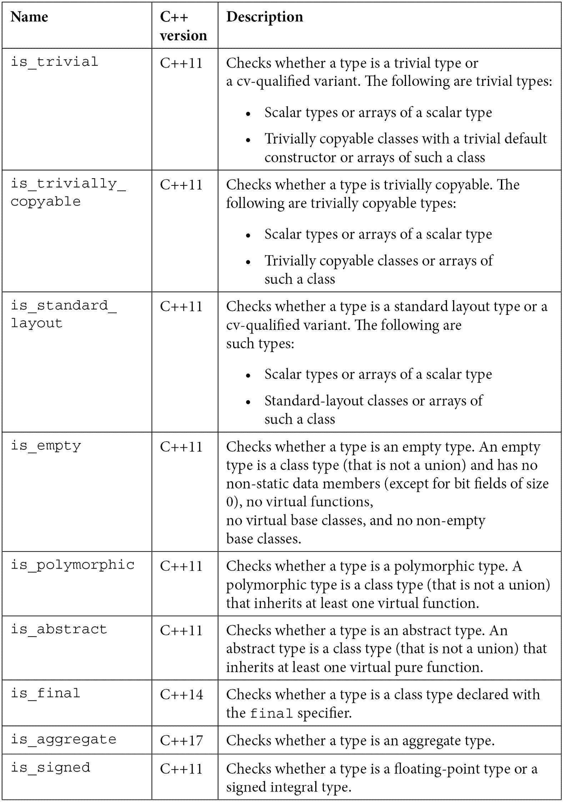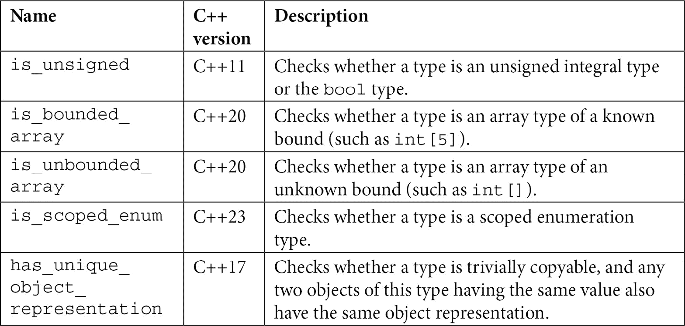

表 5.2

尽管大多数这些内容可能很容易理解，但有两个看起来似乎是相同的。这两个是 `is_trivial` 和 `is_trivially_copyable`。这两个对于标量类型或标量类型的数组都是真的。它们也对于平凡可复制的类或此类数组的数组是真的，但 `is_trivial` 只对具有平凡默认构造函数的可复制类是真的。

根据 C++ 20 标准中的段落 *§11.4.4.1*，如果一个默认构造函数不是用户提供的，并且类没有虚成员函数、没有虚基类、没有具有默认初始化器的非静态成员，它的每个直接基类都有一个平凡的默认构造函数，以及类类型的每个非静态成员也都有一个平凡的默认构造函数，那么这个默认构造函数是平凡的。为了更好地理解这一点，让我们看看下面的例子：

```cpp
struct foo
```

```cpp
{
```

```cpp
   int a;
```

```cpp
};
```

```cpp
struct bar
```

```cpp
{
```

```cpp
   int a = 0;
```

```cpp
};
```

```cpp
struct tar
```

```cpp
{
```

```cpp
   int a = 0;
```

```cpp
   tar() : a(0) {}
```

```cpp
};
```

```cpp
std::cout << std::is_trivial_v<foo> << '\n'; // true
```

```cpp
std::cout << std::is_trivial_v<bar> << '\n'; // false
```

```cpp
std::cout << std::is_trivial_v<tar> << '\n'; // false
```

```cpp
std::cout << std::is_trivially_copyable_v<foo> 
```

```cpp
          << '\n';                                 // true
```

```cpp
std::cout << std::is_trivially_copyable_v<bar> 
```

```cpp
          << '\n';                                 // true
```

```cpp
std::cout << std::is_trivially_copyable_v<tar> 
```

```cpp
          << '\n';                                 // true
```

在这个例子中，有三个类似的类。这三个类，`foo`、`bar` 和 `tar`，都是平凡可复制的。然而，只有 `foo` 类是平凡类，因为它有一个平凡的默认构造函数。`bar` 类有一个具有默认初始化器的非静态成员，而 `tar` 类有一个用户定义的构造函数，这使得它们不是平凡的。

除了平凡可复制性之外，我们还可以通过其他类型特性查询其他操作。我们将在下一节中看到这些。

## 查询支持的操作

以下一系列类型特性帮助我们查询支持的操作：

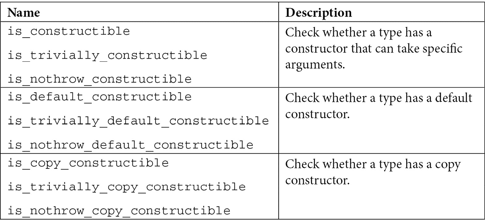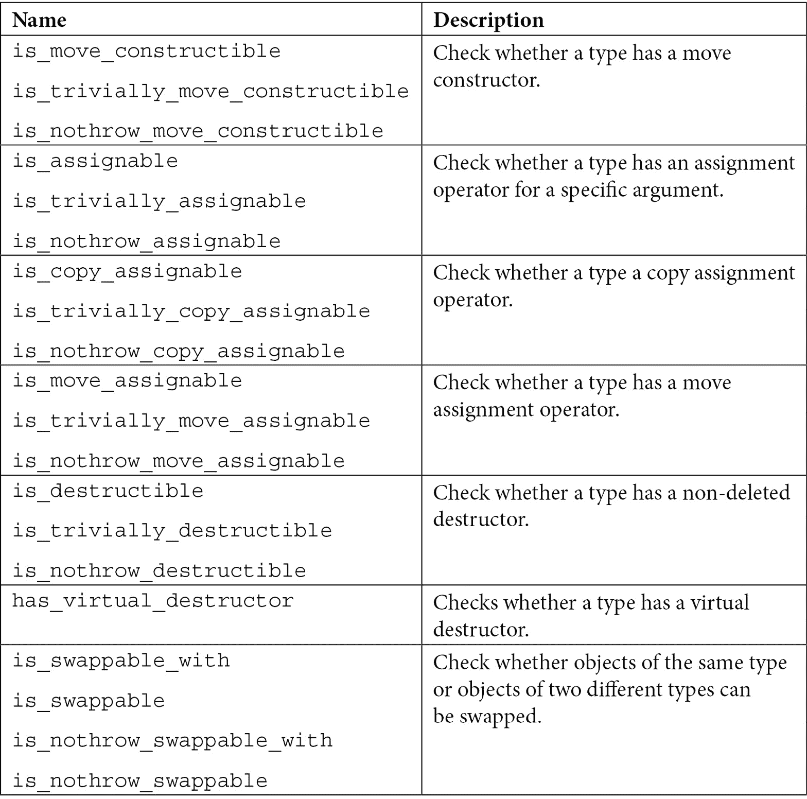

表 5.3

除了在 C++17 中引入的最后一个子集之外，其他都是在 C++11 中可用的。这些类型特性的每一种都有多个变体，包括用于检查操作是否平凡或声明为非抛出异常的 `noexcept` 限定符。

现在我们来看一下允许我们查询类型之间关系的类型特性。

## 查询类型关系

在这个类别中，我们可以找到几个类型特性，这些特性有助于查询类型之间的关系。这些类型特性如下：

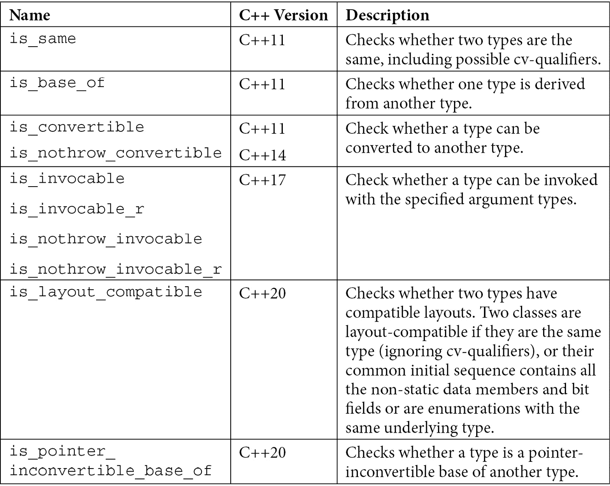

表 5.4

在这些类型特性中，可能最常用的是 `std::is_same`。这个类型特性在确定两个类型是否相同时非常有用。请注意，这个类型特性考虑了 `const` 和 `volatile` 限定符；因此，例如，`int` 和 `int const` 不是同一类型。

我们可以使用这个类型特性来扩展之前展示的 `as_string` 函数的实现。记住，如果你用 `true` 或 `false` 作为参数调用它，它会打印 `1` 或 `0`，而不是 `true`/`false`。我们可以添加一个对 `bool` 类型的显式检查，并返回包含这两个值之一的字符串，如下所示：

```cpp
template <typename T>
```

```cpp
std::string as_string(T value)
```

```cpp
{
```

```cpp
   if constexpr (std::is_null_pointer_v<T>)
```

```cpp
      return "null";
```

```cpp
   else if constexpr (std::is_same_v<T, bool>)
```

```cpp
      return value ? "true" : "false";
```

```cpp
   else if constexpr (std::is_arithmetic_v<T>)
```

```cpp
      return std::to_string(value);
```

```cpp
   else
```

```cpp
      static_assert(always_false<T>);
```

```cpp
}
```

```cpp
std::cout << as_string(true) << '\n';    // prints true
```

```cpp
std::cout << as_string(false) << '\n';   // prints false
```

到目前为止所看到的所有类型特性都是用来查询关于类型的一些信息的。在接下来的几节中，我们将看到对类型进行修改的类型特性。

## 修改 cv-指定符、引用、指针或符号

执行类型转换的类型特性也被称为元函数。这些类型特性提供了一个成员类型（`typedef`），称为 `type`，它表示转换后的类型。这一类类型特性包括以下内容：

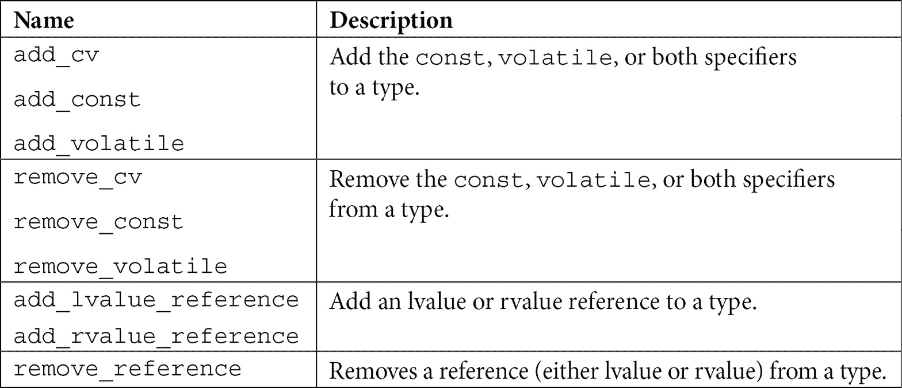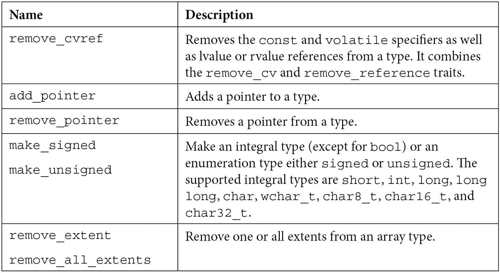

表 5.5

除了在 C++20 中添加的 `remove_cvref` 之外，表中列出的所有其他类型特性在 C++11 中都是可用的。这并不是标准库中所有的元函数。更多内容将在下一节中列出。

## 其他转换

除了之前列出的元函数之外，还有其他执行类型转换的类型特性。其中最重要的列在下面的表中：

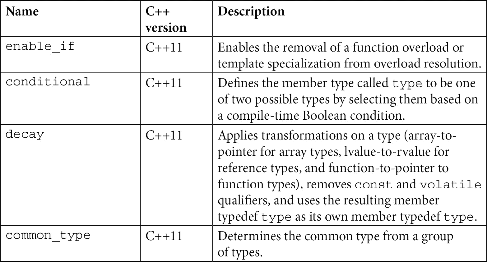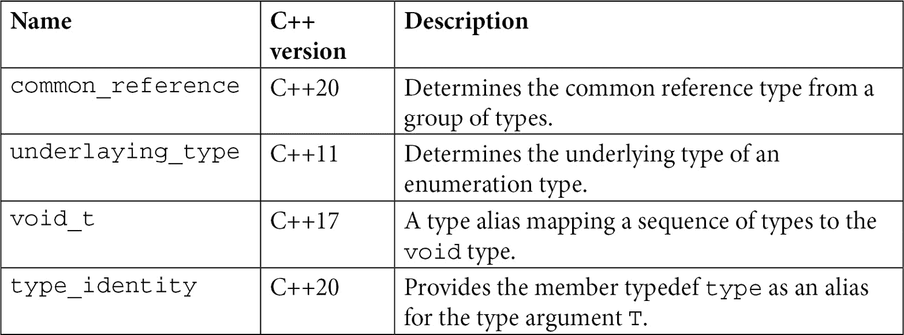

表 5.6

从这个列表中，我们已经讨论了 `enable_if`。这里还有一些其他值得举例的类型特性。让我们首先看看 `std::decay`，为此，让我们考虑以下对 `as_string` 函数的略微修改后的实现：

```cpp
template <typename T>
```

```cpp
std::string as_string(T&& value)
```

```cpp
{
```

```cpp
   if constexpr (std::is_null_pointer_v<T>)
```

```cpp
      return "null";
```

```cpp
   else if constexpr (std::is_same_v<T, bool>)
```

```cpp
      return value ? "true" : "false";
```

```cpp
   else if constexpr (std::is_arithmetic_v<T>)
```

```cpp
      return std::to_string(value);
```

```cpp
   else
```

```cpp
      static_assert(always_false<T>);
```

```cpp
}
```

唯一的改变是我们传递参数给函数的方式。我们不是按值传递，而是按右值引用传递。如果你还记得从 *第四章*，*高级模板概念*，这是一个转发引用。我们仍然可以调用传递右值（如字面量）的函数，但传递左值将触发编译器错误：

```cpp
std::cout << as_string(true) << '\n';  // OK
```

```cpp
std::cout << as_string(42) << '\n';    // OK
```

```cpp
bool f = true;
```

```cpp
std::cout << as_string(f) << '\n';     // error
```

```cpp
int n = 42;
```

```cpp
std::cout << as_string(n) << '\n';     // error
```

最后两次调用将触发 `static_assert` 语句失败。实际类型模板参数是 `bool&` 和 `int&`。因此 `std::is_same<bool, bool&>` 将初始化 `value` 成员为 `false`。同样，`std::is_arithmetic<int&>` 也会这样做。为了评估这些类型，我们需要忽略引用以及 `const` 和 `volatile` 修饰符。帮助我们这样做的是 `std::decay` 类型特性，它执行了之前表中描述的几个转换。其概念实现如下：

```cpp
template <typename T>
```

```cpp
struct decay
```

```cpp
{
```

```cpp
private:
```

```cpp
    using U = typename std::remove_reference_t<T>;
```

```cpp
public:
```

```cpp
    using type = typename std::conditional_t< 
```

```cpp
        std::is_array_v<U>,
```

```cpp
        typename std::remove_extent_t<U>*,
```

```cpp
        typename std::conditional_t< 
```

```cpp
            std::is_function<U>::value,
```

```cpp
            typename std::add_pointer_t<U>,
```

```cpp
            typename std::remove_cv_t<U>
```

```cpp
        >
```

```cpp
    >;
```

```cpp
};
```

从这个片段中，我们可以看到 `std::decay` 是通过其他元函数实现的，包括 `std::conditional`，这是根据编译时表达式在一种类型或另一种类型之间进行选择的关键。实际上，这个类型特性被多次使用，这是如果你需要根据多个条件进行选择时可以做的事情。

通过 `std::decay` 的帮助，我们可以修改 `as_string` 函数的实现，去除引用和 cv-限定符：

```cpp
template <typename T>
```

```cpp
std::string as_string(T&& value)
```

```cpp
{
```

```cpp
   using value_type = std::decay_t<T>;
```

```cpp
   if constexpr (std::is_null_pointer_v<value_type>)
```

```cpp
      return "null";
```

```cpp
   else if constexpr (std::is_same_v<value_type, bool>)
```

```cpp
      return value ? "true" : "false";
```

```cpp
   else if constexpr (std::is_arithmetic_v<value_type>)
```

```cpp
      return std::to_string(value);
```

```cpp
   else
```

```cpp
      static_assert(always_false<T>);
```

```cpp
}
```

通过如上所示更改实现，我们使之前调用 `as_string` 时未能编译的调用不再出现任何错误。

在 `std::decay` 的实现中，我们看到了 `std::conditional` 的重复使用。这是一个相对容易使用且有助于简化许多实现的元函数。在 *第二章* 的 *模板基础* 部分，*定义别名模板* 小节中，我们看到了一个构建名为 `list_t` 的列表类型的例子。这个类型有一个成员别名模板 `type`，它根据列表的大小是别名模板类型 `T`（如果列表大小为 `1`）还是 `std::vector<T>`（如果更大）。让我们再次看看这个片段：

```cpp
template <typename T, size_t S>
```

```cpp
struct list
```

```cpp
{
```

```cpp
   using type = std::vector<T>;
```

```cpp
};
```

```cpp
template <typename T>
```

```cpp
struct list<T, 1>
```

```cpp
{
```

```cpp
   using type = T;
```

```cpp
};
```

```cpp
template <typename T, size_t S>
```

```cpp
using list_t = typename list<T, S>::type;
```

通过以下方式使用 `std::conditional` 可以大大简化这个实现：

```cpp
template <typename T, size_t S>
```

```cpp
using list_t = 
```

```cpp
   typename std::conditional<S == 
```

```cpp
                 1, T, std::vector<T>>::type;
```

没有必要依赖类模板特化来定义这样的列表类型。整个解决方案可以简化为定义一个别名模板。我们可以通过一些 `static_assert` 语句来验证它是否按预期工作，如下所示：

```cpp
static_assert(std::is_same_v<list_t<int, 1>, int>);
```

```cpp
static_assert(std::is_same_v<list_t<int, 2>,
```

```cpp
                             std::vector<int>>);
```

展示每个标准类型特性的用法超出了本书的范围。然而，本章的下一节提供了需要使用几个标准类型特性的更复杂示例。

# 看看使用类型特性的真实世界示例

在本章的前一节中，我们已经探讨了标准库提供的各种类型特性。为每个类型特性寻找示例是困难和不必要的。然而，展示一些可以使用多个类型特性解决问题的示例是值得的。我们将在下一节中这样做。

## 实现复制算法

我们将要查看的第一个示例问题是 `std::copy` 标准算法（来自 `<algorithm>` 头文件）的一个可能的实现。记住，我们下面将要看到的是实际实现的一个可能版本，它有助于我们了解类型特性的用法。这个算法的签名如下：

```cpp
template <typename InputIt, typename OutputIt>
```

```cpp
constexpr OutputIt copy(InputIt first, InputIt last,
```

```cpp
                        OutputIt d_first);
```

作为备注，这个函数仅在 C++20 中是 `constexpr`，但我们可以在这个上下文中讨论它。它的作用是将范围 `[first, last)` 中的所有元素复制到以 `d_first` 开始的另一个范围中。还有一个重载版本，`std::copy_if`，它复制所有匹配谓词的元素，但这些对我们示例不重要。这个函数的直接实现如下：

```cpp
template <typename InputIt, typename OutputIt>
```

```cpp
constexpr OutputIt copy(InputIt first, InputIt last,
```

```cpp
                        OutputIt d_first)
```

```cpp
{
```

```cpp
   while (first != last)
```

```cpp
   {
```

```cpp
      *d_first++ = *first++;
```

```cpp
   }
```

```cpp
   return d_first;
```

```cpp
}
```

然而，在某些情况下，这个实现可以通过简单地复制内存来优化。但是，为了达到这个目的，必须满足一些条件：

+   两个迭代器类型，`InputIt` 和 `OutputIt`，必须是指针。

+   两个模板参数，`InputIt` 和 `OutputIt`，必须指向相同的类型（忽略 cv-限定符）。

+   `InputIt`指向的类型必须有一个平凡的复制赋值运算符。

我们可以使用以下标准类型特性来检查这些条件：

+   `std::is_same`（以及`std::is_same_v`变量）用于检查两个类型是否相同。

+   `std::is_pointer`（以及`std::is_pointer_v`变量）用于检查一个类型是否为指针类型。

+   `std::is_trivially_copy_assignable`（以及`std::is_trivially_copy_assignable_v`变量）用于检查一个类型是否具有平凡的复制赋值运算符。

+   `std::remove_cv`（以及`std::remove_cv_t`别名模板）用于从一个类型中移除 cv 限定符。

让我们看看我们如何实现这一点。首先，我们需要一个带有泛型实现的原始模板，然后是一个针对指针类型的优化实现。我们可以使用类模板和成员函数模板来实现，如下所示：

```cpp
namespace detail
```

```cpp
{
```

```cpp
   template <bool b>
```

```cpp
   struct copy_fn
```

```cpp
   {
```

```cpp
      template<typename InputIt, typename OutputIt>
```

```cpp
      constexpr static OutputIt copy(InputIt first, 
```

```cpp
                                     InputIt last, 
```

```cpp
                                     OutputIt d_first)
```

```cpp
      {
```

```cpp
         while (first != last)
```

```cpp
         {
```

```cpp
            *d_first++ = *first++;
```

```cpp
         }
```

```cpp
         return d_first;
```

```cpp
      }
```

```cpp
   };
```

```cpp
   template <>
```

```cpp
   struct copy_fn<true>
```

```cpp
   {
```

```cpp
      template<typename InputIt, typename OutputIt>
```

```cpp
      constexpr static OutputIt* copy(
```

```cpp
         InputIt* first, InputIt* last,
```

```cpp
         OutputIt* d_first)
```

```cpp
      {
```

```cpp
         std::memmove(d_first, first, 
```

```cpp
                      (last - first) * sizeof(InputIt));
```

```cpp
         return d_first + (last - first);
```

```cpp
      }
```

```cpp
   };
```

```cpp
}
```

要在源和目标之间复制内存，我们在这里使用`std::memmove`，即使对象重叠也会复制数据。这些实现提供在一个名为`detail`的命名空间中，因为它们是`copy`函数使用的实现细节，而不是直接由用户使用。这个泛型`copy`算法的实现可能如下所示：

```cpp
template<typename InputIt, typename OutputIt>
```

```cpp
constexpr OutputIt copy(InputIt first, InputIt last, 
```

```cpp
                        OutputIt d_first)
```

```cpp
{
```

```cpp
   using input_type = std::remove_cv_t<
```

```cpp
      typename std::iterator_traits<InputIt>::value_type>;
```

```cpp
   using output_type = std::remove_cv_t<
```

```cpp
      typename std::iterator_traits<OutputIt>::value_type>;
```

```cpp
   constexpr bool opt =
```

```cpp
      std::is_same_v<input_type, output_type> &&
```

```cpp
      std::is_pointer_v<InputIt> &&
```

```cpp
      std::is_pointer_v<OutputIt> &&
```

```cpp
      std::is_trivially_copy_assignable_v<input_type>;
```

```cpp
   return detail::copy_fn<opt>::copy(first, last, d_first);
```

```cpp
}
```

你可以在这里看到，选择一个特化或另一个特化的决定是基于使用上述类型特性确定的`constexpr`布尔值。下面是一个使用此`copy`函数的示例：

```cpp
std::vector<int> v1{ 1, 2, 3, 4, 5 };
```

```cpp
std::vector<int> v2(5);
```

```cpp
// calls the generic implementation
```

```cpp
copy(std::begin(v1), std::end(v1), std::begin(v2));
```

```cpp
int a1[5] = { 1,2,3,4,5 };
```

```cpp
int a2[5];
```

```cpp
// calls the optimized implementation
```

```cpp
copy(a1, a1 + 5, a2);
```

请记住，这并不是你在标准库实现中找到的泛型算法`copy`的真实定义，这些实现被进一步优化。然而，这是一个很好的例子，展示了如何使用类型特性来解决实际问题。

为了简单起见，我将`copy`函数定义在看起来像是全局命名空间的地方。这是一个坏习惯。通常，代码，尤其是在库中，会被分组在命名空间中。在 GitHub 上伴随书籍的源代码中，你会找到这个函数定义在一个名为`n520`的命名空间中（这只是一个唯一的名称，与主题无关）。当我们调用我们定义的`copy`函数时，我们实际上需要使用完全限定的名称（包括命名空间名称），如下所示：

```cpp
n520::copy(std::begin(v1), std::end(v1), std::begin(v2));
```

没有这个限定，一个名为`copy`的过程被传递给`std::copy`函数，因为我们传递的参数在`std`命名空间中。你可以阅读更多关于 ADL 的信息，请参阅[`en.cppreference.com/w/cpp/language/adl`](https://en.cppreference.com/w/cpp/language/adl)。

现在，让我们看看另一个例子。

## 构建同质变长函数模板

对于第二个例子，我们想要构建一个只能接受相同类型或可以隐式转换为公共类型的变长函数模板。让我们从以下骨架定义开始：

```cpp
template<typename... Ts>
```

```cpp
void process(Ts&&... ts) {}
```

这个问题在于，以下所有函数调用都有效（请记住，这个函数的主体是空的，所以不会因为对某些类型执行不可用的操作而产生错误）：

```cpp
process(1, 2, 3);
```

```cpp
process(1, 2.0, '3');
```

```cpp
process(1, 2.0, "3");
```

在第一个例子中，我们传递了三个 `int` 值。在第二个例子中，我们传递了一个 `int`、一个 `double` 和一个 `char`；`int` 和 `char` 都可以隐式转换为 `double`，所以这应该没问题。然而，在第三个例子中，我们传递了一个 `int`、一个 `double` 和一个 `char const*`，而最后一个类型既不能隐式转换为 `int` 也不能转换为 `double`。因此，这个最后的调用应该触发编译器错误，但实际上并没有。

为了做到这一点，我们需要确保当函数参数的共同类型不可用时，编译器将生成一个错误。为此，我们可以使用 `static_assert` 语句或 `std::enable_if` 和 SFINAE。然而，我们确实需要弄清楚是否存在共同类型。这可以通过 `std::common_type` 类型特性来实现。

`std::common_type` 是一个元函数，它定义了所有类型参数中可以隐式转换为的共同类型。因此，`std::common_type<int, double, char>::type` 将别名 `double` 类型。使用这种类型特性，我们可以构建另一个类型特性，它告诉我们是否存在共同类型。一个可能的实现如下：

```cpp
template <typename, typename... Ts>
```

```cpp
struct has_common_type : std::false_type {};
```

```cpp
template <typename... Ts>
```

```cpp
struct has_common_type<
```

```cpp
          std::void_t<std::common_type_t<Ts...>>, 
```

```cpp
          Ts...>
```

```cpp
   : std::true_type {};
```

```cpp
template <typename... Ts>
```

```cpp
constexpr bool has_common_type_v =
```

```cpp
   sizeof...(Ts) < 2 ||
```

```cpp
   has_common_type<void, Ts...>::value;
```

你可以在这个片段中看到，我们基于几个其他类型特性来实现。首先，有 `std::false_type` 和 `std::true_type` 对。这些是 `std::bool_constant<false>` 和 `std::bool_constant<true>` 的类型别名。`std::bool_constant` 类在 C++17 中可用，并且是 `std::integral_constant` 类的一个别名模板，该模板针对 `bool` 类型进行了特化。最后一个类模板包装了指定类型的静态常量。其概念实现如下（尽管也提供了一些操作）：

```cpp
template<class T, T v>
```

```cpp
struct integral_constant
```

```cpp
{
```

```cpp
   static constexpr T value = v;
```

```cpp
   using value_type = T;
```

```cpp
};
```

这有助于我们简化需要定义布尔编译时值的类型特性的定义，正如我们在本章的几个例子中看到的那样。

在 `has_common_type` 类的实现中使用的第三个类型特性是 `std::void_t`。这个类型特性定义了多个类型和 `void` 类型之间的映射。我们使用它来在存在共同类型的情况下建立共同类型和 `void` 类型之间的映射。这使得我们能够利用 SFINAE 来特化 `has_common_type` 类模板。

最后，定义了一个名为 `has_common_type_v` 的变量模板，以简化 `has_common_type` 特性的使用。

所有这些都可以用来修改 `process` 函数模板的定义，以确保它只允许具有共同类型的参数。下面是一个可能的实现：

```cpp
template<typename... Ts,
```

```cpp
         typename = std::enable_if_t<
```

```cpp
                       has_common_type_v<Ts...>>>
```

```cpp
void process(Ts&&... ts) 
```

```cpp
{ }
```

因此，像 `process(1, 2.0, "3")` 这样的调用将产生编译器错误，因为没有为这组参数重载 `process` 函数。

如前所述，有不同方法可以使用 `has_common_type` 特性来实现既定的目标。其中之一，使用 `std::enable_if`，已在本文中展示，但我们也可以使用 `static_assert`。然而，使用概念的方法会更好，我们将在下一章中看到这一点。

# 摘要

本章探讨了类型特性的概念，这些是定义类型元信息或类型转换操作的类。我们首先探讨了类型特性如何实现以及它们如何帮助我们。接下来，我们学习了 **SFINAE**，即 **Substitution Failure Is Not An Error**。这是一种技术，使我们能够为模板参数提供约束。

我们接着看到了如何通过 `enable_if` 和 `constexpr if` 在 C++17 中更好地实现这一目的。在章节的第二部分，我们探讨了标准库中可用的类型特性，并展示了如何使用其中的一些。我们以几个实际案例结束本章，在这些案例中，我们使用了多个类型特性来解决特定问题。

在下一章中，我们将继续探讨通过学习 C++20 的概念和约束来限制模板参数的话题。

# 问题

1.  什么是类型特性？

1.  什么是 SFINAE？

1.  什么是 `constexpr if`？

1.  `std::is_same` 是做什么的？

1.  `std::conditional` 是做什么的？

# 进一步阅读

+   *C++ 类型特性*，John Maddock 和 Steve Cleary，[`cs.brown.edu/~jwicks/boost/libs/type_traits/cxx_type_traits.htm`](https://cs.brown.edu/~jwicks/boost/libs/type_traits/cxx_type_traits.htm)

+   *N4861 Post-Prague 2020 C++ 工作草案*，[`github.com/cplusplus/draft/releases/tag/n4861`](https://github.com/cplusplus/draft/releases/tag/n4861)

+   *什么是 ADL？*，Arthur O’Dwyer，[`quuxplusone.github.io/blog/2019/04/26/what-is-adl/`](https://quuxplusone.github.io/blog/2019/04/26/what-is-adl/)
