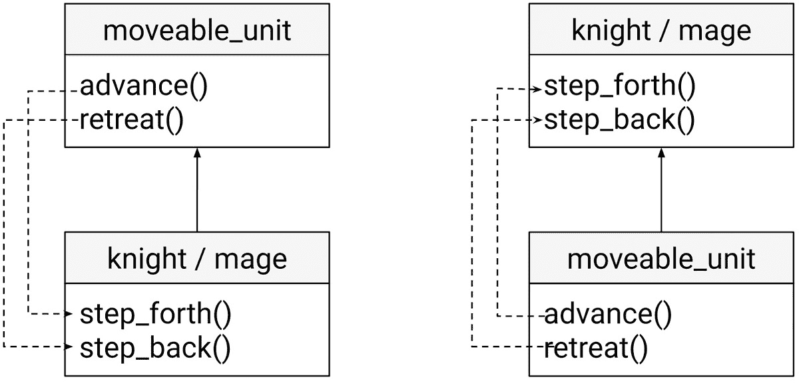

# *第七章*：模式和惯用法

本书的前几部分旨在帮助您了解有关模板的各个方面，从基础知识到最先进的功能，包括来自 C++20 的最新概念和约束。现在，是我们将这一知识付诸实践并学习各种元编程技术的时候了。在本章中，我们将讨论以下主题：

+   动态多态与静态多态

+   **奇特重复模板模式**（**CRTP**）

+   混合

+   类型擦除

+   标签分派

+   表达式模板

+   类型列表

到本章结束时，您将很好地理解各种多编程技术，这将帮助您解决各种问题。

让我们以讨论两种多态形式：动态和静态，开始本章。

# 动态多态与静态多态

当您学习面向对象编程时，您会了解其基本原理，即**抽象**、**封装**、**继承**和**多态**。C++ 是一种支持面向对象编程的多范式编程语言。尽管关于面向对象编程原理的更广泛讨论超出了本章和本书的范围，但至少讨论与多态相关的一些方面是值得的。

那么，什么是多态？这个术语来源于希腊语中的“*多种形式*”。在编程中，它是不同类型的对象被当作同一类型对象处理的能力。C++ 标准实际上将多态类定义为如下（见 C++20 标准，段落 *11.7.2*，*虚函数*）：

声明或继承虚函数的类称为多态类。

它还根据此定义定义了多态对象，如下所示（见 C++20 标准，段落 *6.7.2*，*对象模型*）：

一些对象是多态的（11.7.2）；其实施生成与每个此类对象关联的信息，使得在程序执行期间可以确定该对象类型。

然而，这实际上指的是所谓的**动态多态**（或后期绑定），但还有一种称为**静态多态**（或早期绑定）的多态形式。动态多态在运行时通过接口和虚函数发生，而静态多态在编译时通过重载函数和模板发生。这已在 Bjarne Stroustrup 为 C++ 语言提供的术语表中描述（见 [`www.stroustrup.com/glossary.html`](https://www.stroustrup.com/glossary.html)）：

多态 - 为不同类型的实体提供一个单一接口。虚函数通过基类提供的接口提供动态（运行时）多态。重载函数和模板提供静态（编译时）多态。

让我们看看动态多态的一个例子。以下是一个表示游戏中不同单位的类的层次结构。这些单位可以攻击其他单位，因此有一个基类，它有一个名为`attack`的纯虚函数，并且有几个派生类实现了特定的单位，这些单位覆盖了这个虚函数并执行不同的操作（当然，为了简单起见，这里我们只是打印一条消息到控制台）。它看起来如下：

```cpp
struct game_unit
```

```cpp
{
```

```cpp
   virtual void attack() = 0;
```

```cpp
};
```

```cpp
struct knight : game_unit
```

```cpp
{
```

```cpp
   void attack() override
```

```cpp
   { std::cout << "draw sword\n"; }
```

```cpp
};
```

```cpp
struct mage : game_unit
```

```cpp
{
```

```cpp
   void attack() override
```

```cpp
   { std::cout << "spell magic curse\n"; }
```

```cpp
};
```

基于这个类的层次结构（根据标准，这些类被称为`fight`，如下所示。它接受一个指向基类`game_unit`类型对象的指针序列，并调用`attack`成员函数。以下是它的实现：

```cpp
void fight(std::vector<game_unit*> const & units)
```

```cpp
{
```

```cpp
   for (auto unit : units)
```

```cpp
   {
```

```cpp
      unit->attack();
```

```cpp
   }
```

```cpp
}
```

这个函数不需要知道每个对象的实际类型，因为由于动态多态，它可以像它们具有相同的（基）类型一样处理它们。以下是一个使用它的例子：

```cpp
knight k;
```

```cpp
mage m;
```

```cpp
fight({&k, &m});
```

但现在假设你可以将一个法师和一个骑士组合起来，创建一个新的单位，一个具有这两个单位特殊能力的骑士法师。C++使我们能够编写如下代码：

```cpp
knight_mage km = k + m;
```

```cpp
km.attack();
```

这不是现成的，但语言支持运算符重载，我们可以为任何用户定义的类型做这件事。为了使前面的行成为可能，我们需要以下内容：

```cpp
struct knight_mage : game_unit
```

```cpp
{
```

```cpp
   void attack() override
```

```cpp
   { std::cout << "draw magic sword\n"; }
```

```cpp
};
```

```cpp
knight_mage operator+(knight const& k, mage const& m)
```

```cpp
{
```

```cpp
   return knight_mage{};
```

```cpp
}
```

请记住，这些只是一些简单的代码片段，没有任何复杂的代码。但是，将一个`knight`和一个`mage`相加以创建一个`knight_mage`的能力，与将两个整数相加的能力，或者一个`double`和一个`int`相加的能力，或者两个`std::string`对象相加的能力不相上下。这是因为有多个`+`运算符的重载（既适用于内置类型也适用于用户定义的类型），并且根据操作数，编译器会选择适当的重载。因此，可以说有这种运算符的许多形式。这对于所有可以重载的运算符都适用；`+`运算符只是一个典型的例子，因为它无处不在。这就是编译时多态，称为**静态多态**。

运算符不是唯一可以重载的函数。任何函数都可以重载。尽管我们在书中看到了许多例子，但让我们再看一个：

```cpp
struct attack  { int value; };
```

```cpp
struct defense { int value; };
```

```cpp
void increment(attack& a)  { a.value++; }
```

```cpp
void increment(defense& d) { d.value++; }
```

在这个代码片段中，`increment`函数为`attack`和`defense`类型重载，允许我们编写如下代码：

```cpp
attack a{ 42 };
```

```cpp
defense d{ 50 };
```

```cpp
increment(a);
```

```cpp
increment(d);
```

我们可以用一个函数模板替换`increment`的两个重载。变化很小，如下面的代码片段所示：

```cpp
template <typename T>
```

```cpp
void increment(T& t) { t.value++; }
```

之前的代码仍然可以工作，但有一个显著的区别：在前面的例子中，我们有两个重载，一个用于`attack`，一个用于`defense`，因此你可以用这些类型的对象调用函数，但不能用其他类型的对象。在后面，我们有一个模板，为任何可能的类型`T`定义了一组重载函数，这些类型具有名为`value`的数据成员，其类型支持后增量运算符。我们可以为这样的函数模板定义约束，这在本书的前两章中我们已经看到。然而，关键要点是重载函数和模板是实现 C++语言中静态多态的机制。

动态多态会带来性能开销，因为为了知道要调用哪些函数，编译器需要构建一个指向虚函数的指针表（以及在虚继承的情况下，还需要一个指向虚基类的指针表）。因此，在以多态方式调用虚函数时，存在一定程度的间接性。此外，虚函数的细节并未提供给编译器，编译器无法对其进行优化。

当这些事情可以验证为性能问题时，我们可以提出这样的问题：我们能否在编译时获得动态多态的好处？答案是肯定的，有一种方法可以实现这一点：奇特重复模板模式，我们将在下一节讨论。

# 奇特重复模板模式

这种模式有一个相当奇特的名字：**奇特重复模板模式**，简称**CRTP**。它被称为奇特，因为它相当奇怪且不直观。这个模式最初由 James Coplien 在 1995 年的《C++ Report》杂志专栏中描述（并为其命名）。这个模式如下：

+   存在一个定义（静态）接口的基类模板。

+   派生类本身是基类模板的模板参数。

+   基类中的成员函数调用其类型模板参数（即派生类）的成员函数。

让我们看看这个模式在实际中的实现看起来是什么样子。我们将把之前的游戏单位示例转换为使用 CRTP 的版本。模式实现如下：

```cpp
template <typename T>
```

```cpp
struct game_unit
```

```cpp
{
```

```cpp
   void attack()
```

```cpp
   {
```

```cpp
      static_cast<T*>(this)->do_attack();
```

```cpp
   }
```

```cpp
};
```

```cpp
struct knight : game_unit<knight>
```

```cpp
{
```

```cpp
   void do_attack()
```

```cpp
   { std::cout << "draw sword\n"; }
```

```cpp
};
```

```cpp
struct mage : game_unit<mage>
```

```cpp
{
```

```cpp
   void do_attack()
```

```cpp
   { std::cout << "spell magic curse\n"; }
```

```cpp
};
```

`game_unit`类现在是一个模板类，但包含相同的成员函数`attack`。内部，这会将`this`指针向上转换为`T*`，然后调用名为`do_attack`的成员函数。`knight`和`mage`类从`game_unit`类派生，并将自身作为类型模板参数`T`的参数传递。两者都提供了一个名为`do_attack`的成员函数。

注意到基类模板中的成员函数和派生类中调用的成员函数具有不同的名称。否则，如果它们具有相同的名称，派生类的成员函数将隐藏基类中的成员，因为这些不再是虚函数。

需要更改的 `fight` 函数是接受游戏单位集合并调用 `attack` 函数的函数。它需要实现为一个函数模板，如下所示：

```cpp
template <typename T>
```

```cpp
void fight(std::vector<game_unit<T>*> const & units)
```

```cpp
{
```

```cpp
   for (auto unit : units)
```

```cpp
   {
```

```cpp
      unit->attack();
```

```cpp
   }
```

```cpp
}
```

使用这个函数与之前略有不同。它如下所示：

```cpp
knight k;
```

```cpp
mage   m;
```

```cpp
fight<knight>({ &k });
```

```cpp
fight<mage>({ &m });
```

我们已经将运行时多态移至编译时。因此，`fight` 函数不能以多态方式处理 `knight` 和 `mage` 对象。相反，我们得到两个不同的重载，一个可以处理 `knight` 对象，另一个可以处理 `mage` 对象。这是静态多态。

尽管这个模式最终可能看起来并不复杂，但你现在可能正在问自己一个问题：这个模式实际上有什么用？你可以使用 CRT 解决不同的问题，包括以下这些：

+   限制类型实例化的次数

+   添加通用功能并避免代码重复

+   实现组合设计模式

在接下来的小节中，我们将查看这些问题中的每一个，并看看如何使用 CRTP 来解决它们。

## 使用 CRTP 限制对象计数

假设我们为创建骑士和法师的游戏需要一些物品以有限的数量实例可用。例如，有一种特殊的剑类型叫做 *Excalibur*，应该只有一个实例。另一方面，有一个魔法咒语的书，但游戏一次不能有超过三个实例。我们如何解决这个问题？显然，剑的问题可以用单例模式解决。但当我们需要限制数量到一个更高的但仍然有限的值时，单例模式就帮不上什么忙（除非我们将其转换为“*multiton*”），但 CRTP 可以。

首先，我们从一个基类模板开始。这个类模板唯一做的事情是记录它被实例化的次数。计数器，这是一个静态数据成员，在构造函数中增加，在析构函数中减少。当这个计数超过一个定义的限制时，会抛出一个异常。以下是实现：

```cpp
template <typename T, size_t N>
```

```cpp
struct limited_instances 
```

```cpp
{
```

```cpp
   static std::atomic<size_t> count;
```

```cpp
   limited_instances()
```

```cpp
   {
```

```cpp
      if (count >= N)
```

```cpp
         throw std::logic_error{ "Too many instances" };
```

```cpp
      ++count;
```

```cpp
   }
```

```cpp
   ~limited_instances() { --count; }
```

```cpp
};
```

```cpp
template <typename T, size_t N>
```

```cpp
std::atomic<size_t> limited_instances<T, N>::count = 0;
```

模板的第二部分是定义派生类。对于提到的问题，它们如下所示：

```cpp
struct excalibur : limited_instances<excalibur, 1>
```

```cpp
{};
```

```cpp
struct book_of_magic : limited_instances<book_of_magic, 3>
```

```cpp
{};
```

我们可以实例化 `excalibur` 一次。当我们第二次尝试这样做（而第一个实例仍然存活）时，将会抛出一个异常：

```cpp
excalibur e1;
```

```cpp
try
```

```cpp
{
```

```cpp
   excalibur e2;
```

```cpp
}
```

```cpp
catch (std::exception& e)
```

```cpp
{
```

```cpp
   std::cout << e.what() << '\n';
```

```cpp
}
```

同样，我们可以实例化 `book_of_magic` 三次，当我们第四次尝试这样做时，将会抛出一个异常：

```cpp
book_of_magic b1;
```

```cpp
book_of_magic b2;
```

```cpp
book_of_magic b3;
```

```cpp
try
```

```cpp
{
```

```cpp
   book_of_magic b4;
```

```cpp
}
```

```cpp
catch (std::exception& e)
```

```cpp
{
```

```cpp
   std::cout << e.what() << '\n';
```

```cpp
}
```

接下来，我们看看一个更常见的场景，向类型添加通用功能。

## 使用 CRTP 添加功能

当好奇地重复模板模式可以帮助我们的时候，另一个案例是通过基类中的泛型函数提供通用功能给派生类，该基类仅依赖于派生类成员。让我们通过一个例子来理解这个用例。

假设我们的一些游戏单位具有`step_forth`和`step_back`这样的成员函数，这些函数可以将它们移动一个位置，向前或向后。这些类将如下所示（至少是基础形式）：

```cpp
struct knight
```

```cpp
{
```

```cpp
   void step_forth();
```

```cpp
   void step_back();
```

```cpp
};
```

```cpp
struct mage
```

```cpp
{
```

```cpp
   void step_forth();
```

```cpp
   void step_back();
```

```cpp
};
```

然而，可能有一个要求，即所有可以前后移动一步的东西也应该能够前进或后退任意数量的步骤。然而，这个功能可以根据`step_forth`和`step_back`函数实现，这有助于避免在每个游戏单元类中都有重复的代码。因此，这个问题的 CRTP 实现将如下所示：

```cpp
template <typename T>
```

```cpp
struct movable_unit
```

```cpp
{
```

```cpp
   void advance(size_t steps)
```

```cpp
   {
```

```cpp
      while (steps--)
```

```cpp
         static_cast<T*>(this)->step_forth();
```

```cpp
   }
```

```cpp
   void retreat(size_t steps)
```

```cpp
   {
```

```cpp
      while (steps--)
```

```cpp
         static_cast<T*>(this)->step_back();
```

```cpp
   }
```

```cpp
};
```

```cpp
struct knight : movable_unit<knight>
```

```cpp
{
```

```cpp
   void step_forth() 
```

```cpp
   { std::cout << "knight moves forward\n"; }
```

```cpp
   void step_back()
```

```cpp
   { std::cout << "knight moves back\n"; }
```

```cpp
};
```

```cpp
struct mage : movable_unit<mage>
```

```cpp
{
```

```cpp
   void step_forth()
```

```cpp
   { std::cout << "mage moves forward\n"; }
```

```cpp
   void step_back()
```

```cpp
   { std::cout << "mage moves back\n"; }
```

```cpp
};
```

我们可以通过调用基类的`advance`和`retreat`成员函数来前进和后退单位，如下所示：

```cpp
knight k;
```

```cpp
k.advance(3);
```

```cpp
k.retreat(2);
```

```cpp
mage m;
```

```cpp
m.advance(5);
```

```cpp
m.retreat(3);
```

你可能会争辩说，使用非成员函数模板也可以达到相同的结果。为了讨论的目的，这样的解决方案如下所示：

```cpp
struct knight
```

```cpp
{
```

```cpp
   void step_forth()
```

```cpp
   { std::cout << "knight moves forward\n"; }
```

```cpp
   void step_back()
```

```cpp
   { std::cout << "knight moves back\n"; }
```

```cpp
};
```

```cpp
struct mage
```

```cpp
{
```

```cpp
   void step_forth()
```

```cpp
   { std::cout << "mage moves forward\n"; }
```

```cpp
   void step_back()
```

```cpp
   { std::cout << "mage moves back\n"; }
```

```cpp
};
```

```cpp
template <typename T>
```

```cpp
void advance(T& t, size_t steps)
```

```cpp
{
```

```cpp
   while (steps--) t.step_forth();
```

```cpp
}
```

```cpp
template <typename T>
```

```cpp
void retreat(T& t, size_t steps)
```

```cpp
{
```

```cpp
   while (steps--) t.step_back();
```

```cpp
}
```

客户端代码需要更改，但更改实际上很小：

```cpp
knight k;
```

```cpp
advance(k, 3);
```

```cpp
retreat(k, 2);
```

```cpp
mage m;
```

```cpp
advance(m, 5);
```

```cpp
retreat(m, 3);
```

这两种选择可能取决于问题的性质和你的偏好。然而，CRTP 的优势在于它很好地描述了派生类的接口（例如，我们例子中的`knight`和`mage`）。使用非成员函数，你不必知道这种功能，这可能会来自你需要包含的头文件。然而，使用 CRTP，类的接口对使用者来说非常清晰。

对于我们在这里讨论的最后一种场景，让我们看看 CRTP 如何帮助实现组合设计模式。

## 实现组合设计模式

在他们著名的书籍《设计模式：可复用面向对象软件元素》中，四人帮（Erich Gamma、Richard Helm、Ralph Johnson 和 John Vlissides）描述了一种结构模式，称为组合（composite），它使我们能够将对象组合成更大的结构，并统一处理单个对象和组合。当你想要表示对象的分-整体层次结构，并且你想要忽略单个对象和单个对象的组合之间的差异时，可以使用此模式。

要将这种模式付诸实践，让我们再次考虑游戏场景。我们有一些具有特殊能力并能执行不同动作的英雄，其中之一是与另一个英雄结盟。这可以很容易地建模如下：

```cpp
struct hero
```

```cpp
{
```

```cpp
   hero(std::string_view n) : name(n) {}
```

```cpp
   void ally_with(hero& u)
```

```cpp
   {
```

```cpp
      connections.insert(&u);
```

```cpp
      u.connections.insert(this);
```

```cpp
   }
```

```cpp
private:
```

```cpp
   std::string name;
```

```cpp
   std::set<hero*> connections;
```

```cpp
   friend std::ostream& operator<<(std::ostream& os, 
```

```cpp
                                   hero const& obj);
```

```cpp
};
```

```cpp
std::ostream& operator<<(std::ostream& os, 
```

```cpp
                         hero const& obj)
```

```cpp
{
```

```cpp
   for (hero* u : obj.connections)
```

```cpp
      os << obj.name << " --> [" << u->name << "]" << '\n';
```

```cpp
   return os;
```

```cpp
}
```

这些英雄由包含名称、指向其他`hero`对象的连接列表以及定义两个英雄之间联盟的成员函数`ally_with`的`hero`类表示。我们可以如下使用它：

```cpp
hero k1("Arthur");
```

```cpp
hero k2("Sir Lancelot");
```

```cpp
hero k3("Sir Gawain");
```

```cpp
k1.ally_with(k2);
```

```cpp
k2.ally_with(k3);
```

```cpp
std::cout << k1 << '\n';
```

```cpp
std::cout << k2 << '\n';
```

```cpp
std::cout << k3 << '\n';
```

运行此代码片段的输出如下：

```cpp
Arthur --> [Sir Lancelot]
Sir Lancelot --> [Arthur]
Sir Lancelot --> [Sir Gawain]
Sir Gawain --> [Sir Lancelot]
```

到目前为止，一切都很简单。但要求是英雄可以被分组形成团体。应该允许一个英雄与一个团体结盟，以及一个团体可以与一个英雄或整个团体结盟。突然之间，我们需要提供的功能函数爆炸式增长：

```cpp
struct hero_party;
```

```cpp
struct hero
```

```cpp
{
```

```cpp
   void ally_with(hero& u);
```

```cpp
   void ally_with(hero_party& p);
```

```cpp
};
```

```cpp
struct hero_party : std::vector<hero>
```

```cpp
{
```

```cpp
   void ally_with(hero& u);
```

```cpp
   void ally_with(hero_party& p);
```

```cpp
};
```

这就是组合设计模式如何帮助我们统一处理英雄和党派，并避免不必要的代码重复。通常，有几种不同的实现方式，但其中一种方式是使用好奇重复模板模式。实现需要定义公共接口的基类。在我们的情况下，这将是一个只有一个名为 `ally_with` 的成员函数的类模板：

```cpp
template <typename T>
```

```cpp
struct base_unit
```

```cpp
{
```

```cpp
   template <typename U>
```

```cpp
   void ally_with(U& other);
```

```cpp
};
```

我们将定义 `hero` 类为从 `base_unit<hero>` 派生的派生类。这次，`hero` 类不再自己实现 `ally_with`。然而，它具有 `begin` 和 `end` 方法，旨在模拟容器的行为：

```cpp
struct hero : base_unit<hero>
```

```cpp
{
```

```cpp
   hero(std::string_view n) : name(n) {}
```

```cpp
   hero* begin() { return this; }
```

```cpp
   hero* end() { return this + 1; }
```

```cpp
private:
```

```cpp
   std::string name;
```

```cpp
   std::set<hero*> connections;
```

```cpp
   template <typename U>
```

```cpp
   friend struct base_unit;
```

```cpp
   template <typename U>
```

```cpp
   friend std::ostream& operator<<(std::ostream& os,
```

```cpp
                                   base_unit<U>& object);
```

```cpp
};
```

模拟一组英雄的类称为 `hero_party`，它从 `std::vector<hero>`（用于定义 `hero` 对象的容器）和 `base_unit<hero_party>` 中继承。这就是为什么 `hero` 类有 `begin` 和 `end` 函数，帮助我们执行对 `hero` 对象的迭代操作，就像我们对 `hero_party` 对象所做的那样：

```cpp
struct hero_party : std::vector<hero>, 
```

```cpp
                    base_unit<hero_party>
```

```cpp
{};
```

我们需要实现基类的 `ally_with` 成员函数。代码如下所示。它的作用是遍历当前对象的所有子对象，并将它们与提供的参数的所有子对象连接起来：

```cpp
template <typename T>
```

```cpp
template <typename U>
```

```cpp
void base_unit<T>::ally_with(U& other)
```

```cpp
{
```

```cpp
   for (hero& from : *static_cast<T*>(this))
```

```cpp
   {
```

```cpp
      for (hero& to : other)
```

```cpp
      {
```

```cpp
         from.connections.insert(&to);
```

```cpp
         to.connections.insert(&from);
```

```cpp
      }
```

```cpp
   }
```

```cpp
}
```

`hero` 类将 `base_unit` 类模板声明为友元，以便它可以访问 `connections` 成员。它还将 `operator<<` 声明为友元，以便这个函数可以访问 `connections` 和 `name` 私有成员。有关模板和友元的更多信息，请参阅*第四章*，*高级模板概念*。输出流操作符的实现如下所示：

```cpp
template <typename T>
```

```cpp
std::ostream& operator<<(std::ostream& os,
```

```cpp
                         base_unit<T>& object)
```

```cpp
{
```

```cpp
   for (hero& obj : *static_cast<T*>(&object))
```

```cpp
   {
```

```cpp
      for (hero* n : obj.connections)
```

```cpp
         os << obj.name << " --> [" << n->name << "]" 
```

```cpp
            << '\n';
```

```cpp
   }
```

```cpp
   return os;
```

```cpp
}
```

在定义了所有这些之后，我们可以编写如下代码：

```cpp
hero k1("Arthur");
```

```cpp
hero k2("Sir Lancelot");
```

```cpp
hero_party p1;
```

```cpp
p1.emplace_back("Bors");
```

```cpp
hero_party p2;
```

```cpp
p2.emplace_back("Cador");
```

```cpp
p2.emplace_back("Constantine");
```

```cpp
k1.ally_with(k2);
```

```cpp
k1.ally_with(p1);
```

```cpp
p1.ally_with(k2);
```

```cpp
p1.ally_with(p2);
```

```cpp
std::cout << k1 << '\n';
```

```cpp
std::cout << k2 << '\n';
```

```cpp
std::cout << p1 << '\n';
```

```cpp
std::cout << p2 << '\n';
```

从这里我们可以看到，我们能够将 `hero` 与另一个 `hero` 或 `hero_party` 结盟，以及将 `hero_party` 与 `hero` 或另一个 `hero_party` 结盟。这正是我们提出的目标，我们能够在 `hero` 和 `hero_party` 之间不重复代码的情况下实现它。执行前面的代码片段的输出如下：

```cpp
Arthur --> [Sir Lancelot]
Arthur --> [Bors]
Sir Lancelot --> [Arthur]
Sir Lancelot --> [Bors]
Bors --> [Arthur]
Bors --> [Sir Lancelot]
Bors --> [Cador]
Bors --> [Constantine]
Cador --> [Bors]
Constantine --> [Bors]
```

在看到 CRTP 如何帮助实现不同的目标之后，让我们看看 C++标准库中 CRTP 的使用。

## 标准库中的 CRTP

标准库包含一个名为 `std::enabled_shared_from_this` 的辅助类型（在 `<memory>` 头文件中），它允许由 `std::shared_ptr` 管理的对象以安全的方式生成更多的 `std::shared_ptr` 实例。`std::enabled_shared_from_this` 类是 CRTP 模式中的基类。然而，前面的描述可能听起来很抽象，所以让我们通过示例来尝试理解它。

假设我们有一个名为 `building` 的类，并且我们正在以下方式创建 `std::shared_ptr` 对象：

```cpp
struct building {};
```

```cpp
building* b = new building();
```

```cpp
std::shared_ptr<building> p1{ b }; // [1]
```

```cpp
std::shared_ptr<building> p2{ b }; // [2] bad
```

我们有一个原始指针，在行`[1]`中，我们实例化了一个`std::shared_ptr`对象来管理其生命周期。然而，在行`[2]`中，我们为同一个指针实例化了一个第二个`std::shared_ptr`对象。不幸的是，这两个智能指针彼此之间一无所知，因此当它们超出作用域时，它们都会删除在堆上分配的`building`对象。删除已经删除的对象是未定义的行为，很可能会导致程序崩溃。

`std::enable_shared_from_this`类帮助我们以安全的方式从一个现有的对象创建更多的`shared_ptr`对象。首先，我们需要实现 CRTP 模式，如下所示：

```cpp
struct building : std::enable_shared_from_this<building>
```

```cpp
{
```

```cpp
};
```

在有了这个新的实现之后，我们可以调用成员函数`shared_from_this`从一个对象创建更多的`std::shared_ptr`实例，它们都指向同一个对象实例：

```cpp
building* b = new building();
```

```cpp
std::shared_ptr<building> p1{ b };    // [1]
```

```cpp
std::shared_ptr<building> p2{ 
```

```cpp
   b->shared_from_this()};            // [2] OK
```

`std::enable_shared_from_this`的接口如下：

```cpp
template <typename T>
```

```cpp
class enable_shared_from_this
```

```cpp
{
```

```cpp
public:
```

```cpp
  std::shared_ptr<T>       shared_from_this();
```

```cpp
  std::shared_ptr<T const> shared_from_this() const;
```

```cpp
  std::weak_ptr<T>       weak_from_this() noexcept;
```

```cpp
  std::weak_ptr<T const> weak_from_this() const noexcept;
```

```cpp
  enable_shared_from_this<T>& operator=(
```

```cpp
     const enable_shared_from_this<T> &obj ) noexcept;
```

```cpp
};
```

之前的例子展示了`enable_shared_from_this`是如何工作的，但它并没有帮助理解何时应该使用它。因此，让我们修改例子以展示一个现实世界的例子。

让我们考虑一下我们拥有的建筑可以进行升级。这是一个需要一些时间并涉及多个步骤的过程。这个任务以及游戏中的其他任务都是由一个指定的实体执行的，我们将称之为`executor`。在其最简单的形式中，这个`executor`类有一个名为`execute`的公共成员函数，它接受一个函数对象并在不同的线程上执行它。以下是一个简单的实现：

```cpp
struct executor
```

```cpp
{
```

```cpp
   void execute(std::function<void(void)> const& task)
```

```cpp
   {
```

```cpp
      threads.push_back(std::thread([task]() { 
```

```cpp
         using namespace std::chrono_literals;
```

```cpp
         std::this_thread::sleep_for(250ms);
```

```cpp
         task(); 
```

```cpp
      }));
```

```cpp
   }
```

```cpp
   ~executor()
```

```cpp
   {
```

```cpp
      for (auto& t : threads)
```

```cpp
         t.join();
```

```cpp
   }
```

```cpp
private:
```

```cpp
   std::vector<std::thread> threads;
```

```cpp
};
```

`building`类有一个指向`executor`的指针，它由客户端传递。它还有一个名为`upgrade`的成员函数，它启动执行过程。然而，实际的升级发生在另一个不同的、私有的、名为`do_upgrade`的函数中。这是从传递给`executor`的`execute`成员函数的 lambda 表达式调用的。所有这些都在以下列表中展示：

```cpp
struct building
```

```cpp
{
```

```cpp
   building()  { std::cout << "building created\n"; }
```

```cpp
   ~building() { std::cout << "building destroyed\n"; }
```

```cpp
   void upgrade()
```

```cpp
   {
```

```cpp
      if (exec)
```

```cpp
      {
```

```cpp
         exec->execute([self = this]() {
```

```cpp
            self->do_upgrade();
```

```cpp
         });
```

```cpp
      }
```

```cpp
   }      
```

```cpp
   void set_executor(executor* e) { exec = e; }
```

```cpp
private:
```

```cpp
   void do_upgrade()
```

```cpp
   {
```

```cpp
      std::cout << "upgrading\n";
```

```cpp
      operational = false;
```

```cpp
      using namespace std::chrono_literals;
```

```cpp
      std::this_thread::sleep_for(1000ms);
```

```cpp
      operational = true;
```

```cpp
      std::cout << "building is functional\n";
```

```cpp
   }
```

```cpp
   bool operational = false;
```

```cpp
   executor* exec = nullptr;
```

```cpp
};
```

客户端代码相对简单：创建一个`executor`，创建一个由`shared_ptr`管理的建筑，设置`executor`引用，并运行升级过程：

```cpp
int main()
```

```cpp
{
```

```cpp
   executor e;
```

```cpp
   std::shared_ptr<building> b = 
```

```cpp
      std::make_shared<building>();
```

```cpp
   b->set_executor(&e);
```

```cpp
   b->upgrade();
```

```cpp
   std::cout << "main finished\n";
```

```cpp
}
```

如果你运行这个程序，你会得到以下输出：

```cpp
building created
main finished
building destroyed
upgrading
building is functional
```

我们可以看到的是，在升级过程开始之前，建筑就被销毁了。这会导致未定义的行为，尽管这个程序没有崩溃，但在现实世界的程序中肯定会崩溃。

这种行为的罪魁祸首是这个升级代码中的特定一行：

```cpp
exec->execute([self = this]() {
```

```cpp
   self->do_upgrade();
```

```cpp
});
```

我们正在创建一个捕获`this`指针的 lambda 表达式。该指针在它指向的对象被销毁后被使用。为了避免这种情况，我们需要创建并捕获一个`shared_ptr`对象。通过`std::enable_shared_from_this`类来做到这一点是安全的。需要进行两个更改。第一个是将`building`类实际派生自`std::enable_shared_from_this`类：

```cpp
struct building : std::enable_shared_from_this<building>
```

```cpp
{
```

```cpp
   /* … */
```

```cpp
};
```

第二个变化要求我们在 lambda 捕获中调用`shared_from_this`：

```cpp
exec->execute([self = shared_from_this()]() {
```

```cpp
   self->do_upgrade();
```

```cpp
});
```

这只是我们代码中微小的两个变化，但效果是显著的。构建对象不再在 lambda 表达式在单独的线程上执行之前被销毁（因为现在有一个额外的共享指针指向与主函数中创建的共享指针相同的对象）。因此，我们得到了预期的输出（无需对客户端代码进行任何更改）：

```cpp
building created
main finished
upgrading
building is functional
building destroyed
```

你可能会争辩说，在主`function`完成后，我们不应该关心会发生什么。请注意，这只是一个演示程序，在实际应用中，这种情况发生在某个其他函数中，并且程序在函数返回后继续运行很长时间。

通过这一点，我们结束了关于奇特重复模板模式（curiously recurring template pattern）的讨论。接下来，我们将探讨一种称为**混合（mixins**）的技术，它通常与 CRTP 模式结合使用。

# 混入（Mixins）

混入是设计用来向其他类添加功能的小类。如果你阅读有关混合的内容，你经常会发现奇特重复模板模式（CRTP）被用来在 C++中实现混合。这是一个错误的说法。CRTP 有助于实现与混合类似的目标，但它们是不同的技术。混合的关键点在于它们应该向类添加功能，而不成为它们的基类，这是 CRTP 模式的关键。相反，混合应该从它们添加功能的类中继承，这是 CRTP 模式颠倒过来的。

记得之前关于骑士和法师的例子，它们可以用`step_forth`和`step_back`成员函数前后移动？`knight`和`mage`类是从添加了`advance`和`retreat`函数的`movable_unit`类模板派生出来的，这些函数使得单位可以向前或向后移动几步。同样的例子可以使用混合以相反的顺序实现。下面是如何做的：

```cpp
struct knight
```

```cpp
{
```

```cpp
   void step_forth()
```

```cpp
   {
```

```cpp
      std::cout << "knight moves forward\n";
```

```cpp
   }
```

```cpp
   void step_back()
```

```cpp
   {
```

```cpp
      std::cout << "knight moves back\n";
```

```cpp
   }
```

```cpp
};
```

```cpp
struct mage
```

```cpp
{
```

```cpp
   void step_forth()
```

```cpp
   {
```

```cpp
      std::cout << "mage moves forward\n";
```

```cpp
   }
```

```cpp
   void step_back()
```

```cpp
   {
```

```cpp
      std::cout << "mage moves back\n";
```

```cpp
   }
```

```cpp
};
```

```cpp
template <typename T>
```

```cpp
struct movable_unit : T
```

```cpp
{
```

```cpp
   void advance(size_t steps)
```

```cpp
   {
```

```cpp
      while (steps--)
```

```cpp
         T::step_forth();
```

```cpp
   }
```

```cpp
   void retreat(size_t steps)
```

```cpp
   {
```

```cpp
      while (steps--)
```

```cpp
         T::step_back();
```

```cpp
   }
```

```cpp
};
```

你会注意到，`knight`和`mage`现在是没有基类的类。它们都提供了`step_forth`和`step_back`成员函数，就像我们在实现 CRTP 模式时做的那样。现在，`movable_unit`类模板从这些类之一派生出来，并定义了`advance`和`retreat`函数，这些函数在循环中调用`step_forth`和`step_back`。我们可以这样使用它们：

```cpp
movable_unit<knight> k;
```

```cpp
k.advance(3);
```

```cpp
k.retreat(2);
```

```cpp
movable_unit<mage> m;
```

```cpp
m.advance(5);
```

```cpp
m.retreat(3);
```

这与 CRTP 模式非常相似，只是现在我们创建`movable_unit<knight>`和`movable_unit<mage>`的实例，而不是`knight`和`mage`。以下图表显示了两种模式的比较（CRTP 位于左侧，混合位于右侧）：

![图 7.1：CRTP 和混合模式的比较]



图 7.1：CRTP 和混合模式的比较

我们可以将通过混入实现的静态多态与通过接口和虚函数实现的动态多态结合起来。我们将通过一个关于战斗游戏单位的例子来演示这一点，当我们讨论 CRTP 时，我们已经有一个早期的例子，其中“骑士”和“法师”类有一个名为`attack`的成员函数。

假设我们想要定义多种攻击风格。例如，每个游戏单位可以使用激进的或温和的攻击风格。这意味着有四种组合：激进的骑士和温和的骑士，以及激进的法师和温和的法师。另一方面，骑士和法师都可以是独自战斗的战士，他们习惯于单独作战，或者他们是团队玩家，总是与其他单位一起组成团队作战。

这意味着我们可以有单独的激进骑士和单独的温和骑士，以及团队玩家的激进骑士和团队玩家的温和骑士。对于法师也是如此。正如你所看到的，组合的数量增长了很多，混入是一个很好的方法，可以在不扩展“骑士”和“法师”类的情况下提供这种附加功能。最后，我们希望能够在运行时以多态的方式处理所有这些。让我们看看我们如何做到这一点。

首先，我们可以定义激进的和温和的战斗风格。这些可能就像以下这样简单：

```cpp
struct aggressive_style
```

```cpp
{
```

```cpp
   void fight()
```

```cpp
   {
```

```cpp
      std::cout << "attack! attack attack!\n";
```

```cpp
   }
```

```cpp
};
```

```cpp
struct moderate_style
```

```cpp
{
```

```cpp
   void fight()
```

```cpp
   {
```

```cpp
      std::cout << "attack then defend\n";
```

```cpp
   }
```

```cpp
};
```

接下来，我们定义混入作为能够单独作战或团队作战的要求。这些类是模板，并从它们的模板参数派生：

```cpp
template <typename T>
```

```cpp
struct lone_warrior : T
```

```cpp
{
```

```cpp
   void fight()
```

```cpp
   {
```

```cpp
      std::cout << "fighting alone.";
```

```cpp
      T::fight();
```

```cpp
   }
```

```cpp
};
```

```cpp
template <typename T>
```

```cpp
struct team_warrior : T
```

```cpp
{
```

```cpp
   void fight()
```

```cpp
   {
```

```cpp
      std::cout << "fighting with a team.";
```

```cpp
      T::fight();
```

```cpp
   }
```

```cpp
};
```

最后，我们需要定义“骑士”和“法师”类。这些类本身将是战斗风格的混入。然而，为了能够在运行时以多态的方式处理它们，我们从一个包含纯虚方法`attack`的基类`game_unit`派生它们，这些类实现了这个方法：

```cpp
struct game_unit
```

```cpp
{
```

```cpp
   virtual void attack() = 0;
```

```cpp
   virtual ~game_unit() = default;
```

```cpp
};
```

```cpp
template <typename T>
```

```cpp
struct knight : T, game_unit
```

```cpp
{
```

```cpp
   void attack()
```

```cpp
   {
```

```cpp
      std::cout << "draw sword.";
```

```cpp
      T::fight();
```

```cpp
   }
```

```cpp
};
```

```cpp
template <typename T>
```

```cpp
struct mage : T, game_unit
```

```cpp
{
```

```cpp
   void attack()
```

```cpp
   {
```

```cpp
      std::cout << "spell magic curse.";
```

```cpp
      T::fight();
```

```cpp
   }
```

```cpp
};
```

“骑士”和“法师”对`attack`成员函数的实现使用了`T::fight`方法。你可能已经注意到，一方面，`aggresive_style`和`moderate_style`类以及另一方面`lone_warrior`和`team_warrior`混入类都提供了这样的成员函数。这意味着我们可以做以下组合：

```cpp
std::vector<std::unique_ptr<game_unit>> units;
```

```cpp
units.emplace_back(new knight<aggressive_style>());
```

```cpp
units.emplace_back(new knight<moderate_style>());
```

```cpp
units.emplace_back(new mage<aggressive_style>());
```

```cpp
units.emplace_back(new mage<moderate_style>());
```

```cpp
units.emplace_back(
```

```cpp
   new knight<lone_warrior<aggressive_style>>());
```

```cpp
units.emplace_back(
```

```cpp
   new knight<lone_warrior<moderate_style>>());
```

```cpp
units.emplace_back(
```

```cpp
   new knight<team_warrior<aggressive_style>>());
```

```cpp
units.emplace_back(
```

```cpp
   new knight<team_warrior<moderate_style>>());
```

```cpp
units.emplace_back(
```

```cpp
   new mage<lone_warrior<aggressive_style>>());
```

```cpp
units.emplace_back(
```

```cpp
   new mage<lone_warrior<moderate_style>>());
```

```cpp
units.emplace_back(
```

```cpp
   new mage<team_warrior<aggressive_style>>());
```

```cpp
units.emplace_back(
```

```cpp
   new mage<team_warrior<moderate_style>>());
```

```cpp
for (auto& u : units)
```

```cpp
   u->attack();
```

总共有 12 种组合是我们在这里定义的。这所有的一切都只需要六个类。这显示了混入如何帮助我们添加功能，同时将代码的复杂性保持在较低水平。如果我们运行代码，我们会得到以下输出：

```cpp
draw sword.attack! attack attack!
draw sword.attack then defend
spell magic curse.attack! attack attack!
spell magic curse.attack then defend
draw sword.fighting alone.attack! attack attack!
draw sword.fighting alone.attack then defend
draw sword.fighting with a team.attack! attack attack!
draw sword.fighting with a team.attack then defend
spell magic curse.fighting alone.attack! attack attack!
spell magic curse.fighting alone.attack then defend
spell magic curse.fighting with a team.attack! attack attack!
spell magic curse.fighting with a team.attack then defend
```

我们在这里探讨了两种模式，CRTP 和混入，它们都旨在向其他类添加额外的（常见）功能。然而，尽管它们看起来相似，但它们的结构相反，不应该混淆。一种从无关类型中利用共同功能的技术称为类型擦除，我们将在下一节讨论。

# 类型擦除

术语“空指针”（这是 C 语言的遗留问题，应该避免），但真正的类型擦除是通过模板实现的。在我们讨论这个话题之前，让我们简要地看看其他的内容。

最基本的类型擦除形式是使用`void`指针。这在 C 语言中很典型，虽然在 C++中也是可能的，但并不推荐使用。它不是类型安全的，因此容易出错。然而，为了讨论的目的，让我们看看这种方法的例子。

假设我们再次有`knight`和`mage`类型，它们两者都有一个攻击函数（一种行为），我们想要以相同的方式处理它们以展示这种行为。让我们先看看这些类：

```cpp
struct knight
```

```cpp
{
```

```cpp
   void attack() { std::cout << "draw sword\n"; }
```

```cpp
};
```

```cpp
struct mage
```

```cpp
{
```

```cpp
   void attack() { std::cout << "spell magic curse\n"; }
```

```cpp
};
```

在 C 语言风格的实现中，我们可以为这些类型中的每一个都定义一个函数，它接受一个指向该类型对象的`void*`，将其转换为期望的指针类型，然后调用`attack`成员函数：

```cpp
void fight_knight(void* k)
```

```cpp
{
```

```cpp
   reinterpret_cast<knight*>(k)->attack();
```

```cpp
}
```

```cpp
void fight_mage(void* m)
```

```cpp
{
```

```cpp
   reinterpret_cast<mage*>(m)->attack();
```

```cpp
}
```

它们有类似的签名；唯一不同的是名称。因此，我们可以定义一个函数指针，然后将一个对象（或者更精确地说，一个对象的指针）与处理它的函数的指针相关联。下面是如何做的：

```cpp
using fight_fn = void(*)(void*);
```

```cpp
void fight(
```

```cpp
   std::vector<std::pair<void*, fight_fn>> const& units)
```

```cpp
{
```

```cpp
   for (auto& u : units)
```

```cpp
   {
```

```cpp
      u.second(u.first);
```

```cpp
   }
```

```cpp
}
```

在这个最后的片段中没有任何类型信息。所有这些信息都是通过`void`指针被擦除的。`fight`函数可以这样调用：

```cpp
knight k;
```

```cpp
mage m;
```

```cpp
std::vector<std::pair<void*, fight_fn>> units {
```

```cpp
   {&k, &fight_knight},
```

```cpp
   {&m, &fight_mage},
```

```cpp
};
```

```cpp
fight(units);
```

从 C++的角度来看，这可能会看起来很奇怪。确实如此。在这个例子中，我将 C 技术结合到了 C++类中。希望我们不会在生产代码中看到这样的代码片段。如果你将`mage`传递给`fight_knight`函数或相反，仅仅是一个简单的打字错误，事情就会出错。尽管如此，这是可能的，这也是一种类型擦除的形式。

在 C++中，一个明显的替代方案是通过继承使用多态。这正是我们在本章开头看到的第一个解决方案。为了方便，我在这里再次呈现它：

```cpp
struct game_unit
```

```cpp
{
```

```cpp
   virtual void attack() = 0;
```

```cpp
};
```

```cpp
struct knight : game_unit
```

```cpp
{
```

```cpp
   void attack() override 
```

```cpp
   { std::cout << "draw sword\n"; }
```

```cpp
};
```

```cpp
struct mage : game_unit
```

```cpp
{
```

```cpp
   void attack() override 
```

```cpp
   { std::cout << "spell magic curse\n"; }
```

```cpp
};
```

```cpp
void fight(std::vector<game_unit*> const & units)
```

```cpp
{
```

```cpp
   for (auto unit : units)
```

```cpp
      unit->attack();
```

```cpp
}
```

`fight`函数可以统一处理`knight`和`mage`对象。它对传递给它的实际对象的地址一无所知（在`vector`中）。然而，可以争论说类型并没有被完全擦除。`knight`和`mage`都是`game_unit`，`fight`函数处理任何是`game_unit`的类型。要使另一个类型由这个函数处理，它需要从`game_unit`纯抽象类派生。

有时候这是不可能的。也许我们想要以类似的方式处理无关的类型（这个过程称为**鸭子类型**），但我们无法改变这些类型。例如，我们并不拥有源代码。这个问题的解决方案是使用模板进行真正的类型擦除。

在我们看到这个模式的样子之前，让我们一步一步地来理解这个模式是如何发展的，从无关的`knight`和`mage`开始，以及我们不能修改它们的假设。然而，我们可以围绕它们编写包装器，以提供对公共功能（行为）的统一接口：

```cpp
struct knight
```

```cpp
{
```

```cpp
   void attack() { std::cout << "draw sword\n"; }
```

```cpp
};
```

```cpp
struct mage
```

```cpp
{
```

```cpp
   void attack() { std::cout << "spell magic curse\n"; }
```

```cpp
};
```

```cpp
struct game_unit
```

```cpp
{
```

```cpp
   virtual void attack() = 0;
```

```cpp
   virtual ~game_unit() = default;
```

```cpp
};
```

```cpp
struct knight_unit : game_unit
```

```cpp
{
```

```cpp
   knight_unit(knight& u) : k(u) {}
```

```cpp
   void attack() override { k.attack(); }\
```

```cpp
private:
```

```cpp
   knight& k;
```

```cpp
};
```

```cpp
struct mage_unit : game_unit
```

```cpp
{
```

```cpp
   mage_unit(mage& u) : m(u) {}
```

```cpp
   void attack() override { m.attack(); }
```

```cpp
private:
```

```cpp
   mage& m;
```

```cpp
};
```

```cpp
void fight(std::vector<game_unit*> const & units)
```

```cpp
{
```

```cpp
   for (auto u : units)
```

```cpp
      u->attack();
```

```cpp
}
```

我们不需要在`game_unit`中调用`attack`成员函数与`knight`和`mage`中的调用相同。它可以有任意名称。这种选择纯粹是基于模仿原始行为名称。`fight`函数接受指向`game_unit`的指针集合，因此能够统一处理`knight`和`mage`对象，如下所示：

```cpp
knight k;
```

```cpp
mage m;
```

```cpp
knight_unit ku{ k };
```

```cpp
mage_unit mu{ m };
```

```cpp
std::vector<game_unit*> v{ &ku, &mu };
```

```cpp
fight(v);
```

这个解决方案的问题是存在大量的重复代码。`knight_unit`和`mage_unit`类大部分相同。当其他类需要以类似方式处理时，这种重复会更多。解决代码重复的方法是使用模板。我们将`knight_unit`和`mage_unit`替换为以下类模板：

```cpp
template <typename T>
```

```cpp
struct game_unit_wrapper : public game_unit
```

```cpp
{
```

```cpp
   game_unit_wrapper(T& unit) : t(unit) {}
```

```cpp
   void attack() override { t.attack(); }
```

```cpp
private:
```

```cpp
   T& t;
```

```cpp
};
```

在我们的源代码中，这个类只有一个副本，但编译器会根据其使用情况实例化多个特殊化版本。任何类型信息都已删除，除了某些类型限制——`T`类型必须有一个不带参数的成员函数名为`attack`。请注意，`fight`函数没有任何变化。尽管如此，客户端代码需要稍作修改：

```cpp
knight k;
```

```cpp
mage m;
```

```cpp
game_unit_wrapper ku{ k };
```

```cpp
game_unit_wrapper mu{ m };
```

```cpp
std::vector<game_unit*> v{ &ku, &mu };
```

```cpp
fight(v);
```

这导致我们将抽象基类和包装类模板放入另一个类中，形成了类型擦除模式的形式：

```cpp
struct game
```

```cpp
{
```

```cpp
   struct game_unit
```

```cpp
   {
```

```cpp
      virtual void attack() = 0;
```

```cpp
      virtual ~game_unit() = default;
```

```cpp
   };
```

```cpp
   template <typename T>
```

```cpp
   struct game_unit_wrapper : public game_unit
```

```cpp
   {
```

```cpp
      game_unit_wrapper(T& unit) : t(unit) {}
```

```cpp
      void attack() override { t.attack(); }
```

```cpp
   private:
```

```cpp
      T& t;
```

```cpp
   };
```

```cpp
   template <typename T>
```

```cpp
   void addUnit(T& unit)
```

```cpp
   {
```

```cpp
      units.push_back(
```

```cpp
         std::make_unique<game_unit_wrapper<T>>(unit));
```

```cpp
   }
```

```cpp
   void fight()
```

```cpp
   {
```

```cpp
      for (auto& u : units)
```

```cpp
         u->attack();
```

```cpp
   }
```

```cpp
private:
```

```cpp
   std::vector<std::unique_ptr<game_unit>> units;
```

```cpp
};
```

`game`类包含一组`game_unit`对象，并有一个方法可以向任何具有`attack`成员函数的游戏单元添加新包装器。它还有一个成员函数`fight`，用于调用共同的行为。这次，客户端代码如下所示：

```cpp
knight k;
```

```cpp
mage m;
```

```cpp
game g;
```

```cpp
g.addUnit(k);
```

```cpp
g.addUnit(m);
```

```cpp
g.fight();
```

在类型擦除模式中，抽象基类被称为**概念**，从它继承的包装器被称为**模型**。如果我们按照既定的正式方式实现类型擦除模式，它看起来如下所示：

```cpp
struct unit
```

```cpp
{
```

```cpp
   template <typename T>
```

```cpp
   unit(T&& obj) : 
```

```cpp
      unit_(std::make_shared<unit_model<T>>(
```

```cpp
               std::forward<T>(obj))) 
```

```cpp
   {}
```

```cpp
   void attack()
```

```cpp
   {
```

```cpp
      unit_->attack();
```

```cpp
   }
```

```cpp
   struct unit_concept
```

```cpp
   {
```

```cpp
      virtual void attack() = 0;
```

```cpp
      virtual ~unit_concept() = default;
```

```cpp
   };
```

```cpp
   template <typename T>
```

```cpp
   struct unit_model : public unit_concept
```

```cpp
   {
```

```cpp
      unit_model(T& unit) : t(unit) {}
```

```cpp
      void attack() override { t.attack(); }
```

```cpp
   private:
```

```cpp
      T& t;
```

```cpp
   };
```

```cpp
private:
```

```cpp
   std::shared_ptr<unit_concept> unit_;
```

```cpp
};
```

```cpp
void fight(std::vector<unit>& units)
```

```cpp
{
```

```cpp
   for (auto& u : units)
```

```cpp
      u.attack();
```

```cpp
}
```

在这个片段中，`game_unit`被重命名为`unit_concept`，`game_unit_wrapper`被重命名为`unit_model`。除了名称之外，它们没有其他变化。它们是新类`unit`的成员，该类存储指向实现`unit_concept`的对象的指针；这可以是`unit_model<knight>`或`unit_model<mage>`。`unit`类有一个模板构造函数，使我们能够从`knight`和`mage`对象创建这样的模型对象。

它还有一个公共成员函数，`attack`（再次，这可以有任何名称）。另一方面，`fight`函数处理`unit`对象并调用它们的`attack`成员函数。客户端代码可能如下所示：

```cpp
knight k;
```

```cpp
mage m;
```

```cpp
std::vector<unit> v{ unit(k), unit(m) };
```

```cpp
fight(v);
```

如果你想知道这个模式在现实世界代码中的使用情况，标准库本身就有两个例子：

+   `std::function`：这是一个通用多态函数包装器，使我们能够存储、复制和调用任何可调用的事物，例如函数、lambda 表达式、绑定表达式、函数对象、成员函数指针和数据成员指针。以下是一个使用`std::function`的示例：

    ```cpp
    class async_bool
    {
       std::function<bool()> check;
    public:
       async_bool() = delete;
       async_bool(std::function<bool()> checkIt)
          : check(checkIt)
       { }
       async_bool(bool val)
          : check([val]() {return val; })
       { }
       operator bool() const { return check(); }
    };
    async_bool b1{ false };
    async_bool b2{ true };
    async_bool b3{ []() { std::cout << "Y/N? "; 
                          char c; std::cin >> c; 
                          return c == 'Y' || c == 'y'; } };
    if (b1) { std::cout << "b1 is true\n"; }
    if (b2) { std::cout << "b2 is true\n"; }
    if (b3) { std::cout << "b3 is true\n"; }
    ```

+   `std::any`：这是一个表示可以存储任何可复制构造类型值的容器的类。以下代码片段中使用了示例：

    ```cpp
    std::any u;
    u = knight{};
    if (u.has_value())
       std::any_cast<knight>(u).attack();
    u = mage{};
    if (u.has_value())
       std::any_cast<mage>(u).attack();
    ```

类型擦除是一种结合面向对象编程中的继承和模板以创建可以存储任何类型的包装器的惯用语。在本节中，我们看到了这种模式的形状和它的工作方式，以及一些该模式的实际应用实例。

在本章的下一部分，我们将讨论一种称为标签分派的技术。

# 标签分派

`std::enable_if`和**SFINAE**简单易懂且易于使用。术语*标签*描述的是一个没有成员（数据）或函数（行为）的空类。此类仅用于定义函数的参数（通常是最后一个），以决定在编译时是否选择它。为了更好地理解这一点，让我们考虑一个例子。

标准库中包含一个名为`std::advance`的实用函数，其形式如下：

```cpp
template<typename InputIt, typename Distance>
```

```cpp
void advance(InputIt& it, Distance n);
```

注意，在 C++17 中，这也可以是`constexpr`（关于这一点，稍后会有更多介绍）。此函数通过`n`个元素增加给定的迭代器。然而，存在几种迭代器类别（输入、输出、前向、双向和随机访问）。这意味着此类操作可以以不同的方式计算：

+   对于输入迭代器，它可能需要调用`operator++`多次，次数为`n`。

+   对于双向迭代器，它可能需要调用`operator++`多次（如果`n`是正数），或者调用`operator--`多次（如果`n`是负数）。

+   对于随机访问迭代器，它可以使用`operator+=`直接通过`n`个元素来增加它。

这意味着可以有三种不同的实现，但应该可以在编译时选择最适合所调用迭代器类别的那个。解决这个问题的一个方法是标签分派。首先要做的事情是定义标签。如前所述，标签是空类。因此，对应于五种迭代器类型的标签可以定义为以下内容：

```cpp
struct input_iterator_tag {};
```

```cpp
struct output_iterator_tag {};
```

```cpp
struct forward_iterator_tag : input_iterator_tag {};
```

```cpp
struct bidirectional_iterator_tag : 
```

```cpp
   forward_iterator_tag {};
```

```cpp
struct random_access_iterator_tag : 
```

```cpp
   bidirectional_iterator_tag {};
```

这正是 C++标准库中在`std`命名空间中定义的方式。这些标签将被用来为`std::advance`的每个重载定义一个额外的参数，如下所示：

```cpp
namespace std
```

```cpp
{
```

```cpp
   namespace details 
```

```cpp
   {
```

```cpp
      template <typename Iter, typename Distance>
```

```cpp
      void advance(Iter& it, Distance n, 
```

```cpp
                   std::random_access_iterator_tag)
```

```cpp
      {
```

```cpp
         it += n;
```

```cpp
      }
```

```cpp
      template <typename Iter, typename Distance>
```

```cpp
      void advance(Iter& it, Distance n, 
```

```cpp
                   std::bidirectional_iterator_tag)
```

```cpp
      {
```

```cpp
         if (n > 0)
```

```cpp
         {
```

```cpp
            while (n--) ++it;
```

```cpp
         }
```

```cpp
         else
```

```cpp
         {
```

```cpp
            while (n++) --it;
```

```cpp
         }
```

```cpp
      }
```

```cpp
      template <typename Iter, typename Distance>
```

```cpp
      void advance(Iter& it, Distance n, 
```

```cpp
                   std::input_iterator_tag)
```

```cpp
      {
```

```cpp
         while (n--)
```

```cpp
         {
```

```cpp
            ++it;
```

```cpp
         }
```

```cpp
      }
```

```cpp
   }
```

```cpp
}
```

这些重载在`std`命名空间的一个单独的（内部）命名空间中定义，这样就不会污染标准命名空间中的不必要的定义。您可以看到，这些重载中的每一个都有三个参数：迭代器的引用、要增加（或减少）的元素数量，以及一个标签。

最后要做的事情是提供一个`advance`函数的定义，该函数旨在直接使用。此函数没有第三个参数，但它通过确定所调用迭代器的类别来调用这些重载之一。其实现可能如下所示：

```cpp
namespace std
```

```cpp
{
```

```cpp
   template <typename Iter, typename Distance>
```

```cpp
   void advance(Iter& it, Distance n)
```

```cpp
   {
```

```cpp
      details::advance(it, n,
```

```cpp
         typename std::iterator_traits<Iter>::
```

```cpp
                          iterator_category{});
```

```cpp
   }
```

```cpp
}
```

这里看到的 `std::iterator_traits` 类定义了一种迭代器类型的接口。为此，它包含几个成员类型，其中之一是 `iterator_category`。这解析为之前定义的迭代器标签之一，例如 `std::input_iterator_tag` 用于输入迭代器或 `std::random_access_iterator_tag` 用于随机访问迭代器。因此，基于提供的迭代器类别，它实例化这些标签类之一，确定在编译时从 `details` 命名空间中选择适当的重载实现。我们可以如下调用 `std::advance` 函数：

```cpp
std::vector<int> v{ 1,2,3,4,5 };
```

```cpp
auto sv = std::begin(v);
```

```cpp
std::advance(sv, 2);
```

```cpp
std::list<int> l{ 1,2,3,4,5 };
```

```cpp
auto sl = std::begin(l);
```

```cpp
std::advance(sl, 2);
```

`std::vector` 迭代器的类别类型是随机访问。另一方面，`std::list` 的迭代器类别类型是双向的。然而，我们可以使用一个函数，该函数通过利用标签分发的技术，依赖于不同的优化实现。

## 标签分发的替代方案

在 C++17 之前，标签分发的唯一替代方案是 SFINAE 与 `enable_if`。我们已经在 *第五章*，*类型特性和条件编译* 中讨论了此主题。这是一种相当过时的技术，在现代 C++ 中有更好的替代方案。这些替代方案是 **constexpr if** 和 **concepts**。让我们逐一讨论它们。

### 使用 `constexpr if`

C++11 引入了 `constexpr` 值的概念，这些值在编译时已知，但还有 `constexpr` 函数，这些函数可以在编译时（如果所有输入都是编译时值）进行评估。在 C++14、C++17 和 C++20 中，许多标准库函数或标准库类的成员函数已被更改为 `constexpr`。其中之一是 `std::advance`，其在 C++17 中的实现基于 C++17 中也添加的 `constexpr if` 功能（在 *第五章*，*类型特性和条件编译* 中讨论过）。

以下是在 C++17 中的一个可能的实现：

```cpp
template<typename It, typename Distance>
```

```cpp
constexpr void advance(It& it, Distance n)
```

```cpp
{
```

```cpp
   using category = 
```

```cpp
     typename std::iterator_traits<It>::iterator_category;
```

```cpp
   static_assert(std::is_base_of_v<std::input_iterator_tag,
```

```cpp
                                   category>);
```

```cpp
   auto dist = 
```

```cpp
     typename std::iterator_traits<It>::difference_type(n);
```

```cpp
   if constexpr (std::is_base_of_v<
```

```cpp
                    std::random_access_iterator_tag, 
```

```cpp
                    category>)
```

```cpp
   {
```

```cpp
      it += dist;
```

```cpp
   }
```

```cpp
   else
```

```cpp
   {
```

```cpp
      while (dist > 0)
```

```cpp
      {
```

```cpp
         --dist;
```

```cpp
         ++it;
```

```cpp
      }
```

```cpp
      if constexpr (std::is_base_of_v<
```

```cpp
                       std::bidirectional_iterator_tag, 
```

```cpp
                       category>)
```

```cpp
      {
```

```cpp
         while (dist < 0)
```

```cpp
         {
```

```cpp
            ++dist;
```

```cpp
            --it;
```

```cpp
         }
```

```cpp
      }
```

```cpp
   }
```

```cpp
}
```

虽然此实现仍然使用我们之前看到的迭代器标签，但它们不再用于调用不同的重载函数，而是用于确定某些编译时表达式的值。`std::is_base_of` 类型特性（通过 `std::is_base_of_v` 变量模板）用于在编译时确定迭代器类别。 

此实现有几个优点：

+   算法具有单个实现（在 `std` 命名空间中）

+   不需要使用在单独命名空间中定义的实现细节进行多次重载

客户端代码不受影响。因此，库实现者能够用基于 `constexpr if` 的新版本替换基于标签分发的旧版本，而不影响调用 `std::advance` 的任何代码行。

然而，在 C++20 中有一个更好的替代方案。让我们接下来探索它。

### 使用概念

上一章是关于约束和概念，这些概念是在 C++20 中引入的。我们不仅看到了这些功能是如何工作的，还看到了标准库在几个头文件中定义的一些概念，如`<concepts>`和`<iterator>`。其中一些概念指定了一个类型是某种迭代器类别。例如，`std::input_iterator`指定了一个类型是输入迭代器。同样，以下概念也被定义了：`std::output_iterator`、`std::forward_iterator`、`std::bidirectional_iterator`、`std::random_access_iterator`和`std::contiguous_iterator`（最后一个表示迭代器是一个随机访问迭代器，指的是存储在内存中连续的元素）。

`std::input_iterator`概念定义如下：

```cpp
template<class I>
```

```cpp
   concept input_iterator =
```

```cpp
      std::input_or_output_iterator<I> &&
```

```cpp
      std::indirectly_readable<I> &&
```

```cpp
      requires { typename /*ITER_CONCEPT*/<I>; } &&
```

```cpp
      std::derived_from</*ITER_CONCEPT*/<I>, 
```

```cpp
                        std::input_iterator_tag>;
```

不深入太多细节，值得注意的是，这个概念是一组约束，用于验证以下内容：

+   迭代器是可解引用的（支持`*i`）并且是可递增的（支持`++i`和`i++`）。

+   迭代器类别是从`std::input_iterator_tag`派生出来的。

这意味着类别检查是在约束内进行的。因此，这些概念仍然基于迭代器标签，但与标签分发的技术相比，这种方法有显著的不同。因此，在 C++20 中，我们可能对`std::advance`算法有另一种实现，如下所示：

```cpp
template <std::random_access_iterator Iter, class Distance>
```

```cpp
void advance(Iter& it, Distance n)
```

```cpp
{
```

```cpp
   it += n;
```

```cpp
}
```

```cpp
template <std::bidirectional_iterator Iter, class Distance>
```

```cpp
void advance(Iter& it, Distance n)
```

```cpp
{
```

```cpp
   if (n > 0)
```

```cpp
   {
```

```cpp
      while (n--) ++it;
```

```cpp
   }
```

```cpp
   else
```

```cpp
   {
```

```cpp
      while (n++) --it;
```

```cpp
   }
```

```cpp
}
```

```cpp
template <std::input_iterator Iter, class Distance>
```

```cpp
void advance(Iter& it, Distance n)
```

```cpp
{
```

```cpp
   while (n--)
```

```cpp
   {
```

```cpp
      ++it;
```

```cpp
   }
```

```cpp
}
```

在这里有几个需要注意的地方：

+   高级函数又有三个不同的重载。

+   这些重载是在`std`命名空间中定义的，并且不需要单独的命名空间来隐藏实现细节。

虽然我们再次明确地写了几种重载，但与基于 constexpr if 的解决方案相比，这个解决方案更容易阅读和理解，因为代码被很好地分成了不同的单元（函数），这使得它更容易跟踪。

标签分发是在编译时选择重载的重要技术。它有其权衡，但如果你在使用 C++17 或 C++20，那么它也有更好的替代方案。如果你的编译器支持概念，你应该根据前面提到的原因选择这个替代方案。

本章我们将探讨的下一个模式是表达式模板。

# 表达式模板

**表达式模板**是一种元编程技术，它允许在编译时延迟计算。这有助于避免在运行时发生的低效操作。然而，这并非没有代价，因为表达式模板需要更多的代码，并且可能难以阅读或理解。它们通常用于线性代数库的实现中。

在了解表达式模板是如何实现之前，让我们先了解它们解决的是什么问题。为此，让我们假设我们想要对矩阵进行一些操作，为此我们实现了基本操作，如加法、减法和乘法（两个矩阵之间的乘法或标量与矩阵之间的乘法）。我们可以有以下表达式：

```cpp
auto r1 = m1 + m2;
```

```cpp
auto r2 = m1 + m2 + m3;
```

```cpp
auto r3 = m1 * m2 + m3 * m4;
```

```cpp
auto r4 = m1 + 5 * m2;
```

在这个片段中，`m1`、`m2`、`m3` 和 `m4` 是矩阵；同样，`r1`、`r2`、`r3` 和 `r4` 是通过右侧操作得到的矩阵。第一个操作没有问题：`m1` 和 `m2` 相加，结果赋值给 `r1`。然而，第二个操作不同，因为有三个矩阵相加。这意味着首先将 `m1` 和 `m2` 相加，然后创建一个临时变量，该临时变量随后与 `m3` 相加，并将结果赋值给 `r2`。

对于第三次操作，有两个临时变量：一个用于计算 `m1` 和 `m2` 的乘积，另一个用于计算 `m3` 和 `m4` 的乘积；这两个乘积相加后，结果赋值给 `r3`。最后，最后一个操作与第二个操作类似，意味着通过标量 `5` 和矩阵 `m2` 的乘积得到一个临时对象，然后将这个临时对象加到 `m1` 上，并将结果赋值给 `r4`。

操作越复杂，生成的临时变量就越多。当对象较大时，这可能会影响性能。表达式模板通过将计算建模为编译时表达式来帮助避免这种情况。整个数学表达式（如 `m1 + 5 * m2`）在赋值评估时成为一个单独的表达式模板，而不需要任何临时对象。

为了演示这一点，我们将使用向量而不是矩阵来构建一些示例，因为这些数据结构更简单，练习的重点不是关注数据的表示，而是创建表达式模板。在下面的列表中，你可以看到一个向量的最小实现，它提供了几个操作：

+   从初始化列表或表示大小的值（没有初始化值）构造实例

+   获取向量中的元素数量

+   使用下标运算符（`[]`）访问元素

代码如下：

```cpp
template<typename T>
```

```cpp
struct vector
```

```cpp
{
```

```cpp
   vector(std::size_t const n) : data_(n) {}
```

```cpp
   vector(std::initializer_list<T>&& l) : data_(l) {}
```

```cpp
   std::size_t size() const noexcept
```

```cpp
   { 
```

```cpp
      return data_.size();
```

```cpp
   }
```

```cpp
   T const & operator[](const std::size_t i) const
```

```cpp
   {
```

```cpp
      return data_[i];
```

```cpp
   }
```

```cpp
   T& operator[](const std::size_t i)
```

```cpp
   {
```

```cpp
      return data_[i];
```

```cpp
   }
```

```cpp
private:
```

```cpp
   std::vector<T> data_;
```

```cpp
};
```

这看起来非常类似于 `std::vector` 标准容器，实际上，它使用这个容器内部来存储数据。然而，这个方面与我们想要解决的问题无关。记住，我们使用向量而不是矩阵，因为它更容易用几行代码表示。有了这个类，我们可以定义必要的操作：加法和乘法，这两个操作都是在两个向量之间以及标量和向量之间进行的：

```cpp
template<typename T, typename U>
```

```cpp
auto operator+ (vector<T> const & a, vector<U> const & b)
```

```cpp
{
```

```cpp
   using result_type = decltype(std::declval<T>() + 
```

```cpp
                                std::declval<U>());
```

```cpp
   vector<result_type> result(a.size());
```

```cpp
   for (std::size_t i = 0; i < a.size(); ++i)
```

```cpp
   {
```

```cpp
      result[i] = a[i] + b[i];
```

```cpp
   }
```

```cpp
   return result;
```

```cpp
}
```

```cpp
template<typename T, typename U>
```

```cpp
auto operator* (vector<T> const & a, vector<U> const & b)
```

```cpp
{
```

```cpp
   using result_type = decltype(std::declval<T>() + 
```

```cpp
                                std::declval<U>());
```

```cpp
   vector<result_type> result(a.size());
```

```cpp
   for (std::size_t i = 0; i < a.size(); ++i)
```

```cpp
   {
```

```cpp
      result[i] = a[i] * b[i];
```

```cpp
   }
```

```cpp
   return result;
```

```cpp
}
```

```cpp
template<typename T, typename S>
```

```cpp
auto operator* (S const& s, vector<T> const& v)
```

```cpp
{
```

```cpp
   using result_type = decltype(std::declval<T>() + 
```

```cpp
                                std::declval<S>());
```

```cpp
   vector<result_type> result(v.size());
```

```cpp
   for (std::size_t i = 0; i < v.size(); ++i)
```

```cpp
   {
```

```cpp
      result[i] = s * v[i];
```

```cpp
   }
```

```cpp
   return result;
```

```cpp
}
```

这些实现相对简单，应该不会在这个阶段造成理解上的问题。`+`和`*`运算符接受两种可能不同类型的两个向量，例如`vector<int>`和`vector<double>`，并返回一个包含结果类型元素的向量。这是通过使用`std::declval`将模板类型`T`和`U`的两个值相加的结果来确定的。这已经在*第四章*中讨论过，*高级模板概念*。类似的实现也适用于标量与向量的乘法。有了这些运算符，我们可以编写以下代码：

```cpp
vector<int> v1{ 1,2,3 };
```

```cpp
vector<int> v2{ 4,5,6 };
```

```cpp
double a{ 1.5 };
```

```cpp
vector<double> v3 = v1 + a * v2;       // {7.0, 9.5, 12.0}
```

```cpp
vector<int>    v4 = v1 * v2 + v1 + v2; // {9, 17, 27}
```

如前所述，这将创建一个临时对象来计算`v3`，并在计算`v4`时创建两个临时对象。以下图表展示了这些示例。第一个图表显示了第一个计算，`v3 = v1 + a * v2`：

![Figure 7.2: 第一个表达式的概念表示]

![img/Figure_7.2_B18367.jpg]

![Figure 7.2: 第一个表达式的概念表示]

下一个图表展示了第二个表达式`v4 = v1 * v2 + v1 + v2`的概念表示：

![Figure 7.3: 第二个表达式的概念表示]

![img/Figure_7.3_B18367.jpg]

图 7.3：第二个表达式的概念表示

为了避免这些临时变量，我们可以使用表达式模板模式重写`vector`类的实现。这需要几个更改：

+   定义类模板来表示两个对象之间的表达式（例如，两个向量的加法或乘法表达式）。

+   修改`vector`类并为其内部数据参数化容器，默认情况下将是一个`std::vector`，如之前所述，但也可以是一个表达式模板。

+   改变重载的`+`和`*`运算符的实现。

让我们看看这是如何实现的，从向量实现开始。以下是代码：

```cpp
template<typename T, typename C = std::vector<T>>
```

```cpp
struct vector
```

```cpp
{
```

```cpp
   vector() = default;
```

```cpp
   vector(std::size_t const n) : data_(n) {}
```

```cpp
   vector(std::initializer_list<T>&& l) : data_(l) {}
```

```cpp
   vector(C const & other) : data_(other) {}
```

```cpp
   template<typename U, typename X>
```

```cpp
   vector(vector<U, X> const& other) : data_(other.size()) 
```

```cpp
   {
```

```cpp
      for (std::size_t i = 0; i < other.size(); ++i)
```

```cpp
         data_[i] = static_cast<T>(other[i]);
```

```cpp
   }
```

```cpp
   template<typename U, typename X>
```

```cpp
   vector& operator=(vector<U, X> const & other)
```

```cpp
   {
```

```cpp
      data_.resize(other.size());
```

```cpp
      for (std::size_t i = 0; i < other.size(); ++i)
```

```cpp
         data_[i] = static_cast<T>(other[i]);
```

```cpp
      return *this;
```

```cpp
   }
```

```cpp
   std::size_t size() const noexcept
```

```cpp
   {
```

```cpp
      return data_.size();
```

```cpp
   }
```

```cpp
   T operator[](const std::size_t i) const
```

```cpp
   {
```

```cpp
      return data_[i];
```

```cpp
   }
```

```cpp
   T& operator[](const std::size_t i)
```

```cpp
   {
```

```cpp
      return data_[i];
```

```cpp
   }
```

```cpp
   C& data() noexcept { return data_; }
```

```cpp
   C const & data() const noexcept { return data_; }
```

```cpp
private:
```

```cpp
   C data_;
```

```cpp
};
```

除了初始实现中可用的操作外，这次我们还定义了以下内容：

+   默认构造函数

+   从一个容器到转换构造函数

+   从包含可能不同类型元素的`vector`到复制构造函数

+   从包含可能不同类型元素的`vector`到复制赋值运算符

+   成员函数`data`，它提供了对底层容器中数据的访问

表达式模板是一个简单的类模板，它存储两个操作数并提供了一种执行操作评估的方法。在我们的情况下，我们需要实现两个向量的加法、两个向量的乘法以及标量与向量的乘法表达式。让我们看看两个向量加法表达式模板的实现：

```cpp
template<typename L, typename R>
```

```cpp
struct vector_add 
```

```cpp
{
```

```cpp
   vector_add(L const & a, R const & b) : lhv(a), rhv(b) {}
```

```cpp
   auto operator[](std::size_t const i) const
```

```cpp
   {
```

```cpp
      return lhv[i] + rhv[i];
```

```cpp
   }
```

```cpp
   std::size_t size() const noexcept
```

```cpp
   {
```

```cpp
      return lhv.size();
```

```cpp
   }
```

```cpp
private:
```

```cpp
   L const & lhv;
```

```cpp
   R const & rhv;
```

```cpp
};
```

此类存储对两个向量（实际上，任何重载下标运算符并提供`size`成员函数的类型）的常量引用。表达式的评估发生在重载的下标运算符中，而不是整个向量中；只有指示索引处的元素被添加。

注意，此实现不处理不同大小的向量（你可以将其作为练习来改变）。然而，由于加法操作仅在调用下标运算符时发生，因此应该很容易理解这种方法的懒加载性质。

我们需要的两个操作的乘法表达式模板以类似的方式实现。代码将在下一列表中展示：

```cpp
template<typename L, typename R>
```

```cpp
struct vector_mul
```

```cpp
{
```

```cpp
   vector_mul(L const& a, R const& b) : lhv(a), rhv(b) {}
```

```cpp
   auto operator[](std::size_t const i) const
```

```cpp
   {
```

```cpp
      return lhv[i] * rhv[i];
```

```cpp
   }
```

```cpp
   std::size_t size() const noexcept
```

```cpp
   {
```

```cpp
      return lhv.size();
```

```cpp
   }
```

```cpp
private:
```

```cpp
   L const & lhv;
```

```cpp
   R const & rhv;
```

```cpp
};
```

```cpp
template<typename S, typename R>
```

```cpp
struct vector_scalar_mul
```

```cpp
{
```

```cpp
   vector_scalar_mul(S const& s, R const& b) : 
```

```cpp
      scalar(s), rhv(b) 
```

```cpp
   {}
```

```cpp
   auto operator[](std::size_t const i) const
```

```cpp
   {
```

```cpp
      return scalar * rhv[i];
```

```cpp
   }
```

```cpp
   std::size_t size() const noexcept
```

```cpp
   {
```

```cpp
      return rhv.size();
```

```cpp
   }
```

```cpp
private:
```

```cpp
   S const & scalar;
```

```cpp
   R const & rhv;
```

```cpp
};
```

变更的最后一部分是修改重载的`+`和`*`运算符的定义，如下所示：

```cpp
template<typename T, typename L, typename U, typename R>
```

```cpp
auto operator+(vector<T, L> const & a, 
```

```cpp
               vector<U, R> const & b)
```

```cpp
{
```

```cpp
   using result_type = decltype(std::declval<T>() +
```

```cpp
                                std::declval<U>());
```

```cpp
   return vector<result_type, vector_add<L, R>>(
```

```cpp
      vector_add<L, R>(a.data(), b.data()));
```

```cpp
}
```

```cpp
template<typename T, typename L, typename U, typename R>
```

```cpp
auto operator*(vector<T, L> const & a, 
```

```cpp
               vector<U, R> const & b)
```

```cpp
{
```

```cpp
   using result_type = decltype(std::declval<T>() + 
```

```cpp
                                std::declval<U>());
```

```cpp
   return vector<result_type, vector_mul<L, R>>(
```

```cpp
      vector_mul<L, R>(a.data(), b.data()));
```

```cpp
}
```

```cpp
template<typename T, typename S, typename E>
```

```cpp
auto operator*(S const& a, vector<T, E> const& v)
```

```cpp
{
```

```cpp
   using result_type = decltype(std::declval<T>() + 
```

```cpp
                                std::declval<S>());
```

```cpp
   return vector<result_type, vector_scalar_mul<S, E>>(
```

```cpp
      vector_scalar_mul<S, E>(a, v.data()));
```

```cpp
}
```

尽管实现此模式时代码更为复杂，但客户端代码无需更改。前面展示的代码片段无需任何修改即可工作，但以懒加载的方式运行。结果集中每个元素的评估是由向量类中的复制构造函数和复制赋值运算符中出现的下标运算符的调用触发的。

如果这个模式让你觉得繁琐，有一个更好的选择：范围库。

## 使用范围作为表达式模板的替代方案

C++20 的一个主要特性是范围库。*范围*是容器的一般化——一个允许你遍历其数据的类。范围库的一个关键元素是视图。这些是其他范围的非拥有包装器，通过某些操作转换底层范围。

此外，它们是懒加载的，构建、复制或销毁它们的时间不依赖于底层范围的大小。懒加载（即转换是在请求元素时而不是在创建视图时应用）是库的关键特性。然而，这正是表达式模板也提供的内容。因此，许多表达式模板的使用可以用范围来替代。范围将在下一章中详细讨论。

C++范围库基于`v1 + a * v2`：

```cpp
namespace rv = ranges::views;
```

```cpp
std::vector<int> v1{ 1, 2, 3 };
```

```cpp
std::vector<int> v2{ 4, 5, 6 };
```

```cpp
double a { 1.5 };
```

```cpp
auto sv2 = v2 | 
```

```cpp
           rv::transform(&a {return a * val; });
```

```cpp
auto v3 = rv::zip_with(std::plus<>{}, v1, sv2);
```

没有必要为向量类实现自定义实现；它只需与`std::vector`容器一起工作。也不需要重载任何运算符。代码应该很容易理解，至少如果你对范围库有些熟悉的话。首先，我们创建一个视图，通过将每个元素乘以一个标量来转换`v2`向量中的元素。然后，创建第二个视图，它对`v1`范围和前一个操作的结果视图的元素应用加法运算符。

不幸的是，这段代码不能使用 C++20 的标准库来编写，因为 `zip_with` 视图尚未包含在 C++20 中。然而，这个视图将在 C++23 中以 `zip_view` 的名称提供。因此，在 C++23 中，我们将能够以下这种方式编写这段代码：

```cpp
namespace rv = std::ranges::views;
```

```cpp
std::vector<int> v1{ 1, 2, 3 };
```

```cpp
std::vector<int> v2{ 4, 5, 6 };
```

```cpp
double a { 1.5 };
```

```cpp
auto sv2 = v2 | 
```

```cpp
           rv::transform(&a {return a * val; });
```

```cpp
auto v3 = rv::zip_wiew(std::plus<>{}, v1, sv2);
```

要总结对表达式模板模式的讨论，你应该记住以下要点：该模式旨在为昂贵的操作提供惰性求值，但这是以编写更多代码（也可能更繁琐）和增加编译时间为代价的。然而，截至 C++20，这种模式的良好替代品是范围库。我们将在 *第九章*，*范围库* 中了解这个新库。

对于本章的下一节和最后一节，我们将探讨类型列表。

# 类型列表

**类型列表**（也拼作 *typelist*）是一种编译时构造，它使我们能够管理一系列类型。类型列表在某种程度上类似于元组，但它不存储任何数据。类型列表仅携带类型信息，并在编译时专门用于实现不同的元编程算法、类型切换或设计模式，例如 *抽象工厂* 或 *访问者*。

重要提示

虽然两种拼写 *type list* 和 *typelist* 都在使用，但大多数情况下，你会在 C++ 书籍和文章中找到术语 *typelist*。因此，我们将使用这种形式在这本书中。

类型列表是由 Andrei Alexandrescu 在他十年前出版的书籍 *Modern C++ Design* 中推广的，这本书在 C++11 发布之前十年出版（以及变长模板）。Alexandrescu 如下定义了类型列表：

```cpp
template <class T, class U>
```

```cpp
struct Typelist
```

```cpp
{
```

```cpp
  typedef T Head;
```

```cpp
  typedef U Tail;
```

```cpp
};
```

在他的实现中，类型列表由一个头部组成——这是一个类型，以及一个尾部——这是另一个类型列表。为了在类型列表上执行各种操作（将在稍后讨论），我们还需要一个类型来表示类型列表的末尾。这可以是一个简单的、空类型，Alexandrescu 如下定义：

```cpp
class null_typelist {};
```

有这两个构造，我们可以以下这种方式定义类型列表：

```cpp
typedef Typelist<int, 
```

```cpp
                 Typelist<double, null_typelist>> MyList;
```

变长模板使类型列表的实现更简单，如以下代码片段所示：

```cpp
template <typename ... Ts>
```

```cpp
struct typelist {};
```

```cpp
using MyList = typelist<int, double>;
```

类型列表操作的实现（如访问给定索引处的类型、从列表中添加或删除类型等）根据所选方法的不同而有很大差异。在这本书中，我们只考虑变长模板版本。这种方法的优势在于不同层面的简单性：类型列表的定义更短，不需要一个类型来表示列表的末尾，定义类型列表别名也更短、更容易阅读。

今天，也许许多原本由 typelists 提供解决方案的问题也可以使用可变参数模板来解决。然而，仍然有一些场景需要使用 typelists。以下是一个例子：让我们考虑一个可变元函数（一个执行类型转换的类型特性），它对类型模板参数执行一些转换（例如添加`const`限定符）。这个元函数定义了一个成员类型来表示输入类型，另一个来表示转换后的类型。如果你尝试如下定义它，它将不会工作：

```cpp
template <typename ... Ts>
```

```cpp
struct transformer
```

```cpp
{
```

```cpp
   using input_types  = Ts...;
```

```cpp
   using output_types = std::add_const_t<Ts>...;
```

```cpp
};
```

这段代码会产生编译错误，因为在这个上下文中无法展开参数包。这是我们讨论过的主题，见*第三章*，*可变参数模板*。解决这个问题的方法是使用 typelist，如下所示：

```cpp
template <typename ... Ts>
```

```cpp
struct transformer
```

```cpp
{
```

```cpp
   using input_types  = typelist<Ts...>;
```

```cpp
   using output_types = typelist<std::add_const_t<Ts>...>;
```

```cpp
};
```

```cpp
static_assert(
```

```cpp
   std::is_same_v<
```

```cpp
      transformer<int, double>::output_types, 
```

```cpp
      typelist<int const, double const>>);
```

变化很小，但产生了预期的结果。尽管这是一个需要 typelists 的很好的例子，但它并不是一个使用 typelists 的典型例子。我们将在下一个例子中查看这样的例子。

## 使用 typelists

在我们查看如何在 typelists 上实现操作之前，探索一个更复杂的例子是值得的。这应该能让你理解 typelists 的可能用法，尽管你总是可以在线搜索更多内容。

让我们回到游戏单位的例子。为了简单起见，我们只考虑以下类：

```cpp
struct game_unit
```

```cpp
{
```

```cpp
   int attack;
```

```cpp
   int defense;
```

```cpp
};
```

游戏单位有两个数据成员表示攻击和防御的索引（或等级）。我们希望通过一些函数对象的帮助对这些成员进行操作。以下列表显示了两个这样的函数：

```cpp
struct upgrade_defense
```

```cpp
{
```

```cpp
   void operator()(game_unit& u)
```

```cpp
   {
```

```cpp
      u.defense = static_cast<int>(u.defense * 1.2);
```

```cpp
   }
```

```cpp
};
```

```cpp
struct upgrade_attack
```

```cpp
{
```

```cpp
   void operator()(game_unit& u)
```

```cpp
   {
```

```cpp
      u.attack += 2;
```

```cpp
   }
```

```cpp
};
```

第一个增加了防御指数的 20%，而第二个增加了攻击指数两个单位。尽管这是一个为了演示用例的小例子，但你可以想象出更多这样的函数，它们可以以一些定义良好的组合方式应用。然而，在我们的例子中，我们想在`game_unit`对象上应用这两个函数。我们希望有一个如下所示的函数：

```cpp
void upgrade_unit(game_unit& unit)
```

```cpp
{
```

```cpp
   using upgrade_types = 
```

```cpp
      typelist<upgrade_defense, upgrade_attack>;
```

```cpp
   apply_functors<upgrade_types>{}(unit);
```

```cpp
}
```

这个`upgrade_unit`函数接受一个`game_unit`对象，并将`upgrade_defense`和`upgrade_attack`函数对象应用于它。为此，它使用另一个名为`apply_functors`的辅助函数对象。这是一个只有一个模板参数的类模板。这个模板参数是一个 typelist。`apply_functors`函数对象的可能实现如下所示：

```cpp
template <typename TL>
```

```cpp
struct apply_functors
```

```cpp
{
```

```cpp
private:
```

```cpp
   template <size_t I>
```

```cpp
   static void apply(game_unit& unit)
```

```cpp
   {
```

```cpp
      using F = at_t<I, TL>;
```

```cpp
      std::invoke(F{}, unit);
```

```cpp
   }
```

```cpp
   template <size_t... I>
```

```cpp
   static void apply_all(game_unit& unit, 
```

```cpp
                         std::index_sequence<I...>)
```

```cpp
   {
```

```cpp
      (apply<I>(unit), ...);
```

```cpp
   }
```

```cpp
public:
```

```cpp
   void operator()(game_unit& unit) const
```

```cpp
   {
```

```cpp
      apply_all(unit, 
```

```cpp
                std::make_index_sequence<length_v<TL>>{});
```

```cpp
   }
```

```cpp
};
```

这个类模板有一个重载的调用操作符和两个私有辅助函数：

+   `apply`，它将 typelist 中的`I`索引处的函数对象应用于`game_unit`对象。

+   `apply_all`，它通过使用包展开中的`apply`函数，将 typelist 中的所有函数对象应用于`game_unit`对象。

我们可以这样使用`upgrade_unit`函数：

```cpp
game_unit u{ 100, 50 };
```

```cpp
std::cout << std::format("{},{}\n", u.attack, u.defense);
```

```cpp
// prints 100,50
```

```cpp
upgrade_unit(u);
```

```cpp
std::cout << std::format("{},{}\n", u.attack, u.defense);
```

```cpp
// prints 102,60
```

如果你注意到了`apply_functors`类模板的实现，你会注意到使用了`at_t`别名模板和`length_v`变量模板，这些我们尚未定义。我们将在下一节中探讨这两个以及更多内容。

## 实现类型列表的操作

类型列表是一种仅在编译时携带有价值信息的类型。类型列表充当其他类型的容器。当你与类型列表一起工作时，你需要执行各种操作，例如计算列表中的类型数量、访问给定索引处的类型、在列表开头或末尾添加类型，或者反向操作，从列表开头或末尾移除类型等。如果你仔细想想，这些是在使用如向量这样的容器时通常会使用的典型操作。因此，在本节中，我们将讨论如何实现以下操作：

+   `size`：确定列表的大小

+   `front`：检索列表中的第一个类型

+   `back`：检索列表中的最后一个类型

+   `at`：检索列表中指定索引处的类型

+   `push_back`：将新类型添加到列表的末尾

+   `push_front`：将新类型添加到列表的开头

+   `pop_back`：移除列表末尾的类型

+   `pop_front`：移除列表开头的类型

类型列表是一个编译时构造。它是一个不可变实体。因此，添加或移除类型的操作不会修改类型列表，而是创建一个新的类型列表。我们很快就会看到这一点。但首先，让我们从最简单的操作开始，即检索类型列表的大小。

为了避免与`size_t`类型命名混淆，我们将把这个操作称为`lenght_t`，而不是`size_t`。我们可以这样定义它：

```cpp
namespace detail
```

```cpp
{
```

```cpp
   template <typename TL>
```

```cpp
   struct length;
```

```cpp
   template <template <typename...> typename TL, 
```

```cpp
             typename... Ts>
```

```cpp
   struct length<TL<Ts...>>
```

```cpp
   {
```

```cpp
      using type = 
```

```cpp
        std::integral_constant<std::size_t, sizeof...(Ts)>;
```

```cpp
   };
```

```cpp
}
```

```cpp
template <typename TL>
```

```cpp
using length_t = typename detail::length<TL>::type;
```

```cpp
template <typename TL>
```

```cpp
constexpr std::size_t length_v = length_t<TL>::value;
```

在`detail`命名空间中，我们有一个名为`length`的类模板。有一个主要模板（没有定义）和一个针对类型列表的特化。这个特化定义了一个名为`type`的成员类型，它是一个`std::integral_constant`，其值为表示参数包`Ts`中参数数量的`std::size_t`类型。此外，我们还有一个别名模板`length_h`，它是`length`类模板中名为`type`的成员的别名。最后，我们有一个变量模板`length_v`，它从名为`value`的`std::integral_constant`成员的值初始化，这个值也被称为`value`。

我们可以使用一些`static_assert`语句来验证此实现的正确性，如下所示：

```cpp
static_assert(
```

```cpp
   length_t<typelist<int, double, char>>::value == 3);
```

```cpp
static_assert(length_v<typelist<int, double, char>> == 3);
```

```cpp
static_assert(length_v<typelist<int, double>> == 2);
```

```cpp
static_assert(length_v<typelist<int>> == 1);
```

这里使用的方法将被用于定义所有其他操作。接下来，让我们看看如何访问列表中的前一个类型。这将在下一个列表中展示：

```cpp
struct empty_type {};
```

```cpp
namespace detail
```

```cpp
{
```

```cpp
   template <typename TL>
```

```cpp
   struct front_type;
```

```cpp
   template <template <typename...> typename TL, 
```

```cpp
             typename T, typename... Ts>
```

```cpp
   struct front_type<TL<T, Ts...>>
```

```cpp
   {
```

```cpp
      using type = T;
```

```cpp
   };
```

```cpp
   template <template <typename...> typename TL>
```

```cpp
   struct front_type<TL<>>
```

```cpp
   {
```

```cpp
      using type = empty_type;
```

```cpp
   };
```

```cpp
}
```

```cpp
template <typename TL>
```

```cpp
using front_t = typename detail::front_type<TL>::type;
```

在`detail`命名空间中，我们有一个名为`front_type`的类模板。同样，我们声明了一个主模板但没有定义。然而，我们有两个特化：一个用于包含至少一个类型的类型列表，另一个用于空类型列表。在前者的情况下，`type`成员是对类型列表中第一个类型的别名。在后一种情况下，没有类型，因此`type`成员是对名为`empty_type`的类型的别名。这是一个空类，其唯一的作用是在不需要返回类型的情况下作为操作的返回类型。我们可以如下验证实现：

```cpp
static_assert(
```

```cpp
   std::is_same_v<front_t<typelist<>>, empty_type>);
```

```cpp
static_assert(
```

```cpp
   std::is_same_v<front_t<typelist<int>>, int>);
```

```cpp
static_assert(
```

```cpp
   std::is_same_v<front_t<typelist<int, double, char>>, 
```

```cpp
                  int>);
```

如果你期望访问后类型操作的实现与之前相似，你不会失望。以下是它的样子：

```cpp
namespace detail
```

```cpp
{
```

```cpp
   template <typename TL>
```

```cpp
   struct back_type;
```

```cpp
   template <template <typename...> typename TL, 
```

```cpp
             typename T, typename... Ts>
```

```cpp
   struct back_type<TL<T, Ts...>>
```

```cpp
   {
```

```cpp
      using type = back_type<TL<Ts...>>::type;
```

```cpp
   };
```

```cpp
   template <template <typename...> typename TL, 
```

```cpp
             typename T>
```

```cpp
   struct back_type<TL<T>>
```

```cpp
   {
```

```cpp
      using type = T;
```

```cpp
   };
```

```cpp
   template <template <typename...> typename TL>
```

```cpp
   struct back_type<TL<>>
```

```cpp
   {
```

```cpp
      using type = empty_type;
```

```cpp
   };
```

```cpp
}
```

```cpp
template <typename TL>
```

```cpp
using back_t = typename detail::back_type<TL>::type;
```

与此实现相比，唯一的显著区别是`back_type`类模板有三个特化，并且涉及到递归。这三个特化分别用于空类型列表、只有一个类型的类型列表以及包含两个或更多类型的类型列表。最后一个（实际上是在前面的列表中的第一个）在其`type`成员的定义中使用了模板递归。我们已经在*第四章*中看到了它是如何工作的，*高级模板概念*。为了确保我们正确实现了操作，我们可以进行以下验证：

```cpp
static_assert(
```

```cpp
   std::is_same_v<back_t<typelist<>>, empty_type>);
```

```cpp
static_assert(
```

```cpp
   std::is_same_v<back_t<typelist<int>>, int>);
```

```cpp
static_assert(
```

```cpp
   std::is_same_v<back_t<typelist<int, double, char>>,
```

```cpp
                  char>);
```

除了访问类型列表中的第一个和最后一个类型外，我们还对在任意给定索引处访问类型感兴趣。然而，这个操作的实现并不简单。让我们先看看它：

```cpp
namespace detail
```

```cpp
{
```

```cpp
   template <std::size_t I, std::size_t N, typename TL>
```

```cpp
   struct at_type;
```

```cpp
   template <std::size_t I, std::size_t N,
```

```cpp
             template <typename...> typename TL, 
```

```cpp
             typename T, typename... Ts>
```

```cpp
   struct at_type<I, N, TL<T, Ts...>>
```

```cpp
   {
```

```cpp
      using type = 
```

```cpp
         std::conditional_t<
```

```cpp
            I == N, 
```

```cpp
            T, 
```

```cpp
            typename at_type<I, N + 1, TL<Ts...>>::type>;
```

```cpp
   };
```

```cpp
   template <std::size_t I, std::size_t N>
```

```cpp
   struct at_type<I, N, typelist<>>
```

```cpp
   {
```

```cpp
      using type = empty_type;
```

```cpp
   };
```

```cpp
}
```

```cpp
template <std::size_t I, typename TL>
```

```cpp
using at_t = typename detail::at_type<I, 0, TL>::type;
```

`at_t`别名模板有两个模板参数：一个索引和一个类型列表。`at_t`模板是`detail`命名空间中`at_type`类模板的成员类型的别名。主模板有三个模板参数：一个表示要检索的类型位置的索引（`I`），另一个表示在列表中类型迭代当前位置的索引（`N`），以及一个类型列表（`TL`）。

这个主模板有两个特化：一个用于包含至少一个类型的类型列表，另一个用于空类型列表。在后一种情况下，成员`type`是对`empty_type`类型的别名。在前一种情况下，成员`type`通过`std::conditional_t`元函数定义。这定义了它的成员`type`，当`I == N`时为第一个类型（`T`），当这个条件不成立时为`typename at_type<I, N + 1, TL<Ts...>>::type`。在这里，我们又使用了模板递归，每次迭代都会增加第二个索引的值。下面的`static_assert`语句验证了实现：

```cpp
static_assert(
```

```cpp
   std::is_same_v<at_t<0, typelist<>>, empty_type>);
```

```cpp
static_assert(
```

```cpp
   std::is_same_v<at_t<0, typelist<int>>, int>);
```

```cpp
static_assert(
```

```cpp
   std::is_same_v<at_t<0, typelist<int, char>>, int>);
```

```cpp
static_assert(
```

```cpp
   std::is_same_v<at_t<1, typelist<>>, empty_type>);
```

```cpp
static_assert(
```

```cpp
   std::is_same_v<at_t<1, typelist<int>>, empty_type>);
```

```cpp
static_assert(
```

```cpp
   std::is_same_v<at_t<1, typelist<int, char>>, char>);
```

```cpp
static_assert(
```

```cpp
   std::is_same_v<at_t<2, typelist<>>, empty_type>);
```

```cpp
static_assert(
```

```cpp
   std::is_same_v<at_t<2, typelist<int>>, empty_type>);
```

```cpp
static_assert(
```

```cpp
   std::is_same_v<at_t<2, typelist<int, char>>, 
```

```cpp
                  empty_type>);
```

需要实现的下一个操作类别是在类型列表的开始和结束处添加一个类型。我们称这些为`push_back_t`和`push_front_t`，它们的定义如下：

```cpp
namespace detail
```

```cpp
{
```

```cpp
   template <typename TL, typename T>
```

```cpp
   struct push_back_type;
```

```cpp
   template <template <typename...> typename TL, 
```

```cpp
             typename T, typename... Ts>
```

```cpp
   struct push_back_type<TL<Ts...>, T>
```

```cpp
   {
```

```cpp
      using type = TL<Ts..., T>;
```

```cpp
   };
```

```cpp
   template <typename TL, typename T>
```

```cpp
   struct push_front_type;
```

```cpp
   template <template <typename...> typename TL, 
```

```cpp
             typename T, typename... Ts>
```

```cpp
   struct push_front_type<TL<Ts...>, T>
```

```cpp
   {
```

```cpp
      using type = TL<T, Ts...>;
```

```cpp
   };
```

```cpp
}
```

```cpp
template <typename TL, typename T>
```

```cpp
using push_back_t = 
```

```cpp
   typename detail::push_back_type<TL, T>::type;
```

```cpp
template <typename TL, typename T>
```

```cpp
using push_front_t = 
```

```cpp
   typename detail::push_front_type<TL, T>::type;
```

根据我们之前看到的操作，这些应该很容易理解。相反的操作，当我们从一个 typelist 中移除第一个或最后一个类型时，更为复杂。第一个，`pop_front_t`，看起来如下：

```cpp
namespace detail
```

```cpp
{
```

```cpp
   template <typename TL>
```

```cpp
   struct pop_front_type;
```

```cpp
   template <template <typename...> typename TL, 
```

```cpp
             typename T, typename... Ts>
```

```cpp
   struct pop_front_type<TL<T, Ts...>>
```

```cpp
   {
```

```cpp
      using type = TL<Ts...>;
```

```cpp
   };
```

```cpp
   template <template <typename...> typename TL>
```

```cpp
   struct pop_front_type<TL<>>
```

```cpp
   {
```

```cpp
      using type = TL<>;
```

```cpp
   };
```

```cpp
}
```

```cpp
template <typename TL>
```

```cpp
using pop_front_t = 
```

```cpp
   typename detail::pop_front_type<TL>::type;
```

我们有主要的模板 `pop_front_type` 和两个特化：第一个是为至少包含一个类型的 typelist，第二个是为空 typelist。后者将成员 `type` 定义为一个空列表；前者将成员 `type` 定义为一个由类型列表参数组成的尾部的 typelist。

最后一个操作，从 typelist 中移除最后一个类型，称为 `pop_back_t`，实现如下：

```cpp
namespace detail
```

```cpp
{
```

```cpp
   template <std::ptrdiff_t N, typename R, typename TL>
```

```cpp
   struct pop_back_type;
```

```cpp
   template <std::ptrdiff_t N, typename... Ts, 
```

```cpp
             typename U, typename... Us>
```

```cpp
   struct pop_back_type<N, typelist<Ts...>, 
```

```cpp
                           typelist<U, Us...>> 
```

```cpp
   { 
```

```cpp
      using type = 
```

```cpp
         typename pop_back_type<N - 1, 
```

```cpp
                                typelist<Ts..., U>,
```

```cpp
                                typelist<Us...>>::type;
```

```cpp
   };
```

```cpp
   template <typename... Ts, typename... Us>
```

```cpp
   struct pop_back_type<0, typelist<Ts...>, 
```

```cpp
                           typelist<Us...>>
```

```cpp
   { 
```

```cpp
      using type = typelist<Ts...>;
```

```cpp
   };
```

```cpp
   template <typename... Ts, typename U, typename... Us>
```

```cpp
   struct pop_back_type<0, typelist<Ts...>, 
```

```cpp
                           typelist<U, Us...>>
```

```cpp
   { 
```

```cpp
      using type = typelist<Ts...>;
```

```cpp
   };
```

```cpp
   template <>
```

```cpp
   struct pop_back_type<-1, typelist<>, typelist<>>
```

```cpp
   {
```

```cpp
      using type = typelist<>;
```

```cpp
   };
```

```cpp
}
```

```cpp
template <typename TL>
```

```cpp
using pop_back_t = typename detail::pop_back_type<
```

```cpp
   static_cast<std::ptrdiff_t>(length_v<TL>)-1, 
```

```cpp
               typelist<>, TL>::type;
```

为了实现这个操作，我们需要从一个 typelist 开始，递归地逐个元素地构建另一个 typelist，直到我们到达输入 typelist 的最后一个类型，这个类型应该被省略。为此，我们使用一个计数器来告诉我们我们迭代 typelist 的次数。

这是从 typelist 的大小减一开始的，我们需要在达到零时停止。因此，`pop_back_type` 类模板有四个特化，一个用于我们在 typelist 中的某个迭代时的通用情况，两个用于计数器达到零的情况，一个用于计数器达到值减一的情况。这是初始 typelist 为空的情况（因此，`length_t<TL> - 1` 将评估为 -1）。以下是一些断言，展示了如何使用 `pop_back_t` 并验证其正确性：

```cpp
static_assert(std::is_same_v<pop_back_t<typelist<>>, 
```

```cpp
                             typelist<>>);
```

```cpp
static_assert(std::is_same_v<pop_back_t<typelist<double>>, 
```

```cpp
                             typelist<>>);
```

```cpp
static_assert(
```

```cpp
   std::is_same_v<pop_back_t<typelist<double, char>>, 
```

```cpp
                             typelist<double>>);
```

```cpp
static_assert(
```

```cpp
   std::is_same_v<pop_back_t<typelist<double, char, int>>,
```

```cpp
                             typelist<double, char>>);
```

在这些定义的基础上，我们提供了一系列必要的操作，用于处理 typelists。`length_t` 和 `at_t` 操作在前面示例中用于在 `game_unit` 对象上执行函数对象。希望这一节为 typelists 提供了一个有用的介绍，并使你不仅能够理解它们的实现方式，还能理解它们的使用方法。

# 摘要

本章致力于学习各种元编程技术。我们首先理解了动态多态和静态多态之间的区别，然后探讨了实现静态多态的有趣重复出现的模板模式。

Mixins 是另一种具有与 CRTP 相似目的的图案——向类添加功能，但与 CRTP 不同，它不会修改它们。我们学到的第三种技术是类型擦除，它允许处理与类型无关的类似类型。在第二部分，我们学习了标签分派——允许我们在编译时选择重载，以及表达式模板——允许在编译时进行延迟计算，以避免在运行时发生低效的操作。最后，我们探讨了 typelists，并学习了它们的使用方法以及如何使用它们实现操作。

在下一章中，我们将探讨标准模板库的核心支柱，容器、迭代器和算法。

# 问题

1.  CRTP 可以解决哪些典型问题？

1.  Mixin 是什么？它们的目的何在？

1.  类型擦除是什么？

1.  标签调度是什么？它的替代方案有哪些？

1.  表达式模板是什么？它们在哪里被使用？

# 进一步阅读

+   *设计模式：可重用面向对象软件的元素* – Erich Gamma，Richard Helm，Ralph Johnson，John Vlissides，p. 163，Addison-Wesley

+   *现代 C++ 设计：泛型编程和设计模式的应用* – Andrei Alexandrescu，Addison-Wesley Professional

+   *基于 Mixin 的 C++ 编程* – Yannis Smaragdakis，Don Batory，[`yanniss.github.io/practical-fmtd.pdf`](https://yanniss.github.io/practical-fmtd.pdf%0D)

+   *奇特重复的模板模式* – James Coplien，[`sites.google.com/a/gertrudandcope.com/info/Publications/InheritedTemplate.pdf`](http://sites.google.com/a/gertrudandcope.com/info/Publications/InheritedTemplate.pdf%0D)

+   *Mixin 类：CRTP 的阳刚之力* – Jonathan Boccara，[`www.fluentcpp.com/2017/12/12/mixin-classes-yang-crtp/`](https://www.fluentcpp.com/2017/12/12/mixin-classes-yang-crtp/%0D)

+   *奇特重复的模板模式能给你的代码带来什么* – Jonathan Boccara，[`www.fluentcpp.com/2017/05/16/what-the-crtp-brings-to-code/`](https://www.fluentcpp.com/2017/05/16/what-the-crtp-brings-to-code/%0D)

+   *使用 C++ Mixin 类结合静态和动态多态* – Michael Afanasiev，[`michael-afanasiev.github.io/2016/08/03/Combining-Static-and-Dynamic-Polymorphism-with-C++-Template-Mixins.html`](https://michael-afanasiev.github.io/2016/08/03/Combining-Static-and-Dynamic-Polymorphism-with-C++-Template-Mixins.html%0D)

+   *为什么 C++ 不仅仅是一种面向对象编程语言* – Bjarne Stroustrup，[`www.stroustrup.com/oopsla.pdf`](https://www.stroustrup.com/oopsla.pdf%0D)

+   `enable_shared_from_this` *- 概述、示例和内部机制* – Hitesh Kumar，[`www.nextptr.com/tutorial/ta1414193955/enable_shared_from_this-overview-examples-and-internals`](https://www.nextptr.com/tutorial/ta1414193955/enable_shared_from_this-overview-examples-and-internals%0D)

+   *标签调度与概念重载的比较* – Arthur O’Dwyer，[`quuxplusone.github.io/blog/2021/06/07/tag-dispatch-and-concept-overloading/`](https://quuxplusone.github.io/blog/2021/06/07/tag-dispatch-and-concept-overloading/%0D)

+   *C++ 表达式模板：表达式模板原理简介* – Klaus Kreft 和 Angelika Langer，[`www.angelikalanger.com/Articles/Cuj/ExpressionTemplates/ExpressionTemplates.htm`](http://www.angelikalanger.com/Articles/Cuj/ExpressionTemplates/ExpressionTemplates.htm%0D)

+   *我们不需要那些令人讨厌的表达式模板*，[`gieseanw.wordpress.com/2019/10/20/we-dont-need-no-stinking-expression-templates/`](https://gieseanw.wordpress.com/2019/10/20/we-dont-need-no-stinking-expression-templates/)

+   *泛型编程：类型列表与应用* – 安德烈·亚历山德鲁斯库，[`www.drdobbs.com/generic-programmingtypelists-and-applica/184403813`](https://www.drdobbs.com/generic-programmingtypelists-and-applica/184403813%0D)

+   *类型列表和类型开关* – 巴斯蒂安·里克，[`bastian.rieck.me/blog/posts/2015/type_lists_and_switches/`](https://bastian.rieck.me/blog/posts/2015/type_lists_and_switches/)
