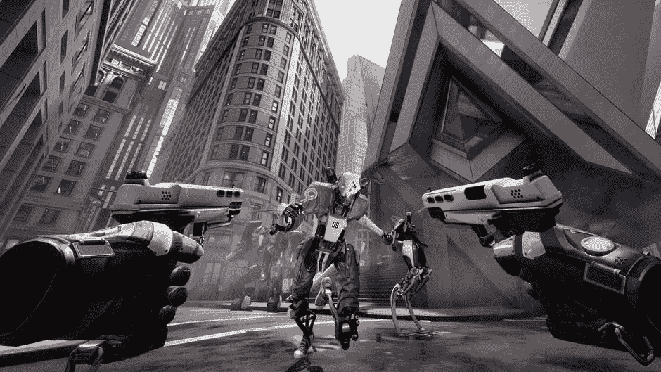
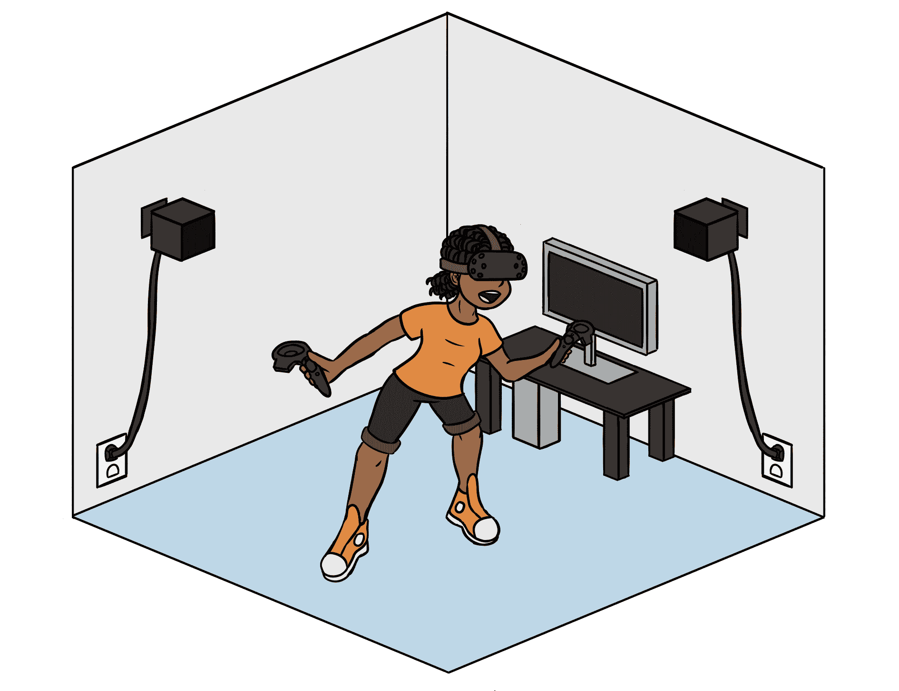
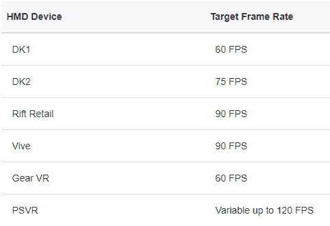

# 在虚幻引擎 4 中引入 VR 技术

**虚拟现实**（**VR**）。这些词让人联想到 20 世纪 80 年代和 90 年代的电影画面，例如《割草人》等角色，人们被绑在覆盖全身的设备上，以及占据整个房间的计算机，以及延伸到永远和基本几何形状，旨在模拟现实世界。VR 这个术语在 20 世纪 80 年代出现，指的是用于与这些计算机生成世界交互的手套和头盔系统。从那时起，电子和数字显示技术的进步使得可以制造出更小、更强大的设备。2010 年，帕尔默·卢克发现手机显示屏技术已经达到了足够的分辨率，可以用于 VR，这导致了第一个 Oculus Rift 头显的诞生。这一事件将引发一场技术军备竞赛，从而产生了 Oculus Rift、三星 Gear VR、HTC Vive 以及新的 Windows 混合现实头显。随着每年价格的下降，VR 已经进入了全球 1.71 亿用户的手中。

对于你们中的许多人来说，这本书代表了你们走向创建自己 VR 作品的第一个步骤。你们可能最近对开始使用这项技术产生了兴趣，或者你们可能已经有一个完整的设计，并且你们已经准备好开始开发。在两种情况下，这本书都将引导你们选择目标硬件和受众，独特的 VR 设计、移动和游戏玩法概念，为你的虚拟世界创建艺术作品，以及最后测试和准备你的游戏以便分发。通过创建我们的示例游戏*Server 17*，我们将讨论 VR 开发者面临的一些问题，例如优化以及如何帮助玩家应对 VR 不适。

本书假设读者对虚幻引擎 4 有实际了解，并且能够访问 VR 设备。如果您刚开始接触虚幻引擎 4，我建议您先查看我的其他作品，例如《使用虚幻引擎 4 和 Blender 进行 3D 游戏设计》，或者 Packt 出版公司出版的其他优秀的游戏开发书籍，然后再回到这本书。

在本章中，我们将涵盖以下主题：

+   为什么使用虚幻引擎 4 进行 VR 开发？

+   开发者可以获取哪些类型的 VR 技术？

+   流行 VR 头显的优缺点

+   VR 的限制

+   介绍我们的示例项目—*Server 17*

# 为什么使用虚幻引擎 4 进行 VR 开发？

VR 代表了游戏开发者面临的新伟大前沿。就像移动技术允许开发者进入新市场并将电子游戏带入主流一样，VR 游戏也将能够挖掘新市场并吸引那些寻求更积极游戏风格的新的粉丝。为了适应这一点，游戏引擎开发者一直在迅速工作，添加新功能并改进现有功能，以吸引开发者选择他们的平台来发布他们的下一个大型游戏：

Robo Recall 是第一个使用虚幻引擎 4 开发的引人注目的游戏之一。图片由 Epic Games 提供

从 2014 年开始，Epic Games 开始在 Unreal 中为全 VR 支持打下基础。这导致了他们第一个 VR 游戏 *Robo Recall* 的开发。在这款游戏中，玩家能够射击并摧毁被杀人机器占领的城市。游戏使用了传送系统进行移动，并为基于枪械的游戏提供了相当扎实的控制。游戏于 2016 年开始开发，并于 2017 年发布在 Oculus Rift 上。它充分利用了当时 Unreal 的最新构建，展示了最新的渲染技术和 VR 优化的优化。

从那时起，Epic Games 一直更新和发展虚幻引擎 4，为游戏开发者提供他们项目可用最佳工具。虚幻引擎版本 4.17、4.18 和 4.19 包含了许多针对 VR 头戴设备和 VR 开发者的优化和性能更新，目标是提高性能和帧率，这两者是 VR 游戏开发中最关键的监控元素之一。

除了为开发者提供他们 VR 游戏的最佳工具的承诺之外，Epic Games 还为开发者提供了许多选择虚幻引擎作为他们游戏引擎的其他原因：

+   虚幻引擎免费使用，每个季度每款游戏的前 3,000 美元只需支付 5% 的版税。这些条款允许小型开发团队直接进入项目，无需担心如何支付他们的工具费用。

+   虚幻引擎支持大多数 VR 设备，包括三星 Gear VR、Oculus Rift + Touch、HTC Vive 等。

+   蓝图可视化脚本语言允许非编码人员在不需要程序员的情况下开发游戏功能和原型。

+   虚幻引擎能够实现高端材质和着色器，从而为您的玩家提供极其沉浸式的体验。

我们将在我们的示例项目中使用最新版本的虚幻引擎。在撰写本书时，这个版本是 4.20.2。在您游戏开发的过程中，可能会有新版本的引擎变得可用。是否更新您的项目到最新版本取决于您。通过查看每个新版本提供的发布说明，看看新功能是否会对您的游戏有益来做出这个决定。

# 开发者可以获取哪些类型的 VR 技术？

了解 Unreal Engine 4 与绝大多数 VR 技术兼容后，我们的下一步是选择我们希望使用的 VR 头显类型。有许多因素可以影响这一决定。首先，我们需要知道我们的体验的目标受众是谁。从研究与我们设计类似的前期游戏开始。通过这样做，我们可以找出哪些游戏玩家群体会购买我们这种风格的游戏，并看看我们是否能采访一些符合这一人口统计的玩家。有了这些信息，我们可以在开发过程中做出明智的设计决策，这将导致一款真正吸引其玩家群体的游戏。

了解你的玩家群体的人口统计信息以及他们的喜好和厌恶是设计一款商业上成功的视频游戏的关键部分。这同时也是以人为中心的设计过程的第一步，这是一种以问题解决为中心的创造性方法，始终将用户的需要和愿望作为设计决策的核心。了解更多信息，请查看[`www.ideo.com/`](https://www.ideo.com/)和[dschool.stanford.edu](https://dschool.stanford.edu/)。

我们需要关注的下一个因素是我们设计最适合哪种类型的体验。VR 体验可以分为几个不同的类别：

+   房间规模 VR

+   坐式 VR

+   移动 VR

# 房间规模 VR

第一类是房间规模体验。

这些是需要玩家在预定区域内移动、跳跃和执行动作的活跃体验。以下是一个由 HTC Vive 附带的光塔传感器覆盖的房间规模游戏空间示例：

房间规模 VR

# 坐式 VR

对于可能不需要那么高水平活动的体验，有坐式 VR 体验。以下是一个坐式或仅站立式 VR 体验所需空间的示例：

坐式 VR 体验

坐式体验是基于玩家保持静止，并且只需要头显的方向数据这一理念。

# 移动 VR

最后，还有移动体验。这些体验专门为移动设备格式化，例如三星 Gear VR 和 Oculus Go。原始版本可以在以下[链接：https://commons.wikimedia.org/wiki/File:Samsung_Gear_VR_Experience_(16241072054).jpg](https://commons.wikimedia.org/wiki/File:Samsung_Gear_VR_Experience_(16241072054).jpg)找到。

移动体验

移动体验旨在利用智能手机中的加速度计和陀螺仪来提供沉浸式体验和控制游戏玩法。对于我们的游戏，我们可能会让玩家站在一个狭小的区域内，他们的工具就在手边，尽管可能需要一些移动。考虑到这一点，我们将设计*服务器 17*作为一个房间规模体验。

# 流行 VR 头盔的优缺点

现在我们知道了我们的玩家是谁以及我们希望他们有什么样的体验，我们可以做出决定，选择我们想要用于设计体验的 VR 头盔。每种类型的 VR 头盔都会给我们的项目带来不同的优势和劣势，以及运行它的计算机的具体要求。让我们来看看目前市场上一些最受欢迎的 VR 头盔：

+   HTC Vive

+   Oculus Rift + Touch

+   Windows 混合现实头戴式设备

+   Samsung Gear VR

# HTC Vive

2016 年 4 月发布的 HTC Vive 系统包括以下内容：

+   VR 头盔

+   2 x Vive 运动控制器

+   2 x 红外传感器，称为灯塔

由于其 16 英尺 x 16 英尺的最大游戏区域，Vive 非常适合房间规模体验，它是目前最受欢迎的两个 VR 系统之一，在 2018 年 2 月占所有 SteamVR 玩家的 45%。它能够达到 2,160 x 1,200（每只眼睛 1,080 x 1,200）的分辨率，这是许多开发者的首选头盔。运动控制器可以追踪到毫米级别，每个控制器都提供九个不同的按钮，可以在 Unreal Engine 4 中进行映射，这为开发者提供了大量的输入选项。音频由玩家插入自己的耳机提供，尽管可以购买单独的 Deluxe Audio Strap 以提供更舒适的重量分布和集成耳机。

# 最小硬件要求

+   Intel Core i5-4590/AMD FX 8350 或更高

+   Nvidia GeForce GTX 970/AMD Radeon R9 290 或更高

+   4 GB 的 RAM

+   HDMI 1.4、DisplayPort 1.2 或更新版本

+   1x USB 2.0 或更新版本

+   Windows 7 SP1、Windows 8.1 或更高版本、Windows 10

值得注意的是，虽然 HTC Vive 与 Unreal Engine 4 兼容，但在使用时需要运行 SteamVR。凭借其出色的追踪、稳定的分辨率和灵活的运动控制器，HTC Vive 是房间规模和坐姿 VR 体验的绝佳选择。

# Oculus Rift + Touch

原版的 Oculus Rift 头戴式设备于 2016 年 3 月由 Oculus VR 发布，在成功的 Kickstarter 活动之后。由于其作为众筹项目的地位，Oculus Rift 有一个有趣的区别，那就是其开发过程得到了广泛的宣传。公司在开发期间向其支持者发布了两个不同的开发套件（DK1 和 DK2），然后在发布第一个商业版本。当前的头盔版本包括以下内容：

+   Oculus Rift 头戴式设备

+   2 x 基于桌面的红外传感器

+   2 x Oculus Touch 控制器

这些控制器有六个不同的按钮输入，由 Unreal 追踪，但它们真正的成名之处在于这些控制器能够进行手指追踪和手势。Rift 的分辨率为 2,160 x 1,200（每只眼睛 1,080 x 1,200），与 HTC Vive 完全相同。

# 最小硬件要求

+   Intel i3-6100/AMD Ryzen 3 1200、FX4350 或更高

+   Nvidia GTX 960/AMD Radeon RX 470 或更高

+   8 GB+的 RAM

+   兼容 HDMI 1.3

+   1 个 USB 3.0 端口和 2 个 USB 2.0 端口

+   Windows 10

与 HTC Vive 类似，Oculus Rift + Touch 需要在后台运行自己的应用程序才能操作。尽管 Rift 配备了两个传感器，但其推荐的房间规模游戏区域为 5 英尺 x 5 英尺。虽然比 Vive 小得多，但鉴于 Rift 降低的硬件要求，它仍然是坐着和房间规模体验的绝佳选择。

# Windows 混合现实头戴式设备

以令人印象深刻的分辨率 2,880 x 1,440（每只眼睛 1,440 x 1,440），目前由 Acer、Lenovo、HP 等公司制造的最新一批 Windows 混合现实头戴式设备，有可能真正颠覆 VR 领域。这些头戴式设备集成了动作追踪，以减少设置时间并可能增加游戏玩家可用的房间规模游戏空间。与 Vive 和 Oculus 相比，它们的低价位也是一个吸引人的特点。然而，即使现在，它们仍然是一项新技术，尚未得到验证。集成的动作追踪可能看起来像是一个节省时间的功能，但这要求玩家看向他们想要与之交互的任何东西以获得流畅的交互。对于试图开发下一个大型 VR 大片的开发者来说，这是一个不能忽视的问题，因为玩家体验是一切。最终，Windows 混合现实硬件为 VR 硬件市场带来了急需的多样性，但它可能还太新，不能作为开发平台的选择。

# 最小硬件要求

+   英特尔 Core i5-7200U 或更高

+   英特尔 HD 图形 620 或更高/DX12 兼容 GPU

+   HDMI 1.4 或 DisplayPort 1.2

+   1 个 USB 3.0 Type-A 或 Type-C

+   Windows 10 秋季创造者更新

# 三星 Gear VR

Gear VR 代表了智能手机和 VR 技术的融合，在一个时尚的小包装中。这款设备的最新版本允许用户将三星 Gear 手机插入一个时尚的框架中，并享受专为该设备构建的各种 VR 游戏。控制由头戴式设备侧面的输入以及手持动作控制器处理，这些控制器让人联想到与 Vive 一起发货的控制器。这为玩家提供了各种舒适的输入选项和精确的控制器动作。那么，这对开发者意味着什么呢？移动 CPU 和 4 GB 的 RAM 限制了该设备运行高端内容的能力，但 Gear VR 拥有令人印象深刻的分辨率 2,560 x 1,440（使用三星 Gear S8 和 S8 Plus 手机时为 2,960 x 1,440）。Gear VR 还代表了一个未得到充分服务的市场。尽管其硬件可能很小，但 Unreal Engine 4 自 4.7 版本以来就支持三星 Gear VR 的开发，并且这款设备是开发移动体验中最好的之一。对于想要构建小型应用的精明开发者来说，这可能是一个绝佳的机会。

# VR 的局限性

虽然 VR 能够为玩家提供沉浸式、直观的数字体验，但重要的是要注意，它并非没有局限性。除了 VR 所要求的所有 RAM、处理能力、传感器、线缆和控制器之外，这项技术还向我们展示了一些我们自己的局限性——其中最著名的就是 VR 不适或视觉所展示的内容与我们的其他感官所感知的内容之间的脱节。VR 不适，或称为模拟不适，通常在 VR 游戏中的移动时最为常见，它可能会导致以下任何一种情况：

+   恶心

+   晕眩

+   方向感丧失

+   出汗

+   各种其他不适

所有这些我们都不希望成为任何玩家体验的一部分。这些可能是由游戏中的某些特性引起的，我们在非虚拟环境中有时会视其为理所当然，例如从玩家手中接管控制以展示一个剪辑场景，使用摄像机抖动、摄像机震动或覆盖玩家的视野。问题也可能是由帧率过低引起的。因此，作为开发者，我们必须始终关注我们游戏在我们选择的平台上的性能。在下面的屏幕截图中，我们有 Unreal Engine 4 支持的几个 VR 头戴式设备的推荐帧率：

Unreal Engine 4 的 VR 推荐帧率，由 Epic Games 提供

选择一种提供玩家持续稳定加速感的移动和转向方法，这是实现这一目标的一种方式。从 VR 技术发展中涌现出的一些已建立的移动方法包括基于驾驶舱的、自然的、人工的、物理的和瞬移。我们将在第二章“移动、设计和启动我们的项目”中了解更多关于这些移动方法以及它们如何适合我们的游戏。其他控制 VR 不适的方法包括避免改变玩家视力的电影式摄像机效果，如运动模糊和使用较暗的照明。明亮的颜色和模糊效果会导致玩家因眼睛疲劳而感到恶心。最后，值得注意的是，医学科学尚未彻底研究 VR 长期使用的效果，以及儿童定期使用该设备可能引发的问题。作为设计师，玩家的体验始终应该放在我们心中的首位，让玩家保持身体舒适是我们让他们回归游戏的最重要方式之一。

# 介绍我们的示例项目——服务器 17

为了帮助框架我们的 VR 开发探索，我们将开发一个我喜欢的游戏，称为*服务器 17*。设计为一个面向喜欢 VR 和基于技能的游戏玩家的房间规模体验，*服务器 17*将玩家置于一个腐败政府和巨型企业的反乌托邦未来的赛博朋克黑客的鞋子里。玩家将不得不解锁一个企业服务器的秘密，在游戏中将代表为一个谜题盒。他们将有访问各种工具和程序的权利，这将使他们能够在网络安全抓住他们之前成功完成任务并击败他们。

对于这个项目，我选择使用虚幻引擎 4 和 HTC Vive。Vive 为我们的玩家提供了一个宽敞的房间空间体验，对头戴设备和手部控制器的跟踪都非常出色。它还减少了计算机上的 USB 端口使用。这是一个很好的功能，因为我正在使用一个端口有限的顶级笔记本电脑进行开发。尽管它没有 Oculus Rift + Touch 可能找到的手指跟踪功能，但它是一块出色的硬件，将满足这个项目的需求。

# 摘要

在我们踏上成为 VR 开发者的道路的第一步时，我们审视了在开始开发我们的第一个 VR 游戏之前我们必须做出的决定。我们还审视了选择虚幻引擎 4 的几个令人信服的理由，例如对 VR 的持续支持、免费访问、蓝图视觉脚本和强大的着色器工具。然后我们讨论了目前存在的不同类型的 VR 体验以及哪种硬件最适合每一种类型。最后，我们讨论了 VR 不适感和如何最好地避免这种令人衰弱的状况。

随着我们进入第二章，*运动、设计和启动我们的项目*，我们将就如何最好地设计我们的样本游戏，*服务器 17*，做出一些决定，并创建必要的设置文件以开始开发进程。为了确保我们所有人都理解每个蓝图文件是如何相互作用的，我将尽可能从零开始创建内容，仅在需要时使用模板和预制文件。欢迎来到这场冒险——让我们继续前进！
