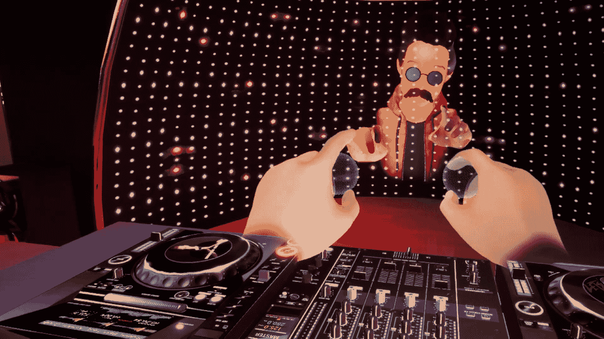
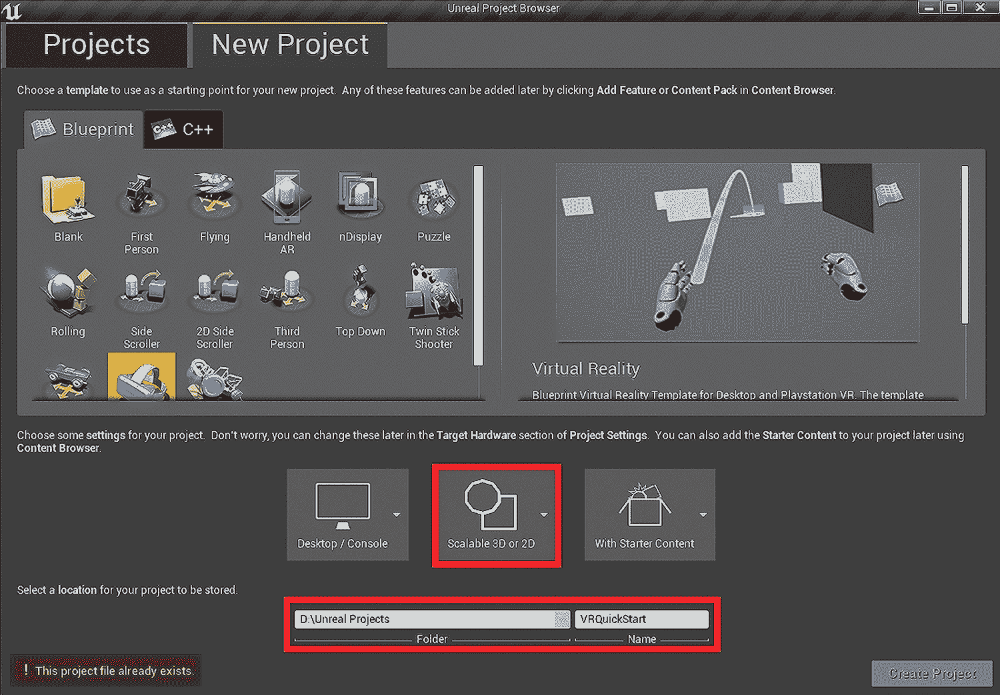
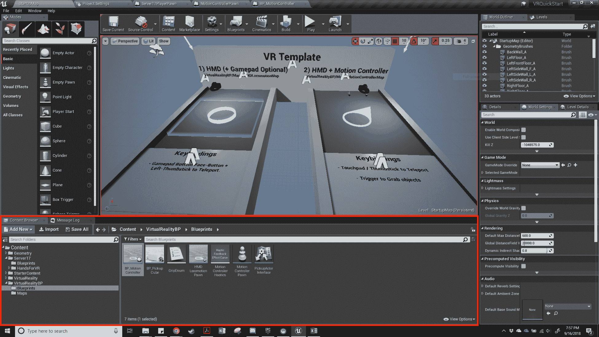
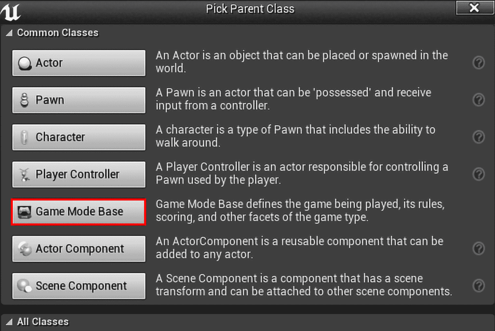
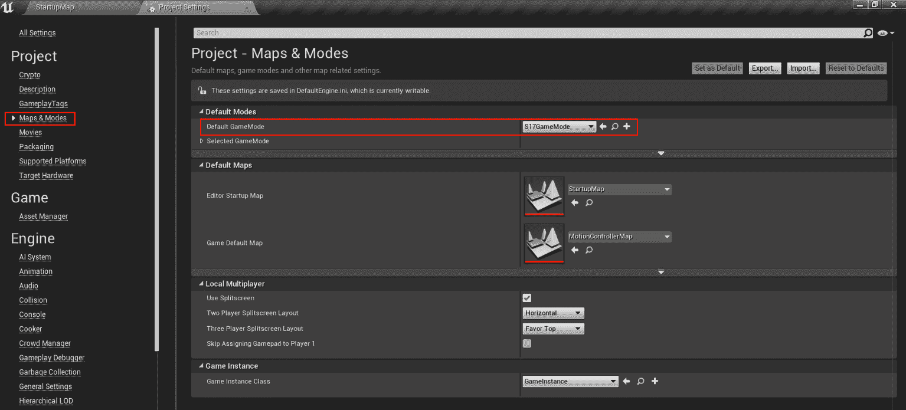
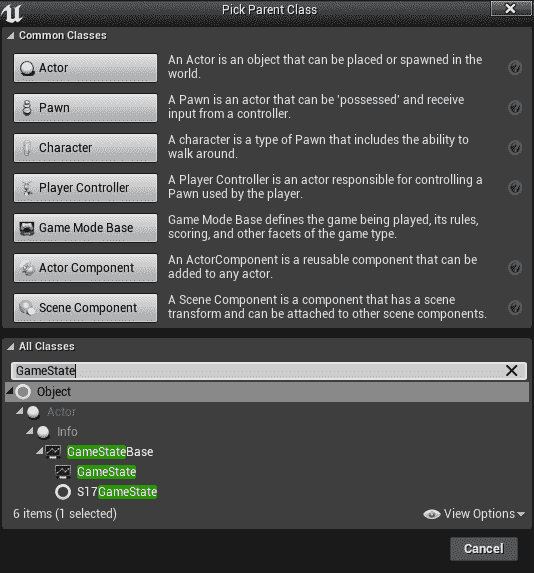
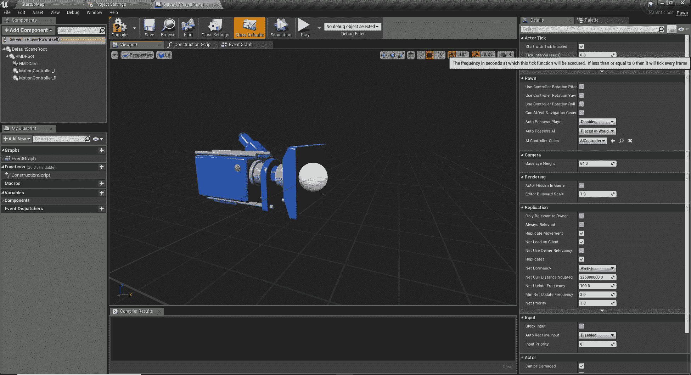
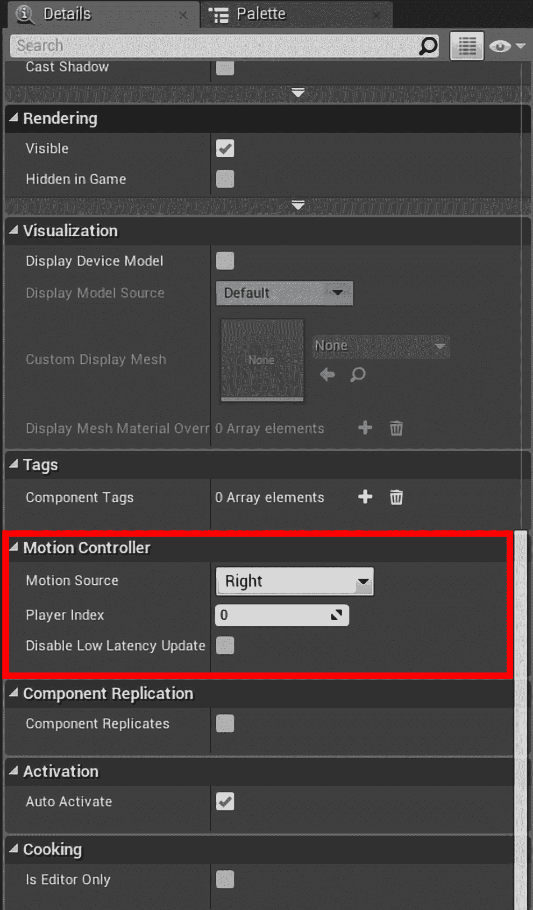
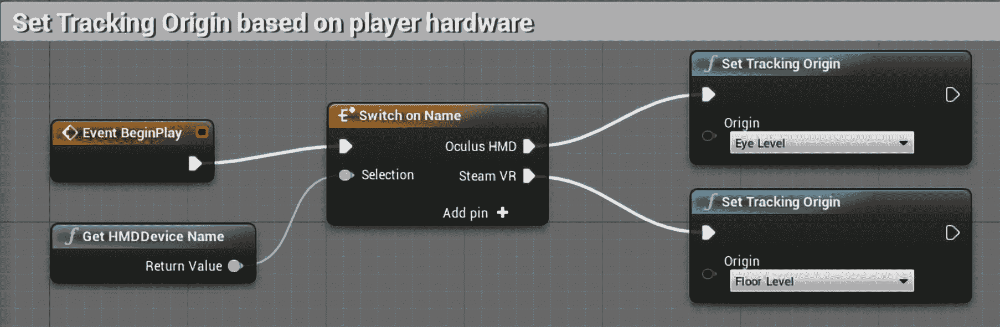

# 移动、设计和启动我们的项目

基于我们对当前 VR 技术和游戏开发的了解，我们现在可以开始着手我们的第一个项目。正如我们在第一章，“在虚幻引擎 4 中引入 VR 技术”，*Server 17*让玩家扮演一位勇敢的黑客，在一个腐败的反乌托邦未来中寻找真相。每个人都有秘密，有些人愿意支付大笔金钱来换取他人的秘密。从设计角度来看，这意味着我们将创造一个解谜游戏，玩家需要解决谜题并使用不同的工具打开代表网络中计算机服务器的不同谜盒。通过构建这个简单的游戏，我们将涵盖 VR 游戏设计的所有步骤，目标是为你提供工具和知识，以便开始你自己的项目。这个过程的第一步是设计，为此，我总是转向以人为中心的设计过程。

在本章中，我们将涵盖以下主题：

+   以人为中心的设计过程

+   选择我们的移动方式

+   在虚幻引擎 4 中设置新的游戏文件

+   项目设置

# 以人为中心的设计过程

**以人为中心的设计**（**HCD**）过程是一套灵活的设计原则，允许设计几乎任何东西，从鞋子到汽车，再到软件。HCD 的核心原则是设计师在每一步都考虑最终用户。这个决定是否会让我用户的产品变得更好？让颜色可定制是否会让我用户感到高兴，并使他们更有可能使用我的产品？通过提出这些问题并考虑你的用户，你能够创造出一个更有可能在其目标受众中取得成功的设计。

以人为中心的设计过程有以下步骤：

以人为中心的设计过程

1.  **发现**：在这个阶段，我们研究我们面临的问题和感兴趣的目标受众。我们搜索看看是否有人尝试过解决这个问题，如果是的话，他们尝试了什么。我们联系潜在用户，找到愿意与我们交谈的人，以便发现他们从解决方案中需要什么。

1.  **同理心**：在这里，我们尽可能多地与潜在用户交谈，以收集他们在解决方案中寻找的东西。我们想要深入挖掘。为什么他们想要或需要这个？是否有任何与记忆或情感的关联？例如，怀旧是对与一个人青年时期相关的经历的强烈渴望。它也是游戏开发者喜欢触及的最强烈的情感之一。

1.  **创意**：一旦我们知道用户想要什么，就是时候进行头脑风暴了！当我们进行创意时，我们希望尽可能多地提出想法。没有哪个想法太离谱或疯狂（只要它有利于我们的用户）。

1.  **原型**：一旦我们确定了一个想法，我们希望快速简单地构建一个版本，让我们的用户尝试。这里没有复杂的编程或惊人的艺术——我们希望快速且低成本地创建一个可玩的游戏版本。

1.  **测试**：将原型放在用户面前并记录结果！通常在这个时候，产品可能会失败。这可能是由于设计问题或用户不理解或不喜欢的某些内容。记录数据并从中学习！

1.  **精炼**：手头有了用户测试数据后，我们回到构思阶段并再次尝试。在你完成游戏之前，你可能需要经历几次这样的循环，但如果你定期与用户沟通并从其他设计师和朋友们那里获得反馈，你肯定能想出下一个杀手级应用。

对于*服务器 17*，我们理想的用户是那些从未体验过 VR 的人。他们感兴趣的是简单但非常沉浸式的体验，能够利用 VR 的独特能力。他们可能是《银翼杀手》和《银翼杀手：遗产》以及《Shadowrun》游戏系列的粉丝。当他们回想起第一次使用新游戏硬件的经历时，怀旧感也可能发挥作用。你可能有很多符合这一特征的朋友，你可以在设计游戏时作为参考，我们还可以利用在线社区来收集更多的意见。一旦我们通过一些研究和与用户的访谈完成了**发现**和**同理心**步骤，我们现在就可以就移动方式或玩家在游戏世界中移动的过程做出一些设计决策。

# 选择我们的移动方法

作为 VR 设计师，我们的一个目标是通过利用这项新技术的独特优势来创造玩家想要反复体验的新颖体验。这项技术非常适合让玩家感觉他们正在与一个充满生机和活力的幻想世界互动，否则他们无法居住其中。使用手柄控制器，我们的玩家可以触摸我们的世界并与它进行非常直观的互动。然而，移动系统还没有达到这种沉浸感的水平。

在 VR 中，玩家的移动动作还处于初级阶段，因此还没有找到一种能够有效工作的方法。已经尝试了许多方法。有车辆模拟游戏，玩家保持在驾驶舱内。还有动作/冒险游戏，玩家通过使用摇杆或传送等人工方法在景观中奔跑。其他人则试图通过让玩家站在一个狭小区域内，所有必需品都触手可及，来保持沉浸感，虽然这样牺牲了广阔的环境，但允许玩家自然地移动。每种移动方法都是给予玩家沉浸感和自然感觉与避免不愉快感觉（如 VR 不适感）之间的权衡。

在我担任大学教授期间，我有机会帮助我的学生为当地博物馆设计一个皮划艇模拟器。学生们设计了一个运动系统，允许玩家保持坐姿，并使用带有传感器的桨来操纵他们的虚拟船只在河流急流中前进。尽管这个系统在与他们的同伴测试时表现良好（感觉自然且对我而言效果良好），但我们发现它对博物馆的几位用户产生了深远的不利影响。其中一位测试者甚至在测试我们的游戏后不得不离开工作。在询问测试者一些问题后，我们发现，尽管我们的控制器上的桨运动感觉正确，但水中船只的真实物理特性使得他们无法玩游戏。进一步询问测试组显示，这位测试者并不是唯一遇到问题的玩家。最后，他们不得不在水的运动上采取一些艺术上的自由，以创造一个更愉快的体验，并了解到我们的用户体验和乐趣比现实主义更重要。

虽然这种缺乏最佳实践可能会让一些人感到担忧，但我们内心的设计师应该将其视为一个令人兴奋的机会，去创新并创造新的系统，为我们的玩家提供最佳的游戏体验。这些系统可以分解为四个主要类别：

+   自然

+   人工

+   驾驶舱

+   物理（创意）

# 自然运动

不要与同名应用程序混淆，自然运动是指一种在 VR 中移动的方法，通过将自然玩家动作（如挥动手臂和跳跃）带入游戏世界来最小化 VR 不适。我们可以在游戏 *Tribe XR* 中看到自然运动的工作方式如下：

Tribe XR 是一个新兴的 DJ 应用程序，可以通过游戏中的课程教你如何混音音乐

这涵盖了各种方法，但所有方法似乎都为玩家提供了将他们的动作直接转换为游戏中的玩家动作的直接翻译。尽管这种方法已被证明可以限制玩家的不适，但它并非没有缺点。这种方法限制了玩家只能在他们系统传感器的覆盖范围内移动，并要求设计师考虑到这一点进行设计。这可能意味着专门设计关卡以适应平均游戏空间大小，并确保玩家所需的一切都在可触及范围内。这种方法已在诸如 *Job Simulator*、*Tribe VR* 和 *Waltz of the Wizard* 等游戏中使用。

# 人工运动

人工运动基本上是自然运动的相反。这种技术依赖于更传统的游戏控制方式，如摇杆、触摸板和其他输入方法，以在游戏关卡中移动玩家。

尽管在将传统游戏移植到 VR 时（想想*Skyrim VR*和*Fallout 4 VR*）这是最好的移动方式，但由于视觉上的困扰，即我们的眼睛所看到的与我们的其他感官所经历之间的脱节，人工移动方式最有可能导致 VR 不适感。我们可以使用几种技术来最小化这种困扰。一种方法是在玩家移动时动态地减小他们的视野。这产生了一种非常微妙的效果，当玩家移动或转向时，它会隐藏玩家的一些周边视野。另一种方法是让玩家在移动过程中以恒定的速率加速。恒定的加速度对前庭系统——我们大脑中感知加速度的部分——的压力更小。同样的原理也可以应用于旋转。一致的缓慢转向或突然转向对玩家来说可能感觉更好。我想提到的最后一项技术是传送。传送是一种允许玩家在没有 VR 不适感的情况下导航大型环境的好方法。然而，这种方法根据游戏的故事和背景可能并不感觉自然。

# 驾驶舱移动

与自然移动相似，驾驶舱移动允许游戏如太空模拟、赛车和其他让玩家坐在车辆中的游戏进行非常自然的移动。

通过欺骗身体，使其认为移动类似于乘坐汽车，我们可以绕过许多 VR 不适感的成因。这种方法的一个缺点是它不适用于大多数情况。成功使用这种方法的游戏包括《危险精英》（*Elite: Dangerous*）、《星际迷航舰桥船员》（*Star Trek Bridge Crew*）和《天使：地狱之火》（*Archangel: Hellfire*）。

# 物理移动

物理移动系统指的是为特定游戏体验设计的独特移动控制方案。正因为如此，它们往往是我们在今天的 VR 空间中看到的最具创新性的想法之一。

这种类型的移动涵盖了专门设计的移动方法，例如我的学生建造的皮划艇划桨系统，以及手对手攀爬、在挥动控制器的同时原地跑步、游泳动作和通过移动玩家的手臂进行飞行。由于玩家在进行特定的手臂或身体动作，他们在体验时往往感觉沉浸感非常高，同时 VR 不适感非常少。这些系统并非没有缺点。一些玩家可能会觉得这种移动很愚蠢或很花哨。它们通常也不能在它们特定的游戏之外使用。成功实施这种移动方式的游戏包括《攀爬》（*The Climb*）、《鹰之飞行》（*Eagle Flight*）和《巫师之舞》（*Waltz of the Wizard*）中的施法机制。

考虑到我们对用户（新手 VR 用户，寻求沉浸和直观体验，以及赛博朋克爱好者）的了解，在这里哪种或哪些类型的移动方式会是最合适的呢？对于新手用户来说，自然移动似乎会是最有效的，因为它通常直观且有助于保持沉浸感。因此，我们不会将我们的关卡设计限制在玩家定义的游戏空间内，我们还可以选择将传送功能整合到我们的控制方案中。尽管传送的缺点是不够沉浸，但我认为我们游戏的赛博空间设置实际上会支持玩家在关卡内进行传送。

在做出这些设计决策后，是时候启动**虚幻引擎 4**（**UE4**）并设置我们的项目文件了！

# 在 UE4 中设置新的游戏文件

UE4 是一个多功能的工具集合，帮助你创建你梦想中的游戏。为了让你开始这一旅程，Epic Games 提供了一系列启动项目，通过为你设置一些最重要的功能来快速启动你的游戏。这通常包括玩家角色、示例武器和其他必要的文件。在这本书中，我们将从 Virtual Reality Starter 项目开始创建文件，以便我们可以利用该项目提供的一些基本艺术资产。除此之外，我将向你展示如何从头开始创建我们需要的蓝图。

每个游戏或软件项目都需要保持组织性，我们使用**命名约定**来做到这一点。命名约定是一种命名方案和文件夹结构，确保每个文件名都是标准化的，以便任何特定的游戏团队成员都能通过文件名确切地了解他们正在查看的内容。你可能注意到了在浏览 UE4 内部的一些项目文件时。Epic Games 在其 Unreal Wiki 上提供了其命名约定[`wiki.unrealengine.com/Assets_Naming_Convention`](https://wiki.unrealengine.com/Assets_Naming_Convention)，并且我们将在这本书中一直使用它。

在 Unreal 中，任何新的游戏都需要创建某些蓝图来定制项目以满足我们的需求。这些文件包括以下内容：

+   `GameMode`

+   `GameState`

+   `PlayerPawn`

但所有这些文件是如何相互作用的，为什么我们需要它们呢？当 UE4 启动游戏时，引擎会创建两个文件来帮助它在加载和设置关卡或玩家之前理解游戏规则。这些是`GameMode`和`GameState`。`GameMode`包含使我们的游戏独特的规则，例如玩家的总数以及这些玩家如何连接到游戏，以及默认设置，例如默认玩家 pawn、玩家控制器和游戏状态。通过创建我们自己的游戏模式，我们迈出了定制项目的第一步。游戏开始后加载的`GameState`文件旨在跟踪对我们游戏重要的所有内容，例如得分、完成的任务以及其他与整个游戏相关的元素。这不是针对特定玩家的东西，因为有一个不同的玩家状态。我经常用它来存储需要构建生成式游戏关卡所需的数据。最后，我们还需要一个定制的`PlayerPawn`。`PlayerPawn`是玩家在游戏中的物理表示，并在游戏过程中被我们的玩家控制。

# 项目设置

在我们开始创建自定义项目文件之前，我们需要让 Unreal 创建我们的项目基础并开始布局我们的文件夹结构。这将保持我们在构建*Server 17*时的文件组织。

首先打开 Unreal Engine 4.20.2 并开始一个新项目：

你第一次打开 UE4 时看到的屏幕

欢迎来到新项目窗口。从这里，我们将根据 UR 模板创建我们的项目：

1.  从屏幕顶部选择新的项目标签。

1.  选择蓝图部分。

1.  在列表底部附近选择虚拟现实模板。

1.  将中间的项目设置更改为可伸缩 3D 或 2D。

1.  确保项目文件夹在一个容易找到的地方。将其名称更改为`VRQuickStart`。

点击那个创建项目按钮，我们继续！现在看看界面：

与游戏引擎的大部分交互都在内容浏览器中进行

在我们的新项目打开后，四处看看界面并找到你的内容浏览器：

1.  是时候整理一下了。第一步之一是创建我们自己的项目文件夹，类似于 Epic Games 使用的`VirtualReality`和`VirtualRealityBP`文件夹。在内容浏览器内的`Content`文件夹上右键点击，然后从列表顶部选择新建文件夹。将新文件夹命名为`Server17`。

1.  点击我们的新文件夹以进入它。在内容浏览器中右键点击并选择新建文件夹。将其命名为`Blueprints`。这将是我们新蓝图的家。

随着我们继续开发，我们将向我们的文件结构添加几个更多文件夹，以帮助包含和组织我们的文件。记住，在继续进行时坚持我们的命名约定，因为这将在以后添加团队成员或休假后返回项目时提供巨大帮助。

# 创建我们的自定义游戏模式

在我们的项目基础和文件结构建立之后，让我们创建我们的第一个自定义文件：我们的`GameMode`文件。点击我们的新`Blueprints`文件夹，然后右键单击以显示菜单。从创建基本资产部分，选择蓝图类。这将显示选择父类菜单，如下面的截图所示：

从选择父类菜单中，我们可以创建一个扩展父文件功能的新文件

是时候扩展基本的`GameMode`类并告诉我们的项目使用我们的新文件了：

1.  从选择父类菜单中，我们可以扩展引擎提供的任何基本类。点击游戏模式基类按钮，并将新文件命名为`S17GameMode`。

1.  简单地创建`GameMode`对于引擎在项目中识别它来说是不够的。为了确保它被使用，点击视口的设置按钮并选择项目设置。

或者，我们也可以打开世界设置并导航到菜单中的游戏模式部分，然后点击 GameMode 覆盖旁边的*+*按钮。就像做数学或大多数创造性追求一样，在 Unreal 内部创建某物的方式不止一种。我分享的是我在职业生涯中学到的方法和过程。如果你发现不同的方式或更好的方式来做我在这本书中提到的任何事情，请随时与我以及 UE4 开发社区分享！

查看项目设置菜单：

项目设置

1.  在菜单的项目部分下，选择地图和模式。此菜单部分允许您指定当编辑器打开时打开的默认地图，以及定义默认`GameMode`。

1.  在菜单的默认模式部分，使用默认游戏模式下拉菜单并选择 S17GameMode。

将 S17GameMode 设置为默认设置后，我们现在可以开始创建其余的自定义项目文件。一旦我们放置好所有其他部分，我们将返回到项目设置屏幕并进一步更改默认设置。

# 创建一个 GameState

虽然`GameMode`非常适合设置我们的游戏特定规则和存储模式默认值，但`GameState`用于存储重要的全局元素。类似于我们创建`GameMode`类时，我们需要扩展`GameState`类作为自定义状态的基类。让我们回到选择父类菜单：

扩展 GameStateBase 以创建我们的自定义 GameState 类

然而，与我们的 `GameMode` 不同，我们将扩展 `GameStateBase` 类，或者所有 `GameState` 文件都从中扩展的类：

1.  在内容浏览器中右键点击，并从菜单的创建基本资产部分选择蓝图类。

1.  在选择父类菜单中，我们将跳过菜单顶部列出许多常见扩展类的部分，并选择所有类折叠菜单。

1.  这将显示我们可以在引擎中扩展的所有类。使用搜索框找到 GameStateBase 并选择它。然后，按菜单底部的选择按钮。

1.  我们将新游戏状态命名为 `S17GameState`。

在单人和多人游戏背景下，讨论 `GameMode`、`GameState` 和单个 `PlayerStates` 之间的交互。

# 创建自定义玩家实体

现在我们有了两个不同的文件来帮助我们管理将在我们的关卡中出现的信息和变量，是时候构建我们的 `PlayerPawn`，即我们玩家的物理表示。`PlayerPawn` 从头戴设备和手控制器接收信息，并将其转换为游戏中的移动和动作。根据我们选择如何表示玩家，我们可以选择几个不同的方向：

+   **第一人称格式**：玩家没有化身。手和头在空中飘浮。

+   **带有手臂的第一人称视角**：通过逆运动学，我们能够为玩家提供与手控制器位置移动的手臂。然而，头部仍然飘浮。

+   **带有全身的第一人称视角**：类似于带有手臂的设置，这允许玩家通过全身来表示，同时使用逆运动学来处理手和头部。

+   **第三人称视角**：一个完整的第三人称角色，玩家从设置在玩家模型上方和后面的摄像机向下看。这种选项已知会限制 VR 不适，但以牺牲沉浸感为代价。当与第一人称选项结合使用时，这种玩家设置在一些游戏中已被成功使用——例如：当玩家射击和执行动作时使用第一人称视角，而当玩家移动时使用第三人称视角。

对于 *Server 17*，玩家扮演一个试图破解服务器以寻找加密文件数据来窃取的网络黑客。设定在未来，玩家和服务器在玩家黑客硬件创建的虚拟环境中交互。因此，我们可以使用基本的第一个视角格式来表示玩家，而不会牺牲体验。这种方法也有助于保持我们的游戏优化。

虽然我们可以使用模板中提供的运动控制器实体，但让我们从头开始创建一个。首先，创建一个新的 `Pawn` 类供我们使用：

1.  在我们的 `Blueprints` 文件夹内的内容浏览器中右键点击，并从菜单的新基本资产部分选择蓝图类。

1.  我们希望为玩家创建一个新的 Pawn，以便玩家可以控制或接收控制器输入数据。从菜单中选择 Pawn，并将其命名为`S17PlayerPawn`。双击新 Pawn 以打开界面，如下所示：

打开的 Pawn 类及其组件显示

1.  首先，我们将向玩家添加一个场景组件，作为我们摄像机的根对象。在蓝图界面的左上角，在菜单的组件面板中，点击添加组件按钮并搜索场景组件。创建它并将其命名为`HMDRoot`。

1.  是时候将我们的玩家摄像头添加为我们的新场景对象的孩子了。选择`HMDRoot`后，返回到添加组件按钮，找到一个摄像头对象。创建它并将其命名为`HMDCam`。

1.  现在我们需要创建一种方法来跟踪玩家的运动控制器，以便玩家的角色手部能够适当地移动和行动。选择`HMDRoot`后，使用添加组件菜单创建一个运动控制器组件，并将其命名为`MotionController_L`。

1.  重复前面的步骤创建另一个运动控制器组件，并将其命名为`MotionController_R`。详细面板将如下所示：

运动控制器 _R 设置

1.  在选择`MotionController_R`组件后，查看详细面板并找到菜单中的运动控制器部分。将运动源选项更改为右侧。

# 编程我们的自定义 PlayerPawn

让我们继续进行一些编程，以确保我们的 PlayerPawn 被正确使用并设置以适应玩家的硬件。虚幻需要知道在哪里设置跟踪原点，或者在哪里设置玩家的默认高度，这可能会根据您的设备而有所不同。对于 HTC Vive，默认情况下是针对站立 VR 体验，通过将跟踪原点设置为地板来实现。另一方面，Oculus Rift 默认设置为针对坐着 VR 体验，并使用眼睛高度跟踪原点。虽然为 Vive 设置东西可能很简单，因为我们知道这是我们针对的平台，但我希望创建一些可能在这个项目之外可重用的东西。我们将在 PlayerPawn 的事件图中添加以下内容：

玩家 Pawn 事件图

要做到这一点，我们将检测玩家可能使用的硬件，并根据玩家的设备设置跟踪原点：

1.  在`S17PlayerPawn`的中心点击事件图标签，并将执行线从事件开始节点拖出。

1.  将其放下并选择按名称切换节点。按名称切换是一个流程控制节点，这意味着它限制了并通过蓝图来指导执行流程。此节点将指导蓝图根据找到的 HMD 硬件设置跟踪原点。

1.  从按名称切换节点上的选择输入拖出。使用搜索框查找获取 HMD 设备名称。此节点代表一个用于获取玩家 HMD 硬件名称的函数。

1.  在“开关名称”节点上，点击添加锚点按钮两次。在详细信息面板中，将锚点命名为 OculusHMD 和 SteamVR。同样在详细信息面板中，关闭“具有默认锚点”的选项。

1.  现在，让我们为我们的每个硬件选项设置标准。将 OculusHMD 锚点拖离，并搜索设置跟踪原点节点。选择它，并使用节点上的下拉框选择眼睛水平跟踪。

1.  将 SteamVR 锚点拖离，并创建另一个设置跟踪原点节点。这次，我们将它设置为地板水平跟踪。

1.  现在点击保存按钮，以免丢失你的工作。

在我们的跟踪原点设置好之后，我们现在可以回到我们的项目设置中，告诉 `S17GameMode` 使用我们的 `S17PlayerPawn` 作为默认玩家锚点。

# 摘要

在本章的开头，我们学习了针对特定类型用户设计的一种最佳方法：HCD 流程。在使用 HCD 时，我们总是希望在每个设计决策中都考虑到我们的玩家，确保我们创建的游戏满足我们玩家的每一个期望，并且玩起来令人愉悦。这是我们 *Server 17* 的目标。在我们的一些设计决策确定后，我们创建了我们的项目，并开始通过创建自定义的 `GameMode`、`GameState` 和 `PlayerPawn` 文件来自定义我们的文件。

在下一章中，我们将进一步完善 *Server 17* 的设计，并探讨在当今 VR 市场上流行的不同类型的游戏玩法。具体来说，我们将专注于利用 VR 提供的独特输入方法和沉浸式特性，以及我们如何将这些应用到我们自己的游戏中。最后，我们将决定我们的游戏将如何运作，并开始构建这些系统。很快，我们将有一个可以展示给玩家的工作原型！
