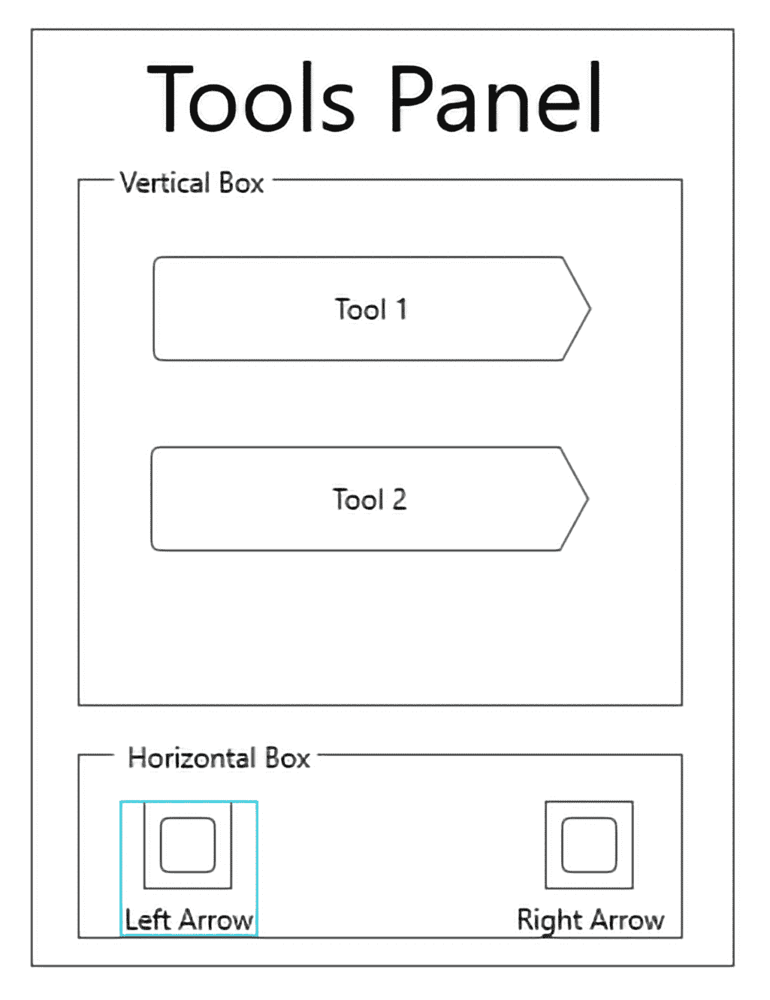

# VR 内的用户界面和用户体验

考虑我们的用户，并从他们的角度构建我们的游戏系统，这只是确保我们的游戏成为最广泛玩家群体享受体验的整体过程中的一小部分。**以人为中心的设计**（**HCD**）是更大设计过程，即**用户体验**（**UX**）设计的第一步。当我们思考整个用户体验时，我们实际上不仅关注使用我们游戏的人，还关注我们如何改进他们使用游戏的方式。通过 UX 的视角思考，我们希望构建一个满足所有玩家需求、易于使用且玩家不愿放下的游戏。

在本章中，我们将涵盖以下主题：

+   什么是 UX 设计？

+   UX 的七个方面

+   VR 中的用户界面

+   为*Server 17*设计 UI

# 什么是 UX 设计？

尽管近年来其使用变得更加普遍，但 UX 设计这个术语并不是一个新词。它是由 Don Norman 在苹果公司工作时提出的，是一个涵盖人们与机器互动的许多方式的通用术语。它还指从用户的角度看问题的想法。在游戏行业中，UX 通常与用户界面设计紧密相连，因为玩家通常只通过界面与软件互动。然而，虚拟现实的发展及其为玩家提供大量选择如何与游戏世界互动的能力，导致公司重新思考他们对这个领域的看法。当玩家可以无需传统 UI 与游戏世界互动时，你如何看待游戏中的用户体验？这正是 UX 设计师真正发挥其作用的地方。

UX 设计师是一个负责产品外观、感觉和可用性的设计师。然而，即使这个定义也有不足之处，因为直到最近，游戏中的 UX 设计基本上意味着专注于用户界面。在虚拟现实开发中，UX 设计涵盖了更多主题，如故事体验、控制方案、玩家安全、可访问性等。UX 设计师应该关注游戏的七个不同方面。游戏需要具备以下特点：

+   **有用性**：游戏是否为用户提供他们所寻找的体验？如果一个游戏或产品对某人没有用处，就没有理由将其推向市场。在 UX 设计中，我们使用 HCD 的发现和同理心阶段来发现我们正在设计的内容对我们用户的有用性。

+   **可用性**：用户在使用产品时能否实现他们的目标？如果一个游戏难以玩或理解，它就不会成功。有许多因素会影响视频游戏的可用性，例如控制、角色动画、难度等。

+   **可访问性**：可访问性一直是用户体验设计的重要组成部分。不同能力水平的用户都应能够玩你的游戏，你提供的服务应让任何人都能访问。当我们坐下来为可访问性设计时，我们经常发现我们为每个人改善了体验。一些组织已经发布了开发者资源，以帮助将更多可访问的游戏推向市场，例如[`accessible.games/`](https://accessible.games/)和[`gameaccessibilityguidelines.com/`](http://gameaccessibilityguidelines.com/)。

+   **吸引力**：吸引力指的是游戏或系列产品的市场营销、品牌和美学。当我们为吸引力设计时，我们希望创造一个玩家想要的图像或情感依恋。目标是创造一个玩家会吹嘘的游戏体验，并在他们的朋友中产生对该游戏的渴望。

+   **可发现性**：可发现性指的是游戏找到和购买有多容易，但也指的是在游戏中找到体验有多容易。想象一下，一个玩家购买了最新的竞技场射击游戏。他们很兴奋地想和朋友们一起玩，所以他们加载了游戏，但似乎找不到播放按钮或自定义控制选项。他们搜索了无数菜单，允许他们创建角色和调整音效，但就是无法达到可以和朋友们一起玩的地步。最后，他们只是放弃了，扔掉了控制器。作为开发者，我们最不希望的就是浪费玩家的时间并让他们感到沮丧。这就是为什么可发现性如此重要的原因。

+   **宝贵**：玩家通常会根据在线能力、游戏时长、宣布的功能和难度等因素来寻找价值。玩家在游戏中看到的价值越多，他们购买的可能性就越大。因此，我们设计师的主要目标是让玩家看到我们游戏的价值，并购买它们，这样我们才能继续设计和创造更多体验。

+   **可信度**：这是玩家信任开发者能够交付他们承诺的体验和功能的能力。可信度是游戏行业的重要商品，近年来我们看到了出版商/开发者将其视为理所当然。我们的游戏只有一次机会给玩家留下良好的第一印象，而大多数玩家永远不会给产品第二次机会。这对依赖声誉和口碑来销售游戏的独立小型开发者来说尤为重要。

这些七个方面的游戏设计共同构成了思考用户体验的基础。当我们考虑到玩家的需求、目标和整体体验来设计游戏时，我们创造出的产品在市场上既有趣、又难忘、又成功。带着这个想法，让我们继续创建*Server 17*的下一部分：那些对控制体验和向玩家传达必要信息至关重要的用户界面元素。

# VR 中的用户界面

正如我们所见，VR 中的交互超越了我们在传统应用程序和视频游戏中的习惯。玩家在游戏世界中几乎完全沉浸其中，可以伸手触摸他们想要与之互动的许多物体。这种直接与环境互动的能力为界面设计开辟了许多途径，同时也提出了几个挑战。其中一个挑战是，显示在屏幕边缘的 HUD 元素在 VR 中会扭曲并偏离位置。这些元素也可能根据故事和设置破坏 VR 体验的沉浸感。为了解决界面问题，大多数 VR 开发者已经远离了这些界面，转而使用嵌入在游戏世界中的信息元素。这些可以归纳为以下三个类别：

+   诊断性

+   空间

+   Meta

让我们看看诊断性界面，如下面的截图所示：

Server 17 关卡时钟

诊断性界面元素存在于游戏世界中，并直接从环境中向玩家提供信息。玩家携带的地图，例如在*Minecraft*或*Firewatch*中，Isaac Clarke 在*Dead Space*套装中嵌入的能量条，以及玩家在*Metro*游戏中提到的手表，都是环境内部通过上下文线索向玩家提供信息的例子。在虚拟现实中，诊断性界面更受欢迎，因为它们促进了沉浸感，并且不会对玩家产生任何不良影响。

接下来是空间界面，如下面的截图所示：

Tribe XR 中的空间界面元素

有时向玩家提供信息最好的方式就是让它直接浮现在他们面前。空间界面元素在游戏世界中以指定的世界坐标浮动，等待玩家阅读或与之互动。我们在许多当前的 VR 游戏中看到这些界面——例如，*Beat Saber*中的歌曲菜单，*Tribe XR*中的曲目选择界面，以及*Robo Recall*中的弹药计数器。空间界面元素在虚拟现实中表现良好，因为它们与虚拟世界融合在一起，并且经常模仿玩家习惯使用的传统 UI 元素。

最后，我们有元界面：

*Robo Recall*中的界面元素

元界面元素被定义为在玩家视野上显示为叠加元素的两维元素，但它们不像标准界面那样持久。这些元素通常用于传达临时信息，例如伤害，而不在屏幕上留下更持久的存在。这种类型界面的最常见用途是在游戏如*Gorn*和*Robo Recall*中显示血迹或红色调的视野来显示伤害。

# 设计 Server 17 的 UI 元素

在了解用户体验和界面之后，让我们将这些知识应用到为*Server 17*创建一些 UI 元素上。对于我们的首次 VR 用户，我们的界面元素可能应该是对白的，以便于使用并保持我们在科幻环境中的沉浸感。我们需要显示关卡计时器，以便玩家知道他们还剩下多少时间。我们可能还需要重新思考工具站的使用方式，以简化站界面。一如既往，记得在整个过程中测试你的用户群体，并记住你正在设计游戏以最大化他们的乐趣！

# 显示关卡计时器

让我们从设计关卡计时器开始，如下面的图所示：

使用基本的 UI 线框软件创建的关卡计时器线框

为了使计时器尽可能简单，我们需要创建一个可以从关卡中的任何地方轻松看到且不会让玩家脱离体验的东西。首先，我们的计时器应该是数字的，以符合我们游戏的科幻背景。其次，它应该位于玩家觉得自然且易于在关卡中找到的位置。最后，它应该能够显示分钟和秒，而不仅仅是秒，以符合玩家对计时器的期望。这就是我认为的好解决方案。

创建一个对白计时器元素将保留玩家的科幻体验，同时也能创建出易于阅读的东西。我们可以将我们的小部件放置在谜题上方，并允许它旋转以始终面向玩家。这将满足我们所有的标准，并创造出既有趣又符合我们主题的东西。

我们的时间解决方案将包括两个不同的部分。第一部分是一个用于计算关卡时间的脚本化**Unreal Motion Graphics**（**UMG**）小部件。第二部分将是一个类蓝图，用于在 3D 关卡中显示我们的 2D 小部件。

在准备这本书时，有几个人要求我讨论 VR 中 2D 和 3D 界面资产之间的区别。2D 界面元素只要作为空间或对白组件存在，就可以在虚拟现实中工作。3D 组件，如我们在上一章中开发的按钮和工具站，同样有效，特别是因为它们本质上是对白的。始终最重要的考虑因素应该是你的玩家和他们的期望。研究和测试将始终帮助你设计出最佳解决方案。

我们将首先创建 UMG 小部件，如下面的截图所示：

UMG 小部件画布

要创建 UMG 小部件，请按照以下步骤操作：

1.  在内容浏览器中右键单击，将鼠标悬停在“用户界面”选项上，并选择“小部件蓝图”。将新小部件命名为`LevelTimer`。双击新蓝图以打开它。

1.  我们的设计由两个文本组件组成，一个是标签，另一个是每帧更新以显示时间的组件。通过使用调色板面板找到文本组件并将其拖动到画布面板上创建第一个组件。

1.  在详细信息面板中，将名称更改为`TraceLabel`。

1.  在详细信息面板的“槽”部分，点击“锚点”下拉菜单并选择居中选项。这将使它在我们的类蓝图内保持居中。

1.  将“位置 X”值更改为-150，将“位置 Y”值更改为-125。

1.  将“大小 X”值更改为 300，将“大小 Y”值更改为 100。

1.  在详细信息面板的“外观”部分，将文本颜色更改为鲜艳的颜色。我选择了绿色，但您可以根据自己的喜好进行更改。

1.  在“外观”部分的“字体”部分，将大小值更改为 48。

1.  最后，将“对齐”选项更改为居中。

1.  在设置好字体选项后，我们现在可以更新文本。在详细信息面板的“内容”部分，将文本值更改为`TRACE ACTIVE`。

1.  创建第二个文本组件并将其命名为`TimerDisplay`。

1.  就像之前一样，点击“锚点”下拉菜单并将其更改为居中选项。

1.  将“位置 X”值更改为-150，将“位置 Y”值更改为-50。

1.  将“大小 X”值更改为 300，将“大小 Y”值更改为 100。

1.  在详细信息面板的“外观”部分，将颜色更改为与步骤 7 中使用的相同值。

1.  在“外观”部分的“字体”部分，将大小值更改为 48。

1.  将“对齐”更改为居中。

1.  在面板的内容部分，将文本值更改为“MM:SS”。

1.  现在我们需要编程文本值以更新并显示我们关卡中剩余的时间。为此，我们将创建一段称为绑定的编程。单击文本值右侧的“绑定”下拉列表，并选择创建绑定，如下面的截图所示：

显示级别时间绑定

1.  让我们从一些基础工作开始。在“我的蓝图”面板的“函数”部分，右键单击我们绑定的名称，并选择重命名选项。将名称更改为“Display Level Time”。

1.  此绑定需要能够接受以秒为单位测量的级别时间，将其转换为分钟和秒，然后将其作为字符串显示。第一步是创建一个新的浮点变量来存储我们的级别时间。在“我的蓝图”面板的“变量”部分创建一个新的浮点变量，并将其命名为“Level Time”。

1.  将我们新变量的副本拖动到蓝图上，并从菜单中选择获取。从这里，我们将稍微深入了解 Unreal 的时间跨度系统。我们将使用一个名为 Time Seconds to String 的节点将存储在 Level Time 中的秒转换为以*m:秒:毫秒*格式的字符串。从那里，我们可以将新的字符串转换为文本并将其输入到我们的文本组件中。右键单击并搜索 Time Seconds to String 节点，并将 Level Time 连接到 In Seconds 输入。

1.  从那里，将 Time Seconds to String 的输出连接到 Return 输入，Unreal 会为我们创建翻译节点，如下面的截图所示：

关卡计时器小部件的事件图

1.  现在来完成计时器的设置。我们需要将`S17GameState`转换为以检索 GameTime 的值，并将其作为 Level Time 的值。这允许我们在一个地方更改值，并自动影响计时器。切换到我们的小部件的事件图，从 Event Construct 节点拖出一条执行线。搜索 Cast To S17GameState。

1.  让我们设置 cast。从对象输入拖动一个连接，并搜索 Get Game State 节点。定义好后，我们现在可以假装自己是游戏状态并检索 GameTime 的值。从`S17GameState`输出拖动一个连接并搜索 Get Game Time 节点。

1.  最后，我们需要将 GameTime 的值存储在我们的 Level Time 节点中。将 Level Time 变量的副本拖动到蓝图上，并选择设置选项，将其连接到我们的 cast 节点的执行输出，并将获取 GameTime 值的输出连接到 Level Time 的浮点输入。

1.  为了最终使计时器工作，我们将在每个 tick 中快速计算 Level Time 的新时间。结合我们的 Bind 函数，这将显示当前剩余关卡时间在我们的小部件中。获取 Level Time 变量的副本并将其拖动到我们的蓝图上。从菜单中选择获取，并将其放置在 Event Tick 节点附近。

1.  将 Level Time 的另一个副本拖动到蓝图上，这次从菜单中选择设置。将其连接到 Event Tick 的执行输出。

1.  数学时间！我们将使用 Event Tick 的 In Delta Seconds 输出通过从 Level Time 的当前值中减去它来计算关卡剩余时间。从 get Level Time 节点拖出一条线并搜索`Float-Float`。确保这个新节点中的第一个值是 Level Time，并将 In Delta Second 输出连接到第二个输入。将此节点的输出连接到 set Level Time 的浮点输入。

在我们的计时器功能全部设置完成后，剩下的就是将其显示在关卡中。为此，我们将使用一个包含 Widget 组件的类蓝图。该组件允许我们在 3D 空间中显示 2D 界面元素，通过将 widget 投影到一个平面上。然后我们可以将这个平面放置在谜题上方，并编程使其始终旋转以面对玩家。这样，我们可以保证玩家始终可以看到我们的倒计时时钟。

首先创建一个新的从 Actor 扩展的 Class Blueprint 并命名为 `3dLevelTimer`：

3dLevelTimer 函数

通过以下步骤添加 Widget 组件：

1.  在我们的蓝图视图中，点击添加组件按钮并搜索 Widget 组件。将其添加到蓝图并命名为 Display Widget。

1.  在组件面板中点击新的显示 Widget。在详细信息面板中，在菜单的用户界面部分找到 Widget 类选项。点击下拉菜单并选择我们之前创建的关卡计时器 widget。

1.  接下来，我们将创建一个新的函数来处理 widget 的旋转。在 My Blueprints 面板的 Functions 部分中，点击 + 函数按钮。将新函数命名为 Update Rotation。

1.  Update Rotation 函数的目的是找到玩家摄像机的位置，并将 widget 旋转以面对它，这样我们的玩家就可以始终看到剩余时间。通过从起始节点拖动一条线并搜索 IsValid 节点来启动该函数。我们只想让 widget 在玩家处于关卡时才关注旋转。

1.  从 IsValid 拖动一条线从 IsValid 输出，并搜索引用 Display Widget 的 SetWorldRotation 节点。右键单击新旋转输入并拆分结构引脚。我们稍后会用到这个。

1.  返回到 IsValid 节点，我们仍然需要找到输入对象。从输入拖动一条线，并搜索 Get Player Camera Manager 节点。此节点将为 IsValid 提供输入，以及我们将在下一步创建的节点。

1.  从 Get Player Camera Manager 节点拖动另一个连接，搜索 Get Camera Location。这将是我们寻找注视旋转的起始位置。

1.  从 Get Camera Location 的返回值拖动一条线并创建一个 Find Look At Rotation 节点。为了获取新节点的目标，我们需要从组件面板中将 Display Widget 的引用拖入蓝图。从那里，创建一个 Get World Location 节点并将其输出连接到 Find Look At Rotation 的目标输入。

1.  几乎完成了！在`Find Look At Rotation`节点的返回值引脚上右键单击，并拆分结构。我们只需要处理偏航值。如果我们以当前的形式处理偏航，我们的小部件将会反向旋转。我们可以通过一点数学来纠正这个问题。从返回值 Z 输出拖动一个连接并创建一个`Float+Float`节点。将第二个值设置为`180`。将输出连接到`Set World Rotation`节点的`New Rotation Z`输入。

1.  是时候将新功能添加到事件图了。将`UpdateRotation`函数的副本拖动到蓝图上，并将其连接到事件节点的副本。我们现在可以测试了！

编程完成！将`3dLevelTimer`的副本拖动到你的测试关卡中，并将其放置在谜题上方。现在亲自测试这个新功能，以及你的潜在用户。注意他们的反馈，并根据需要调整计时器的大小、颜色和位置。

# 重新设计工具体验

在将用户体验设计原则应用于我们的关卡计时器后，让我们回到上一章中创建的工具站。在测试中，我发现玩家每次想要旋转谜题时都必须前往工具站，这在计时体验中尤其不直观。当我们收到这样的反馈时，只有一个解决方案：重新设计！让我们看看以下图表：

新工具菜单线框

在与我的玩家进行几轮测试和访谈后，很明显，不得不回到工具站去旋转谜题（以及使用其他未来工具）增加了一个不必要的步骤。工具站本身是一个不错的主意，但它并没有为游戏体验带来任何额外的价值。事实上，它使体验变得不那么易用。新的目标将是重新设计这个站为一个与玩家控制器相连的工具菜单。这个菜单可以在任何时间或地点打开，并以与工具站相同的方式使用，无需移动。

它需要分为两部分来构建，类似于关卡计时器。第一部分将是一个包含所有功能的 2D 小部件。第二部分将是一个 3D 小部件，我们可以在按下控制器上的按钮时显示它。我们可以在以下屏幕截图中看到这个设置：

完成的`ToolsWidget`界面

首先创建一个新的蓝图小部件，并将其命名为`ToolsWidget`：

1.  在内容浏览器中右键单击并创建一个名为`ToolsWidget`的新蓝图小部件。双击蓝图以打开 UMG 编辑器。

1.  这次当我们创建小部件时，我们将采取更组织化的方法。首先，在调色板中搜索图像组件。将其拖到画布面板上，并在详细信息面板中将锚点选项更改为居中。将其名称更改为 `Background`。这将给我们的菜单一个很好的背景颜色。

1.  将位置 X 和位置 Y 的值更改为 `-62.5`。

1.  将大小 X 和大小 Y 的值更改为 `125`。

1.  是时候选择颜色了。使用颜色和透明度选项选择您的新颜色。将 Alpha 值设置为 `0.5` 会给它一种不错的科幻科技感。

1.  现在我们将创建一个垂直框组件并将其添加到画布面板中。别忘了将其锚点选项更改为居中。

1.  与背景一样，将位置 X 和位置 Y 的值更改为 `-62.5`，以及大小 X 和大小 Y 的值更改为 `125`。

1.  垂直框将我们放置其中的每个组件在垂直空间中均匀组织。我们将使用这一点来确保我们的按钮在菜单中完美分布。首先，将文本组件拖到垂直框中。将水平对齐设置为居中，字体大小设置为 `14`。将文本设置为工具菜单。

1.  现在我们将添加一些按钮。其中两个将用于左右旋转拼图。我们还将构建两个按钮，将来可以用来编程额外的工具。转到调色板并搜索按钮组件。将两个副本拖到垂直框中。在详细信息面板中，将两个按钮的填充值更改为 `5`。

1.  将第一个按钮命名为 `Tools1_BTN`，第二个按钮命名为 `Tools2_BTN`。

1.  每个按钮现在都需要一个文本标签。使用调色板找到文本组件，并将其拖到每个按钮上。对于每个按钮，将字体大小更改为 `10`。将文本更改为工具 1 和工具 2。

1.  现在，我们将使用水平框来组织我们的旋转按钮。使用调色板面板中的搜索框找到水平框，并将其拖到我们的垂直框中。在详细信息面板中，将大小选项设置为填充。

1.  将两个按钮组件拖到水平框中。将第一个按钮命名为 `Left_BTN`，第二个命名为 `Right_BTN`。设置填充为 `5`，大小选项为填充。

1.  为每个按钮添加标签。将文本组件拖到左侧按钮上。将字体大小设置为 `10`，并将文本值更改为 `<---`。

1.  对右边的按钮也进行相同的操作，但将文本值设置为 `--->`。

我们现在有一个基本界面，准备好进行编程。计划以与之前创建的工具站类似的方式编程左右拼图旋转按钮。我们创建的额外工具按钮将暂时不添加功能。现在是时候查看以下截图所示的代码了：

ToolsWidget 编程蓝图

要能够旋转我们的拼图，我们首先需要通过以下步骤找到它的引用：

1.  我们需要在界面创建时就能找到我们关卡中的谜题。为此，我们将使用事件构造节点。转到图，如果还没有，使用调色板面板创建一个。

1.  要找到谜题，我们将使用一个名为 Get All Actors of Class 的节点。这个节点能够找到你关卡中特定类的每个副本，并将其放入一个临时数组中。从事件构造拖一条执行线，并将其放下。搜索“Get All Actors of Class”，并将 Actor Class 选项设置为 PuzzleCubeTest。

1.  Out Actors 输出给我们一个包含 PuzzleCubeTest 任何实例的数组。在这种情况下，只有一个。要访问它，我们将使用 Get (a copy)节点。从 Out Actors 输出拖一条线，并使用菜单创建一个。该节点将访问索引 0，数组中的第一个槽位，应该包含我们对 PuzzleCubeTest 的唯一引用。

1.  从获取节点的输出拖一条线，并从菜单中选择提升到变量。这将把我们的谜题引用放在一个我们可以使用的变量中。将新变量命名为 ActivePuzzle。将事件的执行输出连接到为我们新变量创建的设置节点。

1.  在放置好谜题引用后，现在是我们创建旋转的时候了。就像我们创建 3D 按钮时一样，我们将使用节点的 In Delta Time 输出来控制我们的旋转。如果蓝图里还没有，创建一个事件计时节点。

1.  由于我们必须检查左右按钮的按键，我们需要使用一个序列节点。从事件计时节点的执行输出拖一条线，并创建一个序列节点。

1.  Then 0 分支将处理左键，我们将使用创建原始旋转代码时使用的相同技术。从 Then 0 输出拖一条线，并创建一个门节点。

1.  现在我们需要一个按下和释放的事件来控制门的开启和关闭。转到我的蓝图面板的变量部分，点击 Left_BTN。滚动到详细信息面板的底部，点击 On Pressed 和 On Released 选项旁边的+按钮。将 On Pressed 事件连接到门的打开输入。最后，将 On Released 事件连接到关闭输入。

1.  我们需要使用 AddActorLocalRotation 节点来编程实际的旋转。从门的退出输出拖一条线，并创建该节点。对于目标，转到变量部分，获取 Active Puzzle 变量。将其拖入蓝图，并从菜单中选择获取。将其插入到 AddActorLocalRotation 的目标输入上。

1.  要获取我们的 Delta 旋转，我们将时间变化乘以旋转速度。创建一个新的 Float 变量，并将其命名为旋转速度。将其拖入蓝图，并选择获取选项。从其输出拖一条线，创建一个 Make Rotator 节点。最后，将连接从 X 输入移动到 Z 输入。

1.  从 Make Rotator 的输出拖动并连接一个 Scale Rotator 节点。此节点接受一个旋转器并将其乘以一个浮点值。将浮点输入连接到 Event Tick 的 In Delta Seconds 输出。

1.  最后，将 Scale Rotator 的输出连接到 AddActorLocalRotation 的 Delta Rotation 输入，如图所示：

ToolsWidget 拼图旋转代码

1.  对于 Then 1 分支，重复从步骤 7 到步骤 12 的步骤来编程右键，但这次在 Rotation Speed 和 Make Rotator 节点之间添加一个`Float * Float`节点。将第二个值设置为-1 以改变旋转方向。

工具 Widget 构建和编程完成后，是时候构建 3D 小部件以在级别内显示它了。我们将使用与在级别中显示计时器小部件相同的流程，但这次，我们将 3D 小部件附加到动作控制器上，以提供手腕式显示的感觉，如图所示：

工具 Widget 在实际操作中，安装在玩家的手腕上

在内容浏览器中右键单击并创建一个新的基于 Actor 的 Class Blueprint。将其命名为`3dToolsWidget`，双击打开它，然后执行以下步骤：

1.  在组件面板中，使用添加组件按钮向视图中添加一个 Widget 组件。

1.  在“详细信息”面板中，将其重命名为`ToolsWidget`。

1.  在“用户界面”部分的“详细信息”中，单击 Widget Class 下拉菜单，并选择我们的`ToolsWidget`界面。

1.  将绘制大小 X 和 Y 值设置为`125`。

1.  是时候将界面添加到我们的`Server17PlayerPawn`中了。在内容浏览器中找到玩家角色，双击它以打开它。

1.  让我们将界面添加到动作控制器中。单击添加组件按钮并搜索子演员组件。将其命名为`ChildActor_ToolsWidget`并将其设置为层次结构中的`MotionController_L`的子项。

1.  在“详细信息”面板中，将“子演员类”选项设置为`3dToolsWidget`。

1.  在视图中，使用移动和旋转工具将小部件定位在左侧手腕处，类似于手表。如果您喜欢自己输入值，将位置值设置为*X=5*，*Y=-5*，和*Z=0*。对于旋转值，使用*X=180*，*Y=0*，和*Z=-90*。

1.  由于我们的界面显示在玩家手腕上相当大，将缩放值更改为*0.2*。

默认情况下，动作控制器没有与 2D 界面元素交互的方式，因为它们最初是为鼠标交互设计的。为了添加此功能，我们需要使用一个 Widget Interaction 组件。这个组件是由 Epic Games 设计的，作为 VR 控制器和传统界面之间的桥梁，并且只需要一点设置即可使用。首先，将一个 Widget Interaction 组件添加到`Server17PlayerPawn`中，如图所示：

Widget Interaction 组件

我们将向每个运动控制器添加以下组件之一：

1.  在组件面板中，使用添加组件按钮添加两个 Widget Interaction 组件的副本。将一个作为 MotionController_L 的子组件，命名为 Widget Interaction L。将另一个作为 MotionController_R 的子组件，命名为 Widget Interaction R。这将赋予双手功能。

1.  Widget Interaction 组件允许我们模拟鼠标指针。我们还可以通过一点代码模拟鼠标点击。前往我们的玩家 pawn 的事件图，并定位我们的触发代码。我们可以在现有序列的末尾添加功能。从左触发序列的末尾拖动一条执行线，放下它，并搜索 Press Pointer Key (Widget Interaction L) 节点。使用键下拉列表选择左鼠标按钮。

1.  从我们刚刚创建的 Widget Interaction L 的输出拖动一条线，并搜索 Release Pointer 键节点。将键下拉菜单设置为左鼠标按钮，并将执行线连接回 End Drag 节点。

1.  为我们的右触发器重复此过程，以赋予相同的函数功能。

到目前为止，我们可以测试我们的界面。确保旋转功能正常工作，并且左手腕的位置正确。为了完成此菜单，我们还需要进行一些编程。让我们使其可以通过运动控制器上的菜单按钮切换开和关。这样，玩家可以在不使用时隐藏它。为此，我们需要使用 MotionController (L) 肩部事件，如下面的截图所示：

工具小部件切换代码

首先通过以下步骤创建事件节点：

1.  在 Event Graph 的 `Server17PlayerPawn` 上右键单击，并搜索 MotionController (L) 肩部事件。创建它并将其放置在我们按钮代码的附近。

1.  从按下输出拖动一条执行线并将其放下。搜索 Toggle Visibility (ChildActor_ToolsWidget) 并将其放置在蓝图上。

1.  返回我们的玩家 pawn 视口，并点击 ChildActor_ToolsWidget。在详细信息面板中，关闭可见性选项。

完成了！我们现在已经构建了两个不同的界面元素，它们更多地使用了 2D 菜单组件，并且我们学习了如何在 3D 空间中显示它们。我们编程了它们以与世界交互，并添加了模拟鼠标交互的能力，以便我们可以使用它们。只需想想你现在可以为你的虚拟现实体验创建的所有伟大的交互式菜单，无论是使用 3D 对象还是 2D 界面！

# 摘要

在本章中，我们学习了用户体验以及 HCD 只是这个更大领域中的一小部分。我们探讨了用户体验设计的领域，以及 VR 如何使其超越了传统的界面交互。我们还学习了用户体验的七个重要方面。从那里，我们审视了不同类型的用户界面，并了解了在虚拟现实中什么最有效。最后，我们将我们对用户体验和 VR 兼容界面的新知识应用于设计和创建我们级别的界面小部件。

在下一章中，我们将讨论如何为虚拟现实游戏创建令人眼前一亮的视觉元素。就像游戏玩法元素和用户界面一样，VR 游戏的美术创作与传统视频游戏美术创作有不同的要求。优化是保持性能高和玩家舒适的关键。我们将探讨一些创建我们的照明和视觉效果的技术，以及充分利用我们的静态网格和材料所需的内容。
