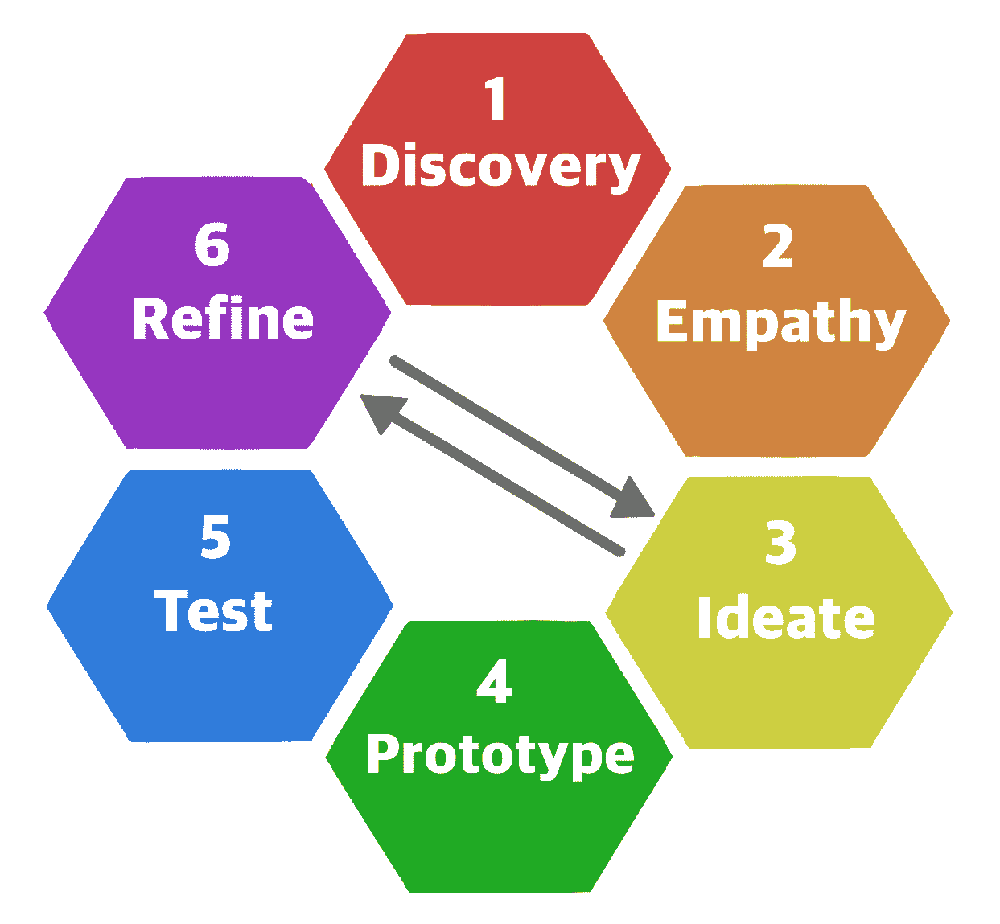
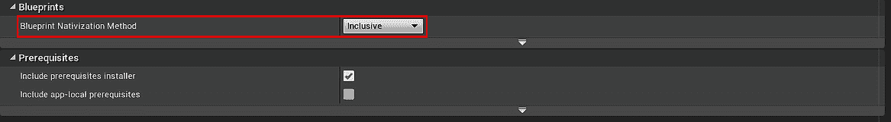
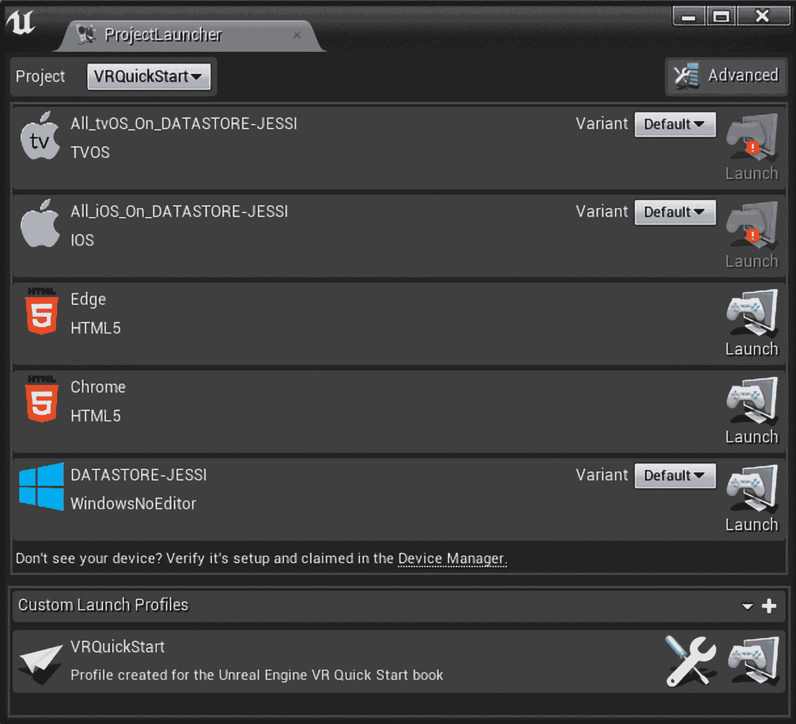

# 第六章：完成我们的 VR 游戏及下一步计划

*服务器 17* 从我们在第一章，“在虚幻引擎 4 中引入 VR 技术”中构思的想法已经走了很长的路。从我们的初始设计和与用户的讨论中，我们创建了一个以玩家乐趣和舒适度为首要考虑的游戏原型。在第五章，“在 UE4 中为 VR 创建优化的游戏艺术”，我们讨论了 VR 中游戏艺术的局限性以及可以用来构建游戏所需视觉效果的某些最佳实践。那么，我们接下来该怎么做？是时候进行测试了！

一旦我们有了可工作的原型，就是时候与我们的用户进行测试，看看我们的某些设计想法是否正确。只有玩家才能告诉我们我们是否走上了正确的道路。没有任何设计在出厂时就是完美的，我们的游戏通常需要经过几轮测试和重新设计，我们才能达到一个成功的版本。这就是为什么我们必须测试，并且经常测试。

在本章中，我们将涵盖以下主题：

+   游戏测试的重要性

+   收集测试数据

+   准备分发

# 游戏测试的重要性

测试阶段是 HCD 过程的重要组成部分：

测试是 HCD 过程的第五步

在这个阶段，目标是收集玩家真实而有意义的反馈，希望借此改进我们的设计。这个过程是最重要的部分，因为没有让玩家实际体验游戏，我们就无法知道游戏是否有趣。这也是许多新手开发者感到挣扎的阶段。许多创作者非常认同自己的作品，甚至将批评（即使是建设性的批评）视为对他们或他们能力的批评。重要的是我们要从作品中抽离出来，以便接受能改进项目的想法。以开放的心态对待所有反馈，并理解最终我们有权决定哪些反馈采用，哪些忽略。我们的目标始终是使产品更好。

# 收集测试数据

测试数据可以通过以下方式收集：

+   可用性测试

+   卡片分类

+   专家评审

我们可以使用几种方法来收集关于我们游戏的反馈。这些方法都是为了收集玩家可以用来改进游戏各个方面的具体数据，从用户界面到关卡设计。其中一些是高科技的，利用了记录玩家的先进方法，如眼动追踪测试。其他方法则非常低科技，可能涉及让玩家将带有特定关键词的卡片分类，或者简单地让玩家尝试游戏，同时你和你的同事记录结果。

# 可用性测试

我们大多数人最熟悉的第一种方法是可用性测试。可用性测试包括将测试人员带到你的位置，让他们在你和其他人观察和记录结果的同时测试你的设计。观察测试类似于在面试期间记录笔记。注意用户说什么，也要注意他们的肢体语言和他们所做的事情。

这里有一个例子：假设你创建了一个发生在迷宫中的解谜游戏。你给十个符合目标受众的玩家机会在 alpha 阶段尝试游戏。在测试期间，几乎每个玩家都决定尝试跳过一个放置在关卡中的障碍。在之后询问他们时，有四个玩家表示他们无法越过障碍感到沮丧，因为他们认为这可能是一个捷径。几乎所有玩家都认为这个障碍看起来像是他们应该能够通过的东西。我们如何利用这些信息来改进游戏？一个选择可能是改变障碍的外观，使其看起来更难以逾越——也许是一堵墙而不是栅栏。这当然可以解决问题，但它并没有真正利用我们所学的。我们可以在该区域构建一个秘密奖励。我们可以稍微调整障碍，使其对决心坚定的玩家可通行，并在另一侧隐藏一个奖励。我们还可以通过在障碍物之后添加一个捷径来迎合玩家的期望，如果他们能通过它。最后，如果我们认为这种变化是不必要的，我们总是可以选择忽略玩家反馈的这部分。你会选择哪一个？

# 卡片分类

另一种旨在收集玩家数据的方法是卡片分类，这对于理解玩家对关键功能的看法或决定游戏应该关注什么非常有用。这种方法来自心理测试领域，旨在帮助我们理解用户期望和他们对你的想法的理解。卡片分类涉及在几张便签上写下 50-60 个关键词或想法，并要求玩家将它们分类或根据其重要性进行排名。这些可以是游戏功能，如升级、武器修改或多人游戏。它们也可以是更抽象的想法，例如可接受的游戏时间是什么，或者玩家舒适度对体验有多重要。

卡片分类活动有两种类型。开放式卡片分类要求玩家将卡片组织成类别，并按准确描述其中内容的名称命名这些类别，而封闭式卡片分类是一种玩家将卡片分类到预定义类别中的方法，以展示他们对内容的了解。这两种方法都有其优点。第一种方法允许你测试玩家如何理解你的想法。第二种方法允许你标记想法并测试你的标记，使用真实用户。

# 专家评审

我要讨论的最后一个方法是专家评审。这涉及到将你的游戏发送给专家并收集他们的意见。在游戏中，这可能意味着让几个不同的专家尝试你的产品，并就特定功能提供反馈。这包括让关卡设计师测试你的游戏并提供关于关卡反馈，或者 UX 设计师就你的界面和交互系统提供反馈。这种方法允许你在团队设计专长可能较弱的地方获得专业见解，因为小型团队的成员经常身兼数职，并被要求承担他们不太了解的任务。然而，重要的是要注意，这不能替代让玩家测试我们的游戏，因为玩家反馈是我们能获得的最重要的见解类型。

# 准备分发

因此，我们已经收集了玩家数据，重新设计了游戏，并再次进行了测试。我们可能已经多次通过了这个设计周期的一部分，但现在我们的游戏已经完美，准备向大众发布。所以，现在是时候制作和打包应用程序的发布版本了。这个过程有几个步骤：

1.  调整我们的项目设置。

1.  启动项目启动器。

1.  设置自定义启动配置文件。

1.  测试游戏构建。

我们发布之旅的起点是通过调整项目设置中的一些打包设置：

项目设置，显示蓝图本地化选项

让我们打开蓝图本地化。此选项将我们的现有蓝图转换为 C++代码，这将提高我们的性能：

1.  在项目设置菜单的打包部分找到蓝图本地化选项。

1.  点击下拉菜单并选择包容选项。

接下来，在左侧菜单的平台部分选择 Windows 选项。在这里，你可以为你的游戏使用自定义的启动画面或自定义图标。这绝对是我们游戏发布前应该做的事情。

现在，我们需要转到项目启动器：

项目启动器窗口

从这里，我们可以为我们的启动偏好选择一个默认配置文件，或者我们可以创建自己的。尽管 WindowsNoEditor 选项可能对我们适用，但让我们尝试在底部创建自己的自定义配置文件：

1.  在启动器底部，点击+按钮创建自定义启动配置文件。

1.  在窗口顶部，双击“New Profile 0”名称，并将此配置文件命名为`VRQuickStart`。

1.  双击“Enter a description here”文字，并为此配置文件提供描述。

1.  在项目部分，我们可以指定我们希望为特定项目使用此配置文件。现在请保持默认选项。

1.  前往烹饪部分，并使用下拉菜单选择按部就班选项。烹饪我们的内容会移除任何未使用的内容，并为指定平台准备我们的文件。

1.  在烹饪平台部分，确保选中了 WindowsNoEditor 的复选框。

1.  在烹饪文化部分，确保选择了你想要本地化的任何文化。我选择了 en-US。

1.  对于烹饪地图，选择你创建的原型地图。

1.  在菜单的部署部分，确保选择了你的电脑。在变体下，选择 WindowsNoEditor 选项。

1.  最后，点击后退选项返回到项目启动器。

在我们的个人资料设置完成后，终于到了启动我们的自定义个人资料并允许虚幻引擎为分发准备我们的游戏的时候了！点击自定义个人资料的启动按钮，并观察我们的游戏通过这个过程。由于我们的游戏目前只是一个原型，所以整个过程只需几分钟。当我们拥有一个包含艺术作品、多个关卡和更高程度自定义代码的更完整游戏时，这个过程将需要更长的时间。一旦完成，就是享受我们的演示的时候了！

# 摘要

恭喜！我们现在有一个打包并完整的游戏原型！那么，接下来我们该做什么呢？通过本书各章节所学到的知识，我们游戏的未来似乎广阔无垠。对于一些人来说，你们可能想要继续使用我们与*Server 17*一起创建的主题。对于其他人来说，目标可能是将我们设计和构建的系统用于启动一个新游戏。我们在第三章，*探索虚拟现实中的引人入胜的游戏玩法*和第四章，*VR 中的用户界面和用户体验*中编写的每个系统都被设计成通用和灵活的，允许读者将它们引导到他们希望的方向。我可以看到我将这些系统解释为非常适合破解谜题游戏，并重新构思用于射击游戏、车辆体验，甚至卡通烹饪游戏。一旦你确定了设计，就构建你的游戏玩法并与你选择的玩家进行测试。完善你的想法，制作一些令人惊叹的艺术作品，并将其发布到野外。

最终，决定这个原型的命运取决于你。然而，无论你决定做什么，永远不要停止创造。我们擅长我们所花时间做的事情。如果你想扩展你的游戏设计技能，永远不要停止制作游戏。
