# 第三章. 碰撞

在本章中，我们将分析 Unreal Engine 4 中的碰撞，它是什么，引擎中存在的不同类型的碰撞，如何使用它，以及如何将其应用于静态网格和蓝图。首先，我们将首先概述 Unreal Engine 4 中存在的不同碰撞，但也会涵盖以下主题：

+   简单与复杂碰撞

+   生成简单碰撞

+   创建复杂和定制的碰撞外壳

+   碰撞交互

+   自定义对象和跟踪通道

+   深入的碰撞预设

为了本章的目的，我们将继续使用我们在第一章中创建的**Unreal_PhyProject**在 Unreal Engine 4 中工作。

# 碰撞和跟踪响应 - 概述

在现实世界和 Unreal Engine 4 中，我们定义碰撞为两个或更多对象的重叠。在 Unreal Engine 4 的上下文中，**碰撞**和**跟踪响应**为 Unreal Engine 4 在游戏过程中处理碰撞和光线投射奠定了基础。每个被赋予碰撞的对象都会得到一个**对象类型**和一系列描述它如何与其他对象类型交互的响应。在发生碰撞或两个或更多对象重叠的情况下，所有涉及的对象都可以设置为影响或被影响，通过阻止、重叠或忽略彼此。

**跟踪响应**描述了当您与跟踪交互时，对象应该如何反应，这是通过光线投射完成的。对象可以选择阻止、重叠或甚至忽略来自特定来源的跟踪。默认情况下，有两种不同的**跟踪响应**：

+   **可见性**：这指定了一个从某个位置到另一个位置的跟踪

+   **相机**：这与**可见性**跟踪响应完全相同，但应在使用来自相机的光线投射时使用。

**对象响应**描述了当您与游戏世界中的其他对象交互时，对象应该如何响应。类似于**跟踪响应**，**对象响应**提供了选择对象在发生碰撞时是否阻止、重叠或忽略其他对象的能力。默认情况下，有六种不同的**对象响应**类型：

+   **WorldStatic**: 这个对象响应适用于我们游戏世界中静止的对象，意味着它们不能也不能通过任何方式移动。例如，体积、世界几何形状或游戏世界中的任何其他网格都与这个对象响应相关联。

+   **WorldDynamic**: 这个对象响应适用于我们游戏世界中移动的演员，除了玩家骰子、物理体、车辆和可破坏演员。**WorldDynamic**对象的例子包括电梯、可以开关的门或玩家可以旋转的轮子。

+   **Pawn**: 这个对象响应适用于我们游戏中的玩家角色或任何可以被玩家操控的角色。

+   **PhysicsBody**：这个物体响应适用于任何可以在我们的游戏世界中用物理模拟的物理体或物体。一个**PhysicsBody**物体的例子是玩家可以捡起并投掷的篮球；“半条命 2”是一个很好的例子，说明了如何在游戏中使用物理体物体碰撞。

+   **车辆**：尽管这个物体响应被标记为**车辆**，但这个响应有用的地方是让玩家角色跳入其中，例如一辆车。

+   **Destructible**：这个物体响应适用于任何可破坏的演员，这意味着它们可以使用可破坏网格编辑器分解。

当你在 Unreal Engine 4 蓝图中设置对象或组件的碰撞时，你会看到以下属性：

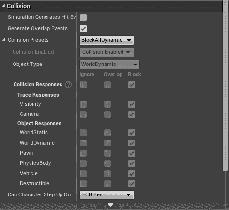

重要的是要注意，在设置任何碰撞预设到该物体之前，我们想要确保我们的静态网格或蓝图组件已经生成了碰撞；否则，一旦发生碰撞，我们将不会收到任何响应。在本章后面，我们将详细介绍如何为我们对象生成简单和复杂的碰撞。

当涉及到将**碰撞**设置到物体上时，Unreal Engine 4 默认提供了许多碰撞预设，这些预设可以忽略、重叠或阻止组合的轨迹和物体响应。除了这些预设之外，我们还有在蓝图中的特定情况下创建自定义碰撞预设的选项。请随意探索一些碰撞预设以及它们之间的区别，但为了本文的目的，让我们先看看一些更常见的预设。我们将在本章后面更深入地探讨以下预设：

+   **No Collision**：正如其名所示，这个碰撞预设通过将**可见性**轨迹响应和**相机**轨迹响应设置为忽略，并将**碰撞启用**设置为**无碰撞**来消除任何碰撞响应。通常，我们会使用这个预设来处理我们不想对其可能发生的任何碰撞做出反应的蓝图组件。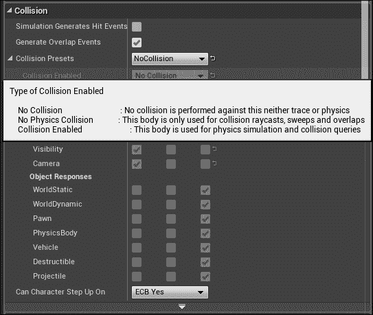

+   **Block All**：这个碰撞预设导致与相关组件的所有碰撞都导致阻塞。或者，如果应用了物理，它会导致所有参与碰撞的物体相互碰撞并弹开。这是通过将所有响应（包括轨迹和物体响应）设置为**Block**在它们的**碰撞响应**下完成的，如下面的截图所示：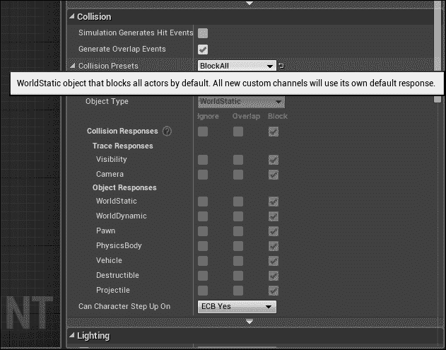

+   **全部重叠**：这个碰撞预设会导致所有碰撞在所有参与碰撞的对象之间产生重叠。只要 **生成重叠事件** 属性被勾选，我们就可以使用蓝图碰撞事件来启用行为或事件，一旦这种类型参与碰撞就会发生。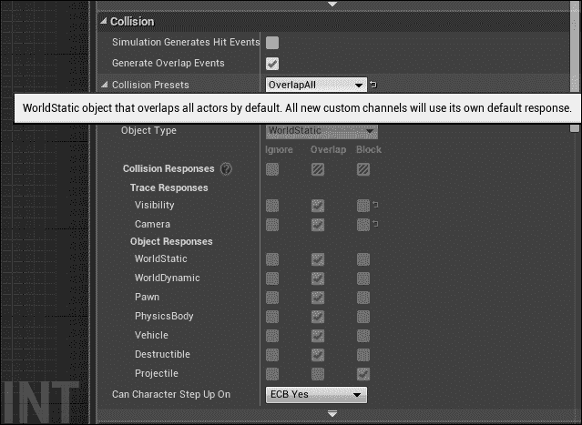

+   **Pawn**：如果这个碰撞预设用于我们的游戏中的玩家 pawn 或角色，那么它是有用的。默认情况下，它设置为阻止 **对象响应**，阻止 **相机** 跟踪响应，并忽略 **可见性** 跟踪响应：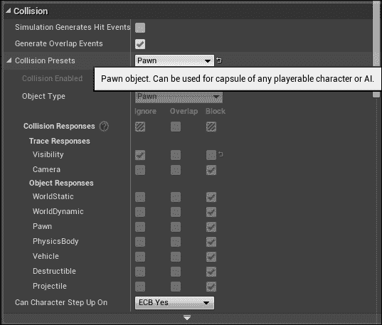

+   **物理演员**：这个碰撞预设用于任何基于物理的演员或组件，这意味着对象在游戏中应用了物理（例如重力）。为了确保这个预设能够正常工作，我们想要确保在 **物理选项卡** 中的 **模拟物理** 属性被勾选。默认情况下，所有的 **跟踪响应** 和 **对象响应** 都设置为 **阻止**：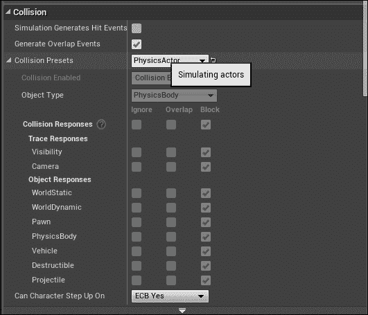

这些只是 Unreal Engine 4 默认提供的碰撞选项中的一部分，我们将在本章的后面更详细地介绍其他选项。尽管 Unreal Engine 4 默认提供的碰撞预设选项有限，但有一个非常棒的功能是能够创建自己的跟踪、对象通道和碰撞预设。为此，我们需要导航到 **编辑** 窗口并选择 **项目设置**：

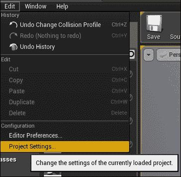

从这里，我们需要导航到 **引擎** 类别中的 **碰撞** 选项：

在这个菜单中，我们可以创建自定义的碰撞预设，指定哪些对象和跟踪通道要忽略、重叠或阻止，给它一个特定的名称，并将其保存到项目文件中。对于高级需求，我们也可以在这个窗口中创建自定义的对象和跟踪通道。在本章的后面，我们将创建我们自己的自定义碰撞预设并将其应用于对象。

# 碰撞和跟踪响应 – 概述

在本节中，我们简要地探讨了 Unreal Engine 4 中存在的不同 **碰撞** 和 **跟踪响应**，并定义了一些这些响应。我们分析了 Unreal Engine 4 默认的不同的 **跟踪响应** 和 **对象响应**，以及提供的一些有限的碰撞预设。现在，我们已经对 **碰撞** 和 **跟踪响应** 有了一个基本的理解，我们可以继续前进，学习更多关于 Unreal Engine 4 中的简单和复杂碰撞的知识。

# 简单与复杂碰撞

在虚幻引擎 4 中，我们将能够自动生成可用于游戏中的网格碰撞。虚幻引擎 4 中存在两种不同的碰撞类型：简单碰撞和复杂碰撞。每种碰撞类型都有其独特的用途，在本节中，我们将简单地定义每种碰撞类型并提供每个类型的示例。稍后在本章中，我们将探讨如何将这些碰撞应用到我们的对象上。我们还将测试这些碰撞在游戏中的效果。让我们从简单碰撞开始。

简单碰撞是一种使用基本形状（如盒子、球体、胶囊体和凸形状）来定义我们对象边界的碰撞网格。凸形状是那些具有一个或多个小于 180 度的内角的形状，而凹形状是那些具有一个或多个大于 180 度的内角的形状，如下面的图像所示：

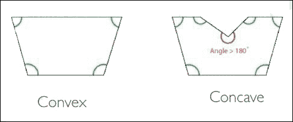

除了这些基本形状之外，我们还可以生成一种称为**KDOP**或**K 离散定向多面体**（其中 K 是轴对齐平面的数量）的简单碰撞形式。这个选项本质上所做的就是将*K*轴对齐平面移动到尽可能接近选定的网格。稍后我们将详细介绍如何生成这些不同类型的简单碰撞。现在，让我们定义简单碰撞的不同类型：

+   **球体**: 这将在选定的对象周围创建一个球形边界网格。它可以用于物理对象，并将碰撞应用到圆形对象上：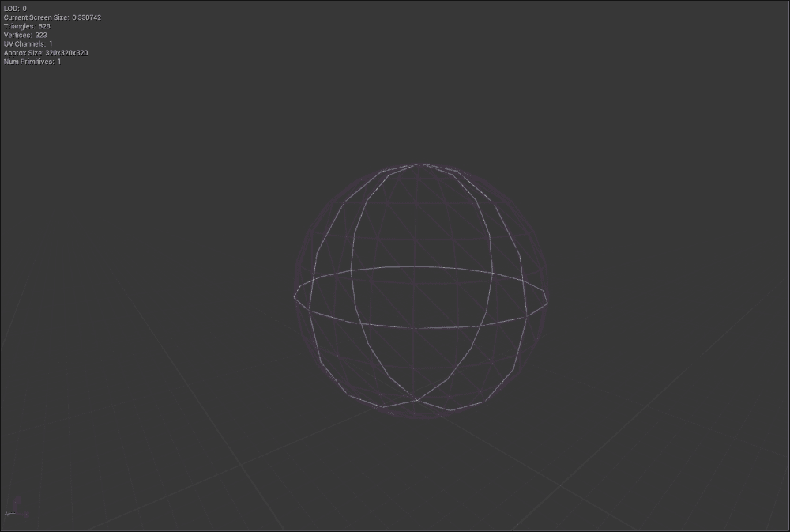

+   **胶囊体**: 这将在选定的对象周围创建一个胶囊边界网格，通常用于角色或兵网格：

+   **盒子**: 这将在选定的对象周围创建一个盒子边界网格。这种简单碰撞类型最常用于环境网格：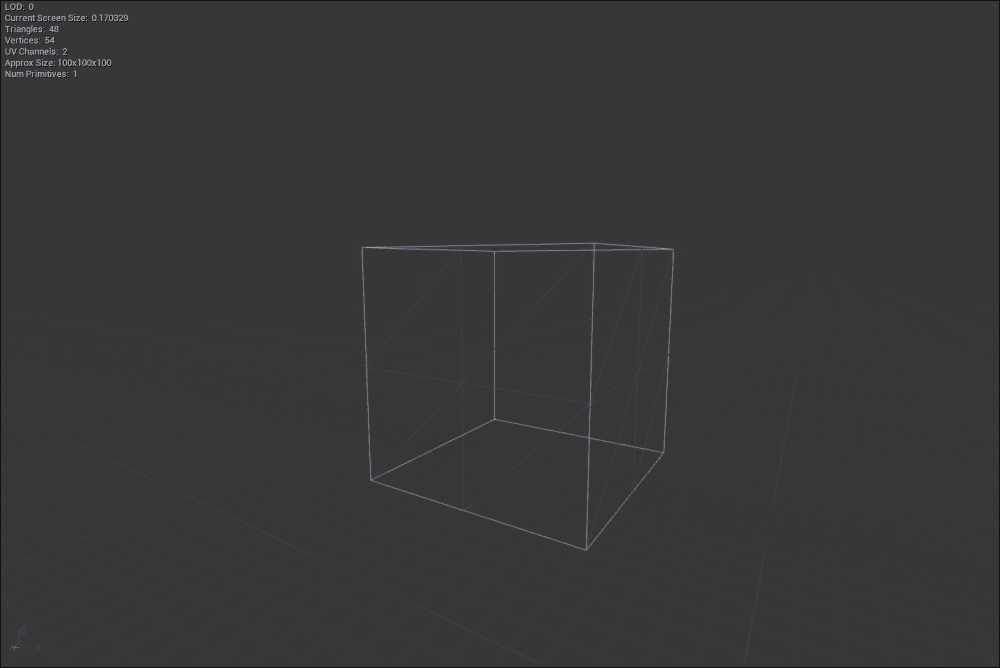

+   **10DOP X**: 这将在与 X 对齐的边缘上创建一个带有四个边缘倒角的盒子：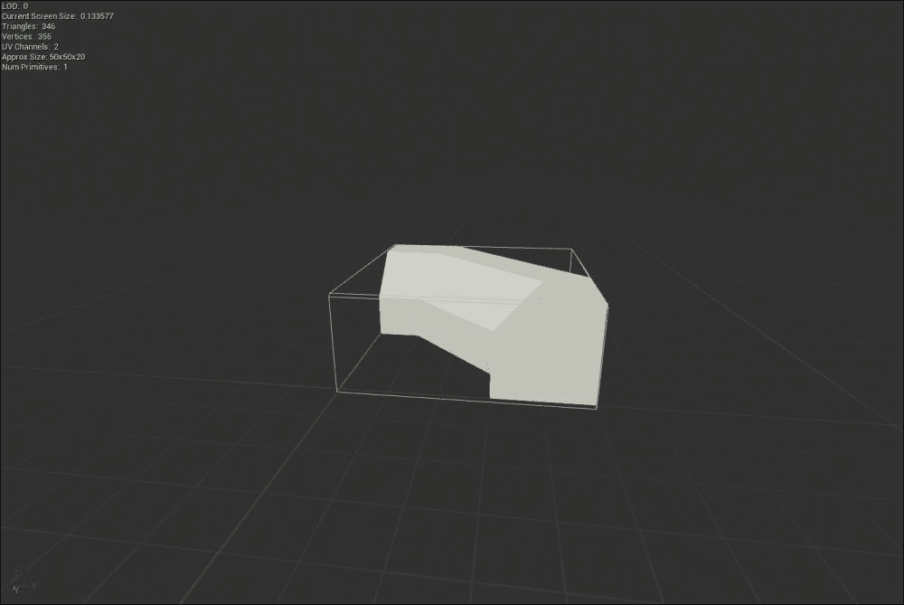

+   **10DOP Y**: 这将在与 Y 对齐的边缘上创建一个带有四个边缘倒角的盒子：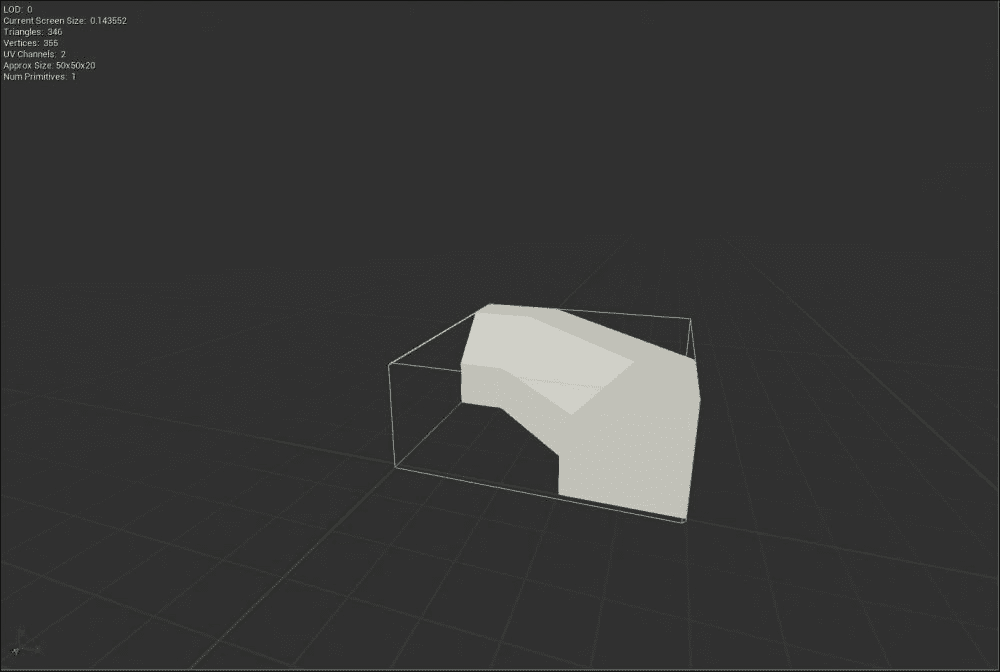

+   **10DOP Z**: 这将在与 Z 对齐的边缘上创建一个带有四个边缘倒角的盒子：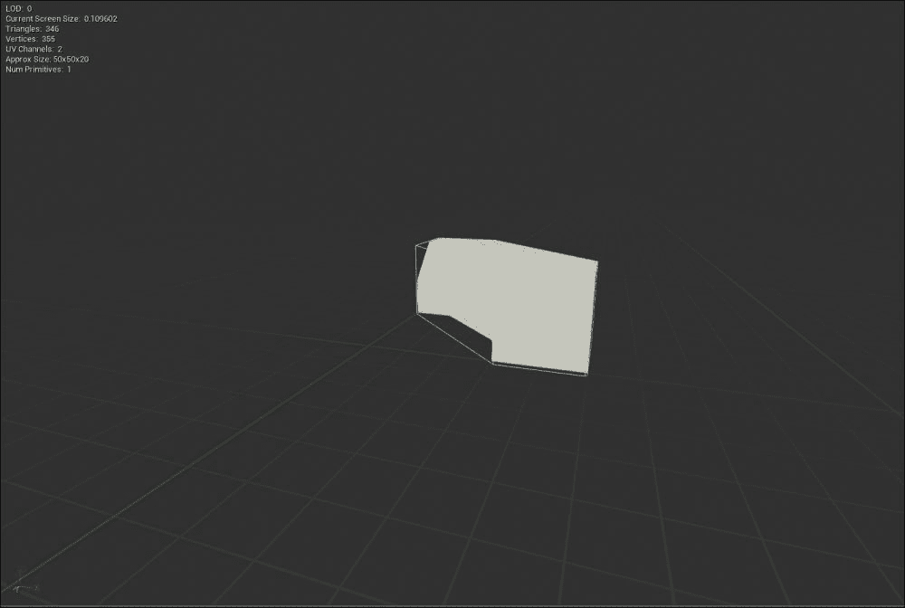

+   **18DOP**: 这将创建一个带有所有边缘倒角的盒子：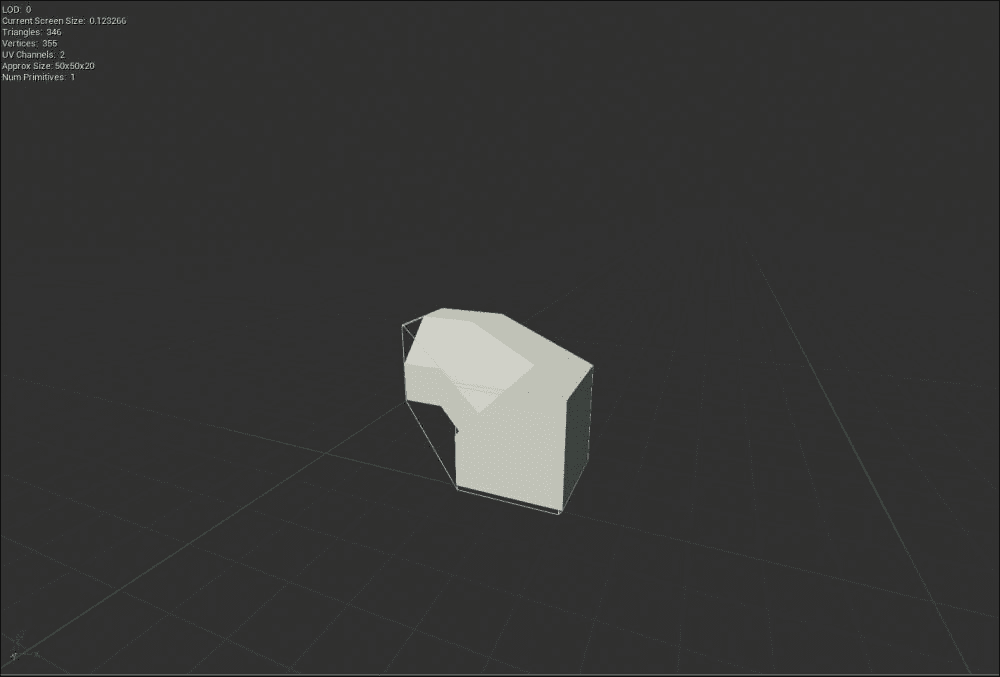

+   **26DOP**: 这将创建一个带有所有边缘和角落倒角的盒子：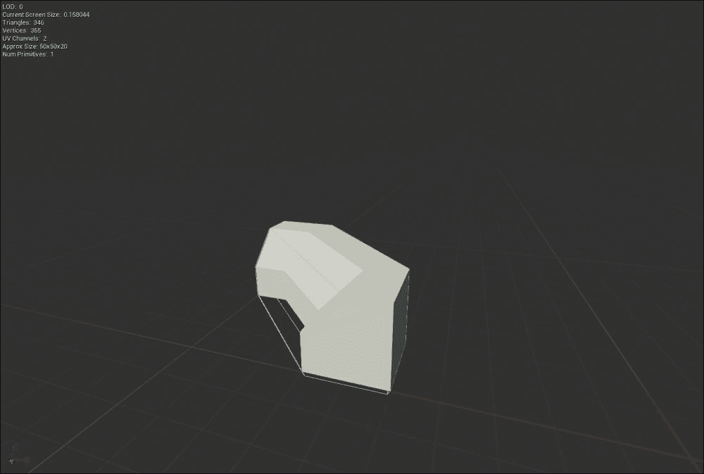

简单碰撞的主要优势是几乎消除了对象粘附到玩家或反之亦然的可能。另一个优势是碰撞网格是基本形状，在游戏运行时使用成本较低。

复杂碰撞是对每个多边形进行的，与简单碰撞相比，在虚幻引擎 4 中非常昂贵。此外，复杂碰撞永远不会用于模拟物理的 actor，它将直接穿过游戏世界。为了在**静态网格**编辑器中启用复杂碰撞，我们需要导航到**详细信息面板**然后到**静态网格设置**部分。在这里，我们可以将**碰撞复杂性**参数更改为**使用简单碰撞作为复杂**或**使用复杂碰撞作为简单**：

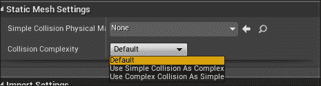

# 简单与复杂碰撞 – 一节回顾

在本节中，我们探讨了虚幻引擎 4 的**静态网格**编辑器默认提供的不同简单碰撞。我们还讨论了简单和复杂碰撞在游戏开发和引擎性能方面的优缺点。最后，我们简要地看了如何创建这两种类型的碰撞。在掌握了简单和复杂碰撞的基本理解之后，我们现在可以讨论如何创建简单碰撞，以及如何在虚幻引擎 4 中创建碰撞外壳。

# 创建简单碰撞

当涉及到创建碰撞时，我们有多种选择可以利用，以正确利用碰撞并优化游戏性能。正如我们在上一节中讨论的，我们可以在虚幻引擎 4 的**静态网格**编辑器中创建简单和复杂的碰撞，但我们也可以使用第三方艺术程序来创建自定义碰撞外壳。让我们首先讨论如何在虚幻引擎 4 中创建简单碰撞，在下一节中，我们将讨论如何为我们的资产创建复杂和自定义碰撞。

让我们从打开`StarterContent`并导航到**内容浏览器**开始。从这里，让我们进入`StarterContent`文件夹，选择包含多个简单形状静态网格的`Shapes`文件夹。对于这组示例，我们将选择`Shape_Trim`网格，因为它与球体或盒子相比形状更复杂；这样，我们可以看到不同碰撞选项的效果。双击`Shape_Trim`资产以打开**静态网格**编辑器。

在**静态网格**编辑器中导航与在虚幻引擎 4 主游戏编辑器的**透视**视图模式中移动非常相似。在**静态网格**编辑器的顶部是主工具栏，它提供了当你查看你的网格及其碰撞时的一组有用的选项。

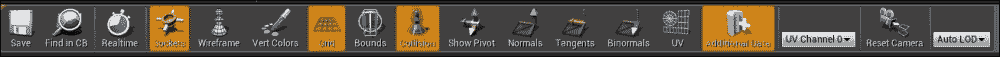

工具栏为我们提供了保存网格及其属性、实时查看网格的选项，这对于网格应用了动画材质时非常有用，可以查看任何应用的**插座**，切换网格的**线框**，查看应用在网格上的任何**顶点颜色**，切换背景**网格**，切换网格的**边界**，以及（最重要的是）切换应用在网格上的**碰撞**。此外，我们还可以查看网格的**中心点**、其**法线**、**切线**、**双法线**和**UV**图。

由于我们将主要使用碰撞，我们希望确保**碰撞**选项已开启，以便我们可以看到边界碰撞网格的范围。为此，我们可以左键单击**碰撞**按钮，确保它以橙色突出显示，如果网格有任何碰撞应用，我们将在围绕对象的浅蓝色线框中看到它。默认情况下，`Shape_Trim`已经应用了碰撞，因此我们首先想要移除这个碰撞，以便我们能够一次性将一个碰撞网格应用到对象上，以便进行演示。

1.  首先，导航到位于**文件**、**编辑**、**资产**窗口选项旁边的**静态网格**编辑器顶部的**碰撞**下拉窗口。

1.  然后，选择**移除碰撞**。

现在，浅蓝色的线框轮廓网格将从我们的网格中消失，这意味着这个资产不再有任何碰撞应用。同时，我们也必须牢记，我们不想一次性将超过一个碰撞边界网格应用到对象上，以使我们的资产尽可能优化，除非网格的形状需要超过一个碰撞网格。

当在**静态网格**编辑器中生成简单碰撞时，只需在其界面中点击几个按钮即可。让我们先通过点击**碰撞**下拉菜单并选择**添加简化球体碰撞**来在我们的`Shape_Trim`网格中创建一个**球体**碰撞。完成后，我们应该看到一个类似于以下截图的碰撞边界网格：

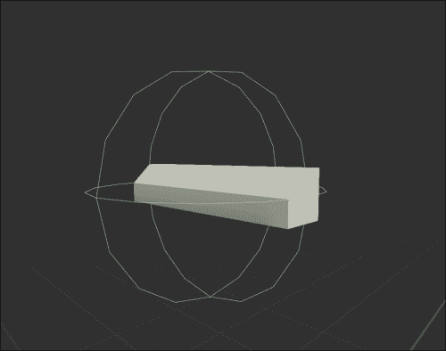

**简化球体碰撞**选项设置了与它应用的网格大小和形状最匹配的球体半径。我们还应该注意，碰撞线框从浅蓝色变为绿色；这意味着碰撞将使用简单形状。一旦生成碰撞，形状可以移动、旋转和缩放到所需的大小和形状。对于这个形状，球体碰撞似乎并不像我们希望的那样工作，因此让我们从**碰撞**下拉列表中选择**移除碰撞**选项，然后选择**添加简化胶囊碰撞**选项。

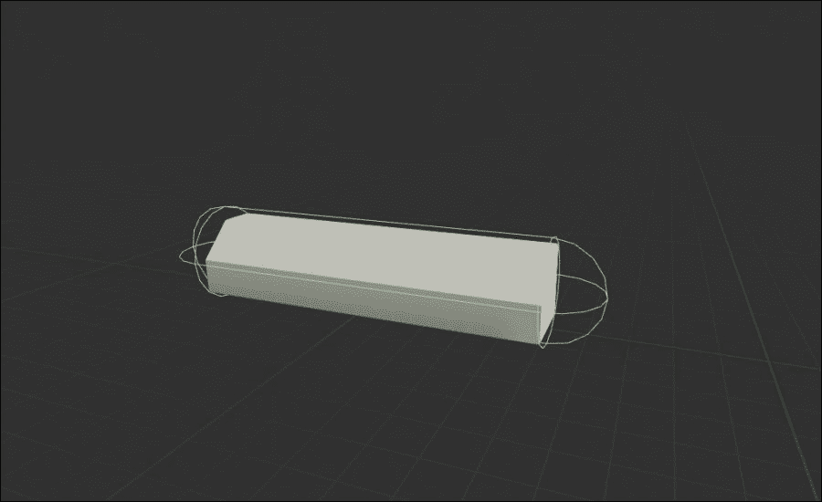

如我们所见，**胶囊简化碰撞**选项比**球体简化碰撞**选项更好地匹配我们的网格的大小和形状，因为它设置了胶囊的高度和半径，而不仅仅是设置半径。我们仍然可以看到，碰撞边界网格并没有像我们希望的那样紧密地适应这个形状，所以让我们继续添加不同形状的碰撞网格，以找到最佳的一个。

让我们移除胶囊碰撞边界网格，并选择**添加箱形简化碰撞**选项到`Shape_Trim`。在这里，我们可以看到，箱形形状很好地匹配了网格的大小和形状，并且在大多数情况下，我们会为这个资产使用这个选项在我们的游戏中使用。

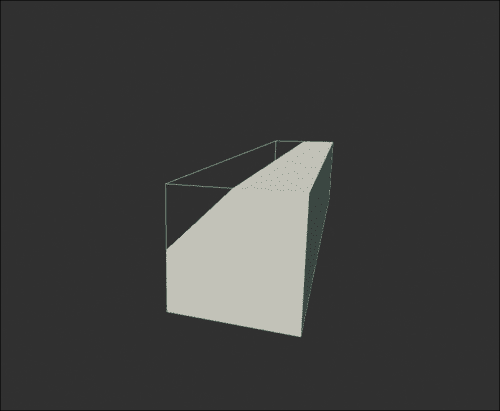

为了本章的目的，我们将继续应用**KDOP 碰撞**选项到这个网格上，以便我们更好地理解它们的目的以及我们可以从这些选项中获得的结果。现在，让我们移除**箱形简化碰撞**选项，并使用**添加 10DOP-X 简化碰撞**选项。如果你还记得上一节，**10DOP-X 简化碰撞**会在*X*对齐的边缘上创建一个带有四个斜边的盒子。然后，我们得到以下结果：

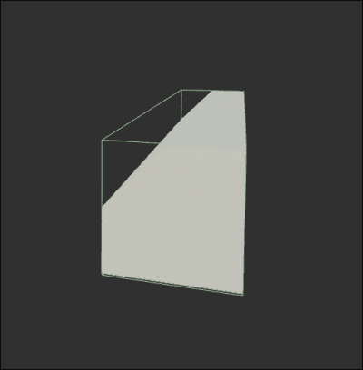

如我们所见，**10DOP-X 简化碰撞**选项生成的碰撞边界网格与**箱形简化碰撞**选项完全相同。现在，让我们尝试应用**10DOP-Y 简化碰撞**选项，它通过首先移除**10DOP-X 简化碰撞**选项，然后选择**添加 10DOP-Y 简化碰撞**选项来创建一个在*Y*对齐边缘上有四个斜边的盒子，得到以下碰撞网格：

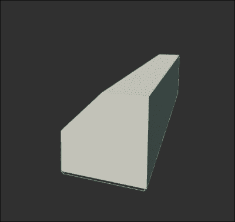

如此可见，**10DOP-Y 简化碰撞**选项几乎完美地匹配了我们的`Shape_Trim`静态网格的大小和形状。这绝对是在为这个资产生成碰撞时可以选择的一个可行的选项。最后，让我们应用**10DOP-Z 简化碰撞**选项来查看它如何在我们资产周围生成碰撞网格。首先，让我们移除**10DOP-Y 简化碰撞**选项，然后导航到**碰撞**下拉菜单并选择**添加 10DOP-Z 简化碰撞**，这将创建一个在*Z*对齐轴上有四个斜边的盒子，得到以下结果：

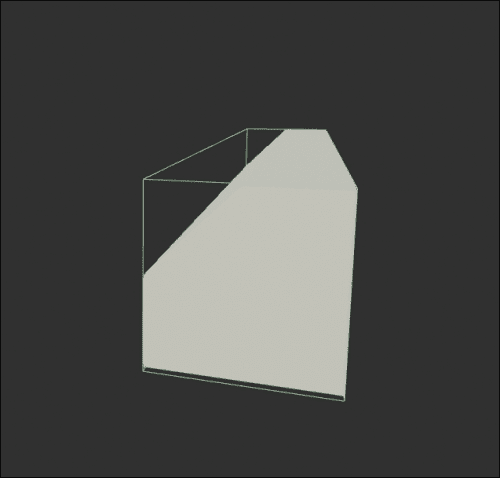

结果与我们应用**盒子简化碰撞**和**10DOP-X 简化碰撞**选项时获得的结果相同。根据我们从这些选项中获得的结果，对于这个资产的最佳选择将是**盒子简化碰撞**或**10DOP-Y 简化碰撞**。由于这个资产很简单，**18DOP**和**26DOP 简化碰撞**选项不会产生独特的选择，因此为了正确展示这些选择，我们需要选择一个不同的资产。

为了演示这一点，让我们关闭`Shape_Trim`资产的**静态网格**编辑器，并导航到**内容浏览器**。在这里，在`Props`文件夹下的`Starter Content`文件夹中，我们将双击`SM_Chair`资产以在**静态网格**编辑器中打开此网格。`SM_Chair`资产已经应用了默认的碰撞，所以在应用我们自己的之前，让我们首先移除它的碰撞。然后，让我们选择**18DOP** **简化碰撞**选项并查看它如何为我们的椅子生成一个碰撞边界网格：

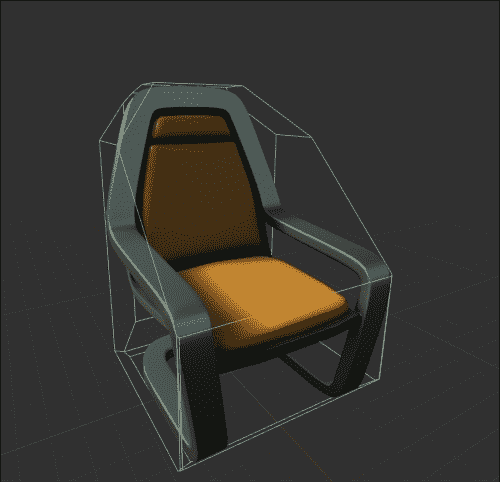

如果你还记得，**18DOP 简化碰撞**选项创建了一个所有边缘都被倒角的碰撞边界框，为我们的椅子周围创建了一个良好的碰撞。在这里，让我们通过首先移除我们的碰撞然后选择**添加 26DOP 简化碰撞**选项来应用**26DOP 简化碰撞**选项：

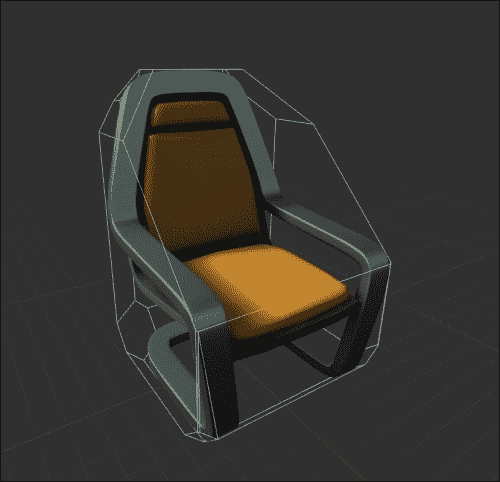

如你所见，**26DOP 简化碰撞**选项创建了一个所有边缘和角落都被倒角的盒子，为我们的资产周围创建了一个更平滑、更圆润的碰撞网格。

# 创建简单碰撞 - 小节回顾

在本节中，我们深入探讨了在虚幻引擎 4 的**静态网格**编辑器中可以生成的不同类型的简单碰撞，以及每种类型的优缺点。以起始内容资产为例，我们将每种类型的简单碰撞应用于查看它们如何根据我们的资产的大小和形状生成，以便更好地理解它们的工作原理。现在我们已经深入了解了如何在虚幻引擎 4 中生成简单碰撞，让我们继续前进，看看如何使用虚幻引擎 4 生成复杂和定制的碰撞外壳。

# 创建复杂和定制的碰撞外壳

当在 **Static Mesh** 编辑器中创建复杂碰撞时，我们可以使用 **Auto Convex Collision** 工具来自定义碰撞网格将具有的壳体和壳体顶点数量。在本节中，我们需要继续使用我们创建的 `Unreal_PhyProject`，并将 `SM_Lamp_Wall` 资产作为生成自定义和复杂碰撞壳体的示例。要导航到此资产，我们需要转到 **Content Browser**，然后转到 `Starter Content` 文件夹。现在，在道具下，我们将找到 `SM_Lamp_Wall` 资产。双击此资产以打开 **Static Mesh** 编辑器。如果此静态网格有任何默认碰撞应用，请确保通过导航到 **Collision** 下拉菜单并选择移除碰撞来移除该碰撞。确保将 **Collision Toggle** 选项设置为开启，以便我们可以在 **Static Mesh** 编辑器中查看碰撞网格。

对于此资产，我们将使用提供我们生成 **Complex Collision** 参数集的 **Auto Convex Collision** 工具。要使用此工具，我们需要导航到 **Collision** 下拉菜单并选择 **Auto Convex Collision** 选项。完成后，我们将在 **Details Panel** 右侧提供一个子菜单，标签为 **Convex Decomposition**，包含以下参数：

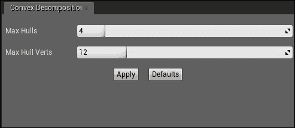

+   **Max Hulls**: 此参数确定创建的壳体数量，以最佳匹配网格的大小和形状。

+   **Max Hull Verts**: 此参数设置碰撞壳体的最大顶点数。通过增加此值，我们可以看到碰撞壳体可以有多复杂。

+   **Apply**: 此参数根据 **Max Hulls** 和 **Max Hull Verts** 参数生成碰撞网格。

+   **Defaults**: 此参数将 **Max Hulls** 和 **Max Hull Verts** 参数重置为其默认值 `4` 和 `12`（如前图所示）。

为了提供示例，让我们将 **Auto Convex Collision** 应用到我们的 `SM_Lamp_Wall` 网格，并将 **Max Hulls** 和 **Max Hull Verts** 参数分别设置为默认值 `4` 和 `12`：

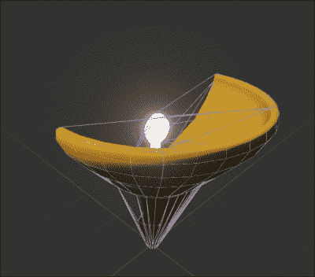

要真正查看此工具的威力，让我们尝试将 **Auto Convex Collision** 应用到以下参数：

+   **Max Hulls**: 将此参数设置为 `1`

+   **Max Hull Verts**: 将此参数设置为 `6`

然后，我们应该看到以下结果：

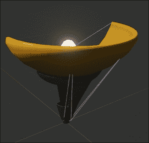

如我们所见，将这些参数设置为可能的最小值将导致一个仅做基本工作的碰撞网格，并且不符合我们灯的大小和形状。现在，让我们尝试将 **Auto Convex Collision** 应用到以下参数：

+   **Max Hulls**: 将此参数设置为 24

+   **Max Hull Verts**: 将此参数设置为 32

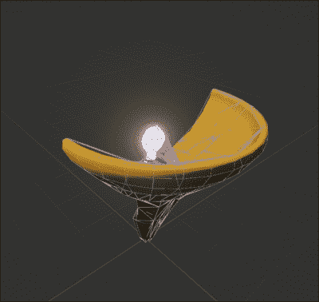

在应用最大设置到凸碰撞网格后，我们可以看到它在覆盖灯的大小和形状方面做得更好。最后，我们希望选择一个介于最低和最高值之间的设置，用于**最大外壳**和**最大外壳顶点**参数，以创建最适合我们的资产的最优碰撞。

现在我们已经介绍了如何使用虚幻引擎 4 的**静态网格**编辑器中提供的工具创建碰撞的方法，我们将简要讨论如何创建和导入在第三方艺术程序（如 3ds Max 或 Maya）中创建的碰撞。

创建自定义碰撞几何形状背后的想法是使其尽可能简单，以便在游戏播放时优化碰撞检测。一个对象的碰撞几何形状越复杂，引擎就需要进行更多的计算以确保在该对象上正确完成碰撞。当你将`.FBX`文件导入到虚幻引擎 4 中时，该文件中包含的碰撞网格将根据其名称由导入器识别。以下是导入你的资产到虚幻引擎 4 时确保正确碰撞所需的碰撞命名语法：

+   **UBX_[网格名称]**：当你使用 3ds Max 中的箱体对象类型或 Maya 中的立方体原语导入形状为箱体的碰撞网格时，需要使用这种命名语法。请注意，如果你在第三方艺术程序中移动箱体碰撞的任何顶点或以任何方式变形形状以使其不再是矩形棱柱，导入将不会工作。

+   **USP_[网格名称]**：当你使用 3ds Max 和 Maya 中的球体对象类型导入形状为球体的碰撞网格时，需要使用这种命名语法。在第三方艺术程序中，球体本身不需要有特定的段数，因为一旦导入到虚幻引擎 4 中，它就会被转换为真正的球体用于碰撞。

+   **UCX_[网格名称]**：当你导入形状为凸形或完全封闭且没有超过 180 度内角的形状的碰撞网格时，需要使用这种命名语法。

当你导入包含碰撞网格的`.FBX`文件时，有几个概念我们必须牢记：

1.  在撰写本书时，球体仅用于刚体碰撞和虚幻引擎的零长度痕迹，例如武器，而不用于实例（例如玩家移动）。

1.  在前面提到的命名语法中，**网格名称**组件必须与第三方艺术程序中碰撞关联的网格名称完全相同。例如，一个名为`Chair_01`的对象的箱体碰撞网格将标记为`UBX_Chair_01`，如果有多个碰撞网格用于此对象，则额外的碰撞网格可以命名为`UBX_Chair_01_02`，依此类推。

1.  一旦创建了碰撞网格并正确命名，我们就可以在`.FBX`文件中导出碰撞以及与碰撞关联的网格。一旦导入，虚幻引擎 4 将找到碰撞，将其从实际网格中分离出来，并将其转换为碰撞模型。

1.  如果一个物体由多个形状组成的碰撞体，当碰撞壳体之间不相互交叉时，可以得到最佳结果。

# 创建复杂和自定义碰撞壳体——章节回顾

在本节中，我们深入探讨了如何创建更复杂的碰撞。我们还探讨了如何在第三方艺术程序（如 3ds Max 和 Maya）中创建自定义碰撞壳体。此外，我们分析了虚幻引擎 4 的**静态网格**编辑器中的**自动凸碰撞**工具。我们还讨论了**最大壳体**和**最大壳体顶点**参数如何影响围绕我们的资产生成的碰撞。最后，我们查看在艺术应用程序中确保网格和碰撞正确导出和导入虚幻引擎 4 所需的所有必要命名约定。现在，我们已经对如何在虚幻引擎 4 和第三方艺术应用程序中生成碰撞有了非常深入的了解，我们可以详细讨论虚幻引擎 4 中存在的不同碰撞交互。

# 碰撞交互

在讨论了很多关于碰撞是什么以及如何生成不同类型的碰撞之后，现在让我们谈谈当与游戏世界中的玩家和其他物体交互时，不同的碰撞响应是如何工作的。为了本节的目的，我们希望打开`Unreal_PhyProject`，我们将使用`FirstPersonExampleMap`关卡和默认启动内容来分析这些交互。

在`FirstPersonExampleMap`中，我们将找到许多散布在关卡表面的立方体物理演员（每个在游戏时间开始时都是清醒和活跃的）。如果我们通过左键单击编辑器中的任何这些立方体演员来选择它，我们将在其**详细信息面板**中看到以下**碰撞**设置：

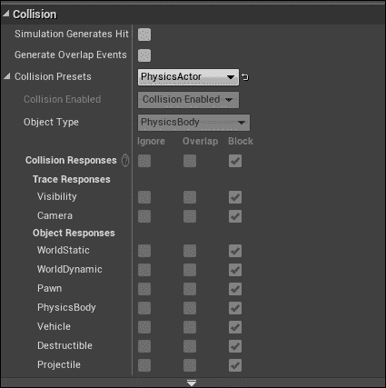

如我们所见，这些演员将使用**物理演员**碰撞预设，并且具有**物理体**的**对象类型**。如果我们通过按*Alt* + *P*跳转到包含第一人称投射物示例（我们已设置）的水平，我们可以通过左键单击它来用**第一人称投射物**蓝图射击这些立方体。我们可以看到，在碰撞时，会产生一个脉冲，导致盒子被推动，并且由于它也是一个设置了**物理体对象响应**为**阻止**的物理对象，碰撞本身会导致投射物弹跳。为了更好地了解正在发生的事情，让我们通过导航到**内容浏览器**然后到`First Person BP`文件夹来打开**第一人称投射物**蓝图。在`Blueprints`文件夹中，我们将找到**第一人称投射物**蓝图。双击此资产以打开其蓝图。它将带我们到主**事件图**，如下面的截图所示：

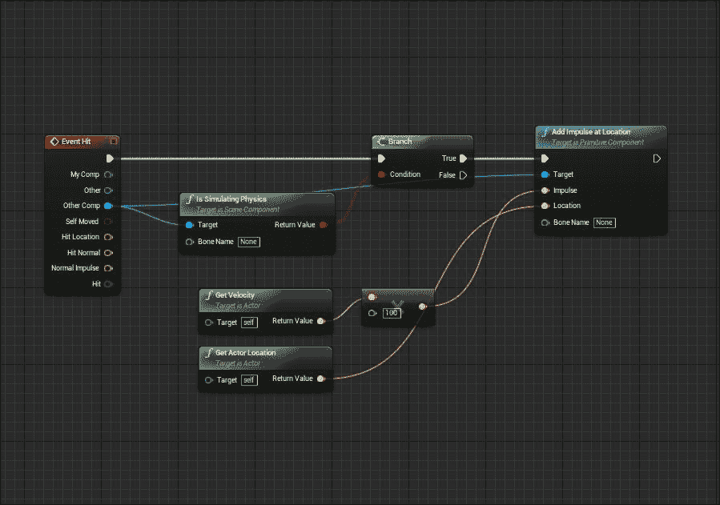

如果我们第一次查看蓝图图，这可能会有些令人困惑，但我们可以轻松地分解逻辑流程，并确切地了解投射物一旦生成并与其他演员发生碰撞将执行的操作。

让我们先看看这个图的主要事件：**事件击中**事件节点。这个事件节点检查的是蓝图的主要根组件是否在碰撞中被击中。在这种情况下，这个蓝图的主要根是**球体碰撞组件**选项，标记为**碰撞组件**。让我们通过在蓝图屏幕左上角的**组件**选项卡中左键单击**碰撞组件**来选择此组件，然后在其**详细信息面板**中查看其碰撞：

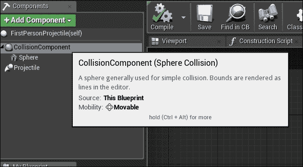

当你查看其碰撞时，你会看到它被设置为与关卡中物理立方体演员完全相同，拥有一个**物理演员**碰撞预设和一个设置为**物理体**的**对象类型**。这在碰撞方面的含义是，当这个投射物被生成到我们的游戏世界中时，它将表现得类似于一个正常的物理球体，比如棒球或篮球。在现实世界和我们的游戏世界中，球体更有可能最终撞到某个东西，当它这样做时，我们的**事件击中**节点将被调用。

在**第一人称投射物**蓝图中的下一步是检查撞击我们的投射物的其他组件是否是盒子、墙壁、玩家或地板。特别是，这个蓝图将检查任何撞击到这个投射物的碰撞的其他击中组件是否是**模拟物理**或物理演员。**模拟物理**函数节点返回一个**布尔值**（**真**或**假**），无论其他击中组件是否是物理演员。然后我们使用一个**分支**节点，该节点使用来自**模拟物理**函数的**真**或**假**条件来根据击中组件是否是物理演员执行动作。我们可以看到，从**真**执行引脚，我们可以在投射物的位置添加一个冲量，并使用**击中**碰撞的**其他组件**作为我们的目标来应用这个冲量。为了确定这个冲量的力量，我们可以对投射物的速度向量进行简单的乘法运算。我们将其乘以一个常数的**浮点**值。除了**在位置添加冲量**之外，这个数学运算导致物理立方体在碰撞时弹跳或对投射物做出反应，**模拟物理**检查确保在撞击墙壁、地板甚至玩家时不会创建任何冲量。为了使这个蓝图更有趣，让我们将常数的浮点值从`100`更改为`1000`，看看它如何极大地改变投射物撞击物理对象时的结果。

要改变这个投射物在游戏中的行为方式，我们可以将其碰撞预设从**物理演员**更改为**自定义**，这样我们就可以单独设置碰撞如何与不同的对象响应交互。例如，让我们将**物理体**对象响应从**阻挡**更改为**重叠**，然后编译蓝图，以便我们可以看到游戏中的变化。结果是投射物直接穿过物理立方体。然而，它仍然对**世界静态**对象类型（如地板和墙壁）做出正常反应。这是因为我们将对象响应从**阻挡**更改为**重叠**。这导致**事件击中**事件节点永远不会被调用。

在虚幻引擎 4 的蓝图设计中，当物体重叠时，我们可以使用事件节点。这被称为**组件开始重叠**。由于我们让我们的投射物使用**自定义碰撞**预设，该预设与游戏中的物理体重叠，因此我们可以使用**组件开始重叠**事件节点来在碰撞期间执行任意数量的动作。为了在我们的投射物蓝图设置一个基本示例，在**组件**选项卡中选择**碰撞组件**选项，使其高亮显示。接下来，在**事件图**的空白区域右键单击，导航到**添加事件**，然后选择**碰撞组件**，再选择**碰撞**。最后，选择**添加组件开始重叠**事件节点。

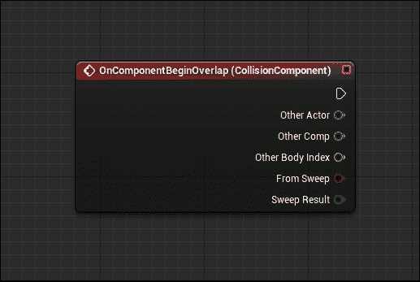

为了让行为与我们在**Event Hit**节点中检查物理演员对象时的行为相似，让我们复制并粘贴原始蓝图逻辑中使用的**Is Simulating Physics**函数节点和**Branch**，并连接节点，如下面的截图所示：

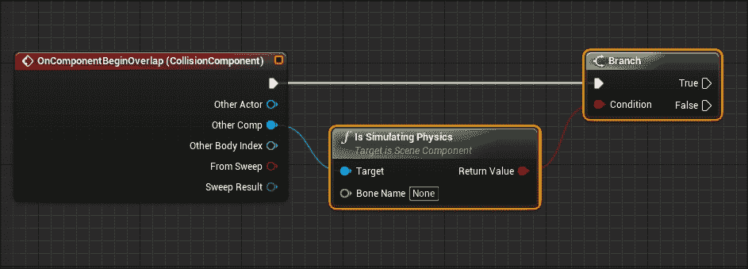

到目前为止，我们在物体与我们的世界中的物理演员发生碰撞重叠时检查了我们的抛体对象，但如果这个检查结果是**True**或**False**，则不会执行任何操作。我们不会执行任何复杂的动作，而是简单地使用**Print String**函数将对话框打印到我们的控制台，以便我们知道检查正在工作。让我们在**Event Graph**的空白区域右键单击并搜索**Print String**函数节点。在**In String**参数中输入`Overlapped Physics Body`，并将其连接到**True**执行输出引脚，如下面的截图所示：

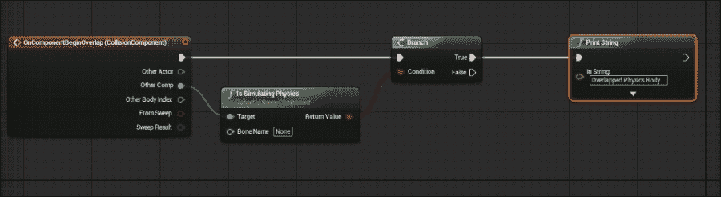

如果我们在蓝图顶部的**Compile**按钮上单击并播放游戏，我们可以看到抛体会直接穿过我们的物理对象，但我们没有看到我们的**Print String**输出到控制台。这是因为关卡中的物理立方体和我们的抛体碰撞都没有将**Generate Overlap Events**参数默认设置为**True**，所以让我们选择一个或多个立方体，并导航到它们的**Collision Settings**在**Details Panel**中，确保**Generate Overlap Events**设置为**True**。让我们在我们的抛体蓝图中也执行相同的操作。现在，如果我们再次播放并射击我们自定义的物理立方体，我们现在将看到我们的**Print String**输出到控制台。

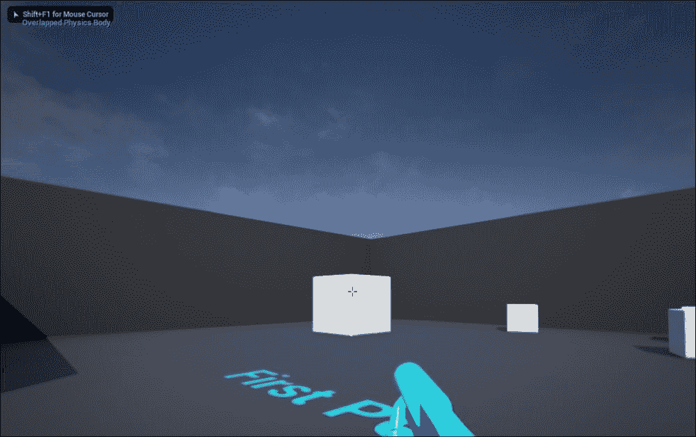

从这里，您可以自由地实验和自定义抛体具有的碰撞预设，看看它在我们的游戏世界中的变化和反应，并添加更多蓝图功能以查看其他可能的功能。

除了**Block**和**Overlap**之外，物体之间可以存在的最后一个碰撞交互是**Ignore**选项。这种类型的**碰撞响应**没有太多内容，因为它如果设置为**Ignore**，将完全忽略不同的**对象响应**。为了我们的示例，在我们的**First Person Projectile**蓝图里，让我们将**Physics Body**对象响应从**Overlap**更改为**Ignore**。如果我们现在播放，我们可以射击物理立方体，但它会完全穿过对象，并且**On Component Begin Overlap**和**Event Hit**事件节点都不会被调用。

# 碰撞交互 - 部分回顾

在本节中，我们通过将不同的碰撞预设组合应用到**第一人称投射物**蓝图上，来亲身体验它如何与游戏世界中的物理演员互动。通过将**物理体**对象响应设置为**阻挡**，将调用**事件击中**事件节点。同时，在投射物的位置将产生一个脉冲，导致对投射物碰撞的物理演员施加一个小的推力。将**物理体**对象响应设置为**重叠**，我们可以使用**组件开始重叠事件**节点，在投射物与物理演员重叠时调用不同的动作。我们只需确保我们关卡中的物理演员和我们的投射物都将**生成重叠事件**设置为**True**。最后，我们简要讨论了当我们的投射物将**物理体**对象响应设置为**忽略**时的结果。正如其名所示，它忽略了对象响应，不会触发任何事件。现在，我们更多地讨论了碰撞交互，接下来让我们讨论如何在虚幻引擎 4 中创建和使用自定义对象和追踪通道响应。

# 自定义对象和追踪通道响应

有时，默认的对象和追踪通道响应不足以满足我们在游戏中想要实现的功能。因此，可能需要为某些资产和场景创建自定义对象和追踪通道响应。为了完成这个任务，我们可以导航到虚幻引擎 4 编辑器顶部的**编辑**下拉菜单并选择**项目设置**。从这里，选择**引擎**部分下的**碰撞**选项。在这里，我们可以创建自定义**对象**、**追踪通道**和**预设**，以便我们在对资产应用碰撞时使用。

让我们从创建一个新的**对象通道**开始，选择此选项并点击**新建对象通道**按钮。在这里，一个对话框窗口会弹出。然后，我们可以自定义**对象通道**的默认响应方式。

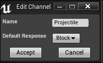

将**对象通道**命名为`投射物`，并将其**默认响应**设置为**阻挡**。现在，让我们通过选择此选项并点击**新建**按钮来创建一个自定义**碰撞预设**，以便出现一个对话框窗口。在这里，我们可以设置预设的默认值：

我们还可以将这个新的**碰撞预设配置文件**命名为`投射物`，将**碰撞启用**属性设置为**碰撞启用**，**对象类型**设置为`投射物`（即我们刚刚创建的那个），并将**描述**属性设置为任何能让我们记住这个**碰撞预设**用途的内容。最后，我们可以将此预设的所有**追踪**和**对象通道**设置为**阻挡**。

为了本节演示的目的，我们不会创建一个自定义的**追踪通道**，但如果我们需要，它的工作方式与创建自定义**对象通道**完全相同；选择**追踪通道**选项，左键单击**新建追踪通道**按钮，命名通道，并将**默认响应**设置为**阻止**、**重叠**或**忽略**。

现在我们已经创建了一个自定义的**对象通道**和一个自定义的**碰撞预设**，让我们将这些应用到**第一人称投射物**蓝图中的**碰撞组件**。一旦你进入**第一人称投射物**蓝图，从左上角的**组件**选项卡中选择**碰撞**组件，并导航到蓝图窗口右下角的**详情面板**中的**碰撞**部分。如果我们查看**碰撞预设**下拉菜单，我们会看到我们的`投射物`**碰撞预设**可用，当我们选择此选项时，我们会看到我们设置的默认值：

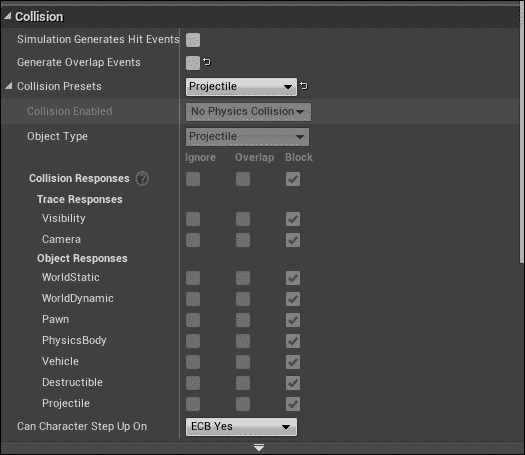

我们还可以看到我们在**碰撞组件**的**对象响应**部分中创建的`投射物`**对象通道响应**。现在，如果我们需要，我们可以将所有投射物资产设置为具有**投射物碰撞预设**，这样所有投射物在碰撞时都会表现出相同的行为。除此之外，我们可以通过将**投射物**对象响应设置为**阻止**、**重叠**或**忽略**投射物来使其他资产以特定方式与投射物碰撞。现在，当我们玩游戏时，我们可以看到当发射投射物时，**第一人称投射物**蓝图的行为完全符合预期。

就作为一个提醒，我们只能有最多 18 个自定义的**对象通道**和**追踪通道**，如果我们删除了在游戏中使用过的**对象类型**，它将恢复到**世界静态**，如果我们删除了在游戏中使用过的追踪通道，追踪的行为将是未定义的。

# 自定义对象和追踪通道响应 - 章节回顾

在本节中，我们深入探讨了如何创建和实现自定义对象、追踪通道和自定义碰撞预设。然后我们将这些自定义通道和预设应用到**第一人称投射物**蓝图，并发现我们可以在使用自定义碰撞预设和**对象**通道时为投射物实现相同的碰撞行为。现在我们已经创建了我们的自定义对象和追踪通道，并创建了我们的碰撞预设，我们可以继续深入探讨 Unreal Engine 4 中存在的其他默认碰撞预设。

# 深入的碰撞预设

为了结束这一章，让我们简要讨论一下在这一点上我们尚未讨论过的 Unreal Engine 4 中可用的剩余碰撞预设：

+   **自定义**：此碰撞预设允许您通过选择**碰撞启用**属性、设置**对象类型**属性以及完全自定义**跟踪**和**对象响应**如何对不同类型的碰撞做出反应来完全自定义您希望碰撞如何行为。这种类型的碰撞预设在我们需要自定义资产碰撞，并且默认碰撞预设不适合我们需要的碰撞类型时非常有用。

+   **阻止所有动态对象**：此碰撞预设默认阻止所有演员，并将碰撞本身设置为**WorldDynamic**对象。这种类型的碰撞预设对于动态对象或你希望在游戏中与其他对象碰撞时阻止移动的对象非常有用。最后，**碰撞启用**属性设置为**碰撞启用**。

+   **重叠所有动态对象**：此碰撞预设默认重叠所有演员，并将碰撞本身设置为**WorldDynamic**对象。这种类型的碰撞预设对于你希望在与其他对象碰撞时重叠的动态对象非常有用。最后，**碰撞启用**属性设置为**无物理碰撞**，意味着资产的碰撞不会使用游戏物理。

+   **仅忽略 Pawn**：此碰撞预设默认阻止所有演员，但忽略**Pawn**和**车辆**对象响应。此预设还将碰撞的**对象类型**设置为**WorldDynamic**，对于你希望在游戏中忽略**Pawn**和**车辆**的资产非常有用。最后，**碰撞启用**属性设置为**无物理碰撞**。

+   **仅重叠 Pawn**：此碰撞预设默认阻止所有演员，但重叠**Pawn**和**车辆**对象响应。它还重叠**相机**跟踪通道。此预设还将碰撞的**对象类型**设置为**WorldDynamic**，对于在与其他**Pawn**、**车辆**和**相机跟踪**碰撞时需要触发重叠事件的资产非常有用。最后，**碰撞启用**属性设置为**无物理碰撞**。

+   **观众**：此碰撞预设默认忽略所有演员，除了**WorldStatic**对象响应。此预设还将碰撞的**对象类型**设置为**Pawn**，在你想让玩家在多人情况下看到游戏时非常有用。最后，**碰撞启用**属性设置为**无物理碰撞**。

+   **角色网格**：此碰撞预设是一个**Pawn 对象类型**，用于创建玩家角色时的**角色网格**。默认情况下，此预设忽略**可见性**跟踪响应和**Pawn**以及**车辆**对象响应，尽管它阻止了剩余的值。最后，**碰撞启用**属性设置为**无物理碰撞**。

+   **可破坏(Destructible)**: 此碰撞预设是一个**可破坏对象类型**，用于游戏中可以破坏的资产。默认情况下，此预设阻止所有**轨迹**和**对象通道**。其**碰撞启用**属性设置为**碰撞启用**。

+   **不可见墙**: 此碰撞预设是一个**世界静态对象类型**，用作不可见的墙，阻止所有**轨迹**和**对象响应**，除了**可见性轨迹响应**，该响应被此预设忽略。此预设的工作方式与阻塞体积完全相同。最后，其**碰撞启用**属性设置为**碰撞启用**。

+   **动态不可见墙(Invisible Wall Dynamic)**: 此碰撞预设是一个**世界动态对象类型**，用作不可见的墙，其功能与**不可见墙**碰撞预设完全相同，其中它阻止所有**轨迹**和**对象响应**，除了**可见性轨迹响应**，该响应也被此预设忽略。最后，其**碰撞启用**属性设置为**碰撞启用**。

+   **触发器**: 此碰撞预设是一个**世界动态对象类型**，用作**触发器**，这意味着它的工作方式类似于**触发体积**，因此我们可以用它来调用我们游戏中的所有事件和函数。默认情况下，**触发器碰撞预设**重叠所有**轨迹**和**对象通道响应**，除了**可见性轨迹通道**，该通道被此预设忽略。最后，其**碰撞启用**属性设置为**无物理碰撞**。

+   **布娃娃(Ragdoll)**: 此碰撞预设用于模拟骨骼网格组件。其**对象类型**设置为**物理体**。我们可以使用此预设来处理当玩家被击败或失去控制时变成布娃娃的角色网格，并希望玩家角色被物理控制接管。默认情况下，此碰撞预设阻止所有**轨迹**和**对象响应**，除了**Pawn 对象响应**，该响应被忽略。最后，其**碰撞启用**属性设置为**碰撞启用**。

+   **车辆**: 此碰撞预设是一个**车辆对象类型**，用于我们游戏世界中任何移动的车辆资产。默认情况下，此预设阻止所有**轨迹**和**对象响应**。其**碰撞启用**属性设置为**碰撞启用**。

+   **用户界面(UI)**: 此碰撞预设是一个**世界动态对象类型**，用于任何**UI**资产（例如**UMG HUD**元素）。默认情况下，此预设重叠所有**轨迹**和**对象响应**，除了**可见性轨迹响应**，该响应被此预设阻止。最后，其**碰撞启用**属性设置为**无物理碰撞**。

# 深入了解碰撞预设 - 一节回顾

在本节中，我们深入研究了 Unreal Engine 4 为用户提供的所有默认碰撞预设，并通过对每个预设的目的和功能进行分析。现在我们已经涵盖了碰撞预设，我们可以现在总结本章，并继续讨论 Unreal Engine 4 中的约束。

# 摘要

在本章中，我们首先分析了跟踪和碰撞响应的主题，讨论了碰撞在 Unreal Engine 4 中的工作原理及其实现方式。我们还讨论了这些响应的工作原理、参数值以及如何详细地将这些响应实现到我们的蓝图资产中。

接下来，我们通过定义每种类型是什么以及它们如何被使用，学习了简单和复杂碰撞。我们还探讨了它们的优缺点以及如何生成不同类型的简单碰撞。

此外，你学习了更多关于复杂碰撞以及如何在 Unreal Engine 4 中生成这些类型碰撞的知识。你还了解了如何在第三方艺术程序中创建自定义碰撞外壳。

此外，你学习了关于碰撞交互的内容。我们以**第一人称投射**蓝图为例，说明了这些交互在为我们的资产编写不同行为时的应用。

此外，我们还探讨了自定义对象和跟踪通道的目的。我们讨论了如何创建自定义碰撞预设，包括如何在蓝图中实现这些自定义参数。

最后，我们讨论了 Unreal Engine 4 中存在的不同碰撞预设、它们的目的以及它们如何详细工作。

现在我们对碰撞的工作原理以及如何为我们的资产实现不同类型的碰撞有了更深入的了解，我们现在可以深入探讨在 Unreal Engine 4 中创建约束。
