# 第五章：物理阻尼、摩擦和物理体

在本章中，我们将更深入地探讨 Unreal Engine 4 中的**物理体**，并分析引擎如何使用物理属性，如**角阻尼**和**线性摩擦**来模拟游戏中的真实世界物理。首先，我们将检查**物理体**是什么。我们还将查看这些资产可用的某些详细属性。此外，我们将讨论以下主题：

+   角向和线性摩擦

+   物理材料 - 概述

+   物理阻尼

为了本章的目的，我们将继续使用 Unreal Engine 4 和我们在第一章中创建的**Unreal_PhyProject**，即 Unreal Engine 中的*数学与物理基础*。让我们首先讨论 Unreal Engine 4 中的**物理体**。

# 物理体 - 概述

在创建**物理体**时，有多种方法可以采取（其中大部分我们在此之前的点已经介绍过），因此我们不会深入讨论**物理体**的创建。我们可以通过在放置到我们的级别时检查资产的**模拟物理**属性，使**静态网格**作为**物理体**反应：

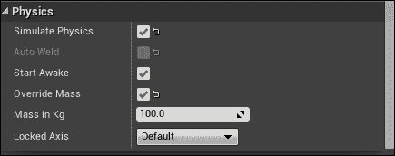

我们也可以通过创建**物理资产**和**骨骼网格**来创建**物理体**，它们默认具有物理属性。最后，在蓝图中的**形状组件**，如球体、盒子和胶囊，如果设置了任何类型的碰撞、重叠或其他物理模拟事件，将自动获得物理体的属性。一如既往，记得在尝试模拟物理或建立**物理体**之前，确保我们的资产已经应用了碰撞，否则模拟将无法工作。

当你与**静态网格**或任何其他我们将尝试模拟物理的资产的物理属性工作时，我们将在**详细信息**面板中看到一些不同的参数，我们可以更改这些参数以产生所需的效果。

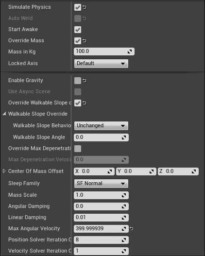

让我们分解这些属性：

+   **模拟物理**：此参数允许你启用或模拟所选资产的物理。当此选项未选中时，资产将保持静止，一旦启用，我们可以编辑**物理体**属性以进行额外定制。

+   **自动焊接**：当此属性设置为`True`，并且资产附加到父对象（如蓝图）时，两个体将合并为一个单一刚体。**物理**设置，如碰撞配置文件和体设置，由**根组件**确定。

+   **开始清醒**：此参数确定所选资产在生成后是否立即**模拟物理**，或者它将在稍后时间**模拟物理**。我们可以通过级别和演员蓝图更改此参数。

+   **覆盖质量**：当此属性被勾选并设置为`True`时，我们可以使用**千克**（**kg**）自由更改我们的资产的质量。否则，**千克质量**参数将设置为默认值，该值基于应用于物理材料的计算和质量缩放值。

+   **千克质量**：此参数确定所选资产的质量，使用千克为单位。当您处理不同尺寸的物理对象并希望它们适当地对力做出反应时，这一点很重要。

+   **锁定轴**：此参数允许您锁定对象沿指定轴的物理移动。我们可以选择锁定在**项目设置**中指定的默认轴。我们还可以选择锁定沿单独的*X*、*Y*和*Z*轴的物理移动。我们也可以选择不锁定任何轴的平移或旋转，或者使用**自定义**选项分别定制每个轴。

+   **启用重力**：此参数确定对象是否应该受到重力作用。重力可以在级别的**世界设置**属性中或**项目设置**中**引擎**属性的**物理**部分中更改。

+   **使用异步场景**：此属性允许您为指定的对象启用**异步物理**。默认情况下，我们无法编辑此属性。为了做到这一点，我们必须导航到**项目设置**，然后进入**物理**部分。在高级**模拟**选项卡下，我们将找到**启用异步场景**参数。在异步场景中，对象（如**可破坏**演员）被模拟，而**同步**场景是经典物理任务（如掉落的箱子）发生的地方。

+   **覆盖实例上的可通行斜坡**：此参数确定我们是否可以自定义对象的可通行斜坡。通常，我们会使用此参数为我们的玩家角色，但此属性允许我们定制对象可以行走的斜坡的陡峭程度。这可以通过**可通行斜坡角度**参数和**可通行斜坡行为**参数进行具体控制。

+   **覆盖最大穿透速度**：此参数允许您自定义所选物理体的**最大穿透速度**。

+   **质心偏移**：此属性允许您指定所选对象质心相对于计算位置的特定矢量偏移。在处理敏感的物理模拟（如飞行）时，能够知道甚至修改对象的质心位置可能非常有用。

+   **睡眠家族**: 此参数允许您控制物理对象在睡眠模式或物体移动并缓慢停止时使用的函数集。**SF 敏感**选项包含具有较低睡眠阈值的值。这最适合用于可以非常缓慢移动的物体或改进的物理模拟（如台球）。**SF 正常**选项包含具有较高睡眠阈值的值，与**SF 敏感**选项相比，一旦运动，物体将以更突然的方式停止。

+   **质量比例**: 此参数允许您通过乘以一个标量值来缩放我们的物体质量。数字越低，物体的质量就越低，而数字越高，物体的质量就越高。此属性可以与**质量（千克）**参数结合使用，以增加对物体质量的更多定制。

+   **角阻尼**: 此属性是应用于物体的阻力修改器，以减少角运动，即减少物体的旋转。我们将在本章后面更详细地介绍**角阻尼**。

+   **线性阻尼**: 此属性用于模拟游戏世界中可能帮助的多种摩擦类型。此修改器添加一个阻力，以减少线性运动，减少物体的平移。我们将在本章后面更详细地介绍**线性阻尼**。

+   **最大角速度**: 此参数限制所选对象的最大角速度，以防止物体以高速度旋转。通过增加此值，一旦物体受到足够强大的外力影响，使其达到**最大角速度**值，物体将高速旋转。通过减少此值，物体的旋转速度将减慢，并且根据所应用的角阻尼，物体将更快地停止。

+   **位置求解器迭代次数**: 此参数反映了物理体的位置求解器迭代次数；求解器迭代次数负责定期检查物理体的位置。增加此值将更加占用 CPU 资源，但稳定性更好。

+   **速度求解器迭代次数**: 此参数反映了物理体的速度求解器迭代次数；求解器迭代次数负责定期检查物理体的速度。增加此值将更加占用 CPU 资源，但稳定性更好。

既然我们已经讨论了虚幻引擎 4 中**物理体**可用的所有不同参数，你可以自由地调整这些值，以便更好地理解每个属性控制的内容及其如何影响对象的物理特性。由于属性众多，我们不会详细讲解每个属性的示例，但学习更多最佳方式是通过实验这些值。然而，我们将探讨如何创建各种物理体示例，以便在本章后面探索**阻尼**和**摩擦**。

# 物理体 – 章节回顾

在本节中，我们讨论了什么是**物理体**以及如何通过使用静态网格、骨骼网格、蓝图中的形状组件和物理资产来创建它们。此外，你还了解了在虚幻引擎 4 中**物理体**所存在的所有不同参数。我们还查看每个属性及其如何影响指定对象的物理特性。现在，我们已经对**物理体**有了更深入的了解，让我们继续讨论**角阻尼**和**线性阻尼**。

# 角阻尼和线性阻尼

在本节中，我们将更详细地讨论**角阻尼**和**线性阻尼**，重点关注物理体的摩擦特性。此外，我们将讨论物理阻尼及其在设置蓝图约束时的应用。让我们先简要讨论**角阻尼**和**角速度/动量**。

在物理学领域，**角速度**被定义为角位移的变化率，也称为矢量量，它指定了物体的角速度或旋转速度以及物体旋转的轴。

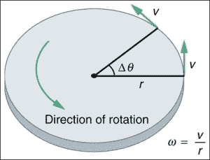

在前面的图中，我们可以看到**w**，即角速度，等于旋转物体的速度除以半径。

**线性角动量**与**转动惯量**（*I*）和**角速度**（*w*）成正比，所以基本公式是*L = Iw*。我们现在知道*w*等于物体的速度和半径，因此我们可以将表达式写为*L = I (v/r)*。最后，**转动惯量**等于物体的半径平方乘以物体的质量，即*I = r² * (m)*。考虑到这一点，我们现在可以重新写出**线性角动量**的表达式为*L = (r² * m) * (v/r)*，或者更简单地，我们可以将表达式写为*L = rmv*，因此物体的**线性角动量**等于物体的半径乘以其质量以及施加给它的速度。

现在我们对**角速度**和**角动量**有了更深入的了解，让我们将这一知识应用到我们在第一章中创建的**Unreal_PhyProject**游戏项目中。默认情况下，在**FirstPersonExampleMap**级别中放置了许多物理体立方体，我们可以更改它们的属性来探索**角阻尼**和**角速度**。

让我们从选择**FirstPersonExampleMap**中的一个随机立方体开始，在左侧的**详细信息**面板中查看其**物理**属性。为了举例，让我们在**物理**部分向下方向箭头处左键单击以展开高级属性。我们将看到的第一个属性是**启用重力**，默认设置为`True`；让我们将此属性设置为`False`，这样选定的物理体就不会受到重力作用。有了这个变化，我们现在可以将物理体向上移动到*Z*方向，使其在空中漂浮。现在，如果我们玩游戏，物理体除非被玩家用**第一人称投射物**蓝图射击，否则不会移动。一旦被射击，物理体将开始旋转并沿适当的方向移动，这取决于它被射击的位置以及投射物蓝图施加的冲量。

返回到**物理体**的**详细信息**面板，我们现在可以探索**角阻尼**属性，它默认设置为`0`，这意味着对象没有额外的阻力作用在其上以减少角速度。通过增加这个值，我们可以看到，当我们向游戏中的对象射击时，角速度以更强的指数值减慢，与**角阻尼**值设置为`0`时的行为相比。我们还可以通过改变**最大角速度**参数的值来设置物理对象在受到力作用时可以旋转的速度限制；值越高，如果施加足够的力，对象旋转的速度就越快。

对于这个例子，让我们将**角阻尼**的值设置为`.01`，并将**最大角速度**参数设置为`800`。我们将覆盖**千克质量**参数，并设置一个自定义质量为`10.0`。现在，我们应该为我们的物理体对象设置以下属性：

现在，如果我们玩游戏并射击我们的**物理体**对象，我们会看到当被玩家射击时，对象可以以非常快的速度旋转。为了找出什么还能影响对象的**角速度**和**角阻尼**，我们可以增加或减少**千克质量**、**角阻尼**和**最大角速度**参数的值。在掌握了**角阻尼**和**角物理**的知识后，我们现在来讨论 Unreal Engine 4 中的**线性阻尼**和**线性物理**。

在物理学中，**线性速度**被定义为线性位移随时间的变化率，也称为矢量量，它指定了物体的线性速度和物体移动的方向。

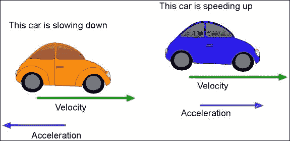

基本**线性速度**的公式是 *V = S/t*，或者说速度等于物体的位移变化除以物体移动这个位移变化所需的时间。**线性阻尼**的概念是随着时间的推移减少运动，以便在施加一个会导致位移的力后，使物体完全停止，这也被称为**摩擦**。当涉及到**线性动量**时，公式是 *p = mv*，其中 *p* 是**动量**的值，*m* 是物体的质量值，*v* 是物体的速度。

在虚幻引擎 4 中，我们可以通过两种方式来阻尼物理体的线性速度：通过创建一个应用于物理体的**物理材质**，或者通过更改物理体**详情**面板中的**物理**部分的**线性阻尼**属性。为了本节的目的，我们只将讨论如何更改**线性阻尼**属性，我们将在本章的后面更详细地介绍如何创建**物理材质**。在**Unreal_PhyProject**中的**FirstPersonExampleMap**工作，让我们继续创建一个如何正确利用**线性阻尼**属性为我们的物理体重现**摩擦**的工作示例。对于这个例子，我们可以使用我们用来演示角速度和角阻尼相同的物理体，但我们确实想确保我们检查了**启用重力**参数，并将其余参数设置为默认值，这样我们就可以从这个示例从头开始。

通过将**线性阻尼**属性的值增加到例如`100`并玩游戏，我们会发现当我们射击物理体时，它不会像将**线性阻尼**属性设置为默认值`.01`时那样移动得那么多。当值为`100`时，**线性阻尼**属性使得物理体几乎保持在原地，但物体的旋转仍然按正常方式改变，因为我们没有改变涉及角阻尼的属性。**线性阻尼**的使用非常直接，并且没有太多的定制（如物理体在其**物理**属性中的上下文中讨论的那样），但我们可以使用**物理材质**添加额外的属性。

# 角度和线性阻尼 - 章节回顾

在本节中，我们详细讨论了在现实物理背景下**角阻尼**和**线性阻尼**以及**角速度**和**线性速度**的概念。一旦我们掌握了这些概念，我们就将你在使用虚幻引擎 4 中的物理体以及这些对象的**物理属性**方面所学到的知识应用到实践中，以探索它们如何影响游戏中的物理体。现在我们已经检查了角阻尼和线性阻尼，我们可以继续简要讨论**物理材料**是什么以及如何将它们应用到我们的物理体上。

# 物理材料 - 概述

**物理材料**是用于定义物理体在动态与游戏世界交互时响应的资产。当你第一次创建**物理材料**时，你会看到一个默认值集，这些值与应用于所有物理对象的默认**物理材料**相同。

要创建**物理材料**，让我们导航到**内容浏览器**并选择**内容**文件夹，使其高亮显示。从这里，我们可以右键单击**内容**文件夹并选择**新建文件夹**选项来为我们的**物理材料**创建一个新文件夹；将这个新文件夹命名为`PhysicalMaterials`。现在，在`PhysicalMaterials`文件夹中，右键单击**内容浏览器**的空白区域并导航到**物理**部分，选择**物理材料**。确保将这个新资产命名为`PM_Test`。

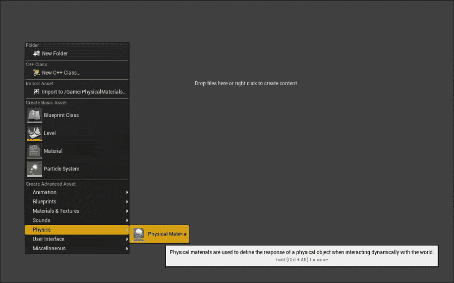

双击新的**物理材料**资产以打开**通用资产编辑器**，我们应该看到以下可以编辑的值，以便使我们的物理对象以特定方式行为：

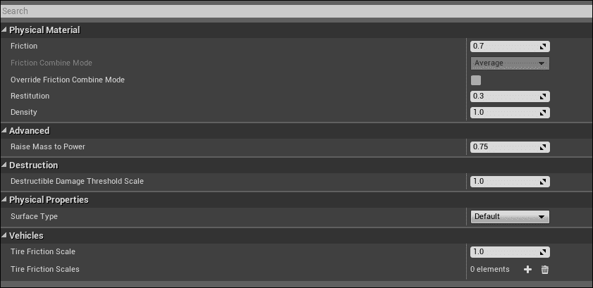

让我们花几分钟时间逐一分析这些属性：

+   **摩擦**：此参数控制物体在这个表面上滑动的容易程度。摩擦值越低，表面越滑。摩擦值越高，表面越不滑。例如，冰的**摩擦**表面值会是`.05`，而**摩擦**表面值为`1`会导致物体移动后不太容易滑动。

+   **摩擦组合模式**：此参数控制多个材料计算摩擦的方式。当涉及到多个物理材料之间的交互以及我们希望如何进行这些计算时，此属性非常重要。我们的选择是**平均**、**最小**、**最大**和**乘法**。

+   **覆盖摩擦组合模式**：此参数允许您设置**摩擦****组合模式**参数，而不是使用在**项目设置** | **引擎** | **物理**部分找到的**摩擦组合模式**。

+   **恢复系数**：此参数控制表面有多弹。值越高，表面越弹。

+   **密度**：此参数与物体的形状结合使用，以计算其质量属性。数值越高，物体越重（以每立方厘米克计）。

+   **提升质量到幂**：此参数用于调整随着物体变大质量增加的方式。这应用于基于固体物体计算的质量。实际上，较大的物体往往不是实心的，而更像壳体（如车辆）。这些值被限制在`1`或以下。

+   **可破坏损坏阈值缩放比例**：此参数用于缩放应用到此物理材质的可破坏对象的损坏阈值。

+   **表面类型**：此参数用于描述我们试图在我们的项目中模仿的哪种真实世界表面。我们可以通过导航到**项目设置** | **物理** | **物理表面**部分来编辑这些值。

+   **轮胎摩擦缩放比例**：此参数用作每种类型轮胎的整体轮胎摩擦标量，并乘以轮胎的父值。

+   **轮胎摩擦缩放比例**：此参数几乎与**轮胎摩擦缩放比例**参数相同，但它寻找一个**轮胎类型**数据资产来关联它。**轮胎类型**可以通过在**内容浏览器** | **杂项** | **数据资产** | **轮胎类型**部分右键单击来创建。

现在我们已经简要讨论了如何创建**物理材质**以及它们的属性，接下来让我们看看如何将**物理材质**应用到我们的物理体上。在**FirstPersonExampleMap**中，我们可以选择整个关卡中的任何物理体立方体，并在**碰撞**下的**详细信息**面板中，我们会找到**物理材质覆盖**参数。正是在这里，我们可以将我们的**物理材质**应用到立方体上，并查看它如何对我们的游戏世界做出反应。

为了举例说明，让我们回到我们之前创建的**物理材质**，`PM_Test`，将**摩擦**属性从`0.7`更改为`0.2`，并保存。在这个更改到位后，让我们在**FirstPersonExampleMap**中选择一个物理体立方体，并将**物理材质**，`PM_Test`，应用到对象的**物理材质覆盖**参数中。现在，如果我们玩游戏，我们会看到我们应用了**物理材质**，`PM_Test`的立方体在被玩家射击后会开始滑动，比它有**摩擦**值`0.7`时更频繁。我们还可以将此**物理材质**应用到**FirstPersonExampleMap**中的地板网格上，以查看它如何影响我们游戏世界中的其他物理体。从这里开始，您可以随意调整**物理材质**参数，看看我们如何影响我们游戏世界中的物理体。

最后，让我们简要讨论如何将**物理材质**应用到常规**材质**、**材质实例**和**骨骼网格**上。

要将**物理材质**应用到普通材质，我们首先需要在**内容浏览器**中创建或打开一个已经创建的材质。要创建材质，只需在**内容浏览器**的空白区域右键单击并从下拉菜单中选择**材质**。双击**材质**以打开**材质编辑器**，我们将在**材质编辑器**底部左角的**详细信息**面板的**物理材质**部分看到**Phys Material**参数：

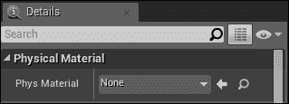

要将**物理材质**应用到**材质实例**，我们首先需要通过导航到**内容浏览器**并在空白区域右键单击来创建**材质实例**。在**材质与纹理**部分，我们将找到一个**材质实例**的选项。双击此选项以打开**材质实例编辑器**。在此编辑器顶部左角的**详细信息**面板中，我们将找到在**常规**部分下应用**Phys Material**的选项：

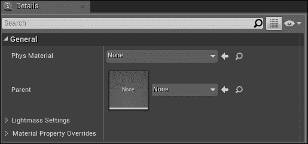

最后，要将**物理材质**应用到**骨骼网格**上，我们需要创建或打开一个已经创建的包含**骨骼网格**的**物理资产**。在**第一人称射击项目**模板中，我们可以在**Engine Content**文件夹下找到**TutorialTPP_PhysicsAsset**。如果**Engine Content**文件夹在**内容浏览器**中默认不可见，我们需要简单地导航到**内容浏览器**右下角的**视图选项**，并勾选**显示引擎内容**参数。在**Engine Content**文件夹下，我们可以导航到**Tutorial**文件夹，然后到**TutorialAssets**文件夹以找到**TutorialTPP_PhysicsAsset**资产。双击此资产以打开**物理资产工具**。现在，我们可以点击**骨骼网格**上找到的任何身体部分以突出显示它。一旦突出显示，我们可以在**物理**部分下的**详细信息**面板中查看**简单碰撞物理材质**的选项。在这里，我们可以将任何我们的**物理材质**应用到这个身体部分。

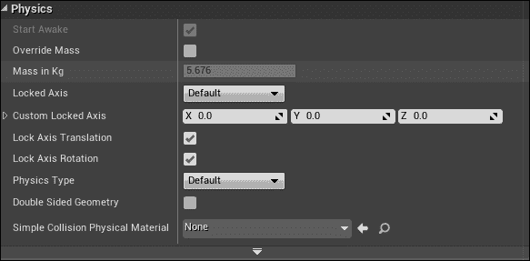

# 物理材质 – 章节回顾

在本节中，我们详细讨论了**物理材质**是什么以及它们在应用到物理体时的参数含义。此外，我们还探讨了如何在**物理资产工具**中应用**物理材质**到物理体、**材质**、**材质实例**和**骨骼网格**。现在，我们对**物理材质**有了更好的理解，我们可以通过在蓝图中使用**约束**来更好地理解**物理阻尼**来结束这一章。

# 物理阻尼

为了更好地掌握虚幻引擎 4 中的**物理阻尼**，我们将创建一个简单的带有蓝图的工作示例来展示**约束**。首先，让我们继续在**Unreal_PhyProject**项目中工作，导航到**内容浏览器**然后到**蓝图**文件夹，右键单击以创建一个新的**Actor**蓝图。让我们将这个蓝图命名为`BP_Constraint`并双击它以打开**蓝图编辑器**。

要开始这个蓝图，让我们导航到**视口**选项卡，然后使用**添加组件**的上下文相关下拉菜单将**场景组件**添加到**组件**选项卡。将此组件命名为`ROOT`。接下来，我们将从**基本形状**部分添加两个立方网格到**添加组件**菜单。将一个命名为`Stable Mesh`，另一个命名为`Constrained Mesh`。最后，让我们从**物理**部分添加一个**物理约束**组件并将其命名为`Physics Constraint`。现在，我们需要以更好地展示如何在虚幻引擎 4 中使用物理阻尼的方式定位这些组件。

在我们的蓝图**视口**选项卡中设置我们资产的位置如下：

+   **稳定网格**: `X – 0.0`, `Y – 0.0`, 和 `Z – 350.0`

+   **约束网格**: `X – 120.0`, `Y – 0.0`, `Z – 0.0`

+   **物理约束**: `X – 0.0`, `Y – 0.0`, `Z – 340.0`

现在，我们需要设置我们的**物理约束**资产默认参数，以便它能够识别作为锚点的网格。另一个网格是附着在其上的自由悬挂的摆。为了完成这个任务，让我们选择**物理约束**组件。然后，在其**详细信息**面板中，我们将在**约束**部分下找到**组件名称 1**和**组件名称 2**的参数。对于这些参数，我们需要应用我们将用于约束的两个网格的名称：`Stable Mesh`和`Constrained Mesh`。将这些参数设置如下：

+   **组件名称 1**: `稳定网格`

+   **组件名称 2**: `约束网格`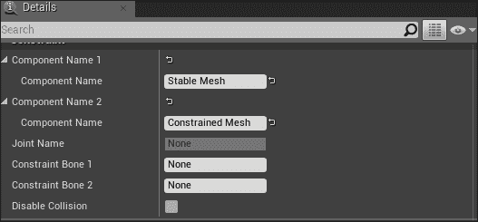

在这些参数设置完成后，我们现在可以将我们的**BP_Constraint**放置到**FirstPersonExampleMap**中，以查看约束的实际效果。首先，确保在将此蓝图放置到我们的关卡中之前编译并保存蓝图。一旦放置到我们的关卡中，确保将蓝图从地面上抬起，这样就不会有任何约束资产与我们的游戏世界之间的碰撞或裁剪，当我们玩游戏以查看约束如何工作时，我们将看到以下结果：

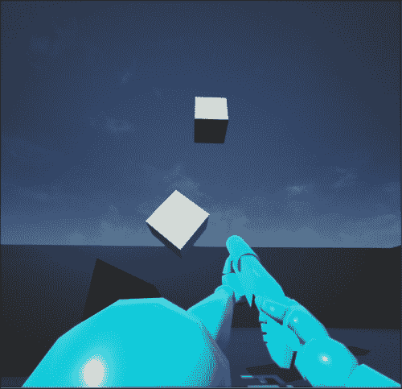

我们将看到，摆动的立方体会继续无休止地来回摆动，没有任何阻尼或摩擦的迹象来减缓它。让我们改变这一点。然后，返回到**BP_Constraint**蓝图，并选择**物理约束**组件。在**详细信息**面板中，我们将看到一些可以更改以影响其行为的约束参数。让我们简要定义在**物理约束组件**的**详细信息**面板中找到的每个参数：

+   **组件名称 1**: 此参数需要约束的第一个组件属性的名称。如果此参数为空，则名称参数将在其**所有者**中搜索参数名称。如果**所有者**返回 null，则此参数将使用**演员 1**的**根组件**。

+   **组件名称 2**: 此参数需要约束的第二个组件属性的名称。如果此参数为空，则名称参数将在其**所有者**中搜索参数名称。如果**所有者**返回 null，则此参数将使用**演员 2**的**根组件**。

+   **联合名称**: 当您与**骨骼网格**一起工作时，此参数被使用，并需要**关节**所连接的**骨骼**名称。

+   **约束骨骼 1**: 此参数需要连接到此约束的第一个骨骼（身体）的名称，它将是**物理资产**中的子骨骼。

+   **约束骨骼 2**: 此参数需要连接到此约束的第二个骨骼（身体）的名称，它将是**物理资产**中的父骨骼。

+   **禁用碰撞**: 此参数禁用通过此约束连接的身体的碰撞。

+   **启用投影**: 此参数确保所有身体都被投影，以便在将足够高的线性或角速度应用于每个元素时，这两个身体仍然看起来是连接在一起的。例如，旋转过快的系绳球会导致元素看起来分离，但此参数阻止这种情况发生。如果两个身体之间的距离误差超过 0.1 单位，或者旋转误差超过 10 度，则投影将纠正这一点。

+   **投影线性容差**: 此参数表示以世界单位表示的**线性容差**，如果距离误差超过此容差限制，则将投影身体。

+   **投影角容差**: 此参数表示以世界单位表示的**角容差**，如果角距离误差超过此容差限制，则将投影身体。

+   **线性 X 运动**: 此参数指示是否允许沿**X**轴的线性运动，阻止或限制。如果此参数被限制，则将使用**线性限制**属性来确定是否允许运动。

+   **线性 Y 运动**: 此参数指示是否允许沿**Y**轴的线性运动，阻止或限制。如果此参数被限制，则将使用**线性限制**属性来确定是否允许运动。

+   **线性 Z 轴运动**：此参数指示是否允许沿**Z**轴的线性运动，是否阻止或限制。如果此运动被限制，则将使用**线性限制**属性来确定是否允许运动。

+   **线性可断裂**：此参数定义了约束中的关节是否基于**线性断裂阈值**属性可断裂。

+   **线性断裂阈值**：此参数定义了打破此关节所需的力阈值。

+   **角摆动 1 运动**：此参数指示是否允许围绕**Z**轴的旋转，是否阻止或限制。如果此运动被限制，则将使用**角限制**属性来确定运动范围。

+   **角扭转运动**：此参数指示是否允许围绕**X**轴的旋转，是否阻止或限制。如果此运动被限制，则将使用**角限制**属性来确定运动范围。

+   **角摆动 2 运动**：此参数指示是否允许围绕**Y**轴的旋转，是否阻止或限制。如果此运动被限制，则将使用**角限制**属性来确定运动范围。

+   **角可断裂**：此参数确定是否可以用角力打破关节。

+   **角断裂阈值**：此参数规定了打破关节所需的角力。

+   **线性位置驱动**：此参数启用/禁用线性位置驱动。在此，我们可以设置**线性 X**、**Y**、**Z**轴和**线性位置目标**。

+   **线性速度驱动**：此参数启用/禁用线性速度驱动，在此我们可以设置约束的**X**、**Y**和**Z**线性速度目标。

+   **线性位置强度**：此参数规定了应用于线性驱动的弹簧力。

+   **线性速度强度**：此参数确定应用于线性驱动的阻尼力。

+   **线性驱动力限制**：此参数限制了可以应用于线性驱动的力。

+   **角方向驱动**：此参数使沿**X**、**Y**或**Z**轴的角驱动朝向目标方向。

+   **角速度驱动**：此参数使沿**X**、**Y**和**Z**轴的角驱动朝向目标速度。

+   **角驱动力限制**：此参数限制了角驱动可以施加的力。

+   **角位置强度**：此参数对角驱动应用弹簧力值。

+   **角速度强度**：此参数对角驱动应用阻尼值。

+   **角驱动模式**：此参数确定估计角路径的方式；我们可以选择**SLERP（球面线性插值）**或将其分解为**扭转和摆动**。

既然我们已经简要讨论了**物理约束**组件中可用的参数，让我们将角阻尼应用到我们的约束上，以便它可以减速并完全停止。为了实现这一点，我们需要应用**角速度驱动**并将**角速度强度**设置为`15.0`。接下来，我们需要将**角驱动模式**设置为**扭转和摆动**；其余参数可以设置为它们的默认值。一旦应用，让我们编译、保存并跳回到**FirstPersonExampleMap**。我们会看到，在短时间内，**约束网格**会逐渐停止。这是由于**角速度强度**参数的高值；值越高，**约束网格**停止的速度越快。数值越低，**约束网格**停止所需的时间越长，甚至可能到网格不会停止摆动。

为了总结本章，我们可以设置一个角力断裂，这样如果约束网格移动的力量足够大，它将完全从约束中断裂并成为其独特的物理体。为了完成这个任务，让我们回到**BP_Constraint**蓝图并从**组件**选项卡中选择**物理约束**组件。现在，在**角限制**部分下的**细节**面板中，我们可以将**角摆动 1 运动**、**角扭转运动**和**角摆动 2 运动**设置为**限制**，并保留它们的**角度**值作为默认值。最后，确保**角可断裂**参数被勾选，并将**角断裂阈值**设置为`50`。如果我们编译并保存蓝图并跳回到**FirstPersonExampleMap**级别，我们会看到当我们射击约束网格足够多次以增加其角速度时，一旦达到我们设置的阈值，网格将完全从约束中分离。从这里，我们可以将其作为独立的物理体与之交互。这种场景在你想模拟轮胎秋千的物理效果，或者为任何我们希望提供这种行为的摆锤对象时很有用。请随意实验**物理约束**的值，看看我们还能如何影响约束的行为。

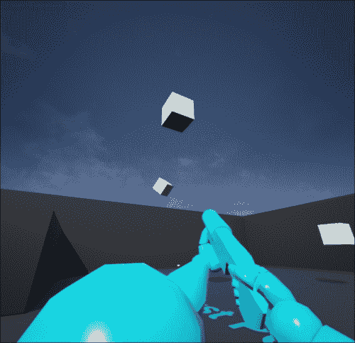

# 物理阻尼 – 小节回顾

在本节中，我们探讨了如何使用蓝图和**物理约束**组件来探索**物理阻尼**。通过在**物理约束**中设置值，我们能够在游戏世界中模拟一个摆动永不停歇的摆锤，直到我们使用**角速度强度**参数应用角阻尼。最后，我们应用了一个角阈值，这将导致我们的约束网格从关节处断裂并成为其独立的物理体。

# 摘要

在本章中，我们讨论了什么是**物理体**以及它们在虚幻引擎 4 中的工作方式。此外，我们还探讨了与**物理体**相关的属性以及这些属性如何影响这些体在游戏中的行为。

接下来，我们探讨了**角阻尼**和**线阻尼**是什么，以及它们如何影响我们的**物理体**。我们还讨论了现实世界中的物理，包括线性和角动量，以及线速度和角速度。

此外，我们简要讨论了**物理材料**，如何创建它们，以及当它们影响游戏中的行为时，它们的属性包含什么。然后，我们回顾了如何将**物理材料**应用于静态网格、材质、材质实例和骨骼网格。

最后，我们通过创建一个工作蓝图示例，将**物理阻尼**应用于**物理约束**，其中我们将两个立方网格约束在一起并创建了一个摆锤。此外，我们还应用了角阻尼和角阈值断开，以逐渐使约束的立方网格停止。我们还实现了约束网格从关节处断裂，成为其自身的物理体的能力。

现在我们对**物理体**在角速度和线速度、动量以及阻尼应用方面的作用有了更深入的了解，我们可以继续深入探讨**物理材料**的工作原理以及它们的实现方式。
