# 第六章：材料

每个视频游戏都为玩家提供了一种色彩丰富的展示（即使在黑白中）。由于大多数玩家都会体验到游戏中的难忘部分，这就是玩家在游戏中听到和视觉上检测到的。这种检测可以是关于图像、一些笔记，或被称为纹理的东西。

**纹理**是覆盖游戏世界中物体的数字壳层。在游戏的各个级别中，它们可以在大区域内是独特的或重复的。它们可以与玩家或世界交互，具有艺术性、幻想性，或真实和物理性。

例如，海洋大多具有真实的水纹理。一些旧引擎只是处理水的简单图像，而一些现代引擎（如 UE4）可以在纹理上提供波浪运动。水是我们星球上每个人都知道的，与水相关的物理规则已经在他们的一生中被每个人发现。

另一方面，*外星皮肤*主要与游戏故事的艺术和幻想相关。对于这样的事物，没有实验或已证实的物理特性。它可以以许多不同的形式波动或振动。

在 UE4 中创建材料的艺术涵盖了游戏详细纹理设计中的物理和艺术特性。

# 什么是物理材料？

虚幻引擎 4 定义了一种创建材料的新方法。这种方法基于现实世界的物理特性。诸如光线反射或重量等事物将直接作为视觉元素和交互行为影响游戏世界中的模型。你可以制作一个像真实冰块一样在表面上移动的冰块，或者你可以制作具有自己运动和反射阳光的海洋波浪。

基本上，材料的质量与图形卡以及用户机器中涉及的 CPU 和内存速度有直接联系。这导致开发者和艺术总监回答一些重要问题：我们的游戏如何渲染材料？用户是否需要一台超级好的机器才能获得设计师计划展示的内容，或者我们能否以简单的方式解决质量方面的问题？

材料可以通过三种不同的方式创建。第一种方法使用一个复制到内存中的图像。这个图像从内存中加载多次，并依赖于大小和 alpha 通道。它还会从 CPU 中获得一些处理时间。另一种方法是使用着色器技术。在这里，显卡和 CPU 参与在物体表面创建一个完全计算出的壳层，以表示材料。最后一种方法是两者的混合。虚幻引擎 4 拥有所有开发高质量材料所需的工具。同时，艺术家/开发者可以在物体表面包括一些基于着色器的效果。这些功能可以进行自定义。这意味着你可以允许玩家根据他们使用的机器设置游戏的图形选项。

让我们通过一个示例来了解视觉和交互元素以及如何创建基于物理的材质，在下一节中。

# 创建第一个材质

在我们开始在虚幻编辑器中工作之前，我们需要有一个项目来工作。执行以下步骤：

1.  首先，通过点击虚幻引擎启动器中的**启动**按钮打开虚幻编辑器。

1.  然后，从**项目浏览器**中选择**新项目**选项卡，开始一个新的项目。现在，选择**空白**并确保**包含启动内容**被选中。将项目命名为`material_test`。

1.  从**内容浏览器**中，点击**道具**文件夹。您将看到一系列可以拖放到舞台上的模型。选择**SM_MatPreviewMesh_02**并将其实例拖放到舞台上。然后，按*F*键将相机聚焦到您的形状上。我们将使用这个形状来描述游戏中材质的物理特性。您可以选择其他形状并遵循下一步。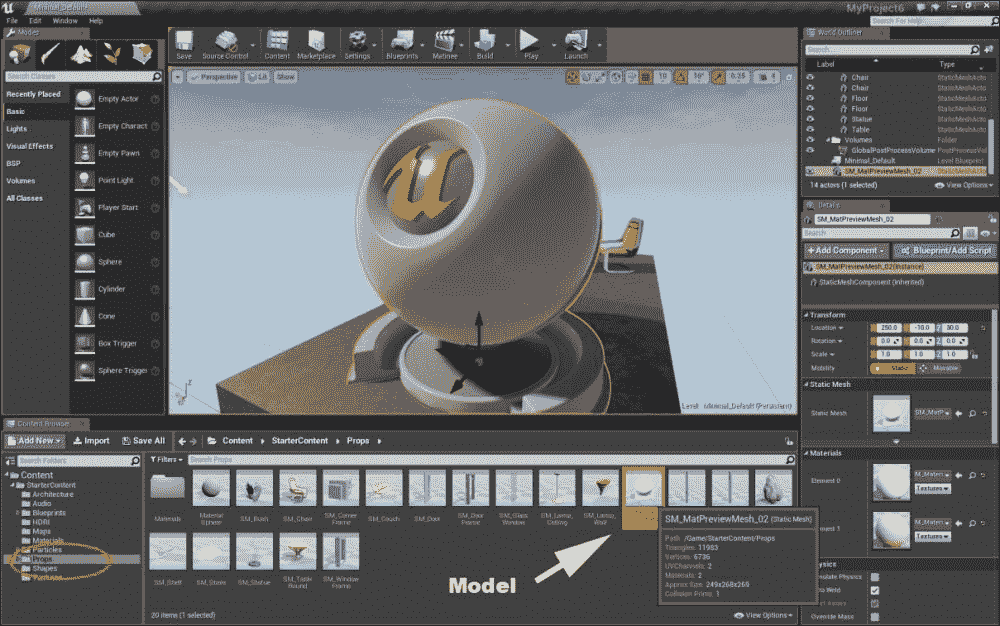

1.  现在，点击**材质**文件夹，在预览部分的空白空间上右键单击。从菜单中选择**材质**，然后将新材质命名为`mymaterial`。现在，将此材质拖放到**元素 0**的**材质**部分，在**详情**菜单中。现在，您的新材质已在模型中定义：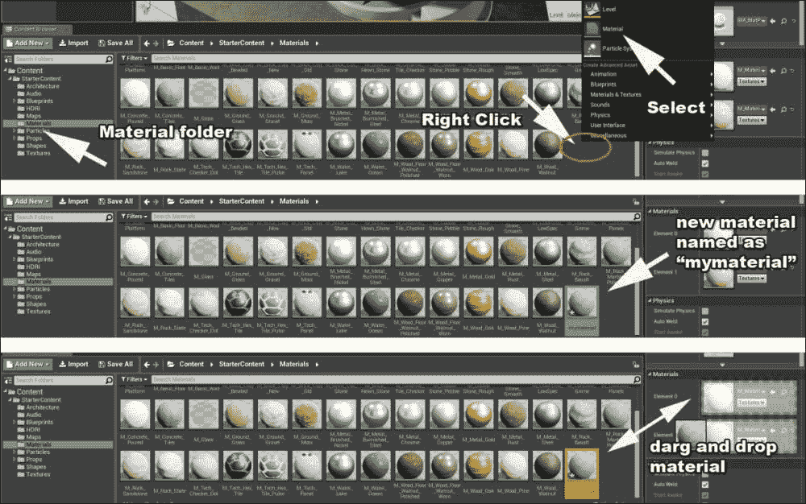

1.  旋转形状并放大缩小表面。学习如何在创建材质时轻松地在模型周围导航相机是很重要的。虚幻引擎 4 为材质提供实时物理光和光线处理的基本元素。它还计算表面的粗糙程度，然后动态地将这些渲染到形状上。所有这些同时与世界细节相连，如阳光或任何其他光源、重力以及形状周围的材质。因此，检查您的对象从不同的角度和缩放值是很重要的。尽量达到以下截图所示的视角：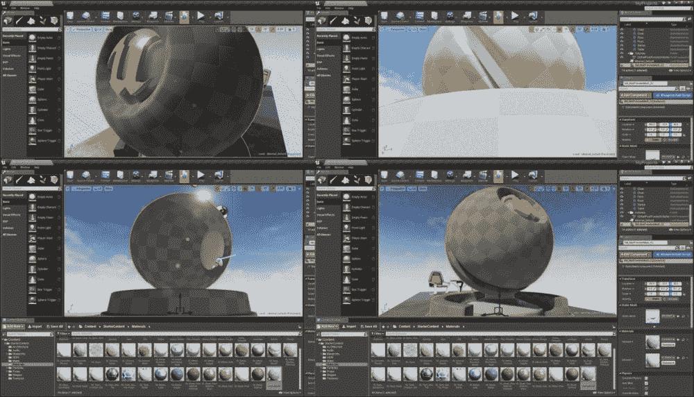

    此外，我们使用的模型有两个元素：**元素 0**和**元素 1**。**元素 0**是模型的表面或外壳，而**元素 1**类似于形状的核心。两者都可以接受来自**材质**文件夹的不同材质。

1.  双击**元素 0**在**详情**菜单的**材质**部分。这打开了您的材质的蓝图和材质编辑器。屏幕中间是当前材质的蓝图。这是一个全新的蓝图，命名为`mymaterial`。

    在我们走得太远之前，点击顶部菜单中的**应用**并检查您的模型。它类似于覆盖外壳的黑色表面；您的材质只是简单地应用到模型上，如下面的截图所示：

    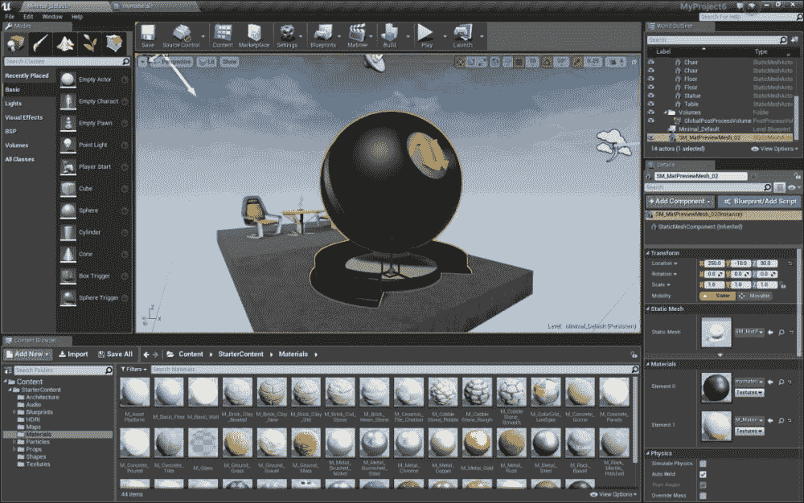

    从现在开始，你将学习如何使用 UE4 中的蓝图来改变形状上的这一层。

1.  双击**Element0**返回到材料蓝图。正如你在下面的截图中所见，有一个带有你的材料名称（`mymaterial`）的盒子。这个盒子有一些连接蓝图单元的功能：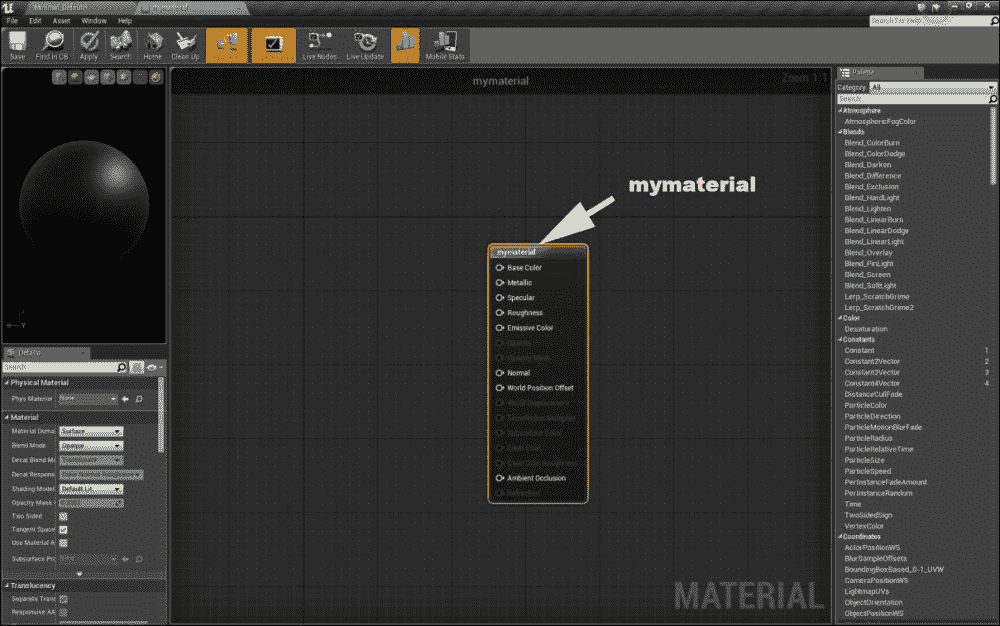

    想象这个盒子是一种输出。你将数据发送到基础颜色、金属以及其他这个盒子的输入。它为你的模型创建一个表面，然后将这些数据输出到模型的表面。正如你所见，在这个阶段我们并没有为这个盒子提供任何输入。因此，我们的材料很简单，没有任何颜色或纹理。你将在屏幕的左上角看到一个你材料的样本，你可以通过鼠标旋转或缩放它。

# 材料物理学

虚幻引擎 4 中的每个材料都遵循一些物理属性，这些属性由设计师定义。这在某种程度上与引擎的早期版本不同。虚幻引擎 4 为开发者和艺术家提供了更多选项，以创建比旧版本性能更高的复杂材料。此外，你还可以使用这种结构发明或创建动态材料。

正如你在前面的截图中所见，在你的材料蓝图编辑器的左侧**调色板**部分有许多命令。一些有快捷方式可以使用。例如，你可以从这里拖放**常量**到你的屏幕上，或者简单地按键盘上的*1*键，然后用鼠标左键点击屏幕。这两种方法都会给你一个常数，用来连接蓝图上其他盒子的输入。此外，每个盒子在**详细信息**菜单中都有一些属性。这些属性是可以定制的。

现在我们基于物理规则，在虚幻引擎 4 中创建一个材料：

1.  在`mymaterial`盒子的顶部，找到**基础颜色**。这个属性定义了材料颜色，并接受称为向量数字的数字。虚幻引擎 4 中的向量可以同时处理 2、3 和 4 个数字。

    +   这个例子描述了向量的主要概念。现在，想象你有三个名为`2Vector`、`3Vector`和`4Vector`的巧克力盒子。当你打开`2Vector`时，你会在盒子里找到两块巧克力在一起。当你打开`3Vector`时，你会在盒子里找到三块巧克力在一起，以此类推。如果你把这些盒子中的一个送给某人，这意味着你把盒子里的所有巧克力一起送到目的地。现在，当它在目的地打开时，所有的巧克力都同时出现。在这种情况下，巧克力盒子是一个向量，巧克力是向量的成员。向量的成员在与用户及其自身交互时具有相同的权重。

    +   当我们需要在引擎中应用物理属性的同时处理大量数据时，我们可以使用向量。颜色是由三个数字组成的物理属性，用于 RGB 值（红色、绿色和蓝色）。我们需要将三个数字一起发送到这个输入，所以最好的选择是发送一个向量数字。

    +   在**调色板**的屏幕右侧，找到**Constant2Vector**，将其实例拖放到舞台或按住*3*键并在舞台上右键单击，如图所示。现在，在黑色区域右键单击，设置颜色，并将该框连接到`mymaterial`框上的**Base Color**。RGB 的值也在**Details**菜单中显示。您可以在`0`和`1`之间更改它们，例如，纯黄色将是**R**: `1.0`，**G**: `1.0`，和**B**: `0.0`。将其更改为**R**: `1.0`，**G**: `0.327`，和**B**: `0.0`以在模型上得到橙色：

    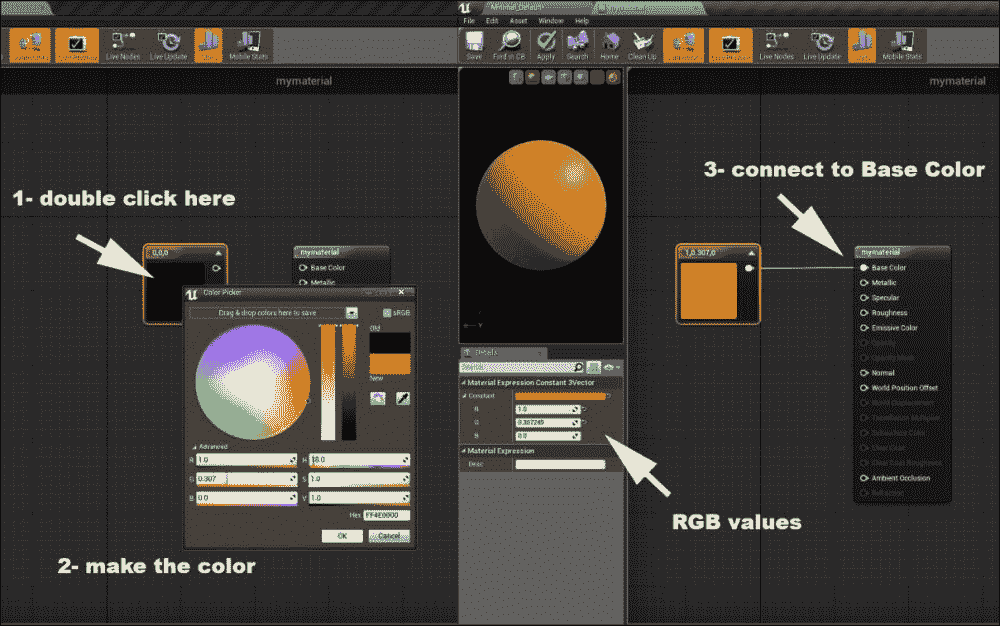

1.  金属表面是您材质的另一个物理特性。它定义了在周围光线亮度的情况下，您的物体看起来有多金属。在`mymaterial`框下找到**Metallic**，然后从右侧的**Palette**拖放一个**Constant**。在**Details**部分将其值更改为`1.0`。单击顶部的**Apply**并检查您的模型。它看起来类似于未经抛光的金。现在，返回到材质编辑器，并将颜色更改为**R**: `0.2`，**G**: `0.2`，和**B**: `0.2`。在顶部单击**Apply**并检查您的模型。现在，它看起来类似于未经抛光的银，如图所示：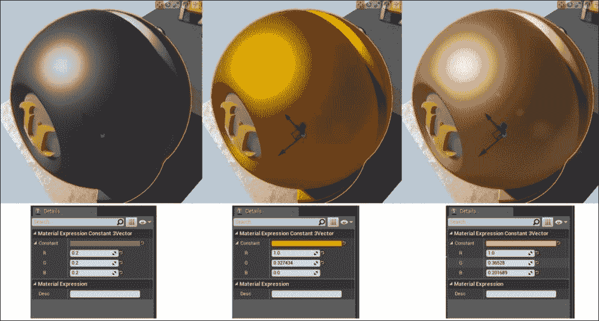

1.  每种材质都可以提供软或非软表面的物理行为。想象一下镜子和由粉笔制成的墙壁白色表面的区别。巨大的区别在于镜子以线性方式反射光线，而粉笔将光线分解成许多不同的角度。结果，您在墙上看不到任何形状的反射。

    1.  让我们通过将**R**，**G**，和**B**设置为`1.0`来更改颜色，以设置您的**Base Color**属性。现在，将金属值更改为`0.0`，然后从屏幕右侧的**Palette**拖放一个**Constant**。将其连接到`mymaterial`框上的**Roughness**属性。现在，单击**apply**并检查您的模型。它看起来类似于具有类似镜面反射其他物体表面的塑料。现在，返回到材质编辑器，并在**Details**部分将其值更改为`1.0`。再次单击**apply**并检查您的模型。现在，它看起来像是一块没有任何周围物体反射的粉笔，如图所示：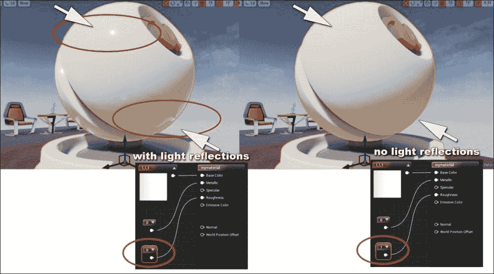

    1.  现在，将金属值更改为`1.0`并点击**应用**。结果是物体周围出现了一个漂亮的反射镜面。让我们回到材质编辑器。你所看到的是一个完全金属化的表面，具有最大的光泽度，并且是一个绝对反射表面，以最线性、最直接的形式反射光线。这是这种材料的物理描述。因此，如果你希望创建一个类似于以下截图的金色物体，你应该将**基础颜色**的值更改为`1.0`、`0.46`和`1.0`，将**金属**的值更改为`1.0`，将**粗糙度**的值更改为`0.28`：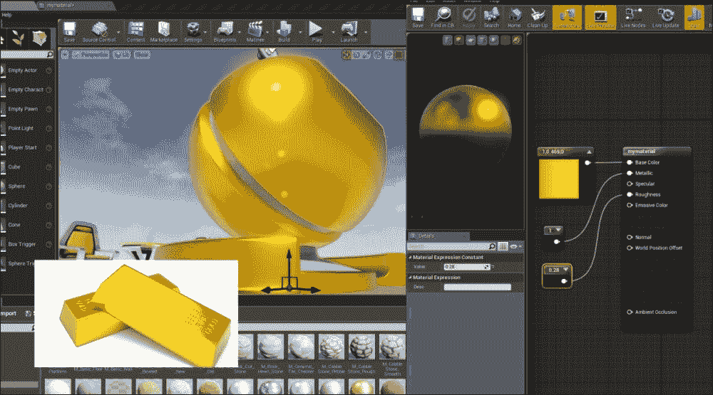

    1.  有时候，你需要创建一些闪亮的塑料（例如游泳池的球）。为此，虚幻引擎 4 定义了一些物理方法来模拟类似塑料的材料。将你的金属属性设置为`0`，然后将粗糙度设置为`0`。现在，点击**应用**并检查模型。正如你所见，模型看起来类似于一个塑料闪亮的玩具。将**高光**属性设置为`1.0`，通过添加一个**常量**来实现。同样，更改其他属性。现在，点击**应用**并检查你的模型。塑料中的周围物体图像将变得更加清晰。虚幻引擎 4 通过包括表面的**高光**值作为物理变量来模拟光亮非金属表面和金属表面之间的差异。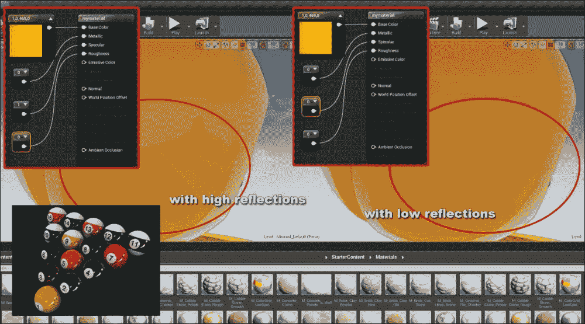

    1.  选择你电脑周围的一些真实世界物体，并在引擎中根据物理元素创建它们的材质是一个好的实践。这包括**柔软度**（引擎内部的**粗糙度**和**高光**）和与**金属**属性相关的**光泽度**。例如，尝试创建绿色苹果皮、鞋子、烹饪工具（如勺子或叉子）和纸张。

1.  一些材料需要比之前提到的更多物理特性。例如，水在其表面有一些类似于波浪的图案和透明度。此外，光线在水表面的反射方式与金属或塑料不同。为了创建这些类型的材料，这些材料通常在表面有图案和阴影，虚幻引擎 4 使用一些称为**法线****贴图**的图像。点击你的编辑器中的**纹理**文件夹，找到`T_Ground_Moss_N`并将其拖放到材质编辑器中，并将其连接到`mymaterial`的**法线**属性。现在，将**基础颜色**的 RGB 值更改为`0.4`、`0.5`和`0.5`。然后，点击**应用**并检查你的模型。

    如以下截图所示，你的模型将有一个类似于石头的表面，在不同的光照角度下显示出阴影。

    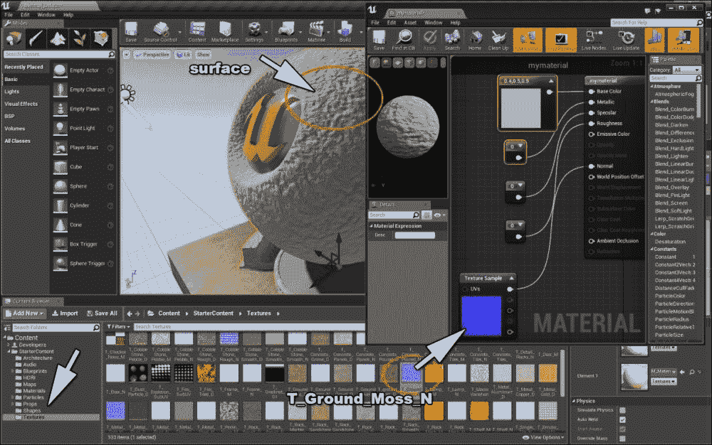

1.  你的模型表面的纹理也可以接受**X**和**Y**方向上的移动。在材质编辑器的右侧找到**Panner**，并将其拖到舞台上，然后连接到**纹理样本**的 UV 输入。选择两个框，然后按*Ctrl* + *W*。这个快捷键会复制你的选择。现在，添加**乘法**框，并将你的框连接起来，如图下所示。然后，将**金属度**更改为`0.7`，将**粗糙度**更改为`0.0`。现在，将**基础颜色**更改为 RGB 的`0.2`、`0.5`和`1.0`以看到水。将**Panner**的值更改为`0.02`、`0.0`、`0.01`和`-0.011`以在你的模型上生成波浪。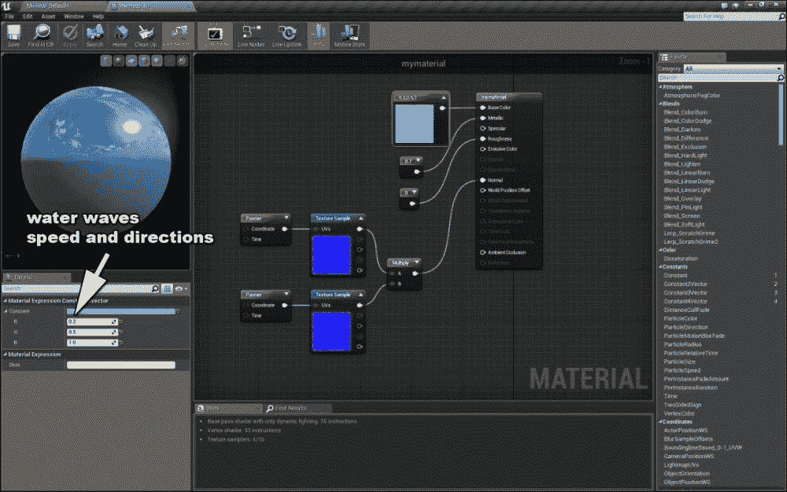

1.  现在，让我们谈谈其他物理方面。为此，关闭你的项目，并通过在**项目**浏览器中选择**新建项目**选项卡来创建一个新的项目。选择**第一人称**并确保**包含启动内容**被选中。然后，选择**材质**文件夹，在空白空间上右键单击，导航到**物理**，选择**物理材质**，并将其命名为`mymaterial`：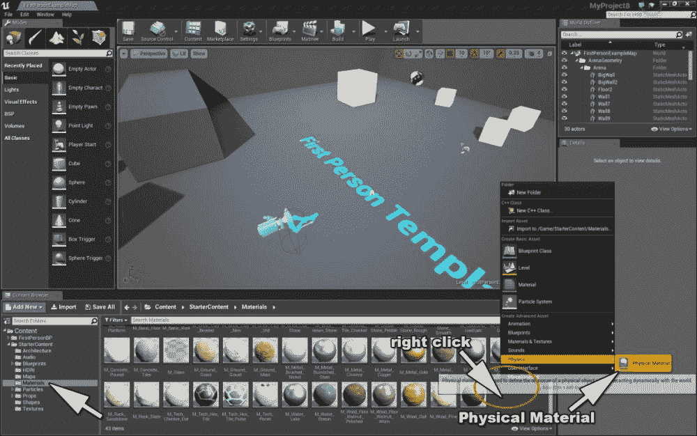

1.  现在，选择一个立方体，点击**应用**，然后在右侧双击**材料**以导航到材质编辑器。在左侧的**物理材质**的**详细信息**部分，点击并选择`mymaterial`；这将应用你的物理材质到形状上。现在，点击顶部的**应用**返回到材质编辑器，如图下所示：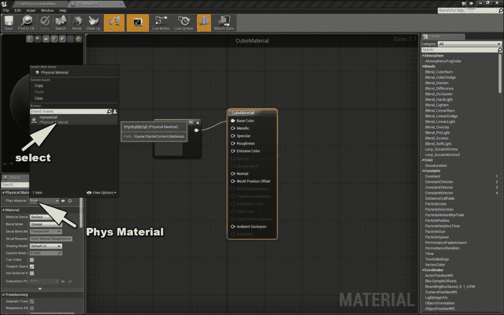

1.  如你所见，表面上没有变化。我们创建了一种不同类型的材料，它负责形状的物理交互，以及周围的形状。让我们点击**播放**来测试你的立方体对你的射击如何响应。然后，按**停止**，双击`mymaterial`，并在新窗口中将**密度**更改为`20`。现在，点击**播放**。你会发现你的立方体看起来比其他立方体更重，并且对射击的反应非常缓慢。

1.  点击**停止**返回到编辑器，再次双击`mymaterial`，将**密度**更改为`1.0`（默认值）。这次，将**恢复系数**从`0.3`更改为`2.3`。现在，返回到编辑器，点击**播放**，并向盒子射击。看起来盒子有更多的弹性运动。

1.  现在，点击**停止**，再次通过双击打开`mymaterial`的**详细信息**菜单。将**恢复系数**设置为`0.3`（默认值）。这次，将**摩擦**更改为`-24`并再次播放。这个属性为你的形状准备了一种类似冰的行为。

    你可以通过将**密度**设置为`10`，**恢复系数**设置为`2.3`，以及**摩擦**设置为`-24`来创建一个简单的游戏。现在，尝试用你定义物理材质的那个立方体去撞击其他立方体。

    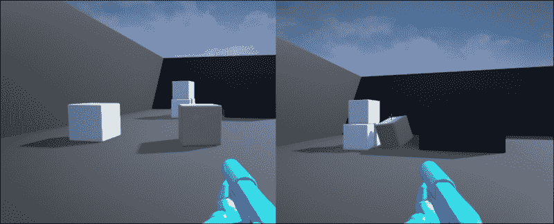

通过**项目**浏览器中的**新建项目**选项卡开始一个新的项目。选择**第一人称**，确保**包含启动内容**被选中，并将项目命名为`material_test`。

# 摘要

制作材料是游戏设计中的艺术，新一代的虚幻引擎 4 为该领域的艺术家和开发者提供了足够的细节设计级别。基本上，在虚幻引擎 4 中制作每种材料的第一个步骤是处理这个对象的物理特性。例如，金属、*颜色*和*密度*等特性，展示了你如何在游戏世界中制作材料，这些内容我们在本章中已详细讲解。
