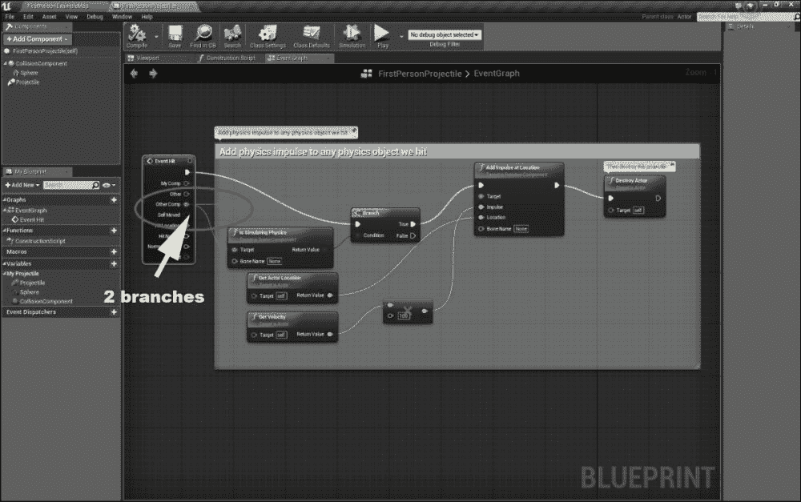
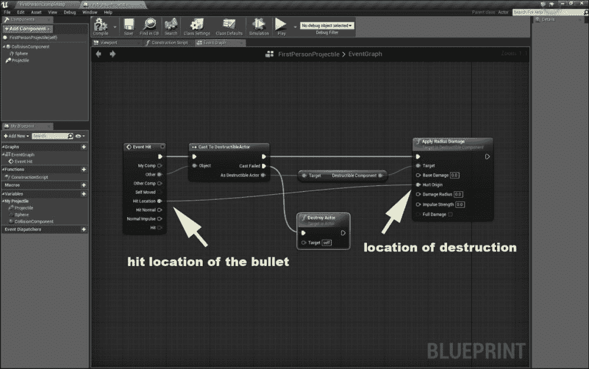
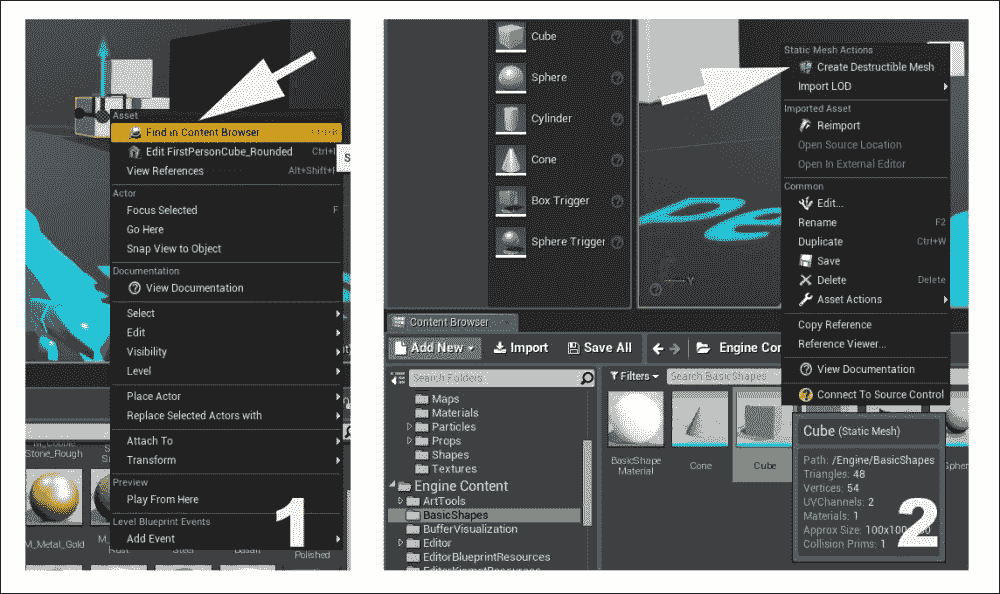
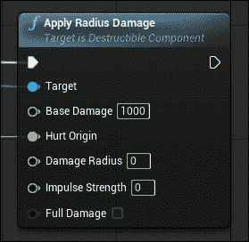
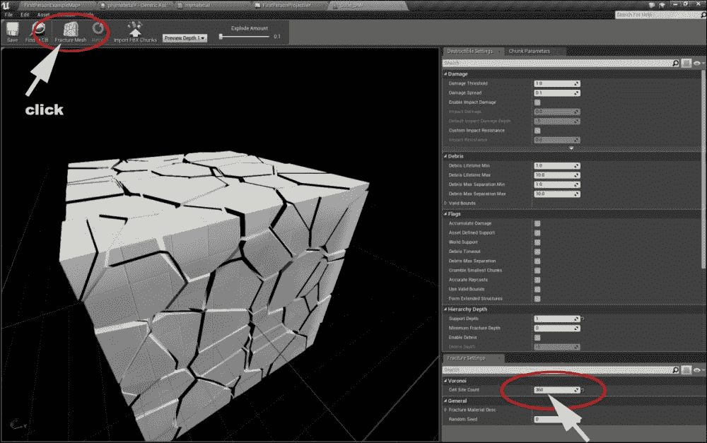
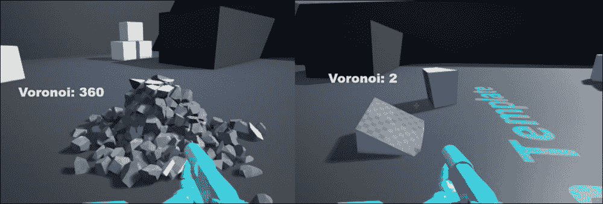
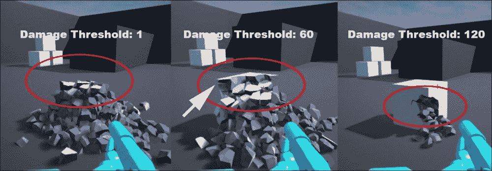
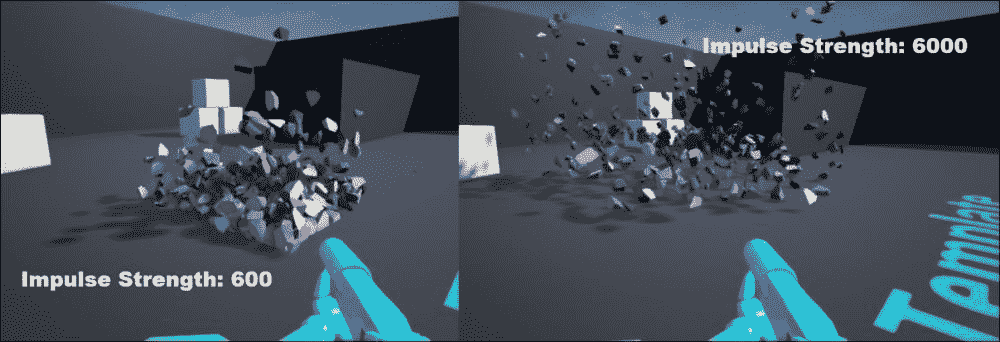
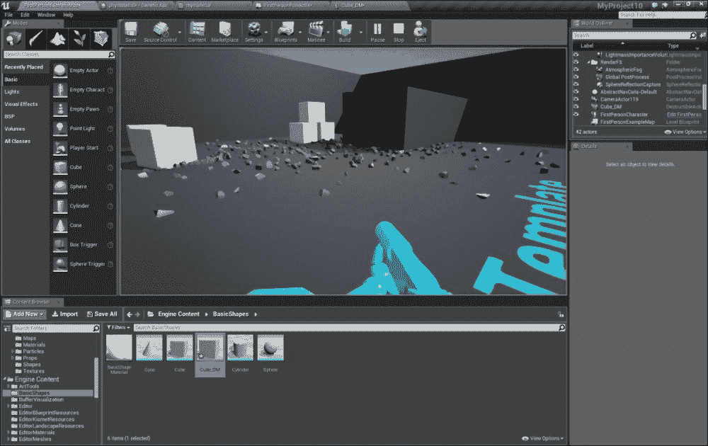

# 第八章。高级主题

在虚幻引擎 4 中混合一个物体的多个物理规则并自定义物理属性是其中一项新且强大的功能。这允许设计师和开发者在大规模上应用物理。例如，海洋水、天空、草地和物体破坏都是如何在游戏世界中应用多个物理规则以供玩家交互的例子。

本章提供了一个简单物体各种物理规则示例。

# 模拟复杂物理 - 破坏

如果你想在游戏中将一个物体破坏成小块，你必须将其分解成小块，并将模型保存为需要机器进行大量处理才能渲染的大文件，并且还需要为每一块制作动画。一些设计师通过在物体位置上用一些粒子系统替换物体来忽略这种方法。

今天，虚幻引擎 4 不仅解决了这个问题，还提供了自定义对象破坏的功能和属性。根据游戏的艺术或基于现实的特点，你可以模拟能量流动和破坏物体的方式，同时控制目标物理方面的属性。每一次破坏仅仅是两个物体之间的交互或碰撞。这会在游戏世界中的特定时间段内显示特殊的视觉表现。在我们的例子中，我们将模拟 UE4 中的第一人称射击地图中的子弹在简单立方体上。为此，首先我们需要定义我们的子弹蓝图，然后对立方体对象进行操作，以在击中后显示破坏。执行以下步骤：

1.  首先，通过在虚幻引擎启动器中点击**启动**按钮来打开虚幻编辑器。

1.  然后，从**项目**浏览器中选择**新建项目**选项卡，开始一个新的项目。现在，选择**第一人称**并确保**包含启动内容**被选中，并将项目命名为`dest_test`。

1.  现在，打开**FirstPersonBP**文件夹，然后在**蓝图**文件夹中，双击**FirstPersonProjectile**。这会打开你的子弹蓝图。检查框标题以及它们之间的关系。这个框模拟了子弹的默认行为：击中目标后消失，击中墙壁后以相反角度返回。这两个分支来自事件框上的**Other Comp**输出。

1.  通过按*Alt* + 右键点击输出断开**事件击中**。将其移动到蓝图屏幕上的空白区域，并将其连接到**Cast To Destructible Actor**。这意味着子弹将与可破坏对象交互。点击**Cast Failed**输出并将其连接到**Destroy Actor**。这意味着如果子弹没有与任何对象交互，它会在一段时间后被销毁。

1.  点击**可破坏行为者**输出，将其与**获取可破坏组件**组件连接，然后将此框的**可破坏组件**输出连接到**应用半径伤害**。通过更改此框的属性，您可以控制对象的物理破坏模拟。

    ### 注意

    要在**蓝图**中创建新框，最好点击并按住鼠标在框的输出上，然后拖动线，释放鼠标，在打开的菜单中输入新框名称。

1.  现在，添加更多连接到您的框之间，如图所示：

    如您在前面的截图中所见，**击中位置**输出和**击中原点**输入直接连接在一起。您可以在蓝图中的**击中位置**输出和**击中原点**输入之间添加更多蓝图框以支持不同的场景。例如，想象您想让玩家射击天空中的物体并摧毁位于表面的另一个物体。对于这种场景，有几种创建蓝图的方法。这并不属于物理规则的一部分，而主要与蓝图中的控制和事件处理相关。在我们的例子中，它们位于同一位置，因此物体在击中点被子弹摧毁。

现在，让我们通过以下步骤创建和自定义目标：

1.  返回编辑器，并在您的材质库中创建一个简单的材质，只包含基础颜色和一个物理材质。然后，从**模式**面板中将一个立方体从**基本**拖放到场景中，右键单击它，在**内容浏览器**中选择**查找**。这将找到引擎本地库中的原始对象。现在，在**内容浏览器**中右键单击它。从菜单中选择**创建可破坏网格**。这将创建一个新的立方体对象，具有模拟破坏的属性。

1.  将这个新立方体的实例拖放到舞台上，并将您的材质应用到这个新对象上。点击顶部的**播放**并射击立方体。您会发现子弹从立方体的表面投射出来。现在，点击**停止**并导航回编辑器。打开您的**第一人称投射物**蓝图，找到**应用半径伤害**框，将**基础伤害**更改为`1000`，如图所示：

1.  在编辑器中，双击您的立方体**细节**面板中的**可破坏组件**部分。将打开一个新窗口。在这里，您可以定义与破坏相关的属性。将**支持深度**更改为`1`，然后将**Voronoi**更改为`360`（如果您的系统不是很强大，将其更改为`120`）。现在，点击顶部的**断裂网格**。通过此操作，您将能够将您的设置应用到网格上；否则，它将不起作用。

1.  再次，让我们回到编辑器，点击**播放**，并向物体射击一颗子弹。如您所见，立方体分裂成许多小粒子。现在，点击停止，并再次双击**可破坏组件**。这次，将**Voronoi**改为`2`，点击顶部的**断裂网格**，然后再次播放关卡（向物体射击一颗子弹）。

    如前图所示，粒子数量和**Voronoi**上的变化之间存在很大差异。这样，您可以在破坏期间定义物体的碎片数量。虚幻引擎 4 会自动根据物理规则计算碎片形状，并将它们实时渲染到舞台上。您还可以导入其他网格并应用相同的设置。

1.  将**Voronoi**改回`360`，然后将**伤害阈值**更改为`40`。点击**断裂网格**，然后播放关卡（向物体射击一颗子弹）。

    如您所见，物体对您的子弹提供了一定的阻力。如果您将**伤害阈值**增加到`120`，则需要射击多颗子弹才能摧毁物体和粒子。这类似于步枪子弹摧毁类似石头的重材料。

1.  现在，将**伤害阈值**更改为`1`（默认值），点击**断裂网格**，然后切换回蓝图。我们想要模拟霰弹子弹对目标的破坏力。将**冲量强度**更改为`600`，然后点击顶部的**编译**。然后，回到编辑器，通过向物体射击一颗子弹来播放关卡。

    如以下截图所示，它以更多的能量断裂。此外，物理视觉模拟也有所不同。现在，回到蓝图，将其更改为**6000**，点击顶部的**编译**，然后再次玩游戏。砰！这看起来像是近距离重霰弹枪的打击，不是吗？

    

1.  你还可以将物理材料特性融入对象中。这意味着，通过多个物理规则，你可以在同一位置进行操作。现在，双击你的物理材料，将**摩擦**设置为`-60`，将**恢复系数**设置为`0`。然后，开始游戏。你可以在下面的屏幕截图中看到，对象分解成类似冰块的小颗粒，并在游戏场景中散布。通过将**恢复系数**设置为`1.8`，可以产生这样的酷炫效果。

有许多方法可以将对象的物理特性与子弹偏好结合，以及与对象的破坏特性相结合。例如，你可以通过改变**冲量强度**在一定时间内调整子弹的能量。此外，正如你所知，每种材料都可以通过其自己的蓝图进行定制。例如，想象一下你在游戏中有一个幽灵；当你摧毁它时，它会分解成许多颗粒和部分，每个部分看起来像雨水。为了创建这种场景，尝试对你的材料应用一些动态或随机的变化，比如波动，并比较结果。

有时，当你对一个对象使用几个物理定制时，它们可能会相互重叠或抵消对方的效果。为了避免这类问题，了解与事件发起者（如前例中的子弹）相关的物理规则，然后是目标对象的物理规则，是一种良好的实践。

# 摘要

质量变化或一系列变化的模拟在游戏世界中是一种艺术。开发者通过足够的蓝图可以同步幕后物理。模拟的展示和质量取决于艺术家的努力和疯狂。

根据你在本章中学到的知识，想象一下你（作为开发者）试图在舞台上放置 50 个对象。当你射击其中一个时，所有对象在 1 秒的延迟内都会被摧毁。同时，你（作为艺术家）应该设计对象如何以及以何种方式被摧毁，并可能要求开发者通过一些蓝图使生活变得更简单。这种开发者与艺术家在游戏设计中的完美结合是 Unreal Engine 4 的强大功能之一。
