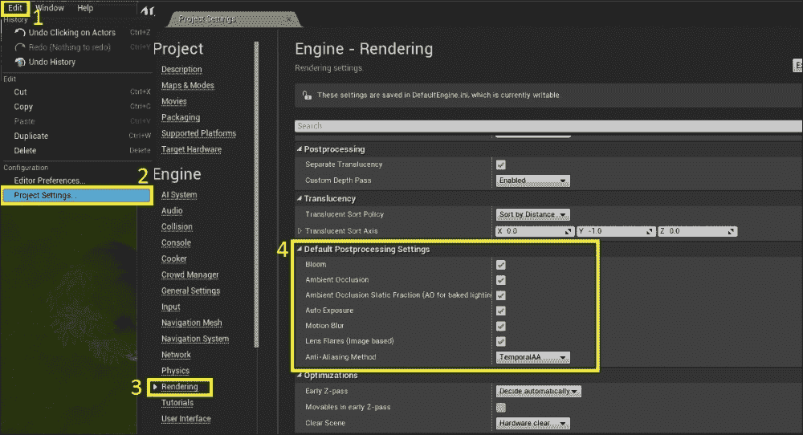
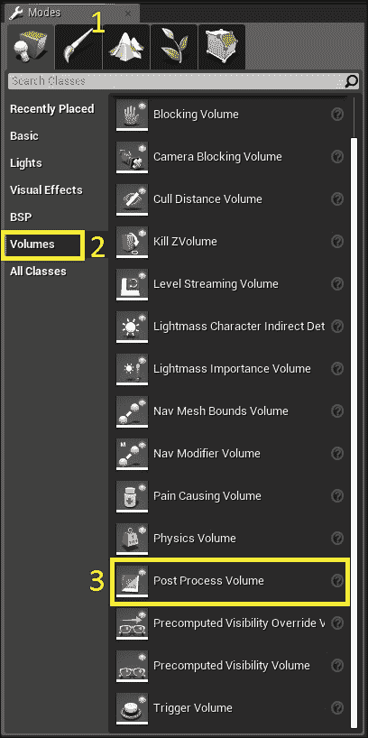
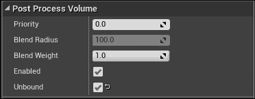
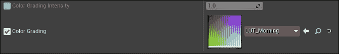
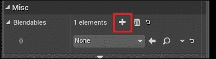
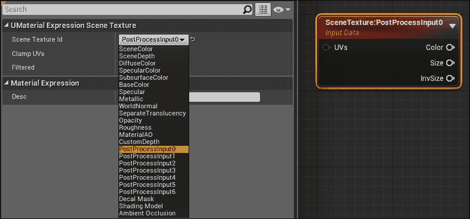
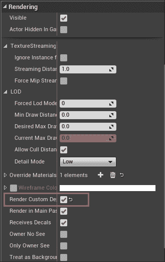
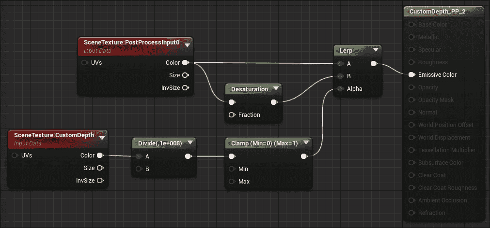
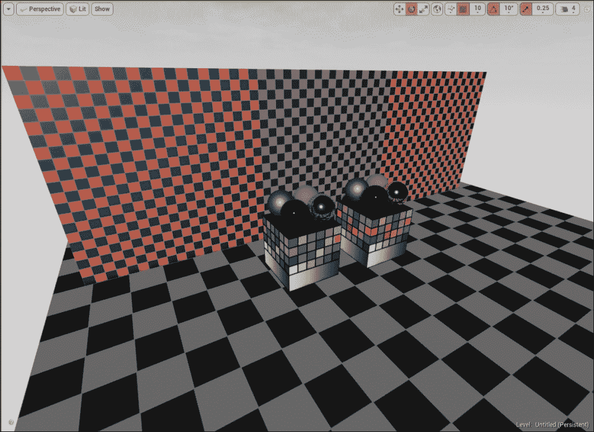

# 第四章 后处理

Unreal Engine 4 中的后处理允许你创建各种艺术效果，并改变整个游戏的整体外观和感觉。后处理效果通过后处理体积激活，可以单独使用以影响特定区域或整个场景。你可以有多个重叠的后处理体积，并根据它们的优先级渲染它们的效果。后处理体积可以用来添加或修改简单的效果，如光晕、镜头光晕、眼睛适应、景深等，它们也可以用来使用材质获取高级效果。后处理体积的另一个伟大功能是**查找表**（**LUT**），它用于存储来自图像编辑软件（如 Adobe Photoshop 或 GIMP）的颜色转换。它们非常容易设置，并且可以产生非常好的效果。我们将在本章后面讨论 LUT。

当你开始一个没有起始内容的项目时，场景中将不会出现后处理体积，因此引擎将使用默认设置。你可以在**项目设置**中按项目更改这些设置：

1.  在菜单栏中点击**编辑**。

1.  点击**项目设置**。

1.  转到**渲染**部分。

1.  展开**默认后处理设置**：

在这里，你会看到当场景中没有后处理体积时，Unreal Engine 的默认设置。你可以修改这些设置或添加一个后处理体积来独立覆盖它们。

# 添加后处理

要使用后处理，你需要在场景中有一个后处理体积：

1.  转到**模式**标签（如果你已关闭它，请按*Shift* + *1*）。

1.  选择**体积**标签。

1.  将后处理体积拖放到场景中：

你现在场景中有一个后处理体积。然而，它只显示当玩家在该体积内时的效果。要使其影响整个场景，请执行以下步骤：

1.  选择**后处理体积**

1.  在**详细信息**面板中，向下滚动并展开**后处理体积**部分

1.  启用**未绑定**

启用**未绑定**将忽略此体积的边界并影响整个场景。现在，让我们快速查看这些后处理设置：

+   **优先级**：如果有多个体积重叠，则优先级较高的体积将覆盖优先级较低的体积。

+   **混合半径**：这是用于混合的体积的半径。通常，`100`的值效果最佳。如果你启用了**未绑定**，则此设置将被忽略。

+   **混合权重**：这定义了属性的影响。`0`表示无效果，`1`表示全效果。

+   **启用**：此选项启用或禁用此体积。

+   **未绑定**：如果启用，则后处理效果将忽略此体积的边界并影响整个场景。

## LUT

LUT 是颜色中性的纹理，展开到 256 x 16 大小的纹理。它们用于创建独特的艺术效果，并使用图像编辑软件（如 Adobe Photoshop）进行修改。如果你不熟悉 Photoshop，可以使用免费和开源软件，如 GIMP。以下是一个默认 LUT 纹理的图像：

LUT 的流程如下：

1.  首先，你拍摄你的世界的一张快照，并将其带入 Photoshop。

1.  在上面的截图上，插入 LUT 纹理。

1.  然后在两者之上应用色彩调整（例如：调整图层）。

1.  现在选择 LUT 纹理，并将其与你的色彩调整一起保存为 PNG 或 TGA。

1.  最后，将你的 LUT 导入 Unreal Engine。

    ### 注意

    注意，在你将 LUT 导入**内容浏览器**后，打开它并将**纹理组**设置为**色彩查找表**。这是一个重要的步骤，不应跳过。

要应用 LUT，选择后处理体积，然后在**场景颜色**部分，你可以启用**色彩分级**并设置你的 LUT 纹理：

使用**色彩分级强度**选项，你可以改变效果强度。

## 后处理材料

后处理材料帮助你通过材质编辑器创建自定义后处理。你需要创建一个具有你所需效果的材质，并将其分配给后处理体积中的**可混合项**。点击加号以添加更多插槽：

在我解释后处理材料之前，让我们快速看一下材质编辑器中最重要的一些后处理节点之一：

+   **场景纹理**：此节点有多个选择，输出不同的纹理：

+   **UVs**（可选）：此输入平铺纹理。对于**场景纹理**节点的 UV 操作，使用**屏幕位置**节点而不是常规的**纹理坐标**节点是很好的。

+   **颜色**：这输出最终的纹理作为 RGBA。如果你想将其与颜色相乘，首先需要使用组件遮罩提取 R、G 和 B，然后乘以你的颜色。

+   **大小**：这输出纹理的大小（宽度和高度）。

+   **InvSize**：这是**大小**输出的倒数。（1/宽度 和 1/高度）。

    ### 注意

    需要记住的是，只有在你真正需要的时候才应该使用后处理材料。对于**色彩校正**和各种其他效果，你应该坚持使用后处理体积的设置，因为它们更高效且经过优化。

## 创建后处理材料

使用后处理材料，你可以创建自己的自定义后处理效果。一些例子包括：

+   在你的游戏中突出显示特定对象

+   渲染遮挡对象

+   边缘检测等

在这个快速示例中，我们将看到如何突出显示我们世界中的对象。要单独渲染特定对象，我们需要将它们放入自定义深度缓冲区。好事是，这就像点击一个复选框一样简单。

选择你的静态网格，在**Rendering**部分下展开选项并启用**Render Custom Depth**：

现在网格已渲染在`CustomDepth`缓冲区中，我们可以在材质编辑器中使用此信息来遮罩并单独渲染它。要这样做：

1.  创建一个新的材质并打开它。

1.  现在首先要做的是将**Material Domain**设置为**Post Process**。这将禁用所有输入，除了**Emissive Color**。

1.  现在，右键单击图表并搜索**SceneTexture**并选择它。将**Scene Texture Id**设置为**CustomDepth**。

1.  **CustomDepth**输出一个原始值，所以让我们将其除以我们想要的距离。

1.  添加一个新的**Divide**节点并将**CustomDepth**连接到输入*A*。选择除法节点，并为*Const B*提供一个高值（例如：`100000000`）。记住，1 Unreal Unit 等于`1`厘米，所以如果你提供一个像`100`或`1000`这样的小值，你需要非常接近对象才能看到效果。这就是为什么我们使用一个非常大的值。

1.  添加一个**Clamp**节点并将**Divide**连接到**Clamp**节点的第一个输入。

1.  创建一个**Lerp**节点并将**Clamp**的输出连接到**Lerp**的*Alpha*输入。**Lerp**节点将根据 alpha 值混合输入 A 和 B。如果 alpha 值为`1`，则使用输入*A*。如果是`0`，则使用输入*B*。

1.  创建另一个**SceneTexture**节点并将其*Scene Texture Id*设置为**PostProcessInput0**。**PostProcessInput0**输出最终 HDR 颜色，所以请确保使用它。还有一个名为**SceneColor**的输出，它做同样的事情，但输出当前场景的较低质量。

1.  再次右键单击图表并搜索**Desaturation**节点。将**PostProcessInput0**的*Color*输出连接到**Desaturation**输入。我们将使用它来降低除了带有**CustomDepth**的网格之外整个场景的饱和度。

1.  将**Desaturation**输出连接到*Lerp B*和**PostProcessInput0**到*Lerp A*，最后将**Lerp**连接到**Emissive Color**。

下面是整个图表的最终截图：

在这个示例场景中，我已经将此材质应用于后处理混合体，你可以看到效果：

所有有颜色的内容都启用了 Render Custom Depth，所以后处理材质正在遮罩它们并将去饱和度应用于整个场景。

# 摘要

在下一章中，我们将添加灯光并讨论光移动性、光照质量和动态灯光。
