# 第五章。灯光

灯光是您游戏中一个重要的因素，很容易被忽视，并且不当的使用会严重影响性能。但是，通过适当的设置，结合后期处理，您可以创建非常美丽和逼真的场景。

在本章中，我们将探讨不同的灯光移动性，并深入了解由 Epic 游戏创建的静态全局照明求解器 Lightmass 全局照明。我们还将学习如何准备与它一起使用的资产。

# 灯光基础

在本节中，我们将了解如何放置灯光以及如何调整一些重要值。

## 放置灯光

在 Unreal Engine 4 中，灯光可以通过两种不同的方式放置。通过模式标签或通过在关卡中右键单击：

+   **模式标签**：在**模式**标签中，转到**位置**标签（*Shift* + *1*）并转到**灯光**部分。从那里您可以拖放各种灯光。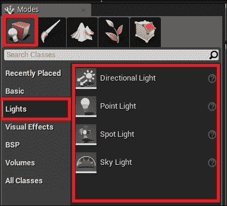

+   **右键单击**：在视图中右键单击，在**放置演员**中您可以选择您的灯光。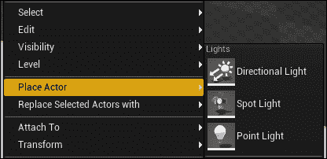

一旦灯光被添加到关卡中，您可以使用变换工具（*W*键移动，*E*键旋转）来更改所选灯光的位置和旋转。

### 提示

由于**方向光**来自无限远的来源，更新它们的位置没有效果。

## 各种灯光

Unreal Engine 4 具有四种不同类型的灯光演员。它们是：

+   **方向光**：模拟来自无限远处的光源。由于此光源产生的所有阴影都将平行，因此这是模拟阳光的理想选择。

+   **聚光灯**：从单个点以锥形发射光。有两个锥体（内锥体和外锥体）。在内锥体内部，灯光达到全亮度，在内锥体和外锥体之间发生衰减，这会柔和照明。这意味着在内锥体之后，灯光的照明会随着它向外锥体移动而逐渐减弱。

+   **点光源**：从单个点向所有方向发射光，就像现实世界中的灯泡一样。

+   **天空光**：实际上并不发射光，而是捕获场景的远处部分（例如，放置在**天空距离阈值**之外的演员）并将它们作为光应用。这意味着您可以从大气、远处的山脉等地方获得灯光。请注意，**天空光**只有在您重建灯光或按**重新捕获场景**（在**细节**面板中选择**天空光**）时才会更新。

## 常见灯光设置

现在我们已经了解了如何将灯光放置到场景中，让我们来看看一些常见的灯光设置。在场景中选择您的灯光，在**细节**面板中您将看到这些设置：

+   **强度**：确定灯光的强度（能量）。这是以流明为单位，例如，1700 lm 相当于 100 瓦的灯泡。

+   **灯光颜色**：确定灯光的颜色。

+   **衰减半径**：设置光线的限制。它还会计算光线的衰减。此设置仅在**点光源**和**聚光灯**中可用。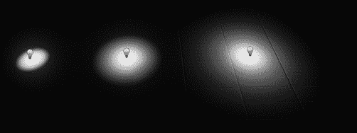

    从左到右的衰减半径：100，200，500。

+   **源半径**：定义表面上的镜面高光大小。此效果可以通过调整**最小粗糙度**设置来减弱。这也会影响使用**光线质量**的建筑物照明。较大的**源半径**会产生更柔和的阴影。由于这是通过**光线质量**处理的，因此它仅适用于设置为**静态**移动性的**光线**。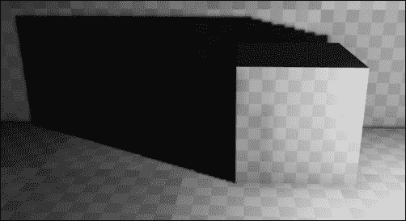

    源半径 0. 注意阴影的锐利边缘。

    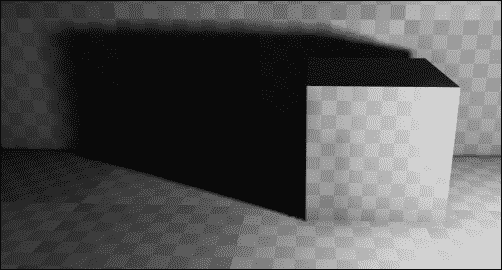

    源半径 5. 注意阴影的柔和边缘。

+   **源长度**：与**源半径**相同。

## 光线移动性

在放置你的关卡中的光线时，光线移动性是一个需要记住的重要设置，因为它会改变光线的工作方式并影响性能。你可以选择三个设置。它们如下所示：

+   **静态**：这是一种完全静态的光，不会影响性能。此类光线不会在动态对象（例如，角色、可移动对象等）上产生阴影或镜面反射。示例用法：在玩家永远不会到达的地方使用此光线，例如遥远的城市景观、天花板等。你可以有数百万个具有静态移动性的光线。

+   **静止**：这是一种静态和动态光线的混合，在游戏运行时可以改变其颜色和亮度，但不能移动或旋转。静止光线可以与动态对象交互，并用于玩家可以到达的地方。

+   **可移动**：这是一个完全动态的光，所有属性都可以在运行时更改。可移动光线对性能的影响较大，因此应谨慎使用。

只允许四个或更少的静止光线相互重叠。如果你有超过四个静止光线相互重叠，光线图标将变为红色 X，这表示光线正在以严重的性能成本使用动态阴影！

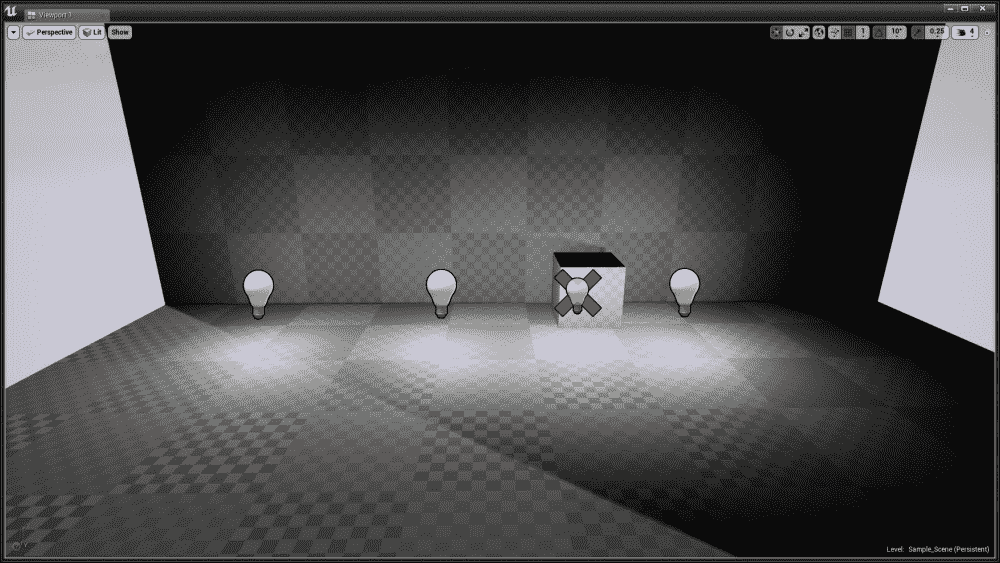

在以下屏幕截图中，你可以轻松看到重叠的光线。

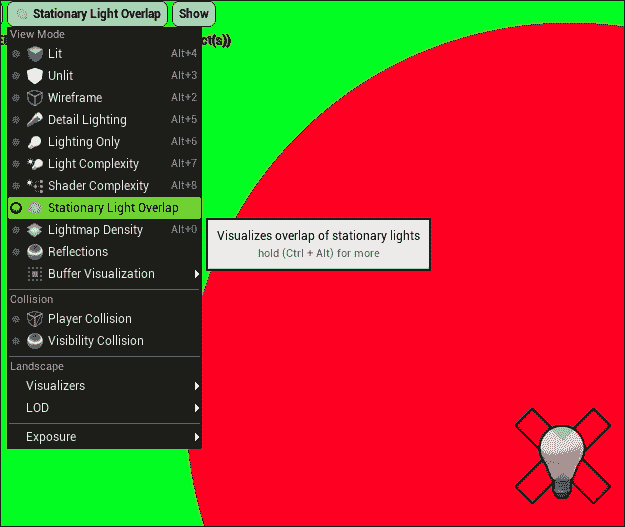

在**视图**模式下，你可以切换到**静止光线重叠**以查看哪个光线导致了问题。

# 光线质量全局照明

Lightmass 是由 Epic Games 创建的高质量静态全局照明求解器。**全局照明**（**GI**）意味着模拟间接照明的过程（例如，光线反射和表面颜色渗透）。在 Unreal Engine 中，默认情况下，光线通过 Lightmass 进行反射，并基于你的材质的基础颜色，这控制了从物体表面反射多少光线。尽管更饱和的颜色会反射更多光线，而较不饱和的颜色会反射较少，但这都取决于场景。在一个简单的房间场景中，这可能是明显的，而如果是户外白天场景，这可能不那么明显。

让我们快速看一下以下场景：

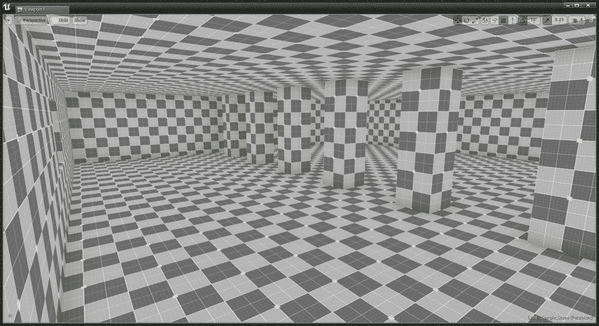

这是一个在无光照模式下的简单场景。

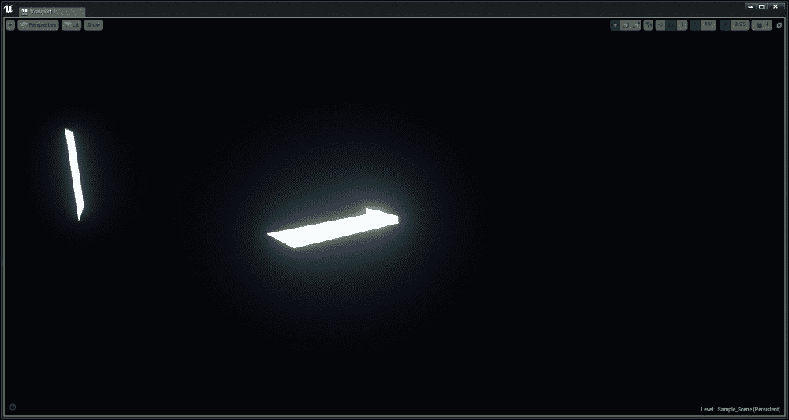

现在我添加了一束**方向光**，这是没有 GI 时的样子。这意味着只有直接照明，没有间接照明（意味着没有光线反射）。

上一张截图是使用静态全局照明（GI），你可以看到整个场景因为 GI 而变得生动起来。注意柱子是如何投射阴影的。这些被称为**间接阴影**，因为它们来自**间接光**。

间接光的强度和颜色取决于光线反射的材质的光和基础颜色。为了说明这个效果，让我们看看以下两张截图：

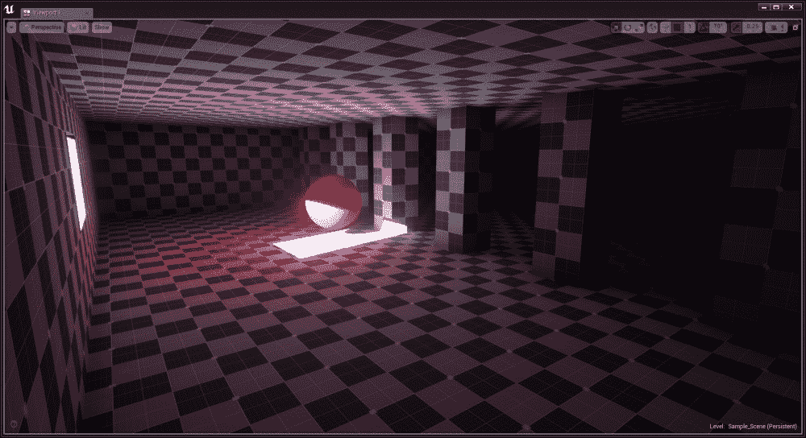

在这里，我将纯红色材质（红色值为 1.0）应用到球体上，你可以看到反射照明拾取了红色球体的基础颜色，改变了环境。这被称为颜色渗透，在高度饱和的颜色中最明显。

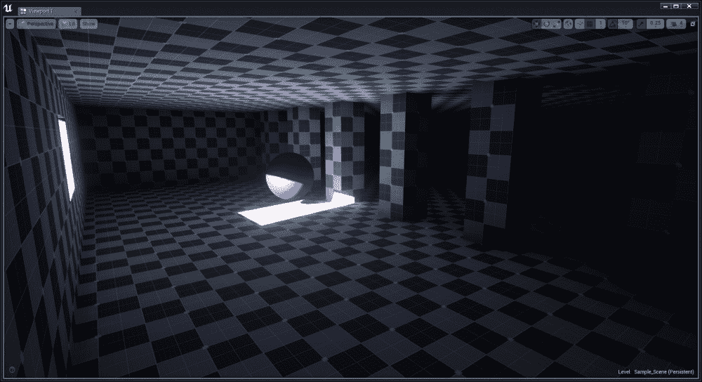

在这张截图中，我将红色的值改为 0.1 并重新构建了照明。由于红色现在更暗，反射的光更少。这是因为较暗的颜色会吸收光线而不是反射它。

现在我们已经知道了什么是 Lightmass，让我们来看看如何准备我们的资产以使用 Lightmass，并了解更多关于 Lightmass 设置的信息。

## 为预计算照明准备你的资产

为了使你的资产具有干净的光照和阴影细节，有必要拥有独特的未展开 UV 来表示其自己的空间以接收暗和亮的信息。在创建光照贴图 UV 时，一个经验法则是 UV 面不应与 UV 空间内的任何其他面重叠。这是因为如果它们重叠，那么在光照构建之后，对应该空间的光照贴图将应用于两个面，这将导致不准确的光照和阴影错误。重叠的面对于正常纹理 UV 来说很好，因为每个面的纹理分辨率都会更高，但对于光照贴图 UV 来说，这个规则不适用。在 3D 程序中，我们将光照贴图 UV 展开到新的通道，并在虚幻引擎 4 中使用该通道。

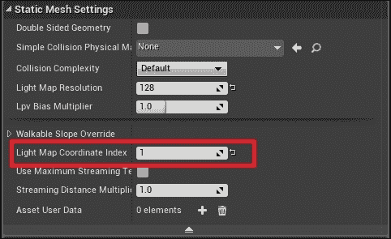

在这里，你可以看到我正在使用网格的第二个通道进行光照贴图。

### 注意

虚幻引擎从 0 开始计数，而大多数 3D 程序从 1 开始计数。这意味着 3D 程序中的 UV 通道 1 在虚幻引擎中是 UV 通道 0，UV 通道 2 在虚幻引擎中意味着 UV 通道 1。在这里，在前一张截图中，你可以看到**光照贴图坐标索引**是**1**，这意味着它正在使用网格的第二个 UV 通道。

尽管你可以在虚幻引擎 4 中生成光照贴图 UV，但强烈建议在 3D 程序（例如，Autodesk Maya、Autodesk 3dsmax、Modo 等）中创建这些 UV，以便获得干净的光照贴图。在创建光照贴图 UV 之前，你必须在 3D 应用程序的 UV 编辑器中设置网格设置。例如，如果你有一个需要 128 分辨率的资产，那么你的网格设置应该是*1/126*，即*0.00793650*。128 将是光照贴图纹理的分辨率。更高的值，如 256、512、1024 等，将产生高质量的光照贴图，但也会增加内存使用。一旦我们决定我们的资产需要的光照贴图分辨率，我们就从该分辨率中减去 2（你也可以使用 4）。这样做的原因是，为了使 Lightmass 能够正确计算而不会出现任何过滤溢出错误，建议 UV 之间至少有 2 个像素的间隙。所以如果你的资产将要使用 128 的光照贴图分辨率，它将是*128 – 2 = 126*。我们之所以将其除以 1，是因为默认情况下，Lightmass 使用 1 像素的边界进行过滤。

一旦你将网格导入虚幻引擎 4，你就可以为你的静态网格设置光照贴图分辨率。这个值控制着当另一个对象在这个对象上投射阴影时，阴影看起来有多好。

光照贴图是由虚幻引擎生成的纹理，并叠加到你的场景之上。由于这是一个纹理，它应该以 2 的幂（例如，16、32、64、128、256、512、1024 等）的形式存在。

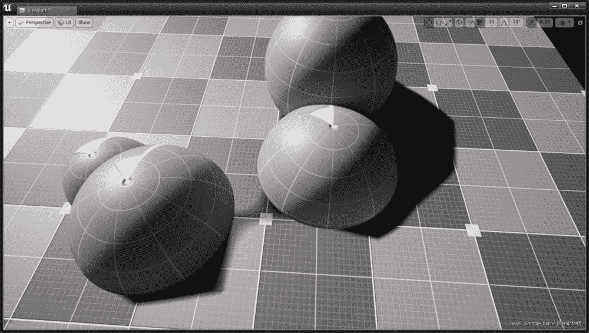

前一张截图中的地板光照贴图分辨率为**32**。请注意地板上的阴影不准确。

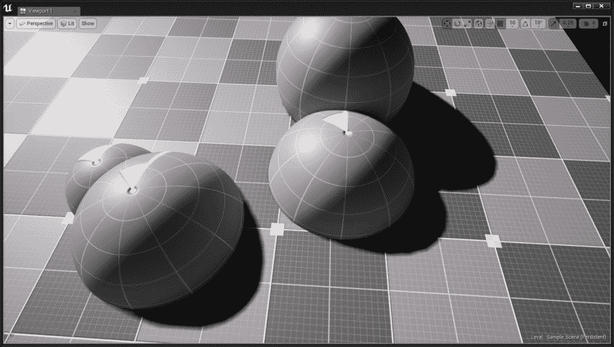

前一个截图中的地板光照贴图分辨率为**256**。注意地板上的阴影效果更好。

### 注意

尽管提高光照贴图分辨率可以提供准确的光影效果，但并不是在每个网格中都提高分辨率的好主意，因为这会严重增加构建时间，甚至可能使整个编辑器崩溃。对于较小的对象，保持较低的分辨率总是好主意。

在虚幻引擎 4 中，您可以在导入网格时通过启用**生成光照贴图 UV**来生成光照贴图 UV。

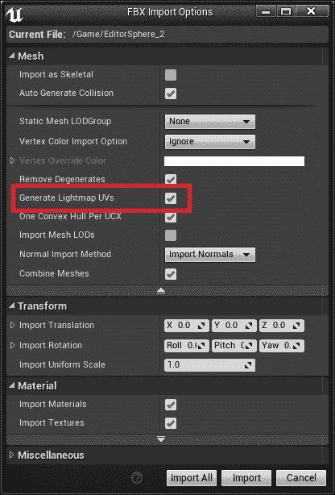

如果您错过了这个选项，您仍然可以在导入后生成光照贴图 UV。为此，请执行以下步骤：

1.  在**内容浏览器**中双击**静态网格**。

1.  然后，在**LOD**选项卡下，启用**生成光照贴图 UV**。

1.  选择**源光照贴图索引**。大多数情况下这将设置为**0**，因为那是正常纹理 UV，虚幻引擎从纹理 UV 生成光照贴图 UV。

1.  设置**目标光照贴图索引**。这是虚幻引擎保存您新创建的光照贴图 UV 的位置。将其设置为 1。

1.  点击**应用更改**以生成光照贴图 UV。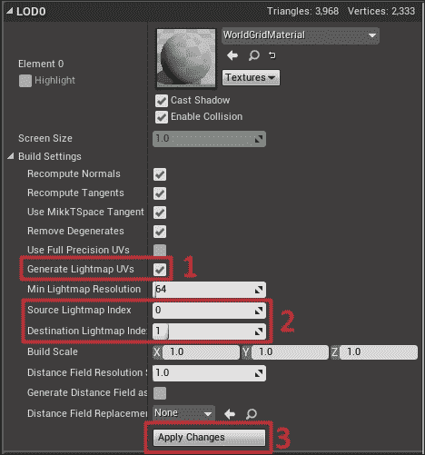

    ### 注意

    如果您已经在**目标光照贴图索引**中有一个光照贴图 UV，则在生成新的光照贴图时它将被替换。

您可以通过在工具栏中点击**UV**按钮并选择您的**UV 通道**来预览 UV。

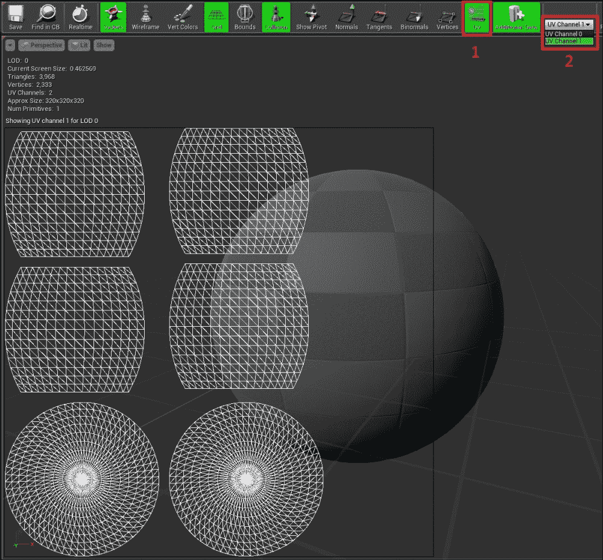

## 使用 Lightmass 构建场景

使用 Lightmass 构建场景是一个相当直接的过程。为了获得高质量的静态全局照明（也称为**预计算光照**），您需要在场景中有一个**光量重要性体积**。这是因为许多地图中，我们有足够大的区域，而可玩区域实际上较小。因此，我们不是计算整个场景的光照，这可能会大大增加光照构建时间，而是通过使用**光量重要性体积**来限制区域。

一旦我们在场景中有一个**光量重要性体积**并开始光照构建，Lightmass 将只计算体积内的光照。所有体积外的对象将只获得低质量的一次光反弹。

要在**光量重要性体积**中包围可玩区域，您只需从**模式**选项卡拖放即可。就像其他对象一样，您可以使用变换工具（*W*键移动，*E*键旋转，*R*键缩放）来调整场景中的**光量重要性体积**。完成这些操作后，您只需从**构建**按钮构建光照即可。

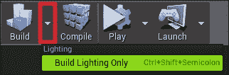

或者，您可以简单地按**构建**按钮，这将构建光照。Lightmass 有四个不同的质量级别可供选择。它们是**预览**、**中等**、**高**和**生产**。

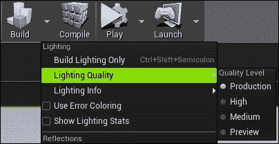

+   **预览**：在开发过程中可以使用，这会导致更快地构建光线。

+   **生产**：当您的项目接近完成或准备发布时，您应该使用生产设置，因为它会使场景更加逼真并纠正各种光溢出错误。

### 小贴士

照明质量只是预设。有许多设置应该调整以获得游戏中期望的效果。

## 调整光子设置

Lightmass 在 **世界设置** 中提供了很多选项，您可以调整以获得最佳的视觉质量。您可以通过单击 **设置** 并选择 **世界设置** 来访问它们。

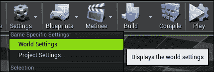

在 **世界设置** 中，展开 **光子设置**，你会看到各种可以调整的设置，以充分利用 **光子**。

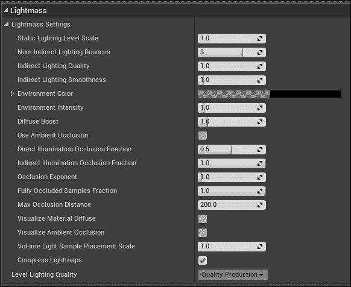

控制这些设置可以帮助您在使用 Lightmass 时获得最佳的视觉质量。让我们来看看这些设置：

+   **静态照明级别**：此设置在构建光线时计算细节。较小的值将具有更多细节但会大大增加构建时间！较大的值可用于大型级别以降低构建时间。

+   **间接照明反弹次数**：这决定了光线应该从表面反弹多少次。0 表示只有直接照明，这意味着将没有全局照明，1 表示一次间接照明反弹，依此类推。反弹 1 对视觉质量贡献最大，后续反弹几乎免费，但不会增加很多光线，因为每次反弹后反弹的光线会变弱。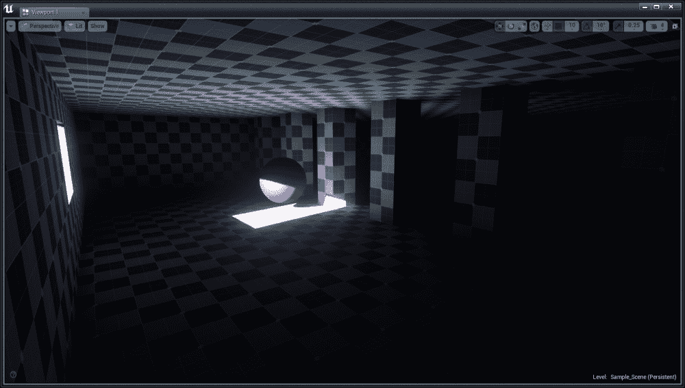

    间接照明反弹次数设置为 1

+   **间接照明质量**：较高的设置会导致更少的噪声、斑驳等问题，但也会增加构建时间。使用此设置与 **间接照明平滑度** 结合可以帮助获得详细的间接阴影和环境遮挡。

+   **间接照明平滑度**：较高的值会导致 Lightmass 平滑化间接照明，但会失去详细的间接阴影。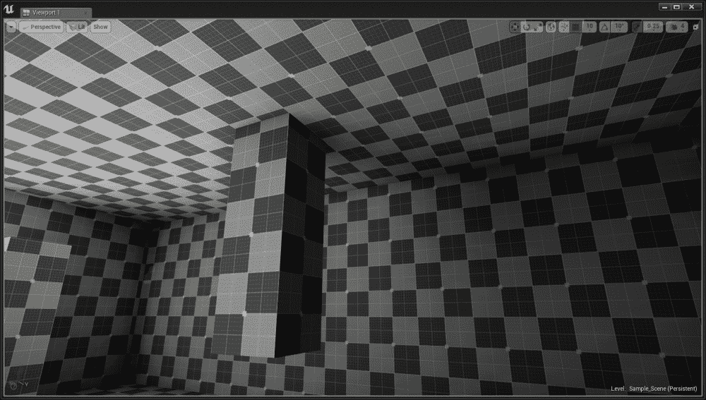

    间接照明质量和平滑度设置为 1.0

    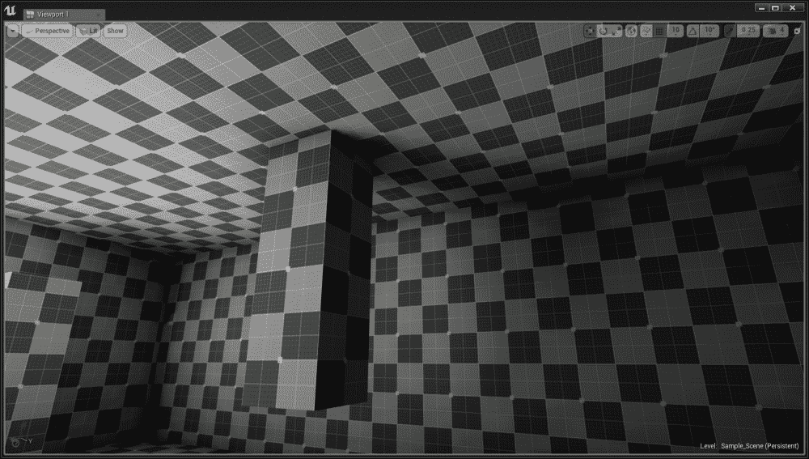

    间接照明质量：4.0 和间接照明平滑度：0.5。注意柱子投下的阴影差异

+   **环境颜色**：将其想象为围绕级别的巨大球体，向所有方向发射颜色。也就是说，这充当了 HDR 环境的作用。

+   **环境强度**：缩放 **环境颜色** 的强度。

+   **漫反射增强**：这是在场景中增强间接照明强度的有效方法。由于间接照明会从表面反弹，这个值将增强颜色的影响。

+   **使用环境遮挡**：启用静态环境遮挡。由于环境遮挡需要密集的光照样本，因此在**预览**构建中看起来可能不好。最好在生产预设中构建时调整环境遮挡设置。

+   **直接光照遮挡分数**：应用于直接光照的环境遮挡量。

+   **间接光照遮挡分数**：应用于间接光照的环境遮挡量。

+   **遮挡指数**：更高的值会增加环境遮挡的对比度。

+   **完全遮挡样本分数**：此值确定一个对象应在其他对象上生成多少环境遮挡。

+   **最大遮挡距离**：一个对象对另一个对象造成遮挡的最大距离。

+   **可视化材质漫反射**：用导出到 Lightmass 的材质漫反射项覆盖正常直接光照和间接光照。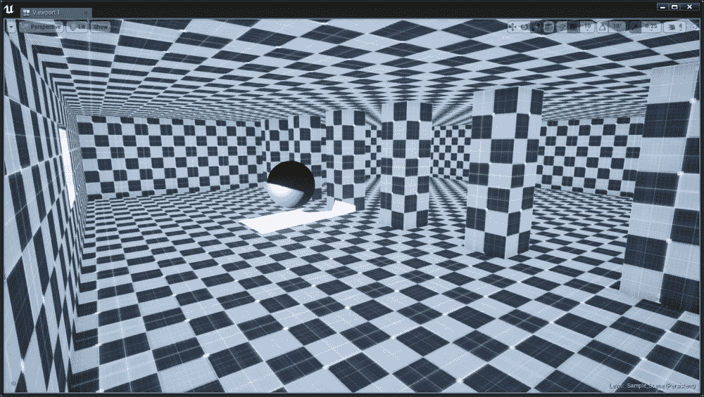

    启用材质漫反射可视化

+   **可视化环境遮挡**：用环境遮挡覆盖正常直接光照和间接光照。这在调整**环境遮挡**设置时很有用。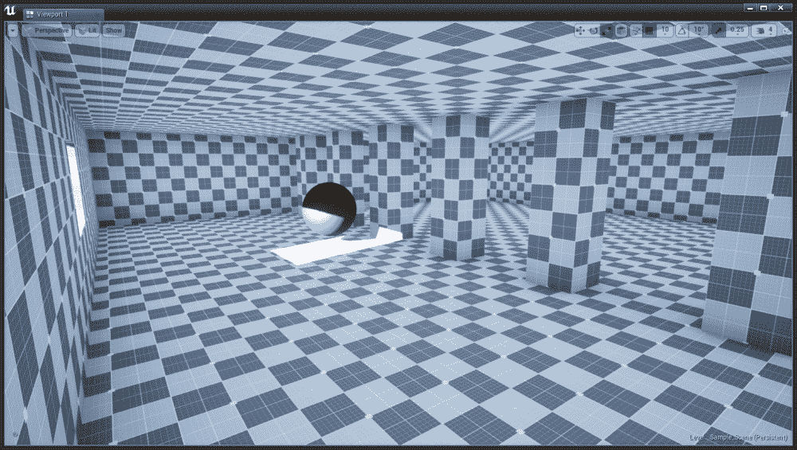

    启用环境遮挡可视化

+   **体积光照样本放置比例**：缩放放置体积光照样本的距离。

### 注意

所有这些 Lightmass 设置都需要重新构建光照。因此，如果您更改了这些设置中的任何一个，请确保重新构建光照以使更改生效。

**体积光照样本**由 Lightmass 在光照构建后的级别中放置，用于动态对象，如角色，因为 Lightmass 只为静态对象生成光照贴图。这也被称为**间接光照缓存**。

在以下屏幕截图中，您可以看到可移动对象（红色球体）是如何使用**间接光照缓存**进行照明的：

使用间接光照缓存

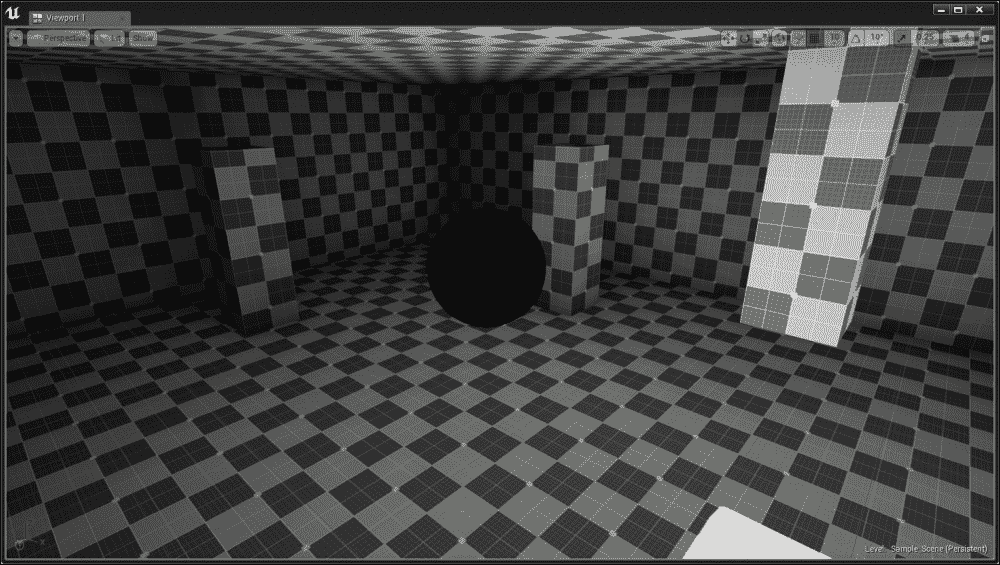

没有间接光照缓存

### 注意

**体积光照样本**仅放置在**Lightmass 重要性体积**内和静态表面上。

**间接光照缓存**也有助于预览未构建光照的对象。在光照构建后，如果您移动一个静态对象，它将自动使用**间接光照缓存**，直到下一次光照构建。

要可视化体积光照样本，请点击**显示** | **可视化** | **体积光照样本**。

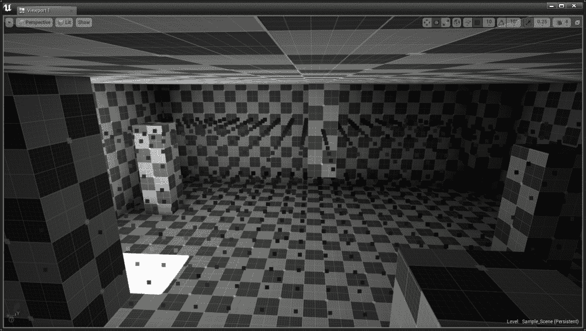

在级别中预览的体积光照样本。

### 注意

您可以在**后期处理体积**中调整**全局光照强度**和**颜色**。在**后期处理体积**中，展开**后期处理设置** | **全局光照**，在那里您可以看到**颜色**和**强度**的设置。

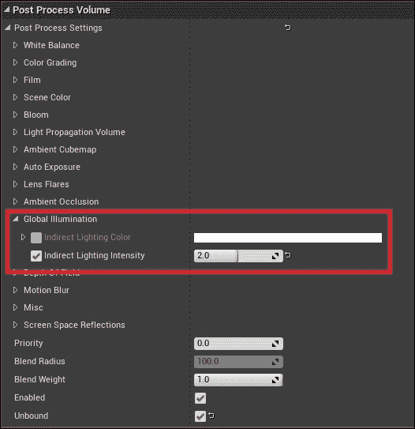

要切换特定的照明组件以进行调试，您可以在**显示** | **照明组件**部分使用各种照明组件标志。例如，如果您想预览您的场景而不使用任何直接照明，您可以关闭**直接照明**，仅预览**间接照明**的场景。请注意，这些功能仅适用于编辑器，并且不会影响您的游戏。这些功能仅用于调试目的。

# 摘要

在本章中，我们学习了关于灯光的知识，以及如何通过使用 Lightmass 全局照明来提高场景的真实感，以及如何准备我们的资产以与 Lightmass 一起使用。我们还学习了各种灯光和常见设置。在下一章中，我们将深入了解 Unreal Engine 4 最独特和最佳的功能：蓝图。
