# 第六章：蓝图

在本章中，我们将学习蓝图是什么以及如何使用它们来原型化您的游戏。我们将学习以下内容：

+   熟悉蓝图编辑器

+   各种蓝图图类型（例如，函数图、事件图等）

+   蓝图节点

+   最后，我们将创建一个简单的蓝图，可以在游戏运行时放置在世界上或动态生成。

Unreal Engine 4 中的蓝图视觉脚本是一个极其强大且灵活的基于节点的界面，用于创建游戏元素，并为艺术家和设计师提供编程游戏和快速在编辑器中迭代游戏玩法的能力，而无需编写任何代码！使用蓝图，您可以创建和调整游戏玩法、角色、输入、环境和游戏中几乎任何事物。

蓝图通过使用包含相互连接的节点的图来工作，这些节点定义了蓝图的功能。例如，它可以是对游戏事件的调用、生成新的演员，或者任何其他事情。

# 不同的蓝图类型

让我们快速查看在 Unreal Engine 4 中可用的各种蓝图类型：

+   **级别蓝图**：级别蓝图是一种特殊的蓝图，充当整个级别的全局事件图，用户无法删除或创建。每个级别都将有自己的级别蓝图，用户可以使用它来创建与整个级别相关的事件。用户可以使用此图来调用级别中特定演员的事件或播放 Matinee 序列。熟悉 Unreal Engine 3（或 UDK）的用户应该熟悉这个概念，因为这类似于那些引擎中 Kismet 的工作方式。

+   **类蓝图**：通常简称为蓝图，是在**内容浏览器**内创建的资产。一旦创建资产，就通过视觉定义其行为而不是编写任何代码。此蓝图作为资产保存在**内容浏览器**中，因此您可以将其拖放到您的世界中作为实例，或在另一个蓝图图中动态生成。

+   **动画蓝图**：这些是专门用于通过混合动画、直接控制骨骼和输出每帧的最终姿势来控制骨骼网格动画的图。动画蓝图始终有两个图，即**事件图**和**AnimGraph**。

+   **事件图**：这使用一系列与动画相关的事件来启动一系列节点，这些节点更新在**Animgraph**中驱动动画使用的值。

+   **AnimGraph**：用于评估您的**骨骼网格**的最终姿势。在此图中，您可以使用**骨骼控制**执行动画混合或控制骨骼变换。

+   **宏库**：这些是可以包含各种宏或图，您可以在任何其他蓝图类中多次使用的容器。宏库不能包含变量或从其他蓝图继承，也不能放置在级别中。它们只是您常用的一些图的集合，可以节省时间。如果您在蓝图中引用宏，则对该宏的更改不会应用到您的蓝图，直到您重新编译蓝图。编译蓝图意味着将所有属性和图转换为 Unreal 可以使用的类。

+   **蓝图接口**：这些是包含一个或多个未实现函数的图。添加此接口的其他类必须以独特的方式包含这些函数。这与编程中的接口概念相同，您可以使用公共接口访问各种对象并向彼此共享或发送数据。接口图有一些限制，您不能创建变量、编辑图或添加任何组件。

# 熟悉蓝图用户界面

蓝图**用户界面**（**UI**）默认包含多个选项卡。在下面的屏幕截图中，您可以看到蓝图 UI 的统一布局：

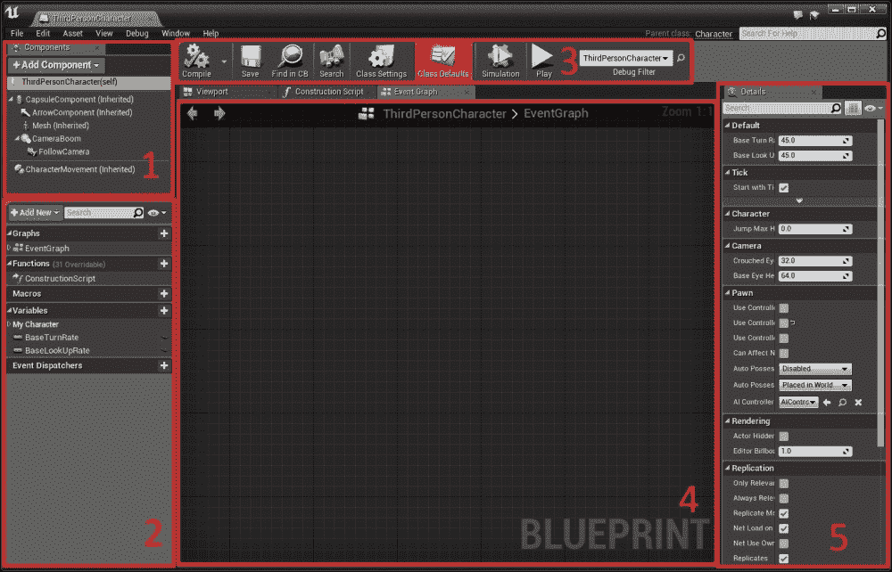

让我们来看看这些选项卡：

+   **组件**

+   **我的蓝图**

+   **工具栏**

+   **图形编辑器**

+   **详细信息面板**

## 组件选项卡

大多数蓝图类都可以有不同的组件类型。这些可以是灯光组件、网格组件、UI 组件等等。在本节中，我们将了解它们是什么以及我们如何在蓝图类中使用它们。

### 组件是什么？

组件是构成整个 Actor 的各个部分。组件不能独立存在，但添加到 Actor 后，Actor 将能够访问组件提供的所有功能。例如，考虑一辆车。车轮、车身、灯光等可以视为组件，而汽车本身作为 Actor。然后在图中，您可以访问组件并为您的汽车 Actor 执行逻辑。组件始终是实例化的，每个 Actor 实例都将有其自己的唯一组件实例。如果不是这样，那么，如果我们将多个汽车 Actor 放置在世界中，如果一个开始移动，所有其他的也将移动。

### 添加组件

要将组件添加到您的 Actor 中，请点击**组件**选项卡上的**添加组件**按钮。点击按钮后，它将显示您可以添加的各种**组件**列表。

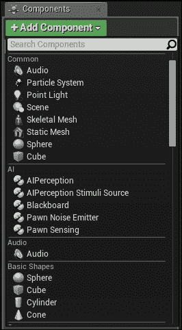

添加组件后，您将被提示为其命名。您也可以通过从**内容浏览器**拖放到**组件**窗口直接添加组件。

要重命名组件，您可以在**组件**选项卡中选择它并按*F2*。

### 注意

拖放方法仅适用于**静态网格**、**骨骼网格**、**声音提示**和**粒子系统**。

选择组件后，你可以通过按*Delete*键来删除它。你也可以在组件上右键点击并选择**删除**来移除它。

### 变换组件

一旦组件被添加并选择，你可以使用变换工具（*W*、*E*和*R*）通过在**详情**面板或**视口**标签中输入值来改变组件的位置、旋转和缩放。当使用移动、旋转或缩放时，如果你在**视口**工具栏中启用了网格吸附，你可以按*Shift*来启用吸附。

### 注意

如果组件有任何子组件附加到它上面，那么移动、旋转或缩放该组件将传播变换到所有子组件。

### 为组件添加事件

根据组件添加事件非常简单，可以通过不同的方法完成。以这种方式创建的事件是特定于该组件的，无需测试涉及哪个组件：

+   **从详情面板添加事件**：当你选择组件时，你将在**详情**面板中看到该组件所有可用的事件作为按钮。当你点击任何一个时，编辑器将在事件图中为该组件创建特定的事件节点。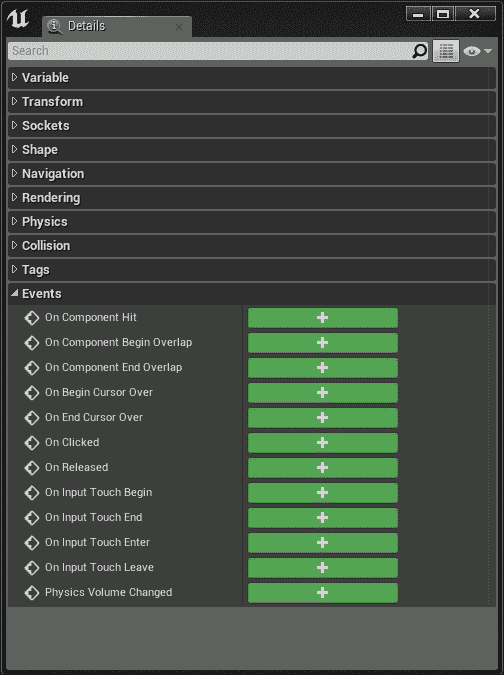

+   **通过右键点击添加事件**：当你在组件上右键点击时，你将在上下文菜单中看到**添加事件**。从那里你可以选择任何你想要的事件，编辑器将在事件图中为该组件创建特定的事件节点。

+   **在图中添加事件**：一旦你在**我的蓝图**标签页中选择了你的组件，你可以在图上右键点击并获取该组件的所有**事件**。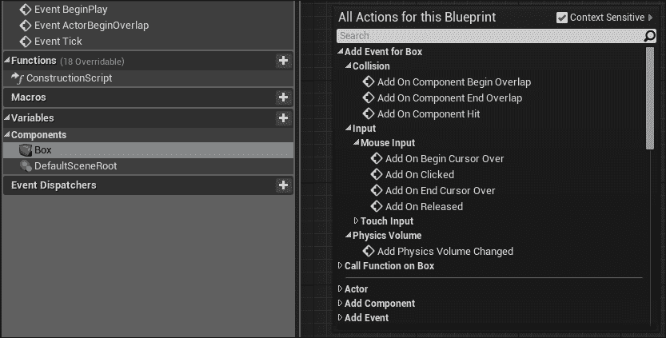

## 我的蓝图标签页

**我的蓝图**标签页显示了一个列表，其中包括了蓝图内包含的**图形**、**函数**、**宏**、**变量**等等。此标签页依赖于蓝图类型。例如，类蓝图将包含**事件图**、**构建脚本图**、**变量**、**函数**、**宏**等等。接口将仅显示其中的函数列表。**宏库**将仅显示其中创建的宏。

### 创建按钮

你可以通过点击快捷按钮（**+**）在**我的蓝图**标签页内创建新的变量、函数、宏、事件图和事件分发器。

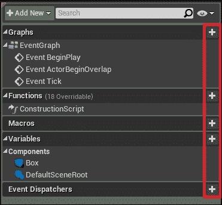

你也可以通过点击**+添加新**下拉按钮来添加它们。

### 在我的蓝图中进行搜索

**我的蓝图**标签页还提供了一个搜索区域，用于搜索你的变量、函数、宏、事件图和事件分发器。你可以根据名称、注释或其他数据进行搜索。

### 在我的蓝图中进行分类

总是组织你的变量、函数、宏、事件调度器等等到各种类别中是一个好习惯。在**我的蓝图**标签页中，你可以拥有尽可能多的类别和子类别。查看以下截图：

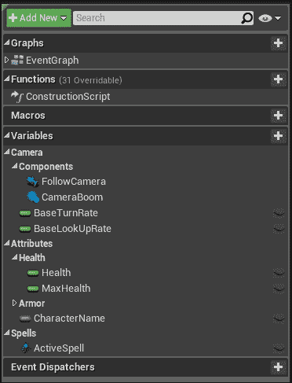

在这里，你可以看到我如何将所有内容组织成各种类别和子类别。要为你的变量、函数、宏和事件调度器设置类别，只需选择它们，然后在**详细信息**面板中输入你的新类别名称或从现有类别中选择。如果你需要子类别，则需要使用垂直线键（**|**）来分隔子类别名称。例如，如果你想将**健康**作为**属性**的子类别，你可以设置如下：**属性** | **健康**。

## 工具栏

工具栏提供了在编辑蓝图时所需的常用命令的访问权限。工具栏按钮将根据当前激活的模式（编辑模式、在编辑器中播放模式等）以及你当前正在编辑的蓝图类型而有所不同。

## 图形编辑器

图形编辑器是蓝图的主要区域。这是你添加新节点并将它们连接起来以创建定义脚本行为的网络的区域。关于如何创建新节点以及各种节点的更多信息将在本书的后续部分进行解释。

## 详细信息面板

**详细信息**面板提供了访问所选**组件**或**变量**属性的方法。它包含一个搜索字段，你可以用它来搜索特定的属性。

# 蓝图图类型

正如我们之前提到的，蓝图是保存在**内容浏览器**中的资产，用于创建新的演员类型或脚本游戏逻辑、事件等，这为设计师和程序员提供了快速迭代游戏玩法而不需要写一行代码的能力。为了让蓝图具有脚本行为，我们需要在图形编辑器中使用各种节点来定义其行为。让我们快速看一下各种图：

+   **构造脚本图**：构造图在蓝图初始化时执行，并且每当蓝图中的任何变量发生变化时都会执行。这意味着每次你在级别中放置蓝图实例并更改其变换或任何变量时，构造图都会执行。此图在每次构建时执行一次，并且在任何属性或蓝图更新时再次执行。这可以用于构建程序元素或设置游戏开始前的值。

+   **事件图**：这是包含所有游戏逻辑的地方，包括交互性和动态响应。使用各种事件节点作为函数、流程控制和变量的入口点，你可以为蓝图脚本化行为。事件图仅在开始游戏时执行。

+   **函数图**: 默认情况下，此图包含一个名为函数的单个入口点。此节点不能被删除，但你可以自由移动它。此图中的节点仅在你在构造图或事件图中调用此函数或从引用此函数所属蓝图的另一个蓝图调用此函数时执行。

+   **宏图**: 这就像是一个包含你的节点的折叠图。与函数图不同，宏可以有多个输入或输出。

+   **接口图**: 接口图被禁用，你不能移动、创建图、变量或组件。

### 注意

只有类蓝图才有**构造脚本**，它在游戏开始时停止执行，并被视为在游戏开始前完成。

## 函数图

函数图是在蓝图内部创建的节点图，可以从另一个图（如**事件图**或**构造脚本**）或从另一个蓝图执行。默认情况下，函数图包含一个单一的执行引脚，当函数被调用时激活，导致连接的节点执行。

### 创建函数

函数图是通过**我的蓝图**选项卡创建的，你可以创建任意数量的函数。

在**我的蓝图**选项卡中，你可以将鼠标悬停在函数标题上，然后点击**+函数**来添加一个新函数。

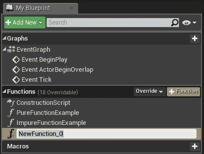

点击那个按钮（黄色高亮的按钮）将创建一个新的函数，并提示你输入一个新名称。

### 图形设置

当你创建一个新函数并选择它时，你将获得该函数的一些属性，你可以在**详细信息**面板中更改它们。让我们快速看一下它们。

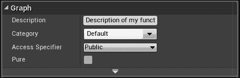

+   **描述**: 当你在另一个图中的此函数上悬停鼠标时，会显示为工具提示。

+   **类别**: 保持此函数在其指定的类别中（仅用于组织目的）。

+   **访问指定符**: 有时当你创建函数时，你不想在另一个蓝图中访问它们。访问指定符让你指定哪些其他对象可以访问此函数。

+   **公共**: 这意味着任何对象都可以从任何地方访问此功能。这是默认设置。

+   **受保护**: 这意味着当前蓝图及其从当前蓝图派生的任何蓝图都可以访问此功能。

+   **私有**: 此设置意味着只有当前蓝图可以访问此功能。

+   **纯函数**: 当启用时，此功能被标记为**纯函数**，当禁用时，则为**不纯函数**。

    +   **纯函数**不会以任何方式修改类的状态或成员，被视为**常量函数**，它只输出数据值，没有执行引脚。这些与**数据引脚**相连，并在需要它们上的数据时自动执行。

    +   **不纯函数**可以自由修改类中的任何值，并包含一个执行引脚。

下面的截图显示了**纯函数**和**不纯函数**之间的区别：

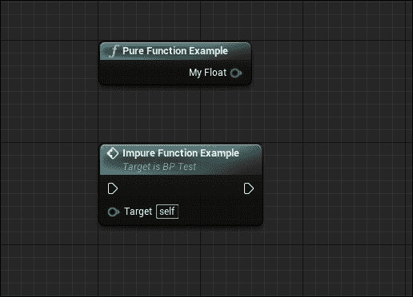

### 编辑函数

要定义函数的功能，您需要编辑它。您可以拥有任意数量的输入或输出，然后在这些输入和输出之间创建节点网络来定义功能。要添加输入或输出，您首先需要在**我的蓝图**选项卡中选择函数，或者在打开**函数图**时选择主要粉红色节点。然后，在**详细信息**面板中，您将看到一个标有**新建**的按钮，该按钮创建新的输入或输出。

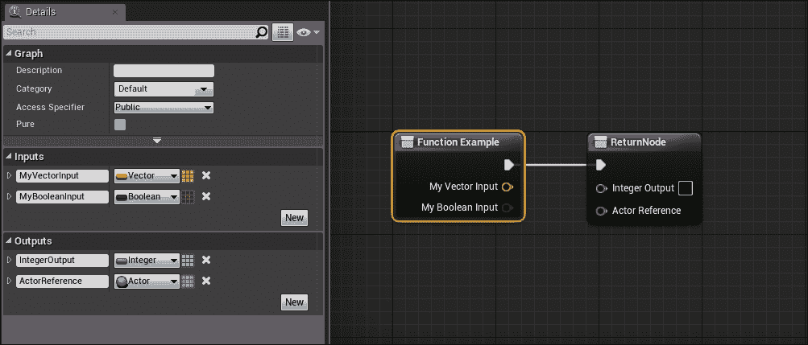

在这个屏幕截图中，您可以看到我如何向**函数示例**添加新的输入和输出。

### 注意

**ReturnNode**是可选的，并且只有在您至少有一个输出数据引脚时才会出现。如果您移除所有输出引脚，则**ReturnNode**将自动删除，您仍然可以使用您的函数。

例如，在下面的屏幕截图中，我创建了一个蓝图函数，为我的角色名称添加了一个前缀，这样我就可以使用这个单一函数随时更改前缀。

现在，回到**事件图**，我在**开始播放**事件上调用这个函数，这样我就可以在游戏开始时设置角色名称。

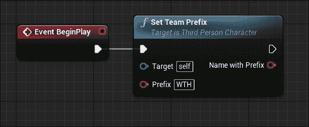

## 宏图

宏图实际上是节点的折叠图，其中包含由隧道节点指定的入口点和出口点，但不能包含变量。宏图可以有任何数量的执行或数据引脚。

宏可以在**类蓝图**或**关卡蓝图**内创建，就像函数一样，或者您可以在**蓝图宏库**中组织您的**宏**，该宏库可以在**内容浏览器**中创建。

**蓝图宏库**可以包含您所有的**宏**在一个地方，这样您就可以在任何其他蓝图中使用它们。这些可以节省大量时间，因为它们可以包含大多数常用节点并可以传输数据。但是，对宏图的更改只有在包含该宏的蓝图重新编译时才会反映出来。

要创建一个宏库，您需要在**内容浏览器**中右键点击，并从蓝图子类别中选择**蓝图宏库**。

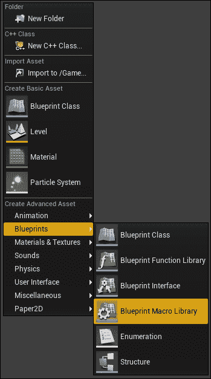

一旦选择该选项，您必须为您的宏选择一个父类。大多数情况下，我们选择**演员**作为父类。选择后，您将被提示为您的宏库输入一个名称并保存它。

如果您刚刚创建了您的宏库，编辑器将创建一个名为**NewMacro_0**的新宏，并将其突出显示以便您重命名。

就像处理函数一样，您可以输入一个描述并为您的宏定义一个**类别**。您还可以使用**实例颜色**为您的宏定义一个颜色。

在下面的屏幕截图中，您可以看到我创建了一个具有多个输出的宏，并为宏定义了**描述**、**类别**和**实例颜色**：

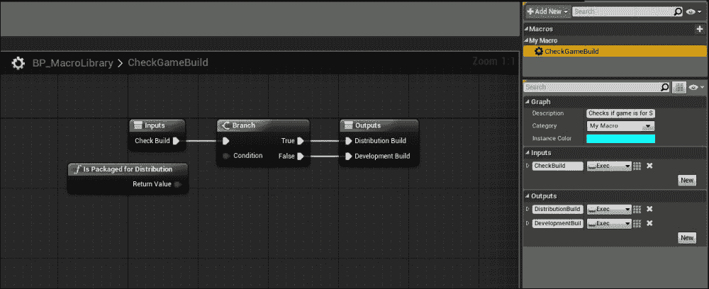

在任何其他蓝图中，我现在都可以获取这个宏并使用它。如果您将鼠标悬停在宏上，您可以看到您设置的作为**工具提示**的描述。

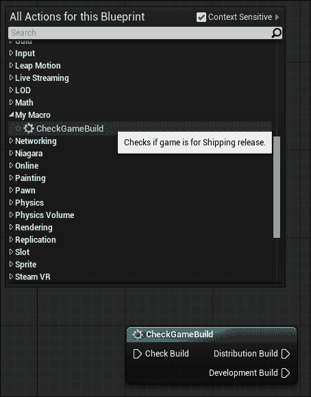

## 接口图

接口图是函数的集合，没有任何实现，可以添加到其他蓝图中。任何实现接口的蓝图类都将肯定包含接口中的所有函数。然后，用户需要为该接口中的函数提供功能。接口编辑器类似于其他蓝图，但您不能添加新变量、编辑图表或添加任何组件。

接口用于在具有特定功能的不同蓝图之间进行通信。例如，如果玩家有一个**火焰喷射器**枪，在游戏中您有**冰**和**布料**，两者都可以受到伤害，但一个应该融化，另一个应该燃烧。您可以创建一个包含**TakeWeaponFire**函数的**蓝图接口**，让**冰**和**布料**实现此接口。然后，在**冰蓝图**中，您可以实现**TakeWeaponFire**函数并使冰融化，在**布料蓝图**中，您可以实现相同的函数并使布料燃烧。现在，当您使用**火焰喷射器**射击时，您只需调用**TakeWeaponFire**函数，它就会调用那些蓝图中的函数。

要创建一个新的接口，您需要在**内容浏览器**上右键单击，并从**蓝图**子类别中选择**蓝图接口**，然后命名它。

在下面的示例中，我将其命名为**BP_TestInterface**：

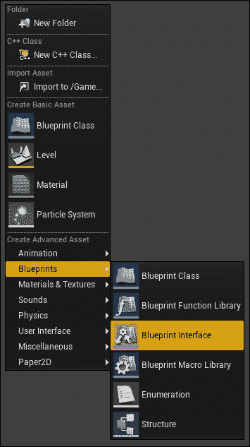

如果您刚刚创建了您的接口，编辑器将创建一个名为**NewFunction_0**的空白函数，该函数将突出显示以便您重命名。如果您在任何蓝图中实现此接口，则它将具有此函数。

在此示例中，我创建了一个名为**MyInterfaceFunction**的功能。我们将使用它简单地打印出实现此接口的 Actor 名称。

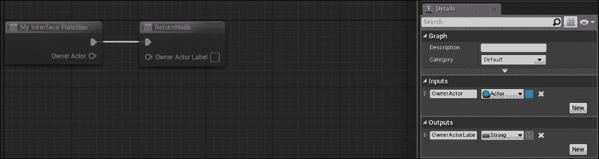

要为此函数创建功能，我们首先需要在蓝图中实现此接口。因此，打开您想要实现此功能的蓝图，并在**工具栏**中选择**类设置**。

现在，**详细信息**面板将显示此蓝图的相关设置，在**接口**部分，您可以添加您的接口。

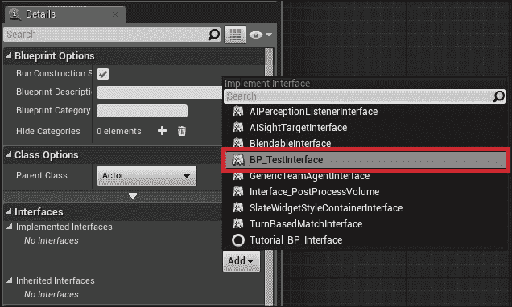

一旦添加了该接口，**我的蓝图**标签页将更新以显示接口功能。现在您只需双击该功能即可打开图表并添加功能。

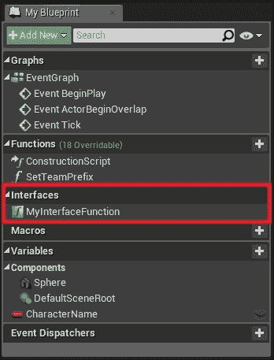

**我的接口函数**出现在**我的蓝图**标签页中的原因是该函数包含一个输出值。如果您有一个没有输出的接口函数，则它不会出现在**我的蓝图**标签页中。相反，当在蓝图上右键单击时，它将出现在**事件**下。例如，在同一个接口中，我创建了一个没有输出数据的另一个函数。

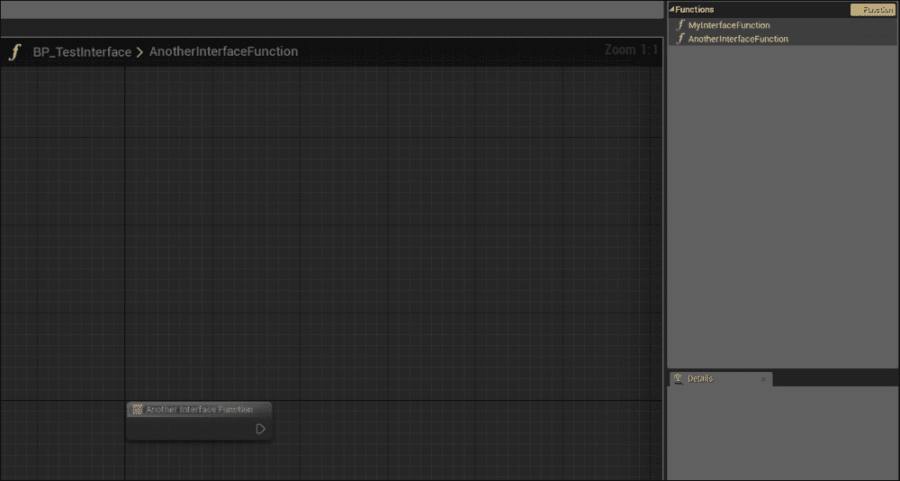

**另一个接口函数**不会出现在**我的蓝图**标签页中，因为它没有输出。因此，要在您的蓝图实现此函数，您必须将其添加为事件。

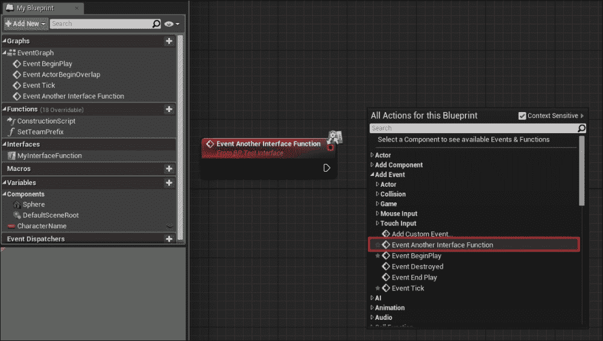

# 蓝图节点引用

使用各种节点定义蓝图对象的行为。节点可以是**事件**、**函数调用**、**流程控制**、**变量**等，这些都是在图中使用的。尽管每种类型的节点都有其独特的功能，但它们的创建和使用方式是通用的。

通过在图面内右键单击并从**上下文菜单**中选择节点，可以将节点添加到图中。如果选择了蓝图内的组件，则该组件支持的事件和函数也会列出。

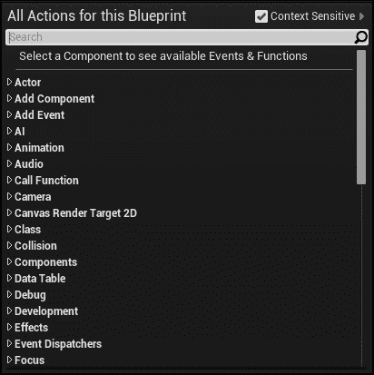

添加节点后，您可以使用左鼠标按钮选择并移动它。您可以使用*Ctrl*键向当前节点选择中添加或删除节点。在图中单击并拖动会创建一个**矩形选择**，它将添加到当前选择中。

节点可以有多个输入和输出，分为两种类型：**执行引脚**和**数据引脚**。

执行引脚启动执行流程，当执行完成后，它会激活一个输出执行引脚以继续流程。未连接时，执行引脚以轮廓形式绘制，连接时以纯白色绘制。

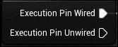

数据引脚是节点，用于从一个节点传输（如取用和输出）数据到另一个节点。这些节点是类型特定的。这意味着它们可以连接到相同类型的变量。如果将它们连接到不同类型的另一个数据引脚，某些数据引脚会自动转换。例如，如果您将`float`变量连接到`string`，蓝图编辑器将自动插入一个`float`到`string`转换节点。像执行引脚一样，未连接时以轮廓形式绘制，连接时以纯色绘制。

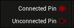

## 节点颜色

蓝图中的节点有不同的颜色，表示它是什么类型的节点。

红色节点表示它是一个事件节点，这是执行开始的地方。

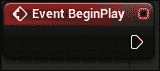

蓝色节点表示它可以是函数或被调用的事件。这些节点可以有多个输入或输出。函数顶部的图标将根据它是函数还是事件而改变。

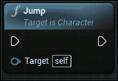

紫色的节点既不能创建也不能销毁。你可以在**构造脚本**和**函数**中看到此节点。

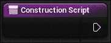

灰色的节点可以是**宏**、**流程控制**或**折叠**节点。

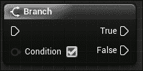

绿色的节点通常表示一个纯函数，用于获取值。

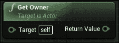

蓝色的节点表示它是一个铸造节点。此节点将给定的对象转换为另一个对象。

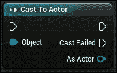

## 变量

变量是持有值或对象引用的属性。它们可以在蓝图编辑器内部或从另一个蓝图访问。它们可以创建以包含数据类型（`float`、`integer`、`Boolean`等）或引用类型或类。每个变量也可以是一个数组。所有类型都有颜色编码，以便于识别。

## 数学表达式

数学表达式节点本质上是可以双击打开子图以查看功能的折叠节点。每次你重命名节点时，都会解析新的表达式并生成一个新的图。要重命名节点，只需选择它并按*F2*。

要创建一个**数学表达式**节点，在图编辑器上右键单击并选择**添加数学表达式**节点。然后你将被提示输入你的**数学表达式**。

例如，让我们输入这个表达式：*(vector(x, y, z)) + ((a + 1) * (b + 1))* 并按*Enter*。

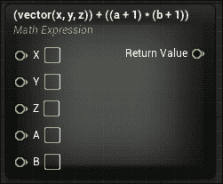

你现在会看到**数学表达式**节点已经自动解析了你的表达式，并从你的表达式中生成了适当的变量和图。

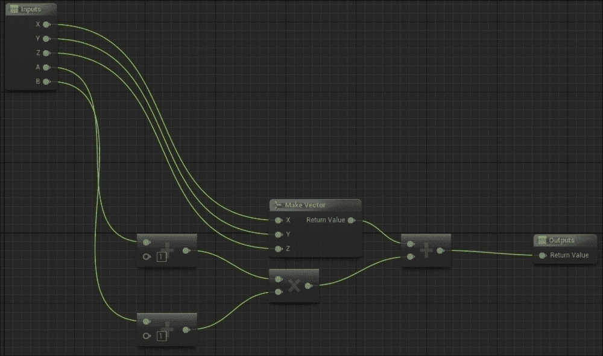

以下运算符受支持，可以与逻辑和比较运算符结合使用以创建复杂表达式：

+   **乘法**: *, /, % (取模)

+   **加法**: +, -

+   **关系**: <, >, <=, >=

+   **相等性**: == (等于), != (不等于)

+   **逻辑**: || (或), && (与), ^ (幂)

# 创建我们的第一个蓝图类

现在我们已经了解了蓝图是什么以及它做什么，让我们创建一个简单的蓝图演员，它会在自己的基础上旋转，并在几秒钟后通过粒子效果和声音自我销毁。创建我们的蓝图后，我们将将其拖放到世界中，并在运行游戏时使用**关卡蓝图**动态生成此蓝图。

## 创建一个新的蓝图

要创建此蓝图，首先在**内容浏览器**内右键单击并选择**蓝图类**。点击后，你将被提示选择蓝图的一个父类。你需要为你的蓝图指定一个父类，因为它将继承该父类的所有属性。

尽管你可以选择所有现有的类（甚至其他蓝图类），但让我们看看最常见的父类：

+   **演员**: 基于演员的蓝图可以放置或生成在关卡中

+   **NPC**：**NPC**是你可以称为的代理，你可以控制它并从控制器接收输入

+   **角色**：这是**NPC**的扩展版本，具有行走、奔跑、跳跃、蹲下等功能

+   **玩家控制器**：用于控制**角色**或**NPC**

+   **游戏模式**：这定义了正在玩的游戏

+   **演员组件**：这是一个可重用的组件，可以添加到任何演员上

+   **场景组件**：这是一个具有场景变换的组件，可以附加到其他场景组件上

在这个例子中，我们将使用**演员**类作为我们的父类，因为我们想将其放置在级别中并在运行时生成。因此，选择**演员**类，Unreal 将创建并放置你的新蓝图在**内容浏览器**中。双击你新创建的蓝图，这将打开蓝图编辑器。默认情况下，它应该打开**视口**选项卡，但如果它没有，那么只需简单地选择**视口**选项卡。这就是你可以看到并操作所有组件的地方。

现在我们需要一个组件，当这个蓝图生成时它会旋转。在**组件**选项卡中，点击**添加组件**并选择**静态网格**组件。添加组件后，将其重命名为**网格组件**（你可以选择任何你想要的名称，但在这个例子中，让我们选择这个名称）并注意**详细信息**面板已经填充了**静态网格**属性。

在**详细信息**面板中，你可以找到对应于你的组件类型的部分，在那里你可以分配要使用的资产。

但是，在这个例子中，我们不是直接在**组件**选项卡中分配网格，而是创建一个**静态网格**变量，并使用它来在图中分配网格。这样，我们可以更改网格而不必打开蓝图编辑器。

在**我的蓝图**选项卡中，创建一个新变量并将类型设置为**静态网格**（确保选择**引用**）。

### 小贴士

在 Unreal Engine 4.9 之前的版本中，你可以搜索**静态网格**并简单地选择引用。在 4.9 之前没有其他选项可以选择。

之后，将那个变量重命名为**我的网格**。由于这个变量用于将资产分配给我们的**静态网格**组件，让我们将其公开，以便在将其放置在世界上之后在**详细信息**面板中更改它。要公开这个变量，请选择它并在蓝图编辑器内部的**详细信息**面板中启用**可编辑**。在使其可编辑后，编译蓝图（快捷键：*F7*），你将能够为**我的网格**变量分配一个默认网格。对于这个例子，让我们添加一个简单的立方体**静态网格**。

现在我们已经设置了变量，我们可以将其分配给我们的**静态网格**组件。由于我们知道**构造图**在每次初始化此蓝图以及每次更改变量或属性时都会执行，因此我们将在这里为我们的**静态网格**组件分配网格。因此，打开**构造图**并：

+   在图表编辑器上右键单击并搜索**获取网格**组件。

+   从上下文菜单中选择**获取网格**组件。

+   从输出引脚点击并拖动，然后释放。你现在将看到一个新上下文菜单，并在该菜单中搜索**设置静态网格**并选择它。

+   再次在图表编辑器上右键单击并搜索**获取我的网格**。

+   选择**获取我的网格**并将输出引脚连接到**设置静态网格**蓝图节点的输入（**新网格**）。

+   最后，将**构造脚本**的执行引脚连接到**设置静态网格蓝图**节点，并按**编译**（快捷键：*F7*）。

如果你在编译后检查**视口**选项卡，你将看到你的新网格在那里。从这一点开始，你可以随意将这个蓝图拖到世界中，在**细节**面板中，你可以将**我的网格**更改为任何其他**静态网格**。

### 小贴士

按*Ctrl*+*E*打开您在世界中选择的对象的关联编辑器。

## 旋转静态网格

在蓝图编辑器中，有几种旋转网格的方法，在本节中我们将探讨最简单的方法，即使用**旋转运动**组件。

如果您已关闭蓝图，请将其打开并添加一个名为**旋转运动**的新组件。此组件将使该演员在给定的旋转速率下持续旋转，可选地围绕指定点旋转。此组件有三个主要参数可以在蓝图图中更改。它们是：

+   **旋转速率**：此更新**翻滚**/**俯仰**/**偏航**轴的速度。

+   **枢轴平移**：我们旋转的枢轴点。如果设置为零，则围绕对象的起点旋转。

+   **局部空间中的旋转**：旋转是应用于局部空间还是世界空间。

您可以创建两个新的变量（**旋转器**和**向量**变量）并将它们设置为可编辑的，这样您就可以在世界的**细节**面板中更改它们。最终的图表应如下所示：

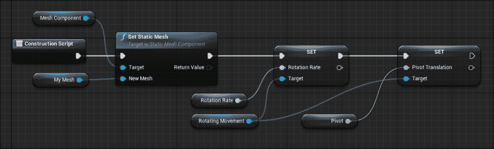

# 在几秒钟后销毁我们的蓝图演员

一旦我们将此演员放置或生成到世界中，我们将使用粒子效果和声音销毁此演员。为此：

+   创建一个新的变量（`float`）并将其命名为**销毁后**。让我们给它一个默认值五秒。

+   前往**事件图**并添加一个名为**事件开始播放**的新事件。当游戏开始或演员在游戏中生成时，此节点立即执行。

+   在图表编辑器上右键单击并搜索**延迟**并添加它。将**事件开始播放**连接到**延迟**节点。此节点用于在指定秒数后调用动作。

+   **延迟**节点接受一个`float`值，用于持续时间。持续时间结束后，执行继续到下一个动作。我们将我们的**销毁后**变量连接到**延迟**的持续时间。

+   右键单击图并搜索**在位置生成发射器**。此节点将在指定的位置和旋转处生成给定的粒子效果。将**Delay**连接到该节点，并在**发射器模板**中设置一个粒子效果。要设置位置，右键单击图并搜索**GetActorLocation**并将其连接到**位置引脚**。

+   右键单击图并搜索**在位置生成声音**。此节点将在给定位置生成并播放声音。将**Spawn Emitter**节点连接到该节点。

+   最后，为了销毁此演员，右键单击图编辑器并搜索**DestroyActor**并将其连接到**Spawn Sound**节点。

最终的图应该看起来像这样：

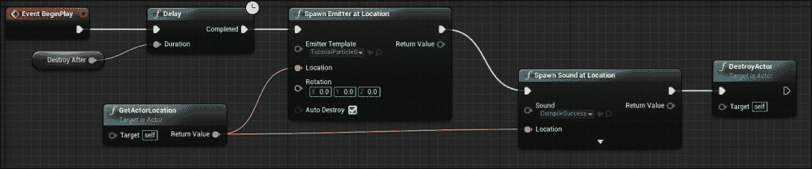

现在，当你将这个演员放置在世界上并开始游戏时，你会看到它旋转，并在五秒钟（或你在**销毁后**使用的值）后，在生成粒子效果和声音后，这个演员将被销毁。

# 在级别蓝图中生成了我们的蓝图类

我们现在将看到如何在游戏运行时在世界上生成这个蓝图演员，而不是在编辑时直接放置。

在我们继续之前，我们将修改旋转蓝图演员中的**DestroyAfter**变量。打开旋转演员的蓝图编辑器，在**变量**中，选择**DestroyAfter**变量，并在**详细信息**面板中启用**在生成时暴露**设置。

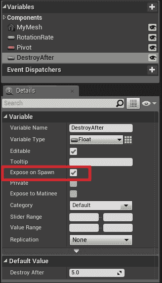

此设置意味着此变量将在**Spawn Actor**节点中暴露。

打开你的级别，在工具栏上，点击蓝图按钮并选择**打开级别**蓝图。在**级别蓝图**中执行以下步骤：

+   右键单击图并搜索**Event BeginPlay**并添加它。

+   右键单击图并从**类**搜索**Spawn Actor**并添加它。此节点将在指定的位置、旋转和缩放处生成给定的演员类。

+   在类引脚设置中将类设置为我们的**旋转蓝图**演员。注意现在**销毁后**变量已经暴露给了**Spawn**节点。你现在可以从那个**Spawn**节点调整那个值。

+   从**Spawn Transform**节点拖动并释放左鼠标按钮。从结果上下文菜单中选择**制作变换**。变换节点包含 3D 变换，包括平移、旋转和缩放。对于此示例，让我们将**位置**设置为**0,0,300**，这样这个演员将在地面上方生成 300 个单位。

结果图应该看起来像这样：

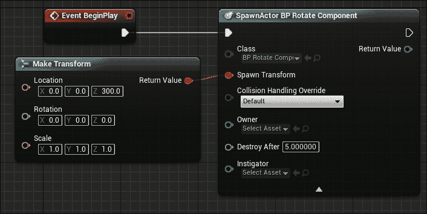

如果你播放（*Alt*+*P*）或模拟（*Alt*+*S*），你会看到这个旋转的演员在地面上方生成**300**个单位并旋转。

# 摘要

在本章中，我们学习了组件是什么以及我们如何使用它们来定义蓝图演员。我们还了解了蓝图节点以及如何创建它们。从本章所学的内容中，你可以通过以下方式更进一步：

+   当在关卡中重叠放置的触发体积中生成此演员时

+   在生成此蓝图时播放粒子效果和声音效果

+   如果玩家位于某个半径内，对玩家造成伤害

在下一章中，我们将使用 Matinee 创建一个剪辑场景。
