# 第七章。Matinee

Matinee 提供了在游戏过程中或电影游戏序列中动态地或以动态方式对演员的各种属性进行关键帧的能力。该系统基于专门的轨道，您可以在演员的某些属性上放置关键帧。Matinee 的**用户界面**（**UI**）与其他非线性视频编辑软件类似，这使得视频编辑人员更容易上手。

在本章中，我们将创建一个 Matinee 序列，并学习如何通过**关卡蓝图**来播放它。因此，为了开始，让我们启动 Unreal Engine 4 并基于**第三人称模板**创建一个新的项目。

# 创建一个新的 Matinee

要打开 Matinee UI，我们首先需要创建 Matinee 资产。您可以通过点击**Matinee**按钮并在关卡编辑器工具栏中选择**添加 Matinee**来创建 Matinee 资产。当您点击它时，可能会收到一个警告，说明撤销/重做数据将被重置。这是因为，当您处于 Matinee 模式时，一些更改被转换为关键帧，而编辑器需要清除撤销堆栈。点击**继续**，一个新的 Matinee 演员将被放置在关卡中，Matinee 编辑器将打开。让我们更详细地看看 Matinee 窗口：

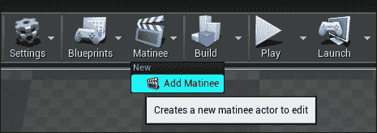

创建新的 Matinee 演员

这是 Matinee 演员的图标：

世界中放置的 Matinee 演员

创建一个新的 Matinee 演员后，它将自动打开**Matinee**窗口。如果它没有自动打开，那么请在世界中选择**Matinee 演员**，然后在**细节**面板中点击**打开 Matinee**。

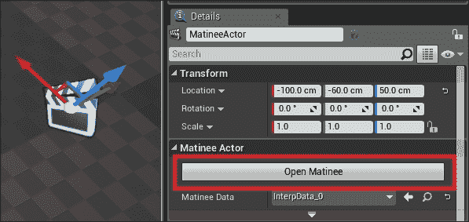

## Matinee 窗口

让我们快速浏览一下 Matinee 窗口：

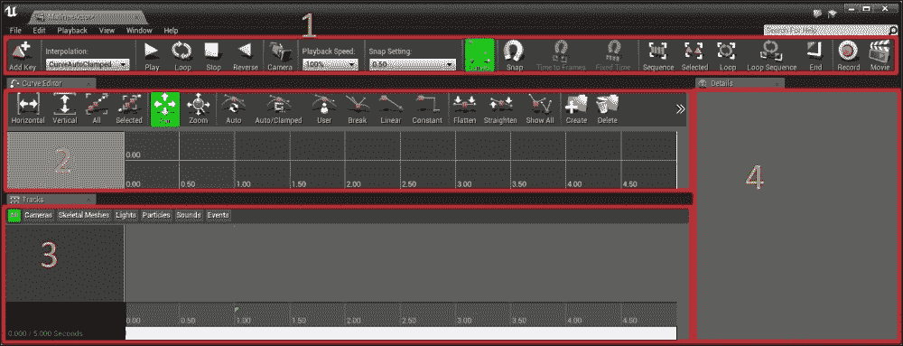

Matinee 窗口由以下部分组成：

+   **工具栏**：这里包含了 Matinee 编辑器中所有常用的按钮，例如播放 Matinee、停止它等等。让我们更详细地看看工具栏按钮：

    +   **添加关键帧**：这个选项在当前选定的轨道上添加一个新的关键帧。

    +   **插值**：这个选项设置添加新关键帧时的默认插值模式。

    +   **播放**：这个选项从轨道视图中的当前位置以正常速度播放预览到序列的末尾。

    +   **循环**：这个选项在循环部分循环预览。

    +   **停止**：这个选项停止预览播放。点击两次将回放序列并放置时间条在 Matinee 的开始位置。

    +   **反向**：这个选项反转预览播放。

    +   **相机**：这个选项在世界上创建一个新的相机演员。

    +   **播放速度**：这个选项调整播放速度。

    +   **捕捉设置**：这个选项设置捕捉的时间轴比例。

    +   **曲线**：这个选项切换曲线编辑器。

    +   **捕捉**：这个选项切换时间光标和关键帧的捕捉。

    +   **时间到帧**：这个功能会将时间轴光标捕捉到**捕捉设置**下拉菜单中选择的设置。只有当**捕捉设置**使用每秒帧数时，此功能才可用。

    +   **固定时间**: 这将 Matinee 的播放锁定到**快照设置**中指定的帧率。只有当**快照设置**使用每秒帧数时才启用。

    +   **序列**: 这将时间线视图与整个序列匹配。

    +   **选择**: 这将时间线视图与所选键匹配。

    +   **循环**: 这将时间线视图与循环部分匹配。

    +   **循环序列**: 这自动将循环部分的开始和结束设置为整个序列。

    +   **结束**: 这将移动到轨道的末尾。

    +   **记录**: 打开**Matinee 录制器**窗口。

    +   **电影**: 这允许您将 Matinee 导出为电影或图像序列。

    由于 Matinee 类似于其他非线性视频编辑器，您可以使用以下常用快捷键：

    +   *J* 播放序列向后

    +   *K* 停止/暂停

    +   *L* 播放序列向前

    +   加号（*+*）用于缩进时间线

    +   减号（*-*）用于从时间线中缩出

+   **曲线编辑器**: 这允许您可视化并编辑 Matinee 序列中轨道使用的动画曲线。这允许对随时间变化的属性进行精细控制。可以通过切换**曲线**按钮编辑具有动画曲线的某些轨道。点击它将曲线信息发送到曲线编辑器，在那里曲线将可见给用户。

+   **轨道**: 这是 Matinee 窗口的核心。这是您设置所有轨道关键帧并将它们组织到标签、组和文件夹中的地方。默认情况下，当您创建 Matinee 时，长度设置为 5 秒。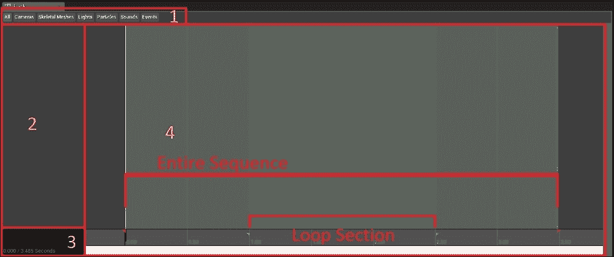

    +   **标签**: 这些用于组织目的。您可以将您的轨道放入各种标签中。例如，您可以将所有灯光放入 Matinee 的**灯光**标签，相机放入**相机**标签，等等。**所有**标签将显示您序列中的所有轨道。

    +   **轨道列表**: 这是您创建可以创建时间线关键帧的轨道并将它们组织到不同组的地方。您还可以创建新文件夹并将所有组组织到单独的文件夹中。

    +   **时间线信息**: 这显示了关于时间线的相关信息，包括当前时间、光标位置和序列的总长度。

    +   **时间线**: 这显示了序列中的所有轨道，这是我们在其中使用关键帧操作对象、动画相机等的地方。绿色区域显示了循环部分（在绿色标记之间）。在轨道视图底部，您可以看到一个小黑条，称为**时间栏**。如果您点击并按住它，您可以向前或向后刮擦时间线，这允许您快速预览动画。要调整序列的长度，请将最右侧的红标记移动到您想要此 Matinee 的长度。

## 操作对象

Matinee 可以用来创建剪辑场景，其中你可以移动摄像机和操作对象，或者它可以用于简单的游戏元素，例如开门和移动电梯。在这个例子中，我们将看到如何将一个简单的立方体从一个位置移动到另一个位置。

从**引擎内容**中，我们将拖放**Cube**网格到我们的世界中。这位于`Engine Content\BasicShapes`文件夹中。

要获取**引擎内容**，你需要在**内容浏览器**中启用它。

1.  在**内容浏览器**的右下角，你可以看到**视图选项**。

1.  点击它并启用**显示引擎内容**。

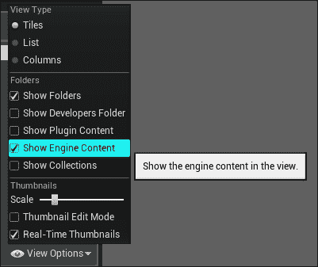

在我们将**Cube**放入世界中后，让我们打开**Matinee**编辑器窗口。确保在世界中选中**Cube**，然后在轨迹列表区域右键单击并选择**添加新空组**。你现在将被提示为你的组输入一个名称。让我们称它为**Cube_Movement**。

### 注意

注意，如果你在屏幕右下角看到一个通知说**Cube Mobility**已更改为**Movable**，请不要慌张。在 Matinee 中被操作的角色必须将**Mobility**设置为**Movable**。

如果你现在在 Matinee 中点击这个组，你可以看到世界中的**Cube**会自动为你选中。这是因为，当我们创建组时，我们在世界中选中了**Cube**，你在世界中选中的任何对象都会自动连接到你创建的组。

要在世界中移动立方体，我们需要向我们的**Cube_Movement**组添加一个**运动轨迹**。要创建此轨迹：

1.  右键点击我们的**空组**（**Cube_Movement**）。

1.  选择**添加新** **运动轨迹**。

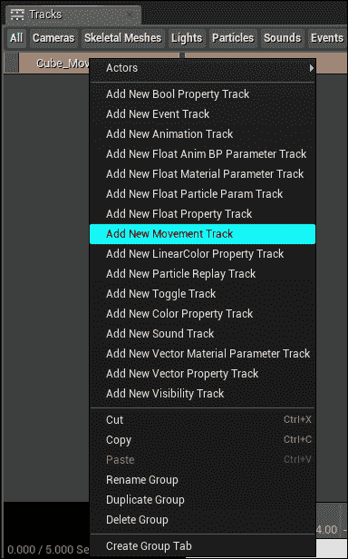

这将在我们的**空组**中添加一个新的运动轨迹，并将我们立方体的当前位置设置为第一个关键帧。

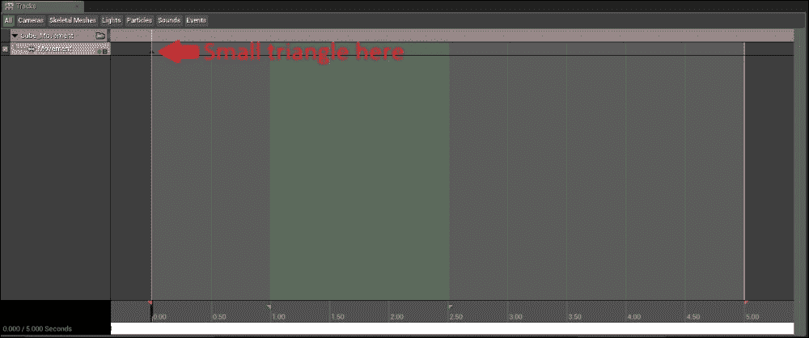

时间轴开头的三角形是关键帧。

现在，我们想让立方体向右移动一段距离，并且在这个序列结束时，它应该回到默认位置。所以让我们将时间条拖到序列的中间（因为默认长度是 5 秒，我们将时间条拖到**2.5**）并回到**视口**编辑器。在那里，我们选择并移动立方体到右侧（*Y*轴）并按*Enter*。注意，现在 Matinee 在时间槽**2.5**为你创建了一个新的关键帧，你将看到一个代表立方体移动路径的虚线黄色线。

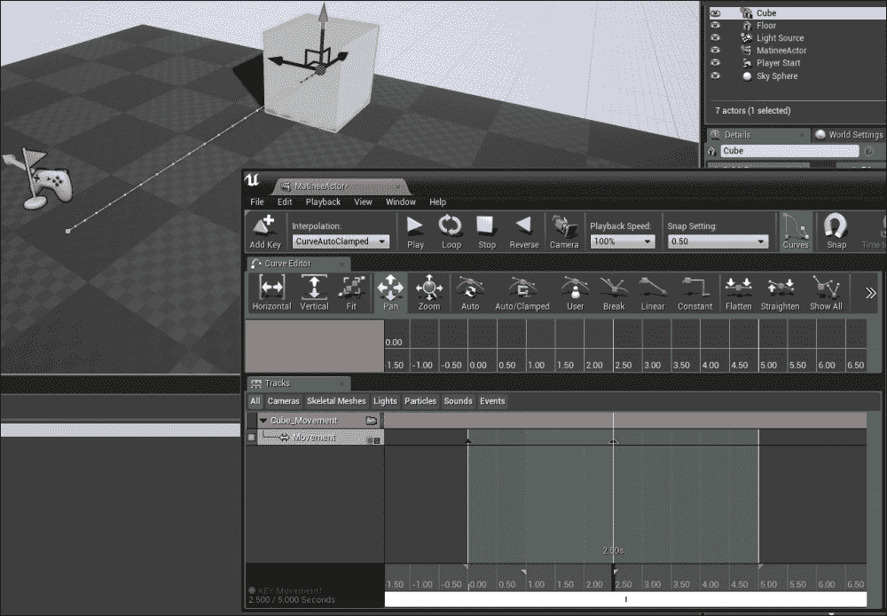

要在确切的时间（例如，精确到**2.5**）设置关键帧，你可以左键单击关键帧以选中它，然后右键单击并选择**设置时间**。你现在将被提示输入设置关键帧的新时间。在这里，你可以输入并设置**2.5**。

如果您现在拖动时间栏，您将看到立方体从其原始位置移动到我们在时间**2.5**处关键帧的新位置。现在，为了在序列结束时将立方体返回到原始位置，我们可以简单地复制粘贴第一个关键帧到序列的末尾。为此，单击第一个关键帧并按*Ctrl*+*C*复制它。然后，拖动时间栏到序列的末尾并按*Ctrl*+*V*粘贴它。完成的 Matinee 应如下所示：

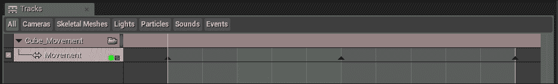

如果您现在在工具栏中点击**播放**，您将看到立方体从其原始位置移动到新位置，然后在序列结束时，它将返回到原始位置。

现在 Matinee 已经准备好了，我们将了解如何在游戏中播放 Matinee。我们要做的是在关卡中放置一个触发框，当我们的玩家重叠它时，Matinee 将播放。当我们的玩家走出触发框时，Matinee 将停止。

要在世界中放置一个触发框，您需要从**模式**标签页（位于**体积**类别的**位置**下）拖动它并将其放入视口。如果您没有**模式**标签页，那么：

1.  按*Shift*+*1*打开它（确保您的视口处于焦点）。

1.  在**模式**标签页中，进入**位置**模式（*Shift*+*1*）。

1.  选择**体积**标签页。

1.  拖动并放置**触发体积**框。

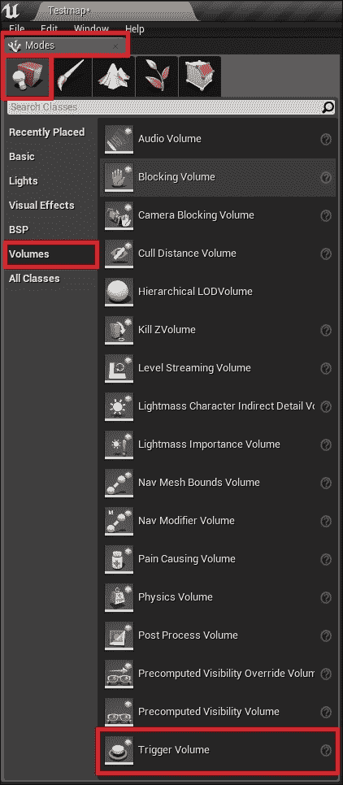

一旦触发框放置在世界中（您可以随意调整触发框的大小），右键单击它并导航到**添加事件** | **OnActorBeginOverlap**。

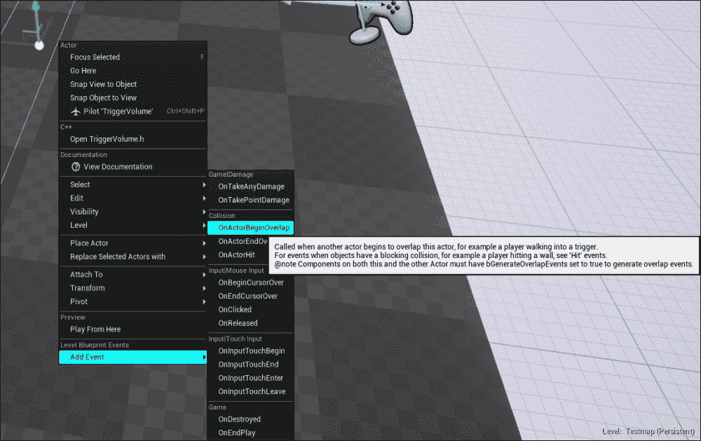

这将在**关卡蓝图**中为我们的**触发体积**添加一个新的**重叠事件**。由于我们需要在退出触发器后停止 Matinee，我们将再次右键单击**触发体积**并导航到**添加事件** | **OnActorEndOverlap**。现在我们在**关卡蓝图**中有两个事件（**开始重叠**和**结束重叠**）。

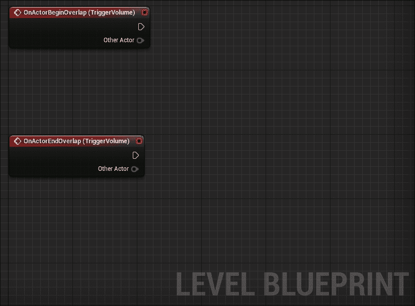

如您所见，这两个重叠事件都给出了当前重叠此**触发体积**的演员。我们将使用此信息仅在角色重叠时播放 Matinee。为此，我们必须遵循以下过程：

1.  从**OnActorBeginOverlap**事件中的其他演员引脚点击并拖动。从生成的上下文窗口中，输入**Cast to Character**并选择它。

1.  将**OnActorBeginOverlap**的执行引脚连接到我们刚刚创建的**Cast**节点。

1.  要播放 Matinee，我们首先需要在**关卡蓝图**中创建它的引用。为此，在世界中选择 Matinee 图标并右键单击**关卡蓝图**内部。从生成的上下文窗口中，选择**创建 Matinee 演员的引用**。这将添加一个新的节点，该节点引用世界中的 Matinee 演员。从该节点，拖动一条新电线并输入**Play**并选择它。

1.  将**角色**节点的输出（未命名）执行引脚连接到 Matinee 的**播放**节点。

1.  要在退出触发器时停止 Matinee，你可以进行与之前相同的设置，但使用**停止**节点而不是播放节点。

最终的图表应该看起来像这样：

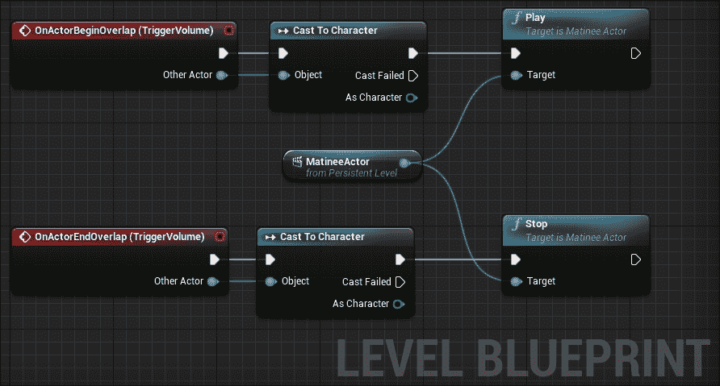

现在，当你玩游戏并重叠触发器时，我们的 Matinee 将播放。

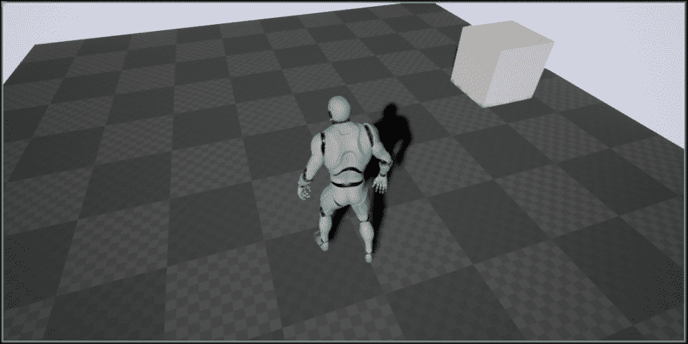

## 场景镜头相机

由于你已经学会了如何创建 Matinee 并移动对象，现在是时候学习如何创建一个简单的场景剪辑了。在本节中，我们将创建一个在 Matinee 被触发时聚焦于立方体的相机。

要创建一个相机，让我们首先将视口相机定位在正确的位置。在你的编辑器**视口**中，导航到你想要 Matinee 相机所在的位置。在下面的屏幕截图中，你可以看看我放置相机的地方：

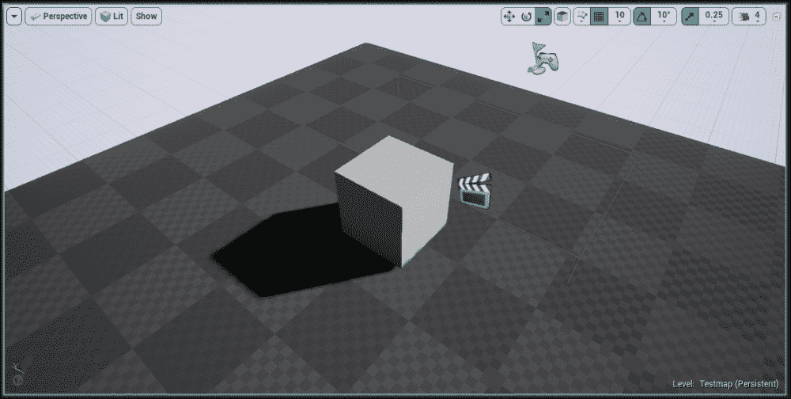

在导航到你的目标位置后，打开**Matinee**窗口。在工具栏上，点击**相机**按钮（这将提示你输入新的组名）以在当前的**视口**相机位置创建一个相机。

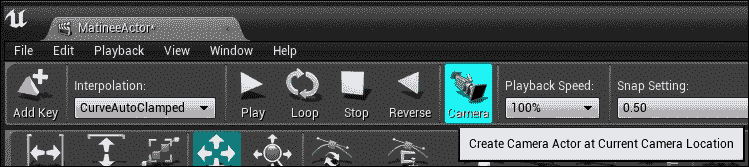

这也将创建一个新的**相机**组，包含两个轨道。它们是**视野**（**FOV**）和**运动**。由于我们不使用 FOV 轨道，你可以右键点击它并选择**删除轨道**，或者简单地按*Delete*键从轨道列表中移除它。

在选择相机的**运动轨道**后，将时间条拖动到序列的末尾。然后在编辑器**视口**中，选择 Matinee 创建的相机并将其移动到新的位置。在这个例子中，我将相机移动到右侧并旋转了 30 度。在下面的屏幕截图中，你可以看到相机的初始位置和序列末尾的新位置。

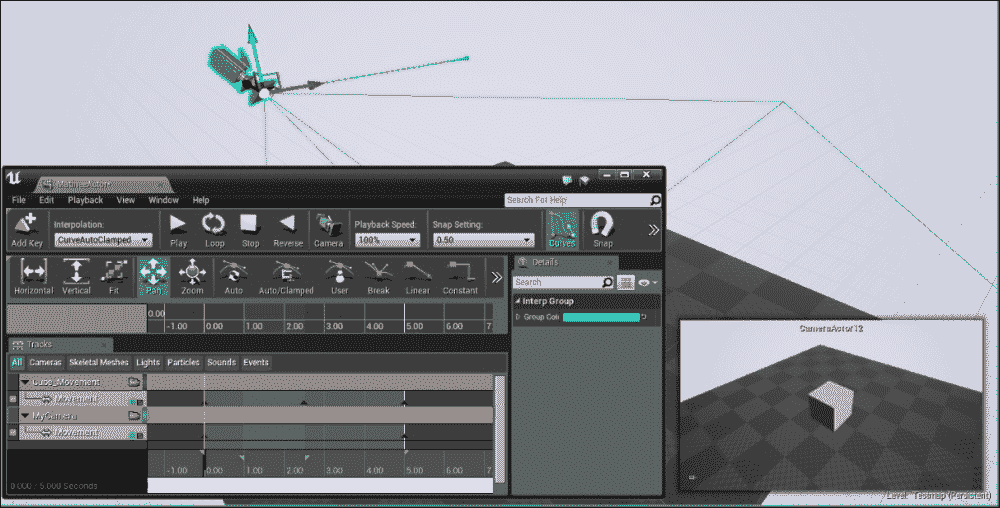

这是相机的新的位置：

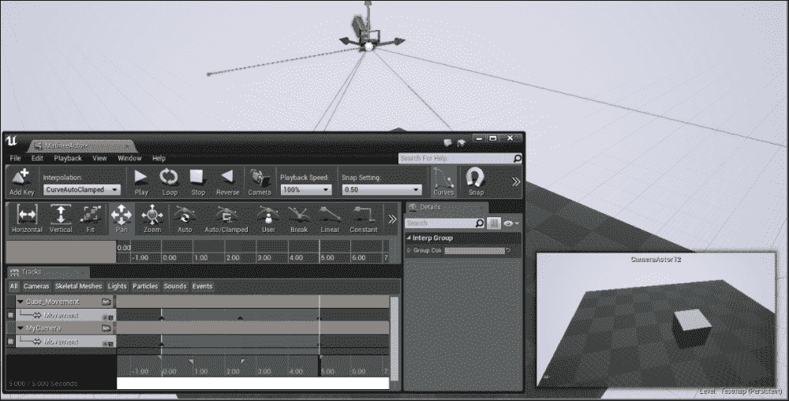

如果你现在播放并从我们之前放置的**触发体积**触发 Matinee，你会看到立方体像往常一样移动，但你不会从相机视角看到它。要从我们放置的相机中看到它，你需要给你的 Matinee 添加一个**导演轨道**。让我们看看**导演组**是什么。

### 导演组

导演组主要功能是控制 Matinee 的视觉和音频。这个组的重要功能是控制哪个相机组被选中在序列中显示。当我们在 Matinee 中有多个相机时，我们使用这个组在相机之间切换。

要创建一个新的**导演组**，右键点击轨道列表并选择**添加新导演组**。一个新的独立组将出现在所有其他组之上。

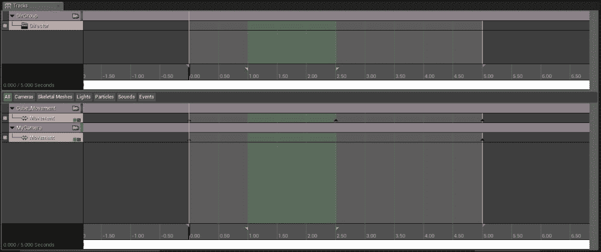

由于我们在这个组中只有一个摄像机，我们将将其添加到我们的导演轨道中。选择导演轨道并按*Enter*键。一个新弹窗将询问您选择哪个轨道，因此请选择**MyCamera**组（这是我们使用 Matinee 工具栏中的**摄像机**按钮创建的组）。**MyCamera**这个名字是我选择的。将在导演轨道中添加一个新的关键帧，显示为**MyCamera [Shot0010]**。这意味着每当 Matinee 播放时，您将通过**MyCamera**组看到。稍后，如果您添加更多摄像机，您可以在**导演组**之间切换摄像机。

最终结果应该看起来像这样：

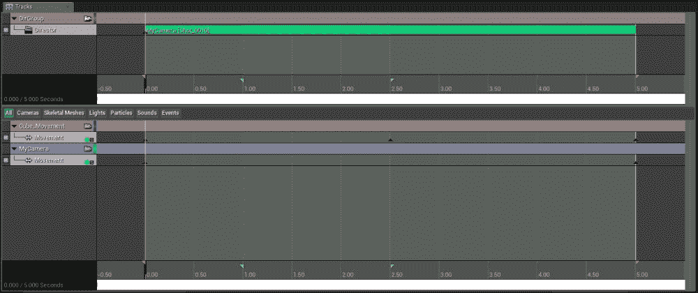

现在，如果您在游戏中播放 Matinee，您将通过新的**摄像机**视图看到它。

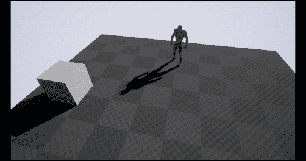

有时候，当播放过场动画时，最好禁用**玩家**移动（这样当过场动画处于活动状态时，所有玩家输入，如移动，都将被禁用）以及 HUD 等。要执行这些操作，请选择世界中的 Matinee 演员，然后在**详细信息**面板中，您可以设置必要的选项。

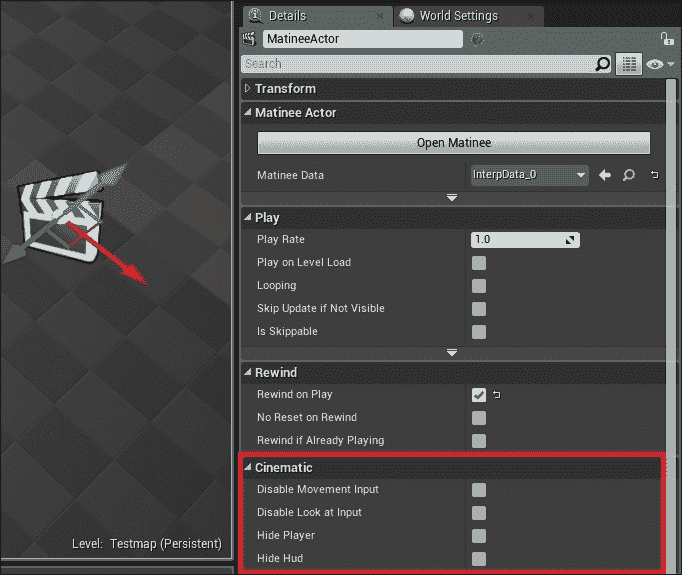

# 摘要

Matinee 是一个非常强大的工具，可以用来创建游戏中的电影。通过多个摄像机和其他视觉/音频效果，您可以创建看起来很好看且专业的电影。由于您已经学会了如何在本章中操作对象和摄像机，现在您应该尝试使用一个充当监控摄像机的摄像机来创建电梯运动。
