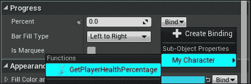

# 第八章。Unreal 运动图形

**Unreal 运动图形**（**UMG**）是一个用户界面（UI）创作工具，用于创建游戏中的**抬头显示**（**HUD**）、主菜单和其他 UI 元素。它们使用一个名为**小部件蓝图**的特殊蓝图创建，其中包含各种预定义的小部件，您可以使用它们来构建您的界面。现在让我们看看 UMG。

在本章中，您将学习如何创建 UMG 小部件并将一个分配给我们的角色以显示其健康状态。您还将学习如何创建浮动健康条。

# 设置项目

要开始，启动 Unreal Engine 4 并基于第三人称模板创建一个新的项目。

由于我们将有一个带有健康条的 HUD，让我们在我们的第三人称角色蓝图中添加一个新的健康变量。在`ThirdPersonBP/Blueprints`文件夹中打开**ThirdPersonCharacter**蓝图：

在我们的角色蓝图中创建一个名为**Health**的新变量，并按照以下步骤操作：

+   将变量类型设置为`float`并为其提供一个默认值 100。下一步是创建一个**纯**函数，该函数显示玩家总健康的百分比。

+   在您的角色蓝图中创建一个新的函数（例如，**GetHealthPercentage**）并打开它。

+   在函数图中，获取您的健康变量并将其除以健康默认值。通过这样做，我们将得到玩家健康的百分比。要获取您类中任何变量的默认值，只需在图中右键单击并搜索**获取类默认值**。此节点将返回您创建的所有变量的默认值。

+   现在，为这个函数创建一个新的输出（float 类型）并将结果（除法节点）连接到这个输出。这个函数现在将返回玩家健康的百分比。例如，如果玩家的健康是 42，那么除以 100（默认健康值）将返回 0.42。我们可以使用这个信息在我们的 HUD 进度条以及浮动健康条中。

生成的蓝图函数应如下所示：

### 注意

注意，将输出名称设置为**ReturnValue**非常重要。

我们现在将创建一个 UMG 小部件并利用这个函数来显示玩家的健康状态。

## 创建 HUD 小部件

要创建一个新的小部件蓝图：

+   右键点击内容浏览器

+   在**用户界面**部分下选择**小部件蓝图**：

一旦选择，新的**小部件蓝图**将被放置在内容浏览器中，并提示您输入一个新名称。在这个例子中，我将其命名为`MyUMG_HUD`。

双击`MyUMG_HUD`以打开它：

小部件蓝图用户界面

这就是小部件蓝图。这是您创建游戏 UI 的地方。让我们更仔细地看看小部件蓝图 UI：

+   **工具栏**：这是常见的工具栏，允许您**编译**、**保存**、**播放**和**调试**您的图形。

+   **编辑模式**：这允许您在**设计器**模式和**图形**模式之间切换。

+   **视觉设计器**：这是主要区域，您可以将所有小部件拖放到此处以创建您的 UI，就像它在游戏中出现的那样。

+   **调色板**：这是您可以拖放到**视觉设计器**中的小部件列表。这还将列出您创建的任何自定义小部件。

+   **层次结构**：这显示了此小部件的结构。您也可以在此处拖放小部件。

+   **动画列表**：这允许您创建新的**动画轨迹**，您可以使用它来动画化小部件的各种属性。

+   **动画轨迹编辑器**：创建新的动画后，您可以选择该动画并在此处创建关键帧。

由于我们将使用此作为我们的玩家 HUD，让我们创建一个显示玩家健康的进度条。

## 创建健康条

从**调色板**窗口，将**进度条**小部件拖放到**视觉设计器**。一旦放置在**视觉设计器**上，您可以将其调整到任何大小。您也可以将其放置在任何位置，但在这个例子中，我决定将其保持在屏幕的左下角。

当您选择**进度条**小部件时，您将在**详细信息面板**中看到您可以编辑的所有属性，包括您**进度条**的名称。在这个例子中，我已经将我们的进度条名称更改为 HealthBar。**进度条**小部件提供了一系列您可以更改的设置，包括外观和感觉。

以下截图是我刚刚放置的健康条：

让我们快速看一下您将更改的一些常见设置：

**锚点**：这些定义了小部件的位置，并保持它在不同屏幕尺寸下的位置。默认情况下，有 16 个锚点位置，通常这些中的一个就足够满足大多数需求。但有时您必须手动调整锚点位置。例如，如果您的游戏有一个玩家可以动态调整内容的库存系统，那么您需要手动调整锚点位置。在这个例子中，我们将锚点位置设置为屏幕的左下角。

+   **位置 X**：这将在**X 轴**上定位小部件。（水平）。

+   **位置 Y**：这将在**Y 轴**上定位小部件。（垂直）。

+   **大小 X**：这会在**X 轴**上缩放小部件。

+   **大小 Y**：这会在**Y 轴**上缩放小部件。

+   **对齐**：这是小部件的支点。将**X**和**Y**都设置为`0.0`将支点设置为左上角，将两者都设置为`1.0`将支点设置为右下角。您可以使用对齐选项与锚点精确设置小部件到屏幕中心。例如，您可以将对齐（**X**和**Y**）设置为`0.5`并将锚点设置为中央，并将位置**X**和**Y**都设置为`0.0`。这将使您的组件正好位于屏幕中心。这可以用于设置十字准星。

+   **大小到内容**：如果启用，此小部件将忽略**大小 X**和**大小 Y**值，而是根据小部件内容进行缩放。例如，如果您的 小部件是一个**文本块**，那么它将根据给定文本的大小自动缩放。

+   **ZOrder**：这定义了此小部件的渲染优先级。优先级较高的组件最后渲染，这使得它们出现在其他组件之上。

+   **样式**：这定义了此小部件的外观和感觉。请注意，每个小部件都有自己的独特样式设置（您可以使用**纹理**或**材质**作为小部件的图像）。如果它是一个进度条小部件，那么样式类别将允许您更改进度条填充图像、背景图像和跑马灯图像。如果它是一个按钮，那么您可以根据按钮状态更改按钮的图像。例如，**正常**状态、**悬停**状态、**按下**状态等。

+   **百分比**：这使用给定的值填充进度条。范围从 0-1。在这个例子中，我们将使用我们角色的**健康百分比**来驱动这个值。

+   **填充类型**：这定义了进度条的填充方式。例如，从左到右、从右到左、从中心等。

+   **是否跑马灯**：这启用了跑马灯动画进度条。这意味着进度条将显示活动，但不会指示何时停止。

+   **填充颜色和透明度**：这定义了进度条填充图像的颜色和透明度。

现在我们知道了**进度条**的设置，让我们继续并将我们角色的健康百分比分配给创建的健康条。为此，首先让我们将我们的**编辑器**模式切换到**图形**模式，方法是单击顶左角的**图形**按钮。一旦点击，您将看到此小部件的蓝图图形编辑器。

在小部件蓝图的原型左侧，您将看到**我的蓝图**选项卡。正如您在蓝图章节中学到的，这是您创建变量的地方。所以让我们创建一个新的变量（我将其命名为`MyCharacter`）并设置我们的**第三人称角色**的类型。请参考以下截图：

创建完成后，返回到**设计器**模式并选择你的**进度条**。在**详细信息面板**中，你可以看到**绑定**选项靠近**百分比**值。当你点击它时，你会看到一个新下拉菜单，显示我们刚刚创建的`MyCharacter`变量。将鼠标移到它上面，你会看到我们之前创建的**GetPlayerHealthPercentage**函数：

一旦点击，它将从我们的角色设置健康百分比值到进度条。

### 注意

如果你在**绑定**下拉菜单中看不到你的角色变量，请确保你已经编译了**小部件蓝图**。

# 将我们的 HUD 分配给角色

现在我们已经完成了 HUD 的设置，是时候将它分配给角色了。让我们现在关闭**小部件蓝图**并打开**第三人称角色蓝图**。

在我们的**角色蓝图**中，打开**事件图**并：

+   右键单击，从出现的上下文菜单中搜索**Event BeginPlay**并选择它。

+   从**Event BeginPlay**的执行引脚拖动一条线并释放鼠标按钮。从上下文菜单中搜索**Create Widget**并选择它。

+   在**创建小部件**节点中，从类引脚中选择**MyUMG_HUD**。

+   从**创建小部件**节点的**返回值**拖动一条新线并释放鼠标按钮。从上下文菜单中搜索**Set My Character**并选择它。

+   在图编辑器中右键单击并搜索`self`并选择**获取对 self 的引用**。将此节点连接到**My Character**引脚。

+   再次，从**创建小部件**节点的**返回值**拖动一条线并搜索**Add to Viewport**。

+   将**Set My Character**节点的输出执行引脚连接到**Add to Viewport**节点的输入执行引脚。

结果图应该看起来像这样：

现在，如果你开始玩游戏，你会看到健康条完全填满：

### 注意

如果你的健康条仍然是空的，请确保你已经将**GetHealthPercentage**的输出名称设置为**ReturnValue**。

为了测试它，我们可以创建一个名为**DecrementHealth**的新函数并创建一个类似这样的图：

之后，从你的**我的蓝图**选项卡拖放此函数并将其连接到**Add to Viewport**节点之后。现在，如果你开始玩游戏，你会看到玩家健康值随机下降。

# 创建浮动健康条

在本节中，你将学习如何创建位于角色头顶上方的浮动健康条。让我们回到**内容浏览器**并创建一个新的**小部件蓝图**（例如，我将命名为**MyFloatingHealthbar**）并打开它。

在**设计器**选项卡中，你可以看到在视觉设计器的右上角有一个名为**填满屏幕**的选项。点击它并将它更改为**自定义**：

**Custom**模式将允许你分配此小部件的宽度和高度。让我们将宽度和高度设置为 256 和 32。现在，我们将一个新的进度条拖放到视觉设计器中，并使用以下设置：

将**Anchors**设置为最后一个锚点（这是填充锚点）。锚点有助于小部件在不同屏幕尺寸下保持其位置，从而避免小部件被裁剪掉屏幕。除了填充锚点之外，还有其他预设的锚点，例如填充左下角、填充右侧、填充底部区域、填充顶部区域、顶部左、中心、右角，等等。根据小部件的位置，你可以选择任何你想要的锚点，在游戏中，小部件将相对于锚点位置进行定位。

在这个例子中，由于我们设置了锚点为填充，位置 X 和 Y 以及大小 X 和 Y 将被分别替换为**Offset Left**、**Top**、**Right**和**Bottom**。将**Offset Right**和**Bottom**更改为`0.0`。进度条现在将正确地拉伸到视觉设计器的宽度和高度。

现在，让我们创建一个新的变量名为**My Character**，类型设置为你的**ThirdPersonCharacter Blueprint**，并将**Percent**值绑定到角色的**GetHealthPercentage**函数上。这正是我们为我们的 HUD Widget 执行的确切步骤。

设置百分比值后，现在让我们暂时关闭这个**Widget Blueprint**，并打开**ThirdPersonCharacter Blueprint**。切换到**Viewport**标签页，在**Components**标签页中点击**Add Component**，并选择**Widget Component**：

一旦选择，这个小部件组件将被添加到你的玩家角色中。选择新添加的**Widget Component**，在**Details Panel**中，将**Draw Size**设置为与我们用于**MyFloatingHealthbar**相同的尺寸，即`256`和`32`。然后设置**Widget Class**为**MyFloatingHealthbar**类，并将**Space**设置为**Screen**。最后，将**Widget**移动到你的期望位置。在这个例子中，我将它设置在角色的头顶上方。

仅供参考，以下是截图：

如果你现在开始游戏，你会看到生命条漂浮在玩家头顶上方，但它将是空的。这是因为我们还没有将**My Character**值分配给我们的浮动生命条。为了使其工作：

1.  切换到**Construction Script**标签页。

1.  在**Construction Script**标签页的任何位置右键单击，搜索**Get Widget**，并选择它。

1.  从你刚刚创建的**Widget**节点拖动一根新线，搜索**Get User Widget Object**，并选择它。

1.  从**Get User Widget Object**的返回值引脚拖动一根新线，搜索**Cast**到**MyFloatingHealthbar**，并选择它。

1.  将**Construction Script**的输出执行引脚连接到这个新创建的**Cast**节点。

1.  从输出引脚（例如**My Floating Healthbar**）拖动一根新线，搜索**Set My Character**并选择它。

1.  将**Cast**节点的未命名输出执行引脚连接到**Set My Character**节点。

1.  在图表编辑器上右键点击，搜索`self`，并选择**获取 self 的引用**。将此节点连接到**My Character**引脚。

就这些了！现在如果你按播放，你将看到你的角色的生命条在你的玩家头上浮动：

# 摘要

UMG 可以用来创建各种 UI 效果。从这里，你可以通过添加玩家头像图像到你的浮动生命条旁边或给你的角色一个武器并显示该武器的弹药计数等方式来扩展它。你还可以将 Widget 组件添加到游戏中的其他角色（例如，宝箱）上，以显示有关该角色的信息。记住，在视觉设计器中布局你的 UI 只是开始。为了使你的 UI 看起来更好，你必须通过更改小部件的样式来改变其外观和感觉。
