# 第十一章. 项目打包

在本书的整个过程中，你学习了 Unreal Engine 4 的基础知识。在本章的最后，我们将回顾所有这些内容，同时了解如何将你的项目打包成一个独立游戏。你还将学习如何快速分发游戏以及如何打包游戏作为发布版本。

# 回顾

在第一章中，你学习了 Unreal Engine 不同版本之间的区别。正如我提到的，启动器版本是由 Epic 编译的二进制版本，可供你使用。但是，如果你想获取通过启动器尚未提供的最新构建版本，那么你唯一的选择就是从 GitHub 获取源代码。如果你打算使用 Unreal Engine 的源代码版本，我建议从推荐的分支获取源代码。Epic 为他们的艺术家和设计师努力工作，因此大多数时候它每天都会更新，你也可以获得最新的内容！如果你真的想亲自动手或者你有获取最新和最前沿构建的冲动，那么你应该选择 master 分支。请记住，这个分支直接跟踪 Epic 的实时更改，它可能存在错误，甚至可能无法编译。

一旦你启动了引擎，你就可以开始将你的资产导入到**内容浏览器**中。这是你保存和编辑游戏中使用的资产的地方。**内容浏览器**提供了许多功能，如基于关键字、标签、资产类型、过滤器等进行搜索，你还可以使用**内容浏览器**中的**集合**功能添加对你最常用资产的引用。在搜索时，你可以在名称前添加连字符（-）来排除特定的关键字。例如，如果你想排除所有包含名称`floor`的资产，那么你可以在**内容浏览器**中搜索`-floor`。这将显示所有不包含单词 floor 的资产。

**内容浏览器**的另一个出色功能是**开发者**文件夹。这在团队合作中特别有用，当你想在游戏中尝试不同的技术或资产而不影响其他部分时。有一点要记住的是，你应该只将此文件夹严格用于个人或实验性工作，并且你永远不应该在此文件夹之外包含对外部资产的引用。例如，如果你制作了一个想要在添加到游戏之前尝试的资产，那么你可以在**开发者**文件夹内创建一个测试关卡，并在那里测试一切。将**开发者**文件夹想象成你自己的私人游乐场，你可以在这里随心所欲地做任何事情，而不会影响他人的工作。**开发者**文件夹默认不启用。要启用它，点击**内容浏览器**右下角的**视图选项**，然后选择**显示开发者文件夹**：

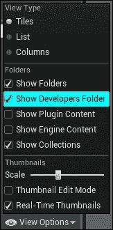

一旦你启用它，你将在**内容浏览器**中的**内容**文件夹下看到一个名为**开发者**的新文件夹：

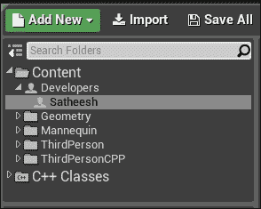

**开发者**文件夹内的文件夹名称自动设置为你的 Windows 用户名。如果你使用**源代码控制**（例如，Perforce 或 Subversion），那么你可以通过启用**其他开发者**复选框来查看“其他开发者”文件夹，该复选框位于**过滤器** | **其他过滤器**下：

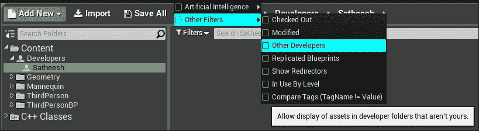

了解这些将大大帮助你当你在团队中工作或拥有大量资产时。

就像使用**内容浏览器**查找导入的资产一样，你使用**世界大纲**来查找放置在你关卡中的资产。你还可以使用**层**来组织放置在关卡中的资产。这两个窗口都可以从菜单栏中的**窗口**召唤：

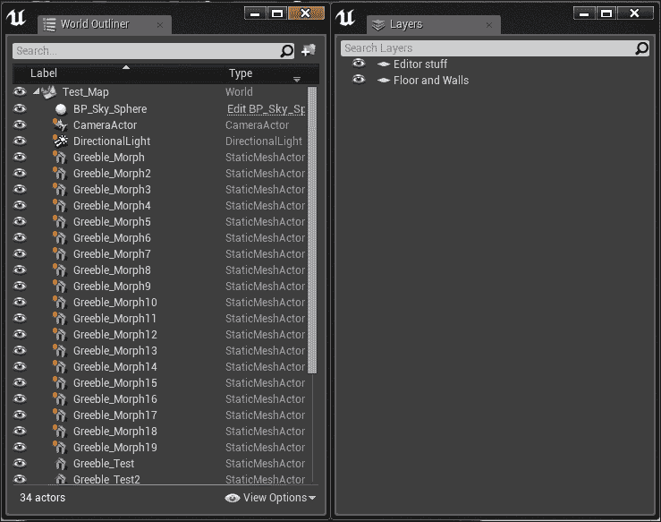

在第三章“材质”中，你学习了令人惊叹的**材质编辑器**和我们将使用的常见节点。一位优秀的材质艺术家可以完全改变你游戏的现实感。主要材料和后处理赋予你让游戏看起来逼真或卡通化的能力。我们学习的常见材质表达式不仅用于为资产着色。例如，创建以下材质网络并将其应用于一个简单的网格（例如，一个球体），看看会发生什么：

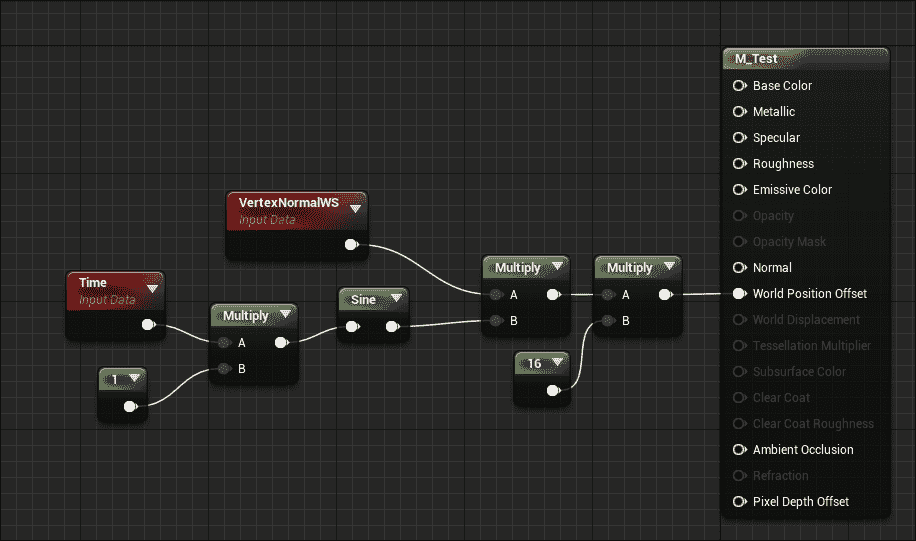

如果你发现自己多次使用特定的网络，那么创建一个材质函数来整理你的图并使其更有组织会更好。

随着你继续开发你的游戏，你最终将开始调整**后处理体积**。这让你可以修改游戏的整体外观和感觉。通过在蓝图或 C++中结合**后处理**，你甚至可以用来影响游戏玩法。一个完美的例子是来自蝙蝠侠阿卡姆系列游戏的侦探视野。你可以使用后处理中的材质来突出世界中的特定对象，甚至用它来渲染其他对象后面的网格的轮廓。

游戏的另一个关键部分是照明，它决定了最终的外观。在这本书中，你学习了不同的光照移动性，它们之间的区别包括常见的光照设置以及它如何影响游戏世界。你还学习了 Epic Games 开发的静态全局照明求解器 Lightmass 全局照明。

如您所知，Lightmass 用于烘焙光照，因此不支持动态光照。当您在游戏中使用 Lightmass 时，您需要确保所有静态网格（未设置为可移动的）都有一个第二 UV 通道，以便产生适当阴影。如果您想使用动态光照（这意味着在运行时可以改变其任何属性的光源——例如，白天和夜晚的循环），Epic 已经包含了**光传播体积**（**LPV**）的支持。在撰写本书时，LPV 处于实验阶段，尚未准备好投入生产。这里还有一件额外的事情值得提及，那就是可以改变反射光照的颜色。请看以下材质网络：

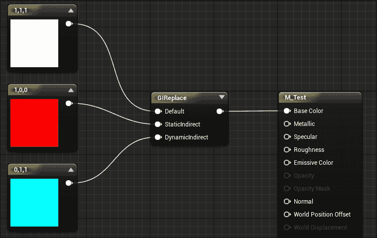

使用**GIReplace**材质节点，您可以改变反射光的颜色。如果您将前面的材质应用到网格上并使用 Lightmass 构建光照，反射光的颜色将变为红色而不是白色。即使我们不需要为反射光使用不同的颜色，我们仍然可以使用此节点在不调整 Lightmass 设置的情况下加深或变亮反射光照。

一旦我们完成了所有基本设置，我们就转向 Blueprints。**Blueprint 可视化脚本**是一个强大且灵活的基于节点的编辑器，它允许艺术家和设计师快速原型化他们的游戏。主要来说，我们处理两种常见的 Blueprint 类型，它们是**级别 Blueprint**和**类 Blueprint**。在这些 Blueprint 内部，我们有事件图、函数图和宏图。在**类 Blueprint**中，我们添加组件来定义该 Blueprint 是什么以及它们的运行方式。Blueprint 中的节点被应用了各种颜色，以指示它们是哪种类型的节点。一旦您开始使用 Blueprint，您就会熟悉所有节点颜色及其含义。我们看到了如何从一个`Actor`类创建**类 Blueprint**以及如何在游戏中动态生成它。我们还看到了如何通过**级别 Blueprint**与世界中的对象交互。我们在级别中放置了触发器，并在**级别 Blueprint**中为这些触发器创建了重叠事件，并学习了如何播放 Matinee 序列。

Matinee 是 Unreal Engine 4 中强大的工具之一，主要用于创建电影场景。您已经了解了 Matinee 用户界面以及如何创建一个基本的剪辑场景。由于 Matinee 与其他非线性视频编辑器类似，视频编辑专业人士很容易熟悉 Matinee。尽管 Matinee 用于电影场景，您也可以用它来创建与游戏玩法相关的元素，例如开门、电梯移动等。您甚至可以使用它将现有的电影场景导出为图像序列或 AVI 格式。

在学习完 Matinee 之后，我们继续到下一章学习**Unreal 运动图形**（**UMG**）。UMG 是由 Epic 开发的 UI 创作工具。使用 UMG，我们为玩家创建了一个简单的 HUD，并学习了如何与玩家蓝图通信以显示玩家的生命条。我们还为玩家制作了一个浮在角色头顶上的 3D 小部件。

从那里继续，你学习了更多关于级联粒子系统（Cascade Particle System）的知识。你了解了粒子编辑器以及级联编辑器内部可用的各种窗口。在掌握基础知识后，你创建了一个基本的粒子系统，包括使用 GPU Sprites 的碰撞。最后，我们将粒子系统带到了蓝图（Blueprints）中，并学习了如何使用自定义事件和延迟节点随机爆发粒子。

最后，我们深入到了 C++的神奇世界。在那里，你学习了 Visual Studio 2015 的各种版本以及如何下载 Visual Studio 2015 社区版。一旦我们安装了 IDE，我们就基于第三人称模板创建了一个新的 C++项目。从那里，我们扩展了它以包括我们角色类的生命值和生命值恢复。你还学习了如何将变量和函数暴露给蓝图以及如何在蓝图中访问它们。

# 打包项目

现在你已经学习了大多数 Unreal Engine 4 的基础知识，让我们看看如何打包你的游戏。在我们打包游戏之前，我们需要确保我们为游戏设置了一个默认地图，该地图将在你的打包游戏启动时加载。你可以从**项目设置**窗口设置**游戏默认地图**选项。例如，你可以将**游戏默认地图**选项设置为你的主菜单地图：

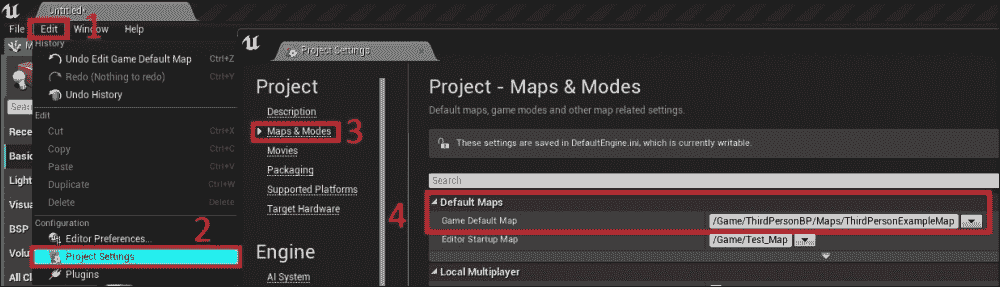

要为游戏设置默认地图，请按照以下步骤操作：

1.  点击**编辑**菜单。

1.  点击**项目设置**。

1.  选择**地图与模式**。

1.  在**游戏默认地图**中选择你的新地图。

## 快速打包

一旦你设置了**游戏默认地图**选项，你需要选择**构建配置**：

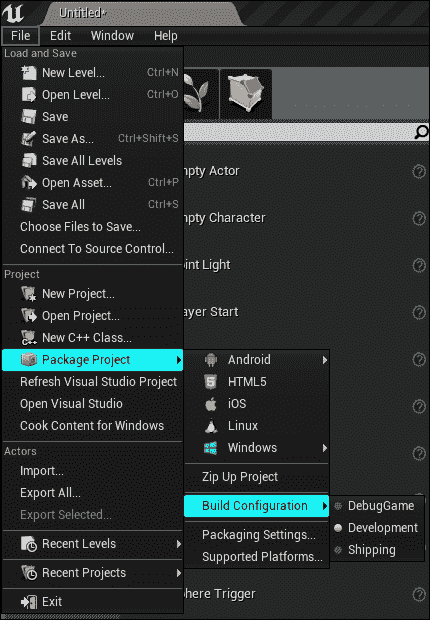

在打包项目时，有三种类型的构建配置可用：

+   `DebugGame`：这种配置将包含所有调试信息。出于测试目的，你可以使用这个配置。

+   `开发`：这种配置与`DebugGame`配置构建相比，由于调试支持最小化，因此提供了更好的性能。

+   `发布`：当你想要分发游戏时，应该选择这个设置。

一旦你选择了构建配置，你就可以从**文件** | **打包项目**进行游戏打包，然后选择你的平台。例如，这里是为**Windows 64 位**打包游戏的选项：

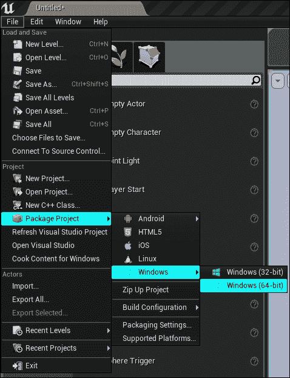

一旦选择该选项，编辑器可能会提示您选择一个目标目录以保存打包的游戏。一旦设置路径，编辑器将开始为所选平台构建和准备内容。如果打包成功，您将在之前设置的目录下看到打包的游戏。

## 打包发布版本

之前提到的方 法是用于快速打包和向最终用户分发游戏。然而，前面的方法不能构建您的游戏的 DLC 或补丁，因此在本节中，您将学习如何为您的游戏创建发布版本。

首先，让我们打开 **项目启动器** 窗口。**项目启动器** 提供了打包游戏的先进工作流程：

要创建自定义启动配置文件，请点击前面截图所示的增加（**+**）按钮。一旦点击，您将看到一个带有以下新设置的新窗口：

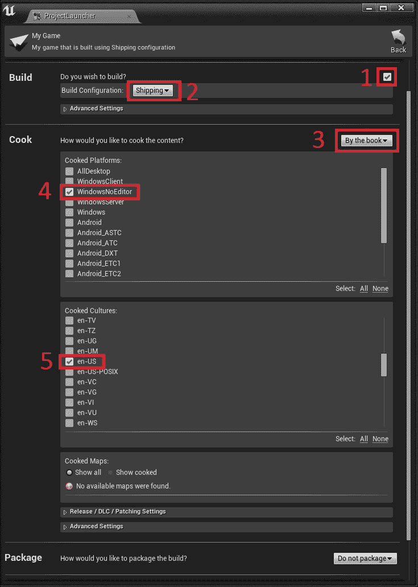

在前面的窗口中，执行以下操作：

1.  启用 **构建** 复选框。

1.  将 **构建配置** 选项设置为 **发布**。

1.  将下拉菜单设置为 **按书**。

1.  在本例中，我们选择了 **WindowsNoEditor** 以在 Windows 上进行测试。

1.  选择文化。这用于本地化。默认情况下，**en-US** 被选中。

完成所有这些设置后，展开 **发布/DLC/修补设置** 和 **高级设置** 部分：

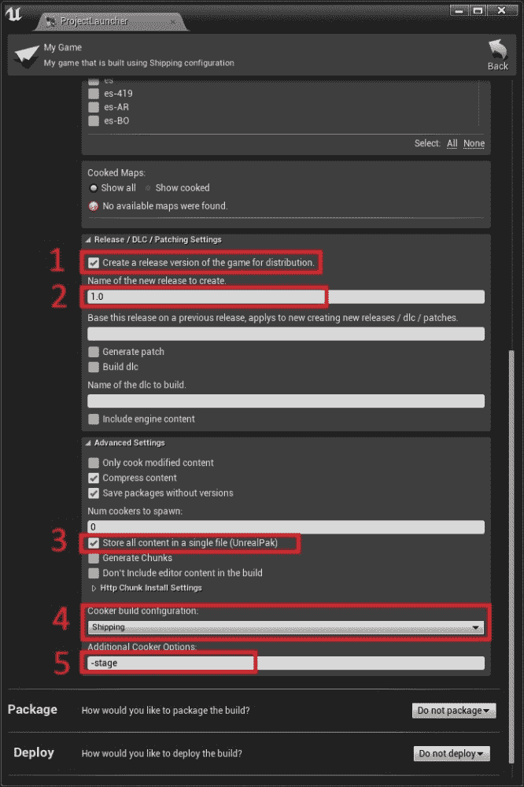

在这些部分中执行以下操作：

1.  启用 **创建用于分发的游戏发布版本**。

1.  将新发布版本的名称设置为 **1.0**。

1.  启用 **将所有内容存储在单个文件中（UnrealPak）**。

1.  将 **烹饪构建** **配置** 部分设置为 **发布**。

1.  将 `–stage` 命令行作为 **附加烹饪选项** 添加。请注意，在输入后不要按回车键。只需点击其他任何地方即可应用该命令。

设置完成后，将 **打包** 和 **部署** 的最后两个选项分别设置为 **不打包** 和 **不部署**：

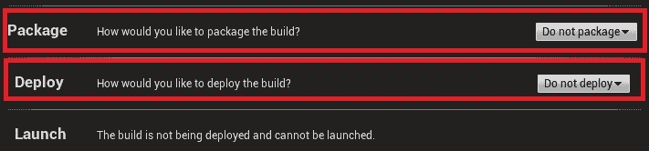

完成所有这些操作后，点击 **项目启动器** 窗口右上角的 **后退** 按钮，您将看到准备好的新配置文件，可以开始构建：

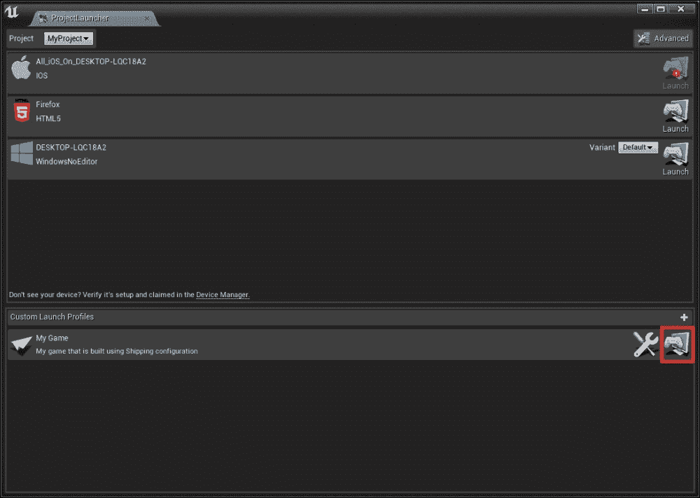

简单地点击 **启动** 按钮，**项目启动器** 将构建、准备和打包您的游戏。这可能会根据您游戏复杂度的大小而花费一些时间：

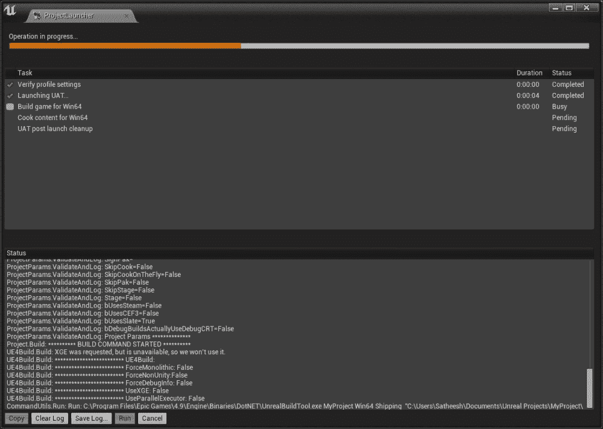

如果打包成功，您可以在 **项目启动器** 窗口中看到：

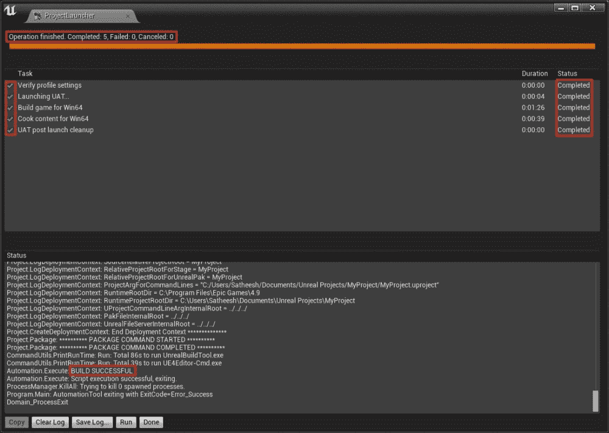

您可以在项目文件夹下的 **Saved** | **StagedBuilds** | **WindowsNoEditor** 文件夹中找到您的打包游戏。现在您可以向其他用户分发这个打包游戏。

# 摘要

在这本书中，您学习了虚幻引擎 4 的基础知识。我们与您一起开始这段旅程，学习了如何下载引擎以及如何导入您的资产。从那里，您学习了材质编辑器和它的常见方面。然后您学习了后期处理，如何使用灯光以及灯光在视频游戏中的重要性。您还学习了蓝图，这是虚幻引擎 4 的视觉脚本语言。我们从蓝图继续到 UMG，您可以使用它来创建游戏中任何类型的菜单。由于游戏如果没有视觉效果和场景将毫无意义，您学习了 Cascade 粒子编辑器和 Matinee。从那里，我们深入到 C++的世界，学习这种强大语言的基础。最后，您学习了如何打包游戏并将其分发给他人。

# 参考文献

您学习虚幻引擎 4 的旅程并不止于此。您可以通过访问以下链接来进一步扩展您的知识：

+   *虚幻引擎* *社区*

    [`forums.unrealengine.com/`](https://forums.unrealengine.com/)

+   *虚幻引擎* *官方 Twitch 直播*

    [`www.twitch.tv/unrealengine`](http://www.twitch.tv/unrealengine)

+   *虚幻引擎* *YouTube 频道*

    [`www.youtube.com/user/UnrealDevelopmentKit/videos`](https://www.youtube.com/user/UnrealDevelopmentKit/videos)

+   *虚幻引擎* *AnswerHub*

    [`answers.unrealengine.com/index.html`](https://answers.unrealengine.com/index.html)

+   *虚幻引擎* *官方文档*

    [`docs.unrealengine.com/latest/INT/GettingStarted/index.html`](https://docs.unrealengine.com/latest/INT/GettingStarted/index.html)
