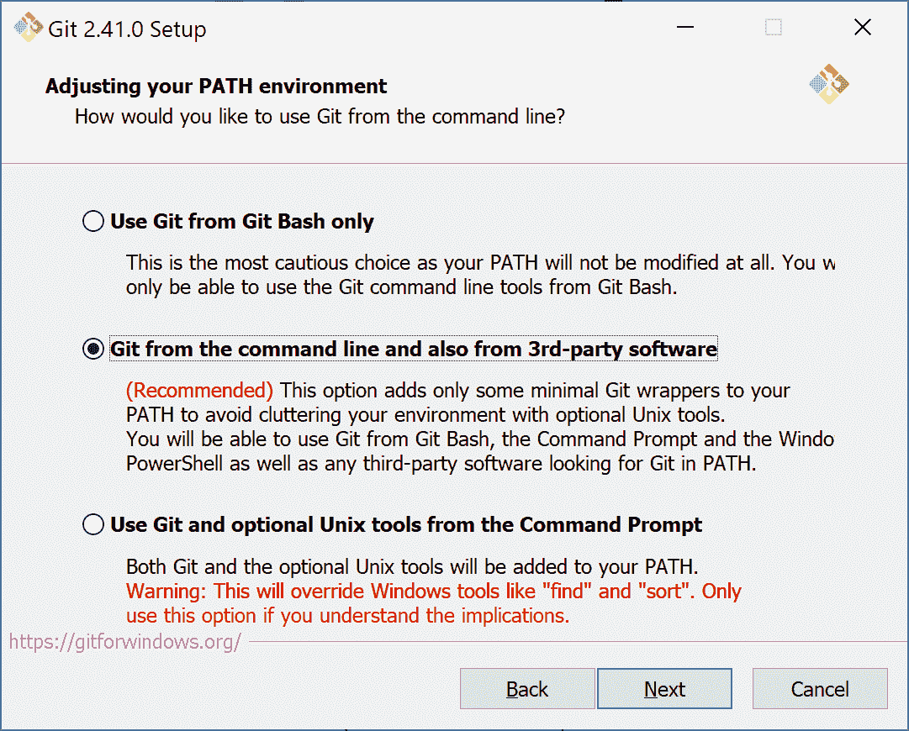
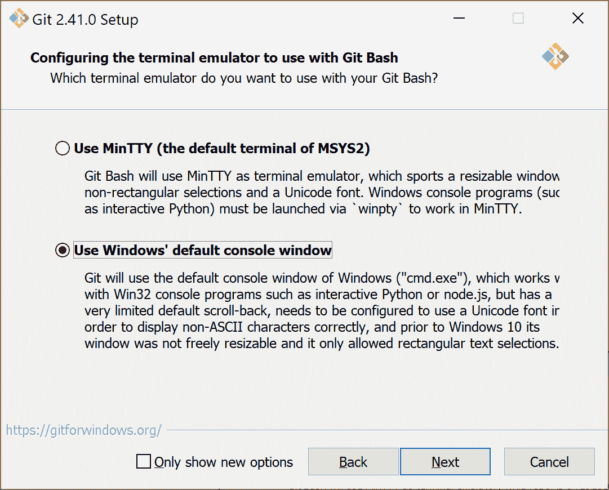
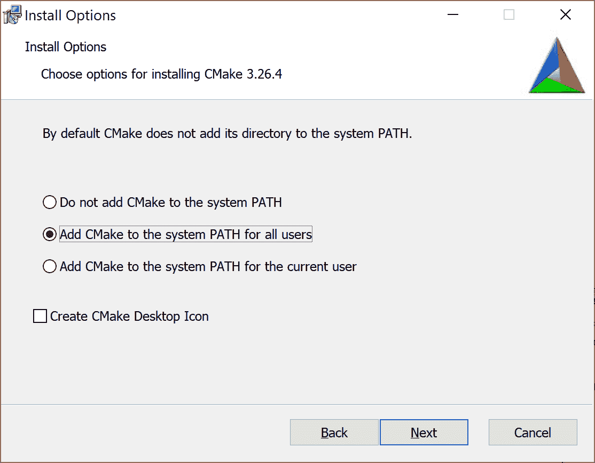
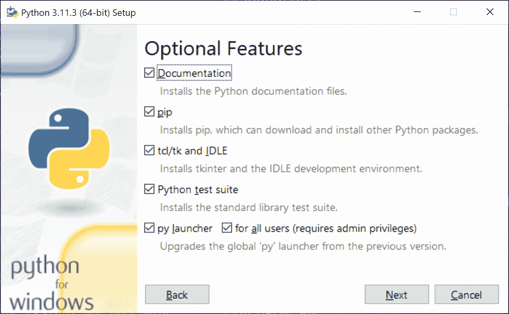
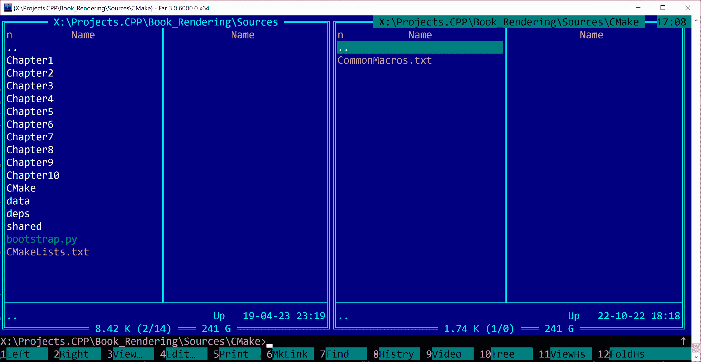
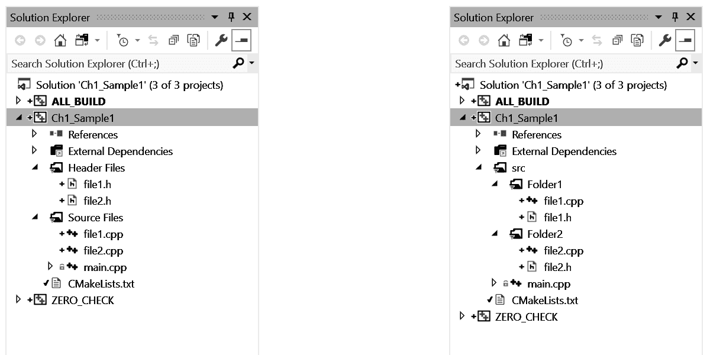
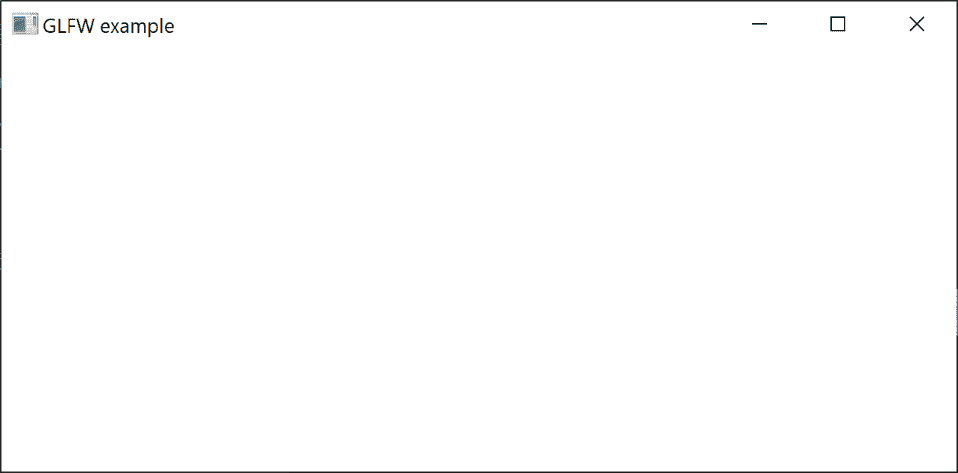
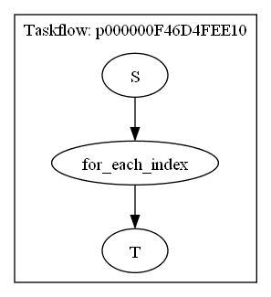

# 1 建立构建环境

## 加入我们的 Discord 书籍社区


[`packt.link/unitydev`](https://packt.link/unitydev)

在本章中，您将学习如何在 Windows 和 Linux 操作系统上设置 3D 图形开发环境。您将了解运行本书源代码包中的演示所需的软件工具：[`github.com/PacktPublishing/3D-Graphics-Rendering-Cookbook-Second-Edition`](https://github.com/PacktPublishing/3D-Graphics-Rendering-Cookbook-Second-Edition)。我们将涵盖以下主题：

+   在 Microsoft Windows 上设置我们的开发环境

+   在 Linux 上设置我们的开发环境

+   为 Microsoft Windows 和 Linux 安装 Vulkan SDK

+   管理依赖项

+   获取演示数据

+   为 CMake 项目创建实用工具

+   使用 GLFW 库

+   使用 Taskflow 进行多线程

## 在 Microsoft Windows 上设置我们的开发环境

在本食谱中，我们将从在 Windows 上设置我们的开发环境开始。我们将逐个详细安装每个必需的工具。

### 准备工作

为了在 Microsoft Windows 环境中开始使用本书的示例，您需要在系统中安装一些基本工具。

其中最重要的是 Microsoft Visual Studio 2022。其他工具包括 **Git** 版本控制系统、**CMake** 构建工具和 **Python** 编程语言。在整个本书中，我们仅在命令行上使用这些工具，因此不需要任何 GUI 扩展。

### 如何操作...

让我们逐个安装所需的每个工具。

#### Microsoft Visual Studio 2022

按照以下步骤安装 Microsoft Visual Studio 2022：

1.  打开 [`visualstudio.microsoft.com`](https://visualstudio.microsoft.com) 并下载 Visual Studio 2022 社区版安装程序。

1.  启动安装程序并按照屏幕上的说明操作。为了本书的目的，您需要一个适用于 64 位 Intel 平台的本地 C++ 编译器。Visual Studio 开发环境的其他组件不需要运行本书的捆绑示例代码。

#### Git

按照以下步骤安装 Git：

1.  从 [`git-scm.com/downloads`](https://git-scm.com/downloads) 下载最新的 Git 安装程序，运行它，并按照屏幕上的说明操作。

1.  我们假设 Git 已添加到系统 `PATH` 变量中。在安装过程中启用以下图像中显示的选项：

    

    图 1.1 – 从命令行和第三方软件中运行 Git

1.  选择 **使用 Windows 的默认控制台窗口**，如图下一张截图所示。此选项将允许您从计算机上的任何目录构建本书中的脚本。



图 1.2 – 使用 Windows 的默认控制台窗口

> Git 是一种复杂的软件，本身就是一个巨大的主题。我们推荐 Jakub Narębski 编写的《精通 Git》一书，由 Packt Publishing 出版，[`www.packtpub.com/application-development/mastering-git`](https://www.packtpub.com/application-development/mastering-git)，以及 François Dupire 编写的《Git 基础：Git 开发者指南》和可下载的电子书《ProGit》，第二版，由 Scott Chacon 和 Ben Straub 编写，[`git-scm.com/book/en/v2`](https://git-scm.com/book/en/v2)。

#### CMake

要安装 CMake，请按照以下步骤操作：

1.  从 [`cmake.org/download/`](https://cmake.org/download/) 下载最新的 64 位 CMake 安装程序。

1.  运行它并遵循屏幕上的说明。如果您已经安装了 CMake 的早期版本，建议首先卸载它。

1.  选择**将 CMake 添加到系统 PATH 以供所有用户使用**选项，如图所示：



图 1.3：将 CMake 添加到系统 PATH 以供所有用户使用

#### Python

要安装 Python，请按照以下步骤操作：

1.  从 [`www.python.org/downloads/`](https://www.python.org/downloads/) 下载适用于 64 位系统的最新 Python 3 安装程序。

1.  运行它并遵循屏幕上的说明。

1.  在安装过程中，您还需要安装 `pip` 功能。选择**自定义安装**并确保**pip**复选框被勾选，如图所示：

    

    图 1.4 – 自定义安装

1.  安装完成后，请确保将包含 `python.exe` 的文件夹添加到 PATH 环境变量中。

#### 更多...

除了 Git，还有其他流行的版本控制系统，如 SVN 和 Mercurial。在开发大型软件系统时，您不可避免地需要从非 Git 仓库下载一些库。我们建议熟悉 Mercurial。

在命令行环境中工作时，拥有一些来自 Unix 环境的工具很有用，如 `wget`、`grep`、`find` 等。**GnuWin32** 项目提供了这些工具的预编译二进制文件，可以从 [`gnuwin32.sourceforge.net`](http://gnuwin32.sourceforge.net) 下载。

此外，在 Windows 环境中，传统的文件管理器使文件操作变得容易得多。我们强烈建议尝试开源的 Far Manager。您可以从 [`farmanager.com`](https://farmanager.com) 下载它。它看起来像这样：



图 1.5 – Far Manager 的外观和感觉

## 在 Linux 上设置我们的开发环境

Linux 正在变得越来越吸引人，尤其是在 3D 图形开发领域，包括游戏技术。让我们来了解一下在 Linux 上开始使用本书所需的一系列活动工具。

### 准备工作

我们假设您已安装了基于 Debian 的 GNU/Linux 操作系统的台式电脑。我们还假设您熟悉 `apt` 软件包管理器。

要开始在 Linux 上开发现代图形程序，您需要安装支持 Vulkan 1.3 的最新视频卡驱动程序。要构建本书中的示例，需要一个支持 C++20 的 C++ 编译器。我们使用 Clang 和 GNU 编译器集合测试了我们的代码。

### 如何操作...

在基于 Debian 的系统上，安装过程很简单；然而，在安装任何必需的软件包之前，我们建议运行以下命令以确保您的系统是最新的：

```cpp
sudo apt-get update
```

让我们逐一检查必需的软件列表并安装任何缺失的软件。

1.  GCC 编译器

假设您已正确配置了 `apt` 软件包管理器，请运行以下命令来安装 GCC 编译器和相关工具。我们测试了 GCC 12：

```cpp
sudo apt-get install build-essential
```

1.  CMake

CMake 构建工具也存在于标准仓库中。要安装 CMake，请输入以下命令：

```cpp
sudo apt-get install cmake
```

> 本书中的代码示例需要 CMake 3.19 或更高版本。

1.  Git

要安装 Git 版本控制系统，请运行以下命令：

```cpp
sudo apt-get install git
```

1.  Python 3

要安装 Python 3 包，请运行以下命令：

```cpp
sudo apt-get install python3.7
```

Python 的确切版本可能因 Linux 发行版而异。本书中的脚本任何版本的 Python 3 都足够使用。

现在我们已经完成了基本软件包的安装，可以安装与图形相关的软件了。让我们继续到下一个菜谱，学习如何设置 Vulkan SDK。

## 安装 Windows 和 Linux 的 Vulkan SDK

在这个菜谱中，我们将学习如何开始使用 Vulkan SDK。我们将描述安装 Windows 和 Linux 的 LunarG Vulkan SDK 的要求和步骤。

在原则上，可以在没有 Vulkan SDK 的情况下编写 Vulkan 应用程序，只需使用 Khronos 提供的 C/C++ 头文件。您可以通过克隆 Git 仓库来获取这些头文件：[`github.com/KhronosGroup/Vulkan-Headers`](https://github.com/KhronosGroup/Vulkan-Headers)。然而，建议安装完整的 Vulkan SDK，以便能够使用 Vulkan 验证层和独立的 GLSL 编译器。

### 准备工作

确保您的操作系统有最新的视频卡驱动程序。在 Windows 上，您可以从 GPU 供应商的网站上下载视频驱动程序。对于 Ubuntu，请参阅文档：[`ubuntu.com/server/docs/nvidia-drivers-installation`](https://ubuntu.com/server/docs/nvidia-drivers-installation)。

### 如何操作...

要在 Linux 上安装 Vulkan 1.3，请按照以下步骤操作：

1.  在浏览器中打开 [`www.lunarg.com/vulkan-sdk/`](https://www.lunarg.com/vulkan-sdk/) 页面并下载适用于 Windows 或 Linux 的最新 Vulkan SDK。

1.  下载完成后，运行 Windows 安装程序文件并按照屏幕上的说明操作。如果您已安装 Ubuntu 22.04，请使用 LunarG 网站上提供的以下命令：

```cpp
wget -qO- https://packages.lunarg.com/lunarg-signing-key-pub.asc | sudo tee /etc/apt/trusted.gpg.d/lunarg.asc
sudo wget -qO /etc/apt/sources.list.d/lunarg-vulkan-1.3.250-jammy.list https://packages.lunarg.com/vulkan/1.3.250/lunarg-vulkan-1.3.250-jammy.list
sudo apt update
sudo apt install vulkan-sdk
```

1.  对于其他 Linux 发行版，您可能需要从[`vulkan.lunarg.com/sdk/home#linux`](https://vulkan.lunarg.com/sdk/home#linux)下载`.tar.gz` SDK 存档并手动解包。您需要设置环境变量以定位 Vulkan SDK 组件。使用`source`命令运行一个配置脚本，它会为您完成这项工作：

```cpp
source ~/vulkan/1.3.250.1/setup-env.sh
```

### 还有更多...

在开发跨平台应用程序时，使用每个平台上的类似工具是很好的。由于 Linux 支持 GCC 和 Clang 编译器，因此在 Windows 上使用 GCC 或 Clang 可以确保您避免最常见的可移植性问题。C 和 C++编译器的完整包可以从[`www.equation.com/servlet/equation.cmd?fa=fortran`](http://www.equation.com/servlet/equation.cmd?fa=fortran)下载。

在 Windows 上使用 GCC 的另一种方法是安装来自[`www.msys2.org`](https://www.msys2.org)的 MSYS2 环境。它具有在 Arch Linux 中使用的包管理系统，**Pacman**。

## 管理依赖项

本书中的示例使用了多个开源库。为了管理这些依赖项，我们使用了一个名为**Bootstrap**的免费和开源工具。该工具类似于 Google 的 repo 工具，并且可以在 Windows、Linux 以及 macOS 上使用。

在这个食谱中，我们将学习如何使用 Bootstrap 下载库，以 Vulkan Headers 仓库为例。

### 准备工作

确保您已按照前面的食谱安装了 Git 和 Python。之后，从 GitHub 克隆 Bootstrap 仓库：

```cpp
git clone https://github.com/corporateshark/bootstrapping
```

### 如何操作...

让我们查看源代码包并运行`bootstrap.py`脚本：

```cpp
bootstrap.py
```

脚本将开始下载编译和运行本书源代码包所需的全部第三方库。在 Windows 上，输出尾部的样子应该如下所示。

```cpp
Cloning into ‘M:\Projects.CPP\Book_Rendering\Sources\deps\src\assimp’...
remote: Enumerating objects: 25, done.
remote: Counting objects: 100% (25/25), done.
remote: Compressing objects: 100% (24/24), done.
remote: Total 51414 (delta 2), reused 10 (delta 1), pack-reused 51389
Receiving objects: 100% (51414/51414), 148.46 MiB | 3.95 MiB/s, done.
Resolving deltas: 100% (36665/36665), done.
Checking out files: 100% (2163/2163), done.
```

下载过程完成后，我们就可以开始构建项目了。

### 它是如何工作的...

**Bootstrap** 以 JSON 文件作为输入，默认情况下从当前目录打开`bootstrap.json`。它包含我们想要下载的库的元数据；例如，它们的名称、从哪里获取它们、要下载的特定版本，等等。除此之外，每个使用的库还可以有一些关于如何构建它的附加说明。这些可以是应用于原始库的补丁、解包说明、用于检查存档完整性的 SHA 散列，以及许多其他内容。

每个库的源代码可以表示为版本控制系统仓库的 URL 或包含库源文件的存档文件。

与一个库对应的典型 JSON 文件条目看起来像以下片段：

```cpp
[{
 “name”: “vulkan”,
 “source”: {
  “type”: “git”,
  “url”: “https://github.com/KhronosGroup/Vulkan-Headers.git”,
   “revision”: “v1.3.252”
 }
}]
```

字段 `type` 可以有以下这些值：`archive`、`git`、`hg` 或 `svn`。第一个值对应于存档文件，例如 `.zip`、`.tar.gz` 或 `.tar.bz2`，而最后三种类型描述了不同的版本控制系统存储库。`url` 字段包含要下载的存档文件的 URL 或存储库的 URL。`revision` 字段可以指定要检查出的特定修订版、标签或分支。

完整的 JSON 文件是此类条目的逗号分隔列表。对于这个配方，我们只下载一个库。我们将在下一章中添加更多库。附带的源代码包包含一个包含本书中使用的所有库的 JSON 文件。

### 更多...

该工具有详细的文档，详细描述了其他命令行选项和 JSON 字段。可以从 [`github.com/corporateshark/bootstrapping`](https://github.com/corporateshark/bootstrapping) 下载。

Bootstrap 工具不会区分源代码和二进制资源。所有用于您应用程序的纹理、3D 模型和其他资源也可以自动下载、更新和组织。

## 获取演示数据

本书尽可能地使用免费的 3D 图形数据集。大型 3D 数据集的完整列表由 Morgan McGuire 维护 – 计算机图形档案，2017 年 7 月 ([`casual-effects.com/data`](https://casual-effects.com/data))。我们将从他的存档中下载一些大型 3D 模型，在本书中用于演示目的。让我们下载并修补其中一个。

### 如何操作...

打包的源代码包含一个 Python 脚本 `deploy_deps.py`，它将自动下载所有必需的 3D 模型。要手动下载整个 Bistro 数据集，请按照以下简单步骤操作：

1.  在浏览器中打开 [`casual-effects.com/data/`](https://casual-effects.com/data/) 页面，并找到 **Amazon Lumberyard Bistro** 数据集。

1.  点击 **下载** 链接，并允许浏览器下载所有数据文件。下面是 Morgan McGuire 网站上的下载链接截图。


图 1.6 – Amazon Lumberyard Bistro，如图所示在 casualeffects.com 上以 2.4 GB 的下载量

## 为 CMake 项目创建实用工具

在这个配方中，我们将看到如何使用 CMake 配置本书中的所有代码示例，并在过程中学习一些小技巧。

> 对于刚开始使用 CMake 的人来说，我们建议阅读 Packt Publishing 出版的 *CMake Cookbook*（作者：Radovan Bast 和 Roberto Di Remigio）以及 Kitware 出版的 *Mastering CMake*（作者：Ken Martin 和 Bill Hoffman）。

### 准备工作

首先，让我们创建一个具有平凡 `main()` 函数的最小化 C++ 应用程序，并使用 CMake 构建：

```cpp
int main() {
  printf(“Hello World!\n”);
  return 0;
}
```

### 如何操作...

让我们介绍两个用于 CMake 的辅助宏。您可以在我们的源代码包的 `CMake/CommonMacros.txt` 文件中找到它们，源代码包位于 [`github.com/PacktPublishing/3D-Graphics-Rendering-Cookbook-Second-Edition`](https://github.com/PacktPublishing/3D-Graphics-Rendering-Cookbook-Second-Edition)。

1.  `SETUP_GROUPS` 宏遍历一个由空格分隔的 C 和 C++ 文件列表，无论是头文件还是源文件，并将它们各自分配到不同的组中。组名是根据每个单独文件的路径构建的。这样，我们在 Visual Studio 解决方案资源管理器窗口中的目录内得到了一个类似文件系统的良好结构，如图中右侧所示。

    

    图 1.7 – 没有分组（左）和有分组（右）

1.  宏首先遍历通过 `src_files` 参数传入的文件列表：

```cpp
macro(SETUP_GROUPS src_files)
  foreach(FILE ${src_files})
    get_filename_component(PARENT_DIR “${FILE}” PATH)
```

1.  我们将父目录名作为默认的组名。对于任何操作系统，将所有反斜杠字符替换为正斜杠：

```cpp
 set(GROUP “${PARENT_DIR}”)
    string(REPLACE “/” “\\” GROUP “${GROUP}”)
```

1.  然后，我们可以告诉 CMake 将当前文件分配到具有此名称的源组。

```cpp
 source_group(“${GROUP}” FILES “${FILE}”)
  endforeach()
endmacro()
```

1.  第二个宏 `SETUP_APP` 被用作创建具有所有我们希望拥有的标准属性的 CMake 项目的快捷方式。当需要处理许多非常相似的子项目时，这非常方便，例如，就像在这本书中一样。

```cpp
macro(SETUP_APP projname chapter)
  set(FOLDER_NAME ${chapter})
  set(PROJECT_NAME ${projname})
  project(${PROJECT_NAME} CXX)
```

1.  在设置项目名称后，这个宏使用 `GLOB_RECURSE` 函数将所有源文件和头文件收集到 `SRC_FILES` 和 `HEADER_FILES` 变量中。

```cpp
 file(GLOB_RECURSE SRC_FILES LIST_DIRECTORIES false
       RELATIVE ${CMAKE_CURRENT_SOURCE_DIR} src/*.c??)
  file(GLOB_RECURSE HEADER_FILES LIST_DIRECTORIES false
       RELATIVE ${CMAKE_CURRENT_SOURCE_DIR} src/*.h)
```

1.  在我们所有的代码示例中，我们将包含源文件的 `src` 目录也用作 `include` 目录。

```cpp
 include_directories(src)
```

1.  所有枚举的源文件和头文件都被添加到当前项目中的一个可执行文件中。

```cpp
 add_executable(${PROJ_NAME} ${SRC_FILES} ${HEADER_FILES})
```

1.  我们使用 *步骤 1* 中的 `SETUP_GROUP` 宏将每个源文件和头文件放置到项目内部适当的位置。

```cpp
 SETUP_GROUPS(“${SRC_FILES}”)
  SETUP_GROUPS(“${HEADER_FILES}”)
```

1.  接下来的三个属性为每个支持的构建配置设置了不同的可执行文件名。这些行是可选的，但在使用 Visual Studio IDE 与 CMake 一起使用时非常有用。原因是 Visual Studio 可以直接从 IDE 动态更改构建配置（或称为 CMake 中的“构建类型”），每个构建配置都可以有自己的输出文件名。我们给这些文件名添加后缀，以便它们可以在单个输出文件夹中共存。

```cpp
 set_target_properties(${PROJ_NAME}
    PROPERTIES OUTPUT_NAME_DEBUG ${PROJ_NAME}_Debug)
  set_target_properties(${PROJ_NAME}
    PROPERTIES OUTPUT_NAME_RELEASE ${PROJ_NAME}_Release)
  set_target_properties(${PROJ_NAME}
    PROPERTIES OUTPUT_NAME_RELWITHDEBINFO ${PROJ_NAME}_ReleaseDebInfo)
```

1.  由于我们在这本书中使用了 C++20，因此我们要求 CMake 启用它。

```cpp
 set_property(
    TARGET ${PROJ_NAME} PROPERTY CXX_STANDARD 20)
  set_property(
    TARGET ${PROJ_NAME} PROPERTY CXX_STANDARD_REQUIRED ON)
```

1.  为了便于使用 Visual Studio 进行调试，我们通过将应用程序类型更改为 `Console` 来启用控制台输出。我们还设置本地调试器的工作目录为 `CMAKE_SOURCE_DIR`，这将使查找资源变得更加直接和一致。还有一些针对 Apple 特定的属性，允许在 Mac 机器上构建源代码。

```cpp
 if(MSVC)
    add_definitions(-D_CONSOLE)
    set_property(TARGET ${PROJ_NAME} PROPERTY
      VS_DEBUGGER_WORKING_DIRECTORY “${CMAKE_SOURCE_DIR}”)
  endif()
  if(APPLE)
    set_target_properties(${PROJECT_NAME} PROPERTIES
      XCODE_GENERATE_SCHEME TRUE
      XCODE_SCHEME_WORKING_DIRECTORY “${CMAKE_SOURCE_DIR}”)
  endif()
endmacro()
```

1.  最后，我们第一个项目的顶级 `CMakeLists.txt` 文件将看起来像这样：

```cpp
cmake_minimum_required(VERSION 3.16)
project(Chapter01)
include(../../CMake/CommonMacros.txt)
SETUP_APP(Ch01_Sample01_CMake “Chapter 01”)
```

> 您可能会注意到上面的行`project(Chapter01)`被`SETUP_APP`宏内部的`project()`调用覆盖。这是由于以下 CMake 警告，如果不从一开始就声明一个新的项目，将会发出此警告。

```cpp
CMake Warning (dev) in CMakeLists.txt:
No project() command is present. The top-level CMakeLists.txt file must contain a literal, direct call to the project() command. Add a line of project(ProjectName) near the top of the file, but after cmake_minimum_required().
```

1.  要构建和测试可执行文件，创建`build`子文件夹，将工作目录更改为`build`，然后按以下方式运行 CMake：

    1.  对于 Windows 和 Visual Studio 2022，运行以下命令以配置我们的项目为 64 位目标平台架构。

```cpp
cmake .. -G “Visual Studio 17 2022” -A x64
```

1.  对于 Linux，我们可以使用以下方式的`Unix Makefiles` CMake 生成器。

```cpp
cmake .. -G “Unix Makefiles”
```

1.  要构建`release`构建类型的可执行文件，您可以在任何平台上使用以下命令。要构建调试版本，请使用`--config Debug`或完全跳过该参数。

```cpp
cmake --build . --config Release
```

所有源代码包中的演示应用程序都应该在`data/`子文件夹所在的文件夹中运行。

### 还有更多...

或者，您可以使用跨平台的构建系统 Ninja 以及 CMake。只需更改 CMake 项目生成器名称即可实现。

```cpp
cmake .. -G “Ninja”
```

从命令行调用 Ninja 来编译项目。

```cpp
ninja
[2/2] Linking CXX executable Ch01_Sample01_CMake.exe
```

注意现在构建速度有多快，与经典的`cmake --build`命令相比。有关更多详细信息，请参阅[`ninja-build.org`](https://ninja-build.org)。

现在，让我们看看如何与一些基本的开源库一起工作。

## 使用 GLFW 库

GLFW 库隐藏了创建窗口、图形上下文和表面以及从操作系统获取输入事件的全部复杂性。在本食谱中，我们使用 GLFW 和 Vulkan 构建了一个最小化的应用程序，以便在屏幕上显示一些基本的 3D 图形。

### 准备工作

我们使用 GLFW 3.4 构建我们的示例。以下是 Bootstrap 脚本的 JSON 片段，以便您可以下载正确的库版本：

```cpp
{
     “name”: “glfw”,
     “source”: {
           “type”: “git”,
           “url”: “https://github.com/glfw/glfw.git”,
           “revision”: “3.4”
     }
}
```

本食谱的完整源代码可以在源代码包中找到，名称为`Chapter01/02_GLFW`。

### 如何做到这一点...

让我们编写一个最小化的应用程序，该应用程序创建一个窗口并等待用户的`exit`命令——按 Esc 键。此功能将用于我们所有的后续演示，因此我们将其封装到在`shared/HelpersGLFW.h`中声明的辅助函数`initWindow()`中。让我们看看如何使用它来创建一个空白的 GLFW 窗口：

1.  包含所有必要的头文件并确定初始窗口尺寸：

```cpp
#include <shared/HelpersGLFW.h>
int main(void) {
  uint32_t width = 1280;
  uint32_t height = 800;
```

1.  调用`initWindow()`函数以创建窗口。`width`和`height`参数是通过引用传递的，调用之后将包含创建的窗口的实际工作区域。如果我们传递初始值`0`，则窗口将创建为占据整个桌面工作区域，没有重叠的任务栏。

```cpp
GLFWwindow* window =
  initWindow(“GLFW example”, width, height);
```

1.  对于此应用程序，主循环和清理是微不足道的：

```cpp
 while (!glfwWindowShouldClose(window)) {
    glfwPollEvents();
  }
  glfwDestroyWindow(window);
  glfwTerminate();
  return 0;
}
```

现在，我们将查看`initWindow()`的内部结构，以了解一些有趣的细节。

### 它是如何工作的...

让我们使用这个库来创建一个打开空窗口的应用程序：

1.  首先，我们通过 lambda 设置 GLFW 错误回调以捕获潜在的错误，然后初始化 GLFW：

```cpp
GLFWwindow* initWindow(const char* windowTitle,
  uint32_t& outWidth, uint32_t& outHeight) {
  glfwSetErrorCallback([](int error,
                          const char* description) {
    printf(“GLFW Error (%i): %s\n”, error, description);
  });
  if (!glfwInit())return nullptr;
```

1.  让我们决定是否要创建一个全屏桌面窗口。为非全屏窗口设置可调整大小的标志并检索所需的窗口尺寸。我们将手动初始化 Vulkan，因此不需要通过 GLFW 进行图形 API 初始化。标志`wantsWholeArea`确定我们是否想要一个真正的全屏窗口或一个不与系统任务栏重叠的窗口。

```cpp
 const bool wantsWholeArea = !outWidth || !outHeight;
  glfwWindowHint(GLFW_CLIENT_API, GLFW_NO_API);
  glfwWindowHint(GLFW_RESIZABLE,
    wantsWholeArea ? GLFW_FALSE : GLFW_TRUE);
  GLFWmonitor* monitor    = glfwGetPrimaryMonitor();
  const GLFWvidmode* mode = glfwGetVideoMode(monitor);
  int x = 0;
  int y = 0;
  int w = mode->width;
  int h = mode->height;
  if (wantsWholeArea) {
    glfwGetMonitorWorkarea(monitor, &x, &y, &w, &h);
  } else {
    w = outWidth;
    h = outHeight;
  }
```

1.  创建一个窗口并检索实际的窗口尺寸：

```cpp
 GLFWwindow* window = glfwCreateWindow(
    w, h, windowTitle, nullptr, nullptr);
  if (!window) {
    glfwTerminate();
    return nullptr;
  }
  if (wantsWholeArea) glfwSetWindowPos(window, x, y);
  glfwGetWindowSize(window, &w, &h);
  outWidth  = (uint32_t)w;
  outHeight = (uint32_t)h;
```

1.  设置默认的键盘回调以处理 Esc 键。一个简单的 lambda 可以为我们完成这项工作。

```cpp
 glfwSetKeyCallback(window, [](GLFWwindow* window,
    int key, int, int action, int) {
    if (key == GLFW_KEY_ESCAPE && action == GLFW_PRESS) {
      glfwSetWindowShouldClose(window, GLFW_TRUE);
    }
  });
  return window;
}
```

如果你运行这个小程序，它将创建一个空窗口，如下面的截图所示：



图 1.8 – 我们的第一个应用

### 更多内容...

关于如何使用 GLFW 的更多详细信息可以在[`www.glfw.org/documentation.xhtml`](https://www.glfw.org/documentation.xhtml)找到。

## 使用 Taskflow 进行多线程

现代图形应用程序要求我们利用多个 CPU 的强大功能以实现高性能。**Taskflow**是一个快速、仅包含头文件的 C++库，可以帮助您快速编写具有复杂任务依赖关系的并行程序。这个库非常有用，因为它允许您快速进入开发使用高级渲染概念（如帧图和多线程命令缓冲区生成）的多线程图形应用程序。

### 准备工作

在这里，我们使用 Taskflow 版本 3.7.0。您可以使用以下 Bootstrap 片段下载它：

```cpp
{
     “name”: “taskflow”,
     “source”: {
           “type”: “git”,
           “url”:
             “https://github.com/taskflow/taskflow.git”,
           “revision”: “v3.7.0”
     }
}
```

为了调试 Taskflow 生成的依赖图，建议您从[`www.graphviz.org`](https://www.graphviz.org)安装**GraphViz**工具。

本菜谱的完整源代码可以在`Chapter01/03_Taskflow`中找到。

### 如何实现...

让我们通过`for_each_index()`算法创建并运行一组并发依赖任务。每个任务将以并发方式从数组中打印单个值。处理顺序可能在不同程序的运行之间有所不同：

1.  包含`taskflow.hpp`头文件。`tf::Taskflow`类是创建任务依赖图的主要地方。声明一个实例和数据向量以进行处理。

```cpp
#include <taskflow/taskflow.hpp>
int main() {
  tf::Taskflow taskflow;
  std::vector<int> items{ 1, 2, 3, 4, 5, 6, 7, 8 };
```

1.  `for_each_index()`成员函数返回一个实现并行 for 循环算法的任务。我们指定范围`0..items.size()`和步长`1`。返回的`task`可用于同步目的：

```cpp
 auto task = taskflow.for_each_index(
    0u, static_cast<uint32_t>(items.size()), 1u, & {
      printf(“%i”, items[i]); }).name(“for_each_index”);
```

1.  在并行任务前后添加一些工作，以便我们可以在输出中查看`开始`和`结束`消息。让我们相应地称新的`S`和`T`任务：

```cpp
 taskflow.emplace([]() {
    printf(“\nS - Start\n”); }).name(“S”).precede(task);
  taskflow.emplace([]() {
    printf(“\nT - End\n”); }).name(“T”).succeed(task);
```

1.  将生成的任务依赖图保存为`.dot`格式，以便我们稍后可以使用 GraphViz 的`dot`工具进行处理：

```cpp
 std::ofstream os(“.cache/taskflow.dot”);
  taskflow.dump(os);
```

1.  现在我们可以创建一个`tf::executor`对象并运行构建的 Taskflow 图：

```cpp
 tf::Executor executor;
  executor.run(taskflow).wait();
  return 0;
}
```

这里要提到的一个重要部分是，依赖图只能构建一次。然后，它可以在每一帧中重复使用，以有效地运行并发任务。

前一个程序输出的内容应类似于以下列表：

```cpp
S – Start
18345672
T - End
```

在这里，我们可以看到我们的 `S` 和 `T` 任务。它们之间有多个线程，具有不同的 ID，并行处理 `items[]` 向量的不同元素。由于并发性，你的输出可能会有所不同。

### 还有更多...

应用程序将依赖图保存在 `taskflow.dot` 文件中。它可以通过 GraphViz，[`graphviz.org`](https://graphviz.org)，使用以下命令转换为可视表示：

```cpp
dot -Tpng taskflow.dot > output.png
```

生成的 `.png` 图片应类似于以下截图：



图 1.9 – for_each_index() 的 Taskflow 依赖图

当你调试复杂的依赖图（并为你的书籍和论文生成复杂外观的图片）时，此功能非常有用。

Taskflow 库的功能非常丰富，提供了众多并行算法和性能分析功能的实现。请参阅官方文档以获取深入覆盖，链接为 [`taskflow.github.io/taskflow/index.xhtml`](https://taskflow.github.io/taskflow/index.xhtml)。

让我们继续进入下一章，学习如何开始使用 Vulkan。
